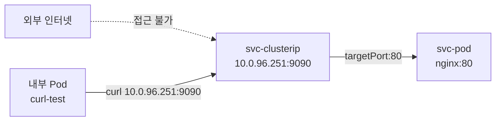
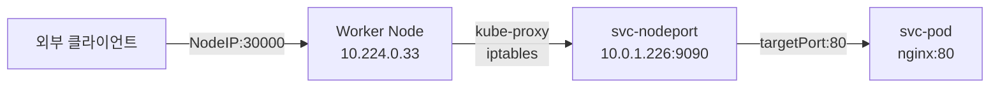
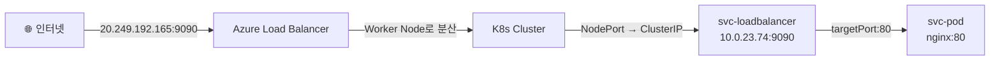
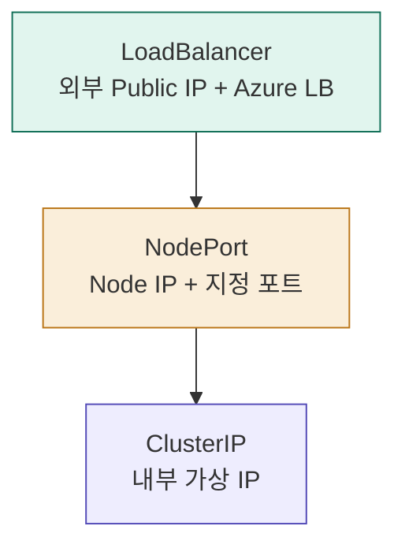
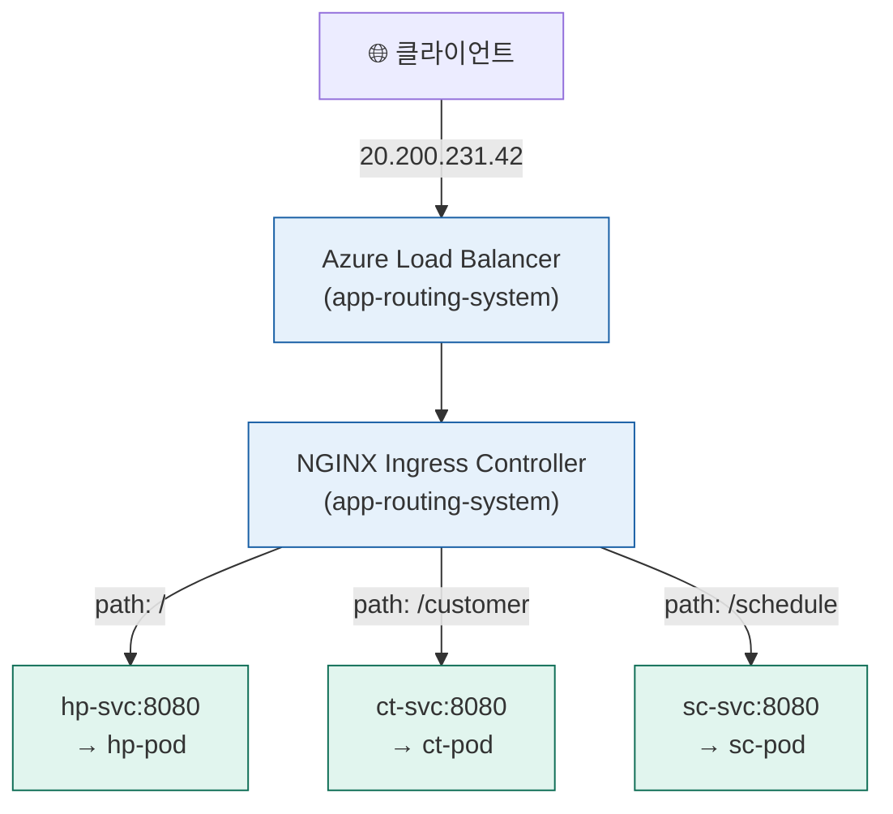
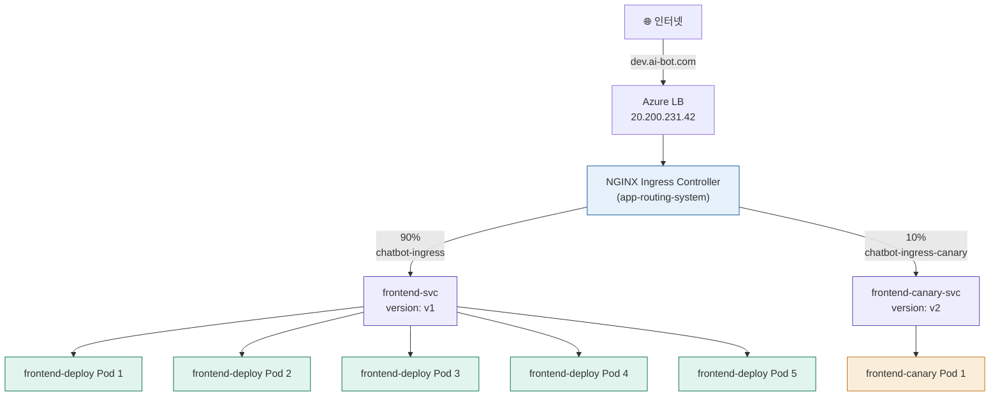
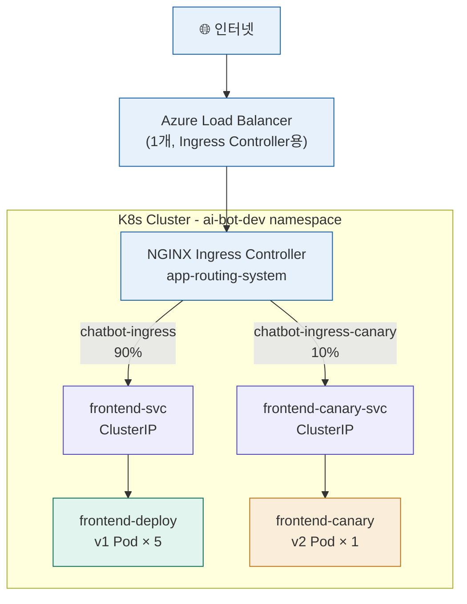

> **실습 환경:** Microsoft Azure Kubernetes Service (AKS) | Kubernetes v1.34.7 | 2026년 6월 기준

## 실습 문서

[**Lab 3 - Service 및 Ingress 라우팅**](https://psedu.gitbook.io/k8s-aiops-aks/lab-3-pod)

[**Kubernetes AIOps 실전.pdf**](https://drive.google.com/file/d/1aA2YTol6pRqIkpTyQs0GtZghoVqr7P0E/view?usp=sharing)


## 관련 문서

- [**Azure AKS 기반 Kubernetes AIOps — 클러스터 배포 및 워크로드 배포**](https://k82022603.github.io/posts/azure-aks-%EA%B8%B0%EB%B0%98-kubernetes-aiops-%ED%81%B4%EB%9F%AC%EC%8A%A4%ED%84%B0-%EB%B0%B0%ED%8F%AC-%EB%B0%8F-%EC%9B%8C%ED%81%AC%EB%A1%9C%EB%93%9C-%EB%B0%B0%ED%8F%AC/)
- **Azure AKS 기반 Kubernetes AIOps — Service 및 Ingress 라우팅**
- [**Azure AKS 기반 Kubernetes AIOps — Volume 과 StorageClass**](https://k82022603.github.io/posts/azure-aks-%EA%B8%B0%EB%B0%98-kubernetes-aiops-volume-%EA%B3%BC-storageclass/)
- [**Azure AKS 기반 Kubernetes AIOps — 특수 워크로드 관리**](https://k82022603.github.io/posts/azure-aks-%EA%B8%B0%EB%B0%98-kubernetes-aiops-%ED%8A%B9%EC%88%98-%EC%9B%8C%ED%81%AC%EB%A1%9C%EB%93%9C-%EA%B4%80%EB%A6%AC/)
- [**Azure AKS 기반 Kubernetes AIOps — 리소스 관리**](https://k82022603.github.io/posts/azure-aks-%EA%B8%B0%EB%B0%98-kubernetes-aiops-%EB%A6%AC%EC%86%8C%EC%8A%A4-%EA%B4%80%EB%A6%AC/)
- [**Azure AKS 기반 Kubernetes AIOps — 워크로드 배치 제어**](https://k82022603.github.io/posts/azure-aks-%EA%B8%B0%EB%B0%98-kubernetes-aiops-%EC%9B%8C%ED%81%AC%EB%A1%9C%EB%93%9C-%EB%B0%B0%EC%B9%98-%EC%A0%9C%EC%96%B4/)
- [**Azure AKS 기반 Kubernetes AIOps — 네트워크 정책**](https://k82022603.github.io/posts/azure-aks-%EA%B8%B0%EB%B0%98-kubernetes-aiops-%EB%84%A4%ED%8A%B8%EC%9B%8C%ED%81%AC-%EC%A0%95%EC%B1%85/)
- [**Azure AKS 기반 Kubernetes AIOps — kubernetes 고가용성**](https://k82022603.github.io/posts/azure-aks-%EA%B8%B0%EB%B0%98-kubernetes-aiops-kubernetes-%EA%B3%A0%EA%B0%80%EC%9A%A9%EC%84%B1/)
- [**Azure AKS 기반 Kubernetes AIOps — 모니터링**](https://k82022603.github.io/posts/azure-aks-%EA%B8%B0%EB%B0%98-kubernetes-aiops-%EB%AA%A8%EB%8B%88%ED%84%B0%EB%A7%81/)
- [**Azure AKS 기반 Kubernetes AIOps — AI 기반 tools**](https://k82022603.github.io/posts/azure-aks-%EA%B8%B0%EB%B0%98-kubernetes-aiops-ai-%EA%B8%B0%EB%B0%98-tools/)
- [**Azure AKS 기반 Kubernetes AIOps — 과정 평가 문제별 정답과 핵심 개념**](https://k82022603.github.io/posts/azure-aks-%EA%B8%B0%EB%B0%98-kubernetes-aiops-%EA%B3%BC%EC%A0%95-%ED%8F%89%EA%B0%80-%EB%AC%B8%EC%A0%9C%EB%B3%84-%EC%A0%95%EB%8B%B5%EA%B3%BC-%ED%95%B5%EC%8B%AC-%EA%B0%9C%EB%85%90/)

---

## 목차

1. [실습 환경 개요](#1-실습-환경-개요)
2. [Kubernetes Service 기초 개념](#2-kubernetes-service-기초-개념)
3. [ClusterIP — 클러스터 내부 통신의 기본](#3-clusterip--클러스터-내부-통신의-기본)
4. [NodePort — 노드 포트를 통한 외부 접근](#4-nodeport--노드-포트를-통한-외부-접근)
5. [LoadBalancer — 클라우드 네이티브 외부 노출](#5-loadbalancer--클라우드-네이티브-외부-노출)
6. [세 가지 Service 유형의 계층적 관계](#6-세-가지-service-유형의-계층적-관계)
7. [Ingress와 IngressClass](#7-ingress와-ingressclass)
8. [AKS Web App Routing 애드온](#8-aks-web-app-routing-애드온)
9. [경로 기반 라우팅 실습](#9-경로-기반-라우팅-실습)
10. [카나리 배포 (Canary Deployment)](#10-카나리-배포-canary-deployment)
11. [비용과 아키텍처 설계 원칙](#11-비용과-아키텍처-설계-원칙)
12. [NGINX Ingress의 미래 — Gateway API](#12-nginx-ingress의-미래--gateway-api)
13. [실습 중 발생한 주요 오류와 원인](#13-실습-중-발생한-주요-오류와-원인)
14. [전체 아키텍처 요약](#14-전체-아키텍처-요약)

---

### 📎 별첨

- [별첨 A. Service & Ingress 운영을 위한 Claude Code 프롬프트 모음](#별첨-a-service--ingress-운영을-위한-claude-code-프롬프트-모음)

---

## 1. 실습 환경 개요

이 문서는 Microsoft Azure의 관리형 쿠버네티스 서비스인 AKS(Azure Kubernetes Service) 환경에서 진행한 실습을 바탕으로 작성되었습니다. 실습은 크게 세 가지 주제로 구성됩니다.

첫 번째는 Kubernetes의 Service 오브젝트 세 가지 유형, 즉 ClusterIP, NodePort, LoadBalancer를 직접 생성하고 각각의 접근 방식과 트래픽 흐름을 검증하는 것이었습니다. 두 번째는 Ingress Controller를 활용하여 단일 로드밸런서로 여러 서비스를 URL 경로 기반으로 라우팅하는 실습이었습니다. 세 번째는 실제 운영 환경에서 자주 활용되는 카나리(Canary) 배포 전략을 Ingress의 어노테이션 기능을 이용해 구현하고, 트래픽이 실제로 10%만 신버전으로 분기되는지 검증하는 것이었습니다.

실습 클러스터는 Korea Central 리전에 위치한 AKS 클러스터로, `aks-nodepool1-12318778-vmss000000`과 `aks-nodepool1-12318778-vmss000001` 두 개의 Worker Node로 구성되어 있으며, 각 노드는 Ubuntu 22.04 LTS와 containerd 컨테이너 런타임을 사용합니다.

---

## 2. Kubernetes Service 기초 개념

### Pod의 불안정성과 Service의 필요성

Kubernetes에서 가장 작은 배포 단위는 Pod입니다. Pod는 하나 이상의 컨테이너를 묶어서 실행하는 단위인데, 본질적으로 일시적인(ephemeral) 존재입니다. 노드에 장애가 발생하거나, 리소스 부족으로 Pod가 강제 종료되거나, Deployment의 롤링 업데이트가 실행되는 경우 Pod는 삭제되고 새로운 Pod가 생성됩니다. 이때 새로 생성된 Pod에는 기존과 완전히 다른 IP 주소가 할당됩니다.

이런 구조에서 특정 Pod의 IP 주소를 직접 사용해 통신을 구성하면, Pod가 재생성되는 순간 통신이 단절됩니다. 10개의 Pod에 직접 IP를 연결한다면 하나의 Pod가 재시작될 때마다 해당 연결 설정을 업데이트해야 하는 문제가 생깁니다. 이것은 수십, 수백 개의 Pod가 동적으로 변하는 실제 운영 환경에서는 사실상 관리가 불가능한 수준의 복잡성을 만들어냅니다.

Service는 이 문제를 해결하기 위해 도입된 Kubernetes의 네트워크 추상화 계층입니다. Service는 Pod 앞단에 위치하는 고정된 진입점 역할을 합니다. Service는 자체적으로 고정 IP(ClusterIP)와 DNS 이름을 가지며, 이것은 Service가 삭제되지 않는 한 변하지 않습니다. Pod의 IP가 바뀌더라도 클라이언트는 항상 동일한 Service의 주소로 요청을 보내면 됩니다.

Service는 라벨 셀렉터(Label Selector)를 통해 자신이 트래픽을 전달할 Pod를 찾아냅니다. 예를 들어 `selector: app: svc`로 설정된 Service는 `app: svc` 라벨을 가진 모든 Pod로 트래픽을 분배합니다. Pod가 추가되거나 삭제될 때 Kubernetes의 Endpoints 컨트롤러가 이를 감지하여 Service의 Endpoints 목록을 자동으로 갱신합니다. 이 갱신된 Endpoints 정보는 kube-proxy가 읽어 iptables 또는 IPVS 규칙을 업데이트하는 데 사용됩니다.

### kube-proxy와 iptables

Service로 들어오는 트래픽이 실제 Pod로 전달되는 과정은 각 Worker Node에서 실행되는 `kube-proxy`가 담당합니다. kube-proxy는 Kubernetes API Server를 지속적으로 감시하다가 Service나 Endpoints 오브젝트에 변화가 생기면 해당 노드의 iptables 규칙을 갱신합니다. 클라이언트가 Service의 ClusterIP로 패킷을 보내면, 해당 패킷은 iptables의 DNAT 규칙에 의해 실제 Pod IP로 목적지가 변경(NAT)되어 전달됩니다. ClusterIP 자체는 어떤 네트워크 인터페이스에도 실제로 바인딩되지 않는 가상 IP이며, 이 트래픽 리다이렉션은 순전히 커널 수준의 iptables 규칙으로 처리됩니다.

---

## 3. ClusterIP — 클러스터 내부 통신의 기본

### 개념

ClusterIP는 Service를 생성할 때 `type` 필드를 별도로 지정하지 않으면 기본값으로 만들어지는 타입입니다. 이름 그대로 클러스터(Cluster) 내부에서만 유효한 IP 주소를 할당받습니다. 이 IP는 클러스터 외부에서는 절대로 라우팅되지 않으며, 오직 클러스터 내부의 Pod들만 접근할 수 있습니다.

### 실습에서 생성한 YAML

```yaml
apiVersion: v1
kind: Service
metadata:
  name: svc-clusterip
spec:
  selector:
    app: svc
  ports:
  - port: 9090
    targetPort: 80
  type: ClusterIP
```

이 YAML에서 `port: 9090`은 Service가 수신하는 포트이고, `targetPort: 80`은 Service가 트래픽을 전달할 Pod의 포트입니다. 즉, 외부에서 `svc-clusterip:9090`으로 요청을 보내면, Service가 이를 받아 연결된 Pod의 80번 포트로 전달합니다. 실습 결과 이 Service에는 `10.0.96.251`이라는 ClusterIP가 자동으로 할당되었습니다.

### 트래픽 흐름



### 검증 방법

ClusterIP는 외부에서 직접 접근할 수 없기 때문에, 검증을 위해 클러스터 내부에 별도의 테스트 Pod를 생성해야 합니다. 실습에서는 `curlimages/curl` 이미지를 사용한 임시 Pod를 생성해 접근을 테스트했습니다.

```bash
kubectl run curl-test --image=curlimages/curl --rm -it -- sh
# Pod 내부에서:
curl 10.0.96.251:9090
```

이 명령을 실행하면 nginx의 기본 웰컴 페이지 HTML이 반환되었으며, ClusterIP를 통한 내부 통신이 정상적으로 동작함을 확인할 수 있었습니다.

### 실무 사용 시나리오

ClusterIP는 외부에 노출할 필요가 없는 모든 내부 서비스에 사용됩니다. 마이크로서비스 아키텍처(MSA)에서 수십 개의 서비스가 서로 API를 호출하는 경우, 데이터베이스(MySQL, PostgreSQL)나 캐시 서버(Redis, Memcached), 메시지 큐(Kafka, RabbitMQ) 등이 대표적입니다. 외부에서 접근할 수 없으므로 보안 수준이 가장 높고, 추가 비용이 전혀 발생하지 않으며, Kubernetes의 DNS를 통해 `서비스명.네임스페이스.svc.cluster.local` 형태로 이름 기반 접근이 가능합니다.

---

## 4. NodePort — 노드 포트를 통한 외부 접근

### 개념

NodePort는 ClusterIP를 기반으로 하되, 클러스터를 구성하는 모든 Worker Node의 특정 포트를 외부에 개방하는 방식입니다. NodePort Service를 생성하면 ClusterIP가 자동으로 함께 만들어지고, 추가로 지정한 포트(nodePort)가 모든 노드에서 열립니다. Kubernetes에서 NodePort로 사용할 수 있는 포트 범위는 기본적으로 30000번부터 32767번까지로 제한되어 있습니다.

### 실습에서 생성한 YAML

```yaml
apiVersion: v1
kind: Service
metadata:
  name: svc-nodeport
spec:
  selector:
    app: svc
  ports:
  - port: 9090
    targetPort: 80
    nodePort: 30000
  type: NodePort
```

실습 결과 `svc-nodeport` 서비스는 ClusterIP `10.0.1.226`을 할당받았으며, 동시에 모든 Worker Node의 30000번 포트가 개방되었습니다.

### 트래픽 흐름



### AKS에서 NodePort 접근이 제한되는 이유

실습 중 흥미로운 현상이 발생했습니다. 호스트 터미널(점프서버)에서 `curl 10.224.0.33:30000`을 실행했을 때 응답이 없었지만, 클러스터 내부의 curl-test Pod에서 동일한 명령을 실행했을 때는 정상 응답이 왔습니다.

이것은 AKS의 네트워크 구조 때문입니다. AKS Worker Node에 할당된 `10.224.x.x` 대역의 IP는 Azure VNet(Virtual Network) 내부의 사설 IP입니다. 호스트 서버(점프서버)가 이 VNet에 속하지 않거나, 동일 VNet이라도 Network Security Group(NSG) 규칙이 30000번 포트 접근을 차단하고 있으면 외부에서 직접 도달할 수 없습니다. 반면 클러스터 내부의 Pod는 동일한 Azure VNet에 속하므로 Worker Node의 사설 IP에 직접 접근이 가능합니다.

```
[ 점프서버 ] ─── (VNet 밖 또는 NSG 차단) ──▶ 10.224.0.33:30000  ❌
[ 내부 Pod ] ─── (동일 VNet, 접근 가능) ──▶ 10.224.0.33:30000  ✅
```

### 실무 사용 시나리오

NodePort는 주로 On-premise 환경이나 개발·테스트 환경에서 활용됩니다. 클라우드 환경의 운영 서비스에서는 포트 범위 제한(30000~32767), 보안 그룹 설정의 복잡함, 노드 IP 직접 노출로 인한 보안 위험 등의 이유로 거의 사용하지 않습니다. NodePort는 LoadBalancer 타입을 사용할 수 없는 환경(금융권 내부망, 폐쇄망 환경 등)에서 임시 외부 접근 수단으로 활용됩니다.

---

## 5. LoadBalancer — 클라우드 네이티브 외부 노출

### 개념

LoadBalancer 타입은 클라우드 환경에서 외부 트래픽을 수신하기 위한 가장 표준적인 방법입니다. NodePort를 기반으로 하되, 클라우드 제공자의 로드밸런서를 자동으로 프로비저닝하고 Public IP를 할당받습니다. AKS 환경에서는 Azure Standard Load Balancer가 자동으로 생성됩니다.

### 실습에서 생성한 YAML

```yaml
apiVersion: v1
kind: Service
metadata:
  name: svc-loadbalancer
spec:
  selector:
    app: svc
  ports:
  - port: 9090
    targetPort: 80
  type: LoadBalancer
```

### External-IP 할당 과정

`kubectl create -f lab3-svc3.yaml`을 실행하면 즉시 Service 오브젝트가 생성되지만, External-IP는 처음에 `<pending>` 상태로 표시됩니다. 이것은 Kubernetes가 Azure API를 호출하여 실제 Azure Load Balancer 리소스와 Public IP를 프로비저닝하는 작업이 진행 중이기 때문입니다. 실습에서는 약 2분 후 `20.249.192.165`라는 Public IP가 할당되었으며, 이후 웹 브라우저에서 `http://20.249.192.165:9090`으로 직접 접근이 가능해졌습니다.

### 트래픽 흐름



### ICMP(ping)가 응답하지 않는 이유

실습 중 `ping 20.249.192.165`가 100% packet loss를 보이는 현상이 있었습니다. 이것은 Azure Load Balancer가 기본적으로 ICMP 프로토콜을 차단하기 때문입니다. Azure Load Balancer는 TCP/UDP 기반 트래픽만 처리하도록 설계되어 있으며, ICMP는 허용 목록에 없습니다. ping이 실패해도 HTTP(TCP 80) 등 실제 서비스 포트로는 정상 통신이 가능합니다.

### 실무 사용 시나리오

LoadBalancer 타입은 운영 환경에서 고객이 직접 접근하는 서비스에 사용됩니다. 고객 대면 웹사이트, REST API 엔드포인트, 모바일 앱 백엔드 등이 대표적입니다. 단, LoadBalancer Service를 만들 때마다 Azure Load Balancer 리소스가 하나씩 생성되어 시간당 비용이 발생합니다. 이 비용 문제를 해결하기 위해 실무에서는 Ingress Controller를 함께 활용합니다.

---

## 6. 세 가지 Service 유형의 계층적 관계

ClusterIP, NodePort, LoadBalancer는 독립적인 개념이 아니라 계층적으로 쌓이는 구조입니다.



NodePort를 생성하면 내부적으로 ClusterIP가 함께 생성됩니다. LoadBalancer를 생성하면 ClusterIP와 NodePort가 모두 함께 생성됩니다. 즉 LoadBalancer는 NodePort 위에, NodePort는 ClusterIP 위에 기능이 추가되는 방식입니다. 실습에서도 `kubectl get svc`로 확인했을 때 LoadBalancer 타입 Service가 NodePort 번호(`9090:31475/TCP`)를 함께 가지고 있는 것을 확인할 수 있었습니다.

| 항목 | ClusterIP | NodePort | LoadBalancer |
|---|---|---|---|
| 접근 범위 | 클러스터 내부만 | Node IP + 포트 | 인터넷 (Public IP) |
| External IP | 없음 | 없음 | 자동 할당 |
| 포트 범위 | 자유 설정 | 30000~32767 | 자유 설정 |
| AKS 비용 | 무료 | 무료 | Azure LB 비용 발생 |
| 보안 수준 | 높음 | 보통 | 별도 관리 필요 |

---

## 7. Ingress와 IngressClass

### Service만으로는 부족한 이유

운영 환경에서 서비스가 10개라면 각각 LoadBalancer Service를 만들 경우 Azure Load Balancer 10개, Public IP 10개가 생성됩니다. 관리 복잡도와 비용 모두 급격히 증가합니다. 또한 Service는 OSI 4계층(L4, 전송 계층)에서 동작하기 때문에 URL 경로나 도메인 이름 기반으로 트래픽을 분기하는 것이 불가능합니다. 예를 들어 `example.com/api`는 A 서비스로, `example.com/web`은 B 서비스로 보내는 라우팅은 LoadBalancer Service로는 구현할 수 없습니다.

Ingress는 이 두 가지 문제를 동시에 해결합니다. OSI 7계층(L7, 애플리케이션 계층)에서 HTTP/HTTPS 트래픽을 처리하며, URL 경로, 호스트 도메인, HTTP 헤더 등을 기반으로 복잡한 라우팅 규칙을 정의할 수 있습니다.

### Ingress 오브젝트와 Ingress Controller

Kubernetes에서 Ingress는 두 가지 구성요소로 이루어집니다. 하나는 사용자가 YAML로 정의하는 `Ingress` 오브젝트로, 어떤 URL 경로를 어느 Service로 보낼지 선언하는 규칙 집합입니다. 다른 하나는 Ingress Controller로, 이 규칙을 실제로 해석하고 실행하는 실체입니다. NGINX, Traefik, HAProxy 등 다양한 Ingress Controller 구현체가 있으며, Kubernetes 자체에는 기본 Ingress Controller가 내장되어 있지 않습니다.

Ingress 오브젝트만 생성해도 아무 일도 일어나지 않습니다. 반드시 클러스터에 Ingress Controller가 먼저 설치되어 있어야 합니다. Ingress Controller는 클러스터의 Ingress 오브젝트를 지속적으로 감시하다가, 새 Ingress가 생성되거나 변경되면 이를 자신의 설정(예: nginx.conf)에 반영합니다.

### IngressClass

클러스터 안에 여러 Ingress Controller가 공존할 수 있기 때문에, 특정 Ingress가 어떤 Controller에 의해 처리될지 지정해야 합니다. 이것이 IngressClass의 역할입니다. Ingress YAML의 `spec.ingressClassName` 필드에 IngressClass 이름을 지정하면 해당 Controller가 그 Ingress를 담당합니다.

실습에서 확인한 IngressClass:

```
NAME                                 CONTROLLER
webapprouting.kubernetes.azure.com   webapprouting.kubernetes.azure.com/nginx
```

이 IngressClass는 AKS의 Web App Routing 애드온이 설치될 때 자동으로 생성됩니다. 이름이 `webapprouting.kubernetes.azure.com`이며, 뒤에 `/nginx`가 붙어 내부적으로 NGINX 기반 Controller를 사용하고 있음을 명시합니다.

---

## 8. AKS Web App Routing 애드온

### 개념

Web App Routing은 AKS에서 공식적으로 지원하는 관리형 Ingress 솔루션입니다. Azure Portal에서 AKS 클러스터의 "서비스 및 수신" 메뉴에서 "수신"을 선택하고 "사용" 버튼을 클릭하면 활성화됩니다. 활성화 과정에서 "애플리케이션 라우팅 추가 기능"과 "비밀 저장소 CSI 드라이버"가 함께 설치됩니다.

### 설치 시 자동으로 생성되는 리소스

Web App Routing이 설치되면 `app-routing-system` 네임스페이스가 생성되고 그 안에 다음 리소스들이 자동으로 만들어집니다.

```
app-routing-system 네임스페이스
├── Deployment: nginx                    (NGINX 컨트롤러 Pod 2개로 실행)
├── Service: nginx (LoadBalancer)        (External IP 자동 할당)
├── Service: nginx-metrics (ClusterIP)  (Prometheus 메트릭 수집용)
└── HorizontalPodAutoscaler: nginx       (CPU 70% 기준 자동 확장)

클러스터 레벨
└── IngressClass: webapprouting.kubernetes.azure.com
```

실습에서 확인한 nginx LoadBalancer Service의 External IP는 `20.200.231.42`였으며, 이 IP 하나가 이후 모든 Ingress 트래픽을 수신하는 단일 진입점이 됩니다.

### NGINX 컨트롤러의 동작 방식

app-routing-system의 NGINX Pod들은 클러스터 전체의 Ingress 오브젝트를 지속적으로 감시합니다. 새로운 Ingress가 생성되면 NGINX는 자신의 내부 설정을 자동으로 갱신하여 해당 라우팅 규칙을 반영합니다. 사용자가 nginx.conf 파일을 직접 수정할 필요가 없으며, Ingress YAML만 생성하면 NGINX가 알아서 라우팅을 처리합니다. 트래픽은 항상 `20.200.231.42`(nginx LoadBalancer)로 들어와 NGINX가 Ingress 규칙에 따라 내부 ClusterIP Service로 전달합니다.

---

## 9. 경로 기반 라우팅 실습

### 구성 목표

세 개의 애플리케이션(Homepage, Customer, Schedule)을 각각 별도의 Pod와 ClusterIP Service로 배포하고, 하나의 Ingress로 URL 경로에 따라 적절한 서비스로 라우팅하는 구성을 실습했습니다.

### 생성한 리소스

| 앱 | Pod 이름 | Service 이름 | 이미지 | 경로 |
|---|---|---|---|---|
| Homepage | hp-pod | hp-svc:8080 | ghcr.io/wsjang619/home | `/` |
| Customer | ct-pod | ct-svc:8080 | ghcr.io/wsjang619/customer | `/customer` |
| Schedule | sc-pod | sc-svc:8080 | ghcr.io/wsjang619/schedule | `/schedule` |

### Ingress YAML

```yaml
apiVersion: networking.k8s.io/v1
kind: Ingress
metadata:
  name: lb-ingress
  annotations:
    nginx.ingress.kubernetes.io/rewrite-target: /
spec:
  ingressClassName: webapprouting.kubernetes.azure.com
  rules:
  - http:
      paths:
      - path: /
        pathType: Prefix
        backend:
          service:
            name: hp-svc
            port:
              number: 8080
      - path: /customer
        pathType: Prefix
        backend:
          service:
            name: ct-svc
            port:
              number: 8080
      - path: /schedule
        pathType: Prefix
        backend:
          service:
            name: sc-svc
            port:
              number: 8080
```

`nginx.ingress.kubernetes.io/rewrite-target: /` 어노테이션은 클라이언트가 `/customer`로 요청할 때 NGINX가 백엔드 서비스로 전달하기 전에 경로를 `/`로 재작성(rewrite)해주는 역할을 합니다. 이 설정이 없으면 백엔드 서비스가 `/customer` 경로를 처리할 수 없어 404 오류가 발생할 수 있습니다.

### 트래픽 흐름



---

## 10. 카나리 배포 (Canary Deployment)

### 카나리 배포란 무엇인가

카나리 배포(Canary Deployment)는 새로운 버전의 소프트웨어를 전체 사용자에게 한꺼번에 배포하는 대신, 먼저 소수의 사용자나 일부 트래픽에만 노출시켜 안정성을 검증한 뒤 점진적으로 배포 범위를 확대하는 전략입니다. 이름은 19세기 석탄 광산에서 유독가스를 조기에 감지하기 위해 카나리아 새를 데리고 들어가던 관행에서 유래했습니다.

이 전략은 새 버전에 예상치 못한 버그나 성능 문제가 있을 때 전체 서비스 장애로 이어지는 위험을 최소화합니다. 전체 트래픽의 10%만 신버전으로 라우팅하면, 문제 발생 시 피해 범위가 10%로 제한되며 즉시 트래픽을 0%로 줄여 롤백할 수 있습니다.

### 실습 시나리오

AI 챗봇 서비스의 프론트엔드를 v1에서 v2로 업그레이드하는 상황을 가정했습니다. v2가 출시되었지만 전체 사용자에게 한꺼번에 배포하기에는 위험이 크므로, 전체 트래픽의 10%만 v2로 라우팅하여 안정성을 검증하는 구성을 실습했습니다.

### 구성 요소

**v1 Deployment (기존 서비스):**

- 이름: `frontend-deploy`
- 이미지: `nginx:1.25-alpine`
- 복제본: 5개
- 라벨: `app: frontend`, `version: v1`
- 출력 문구: `<h1> Canary Test Version 1.0 </h1>`

기존 Deployment에 `command`와 `args`를 추가하여, 컨테이너 시작 시 nginx의 기본 `index.html`을 v1 문구로 교체한 뒤 nginx를 포그라운드로 실행하도록 했습니다.

```yaml
command:
- /bin/sh
- -c
args:
- "echo '<h1> Canary Test Version 1.0 </h1>' > /usr/share/nginx/html/index.html && nginx -g 'daemon off;'"
```

`nginx -g 'daemon off;'`는 컨테이너가 백그라운드로 빠져나가지 않도록 nginx를 포그라운드에서 실행하는 옵션입니다. Kubernetes는 컨테이너의 메인 프로세스(PID 1)가 종료되면 컨테이너가 종료된 것으로 간주합니다. 만약 nginx가 데몬 모드(daemon on)로 실행되어 백그라운드로 이동하면 PID 1 프로세스가 없어져 컨테이너가 즉시 종료되고, Kubernetes가 계속 재시작을 시도하는 CrashLoopBackOff 상태가 됩니다.

**v2 Deployment (카나리 버전):**

```yaml
apiVersion: apps/v1
kind: Deployment
metadata:
  name: frontend-canary
  namespace: ai-bot-dev
spec:
  replicas: 1
  selector:
    matchLabels:
      version: v2
  template:
    metadata:
      labels:
        app: frontend
        version: v2
    spec:
      containers:
      - name: frontend
        image: nginx:1.26-alpine
        command:
        - /bin/sh
        - -c
        args:
        - "echo '<h1> Canary Test Version 2.0 </h1>' > /usr/share/nginx/html/index.html && nginx -g 'daemon off;'"
```

v2 Deployment에는 `version: v2` 라벨이 반드시 `template.metadata.labels`에 포함되어야 합니다. 이 라벨이 있어야 카나리 전용 Service가 v2 Pod만 선택할 수 있습니다.

**라벨 설계:**

v1과 v2 Pod를 명확히 구분하기 위해 `version` 라벨을 활용했습니다. v1 Deployment에는 `version: v1`, v2 Deployment에는 `version: v2`를 부여했습니다. 이를 통해 각 Service의 Selector가 정확히 원하는 버전의 Pod만 선택할 수 있습니다.

| Pod | app 라벨 | version 라벨 | 포함되는 Service |
|---|---|---|---|
| frontend-deploy Pod × 5 | frontend | v1 | frontend-svc |
| frontend-canary Pod × 1 | frontend | v2 | frontend-canary-svc |

**v1 전용 Service:**

```yaml
apiVersion: v1
kind: Service
metadata:
  name: frontend-svc
  namespace: ai-bot-dev
spec:
  type: ClusterIP
  selector:
    version: v1
  ports:
  - port: 80
    targetPort: 80
```

**v2 전용 Service:**

```yaml
apiVersion: v1
kind: Service
metadata:
  name: frontend-canary-svc
  namespace: ai-bot-dev
spec:
  type: ClusterIP
  selector:
    version: v2
  ports:
  - port: 80
    targetPort: 80
```

### NGINX 카나리 어노테이션

NGINX Ingress Controller는 카나리 배포를 위한 전용 어노테이션을 지원합니다. 카나리 배포가 동작하려면 반드시 두 개의 Ingress가 쌍을 이루어야 합니다. 하나는 기본(Base) Ingress이고, 다른 하나는 카나리 Ingress입니다. 두 Ingress는 동일한 호스트 도메인을 사용해야 하며, 카나리 Ingress에만 어노테이션이 붙습니다.

**Base Ingress (정상 트래픽용):**

```yaml
apiVersion: networking.k8s.io/v1
kind: Ingress
metadata:
  name: chatbot-ingress
  namespace: ai-bot-dev
spec:
  ingressClassName: webapprouting.kubernetes.azure.com
  rules:
  - host: dev.ai-bot.com
    http:
      paths:
      - path: /
        pathType: Prefix
        backend:
          service:
            name: frontend-svc
            port:
              number: 80
```

**Canary Ingress (10% 트래픽용):**

```yaml
apiVersion: networking.k8s.io/v1
kind: Ingress
metadata:
  name: chatbot-ingress-canary
  namespace: ai-bot-dev
  annotations:
    nginx.ingress.kubernetes.io/canary: "true"
    nginx.ingress.kubernetes.io/canary-weight: "10"
spec:
  ingressClassName: webapprouting.kubernetes.azure.com
  rules:
  - host: dev.ai-bot.com
    http:
      paths:
      - path: /
        pathType: Prefix
        backend:
          service:
            name: frontend-canary-svc
            port:
              number: 80
```

`nginx.ingress.kubernetes.io/canary: "true"` 어노테이션은 NGINX Controller에게 "이 Ingress는 카나리 배포용이다"라고 선언합니다. 이 어노테이션이 있어야 NGINX가 Base Ingress와 카나리 Ingress를 하나의 쌍으로 인식하고 트래픽 분할을 시작합니다.

`nginx.ingress.kubernetes.io/canary-weight: "10"` 어노테이션은 전체 트래픽 중 몇 퍼센트를 카나리로 보낼지 지정합니다. 값은 문자열로 표현된 정수이며, 0~100 사이의 값을 가집니다.

### 트래픽 분할 아키텍처



### 트래픽 분할 검증

실습 환경에서 `dev.ai-bot.com`은 실제 DNS에 등록되지 않은 테스트 도메인이기 때문에, `/etc/hosts` 파일 수정이나 curl의 `--resolve` 옵션을 통해 직접 IP로 요청을 보내야 합니다. 실습 환경은 컨테이너 기반이어서 `sudo` 권한이 없었으므로, curl의 `--resolve` 옵션을 활용했습니다.

```bash
for i in $(seq 1 30); do
  curl -s --resolve dev.ai-bot.com:80:20.200.231.42 http://dev.ai-bot.com
  echo ""
done
```

검증 결과 30번의 요청 중 3번(10%)이 v2 응답을 반환했습니다. 어노테이션에 설정한 `canary-weight: "10"`이 정확히 동작한 것입니다.

```
<h1> Canary Test Version 1.0 </h1>  ← 1~18번째
<h1> Canary Test Version 2.0 </h1>  ← 19번째 (v2)
<h1> Canary Test Version 1.0 </h1>  ← 20~23번째
<h1> Canary Test Version 2.0 </h1>  ← 24번째 (v2)
<h1> Canary Test Version 1.0 </h1>  ← 25~27번째
<h1> Canary Test Version 2.0 </h1>  ← 28번째 (v2)
<h1> Canary Test Version 1.0 </h1>  ← 29~30번째
```

카나리 배포 검증 이후에는 `canary-weight` 값을 점진적으로 높여가며 트래픽을 늘려갑니다. 안정성이 완전히 확인되면 Base Ingress의 백엔드를 v2 Service로 교체하고 카나리 Ingress를 삭제하는 방식으로 완전 배포를 마무리합니다.

---

## 11. 비용과 아키텍처 설계 원칙

### LoadBalancer Service와 Ingress의 비용 비교

Kubernetes에서 외부 트래픽을 처리하는 방식에 따라 클라우드 비용이 크게 달라집니다. AKS 환경에서 `type: LoadBalancer`로 Service를 생성하면 Azure Standard Load Balancer 리소스가 하나 생성됩니다. Azure는 이에 대해 로드밸런싱 규칙 단위와 데이터 처리량에 따라 시간당 요금을 청구합니다.

서비스가 10개라면 Azure Load Balancer도 10개, Public IP도 10개가 필요해 비용이 10배로 증가합니다. 반면 Ingress를 사용하면, Ingress Controller 역할의 nginx Service(LoadBalancer) 1개만 존재하고 나머지 서비스들은 모두 ClusterIP로 유지됩니다. 아무리 많은 Ingress 라우팅 규칙을 추가해도 Azure Load Balancer는 여전히 1개입니다.

```
[ LoadBalancer Service 방식 ]
서비스 A  →  Azure LB 1개  (비용 발생)
서비스 B  →  Azure LB 1개  (비용 발생)
서비스 C  →  Azure LB 1개  (비용 발생)
            ▶ Azure LB 3개 비용

[ Ingress 방식 ]
NGINX Controller  →  Azure LB 1개  (비용 발생)
  ├── /         →  서비스 A (ClusterIP, 무료)
  ├── /b        →  서비스 B (ClusterIP, 무료)
  └── /c        →  서비스 C (ClusterIP, 무료)
            ▶ Azure LB 1개 비용만 발생
```

### 실무 아키텍처 가이드

대부분의 운영 AKS 환경에서는 처음부터 Ingress Controller를 도입하고 내부 서비스들은 모두 ClusterIP로 유지하는 것이 표준 패턴입니다. 다음과 같은 경우에만 개별 LoadBalancer Service를 사용합니다.

- 특정 서비스가 독립적인 Public IP가 필요한 경우
- L4 수준의 TCP/UDP 처리가 필요한 경우 (게임 서버 UDP, 데이터베이스 직접 외부 접근 등)
- 보안상 완전히 격리된 엔드포인트가 필요한 경우

---

## 12. NGINX Ingress의 미래 — Gateway API

### NGINX Ingress Controller 지원 종료 발표

2025년 11월, Kubernetes SIG Network과 Security Response Committee는 오픈소스 Ingress NGINX 프로젝트의 공식 유지보수가 2026년 3월에 종료된다고 발표했습니다. Ingress NGINX는 Kubernetes 커뮤니티에서 가장 널리 사용되던 Ingress Controller였지만, 유지보수 인력 부족과 설계상의 보안 취약점 문제로 인해 지속적인 관리가 어려워졌기 때문입니다.

AKS의 경우, Microsoft는 AKS Web App Routing 애드온의 NGINX Ingress 리소스에 대해 2026년 11월까지 중요 보안 패치를 공식 지원하겠다고 발표했습니다. 현재 시점(2026년 6월)에서 이 실습 환경은 여전히 공식 지원 범위 안에 있습니다.

### Gateway API로의 전환

Kubernetes 커뮤니티와 Microsoft 모두 장기적인 표준으로 Gateway API를 지목하고 있습니다. Gateway API는 기존 Ingress API의 한계를 극복하기 위해 설계된 차세대 네트워킹 표준으로, GatewayClass, Gateway, HTTPRoute 등의 계층적 리소스 구조를 통해 더 명확한 역할 분리와 강력한 확장성을 제공합니다.

Microsoft는 Istio 기반의 새로운 App Routing 애드온을 2026년 상반기에 출시할 예정이라고 발표했으며, 이 새 애드온은 Gateway API만을 지원하게 됩니다. 또한 Application Gateway for Containers(AGC)가 2025년 11월 정식 출시되어 WAF(Web Application Firewall)를 포함한 Gateway API 기반 Ingress 솔루션으로 주목받고 있습니다.

현재 AKS Web App Routing NGINX를 사용하는 환경은 2026년 11월까지는 공식 지원이 유지되므로 즉각적인 마이그레이션이 필요하지는 않지만, 장기적으로 Gateway API 기반 솔루션으로 전환 계획을 수립하는 것이 권장됩니다.

---

## 13. 실습 중 발생한 주요 오류와 원인

### YAML 들여쓰기 오류 (`spec.selector.template`)

Deployment YAML에서 `template` 필드가 `selector` 블록 안에 들어가는 구조적 오류가 발생했습니다.

```yaml
# ❌ 잘못된 구조
spec:
  selector:
    matchLabels:
      version: v2
    template:          # selector의 자식으로 들어감
      ...

# ✅ 올바른 구조
spec:
  selector:
    matchLabels:
      version: v2
  template:            # selector와 동등한 레벨
    ...
```

YAML에서 들여쓰기(indentation)는 문법이 아닌 구조 자체를 정의합니다. 한 칸 차이로 전혀 다른 계층 관계가 만들어지며, Kubernetes는 이를 엄격하게 검사하므로 `strict decoding error`가 발생합니다.

### `kind: pod` 소문자 오류

Kubernetes의 `kind` 필드 값은 대소문자를 정확히 지켜야 합니다. `Pod`, `Service`, `Deployment`, `Ingress` 모두 첫 글자가 대문자이며, 소문자로 작성하면 해당 Kind가 등록되지 않았다는 오류가 발생합니다.

```
Error: no kind "pod" is registered for version "v1"
→ kind: Pod  로 수정 필요
```

### `chatbot-ingress` 사전 생성 누락

미션 4에서 카나리 Ingress를 생성했지만 Base Ingress(`chatbot-ingress`)가 존재하지 않아 External IP가 할당되지 않는 현상이 있었습니다. NGINX 카나리 메커니즘은 반드시 동일한 호스트 도메인을 가진 Base Ingress가 먼저 존재해야 합니다. Base Ingress가 없으면 NGINX가 카나리 Ingress를 인식하지 못하고 처리하지 않습니다.

---

## 14. 전체 아키텍처 요약

이 실습에서 구성한 전체 아키텍처를 아래에 요약합니다.



이 구성에서 핵심은 클라우드 비용이 발생하는 Azure Load Balancer가 단 1개뿐이라는 점입니다. 모든 서비스는 ClusterIP 타입으로 클러스터 내부에만 존재하고, 외부 트래픽 처리는 NGINX Ingress Controller가 전담합니다. 카나리 배포 역시 새로운 Load Balancer 없이 기존 NGINX의 어노테이션 기능만으로 구현됩니다. 이것이 Kubernetes에서 Ingress를 사용하는 가장 근본적인 이유이자, 실무에서 권장되는 아키텍처 패턴입니다.

---

*작성일: 2026-06-08*  
*실습 환경: Azure Kubernetes Service (AKS) | Korea Central | Kubernetes v1.34.7*  
*참고: AKS Web App Routing NGINX는 2026년 11월까지 Microsoft 공식 지원. 이후 Gateway API 기반 솔루션으로의 전환을 권장.*

---

## 별첨 A. Service & Ingress 운영을 위한 Claude Code 프롬프트 모음

이 별첨은 오늘 진행한 실습(Task 1 Service / Task 2 Ingress / Task 3 카나리 배포)의 시나리오를 직접 참고하여 작성된 Claude Code 프롬프트 모음입니다. 각 프롬프트는 실제 발생 가능한 상황과 구체적인 샘플 로그를 포함하고 있어, 붙여넣기 후 실제 값만 교체하여 바로 사용할 수 있습니다.

---

### A-1. Service YAML 자동 생성 프롬프트

**사용 시점:** 새로운 Service를 처음 만들 때, 또는 여러 타입의 Service YAML을 빠르게 생성할 때

```
AKS 환경에서 Kubernetes Service YAML을 생성해줘.

[환경 정보]
- 클러스터: AKS (Azure Kubernetes Service)
- 네임스페이스: ai-bot-dev

[생성 요구사항]
- 서비스 이름: frontend-svc
- 서비스 타입: ClusterIP
- 셀렉터 라벨: version=v1
- 서비스 포트(port): 80
- 타겟 포트(targetPort): 80

생성된 YAML과 함께 아래 항목도 알려줘:
1. kubectl create 명령어
2. Endpoints 연결 확인 명령어
3. 이 서비스가 선택하는 Pod의 조건
```

---

### A-2. Ingress 경로 기반 라우팅 YAML 생성 프롬프트

**사용 시점:** 여러 서비스를 하나의 Ingress로 묶어 경로 기반 라우팅을 구성할 때 (Task 2 시나리오)

```
AKS Web App Routing(NGINX) 환경에서 경로 기반 라우팅 Ingress YAML을 생성해줘.

[환경 정보]
- IngressClass: webapprouting.kubernetes.azure.com
- 네임스페이스: default

[라우팅 규칙]
- / → hp-svc:8080 (Homepage 앱)
- /customer → ct-svc:8080 (Customer 앱)
- /schedule → sc-svc:8080 (Schedule 앱)

[조건]
- 각 경로로 들어오는 요청은 백엔드 서비스에 /로 rewrite되어야 함
- pathType은 Prefix로 설정

생성된 YAML과 함께 아래 항목도 알려줘:
1. kubectl create 명령어
2. External IP 확인 명령어
3. 각 경로 접속 테스트 curl 명령어
```

---

### A-3. Ingress 트러블슈팅 프롬프트

**사용 시점:** Ingress 생성 후 External IP가 할당되지 않거나, 특정 경로 접속이 안 될 때

```
아래 AKS Ingress 환경에서 문제가 발생했어. 원인을 분석하고 해결 방법을 알려줘.

[증상]
Ingress를 생성했는데 ADDRESS 필드가 비어있고, 10분이 지나도 External IP가 할당되지 않음

[kubectl get ingress -n default 결과]
NAME                     CLASS                                HOSTS            ADDRESS   PORTS   AGE
chatbot-ingress-canary   webapprouting.kubernetes.azure.com   dev.ai-bot.com             80      10m

[kubectl get ingress -A 결과]
No resources found

[kubectl get svc -n app-routing-system 결과]
NAME            TYPE           CLUSTER-IP     EXTERNAL-IP     PORT(S)                      AGE
nginx           LoadBalancer   10.0.245.83    20.200.231.42   80:30221/TCP,443:30912/TCP   35m
nginx-metrics   ClusterIP      10.0.241.162   <none>          10254/TCP                    35m

[환경 정보]
- 클러스터: AKS
- Ingress Controller: AKS Web App Routing (NGINX)
- 생성 목적: canary-weight: "10" 어노테이션으로 10% 트래픽을 v2로 분기하려 함

확인할 사항:
1. ADDRESS가 비어있는 근본 원인
2. NGINX 카나리 메커니즘이 동작하려면 반드시 필요한 전제 조건
3. 해결을 위해 추가로 생성해야 할 리소스 목록과 YAML
```

---

### A-4. 카나리 배포 구성 프롬프트

**사용 시점:** Task 3 시나리오처럼 신버전을 일부 트래픽에만 노출하는 카나리 배포를 처음 구성할 때

```
AKS NGINX Ingress를 활용한 카나리 배포를 구성해줘.

[시나리오]
- 서비스명: AI 챗봇 프론트엔드
- 네임스페이스: ai-bot-dev
- 도메인: dev.ai-bot.com
- IngressClass: webapprouting.kubernetes.azure.com

[현재 운영 중인 구버전(v1)]
- Deployment 이름: frontend-deploy
- 복제본: 5개
- 이미지: nginx:1.25-alpine
- 라벨: app=frontend, version=v1
- 연결 Service: frontend-svc (ClusterIP, port 80)

[배포할 신버전(v2)]
- Deployment 이름: frontend-canary
- 복제본: 1개
- 이미지: nginx:1.26-alpine
- 카나리 트래픽 비율: 10%

아래 항목을 순서대로 생성해줘:
1. v2 Deployment YAML (frontend-canary.yaml)
   - 시작 시 /usr/share/nginx/html/index.html을 "<h1> Canary Test Version 2.0 </h1>"으로 교체 후 nginx 실행
2. v2 전용 ClusterIP Service YAML (frontend-canary-svc.yaml)
   - selector: version=v2, port 80/80
3. 카나리 Ingress YAML (chatbot-ingress-canary.yaml)
   - canary: "true", canary-weight: "10"
4. 각 리소스 배포 후 확인 명령어
5. 트래픽 분할 검증을 위한 curl 반복 명령어 (30회)
```

---

### A-5. Endpoints 연결 진단 프롬프트

**사용 시점:** Service를 생성했는데 curl이 타임아웃되거나, Endpoints가 비어있을 때 (Task 1 ClusterIP 시나리오 참고)

```
AKS 환경에서 Service에 Endpoints가 연결되지 않아 통신이 안 되고 있어.
원인을 분석하고 해결 방법을 알려줘.

[kubectl get pod -n default 결과]
NAME      READY   STATUS    RESTARTS   AGE
svc-pod   1/1     Running   0          5m

[kubectl get svc -n default 결과]
NAME            TYPE        CLUSTER-IP    EXTERNAL-IP   PORT(S)   AGE
svc-clusterip   ClusterIP   10.0.96.251   <none>        9090/TCP  5m

[kubectl describe svc svc-clusterip 결과]
Name:              svc-clusterip
Namespace:         default
Selector:          app=web
Type:              ClusterIP
IP:                10.0.96.251
Port:              9090/TCP
TargetPort:        80/TCP
Endpoints:         <none>

[kubectl describe pod svc-pod 결과 일부]
Labels: app=nginx

[증상]
curl-test Pod 내부에서 curl 10.0.96.251:9090 실행 시 응답 없이 타임아웃

[환경 정보]
- 클러스터: AKS
- 서비스 타입: ClusterIP
- 시도한 것: Pod 재시작, Service 재생성

확인 사항:
1. Endpoints가 <none>인 원인
2. Service와 Pod의 라벨 매핑 관계 분석
3. 수정해야 할 항목과 수정 방법
4. 수정 후 Endpoints 연결 확인 명령어
```

---

### A-6. 카나리 트래픽 분할 검증 및 비율 조정 프롬프트

**사용 시점:** 카나리 배포 후 실제 트래픽 분할 비율을 검증하고, 단계적으로 비율을 높일 때 (Task 3 미션 5 시나리오 참고)

```
아래 AKS 카나리 배포 환경에서 트래픽 분할 검증 결과를 분석하고
다음 단계 조치를 안내해줘.

[현재 환경]
- 도메인: dev.ai-bot.com
- Ingress Controller External IP: 20.200.231.42
- 현재 canary-weight: 10 (10%)
- v1 Pod: frontend-deploy × 5개
- v2 Pod: frontend-canary × 1개

[curl 반복 테스트 결과 (30회)]
for i in $(seq 1 30); do
  curl -s --resolve dev.ai-bot.com:80:20.200.231.42 http://dev.ai-bot.com
  echo ""
done

결과:
<h1> Canary Test Version 1.0 </h1>  ← 27회
<h1> Canary Test Version 2.0 </h1>  ← 3회

[질문]
1. 위 결과가 정상적인지 분석해줘
2. v2 안정성 확인 후 트래픽을 30%로 높이는 kubectl 명령어
3. 50% → 100% 전환 → 카나리 완전 종료 전체 절차
4. 롤백이 필요할 때 즉시 v2 트래픽을 0%로 줄이는 명령어
```

---

### A-7. YAML 검증 프롬프트

**사용 시점:** YAML 작성 후 적용 전 오류를 사전에 확인할 때, 또는 오류 메시지가 발생했을 때 (실습 중 YAML 구조 오류 시나리오 참고)

```
아래 Kubernetes YAML 파일에 오류가 있어서 kubectl create 시 에러가 발생했어.
오류 원인을 찾아서 수정된 YAML을 제공해줘.

[발생한 에러 메시지]
Error from server (BadRequest): error when creating "frontend-canary.yaml":
Deployment in version "v1" cannot be handled as a Deployment:
strict decoding error: unknown field "spec.selector.template"

[현재 YAML 내용]
apiVersion: apps/v1
kind: Deployment
metadata:
  name: frontend-canary
  namespace: ai-bot-dev
spec:
  replicas: 1
  selector:
    matchLabels:
      version: v2
    template:
      metadata:
        labels:
          app: frontend
          version: v2
      spec:
        containers:
        - name: frontend
          image: nginx:1.26-alpine
          command:
          - /bin/sh
          - -c
          args:
          - "echo '<h1> Canary Test Version 2.0 </h1>' > /usr/share/nginx/html/index.html && nginx -g 'daemon off;'"

[요청사항]
1. 에러의 정확한 원인 설명 (YAML 구조 관점에서)
2. 올바르게 수정된 전체 YAML
3. 이런 오류를 사전에 방지하는 방법
```

---

### A-8. 실습 환경 전체 점검 프롬프트

**사용 시점:** 실습 완료 후 전체 리소스 상태를 한 번에 점검하거나, 정리(delete)하기 전 현황을 파악할 때

```
아래 AKS 실습 환경의 리소스 상태를 점검하고 요약해줘.

[kubectl get all -n default 결과]
NAME                READY   STATUS    RESTARTS   AGE
pod/ct-pod          1/1     Running   0          15m
pod/hp-pod          1/1     Running   0          19m
pod/sc-pod          1/1     Running   0          11m
pod/svc-pod         1/1     Running   0          67m

NAME                       TYPE           CLUSTER-IP     EXTERNAL-IP      PORT(S)          AGE
service/ct-svc             ClusterIP      10.0.53.57     <none>           8080/TCP         15m
service/hp-svc             ClusterIP      10.0.231.136   <none>           8080/TCP         19m
service/sc-svc             ClusterIP      10.0.159.85    <none>           8080/TCP         12m
service/svc-clusterip      ClusterIP      10.0.96.251    <none>           9090/TCP         69m
service/svc-loadbalancer   LoadBalancer   10.0.23.74     20.249.192.165   9090:31475/TCP   58m
service/svc-nodeport       NodePort       10.0.1.226     <none>           9090:30000/TCP   61m

[kubectl get ingress -n default 결과]
NAME         CLASS                                HOSTS   ADDRESS         PORTS   AGE
lb-ingress   webapprouting.kubernetes.azure.com   *       20.200.231.42   80      25m

[kubectl get pods -n ai-bot-dev 결과]
NAME                               READY   STATUS    RESTARTS   AGE
frontend-canary-79888486fc-lglh9   1/1     Running   0          30m
frontend-deploy-54555976cc-44496   1/1     Running   0          45m
frontend-deploy-54555976cc-578hw   1/1     Running   0          45m
frontend-deploy-54555976cc-nbnnz   1/1     Running   0          45m
frontend-deploy-54555976cc-xnnkq   1/1     Running   0          45m
frontend-deploy-54555976cc-zn2j9   1/1     Running   0          45m

[요청사항]
1. 현재 구성된 전체 아키텍처를 텍스트로 요약해줘
2. 현재 비용이 발생하고 있는 Azure 리소스 목록
3. 실습 종료 후 리소스를 완전히 정리하는 kubectl 명령어 (네임스페이스별로)
4. 삭제 후에도 자동으로 재생성되는 시스템 리소스 목록
```

---

### 프롬프트 활용 팁

각 프롬프트에서 대괄호(`[ ]`) 안의 내용은 실제 상황에 맞게 교체하여 사용합니다.

프롬프트에 실제 `kubectl` 출력 결과를 붙여넣을수록 더 정확하고 환경에 맞는 답변을 얻을 수 있습니다. 특히 `kubectl describe` 결과에는 `Events` 섹션이 포함되어 있어 오류의 근본 원인을 파악하는 데 매우 유용합니다.

"AKS 환경 기준으로"라고 명시하면 Azure 특화 동작(Azure Load Balancer 자동 생성, VNet 내부 IP 접근 제한 등)에 대한 답변을 받을 수 있습니다.

| 프롬프트 | 연관 실습 | 주요 활용 |
|---|---|---|
| A-1 | Task 1 | Service YAML 최초 생성 |
| A-2 | Task 2 | Ingress 경로 라우팅 구성 |
| A-3 | Task 2, Task 3 | Ingress ADDRESS 미할당 진단 |
| A-4 | Task 3 전체 | 카나리 배포 전체 구성 |
| A-5 | Task 1 | ClusterIP Endpoints 연결 오류 |
| A-6 | Task 3 미션 5 | 트래픽 비율 검증 및 단계적 전환 |
| A-7 | Task 2, Task 3 | YAML 구조 오류 수정 |
| A-8 | 전체 실습 | 환경 점검 및 정리 |

