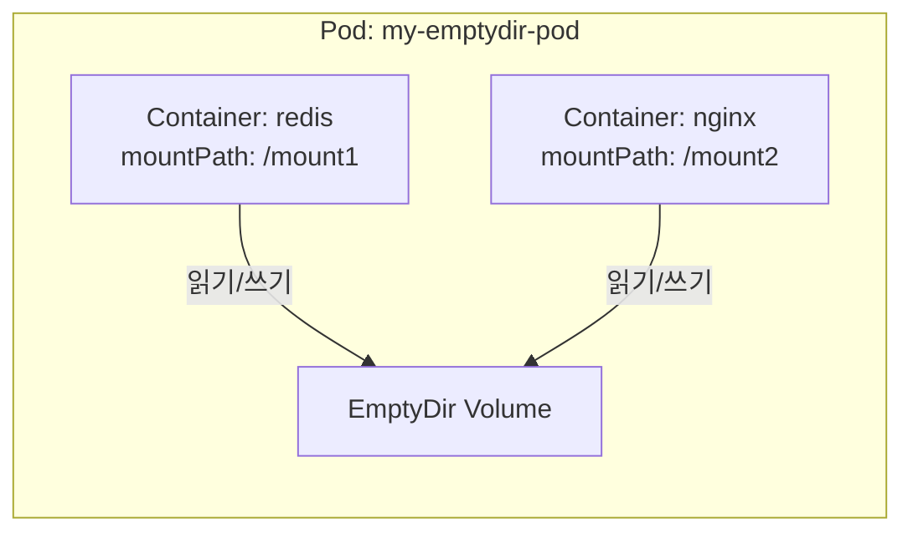
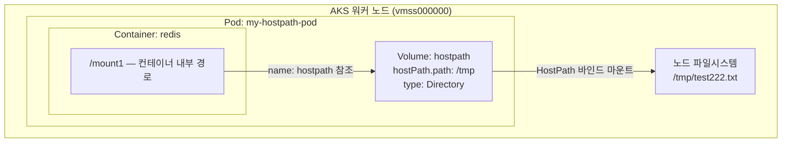
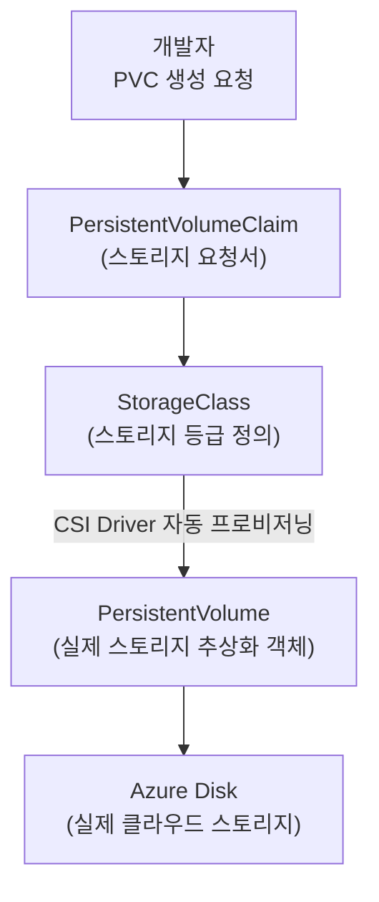
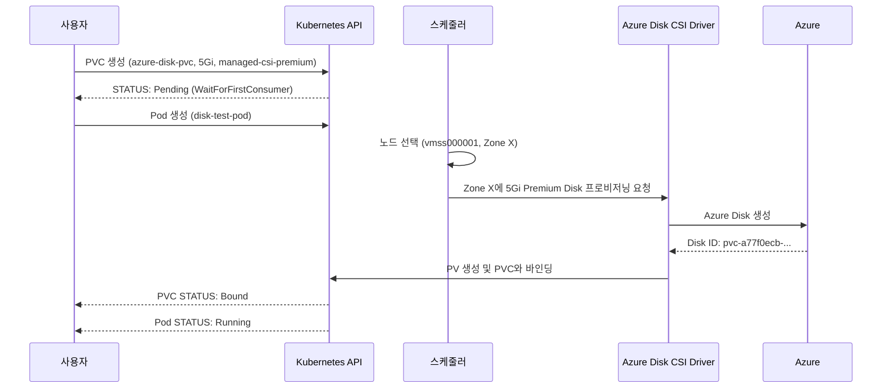
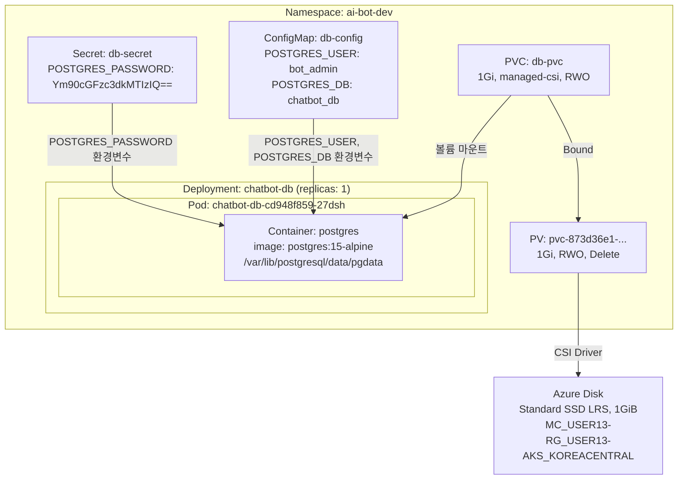

## Volume, StorageClass, ConfigMap, Secret & Claude Code 운영 프롬프트

> **작성 일자**: 2026-06-09 (검토 및 수정: 2026-06-10)  
> **과정명**: MS Azure Kubernetes 기반 AIOps 실전 과정  
> **실습 환경**: AKS (Azure Kubernetes Service), Korea Central, Kubernetes 1.34.7  
> **참고**: 이 문서는 실제 실습에서 발생한 오류와 해결 과정을 모두 포함하며, 추측 없이 검증된 내용만 기술합니다.

## 실습 문서

[**Lab 4 - Volume 과 StorageClass**](https://psedu.gitbook.io/k8s-aiops-aks/lab-4-pod)

[**Kubernetes AIOps 실전.pdf**](https://drive.google.com/file/d/1aA2YTol6pRqIkpTyQs0GtZghoVqr7P0E/view?usp=sharing)

## 관련 문서

- [**Azure AKS 기반 Kubernetes AIOps — 클러스터 배포 및 워크로드 배포**](https://k82022603.github.io/posts/azure-aks-%EA%B8%B0%EB%B0%98-kubernetes-aiops-%ED%81%B4%EB%9F%AC%EC%8A%A4%ED%84%B0-%EB%B0%B0%ED%8F%AC-%EB%B0%8F-%EC%9B%8C%ED%81%AC%EB%A1%9C%EB%93%9C-%EB%B0%B0%ED%8F%AC/)
- [**Azure AKS 기반 Kubernetes AIOps — Service 및 Ingress 라우팅**](https://k82022603.github.io/posts/azure-aks-%EA%B8%B0%EB%B0%98-kubernetes-aiops-service-%EB%B0%8F-ingress-%EB%9D%BC%EC%9A%B0%ED%8C%85/)
- **Azure AKS 기반 Kubernetes AIOps — Volume 과 StorageClass**
- [**Azure AKS 기반 Kubernetes AIOps — 특수 워크로드 관리**](https://k82022603.github.io/posts/azure-aks-%EA%B8%B0%EB%B0%98-kubernetes-aiops-%ED%8A%B9%EC%88%98-%EC%9B%8C%ED%81%AC%EB%A1%9C%EB%93%9C-%EA%B4%80%EB%A6%AC/)
- [**Azure AKS 기반 Kubernetes AIOps — 리소스 관리**](https://k82022603.github.io/posts/azure-aks-%EA%B8%B0%EB%B0%98-kubernetes-aiops-%EB%A6%AC%EC%86%8C%EC%8A%A4-%EA%B4%80%EB%A6%AC/)
- [**Azure AKS 기반 Kubernetes AIOps — 워크로드 배치 제어**](https://k82022603.github.io/posts/azure-aks-%EA%B8%B0%EB%B0%98-kubernetes-aiops-%EC%9B%8C%ED%81%AC%EB%A1%9C%EB%93%9C-%EB%B0%B0%EC%B9%98-%EC%A0%9C%EC%96%B4/)
- [**Azure AKS 기반 Kubernetes AIOps — 네트워크 정책**](https://k82022603.github.io/posts/azure-aks-%EA%B8%B0%EB%B0%98-kubernetes-aiops-%EB%84%A4%ED%8A%B8%EC%9B%8C%ED%81%AC-%EC%A0%95%EC%B1%85/)
- [**Azure AKS 기반 Kubernetes AIOps — kubernetes 고가용성**](https://k82022603.github.io/posts/azure-aks-%EA%B8%B0%EB%B0%98-kubernetes-aiops-kubernetes-%EA%B3%A0%EA%B0%80%EC%9A%A9%EC%84%B1/)
- [**Azure AKS 기반 Kubernetes AIOps — 모니터링**](https://k82022603.github.io/posts/azure-aks-%EA%B8%B0%EB%B0%98-kubernetes-aiops-%EB%AA%A8%EB%8B%88%ED%84%B0%EB%A7%81/)
- [**Azure AKS 기반 Kubernetes AIOps — AI 기반 tools**](https://k82022603.github.io/posts/azure-aks-%EA%B8%B0%EB%B0%98-kubernetes-aiops-ai-%EA%B8%B0%EB%B0%98-tools/)
- [**Azure AKS 기반 Kubernetes AIOps — 과정 평가 문제별 정답과 핵심 개념**](https://k82022603.github.io/posts/azure-aks-%EA%B8%B0%EB%B0%98-kubernetes-aiops-%EA%B3%BC%EC%A0%95-%ED%8F%89%EA%B0%80-%EB%AC%B8%EC%A0%9C%EB%B3%84-%EC%A0%95%EB%8B%B5%EA%B3%BC-%ED%95%B5%EC%8B%AC-%EA%B0%9C%EB%85%90/)


---

## 목차

1. [Lab 4 개요](#1-lab-4-개요)
2. [Task 1 — Volume: EmptyDir & HostPath](#2-task-1--volume-emptydir--hostpath)
3. [Task 2 — PVC를 통한 자동 PV 구성](#3-task-2--pvc를-통한-자동-pv-구성)
4. [StorageClass 심층 이해](#4-storageclass-심층-이해)
5. [Task 3 — 환경변수: ConfigMap & Secret](#5-task-3--환경변수-configmap--secret)
6. [Task 4 — AI 챗봇 데이터베이스 구축 (통합 실습)](#6-task-4--ai-챗봇-데이터베이스-구축-통합-실습)
7. [실습에서 발견한 핵심 교훈](#7-실습에서-발견한-핵심-교훈)
8. [AKS 환경 운영 Best Practices](#8-aks-환경-운영-best-practices)
9. [구축 및 운영을 위한 Claude Code 프롬프트 모음](#9-구축-및-운영을-위한-claude-code-프롬프트-모음)

---

## 1. Lab 4 개요

Lab 4는 Kubernetes의 스토리지와 설정 관리를 다루는 실습으로, 크게 네 가지 주제로 구성됩니다. 첫 번째는 Pod 수준에서 동작하는 임시 볼륨인 EmptyDir과 노드 파일시스템을 직접 연결하는 HostPath이고, 두 번째는 클라우드 스토리지를 자동으로 프로비저닝하는 PersistentVolumeClaim 기반의 동적 볼륨 구성입니다. 세 번째는 ConfigMap과 Secret을 이용한 환경변수 주입이며, 네 번째는 앞의 세 가지를 모두 결합하여 AI 챗봇 서비스의 데이터베이스를 실제로 배포하는 통합 시나리오입니다.

모든 실습은 AKS(Azure Kubernetes Service) 위에서 Cloud Shell을 통해 진행되었으며, kubectl과 Azure CLI를 사용합니다. 실습 과정에서 탭 문자로 인한 YAML 파싱 오류, Cloud Shell과 AKS 워커 노드 파일시스템의 혼동, WaitForFirstConsumer 모드 동작 등 실무에서도 자주 마주치는 상황들을 직접 경험하고 해결했습니다.

---

## 2. Task 1 — Volume: EmptyDir & HostPath

### 2.1 EmptyDir Volume

EmptyDir은 Pod가 생성될 때 빈 디렉토리로 만들어지는 임시 볼륨입니다. 이 볼륨의 핵심 특성은 **같은 Pod 안에 있는 여러 컨테이너가 동일한 파일시스템 공간을 공유한다**는 점입니다. Pod가 살아있는 동안은 데이터가 유지되지만, Pod가 삭제되면 볼륨과 그 안의 데이터도 함께 사라집니다.

실습에서는 하나의 Pod 안에 redis와 nginx 두 컨테이너를 배치하고, 각각 `/mount1`, `/mount2`라는 서로 다른 경로로 동일한 EmptyDir 볼륨을 마운트했습니다. redis 컨테이너에서 `/mount1/test.txt`를 생성하면 nginx 컨테이너의 `/mount2/test.txt`에서 동일한 내용을 확인할 수 있었습니다. 이는 두 컨테이너가 실제로 같은 볼륨을 공유하고 있다는 것을 직접 증명한 것입니다.



YAML 구조에서 중요한 점은 `volumeMounts[].name` 필드가 `volumes[].name` 필드와 반드시 동일해야 한다는 것입니다. 이 이름 기반 참조가 컨테이너와 볼륨을 연결하는 유일한 고리입니다.

**EmptyDir 주요 사용 사례:**
- 멀티 컨테이너 Pod에서 컨테이너 간 파일 공유 (예: 사이드카 패턴으로 로그 수집)
- 임시 체크포인트 데이터 저장
- AI 모델 추론 중간 결과물의 임시 저장

### 2.2 HostPath Volume

HostPath는 컨테이너의 특정 경로를 Pod가 배치된 워커 노드의 파일시스템 경로에 직접 연결하는 볼륨입니다. 실습에서는 노드의 `/tmp` 디렉토리를 컨테이너의 `/mount1`에 연결했습니다. 컨테이너에서 `/mount1`에 파일을 쓰면 해당 노드의 `/tmp`에 실제 파일이 저장됩니다.



**YAML 핵심 필드 설명:**

```yaml
volumes:
- name: hostpath        # volumeMounts의 name과 반드시 일치
  hostPath:
    path: /tmp          # 노드(워커 노드)의 실제 경로
    type: Directory     # /tmp가 이미 존재하는 디렉토리여야 함
```

`type: Directory`는 마운트 대상이 이미 노드에 존재하는 디렉토리임을 명시합니다. 존재하지 않는 경로를 지정하면 Pod가 `ContainerCreating` 상태에서 실패합니다.

### 2.3 AKS 환경에서 HostPath 검증 — Cloud Shell vs 노드 파일시스템

이번 실습에서 가장 중요한 개념적 발견이 있었습니다. 실습 가이드의 Step 12에서는 "노드의 터미널로 이동하여 파일 생성 확인 → `cd /tmp`"라고 안내하고 있었지만, Cloud Shell에서 `cd /tmp`를 실행하면 AKS 워커 노드의 `/tmp`가 아닌 Cloud Shell 자체 VM의 `/tmp`로 이동합니다.

Cloud Shell과 AKS 워커 노드는 물리적으로 완전히 별개의 가상머신입니다. Cloud Shell은 Azure가 브라우저 환경에서 사용자에게 제공하는 독립된 Linux 터미널 VM이고, AKS 워커 노드(예: vmss000000)는 Kubernetes 워크로드를 실행하는 별도의 VM입니다. 두 VM은 네트워크로 연결되어 있을 뿐, 파일시스템은 전혀 공유하지 않습니다.

이 실습 가이드는 온프레미스 또는 VM 기반 Kubernetes 환경에서는 노드에 직접 SSH 접속이 가능하다는 전제로 작성되었습니다. AKS는 관리형 서비스이기 때문에 기본적으로 노드에 대한 직접 SSH 접속이 제한됩니다.

**AKS 환경의 올바른 노드 파일시스템 검증 방법:**

```bash
# 1. Pod가 배치된 노드 이름 확인
kubectl get pod my-hostpath-pod -o wide

# 2. kubectl debug node로 해당 노드에 직접 접근
kubectl debug node/aks-nodepool1-12318778-vmss000000 \
  -it --image=mcr.microsoft.com/cbl-mariner/busybox:1.35 \
  -- chroot /host

# 3. 접속 후 노드 파일시스템에서 파일 확인
ls /tmp/test.txt
cat /tmp/test.txt
```

실습에서 이 방법을 통해 컨테이너에서 작성한 `test222.txt` 파일이 노드의 `/tmp`에 정상적으로 존재함을 확인했습니다.

**보안 경고:** `kubectl debug node` 실행 시 "All commands and output from this session will be recorded" 경고가 표시되는 것은 정상이며, AKS 보안 감사 로그에 세션이 기록됩니다. 운영 환경에서는 반드시 필요한 경우에만 사용해야 합니다.

HostPath는 노드의 파일시스템에 직접 접근하므로 컨테이너가 노드의 중요한 파일을 읽거나 쓸 수 있는 보안 위험이 있습니다. 운영 환경에서는 가급적 사용을 피하고 PVC 기반의 영구 볼륨을 사용하는 것이 권장됩니다.

### 2.4 EmptyDir vs HostPath 비교

| 항목 | EmptyDir | HostPath |
|------|----------|----------|
| 데이터 범위 | Pod 내 컨테이너 간 공유 | 특정 노드 파일시스템 |
| Pod 삭제 시 | 데이터 삭제됨 | 노드에 데이터 남음 |
| 컨테이너 재시작 시 | 데이터 유지 | 데이터 유지 |
| 여러 Pod 간 공유 | 불가능 | 같은 노드의 Pod만 가능 |
| 보안 위험도 | 낮음 | 높음 (노드 파일시스템 접근) |
| AKS 노드 검증 방법 | kubectl exec | kubectl debug node |
| 권장 사용 환경 | 임시 공유 데이터 | 데이터 수집 에이전트(DaemonSet) |

---

## 3. Task 2 — PVC를 통한 자동 PV 구성

### 3.1 Kubernetes 스토리지 추상화 계층

Kubernetes는 스토리지를 추상화하여 애플리케이션 개발자가 스토리지의 구체적인 구현을 알 필요 없이 선언적으로 스토리지를 요청할 수 있도록 설계되어 있습니다.



### 3.2 WaitForFirstConsumer 동작

실습에서 가장 중요하게 관찰한 동작입니다. `managed-csi-premium` StorageClass는 `volumeBindingMode: WaitForFirstConsumer`를 사용합니다.

**PVC만 생성했을 때:**
```
NAME             STATUS    VOLUME   CAPACITY   STORAGECLASS
azure-disk-pvc   Pending                       managed-csi-premium
```
STATUS가 `Pending`이고 VOLUME이 비어있습니다. PV도 존재하지 않습니다. 이것은 오류가 아닙니다.

**Pod 생성 후:**
```
NAME             STATUS   VOLUME                                     CAPACITY
azure-disk-pvc   Bound    pvc-a77f0ecb-32b6-4328-a754-7aef9f7773b3   5Gi
```
Pod가 생성되는 순간 Kubernetes 스케줄러가 Pod를 특정 노드(예: vmss000001)에 배치하고, 그 즉시 해당 노드의 가용성 존(Zone)에 맞는 Azure Disk를 자동으로 프로비저닝합니다.

이 설계의 핵심 이유는 **토폴로지 일치** 때문입니다. Azure Disk는 특정 가용성 존에 생성되며, Pod도 특정 존의 노드에 배치됩니다. WaitForFirstConsumer를 사용하면 스케줄러가 Pod 배치 위치를 결정한 후 그 존에 맞게 Disk를 생성하므로, Disk와 Pod가 항상 같은 존에 위치하게 됩니다. 반대로 Immediate 모드에서는 Pod 배치와 무관하게 Disk가 먼저 생성되어 서로 다른 존에 위치할 수 있고, 이 경우 Pod가 스케줄 불가능한 상태가 됩니다.

**Task 4 실습에서의 WaitForFirstConsumer 증거:**
PVC를 생성하고 미션 4 배포까지 13분 이상이 지났는데, PV의 AGE는 44초였습니다. PVC는 13분 전에 생성됐지만 PV는 Deployment가 Pod를 스케줄한 직후에야 생성된 것입니다.

### 3.3 동적 프로비저닝 전체 흐름

Task 2 실습에서 관찰한 전체 흐름을 정리하면 다음과 같습니다.



### 3.4 reclaimPolicy: Delete 연쇄 삭제

`managed-csi-premium`의 기본 reclaimPolicy는 `Delete`입니다. 삭제 순서와 그 결과를 실습에서 직접 확인했습니다.

```
kubectl delete pod disk-test-pod
    → Azure Disk: Attached 상태에서 Unattached로 변경 (Disk는 유지)

kubectl delete pvc azure-disk-pvc
    → PVC 삭제 신호 → Kubernetes가 reclaimPolicy 확인 → Delete
    → PV 자동 삭제
    → CSI Driver가 Azure Disk 실제 삭제 (Azure Portal에서 사라짐)

kubectl get pvc,pv
    → No resources found  ← 30~60초 내 모두 삭제 완료
```

**운영 환경 주의사항:** reclaimPolicy가 Delete인 경우 실수로 PVC를 삭제하면 데이터가 영구적으로 사라집니다. 중요한 데이터가 담긴 스토리지에는 반드시 reclaimPolicy: Retain을 사용해야 합니다.

### 3.5 kubectl get pv,pvc -o wide 출력 필드 상세 설명

실습에서 확인한 실제 출력을 기반으로 각 필드를 설명합니다.

**PV 핵심 필드:**

- **NAME**: Kubernetes가 자동 생성한 PV 식별자. `pvc-` 접두사 뒤에 UUID가 붙으며, 이 이름이 Azure Portal의 Disk 이름과 동일합니다.
- **RECLAIM POLICY**: `Delete` — PVC 삭제 시 PV와 Azure Disk도 함께 삭제됩니다.
- **STATUS: Bound** — PVC에 연결된 상태. `Available`(대기), `Released`(PVC 삭제됨), `Failed`(반환 실패) 상태도 존재합니다.
- **CLAIM: default/azure-disk-pvc** — `네임스페이스/PVC이름` 형식. PV는 클러스터 전체 리소스이지만 특정 네임스페이스의 PVC에 바인딩됩니다.
- **VOLUMEMODE: Filesystem** — Azure Disk가 파일시스템(ext4 기본)으로 포맷됩니다. `Block` 모드는 파일시스템 없이 Raw Block Device로 접근하며 데이터베이스 등 자체 I/O를 관리하는 애플리케이션에서 사용합니다.

**AGE 차이가 WaitForFirstConsumer의 증거:**

Task 2 실습에서 PVC의 AGE는 9분 16초, PV의 AGE는 5분 51초였습니다. 약 3분 25초의 차이는 PVC 생성 후 Pod 생성까지 기다린 시간이며, WaitForFirstConsumer 모드가 정확하게 동작했다는 직접적인 증거입니다.

---

## 4. StorageClass 심층 이해

### 4.1 StorageClass란

Kubernetes 공식 문서에 따르면, StorageClass는 관리자가 제공하는 스토리지의 "등급(class)"을 설명하는 방법입니다. 서로 다른 등급은 서비스 품질 수준(QoS), 백업 정책, 또는 클러스터 관리자가 정하는 임의의 정책에 매핑될 수 있습니다. 개발자는 PVC에서 `storageClassName`으로 원하는 등급을 지정하면, Kubernetes와 CSI Driver가 실제 스토리지를 자동으로 생성합니다.

### 4.2 StorageClass 핵심 필드

```yaml
apiVersion: storage.k8s.io/v1
kind: StorageClass
metadata:
  name: managed-csi-premium
provisioner: disk.csi.azure.com        # 실제 스토리지를 만드는 드라이버
reclaimPolicy: Delete                  # PVC 삭제 시 동작 (Delete 또는 Retain)
volumeBindingMode: WaitForFirstConsumer # 바인딩 시점 제어
allowVolumeExpansion: true             # PVC 크기 확장 허용 여부
parameters:
  skuName: Premium_LRS                 # 실제 디스크 유형
```

- **provisioner**: 스토리지를 실제로 프로비저닝하는 드라이버 식별자입니다. AKS에서는 `disk.csi.azure.com`(Azure Disk)과 `file.csi.azure.com`(Azure Files)이 주로 사용됩니다. Kubernetes 1.27 이후 구버전 in-tree 드라이버(`kubernetes.io/azure-disk`)는 완전히 제거되었으므로 반드시 CSI 기반 드라이버를 사용해야 합니다.
- **reclaimPolicy**: StorageClass로 동적 생성된 PV의 반환 정책입니다. 기본값은 `Delete`입니다.
- **volumeBindingMode**: `Immediate`이면 PVC 생성 즉시 PV가 생성되고, `WaitForFirstConsumer`이면 Pod 스케줄 시점까지 PV 생성이 지연됩니다. AKS에서는 Zone 일치를 위해 WaitForFirstConsumer가 기본값입니다.
- **allowVolumeExpansion**: `true`이면 PVC의 용량을 늘릴 수 있습니다. 단, 볼륨 크기를 줄이는 것은 지원하지 않습니다.

### 4.3 AKS 기본 제공 StorageClass 목록

AKS 클러스터에는 다음 StorageClass가 기본으로 생성됩니다. Kubernetes 1.21 이후 AKS는 CSI 드라이버만 사용합니다.

| 이름 | Provisioner | Reclaim | BindingMode | 디스크 유형 |
|------|-------------|---------|-------------|-------------|
| `default` (기본) | disk.csi.azure.com | Delete | WaitForFirstConsumer | Standard SSD LRS |
| `managed-csi` | disk.csi.azure.com | Delete | WaitForFirstConsumer | Standard SSD LRS |
| `managed-csi-premium` | disk.csi.azure.com | Delete | WaitForFirstConsumer | Premium SSD LRS |
| `azurefile` | file.csi.azure.com | Delete | Immediate | Standard |
| `azurefile-csi` | file.csi.azure.com | Delete | Immediate | Standard |
| `azurefile-csi-premium` | file.csi.azure.com | Delete | Immediate | Premium |

**managed-csi vs managed-csi-premium 차이:**
- `managed-csi`: Azure Standard SSD. Kubernetes 1.29 이상에서 다중 가용성 존(AZ) 클러스터에서는 ZRS(Zone-Redundant Storage)를 자동 사용.
- `managed-csi-premium`: Azure Premium SSD LRS. 1.29 이상 다중 AZ 클러스터에서는 Premium ZRS 자동 사용. 실습에서 5GiB를 요청하면 Azure P2 계층(120 IOPS, 25MB/s)으로 프로비저닝됩니다.

### 4.4 Azure Disk 성능 계층

Azure Premium SSD는 디스크 크기에 따라 성능 계층이 자동 결정됩니다.

| 계층 | 최대 크기 (GiB) | IOPS | 처리량(MB/s) |
|------|----------------|------|-------------|
| P1 | 4 | 120 | 25 |
| P2 | 8 | 120 | 25 |
| P3 | 16 | 120 | 25 |
| P4 | 32 | 120 | 25 |
| P6 | 64 | 240 | 50 |
| P10 | 128 | 500 | 100 |
| P15 | 256 | 1,100 | 125 |
| P20 | 512 | 2,300 | 150 |
| P30 | 1,024 (1 TiB) | 5,000 | 200 |

> **계층 할당 방식**: Azure는 요청한 크기를 수용할 수 있는 가장 낮은 계층으로 자동 배정합니다. 실습에서 5GiB를 요청했을 때 Azure Portal에서 P2 계층(120 IOPS, 25MB/s)으로 생성된 것을 확인했습니다. 5GiB는 P1(최대 4GiB) 초과이므로 P2로 배정되며, 디스크 크기는 실제 요청한 5GiB로 프로비저닝됩니다.

### 4.5 환경별 StorageClass 비교

Claude Code 프롬프트를 작성하거나 실무에서 다른 환경으로 이식할 때 이 차이를 반드시 고려해야 합니다.

| 항목 | AKS (Azure) | EKS (AWS) | GKE (Google) | 온프레미스 |
|------|-------------|-----------|--------------|------------|
| 블록 스토리지 | managed-csi-premium | gp3 (EBS) | standard | local-storage |
| 파일 스토리지 | azurefile-csi | efs-sc | filestore-sc | nfs |
| 노드 접근 | kubectl debug node | SSM Session Manager | gcloud compute ssh | ssh 직접 |
| 클러스터 연결 | az aks get-credentials | aws eks update-kubeconfig | gcloud container clusters get-credentials | kubeconfig 복사 |

---

## 5. Task 3 — 환경변수: ConfigMap & Secret

### 5.1 ConfigMap

ConfigMap은 비기밀 설정 데이터를 키-값 쌍으로 저장하는 Kubernetes 리소스입니다. 컨테이너 이미지와 설정을 분리함으로써 동일한 이미지를 개발, 스테이징, 운영 환경에서 서로 다른 설정으로 실행할 수 있습니다.

실습에서 생성한 ConfigMap:
```yaml
apiVersion: v1
kind: ConfigMap
metadata:
  name: my-configmap
data:
  APP_ENV: production
  LOG_LEVEL: debug
```

`kubectl describe configmap`을 실행하면 값이 평문으로 그대로 표시됩니다. ConfigMap은 비밀 데이터 보호 기능이 없으므로 비밀번호, API 키 등 민감한 정보는 절대 저장하지 않아야 합니다.

### 5.2 Secret

Secret은 비밀번호, OAuth 토큰, SSH 키 등 민감한 정보를 저장하기 위한 리소스입니다. ConfigMap과 유사하지만 데이터가 Base64로 인코딩되어 저장됩니다.

**중요한 오해 방지:** Base64는 **암호화가 아닌 인코딩**입니다. Base64로 인코딩된 값은 누구나 쉽게 디코딩할 수 있습니다. Kubernetes Secret은 기본적으로 etcd에 암호화 없이 저장됩니다. 따라서 Kubernetes Secret만으로는 완전한 보안이 보장되지 않으며, 추가적인 보안 조치(etcd 암호화, RBAC, Azure Key Vault 연동)가 필요합니다.

```bash
# Base64 인코딩 방법 (-n 플래그로 개행 문자 제외)
echo -n "botpasswd123!" | base64
# 출력: Ym90cGFzc3dkMTIzIQ==

# Base64 디코딩 방법
echo "Ym90cGFzc3dkMTIzIQ==" | base64 --decode
# 출력: botpasswd123!
```

실습에서 생성한 Secret:
```yaml
apiVersion: v1
kind: Secret
metadata:
  name: my-secret
type: Opaque
data:
  DB_USER: dXNlcm5hbWU=      # "username"의 Base64 값
  DB_PASSWORD: cGFzc3dvcmQ=  # "password"의 Base64 값
```

`kubectl describe secret`을 실행하면 값 대신 바이트 수만 표시됩니다:
```
Data
====
DB_PASSWORD:  8 bytes
DB_USER:      8 bytes
```

이것이 ConfigMap describe(값 평문 표시)와 Secret describe(바이트 수만 표시)의 핵심 차이입니다.

### 5.3 환경변수 주입 방식

ConfigMap과 Secret의 데이터를 Pod의 환경변수로 주입하는 방법은 두 가지입니다.

**방식 1 — 개별 키 지정 (valueFrom):**
```yaml
env:
- name: ENV_MODE              # 컨테이너 안에서 사용할 환경변수 이름
  valueFrom:
    configMapKeyRef:
      name: my-configmap      # ConfigMap 이름
      key: APP_ENV            # ConfigMap의 키 이름
```
`name`과 `key`가 다를 수 있다는 점이 중요합니다. ConfigMap에는 `APP_ENV`로 저장되어 있지만 컨테이너 안에서는 `ENV_MODE`로 주입됩니다. 실습에서 `kubectl logs my-var-pod`로 이를 직접 확인했습니다.

**방식 2 — 전체 일괄 주입 (envFrom):**
```yaml
envFrom:
- configMapRef:
    name: my-configmap  # ConfigMap의 모든 키-값을 그대로 환경변수로 주입
```
이 방식은 ConfigMap의 키 이름이 그대로 환경변수 이름이 되므로 이름 변환이 불가능합니다.

### 5.4 ConfigMap vs Secret 비교

| 항목 | ConfigMap | Secret |
|------|-----------|--------|
| 목적 | 비기밀 설정 데이터 | 비밀번호, API 키, 인증서 |
| YAML 값 형식 | 평문 | Base64 인코딩 |
| etcd 저장 방식 | 평문 | Base64 (기본 암호화 없음) |
| kubectl describe | 값 평문 표시 | 바이트 수만 표시 |
| 컨테이너 내부 | 평문으로 주입 | Base64 디코딩 후 평문 주입 |
| 최대 크기 | 1 MB | 1 MB |

### 5.5 YAML 탭 문자 오류 — 실습 교훈

Task 3 실습에서 `vi`로 작성한 YAML 파일에서 다음 오류가 반복적으로 발생했습니다.

```
error: error parsing lab4-pod.yaml: error converting YAML to JSON:
yaml: line 14: found character that cannot start any token

error: error parsing lab4-pod.yaml: error converting YAML to JSON:
yaml: line 15: found a tab character that violates indentation
```

YAML은 들여쓰기에 탭(Tab) 문자를 허용하지 않고 반드시 스페이스만 사용해야 합니다. `vi` 에디터는 설정에 따라 탭 키 입력 시 탭 문자를 삽입할 수 있습니다. 세 번째 시도에서 오류 줄 번호가 14에서 15로 이동한 것은 14번 줄의 탭을 수정하다가 15번 줄에 새로운 탭이 생긴 것입니다.

**해결책 1 — heredoc 방식 (권장):**
```bash
cat <<EOF > lab4-pod.yaml
...내용...
EOF
```
heredoc은 쉘이 직접 파일을 작성하므로 탭 문자가 삽입되지 않습니다.

**해결책 2 — vi 탭 방지 설정:**
```vim
:set expandtab tabstop=2 shiftwidth=2
```
또는 `~/.vimrc`에 `set expandtab tabstop=2 shiftwidth=2`를 추가하면 영구 적용됩니다.

**해결책 3 — nano 사용:**
nano 에디터는 vi에 비해 탭 문자 관련 오류가 적게 발생하는 경향이 있습니다. 이번 실습에서도 vi에서 nano로 전환한 후 탭 문자 문제가 해소되었습니다. 단, nano도 기본 설정에서는 탭 키 입력 시 탭 문자를 삽입할 수 있으므로, YAML 작성 시 확실하게 방지하려면 `~/.nanorc`에 `set tabstospaces`를 추가하는 것이 좋습니다.

```bash
echo "set tabstospaces" >> ~/.nanorc
```

---

## 6. Task 4 — AI 챗봇 데이터베이스 구축 (통합 실습)

### 6.1 시나리오

AI 챗봇 서비스가 고도화되면서 사용자의 대화 로그를 영구적으로 저장할 데이터베이스가 필요해졌습니다. PostgreSQL을 사용하며, DB 관리자 비밀번호는 Secret으로 보호하고, DB 이름과 사용자명 같은 일반 설정은 ConfigMap으로 관리합니다. 컨테이너가 재시작되더라도 대화 데이터가 유실되지 않도록 AKS의 Azure Disk 기반 PVC를 데이터베이스 볼륨으로 연결합니다.

### 6.2 전체 아키텍처



### 6.3 미션별 구현 내용

**미션 1 — Secret 생성:**
```yaml
apiVersion: v1
kind: Secret
metadata:
  name: db-secret
  namespace: ai-bot-dev
type: Opaque
data:
  POSTGRES_PASSWORD: Ym90cGFzc3dkMTIzIQ==
```
`botpasswd123!`(13글자)의 Base64 값은 `Ym90cGFzc3dkMTIzIQ==`이며, 실습에서 `echo -n "botpasswd123!" | base64`로 직접 확인했습니다. kubectl describe 결과에서 `POSTGRES_PASSWORD: 13 bytes`로 확인됩니다.

**미션 2 — ConfigMap 생성:**
```yaml
apiVersion: v1
kind: ConfigMap
metadata:
  name: db-config
  namespace: ai-bot-dev
data:
  POSTGRES_USER: bot_admin
  POSTGRES_DB: chatbot_db
```
ConfigMap은 Base64 인코딩 없이 평문으로 작성합니다.

**미션 3 — PVC 생성:**
```yaml
apiVersion: v1
kind: PersistentVolumeClaim
metadata:
  name: db-pvc
  namespace: ai-bot-dev
spec:
  accessModes:
    - ReadWriteOnce
  storageClassName: managed-csi
  resources:
    requests:
      storage: 1Gi
```
`managed-csi`는 Azure Standard SSD를 프로비저닝합니다. WaitForFirstConsumer 모드이므로 PVC 생성 직후에는 STATUS가 Pending입니다.

**미션 4 — Deployment 생성:**
```yaml
apiVersion: apps/v1
kind: Deployment
metadata:
  name: chatbot-db
  namespace: ai-bot-dev
spec:
  replicas: 1
  selector:
    matchLabels:
      app: chatbot-db
  template:
    metadata:
      labels:
        app: chatbot-db
    spec:
      containers:
      - name: postgres
        image: postgres:15-alpine
        env:
        - name: POSTGRES_DB
          valueFrom:
            configMapKeyRef:
              name: db-config
              key: POSTGRES_DB
        - name: POSTGRES_USER
          valueFrom:
            configMapKeyRef:
              name: db-config
              key: POSTGRES_USER
        - name: POSTGRES_PASSWORD
          valueFrom:
            secretKeyRef:
              name: db-secret
              key: POSTGRES_PASSWORD
        volumeMounts:
        - name: db-storage
          mountPath: /var/lib/postgresql/data
          subPath: pgdata
      volumes:
      - name: db-storage
        persistentVolumeClaim:
          claimName: db-pvc
```

### 6.4 subPath: pgdata 의 필요성

`subPath: pgdata`는 선택이 아닌 필수입니다. Azure Disk가 처음 마운트될 때 리눅스 파일시스템의 `lost+found` 디렉토리가 자동으로 생성됩니다. PostgreSQL은 데이터 디렉토리가 완전히 비어있어야만 초기화(initdb)가 가능합니다. `lost+found`가 있으면 다음과 같은 오류가 발생합니다.

```
initdb: error: directory "/var/lib/postgresql/data" exists but is not empty
```

`subPath: pgdata`를 지정하면 실제 데이터는 마운트된 볼륨의 하위 디렉토리(`pgdata/`)에 저장되므로 `lost+found`의 영향을 받지 않습니다. 실습에서 이 옵션을 적용하여 PostgreSQL이 정상적으로 초기화되는 것을 로그로 확인했습니다.

```
PostgreSQL init process complete; ready for start up.
database system is ready to accept connections
```

### 6.5 실습 결과 요약

미션 3에서 PVC를 생성하고 미션 4 배포까지 13분 이상이 경과했으나, PV의 AGE는 44초였습니다. PVC(AGE: 13m)와 PV(AGE: 44s)의 차이가 WaitForFirstConsumer의 시각적 증거로 남았습니다. `kubectl get pvc,pv -n ai-bot-dev` 결과에서 `CLAIM: ai-bot-dev/db-pvc`로 표시되어 네임스페이스 범위 PVC와 클러스터 범위 PV의 관계를 확인했습니다.

---

## 7. 실습에서 발견한 핵심 교훈

이번 실습 과정에서 이론과 실제의 차이를 직접 경험하며 얻은 교훈들을 정리합니다. 이는 향후 운영 환경에서도 반드시 기억해야 할 내용입니다.

**교훈 1 — Cloud Shell ≠ AKS 워커 노드 파일시스템**

Cloud Shell에서 `cd /tmp`를 실행하면 Cloud Shell 자체 VM의 `/tmp`로 이동하며, AKS 워커 노드의 `/tmp`와는 완전히 다른 파일시스템입니다. HostPath 볼륨을 검증할 때는 반드시 `kubectl debug node/<노드명> -it --image=... -- chroot /host` 방식을 사용해야 합니다.

**교훈 2 — WaitForFirstConsumer: Pending은 오류가 아님**

`managed-csi`, `managed-csi-premium` 등 AKS 기본 StorageClass는 모두 WaitForFirstConsumer 모드를 사용합니다. PVC를 생성하고 Pod가 없으면 STATUS가 Pending으로 유지됩니다. 이것은 설계된 동작이며, Pod 생성 후 즉시 Bound로 전환됩니다.

**교훈 3 — YAML은 탭이 아닌 스페이스**

YAML 파일 작성 시 탭 문자는 파싱 오류를 일으킵니다. `vi`로 작성할 경우 `:set expandtab`을 설정하거나, heredoc 방식을 사용하거나, nano 에디터를 사용하는 것이 안전합니다. 오류 메시지의 줄 번호가 수정 후 다른 줄로 이동한다면 탭이 여러 줄에 있는 것입니다.

**교훈 4 — reclaimPolicy: Delete의 영구성**

PVC를 삭제하면 PV와 Azure Disk가 연쇄적으로 삭제되며 데이터를 복구할 수 없습니다. 운영 환경의 데이터베이스나 중요 데이터에는 반드시 `reclaimPolicy: Retain`을 사용해야 합니다.

**교훈 5 — subPath로 PostgreSQL 초기화 오류 방지**

Azure Disk 기반 PVC를 PostgreSQL 데이터 디렉토리에 직접 마운트하면 `lost+found`로 인한 initdb 실패가 발생합니다. `subPath: pgdata`를 추가하여 하위 디렉토리에 데이터를 저장하는 방식으로 해결할 수 있습니다.

**교훈 6 — kubectl exec 옵션은 --container (단수)**

`kubectl exec -it <pod> --container <컨테이너명>`에서 `--container`는 단수형입니다. `--containers`(복수)는 존재하지 않는 옵션으로 오류가 발생합니다.

**교훈 7 — 실습 가이드의 환경 의존성**

실습 가이드의 Step 12(HostPath 노드 파일 확인)는 온프레미스 환경을 전제로 작성되어 있었습니다. AKS에서는 적용되지 않는 방법입니다. YAML 내용 자체는 문제없이 동작하며, 검증 방법만 환경에 맞게 조정하면 됩니다.

---

## 8. AKS 환경 운영 Best Practices

### 8.1 스토리지 선택 기준

워크로드 특성에 따라 적절한 스토리지를 선택해야 합니다.

| 요구사항 | 권장 StorageClass | 이유 |
|----------|-------------------|------|
| 단일 Pod DB (PostgreSQL, MySQL) | managed-csi-premium | RWO, 높은 IOPS |
| 공유 파일 스토리지 (여러 Pod) | azurefile-csi-premium | RWX 지원 |
| AI 모델 파일 공유 | azurefile-csi-premium | 다중 추론 Pod 동시 읽기 |
| 학습 로그, 일반 데이터 | managed-csi | Standard SSD, 비용 절감 |
| 운영 DB (데이터 보존 필수) | managed-csi-premium + Retain | 실수 삭제 방지 |

### 8.2 reclaimPolicy 운영 기준

```yaml
# 운영 환경 DB용 StorageClass (데이터 보존)
apiVersion: storage.k8s.io/v1
kind: StorageClass
metadata:
  name: managed-premium-retain
provisioner: disk.csi.azure.com
parameters:
  skuName: Premium_LRS
reclaimPolicy: Retain
volumeBindingMode: WaitForFirstConsumer
allowVolumeExpansion: true
```

운영 환경에서는 기본 `managed-csi-premium`(Delete 정책) 대신 위와 같이 Retain 정책의 커스텀 StorageClass를 만들어 사용하는 것이 권장됩니다.

### 8.3 Secret 보안 강화

Kubernetes Secret은 기본적으로 etcd에 암호화 없이 저장됩니다. 운영 환경에서는 다음 방법으로 보안을 강화해야 합니다.

**방법 1 — Azure Key Vault + Secrets Store CSI Driver:**
AKS Workload Identity를 통해 Key Vault에서 비밀 값을 직접 Pod에 마운트합니다. Kubernetes Secret 객체에 민감한 값을 저장하지 않습니다.

**방법 2 — etcd 암호화 활성화:**
AKS 클러스터 수준에서 etcd 저장 데이터를 암호화하도록 설정합니다.

**방법 3 — RBAC 강화:**
Secret이 포함된 네임스페이스에 대한 접근 권한을 최소화하고, 필요한 ServiceAccount에게만 Secret 읽기 권한을 부여합니다.

### 8.4 ConfigMap 관리 원칙

- ConfigMap 변경 후 이미 실행 중인 Pod에는 자동 반영되지 않습니다. 환경변수 방식(env.valueFrom)으로 주입한 경우 Pod를 재시작해야 변경 사항이 적용됩니다.
- `--all` 플래그로 ConfigMap을 삭제하면 `kube-root-ca.crt` 같은 시스템 ConfigMap도 삭제될 수 있으므로 반드시 이름을 명시하여 삭제합니다.
- `kubectl delete pod,configmap,secret --all` 명령은 학습 환경에서만 사용하고, 운영 환경에서는 절대 사용하지 않습니다.

---

## 9. 구축 및 운영을 위한 Claude Code 프롬프트 모음

이 섹션에서는 지금까지 실습한 내용을 바탕으로 AKS 환경에서 실제 구축 및 운영에 사용할 수 있는 Claude Code 프롬프트를 제공합니다. 모든 프롬프트는 AKS 환경의 특성을 반영하여 작성되었습니다.

---

### [프롬프트 1] AKS 클러스터 스토리지 현황 전체 분석

```
당신은 AKS 클러스터의 스토리지 현황을 분석하는 전문가입니다.
현재 연결된 AKS 클러스터의 스토리지 리소스를 전수 분석하고
운영 이슈와 개선사항을 보고서 형식으로 작성해주세요.

[분석 항목]

1. StorageClass 전체 목록 및 상세
   kubectl get storageclass -o wide
   kubectl describe storageclass
   - 각 StorageClass의 Provisioner, ReclaimPolicy, VolumeBindingMode 정리
   - Default StorageClass 식별
   - Deprecated된 in-tree 드라이버(kubernetes.io/azure-disk) 사용 여부 확인

2. PVC/PV 전체 현황 (모든 네임스페이스)
   kubectl get pvc,pv -A -o wide
   - STATUS별 분류: Bound / Pending / Released / Failed
   - Pending PVC 원인 분석 (WaitForFirstConsumer vs 실제 오류 구분)
   - Released 상태의 PV 식별 (데이터 잔존 위험)
   - reclaimPolicy가 Delete인 PV 목록 (삭제 위험 리소스)

3. 용량 현황
   - 총 요청 스토리지 용량 합산
   - StorageClass별 사용 용량 분류

4. 개선 권고
   - reclaimPolicy가 Delete인 운영 DB PVC 목록 → Retain 전환 권고
   - Pending 상태 장기 지속 PVC 원인 및 조치 방안
   - Released 상태 PV 처리 방안

결과를 표와 서술형으로 혼합하여 한글로 보고해주세요.
```

---

### [프롬프트 2] EmptyDir & HostPath 볼륨 실습 (AKS 최적화)

```
AKS 환경에서 EmptyDir과 HostPath Volume 실습을 진행해주세요.

[AKS 환경 필수 준수사항]
- kubectl exec 옵션: --container (단수. --containers는 존재하지 않음)
- 컨테이너 내부 명령: exec -it 대신 exec -- /bin/bash -c "명령어" 방식 사용
- HostPath 노드 검증: Cloud Shell의 /tmp가 아닌 kubectl debug node 사용
  (이유: Cloud Shell VM과 AKS 워커 노드는 완전히 별개의 파일시스템)

[STEP 1: EmptyDir 실습]
lab4-emptydir-pod.yaml 생성 (heredoc 사용):
- Pod: my-emptydir-pod
- Container 1: redis, mountPath=/mount1
- Container 2: nginx, mountPath=/mount2
- Volume: emptyDir: {}

Pod 생성 후 READY 2/2 확인.

redis 컨테이너에서 파일 생성:
kubectl exec my-emptydir-pod --container redis \
  -- /bin/bash -c "echo hello emptydir > /mount1/test.txt && cat /mount1/test.txt"

nginx 컨테이너에서 파일 공유 확인:
kubectl exec my-emptydir-pod --container nginx \
  -- /bin/bash -c "cat /mount2/test.txt"

[STEP 2: HostPath 실습]
lab4-hostpath-pod.yaml 생성:
- Pod: my-hostpath-pod
- Container: redis, mountPath=/mount1
- Volume: hostPath.path=/tmp, type=Directory

Pod 생성 후 배치 노드 확인:
kubectl get pod my-hostpath-pod -o wide

컨테이너에서 파일 생성:
kubectl exec my-hostpath-pod --container redis \
  -- /bin/bash -c "echo hello hostpath > /mount1/hostpath-test.txt"

kubectl debug node로 노드 파일시스템 검증:
NODE=$(kubectl get pod my-hostpath-pod -o jsonpath='{.spec.nodeName}')
kubectl debug node/$NODE -it \
  --image=mcr.microsoft.com/cbl-mariner/busybox:1.35 \
  -- chroot /host cat /tmp/hostpath-test.txt

[STEP 3: 정리]
kubectl delete pod --all
kubectl get pod 로 삭제 확인.

각 단계 결과와 EmptyDir vs HostPath 차이를 한글로 정리해주세요.
```

---

### [프롬프트 3] PVC 동적 프로비저닝 구성 및 검증

```
AKS 환경에서 PVC 기반 동적 스토리지 프로비저닝을 구성하고 검증해주세요.

[전제조건]
- AKS 클러스터에 kubectl이 연결되어 있습니다.
- StorageClass: managed-csi-premium (Premium SSD LRS)

[STEP 1: StorageClass 상세 확인]
kubectl describe sc managed-csi-premium
- VolumeBindingMode: WaitForFirstConsumer 확인
- ReclaimPolicy: Delete 확인
- Provisioner: disk.csi.azure.com 확인

[STEP 2: PVC 생성 및 Pending 상태 확인]
db-pvc.yaml을 heredoc으로 생성:
- name: azure-disk-pvc
- storageClassName: managed-csi-premium
- accessModes: ReadWriteOnce
- storage: 5Gi

생성 후 kubectl get pvc 실행하여 STATUS: Pending 확인.
WaitForFirstConsumer 모드이므로 Pending이 정상임을 설명.

[STEP 3: Pod 생성 후 PV 자동 생성 확인]
nginx Pod (lab4-pvc-pod.yaml)를 생성하여 PVC를 사용:
- mountPath: /data

kubectl get pod,pvc,pv 실행:
- PVC: Bound 상태 확인
- PV: 자동 생성 및 이름 확인
- PVC와 PV의 AGE 차이로 WaitForFirstConsumer 동작 증명

PV 상세:
kubectl get pv <pv이름> -o jsonpath='{.spec.csi.volumeHandle}'
Azure Disk ID 출력

[STEP 4: reclaimPolicy Delete 검증]
kubectl delete pod <pod이름>
kubectl delete pvc azure-disk-pvc
sleep 60
kubectl get pvc,pv
→ No resources found 확인 (Azure Disk도 자동 삭제됨)

결과 요약 및 WaitForFirstConsumer 동작 원리를 한글로 설명해주세요.
```

---

### [프롬프트 4] ConfigMap & Secret 생성 및 Pod 주입 검증

```
AKS 환경에서 ConfigMap과 Secret을 생성하고 Pod 환경변수로 주입하는
실습을 진행하고 보안 차이점을 검증해주세요.

[STEP 1: ConfigMap 생성 (heredoc 사용)]
lab4-configmap.yaml:
  name: my-configmap
  data:
    APP_ENV: production
    LOG_LEVEL: debug

[STEP 2: Secret 생성]
먼저 Base64 인코딩값을 확인:
echo -n "username" | base64
echo -n "password" | base64

lab4-secret.yaml:
  name: my-secret
  type: Opaque
  data:
    DB_USER: <username의 Base64값>
    DB_PASSWORD: <password의 Base64값>

[STEP 3: describe 비교 — 보안 차이 확인]
kubectl describe configmap my-configmap
  → 값이 평문으로 보임 확인

kubectl describe secret my-secret
  → 값 대신 바이트 수만 보임 확인

두 결과를 비교하고 설계 의도를 설명해주세요.

[STEP 4: Pod 환경변수 주입 및 검증]
lab4-pod.yaml (heredoc으로 생성):
  image: busybox
  command: ["sh", "-c", "env && sleep 3600"]
  env:
  - ENV_MODE ← configMapKeyRef: my-configmap, key: APP_ENV
  - LOG_LEVEL ← configMapKeyRef: my-configmap, key: LOG_LEVEL
  - DB_USER ← secretKeyRef: my-secret, key: DB_USER
  - DB_PASSWORD ← secretKeyRef: my-secret, key: DB_PASSWORD

Pod 생성 후:
kubectl logs my-var-pod | grep -E "ENV_MODE|LOG_LEVEL|DB_USER|DB_PASSWORD"

4개 변수 확인:
- ENV_MODE=production (ConfigMap APP_ENV가 ENV_MODE로 이름 변환됨)
- LOG_LEVEL=debug
- DB_USER=username (Base64 자동 디코딩됨)
- DB_PASSWORD=password (Base64 자동 디코딩됨)

[STEP 5: 정리]
kubectl delete pod my-var-pod
kubectl delete configmap my-configmap
kubectl delete secret my-secret

결과와 ConfigMap vs Secret 차이점을 한글로 정리해주세요.
```

---

### [프롬프트 5] AI 챗봇 데이터베이스 전체 인프라 구축

```
당신은 AKS 환경에서 AI 챗봇 서비스의 데이터베이스 인프라를 구축하는 엔지니어입니다.
아래 시나리오를 완전히 구현하고 검증해주세요.

[시나리오]
AI 챗봇의 대화 로그를 영구 저장할 PostgreSQL 데이터베이스를 구축합니다.
모든 리소스는 ai-bot-dev 네임스페이스에 배포합니다.

[구현 순서]

미션 1: 네임스페이스 생성
kubectl create namespace ai-bot-dev (이미 존재하면 무시)

미션 2: Secret 생성 (db-secret.yaml, heredoc 사용)
- name: db-secret, namespace: ai-bot-dev
- POSTGRES_PASSWORD: botpasswd123! (echo -n "botpasswd123!" | base64 로 값 생성)
- 생성 확인: kubectl describe secret db-secret -n ai-bot-dev
  → POSTGRES_PASSWORD: 13 bytes 확인

미션 3: ConfigMap 생성 (db-config.yaml, heredoc 사용)
- name: db-config, namespace: ai-bot-dev
- POSTGRES_USER: bot_admin
- POSTGRES_DB: chatbot_db
- 생성 확인: kubectl describe configmap db-config -n ai-bot-dev
  → 두 값이 평문으로 보임 확인

미션 4: PVC 생성 (db-pvc.yaml, heredoc 사용)
- name: db-pvc, namespace: ai-bot-dev
- storageClassName: managed-csi
- accessModes: ReadWriteOnce
- storage: 1Gi
- 생성 후 STATUS: Pending 확인 (WaitForFirstConsumer 정상 동작)

미션 5: Deployment 생성 (chatbot-db-deploy.yaml, heredoc 사용)
- name: chatbot-db, namespace: ai-bot-dev, replicas: 1
- image: postgres:15-alpine
- 환경변수: POSTGRES_DB, POSTGRES_USER → db-config에서 주입
- 환경변수: POSTGRES_PASSWORD → db-secret에서 주입
- volumeMount: /var/lib/postgresql/data, subPath: pgdata
  (subPath 없으면 Azure Disk의 lost+found로 인한 initdb 오류 발생!)
- volume: db-pvc PVC 연결

[검증 단계]
kubectl get deployment,pod -n ai-bot-dev
→ chatbot-db 1/1 Running 확인

kubectl get pvc,pv -n ai-bot-dev
→ db-pvc Bound 확인 (미션 4에서 Pending → 이제 Bound)
→ PV 자동 생성 확인
→ PVC와 PV의 AGE 차이로 WaitForFirstConsumer 동작 증명

kubectl logs -n ai-bot-dev -l app=chatbot-db | tail -5
→ "database system is ready to accept connections" 확인

최종 구축 결과를 한글로 정리해주세요.
```

---

### [프롬프트 6] 운영 중 스토리지 이슈 트러블슈팅

```
AKS 운영 중 발생하는 스토리지 관련 이슈를 진단하고 해결해주세요.

[진단 시나리오 1: PVC가 Pending 상태에서 오래 유지될 때]

kubectl get pvc -A | grep Pending

Pending PVC에 대해:
kubectl describe pvc <pvc이름> -n <네임스페이스>
→ Events 섹션에서 원인 확인

원인별 해결:
- WaitForFirstConsumer: Pod 생성 전 정상 상태. Pod 배포 후 자동 해결.
- ProvisioningFailed: StorageClass 이름 오타 확인
  kubectl get sc | grep <지정한StorageClass이름>
- 용량 부족: Azure 구독 디스크 쿼터 확인

[진단 시나리오 2: Pod가 ContainerCreating에서 멈출 때]
kubectl describe pod <pod이름> -n <네임스페이스>
→ Events에서 Volume Mount 오류 확인

PVC가 Bound인지 확인:
kubectl get pvc -n <네임스페이스>

Azure Disk Attach 오류인 경우:
kubectl get events -n <네임스페이스> --sort-by='.lastTimestamp' | tail -20

[진단 시나리오 3: PostgreSQL initdb 실패 시]
kubectl logs <postgres pod> -n <네임스페이스> | grep -i error

"directory exists but is not empty" 오류:
→ PVC 마운트 시 subPath: pgdata 누락
→ Deployment YAML에 아래 추가:
   volumeMounts:
   - mountPath: /var/lib/postgresql/data
     subPath: pgdata

[진단 시나리오 4: HostPath 파일 확인 (AKS 환경)]
AKS 노드에서 HostPath 볼륨 파일 확인 시
Cloud Shell의 /tmp 직접 확인은 불가능.
반드시 아래 방법 사용:

NODE=$(kubectl get pod <pod이름> -o jsonpath='{.spec.nodeName}')
kubectl debug node/$NODE -it \
  --image=mcr.microsoft.com/cbl-mariner/busybox:1.35 \
  -- chroot /host ls /tmp/

각 시나리오에 대해 진단 명령을 실행하고 결과와 해결 방법을 한글로 보고해주세요.
```

---

### [프롬프트 7] 운영 환경 데이터 보호 설정 강화

```
AKS 운영 환경에서 스토리지와 설정 데이터의 보안을 강화해주세요.

[강화 항목 1: reclaimPolicy Retain StorageClass 생성]

현재 운영 DB에 사용 중인 PVC의 StorageClass 확인:
kubectl get pvc -A -o custom-columns=\
  'NS:.metadata.namespace,NAME:.metadata.name,SC:.spec.storageClassName,STATUS:.status.phase'

Delete 정책 PVC 목록 식별 후 아래 Retain 정책 StorageClass 생성:

cat <<EOF | kubectl apply -f -
apiVersion: storage.k8s.io/v1
kind: StorageClass
metadata:
  name: managed-premium-retain
provisioner: disk.csi.azure.com
parameters:
  skuName: Premium_LRS
reclaimPolicy: Retain
volumeBindingMode: WaitForFirstConsumer
allowVolumeExpansion: true
EOF

[강화 항목 2: Secret 목록 점검]

모든 네임스페이스의 Opaque Secret 목록 확인:
kubectl get secret -A --field-selector type=Opaque

각 Secret의 키 목록 확인 (값은 표시 안 됨):
kubectl get secret <이름> -n <네임스페이스> -o jsonpath='{.data}' | \
  python3 -c "import sys,json; d=json.load(sys.stdin); print(list(d.keys()))"

[강화 항목 3: vi YAML 작성 환경 개선]
echo 'set expandtab tabstop=2 shiftwidth=2' >> ~/.vimrc
echo "vi 탭 설정 완료. 이후 vi로 YAML 작성 시 탭 문자가 자동으로 스페이스로 변환됩니다."

[강화 항목 4: 현재 클러스터 스토리지 보안 요약]

다음 항목에 대한 현황을 점검하고 위험 항목을 식별해주세요:
- Delete 정책의 운영 DB PVC 개수
- 기본값(Default) StorageClass가 올바르게 설정되어 있는지
- Released 상태의 PV (데이터 잔존 위험) 개수

결과와 개선 권고사항을 한글 보고서로 작성해주세요.
```

---

### [프롬프트 8] AI 챗봇 DB 운영 상태 모니터링

```
ai-bot-dev 네임스페이스의 AI 챗봇 데이터베이스 운영 상태를 모니터링하고
헬스 리포트를 작성해주세요.

[모니터링 항목]

1. 리소스 상태 전체 확인
kubectl get all -n ai-bot-dev
kubectl get pvc,pv -n ai-bot-dev

2. PostgreSQL 기동 상태 확인
kubectl logs -n ai-bot-dev -l app=chatbot-db --tail=20
- "ready to accept connections" 확인
- ERROR 또는 FATAL 로그 여부 확인

3. 환경변수 주입 검증
kubectl exec -n ai-bot-dev \
  $(kubectl get pod -n ai-bot-dev -l app=chatbot-db -o jsonpath='{.items[0].metadata.name}') \
  -- env | grep -E "POSTGRES_DB|POSTGRES_USER|POSTGRES_PASSWORD"
- 3개 변수가 모두 주입되었는지 확인
- POSTGRES_PASSWORD가 평문으로 보이는지 확인 (Base64 디코딩 자동 적용)

4. 스토리지 마운트 확인
kubectl exec -n ai-bot-dev \
  $(kubectl get pod -n ai-bot-dev -l app=chatbot-db -o jsonpath='{.items[0].metadata.name}') \
  -- df -h /var/lib/postgresql/data
- 마운트된 용량 및 사용률 확인

5. PV 상세 정보
PV_NAME=$(kubectl get pvc db-pvc -n ai-bot-dev -o jsonpath='{.spec.volumeName}')
kubectl get pv $PV_NAME -o wide
kubectl get pv $PV_NAME -o jsonpath='{.spec.csi.volumeHandle}'
- Azure Disk ID 출력

6. 이벤트 확인
kubectl get events -n ai-bot-dev --sort-by='.lastTimestamp' | tail -10

결과를 종합하여 현재 AI 챗봇 DB 인프라의 헬스 상태를
PASS/WARNING/FAIL 기준으로 한글 리포트로 작성해주세요.
```

---

### [프롬프트 9] 멀티 환경 배포 프롬프트 (dev/staging/prod)

```
AI 챗봇 데이터베이스를 개발/스테이징/운영 환경에 맞게 분리 배포해주세요.

[환경별 요구사항]

| 항목 | dev | staging | prod |
|------|-----|---------|------|
| 네임스페이스 | ai-bot-dev | ai-bot-staging | ai-bot-prod |
| DB 비밀번호 | devpasswd123! | stagingpasswd! | prodpasswd!@# |
| StorageClass | managed-csi | managed-csi | managed-premium-retain |
| 스토리지 크기 | 1Gi | 5Gi | 20Gi |
| PostgreSQL 이미지 | postgres:15-alpine | postgres:15-alpine | postgres:15-alpine |

[구현 순서]

Step 1: 네임스페이스 3개 생성
kubectl create namespace ai-bot-dev 2>/dev/null || true
kubectl create namespace ai-bot-staging 2>/dev/null || true
kubectl create namespace ai-bot-prod 2>/dev/null || true

Step 2: 각 환경별 Secret 생성
각 환경의 DB 비밀번호를 Base64 인코딩하여 Secret 생성.

Step 3: 공통 ConfigMap 생성
3개 환경 모두 동일한 POSTGRES_USER(bot_admin), POSTGRES_DB(chatbot_db) 사용.

Step 4: PVC 생성 (환경별 크기 및 StorageClass 적용)

Step 5: Deployment 생성 (환경별 네임스페이스에 배포)
prod 환경은 반드시 managed-premium-retain StorageClass 사용.

Step 6: 배포 확인
kubectl get deployment,pod,pvc -n ai-bot-dev
kubectl get deployment,pod,pvc -n ai-bot-staging
kubectl get deployment,pod,pvc -n ai-bot-prod

Step 7: prod 환경 reclaimPolicy 검증
kubectl get pv | grep ai-bot-prod
RECLAIM POLICY 컬럼이 Retain인지 확인.

결과를 환경별로 분류하여 한글 보고서로 작성해주세요.
```

---

### [프롬프트 10] 실습 환경 전체 정리 (안전한 삭제)

```
AKS 실습 환경의 리소스를 안전하게 정리해주세요.

[주의사항]
- --all 플래그는 시스템 리소스도 삭제할 수 있으므로 사용하지 않습니다.
- 네임스페이스 삭제 전 반드시 내부 리소스를 확인합니다.
- PVC 삭제 시 Azure Disk가 함께 삭제됩니다 (reclaimPolicy: Delete).

[삭제 단계]

Step 1: 삭제 전 현황 파악
kubectl get all -n ai-bot-dev
kubectl get pvc,pv -n ai-bot-dev
삭제할 리소스 목록을 출력하고 확인.

Step 2: Deployment 삭제 (Pod가 PVC 언마운트하도록 먼저 삭제)
kubectl delete deployment chatbot-db -n ai-bot-dev

Step 3: Pod 완전 종료 확인
kubectl get pod -n ai-bot-dev -l app=chatbot-db
No resources found 확인 후 다음 단계 진행.

Step 4: PVC 삭제 (Azure Disk 연쇄 삭제 트리거)
kubectl delete pvc db-pvc -n ai-bot-dev

Step 5: 60초 대기 후 PV 삭제 확인
sleep 60
kubectl get pvc,pv -n ai-bot-dev
No resources found 확인.

Step 6: ConfigMap 및 Secret 삭제 (이름 명시)
kubectl delete configmap db-config -n ai-bot-dev
kubectl delete secret db-secret -n ai-bot-dev

Step 7: 삭제 후 남아있어야 할 리소스 확인
kubectl get all -n ai-bot-dev
Lab 3에서 생성된 frontend-deploy, frontend-canary, bot-frontend는
삭제되지 않아야 합니다.

Step 8: default 네임스페이스 잔여 실습 리소스 정리
kubectl get pod,configmap,secret -n default
실습용 리소스(my-var-pod, my-configmap, my-secret 등) 이름을 명시하여 삭제.

각 단계 결과를 출력하고 정리 완료 여부를 한글로 보고해주세요.
```

---

*문서 끝*

> **작성 기준**: 이 문서는 실제 AKS 환경에서 진행된 실습 결과, 발생한 오류와 해결 과정, Azure 공식 문서(2026-04-24 업데이트) 및 Kubernetes 공식 문서(2026-03-17 업데이트)를 기반으로 작성되었습니다. 추측성 내용은 포함하지 않았습니다. 검토 및 최종 수정일: 2026-06-10.

