> 본 문서는 Kubernetes AIOps 과정(2026-06-08 ~ 2026-06-10) 평가에 대한 문제별 정답과 핵심 개념 해설을 담고 있습니다.
> 각 문항에 대해 정답이 왜 맞는지, 오답이 왜 틀린지를 구체적으로 설명하며, 필요한 경우 다이어그램으로 시각화하였습니다.

## 실습 문서

[**Kubernetes AIOps 실전.pdf**](https://drive.google.com/file/d/1aA2YTol6pRqIkpTyQs0GtZghoVqr7P0E/view?usp=sharing)


## 관련 문서

- [**Azure AKS 기반 Kubernetes AIOps — 클러스터 배포 및 워크로드 배포**](https://k82022603.github.io/posts/azure-aks-%EA%B8%B0%EB%B0%98-kubernetes-aiops-%ED%81%B4%EB%9F%AC%EC%8A%A4%ED%84%B0-%EB%B0%B0%ED%8F%AC-%EB%B0%8F-%EC%9B%8C%ED%81%AC%EB%A1%9C%EB%93%9C-%EB%B0%B0%ED%8F%AC/)
- [**Azure AKS 기반 Kubernetes AIOps — Service 및 Ingress 라우팅**](https://k82022603.github.io/posts/azure-aks-%EA%B8%B0%EB%B0%98-kubernetes-aiops-service-%EB%B0%8F-ingress-%EB%9D%BC%EC%9A%B0%ED%8C%85/)
- [**Azure AKS 기반 Kubernetes AIOps — Volume 과 StorageClass**](https://k82022603.github.io/posts/azure-aks-%EA%B8%B0%EB%B0%98-kubernetes-aiops-volume-%EA%B3%BC-storageclass/)
- [**Azure AKS 기반 Kubernetes AIOps — 특수 워크로드 관리**](https://k82022603.github.io/posts/azure-aks-%EA%B8%B0%EB%B0%98-kubernetes-aiops-%ED%8A%B9%EC%88%98-%EC%9B%8C%ED%81%AC%EB%A1%9C%EB%93%9C-%EA%B4%80%EB%A6%AC/)
- [**Azure AKS 기반 Kubernetes AIOps — 리소스 관리**](https://k82022603.github.io/posts/azure-aks-%EA%B8%B0%EB%B0%98-kubernetes-aiops-%EB%A6%AC%EC%86%8C%EC%8A%A4-%EA%B4%80%EB%A6%AC/)
- [**Azure AKS 기반 Kubernetes AIOps — 워크로드 배치 제어**](https://k82022603.github.io/posts/azure-aks-%EA%B8%B0%EB%B0%98-kubernetes-aiops-%EC%9B%8C%ED%81%AC%EB%A1%9C%EB%93%9C-%EB%B0%B0%EC%B9%98-%EC%A0%9C%EC%96%B4/)
- [**Azure AKS 기반 Kubernetes AIOps — 네트워크 정책**](https://k82022603.github.io/posts/azure-aks-%EA%B8%B0%EB%B0%98-kubernetes-aiops-%EB%84%A4%ED%8A%B8%EC%9B%8C%ED%81%AC-%EC%A0%95%EC%B1%85/)
- [**Azure AKS 기반 Kubernetes AIOps — kubernetes 고가용성**](https://k82022603.github.io/posts/azure-aks-%EA%B8%B0%EB%B0%98-kubernetes-aiops-kubernetes-%EA%B3%A0%EA%B0%80%EC%9A%A9%EC%84%B1/)
- [**Azure AKS 기반 Kubernetes AIOps — 모니터링**](https://k82022603.github.io/posts/azure-aks-%EA%B8%B0%EB%B0%98-kubernetes-aiops-%EB%AA%A8%EB%8B%88%ED%84%B0%EB%A7%81/)
- [**Azure AKS 기반 Kubernetes AIOps — AI 기반 tools**](https://k82022603.github.io/posts/azure-aks-%EA%B8%B0%EB%B0%98-kubernetes-aiops-ai-%EA%B8%B0%EB%B0%98-tools/)
- **Azure AKS 기반 Kubernetes AIOps — 과정 평가 문제별 정답과 핵심 개념**


---

## 목차

1. [문제 1: AIOps 1.0과 2.0의 구분 기준](#문제-1-aiops-10과-20을-구분하는-핵심-기준)
2. [문제 2: Deployment 기본 배포 전략과 무중단 배포](#문제-2-deployment의-기본-배포-전략으로-무중단-배포를-제공하는-것)
3. [문제 3: Pod Ephemeral IP 문제 해결 오브젝트](#문제-3-pod의-ephemeral-ip-문제를-해결하는-오브젝트)
4. [문제 4: L7 URL 기반 라우팅 오브젝트](#문제-4-단-하나의-로드밸런서로-l7-url-기반-라우팅을-제공하는-오브젝트)
5. [문제 5: StorageClass volumeBindingMode](#문제-5-storageclass의-volumebindingmode-값)
6. [문제 6: Job 동시 실행 Pod 수 필드](#문제-6-job에서-동시에-실행할-pod-수를-지정하는-필드)
7. [문제 7: Namespace 단위 리소스 제약 오브젝트](#문제-7-namespace-단위로-총-리소스를-제약하는-오브젝트)
8. [문제 8: Taint effect — 기존 Pod까지 방출하는 값](#문제-8-taint-effect-옵션-중-기존-실행-중인-pod까지-방출하는-값)
9. [문제 9: Deployment·ReplicaSet·Pod 계층 구조와 무중단 배포 원리](#문제-9-서술형-deploymentreplicasetpod-계층-구조와-무중단-배포롤백)
10. [문제 10: HPA와 CA의 차이 및 연계 원리](#문제-10-서술형-hpa와-ca의-차이-및-연계-동작-원리)
11. [정답 요약표](#정답-요약표)

---

## 문제 1. AIOps 1.0과 2.0을 구분하는 핵심 기준

### 문제

> AIOps 1.0과 2.0을 구분하는 핵심 기준으로 가장 적절한 것은?
>
> 1. 1.0은 클라우드, 2.0은 온프레미스 기반이다
> 2. 1.0은 통계적 머신러닝·딥러닝 중심, 2.0은 LLM·생성형 AI·AI에이전트 중심이다
> 3. 1.0은 자율적 치료(Self-healing), 2.0은 사후 대응적(Reactive)이다
> 4. 1.0은 자연어 인터페이스, 2.0은 대시보드 경고 중심이다

### ✅ 정답: ?

---

### 정답 해설

AIOps(Artificial Intelligence for IT Operations)는 AI 기술을 IT 운영 전반에 적용하여 이상 탐지, 장애 예방, 자동 복구 등의 작업을 지능화하는 개념이다. 그 발전 단계는 **어떤 AI 기술 패러다임**을 사용하느냐에 따라 1.0과 2.0으로 구분된다.

#### AIOps 1.0 시대 (2015년 중반 ~ 2022년경)

AIOps 1.0은 전통적인 통계 기반 **머신러닝(ML)** 과 **딥러닝(DL)** 모델을 IT 운영에 적용하는 것이 핵심이었다. 이 시기에 다루었던 주요 작업과 기술은 다음과 같다.

- **이상 탐지(Anomaly Detection)**: CPU, 메모리, 네트워크 트래픽의 비정상 패턴을 Isolation Forest, LSTM, Autoencoder 같은 모델로 탐지
- **로그 분류(Log Classification)**: 대규모 로그 스트림을 자동으로 파싱하고 이상 이벤트를 분류
- **예측적 유지보수(Predictive Maintenance)**: 과거 메트릭을 기반으로 장애 가능성을 사전에 예측
- **알림 상관관계 분석(Alert Correlation)**: 수천 개의 중복 알림을 그룹화하여 근본 원인(Root Cause) 추적

이 시기의 큰 한계는 **특정 도메인에 특화된 별도 모델**이 필요했고, 데이터 과학자가 지속적으로 모델을 설계·훈련·운영해야 했으며, 운영자와의 인터랙션이 대시보드와 알림(Alert) 방식에 국한되었다는 점이다.

#### AIOps 2.0 시대 (2022년 ChatGPT 등장 이후 ~ 현재)

2022년 11월 ChatGPT의 등장과 함께 **LLM(Large Language Model) 혁명**이 시작되면서 AIOps도 질적 변화를 맞이했다. LLM은 코드 이해, 로그 해석, 장애 진단, 자연어 쿼리 처리를 하나의 모델로 수행할 수 있게 되었다.

2025년에는 **에이전트 네이티브(Agent-native) AIOps 플랫폼**이 본격적으로 등장하여, 단순한 이상 감지를 넘어 "탐지 → 분석 → 조치 → 검증"의 루프를 자율적으로 수행하는 것이 가능해졌다. 이를 대표하는 도구로는 **K8sGPT**, **kubectl-ai**, **Kopilot** 등이 있으며, 클라우드 네이티브 생태계 전반에 걸쳐 LLM 기반 운영 자동화가 확산되고 있다.

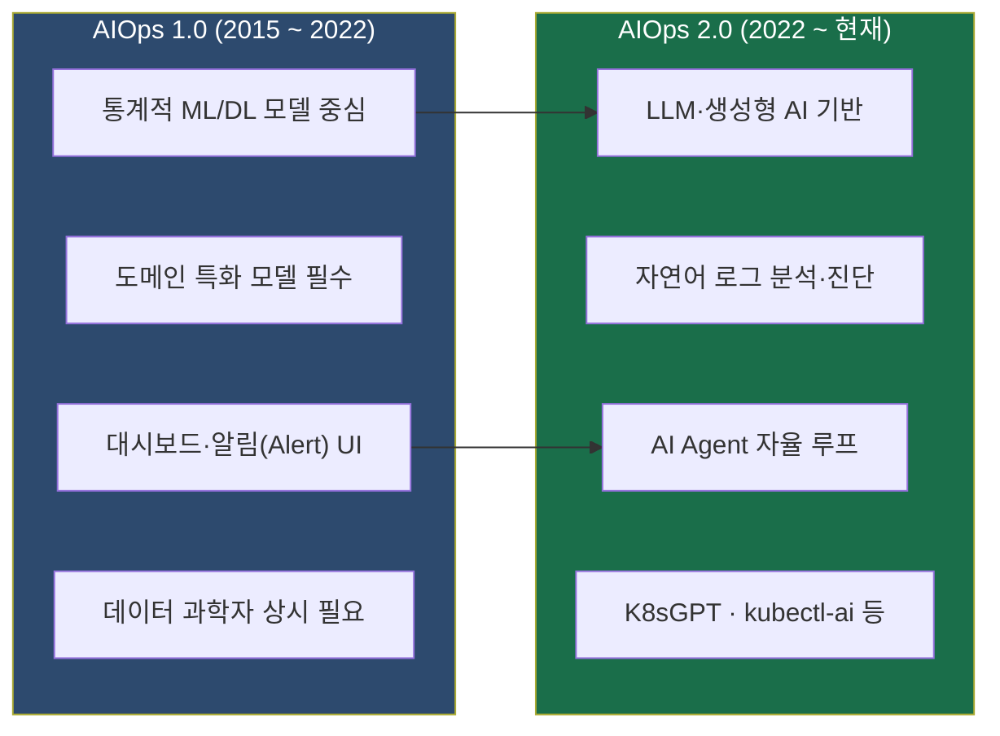

---

### 오답 해설

**①번 (클라우드 vs 온프레미스)**
AIOps 1.0과 2.0의 구분은 인프라가 클라우드에 있느냐 온프레미스에 있느냐와 아무런 관계가 없다. 1.0 AIOps도 AWS, Azure, GCP 클라우드 환경에서 충분히 구현할 수 있었으며, 2.0 AIOps 역시 온프레미스 서버에 구축 가능하다. 이것은 기술 패러다임의 진화이지 인프라 위치의 변화가 아니다.

**③번 (Self-healing vs Reactive 역전)**
Self-healing(자율적 자기 치유)은 1.0과 2.0 모두가 지향하는 목표다. 오히려 1.0 시대의 AIOps 제품들도 이미 규칙 기반 또는 ML 기반 자동 복구 기능을 갖추고 있었다. Kubernetes 자체도 ReplicaSet을 통한 Self-healing을 처음부터 내장하고 있다. "1.0이 Self-healing이고 2.0이 Reactive"라는 것은 실제와 완전히 반대이므로 오답이다.

**④번 (자연어 인터페이스 vs 대시보드의 역전)**
자연어 인터페이스는 LLM 등장 이후인 AIOps 2.0의 특징이고, 대시보드·알림 중심은 1.0의 특징이다. 선택지 ④번은 이 둘을 정반대로 뒤집어 놓은 오답이다.

---

## 문제 2. Deployment의 기본 배포 전략으로 무중단 배포를 제공하는 것

### 문제

> Deployment의 기본 배포 전략으로, 무중단(다운타임 없음) 배포를 제공하는 것은?
>
> 1. Recreate
> 2. Rolling Update
> 3. Blue-Green
> 4. Canary

### ✅ 정답: ?

---

### 정답 해설

Kubernetes Deployment의 `.spec.strategy.type` 필드에 아무 값도 지정하지 않으면, 기본값으로 **`RollingUpdate`(롤링 업데이트)** 가 자동으로 선택된다. 이것이 "기본 배포 전략"이자 "무중단 배포를 제공하는" 전략이다.

Rolling Update는 이름 그대로 구버전 Pod를 **굴러가듯 점진적으로 교체**하는 방식이다. 한꺼번에 전부 내리는 것이 아니라, 새 버전 Pod를 일부 올리고 → 구버전 Pod를 일부 내리는 과정을 반복하여 항상 서비스 중인 Pod가 존재하도록 보장한다.

이 과정을 제어하는 두 가지 핵심 파라미터가 있다.

- **`maxUnavailable`**: 업데이트 도중 동시에 사용 불가(종료) 상태가 될 수 있는 최대 Pod 수 또는 비율이다. 기본값은 25%로, 전체 Pod의 25% 이상이 동시에 내려가지 않음을 보장한다.
- **`maxSurge`**: 배포 도중 원래 목표 개수보다 초과하여 추가 생성될 수 있는 최대 Pod 수 또는 비율이다. 기본값은 25%로, 목표 수보다 25% 더 많은 Pod가 일시적으로 존재할 수 있다.

예를 들어 `replicas: 4`로 설정된 Deployment를 Rolling Update하면, 최대 1개씩 교체가 진행되어 항상 최소 3개의 Pod가 정상 서비스 상태를 유지하면서 업데이트가 완료된다.

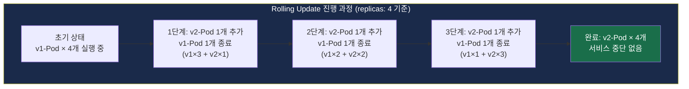

---

### 배포 전략 전체 비교

| 전략 | 기본값 | 무중단 | 설명 | Kubernetes 기본 지원 |
|------|--------|--------|------|----------------------|
| **Rolling Update** | ✅ | ✅ | 점진적 Pod 교체 | ✅ |
| **Recreate** | ❌ | ❌ | 전체 종료 후 재생성 | ✅ |
| **Blue-Green** | ❌ | ✅ | 두 환경 동시 운영 후 트래픽 전환 | ❌ (추가 구성 필요) |
| **Canary** | ❌ | ✅ | 일부 비율 먼저 배포 후 점진 확대 | ❌ (Argo Rollouts 등 필요) |

---

### 오답 해설

**①번 Recreate**
`spec.strategy.type: Recreate`는 기존에 실행 중인 모든 Pod를 **전부 종료**한 뒤, 새 버전 Pod를 **일괄 생성**하는 전략이다. 구버전 종료와 신버전 시작 사이에 반드시 다운타임이 발생하기 때문에 "무중단 배포"와는 정반대 개념이다. 구버전과 신버전이 동시에 실행되면 데이터 정합성에 문제가 생기는 상황(예: 데이터베이스 스키마 마이그레이션)처럼 충돌이 우려되는 특수한 경우에 한해 사용한다.

**③번 Blue-Green**
현재 운영 중인 환경(Blue)과 동일한 새 버전 환경(Green)을 완전히 별도로 구축한 뒤, 트래픽을 한 번에 전환하는 방식이다. 무중단 배포가 가능하고 빠른 롤백이 장점이나, 순간적으로 인프라 리소스가 2배 필요하다. Kubernetes Deployment의 **기본(default)** 전략이 아니며, 보통 Service의 Label Selector를 전환하거나 Argo Rollouts 같은 도구를 추가로 사용해야 한다.

**④번 Canary**
새 버전 Pod를 전체의 일부 비율(예: 5~10%)만 먼저 배포하여 실제 트래픽으로 검증한 뒤, 문제가 없으면 비율을 점진적으로 확대하는 방식이다. 새 버전의 위험을 최소화할 수 있지만, Kubernetes 기본 Deployment 전략이 아니며 Istio, Argo Rollouts, Flagger 같은 추가 도구가 필요하다.

---

## 문제 3. Pod의 Ephemeral IP 문제를 해결하는 오브젝트

### 문제

> Pod의 IP가 계속 바뀌는 문제(Ephemeral IP)를 해결하기 위해 고정 진입점을 제공하고 로드밸런싱하는 오브젝트는?
>
> 1. Ingress
> 2. Service
> 3. ConfigMap
> 4. Namespace

### ✅ 정답: ?

---

### 정답 해설

Kubernetes에서 Pod는 생성될 때마다 새로운 IP 주소를 할당받는다. Pod가 재시작되거나 새로 생성되면 이 IP가 바뀌어버리는데, 이를 **Ephemeral IP(휘발성 IP)** 문제라고 한다. 만약 클라이언트(또는 다른 Pod)가 특정 Pod의 IP를 직접 사용한다면, Pod가 재시작될 때마다 연결이 끊기게 된다.

**Service**는 이 문제를 해결하기 위한 Kubernetes의 핵심 네트워킹 오브젝트로, 다음 세 가지 역할을 동시에 수행한다.

**1. 고정 Virtual IP(ClusterIP) 제공**
Service는 생성 시 `ClusterIP`라는 고정 가상 IP를 할당받는다. 이 IP는 Service가 삭제될 때까지 절대 변하지 않는다. 클라이언트는 Pod IP 대신 Service의 ClusterIP를 사용하면 Pod가 몇 번을 재시작되어도 항상 같은 주소로 접근할 수 있다.

**2. DNS 이름 자동 등록**
Kubernetes 내장 DNS를 통해 `서비스명.네임스페이스명.svc.cluster.local` 형태의 DNS 이름이 자동 등록된다. 따라서 IP를 기억할 필요 없이 이름으로도 접근 가능하다.

**3. Label Selector 기반 로드밸런싱**
Service는 **Label Selector**를 통해 대상 Pod들을 동적으로 찾아낸다. Pod가 삭제·재생성되어 IP가 바뀌어도, 새 Pod에 기존과 같은 Label이 붙어 있다면 Service가 자동으로 해당 Pod를 찾아 트래픽을 분산시킨다. 실제 분산 로직은 각 노드의 `kube-proxy`가 iptables 또는 IPVS 규칙으로 처리한다.

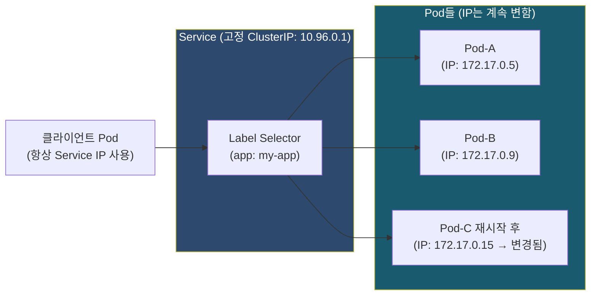

Service의 주요 타입은 네 가지다.

- **ClusterIP**: 클러스터 내부에서만 접근 가능 (기본값)
- **NodePort**: 각 노드의 특정 포트(30000~32767)를 열어 외부 접근 허용
- **LoadBalancer**: 클라우드 제공자의 외부 로드밸런서와 연동하여 외부 IP 발급
- **ExternalName**: 외부 DNS 이름을 클러스터 내에서 사용할 수 있도록 CNAME으로 매핑

---

### 오답 해설

**①번 Ingress**
Ingress는 L7(HTTP/HTTPS) 수준의 URL 경로·호스트명 기반 라우팅 규칙을 정의하는 오브젝트다. Pod IP를 직접 고정하는 것이 아니라, 오히려 Ingress의 뒤에는 반드시 Service가 존재해야 한다. Ingress는 "어느 Service로 보낼까"를 결정하고, Service가 실제 Pod를 찾아 연결하는 구조다.

**③번 ConfigMap**
ConfigMap은 환경변수, 설정 파일 등 비기밀 설정 데이터를 Key-Value 형태로 저장하는 오브젝트다. 네트워킹과는 전혀 무관하다.

**④번 Namespace**
Namespace는 클러스터 내 리소스를 논리적으로 격리하기 위한 가상 경계다. 예를 들어 `dev`, `staging`, `production` 네임스페이스를 분리하여 사용할 수 있지만, IP 관리와는 관계없다.

---

## 문제 4. 단 하나의 로드밸런서로 L7 URL 기반 라우팅을 제공하는 오브젝트

### 문제

> type: LoadBalancer를 마이크로서비스마다 사용할 때 발생하는 문제를 해결하기 위해, 단 하나의 로드밸런서로 L7(HTTP/HTTPS) URL 기반 라우팅을 제공하는 오브젝트는?
>
> 1. NodePort
> 2. Ingress
> 3. ClusterIP
> 4. DaemonSet

### ✅ 정답: ?

---

### 정답 해설

Kubernetes에서 외부 트래픽을 받기 위해 각 서비스마다 `type: LoadBalancer`를 사용하면, 클라우드 제공자(AWS ELB, Azure ALB, GCP GLB 등)에서 **서비스마다 별도의 외부 로드밸런서**가 생성된다. 마이크로서비스가 수십 개라면 수십 개의 로드밸런서가 동시에 만들어져 클라우드 사용료가 폭발적으로 증가하고, 각각의 외부 IP를 모두 관리해야 하는 운영 부담도 커진다.

**Ingress**는 이 문제를 근본적으로 해결하기 위해 설계된 Kubernetes 오브젝트다. **단 하나의 로드밸런서(또는 Ingress Controller)** 가 클러스터 진입 지점에 위치하고, HTTP/HTTPS 요청의 **호스트명**과 **URL 경로**를 분석하여 트래픽을 적절한 Service로 전달하는 **L7(애플리케이션 계층)** 라우팅을 수행한다.

예를 들어, 단일 외부 IP로 들어오는 요청을 Ingress가 다음처럼 분기할 수 있다.

- `api.example.com/users` → users-service
- `api.example.com/orders` → orders-service
- `shop.example.com` → frontend-service

Ingress 오브젝트는 "라우팅 규칙 정의서" 역할을 하며, 실제로 이를 구현하는 것은 **Ingress Controller**다. 클러스터에 `nginx-ingress`, `HAProxy Ingress`, `Traefik`, `AWS ALB Controller` 등 원하는 Ingress Controller를 설치하면 Ingress 규칙이 실제로 동작하기 시작한다.

Ingress는 라우팅 외에도 다음 기능을 추가로 제공할 수 있다.

- **TLS 종료(HTTPS)**: `tls` 섹션 설정으로 HTTPS 인증서 처리
- **리다이렉트**: HTTP → HTTPS 자동 전환
- **레이트 리미팅**: 어노테이션 설정으로 요청 속도 제한
- **기본 인증(Basic Auth)**: 접근 제어 구현

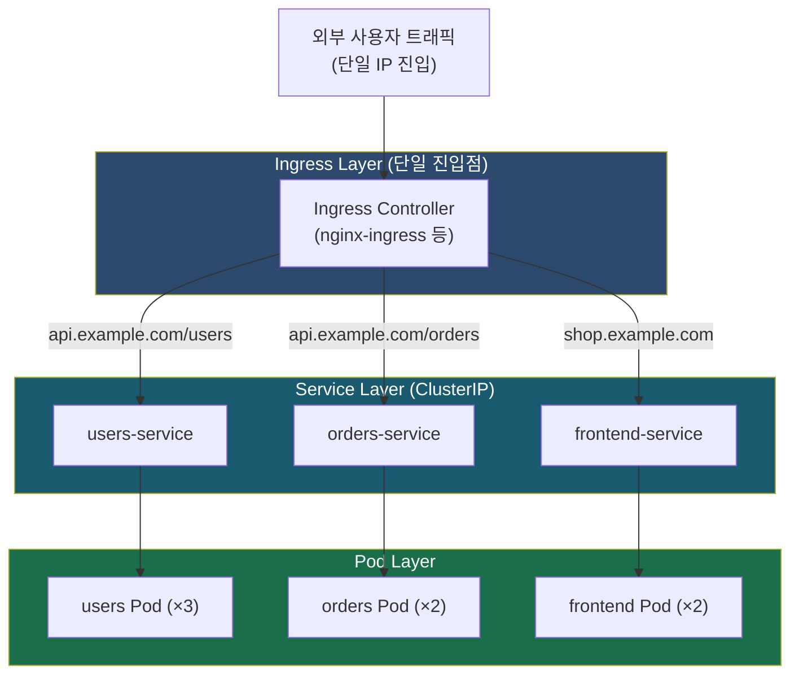

---

### 오답 해설

**①번 NodePort**
NodePort는 Service의 한 타입으로, 클러스터의 모든 노드에 특정 포트(30000~32767 범위)를 열어 외부 접근을 허용한다. 서비스마다 별도의 포트 번호가 필요하고, L7 URL 기반 라우팅 기능이 없으며, 노드 IP를 직접 외부에 노출하는 것은 보안상 권장되지 않는다.

**③번 ClusterIP**
ClusterIP는 Service의 기본 타입으로, 클러스터 내부에서만 접근 가능한 가상 IP를 제공한다. 외부 트래픽을 전혀 받을 수 없으므로 이 문제의 요구사항에 부합하지 않는다.

**④번 DaemonSet**
DaemonSet은 클러스터의 모든(또는 지정한 일부) 노드에 Pod를 1개씩 배포하는 워크로드 컨트롤러다. 로그 수집 에이전트, 모니터링 에이전트, 네트워크 플러그인처럼 각 노드마다 반드시 실행되어야 하는 인프라성 데몬을 배포할 때 사용하며, HTTP 라우팅과는 무관하다.

---

## 문제 5. StorageClass의 volumeBindingMode 값

### 문제

> StorageClass의 volumeBindingMode 중 "PVC를 사용하는 Pod가 생성될 때 비로소 PV를 생성·연결"하는 값은?
>
> 1. Immediate
> 2. WaitForFirstConsumer
> 3. Lazy
> 4. OnDemand

### ✅ 정답: ?

---

### 정답 해설

Kubernetes에서 영구 스토리지를 사용하는 흐름을 먼저 이해해야 한다.

- **PV(PersistentVolume)**: 실제 스토리지 볼륨 리소스 (AWS EBS, Azure Disk, NFS 등)
- **PVC(PersistentVolumeClaim)**: 애플리케이션(Pod)이 "나는 이 정도 크기와 접근 모드의 스토리지가 필요하다"고 요청하는 오브젝트
- **StorageClass**: PVC가 생성될 때 PV를 동적으로 자동 생성하는 방법(프로비저너, 파라미터)을 정의하는 오브젝트

`volumeBindingMode` 필드는 PVC와 PV가 실제로 연결(바인딩)되는 **시점**을 제어한다.

#### `Immediate` — 즉시 바인딩

PVC가 생성되는 즉시 PV를 생성하고 바인딩한다. 문제는 이 시점에 어떤 Pod가 이 PVC를 사용할지, 그 Pod가 어느 노드에 스케줄링될지 아직 알 수 없다는 점이다. AWS EBS나 Azure Disk처럼 특정 가용 영역(AZ: Availability Zone)에 종속된 스토리지의 경우, PV가 `us-east-1a` 가용 영역에 먼저 생성되었는데 Pod가 `us-east-1b` 노드에 스케줄링되면, 해당 Pod는 볼륨을 마운트할 수 없어 `Pending` 상태에 영구 빠지는 문제가 발생한다.

#### `WaitForFirstConsumer` — 첫 소비자 대기 (정답)

PVC를 사용하는 Pod가 실제로 생성되어 Kubernetes 스케줄러가 해당 Pod를 **특정 노드에 배치하기로 결정한 시점**에 비로소 PV를 생성하고 바인딩한다. 이렇게 하면 Pod가 스케줄링될 노드의 위치(가용 영역 등)를 먼저 파악한 뒤, **동일한 가용 영역에 PV를 생성**할 수 있어 마운트 실패 문제가 해결된다. AKS(Azure Kubernetes Service)의 기본 StorageClass인 `managed-csi`도 이 모드를 사용한다.


---

### 오답 해설

**①번 Immediate**
실제로 존재하는 값이지만, "PVC가 생성되는 즉시 PV를 생성"하는 방식이다. 문제의 조건인 "Pod가 생성될 때 비로소 PV를 생성"하는 것과 다르다. 가용 영역 종속 스토리지에서 스케줄링 실패를 유발할 수 있다.

**③번 Lazy**
Kubernetes `volumeBindingMode` 필드에 `Lazy`라는 값은 공식적으로 존재하지 않는다. `WaitForFirstConsumer`와 의미가 비슷하게 들리도록 만든 혼동 유발용 오답이다.

**④번 OnDemand**
마찬가지로 `volumeBindingMode`에 `OnDemand` 값은 존재하지 않는다. 오답 유도용 선택지다.

---

## 문제 6. Job에서 동시에 실행할 Pod 수를 지정하는 필드

### 문제

> Job에서 "한 번에 동시에 실행할 Pod 수"를 지정하는 필드는?
>
> 1. completions
> 2. parallelism
> 3. backoffLimit
> 4. activeDeadlineSeconds

### ✅ 정답: ?

---

### 정답 해설

Kubernetes **Job**은 **일회성 작업**을 실행하기 위한 워크로드 컨트롤러다. Deployment처럼 지속적으로 실행되는 서비스가 아니라, 작업이 성공적으로 완료(Complete)되면 Pod가 종료된다. 배치 데이터 처리, 데이터베이스 마이그레이션, ML 모델 학습, 보고서 생성 등에 활용된다.

Job의 핵심 필드 네 가지를 비교하면 정답이 분명해진다.

| 필드 | 역할 | 예시 |
|------|------|------|
| `completions` | Job이 완료되었다고 판단하기 위해 **성공 완료되어야 하는 총 Pod 수** | `completions: 10` → 10번 성공해야 완료 |
| **`parallelism`** | 한 번에 **동시에 실행될 수 있는 최대 Pod 수** | `parallelism: 3` → 최대 3개 동시 실행 |
| `backoffLimit` | Pod 실패 시 **재시도 횟수 한계** | `backoffLimit: 6` → 6번 실패 시 Job 실패 처리 |
| `activeDeadlineSeconds` | Job 전체의 **최대 실행 시간(초)** | `activeDeadlineSeconds: 300` → 5분 내 완료 못하면 강제 종료 |

따라서 "한 번에 동시에 실행할 Pod 수"는 명확하게 **`parallelism`** 이다.

실제 사용 예를 들면, `completions: 12, parallelism: 4`로 설정하면 총 12번 작업을 완료해야 하는데, 4개씩 병렬로 실행하여 3회에 걸쳐 처리가 완료된다.

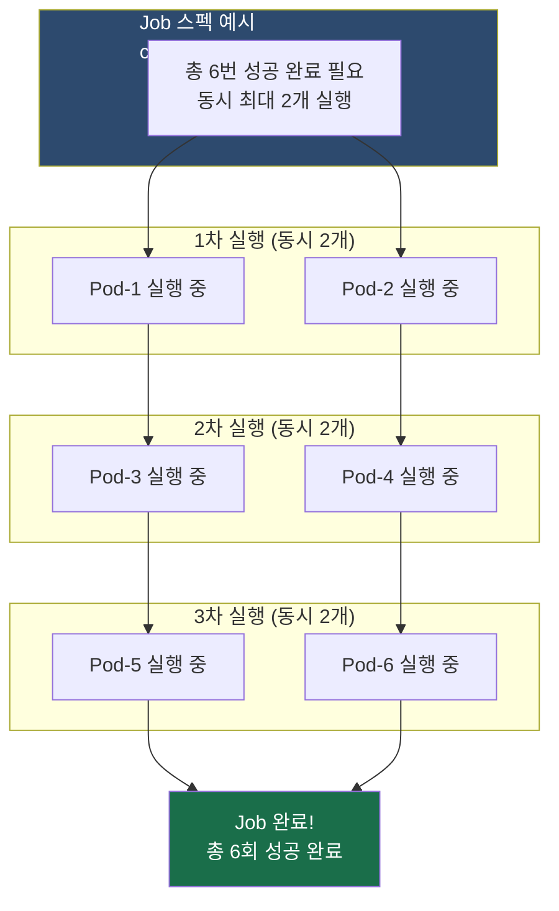

---

### 오답 해설

**①번 completions**
총 성공 완료 횟수(얼마나 많은 Pod가 성공해야 하는가)를 지정하는 필드다. "동시 실행 수"가 아닌 "총 완료 목표 수"이므로 오답이다.

**③번 backoffLimit**
Pod 실패 시 재시도 횟수 한계를 지정하는 필드다. 기본값은 6이며, 이 횟수를 초과하면 Job 전체가 `Failed` 상태가 된다. 동시 실행 수와는 전혀 관계없다.

**④번 activeDeadlineSeconds**
Job 전체가 실행될 수 있는 최대 시간(초)을 지정하는 타임아웃 필드다. 이 시간을 넘기면 실행 중인 Pod들을 강제 종료하고 Job을 `Failed` 처리한다. Pod 수가 아닌 시간을 제어하는 필드다.

---

## 문제 7. Namespace 단위로 총 리소스를 제약하는 오브젝트

### 문제

> Namespace 단위로 사용 가능한 총 리소스(CPU, Memory, 오브젝트 개수 등)를 제약하는 오브젝트는?
>
> 1. LimitRange
> 2. ResourceQuota
> 3. NetworkPolicy
> 4. PodDisruptionBudget

### ✅ 정답: ?

---

### 정답 해설

실제 엔터프라이즈 환경에서는 여러 팀이나 프로젝트가 Namespace로 분리되어 하나의 Kubernetes 클러스터를 공유하는 **멀티테넌시(Multi-tenancy)** 구조로 운영되는 경우가 많다. 이때 특정 팀이 리소스를 독점하거나 과다 사용하면 다른 팀의 서비스에 영향을 줄 수 있다. **ResourceQuota**는 이런 문제를 방지하기 위해 **Namespace 전체에서 사용할 수 있는 리소스의 총량**을 제한하는 오브젝트다.

ResourceQuota로 제한할 수 있는 항목은 크게 세 가지 범주로 나뉜다.

**컴퓨팅 리소스**
- `requests.cpu`: 해당 Namespace 내 모든 Pod의 CPU 요청(Request)량 합계 제한
- `limits.cpu`: CPU 상한(Limit)량 합계 제한
- `requests.memory` / `limits.memory`: 메모리 요청량/상한량 합계 제한

**스토리지 리소스**
- `requests.storage`: 모든 PVC의 총 스토리지 요청량 제한
- `persistentvolumeclaims`: PVC 오브젝트 생성 개수 제한

**오브젝트 수 제한**
- `pods`, `services`, `configmaps`, `secrets`, `deployments`, `replicasets` 등 각 Kubernetes 오브젝트 종류별 최대 생성 개수를 제한할 수 있다.

ResourceQuota가 설정된 Namespace에서 할당량을 초과하는 리소스를 생성하려 하면, API Server가 요청을 즉시 거절한다.

---

### LimitRange와 ResourceQuota의 핵심 차이

이 둘은 자주 혼동되지만 적용 범위가 명확히 다르다.

| 구분 | LimitRange | ResourceQuota |
|------|------------|---------------|
| **적용 범위** | 개별 Pod / Container 1개 | Namespace 전체 합산 |
| **주요 기능** | 리소스 기본값(default), 최솟값(min), 최댓값(max) 설정 | Namespace 내 총 리소스 사용량 상한 설정 |
| **예시** | "컨테이너 1개당 CPU 최대 500m" | "이 팀(Namespace) 전체 CPU 합계 최대 4코어" |

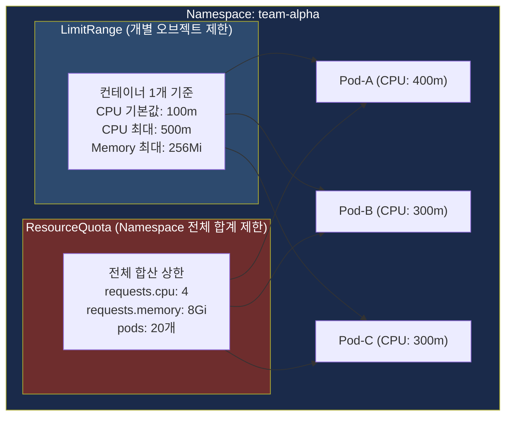

---

### 오답 해설

**①번 LimitRange**
LimitRange는 Namespace 전체의 합산을 제한하는 것이 아니라, **개별 Pod 또는 Container 하나에 대한 리소스 기본값과 최솟/최댓값**을 설정한다. 예를 들어 "이 Namespace에서는 컨테이너 하나당 CPU를 최대 500m까지만 요청할 수 있다"는 규칙이 LimitRange다. Namespace 전체 합산 총량 제한은 ResourceQuota가 담당하므로, 이 문제의 정답은 ResourceQuota다.

**③번 NetworkPolicy**
NetworkPolicy는 Pod 간 네트워크 통신을 허용하거나 차단하는 L3/L4 방화벽 규칙을 정의하는 오브젝트다. "어떤 Pod에서 어떤 Pod로의 트래픽을 허용/차단할지"를 정의하며, CPU/메모리/오브젝트 수 제한과는 전혀 관계없다.

**④번 PodDisruptionBudget (PDB)**
PDB는 노드 드레인, 클러스터 업그레이드 같은 **자발적 중단(Voluntary Disruption)** 상황에서 동시에 중단될 수 있는 Pod의 최솟/최댓수를 보장하는 **가용성 보호** 오브젝트다. 리소스 사용량 제한과는 관계없다.

---

## 문제 8. Taint effect 옵션 중 기존 실행 중인 Pod까지 방출하는 값

### 문제

> Node가 Pod 할당을 거부하는 Taint의 effect 옵션 중, 기존에 실행 중이던 Pod까지 다른 노드로 방출하는 값은?
>
> 1. NoSchedule
> 2. NoExecute
> 3. PreferNoSchedule
> 4. NoAdmit

### ✅ 정답: ?

---

### 정답 해설

**Taint와 Toleration**은 Kubernetes에서 특정 노드에 특정 Pod만 스케줄링되도록 제어하는 메커니즘이다.

- **Taint**: 노드에 "꼬리표(오염)"를 붙여 해당 조건을 수용하지 못하는 Pod의 배치를 기본적으로 거부
- **Toleration**: Pod 스펙에 "이 Taint를 참을(수용할) 수 있다"는 허가를 명시

Taint는 `key=value:effect` 형식으로 정의되며, `effect`에는 세 가지 공식 값이 있다.

---

#### `NoSchedule`

이 Taint를 Toleration으로 허용하지 않는 **신규 Pod는 이 노드에 스케줄링되지 않는다**. 단, 이미 노드에서 실행 중인 Pod에는 영향을 주지 않는다. "새로 들어오는 것만 막는다"는 개념이다.

#### `PreferNoSchedule`

`NoSchedule`의 소프트(Soft) 버전이다. Taint를 허용하지 않는 Pod는 가급적 이 노드를 피해 스케줄링되지만, 다른 노드에 배치할 공간이 없을 경우에는 어쩔 수 없이 이 노드에 스케줄링될 수도 있다. "가능하면 피하되, 어쩔 수 없으면 허용"이라는 개념이다.

#### `NoExecute` (정답)

이 Taint를 Toleration으로 허용하지 않는 Pod는 신규 스케줄링이 거부될 뿐만 아니라, **이미 노드에서 실행 중이던 Pod도 강제로 방출(Evict)** 된다. "지금 있는 것도 모두 내보낸다"는 가장 강력한 효과다. 이것이 문제가 묻는 "기존에 실행 중이던 Pod까지 방출하는" 값이다.

Toleration에 `tolerationSeconds`를 설정하면 방출 전 유예 시간을 줄 수 있다. 예를 들어 `tolerationSeconds: 600`으로 설정한 Pod는 NoExecute Taint가 붙어도 10분 동안은 계속 실행되다가 이후에 방출된다.

Kubernetes 자체도 내부적으로 NoExecute를 자동으로 활용한다. 노드가 `NotReady` 상태가 되거나 네트워크 연결이 끊기면(`Unreachable`), kube-controller-manager가 해당 노드에 자동으로 NoExecute Taint를 붙여 Pod들을 다른 노드로 이동시킨다.

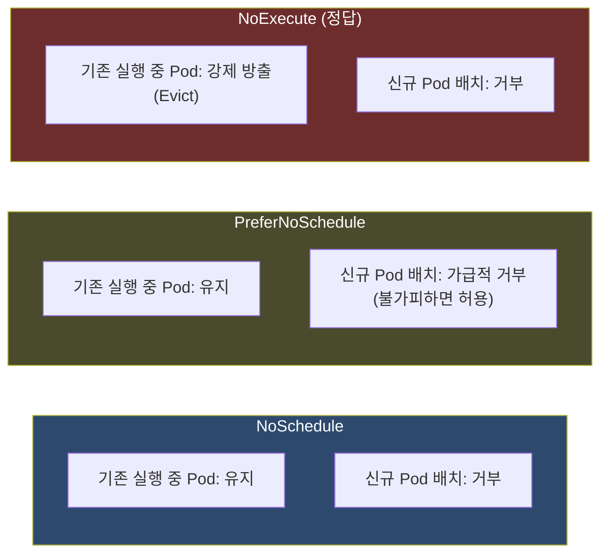

---

### Taint effect 전체 비교

| effect | 신규 Pod 스케줄링 | 기존 실행 Pod | 강도 |
|--------|------------------|--------------|------|
| **NoSchedule** | 거부 | 영향 없음 (유지) | 보통 |
| **PreferNoSchedule** | 가급적 거부 | 영향 없음 (유지) | 약함 |
| **NoExecute** | 거부 | **강제 방출(Evict)** | **가장 강함** |

---

### 오답 해설

**①번 NoSchedule**
신규 Pod 스케줄링만 막고, 이미 실행 중인 Pod는 그대로 유지한다. 문제의 조건("기존에 실행 중이던 Pod까지 방출")을 충족하지 못한다.

**③번 PreferNoSchedule**
스케줄링을 "선호적으로" 피하게 만드는 소프트 제약이다. 반드시 막지는 않으며, 기존 Pod는 영향받지 않는다.

**④번 NoAdmit**
Kubernetes 공식 Taint effect 옵션에 `NoAdmit`은 존재하지 않는다. 혼동을 유발하기 위한 오답 선택지다.

---

## 문제 9. (서술형) Deployment·ReplicaSet·Pod 계층 구조와 무중단 배포·롤백

### 문제

> Deployment, ReplicaSet, Pod의 계층 구조와 각 역할을 설명하고, Deployment가 무중단 배포와 롤백을 어떻게 지원하는지 서술하세요.

### 제출 답변 요약

> - Deployment → ReplicaSet → Pod 계층 구조
> - Deployment가 ReplicaSet을 생성하는 구조이며, Pod scale에 대해 관리함
> - Deployment는 이전 ReplicaSet은 삭제하지 않고 새 ReplicaSet을 생성하여 배포 진행. 롤백은 이전 ReplicaSet을 이용함

---

### ✅ 상세 해설

#### 1. Pod — 가장 작은 배포 단위

Pod는 Kubernetes에서 배포 가능한 **가장 작은 단위 오브젝트**다. Pod 안에는 하나 이상의 컨테이너가 함께 패키징되어 동일한 네트워크 네임스페이스(IP 주소 공유)와 볼륨을 공유한다.

Pod의 중요한 특성이 있는데, Pod는 **자체 장애 복구 능력이 없다**는 점이다. Pod가 갑자기 종료되거나 노드 장애로 사라져도, 아무도 관리하지 않는다면 스스로 재시작되거나 새로 만들어지지 않는다. 이것이 Pod 위에 컨트롤러 계층이 필요한 이유다.

#### 2. ReplicaSet — Pod 개수 유지 컨트롤러

ReplicaSet은 지정한 수(`replicas`)의 Pod가 **항상 실행되도록 유지**하는 컨트롤러다.

ReplicaSet은 **Label Selector**를 통해 자신이 관리하는 Pod를 식별한다. 그리고 지속적으로 조정 루프(Reconciliation Loop)를 실행하여 실제 실행 중인 Pod 수(Actual)와 원하는 Pod 수(Desired)를 비교한다. Pod가 죽어 개수가 줄면 새로 생성하고, 어떤 이유로 너무 많아지면 삭제하여 항상 원하는 수를 유지한다.

단, ReplicaSet은 **Pod의 버전 관리(업데이트, 롤백) 능력이 없다**. 이것이 Deployment가 필요한 이유다.

#### 3. Deployment — 버전 관리 상위 컨트롤러

Deployment는 Pod를 **직접 관리하지 않고**, **ReplicaSet을 생성·관리**하는 상위 컨트롤러다. 이 간접적 관리 구조 덕분에 버전 관리가 가능해진다.

Deployment는 다음을 담당한다.
- 새로운 버전 배포 시 새 ReplicaSet 생성
- 구버전 ReplicaSet의 replicas를 점진적으로 0으로 줄임 (삭제하지 않고 보존)
- 배포 이력(Revision)을 관리하여 롤백 지원

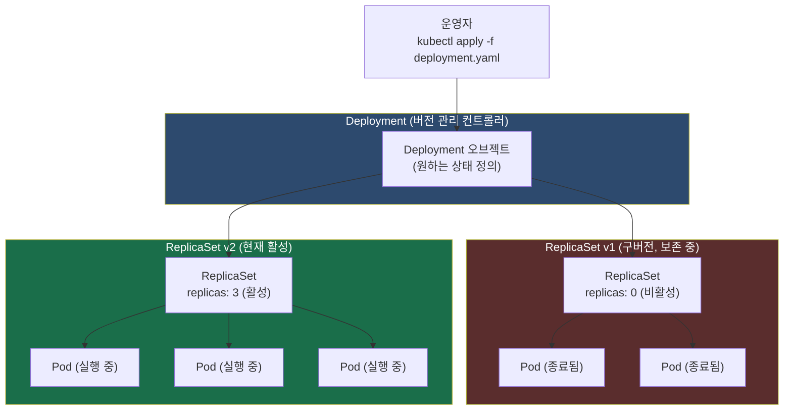

---

#### 4. 무중단 배포 원리 (Rolling Update)

`kubectl apply` 또는 `kubectl set image`로 새 버전을 적용하면 다음 과정이 진행된다.

1. Deployment 컨트롤러가 스펙 변경을 감지한다.
2. 새 버전을 위한 **새 ReplicaSet(v2)** 을 생성하고, 처음에는 `replicas: 0`으로 시작한다.
3. Rolling Update 전략에 따라, **새 ReplicaSet의 replicas를 1씩 늘리면서 동시에 구 ReplicaSet의 replicas를 1씩 줄인다**.
4. `maxUnavailable` 파라미터가 항상 최소한의 Pod가 서비스 중인 상태를 보장한다.
5. 모든 Pod 교체가 완료되면, 구 ReplicaSet은 `replicas=0` 상태로 **삭제되지 않고 보존된다**. 이것이 롤백의 핵심이다.

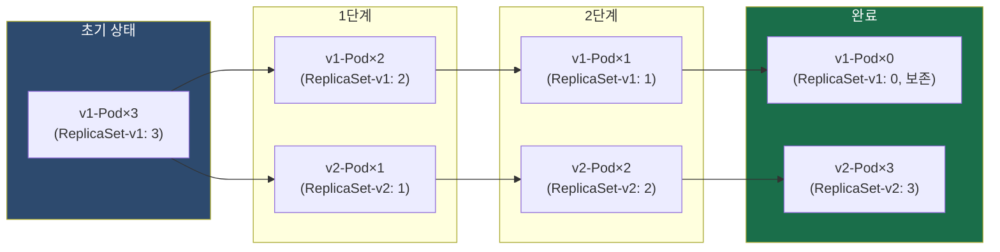

---

#### 5. 롤백 원리 — 이전 ReplicaSet 활용

배포 중 문제가 발견되면 `kubectl rollout undo deployment/<이름>` 명령으로 즉시 이전 버전으로 롤백할 수 있다.

Deployment는 배포할 때마다 상태를 **Revision(리비전)** 으로 저장한다. 각 Revision은 사라지지 않고 replicas=0 상태로 유지 중인 이전 ReplicaSet과 연결되어 있다.

롤백 시에는 현재 활성 ReplicaSet(v2)의 replicas를 0으로 줄이고, 이전 비활성 ReplicaSet(v1)의 replicas를 원하는 수로 늘리는 방식으로 — 즉 Rolling Update와 동일한 원리로 — 안전하게 이전 버전을 복원한다.

보관할 이력 수는 `spec.revisionHistoryLimit` 필드로 제어하며, 기본값은 10이다.

```
# 롤백 관련 명령어
kubectl rollout history deployment/my-app       # 배포 이력(Revision) 조회
kubectl rollout undo deployment/my-app          # 직전 버전으로 롤백
kubectl rollout undo deployment/my-app --to-revision=2  # 특정 Revision으로 롤백
kubectl rollout status deployment/my-app        # 롤백 진행 상태 확인
```

---

## 문제 10. (서술형) HPA와 CA의 차이 및 연계 동작 원리

### 문제

> AKS 오토스케일링의 두 기둥인 HPA와 CA의 차이를 설명하고, 트래픽 증가 시 둘이 연계되어 작동하는 원리를 서술하세요. (HPA의 전제 조건도 포함)

### 제출 답변 요약

> - HPA는 동일 Pod에 대한 scaling. CA는 node 자체를 추가.
> - 트래픽 증가 시 HPA에 의해 pod 스케일링. node 자원이 부족한 경우 추가한 node에 스케일링함.

---

### ✅ 상세 해설

#### 1. HPA (Horizontal Pod Autoscaler) — 소프트웨어 레벨 스케일링

**HPA**는 **Pod의 개수**를 자동으로 조절하는 소프트웨어 레벨 스케일링이다. 물리적 서버(노드)를 건드리지 않고, 애플리케이션 인스턴스(Pod) 수를 동적으로 늘리거나 줄인다.

HPA는 다음과 같이 동작한다.

- **스케일 아웃(Scale Out)**: 부하가 증가하여 임계값(예: CPU 70%)을 초과하면 `maxReplicas`에 도달할 때까지 Pod를 추가
- **스케일 인(Scale In)**: 부하가 감소하면 `minReplicas`까지 Pod를 줄임 (단, 메모리는 한번 올라가면 잘 줄지 않으므로 스케일 인 시 주의)
- **판단 기준**: CPU 사용률(일반적으로 50~70% 기준), 메모리 사용률, 또는 커스텀 메트릭(초당 요청 수 RPS, 메시지 큐 길이 등)
- **반응 속도**: 초~분 단위로 빠르게 반응

---

#### HPA의 핵심 전제 조건 — Metrics Server

HPA가 CPU/메모리 사용량을 알기 위해서는 클러스터에 **Metrics Server**가 반드시 설치되어 있어야 한다. Metrics Server는 각 노드의 kubelet으로부터 실시간 리소스 사용량 데이터를 수집하여 Kubernetes API에 제공하는 클러스터 내부 컴포넌트다.

AKS(Azure Kubernetes Service)에는 Metrics Server가 기본적으로 설치되어 있다. 온프레미스나 자체 구성 클러스터에서는 별도로 설치해야 한다.

설치 확인 방법은 다음과 같다.

```bash
kubectl top nodes       # 노드별 CPU/메모리 현황 확인
kubectl top pods        # Pod별 CPU/메모리 현황 확인
```

이 명령이 정상 동작하면 Metrics Server가 작동 중인 것이다. Metrics Server 없이 HPA를 생성하면, HPA는 메트릭을 가져오지 못해 `<unknown>` 상태를 표시하고 자동 스케일링이 전혀 동작하지 않는다.

---

#### 2. CA (Cluster Autoscaler) — 인프라 레벨 스케일링

**CA**는 **Node(서버)의 수**를 자동으로 조절하는 인프라 레벨 스케일링이다. 클라우드 제공자의 노드 풀(Node Pool)과 연동하여 VM 인스턴스를 추가하거나 제거한다.

CA는 다음과 같이 동작한다.

- **스케일 아웃**: 스케줄링 불가(`Pending`)한 Pod가 발생하면(즉, 현재 노드 전체를 돌아봤는데 배치할 공간이 없을 때), 새 노드를 추가하여 해당 Pod를 수용
- **스케일 인**: 장기간 리소스 사용률이 낮은 노드가 감지되면, 해당 노드의 Pod들을 다른 노드로 이동시키고(`Drain`) 빈 노드를 삭제하여 비용 절감
- **반응 속도**: 새 VM을 부팅하고 클러스터에 조인하는 시간이 필요하여 분 단위로 느림 (일반적으로 AKS 기준 2~5분 소요)

---

#### 3. 연계 동작 원리 — "HPA 먼저, CA 나중"

트래픽 급증 시나리오에서 HPA와 CA는 다음 순서로 협력한다.

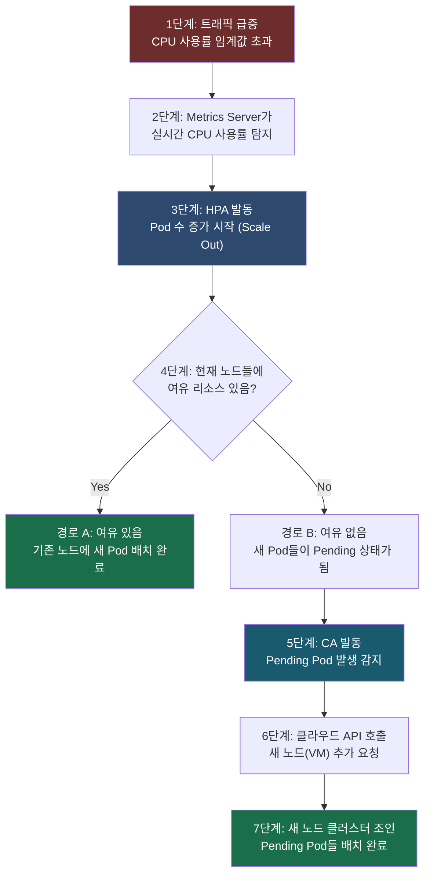

핵심은 **HPA → (공간 부족 시) → CA** 순서다. CA는 HPA가 요청한 Pod 수를 직접 알지 못한다. 단순히 "스케줄링되지 못하고 Pending 상태인 Pod가 있으니 노드를 추가해야 한다"는 신호에 반응하는 것이다.

반대 방향(스케일 인)에서도 협력한다. 트래픽이 줄면 HPA가 Pod 수를 줄이고, 비어가는 노드를 CA가 감지하여 노드를 제거함으로써 클라우드 인프라 비용을 절약한다.

---

#### 4. HPA와 CA 종합 비교

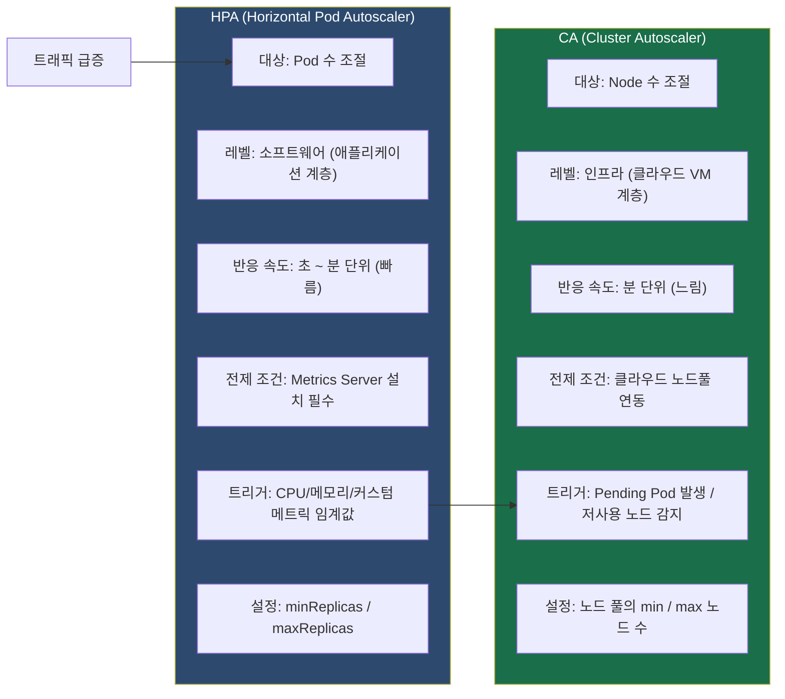

| 구분 | HPA | CA |
|------|-----|----|
| **스케일 대상** | Pod 수 | Node 수 |
| **레벨** | 소프트웨어 | 인프라 |
| **반응 속도** | 초~분 (빠름) | 분 단위 (느림) |
| **전제 조건** | Metrics Server 설치 | 클라우드 노드풀 연동 |
| **트리거** | CPU/메모리/커스텀 메트릭 | Pending Pod 발생 |
| **스케일 인 주의사항** | 메모리 기반은 천천히 줄어야 함 | PodDisruptionBudget 존중 |

---

## 정답 요약표

| 번호 | 유형 | 정답 | 핵심 키워드 |
|------|------|------|------------|
| 1 | 객관식 | **②** | AIOps 1.0 = 통계적 ML/DL / AIOps 2.0 = LLM + 생성형 AI + AI Agent |
| 2 | 객관식 | **②** | Rolling Update = Deployment 기본값, 무중단 배포, maxUnavailable/maxSurge |
| 3 | 객관식 | **②** | Service = 고정 ClusterIP + Label Selector + 로드밸런싱 |
| 4 | 객관식 | **②** | Ingress = L7 URL 라우팅, 단일 진입점, Ingress Controller 필요 |
| 5 | 객관식 | **②** | WaitForFirstConsumer = Pod 스케줄링 시점에 PV 생성, AZ 가용성 문제 해결 |
| 6 | 객관식 | **②** | parallelism = 동시 실행 Pod 수 / completions = 총 완료 수 |
| 7 | 객관식 | **②** | ResourceQuota = Namespace 전체 합산 제한 / LimitRange = 개별 오브젝트 제한 |
| 8 | 객관식 | **②** | NoExecute = 기존 실행 중 Pod도 강제 Evict / NoSchedule = 신규만 거부 |
| 9 | 서술형 | — | Deployment → ReplicaSet → Pod 계층, Rolling Update, Revision 기반 롤백 |
| 10 | 서술형 | — | HPA(Pod) → CA(Node), Metrics Server 전제, Pending 트리거, 분 단위 지연 |


