> **과정명**: MS Azure Kubernetes 기반 AIOps 실전  
> **실습 환경**: Azure Kubernetes Service (AKS) — Korea Central  
> **작성일**: 2026-06-10  
> **대상**: Kubernetes 네트워크 보안 정책(NetworkPolicy)을 실무 수준으로 이해하고 적용하려는 엔지니어

## 실습 문서

[**Lab 8 - 네트워크 정책**](https://psedu.gitbook.io/k8s-aiops-aks/lab-8)

[**Kubernetes AIOps 실전.pdf**](https://drive.google.com/file/d/1aA2YTol6pRqIkpTyQs0GtZghoVqr7P0E/view?usp=sharing)


## 관련 문서

- [**Azure AKS 기반 Kubernetes AIOps — 클러스터 배포 및 워크로드 배포**](https://k82022603.github.io/posts/azure-aks-%EA%B8%B0%EB%B0%98-kubernetes-aiops-%ED%81%B4%EB%9F%AC%EC%8A%A4%ED%84%B0-%EB%B0%B0%ED%8F%AC-%EB%B0%8F-%EC%9B%8C%ED%81%AC%EB%A1%9C%EB%93%9C-%EB%B0%B0%ED%8F%AC/)
- [**Azure AKS 기반 Kubernetes AIOps — Service 및 Ingress 라우팅**](https://k82022603.github.io/posts/azure-aks-%EA%B8%B0%EB%B0%98-kubernetes-aiops-service-%EB%B0%8F-ingress-%EB%9D%BC%EC%9A%B0%ED%8C%85/)
- [**Azure AKS 기반 Kubernetes AIOps — Volume 과 StorageClass**](https://k82022603.github.io/posts/azure-aks-%EA%B8%B0%EB%B0%98-kubernetes-aiops-volume-%EA%B3%BC-storageclass/)
- [**Azure AKS 기반 Kubernetes AIOps — 특수 워크로드 관리**](https://k82022603.github.io/posts/azure-aks-%EA%B8%B0%EB%B0%98-kubernetes-aiops-%ED%8A%B9%EC%88%98-%EC%9B%8C%ED%81%AC%EB%A1%9C%EB%93%9C-%EA%B4%80%EB%A6%AC/)
- [**Azure AKS 기반 Kubernetes AIOps — 리소스 관리**](https://k82022603.github.io/posts/azure-aks-%EA%B8%B0%EB%B0%98-kubernetes-aiops-%EB%A6%AC%EC%86%8C%EC%8A%A4-%EA%B4%80%EB%A6%AC/)
- [**Azure AKS 기반 Kubernetes AIOps — 워크로드 배치 제어**](https://k82022603.github.io/posts/azure-aks-%EA%B8%B0%EB%B0%98-kubernetes-aiops-%EC%9B%8C%ED%81%AC%EB%A1%9C%EB%93%9C-%EB%B0%B0%EC%B9%98-%EC%A0%9C%EC%96%B4/)
- **Azure AKS 기반 Kubernetes AIOps — 네트워크 정책**
- [**Azure AKS 기반 Kubernetes AIOps — kubernetes 고가용성**](https://k82022603.github.io/posts/azure-aks-%EA%B8%B0%EB%B0%98-kubernetes-aiops-kubernetes-%EA%B3%A0%EA%B0%80%EC%9A%A9%EC%84%B1/)
- [**Azure AKS 기반 Kubernetes AIOps — 모니터링**](https://k82022603.github.io/posts/azure-aks-%EA%B8%B0%EB%B0%98-kubernetes-aiops-%EB%AA%A8%EB%8B%88%ED%84%B0%EB%A7%81/)
- [**Azure AKS 기반 Kubernetes AIOps — AI 기반 tools**](https://k82022603.github.io/posts/azure-aks-%EA%B8%B0%EB%B0%98-kubernetes-aiops-ai-%EA%B8%B0%EB%B0%98-tools/)
- [**Azure AKS 기반 Kubernetes AIOps — 과정 평가 문제별 정답과 핵심 개념**](https://k82022603.github.io/posts/azure-aks-%EA%B8%B0%EB%B0%98-kubernetes-aiops-%EA%B3%BC%EC%A0%95-%ED%8F%89%EA%B0%80-%EB%AC%B8%EC%A0%9C%EB%B3%84-%EC%A0%95%EB%8B%B5%EA%B3%BC-%ED%95%B5%EC%8B%AC-%EA%B0%9C%EB%85%90/)

---

## 목차

1. [NetworkPolicy란 무엇인가](#1-networkpolicy란-무엇인가)
2. [Kubernetes 기본 네트워크 동작 이해](#2-kubernetes-기본-네트워크-동작-이해)
3. [NetworkPolicy 핵심 구조 분석](#3-networkpolicy-핵심-구조-분석)
4. [AKS에서의 NetworkPolicy 구현 방식](#4-aks에서의-networkpolicy-구현-방식)
5. [Lab 8 Task 1 — 기본 NetworkPolicy 실습](#5-lab-8-task-1--기본-networkpolicy-실습)
6. [Lab 8 Task 2 — AIOps 시나리오 기반 NetworkPolicy 실습](#6-lab-8-task-2--aiops-시나리오-기반-networkpolicy-실습)
7. [NetworkPolicy 패턴 및 정책 유형](#7-networkpolicy-패턴-및-정책-유형)
8. [실제 운영 환경 응용](#8-실제-운영-환경-응용)
9. [비교표 모음](#9-비교표-모음)
10. [Claude Code 프롬프트 — AIOps 구축 및 운영](#10-claude-code-프롬프트--aiops-구축-및-운영)
11. [자주 발생하는 오류와 해결 방법](#11-자주-발생하는-오류와-해결-방법)
12. [정리 및 다음 단계](#12-정리-및-다음-단계)

**별첨**

- [별첨 A — NetworkPolicy vs. Istio Service Mesh 상세 비교](#별첨-a--networkpolicy-vs-istio-service-mesh-상세-비교)
  - A.1 두 기술이 다루는 네트워크 계층
  - A.2 핵심 기능 상세 비교 (보안 / 트래픽 관리 / 관찰가능성 / 운영 복잡도)
  - A.3 Istio 아키텍처 심층 이해 (사이드카 모드 / Ambient Mesh)
  - A.4 트래픽 차단 시 동작 차이
  - A.5 두 기술의 상호작용 — 처리 순서
  - A.6 선택 기준 — 어떤 기술을 언제 사용할 것인가
  - A.7 Defense-in-Depth — NetworkPolicy + Istio 조합 아키텍처
- [별첨 B — AKS 및 VM 기반 Kubernetes 최적 네트워크 정책 아키텍처 설계](#별첨-b--aks-및-vm-기반-kubernetes-최적-네트워크-정책-아키텍처-설계)
  - B.1 설계 원칙
  - B.2 AKS 기반 최적 네트워크 정책 아키텍처
  - B.3 VM 기반 Self-Managed Kubernetes 최적 아키텍처
  - B.4 전체 아키텍처 통합 참조 모델
  - B.5 선택 시나리오별 최종 권장 구성
  - B.6 별첨 요약

---

## 1. NetworkPolicy란 무엇인가

Kubernetes의 기본 철학은 클러스터 내의 모든 Pod가 서로 자유롭게 통신할 수 있어야 한다는 것입니다. 이는 개발 초기 단계에서는 매우 편리하지만, 실제 운영 환경에서는 심각한 보안 위협이 됩니다. 예를 들어 디버깅용으로 임시 배포된 Pod가 악의적인 행위자에 의해 탈취된다면, 그 Pod에서 클러스터 내의 데이터베이스나 결제 서비스에 무제한으로 접근할 수 있습니다.

이 문제를 해결하기 위해 Kubernetes는 **NetworkPolicy**라는 리소스를 제공합니다. NetworkPolicy는 Pod 간의 네트워크 트래픽을 레이블(Label) 기반으로 제어하는 쿠버네티스 네이티브 방화벽 규칙입니다. 물리적 네트워크의 방화벽이 IP 주소와 포트 번호를 기준으로 트래픽을 허용하거나 차단하듯, Kubernetes의 NetworkPolicy는 Pod 레이블, 네임스페이스 레이블, IP 블록을 기준으로 동일한 역할을 수행합니다.

NetworkPolicy의 핵심 특성은 다음과 같습니다. 첫째, NetworkPolicy는 기본적으로 **화이트리스트(허용 목록) 방식**으로 동작합니다. 어떤 Pod에 NetworkPolicy가 적용되는 순간, 그 NetworkPolicy에서 명시적으로 허용되지 않은 모든 트래픽은 자동으로 차단됩니다. 둘째, NetworkPolicy는 **네임스페이스 스코프(Namespaced Resource)** 리소스입니다. 즉, 하나의 NetworkPolicy는 자신이 생성된 네임스페이스 내의 Pod에만 적용됩니다. 셋째, NetworkPolicy가 실제로 동작하려면 이를 지원하는 **CNI(Container Network Interface) 플러그인**이 클러스터에 설치되어 있어야 합니다. NetworkPolicy 리소스를 생성하더라도 CNI가 이를 지원하지 않으면 아무런 효과가 없습니다.

---

## 2. Kubernetes 기본 네트워크 동작 이해

### 2.1 기본 허용(Default Allow) 상태

Kubernetes 클러스터에서 NetworkPolicy가 하나도 없는 상태를 가리켜 "기본 허용(Default Allow)" 상태라고 합니다. 이 상태에서는 같은 클러스터 내의 모든 Pod가 서로 자유롭게 통신할 수 있습니다. 네임스페이스 경계도 기본적으로는 네트워크 격리를 제공하지 않습니다.

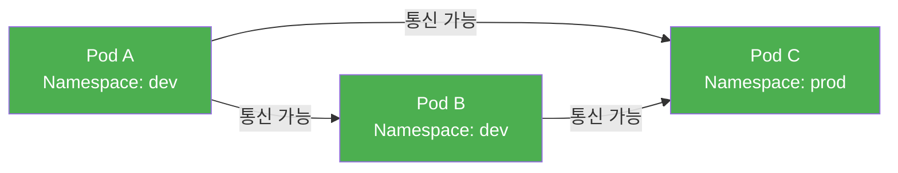

이 상태는 공격자가 하나의 Pod만 탈취해도 클러스터 전체로 횡적 이동(Lateral Movement)이 가능하기 때문에 보안상 매우 위험합니다.

### 2.2 NetworkPolicy 적용 후 동작

특정 Pod에 NetworkPolicy가 적용되면, 그 Pod는 "격리된(Isolated)" 상태가 됩니다. 격리된 Pod는 NetworkPolicy에서 명시적으로 허용된 트래픽만 수신(또는 송신)할 수 있습니다.

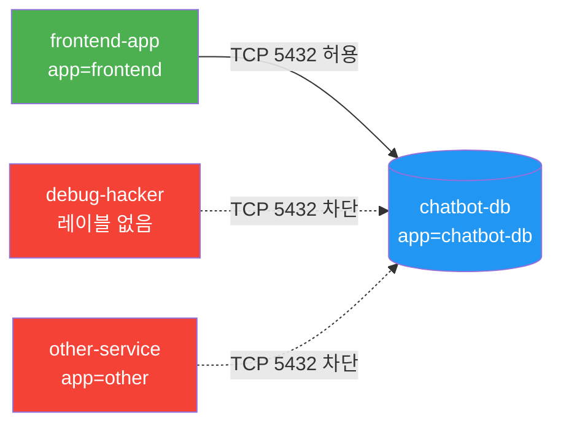

중요한 점은 NetworkPolicy는 **선택된 Pod(보호 대상)** 의 관점에서 동작한다는 것입니다. 보호 대상 Pod에 Ingress 규칙이 적용되면, 해당 Pod로 들어오는 트래픽 중 허용 규칙에 매칭되는 것만 통과할 수 있습니다.

---

## 3. NetworkPolicy 핵심 구조 분석

NetworkPolicy YAML의 각 필드가 어떤 역할을 하는지 실습에서 사용한 예제를 통해 상세히 살펴봅니다.

### 3.1 기본 구조

```yaml
apiVersion: networking.k8s.io/v1
kind: NetworkPolicy
metadata:
  name: allow-frontend-to-backend
  namespace: net-test
spec:
  podSelector:           # (1) 이 정책이 보호할 Pod 선택
    matchLabels:
      role: backend
  policyTypes:           # (2) 정책 방향 지정 (Ingress/Egress/Both)
  - Ingress
  ingress:               # (3) 허용할 인바운드 트래픽 규칙
  - from:
    - podSelector:       # (4) 허용할 출발지 Pod 조건
        matchLabels:
          role: frontend
```

### 3.2 각 필드 상세 설명

#### (1) `spec.podSelector` — 정책 적용 대상 (보호 대상 Pod)

이 필드는 NetworkPolicy가 "누구를 보호할 것인가"를 결정합니다. `matchLabels`에 지정된 레이블을 가진 Pod가 이 NetworkPolicy의 보호를 받습니다. 만약 `podSelector: {}`처럼 빈 셀렉터를 지정하면, 해당 네임스페이스의 **모든 Pod**가 보호 대상이 됩니다. 이것이 바로 "Default Deny All" 패턴의 핵심입니다.

#### (2) `spec.policyTypes` — 정책 방향

- `Ingress`: 보호 대상 Pod로 들어오는 트래픽을 제어합니다
- `Egress`: 보호 대상 Pod에서 나가는 트래픽을 제어합니다
- 두 가지를 모두 나열하면 양방향 모두 제어합니다

`policyTypes`에 `Ingress`가 명시되면, 해당 Pod의 모든 인바운드 트래픽은 `ingress` 규칙에서 명시적으로 허용된 것만 통과할 수 있습니다. 규칙이 없는 방향은 "기본 차단"이 됩니다.

#### (3) `ingress` 또는 `egress` — 허용 규칙 목록

이 섹션에서는 허용할 트래픽의 조건을 나열합니다. 여러 규칙을 나열하면 OR 조건으로 처리되어, 하나라도 매칭되면 허용됩니다.

#### (4) `ingress[].from` 또는 `egress[].to` — 출발지/목적지 조건

트래픽의 출발지(from) 또는 목적지(to)를 세 가지 방식으로 지정할 수 있습니다:

```yaml
ingress:
- from:
  # 방식 1: Pod 레이블 기반 (같은 네임스페이스 내)
  - podSelector:
      matchLabels:
        role: frontend
  # 방식 2: 네임스페이스 레이블 기반
  - namespaceSelector:
      matchLabels:
        environment: production
  # 방식 3: IP 블록 기반
  - ipBlock:
      cidr: 192.168.1.0/24
      except:
      - 192.168.1.100/32
```

#### (5) `ports` — 허용 포트

특정 포트만 허용하려면 `ports` 섹션을 추가합니다. 포트를 지정하지 않으면 해당 출발지로부터의 모든 포트가 허용됩니다.

```yaml
ingress:
- from:
  - podSelector:
      matchLabels:
        app: frontend
  ports:
  - protocol: TCP
    port: 5432
```

### 3.3 AND 조건과 OR 조건의 차이

NetworkPolicy에서 가장 혼동하기 쉬운 부분은 `from` 배열 내의 여러 셀렉터가 AND 조건인지 OR 조건인지입니다.

**OR 조건 (별도 항목 `-`)**: 아래 예시에서 두 조건은 OR입니다. `role=frontend`이거나 `role=admin`인 Pod 모두 허용됩니다.
```yaml
ingress:
- from:
  - podSelector:
      matchLabels:
        role: frontend
  - podSelector:
      matchLabels:
        role: admin
```

**AND 조건 (같은 항목 내)**: 아래 예시에서 두 조건은 AND입니다. `role=frontend` 레이블을 가지면서 동시에 `environment=production` 네임스페이스에 속한 Pod만 허용됩니다.
```yaml
ingress:
- from:
  - podSelector:
      matchLabels:
        role: frontend
    namespaceSelector:
      matchLabels:
        environment: production
```

이 미묘한 차이를 이해하는 것이 보안 정책을 올바르게 설계하는 데 매우 중요합니다.

---

## 4. AKS에서의 NetworkPolicy 구현 방식

### 4.1 AKS가 지원하는 NetworkPolicy 엔진

Azure Kubernetes Service(AKS)는 2026년 현재 세 가지 NetworkPolicy 엔진을 지원합니다.

| 엔진 | 설명 | 지원 레이어 | 비고 |
|------|------|------------|------|
| **Azure Network Policy Manager (NPM)** | Azure 자체 구현체, iptables 기반 | L3/L4 | 2028년 9월 30일 지원 종료 예정 |
| **Calico** | Tigera 오픈소스, iptables/eBPF 기반 | L3/L4 | AKS에서 옵션으로 선택 가능 |
| **Cilium** (권장) | eBPF 기반 고성능 구현체 | L3/L4/L7 | Azure CNI Powered by Cilium에서 사용 |

Microsoft는 신규 AKS 클러스터에 대해 **Azure CNI Powered by Cilium** 사용을 권장합니다. Cilium은 Linux 커널의 eBPF(extended Berkeley Packet Filter) 기술을 활용하여 iptables 방식보다 높은 성능과 확장성을 제공하며, HTTP/gRPC/Kafka 등 Layer 7 수준의 정책까지 지원합니다.

### 4.2 본 실습 환경의 CNI 구성

본 실습에서 사용한 AKS 클러스터는 Azure CNI(Azure Container Networking Interface)를 사용합니다. Azure CNI 환경에서는 Pod에 VNet 내의 실제 IP 주소가 직접 할당되므로, 터미널 출력에서 확인한 것처럼 Pod IP가 `10.224.0.x` 형태의 VNet 주소 범위에 속합니다.

```
NAME           READY   STATUS    IP             NODE
chatbot-db     1/1     Running   10.224.0.9     aks-nodepool1-...
frontend-app   1/1     Running   10.224.0.31    aks-nodepool1-...
```

이처럼 Pod IP가 VNet 주소 범위에서 할당되므로, Azure Portal의 VNet 리소스에서도 Pod 간 통신을 추적할 수 있습니다.

### 4.3 Cilium의 Layer 7 정책 확장 (참고)

표준 Kubernetes NetworkPolicy는 L3(IP)/L4(Port) 수준까지만 제어가 가능합니다. Cilium을 사용하면 `CiliumNetworkPolicy` 커스텀 리소스를 통해 L7 수준의 HTTP 메서드, 경로(Path), gRPC 서비스명까지 제어할 수 있습니다. 예를 들어 "같은 서비스라도 GET 요청만 허용하고 DELETE 요청은 차단"하는 것이 가능합니다.

---

## 5. Lab 8 Task 1 — 기본 NetworkPolicy 실습

### 5.1 실습 목표

Task 1의 핵심 목표는 Kubernetes NetworkPolicy의 기본 동작 원리인 **레이블 기반 선택적 허용**을 직접 검증하는 것입니다. 세 개의 Pod(frontend, backend, other)를 활용하여 허용된 Pod와 허용되지 않은 Pod 사이의 통신 차이를 체험합니다.

### 5.2 실습 환경 구성

실습을 위해 `net-test`라는 전용 네임스페이스를 생성하고, 그 안에 세 개의 Pod를 배포했습니다.

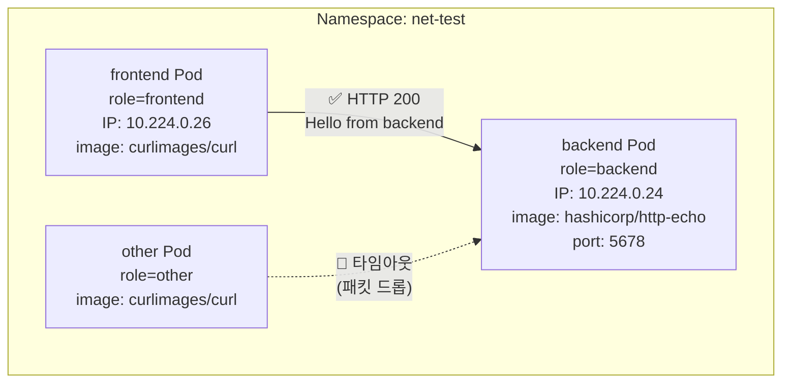

#### frontend Pod

`curlimages/curl` 이미지는 HTTP 클라이언트 도구인 `curl`만 포함된 매우 경량의 컨테이너 이미지입니다. `command: ["sleep", "3600"]`을 지정한 이유는 curl 명령 없이 Pod를 단순히 대기 상태로 유지하기 위해서입니다. 만약 `sleep` 명령 없이 Pod를 생성하면 컨테이너가 즉시 종료되어 `Completed` 상태가 되고, 이후 `kubectl exec`로 접속할 수 없게 됩니다.

#### backend Pod

`hashicorp/http-echo`는 HashiCorp에서 제공하는 테스트용 HTTP 서버 이미지입니다. `args: ["-text=Hello from backend"]`를 지정하면 5678 포트에서 HTTP 요청을 받아 "Hello from backend"라는 텍스트를 응답으로 반환합니다. 실제 운영에서 PostgreSQL이나 Redis 같은 백엔드 서비스를 대신하는 경량 목(Mock) 서버 역할입니다.

#### other Pod

`frontend`와 동일한 이미지와 명령어를 사용하지만, 레이블이 `role=other`입니다. NetworkPolicy의 허용 조건에 매칭되지 않는 "권한 없는 클라이언트"를 시뮬레이션합니다.

### 5.3 NetworkPolicy 적용 및 동작 원리

```yaml
apiVersion: networking.k8s.io/v1
kind: NetworkPolicy
metadata:
  name: allow-frontend-to-backend
  namespace: net-test
spec:
  podSelector:
    matchLabels:
      role: backend        # backend Pod를 보호 대상으로 지정
  policyTypes:
  - Ingress                # Ingress(수신) 트래픽을 제어
  ingress:
  - from:
    - podSelector:
        matchLabels:
          role: frontend   # role=frontend Pod만 접근 허용
```

이 NetworkPolicy가 적용되는 순간, `backend` Pod는 "격리된(Isolated)" 상태가 됩니다. 이후부터 `backend` Pod로 들어오는 모든 Ingress 트래픽은 `role=frontend` 레이블을 가진 Pod에서 온 것만 허용됩니다. `role=other` 레이블을 가진 `other` Pod에서 보낸 패킷은 CNI 플러그인에 의해 네트워크 수준에서 드롭(Drop)됩니다.

### 5.4 실습에서 발생한 오류 분석

실습 과정에서 세 가지 YAML 작성 오류가 발생했습니다. 이 오류들은 Kubernetes를 처음 다루는 사람들이 흔히 겪는 문제이므로 상세히 분석합니다.

**오류 1 — `metadata.spec` 들여쓰기 오류**

```yaml
# 잘못된 YAML
metadata:
  name: frontend
  namespace: net-test
  labels:
    role: frontend
  spec:            # ← spec이 metadata 안에 들여쓰기됨
    containers:
    ...

# 올바른 YAML
metadata:
  name: frontend
  namespace: net-test
  labels:
    role: frontend
spec:              # ← spec은 metadata와 같은 레벨에 있어야 함
  containers:
  ...
```

Kubernetes API 서버는 YAML을 엄격하게 파싱합니다. `spec`이 `metadata` 하위에 위치하면 `metadata.spec`이라는 알 수 없는 필드로 인식되어 `strict decoding error`가 발생합니다.

**오류 2 — NetworkPolicy `from` 구조 오류**

```yaml
# 잘못된 구조
ingress:
- from:
  - matchLabels:        # ← from 바로 아래 matchLabels 불가
      role: frontend

# 올바른 구조
ingress:
- from:
  - podSelector:        # ← podSelector 래퍼 필요
      matchLabels:
        role: frontend
```

`from` 배열의 각 항목은 반드시 `podSelector`, `namespaceSelector`, `ipBlock` 중 하나를 키로 사용해야 합니다. `matchLabels`를 직접 `from` 하위에 사용할 수 없습니다.

**오류 3 — 배열 쉼표 누락**

```yaml
command: ["sleep" "3600"]   # ❌ 쉼표 없음
command: ["sleep", "3600"]  # ✅ 올바른 형태
```

YAML의 인라인 배열 표기법에서는 항목 사이에 반드시 쉼표가 필요합니다.

### 5.5 테스트 결과

```
[허용 케이스] frontend → backend
  kubectl exec -n net-test frontend -- curl 10.224.0.24:5678
  → HTTP 200, "Hello from backend" 즉시 응답

[차단 케이스] other → backend
  kubectl exec -n net-test other -- curl 10.224.0.24:5678
  → 무한 대기 (Ctrl+C로 강제 종료)
  → TCP SYN 패킷이 backend에 도달하지 못함
  → 서버 응답 없음 = 패킷 드롭(Drop) 확인
```

차단 시 `Connection refused` 대신 타임아웃이 발생하는 이유는, 네트워크 정책에 의한 차단은 **패킷 자체를 버리는(Drop) 방식**이기 때문입니다. 서버가 연결을 거부하면 `Connection refused(RST 패킷)`이 발생하지만, 패킷 드롭은 응답 자체가 없어 클라이언트는 무한히 대기합니다.

---

## 6. Lab 8 Task 2 — AIOps 시나리오 기반 NetworkPolicy 실습

### 6.1 시나리오 배경

Task 2는 실제 AIOps(AI for IT Operations) 플랫폼 운영 시나리오를 기반으로 합니다. 클러스터의 `ai-bot-dev` 네임스페이스에는 AI 추론 서비스, 챗봇 프론트엔드, 결제 서비스, 데이터베이스 등 다양한 마이크로서비스가 운영 중입니다.

보안팀의 요구사항은 명확합니다. "PostgreSQL DB Pod는 오직 `app=frontend` 레이블을 가진 Pod의 접근만 허용하고, 나머지 모든 접근은 차단하라."

### 6.2 미션 1 — 타겟 및 클라이언트 Pod 배포

```yaml
# chatbot-db Pod
apiVersion: v1
kind: Pod
metadata:
  name: chatbot-db
  namespace: ai-bot-dev
  labels:
    app: chatbot-db         # NetworkPolicy 보호 대상 레이블
spec:
  containers:
  - name: postgres
    image: postgres:15-alpine
    env:
    - name: POSTGRES_PASSWORD
      value: "test"
    ports:
    - containerPort: 5432   # PostgreSQL 기본 포트
```

```yaml
# frontend-app Pod
apiVersion: v1
kind: Pod
metadata:
  name: frontend-app
  namespace: ai-bot-dev
  labels:
    app: frontend           # NetworkPolicy에서 허용할 클라이언트 레이블
spec:
  containers:
  - name: nginx
    image: nginx:alpine
    ports:
    - containerPort: 80
```

배포 후 실제 할당된 IP:

| Pod | IP | 역할 |
|-----|-----|------|
| `chatbot-db` | 10.224.0.9 | 보호 대상 DB |
| `frontend-app` | 10.224.0.31 | 인가된 클라이언트 |

### 6.3 미션 2 — 보안 취약점 확인 (정책 적용 전)

NetworkPolicy가 전혀 없는 기본 상태에서 해커가 임시 Pod를 띄워 DB에 접근할 수 있는지 검증했습니다.

```bash
# 해커 Pod 생성 및 쉘 접속
kubectl run debug-hacker --image=busybox -n ai-bot-dev -it --rm -- sh

# 쉘 내부에서 DB 포트 스캔
/ # nc -zv 10.224.0.9 5432
10.224.0.9 (10.224.0.9:5432) open   ← DB 포트 무단 접근 성공
```

`nc -zv`는 netcat(nc)의 zero-I/O 모드(`-z`)와 verbose 모드(`-v`)를 조합한 명령입니다. 실제 데이터를 전송하지 않고 TCP 연결만 시도하여 포트 개방 여부를 확인합니다. "open"이라는 응답은 TCP 3-way Handshake가 성공했음을, 즉 DB 포트로의 연결이 가능함을 의미합니다.

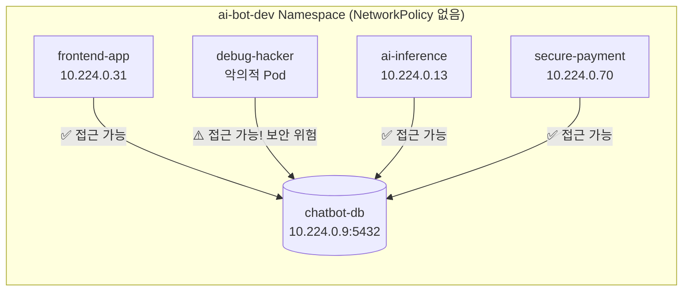

이 상태는 `ai-bot-dev` 네임스페이스 내의 어떤 Pod든, 또는 새로 생성되는 어떤 Pod든 DB에 무제한 접근이 가능한 취약한 상태입니다.

### 6.4 미션 3 — NetworkPolicy로 DB 보호

```yaml
# db-network-policy.yaml
apiVersion: networking.k8s.io/v1
kind: NetworkPolicy
metadata:
  name: db-secure-policy
  namespace: ai-bot-dev
spec:
  podSelector:
    matchLabels:
      app: chatbot-db       # chatbot-db Pod를 보호 대상으로 지정
  policyTypes:
  - Ingress                 # 수신 트래픽 제어
  ingress:
  - from:
    - podSelector:
        matchLabels:
          app: frontend     # app=frontend 레이블 Pod만 허용
    ports:
    - protocol: TCP
      port: 5432            # PostgreSQL 포트만 허용
```

### 6.5 미션 3 테스트 결과

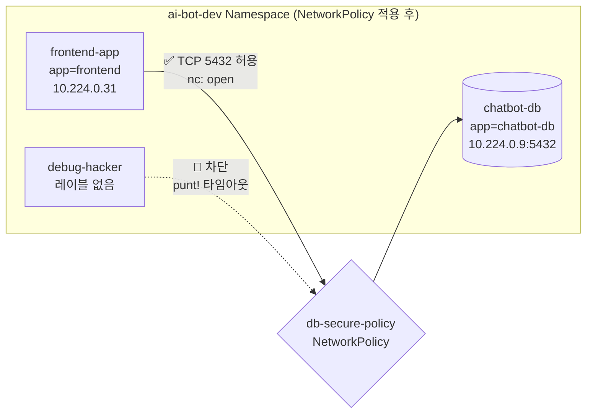

```
[허용 검증] frontend-app → chatbot-db
  kubectl exec -n ai-bot-dev frontend-app -- sh -c "nc -zv 10.224.0.9 5432"
  → 10.224.0.9 (10.224.0.9:5432) open  ✅

[차단 검증] debug-hacker → chatbot-db
  kubectl run debug-hacker --image=busybox -n ai-bot-dev -it --rm -- sh
  / # nc -zv 10.224.0.9 5432
  → ^C punt!  🚫 (타임아웃, 패킷 드롭 확인)
```

`punt!`은 busybox의 `nc` 명령어가 Ctrl+C로 강제 중단될 때 출력하는 고유 메시지입니다. 이는 연결 시도 중 응답을 받지 못해 무한 대기 상태가 됐음을 의미하며, NetworkPolicy에 의한 패킷 드롭이 발생했음을 확인하는 것입니다.

---

## 7. NetworkPolicy 패턴 및 정책 유형

실무에서 활용 가능한 주요 NetworkPolicy 패턴들을 설명합니다.

### 7.1 패턴 1 — Default Deny All (Zero Trust 기반선)

모든 트래픽을 기본 차단하고 필요한 것만 허용하는 가장 안전한 패턴입니다.

```yaml
apiVersion: networking.k8s.io/v1
kind: NetworkPolicy
metadata:
  name: default-deny-all
  namespace: production
spec:
  podSelector: {}      # 빈 셀렉터 = 네임스페이스의 모든 Pod 대상
  policyTypes:
  - Ingress
  - Egress
  # ingress, egress 규칙이 없음 = 모든 방향 차단
```

> **주의**: Default Deny Egress를 적용하면 DNS 조회도 차단됩니다. DNS 허용을 위한 별도 규칙이 반드시 필요합니다.

```yaml
# DNS 허용 정책 (Default Deny Egress 적용 후 필수)
apiVersion: networking.k8s.io/v1
kind: NetworkPolicy
metadata:
  name: allow-dns-egress
  namespace: production
spec:
  podSelector: {}
  policyTypes:
  - Egress
  egress:
  - to:
    - namespaceSelector:
        matchLabels:
          kubernetes.io/metadata.name: kube-system
    ports:
    - protocol: UDP
      port: 53
    - protocol: TCP
      port: 53
```

### 7.2 패턴 2 — 레이블 기반 화이트리스트 (본 실습 패턴)

특정 레이블을 가진 Pod만 대상 Pod에 접근을 허용합니다. 본 실습에서 구현한 방식입니다.

```yaml
# DB는 frontend Pod에서만, 5432 포트로만 접근 허용
apiVersion: networking.k8s.io/v1
kind: NetworkPolicy
metadata:
  name: db-whitelist
  namespace: production
spec:
  podSelector:
    matchLabels:
      role: database
  policyTypes:
  - Ingress
  ingress:
  - from:
    - podSelector:
        matchLabels:
          role: api-server
    ports:
    - protocol: TCP
      port: 5432
```

### 7.3 패턴 3 — 네임스페이스 격리

다른 네임스페이스에서의 접근을 제한하고, 동일 네임스페이스 내에서만 통신을 허용합니다.

```yaml
apiVersion: networking.k8s.io/v1
kind: NetworkPolicy
metadata:
  name: allow-same-namespace-only
  namespace: ai-bot-dev
spec:
  podSelector: {}
  policyTypes:
  - Ingress
  ingress:
  - from:
    - podSelector: {}   # 같은 네임스페이스의 모든 Pod 허용
```

### 7.4 패턴 4 — 네임스페이스 + Pod 복합 조건

특정 네임스페이스에 속하면서 특정 레이블을 가진 Pod만 허용하는 AND 조건입니다.

```yaml
apiVersion: networking.k8s.io/v1
kind: NetworkPolicy
metadata:
  name: allow-monitoring-only
spec:
  podSelector:
    matchLabels:
      app: database
  policyTypes:
  - Ingress
  ingress:
  - from:
    - namespaceSelector:     # AND 조건: monitoring 네임스페이스이면서
        matchLabels:
          purpose: monitoring
      podSelector:           # prometheus Pod만 허용
        matchLabels:
          app: prometheus
```

### 7.5 패턴 5 — IP 블록 기반 외부 접근 제어

외부 시스템이나 특정 IP 대역에서의 접근을 제어합니다.

```yaml
apiVersion: networking.k8s.io/v1
kind: NetworkPolicy
metadata:
  name: allow-specific-cidr
spec:
  podSelector:
    matchLabels:
      app: api-gateway
  policyTypes:
  - Ingress
  ingress:
  - from:
    - ipBlock:
        cidr: 10.0.0.0/8       # 내부 네트워크 허용
        except:
        - 10.0.5.0/24          # 특정 서브넷 제외
```

### 7.6 패턴 6 — Egress 제어 (외부 통신 제한)

Pod의 아웃바운드 트래픽을 제어하여 데이터 유출(Data Exfiltration)을 방지합니다.

```yaml
apiVersion: networking.k8s.io/v1
kind: NetworkPolicy
metadata:
  name: restrict-egress
  namespace: secure-zone
spec:
  podSelector:
    matchLabels:
      app: chatbot-db
  policyTypes:
  - Egress
  egress:
  - to:
    - podSelector:
        matchLabels:
          app: backup-service   # 백업 서비스로만 아웃바운드 허용
    ports:
    - protocol: TCP
      port: 9000
```

---

## 8. 실제 운영 환경 응용

### 8.1 마이크로서비스 아키텍처에서의 NetworkPolicy

실제 AIOps 플랫폼 같은 마이크로서비스 환경에서는 서비스 간 통신 경로가 복잡합니다. NetworkPolicy를 체계적으로 적용하려면 서비스 의존성 맵을 먼저 작성하고, 각 서비스 쌍에 대한 허용 규칙을 정의해야 합니다.

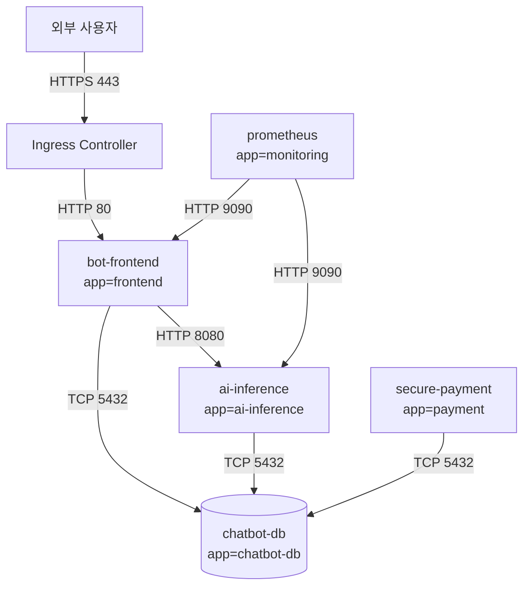

위와 같은 의존성 맵이 있다면, 아래와 같은 NetworkPolicy 세트를 정의합니다.

```yaml
# DB 보호 정책: frontend, ai-inference, payment만 허용
apiVersion: networking.k8s.io/v1
kind: NetworkPolicy
metadata:
  name: protect-chatbot-db
  namespace: ai-bot-dev
spec:
  podSelector:
    matchLabels:
      app: chatbot-db
  policyTypes:
  - Ingress
  ingress:
  - from:
    - podSelector:
        matchLabels:
          app: frontend
    - podSelector:
        matchLabels:
          app: ai-inference
    - podSelector:
        matchLabels:
          app: payment
    ports:
    - protocol: TCP
      port: 5432
```

### 8.2 CI/CD 파이프라인과 NetworkPolicy

CI/CD 파이프라인에서 테스트 환경과 운영 환경을 분리하는 데도 NetworkPolicy가 활용됩니다. 네임스페이스 레이블을 활용하면 `staging` 네임스페이스에서 `production` 네임스페이스의 DB에 직접 접근하는 것을 막을 수 있습니다.

```yaml
apiVersion: networking.k8s.io/v1
kind: NetworkPolicy
metadata:
  name: block-staging-to-prod-db
  namespace: production
spec:
  podSelector:
    matchLabels:
      role: database
  policyTypes:
  - Ingress
  ingress:
  - from:
    - namespaceSelector:
        matchLabels:
          environment: production   # production 네임스페이스만 허용
      podSelector:
        matchLabels:
          app: api-server
```

### 8.3 모니터링 시스템과의 통합

Prometheus 같은 모니터링 시스템은 클러스터 내 모든 Pod의 메트릭을 수집해야 합니다. Default Deny 정책을 적용한 후에도 모니터링이 동작하도록 별도 허용 규칙이 필요합니다.

```yaml
apiVersion: networking.k8s.io/v1
kind: NetworkPolicy
metadata:
  name: allow-prometheus-scrape
  namespace: ai-bot-dev
spec:
  podSelector: {}          # 모든 Pod 대상
  policyTypes:
  - Ingress
  ingress:
  - from:
    - namespaceSelector:
        matchLabels:
          kubernetes.io/metadata.name: monitoring
      podSelector:
        matchLabels:
          app: prometheus
    ports:
    - protocol: TCP
      port: 8080           # 앱별 메트릭 노출 포트 (예시, 실제 포트는 앱마다 다름)
                           # 예: 8080, 9100(node-exporter), 9187(postgres-exporter) 등
```

> **주의**: 9090은 Prometheus 서버 자체의 Web UI/API 포트입니다. Prometheus가 각 앱에서 메트릭을 수집(scrape)할 때 접근하는 포트는 앱마다 다르며, 일반적으로 앱의 `/metrics` 엔드포인트가 노출된 포트를 지정해야 합니다.

### 8.4 NetworkPolicy 운영 시 주의사항

**점진적 적용**: 프로덕션 환경에서 NetworkPolicy를 처음 적용할 때는 모든 정책을 한번에 적용하지 않습니다. 서비스별로 단계적으로 적용하고 각 단계에서 트래픽이 정상인지 확인하는 것이 안전합니다.

**DNS 차단 주의**: Egress 제어 시 DNS(UDP/TCP 53)를 허용하지 않으면 Pod가 다른 서비스의 DNS 이름을 해석하지 못합니다. `kube-dns`로의 Egress를 반드시 허용해야 합니다.

**정기 감사**: 서비스 아키텍처가 변경되면 NetworkPolicy도 업데이트되어야 합니다. 분기별로 정책을 검토하여 더 이상 필요하지 않은 규칙은 제거하고 새로운 서비스에 대한 규칙을 추가합니다.

**스테이징 환경 테스트**: 프로덕션에 적용하기 전 스테이징 환경에서 충분히 테스트합니다. 잘못된 NetworkPolicy 하나가 전체 서비스를 다운시킬 수 있습니다.

---

## 9. 비교표 모음

### 9.1 NetworkPolicy 적용 전후 보안 상태 비교

| 항목 | 정책 적용 전 | 정책 적용 후 |
|------|------------|------------|
| DB 접근 가능 대상 | 클러스터 내 모든 Pod (네임스페이스 무관) | `app=frontend` 레이블 Pod만 |
| 해커 Pod 접근 | 가능 (`open`) | 불가 (`punt!` 타임아웃) |
| 차단 방식 | 해당 없음 | 패킷 드롭(Drop) |
| 차단 응답 | 해당 없음 | 응답 없음 (무한 대기) |
| 보안 모델 | Default Allow | Whitelist (명시적 허용) |
| 관리 복잡도 | 낮음 | 중간 (정책 관리 필요) |

### 9.2 NetworkPolicy 셀렉터 유형 비교

| 셀렉터 | 필드명 | 기준 | 사용 예 |
|-------|--------|------|---------|
| Pod 셀렉터 | `podSelector` | Pod 레이블 | 특정 역할의 Pod만 허용 |
| 네임스페이스 셀렉터 | `namespaceSelector` | 네임스페이스 레이블 | 특정 환경 네임스페이스만 허용 |
| IP 블록 | `ipBlock` | CIDR 대역 | 외부 시스템 IP 대역 허용 |
| 복합 조건 | Pod + Namespace | AND 조건 | 특정 네임스페이스의 특정 Pod만 허용 |
| 전체 선택 | `podSelector: {}` | 전체 Pod | Default Deny 정책 |

### 9.3 Ingress vs Egress 비교

| 구분 | Ingress | Egress |
|------|---------|--------|
| 방향 | 외부 → 대상 Pod (수신) | 대상 Pod → 외부 (송신) |
| 제어 목적 | 무단 접근 차단 | 데이터 유출 방지 |
| 규칙 필드 | `ingress[].from` | `egress[].to` |
| 기본 적용 | ingress 규칙이 있으면 자동 적용 (policyTypes 생략 시) | policyTypes에 Egress를 명시하거나 egress 규칙이 있어야 적용 |
| DNS 영향 | 없음 | 차단 시 DNS 조회 실패 |
| 본 실습 사용 여부 | ✅ 사용 | ❌ 미사용 |

### 9.4 AKS NetworkPolicy 엔진 비교

| 항목 | Azure NPM | Calico | Cilium |
|------|-----------|--------|--------|
| 구현 기술 | iptables | iptables/eBPF | eBPF |
| 지원 레이어 | L3/L4 | L3/L4 | L3/L4/L7 |
| 성능 | 보통 | 양호 | 우수 |
| 지원 정책 형식 | K8s NetworkPolicy | K8s + Calico 확장 | K8s + CiliumNetworkPolicy |
| AKS 지원 현황 | 2028년 9월 지원 종료 예정 | 지원 중 | 권장 (신규 배포) |
| HTTP 메서드 제어 | ❌ | 제한적 | ✅ |
| FQDN 필터링 | ❌ | ✅ | ✅ (ACNS 필요) |

### 9.5 차단 방식별 클라이언트 반응 비교

| 차단 방식 | 클라이언트 반응 | nc 출력 | curl 출력 |
|-----------|--------------|---------|-----------|
| NetworkPolicy Drop | 무한 대기 | `^C punt!` | 타임아웃 후 에러 |
| 포트 미개방 (서비스 없음) | 즉시 실패 | `Connection refused` | `Connection refused` |
| 방화벽 Reject | 즉시 실패 | `Connection refused` | `Connection refused` |
| 서버 응답 없음 | 무한 대기 | 타임아웃 | 타임아웃 |

---

## 10. Claude Code 프롬프트 — AIOps 구축 및 운영

다음은 Kubernetes AIOps 환경에서 NetworkPolicy를 구축하고 운영할 때 Claude Code에 입력할 수 있는 실용적인 프롬프트 모음입니다.

### 10.1 초기 환경 설정 및 현황 파악

```
현재 클러스터의 NetworkPolicy 현황을 전체 네임스페이스에 걸쳐 파악해줘.

1. kubectl get networkpolicy --all-namespaces 로 모든 정책을 출력해줘.
2. kubectl get pod --all-namespaces -o wide 로 모든 Pod의 레이블과 IP를 확인해줘.
3. ai-bot-dev 네임스페이스에 집중하여, 현재 어떤 Pod에 NetworkPolicy가 적용되어 있는지 분석해줘.
4. NetworkPolicy가 없는 Pod(보호받지 못하는 Pod)가 있으면 목록으로 정리해줘.
```

---

```
ai-bot-dev 네임스페이스에 Zero Trust 기반선을 구축해줘.

1. 네임스페이스의 모든 Pod에 대해 모든 Ingress를 기본 차단하는
   default-deny-ingress NetworkPolicy YAML을 생성해줘.
   파일명: default-deny-ingress.yaml

2. 생성 후 kubectl apply 로 적용해줘.

3. 적용 후 kubectl get networkpolicy -n ai-bot-dev 로 확인해줘.

주의: 기존 실행 중인 서비스에 영향이 갈 수 있으니,
적용 전에 현재 실행 중인 Pod 목록을 출력하고 확인을 요청해줘.
```

---

### 10.2 NetworkPolicy 생성 및 배포

```
아래 요구사항에 맞는 NetworkPolicy YAML을 생성하고 배포해줘.

요구사항:
- 이름: protect-chatbot-db
- 네임스페이스: ai-bot-dev
- 보호 대상: app=chatbot-db 레이블 Pod
- 허용 조건 1: app=frontend 레이블 Pod에서 TCP 5432 허용
- 허용 조건 2: app=ai-inference 레이블 Pod에서 TCP 5432 허용
- 나머지: 모두 차단

파일명: protect-chatbot-db.yaml 로 저장하고,
kubectl apply 로 적용한 뒤 결과를 확인해줘.
```

---

```
기존에 적용된 NetworkPolicy 'db-secure-policy'의 현재 설정을 확인하고,
아래 변경사항을 반영해서 업데이트해줘.

변경사항:
- 기존: app=frontend에서만 TCP 5432 허용
- 추가: app=monitoring 레이블 Pod에서 TCP 9187(postgres_exporter) 허용

1. kubectl get networkpolicy db-secure-policy -n ai-bot-dev -o yaml 로 현재 설정 출력
2. 변경사항을 반영한 새 YAML 작성
3. kubectl apply 로 업데이트 적용
4. kubectl describe networkpolicy db-secure-policy -n ai-bot-dev 로 변경 결과 확인
```

---

### 10.3 네트워크 연결 테스트 및 검증

```
현재 NetworkPolicy 설정이 의도대로 동작하는지 검증 테스트를 실행해줘.

검증 대상: ai-bot-dev 네임스페이스의 chatbot-db (IP: 10.224.0.9, Port: 5432)

테스트 1 (허용 케이스):
  kubectl exec -n ai-bot-dev frontend-app -- sh -c "nc -zv 10.224.0.9 5432"
  예상 결과: "open"

테스트 2 (차단 케이스):
  busybox 임시 Pod를 --rm 옵션으로 생성해서 동일 IP:Port로 접근 시도
  예상 결과: 타임아웃 (5초 후 자동 종료되도록 --max-wait 옵션 사용)

각 테스트 결과를 허용/차단 여부로 판정하고 표로 정리해줘.
```

---

```
해킹 시뮬레이션 테스트를 실행해줘.

1. ai-bot-dev 네임스페이스에 debug-hacker 이름의 임시 Pod를 busybox 이미지로 생성해줘.
   (--rm 옵션 사용, 종료 시 자동 삭제)

2. 쉘 내부에서 아래 두 가지를 테스트해줘:
   a. nc -zv 10.224.0.9 5432 (chatbot-db)
   b. nc -zv 10.224.0.31 80 (frontend-app, NetworkPolicy 미적용)

3. 결과를 바탕으로 현재 NetworkPolicy 적용 범위와 미보호 구간을 분석해줘.
```

---

### 10.4 운영 모니터링 및 감사

```
현재 클러스터의 NetworkPolicy 보안 상태를 감사(Audit)해줘.

1. 모든 네임스페이스에서 NetworkPolicy 목록을 출력해줘.
2. 각 NetworkPolicy가 보호하는 Pod를 식별해줘.
3. NetworkPolicy가 하나도 없는 네임스페이스를 찾아줘.
4. 보호받지 못하는 Pod(어떤 NetworkPolicy의 podSelector에도 매칭되지 않는 Pod)를 찾아줘.
5. 결과를 표 형태로 정리해서 보안 취약 구간을 명확히 표시해줘.
```

---

```
NetworkPolicy 관련 트러블슈팅을 도와줘.

증상: frontend-app Pod에서 chatbot-db로 nc -zv를 실행했을 때 "open"이 나와야 하는데
      타임아웃이 발생하고 있어.

아래 순서로 원인을 파악해줘:
1. kubectl get networkpolicy -n ai-bot-dev -o yaml 로 현재 정책 전체 출력
2. kubectl get pod frontend-app -n ai-bot-dev --show-labels 로 레이블 확인
3. kubectl get pod chatbot-db -n ai-bot-dev --show-labels 로 레이블 확인
4. NetworkPolicy의 podSelector와 실제 Pod 레이블을 비교 분석해줘.
5. 문제 원인과 수정 방법을 설명해줘.
```

---

### 10.5 전체 AIOps 환경 NetworkPolicy 일괄 구성

```
ai-bot-dev 네임스페이스의 전체 AIOps 서비스에 대한
NetworkPolicy 세트를 한번에 구성해줘.

서비스 의존성 맵:
- bot-frontend (app=frontend): ai-inference, chatbot-db에 접근
- ai-inference (app=ai-inference): chatbot-db에 접근
- chatbot-db (app=chatbot-db): 수신만 (아웃바운드 없음)
- secure-payment (app=payment): chatbot-db에 접근
- Ingress Controller → bot-frontend (80 포트)

생성할 파일 목록:
1. np-protect-db.yaml: DB 보호 (frontend, ai-inference, payment만 허용)
2. np-protect-ai.yaml: AI 추론 서비스 보호 (frontend만 허용)
3. np-allow-ingress-to-frontend.yaml: 외부 Ingress → frontend 허용
4. np-default-deny.yaml: 나머지 모든 트래픽 기본 차단

각 파일을 생성한 뒤 kubectl apply 로 순서대로 적용하고
적용 후 전체 Pod 간 통신 상태를 검증해줘.
```

---

### 10.6 정리 및 초기화

```
Lab 8 실습에서 생성한 모든 리소스를 정리해줘.

1. kubectl get networkpolicy,pod -n ai-bot-dev 로 현재 상태 확인
2. 실습 중 생성한 리소스만 선택적으로 삭제해줘:
   - Pod: chatbot-db, frontend-app (kubectl run 또는 apply로 생성한 것들)
   - NetworkPolicy: db-secure-policy
3. kubectl delete 명령 실행 전 삭제 대상 목록을 출력하고 확인을 받아줘.
4. 삭제 후 namespace가 정상 상태인지 확인해줘.
```

---

## 11. 자주 발생하는 오류와 해결 방법

### 11.1 정책 적용 후에도 차단이 안 되는 경우

**원인**: CNI 플러그인이 NetworkPolicy를 지원하지 않음  
**확인 방법**:
```bash
# CNI 플러그인 확인
kubectl get pod -n kube-system | grep -E "calico|cilium|azure-npm"
```
**해결**: AKS에서는 클러스터 생성 시 `--network-policy` 옵션을 지정해야 합니다.

### 11.2 정책 적용 후 허용해야 할 트래픽도 차단되는 경우

**원인**: Pod 레이블과 NetworkPolicy의 `matchLabels`가 일치하지 않음  
**확인 방법**:
```bash
# Pod 레이블 확인
kubectl get pod frontend-app -n ai-bot-dev --show-labels

# NetworkPolicy 상세 확인
kubectl describe networkpolicy db-secure-policy -n ai-bot-dev
```
**해결**: `matchLabels`의 키와 값이 정확히 일치하는지 대소문자까지 확인합니다.

### 11.3 Default Deny Egress 적용 후 서비스 이름 해석 불가

**원인**: DNS 조회를 위한 Egress(UDP 53)가 차단됨  
**해결**:
```yaml
egress:
- to:
  - namespaceSelector:
      matchLabels:
        kubernetes.io/metadata.name: kube-system
  ports:
  - protocol: UDP
    port: 53
  - protocol: TCP
    port: 53
```

### 11.4 `kubectl run -it --rm` 사용 시 오류

**오류**: `--rm should only be used for attached containers`  
**원인**: `-n <namespace>` 플래그와 `-it`가 붙여 쓰여 파싱 오류 발생  
**해결**:
```bash
# 잘못된 명령 (공백 없음)
kubectl run pod -n ai-bot-dev-it --rm -- sh

# 올바른 명령 (공백 있음)
kubectl run pod -n ai-bot-dev -it --rm -- sh
```

---

## 12. 정리 및 다음 단계

### 12.1 Lab 8 핵심 요약

Lab 8에서는 Kubernetes NetworkPolicy를 통해 Pod 간 네트워크 트래픽을 레이블 기반으로 제어하는 방법을 학습했습니다. Task 1에서는 기본 개념을 검증했고, Task 2에서는 실제 AIOps 플랫폼 보안 강화 시나리오를 통해 실무 적용 능력을 키웠습니다.

핵심 학습 포인트는 다음과 같습니다. 첫째, Kubernetes의 기본 상태는 "모두 허용(Default Allow)"이며, NetworkPolicy가 적용된 순간부터 "화이트리스트(Whitelist)" 방식으로 전환됩니다. 둘째, NetworkPolicy는 IP 주소가 아닌 Pod 레이블 기반으로 동작하므로, Pod가 재배포되어 IP가 바뀌어도 정책이 자동으로 유지됩니다. 셋째, 차단된 트래픽은 "패킷 드롭" 방식으로 처리되어 클라이언트에서는 응답 없이 타임아웃이 발생합니다. 이는 포트 미개방에 의한 `Connection refused`와 명확히 다릅니다. 넷째, NetworkPolicy가 실제로 동작하려면 이를 지원하는 CNI 플러그인이 필요하며, AKS에서는 Cilium이 권장됩니다.

### 12.2 다음 단계 학습 방향

NetworkPolicy를 마스터한 후에는 아래 주제로 학습을 확장할 수 있습니다.

- **RBAC(Role-Based Access Control)**: API 서버 수준의 접근 제어
- **Pod Security Standards**: Pod 보안 설정(특권 컨테이너, 읽기 전용 파일시스템 등)
- **Service Mesh(Istio/Linkerd)**: L7 수준의 mTLS, 트래픽 분산, 관찰가능성
- **OPA(Open Policy Agent)/Gatekeeper**: 정책 기반 리소스 생성 제어
- **Cilium Advanced Policies**: FQDN 기반 필터링, L7 HTTP 메서드 제어

---

*본 문서는 MS Azure Kubernetes 기반 AIOps 실전 과정의 Lab 8 실습을 바탕으로 작성되었습니다.*  
*작성일: 2026-06-10*

---

# 별첨 A — NetworkPolicy vs. Istio Service Mesh 상세 비교

> **작성일**: 2026-06-10  
> **참고**: 2026년 상반기 기준 최신 공식 문서 및 기술 동향을 반영합니다.

---

## A.1 두 기술이 다루는 네트워크 계층

NetworkPolicy와 Istio는 자주 비교되지만, 실제로는 **경쟁 관계가 아닌 상호 보완적인 관계**입니다. 두 기술이 동작하는 OSI 네트워크 계층이 근본적으로 다르기 때문입니다.

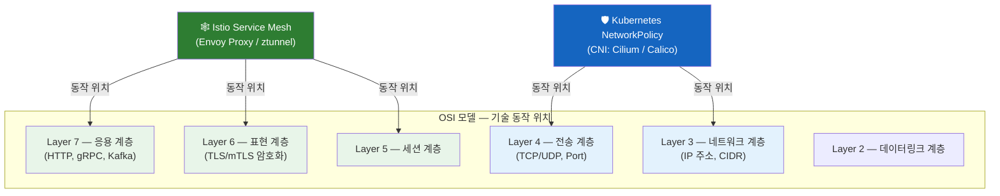

NetworkPolicy는 커널/eBPF 수준에서 IP 주소와 포트 번호를 기반으로 패킷을 필터링합니다. 이는 패킷이 Pod의 네트워크 네임스페이스에 도달하기도 전에 차단할 수 있음을 의미합니다. 반면 Istio는 Envoy 프록시(사이드카) 또는 ztunnel(Ambient 모드)을 통해 HTTP 메서드, 경로, 헤더, JWT 클레임, mTLS 인증서 같은 애플리케이션 수준의 속성으로 트래픽을 제어합니다.

---

## A.2 핵심 기능 상세 비교

### A.2.1 보안 기능 비교

| 보안 기능 | Kubernetes NetworkPolicy | Istio Service Mesh |
|----------|--------------------------|---------------------|
| **동작 레이어** | L3 (IP) / L4 (Port) | L5~L7 (TLS, HTTP, gRPC) |
| **식별 기준** | Pod 레이블, 네임스페이스, IP CIDR | 서비스 계정(SVID), mTLS 인증서, JWT |
| **트래픽 암호화** | ❌ 미지원 (별도 구성 필요) | ✅ mTLS 자동 암호화 |
| **HTTP 메서드 제어** | ❌ 불가 | ✅ GET/POST/DELETE 등 |
| **경로(Path) 기반 제어** | ❌ 불가 | ✅ /api/*, /admin/* 등 |
| **헤더 기반 제어** | ❌ 불가 | ✅ Authorization, X-User 등 |
| **JWT 클레임 검증** | ❌ 불가 | ✅ RequestAuthentication |
| **서비스 정체성 기반 접근** | ❌ IP 기반 | ✅ SPIFFE/SVID 기반 |
| **Egress 외부 제어** | 제한적 (CIDR 기반) | ✅ FQDN 기반 ServiceEntry |

### A.2.2 트래픽 관리 기능 비교

| 기능 | Kubernetes NetworkPolicy | Istio Service Mesh |
|------|--------------------------|---------------------|
| **로드 밸런싱** | ❌ (kube-proxy에 의존) | ✅ 가중치 기반, 라운드로빈, 최소연결 |
| **카나리 배포** | ❌ | ✅ VirtualService 가중치 |
| **서킷 브레이커** | ❌ | ✅ DestinationRule |
| **재시도 정책** | ❌ | ✅ 자동 재시도 |
| **타임아웃 설정** | ❌ | ✅ VirtualService |
| **폴트 인젝션** | ❌ | ✅ 테스트 목적 지연/오류 주입 |
| **트래픽 미러링** | ❌ | ✅ 섀도우 트래픽 |

### A.2.3 관찰가능성(Observability) 비교

| 기능 | Kubernetes NetworkPolicy | Istio Service Mesh |
|------|--------------------------|---------------------|
| **서비스 간 메트릭** | ❌ 없음 | ✅ 자동 수집 (Prometheus) |
| **분산 추적** | ❌ | ✅ Jaeger / Zipkin 연동 |
| **서비스 토폴로지 맵** | ❌ | ✅ Kiali 대시보드 |
| **접근 로그** | ❌ (CNI에 의존) | ✅ Envoy 액세스 로그 |
| **지연시간 히스토그램** | ❌ | ✅ P50/P95/P99 자동 생성 |

### A.2.4 운영 복잡도 비교

| 항목 | Kubernetes NetworkPolicy | Istio Service Mesh |
|------|--------------------------|---------------------|
| **설치 복잡도** | 낮음 (CNI 선택만 필요) | 높음 (istiod, 사이드카 주입 등) |
| **학습 곡선** | 중간 | 높음 |
| **리소스 오버헤드** | 매우 낮음 | 중간~높음 (사이드카당 50~100MB) |
| **디버깅 난이도** | 중간 | 높음 (여러 계층 추적 필요) |
| **정책 관리 도구** | kubectl (기본 제공) | istioctl, Kiali |
| **업그레이드 영향** | 낮음 | 높음 (사이드카 재주입 필요) |
| **Kubernetes 네이티브** | ✅ 완전 네이티브 | 부분적 (CRD 추가) |

---

## A.3 Istio 아키텍처 심층 이해

### A.3.1 전통적 사이드카 모드

Istio의 전통적인 방식은 각 Pod에 Envoy 프록시 컨테이너를 사이드카로 자동 주입하는 것입니다. 사이드카는 해당 Pod의 모든 인바운드/아웃바운드 트래픽을 가로채어 정책을 적용합니다.

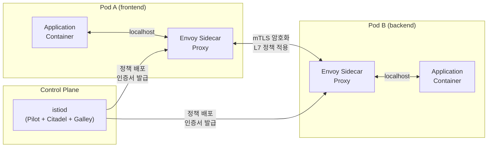

사이드카 모드의 단점은 명확합니다. Pod당 50~100MB의 메모리가 추가로 소비되고, 사이드카 주입을 위해 Pod를 재시작해야 하며, Istio 업그레이드 시 모든 사이드카를 동시에 재배포해야 하는 운영 부담이 있습니다. 1,000개의 Pod가 있는 클러스터라면 사이드카만으로 최대 100GB의 메모리가 소비될 수 있습니다.

### A.3.2 Ambient Mesh 모드 (사이드카리스, 2026년 현재 주목)

Istio의 Ambient Mesh는 사이드카 방식의 오버헤드를 해결하기 위해 도입된 새로운 아키텍처입니다. 2025년 Istio가 CNCF 졸업 프로젝트로 승격되면서, Ambient Mesh는 차세대 표준 아키텍처로 주목받고 있습니다.

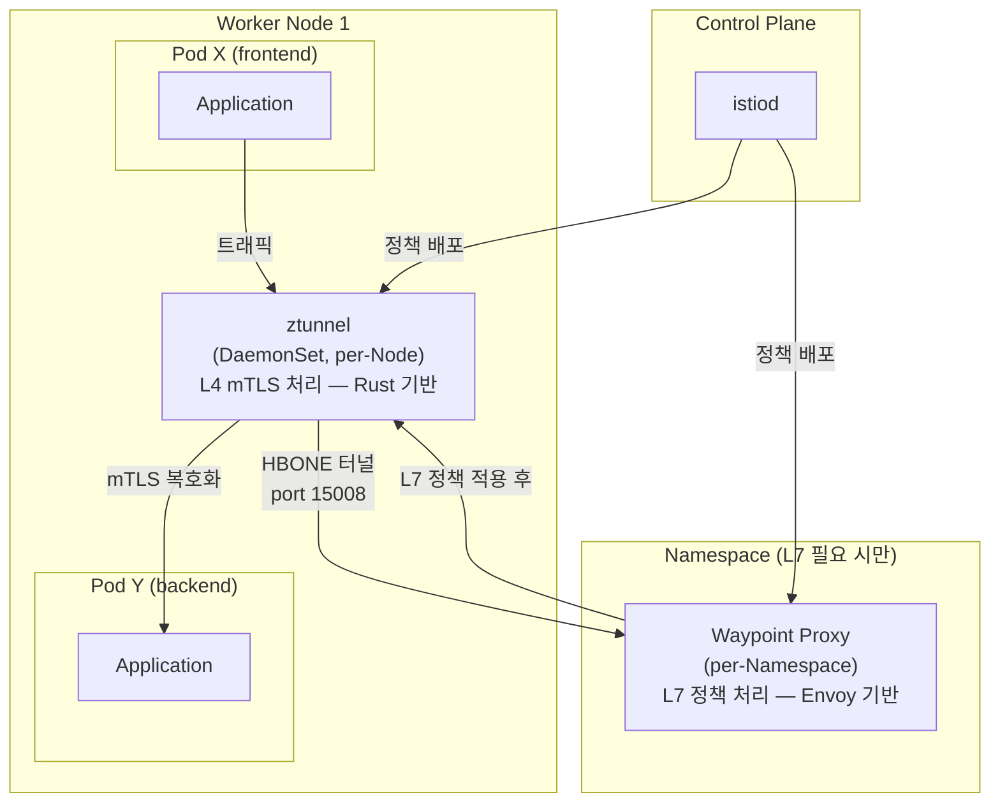

Ambient Mesh는 두 계층으로 동작합니다. 첫 번째 계층인 **ztunnel**은 노드당 하나의 DaemonSet으로 실행되며 Rust로 작성된 경량 L4 프록시입니다. mTLS 암호화와 기본 인증만 처리합니다. 두 번째 계층인 **Waypoint Proxy**는 L7 기능이 필요한 네임스페이스에만 선택적으로 배포되는 Envoy 기반 프록시입니다. HTTP 라우팅, 재시도, 서킷브레이커 같은 고급 기능을 제공합니다.

100개의 Pod 클러스터 기준으로 메모리 사용량이 사이드카 방식의 5~10GB에서 Ambient Mesh의 200~500MB로 대폭 감소합니다.

**AKS에서의 Ambient Mesh 지원 현황 (2026-06-10 기준)**: Microsoft는 현재 AKS의 Istio 애드온에서 Ambient 모드를 지원하지 않습니다. 사이드카 기반 Istio 모드만 AKS 관리형 애드온으로 제공됩니다. Microsoft는 Ambient Mesh를 로드맵에 포함시켜 개발 중임을 공식 발표했으며, Istio 오픈소스 Ambient 워크스트림에 기여하고 있습니다. Ambient 모드가 필요하다면 현재는 자체 설치(Self-managed) 방식을 사용해야 합니다.

---

## A.4 트래픽 차단 시 동작 차이

NetworkPolicy와 Istio AuthorizationPolicy가 트래픽을 차단할 때 클라이언트에서 경험하는 반응이 다릅니다. 이 차이는 트러블슈팅 시 어느 계층에서 차단됐는지 판단하는 중요한 단서가 됩니다.

| 차단 주체 | 차단 계층 | 클라이언트 반응 | 오류 유형 |
|-----------|----------|----------------|-----------|
| **NetworkPolicy (Drop)** | L3/L4 (커널) | 무한 대기 후 타임아웃 | Connection Timeout |
| **Istio AuthorizationPolicy** | L7 (Envoy) | 즉시 HTTP 응답 | HTTP 403 Forbidden |
| **Istio PeerAuthentication** | L6 (mTLS) | 즉시 TLS 핸드셰이크 실패 | TLS Error |
| **포트 미개방** | L4 (OS) | 즉시 실패 | Connection Refused |

실무에서 연결 실패를 디버깅할 때, 타임아웃이 발생하면 NetworkPolicy를 먼저 확인하고, HTTP 403이 발생하면 Istio AuthorizationPolicy를 확인하는 것이 효율적입니다.

---

## A.5 두 기술의 상호작용 — 처리 순서

NetworkPolicy와 Istio가 동시에 적용된 환경에서 트래픽이 처리되는 순서는 다음과 같습니다.

```mermaid
sequenceDiagram
    participant SRC as 출발지 Pod
    participant CNI as CNI Plugin<br/>(NetworkPolicy 적용)
    participant ZT as ztunnel / Sidecar<br/>(Istio mTLS)
    participant ENY as Envoy Proxy<br/>(Istio L7 정책)
    participant DST as 목적지 Pod

    SRC->>CNI: 패킷 전송 시도
    alt NetworkPolicy 차단
        CNI-->>SRC: 패킷 드롭 (타임아웃)
    else NetworkPolicy 통과
        CNI->>ZT: 패킷 전달
        ZT->>ZT: mTLS 핸드셰이크<br/>인증서 검증
        alt mTLS 실패
            ZT-->>SRC: TLS 오류
        else mTLS 성공
            ZT->>ENY: 복호화된 트래픽
            ENY->>ENY: AuthorizationPolicy 검사<br/>HTTP 메서드/경로/헤더 확인
            alt AuthorizationPolicy 차단
                ENY-->>SRC: HTTP 403
            else AuthorizationPolicy 통과
                ENY->>DST: 요청 전달
                DST-->>SRC: 응답
            end
        end
    end
```

중요한 점은 **NetworkPolicy가 항상 먼저 처리**된다는 것입니다. NetworkPolicy가 패킷을 드롭하면 Istio 사이드카는 그 패킷을 전혀 볼 수 없습니다. 따라서 Istio를 사용하더라도 NetworkPolicy로 Istio 제어 플레인 포트(15001, 15006, 15008, 15014 등)를 차단하지 않도록 주의해야 합니다.

---

## A.6 선택 기준 — 어떤 기술을 언제 사용할 것인가

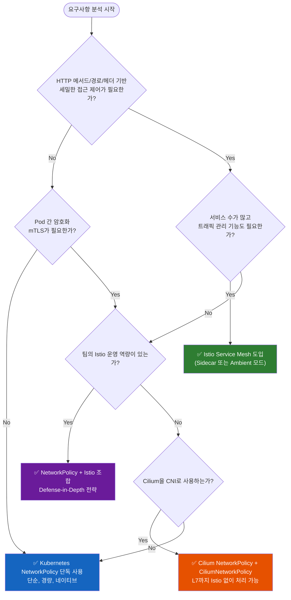

### 구체적 선택 기준

**Kubernetes NetworkPolicy만 사용하는 경우**

팀이 Kubernetes 네트워크를 처음 다루거나, 클러스터 규모가 작고 단순한 경우, 또는 마이크로서비스 간 IP/포트 수준의 격리만 필요한 경우에는 NetworkPolicy만으로 충분합니다. 운영 오버헤드가 가장 낮고 Kubernetes 네이티브 방식이므로 진입 장벽이 낮습니다.

**Istio를 추가로 도입해야 하는 경우**

서비스 간 mTLS 암호화가 규정 준수(PCI-DSS, HIPAA 등) 요구사항인 경우, HTTP API 수준의 세밀한 접근 제어(특정 경로만 허용, 특정 메서드만 허용)가 필요한 경우, 분산 추적과 서비스 토폴로지 맵 같은 고급 관찰가능성이 필요한 경우, 카나리 배포나 서킷브레이커 같은 고급 트래픽 관리가 필요한 경우에 Istio를 도입합니다.

**Cilium으로 Istio를 대체하는 경우**

AKS에서 Azure CNI Powered by Cilium을 사용한다면, CiliumNetworkPolicy를 통해 Istio 없이도 L7 수준의 HTTP 메서드/경로 제어와 FQDN 기반 Egress 필터링이 가능합니다. Istio의 복잡성을 피하면서도 고급 네트워크 정책이 필요한 경우에 적합한 선택입니다.

---

## A.7 Defense-in-Depth — NetworkPolicy + Istio 조합 아키텍처

두 기술을 조합하면 서로의 약점을 보완하는 다층 방어(Defense-in-Depth) 체계를 구축할 수 있습니다.

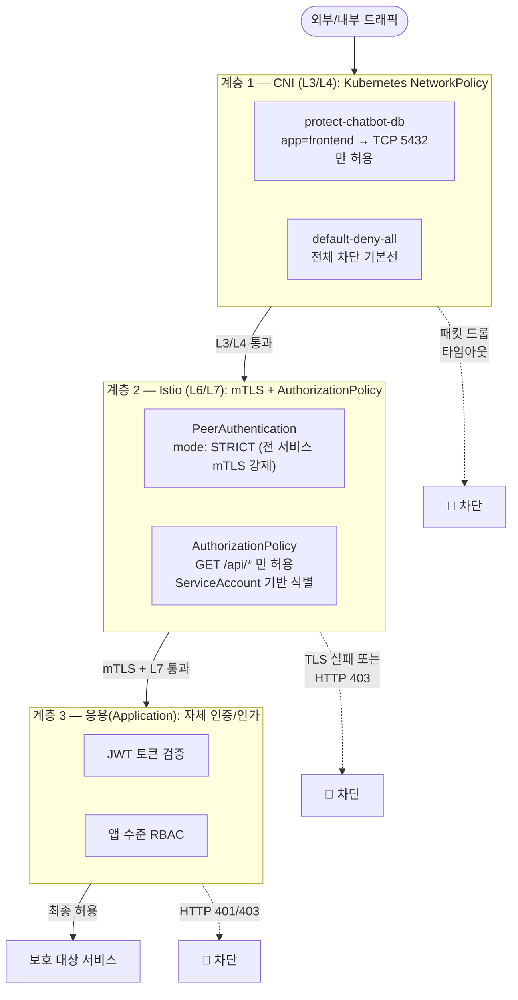

이 조합의 핵심 이점은 **하나의 계층이 잘못 설정되더라도 다른 계층이 여전히 보호를 제공**한다는 점입니다. 예를 들어 Istio AuthorizationPolicy를 잘못 설정하여 누락된 규칙이 있더라도, NetworkPolicy가 L3/L4 수준에서 허가되지 않은 트래픽을 차단합니다. 반대로 NetworkPolicy만 있는 경우 IP/포트가 허용 조건을 만족하면 애플리케이션 수준에서 제어할 방법이 없지만, Istio AuthorizationPolicy가 HTTP 메서드와 경로 수준에서 추가 검증을 합니다.

---

# 별첨 B — AKS 및 VM 기반 Kubernetes 최적 네트워크 정책 아키텍처 설계

---

## B.1 설계 원칙

어떤 환경이든 Kubernetes 네트워크 정책 아키텍처는 다음 네 가지 원칙을 기반으로 설계해야 합니다.

첫 번째는 **Zero Trust 원칙**입니다. "내부 네트워크는 안전하다"는 가정을 버리고, 모든 통신을 검증하며 명시적으로 허용된 것만 통과시킵니다. 두 번째는 **최소 권한(Least Privilege) 원칙**입니다. 서비스가 동작하는 데 필요한 최소한의 네트워크 접근 권한만 부여합니다. 세 번째는 **마이크로세그멘테이션(Microsegmentation)** 입니다. 네임스페이스와 레이블을 활용하여 서비스 단위로 네트워크를 세분화하여 횡적 이동(Lateral Movement)을 방지합니다. 네 번째는 **계층적 방어(Defense-in-Depth)** 입니다. 단일 기술에 의존하지 않고 여러 계층에서 보안을 적용합니다.

---

## B.2 AKS 기반 최적 네트워크 정책 아키텍처

### B.2.1 권장 스택 구성

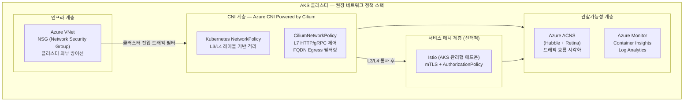

### B.2.2 네임스페이스 구조 설계

AKS 환경에서 네임스페이스는 네트워크 격리의 기본 단위입니다. 다음과 같은 네임스페이스 구조를 권장합니다.

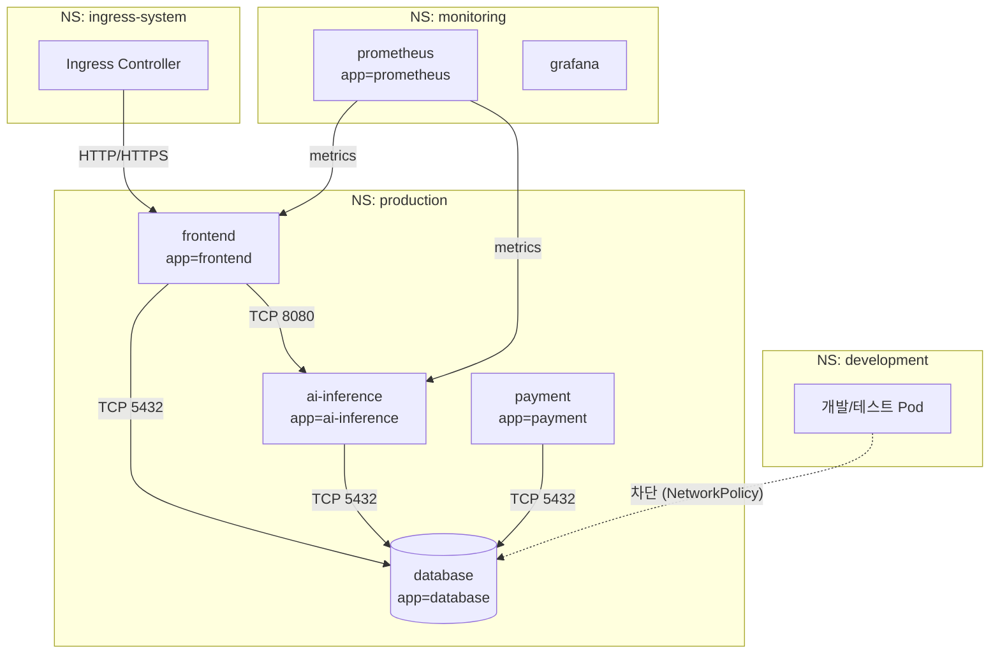

### B.2.3 단계별 구현 로드맵

**Phase 1 — 기반 구축 (즉시 적용 가능)**

첫 번째 단계에서는 모든 네임스페이스에 Default Deny Ingress 정책을 적용하여 기본 보안 기준선을 수립합니다. 이후 서비스 의존성 맵을 기반으로 필요한 허용 규칙을 점진적으로 추가합니다. Cilium을 CNI로 선택하면 이 단계에서 eBPF 기반의 높은 성능과 향후 L7 확장성을 확보할 수 있습니다.

```yaml
# Phase 1: 네임스페이스별 Default Deny 적용
apiVersion: networking.k8s.io/v1
kind: NetworkPolicy
metadata:
  name: default-deny-ingress
  namespace: production
spec:
  podSelector: {}
  policyTypes:
  - Ingress
```

**Phase 2 — 서비스별 세밀한 정책 (1~2개월 내)**

두 번째 단계에서는 서비스 역할에 맞는 정밀한 NetworkPolicy를 적용합니다. 데이터베이스는 허용된 앱 Pod에서만 특정 포트로만 접근 가능하도록 하고, 모니터링 시스템이 메트릭을 수집할 수 있도록 별도 정책을 추가합니다. DNS Egress 허용도 이 단계에서 구성합니다.

**Phase 3 — L7 정책 강화 (Cilium ACNS 또는 Istio 도입)**

세 번째 단계에서는 요구사항에 따라 두 가지 경로 중 하나를 선택합니다. 운영 복잡도를 최소화하면서 L7 제어가 필요하다면 Cilium의 `CiliumNetworkPolicy`와 Azure Advanced Container Networking Services(ACNS)를 활성화합니다. mTLS 암호화, 고급 트래픽 관리, 포괄적인 관찰가능성이 필요하다면 AKS 관리형 Istio 애드온을 도입합니다.

**Phase 4 — 관찰가능성 및 지속적 감사**

네 번째 단계에서는 Hubble(Cilium UI)이나 Kiali(Istio UI)로 서비스 간 트래픽 흐름을 시각화하고, Azure Monitor와 Log Analytics를 통해 정책 위반 이벤트를 모니터링합니다. 분기별 정책 감사를 통해 불필요한 규칙을 제거하고 새로운 서비스에 대한 규칙을 추가합니다.

### B.2.4 AKS 전용 고려사항

**Azure NSG와 NetworkPolicy의 역할 분담**: Azure Network Security Group(NSG)은 VNet 수준에서 클러스터로 들어오는 외부 트래픽을 제어합니다. Kubernetes NetworkPolicy는 클러스터 내부의 Pod 간 트래픽을 제어합니다. 두 계층을 혼동하지 않도록 주의해야 합니다.

**Azure NPM 지원 종료**: Microsoft는 Azure Network Policy Manager(NPM)의 Linux 노드 지원을 2028년 9월 30일에 종료할 예정입니다. 신규 AKS 클러스터는 반드시 Azure CNI Powered by Cilium을 선택하고, 기존 NPM 클러스터는 Cilium으로 마이그레이션 계획을 수립해야 합니다.

**Windows 노드 고려**: AKS에서 Windows 노드를 사용하는 경우, Cilium은 Linux 노드에만 적용됩니다. Windows 노드에는 Calico를 사용하고, Istio Ambient 모드는 Windows를 지원하지 않습니다.

---

## B.3 VM 기반 Self-Managed Kubernetes (Cloud Native) 최적 아키텍처

VM에 직접 Kubernetes를 구축하는 환경(온프레미스, 멀티클라우드, 하이브리드)에서는 관리형 서비스의 도움 없이 모든 컴포넌트를 직접 선택하고 관리해야 합니다.

### B.3.1 권장 컴포넌트 스택

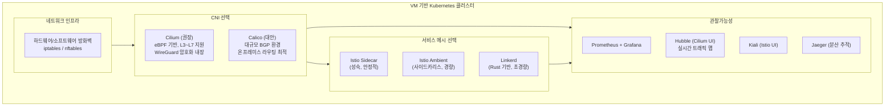

### B.3.2 규모별 권장 아키텍처

| 클러스터 규모 | Pod 수 | 권장 CNI | 권장 서비스 메시 | 이유 |
|-------------|--------|---------|----------------|------|
| **소규모** | ~100 | Cilium | 없음 (NetworkPolicy만) | 단순성 우선, 오버헤드 최소화 |
| **중규모** | 100~500 | Cilium | Linkerd 또는 Istio Ambient | 경량 mTLS, 관찰가능성 도입 |
| **대규모** | 500~2000 | Cilium 또는 Calico | Istio Ambient | L7 정책, 고급 트래픽 관리 필요 |
| **초대규모** | 2000+ | Cilium (BGP 모드) | Istio Ambient | eBPF 성능, 멀티클러스터 지원 |
| **GPU/AI 워크로드** | 가변 | Cilium | Istio Ambient (선택적) | 메모리 효율, 저지연 필수 |

### B.3.3 Cilium vs Calico 선택 기준

| 비교 항목 | Cilium | Calico |
|----------|--------|--------|
| **데이터 플레인** | eBPF (커널 수준) | iptables / eBPF 선택 가능 |
| **L7 정책 지원** | ✅ CiliumNetworkPolicy | 제한적 (Calico Enterprise) |
| **성능** | 최고 수준 (eBPF) | 양호 |
| **BGP 라우팅** | 지원 (Cilium BGP) | ✅ 특히 강점 (온프레미스 최적) |
| **WireGuard 암호화** | ✅ 내장 | 지원 |
| **FQDN 필터링** | ✅ | ✅ (Calico Enterprise) |
| **관찰가능성** | ✅ Hubble 내장 | 별도 구성 필요 |
| **학습 곡선** | 중간 | 낮음 |
| **온프레미스 적합성** | 양호 | 매우 우수 (BGP 환경) |
| **AKS 관리형** | ✅ (Azure CNI with Cilium) | 지원 |

### B.3.4 Istio Sidecar vs Ambient 선택 기준 (2026년 기준)

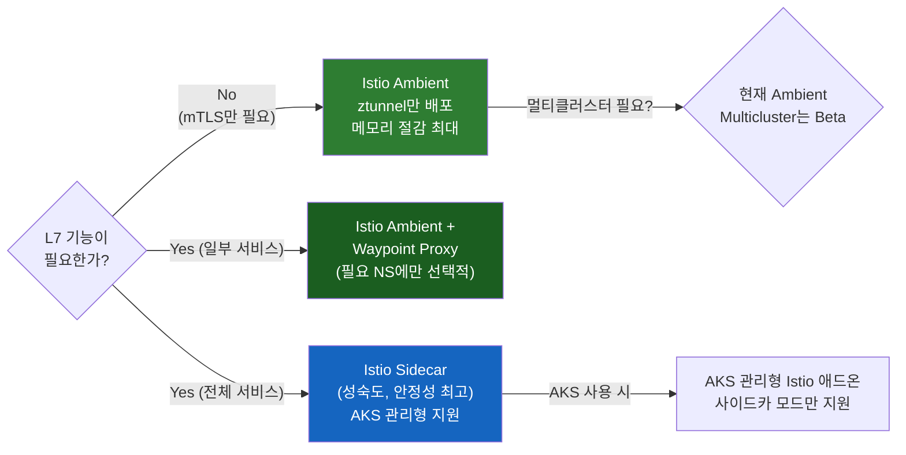

**Istio Sidecar를 선택하는 경우**: AKS 관리형 Istio 애드온을 사용하는 경우(현재 사이드카만 지원), 팀에 Istio 운영 경험이 풍부한 경우, 멀티클러스터 환경에서 안정적인 교차 클러스터 트래픽 관리가 필요한 경우입니다.

**Istio Ambient를 선택하는 경우**: VM 기반 자체 설치 환경으로 리소스 효율이 중요한 경우, GPU/AI 워크로드처럼 메모리 오버헤드에 민감한 경우, mTLS를 클러스터 전체에 빠르게 적용해야 하는 경우입니다. 2026년 현재 Ambient Multicluster는 베타 단계이므로 프로덕션 멀티클러스터 환경에서는 신중한 검토가 필요합니다.

---

## B.4 전체 아키텍처 통합 참조 모델

다음은 AIOps 플랫폼을 위한 완전한 네트워크 정책 아키텍처의 참조 모델입니다.

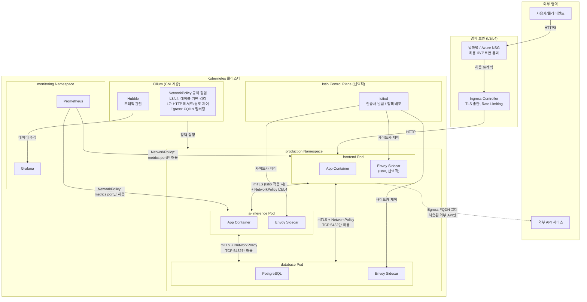

---

## B.5 선택 시나리오별 최종 권장 구성

| 시나리오 | CNI | NetworkPolicy | 서비스 메시 | 비고 |
|----------|-----|--------------|------------|------|
| **AKS 소규모 (개발/스테이징)** | Azure CNI + Cilium | K8s NetworkPolicy | 없음 | 최소 복잡도 |
| **AKS 중규모 (프로덕션)** | Azure CNI + Cilium | K8s NP + CiliumNP | Istio (관리형, 사이드카) | 균형잡힌 보안/운영성 |
| **AKS 대규모 (엔터프라이즈)** | Azure CNI + Cilium | K8s NP + CiliumNP + ACNS | Istio (관리형) + ACNS FQDN | 최고 수준 보안/관찰가능성 |
| **VM K8s 소규모** | Cilium | K8s NetworkPolicy | Linkerd (경량) | 자원 효율 우선 |
| **VM K8s 중규모** | Cilium | K8s NP + CiliumNP | Istio Ambient | mTLS + L7 균형 |
| **VM K8s 대규모/AI** | Cilium (BGP) | CiliumNetworkPolicy | Istio Ambient + Waypoint | GPU 메모리 효율 필수 |
| **온프레미스 (BGP 환경)** | Calico | K8s NP + Calico GlobalNP | Istio Sidecar | 기존 BGP 인프라 연동 |
| **멀티클러스터** | Cilium | CiliumNetworkPolicy | Istio Sidecar (Ambient는 Beta) | 안정성 우선 |

---

## B.6 별첨 요약

NetworkPolicy와 Istio Service Mesh는 경쟁 관계가 아니라 동작 계층이 다른 상호 보완적 기술입니다. NetworkPolicy는 L3/L4에서 IP/포트 기반으로 패킷을 필터링하는 Kubernetes 네이티브 방화벽이고, Istio는 L5~L7에서 서비스 정체성, 암호화, HTTP 속성 기반으로 트래픽을 제어하는 서비스 메시입니다.

최적의 아키텍처는 환경과 요구사항에 따라 다르지만, 2026년 현재 AKS 환경에서는 **Azure CNI Powered by Cilium + Kubernetes NetworkPolicy + (필요 시) AKS 관리형 Istio 사이드카** 조합이 Microsoft의 공식 권장 구성입니다. VM 기반 자체 설치 환경에서는 **Cilium + Istio Ambient Mesh**가 성능과 보안을 동시에 충족하는 최신 트렌드 아키텍처입니다.

모든 경우에 공통적으로 적용되는 원칙은 **Zero Trust 기반의 Default Deny 정책을 기본선으로 삼고, 서비스 의존성 맵에 따라 점진적으로 허용 규칙을 추가**하는 것입니다.

---

*별첨 작성일: 2026-06-10*  
*참고 출처: Microsoft Learn AKS 공식 문서, Istio 공식 문서, KubeCon EU 2026 발표 자료, Cilium 공식 문서*
