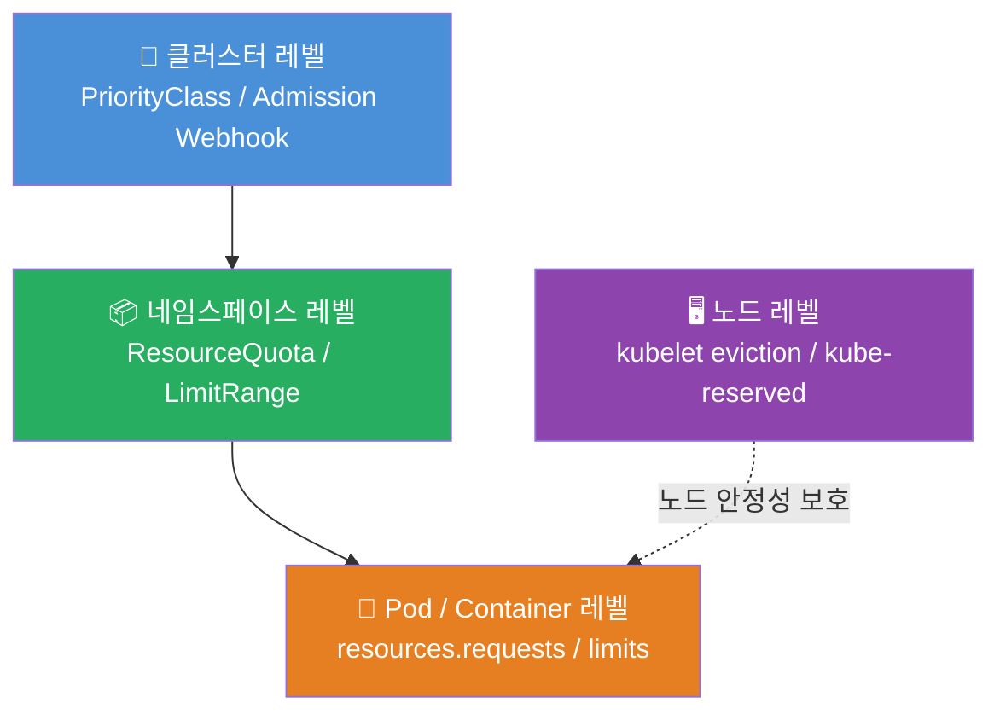
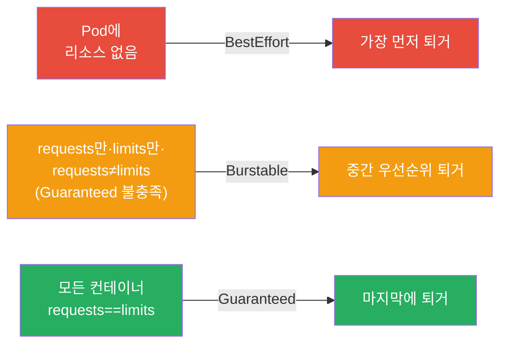
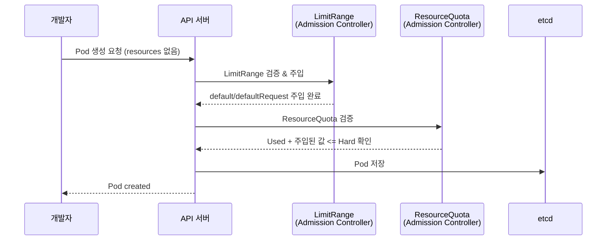
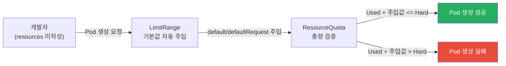
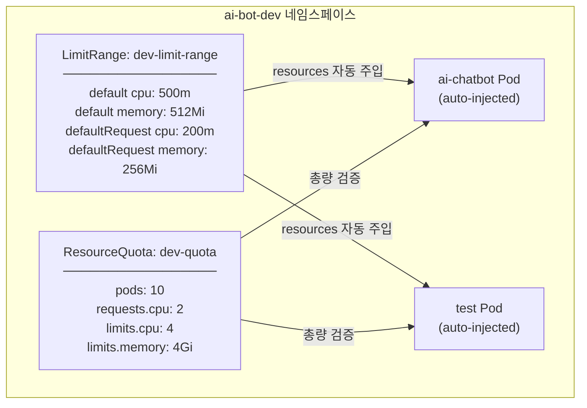

> **대상 환경**: Azure Kubernetes Service (AKS), Korea Central, Kubernetes 1.34.7  
> **과정**: Kubernetes AIOps 실전 과정 (psedu.gitbook.io)

## 실습 문서

[**Lab 6 - 리소스 관리**](https://psedu.gitbook.io/k8s-aiops-aks/lab-6)

[**Kubernetes AIOps 실전.pdf**](https://drive.google.com/file/d/1aA2YTol6pRqIkpTyQs0GtZghoVqr7P0E/view?usp=sharing)


---

## 목차

1. [리소스 관리가 왜 중요한가](#1-리소스-관리가-왜-중요한가)
2. [Kubernetes 리소스 관리 체계 전반](#2-kubernetes-리소스-관리-체계-전반)
3. [requests와 limits의 기본 원리](#3-requests와-limits의-기본-원리)
4. [QoS(Quality of Service) 클래스](#4-qosquality-of-service-클래스)
5. [ResourceQuota 상세](#5-resourcequota-상세)
6. [LimitRange 상세](#6-limitrange-상세)
7. [ResourceQuota vs LimitRange 비교](#7-resourcequota-vs-limitrange-비교)
8. [리소스 제한 수단 전체 비교](#8-리소스-제한-수단-전체-비교)
9. [AKS 노드 레벨 리소스 예약](#9-aks-노드-레벨-리소스-예약)
10. [자동 스케일링: HPA와 VPA](#10-자동-스케일링-hpa와-vpa)
11. [AIOps 실전 시나리오: ai-bot-dev](#11-aiops-실전-시나리오-ai-bot-dev)
12. [실습 트러블슈팅 사례 모음](#12-실습-트러블슈팅-사례-모음)
13. [구축 및 운영 Claude Code 프롬프트](#13-구축-및-운영-claude-code-프롬프트)
14. [운영 모범 사례](#14-운영-모범-사례)

---

## 1. 리소스 관리가 왜 중요한가

Kubernetes 클러스터는 여러 팀, 여러 애플리케이션이 하나의 물리 인프라를 공유하는 멀티테넌트 환경입니다. 이 환경에서 리소스 관리가 없으면 특정 팀의 워크로드가 노드 자원을 독점하여 다른 팀의 서비스에 영향을 주는 장애가 실제로 발생합니다.

이번 실습의 AI 챗봇 시나리오가 이를 잘 보여줍니다. 개발팀(`ai-bot-dev`)이 부하 테스트를 진행하면서 컨테이너에 리소스 제한을 걸지 않았고, 그 결과 해당 Pod들이 클러스터 노드의 CPU와 메모리를 과도하게 점유하는 장애가 발생했습니다. Kubernetes는 기본적으로 리소스 제한이 없는 컨테이너를 `BestEffort` 등급으로 처리하며, 이런 컨테이너는 노드가 허용하는 최대 자원을 모두 가져갈 수 있습니다.

리소스를 잘못 설정하면 두 가지 방향으로 문제가 생깁니다. 너무 낮게 설정하면 Pod가 OOMKilled(메모리 초과로 강제 종료)되거나 CPU 스로틀링(실제 CPU 사용을 인위적으로 늦춤)이 발생합니다. 반대로 너무 높게 설정하면 실제로는 사용하지 않는 자원을 예약해두어 클러스터 용량이 낭비되고, 다른 팀의 Pod가 스케줄되지 못하는 상황이 발생합니다.

---

## 2. Kubernetes 리소스 관리 체계 전반

Kubernetes의 리소스 제한 수단은 적용 레벨에 따라 계층 구조를 이룹니다. 가장 기본이 되는 컨테이너 레벨부터 네임스페이스 전체를 관리하는 레벨, 그리고 클러스터 전체와 노드 레벨까지 총 네 개의 층으로 구성됩니다.



각 층이 담당하는 역할은 다릅니다. 컨테이너 레벨의 `resources.requests/limits`는 가장 기본적인 단위로, 개별 컨테이너가 얼마나 자원을 사용할 수 있는지를 직접 명시합니다. 네임스페이스 레벨의 `LimitRange`는 개발자가 이 값을 작성하지 않았을 때 자동으로 기본값을 주입하거나 허용 범위를 강제합니다. `ResourceQuota`는 네임스페이스 전체의 총합이 일정 한계를 넘지 않도록 제한합니다. 클러스터 레벨의 `PriorityClass`는 자원 경합이 발생했을 때 어느 Pod를 먼저 보호할지 우선순위를 정의합니다. 노드 레벨의 kubelet 설정은 운영체제와 Kubernetes 컴포넌트 자체를 보호하기 위한 안전망입니다.

---

## 3. requests와 limits의 기본 원리

모든 리소스 관리의 기초는 `requests`와 `limits`라는 두 개의 값입니다. 이 둘의 차이를 명확히 이해하는 것이 리소스 관리 전체의 출발점입니다.

`requests`는 컨테이너가 반드시 보장받을 자원의 양입니다. Kubernetes 스케줄러는 이 값을 기준으로 어느 노드에 Pod를 배치할지 결정합니다. 노드의 할당 가능한 자원이 `requests` 합계보다 적다면 해당 노드에는 스케줄되지 않습니다. CPU `requests`는 컨테이너에게 보장되는 CPU 시간의 비율이며, 메모리 `requests`는 커널이 해당 프로세스에게 예약해두는 메모리 크기입니다.

`limits`는 컨테이너가 사용할 수 있는 자원의 최대치입니다. CPU의 경우, 컨테이너가 `limits`를 초과하려 하면 OS 스케줄러가 CPU 시간을 강제로 줄입니다(스로틀링). 이 과정은 컨테이너가 인식하지 못하며, 단지 처리 속도가 느려질 뿐입니다. 메모리의 경우는 다릅니다. 컨테이너가 `limits`를 초과하면 Linux 커널의 OOM Killer가 해당 프로세스를 강제 종료하고, Pod는 `OOMKilled` 상태로 재시작됩니다.

```yaml
# 컨테이너 레벨 resources 설정 예시
resources:
  requests:
    cpu: "200m"      # 0.2 코어 보장 (스케줄링 기준)
    memory: "256Mi"  # 256MiB 보장 (스케줄링 기준)
  limits:
    cpu: "500m"      # 0.5 코어 초과 시 스로틀링
    memory: "512Mi"  # 512MiB 초과 시 OOMKilled
```

CPU 단위에서 `m`은 millicores(밀리코어)를 의미합니다. 1 코어 = 1000m이므로, `200m`은 0.2 코어, `500m`은 0.5 코어입니다. 메모리 단위에서 `Mi`는 MiB(메비바이트, 2^20 bytes), `Gi`는 GiB(기비바이트, 2^30 bytes)입니다. `M`은 MB(10^6 bytes), `G`는 GB(10^9 bytes)이므로 혼용하지 않도록 주의해야 합니다. 실습에서 `0.1G`, `0.4G`로 작성한 값이 kubectl describe에서 `100M`, `400M`으로 표시된 것이 이 단위 변환의 결과입니다.

---

## 4. QoS(Quality of Service) 클래스

Kubernetes는 `requests`와 `limits` 설정에 따라 각 Pod에 자동으로 QoS 클래스를 부여합니다. 이 클래스는 노드 자원이 부족할 때 어느 Pod를 먼저 퇴거(eviction)시킬지 결정하는 기준이 됩니다.

| QoS 클래스 | 조건 | 특징 | 퇴거 우선순위 |
|---|---|---|---|
| **Guaranteed** | 모든 컨테이너의 requests == limits (CPU·메모리 모두) | 가장 강한 보장 | 마지막 (가장 낮음) |
| **Burstable** | Guaranteed 조건 미충족, 단 최소 1개 컨테이너에 requests 또는 limits 존재 | 보장 초과 사용 가능 | 중간 |
| **BestEffort** | 모든 컨테이너에 requests/limits 전혀 없음 | 남는 자원만 사용 | 가장 먼저 퇴거 |

`BestEffort` Pod는 노드에서 남는 자원을 모두 사용할 수 있지만, 자원이 부족해지면 가장 먼저 종료됩니다. 개발팀의 Pod에 리소스 제한이 없었던 것이 바로 이 `BestEffort` 상태를 만들었고, 그것이 클러스터 장애로 이어진 원인이었습니다.



---

## 5. ResourceQuota 상세

### 5.1 개념

`ResourceQuota`는 네임스페이스 단위로 리소스 **총량**을 제한하는 오브젝트입니다. 한 팀이 사용하는 네임스페이스에서 생성할 수 있는 Pod 수, 전체 CPU 요청량 합계, 전체 메모리 제한량 합계 등을 Hard(절대 불가) 값으로 설정합니다.

### 5.2 동작 원리

Pod 생성 요청이 들어올 때 API 서버의 Admission Controller가 해당 네임스페이스의 ResourceQuota 현재 Used 값을 조회합니다. 이미 사용 중인 값(Used)에 새로 요청하는 값을 더했을 때 Hard 값을 초과하면 HTTP 403 Forbidden으로 즉시 거부합니다. 거부 메시지에는 어떤 리소스가 어느 정도 초과했는지가 포함됩니다.

```
Error from server (Forbidden): pods "test-pod" is forbidden:
exceeded quota: dev-quota, requested: limits.cpu=5,
used: limits.cpu=0, limited: limits.cpu=4
```

이 메시지의 세 숫자를 읽으면 상황이 즉시 파악됩니다. `requested`는 이 Pod가 요청한 값, `used`는 현재 네임스페이스에서 소비 중인 값, `limited`는 ResourceQuota의 Hard 값입니다.

### 5.3 제한 가능한 리소스 종류

ResourceQuota는 CPU/메모리뿐 아니라 오브젝트 수도 제한할 수 있습니다.

| 리소스 키 | 의미 |
|---|---|
| `pods` | 생성 가능한 최대 Pod 수 |
| `requests.cpu` | 전체 컨테이너 CPU requests 합계 |
| `limits.cpu` | 전체 컨테이너 CPU limits 합계 |
| `requests.memory` | 전체 컨테이너 메모리 requests 합계 |
| `limits.memory` | 전체 컨테이너 메모리 limits 합계 |
| `configmaps` | ConfigMap 최대 수 |
| `secrets` | Secret 최대 수 |
| `services` | Service 최대 수 |
| `persistentvolumeclaims` | PVC 최대 수 |

### 5.4 ResourceQuota와 Deployment의 관계

실습에서 `replicas=3`으로 Deployment를 생성했을 때 Pod가 1개만 생성된 것을 확인했습니다. Deployment 자체는 생성되지만, 실제 Pod를 만드는 ReplicaSet이 ResourceQuota 제한에 막혀 일부만 생성했기 때문입니다.

이때 `kubectl describe deploy` 명령으로 확인하면 Conditions 섹션에 `ReplicaFailure: True / FailedCreate`가 표시됩니다. `kubectl describe rs` 명령으로 ReplicaSet을 조회하면 Events에 `exceeded quota` 메시지를 확인할 수 있습니다(이벤트 기록 타이밍에 따라 바로 보이지 않을 수 있음).

### 5.5 ResourceQuota와 LimitRange의 상호 의존성

ResourceQuota에서 `requests.cpu`나 `limits.memory` 같은 리소스 기반 항목을 설정하면, 해당 네임스페이스 안의 모든 Pod는 반드시 해당 리소스를 명시해야 합니다. 명시하지 않으면 API 서버가 거부합니다.

실습에서 `my-rq1`(메모리 제한 RQ)이 적용된 상태에서 `resources` 항목이 없는 `my-rq1-pod1`을 생성하려 했을 때 다음 에러가 발생한 것이 그 예시입니다.

```
pods "my-rq1-pod1" is forbidden: failed quota: my-rq1:
must specify limits.memory for: container;
requests.memory for: container
```

이 문제를 해결하는 가장 좋은 방법이 바로 LimitRange와의 조합입니다. LimitRange가 자동으로 기본값을 주입하면, 개발자가 `resources`를 작성하지 않아도 ResourceQuota 검증을 통과할 수 있습니다.

### 5.6 YAML 전체 예시

```yaml
# 미션 1 dev-quota.yaml
apiVersion: v1
kind: ResourceQuota
metadata:
  name: dev-quota
  namespace: ai-bot-dev
spec:
  hard:
    pods: "10"            # 최대 Pod 10개
    requests.cpu: "2"     # CPU requests 합계 2 코어
    limits.cpu: "4"       # CPU limits 합계 4 코어
    limits.memory: "4Gi"  # 메모리 limits 합계 4GiB
```

---

## 6. LimitRange 상세

### 6.1 개념

`LimitRange`는 네임스페이스 안의 **개별 컨테이너, Pod, PVC**에 대해 허용 범위와 기본값을 강제하는 오브젝트입니다. ResourceQuota가 총량을 관리한다면, LimitRange는 개별 단위의 크기를 관리합니다.

### 6.2 5가지 설정 항목

LimitRange의 `limits` 블록에는 최대 5가지 항목을 설정할 수 있습니다.

| 항목 | 역할 | 미설정 시 |
|---|---|---|
| `min` | 컨테이너가 요청할 수 있는 최솟값 | 제한 없음 |
| `max` | 컨테이너에 허용되는 최댓값 | 제한 없음 |
| `default` | limits 미설정 시 자동 주입되는 기본 limit 값 | 주입 없음 |
| `defaultRequest` | requests 미설정 시 자동 주입되는 기본 request 값 | 주입 없음 |
| `maxLimitRequestRatio` | limits ÷ requests 허용 최대 배율 | 제한 없음 |

### 6.3 자동 주입 메커니즘

LimitRange의 핵심 기능 중 하나는 `default`와 `defaultRequest`를 통한 자동 주입입니다. 개발자가 Pod 스펙에 `resources` 항목을 작성하지 않아도, Pod 생성 시점에 API 서버의 Admission Controller(LimitRanger)가 자동으로 해당 값을 컨테이너 스펙에 추가합니다.



이 흐름에서 중요한 점은 순서입니다. LimitRange가 먼저 기본값을 주입하고, 그 다음 ResourceQuota가 총량 검증을 수행합니다. 따라서 LimitRange와 ResourceQuota를 함께 사용할 때는 LimitRange의 default 값들이 ResourceQuota Used 계산에 포함됩니다.

### 6.4 검증 로직

Pod에 `resources` 값이 명시되어 있을 때는 자동 주입 대신 검증이 수행됩니다.

- `min` ≤ requests ≤ `max` 범위 검증
- `min` ≤ limits ≤ `max` 범위 검증
- limits ÷ requests ≤ `maxLimitRequestRatio` 검증

실습에서 `lab6-lr-pod1.yaml`(limits=0.5G, requests=0.1G)을 생성할 때 두 가지 위반이 동시에 발생했습니다.

```
pods "my-lr-pod1" is forbidden: [
  maximum memory usage per Container is 400M, but limit is 500M,
  memory max limit to request ratio per Container is 3,
  but provided ratio is 5.000000
]
```

첫 번째는 `limits(500M) > max(400M)` 위반이고, 두 번째는 `500M ÷ 100M = 5배 > maxLimitRequestRatio(3배)` 위반입니다. LimitRange는 위반 조건을 단 하나라도 발견하면 거부하며, 여러 개의 위반이 있을 경우 대괄호 안에 모두 나열하여 알려줍니다.

### 6.5 type 종류

LimitRange는 `type` 필드로 적용 대상을 선택할 수 있습니다.

| type | 적용 대상 |
|---|---|
| `Container` | 네임스페이스 내 모든 컨테이너 개별 적용 |
| `Pod` | Pod 전체(컨테이너 합산) 기준 적용 |
| `PersistentVolumeClaim` | PVC의 용량 제한 |

이번 실습에서는 모두 `Container` 타입을 사용했습니다.

### 6.6 YAML 전체 예시

```yaml
# Task 2 실습 예시
apiVersion: v1
kind: LimitRange
metadata:
  name: my-lr
  namespace: lr-ns
spec:
  limits:
  - type: Container
    min:
      memory: 0.1G        # 최소 100MB
    max:
      memory: 0.4G        # 최대 400MB
    maxLimitRequestRatio:
      memory: 3           # limits/requests 최대 3배
    defaultRequest:
      memory: 0.1G        # requests 기본값 100MB
    default:
      memory: 0.2G        # limits 기본값 200MB
```

```yaml
# 미션 2 dev-limit-range.yaml
apiVersion: v1
kind: LimitRange
metadata:
  name: dev-limit-range
  namespace: ai-bot-dev
spec:
  limits:
  - type: Container
    default:
      cpu: 500m       # limits 기본값
      memory: 512Mi
    defaultRequest:
      cpu: 200m       # requests 기본값
      memory: 256Mi
```

---

## 7. ResourceQuota vs LimitRange 비교

두 오브젝트는 함께 사용될 때 서로를 보완합니다. 각각의 특성을 명확히 구분하는 것이 중요합니다.

| 비교 항목 | ResourceQuota | LimitRange |
|---|---|---|
| **적용 범위** | 네임스페이스 전체 합산 | 개별 컨테이너/Pod/PVC |
| **측정 단위** | 네임스페이스 내 총량 | 단일 오브젝트 기준 |
| **주요 목적** | 팀/프로젝트별 총 사용량 상한 | 개별 컨테이너 크기 제한 및 기본값 주입 |
| **기본값 주입** | ❌ 불가 | ✅ default/defaultRequest |
| **Pod 수 제한** | ✅ `pods: N` | ❌ 불가 |
| **min/max 설정** | ❌ 불가 | ✅ 가능 |
| **생성 시점 검증** | Used + 요청 > Hard 이면 거부 | min/max/ratio 위반 시 거부 |
| **오브젝트 수 제한** | ✅ ConfigMap, Secret 등 | ❌ 불가 |
| **Scope 필터** | ✅ BestEffort/NotBestEffort 등 | ❌ 불가 |
| **kubectl 조회 명령** | `kubectl get quota` | `kubectl get limitrange` |
| **현재 사용량 확인** | `kubectl describe quota` (Used 열) | 사용량 표시 없음 |

### 함께 사용해야 하는 이유

ResourceQuota에 `requests.cpu`, `limits.memory` 등의 항목이 있으면, 해당 네임스페이스에서 생성되는 모든 Pod는 반드시 그 리소스를 명시해야 합니다. LimitRange의 `default`/`defaultRequest`가 없다면, 개발자가 `resources` 항목을 빠뜨린 Pod는 ResourceQuota 검증에서 즉시 거부됩니다.

즉, `ResourceQuota가 요구하는 명시 의무를 LimitRange의 자동 주입이 대신 충족`시켜 주는 관계입니다.



---

## 8. 리소스 제한 수단 전체 비교

### 8.1 레벨별 전체 비교표

| 수단 | 레벨 | AKS 직접 설정 | 자동화 | 주요 역할 |
|---|---|---|---|---|
| `resources.requests/limits` | 컨테이너 | ✅ | ❌ | 개별 자원 보장/제한 |
| `LimitRange` | 네임스페이스 | ✅ | 기본값 주입 | 컨테이너 범위 및 기본값 |
| `ResourceQuota` | 네임스페이스 | ✅ | ❌ | 총량 상한 |
| `PriorityClass` | 클러스터 | ✅ | ❌ | 퇴거 우선순위 |
| `HPA` | 클러스터 | ✅ | Pod 수 자동 조정 | 트래픽 대응 수평 스케일 |
| `VPA` | 클러스터 | ✅ (별도 설치) | requests/limits 자동 조정 | 자원 효율화 |
| `KEDA` | 클러스터 | ✅ (별도 설치) | 이벤트 기반 스케일 | 고급 자동화 |
| kubelet `kube-reserved` | 노드 | ❌ (AKS 자동) | ❌ | K8s 컴포넌트 자원 예약 |
| kubelet `eviction-hard` | 노드 | ❌ (AKS 자동) | ❌ | 노드 안정성 보호 |

### 8.2 HPA vs VPA 비교

| 비교 항목 | HPA | VPA |
|---|---|---|
| **스케일 방향** | 수평 (Pod 수 증감) | 수직 (Pod 크기 증감) |
| **기준 지표** | CPU/메모리 사용률, 커스텀 메트릭 | 실제 사용 패턴 분석 |
| **반응 속도** | 빠름 (15초마다 재평가) | 느림 (분석 후 권고) |
| **Pod 재시작** | 없음 | 있음 (기존 Pod 재생성) |
| **예측 능력** | 없음 (현재 상태만 반응) | 제한적 (히스토리 기반) |
| **기본 포함** | ✅ Kubernetes 기본 | ❌ 별도 설치 필요 |
| **AKS 지원** | ✅ 완전 지원 | ✅ 애드온 설치 필요 |
| **함께 사용 시** | 동일 메트릭 사용 시 충돌 위험 | VPA는 Off 모드 권고 |

HPA와 VPA를 동일한 메트릭(CPU/메모리)으로 동시에 운영하면 두 컨트롤러가 서로 상충되는 결정을 내려 불안정해질 수 있습니다. 일반적으로 권장되는 패턴은 VPA를 `Off` 모드(권고만 제공, 자동 적용 안 함)로 설정하여 적정 requests/limits 값의 참고 자료로 활용하고, 실제 스케일링은 HPA가 담당하도록 구성하는 것입니다.

---

## 9. AKS 노드 레벨 리소스 예약

### 9.1 노드 할당 가능 용량 계산

AKS 노드의 전체 메모리/CPU를 모두 Pod에 사용할 수 있는 것은 아닙니다. 노드의 실제 할당 가능(Allocatable) 용량은 다음 공식으로 계산됩니다.

```
Allocatable = Node Capacity - kube-reserved - eviction-hard 임계값
```

### 9.2 AKS의 자동 설정값

AKS는 노드 크기와 Kubernetes 버전에 따라 자동으로 값을 설정합니다. 사용자가 직접 수정할 수 없습니다.

**메모리 예약 (AKS 1.29 이상 기준):**

- kube-reserved: `min(20MB × 최대Pod수 + 50MB, 전체메모리 × 25%)` 중 작은 값
- eviction-hard: `memory.available < 100Mi`

예시: 노드 8GB, 최대 30 Pod 지원 시
- kube-reserved = 20MB × 30 + 50MB = 650MB
- eviction 임계값 = 100MB
- Allocatable = 8GB - 0.65GB - 0.1GB = **7.25GB (90.6%)**

**CPU 예약 (kube-reserved CPU):**

| 노드 CPU | kube-reserved |
|---|---|
| 1 코어 | 60m |
| 2 코어 | 100m |
| 4 코어 | 140m |
| 8 코어 | 180m |
| 16 코어 | 260m |
| 32 코어 | 420m |
| 64 코어 | 740m |

### 9.3 AKS 1.29 이전 버전과의 차이

AKS 1.29 이전에는 eviction-hard 임계값이 `memory.available < 750Mi`로 더 높았으며, kube-reserved 메모리도 다른 계산식(regressive rate)을 사용했습니다. 이번 실습 환경(Kubernetes 1.34.7)은 1.29 이상이므로 100Mi 기준이 적용됩니다.

### 9.4 실습에서 Pod가 Pending인 이유와의 연관성

Lab 6 실습 중 `my-lr-pod2`(ubuntu, requests.memory=0.1G)와 Deployment의 Pod들이 계속 `Pending` 상태인 것을 확인했습니다. 이는 ResourceQuota/LimitRange와는 무관하며, 실습 환경의 AKS 노드에서 ubuntu 이미지 기반의 command 없는 Pod를 위한 스케줄 가능한 메모리 용량이 부족했거나, 노드 상태 문제일 가능성이 높습니다. ResourceQuota 제한으로 생성된 Pod가 `Forbidden`으로 거부되는 것과, 생성은 됐지만 노드에 배치되지 못해 `Pending`이 되는 것은 완전히 다른 원인입니다.

---

## 10. 자동 스케일링: HPA와 VPA

### 10.1 HPA (Horizontal Pod Autoscaler)

HPA는 CPU, 메모리 사용률 또는 커스텀 메트릭을 기준으로 Deployment의 replicas를 자동으로 늘리거나 줄입니다.

```yaml
apiVersion: autoscaling/v2
kind: HorizontalPodAutoscaler
metadata:
  name: ai-chatbot-hpa
  namespace: ai-bot-dev
spec:
  scaleTargetRef:
    apiVersion: apps/v1
    kind: Deployment
    name: ai-chatbot
  minReplicas: 2
  maxReplicas: 10
  metrics:
  - type: Resource
    resource:
      name: cpu
      target:
        type: Utilization
        averageUtilization: 70  # CPU 70% 초과 시 스케일 아웃
```

HPA의 스케일 공식은 다음과 같습니다.

```
desiredReplicas = ceil(currentReplicas × (currentMetric ÷ desiredMetric))
```

HPA는 15초 간격으로 메트릭을 평가하지만, 스케일 다운은 5분 안정화 윈도우가 있어 급격한 증감을 방지합니다.

### 10.2 VPA (Vertical Pod Autoscaler)

VPA는 Pod의 실제 리소스 사용 패턴을 분석하여 requests/limits 적정값을 권고하거나 자동으로 조정합니다. AKS에서는 기본 포함이 아니어서 별도로 설치해야 합니다.

```yaml
apiVersion: autoscaling.k8s.io/v1
kind: VerticalPodAutoscaler
metadata:
  name: ai-chatbot-vpa
  namespace: ai-bot-dev
spec:
  targetRef:
    apiVersion: apps/v1
    kind: Deployment
    name: ai-chatbot
  updatePolicy:
    updateMode: "Off"   # 권고만 제공, 자동 적용 안 함
```

`updateMode: "Off"`로 설정하면 VPA가 권고 값만 생성하고 실제로 Pod를 재시작하거나 값을 변경하지 않습니다. `kubectl describe vpa` 명령으로 권고 값을 확인하고 수동으로 적정 requests/limits를 결정하는 데 활용할 수 있습니다.

### 10.3 AIOps 관점에서의 자동화

AIOps(AI for IT Operations) 맥락에서 리소스 관리는 단순한 임계값 설정을 넘어, 머신러닝 기반의 예측적 스케일링으로 발전하고 있습니다. 최근 Kubernetes 생태계에서는 다음과 같은 방향으로 발전하고 있습니다.

- **Predictive Analytics**: 과거 사용 패턴을 기반으로 향후 리소스 수요를 예측하여 사전에 스케일 아웃
- **Contextual Alert Correlation**: 수십 개의 독립적인 알림을 하나의 의미 있는 인시던트로 그룹화 (예: "노드 3번 메모리 압박 → 연쇄 Pod 재시작")
- **Automated Root-Cause Analysis**: 메트릭, 로그, 트레이스를 연계하여 장애 원인 자동 분석

---

## 11. AIOps 실전 시나리오: ai-bot-dev

### 11.1 시나리오 배경 및 구조

이번 실습의 AI 챗봇 시나리오는 `ai-bot-dev` 네임스페이스를 대상으로, Lab 3에서 구축한 AI 챗봇 서비스 인프라 위에 리소스 거버넌스 정책을 추가하는 시나리오입니다.



### 11.2 미션 1: ResourceQuota 설정

```yaml
# dev-quota.yaml
apiVersion: v1
kind: ResourceQuota
metadata:
  name: dev-quota
  namespace: ai-bot-dev
spec:
  hard:
    pods: "10"
    requests.cpu: "2"
    limits.cpu: "4"
    limits.memory: "4Gi"
```

이 설정의 의미를 풀어보면 다음과 같습니다. `ai-bot-dev` 네임스페이스 전체에서 동시에 실행될 수 있는 Pod는 최대 10개이며, 모든 Pod의 CPU requests 합계가 2코어를 넘을 수 없고, CPU limits 합계가 4코어, 메모리 limits 합계가 4GiB를 넘을 수 없습니다.

### 11.3 미션 2: LimitRange 설정

```yaml
# dev-limit-range.yaml
apiVersion: v1
kind: LimitRange
metadata:
  name: dev-limit-range
  namespace: ai-bot-dev
spec:
  limits:
  - type: Container
    default:
      cpu: 500m
      memory: 512Mi
    defaultRequest:
      cpu: 200m
      memory: 256Mi
```

이 설정으로 개발자가 `resources` 항목을 작성하지 않은 Pod를 배포해도, 각 컨테이너에 자동으로 `limits.cpu=500m, limits.memory=512Mi, requests.cpu=200m, requests.memory=256Mi`가 주입됩니다.

### 11.4 미션 3: 검증 테스트

**테스트 1: 자동 주입 확인**

```yaml
# resources 없는 테스트 Pod
apiVersion: v1
kind: Pod
metadata:
  name: test-auto-inject
  namespace: ai-bot-dev
spec:
  containers:
  - name: container
    image: nginx
    # resources 항목 없음
```

이 Pod를 생성한 후 `kubectl describe pod test-auto-inject -n ai-bot-dev`로 조회하면, 작성하지 않은 Limits와 Requests가 채워져 있는 것을 확인할 수 있습니다.

```
Limits:
  cpu:     500m     ← LimitRange default 자동 주입
  memory:  512Mi    ← LimitRange default 자동 주입
Requests:
  cpu:     200m     ← LimitRange defaultRequest 자동 주입
  memory:  256Mi    ← LimitRange defaultRequest 자동 주입
```

**테스트 2: ResourceQuota 초과 차단 확인**

```yaml
# limits.cpu=5로 Hard(4)를 초과하는 Pod
apiVersion: v1
kind: Pod
metadata:
  name: test-exceed
  namespace: ai-bot-dev
spec:
  containers:
  - name: container
    image: nginx
    resources:
      requests:
        cpu: "1"
        memory: "512Mi"
      limits:
        cpu: "5"       # Hard 4 코어 초과 → 의도적 초과값
        memory: "1Gi"
```

> `limits.cpu: "5"`는 ResourceQuota Hard 값(4)을 초과하도록 의도적으로 설정한 값입니다.

이 Pod를 생성하려 하면 API 서버가 즉시 거부합니다. 현재 used가 0이더라도, 요청값(5) 자체가 Hard(4)를 초과하기 때문입니다.

```
Error from server (Forbidden): pods "test-exceed" is forbidden:
exceeded quota: dev-quota, requested: limits.cpu=5,
used: limits.cpu=0, limited: limits.cpu=4
```

---

## 12. 실습 트러블슈팅 사례 모음

### 12.1 YAML 파싱 오류: 콜론 뒤 공백 누락

**증상:**
```
error: error parsing lab6-lr-pod1.yaml: error converting YAML to JSON:
yaml: line 6: could not find expected ':'
```

또는:
```
unable to decode "lab6-rq-ns.yaml":
json: cannot unmarshal string into Go struct field
metadataOnlyObject.metadata of type v1.ObjectMeta
```

**원인:**
`name:rq-ns`, `namespace:lr-ns` 처럼 콜론 뒤에 공백이 없는 경우 YAML 파서가 `name:rq-ns` 전체를 키 이름으로 읽고, 그 다음 줄에서 `:` 없이 값이 시작되면 파싱 오류가 발생합니다.

**해결:**
```yaml
# 잘못된 예
  name:rq-ns
  namespace:lr-ns

# 올바른 예
  name: rq-ns
  namespace: lr-ns
```

YAML에서 `key: value` 형식은 반드시 콜론 뒤에 공백(space) 하나 이상이 있어야 합니다. 특히 nano, vi로 파일을 직접 편집할 때 이 실수가 자주 발생하므로, 작성 후 반드시 `cat` 명령으로 내용을 눈으로 확인하는 습관이 중요합니다.

### 12.2 ResourceQuota 조건 미충족으로 Pod 거부

**증상:**
```
Error from server (Forbidden): error when creating "lab6-rq-pod1.yaml":
pods "my-rq1-pod1" is forbidden: failed quota: my-rq1:
must specify limits.memory for: container;
requests.memory for: container
```

**원인:**
네임스페이스에 `requests.memory`, `limits.memory`를 포함하는 ResourceQuota가 존재할 때, 해당 네임스페이스에 생성되는 모든 Pod는 반드시 이 값을 명시해야 합니다. `resources` 항목이 없으면 API 서버가 거부합니다.

**해결:**
Pod 스펙에 `resources.requests.memory`와 `resources.limits.memory`를 추가하거나, 네임스페이스에 LimitRange를 추가하여 기본값이 자동 주입되도록 설정합니다.

### 12.3 LimitRange 위반으로 Pod 거부

**증상:**
```
Error from server (Forbidden): error when creating "lab6-lr-pod1.yaml":
pods "my-lr-pod1" is forbidden: [
  maximum memory usage per Container is 400M, but limit is 500M,
  memory max limit to request ratio per Container is 3,
  but provided ratio is 5.000000
]
```

**원인:**
설정한 `limits.memory(500M)`가 LimitRange의 `max(400M)`를 초과하고, `limits/requests 비율(500M÷100M=5배)`이 `maxLimitRequestRatio(3)`를 초과했습니다. 두 조건 모두 위반되어 대괄호 안에 함께 표시됩니다.

**해결:**
limits 값을 max 이하로, 그리고 `limits ÷ requests ≤ maxLimitRequestRatio`를 만족하도록 조정합니다.

### 12.4 ResourceQuota Pod 수 초과로 일부 Pod만 생성

**증상:**
`replicas=3`인 Deployment를 생성했지만 Pod가 1개만 생성(Pending 상태)되고, `kubectl describe deploy` 에서 `ReplicaFailure: True`가 표시됩니다.

**원인:**
ResourceQuota에 `pods: 2`가 설정되어 있고, 이미 1개의 Pod가 존재하는 상태에서 3개를 추가 생성하려 했습니다. 쿼터 여유(2 - 1 = 1개)만큼만 생성 가능하여 1개만 만들어졌습니다.

**확인 방법:**
```bash
kubectl describe quota -n <namespace>   # Used/Hard 값 확인
kubectl describe rs <replicaset-name>   # FailedCreate 이벤트 확인
```

### 12.5 Namespace 삭제로 내부 리소스 일괄 정리

```bash
kubectl delete ns rq-ns
kubectl delete ns lr-ns
```

Namespace를 삭제하면 그 안의 모든 Pod, Deployment, ReplicaSet, Service, ResourceQuota, LimitRange 등이 함께 삭제됩니다. 실습 환경 정리 시 가장 빠른 방법이며, Namespace를 삭제하지 않으려면 개별 리소스를 하나씩 삭제해야 합니다.

---

## 13. 구축 및 운영 Claude Code 프롬프트

이 섹션은 Kubernetes AIOps 실전 환경에서 리소스 관리 정책을 구축하고 운영할 때 Claude Code에 전달할 수 있는 프롬프트 모음입니다. Azure Cloud Shell + AKS 환경을 기준으로 작성되었습니다.

---

### 13.1 네임스페이스 리소스 거버넌스 초기 구축

```
당신은 AKS 클러스터 관리자입니다.
현재 Azure Cloud Shell에서 kubectl이 구성된 AKS 클러스터에 연결되어 있습니다.

아래 요구사항에 따라 네임스페이스 리소스 거버넌스 정책을 구축해 주세요.

=== 대상 네임스페이스 ===
네임스페이스 이름: [NAMESPACE_NAME]

=== ResourceQuota 설정 요구사항 ===
이름: [QUOTA_NAME]
- 최대 Pod 수: [N]개
- CPU requests 합계 최대: [N] 코어
- CPU limits 합계 최대: [N] 코어
- 메모리 limits 합계 최대: [N]Gi

=== LimitRange 설정 요구사항 ===
이름: [LIMITRANGE_NAME]
- CPU limits 기본값: [N]m
- 메모리 limits 기본값: [N]Mi
- CPU requests 기본값: [N]m
- 메모리 requests 기본값: [N]Mi

=== 작업 순서 ===
STEP 1: 현재 네임스페이스 상태 확인
  kubectl describe ns [NAMESPACE_NAME]

STEP 2: ResourceQuota YAML 파일 생성 및 적용
  파일명: [QUOTA_NAME].yaml
  작성 후 cat 명령으로 내용 확인 후 kubectl create 실행

STEP 3: LimitRange YAML 파일 생성 및 적용
  파일명: [LIMITRANGE_NAME].yaml
  작성 후 cat 명령으로 내용 확인 후 kubectl create 실행

STEP 4: 적용 결과 확인
  kubectl describe ns [NAMESPACE_NAME]
  kubectl describe quota [QUOTA_NAME] -n [NAMESPACE_NAME]
  kubectl describe limitrange [LIMITRANGE_NAME] -n [NAMESPACE_NAME]

STEP 5: 자동 주입 테스트
  resources 항목이 없는 테스트 Pod를 생성하여
  LimitRange 기본값이 자동으로 주입되는지 확인

각 단계의 출력 결과를 그대로 보여주고,
ResourceQuota의 Used/Hard 현황과 LimitRange의 항목을
표 형식으로 정리해 주세요.
오류 발생 시 에러 메시지 전문과 원인, 해결 방법을 제시해 주세요.
```

---

### 13.2 기존 정책 현황 감사(Audit) 및 리포팅

```
당신은 AKS 클러스터 운영 담당자입니다.
클러스터 전체의 리소스 거버넌스 정책 현황을 감사하고
리포팅 자료를 작성해 주세요.

=== STEP 1: 전체 네임스페이스 목록 조회 ===
kubectl get ns

=== STEP 2: 모든 네임스페이스의 ResourceQuota 현황 ===
kubectl get resourcequota --all-namespaces

각 네임스페이스별 ResourceQuota 상세 내용:
kubectl describe quota --all-namespaces

=== STEP 3: 모든 네임스페이스의 LimitRange 현황 ===
kubectl get limitrange --all-namespaces
kubectl describe limitrange --all-namespaces

=== STEP 4: 리소스 사용량이 높은 네임스페이스 식별 ===
각 네임스페이스의 ResourceQuota Used/Hard 비율을 계산하여
사용률이 80% 이상인 항목을 경고로 표시해 주세요.

=== 리포팅 포맷 ===
결과를 아래 형식의 표로 정리해 주세요.

| 네임스페이스 | ResourceQuota | LimitRange | pods Used/Hard | CPU Used/Hard | Memory Used/Hard | 위험 여부 |
|---|---|---|---|---|---|---|

위험 여부 기준:
- 🔴 위험: 사용률 80% 이상
- 🟡 주의: 사용률 60% 이상
- 🟢 정상: 사용률 60% 미만
- ⚪ 미설정: ResourceQuota 없음

정책이 없는 네임스페이스(kube-system, kube-public 제외)를 별도로 목록화하여
클러스터 보안 취약점으로 보고해 주세요.
```

---

### 13.3 ResourceQuota 초과 장애 트러블슈팅

```
당신은 AKS 클러스터 SRE(Site Reliability Engineer)입니다.
특정 네임스페이스에서 Pod가 생성되지 않는 장애가 접수되었습니다.

장애 접수 내용: [NAMESPACE_NAME] 네임스페이스에서 Deployment의
Pod가 일부만 생성되거나 전혀 생성되지 않습니다.

=== STEP 1: 장애 네임스페이스 리소스 현황 확인 ===
kubectl get all -n [NAMESPACE_NAME]
kubectl describe quota -n [NAMESPACE_NAME]
kubectl describe limitrange -n [NAMESPACE_NAME]

=== STEP 2: Pod 생성 실패 원인 분석 ===
아래 명령어로 관련 Deployment와 ReplicaSet 이벤트를 확인하세요.
kubectl describe deploy -n [NAMESPACE_NAME]
kubectl describe rs -n [NAMESPACE_NAME]

이벤트에서 "exceeded quota", "forbidden", "FailedCreate" 키워드를 찾아
어떤 리소스 항목이 초과되었는지 분석해 주세요.

=== STEP 3: 원인 분류 ===
분석 결과를 아래 두 가지 원인 중 하나로 분류해 주세요.
A. ResourceQuota Hard 한계 초과 (총량 부족)
B. LimitRange 조건 위반 (개별 컨테이너 범위 위반)

=== STEP 4: 해결 방안 제시 ===
원인에 따라 아래 해결 방안 중 적절한 것을 선택하여 실행 명령과 함께 제시해 주세요.

방안 A: ResourceQuota Hard 값 상향 조정
방안 B: 불필요한 Pod/Deployment 정리로 Used 값 감소
방안 C: Pod의 resources.requests/limits 값 조정
방안 D: LimitRange 조건 완화

각 방안의 trade-off와 AIOps 운영 관점에서 권장 방안을 설명해 주세요.
```

---

### 13.4 멀티 네임스페이스 환경(개발/운영) 정책 설계

```
당신은 AKS 클러스터 아키텍트입니다.
현재 클러스터에는 개발(dev), 스테이징(staging), 운영(prod) 세 환경이
각각 다른 네임스페이스로 운영되고 있습니다.

각 환경에 맞는 ResourceQuota와 LimitRange 정책을 설계하고 배포해 주세요.

=== 환경별 정책 기준 ===

[개발 환경 - ai-bot-dev]
- Pod 수 제한: 20개
- CPU limits 합계: 8 코어
- 메모리 limits 합계: 8Gi
- 컨테이너 CPU 기본값: 200m (request), 500m (limit)
- 컨테이너 메모리 기본값: 128Mi (request), 256Mi (limit)

[스테이징 환경 - ai-bot-staging (신규 생성 필요)]
- Pod 수 제한: 15개
- CPU limits 합계: 6 코어
- 메모리 limits 합계: 6Gi
- 컨테이너 CPU 기본값: 300m (request), 600m (limit)
- 컨테이너 메모리 기본값: 256Mi (request), 512Mi (limit)

[운영 환경 - ai-bot-prod]
- Pod 수 제한: 30개
- CPU limits 합계: 16 코어
- 메모리 limits 합계: 16Gi
- 컨테이너 CPU 기본값: 500m (request), 1000m (limit)
- 컨테이너 메모리 기본값: 512Mi (request), 1Gi (limit)

=== 작업 순서 ===
STEP 1: 각 환경의 현재 상태 확인 (기존 정책 유무)
STEP 2: ai-bot-staging 네임스페이스 신규 생성
STEP 3: 각 환경별 ResourceQuota YAML 생성 및 적용
  파일명 규칙: [env]-quota.yaml (예: dev-quota.yaml)
STEP 4: 각 환경별 LimitRange YAML 생성 및 적용
  파일명 규칙: [env]-limitrange.yaml
STEP 5: 세 환경 일괄 적용 결과 확인
  kubectl get quota,limitrange --all-namespaces | grep "ai-bot"
STEP 6: 환경별 정책을 비교표로 정리

오류 발생 시 에러 메시지 전문과 원인, 해결 방법을 제시해 주세요.
```

---

### 13.5 리소스 최적화 분석 및 권고

```
당신은 Kubernetes AIOps 분석 전문가입니다.
현재 운영 중인 AKS 클러스터의 리소스 사용 현황을 분석하고
최적화 권고안을 제시해 주세요.

=== STEP 1: 전체 리소스 사용 현황 수집 ===
kubectl get quota --all-namespaces -o wide
kubectl describe quota --all-namespaces
kubectl get nodes
kubectl describe nodes | grep -A 8 "Allocatable:"
kubectl describe nodes | grep -A 8 "Allocated resources:"

=== STEP 2: Pod별 실제 사용량 확인 (metrics-server 필요) ===
kubectl top nodes
kubectl top pods --all-namespaces --sort-by=cpu
kubectl top pods --all-namespaces --sort-by=memory

=== STEP 3: 분석 항목 ===
수집한 데이터를 기반으로 아래 항목을 분석해 주세요.

1. 과다 예약 탐지 (Over-provisioned):
   - requests는 높게 설정되어 있지만 실제 사용량(top)이 낮은 Pod
   - ResourceQuota Used가 Hard의 20% 이하인 네임스페이스

2. 위험 수준 탐지 (Under-provisioned):
   - ResourceQuota Used가 Hard의 80% 이상인 네임스페이스
   - OOMKilled 이력이 있는 Pod

3. 정책 미적용 탐지:
   - ResourceQuota 또는 LimitRange가 없는 비시스템 네임스페이스

=== STEP 4: 권고안 작성 ===
분석 결과를 바탕으로 아래 형식으로 권고안을 작성해 주세요.

| 항목 | 현재 상태 | 권고 조치 | 우선순위 |
|---|---|---|---|

우선순위 기준:
- 🔴 즉시 조치: 서비스 영향 가능성 있음
- 🟡 단기 조치: 1주일 이내 조치 권장
- 🟢 장기 개선: 1개월 이내 조치 권장
```

---

## 14. 운영 모범 사례

### 14.1 ResourceQuota 설정 원칙

운영 환경에서 ResourceQuota를 처음 설정할 때는 현재 실제 사용량보다 여유 있는 값으로 시작하고, 운영 데이터를 축적한 후 점진적으로 조정하는 방법이 권장됩니다. 처음부터 너무 타이트하게 설정하면 정상적인 배포가 막히는 상황이 발생할 수 있습니다.

비시스템 네임스페이스(kube-system, kube-public 제외)에는 반드시 ResourceQuota를 설정하는 것이 클러스터 안정성의 기본입니다. 정책이 없는 네임스페이스의 Pod는 이론적으로 노드의 모든 자원을 소비할 수 있습니다.

오브젝트 수 제한도 함께 고려할 필요가 있습니다. ConfigMap, Secret 등이 무한정 생성되면 etcd 용량에 영향을 미칠 수 있습니다.

### 14.2 LimitRange와 ResourceQuota 조합 전략

LimitRange의 `default` 값과 ResourceQuota의 Hard 값을 설계할 때는 다음 수식을 고려해야 합니다.

```
LimitRange default × 예상 최대 Pod 수 ≤ ResourceQuota Hard
```

예를 들어, LimitRange default memory가 512Mi이고 최대 Pod를 10개로 설정한다면, ResourceQuota의 `limits.memory`는 최소 5Gi(512Mi × 10) 이상이어야 모든 Pod가 정상 생성될 수 있습니다.

### 14.3 지속적인 모니터링

ResourceQuota의 Used/Hard 비율을 정기적으로 모니터링해야 합니다. 사용률이 80%에 근접하면 팀과 함께 정책 조정 여부를 검토해야 합니다. Prometheus와 Grafana를 활용하면 ResourceQuota 사용률 알림을 자동화할 수 있습니다.

```bash
# 일별 현황 확인용 스크립트
kubectl get resourcequota --all-namespaces -o custom-columns=\
'NS:.metadata.namespace,NAME:.metadata.name,\
PODS-USED:.status.used.pods,PODS-HARD:.spec.hard.pods,\
CPU-USED:.status.used.limits\.cpu,CPU-HARD:.spec.hard.limits\.cpu'
```

### 14.4 Namespace 정리 및 라이프사이클

실습에서 확인한 것처럼, Namespace를 삭제하면 내부의 모든 리소스가 함께 삭제됩니다. 이 특성을 활용하여 임시 테스트용 네임스페이스는 작업 완료 후 삭제하는 것이 클러스터 리소스 관리에 효율적입니다. 반면 운영 네임스페이스는 실수로 삭제되지 않도록 RBAC으로 삭제 권한을 제한하는 것이 권장됩니다.

---

## 부록: 주요 kubectl 명령어 빠른 참조

```bash
# ResourceQuota 조회
kubectl get quota -n <namespace>
kubectl get quota --all-namespaces
kubectl describe quota <name> -n <namespace>

# LimitRange 조회
kubectl get limitrange -n <namespace>
kubectl describe limitrange <name> -n <namespace>

# 네임스페이스 전체 현황 (RQ/LR 포함)
kubectl describe ns <namespace>

# 리소스 사용량 (metrics-server 필요)
kubectl top nodes
kubectl top pods -n <namespace>

# Pod resources 확인
kubectl describe pod <pod-name> -n <namespace> | grep -A 6 "Limits:"

# ResourceQuota 긴급 조정 (kubectl patch)
kubectl patch resourcequota <name> -n <namespace> \
  --type='merge' -p '{"spec":{"hard":{"pods":"20"}}}'

# 전체 오브젝트 일괄 삭제 (NS 유지)
kubectl delete deployment,pod,svc,ingress --all -n <namespace>

# NS 포함 일괄 삭제
kubectl delete ns <namespace>
```

---

*작성 기준: Kubernetes 1.34.7, AKS Korea Central, 2026-06-09*  
*참고: Kubernetes 공식 문서 (kubernetes.io), Microsoft Azure AKS 문서 (learn.microsoft.com), Kubernetes AIOps 실전 과정 (psedu.gitbook.io)*
