> **프로젝트**: MS Azure AKS 기반 Kubernetes AIOps 실전 과정  
> **실습 환경**: Azure Kubernetes Service (Korea Central), Kubernetes 1.34.x  
> **작성일**: 2026-06-10  
> **대상 독자**: Kubernetes 운영 실무자, DevOps/SRE 엔지니어, AIOps 실습 수강생

## 실습 문서

[**Lab 10 - 모니터링**](https://psedu.gitbook.io/k8s-aiops-aks/lab-9-monitoring)

[**Kubernetes AIOps 실전.pdf**](https://drive.google.com/file/d/1aA2YTol6pRqIkpTyQs0GtZghoVqr7P0E/view?usp=sharing)

## 관련 문서

- [**Azure AKS 기반 Kubernetes AIOps — 클러스터 배포 및 워크로드 배포**](https://k82022603.github.io/posts/azure-aks-%EA%B8%B0%EB%B0%98-kubernetes-aiops-%ED%81%B4%EB%9F%AC%EC%8A%A4%ED%84%B0-%EB%B0%B0%ED%8F%AC-%EB%B0%8F-%EC%9B%8C%ED%81%AC%EB%A1%9C%EB%93%9C-%EB%B0%B0%ED%8F%AC/)
- [**Azure AKS 기반 Kubernetes AIOps — Service 및 Ingress 라우팅**](https://k82022603.github.io/posts/azure-aks-%EA%B8%B0%EB%B0%98-kubernetes-aiops-service-%EB%B0%8F-ingress-%EB%9D%BC%EC%9A%B0%ED%8C%85/)
- [**Azure AKS 기반 Kubernetes AIOps — Volume 과 StorageClass**](https://k82022603.github.io/posts/azure-aks-%EA%B8%B0%EB%B0%98-kubernetes-aiops-volume-%EA%B3%BC-storageclass/)
- [**Azure AKS 기반 Kubernetes AIOps — 특수 워크로드 관리**](https://k82022603.github.io/posts/azure-aks-%EA%B8%B0%EB%B0%98-kubernetes-aiops-%ED%8A%B9%EC%88%98-%EC%9B%8C%ED%81%AC%EB%A1%9C%EB%93%9C-%EA%B4%80%EB%A6%AC/)
- [**Azure AKS 기반 Kubernetes AIOps — 리소스 관리**](https://k82022603.github.io/posts/azure-aks-%EA%B8%B0%EB%B0%98-kubernetes-aiops-%EB%A6%AC%EC%86%8C%EC%8A%A4-%EA%B4%80%EB%A6%AC/)
- [**Azure AKS 기반 Kubernetes AIOps — 워크로드 배치 제어**](https://k82022603.github.io/posts/azure-aks-%EA%B8%B0%EB%B0%98-kubernetes-aiops-%EC%9B%8C%ED%81%AC%EB%A1%9C%EB%93%9C-%EB%B0%B0%EC%B9%98-%EC%A0%9C%EC%96%B4/)
- [**Azure AKS 기반 Kubernetes AIOps — 네트워크 정책**](https://k82022603.github.io/posts/azure-aks-%EA%B8%B0%EB%B0%98-kubernetes-aiops-%EB%84%A4%ED%8A%B8%EC%9B%8C%ED%81%AC-%EC%A0%95%EC%B1%85/)
- [**Azure AKS 기반 Kubernetes AIOps — kubernetes 고가용성**](https://k82022603.github.io/posts/azure-aks-%EA%B8%B0%EB%B0%98-kubernetes-aiops-kubernetes-%EA%B3%A0%EA%B0%80%EC%9A%A9%EC%84%B1/)
- **Azure AKS 기반 Kubernetes AIOps — 모니터링**
- [**Azure AKS 기반 Kubernetes AIOps — AI 기반 tools**](https://k82022603.github.io/posts/azure-aks-%EA%B8%B0%EB%B0%98-kubernetes-aiops-ai-%EA%B8%B0%EB%B0%98-tools/)
- [**Azure AKS 기반 Kubernetes AIOps — 과정 평가 문제별 정답과 핵심 개념**](https://k82022603.github.io/posts/azure-aks-%EA%B8%B0%EB%B0%98-kubernetes-aiops-%EA%B3%BC%EC%A0%95-%ED%8F%89%EA%B0%80-%EB%AC%B8%EC%A0%9C%EB%B3%84-%EC%A0%95%EB%8B%B5%EA%B3%BC-%ED%95%B5%EC%8B%AC-%EA%B0%9C%EB%85%90/)

---

## 목차

1. [AIOps 개요 및 Kubernetes 모니터링 전략](#1-aiops-개요-및-kubernetes-모니터링-전략)
2. [실습 환경 구성 요약](#2-실습-환경-구성-요약)
3. [Task 1 — Kubernetes Dashboard](#3-task-1--kubernetes-dashboard)
4. [Task 2 — Prometheus & Grafana](#4-task-2--prometheus--grafana)
5. [모니터링 도구 비교표](#5-모니터링-도구-비교표)
6. [AIOps 관점에서의 모니터링 아키텍처](#6-aiops-관점에서의-모니터링-아키텍처)
7. [Claude Code 프롬프트 — 구축 및 운영](#7-claude-code-프롬프트--구축-및-운영)
8. [운영 참조 명령어 모음](#8-운영-참조-명령어-모음)
9. [트러블슈팅 가이드](#9-트러블슈팅-가이드)

**별첨**

- [별첨 A — 최신 Kubernetes Observability 아키텍처 추천](#별첨-a--최신-kubernetes-observability-아키텍처-추천)
  - [A.1 Observability의 4가지 신호](#a1-observability의-4가지-신호-four-signals)
  - [A.2 2026년 권장 아키텍처 — LGTM+P Stack](#a2-2026년-권장-observability-아키텍처--lgtmp-stack)
  - [A.3 단계적 구축 로드맵](#a3-observability-스택-성숙도별-단계적-구축-로드맵)
  - [A.4 Observability 스택 종합 비교표](#a4-observability-스택-종합-비교표)
- [별첨 B — Observability 기반 최고의 운영 방법론](#별첨-b--observability-기반-최고의-운영-방법론)
  - [B.1 SRE 기반 운영 방법론 (SLI / SLO / Error Budget)](#b1-sre-기반-운영-방법론의-핵심-개념)
  - [B.2 Four Golden Signals](#b2-four-golden-signals--네-가지-황금-신호)
  - [B.3 인시던트 대응 방법론](#b3-observability-기반-인시던트-대응-방법론)
  - [B.4 SLO 기반 운영 주기 관리](#b4-slo-기반-운영-주기-관리)
  - [B.5 비난 없는 문화 (Blameless Culture)](#b5-비난-없는-문화-blameless-culture)
  - [B.6 최종 운영 방법론 요약](#b6-kubernetes-aiops-최종-운영-방법론-요약)

---

## 1. AIOps 개요 및 Kubernetes 모니터링 전략

### 1.1 AIOps란 무엇인가

AIOps(Artificial Intelligence for IT Operations)는 IT 운영에 인공지능과 머신러닝을 결합하여 시스템 모니터링, 장애 탐지, 근본 원인 분석, 자동화된 대응을 수행하는 일련의 개념과 기술 집합을 말한다. 단순히 대시보드를 보는 것에서 벗어나, 대량의 운영 데이터 속에서 패턴을 파악하고 이상 징후를 자동으로 감지하며, 더 나아가 자가 치유(Self-Healing)까지 수행하는 것이 목표다.

Gartner는 2026년까지 대기업 ITOps 팀의 80% 이상이 AIOps 플랫폼을 도입할 것으로 전망하고 있다. 특히 Kubernetes와 같이 수천 개의 컨테이너가 동적으로 생성되고 소멸하는 환경에서 전통적인 수동 모니터링 방식은 한계에 부딪힌다. AIOps는 이 문제를 해결하기 위해 다음과 같은 핵심 역할을 수행한다.

첫째, **이상 탐지(Anomaly Detection)** 다. 정상 운영 패턴을 학습하여 CPU 급증, 메모리 누수, 네트워크 지연 이상 등을 조기에 포착한다. 둘째, **알림 상관관계 분석(Alert Correlation)** 이다. 수십 개의 개별 알림을 단일 근본 원인과 연결하여 알림 피로(Alert Fatigue)를 줄인다. 셋째, **자동화된 근본 원인 분석(Automated Root Cause Analysis, RCA)** 이다. 장애 발생 시 로그, 메트릭, 트레이스를 교차 분석하여 원인을 자동으로 찾아낸다. 넷째, **예측적 용량 관리(Predictive Capacity Management)** 다. 과거 데이터를 바탕으로 미래의 리소스 부족을 사전에 예측한다.

### 1.2 Kubernetes 환경에서 AIOps가 필요한 이유

현대 Kubernetes 환경은 다음과 같은 복잡성을 내포하고 있어 전통적인 모니터링이 어렵다.

Kubernetes 클러스터는 수십 개의 노드, 수백 개의 Pod, 수천 개의 컨테이너로 구성될 수 있으며, 각 Pod는 언제든 재스케줄링될 수 있다. 또한 오토스케일링 환경에서는 노드와 Pod의 수가 트래픽에 따라 동적으로 변한다. AKS와 같은 관리형 Kubernetes 서비스에서는 컨트롤 플레인(etcd, API 서버 등)에 직접 접근이 불가능하며, 다수의 마이크로서비스가 서로 복잡하게 연결된 구조에서 단일 장애 지점이 연쇄 장애로 이어질 수 있다.

이런 환경에서 효과적인 AIOps를 구현하려면 세 가지 관측 가능성(Observability) 기둥인 **메트릭(Metrics)**, **로그(Logs)**, **트레이스(Traces)** 를 체계적으로 수집하고 상관 분석하는 플랫폼이 필요하다.

### 1.3 AIOps 데이터 파이프라인

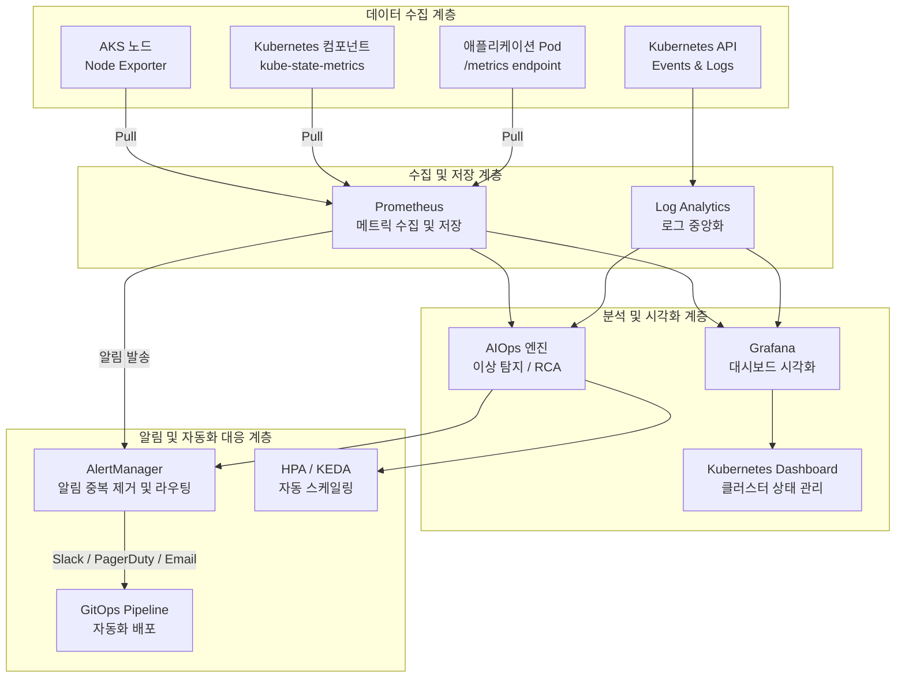

---

## 2. 실습 환경 구성 요약

### 2.1 AKS 클러스터 정보

이번 실습에서 사용한 AKS 클러스터의 주요 구성 정보는 다음과 같다.

| 항목 | 값 |
|------|-----|
| 클러스터명 | user13-aks |
| 리전 | Korea Central |
| Kubernetes 버전 | 1.34.x |
| 네트워크 플러그인 | Azure CNI |
| 인증 방식 | Managed Identity |
| 노드 풀 | aks-nodepool1 |
| Helm 버전 | v4.1 (Go 1.26.1) |

### 2.2 실습 이전 배경 (Lab 1~4 요약)

Lab 10 모니터링 실습에 앞서 완료한 실습 내용은 다음과 같다. (Lab 5~8은 별도 실습 과정으로 진행)

- **Lab 1~2**: 클러스터 프로비저닝, Namespace/Pod/Deployment 기본 운영, Rolling Update, Self-Healing, HPA 기반 오토스케일링
- **Lab 3**: Kubernetes 네트워킹 — ClusterIP, NodePort, LoadBalancer, NGINX Ingress 기반 경로 라우팅, AI 챗봇 Canary 배포
- **Lab 4**: 스토리지 — EmptyDir, HostPath, PVC 동적 프로비저닝, `managed-csi-premium` StorageClass, WaitForFirstConsumer 바인딩 동작

이 과정을 통해 Kubernetes의 핵심 오브젝트들이 어떻게 동작하는지를 실습으로 이해한 상태에서, Lab 10에서는 이 모든 워크로드를 **관측 가능**하게 만드는 모니터링 계층을 구축했다.

### 2.3 Lab 10 구성 전체 흐름

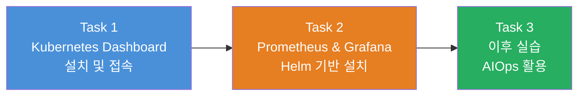

---

## 3. Task 1 — Kubernetes Dashboard

### 3.1 Kubernetes Dashboard란

Kubernetes Dashboard는 Kubernetes 공식 웹 UI 도구로, 클러스터 내의 모든 리소스를 시각적으로 확인하고 기본적인 CRUD 작업을 수행할 수 있다. CLI 도구인 `kubectl`과 달리 브라우저 기반으로 동작하며, 비개발자나 운영팀에게 직관적인 클러스터 현황 파악 수단을 제공한다.

이번 실습에서 설치한 버전은 v2.7.0이다. Dashboard가 설치되면 `kubernetes-dashboard`라는 전용 네임스페이스가 생성되고, 여기에 Dashboard 관련 Pod, Service, Secret, ConfigMap 등의 리소스가 배치된다.

### 3.2 설치 과정 상세 설명

#### 3.2.1 Dashboard 매니페스트 배포

Kubernetes Dashboard 설치는 공식 GitHub에서 제공하는 YAML 매니페스트를 kubectl로 적용하는 방식으로 이루어진다.

```bash
kubectl apply -f https://raw.githubusercontent.com/kubernetes/dashboard/v2.7.0/aio/deploy/recommended.yaml
```

이 명령을 실행하면 다음과 같은 리소스들이 순차적으로 생성된다.

```
namespace/kubernetes-dashboard created
serviceaccount/kubernetes-dashboard created
service/kubernetes-dashboard created
secret/kubernetes-dashboard-certs created
secret/kubernetes-dashboard-csrf created
secret/kubernetes-dashboard-key-holder created
configmap/kubernetes-dashboard-settings created
role.rbac.authorization.k8s.io/kubernetes-dashboard created
clusterrole.rbac.authorization.k8s.io/kubernetes-dashboard created
rolebinding.rbac.authorization.k8s.io/kubernetes-dashboard created
clusterrolebinding.rbac.authorization.k8s.io/kubernetes-dashboard created
deployment.apps/kubernetes-dashboard created
service/dashboard-metrics-scraper created
deployment.apps/dashboard-metrics-scraper created
```

여기서 주목할 점은 `kubernetes-dashboard-certs`, `kubernetes-dashboard-csrf`, `kubernetes-dashboard-key-holder`와 같은 Secret 리소스들이 함께 생성된다는 것이다. Dashboard는 기본적으로 HTTPS로만 동작하며, 이 인증서들이 TLS 통신에 사용된다. 또한 `dashboard-metrics-scraper`라는 별도 Deployment도 생성되는데, 이는 CPU/메모리 사용량 등 기본 메트릭을 수집하여 Dashboard 화면에 표시해 주는 보조 컴포넌트다.

#### 3.2.2 Service 타입을 LoadBalancer로 변경

Dashboard는 기본적으로 `ClusterIP` 타입의 Service로 배포된다. ClusterIP는 클러스터 내부에서만 접근 가능하므로, 외부 브라우저에서 접속하려면 Service 타입을 `LoadBalancer`로 변경해야 한다.

```bash
kubectl -n kubernetes-dashboard edit svc kubernetes-dashboard
```

이 명령을 실행하면 vi 에디터가 열리며, Service 매니페스트의 전체 내용을 확인할 수 있다. 편집기에서 `spec.type` 필드를 `ClusterIP`에서 `LoadBalancer`로 수정하고 저장하면 된다. 실습에서 확인된 Service 명세는 다음과 같다.

```yaml
spec:
  clusterIP: 10.0.120.255
  ports:
  - port: 443
    protocol: TCP
    targetPort: 8443
  selector:
    k8s-app: kubernetes-dashboard
  sessionAffinity: None
  type: LoadBalancer   # ClusterIP → LoadBalancer로 변경
```

대상 포트가 `8443`인 점에 주목해야 한다. Kubernetes Dashboard는 내부적으로 8443 포트에서 HTTPS로 서비스를 제공하며, LoadBalancer의 443 포트로 들어온 트래픽이 이 8443 포트로 포워딩된다. 따라서 외부 접속은 `https://<External-IP>`로 이루어진다.

AKS 환경에서 `LoadBalancer` 타입으로 변경하면 Azure Load Balancer 리소스가 자동으로 프로비저닝되고 Public IP가 할당된다. 이 과정에는 통상 1~2분 정도 소요된다.

#### 3.2.3 ServiceAccount와 ClusterRoleBinding 생성

Dashboard 자체는 설치되었지만, 로그인하여 클러스터 리소스를 조회하려면 적절한 권한을 가진 계정이 필요하다. Kubernetes에서는 이를 RBAC(Role-Based Access Control)로 관리한다.

이번 실습에서는 `admin-user`라는 ServiceAccount를 생성하고, 이 계정에 클러스터 전체 관리자 권한(`cluster-admin` ClusterRole)을 부여하는 `admin-user-binding` ClusterRoleBinding을 연결했다.

```yaml
apiVersion: v1
kind: ServiceAccount
metadata:
  name: admin-user
  namespace: kubernetes-dashboard
---
apiVersion: rbac.authorization.k8s.io/v1
kind: ClusterRoleBinding
metadata:
  name: admin-user-binding
roleRef:
  apiGroup: rbac.authorization.k8s.io
  kind: ClusterRole
  name: cluster-admin      # 클러스터 전체 관리자 권한
subjects:
- kind: ServiceAccount
  name: admin-user
  namespace: kubernetes-dashboard
```

실습에서는 이 내용을 `kubernetes-dashboard-service-account.yaml` 파일로 저장한 뒤 `kubectl apply -f`로 적용했다.

### 3.3 Kubernetes RBAC 권한 체계 이해

RBAC는 Kubernetes 보안의 핵심 메커니즘이다. Dashboard 접속 권한 설정을 통해 RBAC 구조를 이해할 수 있다.

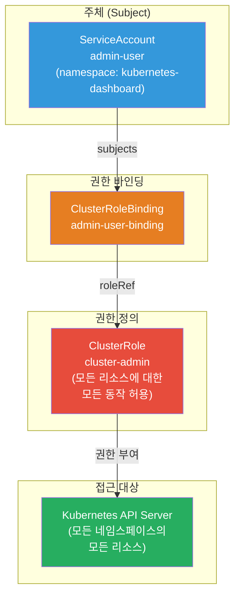

RBAC의 주요 구성요소는 다음과 같이 구분된다.

**Role vs ClusterRole**: `Role`은 특정 네임스페이스 내의 리소스에만 권한을 부여한다. `ClusterRole`은 네임스페이스에 관계없이 클러스터 전체 리소스에 적용된다. `cluster-admin`은 Kubernetes가 기본으로 제공하는 ClusterRole로, 모든 API 그룹, 모든 리소스, 모든 동작(get, list, watch, create, update, delete)을 허용한다.

**RoleBinding vs ClusterRoleBinding**: `RoleBinding`은 특정 네임스페이스 내에서 Role 또는 ClusterRole을 주체(Subject)에 바인딩한다. `ClusterRoleBinding`은 클러스터 전체 범위에서 ClusterRole을 주체에 바인딩한다. 이번 실습에서는 `admin-user` ServiceAccount가 클러스터 전체 리소스에 접근해야 하므로 ClusterRoleBinding을 사용했다.

> **보안 주의사항**: 실습 환경에서는 편의를 위해 `cluster-admin` 권한을 부여했지만, 실제 운영 환경에서는 최소 권한 원칙(Principle of Least Privilege)에 따라 필요한 리소스에만 읽기 권한을 부여하는 Custom ClusterRole을 사용해야 한다.

### 3.4 로그인 토큰 발급

Kubernetes Dashboard는 Bearer 토큰 방식으로 인증한다. `kubectl create token` 명령으로 ServiceAccount의 JWT 토큰을 발급받는다.

```bash
kubectl -n kubernetes-dashboard create token admin-user
```

이 명령은 `admin-user` ServiceAccount에 대한 JWT(JSON Web Token) 형태의 토큰을 출력한다. 발급된 토큰은 기본적으로 **1시간** 동안 유효하며, 그 이후에는 재발급이 필요하다.

JWT 토큰의 구조는 Header.Payload.Signature의 세 부분으로 이루어진다. Payload 부분에는 대상 클러스터 API 엔드포인트, 발급 시각(`iat`), 만료 시각(`exp`), ServiceAccount 정보 등이 포함되어 있다.

### 3.5 External IP 확인 및 웹 접속

External IP는 다음 명령으로 확인한다.

```bash
kubectl -n kubernetes-dashboard get svc kubernetes-dashboard
```

실습 환경에서 확인된 결과는 다음과 같다.

```
NAME                   TYPE           CLUSTER-IP     EXTERNAL-IP      PORT(S)         AGE
kubernetes-dashboard   LoadBalancer   10.0.120.255   20.214.216.161   443:30575/TCP   6m39s
```

출력에서 `443:30575/TCP`는 External IP의 443 포트가 클러스터 내부 NodePort 30575를 통해 Pod에 연결됨을 의미한다. 브라우저에서 `https://20.214.216.161`로 접속하면 Kubernetes Dashboard 로그인 화면이 표시된다.

Dashboard는 자체 서명 인증서(Self-Signed Certificate)를 사용하므로 브라우저에서 보안 경고가 표시된다. 이는 정상적인 동작이며, "고급" → "안전하지 않음으로 계속 진행"을 선택하여 접속할 수 있다.

### 3.6 Dashboard에서 확인 가능한 정보

로그인 후 Dashboard에서는 다음과 같은 정보를 확인할 수 있다.

- **워크로드**: Deployment, ReplicaSet, DaemonSet, StatefulSet, Job, CronJob의 현황과 각 Pod 상태
- **서비스 및 Ingress**: Service 목록, Ingress 규칙, Endpoint 정보
- **컨피그 및 스토리지**: ConfigMap, Secret, PersistentVolumeClaim, StorageClass
- **클러스터**: Node 상태, Namespace 목록, ClusterRole, ClusterRoleBinding
- **실시간 로그**: Pod 컨테이너의 로그를 브라우저에서 직접 확인

실습 중 Dashboard의 default 네임스페이스에서 `ca-dp` Deployment(이전 실습에서 생성한 Canary 배포 리소스)가 0/0 상태로 표시된 것을 확인했다. 이는 해당 Deployment의 replica 수가 0으로 설정되어 있음을 의미한다. 또한 `load-generator` Pod가 Error 상태였는데, 이는 컨테이너가 시작은 됐으나 프로세스가 비정상 종료(Exit Code ≠ 0)한 것으로, 컨테이너 로그나 `describe` 명령으로 원인을 파악할 수 있다.

---

## 4. Task 2 — Prometheus & Grafana

### 4.1 Prometheus란

Prometheus는 SoundCloud에서 개발하고 현재 CNCF(Cloud Native Computing Foundation)가 관리하는 오픈소스 모니터링 시스템 및 시계열 데이터베이스다. Kubernetes 생태계에서 사실상의 표준(De facto standard) 메트릭 수집 도구로 자리잡고 있다.

Prometheus의 핵심 동작 방식은 **Pull 방식**이다. 모니터링 대상(Target)이 데이터를 Prometheus로 보내는 것이 아니라, Prometheus가 주기적으로 각 Target의 `/metrics` HTTP 엔드포인트에 접속하여 데이터를 가져온다. 이 방식은 모니터링 대상의 가용성을 쉽게 파악할 수 있고, 중앙 집중식 설정 관리가 용이하다는 장점이 있다.

Prometheus가 수집하는 데이터는 **시계열 데이터(Time Series Data)** 형태다. 각 데이터 포인트는 메트릭 이름, 타임스탬프, 값으로 구성되며, 레이블(Label)이라는 키-값 쌍을 통해 고차원 데이터를 표현한다. 예를 들어 `container_cpu_usage_seconds_total{namespace="default", pod="nginx-xxx", container="nginx"}`와 같이 특정 컨테이너의 CPU 사용량을 네임스페이스, Pod명, 컨테이너명과 함께 기록한다.

Prometheus는 수집한 데이터를 쿼리하기 위한 **PromQL(Prometheus Query Language)** 이라는 전용 쿼리 언어를 제공한다. PromQL로 복잡한 집계, 비율 계산, 예측 등을 수행할 수 있다.

### 4.2 Grafana란

Grafana는 다양한 데이터 소스로부터 메트릭을 가져와 시각적인 대시보드로 표현하는 오픈소스 플랫폼이다. Prometheus를 비롯해 InfluxDB, Elasticsearch, Azure Monitor, CloudWatch 등 50개 이상의 데이터 소스를 지원한다.

Grafana의 핵심 가치는 유연한 대시보드 구성 능력이다. 시계열 그래프, 게이지, 히트맵, 바 차트, 알림 패널 등 다양한 시각화 유형을 제공하며, 커뮤니티에서 제공하는 수천 개의 사전 구성 대시보드를 Grafana.com에서 바로 import해 사용할 수 있다.

이번 실습에서 설치된 버전은 **Grafana v13.0.1+security-01**이다. 이 버전에는 **Grafana Assistant**라는 AI 기반 기능이 OSS 사용자에게도 제공되기 시작했는데, 이는 자연어로 데이터 소스를 쿼리하고 대시보드를 자동 생성할 수 있는 AIOps 기능의 일환이다.

### 4.3 kube-prometheus-stack의 구성 요소

이번 실습에서는 `prometheus-community/kube-prometheus-stack`이라는 Helm 차트를 사용하여 Prometheus와 Grafana를 포함한 전체 모니터링 스택을 한 번에 설치했다. 이 차트는 Kubernetes 클러스터 모니터링에 필요한 모든 컴포넌트를 통합적으로 제공한다.

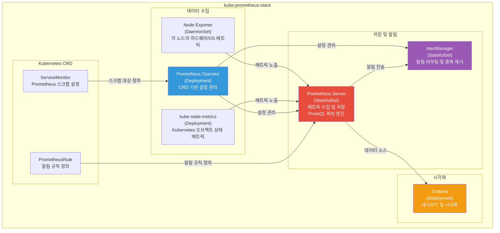

각 구성요소의 역할을 상세히 설명하면 다음과 같다.

**Prometheus Operator**는 kube-prometheus-stack의 핵심으로, ServiceMonitor, PrometheusRule 등의 Custom Resource를 통해 Prometheus 설정을 선언적으로 관리한다. 기존에는 Prometheus의 설정 파일을 직접 수정해야 했지만, Operator 패턴을 사용하면 Kubernetes 방식으로 YAML로 설정을 관리할 수 있다. 새로운 애플리케이션을 배포할 때 해당 앱의 ServiceMonitor만 작성하면 Operator가 자동으로 Prometheus 설정에 반영한다.

**Prometheus Server**는 실제 메트릭을 수집하고 저장하는 핵심 컴포넌트다. StatefulSet으로 배포되어 영속성 있는 저장소를 사용하며, 기본적으로 15일간의 데이터를 보관한다. 수집한 데이터는 자체 TSDB(Time Series Database) 형식으로 로컬 디스크에 저장된다.

**Node Exporter**는 DaemonSet으로 배포되어 클러스터의 모든 노드에 하나씩 실행된다. 각 노드의 CPU, 메모리, 디스크, 네트워크 등 하드웨어 및 운영체제 수준의 메트릭을 수집하여 Prometheus가 스크랩할 수 있도록 `/metrics` 엔드포인트를 통해 노출한다.

**kube-state-metrics**는 Kubernetes API Server를 통해 클러스터의 오브젝트 상태를 모니터링한다. Pod의 현재 상태(Running/Pending/Failed), Deployment의 원하는 복제본 수와 실제 복제본 수, PVC의 바인딩 상태 등 Kubernetes 오브젝트 자체에 관한 메트릭을 제공한다.

**AlertManager**는 Prometheus에서 발생한 알림을 받아 중복 제거, 그룹핑, 라우팅을 수행한다. 설정에 따라 이메일, Slack, PagerDuty, OpsGenie 등 다양한 채널로 알림을 전달할 수 있다.

### 4.4 Helm을 이용한 설치 과정

#### 4.4.1 Helm이란

Helm은 Kubernetes의 패키지 관리자다. `apt`나 `yum`이 Linux 패키지를 관리하듯이, Helm은 Kubernetes 애플리케이션(패키지를 "차트(Chart)"라고 부름)의 설치, 업그레이드, 삭제를 관리한다. 복잡한 마이크로서비스 스택도 단일 `helm install` 명령으로 배포할 수 있으며, `values.yaml`을 통한 설정 커스터마이징이 가능하다.

이번 실습에서 확인된 Helm 버전은 v4.1이다.

```
version.BuildInfo{
  Version:"v4.1",
  GitCommit:"c94d381b03be117e7e57908edbf642104e00eb8f",
  GoVersion:"go1.26.1",
  KubeClientVersion:"v1.35"
}
```

#### 4.4.2 모니터링 네임스페이스 생성

Prometheus와 Grafana 관련 리소스를 격리하기 위해 전용 네임스페이스를 생성한다.

```bash
kubectl create namespace monitoring
```

네임스페이스를 분리하는 것은 운영 모범 사례다. 모니터링 스택이 애플리케이션 워크로드와 같은 네임스페이스에 있으면 리소스 관리와 RBAC 설정이 복잡해진다.

#### 4.4.3 Helm Repository 등록

Prometheus 관련 Helm 차트는 `prometheus-community` 리포지토리에서 제공된다.

```bash
helm repo add prometheus-community https://prometheus-community.github.io/helm-charts
helm repo update
```

`helm repo update`는 등록된 모든 리포지토리의 차트 목록을 최신 상태로 갱신한다. 리포지토리 정보는 로컬 캐시에 저장된다.

#### 4.4.4 kube-prometheus-stack 설치

```bash
helm install prometheus prometheus-community/kube-prometheus-stack \
  --namespace monitoring
```

이 명령에서 첫 번째 `prometheus`는 Helm 릴리즈명이고, `prometheus-community/kube-prometheus-stack`은 차트 이름이다. 릴리즈명은 설치된 리소스의 이름에 접두사로 사용된다. 예를 들어 Grafana Service는 `prometheus-grafana`가 된다.

실습 중 차트명 오타(`kube-promethus-stack` ← u/o 위치가 바뀜)로 인해 설치가 한 번 실패했으나, 즉시 수정하여 재시도해 성공했다. 이처럼 차트명은 정확하게 입력해야 하며, `helm search repo prometheus-community`로 사전에 차트 목록을 확인하는 것이 좋다.

설치 완료 메시지 예시:

```
NAME: prometheus
LAST DEPLOYED: Wed Jun 10 06:00:00 2026
NAMESPACE: monitoring
STATUS: deployed
REVISION: 1
DESCRIPTION: Install complete
```

설치 후 생성된 Pod 목록:

```bash
kubectl get pods -n monitoring
```

kube-prometheus-stack은 다음과 같은 Pod들을 생성한다.

| Pod 명칭 (예시) | 종류 | 역할 |
|-----------------|------|------|
| prometheus-kube-prometheus-operator-xxx | Deployment Pod | Prometheus Operator |
| prometheus-prometheus-kube-prometheus-prometheus-0 | StatefulSet Pod | Prometheus Server |
| alertmanager-prometheus-kube-prometheus-alertmanager-0 | StatefulSet Pod | AlertManager |
| prometheus-grafana-xxx | Deployment Pod | Grafana |
| prometheus-prometheus-node-exporter-xxx | DaemonSet Pod | Node Exporter |
| prometheus-kube-state-metrics-xxx | Deployment Pod | kube-state-metrics |

#### 4.4.5 Grafana Service를 LoadBalancer로 변경

설치 직후 Grafana Service는 ClusterIP 타입이므로 외부 접근이 불가능하다. Task 1과 마찬가지로 LoadBalancer 타입으로 변경해야 한다.

```bash
kubectl edit svc prometheus-grafana -n monitoring
```

vi 에디터에서 확인된 Grafana Service 설정의 주요 내용은 다음과 같다.

```yaml
metadata:
  labels:
    app.kubernetes.io/name: grafana
    app.kubernetes.io/version: 13.0.1-security-01
    helm.sh/chart: grafana-12.4.4
  name: prometheus-grafana
  namespace: monitoring
spec:
  clusterIP: 10.0.224.6
  ports:
  - name: http-web
    port: 80
    protocol: TCP
    targetPort: grafana
  type: LoadBalancer   # 변경 완료
```

Grafana는 HTTP 80 포트로 서비스를 제공한다는 점이 Dashboard의 HTTPS 443과의 차이점이다.

#### 4.4.6 External IP 확인 및 접속

```bash
kubectl get svc prometheus-grafana -n monitoring
```

실습 환경에서 확인된 결과:

```
NAME                 TYPE           CLUSTER-IP   EXTERNAL-IP    PORT(S)        AGE
prometheus-grafana   LoadBalancer   10.0.224.6   4.230.65.120   80:32054/TCP   2m6s
```

브라우저에서 `http://4.230.65.120`으로 접속하면 Grafana 로그인 화면이 표시된다.

### 4.5 Grafana 로그인 및 초기 화면

Grafana의 기본 로그인 계정은 `admin`이며, 패스워드는 Helm 설치 시 자동 생성된 랜덤 값이 Secret에 저장된다. 다음 명령으로 패스워드를 확인한다.

```bash
kubectl get secret --namespace monitoring prometheus-grafana \
  -o jsonpath="{.data.admin-password}" | base64 --decode ; echo
```

실습 환경에서 추출된 패스워드는 다음과 같이 자동 생성된 랜덤 문자열이다.

```
BXKT4UMJu1wRuRYCiroMUcq7cuefgKWQ9RdQw5RJ
```

가이드에 기재된 기본 패스워드 `prom-operator`는 일부 구버전 차트에서 사용된 값이며, 현재 버전(grafana-12.4.4)에서는 항상 랜덤 패스워드가 생성된다.

로그인 후 표시되는 Grafana v13.0.1 Home 화면에서는 **Grafana Assistant**에 관한 팝업이 표시된다. 이는 v13부터 OSS 버전에도 제공되기 시작한 AI 기능으로, 자연어로 데이터 소스를 쿼리하거나 대시보드를 자동으로 생성하는 기능을 제공한다. 이는 AIOps의 핵심 개념인 "자연어 기반 운영 인터페이스"의 실제 구현 사례다.

### 4.6 Prometheus 데이터 수집 흐름

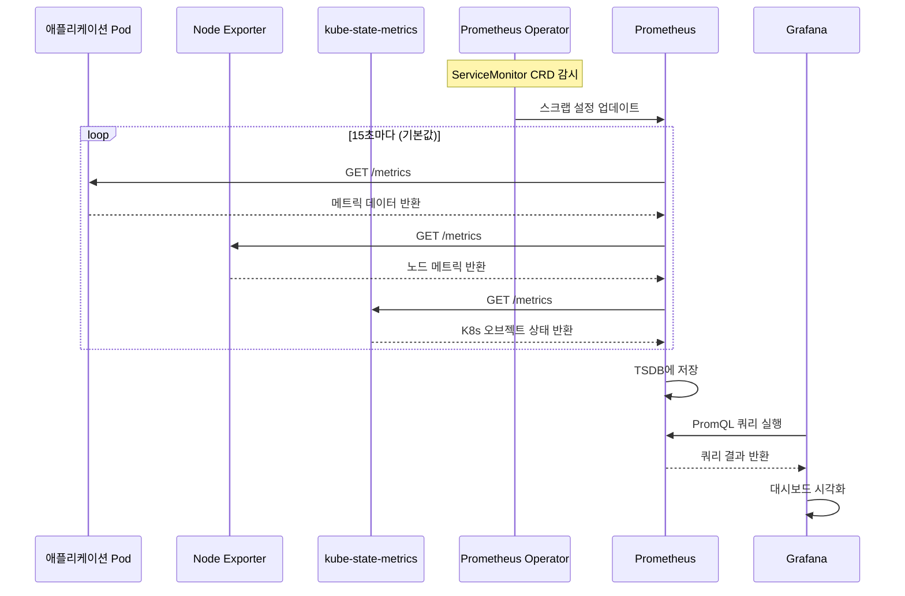

---

## 5. 모니터링 도구 비교표

### 5.1 Kubernetes Dashboard vs Grafana

| 비교 항목 | Kubernetes Dashboard | Grafana |
|-----------|---------------------|---------|
| **주요 목적** | 클러스터 리소스 관리 및 현황 파악 | 메트릭 시각화 및 대시보드 |
| **데이터 소스** | Kubernetes API Server | Prometheus, 기타 다양한 소스 |
| **주요 사용자** | 클러스터 운영자, DevOps | 개발자, SRE, 비즈니스 팀 |
| **접속 프로토콜** | HTTPS (TLS) | HTTP (기본) |
| **인증 방식** | Bearer 토큰, kubeconfig | ID/PW, OAuth, LDAP 등 |
| **설치 방법** | kubectl apply (YAML) | Helm 차트 |
| **리소스 조작** | 가능 (생성/수정/삭제) | 불가 (읽기 전용) |
| **실시간 메트릭** | 기본 CPU/메모리 (제한적) | 완전한 PromQL 기반 쿼리 |
| **알림(Alert)** | 미지원 | AlertManager 연동 지원 |
| **대시보드 커스터마이징** | 불가 | 완전 커스텀 가능 |
| **이번 실습 External IP** | 20.214.216.161:443 | 4.230.65.120:80 |
| **버전** | v2.7.0 | v13.0.1+security-01 |
| **AI 기능** | 없음 | Grafana Assistant (v13+) |

### 5.2 AKS 모니터링 옵션 비교

| 항목 | Self-Hosted (이번 실습 방식) | Azure Managed Prometheus + Managed Grafana | Container Insights (Azure Monitor) |
|------|------|------|------|
| **관리 주체** | 사용자 직접 운영 | Azure 완전 관리 | Azure 완전 관리 |
| **설치 복잡도** | 높음 (Helm 설치 필요) | 낮음 (클릭 또는 CLI) | 매우 낮음 (AKS 애드온) |
| **비용** | 컴퓨팅 비용만 | 메트릭 수집량 기반 과금 | Log Analytics 워크스페이스 비용 |
| **데이터 보존** | 자체 설정 (기본 15일) | 18개월 (기본) | 31~90일 (설정 가능) |
| **스케일링** | 수동 | 자동 | 자동 |
| **HA 구성** | 직접 설정 | 기본 제공 | 기본 제공 |
| **커스텀 메트릭** | ServiceMonitor로 자유롭게 | 가능 | 제한적 |
| **AIOps 통합** | 직접 구성 필요 | Azure AI 서비스 연동 용이 | Azure Copilot 연동 |
| **학습 가치** | 높음 (Prometheus/Grafana 이해) | 중간 | 낮음 (블랙박스) |

### 5.3 kube-prometheus-stack 주요 컴포넌트 버전 (실습 환경 기준)

| 컴포넌트 | 버전 |
|----------|------|
| Helm Chart (kube-prometheus-stack) | 설치 당시 최신 버전 |
| Grafana | 13.0.1+security-01 |
| Grafana Helm Chart | grafana-12.4.4 |
| Prometheus Operator | kube-prometheus-stack에 포함 |
| Helm | v4.1 |

---

## 6. AIOps 관점에서의 모니터링 아키텍처

### 6.1 관측 가능성의 세 기둥

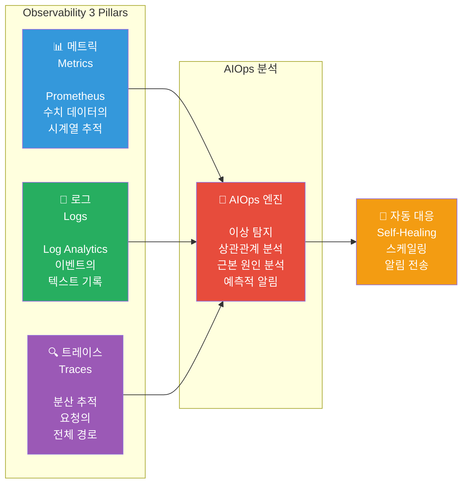

이번 실습에서는 **메트릭** 수집에 집중했다. Prometheus가 클러스터의 모든 노드와 Pod에서 수치 데이터를 수집하고, Grafana가 이를 시각화하는 구조다.

### 6.2 AIOps 성숙도 모델

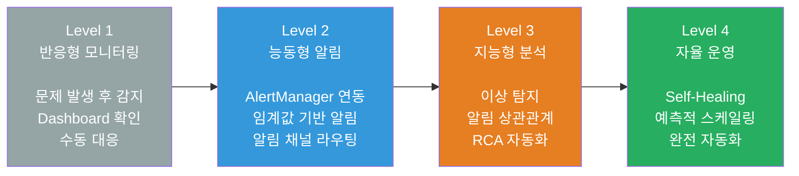

이번 실습은 Level 1(대시보드)과 Level 2(알림) 인프라를 구축한 단계다. kube-prometheus-stack의 PrometheusRule을 활용하면 Level 2의 알림 체계를, 추가적인 ML 도구와의 연동을 통해 Level 3, 4로 발전시킬 수 있다.

---

## 7. Claude Code 프롬프트 — 구축 및 운영

이 섹션에서는 AKS 기반 Kubernetes AIOps 환경을 구축하고 운영하기 위한 Claude Code 프롬프트를 제공한다. 각 프롬프트는 특정 목적에 맞게 작성되었으며, Claude Code CLI에 직접 입력하여 사용할 수 있다.

---

### 7.1 환경 검증 및 사전 점검 프롬프트

#### [구축-01] 모니터링 스택 사전 환경 점검

```
현재 AKS 클러스터의 모니터링 스택 설치 전 환경을 사전 점검해줘.

아래 항목을 순서대로 확인하고 결과를 표로 출력해줘:

1. kubectl 연결 상태 확인:
   kubectl cluster-info

2. Helm 버전 확인 (v3 이상 필요):
   helm version

3. monitoring 네임스페이스 존재 여부:
   kubectl get namespace monitoring

4. 클러스터 노드 상태:
   kubectl get nodes

5. 기존 모니터링 리소스 존재 여부:
   helm list -n monitoring
   kubectl get all -n monitoring

6. 사용 가능한 StorageClass 목록:
   kubectl get storageclass

최종 결과를 아래 형식으로 출력해줘:

=== 모니터링 스택 설치 전 환경 점검 결과 ===
항목                    | 상태   | 비고
------------------------|--------|-----
kubectl 연결            | ✅/❌  | ...
Helm 버전               | ✅/❌  | ...
monitoring namespace    | ✅/❌  | ...
노드 상태               | ✅/❌  | ...
기존 모니터링 리소스    | ✅/❌  | ...
StorageClass            | ✅/❌  | ...
==============================================
설치 진행 가능 여부: [예/아니오]
설치 불가 시 이유: [...]
```

---

#### [구축-02] Kubernetes Dashboard 전체 설치 자동화

```
AKS 클러스터에 Kubernetes Dashboard v2.7.0을 설치하고
외부 접속 가능한 상태까지 완전히 구성해줘.

실행 순서:
1. Dashboard 설치:
   kubectl apply -f https://raw.githubusercontent.com/kubernetes/dashboard/v2.7.0/aio/deploy/recommended.yaml

2. Pod Running 대기 (최대 3분):
   kubectl get pods -n kubernetes-dashboard

3. Service를 LoadBalancer로 변경 (patch 사용):
   kubectl -n kubernetes-dashboard patch svc kubernetes-dashboard \
     -p '{"spec": {"type": "LoadBalancer"}}'

4. admin-user ServiceAccount 및 ClusterRoleBinding 생성:
cat <<EOF | kubectl apply -f -
apiVersion: v1
kind: ServiceAccount
metadata:
  name: admin-user
  namespace: kubernetes-dashboard
---
apiVersion: rbac.authorization.k8s.io/v1
kind: ClusterRoleBinding
metadata:
  name: admin-user-binding
roleRef:
  apiGroup: rbac.authorization.k8s.io
  kind: ClusterRole
  name: cluster-admin
subjects:
- kind: ServiceAccount
  name: admin-user
  namespace: kubernetes-dashboard
EOF

5. External IP 할당 대기 (최대 2분, 30초 간격):
   kubectl -n kubernetes-dashboard get svc kubernetes-dashboard

6. 로그인 토큰 발급:
   kubectl -n kubernetes-dashboard create token admin-user

7. 최종 접속 정보 출력

각 단계 완료 시 [단계 N 완료] 메시지를 출력하고,
실패 시 원인을 분석한 후 계속 진행해줘.

최종 출력 형식:
=========================================
✅ Kubernetes Dashboard 설치 완료
접속 URL  : https://<External-IP>
주의사항  : HTTPS 자체서명 인증서 경고 무시 필요
인증 방식 : Bearer Token
토큰 값   : <발급된 토큰>
토큰 유효: 1시간 (재발급: kubectl -n kubernetes-dashboard create token admin-user)
=========================================
```

---

#### [구축-03] kube-prometheus-stack 전체 설치 자동화

```
AKS 클러스터에 kube-prometheus-stack을 Helm으로 설치하고
Grafana 외부 접속까지 완전히 구성해줘.

실행 순서:
1. monitoring 네임스페이스 생성:
   kubectl create namespace monitoring 2>/dev/null || echo "이미 존재"

2. prometheus-community Helm repo 추가 및 업데이트:
   helm repo add prometheus-community https://prometheus-community.github.io/helm-charts
   helm repo update

3. 설치할 차트 버전 확인:
   helm search repo prometheus-community/kube-prometheus-stack

4. kube-prometheus-stack 설치:
   helm install prometheus prometheus-community/kube-prometheus-stack \
     --namespace monitoring

5. 모든 Pod Running 대기 (최대 5분, 30초 간격):
   kubectl get pods -n monitoring

6. Grafana Service를 LoadBalancer로 변경:
   kubectl patch svc prometheus-grafana -n monitoring \
     -p '{"spec": {"type": "LoadBalancer"}}'

7. External IP 할당 대기 (최대 2분):
   kubectl get svc prometheus-grafana -n monitoring

8. Grafana admin 패스워드 추출:
   kubectl get secret --namespace monitoring prometheus-grafana \
     -o jsonpath="{.data.admin-password}" | base64 --decode ; echo

각 단계마다 성공/실패를 표시하고 최종 결과를 출력해줘.

최종 출력 형식:
=========================================
✅ Prometheus & Grafana 설치 완료
Grafana URL    : http://<External-IP>
Grafana 아이디 : admin
Grafana 패스워드: <Secret에서 추출한 값>
Grafana 버전   : (kubectl get pods -n monitoring -l app.kubernetes.io/name=grafana로 확인)
=========================================
```

---

### 7.2 운영 모니터링 프롬프트

#### [운영-01] 클러스터 전체 상태 점검 리포트

```
현재 AKS 클러스터의 전체 운영 상태를 점검하고 리포트를 작성해줘.

아래 항목을 순서대로 확인해줘:

1. 노드 상태 및 리소스 사용률:
   kubectl get nodes -o wide
   kubectl top nodes

2. 전체 Pod 상태 요약 (네임스페이스별):
   kubectl get pods -A --field-selector=status.phase!=Running

3. 비정상 Pod 목록 (Running이 아닌 것):
   kubectl get pods -A | grep -v Running | grep -v Completed

4. Pending 상태 PVC 확인:
   kubectl get pvc -A | grep Pending

5. 모니터링 스택 상태 확인:
   kubectl get pods -n monitoring
   kubectl get pods -n kubernetes-dashboard

6. 최근 클러스터 이벤트 (Warning 필터):
   kubectl get events -A --field-selector=type=Warning \
     --sort-by='.lastTimestamp' | tail -20

7. 각 네임스페이스별 리소스 사용 현황:
   kubectl top pods -A --sort-by=memory | head -20

위 결과를 바탕으로 다음 형식의 리포트를 작성해줘:

=== 클러스터 상태 점검 리포트 ===
점검 시각: [현재시각]

[노드 상태] 
정상: N개 / 전체: N개

[Pod 상태]
정상 실행 중: N개
비정상 (오류/재시작): N개
주요 이슈: [내용]

[스토리지]
Pending PVC: N개

[모니터링 스택]
Prometheus: 정상/이상
Grafana: 정상/이상
Dashboard: 정상/이상

[주요 경고 이벤트]
[최근 Warning 이벤트 요약]

[권장 조치사항]
[발견된 이슈에 대한 조치 방법]
================================
```

---

#### [운영-02] Grafana 대시보드 운영 상태 확인

```
Grafana와 Prometheus가 정상 운영 중인지 확인하고
주요 메트릭 접근 방법을 안내해줘.

1. Grafana Pod 상태 및 로그 확인:
   kubectl get pods -n monitoring -l app.kubernetes.io/name=grafana
   kubectl logs -n monitoring -l app.kubernetes.io/name=grafana --tail=50

2. Prometheus Pod 상태 확인:
   kubectl get pods -n monitoring -l app.kubernetes.io/name=prometheus

3. Prometheus 스크랩 대상 확인 (ServiceMonitor 목록):
   kubectl get servicemonitor -n monitoring

4. AlertManager 상태 확인:
   kubectl get pods -n monitoring -l app.kubernetes.io/name=alertmanager

5. 현재 활성화된 알림 규칙 확인:
   kubectl get prometheusrule -n monitoring

6. Grafana 접속 정보 재확인:
   kubectl get svc -n monitoring prometheus-grafana
   kubectl get secret --namespace monitoring prometheus-grafana \
     -o jsonpath="{.data.admin-password}" | base64 --decode ; echo

결과를 아래 형식으로 정리해줘:

=== Grafana & Prometheus 운영 상태 ===
Grafana 접속 URL : http://<IP>
Grafana 상태     : 정상/이상
Prometheus 상태  : 정상/이상
AlertManager 상태: 정상/이상
활성 알림 규칙   : N개
스크랩 대상      : N개
패스워드         : <추출 값>
=====================================
```

---

#### [운영-03] 모니터링 스택 업그레이드

```
monitoring 네임스페이스에 설치된 kube-prometheus-stack을
최신 버전으로 업그레이드해줘.

1. 현재 설치된 버전 확인:
   helm list -n monitoring

2. 사용 가능한 최신 버전 확인:
   helm search repo prometheus-community/kube-prometheus-stack --versions | head -5

3. 업그레이드 전 현재 values 백업:
   helm get values prometheus -n monitoring > prometheus-values-backup.yaml

4. Helm 업그레이드 실행:
   helm upgrade prometheus prometheus-community/kube-prometheus-stack \
     --namespace monitoring \
     --reuse-values

5. 업그레이드 후 Pod 상태 확인 (최대 3분 대기):
   kubectl get pods -n monitoring -w

6. Grafana 버전 확인:
   kubectl get pods -n monitoring -l app.kubernetes.io/name=grafana \
     -o jsonpath='{.items[0].spec.containers[0].image}'

업그레이드 전/후 버전을 비교하여 출력해줘.
롤백이 필요한 경우: helm rollback prometheus -n monitoring
```

---

### 7.3 트러블슈팅 프롬프트

#### [트러블-01] Pod 오류 자동 진단

```
다음 Pod가 Error 또는 CrashLoopBackOff 상태에 있어.
자동으로 원인을 진단하고 해결 방법을 제시해줘.

진단 대상: [네임스페이스]/[Pod명]
(예: default/load-generator)

아래 단계로 진단해줘:

1. Pod 기본 상태 확인:
   kubectl get pod <Pod명> -n <네임스페이스> -o wide

2. Pod 상세 정보 및 이벤트 확인:
   kubectl describe pod <Pod명> -n <네임스페이스>

3. 컨테이너 로그 확인:
   kubectl logs <Pod명> -n <네임스페이스> --previous 2>/dev/null || \
   kubectl logs <Pod명> -n <네임스페이스>

4. Pod가 배치된 노드 상태 확인:
   kubectl describe node <노드명>

5. 연관된 ConfigMap/Secret 존재 여부 확인:
   kubectl get configmap -n <네임스페이스>
   kubectl get secret -n <네임스페이스>

진단 결과를 아래 형식으로 출력해줘:

=== Pod 오류 진단 결과 ===
Pod명     : [Pod명]
네임스페이스: [네임스페이스]
현재 상태 : Error/CrashLoopBackOff/Pending
재시작 횟수: N회

[오류 원인]
원인 분류: [OOM/이미지 오류/설정 오류/리소스 부족/기타]
원인 상세: [구체적인 오류 내용]

[해결 방법]
1단계: [즉시 조치]
2단계: [근본 해결]
3단계: [예방 조치]
==========================
```

---

#### [트러블-02] Dashboard External IP pending 해결

```
Kubernetes Dashboard 또는 Grafana의 Service External IP가
<pending> 상태에서 변경되지 않아.
원인을 진단하고 해결해줘.

진단 대상 서비스: kubernetes-dashboard (또는 prometheus-grafana)
네임스페이스: kubernetes-dashboard (또는 monitoring)

1. 서비스 현재 상태 확인:
   kubectl get svc -n <네임스페이스> <서비스명> -o yaml

2. 서비스 이벤트 확인:
   kubectl describe svc -n <네임스페이스> <서비스명>

3. Azure Load Balancer 관련 이벤트 확인:
   kubectl get events -n <네임스페이스> --sort-by='.lastTimestamp'

4. cloud-controller-manager 로그 확인:
   kubectl logs -n kube-system -l component=cloud-controller-manager --tail=50

5. 노드의 Azure 관련 레이블 확인:
   kubectl get nodes --show-labels | grep azure

주요 확인 포인트:
- Azure 구독의 Public IP 할당 한도 초과 여부
- AKS 클러스터 Managed Identity 권한 문제
- 서브넷 내 IP 부족 여부

결과를 분석하고 해결 방법을 단계별로 안내해줘.
```

---

#### [트러블-03] Prometheus 스크랩 오류 진단

```
Prometheus가 특정 Target의 메트릭을 스크랩하지 못하고 있어.
원인을 찾아줘.

1. Prometheus Pod 로그 확인:
   kubectl logs -n monitoring -l app.kubernetes.io/name=prometheus \
     --tail=100 | grep -i error

2. ServiceMonitor 목록 및 설정 확인:
   kubectl get servicemonitor -n monitoring
   kubectl describe servicemonitor -n monitoring <이름>

3. 스크랩 대상 Service 존재 여부 확인:
   kubectl get svc -n <타겟 네임스페이스>

4. 네임스페이스 레이블 확인 (ServiceMonitor의 namespaceSelector):
   kubectl get namespace --show-labels

5. 타겟 Pod의 /metrics 엔드포인트 접근 테스트:
   kubectl run test-curl --image=curlimages/curl --rm -it --restart=Never \
     -- curl http://<서비스명>.<네임스페이스>.svc.cluster.local:<포트>/metrics

문제를 진단하고 ServiceMonitor 수정 방법을 YAML과 함께 제시해줘.
```

---

### 7.4 AIOps 고도화 프롬프트

#### [AIOps-01] 클러스터 이상 패턴 탐지 스크립트 생성

```
AKS 클러스터의 이상 패턴을 탐지하는 셸 스크립트를 작성해줘.
스크립트명: aiops-anomaly-check.sh

감지해야 할 이상 패턴:
1. Pod 재시작 횟수가 5회 이상인 Pod 목록
2. CPU 사용률이 80% 이상인 노드
3. 메모리 사용률이 85% 이상인 노드
4. Running이 아닌 Pod (Pending, Error, CrashLoopBackOff)
5. PVC가 Bound되지 않은 경우
6. 최근 10분 내 Warning 이벤트

각 이상 항목에 대해:
- 심각도 분류 (CRITICAL/WARNING/INFO)
- 감지 시각
- 권장 조치 명령어를 함께 출력

스크립트는 다음 형식으로 출력해줘:
[심각도] [시각] [설명]
  → 권장 조치: [명령어]

스크립트 작성 후 사용법도 안내해줘:
chmod +x aiops-anomaly-check.sh
./aiops-anomaly-check.sh
또는 CronJob으로 5분마다 실행하는 방법
```

---

#### [AIOps-02] PrometheusRule 알림 규칙 생성

```
AIOps 운영에 필요한 핵심 PrometheusRule을 작성해줘.
아래 조건에 맞는 알림 규칙을 YAML로 작성하고 적용해줘.

알림 규칙 목록:

1. Pod 재시작 알림
   - 조건: 5분 내 재시작 횟수 > 3
   - 심각도: warning

2. 노드 메모리 부족 알림
   - 조건: 사용 가능한 메모리 < 10%
   - 심각도: critical

3. 노드 CPU 고부하 알림
   - 조건: 5분 평균 CPU 사용률 > 85%
   - 심각도: warning

4. Pod 미실행 알림
   - 조건: Deployment의 available replicas < desired replicas
   - 심각도: critical

5. PVC 용량 부족 알림
   - 조건: PVC 사용률 > 80%
   - 심각도: warning

각 규칙에 적절한 PromQL 쿼리를 작성하고
완성된 PrometheusRule YAML을 출력한 뒤:
kubectl apply -f prometheus-aiops-rules.yaml -n monitoring
으로 적용해줘.

적용 후 규칙이 정상 등록되었는지 확인:
kubectl get prometheusrule -n monitoring
```

---

#### [AIOps-03] Grafana 대시보드 자동 생성 (JSON 방식)

```
다음 AIOps 핵심 지표를 보여주는 Grafana 대시보드 JSON을 생성해줘.

대시보드명: AKS AIOps Overview

포함할 패널:
1. 클러스터 노드 수 (현재값 게이지)
2. 전체 Pod 수 vs Running Pod 수 (시계열)
3. 네임스페이스별 Pod 수 (바 차트)
4. 상위 10개 CPU 사용 Pod (테이블)
5. 상위 10개 메모리 사용 Pod (테이블)
6. Pod 재시작 횟수 상위 목록 (테이블)
7. 노드별 CPU 사용률 (시계열)
8. 노드별 메모리 사용률 (시계열)

각 패널에 적절한 PromQL 쿼리와 함께 Grafana JSON을 생성해줘.

생성된 JSON을 dashboard.json 파일로 저장하고
Grafana UI에서 import하는 방법도 안내해줘:
Grafana 좌측 메뉴 → Dashboards → Import → JSON 붙여넣기
```

---

#### [AIOps-04] 모니터링 스택 전체 현황 종합 보고서

```
현재 AKS 클러스터의 모니터링 스택 전체 현황을
AIOps 관점에서 종합 분석하고 보고서를 작성해줘.

수집할 정보:
1. 클러스터 기본 정보:
   kubectl cluster-info
   kubectl get nodes -o wide

2. 모니터링 스택 상태:
   kubectl get all -n monitoring
   kubectl get all -n kubernetes-dashboard

3. Helm 설치 현황:
   helm list -A

4. 현재 경고 이벤트:
   kubectl get events -A --field-selector=type=Warning \
     --sort-by='.lastTimestamp' | tail -30

5. 리소스 사용률:
   kubectl top nodes
   kubectl top pods -A --sort-by=cpu | head -20

6. 알림 규칙 현황:
   kubectl get prometheusrule -A

보고서 형식:
=== AKS AIOps 모니터링 현황 보고서 ===
작성 시각: [현재시각]
클러스터: [클러스터명]
리전: [리전]

[1. 인프라 현황]
노드 수: N개 (정상: N, 이상: N)
전체 Pod: N개 (Running: N, 이상: N)

[2. 모니터링 스택 현황]
Kubernetes Dashboard: 정상/이상 (버전, URL)
Prometheus: 정상/이상
Grafana: 정상/이상 (버전, URL)
AlertManager: 정상/이상

[3. 현재 감지된 이슈]
[이슈 목록 및 심각도]

[4. AIOps 성숙도 평가]
현재 레벨: Level N
달성 항목: [목록]
개선 필요 항목: [목록]

[5. 권장 조치사항]
즉시 조치 필요: [목록]
단기 개선 과제: [목록]
중장기 AIOps 로드맵: [목록]
=======================================
```

---

#### [AIOps-05] 모니터링 스택 완전 정리 (실습 종료 시)

```
실습이 종료되어 모니터링 스택을 모두 정리해줘.
불필요한 비용이 발생하지 않도록 관련 리소스를 모두 제거해줘.

정리 순서:
1. kube-prometheus-stack Helm 릴리즈 제거:
   helm uninstall prometheus -n monitoring

2. Kubernetes Dashboard 제거:
   kubectl delete -f https://raw.githubusercontent.com/kubernetes/dashboard/v2.7.0/aio/deploy/recommended.yaml

3. admin-user RBAC 리소스 제거:
   kubectl delete clusterrolebinding admin-user-binding
   kubectl delete serviceaccount admin-user -n kubernetes-dashboard

4. 네임스페이스 제거:
   kubectl delete namespace monitoring
   kubectl delete namespace kubernetes-dashboard

5. 남은 리소스 확인:
   kubectl get all -n monitoring
   kubectl get all -n kubernetes-dashboard

6. Azure Portal에서 할당된 Public IP 확인:
   az network public-ip list --query "[].{name:name, ip:ipAddress}" -o table

각 단계 완료 후 확인 메시지를 출력하고
최종적으로 정리가 완료된 리소스 목록을 출력해줘.
```

---

## 8. 운영 참조 명령어 모음

### 8.1 Kubernetes Dashboard 관련

```bash
# Dashboard 설치
kubectl apply -f https://raw.githubusercontent.com/kubernetes/dashboard/v2.7.0/aio/deploy/recommended.yaml

# Service 타입 변경 (patch 방식)
kubectl -n kubernetes-dashboard patch svc kubernetes-dashboard \
  -p '{"spec": {"type": "LoadBalancer"}}'

# Pod 상태 확인
kubectl get pods -n kubernetes-dashboard

# Service 확인 (External IP 포함)
kubectl get svc -n kubernetes-dashboard

# 로그인 토큰 발급 (1시간 유효)
kubectl -n kubernetes-dashboard create token admin-user

# 토큰 유효 시간 연장 (예: 24시간)
kubectl -n kubernetes-dashboard create token admin-user --duration=24h

# Dashboard 제거
kubectl delete -f https://raw.githubusercontent.com/kubernetes/dashboard/v2.7.0/aio/deploy/recommended.yaml
```

### 8.2 Prometheus & Grafana 관련

```bash
# Helm repo 추가
helm repo add prometheus-community https://prometheus-community.github.io/helm-charts
helm repo update

# 설치
helm install prometheus prometheus-community/kube-prometheus-stack \
  --namespace monitoring

# 설치 상태 확인
helm list -n monitoring
kubectl get pods -n monitoring

# Grafana 패스워드 확인
kubectl get secret --namespace monitoring prometheus-grafana \
  -o jsonpath="{.data.admin-password}" | base64 --decode ; echo

# Grafana Service External IP 확인
kubectl get svc prometheus-grafana -n monitoring

# Helm 업그레이드
helm upgrade prometheus prometheus-community/kube-prometheus-stack \
  --namespace monitoring --reuse-values

# 설치 제거
helm uninstall prometheus -n monitoring
```

### 8.3 일반 운영 명령어

```bash
# 비정상 Pod 조회
kubectl get pods -A | grep -v Running | grep -v Completed

# Pod 재시작 횟수 확인
kubectl get pods -A --sort-by='.status.containerStatuses[0].restartCount'

# 리소스 사용률 (kubectl top)
kubectl top nodes
kubectl top pods -A --sort-by=memory

# 이벤트 조회 (Warning만)
kubectl get events -A --field-selector=type=Warning \
  --sort-by='.lastTimestamp'

# ServiceMonitor 목록
kubectl get servicemonitor -n monitoring

# PrometheusRule 목록
kubectl get prometheusrule -n monitoring
```

---

## 9. 트러블슈팅 가이드

### 9.1 자주 발생하는 오류와 해결 방법

| 오류 상황 | 원인 | 해결 방법 |
|-----------|------|-----------|
| `External-IP: <pending>` 지속 | Azure Public IP 할당 지연 또는 한도 초과 | 1~2분 대기 후 재확인. 지속되면 `kubectl describe svc` 이벤트 확인 |
| Dashboard 로그인 시 "Bad Request (400): Empty token provided" | 토큰 없이 로그인 시도 | 토큰 발급 후 입력란에 전체 토큰 붙여넣기 |
| `helm install` 차트명 오류 | 차트명 오타 (`kube-promethus-stack`) | `helm search repo prometheus-community`로 정확한 차트명 확인 |
| Dashboard HTTPS 경고 | 자체 서명 인증서 사용 | 브라우저에서 "고급" → "계속 진행" 선택 |
| Grafana 기본 패스워드 `prom-operator` 불일치 | 최신 chart에서 랜덤 패스워드 생성 | Secret에서 직접 추출: `kubectl get secret ... | base64 --decode` |
| Pod CrashLoopBackOff | 컨테이너 시작 오류 | `kubectl logs <pod> --previous`로 이전 로그 확인 |
| PVC Pending 지속 | WaitForFirstConsumer 정책 | Pod 생성 후 자동 바인딩됨 (Lab 4 개념) |

### 9.2 모니터링 스택 재시작 절차

Grafana나 Prometheus Pod가 이상 동작할 경우 Pod를 재시작한다.

```bash
# Grafana Pod 재시작
kubectl rollout restart deployment/prometheus-grafana -n monitoring

# Prometheus Operator 재시작
kubectl rollout restart deployment/prometheus-kube-prometheus-operator -n monitoring

# 재시작 상태 확인
kubectl rollout status deployment/prometheus-grafana -n monitoring
```

### 9.3 kubectl edit vs kubectl patch 선택 기준

실습에서 Service 타입 변경 시 `kubectl edit`와 `kubectl patch` 두 가지 방법을 사용했다.

| 방법 | 특징 | 적합한 상황 |
|------|------|------------|
| `kubectl edit` | vi 에디터로 전체 YAML 편집 | 복잡한 다수 필드 변경, YAML 전체 검토 필요 시 |
| `kubectl patch` | 명령어로 특정 필드만 변경 | 단순 필드 변경, 자동화 스크립트, vi 없는 환경 |

Cloud Shell에서는 vi 편집이 가능하지만, 자동화 스크립트에서는 `patch` 방식이 더 안정적이다.

---

## 참고 자료

- [Kubernetes Dashboard GitHub](https://github.com/kubernetes/dashboard)
- [kube-prometheus-stack Helm Chart](https://github.com/prometheus-community/helm-charts/tree/main/charts/kube-prometheus-stack)
- [Prometheus 공식 문서](https://prometheus.io/docs/)
- [Grafana 공식 문서](https://grafana.com/docs/)
- [Microsoft AKS 모니터링 가이드](https://learn.microsoft.com/en-us/azure/aks/monitor-aks)
- [AIOps for Kubernetes (Komodor, 2026)](https://komodor.com/blog/aiops-for-kubernetes-or-kaiops/)
- [실습 가이드](https://psedu.gitbook.io/k8s-aiops-aks/lab-9-monitoring)

---

*작성일: 2026-06-10 | Kubernetes AIOps 실전 과정 — Lab 10 모니터링 완전 가이드*

---

# 별첨 A — 최신 Kubernetes Observability 아키텍처 추천

> **기준 시점**: 2026년 6월 | CNCF Observability TAG Q1 2026 Survey, KubeCon EU 2026 발표 내용 반영

---

## A.1 Observability의 4가지 신호 (Four Signals)

전통적인 Observability의 "3 기둥(Metrics, Logs, Traces)"은 2026년 기준으로 **Profiling**이 추가된 **4신호 체계**로 진화했다. 각 신호가 답하는 질문은 다음과 같이 명확하게 구분된다.

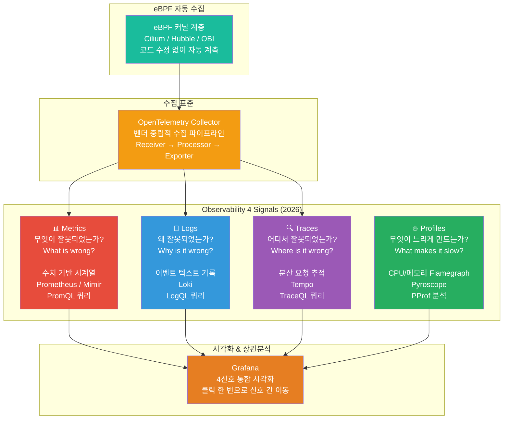

---

## A.2 2026년 권장 Observability 아키텍처 — LGTM+P Stack

2026년 현재 Kubernetes 환경에서 가장 성숙하고 널리 검증된 오픈소스 Observability 스택은 **LGTM+P (Loki + Grafana + Tempo + Mimir + Pyroscope)** 스택이다. 여기에 데이터 수집 표준으로 **OpenTelemetry Collector**가, 코드 수정 없는 자동 계측을 위해 **eBPF 기반 도구**가 함께 구성된다.

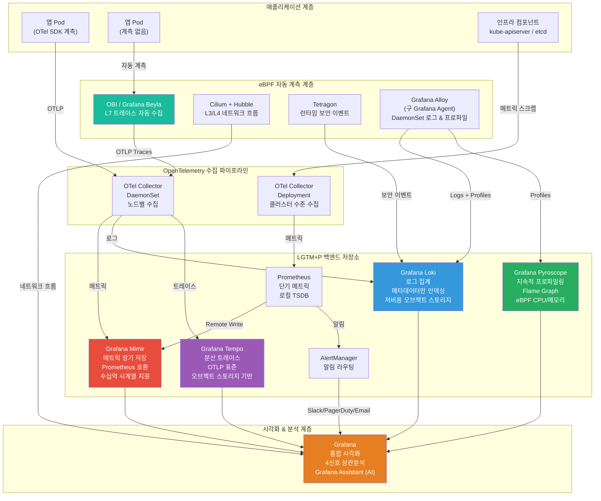

### A.2.1 각 구성 요소 상세 설명

**Grafana Mimir — 메트릭 장기 저장소**

Prometheus는 탁월한 메트릭 수집 엔진이지만 단일 노드 기반으로 수평 확장이 어렵고, 기본 보존 기간이 15일에 불과하다. Grafana Mimir는 Prometheus와 100% 호환되는 장기 저장 백엔드로, 수십억 개의 활성 시계열을 처리할 수 있고 S3, GCS, Azure Blob Storage 등 오브젝트 스토리지를 활용해 수개월~수년치 메트릭을 저비용으로 보관한다. Prometheus의 Remote Write 기능으로 수집한 데이터를 Mimir로 전송하며, Grafana에서는 기존 Prometheus 데이터 소스를 그대로 사용한다.

**Grafana Loki — 로그 집계**

ELK 스택(Elasticsearch + Logstash + Kibana)의 대안으로 등장한 Loki는 근본적으로 다른 설계 철학을 가진다. Elasticsearch가 로그의 전체 텍스트를 인덱싱하는 것과 달리, Loki는 레이블(Label)로 정의된 메타데이터만 인덱싱하고 실제 로그 내용은 오브젝트 스토리지에 압축하여 저장한다. 이 방식으로 저장 비용을 대폭 줄이면서도(사례에 따라 75% 절감) Prometheus와 동일한 레이블 모델을 사용해 메트릭-로그 간 상관분석이 자연스럽게 이루어진다. 로그 쿼리 언어는 **LogQL**이며, PromQL과 유사한 문법을 사용한다.

**Grafana Tempo — 분산 트레이스**

Tempo는 Jaeger, Zipkin, OTLP 등 다양한 트레이스 포맷을 수신할 수 있는 고처리량 분산 트레이스 백엔드다. Elasticsearch나 Cassandra 없이 오브젝트 스토리지만으로 동작하므로 운영 비용이 낮다. Grafana에서 트레이스를 클릭하면 동일한 Trace ID를 가진 로그를 Loki에서 바로 조회하거나, 해당 시점의 메트릭 그래프로 이동하는 교차 신호 탐색이 가능하다.

**Grafana Pyroscope — 지속적 프로파일링**

Pyroscope는 CPU 사용량, 메모리 할당, 고루틴 상태 등을 항상(Always-On) 수집하는 연속 프로파일링 도구다. Flame Graph 시각화를 통해 어떤 함수가 CPU 시간을 가장 많이 소비하는지 한눈에 파악할 수 있다. eBPF 기반으로 동작해 언어나 프레임워크에 관계없이 모든 프로세스를 계측하며, Grafana Alloy Agent의 eBPF 프로파일링 기능과 연동하면 코드 수정 없이 전체 클러스터의 프로파일 데이터를 수집할 수 있다.

**OpenTelemetry Collector — 벤더 중립 파이프라인**

OpenTelemetry Collector는 메트릭, 로그, 트레이스를 수신(Receive)하고 가공(Process)하여 목적지 백엔드로 내보내는(Export) 텔레메트리 라우터다. 2026년 현재 Kubernetes 클러스터에서는 두 가지 배포 패턴이 권장된다. 첫째는 **DaemonSet 패턴**으로, 모든 노드에 하나씩 배포되어 해당 노드의 애플리케이션 텔레메트리를 수집한다. 둘째는 **Deployment(Gateway) 패턴**으로, 클러스터 수준의 이벤트와 집계 데이터를 처리한다. Collector는 Receivers → Processors → Exporters 파이프라인으로 구성되며, 민감 데이터 필터링, 샘플링, 메타데이터 보강 등 다양한 가공 처리를 수행한다.

**eBPF 기반 자동 계측 계층**

eBPF(extended Berkeley Packet Filter)는 Linux 커널에 안전하게 프로그램을 삽입하여 커널 수준에서 시스템 동작을 관찰하는 기술이다. 2026년 기준 67%의 대규모 Kubernetes 운영 팀이 eBPF 기반 관측 도구를 도입했다(CNCF Observability TAG Q1 2026 Survey). eBPF의 가장 큰 장점은 **코드 수정이 필요 없다**는 것이다. SDK를 심지 않아도, 언어나 프레임워크에 관계없이, 레거시 서비스도 자동으로 계측된다.

2026년 권장되는 eBPF 도구 조합은 다음과 같다.

- **Cilium + Hubble**: L3/L4 네트워크 정책 및 흐름 시각화. 기존 iptables를 대체하는 CNI이자 네트워크 관측 도구
- **Tetragon**: 런타임 보안 이벤트 감지. 프로세스 실행, 파일 접근, 네트워크 연결 등 보안 이벤트를 실시간으로 수집
- **OBI (OpenTelemetry eBPF Instrumentation)**: KubeCon EU 2026에서 베타 공개된 Grafana Beyla의 후속 CNCF 프로젝트. L7 HTTP/gRPC 트레이스를 코드 수정 없이 자동 수집하여 OTLP 형식으로 내보냄

---

## A.3 Observability 스택 성숙도별 단계적 구축 로드맵

조직의 규모와 성숙도에 따라 단계적으로 Observability 스택을 구축하는 것이 실용적이다.

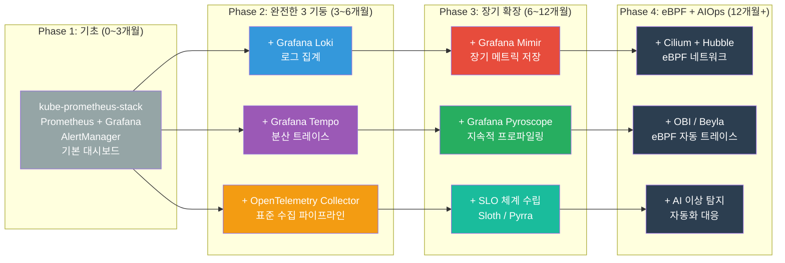

---

## A.4 Observability 스택 종합 비교표

### A.4.1 오픈소스 vs 상용 vs Azure 관리형

| 비교 항목 | 오픈소스 LGTM+P | Azure Managed (Prometheus + Grafana) | 상용 SaaS (Datadog / Dynatrace) |
|-----------|----------------|--------------------------------------|----------------------------------|
| **초기 구축 비용** | 인력 비용 높음 | 낮음 | 매우 낮음 |
| **운영 부담** | 높음 (직접 운영) | 낮음 (Azure 관리) | 없음 (벤더 관리) |
| **월간 비용** | 컴퓨팅비만 | 수집량 기반 과금 | 호스트/컨테이너당 과금 (높음) |
| **벤더 종속** | 없음 | Azure 종속 | 높음 |
| **커스터마이징** | 완전 자유 | 중간 | 제한적 |
| **eBPF 지원** | Cilium/OBI 직접 구성 | 제한적 | Datadog Agent 지원 |
| **AI/ML 기능** | Grafana Assistant (기본) | Azure Copilot 연동 | 자체 AI 분석 내장 |
| **학습 곡선** | 높음 | 낮음 | 낮음 |
| **데이터 주권** | 완전 통제 | Azure 리전 내 | 벤더 데이터센터 |
| **대규모 확장** | Mimir/Thanos로 가능 | Azure가 자동 처리 | 자동 확장 |
| **AKS 적합성** | ✅ 이번 실습 방식 | ✅ Microsoft 공식 권장 | ✅ 지원 (추가 비용) |

### A.4.2 신호별 오픈소스 도구 비교

| 신호 | 1순위 (권장) | 2순위 (대안) | 특징 |
|------|-------------|-------------|------|
| **메트릭** | Prometheus + Mimir | VictoriaMetrics | Prometheus: 생태계 최대, Mimir: 장기 저장 |
| **로그** | Grafana Loki | Elasticsearch (ELK) | Loki: 저비용, ELK: 풀텍스트 인덱싱 |
| **트레이스** | Grafana Tempo | Jaeger | Tempo: 오브젝트 스토리지, Jaeger: 성숙도 높음 |
| **프로파일** | Grafana Pyroscope | Parca | Pyroscope: LGTM 통합, Parca: 경량 |
| **수집 표준** | OpenTelemetry Collector | Grafana Alloy | OTel: CNCF 표준, Alloy: Grafana 통합 |
| **eBPF 네트워크** | Cilium + Hubble | Calico | Cilium: 가장 풍부한 기능 |
| **eBPF 트레이스** | OBI (베타) / Beyla | Pixie | OBI: CNCF 표준, Pixie: 성숙도 높음 |
| **eBPF 보안** | Tetragon | Falco | Tetragon: eBPF 네이티브, Falco: 성숙도 높음 |
| **SLO 관리** | Sloth / Pyrra | OpenSLO | Sloth: PromQL 자동 생성 |
| **대시보드** | Grafana | Kibana | Grafana: 다중 소스 지원 |

---

# 별첨 B — Observability 기반 최고의 운영 방법론

---

## B.1 SRE 기반 운영 방법론의 핵심 개념

Google이 정립하고 업계 표준이 된 SRE(Site Reliability Engineering) 방법론은 Observability 데이터를 **비즈니스 의사결정의 언어**로 변환하는 체계다. 단순히 서버가 켜져 있는지 확인하는 것을 넘어, 사용자가 실제로 서비스를 잘 사용하고 있는지를 측정하고 목표를 설정하는 방법론이다.

### B.1.1 SLI — Service Level Indicator (서비스 수준 지표)

SLI는 서비스 품질을 사용자 관점에서 정량적으로 측정하는 지표다. 좋은 SLI의 조건은 사용자가 직접 체감할 수 있어야 하고(User-Facing), 수치로 계산 가능해야 하며(Quantifiable), 명확하고 모호하지 않아야 한다(Objective).

흔히 혼동하지만 **CPU 사용률, 메모리 사용량, 컨테이너 재시작 횟수**는 SLI가 아니다. 이것들은 내부 신호(Internal Signal)로, 사용자가 직접 경험하지 않는다. SLI는 다음 네 가지 범주로 구분된다.

**가용성(Availability)**: 성공한 요청 수 ÷ 전체 요청 수. 예를 들어 HTTP 2xx 응답 수를 전체 요청 수로 나눈 값이다.

**지연시간(Latency)**: 특정 임계값 이하로 처리된 요청 비율. 예를 들어 500ms 이내에 처리된 요청 비율이다. 평균(Mean)보다 **P95, P99** 같은 백분위수(Percentile)가 실제 사용자 경험을 더 잘 반영한다.

**오류율(Error Rate)**: 5xx 오류 응답 수 ÷ 전체 요청 수. 가용성의 반대 개념으로, 1 - 가용성으로 계산할 수도 있다.

**처리량(Throughput)**: 단위 시간당 처리된 요청 수. 시스템이 기대한 부하를 처리하고 있는지 확인한다.

### B.1.2 SLO — Service Level Objective (서비스 수준 목표)

SLO는 SLI에 대한 목표 수치다. "지난 30일 동안 API 요청의 99.9%가 500ms 이내에 처리되어야 한다"와 같이 표현된다. SLO 설정 시 다음 원칙을 따른다.

목표는 100%가 아니어야 한다. 100% 가용성을 목표로 하면 단 하나의 장애도 용납되지 않으므로, 변경과 혁신이 불가능해진다. 현실적인 목표는 99.9%(Three-Nine) 또는 99.95% 수준이다.

SLO는 내부 협의를 통해 설정한다. 개발팀, 운영팀, 비즈니스 팀이 함께 합의한 수치여야 한다. 지나치게 엄격한 SLO는 운영 부담을 높이고, 지나치게 느슨한 SLO는 의미가 없다.

### B.1.3 Error Budget — 오류 예산

Error Budget은 SLO에서 허용하는 실패의 총량이다. SLO가 99.9%라면 Error Budget은 0.1%, 즉 30일 기준 약 43.2분의 다운타임이다. Error Budget의 핵심 통찰은 다음과 같다.

"신뢰성을 높이는 것은 돈이 드는 일이다. Error Budget은 그 비용과 혁신의 속도 사이의 균형점이다."

Error Budget이 충분히 남아있다면 팀은 새로운 기능을 빠르게 배포하고 실험할 수 있다. Error Budget이 소진되면 기능 배포를 중단하고 안정성 개선에 집중한다. 이 체계는 개발팀과 운영팀 사이의 오랜 갈등인 "빠른 배포 vs 안정성"을 데이터 기반으로 해결한다.

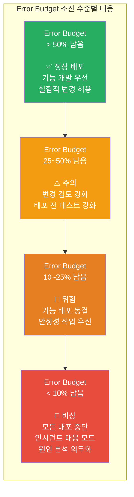

---

## B.2 Four Golden Signals — 네 가지 황금 신호

Google SRE 핸드북에서 정의한 Four Golden Signals는 어떤 서비스든 반드시 모니터링해야 할 네 가지 핵심 지표다. Kubernetes 환경에서의 구체적인 PromQL 쿼리와 함께 설명한다.

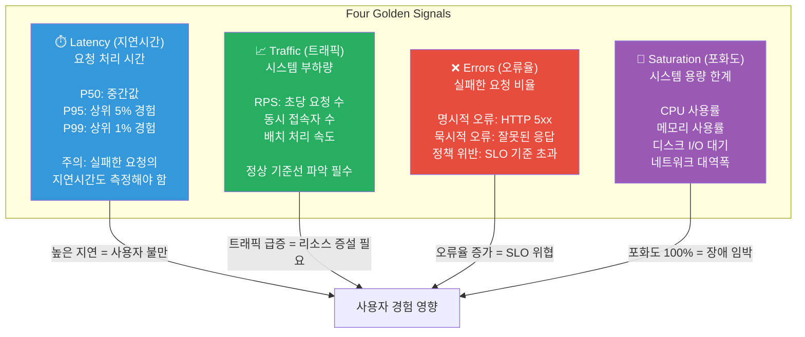

**Kubernetes에서의 PromQL 예시**

지연시간 P99 측정:
```promql
histogram_quantile(0.99,
  sum(rate(http_request_duration_seconds_bucket[5m])) by (le, service)
)
```

오류율 측정:
```promql
sum(rate(http_requests_total{status=~"5.."}[5m]))
/
sum(rate(http_requests_total[5m]))
```

CPU 포화도 측정 (Throttling):
```promql
sum(rate(container_cpu_cfs_throttled_seconds_total[5m])) by (pod)
/
sum(rate(container_cpu_cfs_periods_total[5m])) by (pod)
```

---

## B.3 Observability 기반 인시던트 대응 방법론

### B.3.1 인시던트 대응 사이클

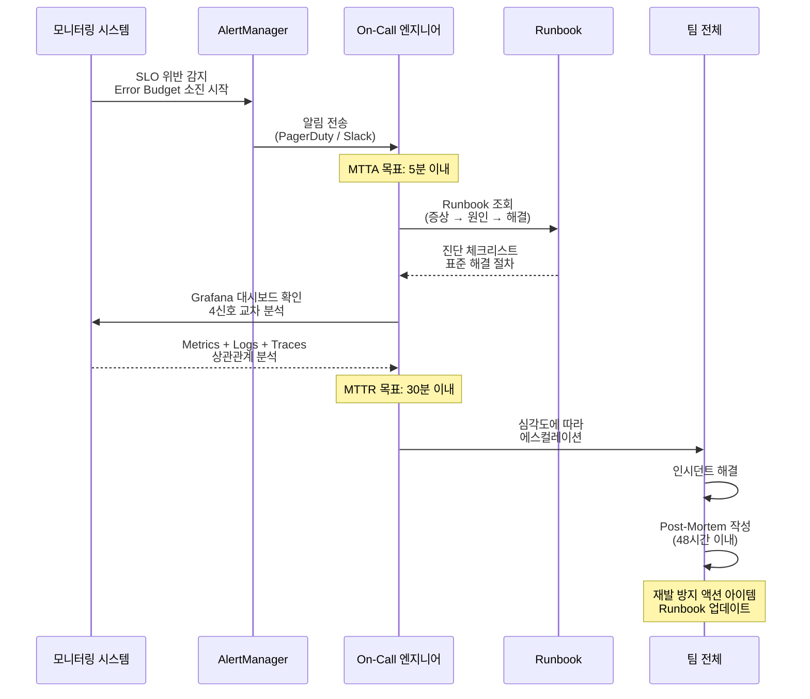

### B.3.2 인시던트 심각도 체계

| 심각도 | 이름 | 정의 | 대응 시간 목표 | 에스컬레이션 |
|--------|------|------|--------------|------------|
| SEV-1 | Critical | 전체 서비스 불가 / 데이터 유실 가능 | 즉시 (5분 이내) | CTO 포함 전사 알림 |
| SEV-2 | High | 핵심 기능 장애 / 다수 사용자 영향 | 15분 이내 | 팀 리더 + 관련 팀 |
| SEV-3 | Medium | 일부 기능 저하 / 소수 사용자 영향 | 1시간 이내 | On-Call 엔지니어 |
| SEV-4 | Low | 경미한 성능 저하 / 사용자 체감 미미 | 다음 영업일 | 티켓 등록 |

### B.3.3 Runbook 작성 원칙

Runbook은 특정 알림이 발생했을 때 On-Call 엔지니어가 따라야 할 표준 절차서다. 좋은 Runbook은 다음 구조를 따른다.

**1. 알림 정보**: 어떤 AlertManager 규칙이 이 Runbook을 트리거하는지 명시한다. PromQL 쿼리와 임계값도 포함한다.

**2. 영향 범위**: 이 알림이 발생하면 어떤 서비스, 어떤 사용자, 어떤 비즈니스 기능에 영향을 미치는지 설명한다.

**3. 초기 진단 체크리스트**: On-Call이 즉시 실행해야 할 진단 명령어 목록이다. 예를 들어 "kubectl get pods -n production | grep -v Running"과 같이 구체적이어야 한다.

**4. 가능한 원인 목록**: 이 알림을 일으키는 알려진 원인들을 우선순위 순으로 나열한다.

**5. 해결 절차**: 각 원인별 해결 명령어와 검증 방법을 단계별로 기술한다.

**6. 에스컬레이션 경로**: 이 Runbook으로 해결이 안 될 때 누구에게 연락해야 하는지 명시한다.

---

## B.4 SLO 기반 운영 주기 관리

Observability는 일회성 설정이 아니라 지속적인 운영 사이클의 일부여야 한다.

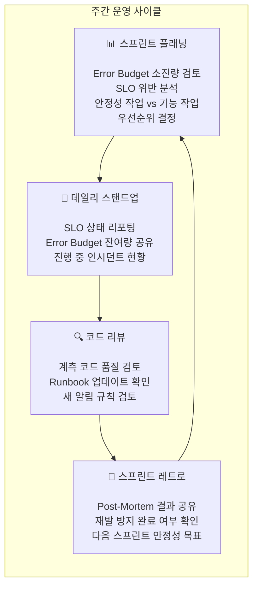

### B.4.1 Observability Champion 제도

팀 내에 **Observability Champion**을 지정하는 것이 효과적이다. 이 역할은 팀의 SLI/SLO 정의를 주도하고, 대시보드와 Runbook을 최신 상태로 유지하며, Post-Mortem을 진행하고 좋은 관행을 팀 내에 전파한다. Champion들이 월 1회 모여 조직 전체의 관측 가능성 수준을 점검하고 도구 표준화를 논의하면 효과적이다.

---

## B.5 비난 없는 문화 (Blameless Culture)

Observability와 SRE 방법론이 기술적으로 완벽하더라도, 조직 문화가 뒷받침되지 않으면 의미가 없다. **비난 없는 문화(Blameless Culture)** 는 장애와 실수를 개인의 책임으로 돌리지 않고, 시스템과 프로세스의 결함으로 보는 관점이다.

장애가 발생했을 때 "누가 잘못했는가?"가 아니라 "시스템의 어떤 부분이 이런 결과를 만들었는가?"를 묻는다. 이 관점은 엔지니어들이 실수를 숨기지 않고 솔직하게 공유하게 만들며, 그 학습이 조직 전체의 Runbook과 알림 규칙 개선으로 이어진다. 심리적 안전감이 없으면 아무도 인시던트를 보고하지 않고, Observability 도구를 아무리 잘 갖추어도 데이터가 은폐된다.

**Post-Mortem 5 Why 분석 예시**

```
인시던트: Prometheus Pod OOMKilled로 인한 메트릭 수집 중단 30분

1차 Why: 왜 Prometheus가 OOM으로 종료되었는가?
→ 메모리 한도(2Gi)를 초과했기 때문

2차 Why: 왜 메모리를 초과했는가?
→ 새로운 ServiceMonitor가 추가되어 수집 시계열 수가 급증했기 때문

3차 Why: 왜 시계열 급증을 사전에 감지하지 못했는가?
→ 시계열 수에 대한 알림 규칙이 없었기 때문

4차 Why: 왜 알림 규칙이 없었는가?
→ Prometheus 자체 메트릭을 모니터링하는 관행이 없었기 때문

5차 Why: 왜 그 관행이 없었는가?
→ 모니터링 스택 자체를 모니터링("Monitor the Monitor")하는 체계가
   Runbook에 포함되지 않았기 때문

근본 원인: 모니터링 스택의 리소스 사용량을 감시하는 알림 규칙 부재
액션 아이템:
  1. Prometheus 시계열 수 알림 추가
  2. Prometheus 메모리 사용률 80% 초과 시 알림 추가
  3. 운영 Runbook에 "모니터링 스택 자체 헬스체크" 섹션 추가
  4. ServiceMonitor 추가 시 코드 리뷰 필수화
```

---

## B.6 Kubernetes AIOps 최종 운영 방법론 요약

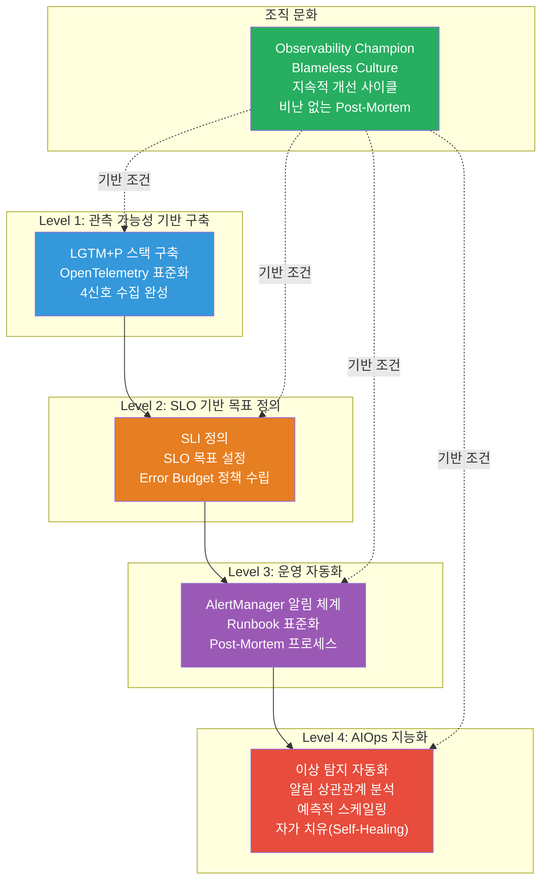

Observability는 단순히 대시보드를 만드는 행위가 아니다. 시스템이 어떻게 동작하는지를 이해하고, 그 이해를 바탕으로 더 나은 결정을 내리는 능력이다. LGTM+P 스택은 그 능력을 기술적으로 구현하는 도구이고, SLO/Error Budget 체계는 그것을 비즈니스 언어로 번역하는 프레임워크이며, 비난 없는 문화는 그 모든 것이 실제로 작동하게 만드는 토양이다.

이 세 가지가 함께 갖추어졌을 때, Kubernetes AIOps는 단순한 운영 자동화를 넘어 **조직의 신뢰성을 경쟁 우위로 전환하는 핵심 역량**이 된다.

---

*별첨 추가 작성일: 2026-06-10 | 참조: CNCF Observability TAG Q1 2026, KubeCon EU 2026, Google SRE Book*
