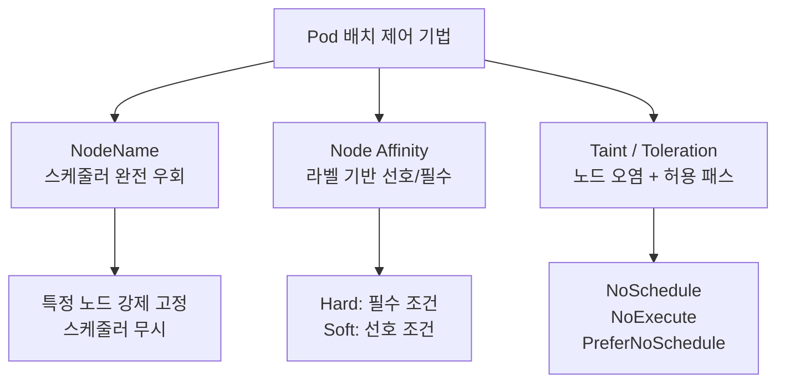
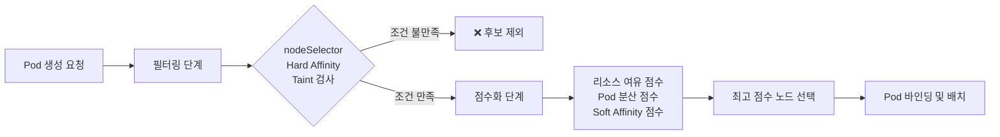
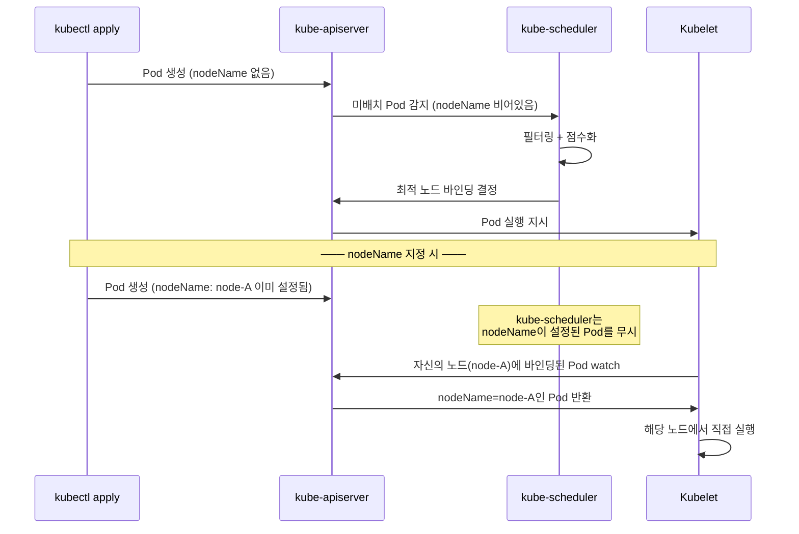
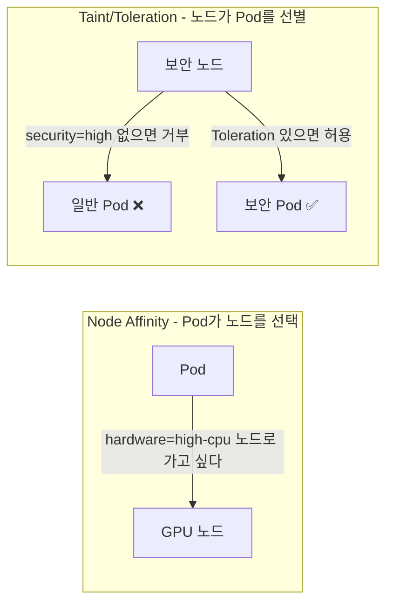
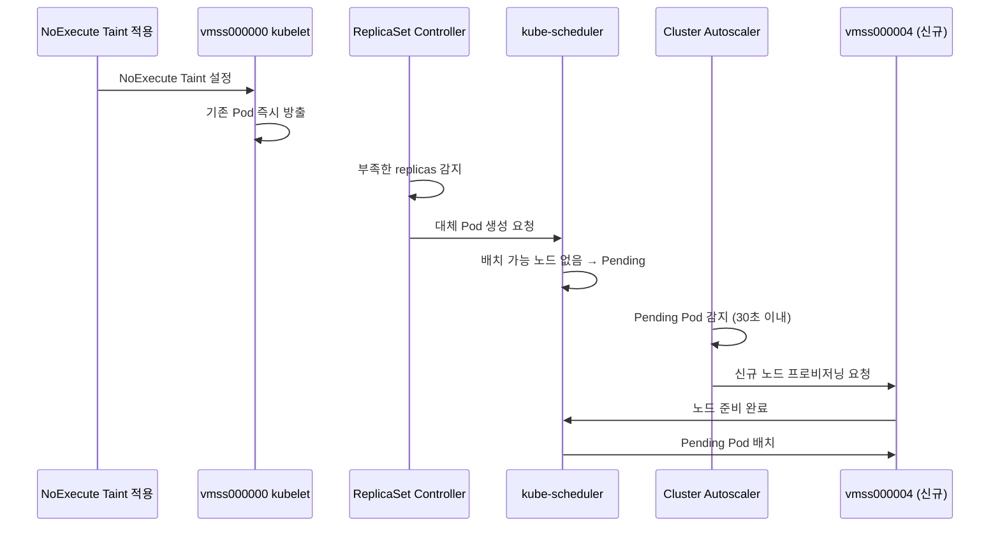
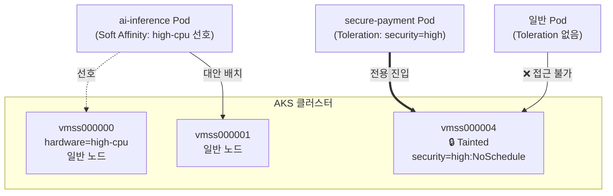
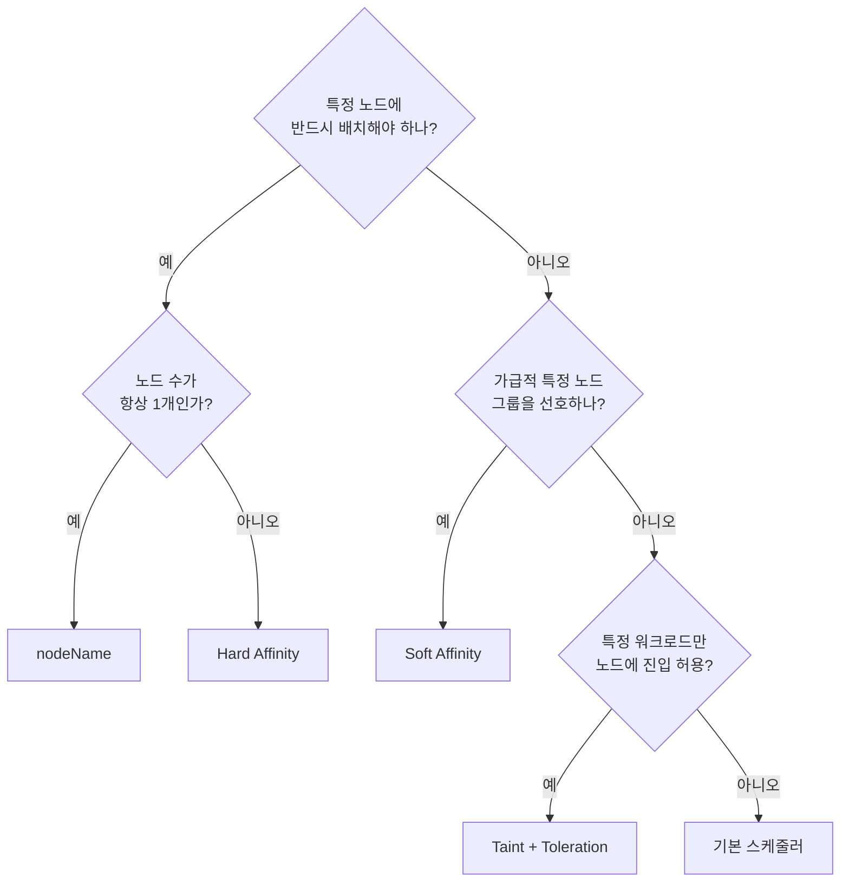
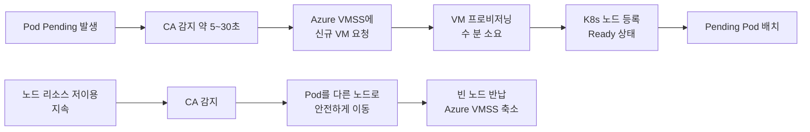

> **과정**: MS Azure K8s 기반 AIOps 실전  
> **실습 환경**: Azure Kubernetes Service (AKS), Korea Central, Kubernetes v1.34.7  
> **작성일**: 2026-06-10

## 실습 문서

[**Lab 7 - 워크로드 배치 제어**](https://psedu.gitbook.io/k8s-aiops-aks/lab-7-pod)

[**Kubernetes AIOps 실전.pdf**](https://drive.google.com/file/d/1aA2YTol6pRqIkpTyQs0GtZghoVqr7P0E/view?usp=sharing)


## 관련 문서

- [**Azure AKS 기반 Kubernetes AIOps — 클러스터 배포 및 워크로드 배포**](https://k82022603.github.io/posts/azure-aks-%EA%B8%B0%EB%B0%98-kubernetes-aiops-%ED%81%B4%EB%9F%AC%EC%8A%A4%ED%84%B0-%EB%B0%B0%ED%8F%AC-%EB%B0%8F-%EC%9B%8C%ED%81%AC%EB%A1%9C%EB%93%9C-%EB%B0%B0%ED%8F%AC/)
- [**Azure AKS 기반 Kubernetes AIOps — Service 및 Ingress 라우팅**](https://k82022603.github.io/posts/azure-aks-%EA%B8%B0%EB%B0%98-kubernetes-aiops-service-%EB%B0%8F-ingress-%EB%9D%BC%EC%9A%B0%ED%8C%85/)
- [**Azure AKS 기반 Kubernetes AIOps — Volume 과 StorageClass**](https://k82022603.github.io/posts/azure-aks-%EA%B8%B0%EB%B0%98-kubernetes-aiops-volume-%EA%B3%BC-storageclass/)
- [**Azure AKS 기반 Kubernetes AIOps — 특수 워크로드 관리**](https://k82022603.github.io/posts/azure-aks-%EA%B8%B0%EB%B0%98-kubernetes-aiops-%ED%8A%B9%EC%88%98-%EC%9B%8C%ED%81%AC%EB%A1%9C%EB%93%9C-%EA%B4%80%EB%A6%AC/)
- [**Azure AKS 기반 Kubernetes AIOps — 리소스 관리**](https://k82022603.github.io/posts/azure-aks-%EA%B8%B0%EB%B0%98-kubernetes-aiops-%EB%A6%AC%EC%86%8C%EC%8A%A4-%EA%B4%80%EB%A6%AC/)
- **Azure AKS 기반 Kubernetes AIOps — 워크로드 배치 제어**
- [**Azure AKS 기반 Kubernetes AIOps — 네트워크 정책**](https://k82022603.github.io/posts/azure-aks-%EA%B8%B0%EB%B0%98-kubernetes-aiops-%EB%84%A4%ED%8A%B8%EC%9B%8C%ED%81%AC-%EC%A0%95%EC%B1%85/)
- [**Azure AKS 기반 Kubernetes AIOps — kubernetes 고가용성**](https://k82022603.github.io/posts/azure-aks-%EA%B8%B0%EB%B0%98-kubernetes-aiops-kubernetes-%EA%B3%A0%EA%B0%80%EC%9A%A9%EC%84%B1/)
- [**Azure AKS 기반 Kubernetes AIOps — 모니터링**](https://k82022603.github.io/posts/azure-aks-%EA%B8%B0%EB%B0%98-kubernetes-aiops-%EB%AA%A8%EB%8B%88%ED%84%B0%EB%A7%81/)
- [**Azure AKS 기반 Kubernetes AIOps — AI 기반 tools**](https://k82022603.github.io/posts/azure-aks-%EA%B8%B0%EB%B0%98-kubernetes-aiops-ai-%EA%B8%B0%EB%B0%98-tools/)
- [**Azure AKS 기반 Kubernetes AIOps — 과정 평가 문제별 정답과 핵심 개념**](https://k82022603.github.io/posts/azure-aks-%EA%B8%B0%EB%B0%98-kubernetes-aiops-%EA%B3%BC%EC%A0%95-%ED%8F%89%EA%B0%80-%EB%AC%B8%EC%A0%9C%EB%B3%84-%EC%A0%95%EB%8B%B5%EA%B3%BC-%ED%95%B5%EC%8B%AC-%EA%B0%9C%EB%85%90/)

---

## 목차

1. [개요](#1-개요)
2. [Kubernetes 스케줄러 동작 원리](#2-kubernetes-스케줄러-동작-원리)
3. [Task 1 — NodeName: 스케줄러 우회 강제 배치](#3-task-1--nodename-스케줄러-우회-강제-배치)
4. [Task 2 — Node Affinity: 라벨 기반 선호 배치](#4-task-2--node-affinity-라벨-기반-선호-배치)
5. [Task 3 — Taint와 Toleration: 노드 격리와 허용](#5-task-3--taint와-toleration-노드-격리와-허용)
6. [Task 4 — AI 서비스 시나리오: Affinity + Taint 통합 실습](#6-task-4--ai-서비스-시나리오-affinity--taint-통합-실습)
7. [배치 제어 기법 종합 비교](#7-배치-제어-기법-종합-비교)
8. [AKS Cluster Autoscaler 연계 동작](#8-aks-cluster-autoscaler-연계-동작)
9. [실무 적용 케이스](#9-실무-적용-케이스)
10. [Claude Code 프롬프트 모음](#10-claude-code-프롬프트-모음)

---

## 1. 개요

Kubernetes는 Pod를 어느 노드에 배치할지를 kube-scheduler가 자동으로 결정합니다. 기본 스케줄러는 각 노드의 가용 CPU, 메모리, 기존 Pod 분산 상태 등을 종합적으로 점수화하여 가장 적합한 노드를 선택합니다. 그러나 실제 운영 환경에서는 이 자동 결정만으로는 부족한 경우가 많습니다.

AI 추론 엔진은 GPU 노드에서만 실행되어야 하고, 결제 시스템은 규정 준수를 위해 격리된 보안 노드에만 배치되어야 하며, 배치 처리 잡은 저비용 Spot 인스턴스 노드에서 실행되어야 합니다. 이처럼 워크로드의 특성과 인프라의 역할에 맞게 Pod 배치를 정교하게 제어할 수 있어야 진정한 클러스터 운영이 가능합니다.

Lab 7에서는 Kubernetes가 제공하는 세 가지 핵심 배치 제어 기법인 **NodeName**, **Node Affinity**, **Taint/Toleration**을 AKS 환경에서 직접 실습합니다. 각 기법의 동작 원리를 이해하고, 실제 AIOps 시나리오에서 어떻게 조합하여 사용하는지까지 다룹니다.



---

## 2. Kubernetes 스케줄러 동작 원리

kube-scheduler가 Pod를 노드에 배치하는 과정은 크게 두 단계로 나뉩니다.

첫 번째 단계는 **필터링(Filtering)** 입니다. 클러스터의 모든 노드 중에서 해당 Pod를 실행하기에 부적합한 노드를 제거합니다. 노드의 가용 CPU와 메모리가 Pod의 requests를 수용할 수 없거나, Pod에 설정된 nodeSelector나 Hard Affinity 조건을 만족하지 못하거나, 노드에 Taint가 있고 Pod에 대응하는 Toleration이 없는 경우 해당 노드는 후보에서 제외됩니다.

두 번째 단계는 **점수화(Scoring)** 입니다. 필터링을 통과한 노드들에 대해 여러 플러그인이 점수를 계산합니다. 리소스 균형, Pod 분산 정도, Soft Affinity 가중치 등이 점수에 반영됩니다. 스케줄러는 최종 점수가 가장 높은 노드를 선택합니다.



이 두 단계를 이해하면 Lab 7의 각 기법이 어느 단계에 영향을 미치는지 명확해집니다. NodeName은 스케줄러 자체를 건너뜁니다. Hard Affinity는 필터링 단계에서 작동합니다. Soft Affinity는 점수화 단계에 영향을 줍니다. Taint는 필터링 단계에서 Toleration 없는 Pod를 차단합니다.

---

## 3. Task 1 — NodeName: 스케줄러 우회 강제 배치

### 3.1 개념과 동작 원리

`nodeName`은 Pod 스펙에 직접 노드 이름을 지정하는 가장 단순하고 강력한 배치 제어 방식입니다. 이 필드가 설정된 Pod는 kube-scheduler의 필터링과 점수화 과정을 **완전히 건너뜁니다**. 대신 kubelet이 직접 해당 노드에서 Pod 실행을 시도합니다.



일반 스케줄링과의 결정적 차이는 **즉시 노드 바인딩**입니다. `nodeName`이 설정된 Pod는 생성 즉시 `kubectl get pod -o wide`의 NODE 컬럼에 지정된 노드명이 표시됩니다. 스케줄러가 아직 배치 결정을 하지 않은 일반 Pod는 NODE가 `<none>`으로 표시되다가 스케줄러 결정 후에 채워지는 것과 대조됩니다.

### 3.2 실습 결과 분석

이번 실습에서 두 번의 시도가 있었습니다.

**첫 번째 시도 — 존재하지 않는 노드명 사용:**

```yaml
# lab7-nodename.yaml (첫 번째 시도)
spec:
  nodeName: k8s-worker1   # ← AKS 환경에 존재하지 않는 노드명
```

결과적으로 `my-rs` ReplicaSet의 Pod 3개가 모두 Pending 상태로 유지되었지만, NODE 컬럼에는 `k8s-worker1`이 이미 표시되었습니다. 이것이 nodeName의 핵심 동작입니다. 스케줄러가 feasibility 검사를 하지 않기 때문에, 노드가 실제로 존재하지 않아도 바인딩은 즉시 이루어집니다. 그러나 해당 노드의 kubelet이 없으므로 Pod는 영원히 Pending 상태로 남습니다. 이 Lab 가이드의 `k8s-worker1`은 kubeadm으로 구축한 온프레미스 환경 기준의 예시 노드명으로, AKS 환경에서는 사용할 수 없습니다.

**두 번째 시도 — 실제 AKS 노드명 사용:**

```yaml
# lab7-nodename.yaml (두 번째 시도)
spec:
  nodeName: aks-nodepool1-12318778-vmss000000  # ← 실제 AKS 노드명
```

```
NAME          READY   STATUS    NODE
my-rs-5xd8g   1/1     Running   aks-nodepool1-12318778-vmss000000
my-rs-j4vb8   1/1     Running   aks-nodepool1-12318778-vmss000000
my-rs-pwqdb   1/1     Running   aks-nodepool1-12318778-vmss000000
```

3개 Pod 전부 지정한 노드에서 Running 상태가 되었습니다. Scale Out을 5개로 늘려도 추가된 2개 Pod 모두 동일 노드에 배치되었습니다. 클러스터에 `vmss000001`이라는 다른 노드가 여유 있음에도 불구하고, nodeName의 강제 고정으로 인해 분산이 전혀 이루어지지 않았습니다.

### 3.3 AKS 환경에서 노드명을 자동으로 가져오는 방법

AKS 노드명은 VMSS 인스턴스 번호를 포함한 긴 문자열로 자동 생성됩니다. 하드코딩 대신 다음과 같이 자동화할 수 있습니다.

```bash
# 첫 번째 노드 이름을 변수로 저장
NODE1=$(kubectl get nodes -o jsonpath='{.items[0].metadata.name}')
echo "선택된 노드: $NODE1"

# heredoc에서 변수 자동 치환
cat <<EOF > lab7-nodename.yaml
apiVersion: apps/v1
kind: ReplicaSet
metadata:
  name: my-rs
spec:
  replicas: 3
  selector:
    matchLabels:
      app: nodename
  template:
    metadata:
      labels:
        app: nodename
    spec:
      nodeName: ${NODE1}
      containers:
        - name: nginx
          image: nginx
EOF

# 치환 확인
grep nodeName lab7-nodename.yaml
```

`$()` 문법은 명령 실행 결과를 변수에 담는 쉘 명령 치환(Command Substitution)이며, heredoc 내부의 `${NODE1}`은 실제 노드명으로 자동 치환됩니다.

### 3.4 nodeName의 한계와 주의사항

nodeName은 강력하지만 여러 한계를 가집니다. 지정한 노드가 다운되면 Pod는 다른 노드로 재스케줄되지 않고 해당 노드에 묶여 있습니다. 노드 자원이 부족해도 스케줄러가 체크하지 않으므로 OOM이나 자원 경합이 발생할 수 있습니다. ReplicaSet이나 Deployment에서 nodeName을 사용하면 모든 복제본이 단일 노드에 몰려 고가용성이 무너집니다. 이 때문에 nodeName은 디버깅, 특수 하드웨어 접근, 또는 DaemonSet처럼 노드당 정확히 하나의 Pod가 필요한 경우에 한정하여 사용하는 것이 권장됩니다.

---

## 4. Task 2 — Node Affinity: 라벨 기반 선호 배치

### 4.1 개념

Node Affinity는 노드에 부여된 레이블(Label)을 기반으로 Pod가 배치될 노드를 제어합니다. nodeName이 특정 노드를 이름으로 직접 지정하는 반면, Node Affinity는 **조건식(matchExpressions)** 을 사용하여 라벨 키-값 조합으로 대상 노드를 정의합니다. 덕분에 단일 노드에 종속되지 않고 조건을 만족하는 여러 노드 중 하나에 배치될 수 있어 고가용성을 유지할 수 있습니다.

Node Affinity는 조건의 강제성에 따라 두 가지로 나뉩니다.

### 4.2 Hard Affinity — 필수 조건

`requiredDuringSchedulingIgnoredDuringExecution`은 이름 그대로 **스케줄링 시점에 반드시 만족해야 하는(required)** 조건입니다. 조건을 만족하는 노드가 없으면 Pod는 배치되지 않고 Pending 상태로 대기합니다. 한편 `IgnoredDuringExecution`이 의미하는 것은, 이미 실행 중인 Pod에는 이 규칙이 적용되지 않는다는 것입니다. 즉 Pod가 Running 중일 때 해당 노드의 라벨이 삭제되어도 Pod는 방출되지 않습니다.

```yaml
affinity:
  nodeAffinity:
    requiredDuringSchedulingIgnoredDuringExecution:
      nodeSelectorTerms:
      - matchExpressions:
        - key: color
          operator: In
          values:
          - blue
          - green
```

이 설정은 `color=blue` 또는 `color=green` 라벨을 가진 노드에만 배치를 허용합니다. `operator`로는 `In`, `NotIn`, `Exists`, `DoesNotExist`, `Gt`, `Lt` 등을 사용할 수 있어 nodeName이나 nodeSelector보다 훨씬 유연한 조건 표현이 가능합니다.

**실습 결과:** `color=blue`(vmss000000), `color=blue`(vmss000001), `color=red`(vmss000002, vmss000003) 구성에서 Hard Affinity(blue 또는 green) 조건을 적용하자 Pod 3개 모두 vmss000000에 배치되었습니다. vmss000001도 `color=blue`이므로 조건 충족 노드는 2개였지만, 스케줄러의 점수화 결과 vmss000000이 선택되었습니다. 이는 Hard Affinity가 **"어느 노드 그룹 안에서 배치할지"를 제한**할 뿐, 그 안에서의 선택은 여전히 스케줄러 재량임을 보여줍니다.

### 4.3 Soft Affinity — 선호 조건

`preferredDuringSchedulingIgnoredDuringExecution`은 **선호하지만 강제하지 않는(preferred)** 조건입니다. 조건을 만족하는 노드가 없어도 Pod는 다른 노드에 Pending 없이 Running됩니다. `weight` 값(1~100)은 스케줄러의 점수화 단계에서 해당 조건을 만족하는 노드에 추가되는 가산점입니다.

```yaml
affinity:
  nodeAffinity:
    preferredDuringSchedulingIgnoredDuringExecution:
    - weight: 70
      preference:
        matchExpressions:
        - key: color
          operator: In
          values:
          - red
    - weight: 30
      preference:
        matchExpressions:
        - key: color
          operator: In
          values:
          - blue
```

이 설정은 `color=red` 노드에 70점, `color=blue` 노드에 30점의 가산점을 부여합니다. 스케줄러는 이 점수를 리소스 여유, Pod 분산 등 다른 점수와 합산하여 최종 배치 노드를 결정합니다.

**실습 결과:** Task 2 당시 클러스터에는 4개 노드(`color=blue`: vmss000000, vmss000001 / `color=red`: vmss000002, vmss000003)가 있었습니다. Soft Affinity(red:70, blue:30) 조건을 적용하자 Pod 5개가 vmss000000(3개), vmss000001(2개)으로 분산되었고, 더 높은 weight가 부여된 red 노드에는 단 하나도 배치되지 않았습니다. 그 이유는 앞선 Lab 6(CronJob 실습)에서 누적된 대량의 my-cronjob Pod들이 vmss000002, vmss000003에 이미 Running 상태로 실행 중이었기 때문입니다. 해당 노드들의 리소스가 이미 포화 상태에 가까워 스케줄러의 리소스 여유 점수가 낮았고, weight:70의 Affinity 가산점을 받아도 전체 종합 점수에서 blue 노드(vmss000000, vmss000001)에 밀렸습니다. **Soft Affinity의 weight는 스케줄러 점수 계산의 하나의 인자일 뿐**이며, 노드의 실제 상태(리소스 여유, 기존 Pod 수)에 따라 결과가 달라질 수 있음을 보여주는 사례입니다.

### 4.4 Hard Affinity vs Soft Affinity 비교표

| 항목 | Hard Affinity (required) | Soft Affinity (preferred) |
|---|---|---|
| 필드명 | `requiredDuringSchedulingIgnoredDuringExecution` | `preferredDuringSchedulingIgnoredDuringExecution` |
| 조건 강제성 | 필수 (만족 노드 없으면 Pending) | 선호 (불만족 시 다른 노드에도 배치) |
| 스케줄러 단계 | 필터링(Filtering) | 점수화(Scoring) |
| weight 설정 | 없음 | 필수 (1~100) |
| 조건 불만족 결과 | Pod Pending 유지 | Pod Running (선호 무시) |
| 실행 중 라벨 변경 시 | Pod 유지 (Ignored) | Pod 유지 (Ignored) |
| 적합한 상황 | 반드시 특정 노드 그룹에 배치해야 할 때 | 가급적 특정 노드 그룹을 선호하되 유연성 필요 시 |

---

## 5. Task 3 — Taint와 Toleration: 노드 격리와 허용

### 5.1 개념

Taint(오염)와 Toleration(용인)은 Node Affinity와 반대 방향으로 작동합니다. Node Affinity가 Pod 입장에서 "나는 이런 노드에 가고 싶다"는 끌어당기는 방식이라면, Taint는 노드 입장에서 "나는 이런 Pod는 받지 않겠다"는 밀어내는 방식입니다.



Taint는 노드에 부여하며 `key=value:Effect` 형식으로 구성됩니다. Toleration은 Pod 스펙에 설정하며, 노드의 Taint와 정확히 일치해야 해당 Taint를 "용인"하여 그 노드에 배치될 수 있습니다.

### 5.2 Taint Effect 3종

Taint의 Effect는 Toleration이 없는 Pod에 어떤 처벌을 내릴지를 결정합니다.

| Effect | 신규 Pod 배치 | 기존 Running Pod | 설명 |
|---|---|---|---|
| `NoSchedule` | ❌ 차단 | ✅ 유지 | Toleration 없는 Pod 신규 배치 불가. 이미 실행 중인 Pod는 영향 없음 |
| `PreferNoSchedule` | ⚠️ 가급적 차단 | ✅ 유지 | NoSchedule의 Soft 버전. 다른 배치 가능 노드가 없으면 허용 |
| `NoExecute` | ❌ 차단 | ❌ 즉시 방출 | 신규 배치 차단 + 이미 실행 중인 Pod도 즉시 방출(Evict) |

### 5.3 실험 1 — NoSchedule: 신규 배치 차단

```bash
# vmss000000에 NoSchedule Taint 부여
kubectl taint nodes aks-nodepool1-12318778-vmss000000 key=noschedule:NoSchedule

# Toleration 없는 Deployment 배포 (replicas: 6)
kubectl create -f lab7-taint-deploy.yaml
```

**결과 분석:**

6개 Pod 전부가 Taint가 없는 vmss000001에만 배치되었습니다. vmss000000은 Taint로 인해 신규 Pod 배치가 완전히 차단되었습니다.

그런데 중요한 관찰이 있었습니다. Task 2에서 이미 vmss000000에서 실행 중이던 `node-affinity-hard`와 `node-affinity-soft` Pod들은 NoSchedule Taint 적용 후에도 **그대로 Running 상태를 유지**했습니다. 이것이 바로 `IgnoredDuringExecution`의 의미입니다. NoSchedule은 말 그대로 "새로운 스케줄링을 차단"하는 것이며, 이미 실행 중인 Pod의 생애주기에는 관여하지 않습니다.

### 5.4 실험 2 — Taint 제거 후 정상화

```bash
# Taint 제거 (끝에 하이픈 '-' 추가)
kubectl taint nodes aks-nodepool1-12318778-vmss000000 key=noschedule:NoSchedule-
```

Taint 제거 즉시 vmss000000이 다시 스케줄 가능 상태로 복구됩니다. 재배포한 Deployment의 Pod 6개는 vmss000000과 vmss000001 양쪽으로 분산 배치되었습니다. Taint는 영구 설정이 아니라 언제든 추가하고 제거할 수 있는 동적 설정입니다.

### 5.5 실험 3 — NoExecute: 기존 Pod 강제 방출 + Cluster Autoscaler 연동

```bash
# vmss000000에 NoExecute Taint 부여
kubectl taint nodes aks-nodepool1-12318778-vmss000000 key=expel:NoExecute
```

NoExecute Taint 적용 직후 vmss000000에서 실행 중이던 모든 Pod가 즉시 Terminating 상태로 전환되었습니다. 컨트롤러(ReplicaSet, Deployment)는 방출된 Pod 수만큼 새로운 대체 Pod를 자동으로 생성했지만, vmss000000은 NoExecute로 막혀 있고 vmss000001은 이미 포화 상태였기 때문에 대체 Pod들이 모두 Pending 상태로 대기했습니다.

Pending Pod가 누적되자 **AKS Cluster Autoscaler가 자동으로 감지**하고 새 노드 `vmss000004`를 프로비저닝했습니다. Cluster Autoscaler는 CPU나 메모리 압박이 아닌 **Pending Pod의 존재를 트리거**로 스케일 업합니다. 새 노드가 준비되자 Pending Pod들이 vmss000001과 vmss000004로 분산 배치되어 모두 Running 상태로 전환되었습니다.



### 5.6 Taint/Toleration 사용 시 주의사항

Toleration은 해당 Taint가 있는 노드에 배치될 **자격(통행증)** 을 부여할 뿐, 반드시 그 노드로 가도록 **강제하지 않습니다**. Toleration만 설정한 Pod는 Taint 노드뿐 아니라 Taint가 없는 일반 노드에도 배치될 수 있습니다. 특정 Taint 노드에 반드시 배치되도록 하려면 **Toleration과 NodeAffinity(또는 nodeName)를 함께 사용**해야 합니다.

```yaml
spec:
  # Taint 노드 진입 자격 부여
  tolerations:
  - key: "security"
    operator: "Equal"
    value: "high"
    effect: "NoSchedule"
  # Taint 노드로 강제 유인 (Hard Affinity 조합)
  affinity:
    nodeAffinity:
      requiredDuringSchedulingIgnoredDuringExecution:
        nodeSelectorTerms:
        - matchExpressions:
          - key: node-role
            operator: In
            values:
            - security-dedicated
```

---

## 6. Task 4 — AI 서비스 시나리오: Affinity + Taint 통합 실습

### 6.1 시나리오 배경

AI 챗봇 서비스가 고도화되면서 클러스터 노드가 증설되었습니다. 워크로드를 성격에 따라 두 가지로 분류하여 각각 적합한 노드에 배치해야 합니다.

- **AI 추론 엔진**: 컴퓨팅 파워가 좋은 고성능 노드를 선호하지만, 해당 노드가 꽉 차도 서비스는 계속되어야 합니다 → Soft Affinity
- **결제/보안 모듈**: 반드시 격리된 보안 전용 노드에서만 실행되어야 합니다 → Taint + Toleration



### 6.2 미션 1 — 노드 라벨링 + Taint 사전 설정

```bash
# 조건 1: vmss000000에 고성능 CPU 라벨 부여
kubectl label nodes aks-nodepool1-12318778-vmss000000 hardware=high-cpu

# 조건 2: vmss000004를 보안 전용 노드로 격리
kubectl taint nodes aks-nodepool1-12318778-vmss000004 security=high:NoSchedule

# 검증
kubectl get nodes -L hardware,color
```

**설정 후 노드 상태:**

| 노드 | hardware 라벨 | color 라벨 | Taint |
|---|---|---|---|
| vmss000000 | `high-cpu` | `blue` | 없음 |
| vmss000001 | 없음 | `blue` | 없음 |
| vmss000004 | 없음 | 없음 | `security=high:NoSchedule` |

Task 3의 NoExecute 실험 중 Cluster Autoscaler가 자동으로 추가한 vmss000004를 보안 격리 노드로 활용했습니다. 신규 노드라 기존 워크로드가 없어 격리 노드로 지정하기에 가장 적합했습니다.

### 6.3 미션 2 — AI 추론 Deployment 배포 (Soft Affinity)

```yaml
# inference-affinity.yaml
apiVersion: apps/v1
kind: Deployment
metadata:
  name: ai-inference
  namespace: ai-bot-dev
spec:
  replicas: 2
  selector:
    matchLabels:
      app: ai-inference
  template:
    metadata:
      labels:
        app: ai-inference
    spec:
      containers:
      - name: nginx
        image: nginx:alpine
      affinity:
        nodeAffinity:
          preferredDuringSchedulingIgnoredDuringExecution:
          - weight: 100
            preference:
              matchExpressions:
              - key: hardware
                operator: In
                values:
                - high-cpu
```

**실제 결과:**

```
ai-inference-kwjd8   Running   vmss000001   ← 선호 노드(vmss000000)가 아님
ai-inference-w6wh9   Running   vmss000001   ← 선호 노드(vmss000000)가 아님
```

예상과 달리 두 Pod 모두 vmss000001에 배치되었습니다. 이는 Soft Affinity의 본질적 특성 때문입니다.

**Soft Affinity가 예상대로 작동하지 않은 이유:**

스케줄러의 최종 점수 = Affinity 가산점 + 리소스 여유 점수 + Pod 분산 균형 점수 + 기타

`ai-bot-dev` 네임스페이스에는 이전 Lab에서 정리되지 않은 여러 Pod(bot-frontend, chatbot-db, frontend-canary, frontend-deploy 등)가 남아 있었습니다. 이 Pod들의 배치 상태와 전체 네임스페이스의 리소스 사용량이 vmss000000보다 vmss000001의 종합 점수를 더 높게 만들었을 가능성이 높습니다. `weight: 100`이라는 값은 "100점의 가산점"을 의미할 뿐이며, 이 점수가 다른 요인들의 합보다 높을 때만 해당 노드가 선택됩니다.

이것은 실습에서 발생한 "오류"가 아니라 **Soft Affinity의 정확한 동작**입니다. Soft Affinity는 성능이나 가용성을 향상시키기 위한 힌트를 스케줄러에게 제공하는 것이지, 배치를 보장하지 않습니다. Pod는 Pending 없이 Running 상태가 되었으므로 Soft 조건의 목적은 달성된 것입니다.

### 6.4 미션 3 — 결제 모듈 Pod 배포 (Toleration)

```yaml
# secure-pod.yaml
apiVersion: v1
kind: Pod
metadata:
  name: secure-payment
  namespace: ai-bot-dev
spec:
  tolerations:
  - key: "security"
    operator: "Equal"
    value: "high"
    effect: "NoSchedule"
  containers:
  - name: nginx
    image: nginx:alpine
```

**실제 결과:**

```
secure-payment   Running   vmss000004   ✅ Taint 노드에 성공적으로 배치
```

`secure-payment` Pod가 `security=high:NoSchedule` Taint가 걸린 vmss000004에 배치되었습니다. Toleration이 Taint와 정확히 일치했고, vmss000004는 Taint 덕분에 일반 Pod들이 회피하여 가장 리소스 여유가 많은 노드였기 때문에 스케줄러가 자연스럽게 선택했습니다.

**리소스 종류로 Pod를 선택한 이유:**

결제 모듈은 단순한 비즈니스 시뮬레이션 이상의 의미를 가집니다. 실제 결제 시스템은 PCI-DSS 같은 규정 준수 요구사항으로 인해 단일 격리 인스턴스로 운영되는 경우가 많으며, 복수의 복제본 실행 시 이중 결제와 같은 치명적인 문제가 발생할 수 있습니다. 따라서 Deployment가 아닌 단일 Pod를 사용하는 것은 이러한 현실적인 운영 패턴을 반영한 것입니다.

---

## 7. 배치 제어 기법 종합 비교

### 7.1 기법별 특성 비교

| 항목 | nodeName | Hard Affinity | Soft Affinity | Taint/Toleration |
|---|---|---|---|---|
| 설정 위치 | Pod 스펙 | Pod 스펙 | Pod 스펙 | 노드(Taint) + Pod(Toleration) |
| 스케줄러 관여 | ❌ 완전 우회 | 필터링 단계 | 점수화 단계 | 필터링 단계 |
| 조건 미충족 시 | Pod Pending | Pod Pending | 다른 노드에 Running | Toleration 없으면 배치 거부 |
| 방향성 | Pod → 특정 노드 | Pod → 조건 노드 그룹 | Pod → 선호 노드 그룹 | 노드 → Pod 선별 |
| 배치 보장 | 강력 (노드 지정) | 조건 내에서 보장 | 보장 안 됨 | Taint 노드 진입 자격만 부여 |
| 고가용성 | ❌ 매우 취약 | ⚠️ 조건 내 분산 | ✅ 유연한 분산 | ⚠️ 설계에 따라 다름 |
| 운영 복잡도 | 낮음 | 중간 | 중간 | 높음 (노드+Pod 양쪽 관리) |
| 주요 사용 사례 | 디버깅, DaemonSet | GPU 노드 전용 배치 | 성능 최적화 힌트 | 노드 격리, 전용 노드풀 |

### 7.2 기법 선택 가이드



### 7.3 Affinity와 Taint/Toleration 역할 비유

Affinity와 Taint/Toleration의 차이를 직관적으로 이해하면 다음과 같습니다.

- **Node Affinity**: Pod가 "나는 GPU가 있는 방에 들어가고 싶다"고 요청하는 것
- **Taint**: 방이 "아무나 들어오지 마라, 열쇠(Toleration)가 있어야 한다"고 잠그는 것
- **Toleration**: Pod가 "나는 그 방의 열쇠를 가지고 있다"고 증명하는 것

중요한 것은 열쇠(Toleration)를 가지고 있다고 해서 반드시 그 방에 들어가는 것은 아닙니다. 들어갈 수 있는 자격이 생기는 것이며, 실제로 들어가려면 Affinity나 nodeName이 추가로 필요합니다.

---

## 8. AKS Cluster Autoscaler 연계 동작

### 8.1 Cluster Autoscaler의 스케일 업 트리거

AKS의 Cluster Autoscaler는 **CPU나 메모리 부족이 아닌 Pending Pod의 존재**를 기반으로 스케일 업을 결정합니다. 이 점은 실습 중 명확하게 확인되었습니다.

Task 3에서 vmss000000에 NoExecute Taint를 적용하자 해당 노드의 Pod들이 방출되어 Pending 상태가 되었습니다. vmss000001은 이미 포화 상태였기 때문에 새 대체 Pod들이 배치될 곳이 없었습니다. Cluster Autoscaler는 이 Pending 상태를 감지하고 수 분 이내에 vmss000004를 자동으로 프로비저닝했습니다.

공식 문서에 따르면 작은 클러스터(100노드 미만)에서 Autoscaler가 스케일 업 결정을 내리는 데 걸리는 시간은 평균 약 5초, 최대 30초입니다. 그러나 실제 새 노드가 준비 상태(Ready)가 되는 시간은 Azure VMSS의 VM 프로비저닝과 Kubernetes 노드 등록 시간을 포함하기 때문에 수 분이 소요됩니다.

### 8.2 Cluster Autoscaler의 스케일 다운

실습 전체 흐름을 보면 Autoscaler의 스케일 다운 동작도 확인할 수 있습니다. Lab 6(CronJob 실습)에서 대량의 CronJob Pod가 누적되면서 Autoscaler가 vmss000002, vmss000003을 자동으로 프로비저닝했습니다. 이후 CronJob 리소스를 정리하자 두 노드가 더 이상 필요 없게 되었고, 실습 세션 사이 overnight에 Autoscaler가 이를 감지하여 자동으로 반납했습니다. Task 3 시작 시점에 이미 노드가 vmss000000, vmss000001 두 개만 남아있었던 것이 그 결과입니다.

Autoscaler의 스케일 다운은 스케일 업보다 보수적으로 동작합니다. 노드가 일정 시간(기본 10분) 이상 저이용 상태(`--scale-down-unneeded-time`, 기본값 10분)로 유지되고, 해당 노드의 Pod가 모두 다른 노드로 이동 가능하다고 판단될 때 제거됩니다.



### 8.3 워크로드 배치 제어와 Autoscaler 상호작용

Taint가 설정된 노드는 일반 Pod가 배치되지 않아 상대적으로 리소스 여유가 많습니다. Cluster Autoscaler의 스케일 다운 조건은 "모든 중요한 Pod가 다른 노드로 이동 가능할 때"이므로, Taint 노드에 Toleration이 있는 특수 Pod만 실행 중인 경우 해당 Pod를 다른 Taint 노드로 이동할 수 없다면 스케일 다운이 차단됩니다. 이는 격리 노드가 예상치 않게 유지되는 이유가 될 수 있으며, 운영 시 고려해야 할 사항입니다.

---

## 9. 실무 적용 케이스

### 9.1 Taint/Toleration 실무 사용 케이스

이번 실습에서는 "보안 격리"를 주제로 사용했지만, 실무에서 Taint/Toleration이 사용되는 케이스는 훨씬 다양합니다. 보안 격리는 Taint의 의미(배제/격리)를 가장 직관적으로 전달하는 주제였기 때문에 교육 목적으로 선택된 것입니다.

| 사용 목적 | Taint 예시 | Toleration 보유 대상 | 설명 |
|---|---|---|---|
| GPU 전용 노드 | `nvidia.com/gpu=present:NoSchedule` | AI 추론, 모델 학습 Pod | 고비용 GPU를 AI 워크로드만 사용하도록 보호 |
| Spot 인스턴스 | `kubernetes.azure.com/scalesetpriority=spot:NoSchedule` | 배치 잡, CI/CD 파이프라인 | 중단 가능한 워크로드만 저비용 Spot에 배치 |
| 보안 격리 | `security=high:NoSchedule` | 결제, 인증, 개인정보처리 Pod | PCI-DSS, HIPAA 컴플라이언스 노드 격리 |
| 팀/고객 전용 | `dedicated=team-a:NoSchedule` | 해당 팀 Pod | 멀티테넌트 환경 노이지 네이버 방지 |
| 모니터링 전용 | `monitoring=only:NoSchedule` | Prometheus, Grafana Pod | 모니터링 스택이 일반 Pod와 자원 경합 방지 |
| 시스템 유지보수 | `node.kubernetes.io/unschedulable:NoSchedule` | DaemonSet(자동 허용) | kubectl drain 내부 동작 |

**AIOps 관점에서 가장 관련성 높은 케이스**는 GPU 전용 노드 격리입니다. AI 추론 및 모델 학습 Pod는 GPU를 필요로 하며, GPU 노드는 단가가 매우 높습니다. Taint를 통해 GPU 노드를 AI 워크로드 전용으로 격리하면 일반 nginx Pod 등이 GPU 자원을 낭비하는 것을 방지할 수 있습니다.

### 9.2 Kubernetes가 내부적으로 사용하는 시스템 Taint

Kubernetes 시스템은 노드 상태 이상 시 자동으로 Taint를 부여하여 비정상 노드에 Pod가 배치되는 것을 막습니다.

| 시스템 Taint | 발동 조건 | Effect |
|---|---|---|
| `node.kubernetes.io/not-ready` | 노드가 Ready 상태 아님 | `NoExecute` |
| `node.kubernetes.io/unreachable` | 노드와 통신 불가 | `NoExecute` |
| `node.kubernetes.io/memory-pressure` | 메모리 부족 경고 | `NoSchedule` |
| `node.kubernetes.io/disk-pressure` | 디스크 부족 경고 | `NoSchedule` |
| `node.kubernetes.io/pid-pressure` | PID 부족 경고 | `NoSchedule` |
| `node.kubernetes.io/unschedulable` | kubectl drain 등으로 비활성화 | `NoSchedule` |

Task 3에서 확인한 NoExecute 방출 동작은 이 시스템 Taint와 동일한 메커니즘입니다. 노드 장애 시 Pod가 자동으로 다른 노드로 재스케줄되는 Kubernetes의 자가 치유(Self-Healing) 기능도 이 원리로 동작합니다.

---

## 10. Claude Code 프롬프트 모음

아래 프롬프트들은 Azure Cloud Shell에서 Claude Code를 사용하여 AKS 클러스터의 워크로드 배치 제어를 구축하고 운영하는 데 활용할 수 있습니다.

---

### 10.1 환경 구축 프롬프트

#### [구축-01] 클러스터 노드 현황 파악 및 라벨 체계 설계

```
현재 AKS 클러스터에 연결된 상태야.
워크로드 배치 제어를 위한 노드 현황 파악 및 라벨 체계를 설계해줘.

[Step 1] 노드 전체 현황 조회
kubectl get nodes -o wide
kubectl get nodes --show-labels

[Step 2] 각 노드의 현재 Taint 확인
kubectl describe nodes | grep -A5 "Taints:"

[Step 3] 노드별 현재 실행 중인 Pod 수 확인
kubectl get pods --all-namespaces -o wide | awk '{print $8}' | sort | uniq -c | sort -rn

위 결과를 바탕으로:
- 각 노드의 역할을 추론해서 설명해줘 (시스템 노드, 워크로드 노드 등)
- AIOps 환경에 적합한 노드 라벨 체계를 제안해줘
  (예: hardware=high-cpu, role=ai-inference, role=monitoring, role=batch)
- 라벨 적용 명령어를 생성해줘
```

#### [구축-02] AI 추론 워크로드 전용 노드 설정

```
현재 AKS 클러스터에서 AI 추론 워크로드 전용 노드 환경을 구축해줘.

[사전 확인] 노드 이름 조회
kubectl get nodes -o jsonpath='{range .items[*]}{.metadata.name}{"\n"}{end}'

[Step 1] AI 추론 노드 라벨 부여
- 첫 번째 노드에 hardware=high-cpu 라벨 부여
  kubectl label nodes <NODE1> hardware=high-cpu

[Step 2] AI 추론 Namespace 생성
kubectl create namespace ai-inference
kubectl get namespace ai-inference

[Step 3] AI 추론 Deployment YAML 생성 (Soft Affinity)
파일명: ai-inference-deploy.yaml
조건:
  - replicas: 3
  - image: nginx:alpine (AI 추론 엔진 대체)
  - namespace: ai-inference
  - Soft Affinity: hardware=high-cpu 노드 선호 (weight: 100)
  - 리소스 제한: cpu 500m, memory 512Mi

[Step 4] 배포 및 검증
kubectl apply -f ai-inference-deploy.yaml
kubectl get pod -n ai-inference -o wide

완료 후 각 Pod의 배치 노드를 확인하고, 
hardware=high-cpu 노드에 배치되었는지 여부와 그 이유를 설명해줘.
```

#### [구축-03] 보안 격리 노드 구성 및 전용 Pod 배포

```
현재 AKS 클러스터에서 보안 격리 노드를 구성하고 전용 Pod를 배포해줘.

[사전 확인] 노드 목록 확인
kubectl get nodes

[Step 1] 보안 전용 노드 Taint 설정
- 두 번째 노드에 NoSchedule Taint 설정
  kubectl taint nodes <NODE2> security=high:NoSchedule
  
[Step 2] Taint 설정 확인
kubectl describe node <NODE2> | grep -A3 Taints

[Step 3] Toleration 없는 일반 Pod 배포 → 격리 확인
cat <<EOF | kubectl apply -f -
apiVersion: v1
kind: Pod
metadata:
  name: test-no-toleration
spec:
  containers:
  - name: nginx
    image: nginx:alpine
EOF
kubectl get pod test-no-toleration -o wide
# 기대: Taint 노드에 배치되지 않아야 함

[Step 4] 결제 모듈 Pod (Toleration 포함) 배포
파일명: secure-payment.yaml
조건:
  - Pod 이름: secure-payment
  - namespace: default
  - image: nginx:alpine
  - Toleration: key=security, value=high, effect=NoSchedule
  
kubectl apply -f secure-payment.yaml
kubectl get pod secure-payment -o wide
# 기대: Taint 노드(NODE2)에 배치되어야 함

[Step 5] 결과 비교 정리
test-no-toleration과 secure-payment의 배치 노드를 비교하고
Taint/Toleration 격리 효과를 검증해줘.
```

#### [구축-04] Affinity + Taint 통합 환경 구축 (AIOps 전체 시나리오)

```
현재 AKS 클러스터에서 AIOps 서비스를 위한 완전한 워크로드 배치 제어 환경을 구축해줘.

[환경 목표]
- AI 추론 노드: hardware=high-cpu 라벨 (Soft Affinity 대상)
- 보안 격리 노드: security=high:NoSchedule Taint (결제 모듈 전용)
- 일반 노드: 기타 워크로드

[Step 1] 노드 이름 자동 추출 및 변수 설정
NODE1=$(kubectl get nodes -o jsonpath='{.items[0].metadata.name}')
NODE2=$(kubectl get nodes -o jsonpath='{.items[1].metadata.name}')
echo "AI 추론 노드: $NODE1"
echo "보안 격리 노드: $NODE2"

[Step 2] 노드 사전 설정
kubectl label nodes $NODE1 hardware=high-cpu role=ai-inference
kubectl taint nodes $NODE2 security=high:NoSchedule

[Step 3] Namespace 및 RBAC 설정
kubectl create namespace aiops-prod

[Step 4] AI 추론 Deployment 배포
- 파일명: aiops-inference.yaml
- name: ai-inference-engine
- namespace: aiops-prod  
- replicas: 2
- image: nginx:alpine
- Soft Affinity: hardware=high-cpu (weight: 100)
- resources: cpu 300m/500m, memory 256Mi/512Mi

[Step 5] 보안 모듈 Pod 배포
- 파일명: aiops-secure.yaml
- name: secure-payment-gateway
- namespace: aiops-prod
- image: nginx:alpine
- Toleration: security=high:NoSchedule

[Step 6] 전체 배포 상태 검증
kubectl get pod -n aiops-prod -o wide
kubectl get nodes -L hardware,role

결과를 분석하고 각 워크로드가 의도한 노드에 배치되었는지 확인해줘.
의도와 다른 배치가 있으면 원인을 분석하고 개선 방안을 제안해줘.
```

---

### 10.2 운영 프롬프트

#### [운영-01] 워크로드 배치 현황 전체 점검

```
현재 AKS 클러스터의 워크로드 배치 현황을 전체적으로 점검해줘.

[점검 1] 노드별 Pod 분산 현황
kubectl get pods --all-namespaces -o wide | grep -v "^NAMESPACE" | \
  awk '{print $8, $1, $2}' | sort | column -t

[점검 2] Pending 상태 Pod 목록 및 원인 파악
kubectl get pods --all-namespaces --field-selector=status.phase=Pending -o wide
# Pending Pod가 있으면 각각에 대해 다음 실행:
# kubectl describe pod <POD_NAME> -n <NAMESPACE> | grep -A10 "Events:"

[점검 3] 노드별 라벨 및 Taint 현황
kubectl get nodes --show-labels
kubectl describe nodes | grep -E "Name:|Taints:|Labels:" | head -50

[점검 4] 노드별 리소스 사용률
kubectl top nodes 2>/dev/null || echo "metrics-server 미설치"

위 결과를 바탕으로:
1. 특정 노드에 Pod가 과도하게 집중된 경우 파악
2. Pending 상태 Pod의 원인 분석 (리소스 부족 / Affinity 조건 불만족 / Taint 차단)
3. 개선이 필요한 사항 우선순위별로 정리
```

#### [운영-02] Taint 노드 안전 유지보수 (드레이닝)

```
현재 AKS 클러스터에서 <NODE_NAME> 노드를 안전하게 유지보수 모드로 전환해줘.

[사전 확인] 노드 현재 상태
kubectl get node <NODE_NAME>
kubectl get pods --all-namespaces --field-selector spec.nodeName=<NODE_NAME> -o wide

[Step 1] 노드 스케줄 불가 설정 (cordon)
kubectl cordon <NODE_NAME>
kubectl get node <NODE_NAME>
# 기대: STATUS에 SchedulingDisabled 표시

[Step 2] 노드 드레이닝 (기존 Pod 안전하게 방출)
kubectl drain <NODE_NAME> \
  --ignore-daemonsets \
  --delete-emptydir-data \
  --timeout=60s

[Step 3] Pod 이동 완료 확인
kubectl get pods --all-namespaces -o wide | grep <NODE_NAME>
# 기대: DaemonSet Pod 외 모두 이동 완료

[Step 4] 유지보수 작업 완료 후 복구
kubectl uncordon <NODE_NAME>
kubectl get node <NODE_NAME>
# 기대: STATUS에서 SchedulingDisabled 제거

Pod 드레이닝 중 PodDisruptionBudget(PDB)에 의해 차단되는 경우가 있으면 
해당 Pod 정보와 해결 방법을 알려줘.
```

#### [운영-03] Affinity 규칙 적용 현황 검증

```
현재 AKS 클러스터에서 Node Affinity 규칙이 올바르게 동작하는지 검증해줘.

[Step 1] Affinity 설정이 있는 Pod 목록 조회
kubectl get pods --all-namespaces -o json | \
  python3 -c "
import json, sys
data = json.load(sys.stdin)
for item in data['items']:
    spec = item['spec']
    if 'affinity' in spec and spec['affinity']:
        ns = item['metadata']['namespace']
        name = item['metadata']['name']
        node = spec.get('nodeName', 'Pending')
        print(f'{ns}/{name} → 배치 노드: {node}')
" 2>/dev/null || kubectl get pods --all-namespaces -o wide

[Step 2] 각 Affinity Pod의 배치 노드와 라벨 일치 여부 확인
# ai-inference가 있는 경우
kubectl get pod -n aiops-prod -o wide 2>/dev/null || \
kubectl get pod -n ai-bot-dev -o wide 2>/dev/null

[Step 3] Affinity 조건 vs 실제 배치 노드 라벨 비교
# 배치된 노드의 라벨 확인
kubectl get nodes --show-labels | grep -E "high-cpu|hardware"

[Step 4] 의도하지 않은 배치 탐지
# Soft Affinity Pod가 선호 노드가 아닌 곳에 배치된 경우 파악

결과 분석:
1. Hard Affinity Pod들이 조건 외 노드에 배치되었다면 즉각 원인 파악
2. Soft Affinity Pod들의 실제 배치 분포가 의도와 다른 경우 노드 라벨/리소스 상태 점검
3. Pending 상태 Pod가 있으면 Affinity 조건 충족 가능한 노드 유무 확인
```

#### [운영-04] 이상 징후 감지 및 자동 대응 (AIOps)

```
현재 AKS 클러스터에서 배치 제어 관련 이상 징후를 탐지하고 원인을 분석해줘.

[이상 징후 1] Pending Pod 급증 탐지
kubectl get pods --all-namespaces --field-selector=status.phase=Pending | wc -l
# 기준: 5개 이상 Pending이면 즉시 원인 파악 필요

[이상 징후 2] 특정 노드 Pod 과집중 탐지
kubectl get pods --all-namespaces -o wide | \
  awk 'NR>1 {print $8}' | sort | uniq -c | sort -rn
# 기준: 한 노드에 전체 Pod의 70% 이상 → 분산 불균형

[이상 징후 3] Taint 노드 무결성 검사
# 보안 격리 노드에 Toleration 없는 Pod가 배치되었는지 확인
TAINTED_NODES=$(kubectl get nodes -o json | \
  python3 -c "
import json, sys
data = json.load(sys.stdin)
for n in data['items']:
    taints = n['spec'].get('taints', [])
    if taints:
        print(n['metadata']['name'])
" 2>/dev/null)
echo "Taint가 설정된 노드: $TAINTED_NODES"

[이상 징후 4] 노드 상태 이상 탐지
kubectl get nodes | grep -v "Ready"

위 각 이상 징후 항목에 대해:
1. 현재 클러스터 상태 진단
2. 발견된 이상의 심각도 판단 (Critical / Warning / Info)
3. 즉각 조치 방법과 근본 원인 해결 방안 제시
4. 재발 방지를 위한 모니터링 명령어 제안
```

#### [운영-05] Cluster Autoscaler 동작 현황 모니터링

```
현재 AKS 클러스터의 Cluster Autoscaler 동작 현황을 파악하고 분석해줘.

[Step 1] 노드 수 현황 및 변화 이력
kubectl get nodes -o wide
kubectl get nodes --show-labels | awk '{print $1, $3, $4}' | column -t

[Step 2] Cluster Autoscaler 로그 확인
kubectl logs -n kube-system \
  -l app=cluster-autoscaler \
  --tail=50 2>/dev/null || \
echo "Cluster Autoscaler Pod를 찾아줘:"
kubectl get pods -n kube-system | grep -i autoscal

[Step 3] 스케일 업을 유발하는 Pending Pod 현황
kubectl get events --all-namespaces \
  --field-selector reason=TriggeredScaleUp \
  --sort-by='.lastTimestamp' 2>/dev/null | tail -20

[Step 4] 스케일 다운 후보 노드 파악
# 리소스 사용률이 낮은 노드 식별
kubectl top nodes 2>/dev/null

[Step 5] 노드 증감 이벤트 조회
kubectl get events --all-namespaces \
  --field-selector reason=ScalingReplicaSet \
  --sort-by='.lastTimestamp' | tail -20

위 결과를 분석하여:
1. Cluster Autoscaler의 최근 스케일 업/다운 이력
2. 현재 스케일 업을 유발하는 Pending Pod가 있는지
3. 불필요하게 유지되는 underutilized 노드가 있는지
4. Taint 설정으로 인해 Autoscaler 동작이 예상과 다른 경우 분석
```

#### [운영-06] Lab 7 전체 실습 환경 일괄 정리

```
Lab 7 실습에서 생성된 모든 리소스를 안전하게 정리해줘.

[Step 1] 현재 생성된 Lab 7 리소스 목록 확인
kubectl get replicaset,deployment,pod -n default
kubectl get pod -n ai-bot-dev 2>/dev/null
kubectl get pod -n aiops-prod 2>/dev/null

[Step 2] 노드 라벨 정리
# Task 2에서 부여한 color 라벨 제거
kubectl label nodes --all color-
# Task 4에서 부여한 hardware 라벨 제거
kubectl label nodes --all hardware-
# 라벨 제거 확인
kubectl get nodes -L hardware,color

[Step 3] 노드 Taint 전체 정리
# 실습 중 부여한 Taint 제거 (존재하지 않으면 에러 무시)
NODE_NAMES=$(kubectl get nodes -o jsonpath='{.items[*].metadata.name}')
for node in $NODE_NAMES; do
  kubectl taint nodes $node key- 2>/dev/null || true
  kubectl taint nodes $node security- 2>/dev/null || true
done
echo "Taint 정리 완료"

[Step 4] 실습 Deployment 및 Pod 삭제
kubectl delete deployment --all -n default 2>/dev/null
kubectl delete replicaset --all -n default 2>/dev/null

[Step 5] 최종 상태 확인
kubectl get pod --all-namespaces -o wide | grep -v "kube-system\|app-routing"
kubectl get nodes --show-labels | grep -E "color|hardware|security"
kubectl describe nodes | grep -A3 "Taints:" | grep -v "^--$"

정리 완료 후:
1. 남아있는 리소스가 있으면 추가 정리 명령어 제시
2. 노드에 불필요한 라벨이나 Taint가 남아있으면 제거
3. 다음 실습(Lab 8)을 위한 클러스터 상태가 깨끗한지 확인
```

---

## 마무리

Lab 7에서 다룬 세 가지 배치 제어 기법은 각각 독립적으로도 강력하지만, 실제 운영 환경에서는 조합하여 사용할 때 진정한 효과를 발휘합니다. nodeName은 특수 목적 Pod의 고정 배치에, Node Affinity는 워크로드 성격에 맞는 노드 그룹 선택에, Taint/Toleration은 민감한 워크로드의 격리와 보호에 각각 활용하고, 이 기법들을 상황에 맞게 조합하는 것이 숙련된 Kubernetes 운영자의 역량입니다.

AIOps 관점에서 이 배치 제어 기법들은 단순한 인프라 설정을 넘어 AI 모델 추론의 성능 안정화, 데이터 보안 컴플라이언스, 비용 최적화, 그리고 장애 격리를 위한 핵심 도구입니다. 실습에서 확인한 Cluster Autoscaler와의 자동 연동은 이러한 제어 기법이 클라우드 네이티브 환경의 탄성(Elasticity)과 결합될 때 얼마나 강력한 자동화가 가능한지를 보여줍니다.

---

*작성일: 2026-06-10 | 환경: AKS v1.34.7, Korea Central*
