> **작성 기준**: Azure Kubernetes Service(AKS) 1.34.7, koreacentral 리전, 2026년 6월 기준  
> **실습 환경**: user13-aks 클러스터, Standard_D2s_v3 노드 2개, Ubuntu 22.04.5 LTS

## 실습 문서

[**Lab 1 - 클러스터 배포**](https://psedu.gitbook.io/k8s-aiops-aks)

[**Lab 2 - 워크로드 배포**](https://psedu.gitbook.io/k8s-aiops-aks/lab-2-pod-part-1)

[**Kubernetes AIOps 실전.pdf**](https://drive.google.com/file/d/1aA2YTol6pRqIkpTyQs0GtZghoVqr7P0E/view?usp=sharing)


## 관련 문서

- **Azure AKS 기반 Kubernetes AIOps — 클러스터 배포 및 워크로드 배포**
- [**Azure AKS 기반 Kubernetes AIOps — Service 및 Ingress 라우팅**](https://k82022603.github.io/posts/azure-aks-%EA%B8%B0%EB%B0%98-kubernetes-aiops-service-%EB%B0%8F-ingress-%EB%9D%BC%EC%9A%B0%ED%8C%85/)
- [**Azure AKS 기반 Kubernetes AIOps — Volume 과 StorageClass**](https://k82022603.github.io/posts/azure-aks-%EA%B8%B0%EB%B0%98-kubernetes-aiops-volume-%EA%B3%BC-storageclass/)
- [**Azure AKS 기반 Kubernetes AIOps — 특수 워크로드 관리**](https://k82022603.github.io/posts/azure-aks-%EA%B8%B0%EB%B0%98-kubernetes-aiops-%ED%8A%B9%EC%88%98-%EC%9B%8C%ED%81%AC%EB%A1%9C%EB%93%9C-%EA%B4%80%EB%A6%AC/)
- [**Azure AKS 기반 Kubernetes AIOps — 리소스 관리**](https://k82022603.github.io/posts/azure-aks-%EA%B8%B0%EB%B0%98-kubernetes-aiops-%EB%A6%AC%EC%86%8C%EC%8A%A4-%EA%B4%80%EB%A6%AC/)
- [**Azure AKS 기반 Kubernetes AIOps — 워크로드 배치 제어**](https://k82022603.github.io/posts/azure-aks-%EA%B8%B0%EB%B0%98-kubernetes-aiops-%EC%9B%8C%ED%81%AC%EB%A1%9C%EB%93%9C-%EB%B0%B0%EC%B9%98-%EC%A0%9C%EC%96%B4/)
- [**Azure AKS 기반 Kubernetes AIOps — 네트워크 정책**](https://k82022603.github.io/posts/azure-aks-%EA%B8%B0%EB%B0%98-kubernetes-aiops-%EB%84%A4%ED%8A%B8%EC%9B%8C%ED%81%AC-%EC%A0%95%EC%B1%85/)
- [**Azure AKS 기반 Kubernetes AIOps — kubernetes 고가용성**](https://k82022603.github.io/posts/azure-aks-%EA%B8%B0%EB%B0%98-kubernetes-aiops-kubernetes-%EA%B3%A0%EA%B0%80%EC%9A%A9%EC%84%B1/)
- [**Azure AKS 기반 Kubernetes AIOps — 모니터링**](https://k82022603.github.io/posts/azure-aks-%EA%B8%B0%EB%B0%98-kubernetes-aiops-%EB%AA%A8%EB%8B%88%ED%84%B0%EB%A7%81/)
- [**Azure AKS 기반 Kubernetes AIOps — AI 기반 tools**](https://k82022603.github.io/posts/azure-aks-%EA%B8%B0%EB%B0%98-kubernetes-aiops-ai-%EA%B8%B0%EB%B0%98-tools/)
- [**Azure AKS 기반 Kubernetes AIOps — 과정 평가 문제별 정답과 핵심 개념**](https://k82022603.github.io/posts/azure-aks-%EA%B8%B0%EB%B0%98-kubernetes-aiops-%EA%B3%BC%EC%A0%95-%ED%8F%89%EA%B0%80-%EB%AC%B8%EC%A0%9C%EB%B3%84-%EC%A0%95%EB%8B%B5%EA%B3%BC-%ED%95%B5%EC%8B%AC-%EA%B0%9C%EB%85%90/)

---


## 목차

1. [실습 환경 개요 — Azure AKS 클러스터](#1-실습-환경-개요--azure-aks-클러스터)
2. [Kubernetes 핵심 리소스 이해](#2-kubernetes-핵심-리소스-이해)
3. [Namespace — 논리적 환경 격리](#3-namespace--논리적-환경-격리)
4. [Pod — 컨테이너의 최소 실행 단위](#4-pod--컨테이너의-최소-실행-단위)
5. [Deployment — 핵심 메커니즘 완전 이해](#5-deployment--핵심-메커니즘-완전-이해)
6. [무중단 배포 전략 — Rolling Update vs Recreate](#6-무중단-배포-전략--rolling-update-vs-recreate)
7. [버전 이력 관리와 롤백](#7-버전-이력-관리와-롤백)
8. [Scale — Pod 수 동적 조정](#8-scale--pod-수-동적-조정)
9. [쿠버네티스 3대 배포 에러와 트러블슈팅](#9-쿠버네티스-3대-배포-에러와-트러블슈팅)
10. [AIOps — AI 기반 운영 패러다임](#10-aiops--ai-기반-운영-패러다임)
11. [Azure Monitor와 Container Insights 연동](#11-azure-monitor와-container-insights-연동)
12. [Claude Code 프롬프트 활용 가이드](#12-claude-code-프롬프트-활용-가이드)
13. [실습 트러블슈팅 사례 — kubectl set image 컨테이너명 오류](#13-실습-트러블슈팅-사례--kubectl-set-image-컨테이너명-오류)

**[부록 — kubectl 명령어 완전 참조](#부록--kubectl-명령어-완전-참조)**

---

## 1. 실습 환경 개요 — Azure AKS 클러스터

### 1.1 Azure AKS란 무엇인가

Azure Kubernetes Service(AKS)는 Microsoft Azure가 제공하는 완전 관리형 Kubernetes 서비스입니다. Kubernetes의 핵심인 컨트롤 플레인(Control Plane) — API 서버, etcd, 스케줄러, 컨트롤러 매니저 — 을 Microsoft가 직접 관리하며, 사용자는 실제 애플리케이션이 실행되는 워커 노드(Worker Node, 데이터 플레인)만 관리합니다. 이 구조 덕분에 Kubernetes 클러스터 운영의 복잡성을 대폭 낮추면서도 완전한 Kubernetes API 호환성을 유지할 수 있습니다.

2026년 현재 AKS는 Kubernetes 1.34를 정식(GA) 지원합니다. 실습 환경에서 확인된 실제 버전은 **1.34.7**이며, 노드 운영체제는 **Ubuntu 22.04.5 LTS**, 컨테이너 런타임은 **containerd 1.7.31-1**입니다.

### 1.2 실습 클러스터 구성

이번 실습에서 구성한 AKS 클러스터의 핵심 설정은 다음과 같습니다.

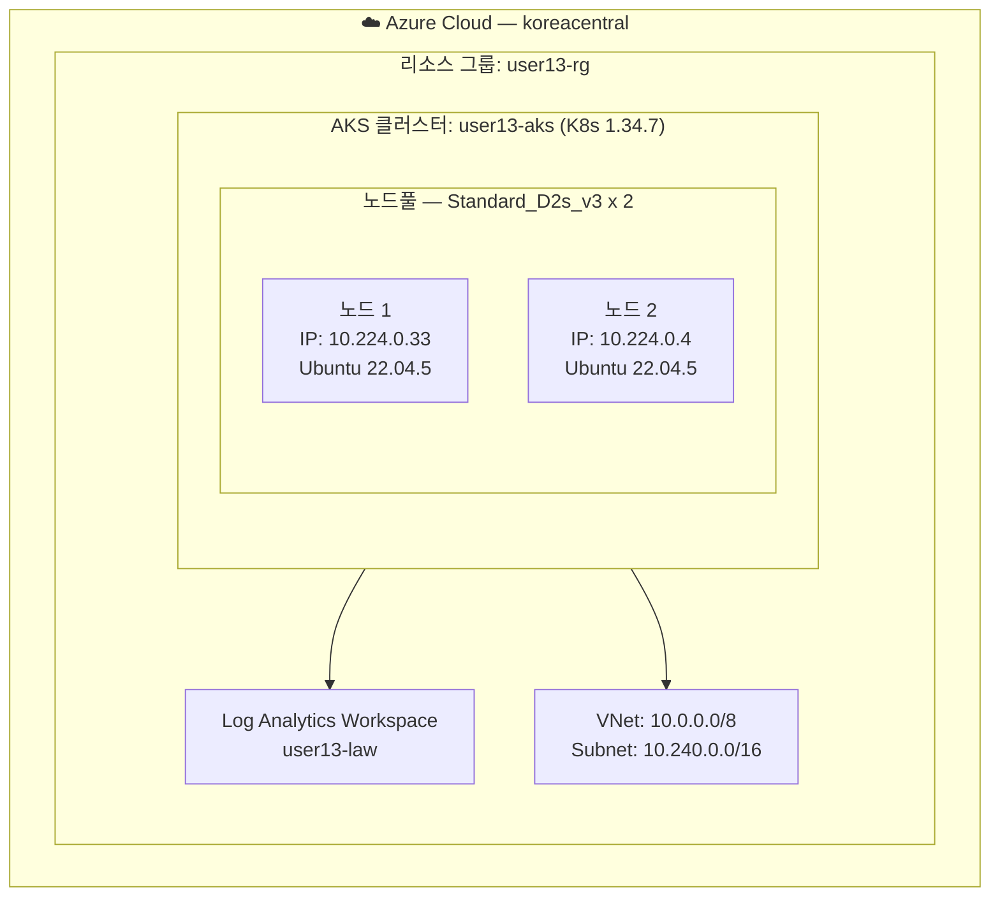

| 항목 | 값 |
|---|---|
| 클러스터 이름 | user13-aks |
| 리전 | koreacentral |
| Kubernetes 버전 | 1.34.7 |
| 노드 VM 크기 | Standard_D2s_v3 (2 vCPU, 8GB RAM) |
| 노드 운영체제 | Ubuntu 22.04.5 LTS |
| 컨테이너 런타임 | containerd 1.7.31-1 |
| 네트워크 플러그인 | Azure CNI |
| 네트워크 정책 | Azure Network Policy |
| ID 방식 | Managed Identity |
| Cluster Autoscaler | min 2 / max 4 |
| 모니터링 | Container Insights (ama-logs 3.3.0) |

> **실제 클러스터 네트워크 참고**: 실습 클러스터의 실제 노드 IP는 `10.224.0.x` 대역이며, 서비스 CIDR은 `10.0.0.0/16`, DNS Service IP는 `10.0.0.10`으로 확인되었습니다. 이는 아래 1.3절의 명령어에서 지정한 사용자 정의 VNet(Subnet `10.240.0.0/16`, 서비스 CIDR `172.20.0.0/16`)과 다릅니다. 실습 환경에서는 커스텀 VNet이 적용되지 않고 AKS가 내부적으로 기본 네트워크(`10.224.0.0/12`)를 자동 생성한 것으로 보입니다. 1.3절의 명령어는 프로덕션에 가까운 **권장 구성**을 기준으로 작성된 것입니다.

### 1.3 클러스터 배포 명령어

AKS 클러스터를 프로덕션에 가까운 환경으로 구성하려면 사전에 네트워킹 리소스와 모니터링 리소스를 준비해야 합니다. Azure CNI는 Pod가 VNet의 실제 IP를 직접 사용하는 방식이기 때문에, 클러스터 생성 전에 반드시 VNet과 Subnet을 먼저 만들어야 합니다.

```bash
# STEP 1. 리소스 그룹 생성
az group create \
  --name user13-rg \
  --location koreacentral

# STEP 2. Log Analytics Workspace 생성 (Container Insights 연동용)
az monitor log-analytics workspace create \
  --resource-group user13-rg \
  --workspace-name user13-law \
  --location koreacentral \
  --sku PerGB2018 \
  --retention-time 30

# STEP 3. VNet 및 Subnet 생성 (Azure CNI 필수 선행 작업)
az network vnet create \
  --resource-group user13-rg \
  --name user13-vnet \
  --location koreacentral \
  --address-prefixes 10.0.0.0/8

az network vnet subnet create \
  --resource-group user13-rg \
  --vnet-name user13-vnet \
  --name user13-subnet \
  --address-prefixes 10.240.0.0/16

# STEP 4. 환경 변수 설정
SUBNET_ID=$(az network vnet subnet show \
  --resource-group user13-rg \
  --vnet-name user13-vnet \
  --name user13-subnet \
  --query id --output tsv)

WORKSPACE_ID=$(az monitor log-analytics workspace show \
  --resource-group user13-rg \
  --workspace-name user13-law \
  --query id --output tsv)

# STEP 5. AKS 클러스터 생성
az aks create \
  --resource-group user13-rg \
  --name user13-aks \
  --location koreacentral \
  --nodepool-name mainpool \
  --node-count 2 \
  --node-vm-size Standard_D2s_v3 \
  --os-disk-size-gb 128 \
  --max-pods 50 \
  --enable-cluster-autoscaler \
  --min-count 2 \
  --max-count 4 \
  --enable-managed-identity \
  --generate-ssh-keys \
  --network-plugin azure \
  --network-policy azure \
  --vnet-subnet-id $SUBNET_ID \
  --service-cidr 172.20.0.0/16 \
  --dns-service-ip 172.20.0.10 \
  --load-balancer-sku standard \
  --zones 1 2 3 \
  --enable-addons monitoring \
  --workspace-resource-id $WORKSPACE_ID
```

> **노드풀 이름 제약**: AKS 노드풀 이름은 소문자와 숫자만 허용되며, 최대 12자, 하이픈(-) 사용이 불가합니다. 따라서 `user13-aks-pool`이 아닌 `mainpool`과 같은 형태를 사용해야 합니다.

### 1.4 클러스터 연결 및 자격증명

클러스터 생성 후에는 `kubectl`이 클러스터와 통신할 수 있도록 kubeconfig를 설정해야 합니다.

```bash
# 관리자 자격증명으로 연결 (실습 환경 권장)
az aks get-credentials \
  --resource-group user13-rg \
  --name user13-aks \
  --admin \
  --overwrite-existing

# 현재 활성 컨텍스트 확인
kubectl config current-context

# 노드 상태 확인
kubectl get nodes -o wide
```

`--admin` 플래그는 인증서 기반의 클러스터 관리자 권한을 부여합니다. 이는 Azure Active Directory(AAD) 인증을 우회하므로 실습 환경에서 가장 빠르게 접속할 수 있는 방법입니다. 반면 `--admin` 없이 실행하면 일반 사용자 자격증명이 사용되며, AAD 통합이 구성된 경우 `kubelogin`을 통한 추가 인증이 필요할 수 있습니다.

---

## 2. Kubernetes 핵심 리소스 이해

Kubernetes는 애플리케이션을 배포하고 관리하기 위한 다양한 리소스 종류(Kind)를 제공합니다. 이번 실습에서 다룬 핵심 리소스는 Namespace, Pod, Deployment 세 가지입니다.

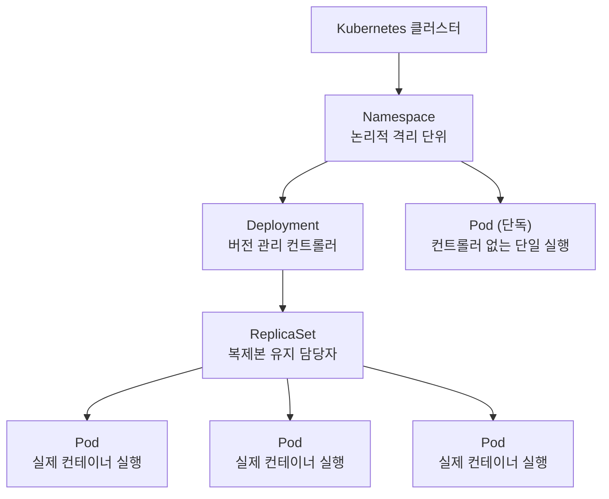

각 리소스는 서로 다른 역할과 책임을 가지며, 계층적으로 구성됩니다. Namespace는 클러스터 안에서 독립적인 논리적 공간을 제공하고, Deployment는 그 안에서 Pod를 안정적으로 운영하기 위한 고수준 컨트롤러 역할을 합니다.

---

## 3. Namespace — 논리적 환경 격리

### 3.1 Namespace의 개념

Namespace는 하나의 Kubernetes 클러스터를 여러 개의 가상 클러스터처럼 분할하는 메커니즘입니다. 물리적 분리가 아니라 논리적 분리이므로, 같은 노드 위에서 서로 다른 Namespace의 Pod가 동시에 실행될 수 있습니다. 그러나 Namespace 단위로 리소스 접근 제어(RBAC), 네트워크 정책, 리소스 쿼터를 적용할 수 있기 때문에, 개발/운영 환경 분리 또는 팀별 분리 등에 광범위하게 활용됩니다.

### 3.2 Namespace 생성 방법 — 명령형 vs 선언형

Kubernetes 리소스를 생성하는 방법에는 크게 두 가지가 있습니다. 명령형(Imperative) 방식은 `kubectl create`와 같은 명령어를 직접 실행하는 방식으로, 빠르고 간편합니다. 선언형(Declarative) 방식은 YAML 파일에 원하는 상태를 정의하고 `kubectl apply`로 적용하는 방식으로, 버전 관리와 자동화에 적합합니다. 실무에서는 반복 가능하고 추적 가능한 선언형 방식을 선호합니다.

```bash
# 명령형 방식 — kubectl create
kubectl create namespace ai-bot-dev

# 선언형 방식 — YAML 파일 작성 후 적용
# prod-ns.yaml
```

```yaml
# prod-ns.yaml
apiVersion: v1
kind: Namespace
metadata:
  name: ai-bot-prod
```

```bash
kubectl apply -f prod-ns.yaml

# 생성된 Namespace 확인
kubectl get namespace | grep ai-bot
```

### 3.3 기본 제공 Namespace

AKS 클러스터를 생성하면 기본적으로 여러 Namespace가 자동으로 생성됩니다.

| Namespace | 용도 |
|---|---|
| `default` | 명시적 Namespace 없이 생성된 리소스의 기본 위치 |
| `kube-system` | Kubernetes 시스템 컴포넌트 (CoreDNS, kube-proxy 등) |
| `kube-public` | 클러스터 공개 정보 저장 |
| `kube-node-lease` | 노드 Health Check용 Lease 오브젝트 저장 |
| `aks-command` | `az aks command invoke` 실행 시 임시 생성 |

---

## 4. Pod — 컨테이너의 최소 실행 단위

### 4.1 Pod의 개념

Pod는 Kubernetes에서 배포 가능한 가장 작은 단위입니다. 하나 이상의 컨테이너와 그 컨테이너들이 공유하는 네트워크 및 스토리지를 묶은 단위입니다. 같은 Pod 안의 컨테이너들은 `localhost`로 서로 통신할 수 있고, 동일한 파일시스템 볼륨을 공유할 수 있습니다.

Azure CNI 환경에서 각 Pod는 VNet 서브넷의 실제 IP 주소를 직접 할당받습니다. 실습 환경에서 확인한 것처럼 `10.224.0.x` 대역의 IP가 Pod에 직접 부여되었으며, 이는 네트워크 성능과 가시성 측면에서 이점을 제공합니다.

### 4.2 Pod YAML 기본 구조

```yaml
apiVersion: v1          # Kubernetes API 버전
kind: Pod               # 리소스 종류
metadata:
  name: my-pod          # Pod 이름 (클러스터 내 고유)
  namespace: ai-bot-dev # 배포할 Namespace
  labels:
    app: my-pod         # Pod를 식별하는 라벨 (Key=Value)
spec:
  containers:
  - name: my-container  # 컨테이너 이름
    image: nginx:1.25.3 # 사용할 컨테이너 이미지
    ports:
    - containerPort: 80 # 컨테이너가 수신할 포트
```

### 4.3 단독 Pod의 한계

단독 Pod는 컨트롤러 없이 직접 배포됩니다. 이 경우 Pod가 노드 장애나 OOM(Out of Memory) 등으로 종료되면 자동으로 재생성되지 않습니다. 또한 버전 업데이트나 스케일 조정도 수동으로만 가능합니다. 이러한 한계 때문에 실무에서는 단독 Pod 대신 Deployment를 사용하는 것이 일반적입니다.

---

## 5. Deployment — 핵심 메커니즘 완전 이해

### 5.1 흔한 오해와 실제 동작

많은 초보자들이 Deployment를 `kubectl apply`하면 Deployment가 직접 Pod를 만들어 낸다고 이해합니다. 그러나 이는 사실과 다릅니다. Deployment는 Pod를 직접 생성하지 않습니다. 대신 Deployment는 **ReplicaSet을 생성**하고, **ReplicaSet이 Pod를 생성**합니다.

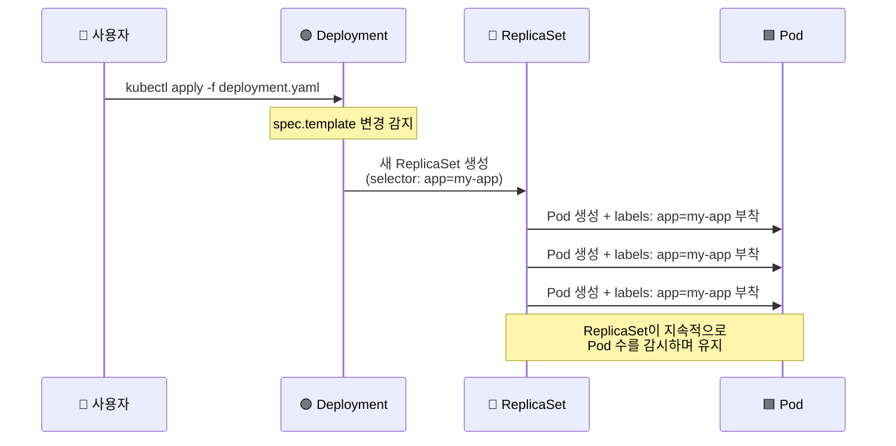

이 3계층 구조를 이해하는 것이 Deployment 메커니즘의 핵심입니다.

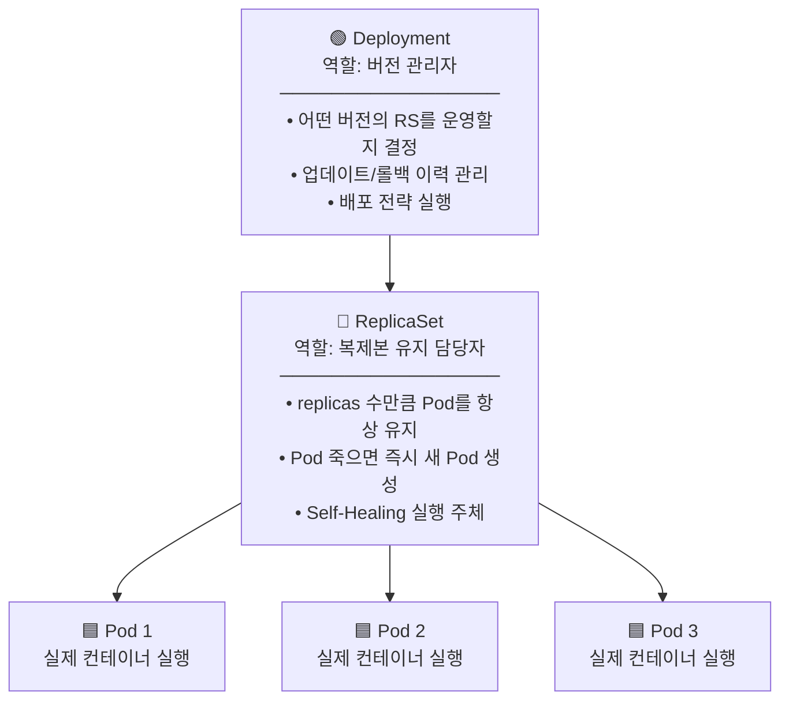

### 5.2 selector와 labels의 관계 — 가장 중요한 개념

Deployment(와 그 하위의 ReplicaSet)는 자신이 관리해야 할 Pod를 어떻게 식별할까요? 바로 **라벨(Label)** 을 통해서입니다. `spec.selector.matchLabels`에 선언된 라벨과 동일한 라벨을 가진 Pod만 해당 ReplicaSet의 관리 대상이 됩니다.

Pod를 생성할 때 `spec.template.metadata.labels`에 정의된 라벨이 각 Pod에 붙습니다. 따라서 두 값이 반드시 일치해야만 Deployment가 자신이 만든 Pod를 제대로 찾아서 관리할 수 있습니다.

```yaml
spec:
  selector:
    matchLabels:
      app: frontend    # ← "app=frontend 라벨의 Pod를 내가 관리한다"

  template:
    metadata:
      labels:
        app: frontend  # ← 생성되는 Pod에 붙는 라벨 (반드시 위와 일치)
    spec:
      containers:
      - name: frontend
        image: nginx:1.24-alpine
```

만약 두 값이 다르면 어떻게 될까요? Deployment가 `app=frontend` 라벨로 Pod를 찾으려 하지만, 실제 생성된 Pod에는 `app=other`라는 라벨이 붙어 있기 때문에 자신의 Pod를 찾지 못합니다. Kubernetes는 이를 사전에 차단하여 배포 즉시 에러를 반환합니다.

### 5.3 selector가 필요한 리소스들

이 `selector ↔ template.labels` 일치 규칙은 Deployment에만 국한되지 않습니다. Pod를 소유하고 관리하는 모든 컨트롤러에 동일하게 적용됩니다.

| 리소스 | selector 필요 여부 | 주요 용도 |
|---|---|---|
| Deployment | ✅ 필수 | Pod 버전 관리, 무중단 배포 |
| ReplicaSet | ✅ 필수 | Pod 복제본 수 유지 |
| StatefulSet | ✅ 필수 | 순서와 고유 ID가 필요한 Pod (DB 등) |
| DaemonSet | ✅ 필수 | 모든 노드에 1개씩 Pod 배포 (로그 수집 등) |
| Job | ✅ 필수 | 1회성 완료 작업 |
| CronJob | ✅ 필수 | 주기적 반복 작업 |
| Pod (단독) | ❌ 없음 | 컨트롤러 없이 직접 배포 |

### 5.4 Self-Healing — 자가 치유 메커니즘

ReplicaSet은 항상 선언된 `replicas` 수만큼 Pod가 Running 상태인지 지속적으로 감시합니다. Pod가 어떤 이유로든 종료되면 즉시 새 Pod를 생성하여 원하는 상태를 복원합니다. 이를 Self-Healing이라고 합니다.

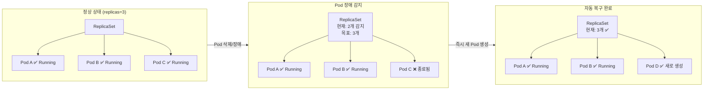

### 5.5 Deployment YAML 전체 구조 해설

```yaml
apiVersion: apps/v1              # Deployment는 apps/v1 API 그룹 사용
kind: Deployment
metadata:
  name: frontend-deploy          # Deployment 이름
  namespace: ai-bot-dev          # 배포할 Namespace
spec:
  replicas: 3                    # 유지할 Pod 복제본 수
  revisionHistoryLimit: 5        # 보관할 이전 버전(ReplicaSet) 수 (기본값: 10)

  strategy:
    type: RollingUpdate          # 배포 전략 (기본값: RollingUpdate)
    rollingUpdate:
      maxSurge: 1                # 업데이트 중 최대 추가 생성 Pod 수
      maxUnavailable: 0          # 업데이트 중 최대 허용 불가용 Pod 수

  selector:
    matchLabels:
      app: frontend              # 이 라벨을 가진 Pod를 관리

  template:                      # Pod 설계도
    metadata:
      labels:
        app: frontend            # selector.matchLabels와 반드시 일치
    spec:
      containers:
      - name: frontend
        image: nginx:1.24-alpine
        ports:
        - containerPort: 80
        resources:
          requests:              # 노드에서 보장받을 최소 자원
            cpu: "100m"          # 0.1 core (1000m = 1 core)
            memory: "128Mi"
          limits:                # 초과 불가 최대 자원
            cpu: "200m"
            memory: "256Mi"
        env:
        - name: APP_ENV
          value: "development"
```

`spec` 하위의 주요 필드를 정리하면 다음과 같습니다.

- **replicas**: ReplicaSet에게 "이 수만큼 Pod를 항상 유지하라"고 지시하는 값입니다.
- **selector.matchLabels**: Deployment가 관리할 Pod를 식별하는 라벨 기준입니다.
- **strategy**: Pod 교체 방식을 정의합니다. RollingUpdate(기본값)는 무중단으로 하나씩 교체하고, Recreate는 전체를 삭제 후 재생성합니다.
- **revisionHistoryLimit**: 롤백을 위해 보관할 이전 ReplicaSet(Revision)의 수를 제한합니다. 기본값은 10이며, 이 수를 넘으면 가장 오래된 Revision부터 자동 삭제됩니다.
- **template**: 생성될 Pod의 설계도입니다. metadata의 labels는 selector와 반드시 일치해야 하며, spec.containers에 실제 컨테이너 설정이 위치합니다.
- **resources.requests**: Azure AKS의 Cluster Autoscaler는 이 값을 기준으로 현재 노드에서 Pod를 수용할 수 있는지 판단하고, 부족할 경우 새 노드를 추가합니다.

---

## 6. 무중단 배포 전략 — Rolling Update vs Recreate

### 6.1 두 전략의 근본적 차이

Kubernetes Deployment는 새로운 버전의 애플리케이션을 배포할 때 기존 Pod를 어떻게 교체할지 전략을 선택할 수 있습니다. 기본값인 Rolling Update는 서비스 가용성을 최우선으로 하며, Recreate는 상태 일관성을 더 중시합니다.

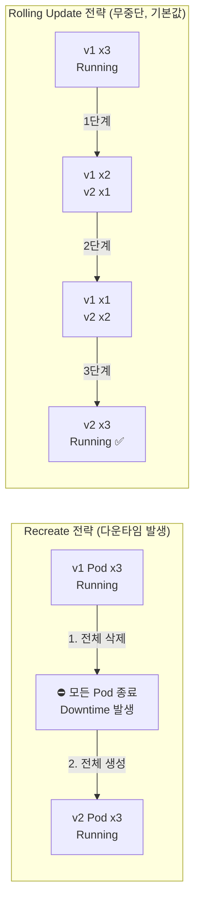

### 6.2 Rolling Update 세부 동작

Rolling Update가 실행될 때 Kubernetes 내부에서는 다음과 같은 일이 순서대로 발생합니다.

첫째, Deployment 컨트롤러가 `spec.template`의 변경을 감지합니다. 이미지 변경, 환경변수 변경 등 Pod 템플릿이 변경되면 롤아웃이 시작됩니다.

둘째, 새로운 이미지를 기반으로 한 신규 ReplicaSet이 생성됩니다. 이 시점에서 구버전 ReplicaSet(RS1)과 신버전 ReplicaSet(RS2)이 동시에 존재하게 됩니다.

셋째, `maxSurge`와 `maxUnavailable` 설정에 따라 신버전 Pod를 하나씩 늘리고 구버전 Pod를 하나씩 줄입니다. 새 Pod가 Readiness 검사를 통과해야만 다음 단계로 진행됩니다.

넷째, 구버전 ReplicaSet의 replicas가 0이 되면 롤아웃이 완료됩니다. 구버전 ReplicaSet은 삭제되지 않고 `replicas=0` 상태로 보존됩니다. 이것이 나중에 롤백의 기반이 됩니다.

```
maxSurge: 1      → 업데이트 중 최대 1개의 Pod를 추가로 생성할 수 있음
                   (replicas=3이면 최대 4개 Pod가 동시에 존재 가능)
maxUnavailable: 0 → 업데이트 중 서비스 불가 Pod가 0개여야 함
                   (항상 3개의 Running Pod 유지 보장)
```

### 6.3 Rolling Update 모니터링

```bash
# 업데이트 진행 상황 실시간 모니터링
kubectl rollout status deployment frontend-deploy -n ai-bot-dev

# 출력 예시:
# Waiting for deployment "frontend-deploy" rollout to finish:
#   1 out of 3 new replicas have been updated...
# Waiting for deployment "frontend-deploy" rollout to finish:
#   2 out of 3 new replicas have been updated...
# deployment "frontend-deploy" successfully rolled out

# 이미지 버전 확인
kubectl get pods -n ai-bot-dev \
  -o jsonpath='{range .items[*]}{.metadata.name}{"\t"}{.spec.containers[0].image}{"\n"}{end}'
```

### 6.4 어떤 전략을 선택해야 하는가

실무에서는 대부분 기본값인 Rolling Update를 사용합니다. Recreate가 적합한 경우는 새 버전과 구버전이 동시에 실행될 경우 데이터 호환성 문제가 발생하는 상황(예: 데이터베이스 스키마 변경이 동반된 배포)에 한정됩니다. Azure AKS 환경에서 Rolling Update 진행 중에는 Standard Load Balancer가 Readiness 검사를 통과한 새 Pod에만 트래픽을 라우팅하므로, 사용자는 배포 중에도 정상적인 서비스를 경험할 수 있습니다.

---

## 7. 버전 이력 관리와 롤백

### 7.1 Revision이란 무엇인가

Deployment는 `spec.template`이 변경될 때마다 그 시점의 상태를 스냅샷으로 저장합니다. 이 스냅샷을 **Revision**이라고 하며, 실체는 `replicas=0`이 된 채로 클러스터에 보관된 구버전 ReplicaSet입니다. 롤백은 이 보관된 ReplicaSet의 replicas를 다시 늘리는 방식으로 동작합니다. 즉, 새로운 Pod를 처음부터 만드는 것이 아니라 이미 정의되어 있는 구버전 ReplicaSet을 재활성화하는 것입니다.

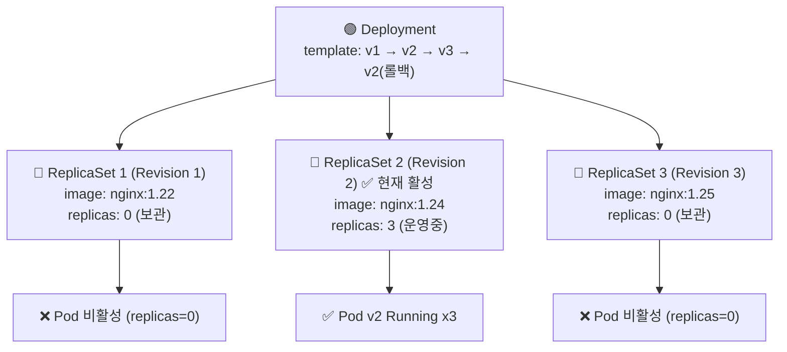

### 7.2 Revision 생성 조건

Revision은 `spec.template` 내부의 어떠한 값이라도 변경될 때 새로 생성됩니다. 반면 `spec.replicas`만 변경하는 경우(스케일 업/다운)는 동일한 ReplicaSet 안에서 처리되므로 새 Revision이 생성되지 않습니다.

| 변경 내용 | Revision 생성 여부 |
|---|---|
| 컨테이너 이미지 변경 | ✅ 새 Revision 생성 |
| 환경변수(env) 변경 | ✅ 새 Revision 생성 |
| resource limits 변경 | ✅ 새 Revision 생성 |
| 컨테이너 명령어(command) 변경 | ✅ 새 Revision 생성 |
| replicas 수 변경 | ❌ Revision 생성 안 됨 |

### 7.3 배포 이력 조회 및 롤백 명령어

```bash
# 배포 이력 전체 조회
kubectl rollout history deployment frontend-deploy -n ai-bot-dev

# 출력 예시:
# REVISION  CHANGE-CAUSE
# 1         <none>
# 2         <none>
# 3         <none>

# 특정 Revision 상세 내용 확인
kubectl rollout history deployment frontend-deploy \
  -n ai-bot-dev --revision=2

# 바로 이전 버전으로 롤백
kubectl rollout undo deployment frontend-deploy -n ai-bot-dev

# 특정 Revision으로 롤백
kubectl rollout undo deployment frontend-deploy \
  -n ai-bot-dev --to-revision=1

# CHANGE-CAUSE 기록 (배포 이력 가독성 향상)
kubectl annotate deployment frontend-deploy \
  kubernetes.io/change-cause="nginx 1.25-alpine 보안 패치 적용" \
  -n ai-bot-dev
```

### 7.4 롤백 시 주의 사항

롤백을 실행하면 Revision 번호는 재사용되지 않습니다. Revision 2로 롤백하더라도 기존 Revision 2가 재활성화되는 것은 맞지만, 이력에는 새로운 Revision 번호(예: 4)로 기록됩니다. Revision 번호는 항상 단방향으로 증가합니다.

또한 `revisionHistoryLimit`에 설정된 수를 초과한 오래된 Revision은 자동으로 삭제됩니다. 기본값인 10을 사용하면 최근 10개의 Revision만 유지되므로, 10개 이상 이전 버전으로의 롤백은 불가능합니다. 따라서 운영 환경에서는 이 값을 적절히 설정하고, 중요한 배포에는 반드시 CHANGE-CAUSE를 기록해 두는 것이 좋습니다.

---

## 8. Scale — Pod 수 동적 조정

### 8.1 Scale의 개념

Scale은 Deployment 또는 ReplicaSet의 `replicas` 값을 변경하여 실행 중인 Pod 수를 늘리거나 줄이는 작업입니다. 트래픽 증가에 대응하여 Pod 수를 늘리는 것을 Scale-Out(수평 확장), 줄이는 것을 Scale-In이라고 합니다.

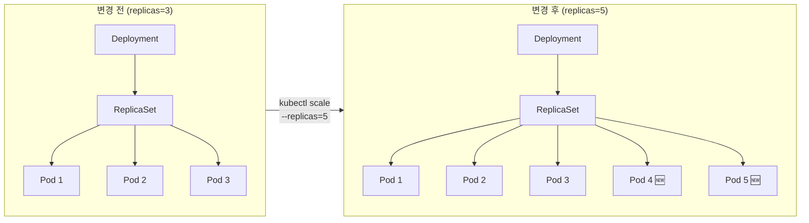

### 8.2 Scale 명령어

```bash
# 명령형 방식 — 즉시 반영
kubectl scale deployment frontend-deploy \
  --replicas=5 \
  -n ai-bot-dev

# 선언형 방식 — YAML 수정 후 적용
# frontend-deploy.yaml에서 replicas: 5로 수정 후
kubectl apply -f frontend-deploy.yaml

# ReplicaSet 직접 스케일 (비권장 — Deployment가 덮어씀)
kubectl scale replicaset <rs-name> --replicas=5 -n ai-bot-dev

# 스케일 결과 확인
kubectl get pods -n ai-bot-dev
kubectl get deployment frontend-deploy -n ai-bot-dev
```

### 8.3 Cluster Autoscaler와의 연동

실습 환경의 AKS 클러스터에는 Cluster Autoscaler가 min=2, max=4로 설정되어 있습니다. Pod를 Scale-Out할 때 현재 노드의 리소스(CPU/Memory requests 기준)가 부족하면, Cluster Autoscaler가 자동으로 새 노드를 Azure에 요청하여 추가합니다. 반대로 Pod가 줄어들어 특정 노드가 일정 시간 동안 충분히 활용되지 않으면, 해당 노드를 제거하여 비용을 절감합니다.

---

## 9. 쿠버네티스 3대 배포 에러와 트러블슈팅

### 9.1 에러 개요

Kubernetes에서 Pod 배포 시 가장 자주 발생하는 에러는 크게 세 가지입니다. 각 에러는 발생 원인과 해결 방법이 명확히 다르므로, 에러 상태만 보고도 어느 정도 원인을 추론할 수 있어야 합니다.

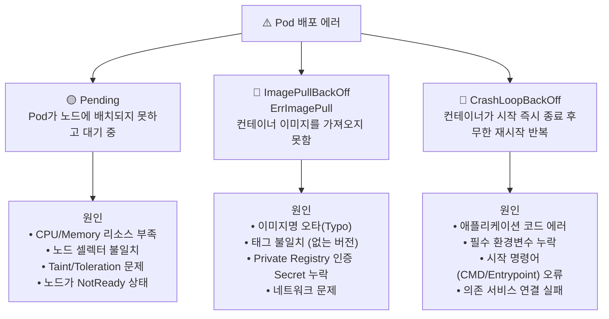

### 9.2 Pending — 노드에 배치되지 못한 경우

Pending 상태는 Pod가 생성 요청을 받았지만 실제로 어떤 노드에도 배치(Schedule)되지 못한 상태입니다. `kubectl describe pod`의 Events 섹션에서 `FailedScheduling` 메시지를 통해 구체적인 원인을 확인할 수 있습니다.

**샘플 에러 상황**

```
Events:
  Type     Reason            Age   From               Message
  ----     ------            ----  ----               -------
  Warning  FailedScheduling  30s   default-scheduler  0/2 nodes are available:
                                                      2 Insufficient cpu.
```

이 메시지는 2개의 노드 모두 CPU가 부족하여 Pod를 배치할 수 없다는 의미입니다. 실습 환경의 Standard_D2s_v3 노드는 2 vCPU를 제공하는데, `resources.requests.cpu: 4000m`처럼 노드 전체 CPU를 초과하는 요청을 하면 이 에러가 발생합니다.

**해결 방법**

```bash
# 노드 리소스 현황 확인
kubectl describe nodes | grep -A 5 "Allocated resources"

# requests 값을 노드 용량 이하로 수정
# (Standard_D2s_v3 기준: cpu 최대 1800m 권장)
kubectl set resources deployment frontend-deploy \
  --requests=cpu=100m,memory=128Mi \
  --limits=cpu=200m,memory=256Mi \
  -n ai-bot-dev
```

### 9.3 ImagePullBackOff / ErrImagePull — 이미지를 가져오지 못한 경우

이미지 풀 에러는 컨테이너 런타임(containerd)이 지정된 이미지를 레지스트리에서 내려받지 못할 때 발생합니다. `ErrImagePull`이 먼저 발생하고, 재시도가 반복되면 `ImagePullBackOff`로 전환됩니다.

**샘플 에러 상황** (이미지명 오타: `nginx:1.25-alpne`)

```
Events:
  Warning  Failed  2m (x3)   kubelet  Failed to pull image "nginx:1.25-alpne":
                                       not found
  Warning  Failed  90s (x4)  kubelet  Error: ImagePullBackOff
```

오타 하나(`alpine` → `alpne`)로 인해 Docker Hub에 존재하지 않는 이미지를 요청하게 됩니다.

**해결 방법**

```bash
# 이미지명 수정 후 즉시 적용
kubectl set image deployment frontend-deploy \
  frontend=nginx:1.25-alpine \
  -n ai-bot-dev
```

### 9.4 CrashLoopBackOff — 컨테이너가 시작 즉시 죽는 경우

CrashLoopBackOff는 컨테이너가 시작은 되지만 즉시 종료되고, Kubernetes가 이를 반복적으로 재시작하는 상태입니다. 재시작 횟수가 늘어날수록 대기 시간이 기하급수적으로 증가합니다(10초 → 20초 → 40초 → ... 최대 5분). 이전 실행의 로그를 보려면 `--previous` 플래그가 필요합니다.

**샘플 에러 상황** (필수 환경변수 누락)

```
[2026-06-08 05:14:01] ERROR Environment variable DATABASE_URL is not set.
[2026-06-08 05:14:01] ERROR Environment variable REDIS_HOST is not set.
[2026-06-08 05:14:01] FATAL Cannot connect to required services. Exiting.
```

**해결 방법**

```bash
# 이전 컨테이너 로그 확인 (CrashLoopBackOff 시 필수)
kubectl logs <pod-name> -n ai-bot-dev --previous

# 환경변수 추가 후 재배포
kubectl set env deployment bot-api \
  DATABASE_URL=postgresql://db:5432/chatbot \
  REDIS_HOST=redis-service \
  -n ai-bot-dev
```

### 9.5 트러블슈팅 기본 명령어 흐름

```bash
# 1. 전체 Pod 상태 확인
kubectl get pods -A | grep -v Running

# 2. 특정 Pod 상세 이벤트 확인
kubectl describe pod <pod-name> -n <namespace>

# 3. 컨테이너 로그 확인
kubectl logs <pod-name> -n <namespace>

# 4. 이전 컨테이너 로그 확인 (CrashLoopBackOff 시)
kubectl logs <pod-name> -n <namespace> --previous

# 5. ReplicaSet 상태 확인
kubectl get replicaset -n <namespace>

# 6. Deployment 상태 확인
kubectl describe deployment <deploy-name> -n <namespace>
```

---

## 10. AIOps — AI 기반 운영 패러다임

### 10.1 기존 트러블슈팅의 한계

전통적인 Kubernetes 트러블슈팅은 엔지니어가 여러 kubectl 명령어를 수동으로 실행하고, 긴 텍스트 로그를 직접 해석하며, 구글이나 StackOverflow 검색을 통해 해결책을 찾는 과정을 반복합니다. 이 방식은 경험이 풍부한 엔지니어에게도 시간이 많이 소요되고, 신입 엔지니어에게는 진입 장벽이 높습니다.

### 10.2 AI Workflow의 등장

AIOps(Artificial Intelligence for IT Operations)는 AI가 운영 데이터를 분석하여 장애 원인을 자동으로 탐지하고 해결책을 제안하는 방식입니다. Microsoft는 Azure Monitor에 이상 탐지, 용량 예측, 자동 알림 등의 AIOps 기능을 내장하고 있으며, Microsoft Copilot for Azure를 통해 클러스터 상태 조회나 모니터링 관련 작업을 자연어로 보조하는 기능을 제공하고 있습니다.

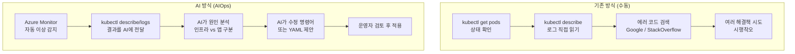

### 10.3 트러블슈팅 3단계 프로세스

AIOps 기반 트러블슈팅은 Detect(감지) → Diagnose(진단) → Resolve(해결)의 3단계로 구성됩니다.

**1단계: Detect (감지)**  
`kubectl get pods`를 통해 NotReady, Error, CrashLoopBackOff 등 비정상 Pod를 식별하거나, Azure Monitor의 알림을 통해 자동으로 장애를 감지합니다.

**2단계: Diagnose (진단 — AI 활용)**  
`kubectl describe`와 `kubectl logs`의 결과를 AI에게 전달합니다. AI는 이 텍스트를 분석하여 에러의 근본 원인이 인프라 문제(리소스 부족, 네트워크 설정 오류)인지, 애플리케이션 문제(코드 에러, 환경변수 누락)인지 구분하고 설명합니다. Azure Monitor의 Log Analytics 쿼리 결과를 함께 첨부하면 더욱 정확한 분석이 가능합니다.

**3단계: Resolve (해결 — AI 활용)**  
AI에게 "이 문제를 해결하는 kubectl 명령어를 만들어줘" 또는 "수정된 YAML을 작성해줘"라고 요청합니다. AI가 제안한 해결책을 운영자가 검토한 후 실제 클러스터에 적용합니다. 보안, 권한, 리소스 영향을 반드시 검토하는 것이 중요합니다.

---

## 11. Azure Monitor와 Container Insights 연동

### 11.1 Container Insights란

Container Insights는 Azure Monitor의 컨테이너 모니터링 기능으로, AKS 클러스터의 성능 및 상태 데이터를 수집하여 Log Analytics Workspace에 저장합니다. 실습 환경에서 `ama-logs` DaemonSet(Azure Monitor Agent)이 각 노드에 배포되어 정상 실행 중임을 확인했습니다.

```bash
# Container Insights 에이전트 확인
kubectl get daemonset ama-logs -n kube-system

# 출력:
# NAME       DESIRED   CURRENT   READY
# ama-logs   2         2         2
```

### 11.2 수집 데이터의 종류

Container Insights는 다음과 같은 데이터를 자동으로 수집합니다.

- **컨테이너 로그**: stdout/stderr로 출력되는 애플리케이션 로그
- **성능 메트릭**: CPU 사용률, 메모리 사용률, 네트워크 I/O
- **노드 상태**: 각 노드의 조건(Condition)과 리소스 사용률
- **Pod/컨테이너 인벤토리**: 실행 중인 Pod와 컨테이너 목록

### 11.3 Azure Monitor의 AIOps 기능

Azure Monitor는 수집된 데이터를 기반으로 다음과 같은 AIOps 기능을 제공합니다.

- **이상 탐지(Anomaly Detection)**: 정상 패턴에서 벗어나는 메트릭을 자동으로 감지
- **용량 예측**: 현재 추세를 분석하여 리소스 부족 시점을 예측
- **자동 알림**: 임계값 초과 또는 이상 탐지 시 이메일, Slack 등으로 알림 발송
- **Log Analytics 쿼리(KQL)**: Kusto Query Language로 수집된 로그를 고급 분석

---

## 12. Claude Code 프롬프트 활용 가이드

### 12.1 Claude Code란

Claude Code는 Anthropic이 제공하는 명령행(CLI) 기반 AI 코딩 도구로, 터미널에서 자연어로 복잡한 개발 및 운영 작업을 처리할 수 있습니다. Kubernetes 운영에 Claude Code를 활용하면 YAML 작성, 트러블슈팅 분석, 명령어 생성 등을 빠르게 수행할 수 있습니다.

### 12.2 초기 구축 프롬프트

```
아래 조건으로 Azure AKS에 배포할 Deployment YAML을 생성해줘.

- Deployment 이름: frontend-deploy
- Namespace: ai-bot-dev
- 이미지: nginx:1.24-alpine
- Replicas: 3
- 배포 전략: RollingUpdate (maxSurge: 1, maxUnavailable: 0)
- revisionHistoryLimit: 5
- 라벨: app=frontend, env=dev
- containerPort: 80
- resources:
    requests: cpu 100m, memory 128Mi
    limits: cpu 200m, memory 256Mi

파일명 frontend-deploy.yaml로 저장하고,
kubectl apply 명령어까지 실행해줘.
```

### 12.3 트러블슈팅 프롬프트 — Pending

```
아래 Pod가 Pending 상태야. describe 결과를 분석하고
Azure AKS 노드 리소스 부족인지, 스케줄링 문제인지
원인 파악 후 해결책을 제시해줘.

[클러스터 정보]
- 클러스터: user13-aks (koreacentral)
- 노드 VM: Standard_D2s_v3 (2 vCPU, 8GB RAM) x 2

[kubectl describe pod 결과]
Name:             frontend-deploy-7d9f8b6c4-xk2pq
Namespace:        ai-bot-dev
Status:           Pending
...
Events:
  Warning  FailedScheduling  30s  default-scheduler
           0/2 nodes are available: 2 Insufficient cpu.
```

### 12.4 트러블슈팅 프롬프트 — ImagePullBackOff

```
아래 Pod가 ImagePullBackOff야.
이미지명 오타, 태그 불일치, Private Registry 인증 문제 중
무엇이 원인인지 분석하고 수정 방법을 알려줘.

[kubectl describe pod 결과]
Name:             frontend-deploy-8c7d9f4b2-mn3lp
Namespace:        ai-bot-dev
...
Containers:
  frontend:
    Image: nginx:1.25-alpne
    State: Waiting
      Reason: ImagePullBackOff
...
Events:
  Warning  Failed  2m (x3)  kubelet
           Failed to pull image "nginx:1.25-alpne": not found
  Warning  Failed  90s (x4) kubelet  Error: ImagePullBackOff
```

### 12.5 트러블슈팅 프롬프트 — CrashLoopBackOff

```
아래 Pod가 CrashLoopBackOff 상태야.
describe 결과와 logs 결과를 함께 분석하여
원인을 파악하고 수정된 YAML을 제안해줘.

[kubectl describe pod 결과]
Name:             bot-api-6f8b9d4c7-pq5rt
Namespace:        ai-bot-dev
...
    State: Waiting
      Reason: CrashLoopBackOff
    Last State: Terminated
      Exit Code: 1
    Restart Count: 6

[kubectl logs --previous 결과]
[2026-06-08 05:14:01] ERROR Environment variable DATABASE_URL is not set.
[2026-06-08 05:14:01] ERROR Environment variable REDIS_HOST is not set.
[2026-06-08 05:14:01] FATAL Cannot connect to required services. Exiting.
```

### 12.6 Rolling Update 및 롤백 프롬프트

```
ai-bot-dev 네임스페이스의 frontend-deploy를
nginx:1.24-alpine에서 nginx:1.25-alpine으로
무중단 Rolling Update 해줘.

완료 후:
1. kubectl rollout status로 진행 상황 모니터링
2. Pod들이 새 이미지를 사용하는지 확인
3. Revision 이력 출력

위 순서대로 명령어를 실행해줘.
```

```
ai-bot-dev 네임스페이스의 frontend-deploy에서
배포 이후 에러가 발생했어.

1. 배포 이력(Revision) 전체 출력
2. 각 Revision의 이미지 버전 확인
3. 바로 이전 버전으로 즉시 롤백
4. 롤백 완료 후 현재 이미지 버전 확인

위 순서대로 실행해줘.
```

### 12.7 효과적인 프롬프트 작성 원칙

AI에게 Kubernetes 운영 작업을 요청할 때 다음 정보를 함께 제공하면 더욱 정확하고 실행 가능한 답변을 얻을 수 있습니다.

| 포함 정보 | 필요한 이유 |
|---|---|
| 클러스터 이름 및 리전 | Azure AKS 환경 특성 반영 |
| 노드 VM 크기 | 리소스 제약 조건 파악 |
| Namespace 명시 | 잘못된 Namespace 적용 방지 |
| kubectl 출력 결과 전체 첨부 | AI의 정확한 원인 분석 가능 |
| 원하는 결과 명시 | 불필요한 추가 질문 방지 |
| 실행 순서 지정 | 단계별 검증 가능 |

---

## 13. 실습 트러블슈팅 사례 — kubectl set image 컨테이너명 오류

### 13.1 발생한 오류

Rolling Update를 위해 아래 명령어를 실행했을 때 에러가 발생했습니다.

```bash
kubectl set image deployment/frontend-deploy \
  -n ai-bot-dev \
  frontend-deploy=nginx:1.25-alpine

# 오류 메시지
# error: unable to find container named "frontend-deploy"
```

### 13.2 원인 분석

`kubectl set image`의 문법은 다음과 같습니다.

```
kubectl set image deployment/<Deployment명> <컨테이너명>=<새이미지> -n <namespace>
```

여기서 핵심은 `<컨테이너명>`이 **Deployment 이름이 아니라 YAML의 `spec.template.spec.containers[].name`** 값이라는 점입니다. 이번 실습에서 Deployment 이름(`frontend-deploy`)을 컨테이너 이름으로 잘못 사용한 것이 원인이었습니다.

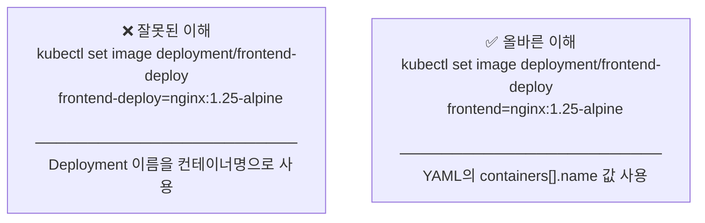

### 13.3 컨테이너 이름 확인 방법

실행 전에 반드시 컨테이너 이름을 먼저 확인하는 습관을 들이는 것이 좋습니다.

```bash
# 컨테이너 이름 확인
kubectl get deployment frontend-deploy -n ai-bot-dev \
  -o jsonpath='{.spec.template.spec.containers[*].name}'

# 출력: frontend  ← 이 값이 컨테이너 이름
```

### 13.4 올바른 명령어 및 실행 결과

```bash
# 올바른 명령어 (컨테이너명: frontend)
kubectl set image deployment/frontend-deploy \
  -n ai-bot-dev \
  frontend=nginx:1.25-alpine

# 정상 출력
# deployment.apps/frontend-deploy image updated
```

Rolling Update 완료 후 모든 Pod가 새 이미지로 교체된 것을 확인했습니다.

```bash
kubectl rollout status deployment/frontend-deploy -n ai-bot-dev
# deployment "frontend-deploy" successfully rolled out

kubectl get pods -n ai-bot-dev -l app=frontend \
  -o jsonpath='{range .items[*]}{.metadata.name}{"\t"}{range .spec.containers[*]}{.name}{"="}{.image}{"\n"}{end}{end}'

# frontend-deploy-86bd99fdc4-2v62f   frontend=nginx:1.25-alpine
# frontend-deploy-86bd99fdc4-b5pd4   frontend=nginx:1.25-alpine
# frontend-deploy-86bd99fdc4-b9jpx   frontend=nginx:1.25-alpine
# frontend-deploy-86bd99fdc4-hh7q2   frontend=nginx:1.25-alpine
# frontend-deploy-86bd99fdc4-thbjf   frontend=nginx:1.25-alpine
```

### 13.5 추가로 발견된 실수 — Namespace 누락

같은 실습 과정에서 `-n ai-bot-dev`를 생략한 채 명령어를 실행하면 `default` Namespace에서 리소스를 찾기 때문에 `NotFound` 에러가 발생합니다.

```bash
# ❌ Namespace 미지정 → default 네임스페이스에서 탐색 → NotFound
kubectl get deployment frontend-deploy
# Error from server (NotFound): deployments.apps "frontend-deploy" not found

# ✅ Namespace 명시 → 정상 조회
kubectl get deployment frontend-deploy -n ai-bot-dev
# NAME              READY   UP-TO-DATE   AVAILABLE   AGE
# frontend-deploy   5/5     5            5           11m
```

### 13.6 실수 방지를 위한 체크리스트

| 확인 항목 | 확인 방법 |
|---|---|
| 컨테이너 이름 확인 | `kubectl get deployment <name> -n <ns> -o jsonpath='{.spec.template.spec.containers[*].name}'` |
| Namespace 확인 | `kubectl get deployment -A` (전체 Namespace 조회) |
| 현재 컨텍스트 확인 | `kubectl config current-context` |
| 명령어 실행 전 dry-run | `kubectl set image ... --dry-run=client` |

---

*본 문서는 Azure AKS 1.34.7 (koreacentral, 2026년 6월) 환경의 실제 실습을 기반으로 작성되었습니다.*  
*Azure AKS 공식 릴리스 노트: https://github.com/Azure/AKS/releases*  
*Azure Monitor AIOps 공식 문서: https://learn.microsoft.com/azure/azure-monitor/aiops/aiops-machine-learning*

---

## 부록 — kubectl 명령어 완전 참조

### A. 컨텍스트 및 클러스터 관리

```bash
# 현재 활성 컨텍스트 확인
kubectl config current-context

# 전체 컨텍스트 목록 조회
kubectl config get-contexts

# 컨텍스트 전환
kubectl config use-context <context-name>

# AKS 자격증명 등록 (일반 사용자)
az aks get-credentials --resource-group user13-rg --name user13-aks --overwrite-existing

# AKS 자격증명 등록 (관리자 — 실습 환경 권장)
az aks get-credentials --resource-group user13-rg --name user13-aks --admin --overwrite-existing

# 클러스터 기본 정보 확인
az aks show --resource-group user13-rg --name user13-aks --output table
```

---

### B. Namespace 명령어

```bash
# Namespace 전체 목록 조회
kubectl get namespace

# Namespace 생성 (명령형)
kubectl create namespace <name>

# Namespace 생성 (선언형)
kubectl apply -f <namespace>.yaml

# Namespace 상세 정보 확인
kubectl describe namespace <name>

# Namespace 삭제 (포함된 모든 리소스 함께 삭제)
kubectl delete namespace <name>

# 특정 Namespace를 기본값으로 설정 (매번 -n 생략 가능)
kubectl config set-context --current --namespace=<name>
```

---

### C. Pod 조회 및 상태 확인

```bash
# 전체 Namespace의 Pod 조회
kubectl get pods -A

# 특정 Namespace의 Pod 조회
kubectl get pods -n <namespace>

# 라벨 포함 조회
kubectl get pods -n <namespace> --show-labels

# 넓은 출력 (노드, IP 포함)
kubectl get pods -n <namespace> -o wide

# 실시간 상태 감시
kubectl get pods -n <namespace> -w

# 특정 라벨로 필터링
kubectl get pods -n <namespace> -l app=frontend

# Pod의 컨테이너 이미지 확인
kubectl get pods -n <namespace> \
  -o jsonpath='{range .items[*]}{.metadata.name}{"\t"}{range .spec.containers[*]}{.name}{"="}{.image}{"\n"}{end}{end}'

# 비정상 Pod만 필터링
kubectl get pods -A | grep -v Running | grep -v Completed
```

---

### D. Pod 상세 정보 및 로그

```bash
# Pod 상세 정보 및 이벤트 확인 (트러블슈팅 핵심)
kubectl describe pod <pod-name> -n <namespace>

# 컨테이너 로그 확인
kubectl logs <pod-name> -n <namespace>

# 특정 컨테이너 로그 (멀티 컨테이너 Pod)
kubectl logs <pod-name> -c <container-name> -n <namespace>

# 이전 컨테이너 로그 (CrashLoopBackOff 시 필수)
kubectl logs <pod-name> -n <namespace> --previous

# 실시간 로그 스트리밍
kubectl logs <pod-name> -n <namespace> -f

# 최근 100줄만 출력
kubectl logs <pod-name> -n <namespace> --tail=100

# Pod 내부 셸 접속
kubectl exec -it <pod-name> -n <namespace> -- /bin/sh

# 특정 컨테이너로 접속 (멀티 컨테이너)
kubectl exec -it <pod-name> -c <container-name> -n <namespace> -- /bin/bash

# Pod에서 단일 명령 실행
kubectl exec <pod-name> -n <namespace> -- env
```

---

### E. Deployment 관리

```bash
# Deployment 조회
kubectl get deployment -n <namespace>
kubectl get deployment -n <namespace> -o wide
kubectl get deployment -A

# Deployment 상세 정보
kubectl describe deployment <name> -n <namespace>

# YAML로 Deployment 생성/수정
kubectl apply -f <filename>.yaml

# 컨테이너 이름 확인 (set image 전 필수 확인)
kubectl get deployment <name> -n <namespace> \
  -o jsonpath='{.spec.template.spec.containers[*].name}'

# 이미지 업데이트 (Rolling Update 트리거)
kubectl set image deployment/<name> <container-name>=<new-image> -n <namespace>

# 이미지 업데이트 dry-run (실제 적용 전 검증)
kubectl set image deployment/<name> <container-name>=<new-image> \
  -n <namespace> --dry-run=client

# 환경변수 추가/수정
kubectl set env deployment <name> KEY=VALUE -n <namespace>

# 환경변수 조회
kubectl set env deployment <name> --list -n <namespace>

# resource limits 수정
kubectl set resources deployment <name> \
  --requests=cpu=100m,memory=128Mi \
  --limits=cpu=200m,memory=256Mi \
  -n <namespace>

# Deployment 삭제
kubectl delete deployment <name> -n <namespace>

# YAML 형태로 현재 상태 출력 (백업용)
kubectl get deployment <name> -n <namespace> -o yaml > backup.yaml
```

---

### F. Rolling Update 및 롤백

```bash
# 롤아웃 진행 상태 실시간 모니터링
kubectl rollout status deployment/<name> -n <namespace>

# 배포 이력(Revision) 전체 조회
kubectl rollout history deployment/<name> -n <namespace>

# 특정 Revision 상세 내용 확인
kubectl rollout history deployment/<name> -n <namespace> --revision=<n>

# 바로 이전 버전으로 롤백
kubectl rollout undo deployment/<name> -n <namespace>

# 특정 Revision으로 롤백
kubectl rollout undo deployment/<name> -n <namespace> --to-revision=<n>

# 롤아웃 일시 정지 (단계적 배포 제어)
kubectl rollout pause deployment/<name> -n <namespace>

# 롤아웃 재개
kubectl rollout resume deployment/<name> -n <namespace>

# 롤아웃 강제 재시작 (이미지 변경 없이 Pod 재생성)
kubectl rollout restart deployment/<name> -n <namespace>

# CHANGE-CAUSE 기록 (배포 이력 가독성 향상)
kubectl annotate deployment <name> \
  kubernetes.io/change-cause="<변경 사유>" \
  -n <namespace>
```

---

### G. Scale 명령어

```bash
# Deployment 스케일 조정
kubectl scale deployment <name> --replicas=<n> -n <namespace>

# ReplicaSet 스케일 조정 (비권장 — Deployment가 덮어씀)
kubectl scale replicaset <rs-name> --replicas=<n> -n <namespace>

# 스케일 결과 즉시 확인
kubectl get pods -n <namespace> -w

# Deployment 및 Pod 수 동시 확인
kubectl get deployment,pods -n <namespace>
```

---

### H. ReplicaSet 조회

```bash
# ReplicaSet 목록 조회 (Revision 이력 확인)
kubectl get replicaset -n <namespace>

# ReplicaSet 상세 정보
kubectl describe replicaset <rs-name> -n <namespace>

# ReplicaSet의 소유 Deployment 확인
kubectl get replicaset <rs-name> -n <namespace> \
  -o jsonpath='{.metadata.ownerReferences[*].name}'
```

---

### I. 리소스 사용량 모니터링

```bash
# 노드 리소스 사용량 (CPU/Memory)
kubectl top nodes

# Pod 리소스 사용량
kubectl top pods -n <namespace>

# 전체 Namespace Pod 리소스 사용량
kubectl top pods -A

# 노드별 할당된 리소스 확인
kubectl describe nodes | grep -A 10 "Allocated resources"

# Autoscaler 설정 확인 (AKS)
az aks show --resource-group user13-rg --name user13-aks \
  --query "agentPoolProfiles[0].{min:minCount, max:maxCount, autoscaler:enableAutoScaling}" \
  --output table
```

---

### J. 리소스 삭제

```bash
# Pod 삭제 (Deployment 하위 Pod는 자동 재생성됨)
kubectl delete pod <pod-name> -n <namespace>

# Pod 강제 삭제 (즉시 종료)
kubectl delete pod <pod-name> -n <namespace> --force --grace-period=0

# Deployment 삭제
kubectl delete deployment <name> -n <namespace>

# YAML로 생성한 리소스 삭제
kubectl delete -f <filename>.yaml

# Namespace 삭제 (하위 모든 리소스 포함)
kubectl delete namespace <name>

# 실습 종료 후 전체 리소스 정리 (Azure)
az group delete --name user13-rg --yes --no-wait
```

---

### K. 자주 하는 실수와 해결법

| 실수 | 증상 | 해결법 |
|---|---|---|
| `-n <namespace>` 누락 | `NotFound` 에러 | 항상 `-n` 옵션 명시 또는 기본 Namespace 설정 |
| `set image`에 Deployment명 사용 | `unable to find container named` | `jsonpath`로 컨테이너명 먼저 확인 |
| `--admin=false` 문법 | 옵션 오류 | `--admin` (포함/생략으로 구분) |
| selector ≠ template.labels | 배포 즉시 에러 | 두 값 반드시 동일하게 설정 |
| nodepool 이름에 하이픈(-) 사용 | 클러스터 생성 실패 | 소문자+숫자만, 최대 12자 |
| Service CIDR이 VNet과 중복 | 네트워크 충돌 | VNet 범위와 겹치지 않는 CIDR 사용 |

