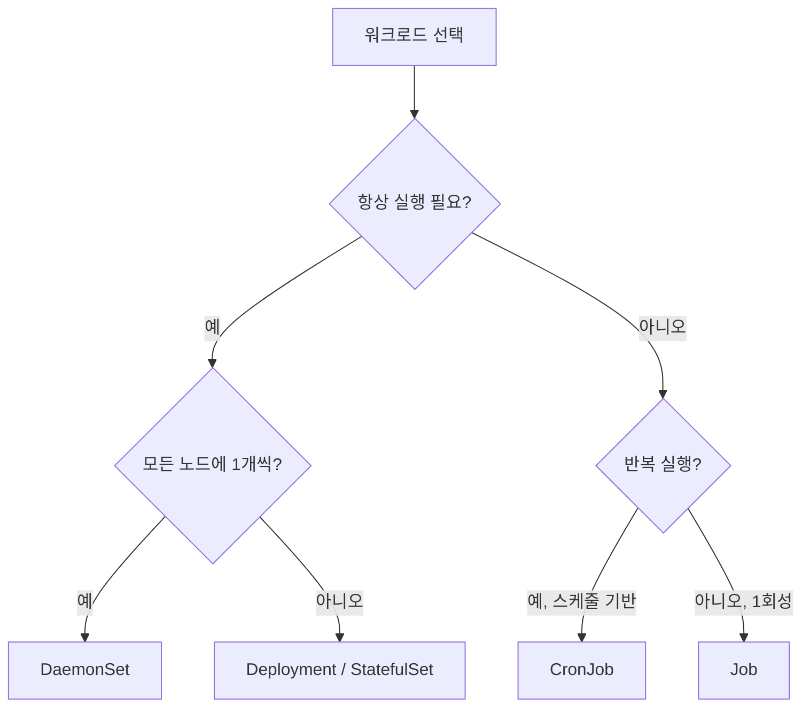
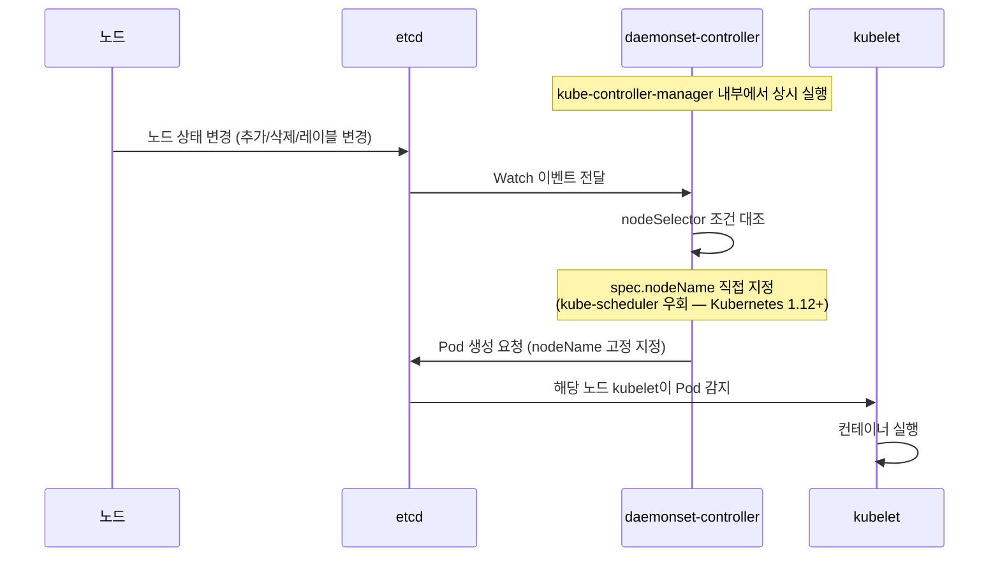
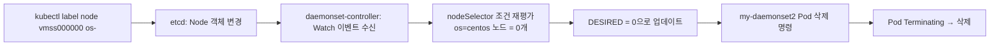
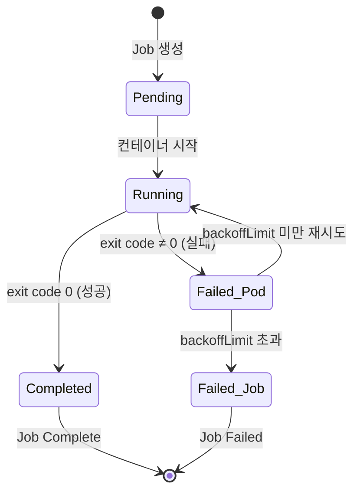
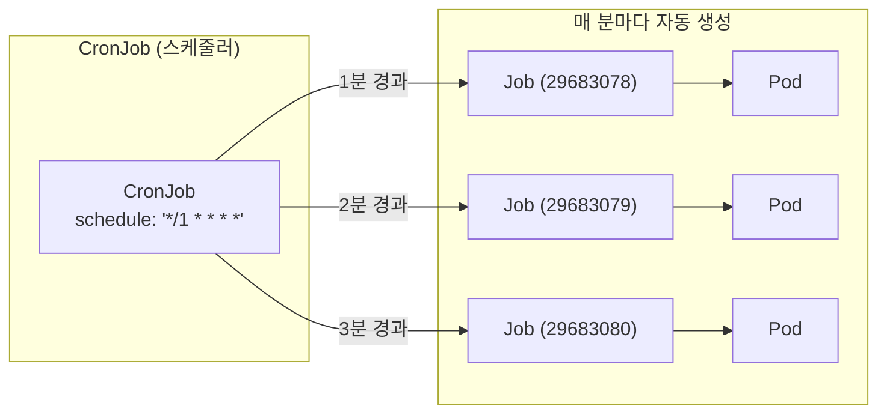
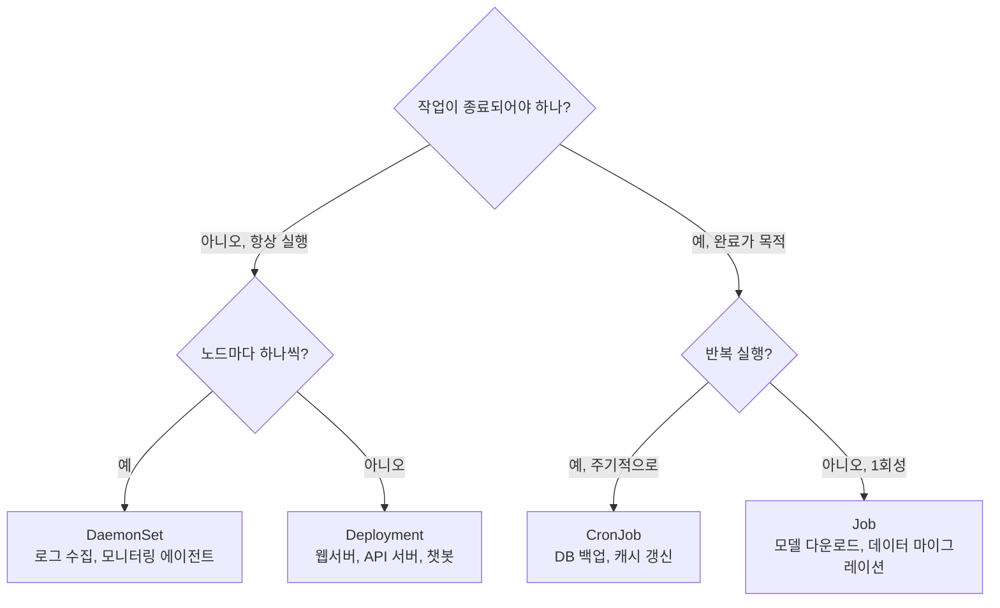
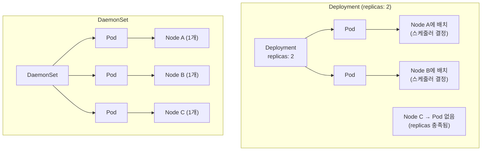
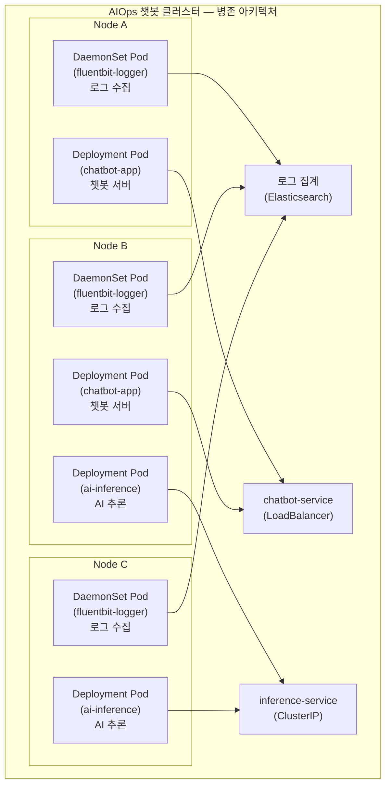

## DaemonSet · Job · CronJob 완전 가이드

> 과정: MS Azure Kubernetes 기반 AIOps 실전 (psedu.gitbook.io/k8s-aiops-aks)  
> 실습 환경: AKS (Korea Central) · Kubernetes v1.34.7 · Azure CNI · 워커 노드 2개

## 실습 문서

[**Lab 5 - 특수 워크로드 관리**](https://psedu.gitbook.io/k8s-aiops-aks/lab-5-pod-part-2)

[**Kubernetes AIOps 실전.pdf**](https://drive.google.com/file/d/1aA2YTol6pRqIkpTyQs0GtZghoVqr7P0E/view?usp=sharing)


## 관련 문서

- [**Azure AKS 기반 Kubernetes AIOps — 클러스터 배포 및 워크로드 배포**](https://k82022603.github.io/posts/azure-aks-%EA%B8%B0%EB%B0%98-kubernetes-aiops-%ED%81%B4%EB%9F%AC%EC%8A%A4%ED%84%B0-%EB%B0%B0%ED%8F%AC-%EB%B0%8F-%EC%9B%8C%ED%81%AC%EB%A1%9C%EB%93%9C-%EB%B0%B0%ED%8F%AC/)
- [**Azure AKS 기반 Kubernetes AIOps — Service 및 Ingress 라우팅**](https://k82022603.github.io/posts/azure-aks-%EA%B8%B0%EB%B0%98-kubernetes-aiops-service-%EB%B0%8F-ingress-%EB%9D%BC%EC%9A%B0%ED%8C%85/)
- [**Azure AKS 기반 Kubernetes AIOps — Volume 과 StorageClass**](https://k82022603.github.io/posts/azure-aks-%EA%B8%B0%EB%B0%98-kubernetes-aiops-volume-%EA%B3%BC-storageclass/)
- **Azure AKS 기반 Kubernetes AIOps — 특수 워크로드 관리**
- [**Azure AKS 기반 Kubernetes AIOps — 리소스 관리**](https://k82022603.github.io/posts/azure-aks-%EA%B8%B0%EB%B0%98-kubernetes-aiops-%EB%A6%AC%EC%86%8C%EC%8A%A4-%EA%B4%80%EB%A6%AC/)
- [**Azure AKS 기반 Kubernetes AIOps — 워크로드 배치 제어**](https://k82022603.github.io/posts/azure-aks-%EA%B8%B0%EB%B0%98-kubernetes-aiops-%EC%9B%8C%ED%81%AC%EB%A1%9C%EB%93%9C-%EB%B0%B0%EC%B9%98-%EC%A0%9C%EC%96%B4/)
- [**Azure AKS 기반 Kubernetes AIOps — 네트워크 정책**](https://k82022603.github.io/posts/azure-aks-%EA%B8%B0%EB%B0%98-kubernetes-aiops-%EB%84%A4%ED%8A%B8%EC%9B%8C%ED%81%AC-%EC%A0%95%EC%B1%85/)
- [**Azure AKS 기반 Kubernetes AIOps — kubernetes 고가용성**](https://k82022603.github.io/posts/azure-aks-%EA%B8%B0%EB%B0%98-kubernetes-aiops-kubernetes-%EA%B3%A0%EA%B0%80%EC%9A%A9%EC%84%B1/)
- [**Azure AKS 기반 Kubernetes AIOps — 모니터링**](https://k82022603.github.io/posts/azure-aks-%EA%B8%B0%EB%B0%98-kubernetes-aiops-%EB%AA%A8%EB%8B%88%ED%84%B0%EB%A7%81/)
- [**Azure AKS 기반 Kubernetes AIOps — AI 기반 tools**](https://k82022603.github.io/posts/azure-aks-%EA%B8%B0%EB%B0%98-kubernetes-aiops-ai-%EA%B8%B0%EB%B0%98-tools/)
- [**Azure AKS 기반 Kubernetes AIOps — 과정 평가 문제별 정답과 핵심 개념**](https://k82022603.github.io/posts/azure-aks-%EA%B8%B0%EB%B0%98-kubernetes-aiops-%EA%B3%BC%EC%A0%95-%ED%8F%89%EA%B0%80-%EB%AC%B8%EC%A0%9C%EB%B3%84-%EC%A0%95%EB%8B%B5%EA%B3%BC-%ED%95%B5%EC%8B%AC-%EA%B0%9C%EB%85%90/)

---

## 목차

1. [특수 워크로드의 필요성](#1-특수-워크로드의-필요성)
2. [Kubernetes 워크로드 유형 비교](#2-kubernetes-워크로드-유형-비교)
3. [DaemonSet 완전 분석](#3-daemonset-완전-분석)
4. [Job 완전 분석](#4-job-완전-분석)
5. [CronJob 완전 분석](#5-cronjob-완전-분석)
6. [AIOps 시나리오 미션 (Task 3)](#6-aiops-시나리오-미션-task-3)
7. [종합 비교 및 선택 가이드](#7-종합-비교-및-선택-가이드)
8. [Claude Code 프롬프트 모음](#8-claude-code-프롬프트-모음)
9. [별첨 A — DaemonSet vs Deployment 완전 비교](#9-별첨-a--daemonset-vs-deployment-완전-비교)

---

## 1. 특수 워크로드의 필요성

Kubernetes에서 가장 먼저 접하는 워크로드는 Deployment입니다. Deployment는 "지정된 수의 Pod를 클러스터 어딘가에서 항상 실행 상태로 유지하라"는 선언적 명령입니다. 웹서버, API 서버, 챗봇 애플리케이션처럼 지속적으로 요청을 받아야 하는 서비스에 최적화된 방식입니다.

그러나 실제 운영 인프라에서는 Deployment로 표현할 수 없는 세 가지 패턴의 워크로드가 반드시 등장합니다.

첫 번째는 **클러스터 모든 노드에 동일한 에이전트를 하나씩 배치해야 하는 경우**입니다. 로그 수집기, 모니터링 에이전트, 네트워크 플러그인이 대표적입니다. 노드가 10대라면 10개, 50대라면 50개가 필요하며 사람이 직접 개수를 관리하는 것은 현실적으로 불가능합니다. 이것이 DaemonSet의 탄생 배경입니다.

두 번째는 **한 번 실행하고 완료되면 그것으로 끝나는 배치 작업**입니다. AI 모델 가중치 파일 다운로드, 데이터 마이그레이션, 초기화 스크립트 실행이 해당됩니다. 이런 작업은 완료 후에도 계속 Pod를 살려두면 자원 낭비입니다. 일회성 실행과 성공 보장이 필요하며, 이것이 Job의 존재 이유입니다.

세 번째는 **정해진 시간 주기마다 자동으로 반복 실행되어야 하는 스케줄 작업**입니다. 데이터베이스 백업, 캐시 갱신, 정기 보고서 생성이 해당됩니다. Linux의 crontab과 동일한 역할을 Kubernetes 클러스터 수준에서 수행하는 것이 CronJob입니다.

이 세 가지 특수 워크로드는 AI 챗봇 인프라처럼 규모가 커질수록 더욱 중요해집니다. 수십 대의 GPU 노드에 모니터링 에이전트를 배포하고, 모델 가중치를 주기적으로 갱신하며, 대화 로그를 매일 백업하는 작업들이 모두 여기에 해당하기 때문입니다.

---

## 2. Kubernetes 워크로드 유형 비교



| 구분 | Deployment | DaemonSet | Job | CronJob |
|------|-----------|-----------|-----|---------|
| 실행 목적 | 서비스 상시 운영 | 노드당 에이전트 상시 운영 | 1회성 배치 작업 | 주기적 반복 배치 작업 |
| Pod 수 결정 | `replicas` 필드 | 노드 수 자동 결정 | `completions` 필드 | 스케줄마다 1 Job 생성 |
| 완료 개념 | 없음 (항상 Running) | 없음 (항상 Running) | 있음 (Completed) | 있음 (반복) |
| 실패 시 동작 | 자동 재시작 | 자동 재시작 | `backoffLimit`까지 재시도 | 다음 스케줄에 재실행 |
| Pod 종료 후 | 즉시 재시작 | 즉시 재시작 | Completed로 유지 | Completed로 유지 (개수 제한) |
| 대표 사용처 | 웹서버, API 서버 | 로그 수집기, 모니터링 에이전트 | 데이터 마이그레이션, 모델 다운로드 | DB 백업, 캐시 갱신 |

---

## 3. DaemonSet 완전 분석

### 3.1 개념과 설계 철학

DaemonSet은 클러스터의 **모든 노드(또는 조건에 맞는 일부 노드)에 Pod를 정확히 하나씩** 배포하고 유지하는 컨트롤러입니다. 이름에서 알 수 있듯이 Linux의 데몬(Daemon) 프로세스에서 영감을 받았습니다. Linux에서 데몬이 시스템 백그라운드에서 항상 실행되며 시스템 서비스를 제공하듯, Kubernetes DaemonSet은 클러스터의 모든 노드에서 인프라 수준의 서비스를 항상 제공합니다.

Deployment와 근본적으로 다른 점은 "얼마나"가 아닌 "어디에"가 핵심 질문이라는 것입니다. Deployment는 `replicas: 3`이라고 선언하면 3개의 Pod가 클러스터 어딘가에 분산 배치됩니다. 어느 노드에 가는지는 스케줄러가 결정합니다. 반면 DaemonSet은 각 노드가 하나의 배포 단위이며, 노드 수가 곧 Pod 수입니다.

### 3.2 내부 동작 원리

DaemonSet은 `kube-controller-manager` 프로세스 안에서 실행되는 `daemonset-controller`가 관리합니다. 이 컨트롤러는 두 가지 Kubernetes 리소스를 지속적으로 **감시(Watch)** 합니다.



`daemonset-controller`가 감시하는 두 가지 이벤트는 다음과 같습니다.

- **DaemonSet 오브젝트 변경**: YAML 수정, 이미지 업데이트, nodeSelector 변경 등
- **Node 오브젝트 변경**: 노드 추가, 노드 삭제, 노드 레이블 변경, 노드 taint 변경

이 두 가지 중 하나라도 변경이 감지되면 컨트롤러는 즉시 현재 상태와 원하는 상태를 비교하여 Pod를 생성하거나 삭제합니다. 이것이 레이블 삭제 시 Pod가 자동으로 종료되는 원리입니다.

### 3.3 YAML 구조 및 핵심 필드

실습에서 작성한 DaemonSet YAML의 각 필드를 상세히 분석합니다.

```yaml
apiVersion: apps/v1
kind: DaemonSet
metadata:
  name: my-daemonset1       # DaemonSet 이름
spec:
  selector:                 # 이 DaemonSet이 관리할 Pod를 선택하는 레이블 쿼리
    matchLabels:
      type: app             # template.metadata.labels와 반드시 일치해야 함
  template:                 # 각 노드에 배포할 Pod의 템플릿
    metadata:
      labels:
        type: app           # selector.matchLabels와 동일한 레이블
    spec:
      containers:
      - name: container
        image: nginx
        ports:
        - containerPort: 8080
```

`spec.selector`와 `spec.template.metadata.labels`는 반드시 일치해야 합니다. 이 레이블 일치 조건은 컨트롤러가 "이 Pod가 내가 관리하는 것"임을 인식하는 방법입니다.

실습 중 발생한 YAML 구조 오류는 `spec.template`이 `spec.selector` 안으로 잘못 들어간 경우였습니다. `selector`와 `template`은 `spec` 아래의 **형제(sibling) 관계**이며, 이는 Deployment, DaemonSet, StatefulSet 모두에서 동일하게 적용되는 Kubernetes의 보편적인 구조 규칙입니다.

### 3.4 nodeSelector를 이용한 선택적 배포

`spec.template.spec.nodeSelector` 필드를 통해 전체 노드가 아닌 특정 레이블이 부착된 노드에만 Pod를 배포할 수 있습니다.

```yaml
spec:
  template:
    spec:
      nodeSelector:
        os: centos    # os=centos 레이블이 있는 노드에만 배포
```

실습에서는 2개의 노드 중 하나에만 `os=centos` 레이블을 붙인 뒤 `my-daemonset2`를 배포했습니다. 결과적으로 DESIRED가 1로 설정되었고, 레이블이 있는 노드에만 Pod 1개가 배포되었습니다.

```
kubectl get ds
NAME            DESIRED   CURRENT   READY   NODE SELECTOR
my-daemonset1   2         2         2       <none>         ← 모든 노드
my-daemonset2   1         1         1       os=centos      ← 레이블 노드만
```

중요한 점은 실습 환경에서 두 노드 모두 실제 OS는 `Ubuntu 22.04.5 LTS`이지만, `os=centos` 레이블을 임의로 붙였다는 것입니다. nodeSelector는 노드의 실제 특성이 아닌 **레이블 값**만을 기준으로 판단하기 때문에, 레이블은 운영자가 원하는 임의의 의미를 부여할 수 있습니다.

### 3.5 레이블 실시간 감시 메커니즘

노드에서 `os` 레이블을 삭제하면 DaemonSet은 즉시 반응합니다.

```
[실습 결과]
레이블 삭제 전: my-daemonset2 DESIRED=1, Pod Running
레이블 삭제 후: my-daemonset2 DESIRED=0, Pod 자동 삭제
```

이 동작의 흐름은 다음과 같습니다.



이 메커니즘은 단순한 레이블 삭제를 넘어 실제 운영에서 다양하게 활용됩니다. 노드 유지보수 전 레이블을 제거하여 에이전트를 안전하게 내리거나, 새로운 유형의 노드가 추가될 때 레이블을 붙이면 자동으로 에이전트가 배포되는 방식으로 사용됩니다.

### 3.6 실습 결과 분석

**my-daemonset1 배포 결과**

```
NAME                  READY   STATUS    NODE
my-daemonset1-jj7ws   1/1     Running   aks-nodepool1-12318778-vmss000000
my-daemonset1-jzr47   1/1     Running   aks-nodepool1-12318778-vmss000001
```

2개의 워커 노드에 Pod 1개씩 배포되었습니다. `describe` 명령의 Events 섹션에서 `daemonset-controller`가 각 Pod를 생성한 기록이 정확히 확인됩니다.

**my-daemonset2 + nodeSelector 결과**

`os=centos` 레이블이 `vmss000000`에만 붙어있어 해당 노드에만 Pod가 배포되었습니다. `kubectl get ds`에서 `my-daemonset2`의 NODE SELECTOR 컬럼이 `os=centos`로 표시되는 것을 통해 nodeSelector 적용이 명확히 확인됩니다.

**레이블 삭제 후 결과**

```
daemonset.apps/my-daemonset2   0   0   0   0   0   os=centos   (모든 필드 0)
```

DESIRED가 0으로 변경되고 기존 Pod가 자동 삭제된 것을 확인했습니다. 이것이 DaemonSet의 핵심 동작인 **레이블 기반 자동 조정**입니다.

### 3.7 운영 환경 활용 시나리오

**시나리오 1: 점진적 롤아웃**

새 버전 에이전트를 전체 클러스터에 한 번에 배포하면 위험합니다. 노드 레이블을 활용해 소수의 노드에만 먼저 배포하고, 검증 후 점진적으로 확대하는 방식으로 위험을 줄일 수 있습니다.

**시나리오 2: GPU 노드 전용 모니터링**

GPU 클러스터에서 GPU 메트릭 수집기(예: NVIDIA DCGM Exporter)는 GPU가 장착된 노드에만 배포되어야 합니다. 노드 풀 추가 시 `accelerator=nvidia-gpu` 레이블을 자동 부여하도록 구성하면, DaemonSet이 해당 노드에 자동으로 GPU 모니터링 Pod를 배포합니다.

**시나리오 3: 노드 유지보수 시 에이전트 격리**

특정 노드를 점검할 때 레이블을 제거하면 DaemonSet Pod가 자동으로 종료되어 안전하게 점검할 수 있습니다. 점검 완료 후 레이블을 재부착하면 Pod가 자동으로 재배포됩니다.

**실제 클러스터 내 DaemonSet 확인**

AKS 클러스터 자체도 내부적으로 DaemonSet을 다수 운영합니다.

```bash
kubectl get ds -n kube-system
```

kube-proxy(네트워크 규칙 관리), azure-cni-networkmonitor(Azure CNI 모니터링) 등이 DaemonSet으로 배포되어 있습니다.

---

## 4. Job 완전 분석

### 4.1 개념과 설계 철학

Job은 **한 번 실행하고 성공적으로 완료(exit code 0)되는 것을 목표로 하는 일회성 배치 작업** 컨트롤러입니다. Deployment가 "항상 살아있어야 한다"는 철학을 가진다면, Job은 "한 번 잘 실행하고 끝내면 된다"는 철학을 가집니다.

Job의 핵심 특성은 완료(Completion) 개념의 도입입니다. Pod가 `exit code 0`으로 종료되면 Job은 그것을 "성공"으로 기록하고 더 이상 Pod를 재시작하지 않습니다. 반면 Deployment는 Pod가 어떤 이유로든 종료되면 즉시 새 Pod를 생성합니다.

### 4.2 YAML 구조 및 핵심 필드

실습에서 사용한 Job YAML입니다.

```yaml
apiVersion: batch/v1
kind: Job
metadata:
  name: my-job1
spec:
  template:
    spec:
      containers:
      - name: pi
        image: perl:5.34.0
        command: ["perl", "-Mbignum=bpi", "-wle", "print bpi(2000)"]
      restartPolicy: Never      # Job에서 필수 지정
  backoffLimit: 4               # 실패 시 최대 재시도 횟수
```

**`restartPolicy` 선택 기준**

Job에서 `restartPolicy`는 반드시 명시적으로 지정해야 합니다(Deployment와 달리 기본값 없음).

- `Never`: 실패 시 새로운 Pod를 생성하여 재시도합니다. 실패한 Pod가 남아있어 로그 조회가 가능합니다.
- `OnFailure`: 실패 시 동일 Pod 내에서 컨테이너를 재시작합니다. Pod는 하나지만 RESTARTS 카운트가 증가합니다.

**`backoffLimit`**

Pod가 실패했을 때 최대 몇 번까지 재시도할지를 결정합니다. `backoffLimit: 4`이면 4번 재시도 후에도 실패하면 Job 전체가 `Failed` 상태가 됩니다. 재시도 간격은 10초, 20초, 40초... 방식으로 지수적으로 증가합니다(Exponential Backoff).

**`completions`와 `parallelism`**

기본값은 각각 1이지만, 대용량 배치 작업에서는 병렬 처리를 위해 조정합니다.

```yaml
spec:
  completions: 10     # 총 10번의 성공이 필요
  parallelism: 3      # 동시에 최대 3개의 Pod 실행
```

이 설정으로 10개의 작업을 3개씩 병렬로 처리할 수 있습니다.

### 4.3 Job 라이프사이클



### 4.4 이미지 캐싱 효과 — 실습 분석

실습에서 동일한 YAML로 `my-job1`과 `my-job2`를 순서대로 실행했을 때 현저한 실행 시간 차이가 나타났습니다.

```
my-job1  Duration: 38s  ← perl:5.34.0 이미지 최초 다운로드 포함
my-job2  Duration: 11s  ← 이미지 이미 노드에 캐싱됨
```

동일한 원주율 계산 작업임에도 27초의 차이가 발생한 원인은 컨테이너 이미지 Pull 시간입니다. `my-job1` 실행 시점에는 `perl:5.34.0` 이미지가 노드에 없어 Docker Hub에서 다운로드해야 했지만, `my-job2` 실행 시점에는 이미 노드 로컬에 캐싱되어 있었습니다.

이 관찰에서 중요한 운영 시사점을 도출할 수 있습니다. Job 기반 배치 작업의 SLA(Service Level Agreement)를 설정하거나 성능을 측정할 때, 이미지 Pull 시간이 전체 실행 시간에 포함됩니다. 특히 ML 프레임워크(PyTorch, TensorFlow)가 포함된 수 GB 크기의 이미지를 사용하는 AI 추론 Job이라면, 첫 실행 시 이미지 다운로드에만 수 분이 소요될 수 있습니다. 이를 해결하기 위해 운영 환경에서는 노드에 이미지를 사전 캐싱(Pre-pull)하거나 Private Registry를 동일 리전에 두는 방식을 사용합니다.

### 4.5 Completed 상태 유지와 로그 보존

```
kubectl get pod
NAME            READY   STATUS      RESTARTS   AGE
my-job1-xxhlz   0/1     Completed   0          8m32s
my-job2-xzfbh   0/1     Completed   0          56s
```

Job이 완료된 후에도 Pod는 `Completed` 상태로 자동 삭제되지 않습니다. 이것은 의도된 설계입니다. 완료 후에도 `kubectl logs <pod-name>` 명령으로 실행 결과를 확인할 수 있어야 하기 때문입니다. 실습에서는 원주율 2000자리를 출력하는 로그를 Job 완료 후 조회할 수 있었습니다.

Pod는 `kubectl delete job <job-name>` 명령으로 Job을 삭제할 때 함께 정리됩니다. 자동 정리가 필요하다면 `ttlSecondsAfterFinished` 필드를 사용할 수 있습니다.

```yaml
spec:
  ttlSecondsAfterFinished: 300  # 완료 후 300초(5분) 뒤 자동 삭제
```

---

## 5. CronJob 완전 분석

### 5.1 개념과 설계 철학

CronJob은 Linux의 `cron` 데몬과 동일한 스케줄링 철학을 Kubernetes에 도입한 것입니다. 차이점은 cron이 특정 서버의 셸 스크립트를 실행하는 반면, CronJob은 컨테이너화된 작업(Job)을 클러스터 수준에서 스케줄링한다는 점입니다. CronJob은 Job의 상위 오브젝트로, 지정된 스케줄이 되면 새로운 Job 오브젝트를 자동으로 생성하고, 그 Job이 Pod를 생성하여 작업을 실행합니다.



### 5.2 cron 표현식 상세 설명

실습에서 사용한 `*/1 * * * *`를 포함한 cron 표현식의 구조는 다음과 같습니다.

```
  분(0-59)  시(0-23)  일(1-31)  월(1-12)  요일(0-6, 0=일요일)
     │         │         │         │          │
   */1        *         *         *           *
```

| 표현식 | 의미 |
|--------|------|
| `*/1 * * * *` | 매 1분마다 (실습용) |
| `0 2 * * *` | 매일 새벽 2시 |
| `0 */6 * * *` | 6시간마다 |
| `0 2 * * 0` | 매주 일요일 새벽 2시 |
| `0 2 1 * *` | 매월 1일 새벽 2시 |
| `0 2 * * 1-5` | 평일(월~금) 새벽 2시 |

### 5.3 YAML 구조 및 핵심 필드

```yaml
apiVersion: batch/v1
kind: CronJob
metadata:
  name: my-cronjob
spec:
  schedule: "*/1 * * * *"           # cron 표현식
  suspend: false                     # true이면 새 Job 생성 중지
  concurrencyPolicy: Allow           # 동시 실행 정책 (기본값)
  successfulJobsHistoryLimit: 3      # 성공 기록 보존 개수 (기본값: 3)
  failedJobsHistoryLimit: 1          # 실패 기록 보존 개수 (기본값: 1)
  startingDeadlineSeconds: 60        # Job 생성 허용 지연 시간 (초)
  jobTemplate:                       # 생성할 Job의 템플릿
    spec:
      template:
        spec:
          restartPolicy: Never
          containers:
          - name: container
            image: nginx
```

### 5.4 suspend 동작 원리

`spec.suspend: true`로 설정하면 CronJob이 **새로운 Job 생성을 중단**합니다. 단, 이미 실행 중인 Job과 Pod에는 아무런 영향을 주지 않습니다.

실습 결과에서 `suspend: true`로 변경한 시점에 ACTIVE가 2였던 것이 이를 증명합니다. suspend는 단순히 "앞으로 새 Job을 만들지 않겠다"는 선언이며, 현재 실행 중인 작업의 강제 중단을 의미하지 않습니다.

```
suspend: false → true 변경 시:
  ACTIVE: 2  (이미 실행 중인 Job 2개는 그대로 유지)
  
suspend: true → false 복구 시:
  ACTIVE: 3  (새 스케줄이 되어 새 Job 1개 추가)
```

### 5.5 concurrencyPolicy — Job 중첩 실행 제어

실습에서 발생한 핵심 현상 중 하나는 3개의 Job이 동시에 Running 상태로 존재한 것입니다. 이것은 `concurrencyPolicy`의 기본값인 `Allow`로 인해 발생합니다.

```
기본값: concurrencyPolicy: Allow (중첩 허용)

실습 상황:
- Job 29683078: 생성 후 계속 Running (nginx가 종료 안됨)
- 1분 후 Job 29683079 새로 생성 → 역시 Running
- 1분 후 Job 29683080 새로 생성 → 역시 Running
→ 3개 Job 동시 Running 상태
```

| `concurrencyPolicy` 값 | 동작 설명 |
|------------------------|-----------|
| `Allow` (기본값) | 이전 Job이 미완료여도 새 Job을 생성합니다. |
| `Forbid` | 이전 Job이 실행 중이면 해당 스케줄을 **건너뜁니다**. |
| `Replace` | 이전 Job을 **강제 종료**하고 새 Job을 생성합니다. |

운영 환경에서 DB 백업 같은 작업은 동시에 2개가 실행되면 데이터 충돌이 발생할 수 있으므로 `Forbid`나 `Replace`를 반드시 지정해야 합니다.

### 5.6 successfulJobsHistoryLimit과 자동 정리

`successfulJobsHistoryLimit: 2`를 설정하면 성공적으로 완료된 Job이 2개를 초과하는 시점에 가장 오래된 Job과 그 Pod가 자동 삭제됩니다.

```
3분 경과 시:
  Job A (3분 전 완료) - 자동 삭제 ← 3번째로 오래됨
  Job B (2분 전 완료) - 보존
  Job C (1분 전 완료) - 보존
```

이 설정이 없으면 CronJob이 실행될수록 Pod가 무한히 누적되어 클러스터 리소스를 소모합니다.

### 5.7 kubectl edit vs kubectl patch

실습에서는 `suspend` 값을 변경하기 위해 두 가지 방법을 사용했습니다.

**`kubectl edit`**: 기본 편집기(vim/nano)를 열어 YAML을 직접 수정하는 **대화형** 방식입니다. vim 환경에서는 `:%s/false/true/g`처럼 전체 치환 명령을 사용할 수 있습니다. 실수가 있어도 저장 전 취소 가능합니다.

**`kubectl patch`**: 변경할 필드와 값을 명령줄 인수로 직접 지정하는 **비대화형** 방식입니다. 자동화 스크립트나 CI/CD 파이프라인에서 사용하기 적합합니다.

```bash
# 대화형: vim으로 YAML 전체 편집
kubectl edit cronjob my-cronjob

# 비대화형: 특정 필드만 변경
kubectl patch cronjob my-cronjob -p '{"spec" : {"suspend" : false }}'
```

### 5.8 Job에 부적합한 이미지 — 실습의 핵심 교훈

실습에서 CronJob의 이미지로 `nginx`를 사용했을 때 Job이 절대 완료(Completed)되지 않는 현상을 관찰했습니다. 이 현상의 원인은 nginx가 HTTP 요청을 무한정 대기하는 서버 프로세스이기 때문입니다.

```
Job 정상 완료 조건:
  컨테이너 실행 → 작업 수행 → 프로세스 exit (exit code 0) → Pod Completed → Job Complete

nginx 사용 시:
  컨테이너 실행 → nginx 마스터 프로세스 시작 → 요청 대기 (무한)
  → 프로세스가 절대 종료되지 않음 → Job이 영원히 Running
```

이 결과로 인해 3개의 Job이 동시에 Running 상태로 누적되었습니다. Job과 CronJob에는 반드시 **실행 후 스스로 종료되는 작업형 이미지**를 사용해야 합니다.

| 이미지 유형 | Job 적합 여부 | 이유 |
|-------------|--------------|------|
| `busybox`, `alpine` + 명령 | 적합 | 명령 실행 후 exit |
| `perl` + 계산 명령 | 적합 | 계산 완료 후 exit |
| `python` + 스크립트 | 적합 | 스크립트 완료 후 exit |
| `nginx` | **부적합** | 서버 프로세스, 스스로 종료 안됨 |
| `postgres`, `mysql` | **부적합** | 서버 프로세스, 스스로 종료 안됨 |
| `redis` | **부적합** | 서버 프로세스, 스스로 종료 안됨 |

---

## 6. AIOps 시나리오 미션 (Task 3)

### 6.1 시나리오 배경

AI 챗봇 인프라의 확장에 따라 세 가지 특수 워크로드가 필요해졌습니다. 모든 노드에서 실시간으로 로그를 수집하는 시스템, 서비스 오픈 전 AI 모델 데이터를 사전 다운로드하는 일회성 작업, 그리고 매일 데이터베이스를 자동으로 백업하는 스케줄러입니다.

### 6.2 미션 1 — 로그 수집 DaemonSet (fluentbit-logger)

```yaml
# logger-ds.yaml
apiVersion: apps/v1
kind: DaemonSet
metadata:
  name: fluentbit-logger
  namespace: ai-bot-dev
spec:
  selector:
    matchLabels:
      app: fluentbit-logger
  template:
    metadata:
      labels:
        app: fluentbit-logger
    spec:
      containers:
      - name: fluentbit
        image: fluent/fluent-bit:2.1
```

**Fluent Bit가 DaemonSet으로 배포되어야 하는 이유**

Kubernetes 클러스터에서 Fluent Bit는 DaemonSet으로 배포되어야 합니다. 각 노드에서 실행되면서 해당 노드의 모든 Pod 로그를 읽고, 파싱하고, 필터링하며, Kubernetes 필터 플러그인을 통해 각 로그 항목에 pod_name, container_id 등의 메타데이터를 추가합니다.

2025년 기준 Kubernetes AIOps 환경에서는 일반적으로 두 종류의 수집기를 배포합니다. 노드 및 워크로드 텔레메트리를 위한 DaemonSet 기반 에이전트와, 클러스터 전체 텔레메트리를 위한 Deployment 기반 게이트웨이입니다. Fluentd와 Fluent Bit는 Kubernetes 로깅에서 신뢰할 수 있는 프로젝트입니다.

**예상 배포 결과**

```bash
kubectl get ds -n ai-bot-dev
NAME               DESIRED   CURRENT   READY   NODE SELECTOR
fluentbit-logger   2         2         2       <none>

kubectl get pod -n ai-bot-dev -o wide
NAME                     READY   STATUS    NODE
fluentbit-logger-xxxxx   1/1     Running   aks-nodepool1-...-vmss000000
fluentbit-logger-yyyyy   1/1     Running   aks-nodepool1-...-vmss000001
```

DESIRED가 2인 것은 현재 워커 노드가 2개이기 때문입니다. `spec.replicas` 필드를 작성하지 않는 것이 DaemonSet의 설계 원칙이며, 노드 수가 자동으로 DESIRED를 결정합니다.

### 6.3 미션 2 — AI 모델 다운로드 Job (ai-model-downloader)

```yaml
# downloader-job.yaml
apiVersion: batch/v1
kind: Job
metadata:
  name: ai-model-downloader
  namespace: ai-bot-dev
spec:
  template:
    spec:
      containers:
      - name: downloader
        image: busybox
        command: ["/bin/sh", "-c"]
        args: ["echo 'AI Model downloading...'; sleep 30; echo 'Download Complete!'"]
      restartPolicy: OnFailure
  backoffLimit: 4
```

`sleep 30`은 실제 AI 모델 파일 다운로드를 시뮬레이션합니다. 실제 운영에서는 wget, curl, 또는 클라우드 SDK 명령으로 모델 가중치 파일을 외부 스토리지에서 가져오는 명령으로 대체됩니다.

**예상 실행 흐름**

```
t=0s   Pod 생성, STATUS: Pending
t=2s   컨테이너 시작, STATUS: Running
       로그: "AI Model downloading..."
t=32s  sleep 30 완료, 로그: "Download Complete!"
       프로세스 exit(0), STATUS: Completed
t=33s  Job STATUS: Complete, COMPLETIONS: 1/1
```

### 6.4 미션 3 — DB 백업 CronJob (db-backup-cron)

```yaml
# backup-cron.yaml
apiVersion: batch/v1
kind: CronJob
metadata:
  name: db-backup-cron
  namespace: ai-bot-dev
spec:
  schedule: "*/1 * * * *"
  successfulJobsHistoryLimit: 2
  jobTemplate:
    spec:
      template:
        spec:
          restartPolicy: Never
          containers:
          - name: backup
            image: busybox
            command: ["/bin/sh", "-c"]
            args: ["echo 'Database Backup Started...'; date; echo 'Backup Success!'"]
```

`successfulJobsHistoryLimit: 2`의 효과로 완료된 Job이 3개를 초과하면 가장 오래된 것부터 자동 삭제됩니다.

**3분 경과 후 예상 상태**

```bash
kubectl get job -n ai-bot-dev
NAME                        STATUS     COMPLETIONS   AGE
db-backup-cron-29683102     Complete   1/1           58s   ← 보존 (2번째)
db-backup-cron-29683103     Complete   1/1           3s    ← 보존 (최신)
# 29683101 이전 Job들은 자동 삭제됨
```

**로그에서 확인되는 `date` 명령 출력**

```bash
kubectl logs -n ai-bot-dev <pod-name>
Database Backup Started...
Tue Jun  9 06:05:00 UTC 2026
Backup Success!
```

busybox의 `date` 명령이 실행 시점의 타임스탬프를 출력하므로, 각 Job이 정확한 시각에 실행되었는지 로그로 검증할 수 있습니다.

---

## 7. 종합 비교 및 선택 가이드



| 판단 기준 | DaemonSet | Job | CronJob |
|-----------|-----------|-----|---------|
| 노드마다 1개 필요? | ✅ | ❌ | ❌ |
| 작업이 완료됨? | ❌ | ✅ | ✅ |
| 반복 실행? | ❌ | ❌ | ✅ |
| 이미지 서버 프로세스 가능? | ✅ | ❌ | ❌ |
| `spec.replicas` 사용? | ❌ | ❌ | ❌ |
| `spec.completions` 사용? | ❌ | ✅ | ❌ |
| `spec.schedule` 사용? | ❌ | ❌ | ✅ |

---

## 8. Claude Code 프롬프트 모음

이 섹션은 Kubernetes AIOps 클러스터의 **구축, 운영, 모니터링, 트러블슈팅**에 활용할 수 있는 Claude Code 프롬프트를 목적별로 정리합니다. Claude Code CLI에서 그대로 사용하거나, 상황에 맞게 수정하여 활용합니다.

---

### 8.1 구축 프롬프트 — DaemonSet

#### [DS-BUILD-01] 기본 DaemonSet 배포

```
ai-bot-dev 네임스페이스가 없으면 먼저 생성하고,
아래 조건으로 logger-ds.yaml 파일을 생성한 뒤 배포해줘.

- kind: DaemonSet
- name: fluentbit-logger
- namespace: ai-bot-dev
- image: fluent/fluent-bit:2.1
- spec.replicas 필드는 DaemonSet에 해당하지 않으므로 절대 작성하지 마세요

배포 후 kubectl get ds -n ai-bot-dev 와 kubectl get pod -n ai-bot-dev -o wide 로
노드 수와 Pod 수가 일치하는지 확인해줘.
```

#### [DS-BUILD-02] nodeSelector 적용 DaemonSet

```
현재 클러스터 노드 목록을 kubectl get node --show-labels 로 확인하고,
GPU 가속기가 있는 노드에만 배포되는 gpu-monitor DaemonSet을 만들어줘.

- namespace: ai-bot-dev
- image: busybox
- nodeSelector: accelerator=nvidia-gpu
- 먼저 테스트용으로 노드 하나에 kubectl label node <노드이름> accelerator=nvidia-gpu 레이블을 붙여줘
- 배포 후 kubectl get ds,pod -n ai-bot-dev -o wide 로 대상 노드에만 배포됐는지 확인해줘
```

#### [DS-BUILD-03] DaemonSet 롤링 업데이트

```
fluentbit-logger DaemonSet의 이미지를 fluent/fluent-bit:2.1 에서 fluent/fluent-bit:2.2 로
롤링 업데이트해줘.

kubectl set image daemonset/fluentbit-logger fluentbit=fluent/fluent-bit:2.2 -n ai-bot-dev

업데이트 진행 중 kubectl rollout status ds/fluentbit-logger -n ai-bot-dev 로
업데이트 완료 여부를 확인하고, kubectl describe ds fluentbit-logger -n ai-bot-dev 에서
이미지가 변경됐는지 확인해줘.
```

---

### 8.2 구축 프롬프트 — Job

#### [JOB-BUILD-01] 일회성 배치 Job 배포

```
아래 조건으로 downloader-job.yaml 파일을 생성하고 배포해줘.

- kind: Job
- name: ai-model-downloader
- namespace: ai-bot-dev
- image: busybox
- command: ["/bin/sh", "-c"]
- args: ["echo 'AI Model downloading...'; sleep 30; echo 'Download Complete!'"]
- restartPolicy: OnFailure
- backoffLimit: 3

배포 직후 kubectl get job,pod -n ai-bot-dev 로 Running 상태를 확인하고,
30초 대기 후 다시 실행하여 Completed 상태로 전환됐는지 확인해줘.
완료 후 kubectl logs -n ai-bot-dev <pod-name> 으로 로그도 출력해줘.
```

#### [JOB-BUILD-02] 병렬 처리 Job 배포

```
아래 조건으로 병렬 처리 Job을 생성해줘.

- kind: Job
- name: parallel-inference-job
- namespace: ai-bot-dev
- image: busybox
- command: ["/bin/sh", "-c"]
- args: ["echo 'Processing batch $(hostname)...'; sleep 10; echo 'Done'"]
- completions: 6      (총 6개 작업 완료 필요)
- parallelism: 2      (동시에 2개씩 처리)
- restartPolicy: Never
- backoffLimit: 2

배포 후 kubectl get pod -n ai-bot-dev -w 로 Pod가 2개씩 순차 실행되는 모습을 확인해줘.
```

#### [JOB-BUILD-03] 완료된 Job 로그 수집

```
ai-bot-dev 네임스페이스에서 Completed 상태인 모든 Pod를 찾아서
각 Pod의 로그를 출력해줘.

kubectl get pod -n ai-bot-dev --field-selector=status.phase=Succeeded

각 Pod에 대해 kubectl logs <pod-name> -n ai-bot-dev 를 실행하고
결과를 요약해줘.
```

---

### 8.3 구축 프롬프트 — CronJob

#### [CJ-BUILD-01] DB 백업 CronJob 배포

```
아래 조건으로 backup-cron.yaml 파일을 생성하고 배포해줘.

- kind: CronJob
- name: db-backup-cron
- namespace: ai-bot-dev
- schedule: "*/1 * * * *"  (실습용 매분)
- image: busybox
- command: ["/bin/sh", "-c"]
- args: ["echo 'Database Backup Started...'; date; echo 'Backup Success!'"]
- restartPolicy: Never
- successfulJobsHistoryLimit: 2
- failedJobsHistoryLimit: 1
- concurrencyPolicy: Forbid

배포 후 kubectl get cronjob -n ai-bot-dev 로 SCHEDULE과 SUSPEND 값을 확인해줘.
2분 대기 후 kubectl get cronjob,job,pod -n ai-bot-dev 로 Job이 자동 생성됐는지 확인해줘.
```

#### [CJ-BUILD-02] 매일 새벽 2시 스케줄 CronJob

```
아래 조건으로 실제 운영 환경 기준 야간 배치 CronJob을 생성해줘.

- name: nightly-ai-report
- namespace: ai-bot-dev
- schedule: "0 2 * * *"   (매일 새벽 2시)
- image: busybox
- command: ["/bin/sh", "-c"]
- args: ["echo 'Generating AI daily report...'; date; sleep 5; echo 'Report Complete'"]
- restartPolicy: Never
- successfulJobsHistoryLimit: 7   (1주일치 보존)
- concurrencyPolicy: Forbid

파일명: nightly-report-cron.yaml
배포 후 kubectl get cronjob -n ai-bot-dev 에서 LAST SCHEDULE 을 확인해줘.
스케줄이 "0 2 * * *"가 의미하는 시간을 설명해줘.
```

---

### 8.4 운영 프롬프트 — 모니터링

#### [OPS-MON-01] 전체 특수 워크로드 현황 조회

```
ai-bot-dev 네임스페이스의 DaemonSet, Job, CronJob, Pod 전체 현황을 한 번에 조회해줘.

kubectl get ds,job,cronjob,pod -n ai-bot-dev -o wide

각 리소스의 상태(STATUS, READY, COMPLETIONS 등)를 해석하고
이상이 있는 항목이 있으면 원인과 대처 방법을 알려줘.
```

#### [OPS-MON-02] DaemonSet 노드 배포 현황 확인

```
fluentbit-logger DaemonSet이 모든 노드에 정상 배포됐는지 확인해줘.

kubectl get ds fluentbit-logger -n ai-bot-dev
kubectl get pod -n ai-bot-dev -l app=fluentbit-logger -o wide

DESIRED, CURRENT, READY 값이 모두 일치하는지 확인하고,
불일치가 있다면 어느 노드에서 문제가 발생했는지 찾아줘.
```

#### [OPS-MON-03] CronJob 실행 이력 분석

```
db-backup-cron CronJob의 최근 실행 이력을 분석해줘.

kubectl get job -n ai-bot-dev --sort-by=.metadata.creationTimestamp
kubectl describe cronjob db-backup-cron -n ai-bot-dev

최근 성공/실패 횟수, LAST SCHEDULE 시각, 각 Job의 Duration을 정리해줘.
실패한 Job이 있다면 kubectl logs 로 오류 원인을 확인해줘.
```

#### [OPS-MON-04] Job 완료 시간 분석

```
ai-bot-dev 네임스페이스의 완료된 Job들의 실행 시간을 분석해줘.

kubectl get job -n ai-bot-dev -o jsonpath='{range .items[*]}{.metadata.name}{"\t"}{.status.startTime}{"\t"}{.status.completionTime}{"\n"}{end}'

각 Job의 시작 시각, 완료 시각, Duration을 표로 정리하고
가장 오래 걸린 Job을 찾아줘.
```

---

### 8.5 운영 프롬프트 — 일시 중지 및 재개

#### [OPS-CTRL-01] CronJob 긴급 중지

```
db-backup-cron CronJob을 즉시 중지해줘. (새로운 Job 생성만 차단, 실행 중인 Job은 유지)

kubectl patch cronjob db-backup-cron -n ai-bot-dev -p '{"spec" : {"suspend" : true }}'

중지 후 kubectl get cronjob -n ai-bot-dev 에서 SUSPEND 컬럼이 True로 변경됐는지 확인해줘.
```

#### [OPS-CTRL-02] CronJob 재개

```
중지됐던 db-backup-cron CronJob을 재개해줘.

kubectl patch cronjob db-backup-cron -n ai-bot-dev -p '{"spec" : {"suspend" : false }}'

재개 후 kubectl get cronjob -n ai-bot-dev 에서 SUSPEND가 False로 복구됐는지 확인하고,
1분 대기 후 새 Job이 생성됐는지도 확인해줘.
```

#### [OPS-CTRL-03] DaemonSet 특정 노드 제외

```
vmss000001 노드를 유지보수를 위해 fluentbit-logger DaemonSet에서 제외해줘.

1. 현재 노드 레이블 확인: kubectl get node --show-labels
2. 해당 노드의 DaemonSet 제외 taint 추가:
   kubectl taint nodes aks-nodepool1-12318778-vmss000001 maintenance=true:NoSchedule

taint 추가 후 kubectl get pod -n ai-bot-dev -o wide 로
vmss000001 노드의 fluentbit-logger Pod가 제거됐는지 확인해줘.
유지보수 완료 후 taint를 제거하는 명령도 알려줘.
```

---

### 8.6 운영 프롬프트 — 트러블슈팅

#### [OPS-TS-01] DaemonSet Pod 배포 실패 원인 분석

```
fluentbit-logger DaemonSet의 Pod 중 Running이 아닌 것이 있다면 원인을 분석해줘.

kubectl get pod -n ai-bot-dev -l app=fluentbit-logger -o wide
kubectl describe pod <문제_Pod_이름> -n ai-bot-dev
kubectl logs <문제_Pod_이름> -n ai-bot-dev

Events 섹션의 오류 메시지를 중심으로 원인을 파악하고 해결 방법을 알려줘.
```

#### [OPS-TS-02] Job 실패 원인 분석

```
ai-bot-dev 네임스페이스에서 Failed 상태의 Job이 있는지 확인하고, 있다면 원인을 분석해줘.

kubectl get job -n ai-bot-dev
kubectl describe job <실패_Job_이름> -n ai-bot-dev

describe 출력의 Conditions와 Events 섹션에서 실패 원인을 파악하고,
관련 Pod의 로그도 확인해줘.
kubectl logs -n ai-bot-dev <실패_Pod_이름> --previous
```

#### [OPS-TS-03] CronJob 스케줄 미실행 원인 분석

```
db-backup-cron CronJob이 예상 시각에 실행되지 않았을 때 원인을 분석해줘.

kubectl describe cronjob db-backup-cron -n ai-bot-dev
kubectl get events -n ai-bot-dev --sort-by=.lastTimestamp

확인할 항목:
1. SUSPEND가 True인지 (실수로 중지됐는지)
2. LAST SCHEDULE 시각이 오래됐는지
3. Events에서 MissSchedule 이벤트가 있는지
4. 클러스터 시간대(Timezone)가 설정됐는지

원인에 따른 해결 방법을 제시해줘.
```

#### [OPS-TS-04] CronJob Job 중첩 문제 해결

```
db-backup-cron CronJob에서 이전 Job이 완료되지 않아 Job이 누적되고 있다면,
concurrencyPolicy를 Forbid로 변경해줘.

kubectl patch cronjob db-backup-cron -n ai-bot-dev \
  -p '{"spec" : {"concurrencyPolicy" : "Forbid"}}'

변경 후 kubectl describe cronjob db-backup-cron -n ai-bot-dev 에서
Concurrency Policy 항목이 Forbid로 변경됐는지 확인해줘.
```

---

### 8.7 운영 프롬프트 — 정리 및 삭제

#### [OPS-CLEAN-01] 완료된 Job 전체 정리

```
ai-bot-dev 네임스페이스의 Complete 상태인 모든 Job을 삭제해줘.

kubectl delete job -n ai-bot-dev \
  $(kubectl get job -n ai-bot-dev -o jsonpath='{.items[?(@.status.conditions[0].type=="Complete")].metadata.name}')

삭제 후 kubectl get job,pod -n ai-bot-dev 로 정리 상태를 확인해줘.
```

#### [OPS-CLEAN-02] 특수 워크로드 전체 정리

```
ai-bot-dev 네임스페이스의 모든 특수 워크로드를 삭제해줘.

kubectl delete ds --all -n ai-bot-dev
kubectl delete job --all -n ai-bot-dev
kubectl delete cronjob --all -n ai-bot-dev

삭제 후 kubectl get ds,job,cronjob,pod -n ai-bot-dev 로 모든 리소스가 정리됐는지 확인해줘.
```

---

### 8.8 AIOps 통합 시나리오 프롬프트

#### [AIOPS-01] 전체 AIOps 특수 워크로드 일괄 구축

```
ai-bot-dev 네임스페이스에 AIOps 챗봇 인프라의 세 가지 특수 워크로드를 모두 구축해줘.

[1단계] 네임스페이스 확인 및 생성
kubectl get namespace ai-bot-dev || kubectl create namespace ai-bot-dev

[2단계] 로그 수집 DaemonSet (logger-ds.yaml)
- name: fluentbit-logger
- image: fluent/fluent-bit:2.1

[3단계] AI 모델 다운로드 Job (downloader-job.yaml)
- name: ai-model-downloader
- image: busybox
- args: ["echo 'AI Model downloading...'; sleep 30; echo 'Download Complete!'"]
- restartPolicy: OnFailure

[4단계] DB 백업 CronJob (backup-cron.yaml)
- name: db-backup-cron
- schedule: "*/1 * * * *"
- image: busybox
- args: ["echo 'Database Backup Started...'; date; echo 'Backup Success!'"]
- successfulJobsHistoryLimit: 2

각 단계 완료 후 배포 상태를 확인하고, 최종적으로
kubectl get ds,job,cronjob,pod -n ai-bot-dev 로 전체 현황을 출력해줘.
```

#### [AIOPS-02] AIOps 인프라 상태 종합 점검

```
ai-bot-dev 네임스페이스의 AIOps 인프라 전체 상태를 점검해줘.

점검 항목:
1. fluentbit-logger DaemonSet: 모든 노드에 Pod 1개씩 배포됐는지
2. ai-model-downloader Job: Completed 상태인지
3. db-backup-cron CronJob: 정상 스케줄 실행 중인지 (LAST SCHEDULE 확인)
4. Pod 중 Running이 아닌 것: 원인 분석
5. 완료된 Job 누적 개수: 과도하게 쌓이지 않았는지

이상이 발견되면 원인과 해결 방법을 함께 알려줘.
```

#### [AIOPS-03] GPU 노드 추가 시 모니터링 에이전트 자동 배포 검증

```
새로운 GPU 노드에 accelerator=nvidia-gpu 레이블을 붙였을 때,
DaemonSet으로 배포된 GPU 모니터링 에이전트가 자동으로 배포되는지 확인해줘.

[테스트 시나리오]
1. 현재 노드 중 하나에 테스트용 레이블 추가
   kubectl label node aks-nodepool1-12318778-vmss000001 accelerator=nvidia-gpu

2. kubectl get ds,pod -n ai-bot-dev -o wide 로 해당 노드에 Pod가 자동 배포됐는지 확인

3. 레이블 제거 후 Pod 자동 삭제 확인
   kubectl label node aks-nodepool1-12318778-vmss000001 accelerator-
   kubectl get ds,pod -n ai-bot-dev -o wide

DaemonSet의 레이블 기반 자동 조정이 실제로 동작하는지 단계별로 확인해줘.
```

---

*이 문서는 MS Azure Kubernetes 기반 AIOps 실전 과정 Lab 5 실습 결과를 바탕으로 작성되었습니다.*  
*실습 환경: AKS Korea Central · Kubernetes v1.34.7 · 워커 노드 2개 (Ubuntu 22.04.5 LTS)*  
*작성일: 2026-06-09*

---

## 9. 별첨 A — DaemonSet vs Deployment 완전 비교

> Deployment를 주로 사용해 온 관점에서 DaemonSet이 어떻게 다르고, 왜 필요하며, 두 리소스가 같은 클러스터에서 어떻게 함께 작동하는지 상세히 설명합니다.

---

### A.1 두 컨트롤러의 핵심 질문 차이

Deployment와 DaemonSet은 겉보기에는 모두 "Pod를 실행하는 컨트롤러"로 보입니다. 그러나 두 컨트롤러가 대답하는 핵심 질문이 근본적으로 다릅니다.

```
Deployment가 대답하는 질문:
  "이 애플리케이션을 몇 개 실행해야 하는가?"
  → replicas: 3 (사람이 결정)

DaemonSet이 대답하는 질문:
  "이 에이전트가 어느 노드에 있어야 하는가?"
  → 모든 노드 (또는 조건에 맞는 노드) / 클러스터가 결정
```

Deployment는 **수량(How many)** 이 관심사이고, DaemonSet은 **위치(Where)** 가 관심사입니다. 이 질문의 차이에서 두 컨트롤러의 모든 동작 차이가 파생됩니다.

---

### A.2 Pod 배치 방식의 근본적 차이



**Deployment**는 `replicas: 2`라고 선언하면 클러스터 어딘가에 2개가 배치됩니다. Node C에는 Pod가 없어도 됩니다. 노드가 5개로 늘어도 Pod는 2개를 유지합니다. 트래픽 증가 시 `kubectl scale`이나 HPA로 수를 늘립니다.

**DaemonSet**은 replicas 개념이 없습니다. 노드 수가 3개면 3개, 10개면 10개가 자동으로 배치됩니다. 노드가 늘어나면 자동으로 새 노드에 Pod가 생성됩니다.

---

### A.3 상세 비교표

| 항목 | Deployment | DaemonSet |
|------|-----------|-----------|
| **Pod 수 결정 주체** | 사람 (`replicas` 필드) | 클러스터 (노드 수 자동) |
| **`spec.replicas` 필드** | 옵션 (기본값: 1, 생략 가능) | 존재하지 않음 (작성 불가) |
| **스케줄링 주체** | kube-scheduler | daemonset-controller 직접 지정 |
| **Pod 배치 위치** | 스케줄러가 최적 노드 선택 | 조건에 맞는 모든 노드에 1개씩 |
| **노드 추가 시** | 기존 replicas 유지 (변화 없음) | 새 노드에 자동으로 Pod 생성 |
| **노드 제거 시** | 다른 노드에 Pod 재배치 | 해당 노드의 Pod 삭제 |
| **수평 스케일** | `kubectl scale` / HPA | 지원하지 않음 (노드 수가 곧 규모) |
| **롤링 업데이트** | 지원 (maxSurge, maxUnavailable) | 지원 (한 번에 1개 노드씩) |
| **롤백** | `kubectl rollout undo` 지원 | 지원 |
| **nodeSelector** | 선택적 (특정 노드로 제한 가능) | 핵심 기능 (배포 범위 필터링) |
| **tolerations** | 선택적 | 핵심 기능 (taint 노드 접근) |
| **주요 사용처** | 웹서버, API, 챗봇, ML 추론 서버 | 로그 수집기, 모니터링 에이전트, CNI |
| **Pod 접근 패턴** | Service를 통해 부하 분산 | hostPort 또는 노드 IP로 직접 접근 |

---

### A.4 YAML 구조 비교

두 컨트롤러의 YAML 구조는 매우 유사합니다. `spec.selector`와 `spec.template`의 위치와 역할은 동일합니다. 가장 큰 차이는 `spec.replicas`의 유무와 상위 필드입니다.

```yaml
# Deployment
apiVersion: apps/v1
kind: Deployment          # ← 차이 1
metadata:
  name: chatbot-app
spec:
  replicas: 3             # ← 차이 2: Deployment에만 존재
  selector:
    matchLabels:
      app: chatbot
  template:
    metadata:
      labels:
        app: chatbot
    spec:
      containers:
      - name: chatbot
        image: chatbot:v1.2
```

```yaml
# DaemonSet
apiVersion: apps/v1
kind: DaemonSet           # ← 차이 1
metadata:
  name: fluentbit-logger
spec:
                          # ← 차이 2: replicas 필드 없음 (작성하면 오류)
  selector:
    matchLabels:
      app: fluentbit
  template:
    metadata:
      labels:
        app: fluentbit
    spec:
      containers:
      - name: fluentbit
        image: fluent/fluent-bit:2.1
```

`template` 아래 Pod 스펙 부분은 두 컨트롤러에서 완전히 동일한 방식으로 작성합니다. Deployment를 익숙하게 작성할 수 있다면 DaemonSet도 `kind` 변경과 `replicas` 제거만으로 작성할 수 있습니다.

---

### A.5 스케줄링 동작의 차이

Deployment의 Pod는 `kube-scheduler`가 노드를 선택합니다. 스케줄러는 각 노드의 가용 리소스, 이미 실행 중인 Pod 수, affinity 규칙 등을 종합해 최적의 노드를 선택합니다. 따라서 Deployment Pod는 어느 노드에 배치될지 미리 알 수 없습니다.

DaemonSet의 Pod는 `daemonset-controller`가 직접 `spec.nodeName`을 지정하여 생성합니다. kube-scheduler를 거치지 않고 컨트롤러가 배치 노드를 강제 지정합니다. 이것이 DaemonSet이 노드당 정확히 1개씩만 배치될 수 있는 이유입니다.

```
Deployment Pod 생성 흐름:
  kubectl apply → API Server → etcd 저장
  → kube-scheduler: "이 Pod, Node B에 배치하겠다"
  → Node B의 kubelet: Pod 실행

DaemonSet Pod 생성 흐름:
  노드 추가 감지 → daemonset-controller: "Node C에 Pod 생성"
  → spec.nodeName: "Node C" 고정 지정
  → Node C의 kubelet: Pod 실행 (scheduler 없이)
```

---

### A.6 DaemonSet과 Deployment는 병존 가능한가?

**결론부터: 병존이 가능할 뿐만 아니라, 이것이 프로덕션 운영의 표준 패턴입니다.**

많은 프로덕션 환경에서 두 가지를 모두 사용합니다. DaemonSet은 각 노드에서 하나의 수집기 Pod를 실행하여 로컬 텔레메트리를 수집하고, Deployment는 중앙화된 처리를 담당하는 Pod 풀을 실행합니다. 두 컨트롤러는 완전히 독립적인 오브젝트이며 동일한 네임스페이스, 동일한 노드에서 아무런 충돌 없이 공존합니다.



위 그림에서 모든 노드에는 반드시 `fluentbit-logger` (DaemonSet) Pod가 1개씩 존재합니다. 그와 독립적으로, 챗봇 서버(chatbot-app)와 AI 추론 서버(ai-inference)는 Deployment로 부하에 따라 Node B, C에 유연하게 배치됩니다. 두 종류의 Pod는 서로의 존재를 인식하지 않으며 충돌하지 않습니다.

---

### A.7 같은 노드에서 두 Pod가 공존하는 방식

같은 노드에서 DaemonSet Pod와 Deployment Pod가 함께 실행될 때 발생할 수 있는 유일한 관심사는 **리소스 경쟁**입니다. 이를 방지하기 위해 각 컨트롤러의 Pod에 리소스 요청(requests)과 제한(limits)을 명시적으로 설정하는 것이 운영 모범 사례입니다.

```yaml
# DaemonSet Pod — 로그 수집기는 경량이어야 함
containers:
- name: fluentbit
  image: fluent/fluent-bit:2.1
  resources:
    requests:
      cpu: 50m        # 노드 CPU의 약 5%
      memory: 64Mi
    limits:
      cpu: 200m
      memory: 256Mi

# Deployment Pod — 챗봇 앱은 더 많은 리소스 사용
containers:
- name: chatbot
  image: chatbot:v1.2
  resources:
    requests:
      cpu: 500m
      memory: 512Mi
    limits:
      cpu: 1000m
      memory: 1Gi
```

DaemonSet Pod는 노드의 모든 리소스를 차지해서는 안 됩니다. Deployment Pod가 스케줄될 공간을 남겨두어야 하기 때문입니다. Fluent Bit의 공식 권고 리소스는 CPU 50~200m, 메모리 64~256Mi 수준으로 매우 경량입니다.

---

### A.8 Deployment 사용자의 관점에서 DaemonSet 도입 시점

주로 Deployment를 사용하다가 DaemonSet이 필요해지는 시점은 대부분 아래 세 가지 질문 중 하나를 마주했을 때입니다.

**질문 1: "모든 노드의 로그나 메트릭을 빠짐없이 수집하고 싶다"**

Deployment로 로그 수집기를 배포하면 해당 Pod가 없는 노드의 로그는 수집되지 않습니다. 3개 노드에 2개 replicas로 배포하면 1개 노드는 항상 누락됩니다. 이 문제를 DaemonSet이 해결합니다.

**질문 2: "노드가 자동으로 늘어나는데, 새 노드에도 자동으로 에이전트를 배포하고 싶다"**

AKS Cluster Autoscaler가 노드를 추가할 때 운영자가 직접 에이전트를 배포할 수 없습니다. DaemonSet은 새 노드가 추가되는 순간 자동으로 Pod를 배포합니다.

**질문 3: "특정 노드 유형(GPU 노드, SSD 노드)에만 특별한 에이전트가 필요하다"**

Deployment의 nodeSelector로도 배포 노드를 제한할 수 있지만, 새 GPU 노드가 추가될 때마다 replicas를 수동으로 조정해야 합니다. DaemonSet + nodeSelector 조합은 레이블만 붙이면 자동으로 배포됩니다.

---

### A.9 두 컨트롤러의 역할 분담 정리

```
Deployment의 책임:
  "내 애플리케이션이 원하는 수만큼 어딘가에서 실행되도록"
  → 챗봇 서버, AI 추론 API, 데이터 처리 서비스

DaemonSet의 책임:
  "클러스터의 모든 노드에 인프라 에이전트가 빠짐없이 존재하도록"
  → 로그 수집, 메트릭 수집, 보안 감사, 네트워크 플러그인
```

두 컨트롤러는 경쟁 관계가 아닙니다. Deployment가 "무엇을 실행할지"를 담당하고, DaemonSet이 "그 무엇을 지원하는 인프라를 어디에나 깔지"를 담당하는, **상호 보완적인 관계**입니다. 실제로 Kubernetes 클러스터를 `kubectl get ds -A`로 전체 조회하면, AKS 클러스터 자체가 이미 다수의 DaemonSet을 내부적으로 운영 중인 것을 확인할 수 있습니다.

---

*이 문서는 MS Azure Kubernetes 기반 AIOps 실전 과정 Lab 5 실습 결과를 바탕으로 작성되었습니다.*  
*실습 환경: AKS Korea Central · Kubernetes v1.34.7 · 워커 노드 2개 (Ubuntu 22.04.5 LTS)*  

