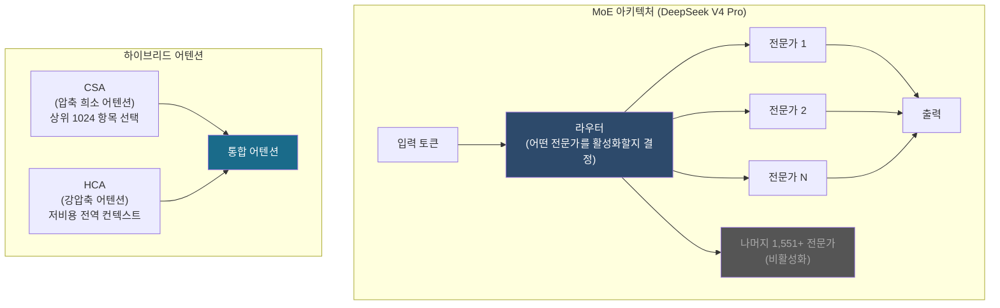
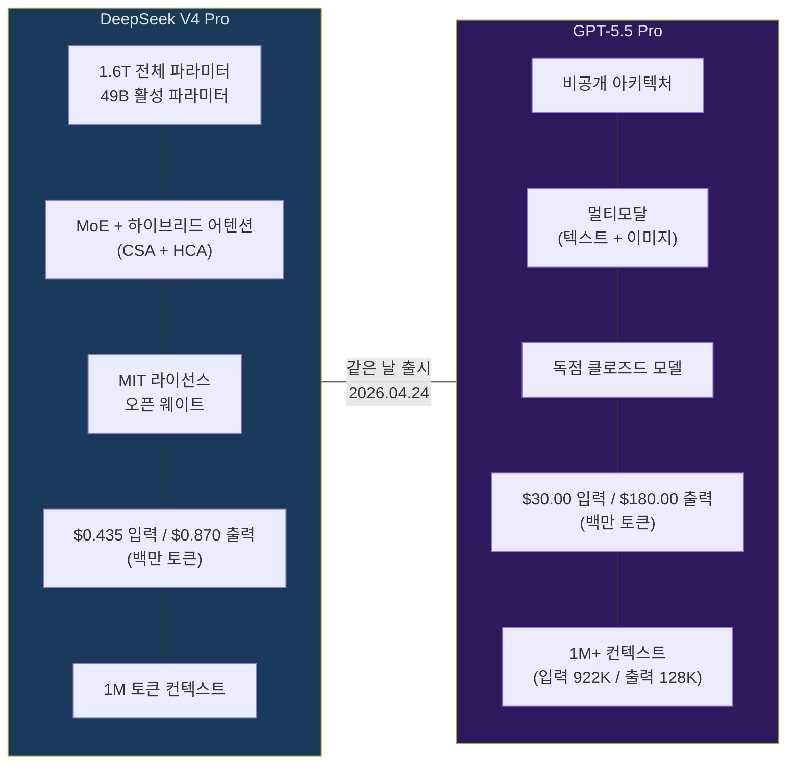
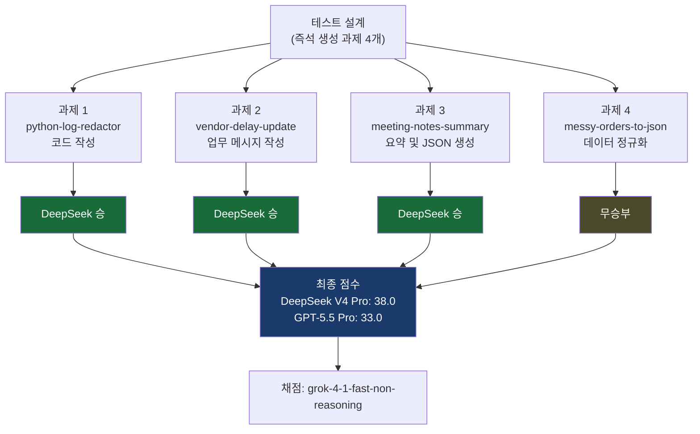
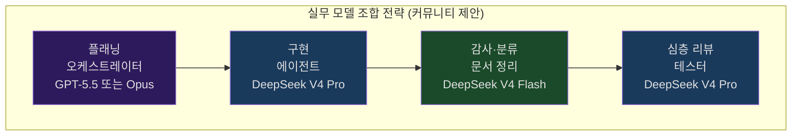

> **출처**: RuntimeWire 원문 분석 · GeekNews(news.hada.io) 커뮤니티 토론 종합  
> **원문**: [runtimewire.com](https://runtimewire.com/article/deepseek-v4-pro-beats-gpt-5-5-pro-on-precision) · [news.hada.io/topic?id=30310](https://news.hada.io/topic?id=30310)

---

## 1. 이 대결이 주목받는 이유

2026년 4월 24일, AI 업계에서 동시에 두 개의 중량급 모델이 공개됐다. OpenAI의 **GPT-5.5 Pro**와 DeepSeek의 **DeepSeek V4 Pro**다. 두 모델이 같은 날 출시됐다는 사실 자체가 상징적이다. 한쪽은 미국의 선두 AI 기업이 내놓은 최고급 클로즈드 모델이고, 다른 한쪽은 중국 항저우 소재 연구소가 공개한 오픈 웨이트(MIT 라이선스) 모델이다.

성능이 엇비슷하다면 가격 차이가 곧 판세를 가른다. RuntimeWire의 테스트에서 DeepSeek V4 Pro는 GPT-5.5 Pro 대비 입력 토큰 기준으로 약 69배, 출력 토큰 기준으로는 약 207배 저렴하다. 이 두 모델의 정면 비교는 그래서 단순한 벤치마크를 넘어, AI 인프라 비용 구조와 오픈소스 생태계의 미래를 묻는 질문이기도 하다.

---

## 2. 두 모델의 프로필

### 2-1. DeepSeek V4 Pro

DeepSeek V4 Pro는 2026년 4월 24일 공개된 DeepSeek의 차세대 플래그십 모델이다. 기술적으로 이 모델의 핵심은 **Mixture-of-Experts(MoE)** 아키텍처에 있다. 전체 파라미터는 1.6조(Trillion)개에 달하지만, 한 번의 추론에서 실제로 활성화되는 파라미터는 490억(49B)개에 불과하다. 이는 1.6조 규모의 방대한 전문 지식 저장소를 갖추면서도, 실제 연산 비용은 490억 규모의 모델과 유사하게 유지한다는 것을 의미한다.

V4 시리즈에서 가장 주목할 기술적 혁신은 **하이브리드 어텐션 아키텍처**다. DeepSeek는 **압축 희소 어텐션(Compressed Sparse Attention, CSA)** 과 **강압축 어텐션(Heavily Compressed Attention, HCA)** 을 결합하는 새로운 메커니즘을 도입했다. Hugging Face 공식 모델 카드에 따르면, 이 설계 덕분에 1M 토큰 컨텍스트 환경에서 단일 토큰 추론에 필요한 FLOPs(부동소수점 연산량)를 DeepSeek-V3.2 대비 **27% 수준으로 낮추고**, KV 캐시 메모리 점유율은 **10% 수준으로 줄였다**. 장문 처리가 핵심인 에이전트 워크플로에서 이는 결정적인 효율 차이로 이어진다.

학습 파이프라인 측면에서는 V4가 기존의 AdamW 옵티마이저 대신 **Muon 옵티마이저**를 대부분의 파라미터에 적용했다는 점이 독특하다. 또한 사후 학습(post-training)은 두 단계로 구성된다. 첫 번째 단계에서는 도메인별 전문가 모델을 SFT와 GRPO를 통해 독립적으로 육성하고, 두 번째 단계에서 온-폴리시 증류(on-policy distillation)를 통해 단일 모델로 통합한다. V4 시리즈는 V4-Pro(플래그십)와 V4-Flash(경량·저비용)로 구성된 첫 번째 2-티어 라인업이기도 하다.



모델은 MIT 라이선스로 공개되어 상업적 이용 및 파인튜닝이 자유롭다. 공식 DeepSeek API 기준 가격은 입력 **$0.435/백만 토큰**, 출력 **$0.870/백만 토큰**이다(2026년 5월 22일부터 고정 가격 적용). 1M 토큰 컨텍스트 윈도우를 지원하며, 고·최고 추론 강도(High/xHigh) 모드를 지원한다.

### 2-2. GPT-5.5 Pro

GPT-5.5 Pro는 OpenAI가 같은 날 공개한 최상위 클로즈드 모델로, 코드명 "Spud"로 알려져 있다. OpenAI는 이 모델을 "복잡하고 고위험도가 높은 워크로드를 위한 깊은 추론과 정확성에 최적화된 고성능 모델"로 소개했다. 컨텍스트 윈도우는 입력 922K, 출력 128K 토큰으로 구성된 1M+ 규모다. 텍스트와 이미지 입력을 모두 지원하며, 장기 호흡 문제 해결, 에이전트 코딩, 다단계 워크플로의 정밀 실행에 특화되어 설계됐다.

벤치마크 측면에서 OpenAI는 Terminal-Bench 2.0에서 82.7%, FrontierMath Tier 1~3에서 51.7%, Tier 4에서 35.4%를 보고했다. 가격은 입력 **$30.00/백만 토큰**, 출력 **$180.00/백만 토큰**으로, 일반 GPT-5.5($5/$30)의 6배에 해당하는 프리미엄 티어다. 내부 구조는 비공개이며, 오픈 웨이트를 제공하지 않는다.



---

## 3. 테스트 방법론

RuntimeWire의 테스트는 간단하지만 의도가 분명하다. 두 모델 모두 사전에 준비하거나 최적화할 수 없도록, 과제들을 **해당 매치업을 위해 즉석에서 생성**했다. 과제의 수는 총 4개이며, 모두 텍스트 기반이다. 채점은 xAI의 **grok-4-1-fast-non-reasoning** 모델이 각 과제별로 독립적으로 수행했다.

이 방법론에는 중요한 강점과 약점이 공존한다. 강점은 실제 현업에서 발생하는 것과 유사한 구체적이고 제약이 명확한 과제들을 통해, 이론적 벤치마크보다 실무 적합성을 더 직접적으로 평가한다는 점이다. 약점은 4개라는 표본 수가 통계적으로 매우 작다는 것이다. Hacker News 커뮤니티에서 한 사용자가 지적했듯, "임의로 짠 실험 4개로는 어느 모델의 역량도 거의 말해주지 못한다." 다만 HN의 다른 사용자가 반론을 제기했다. "결과 자체는 더 정립된 지시 이행 벤치마크와도 어느 정도 맞아떨어진다"며 [IFBench(artificialanalysis.ai)](https://artificialanalysis.ai/evaluations/ifbench)를 근거로 들었다. 결론적으로, 이 테스트는 특정 유형의 정밀 과제에서 두 모델이 어떻게 다르게 동작하는지에 대한 **유효한 방향성 신호**로 읽는 것이 적절하다.



---

## 4. 과제별 심층 분석

### 4-1. python-log-redactor — 코드 정밀도의 차이

첫 번째 과제는 Python 3 함수 `redact_log(line: str) -> str`를 구현하는 것이었다. 요구사항은 로그 한 줄을 입력받아 이메일 주소는 `[EMAIL]`로, IPv4 주소는 `[IP]`로, `INC-` + 숫자 6자리 형태의 티켓 ID는 `[TICKET]`으로 대체하는 것이다. 조건도 명확하다. 나머지 텍스트는 원문 그대로 보존해야 하고, `999.1.2.3`처럼 유효하지 않은 IP는 마스킹하면 안 된다. 멀티라인 입력은 없다고 가정한다.

DeepSeek V4 Pro가 선택한 접근법은 **단일 정규식(single regex)과 하나의 치환 함수(replacer function)** 를 사용하는 것이었다. 이 구조의 장점은 명확하다. 정규식 엔진이 패턴들의 우선순위를 단일 패스에서 처리하기 때문에, 중첩되거나 인접한 패턴이 있을 때 누락이 발생하지 않는다. 치환 함수 내에서 어떤 그룹이 매칭됐는지에 따라 대체 텍스트를 동적으로 결정하는 방식은, 복잡성을 높이는 것처럼 보이지만 실제로는 가장 견고한 해법이다.

GPT-5.5 Pro는 이메일, IP, 티켓 ID 각각에 대해 **별도의 정규식을 순차 적용**하는 방식을 택했다. 이 접근은 직관적이고 읽기 쉽지만, 근본적인 취약점을 내포한다. 첫 번째 치환이 이루어진 후 두 번째 패턴이 적용되면, 첫 번째 치환으로 변형된 문자열에 의도치 않은 매칭이 발생할 수 있다. 또한 이메일 정규식에 단어 경계(word boundary) 처리 미흡과 잠재적 과잉 매칭 문제가 있었다. 코드가 '그럴듯하게 보이는 것'과 '실제로 신뢰할 수 있는 것'의 차이가 이 과제에서 극명하게 드러났다.

### 4-2. vendor-delay-update — 지시 이행의 절제미

두 번째 과제는 업무용 상태 업데이트 메시지를 작성하는 것이었다. 구체적인 설정은 다음과 같다. 바코드 스캐너 공급사 North Quay Devices가 배터리 인증 실패로 인해 교체 유닛 420대의 배송을 5월 12일에서 19일로 연기했고, 여유 스캐너는 Memphis와 Reno만 충당 가능하다. Tulsa와 Allentown은 1주 동안 장비를 공유해야 한다. 운영 담당 VP가 지역 창고 관리자들에게 보낼 메시지를 작성하되, 비필수 재고 재점검 중단, 출고 피킹 우선, 매일 현지 시각 오후 4시까지 부족분 집계 보고를 요청해야 한다. 어조는 차분하고 책임감 있으며 실용적이어야 하고, 분량은 140~180단어다.

DeepSeek V4 Pro는 프롬프트가 요구한 것만 정확히 이행했다. VP가 관리자들에게 "매일 현지 시각 오후 4시까지 부족분 집계를 보내 달라"고 직접 요청하는 구조, 차분하고 책임감 있는 어조, 정해진 단어 수 준수, 그 이상도 이하도 없었다.

GPT-5.5 Pro의 메시지는 그 자체로는 품질이 높았다. 하지만 프롬프트가 요청하지 않은 교대 인수인계(shift handoff) 안내와 에스컬레이션 지침이 추가됐고, 수신자를 "Operations Planning"으로 전환하는 방향 전환이 포함됐다. 이 점이 감점의 원인이 됐다. 지시 이행(instruction following) 과제에서 '더 좋은 것을 추가하는 것'은 곧 '틀린 것'이다.

이 차이는 더 큰 시스템 신뢰성 문제로 확장된다. 에이전트 파이프라인이나 자동화 워크플로에서 각 단계가 정확히 요청된 것만 수행하지 않으면, 하위 단계로 갈수록 오류가 누적되고 증폭된다. '절제된 정확성'은 단순한 스타일 문제가 아니다.

### 4-3. meeting-notes-summary — 스키마 준수와 타입 정확성

세 번째 과제는 회의록을 읽고 2문장 요약을 제공하는 동시에 정해진 스키마의 JSON 객체를 생성하는 것이었다. JSON의 키는 `launch_date`, `owner`, `blocked_by`, `open_questions`(배열), `decisions`(배열)로 정해져 있었다. 회의록에는 Cedar Lane 테넌트 포털 개편 프로젝트에 관한 내용이 담겨 있었다. 법무팀의 표현 수정 승인, 프런트엔드의 아이패드 미니 배너 동작 미완료 상태, 2026년 3월 18일로 희망하는 출시일(단, 결제 자동완성의 최종 QA가 14일까지 통과할 경우), ACH 재시도 시 중복 영수증 ID가 반환되는 금융 샌드박스 차단 이슈, 다크 모드 이번 릴리스에서 제외하기로 한 결정 등이 포함됐다.

DeepSeek V4 Pro는 요청된 스키마를 정확히 따랐다. `launch_date`는 단일 날짜 문자열, `blocked_by`는 단일 값, `open_questions`와 `decisions`는 배열 형태로 올바른 타입을 유지했고, 2문장 요약도 명확했다.

GPT-5.5 Pro의 요약은 양호했지만 JSON 구조에서 두 가지 위반이 발생했다. `launch_date` 필드에 "if payment autofill passes QA by the 14th" 같은 조건부 텍스트가 포함됐고, 단일 값이 요구된 `blocked_by` 필드를 배열로 처리했다. 이 차이는 언뜻 사소해 보이지만, 실제 시스템에서 이 JSON을 파싱하는 코드에서는 타입 오류나 예상치 못한 동작으로 이어질 수 있다. 스키마는 계약(contract)이다.

### 4-4. messy-orders-to-json — 무승부가 주는 교훈

네 번째 과제는 정형화되지 않은 주문 데이터 4건을 정해진 스키마의 JSON 배열로 변환하는 것이었다. 입력 순서 보존, `priority` 필드를 `true/false`로 정규화, `none`·`tbd`·`-` 같은 누락 배송일을 `null`로 변환, 값 앞뒤 공백 제거, 항목 분리자(`; `)와 형식(`SKU xQTY`) 처리가 요구사항이었다.

두 모델 모두 유효한 JSON을 출력했고, 입력 순서를 보존했으며, 스키마를 정확히 따랐고, `priority`와 `ship_by` 값을 올바르게 정규화했다. 채점 결과는 무승부였다.

이 무승부가 전달하는 메시지는 명확하다. 규칙이 명확하고 해석이 필요 없는 데이터 변환 과제에서 두 모델은 동등하다. 그러나 해석의 여지가 생기거나, 지시를 얼마나 충실하게 따르는지가 중요해지는 순간 격차가 벌어진다. 쉬운 과제의 무승부는 어려운 과제에서의 실수를 덮지 못한다.

---

## 5. 종합 점수와 패턴

```mermaid
xychart-beta
    title "과제별 점수 (추정 배분 기준)"
    x-axis ["log-redactor", "vendor-update", "meeting-notes", "orders-to-json", "합계"]
    y-axis "점수" 0 --> 40
    bar [10, 10, 10, 8, 38]
    bar [8, 8, 8, 9, 33]
```



> 위 그래프에서 파란 막대는 DeepSeek V4 Pro, 빨간 막대는 GPT-5.5 Pro를 나타냅니다. 과제별 세부 점수는 원문에 공개되지 않았으며, 합계 점수(38.0 vs 33.0)만 공식 수치입니다.

전체 결과에서 나타나는 패턴은 단순하다. DeepSeek V4 Pro는 더 엄격하고, 더 직역적이며, 제약 조건 하에서 더 안정적으로 작동했다. GPT-5.5 Pro는 전반적으로 우수한 모델이지만, 요청에 없던 것을 추가하거나 구조를 임의로 조정하는 경향이 있었다.

지시 이행 벤치마크 맥락에서 이 결과는 완전히 고립된 사례가 아니다. HN 사용자가 언급한 바와 같이, [artificialanalysis.ai의 IFBench](https://artificialanalysis.ai/evaluations/ifbench)와 같은 더 정립된 지시 이행 벤치마크와도 어느 정도 일치하는 방향이다. 다만 동일 벤치마크에서 DeepSeek V4 Pro가 1위인 것은 아니다.

---

## 6. 가격 비교: 숫자가 말하는 것

이 대결에서 성능 차이만큼, 혹은 그 이상으로 중요한 것이 가격 격차다.

| 항목 | DeepSeek V4 Pro | GPT-5.5 Pro | 배율 |
|------|----------------|-------------|------|
| 입력 (1M 토큰) | $0.435 | $30.00 | ~69배 |
| 출력 (1M 토큰) | $0.870 | $180.00 | ~207배 |
| 아키텍처 | MoE (오픈 웨이트) | 비공개 (클로즈드) | — |
| 라이선스 | MIT | 독점 | — |
| 컨텍스트 | 1M | 1M+ (922K 입력) | 유사 |

출력 토큰 기준으로 DeepSeek V4 Pro는 GPT-5.5 Pro보다 207배 저렴하다. 이는 결코 무시할 수 없는 수치다. 에이전트 워크플로, 대규모 배치 처리, 반복적인 코드 생성 작업에서 이 차이는 월 수천 달러 이상의 비용 절감으로 직결된다.

HN의 한 사용자는 자체 취약점 스캐닝 벤치마크에서 GPT-5.5 Pro가 예산 $100를 소진할 동안 DeepSeek V4 Pro는 전체 벤치마크에 약 $1이 들었다고 보고했다. Claude Opus는 DeepSeek보다 한 자릿수 정도 더 비쌌고, GPT-5.5 Pro보다는 약 30% 저렴했다.

같은 사용자는 DeepSeek V4 Pro, Opus 4.8, MiMo V2.5 Pro 각각이 9개 버그 중 4개를 발견했으며, GPT-5.5 Pro는 예산 소진 전 처리한 4개 중 2개를 발견했다고 밝혔다.

---

## 7. 커뮤니티의 반응과 실전 인사이트

RuntimeWire 기사가 GeekNews와 Hacker News에 공유된 후, 개발자들의 반응은 단순한 동의나 반박을 넘어 실무적 경험을 기반으로 한 다양한 통찰로 이어졌다.

### 7-1. 방법론 비판

HN 커뮤니티에서 가장 많이 제기된 비판은 표본 수에 관한 것이었다. "임의로 짠 실험 4개로는 어느 모델의 역량도 거의 말해주지 못한다"는 지적이 핵심이다. 또한 기사 자체가 AI가 생성한 것처럼 보인다는 비판도 나왔다. 도입부의 "where it matters", "cleanly", "is still strong" 같은 표현이 모호하고, 실제로는 4개 중 3개 테스트에서 DeepSeek가 더 간결한 결과를 냈다는 구체적 설명이 부족하다는 지적이었다. 동시에 반론도 있었다. 결과 자체는 IFBench 같은 정립된 지시 이행 벤치마크와 방향이 일치하며, 글이 명확하고 균형 잡혀 있다는 평가도 공존했다.

### 7-2. 실무적 모델 조합 전략

GeekNews에서 한 사용자는 실제 사용 패턴을 이렇게 공유했다. "DeepSeek V4 Pro를 여러 용도로 오래 써봤는데, 결국 DeepSeek를 구현 에이전트로, GPT-5.5를 플래닝과 오케스트레이터 역할로 두는 게 제일 효율이 좋더라. DeepSeek 토큰이 압도적으로 저렴해서 Flash 모델로 문서 정리나 감사(audit) 역할에 써도 성능이 상당하다." 이는 모델을 단일 선택지가 아닌 역할별로 분리하는 멀티 모델 아키텍처의 실용적 예시다.

또 다른 사용자는 Claude $100 Max 플랜을 기반으로, Opus를 설계자, Sonnet을 구현자·엔지니어, DeepSeek V4 Pro를 심층 리뷰어·테스터로 쓰는 조합을 실험 중이라고 밝혔다. 사용 패턴이 유지될 경우 구독을 월 $20로 낮추고 DeepSeek API에 더 투자할 계획이라고 덧붙였다.

### 7-3. Claude Code + DeepSeek API 통합 팁

커뮤니티에서 공유된 가장 흥미로운 실전 팁 중 하나는 Claude Code를 DeepSeek API 엔드포인트와 연결하는 환경변수 설정이다. DeepSeek가 Anthropic API 형식과 호환되는 엔드포인트를 제공하기 때문에 가능한 방법이다.

```bash
export ANTHROPIC_BASE_URL=https://api.deepseek.com/anthropic
export ANTHROPIC_AUTH_TOKEN=YOUR_DEEPSEEK_KEY
export ANTHROPIC_MODEL=deepseek-v4-pro
export ANTHROPIC_DEFAULT_OPUS_MODEL=deepseek-v4-pro
export ANTHROPIC_DEFAULT_SONNET_MODEL=deepseek-v4-pro
export ANTHROPIC_DEFAULT_HAIKU_MODEL=deepseek-v4-flash
export CLAUDE_CODE_SUBAGENT_MODEL=deepseek-v4-flash
export CLAUDE_CODE_EFFORT_LEVEL=max
```

이 설정을 적용하면 Claude Code의 인터페이스와 오케스트레이션 레이어를 유지하면서 실제 추론은 DeepSeek V4 Pro/Flash가 수행한다. 해당 사용자는 "Claude만큼 좋지는 않지만 훨씬 싸고, 한도에 막힐 때 계속 작업할 수 있게 해준다"고 평가했다. 단, 이 방식은 공식 지원이 아닌 비공식 통합임에 유의해야 한다.

### 7-4. MiMo V2.5 Pro: 또 다른 선택지

HN 토론에서 일부 사용자는 **MiMo V2.5 Pro(Xiaomi)** 를 DeepSeek V4 Pro와 같은 가격대의 경쟁 모델로 지목했다. 캐시 적중 가격이 DeepSeek V4 Pro보다 낮으며, 멀티모달을 지원하고, 일부 벤치마크에서 더 높은 위치에 있다는 주장이다. 다만 이는 커뮤니티의 개별 주장으로, 독립적 검증이 필요하다.



### 7-5. 벤치마킹 자체에 대한 성찰

HN에서 가장 철학적인 댓글 중 하나는 벤치마킹의 의미 자체에 의문을 제기했다. "이제 지능 자체는 분명히 있다. 그걸 측정하려 드는 게 무의미해 보인다. 철물점에서 망치를 살 때 '이 망치로 만들 완제품의 품질' 기준으로 정렬할 수는 없는데, 지금 모델 평가가 대략 그런 요구를 하고 있다." 이 관점은 일견 허무주의적으로 보이지만, 모델 선택보다 **도메인 특화 하네스와 환경 설계**가 점점 더 중요해진다는 현실적 통찰을 담고 있다.

반론도 있었다. "모델들은 매일 다양한 환각, 인식론 부족, 상식 부족, 지시 불이행으로 놀라게 한다." 완전한 벤치마킹을 포기하기엔 아직 모델 간 실질적 차이가 존재하는 것도 사실이다.

---

## 8. 실무적 시사점

이 대결이 실무 관점에서 전달하는 교훈은 크게 세 가지로 정리된다.

첫째, **정밀 지시 이행이 핵심인 워크플로에서는 DeepSeek V4 Pro가 설득력 있는 선택지다**. 스키마 준수, 정확한 요청 범위 이행, 단일 정규식으로 중첩 패턴 처리하기 같은 과제들에서 DeepSeek가 보여준 절제된 정확성은 에이전트 파이프라인의 안정성과 직결된다. "코드가 그럴듯하게 보이는 것"과 "실제로 신뢰할 수 있는 것"의 차이가 이 테스트에서 드러났다.

둘째, **비용이 설계 제약이 된다**. 출력 기준 207배의 가격 차이는 API 사용 패턴을 근본적으로 바꾼다. GPT-5.5 Pro를 단독으로 쓰는 파이프라인과, GPT-5.5 Pro를 오케스트레이터로, DeepSeek V4 Pro를 실행 에이전트로, DeepSeek V4 Flash를 분류·감사 레이어로 활용하는 티어드 아키텍처는 동일한 품질 목표에 대해 수십 배의 비용 차이를 만들어낼 수 있다.

셋째, **모델 선택보다 오케스트레이션 설계가 점점 중요해지고 있다**. HN에서 한 사용자가 말했듯, "Sonnet 4.6이면 거의 모든 일에 충분하다고 느낀다. 그 수준을 넘어서면 모델 자체보다 오케스트레이션이 더 중요해 보인다." 강력한 모델에 무조건 의존하는 것보다, 역할에 맞는 모델을 적재적소에 배치하는 하네스 설계가 실질적인 성능과 비용을 결정한다.

---

## 9. 결론

RuntimeWire의 테스트는 4개 과제라는 좁은 창문을 통해 두 모델의 작동 방식 차이를 보여준다. DeepSeek V4 Pro 38.0 vs GPT-5.5 Pro 33.0, 4개 중 3개 DeepSeek 승, 1개 무승부. 이 숫자 자체가 최종 진실은 아니다. 표본이 작고 채점자(Grok 4.1)의 편향도 배제할 수 없다.

그러나 이 결과가 환기하는 구조적 사실은 분명하다. MIT 라이선스로 공개된 오픈 웨이트 모델이, 미국 최고 AI 기업의 최상위 유료 모델과 정밀 지시 이행 과제에서 동등하게 경쟁하거나 우위를 점하는 단계에 이르렀다. 그것도 입력 기준 69배, 출력 기준 207배 더 낮은 가격으로.

독점적 API에 의존하는 현재의 AI 인프라 구조에서 이 사실이 갖는 함의는 작지 않다. Anthropic과 OpenAI에게 이는 분명한 압박 신호다. 프런티어 모델로서의 정성적 우위를 유지하면서도, 토큰 경제학이 점점 더 중요해지는 현실을 외면할 수 없는 국면이 깊어지고 있다.

