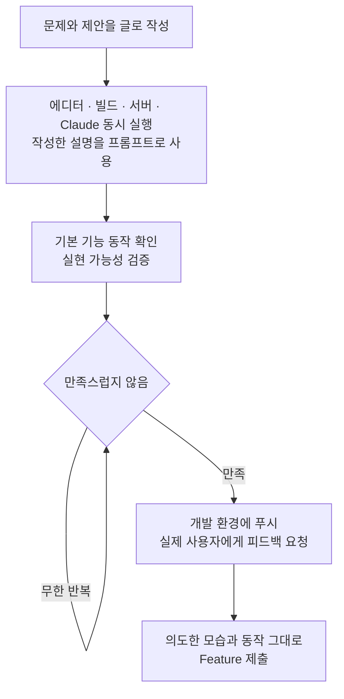
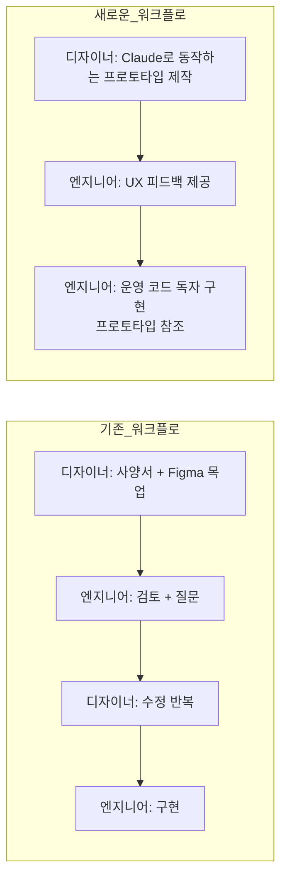
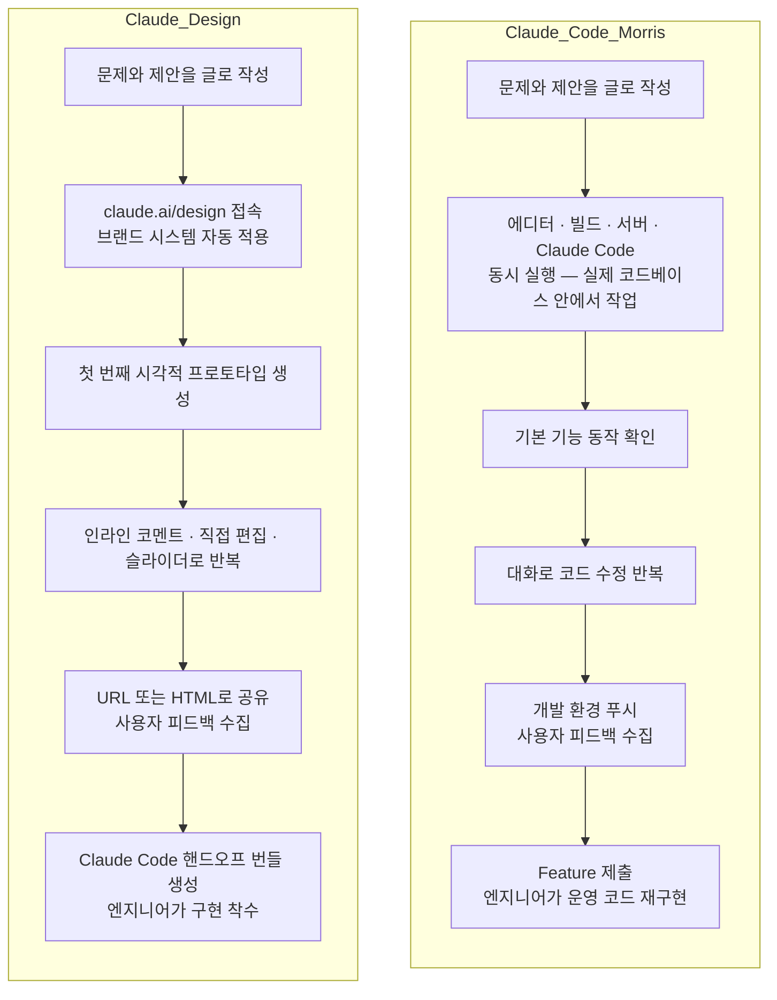
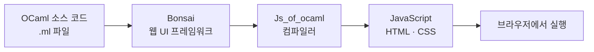

> **출처**
> - 원문: Edwin Morris, *"I Design with Claude Code More Than Figma Now"*, Jane Street Blog, 2026년 2월 5일
>   ([https://blog.janestreet.com/i-design-with-claude-code-more-than-figma-now-index/](https://blog.janestreet.com/i-design-with-claude-code-more-than-figma-now-index/))
> - 커뮤니티 논의: GeekNews 한국어 스레드 및 Hacker News 의견 요약
>   ([https://news.hada.io/topic?id=30285](https://news.hada.io/topic?id=30285))

---

## 개요

2026년 2월, 퀀트 트레이딩 회사 Jane Street의 옵션 데스크 소속 디자이너 Edwin Morris는 자신의 디자인 워크플로가 근본적으로 바뀌었음을 공개적으로 밝혔다. 사양 문서를 쓰고, Figma 목업을 만들고, 제안서를 작성하고, 개발자와 구현을 검토하는 기존의 절차 대신, 그는 이제 머릿속 아이디어를 Claude와 함께 직접 동작하는 프로토타입으로 구현한다. 이 글은 그 전환의 과정과 실제 사례, 그리고 그 방식이 불러온 협업 모델의 변화와 커뮤니티의 비판적 반응을 종합적으로 정리한다.

---

## 1. LLM에 대한 회의론에서 실용적 수용으로

Edwin Morris는 오랫동안 LLM에 회의적이었다. 직전 회사에서 직접 만든 게임을 수정하려고 Copilot과 Cursor를 써봤지만 두 도구 모두 동작하는 변경을 만들어내지 못했고, Gemini로 제품 브리프 개요와 와이어프레임을 생성해봤지만 결국 전부 폐기했다. 그가 LLM을 시도했던 영역은 언제나 자신이 이미 잘 하는 일이었고, 그럴 때 LLM은 직접 하는 것보다 더 나쁜 결과를 냈다.

전환점은 2025년 여름 Jane Street 입사 이후에 찾아왔다. 이곳에서는 OCaml과 Bonsai처럼 낯선 기술 스택이 기본이었고, 스스로 서툰 영역이 너무 많았다. AI 지원 없이는 생산적으로 기여하기 어려운 환경이었다. 그런데 놀라운 점은, AI가 그가 가장 잘 못하는 새로운 영역뿐 아니라 가장 잘 하는 영역인 디자인 워크플로 자체까지 바꿔놓았다는 것이다.

---

## 2. 프로토타입 중심 워크플로의 구조

Morris의 새로운 워크플로는 다음과 같은 단계로 진행된다.

2단계에서 "에디터 · 빌드 · 서버 · Claude를 동시에 실행한다"는 표현은 구체적인 작업 환경을 가리킨다. VS Code나 Cursor 같은 코드 편집기, 파일 변경을 감지해 자동으로 다시 컴파일하는 빌드 프로세스(`npm run build` 등), 그리고 브라우저에서 결과를 실시간으로 확인할 수 있는 개발 서버(`npm run dev` 등)가 함께 켜져 있는 상태에서, 터미널이나 에디터 안에 통합된 Claude Code를 함께 실행한다는 의미다. 이 네 가지가 동시에 살아 있으면, Claude Code가 코드를 수정하는 순간 빌드가 자동으로 반응하고 브라우저에서 변경 결과가 즉시 보인다. Figma 목업이 아니라 실제 앱이 눈앞에서 바뀌는 환경이다. 여기서 중요한 점은 이 작업이 별도의 샌드박스나 프로토타이핑 툴이 아니라 **운영 코드와 같은 저장소 안**에서 이루어진다는 것이다. "작성한 설명을 프롬프트로 사용한다"는 것은 1단계에서 적어둔 문제 정의와 제안 텍스트를 Claude Code의 첫 번째 프롬프트로 그대로 붙여넣는다는 뜻이다. 프롬프트를 별도로 새로 쓰는 대신, 이미 생각을 정리한 글을 재활용함으로써 사고와 구현 사이의 전환 비용을 줄인다.

이 워크플로에서 가장 중요한 특성은 **모든 노력이 실제 산출물 개선에 직접 투입된다**는 점이다. Figma 컴포넌트를 만들거나 문서 서식을 다듬는 중간 단계 작업이 사라진다. 사양 문서는 Claude에 넘길 초기 프롬프트로 대체되고, 목업은 실제로 동작하는 코드베이스 안의 프로토타입으로 대체된다.

반복의 비용 구조도 달라진다. 이전 직장에서라면 Submit 버튼 위치를 바꾸거나 키보드 단축키를 추가하는 것도 엔지니어링-디자인 왕복을 필요로 했다. 그 과정에서 소요되는 며칠에서 몇 주의 시간이 많은 작은 개선들을 '하지 않는 것이 낫다'는 결정으로 이어지게 만들었다. Claude와 함께하는 지금은, 아이디어가 생기는 즉시 시도해볼 수 있다.

---

## 3. 실제 사례: JSQL 입력에 LLM 프롬프팅 추가하기

Morris가 소개한 구체적 사례는 JSQL 입력에 LLM 프롬프팅 기능을 직접 추가한 프로토타입이다. JSQL은 Jane Street 내부에서 다양한 사용자 대상 도구에 쓰이는 자체 SQL 방언이다. 그는 이 기능을 며칠에 걸쳐 직접 살며 테스트했다.

그 과정에서 Claude는 그가 50번째로 마음을 바꾸거나 작은 수정을 요청해도 불평 없이 응했다. Submit 버튼을 다듬고, 키보드 단축키를 추가하고, 문구를 수정하고, 프롬프트를 조정하고, 생성형 확인 메시지를 추가하는 작업 전체가 한 흐름 안에서 이루어졌다. 이전 직장이었다면 이런 세부 개선들은 엔지니어링 백로그 어딘가에서 우선순위에 밀려 아예 이루어지지 않았을 가능성이 높다.

JSQL 프로토타입 이외에도 그는 지난 두 달 사이에 사용자 인터페이스, 데이터 모델, 라이브러리 변경을 포함하는 프로토타입 여러 건을 만들었으며, 그중 일부는 2000줄 이상의 diff에 달한다. 일부 신규 앱은 Figma 단계를 완전히 건너뛰고 처음부터 Claude와 함께 시각 디자인을 반복했다.

---

## 4. 디자이너의 역할이 바뀐다: 개념 증명의 자율화

이 워크플로의 핵심 가치는 직능적 비대칭의 해소다. 엔지니어는 아이디어가 생기면 스스로 동작하는 개념 증명(POC)을 만들 수 있지만, 디자이너는 전통적으로 남을 설득해야 했다. "JSQL 입력에 LLM 직접 프롬프팅"과 같은 아이디어는 시작 시점에 실현 가능성조차 불분명하기 때문에, 누군가에게 프로토타입 제작을 요청하는 것 자체가 그들의 시간을 낭비하는 결과가 될 수 있었다. 사용자 니즈를 분명히 채우지 못하는 제안일 수도 있기 때문이다.

Claude로 아이디어를 직접 구현하면, 다른 사람들이 실제로 써보며 평가할 수 있게 된다. 평가의 대상이 언어적 설명이나 정적인 목업에서 살아 움직이는 기능으로 바뀐다. 이는 아이디어의 설득력을 높이는 동시에, 피드백의 질 자체도 달라지게 만든다.

Morris는 이 경험을 이렇게 표현한다. Jane Street에 LLM 이전에 합류했다면 Figma에 더 깊이 매몰되었을 것이라고. JavaScript는 어느 정도 경험이 있지만 OCaml과 Bonsai는 완전히 새로운 영역이어서, 기술적으로 기여한다는 것이 손에 닿지 않는 일처럼 느껴졌을 것이라고. 그러나 지금은 실제 매체로 돌아와 있고, 그 안에서 무엇이든 시도할 자유를 더 크게 느낀다고.

---

## 5. 새로운 협업 모델의 과제: 완성된 기능 앞의 리뷰어

이 워크플로에는 명확한 단점도 있다. 리뷰어(엔지니어 동료)가 이미 완성된 기능을 건네받는다는 점이다. 이는 디자인 영역에서 PM이 상세한 와이어프레임을 넘겨주며 "보기 좋게만 만들라"고 요청하는 상황과 유사하다. 즉, 리뷰어가 기능의 방향성 자체에는 개입할 수 없고 코드 검토만 수행하는 역할로 좁혀지는 문제다.

Morris는 이 긴장을 해소하기 위해 팀 내에서 다음과 같은 관점 전환을 시도했다.

> 프로토타입은 살아 있는 제안 문서다. 코드는 일회용이다. 리뷰어의 역할은 디자인과 사용자 경험에 대한 피드백을 제공하는 것이다.

실제 운영 과정에서는 리뷰어가 아이디어를 넘겨받아 별도의 feature에서 새롭게 구현하되, 프로토타입을 참조하면서 운영 코드는 직접 소유하는 방식을 채택했다. 그러나 그 자신도 이 협업 모델이 무엇이 합리적이고 좋은 느낌인지 아직 모색 중이라고 밝혔다.

---

## 6. 창의성 억제에 대한 우려: 반복에 갇히는 사고

Morris는 또 다른 두려움을 솔직하게 언급한다. Claude로 디자인하는 방식이 자신을 유연하고 창의적인 사고 대신 반복적 사고에 가두어, Claude가 만들어낼 수 있다고 여겨지는 결과의 범위 안에서만 움직이게 할 수 있다는 것이다. 변화가 점진적인 성숙한 도구를 다룰 때는 괜찮지만, 전혀 새로운 것을 만들 때는 근본적인 아이디어를 놓칠 수 있다는 우려다.

이 긴장은 2011년 "디자이너가 코드를 써야 하는가"라는 논쟁과 구조적으로 같다. 당시 비판론자들은 프로그래밍을 시작하면 아이디어에 큰 변화를 주기 어려워진다고 주장했다. Morris 자신은 웹사이트 제작과 프로그래밍을 모두 좋아해 계속 코드를 썼고, React 같은 프론트엔드 프레임워크가 보편화되고 개발이 복잡해지자 전문화를 선택해 업무 시간 대부분을 Figma와 문서에 투입했다. 그 이분법이 LLM의 등장으로 다시 뒤집히고 있는 셈이다.

---

## 7. 커뮤니티의 반응: 비판적 관점들

GeekNews와 Hacker News 스레드에서 이 글에 대한 다양한 반응이 나왔다. 주요 논점을 아래에 정리한다.

### 7.1 프로토타입이 운영 코드로 배포되는 압박

가장 반복적으로 등장한 우려는 비즈니스 측이 완성된 프로토타입을 보고 "거의 다 됐는데 왜 바로 배포하면 안 되냐"고 압박하는 현실이다. 이 문제는 이미 실제로 발생했다는 증언이 여럿 있었으며, 실제로 데이터 손실과 보안 문제를 안고 프로토타입이 그대로 운영 배포된 사례도 언급되었다. 브라우저 너비가 정확히 1920px가 아니면 레이아웃이 깨지는 문제, 필터와 정렬이 간헐적으로 오작동하는 문제, 상태 업데이트가 UI에 반영되지 않는 문제 등이 "사소한 수정"으로 포장되어 운영 서버에 반영되는 상황이 반복된다는 것이다.

### 7.2 엔지니어에게 전가되는 인지 부담

프론트엔드 엔지니어 입장에서는 작성된 명세가 동작하는 프로토타입으로 대체되면서 오히려 인지 부담이 늘었다는 반응도 있었다. 코드를 읽으면서 어느 부분이 의도된 변경이고 어느 부분이 제거해야 할 잡음인지 판단해야 하며, 의도치 않은 변경이 포함된 PR을 받아 재구현한 뒤 "그 부분은 바꾸려던 게 아니었다"는 상황이 생기기도 한다는 것이다. 권한을 준다는 점은 이해하지만 예전 업무에서 느꼈던 즐거움 일부를 빼앗는다는 솔직한 토로도 있었다.

### 7.3 디자인의 본질에 대한 질문

한 댓글은 Morris의 접근이 "프로토타입을 최대한 깊고 현실적으로 만들고 싶어 하는 엔지니어 선망"에 빠진 것 아닌가 하는 질문을 던졌다. 디자인에서 가장 중요한 것은 올바른 것이 만들어지는 것이며, "왜 JSQL 입력 상자가 필요한가", "실제로 원하는 것은 무엇인가", "다른 방법은 무엇인가" 같은 질문은 펜과 종이 스케치, 회의, 관찰, 토론으로 더 잘 풀리는 경우가 많다는 것이다. 특정 디자인으로 너무 빨리 좁혀들어가면 버튼 위치나 LLM 세부 동작 수준의 논의에 갇혀 더 근본적인 탐색을 놓칠 수 있다는 주장이다.

### 7.4 사고의 외주화와 전체 속도 개선의 불확실성

또 다른 시각은 이 방식이 전체적인 출시 속도를 실제로 높이지 않았다는 관찰이었다. 이유는 사고가 언어 모델에 외주화되면서 프롬프트의 빈틈을 AI가 추측으로 채우고, 명시되지 않은 동작을 할루시네이션으로 처리하기 때문이다. 이전에는 "이건 잘 안 맞는데", "이 경우엔 어떻게 되지"라며 멈추고 생각했을 지점들이 사라지고, 그 세부 사항들이 뒤로 밀린다는 것이다. 사용자와 논의하고 어떻게 동작해야 할지 생각하는 시간이 전체 프로세스의 80%를 차지하기 때문에, Claude는 나머지 20%를 절반으로 줄여주는 정도의 도움을 준다는 분석도 있었다.

### 7.5 LLM 보일러플레이트 문제

Claude로 생성한 UI 디자인이 현대 웹의 상투적 패턴을 따르는 경향이 있다는 지적도 반복되었다. 지난 10년간 SaaS 보일러플레이트가 있었던 것처럼, 인터넷 데이터로 학습된 LLM에도 일종의 보일러플레이트가 내재되어 있다는 것이다. 비전형적인 시각적 창의성을 얻으려면 스타일에 대한 구체적인 프롬프트와 상당한 씨름이 필요하다는 경험담이 여럿 공유되었다.

---

## 8. Jane Street라는 맥락

일부 Hacker News 댓글은 이 글을 읽을 때 Jane Street가 Anthropic의 투자자라는 사실을 감안해야 한다고 지적했다. 이해관계가 있는 회사에서 나온 AI 도구 활용 사례인 만큼, 비판적으로 받아들일 필요가 있다는 주장이다. 또한 Jane Street는 OCaml 생태계에 상당한 기여를 해온 회사로, 내부적으로 자체 웹 프레임워크(Bonsai)를 만들어 사용한다. 대형 금융 거래 플랫폼에는 수많은 내부 대시보드와 도구가 필요하며, Morris의 JSQL 프롬프팅 사례는 그 맥락에서 이해될 필요가 있다.

---

## 9. 시사점

Morris의 경험은 몇 가지 구조적 변화를 시사한다.

**직능 경계의 재편.** 디자이너와 엔지니어 사이의 역할 분리가 완화되고 있다. 디자이너가 동작하는 프로토타입을 직접 만들고, 엔지니어가 운영 코드를 독자적으로 재구현하는 분업이 새로운 기본값이 될 가능성이 있다.

**프로토타입의 의미 변화.** 프로토타입이 언제나 폐기 가능한 탐색 수단으로 명시적으로 정의되어야 한다는 필요성이 커졌다. 코드의 품질이 아닌 설계와 사용자 경험에 대한 피드백을 끌어내는 도구로서 프로토타입의 역할을 조직이 함께 이해해야 한다.

**사고 과정의 설계.** AI 도구가 반복 속도를 높이는 동시에, 근본적인 문제 정의와 탐색의 깊이를 얕게 만들 수 있다는 위험은 도구의 특성이 아니라 사용 방식의 문제다. 펜과 종이, 사용자 관찰, 팀 토론이 여전히 보완적 역할을 할 여지는 남아 있다.

**이미 이루어지고 있는 전환.** 이 워크플로가 아직 탐색 단계임에도 불구하고, 여러 커뮤니티 참여자들이 유사한 방식을 이미 사용하고 있거나 팀 내에서 목격하고 있다고 밝혔다. 구식 직능 분리가 해체되기 시작했다는 체감이 여럿의 댓글에서 반복되었다.

---

*정리: 이 문서는 Jane Street 블로그 원문과 GeekNews/Hacker News 커뮤니티 논의를 바탕으로 작성되었으며, 출처에 명시되지 않은 내용은 포함되지 않았습니다.*

---

## 별첨: Morris의 워크플로를 Claude Design으로 수행한다면

Edwin Morris의 블로그 포스트가 게시된 것은 2026년 2월이고, Claude Design이 출시된 것은 같은 해 4월 17일이다. 즉, 그가 글에서 묘사한 작업은 Claude Design이 존재하지 않던 시점에 이루어진 것이다. 만약 그가 지금 같은 작업을 시작한다면 Claude Design을 선택지로 고려할 수 있으며, 두 접근 방식은 구조적으로 상당히 다른 경험을 만들어낸다.

### 별첨 1. Claude Design이란 무엇인가

Claude Design은 2026년 4월 Anthropic Labs가 출시한 시각적 협업 도구로, claude.ai/design에서 브라우저 안에서 바로 사용할 수 있다. 텍스트 프롬프트로 디자인·인터랙티브 프로토타입·슬라이드·원페이저 등을 만들고, 대화, 인라인 코멘트, 직접 편집, 슬라이더 조작으로 결과를 다듬는 방식으로 작동한다. Claude Opus 4.7 비전 모델로 구동되며, Pro·Max·Team·Enterprise 구독자에게 제공된다. 팀의 코드베이스와 디자인 파일을 온보딩 시점에 읽어 색상·타이포그래피·컴포넌트를 자동으로 적용하는 브랜드 시스템 기능도 갖추고 있으며, 완성된 디자인은 URL 공유, 독립 HTML, PDF, PPTX, Canva로 내보내거나 Claude Code 핸드오프 번들로 전달할 수 있다.

### 별첨 2. 워크플로의 단계별 비교

Morris의 Claude Code 기반 워크플로와 Claude Design 기반 워크플로를 단계별로 나란히 놓으면 차이가 분명해진다.

두 흐름의 전체 구조는 유사하지만, 2단계에서 결정적인 분기가 생긴다. Morris의 방식은 실제 저장소 안에서 Claude Code가 코드를 직접 수정하고 빌드·서버가 즉각 반응하는 라이브 환경을 전제로 한다. Claude Design의 방식은 브라우저 안의 독립적인 시각적 캔버스에서 시작하며, 코드 편집기나 터미널이 전혀 필요하지 않다.

### 별첨 3. 환경 진입 비용의 차이

Morris가 묘사한 "에디터·빌드·서버·Claude Code를 동시에 실행하는" 환경은 Node.js나 해당 언어 런타임 설치, 프로젝트 의존성 설정, 개발 서버 구성 등 일정한 기술적 사전 준비를 요구한다. Jane Street의 경우 OCaml과 Bonsai가 기반 스택이기 때문에 그 진입 비용은 일반적인 웹 프로젝트보다 상당히 높다. Morris 자신도 이 환경을 다루기까지 시간이 걸렸다고 밝혔다.

Claude Design의 진입 비용은 사실상 없다. 브라우저에서 claude.ai/design을 열고 프롬프트를 입력하면 첫 번째 결과가 나온다. 코드 한 줄을 보지 않고도 인터랙티브 프로토타입을 만들고 팀 내부 URL로 공유할 수 있다. Anthropic이 Claude Design의 주요 대상으로 디자인 배경이 없는 창업자·PM·마케터를 명시한 것은 이 때문이다.

### 별첨 4. 반복 방식의 차이

Morris가 Claude Code로 반복하는 방식은 대화 창에 수정 지시를 입력하고 Claude Code가 파일을 수정하면 브라우저에서 결과를 확인하는 사이클이다. 모든 수정은 코드 변경으로 이루어지며, 최종적으로 저장소의 실제 파일이 바뀐다.

Claude Design의 반복 방식은 더 다층적이다. 대화로 수정을 요청하는 것 외에도, 특정 요소에 인라인 코멘트를 달아 그 위치에서 직접 지시를 내릴 수 있고, 텍스트를 직접 편집하거나, Claude가 만들어낸 커스텀 슬라이더로 간격·색상·레이아웃을 실시간으로 조정하는 것도 가능하다. 시각적 조작과 언어적 지시가 동일한 화면 안에서 혼합된다.

### 별첨 5. 프로토타입과 운영 코드의 분리 문제

Morris의 워크플로에서 반복적으로 제기된 우려 중 하나는 프로토타입 코드가 실제 저장소 안에 있기 때문에 "이거 바로 배포하면 안 되냐"는 압박이 생긴다는 것이었다. 코드의 품질이나 보안 수준과 무관하게, 동작하는 기능이 눈앞에 있다는 사실 자체가 조직 내 비기술 구성원에게 "거의 완성된 것"이라는 인상을 준다.

Claude Design은 이 문제를 구조적으로 차단한다. 프로토타입이 claude.ai 안의 독립된 캔버스에 존재하기 때문에, 운영 저장소와 물리적으로 분리되어 있다. 프로토타입이 아무리 완성도 높아 보여도 그것을 운영 서버에 올리려면 반드시 엔지니어가 Claude Code 핸드오프 번들을 받아 구현하는 별도의 단계를 거쳐야 한다. 프로토타입은 제안의 형태로만 존재하고, 코드로서의 생명은 별도의 구현 과정에서 새롭게 시작된다.

### 별첨 6. Claude Code 핸드오프 번들

두 워크플로를 잇는 중요한 연결 고리가 Claude Design의 핸드오프 기능이다. 디자인이 충분히 완성되면 Claude Design은 해당 작업을 Claude Code가 바로 받아서 구현할 수 있는 번들로 패키징한다. 이 번들에는 시각적 명세, 컴포넌트 구조, 인터랙션 의도 등이 포함되어 있어, 엔지니어가 프로토타입 코드를 직접 해석하거나 의도치 않은 변경을 걸러내는 인지 부담 없이 구현을 시작할 수 있다.

Morris의 방식에서 엔지니어가 프로토타입 PR을 받아 "어느 부분이 의도된 변경이고 어느 부분이 잡음인지" 판단해야 했던 문제가 이 핸드오프 구조에서는 완화된다. 디자이너가 전달하는 것이 실행 가능한 코드 덩어리가 아니라 설계 의도를 담은 명세이기 때문이다.

### 별첨 7. Claude Design으로 Morris가 했던 작업을 그대로 할 수 있는가

결론부터 말하면, 부분적으로만 가능하다. Morris의 JSQL 프로토타입은 Jane Street 내부의 실제 데이터 모델과 연결된 기능이었고, OCaml과 Bonsai로 작성된 실제 코드베이스 안에서 동작해야 했다. 이런 깊이의 기술적 통합은 Claude Design의 영역이 아니다. Claude Design은 시각적 프로토타입과 인터랙션 흐름을 만드는 데 적합하지만, 실제 백엔드 로직과 연결된 기능을 검증하는 데는 여전히 Claude Code 기반의 실제 코드베이스 작업이 필요하다.

두 도구가 잘 어울리는 시나리오는 단계적 결합이다. 초기 아이디어와 UI 흐름 탐색은 Claude Design에서 진행하고, 실현 가능성이 확인된 뒤 실제 기술 스택 안에서의 구현은 Claude Code로 넘기는 방식이다. Morris가 "일부 신규 앱은 먼저 Figma에서 설계한 뒤 Claude Code로 인터랙티브 프로토타입을 구현했다"고 밝힌 맥락에서, 그 Figma의 자리를 Claude Design이 대체하는 그림이 가장 자연스러운 결합이다.

| 항목 | Morris (Claude Code) | Claude Design |
|---|---|---|
| 작업 환경 | 에디터 + 빌드 + 서버 + 터미널 | 브라우저 (claude.ai/design) |
| 작업 대상 | 실제 코드베이스 | 독립 시각 캔버스 |
| 반복 방식 | 대화 → 코드 수정 → 브라우저 확인 | 대화 + 인라인 코멘트 + 슬라이더 |
| 사용자 공유 | 개발 환경 URL | 내부 URL / HTML 내보내기 |
| 엔지니어 인계 | 프로토타입 코드 PR | Claude Code 핸드오프 번들 |
| 운영 배포 압박 | 구조적으로 발생하기 쉬움 | 구조적으로 차단됨 |
| 기술 통합 깊이 | 실제 데이터 모델·백엔드 연결 가능 | UI·인터랙션 레이어에 한정 |
| 진입 장벽 | 해당 기술 스택 이해 필요 | 없음 |

---

## 별첨: OCaml과 Bonsai — Morris의 워크플로를 이해하기 위한 기술 배경

Morris는 Jane Street 입사 후 OCaml과 Bonsai가 "완전히 새로운" 영역이어서 기술적으로 기여하는 것이 "손에 닿지 않는 일처럼 느껴졌을 것"이라고 밝혔다. 왜 이 두 기술이 외부에서 온 디자이너에게 그토록 낯선 진입 장벽으로 작용하는지, 그리고 그것이 Claude Code와 만나 어떤 맥락을 만들어내는지 이해하려면 두 기술의 성격을 살펴볼 필요가 있다.

### 별첨 1. OCaml — Jane Street가 선택한 언어

OCaml은 1996년 INRIA(프랑스 국립 정보과학 자동화 연구소)에서 개발된 정적 타입 함수형 프로그래밍 언어다. 일반 소프트웨어 산업에서는 비주류에 속하지만, Jane Street는 2002년 기술 총괄 Yaron Minsky의 주도 아래 OCaml을 회사 전체의 주 언어로 채택했으며, 현재 세계에서 가장 많은 OCaml 코드를 운영하는 단일 조직으로 알려져 있다.

Jane Street가 OCaml을 선택한 이유는 크게 두 가지다. 첫째는 타입 시스템이 제공하는 안전성이다. OCaml의 컴파일러는 코드를 실행하기 전에 광범위한 오류를 잡아낸다. 금융 거래 시스템에서 런타임 오류 하나가 수억 달러의 손실로 이어질 수 있는 환경에서, 컴파일 단계에서 오류를 제거할 수 있다는 것은 결정적인 이점이다. 둘째는 성능과 간결함의 균형이다. OCaml은 Python처럼 간결하게 쓸 수 있으면서도 C에 가까운 실행 성능을 낸다. Minsky는 OCaml을 "설계 공간에서 진정한 스위트 스팟"이라고 표현했다.

Jane Street는 OCaml을 거래 시스템 같은 핵심 인프라뿐 아니라 내부 스크립트, 데이터 파이프라인, 심지어 FPGA 하드웨어 설계 검증에까지 사용한다. 회사 안에서 모든 작업이 OCaml이라는 단일 언어로 수렴하는 구조다.

대부분의 웹 개발자가 JavaScript, TypeScript, Python, Go 등을 기반으로 훈련받는 현재의 소프트웨어 산업에서 OCaml은 독자적인 생태계를 가진 별도의 세계에 가깝다. 함수형 프로그래밍의 패러다임(불변성, 순수 함수, 타입 추론, 패턴 매칭)에 익숙하지 않은 사람에게 OCaml 코드베이스는 구문 자체부터 낯설다. Morris처럼 JavaScript 경험은 있지만 함수형 언어 배경이 없는 디자이너에게, OCaml 코드를 직접 수정하는 것은 새로운 언어를 배우는 일에 가깝다.

### 별첨 2. Bonsai — OCaml로 만든 웹 프레임워크

브라우저는 JavaScript, HTML, CSS만 이해한다. Jane Street의 엔지니어들은 OCaml만 다룬다. 이 간극을 메우는 것이 Bonsai다.

Bonsai는 Jane Street가 내부적으로 개발한 OCaml 기반 웹 UI 프레임워크로, Js_of_ocaml이라는 컴파일러를 통해 OCaml 코드를 JavaScript로 변환한다. 즉, Jane Street의 엔지니어는 JavaScript를 거의 쓰지 않고 OCaml로 프론트엔드 코드를 작성하며, Bonsai가 이것을 브라우저가 실행할 수 있는 JavaScript로 변환한다. 사내 디렉토리부터 거래 시스템을 모니터링하는 실시간 대시보드까지, Jane Street 내부의 거의 모든 웹 애플리케이션이 Bonsai로 만들어진다. JSQL 입력 도구도 그중 하나다.

Bonsai의 설계 철학은 Elm 아키텍처에서 영감을 받은 순수 함수형 접근이다. React에 익숙한 개발자를 위해 비유하자면, 모든 것이 React Hooks와 유사하게 동작하되 state가 컴포넌트 계층 밖에서 관리되는 구조에 가깝다. 컴포넌트는 순수 함수형 상태 머신으로 구현되며, 상태와 점진적 연산(incrementality)을 별도의 기본 요소로 조합한다. 이 구조 덕분에 사용자 인터랙션 중 페이지 전체를 다시 그리지 않고 변경된 부분만 재계산하는 효율적인 렌더링이 가능하다.

Bonsai의 내부 작동은 두 단계로 나뉜다. 그래프 구축 단계에서는 컴포넌트들이 서로 어떻게 연결되고 데이터가 어떻게 흐를지에 대한 DAG(방향 비순환 그래프)가 정적으로 구성된다. 런타임 단계에서는 실제 데이터가 이 그래프를 통해 흐르며 화면을 동적으로 구동한다. 이 정적 그래프 구조가 컴포넌트별 상태 관리를 일관되게 유지하고, 서브그래프 연산을 여러 컴포넌트에서 공유하는 최적화를 가능하게 한다.

### 별첨 3. 이 기술 스택이 Morris의 경험에 미친 영향

Morris가 언급한 "기술적 기여가 손에 닿지 않게 느껴졌을 것"이라는 표현은 이 맥락에서 더 구체적인 의미를 갖는다. Bonsai 컴포넌트를 새로 만들거나 수정하려면 OCaml의 타입 시스템이 요구하는 방식으로 코드를 작성해야 하고, Bonsai의 함수형 상태 머신 패턴을 이해해야 하며, Js_of_ocaml 컴파일 파이프라인이 정상적으로 작동하는지 확인해야 한다. 이 모든 것이 JavaScript 생태계와는 완전히 다른 사고 방식을 전제로 한다.

그러나 Morris가 발견한 것은, Claude Code가 이 기술 스택을 상당한 수준으로 다룰 수 있다는 점이었다. 그가 문제와 의도를 언어로 설명하면, Claude Code가 OCaml과 Bonsai의 규칙에 맞는 코드를 생성했다. Morris가 OCaml 타입 시스템의 세부를 모두 익히지 않고도, Bonsai의 그래프 구축 패턴을 완전히 이해하지 않고도, 실제로 동작하는 기능을 코드베이스 안에 만들어낼 수 있었다. LLM 이전에 Jane Street에 합류했다면 Figma에 더 깊이 매몰되었을 것이라는 그의 말은, OCaml과 Bonsai라는 기술적 장벽이 디자이너와 코드 사이의 간극을 만들었고, 그 간극을 Claude Code가 처음으로 실질적으로 메워주었다는 뜻이기도 하다.

동시에 이것은 별첨 A의 "부분적으로만 가능하다"는 결론과 연결된다. Claude Design이 Morris의 JSQL 프로토타입을 그대로 재현할 수 없는 이유는 단순히 "코드에 접근하지 못해서"가 아니다. JSQL 도구는 Bonsai로 만들어진 실제 컴포넌트 위에서 동작하며, Jane Street 내부 데이터 모델과 OCaml 타입으로 연결되어 있다. 이 깊이의 통합을 시각적 캔버스만으로는 검증할 수 없다. Morris의 워크플로가 의미 있었던 것은 그가 실제 기술 스택 안에서 작동하는 기능을 만들었기 때문이고, 그것을 가능하게 한 것이 Claude Code의 OCaml·Bonsai 처리 능력이었다.

---

*정리: 이 문서는 Jane Street 블로그 원문, GeekNews/Hacker News 커뮤니티 논의, Anthropic 공식 Claude Design 발표문, Jane Street GitHub 저장소(janestreet/bonsai), Jane Street 기술 블로그 및 Signals & Threads 팟캐스트를 바탕으로 작성되었으며, 출처에 명시되지 않은 내용은 포함되지 않았습니다.*
