> **원문 출처**: Sachin Kasana, ["10 LangChain & LangGraph Concepts Every AI Engineer Should Know"](https://medium.com/codetodeploy/10-langchain-langgraph-concepts-every-ai-engineer-should-know-f661560f213c)  
> Medium / CodeToDeploy, 2026년 6월 2일 발행  
> **참고 자료**: LangChain 공식 블로그(2026년 1~4월 뉴스레터), Spheron, AlphaBold, tech-insider.org, Atlan 등 검증된 최신 자료 기반 작성  
> **작성 일자**: 2026-06-11

---

## 목차

1. [들어가며: 데모와 프로덕션 사이의 간극](#들어가며)
2. [LangChain과 LangGraph란 무엇인가](#langchain과-langgraph란-무엇인가)
3. [개념 1: 상태(State) — 모든 에이전트의 토대](#개념-1-상태state)
4. [개념 2: 노드(Nodes) — 복잡성의 단순한 건축 블록](#개념-2-노드nodes)
5. [개념 3: 체인(Chains) vs 그래프(Graphs)](#개념-3-체인chains-vs-그래프graphs)
6. [개념 4: 라우팅(Routing) — 거대한 프롬프트를 이기는 전략](#개념-4-라우팅routing)
7. [개념 5: 검색(Retrieval) — 벡터 검색 그 이상](#개념-5-검색retrieval)
8. [개념 6: 구조화된 출력(Structured Outputs) — 비용이 큰 실패 방지](#개념-6-구조화된-출력structured-outputs)
9. [개념 7: 스트리밍(Streaming) — 사용자 경험의 혁신](#개념-7-스트리밍streaming)
10. [개념 8: 메모리(Memory) — 대화 기록 그 이상](#개념-8-메모리memory)
11. [개념 9: 체크포인팅(Checkpointing) — 장기 실행 워크플로우 지원](#개념-9-체크포인팅checkpointing)
12. [개념 10: Human-in-the-Loop — AI의 진정한 미래](#개념-10-human-in-the-loop)
13. [10가지 개념의 종합: 프로덕션 AI 워크플로우의 완성된 구조](#종합)
14. [실제 기업 도입 사례](#실제-기업-도입-사례)
15. [2026년 현재의 LangChain/LangGraph 생태계 현황](#2026년-현재-생태계-현황)
16. [결론: 모델보다 아키텍처가 먼저다](#결론)

---

## 들어가며

대부분의 AI 애플리케이션은 간단한 데모로 시작된다. 사용자가 질문을 입력하고, LLM이 응답을 생성하며, 모두가 감탄한다. 그러나 현실은 곧 찾아온다. 실제 서비스에서 AI 시스템은 문서를 검색하고, 도구를 호출하고, 실패를 처리하며, 요청을 분류하고, 이전 작업을 기억하면서, 중요한 결정에는 인간이 개입할 수 있어야 한다. 그 순간 단순한 챗봇은 복잡한 워크플로우로 변한다.

여기서 많은 AI 프로젝트가 좌초된다. 주말에 만든 데모와 프로덕션 AI 시스템의 차이는 대개 모델의 성능이 아니라 그 배후의 아키텍처에 있기 때문이다. LangChain과 LangGraph는 현대 AI 애플리케이션 구축에 가장 널리 사용되는 두 프레임워크로 자리잡았으며, 이 두 도구는 신뢰성 있고 확장 가능하며 유지보수가 쉬운 AI 시스템을 위한 핵심 구성요소를 제공한다.

---

## LangChain과 LangGraph란 무엇인가

LangChain은 LLM 호출, 프롬프트 템플릿, 검색기(retriever), 도구(tool), 메모리 객체 등 다양한 구성요소를 조합하여 AI 애플리케이션을 빠르게 구축할 수 있도록 도와주는 오픈소스 프레임워크다. 선형적이고 단순한 파이프라인에 적합하며, 광범위한 LLM 공급자 통합을 제공한다. 2025년 10월 22일 LangChain v1.0이 정식 출시(GA)되었으며, 안정적인 인터페이스와 LangGraph 런타임을 기본 에이전트 경로로 채택하였다.

LangGraph는 LangChain을 기반으로 구축된 라이브러리로, 상태 기반의 방향성 그래프(directed graph) 실행 모델, 체크포인팅, 타임트래블 디버깅, Human-in-the-Loop 인터럽션을 추가로 제공한다. 2024년 1월 LangChain Inc.가 출시한 이후 빠르게 성장하여, 2026년 현재 LangGraph v1.2.4가 최신 버전이다. 2026년 5월 기준 월 9,000만 건의 다운로드를 기록하며 Klarna, Uber, LinkedIn, Replit, JP Morgan, BlackRock, Cisco 등 20개 이상 대기업에서 프로덕션 환경에서 사용하고 있다.

두 프레임워크는 경쟁 관계가 아니다. LangChain이 도구 모음이라면, LangGraph는 그 도구들 위에서 동작하는 상태 머신 오케스트레이터다. 단순한 선형 파이프라인에는 LangChain만으로 충분하지만, 에이전트가 루프를 돌고, 분기하고, 실패 후 재개하거나 Human-in-the-Loop 승인을 기다려야 한다면 LangGraph가 필수다. 대부분의 프로덕션 에이전트는 후자에 해당한다.

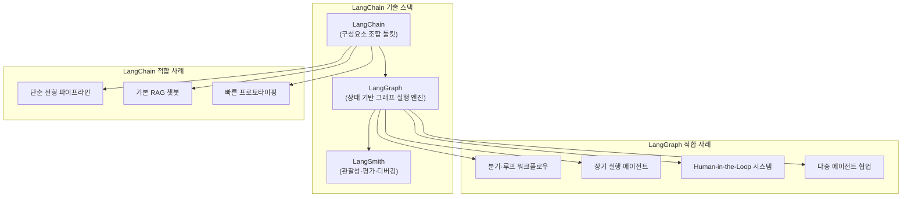

---

## 개념 1: 상태(State)

### 모든 에이전트의 토대

초보 개발자들이 AI 에이전트를 상상할 때 흔히 그리는 그림은 단순하다. 사용자 입력이 들어오면 LLM이 처리하고 응답이 나온다. 이 세 단계의 흐름은 개념 증명에는 충분하지만, 프로덕션 에이전트는 근본적으로 다르게 작동한다. 워크플로우 전체에 걸쳐 상태(State)를 유지하기 때문이다.

상태란 에이전트가 수행하는 작업 전반에 걸쳐 공유되는 정보 저장소다. 고객 지원 에이전트를 예로 들면, 티켓 ID, 고객 메시지, 고객 등급, 검색된 문서 목록, 감성 점수, 임시 응답 초안, 에스컬레이션 필요 여부, 최종 응답 등이 모두 하나의 상태 객체 안에 담겨 있다. 워크플로우가 진행됨에 따라 서로 다른 노드들이 이 공유 상태를 각자의 역할에 맞게 업데이트한다.

상태가 없다면 에이전트는 매 단계마다 컨텍스트를 잃어버리고, 디버깅은 극도로 어려워지며, 다단계 워크플로우 전체가 취약해진다. 반면 잘 설계된 상태 구조가 있으면 각 단계는 이전 작업을 완전히 이해하고, 워크플로우는 예측 가능해지며, 복잡한 시스템도 관리 가능해진다. 상태는 워크플로우 전체의 공유 메모리라고 생각하면 된다.

LangGraph에서는 Python의 `TypedDict`를 사용해 상태 스키마를 정의한다. LangGraph v1.1부터는 타입 안전 스트리밍(type-safe streaming)과 타입 안전 invoke, Pydantic 및 데이터클래스 강제 변환이 추가되어 상태 관리의 안정성이 크게 향상되었다. 또한 2026년 1월에는 `StateSchema`가 도입되어 Zod 4, Valibot, ArkType 등 다양한 표준 JSON Schema 준수 라이브러리와 함께 그래프 상태를 정의할 수 있게 되었다.

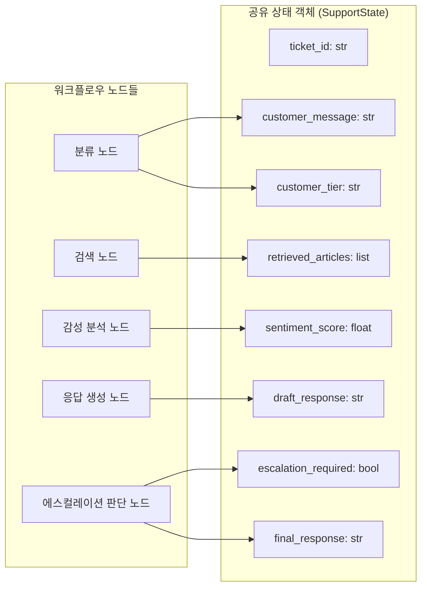

---

## 개념 2: 노드(Nodes)

### 복잡성의 단순한 건축 블록

많은 개발자들이 AI 에이전트는 마법 같은 프레임워크가 움직인다고 생각한다. 실제로는 그렇지 않다. LangGraph에서 대부분의 노드는 단순한 Python 함수다. 상태를 받아서 변환된 상태의 일부를 반환하는 것이 전부다.

검색 노드는 벡터 스토어에서 사용자 쿼리와 유사한 문서를 찾아 상태에 저장한다. 리랭킹 노드는 검색된 문서들을 재순위화하여 가장 관련성 높은 것만 남긴다. 생성 노드는 LLM을 호출해 임시 답변을 만들어 상태에 저장한다. 유효성 검증 노드는 생성된 답변이 기준을 충족하는지 확인한다. 각 노드는 하나의 일만 잘 수행한다.

이것이 노드 기반 아키텍처의 핵심 철학이다. 파워는 복잡성에서 나오지 않는다. 단순한 함수들의 오케스트레이션에서 나온다. 각 노드를 독립적으로 테스트할 수 있고, 개별적으로 교체하거나 개선할 수 있으며, 다른 워크플로우에서 재사용할 수 있다.

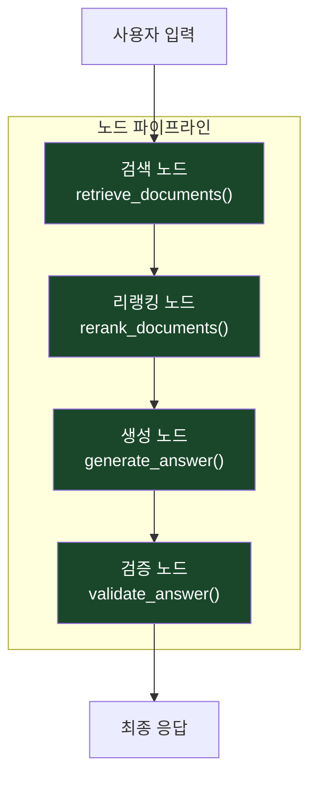

노드 기반 설계는 단순히 코드 구조화를 넘어서 에이전트 시스템의 유지보수성과 확장성에 직접적인 영향을 미친다. 예컨대 리랭킹 알고리즘을 교체하고 싶다면 리랭킹 노드 하나만 수정하면 된다. 검색 전략을 바꾸고 싶다면 검색 노드만 교체하면 된다. 전체 시스템을 뜯어고칠 필요가 없다.

---

## 개념 3: 체인(Chains) vs 그래프(Graphs)

### 선형 워크플로우의 한계와 그래프의 확장성

많은 LangChain 애플리케이션은 체인(Chain)으로 시작한다. 프롬프트 → LLM → 파서 → 응답으로 이어지는 선형 흐름이다. 체인은 단순하고 명확한 워크플로우에는 훌륭한 선택이다. 하지만 여러 에이전트가 필요하거나, 조건부 결정이 있거나, 인간 승인이 필요하거나, 재시도 로직이 있거나, 장기 실행 작업이 필요한 순간 선형 체인은 한계에 부딪힌다.

그래프는 이러한 시나리오를 자연스럽게 처리한다. LangGraph의 `StateGraph`는 노드(함수)와 엣지(연결)로 이루어진 방향성 비순환/순환 그래프를 정의할 수 있으며, 조건부 엣지를 통해 현재 상태에 따라 다음 실행 경로를 동적으로 결정한다. 이것이 에이전트 루프를 가능하게 하는 핵심 메커니즘이다.

예를 들어, ERP 마이그레이션 지원 에이전트를 생각해보자. 요구사항을 분석하고, 테스트 케이스를 생성하고, 커버리지를 검증하고, 이슈를 전문가에게 라우팅하며, 인간 승인을 요청하는 전 과정은 선형이 아니다. 본질적으로 그래프 형태의 워크플로우다.

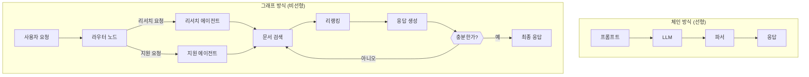

Spheron의 2026년 5월 분석에 따르면, 분기 없는 선형 파이프라인이라면 LangChain만으로 충분하지만, 에이전트가 루프를 돌고 분기하며 실패 후 재개하거나 Human-in-the-Loop 승인을 기다려야 한다면 LangGraph가 필수다. 실제로 대부분의 프로덕션 에이전트는 이 두 번째 범주에 속한다. LangChain의 스트리밍은 체인 레벨에서 작동하는 반면, LangGraph의 스트리밍은 그래프 레벨에서 작동하며 어떤 노드가 실행 중인지까지 가시성을 제공한다.

---

## 개념 4: 라우팅(Routing)

### 거대한 프롬프트를 이기는 전략

AI 개발 과정에서 가장 흔한 실수 중 하나는 거대한 단일 프롬프트를 만드는 것이다. "당신은 결제 전문가이면서 기술 지원 엔지니어이고 영업 담당자이며 제품 전문가이고 컴플라이언스 어드바이저입니다"라는 식의 프롬프트는 일견 강력해 보이지만 실제로는 잘 동작하지 않는다. 모델은 모든 역할을 동시에 수행하려다 중간 어딘가에서 길을 잃는다.

더 나은 해결책은 라우팅(Routing)이다. 라우팅이란 들어오는 요청을 분석하여 가장 적합한 전문화된 에이전트나 서브그래프로 보내는 것이다. 결제 관련 질문은 결제 에이전트가, 오류 관련 질문은 기술 에이전트가, 가격 관련 질문은 영업 에이전트가 처리한다.

전문화된 에이전트들은 작은 프롬프트, 높은 정확도, 낮은 토큰 비용, 쉬운 유지보수, 예측 가능한 출력이라는 모든 면에서 단일 거대 에이전트를 압도한다. 최고의 AI 시스템은 보통 하나의 거대한 전문가가 아니라 전문가들의 팀이다.

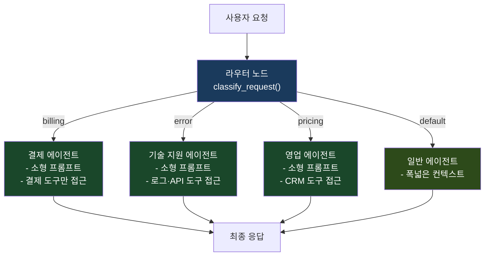

라우터는 단순한 키워드 매칭부터 LLM을 활용한 의도 분류까지 다양한 방식으로 구현할 수 있다. LangGraph에서는 조건부 엣지(conditional edge)가 이 라우팅 로직을 담당한다. 현재 상태를 평가하는 함수를 실행하고, 그 결과에 따라 다음 노드로의 경로를 결정하는 방식이다. Cisco의 엔지니어링 팀이 LangGraph로 구축한 다중 에이전트 모델은 장애 원인 파악 시간을 93% 단축하고 한 달 만에 200시간 이상의 엔지니어링 시간을 절약했다고 보고했다.

---

## 개념 5: 검색(Retrieval)

### 벡터 검색 그 이상의 RAG 시스템

많은 개발자들은 RAG(Retrieval-Augmented Generation)를 "벡터 검색 → LLM → 답변"의 세 단계로 이해한다. 데모에서는 충분하지만 프로덕션 시스템에는 불충분하다. 벡터 데이터베이스가 20개의 관련 문서를 반환해도, 그 중 실제로 필요한 정보를 담은 문서는 5개에 불과할 수 있다. 나머지 15개는 LLM의 컨텍스트 윈도우를 낭비하고 응답 품질을 저하시킨다.

프로덕션 RAG 시스템은 검색(Retrieve) → 리랭킹(Rerank) → 필터링(Filter) → 생성(Generate)의 4단계 구조로 동작한다. 초기 검색에서 넓게 찾고(예: 20개), 리랭킹 모델로 관련성을 재평가하여 상위 5개만 남긴 후 LLM에 전달한다. 이것이 답변 품질을 크게 개선하는 핵심이다.

1,000만 개 문서가 있는 기업 지식베이스에서는 하이브리드 검색(키워드 + 벡터), 메타데이터 필터링, 리랭킹, 컨텍스트 압축을 LLM이 데이터를 보기 훨씬 전에 이미 적용한다. 훌륭한 RAG 시스템은 AI 시스템이기 이전에 검색 시스템이다.

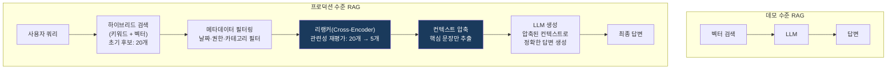

리랭킹이 왜 중요한가? 벡터 유사도 검색은 의미적 근접성을 측정하지만, 실제 유용성과 완전히 일치하지는 않는다. 예컨대 "결제 실패"라는 쿼리에 대해 벡터 검색은 "결제"와 "실패"라는 단어가 많이 포함된 문서를 먼저 반환할 수 있지만, 실제로 해결책을 담고 있는 문서는 다른 순위에 있을 수 있다. 교차 인코더(Cross-Encoder) 방식의 리랭커는 쿼리와 문서 쌍을 함께 평가하여 실제 관련성을 더 정확히 판단한다.

---

## 개념 6: 구조화된 출력(Structured Outputs)

### 비용이 큰 실패를 방지하는 스키마 강제

모든 AI 엔지니어가 경험하는 악몽이 있다. LLM에게 유효한 JSON을 반환하라고 요청했는데 쉼표 하나가 빠져 있거나 따옴표가 잘못된 JSON이 돌아오는 것이다. 파서는 충돌하고 워크플로우 전체가 실패한다. 이것은 예외적인 상황이 아니라 LLM의 본질적인 특성에서 비롯된 일상적인 위험이다.

구조화된 출력은 이 문제를 근본적으로 해결한다. Pydantic 모델이나 JSON Schema로 출력 형식을 명시적으로 정의하고, `llm.with_structured_output()` 메서드를 사용하면 LLM은 그 스키마에 맞는 출력만 생성한다. 다른 시스템이 AI 출력을 소비하는 경우라면 스키마는 선택이 아니라 필수다.

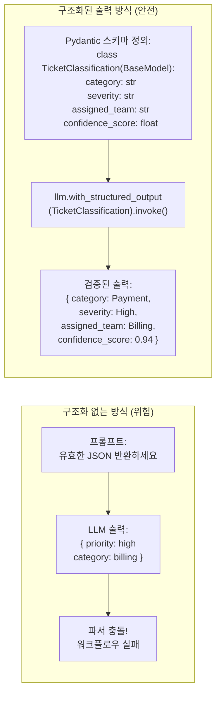

구조화된 출력은 단순한 파싱 안정성을 넘어 시스템 전체의 신뢰성을 높인다. 다운스트림 시스템은 AI 출력 형식을 신뢰할 수 있고, 유효성 검증 로직을 별도로 구현할 필요가 줄어들며, 디버깅 시 어디서 문제가 발생했는지 즉시 파악할 수 있다. LangGraph에서는 노드가 구조화된 출력을 생성하고 이를 상태에 직접 저장함으로써 이후 노드들이 안전하게 데이터를 활용할 수 있다.

---

## 개념 7: 스트리밍(Streaming)

### 사용자 경험을 혁신하는 점진적 응답

사용자들은 기다리는 것을 싫어한다. 15초 동안 아무 반응 없이 기다리는 것과, 응답이 즉시 글자 단위로 나타나기 시작하는 것 — 두 경우 총 소요 시간이 동일해도 사용자는 거의 항상 후자를 선호한다. 이것이 스트리밍이 사용자 경험에서 갖는 의미다. 실제 성능보다 체감 성능이 더 중요한 경우가 많다.

LangGraph는 그래프 수준에서의 스트리밍을 지원하며, 단순히 토큰을 스트리밍하는 것을 넘어 어떤 노드가 현재 실행 중인지까지 가시성을 제공한다. 사용자에게 "요구사항 분석 중...", "문서 검색 중...", "응답 생성 중...", "결과 검증 중..."과 같은 단계별 진행 상황을 실시간으로 보여줄 수 있다. 수백 개의 마이그레이션 테스트 케이스를 생성하는 작업처럼 오래 걸리는 작업에서 이런 진행 상황 업데이트가 사용자 만족도를 크게 향상시킨다.

LangGraph v1.1부터는 타입 안전 스트리밍이 도입되어 스트림 중에 전송되는 데이터의 타입이 정적으로 검증된다. 이를 통해 런타임에 발생할 수 있는 타입 관련 오류를 개발 단계에서 미리 잡을 수 있다.

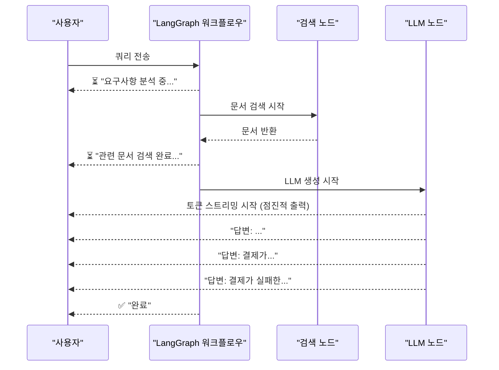

---

## 개념 8: 메모리(Memory)

### 대화 기록을 넘어서는 운영 메모리

대부분의 개발자들은 AI 에이전트의 메모리를 대화 기록(chat history)과 동일시한다. "이전에 이런 말을 했습니다"를 기억하는 것. 이것은 메모리의 가장 기초적인 형태다. 진정한 에이전트는 훨씬 더 복잡한 운영 메모리(operational memory)를 필요로 한다.

코딩 에이전트를 예로 들어보자. 이 에이전트는 현재 작업 중인 저장소 이름, 수정한 파일 목록, 실패한 테스트 케이스들, 마지막 수정 시도 내용, 생성된 풀 리퀘스트 URL을 모두 기억해야 한다. 단순한 대화 기록이 아니라 이전의 결정들, 도구 실행 결과, 실패했던 시도들, 검색된 문서들, 저장소의 현재 상태까지 포괄하는 풍부한 운영 컨텍스트다.

이러한 메모리는 에이전트가 시간이 지남에 따라 더 나은 결정을 내릴 수 있게 한다. 이전에 시도했다 실패한 방법을 다시 시도하지 않고, 이미 검색한 문서를 다시 검색하지 않으며, 이전 단계에서 얻은 정보를 활용해 더 지능적인 다음 행동을 선택할 수 있다. 메모리는 고립된 인터랙션을 지능형 워크플로우로 변환하는 핵심 요소다.

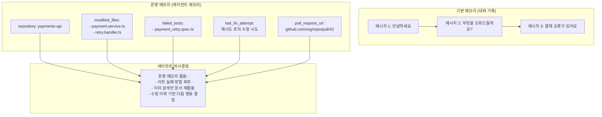

LangGraph는 단기 메모리(그래프 상태 내 메모리)와 장기 메모리(세션 간 지속 메모리)를 모두 지원한다. 장기 메모리는 체크포인터(PostgresSaver 등)를 통해 구현된다. 또한 임베딩 기반의 크로스 세션 장기 메모리를 위해서는 별도의 벡터 스토어 통합이 필요하다.

---

## 개념 9: 체크포인팅(Checkpointing)

### 장기 실행 워크플로우를 위한 영속성 인프라

실제 시스템은 실패한다. 모델이 타임아웃되고, API가 일시적으로 불가용해지며, 인간이 결과를 검토하는 데 시간이 필요하다. 체크포인팅 없이는 이러한 중단이 발생할 때마다 워크플로우 전체를 처음부터 다시 실행해야 한다. 체크포인팅이 있으면 마지막 저장 지점부터 재개할 수 있다.

LangGraph의 체크포인팅은 각 노드 실행 후 전체 그래프 상태를 저장소에 자동으로 저장한다. `MemorySaver`(인메모리), `SqliteSaver`, `PostgresSaver` 등 다양한 백엔드를 지원한다. 프로덕션 환경에서는 `PostgresSaver`가 표준으로 사용된다. 체크포인팅은 단순한 실패 복구를 넘어 여러 강력한 기능을 가능하게 한다.

첫째, 대화 메모리다. 에이전트가 세션 간 이전 대화를 기억한다. 둘째, 타임트래블 디버깅(time-travel debugging)이다. 어떤 이전 상태로도 되돌아가 검사하거나 재실행할 수 있다. 이는 LangGraph의 차별화된 강점 중 하나로, 에이전트의 행동을 깊이 있게 이해하고 디버깅하는 데 강력한 도구다. 셋째, 내결함성(fault tolerance)이다. 노드가 실패하면 마지막 체크포인트부터 실행을 재개한다. 넷째, Human-in-the-Loop 워크플로우다. 그래프가 일시 중지되고, 인간이 검토한 후 실행을 계속할 수 있다.

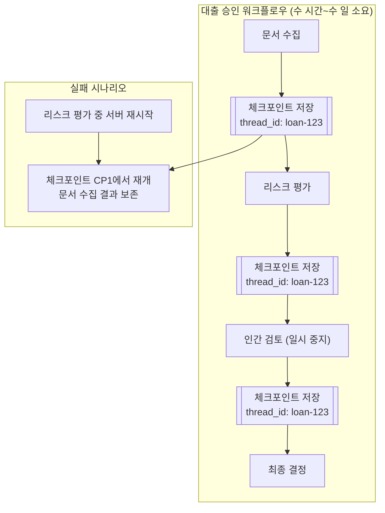

Medium의 "LangSmith and LangGraph in 2026" 기사에 따르면, LangGraph는 2025년 말 첫 안정적인 주요 릴리즈를 달성했으며, 서버가 재시작되거나 장기 실행 워크플로우가 중단되더라도 컨텍스트 손실 없이 정확히 중단된 지점에서 재개할 수 있는 것이 핵심 가치다. 이 특성이 Klarna, Uber, LinkedIn 같은 기업들이 LangGraph를 선택한 주요 이유 중 하나다.

---

## 개념 10: Human-in-the-Loop

### AI의 진정한 미래 — 협력

AI 에이전트에 관한 가장 큰 오해 중 하나는 완전 자율로 동작해야 한다는 것이다. 현실에서 대부분의 엔터프라이즈 시스템은 인간의 감시를 필요로 한다. AI가 완전히 자율적으로 결정을 내리는 시스템은 실제로 생각보다 훨씬 드물다.

LangGraph의 Human-in-the-Loop는 그래프 정의에 명시적인 일시 중지 지점(interrupt point)을 직접 삽입하는 방식으로 구현된다. 실행이 해당 지점에서 자동으로 멈추고, 인간이 `get_state()`로 현재 상태를 확인하거나 `update_state()`로 상태를 수정한 후 실행을 재개할 수 있다. 노드 로직을 수정하지 않고도 중간 출력 검토, 관찰 기반 상태 조정, 승인 단계 삽입이 가능하다.

리스크 점수가 0.8을 초과하는 경우 자동 승인 대신 인간 검토로 라우팅하는 대출 승인 에이전트를 예로 들 수 있다. 법적 계약 분석, ERP 마이그레이션 검증, 의료 추천, 금융 감사 등 고위험 도메인에서는 인간 검토가 표준 관행이다.

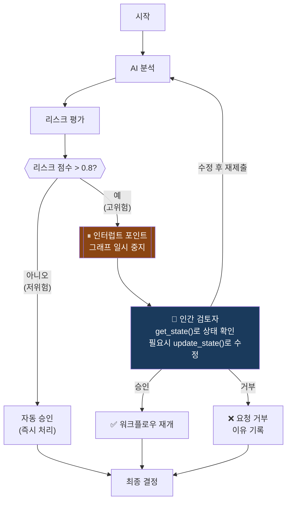

가장 성공적인 AI 시스템은 인간을 대체하지 않는다. 인간이 더 빠르고 더 나은 결정을 내릴 수 있도록 돕는다. 이것이 2026년 AI의 현실이다. 완전 자율 AI에 대한 기대와 달리, 실제 엔터프라이즈 환경에서는 감사 가능성(auditability), 설명 가능성(explainability), 인간 책임(human accountability)이 여전히 요구된다. LangGraph의 Human-in-the-Loop는 이 요구에 직접적으로 응답하는 아키텍처적 해결책이다.

---

## 종합

### 프로덕션 AI 워크플로우의 완성된 구조

10가지 개념이 어떻게 통합되는지 전체 그림을 보면 비로소 현대 AI 엔지니어링의 본질이 드러난다.

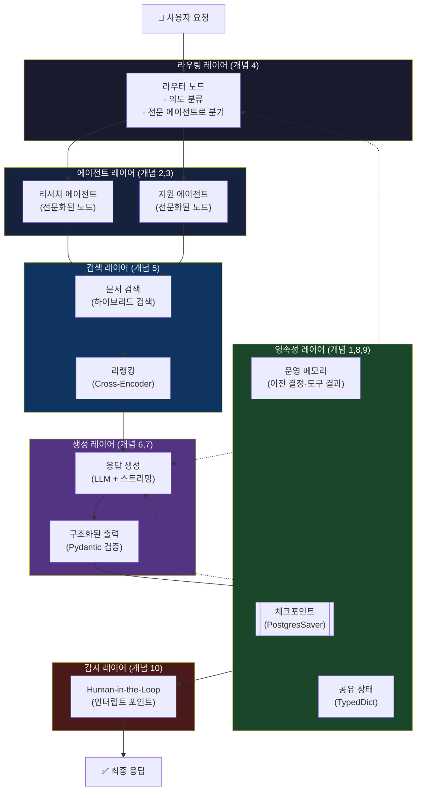

이 구조에서 주목해야 할 것은 거대한 단일 프롬프트가 존재하지 않는다는 점이다. 대신 전문화된 구성요소들이 협력한다. 공유 상태가 전체 워크플로우의 메모리를 담당하고, 전문화된 노드들이 각자 하나의 일만 잘 수행하며, 그래프 아키텍처가 복잡한 비선형 흐름을 가능하게 하고, 라우팅이 적합한 전문가에게 작업을 배정하며, 리랭킹을 포함한 정교한 검색이 LLM에게 최적의 컨텍스트를 제공하고, 구조화된 출력이 시스템 안정성을 보장하며, 스트리밍이 사용자 체감 성능을 향상시키고, 운영 메모리가 에이전트의 지능적 의사결정을 돕고, 체크포인팅이 장기 실행과 실패 복구를 가능하게 하며, Human-in-the-Loop가 고위험 결정에 인간 감시를 추가한다. 이것이 현대 AI 엔지니어링의 핵심이다.

---

## 실제 기업 도입 사례

10가지 개념이 현실에서 어떻게 작동하는지는 LangGraph를 프로덕션 환경에 도입한 기업들의 사례를 보면 잘 알 수 있다.

**Klarna**는 LangGraph와 LangSmith를 기반으로 8,500만 명의 활성 사용자를 지원하는 AI 고객 지원 어시스턴트를 구축했다. 이 시스템은 고객 해결 시간을 평균 11분에서 2분으로 단축하여 80% 감소를 달성했으며, 250만 건의 대화를 처리하고 있다. 이는 700명의 정규직 직원에 해당하는 생산성이며, 예상 수익 개선 효과는 4,000만 달러에 달한다.

**Uber**의 개발자 플랫폼 팀은 LangGraph를 사용해 대규모 코드 마이그레이션을 수행하는 에이전트 네트워크를 구축하고 유닛 테스트 생성을 자동화했다. 이를 통해 약 2만 1,000시간의 개발자 시간을 절약했다.

**LinkedIn**은 LangGraph로 AI 기반 리크루터를 구축하여 후보자 소싱, 매칭, 메시징을 자동화했다. 또한 데이터 분석을 위한 text-to-SQL 에이전트 스택에도 LangGraph를 활용하고 있다.

**Cisco**의 엔지니어링 팀은 LangGraph를 "에이전틱 엔지니어링(agentic engineering)"이라 부르는 접근 방식으로 구현했다. LangSmith와 LangGraph로 구축한 다중 에이전트 모델은 장애 근본 원인 파악 시간을 93% 단축하고 한 달에 200시간 이상의 엔지니어링 시간을 절약했다.

**Elastic**은 위협 탐지 시나리오에서 AI 에이전트를 오케스트레이션하는 데 LangGraph를 활용하며, SecOps의 노동 집약적 작업을 크게 줄였다.

**Credit Genie**는 LangGraph와 LangSmith's Insights Agent로 AI 금융 어시스턴트 AskGenie를 구축했다. Insights Agent를 통해 대화의 36%가 고객 지원 요청임을 발견하고, 기존 지원 챗봇의 기능 공백을 확인할 수 있었다.

**AppFolio**는 부동산 관리자를 위한 Realm-X 코파일럿에 LangGraph를 도입한 후 응답 정확도가 2배 향상되었고, 주당 10시간 이상을 절약하고 있다.

---

## 2026년 현재 생태계 현황

2026년 현재 LangChain/LangGraph 생태계의 주요 현황을 정리하면 다음과 같다.

**LangGraph 버전 현황**: LangGraph v1.2.4가 최신 버전(2026년 6월 기준)으로, 2026년 5월 11일 출시된 v1.2.0을 기점으로 안정성이 크게 향상되었다. v1.1에서는 타입 안전 스트리밍, 타입 안전 invoke, Pydantic 및 데이터클래스 강제 변환이 도입되었다. TypeScript 버전도 Python과 완전한 기능 동등성(StateGraph, 조건부 엣지, 체크포인팅, 스트리밍, Human-in-the-Loop)을 달성했다.

**LangSmith Fleet**: 2026년 3월에 'Agent Builder'가 'LangSmith Fleet'으로 이름이 변경되었다. Fleet에는 에이전트 정체성(agent identity), 공유, 권한 관리 기능이 추가되어 기업 전체에서 에이전트 플리트를 안전하게 관리할 수 있다. Skills 기능도 추가되었다.

**LangGraph Deploy CLI**: 2026년 3월, `langgraph-cli` 패키지에 새로운 배포 커맨드가 도입되어 터미널에서 단 한 단계로 LangSmith Deployment에 에이전트를 배포할 수 있게 되었다.

**StateSchema**: 2026년 1월 도입된 StateSchema는 Zod 4, Valibot, ArkType 등 Standard JSON Schema 호환 라이브러리라면 어떤 것이든 그래프 상태 정의에 사용할 수 있는 라이브러리 불가지론적 방식이다.

**산업 채택 현황**: LangChain의 2025년 AI 에이전트 현황 보고서에 따르면, 현재 57%의 조직이 AI 에이전트를 프로덕션에 배포했으며, 89%가 관찰성 도구를 표준 관행으로 채택했다. LangGraph는 2026년 4월 기준 월 3만 3,100건의 Google 검색을 기록하며 다른 Python 에이전트 툴킷을 압도하고 있다.

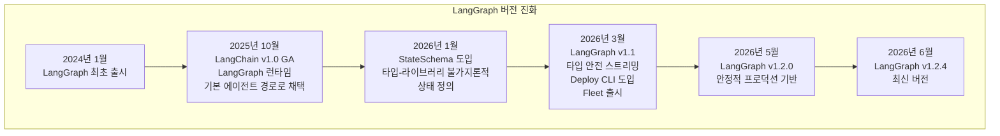

---

## 결론

이 아티클에서 가장 중요한 교훈은 하나다. 신뢰할 수 있는 AI 애플리케이션은 대부분 모델에 관한 것이 아니다. 워크플로우 설계에 관한 것이다.

상태(State), 노드(Nodes), 그래프(Graphs), 라우팅(Routing), 검색(Retrieval), 구조화된 출력(Structured Outputs), 스트리밍(Streaming), 메모리(Memory), 체크포인팅(Checkpointing), Human-in-the-Loop — 이 10가지 개념은 모델을 끝없이 조정하는 것보다 AI 시스템을 훨씬 더 향상시킨다. 모델은 계속 진화할 것이다. 좋은 아키텍처는 계속해서 중요할 것이다.

2026년에 AI 에이전트를 구축하고 있다면, 먼저 이 개념들을 숙달하는 것이 최선이다. LangGraph v1.2가 2026년에 업계가 정착한 에이전트 프레임워크로 자리잡은 이유는 바로 이 10가지 개념을 구현하는 데 필요한 모든 기반을 체계적으로 제공하기 때문이다.

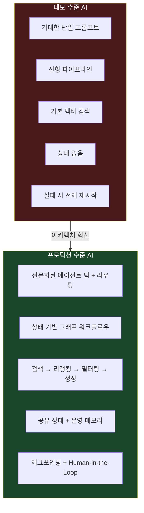

---

*본 문서는 Sachin Kasana의 원문 아티클과 2026년 상반기 LangChain 공식 블로그, Spheron, AlphaBold, tech-insider.org, Atlan, ClickItTech 등의 검증된 최신 정보를 종합하여 작성되었습니다.*

**작성 일자: 2026-06-11**
