> **원문**: Fareed Khan, ["Building a Senior Staff Engineer with Sub-Agent Teams in Claude Code"](https://medium.com/gitconnected/building-a-senior-staff-engineer-with-sub-agent-teams-in-claude-code-771298151392)  
> **출처**: Medium / Level Up Coding (2026년 4월 13일)  
> **GitHub**: https://github.com/FareedKhan-dev/claude-code-staff-engineer  
> **작성일**: 2026-06-11

---

## 목차

1. [개요 및 핵심 통찰](#1-개요-및-핵심-통찰)
2. [전체 시스템 아키텍처](#2-전체-시스템-아키텍처)
3. [팀 코드베이스 구조](#3-팀-코드베이스-구조)
4. [Hooks: 관리 레이어](#4-hooks-관리-레이어)
5. [직원 핸드북과 1% 규칙](#5-직원-핸드북과-1-규칙)
6. [브레인스토밍과 설계 단계](#6-브레인스토밍과-설계-단계)
7. [스펙 리뷰: 논리적 허점 탐지](#7-스펙-리뷰-논리적-허점-탐지)
8. [비주얼 컴패니언: 브라우저 화이트보드](#8-비주얼-컴패니언-브라우저-화이트보드)
9. [계획 작성: 백로그 그루밍](#9-계획-작성-백로그-그루밍)
10. [계획 리뷰: 그루밍 게이트키퍼](#10-계획-리뷰-그루밍-게이트키퍼)
11. [서브에이전트 기반 개발: 위임의 기술](#11-서브에이전트-기반-개발-위임의-기술)
12. [구현자 프롬프트: 개발자 직무 기술서](#12-구현자-프롬프트-개발자-직무-기술서)
13. [스펙 및 코드 품질 리뷰어: 준법 감시관](#13-스펙-및-코드-품질-리뷰어-준법-감시관)
14. [테스트 주도 개발: 철의 법칙](#14-테스트-주도-개발-철의-법칙)
15. [테스팅 안티패턴: 게으른 QA 훈련](#15-테스팅-안티패턴-게으른-qa-훈련)
16. [체계적 디버깅: 포렌식 엔지니어링](#16-체계적-디버깅-포렌식-엔지니어링)
17. [근본 원인 추적과 심층 방어](#17-근본-원인-추적과-심층-방어)
18. [완료 전 검증: 최종 사인오프](#18-완료-전-검증-최종-사인오프)
19. [피어 리뷰 미팅: 코드 리뷰 문화](#19-피어-리뷰-미팅-코드-리뷰-문화)
20. [Git Worktrees: 생물학적 격리 용기](#20-git-worktrees-생물학적-격리-용기)
21. [개발 브랜치 마무리: 릴리스 엔지니어링](#21-개발-브랜치-마무리-릴리스-엔지니어링)
22. [스킬 작성 아카데미](#22-스킬-작성-아카데미)
23. [에이전트와 커맨드: 팀 디렉토리](#23-에이전트와-커맨드-팀-디렉토리)
24. [실제 테스트: 시스템이 동작하는 방식](#24-실제-테스트-시스템이-동작하는-방식)
25. [Claude Code 에이전트 생태계 최신 동향 (2026)](#25-claude-code-에이전트-생태계-최신-동향-2026)
26. [향후 개선 방향](#26-향후-개선-방향)
27. [결론 및 핵심 정리](#27-결론-및-핵심-정리)

---

## 1. 개요 및 핵심 통찰

### 주니어와 시니어 엔지니어의 차이

이 글의 출발점은 매우 통찰력 있는 질문 하나로 시작된다. 주니어 엔지니어와 시니어 엔지니어의 차이는 무엇인가? 저자 Fareed Khan은 이 차이가 문법 지식이나 알고리즘 능력에 있는 것이 아니라고 말한다. 진짜 차이는 **예측 가능성**, **위험 관리**, 그리고 **압박 상황에서의 규율**에 있다.

AI 에이전트는 바로 이 지점에서 실패한다. 에이전트는 리뷰를 건너뛰고, 지름길을 합리화하며, 아무도 실제로 검증하지 않은 코드를 자랑스럽게 제출한다. Anthropic의 연구에 따르면 에이전트들은 협력은 잘 하지만, 구조 없이 에이전트를 늘리는 것은 더 많은 혼돈과 낭비된 컴퓨팅 자원을 의미할 뿐이다.

해결책은 실제 기업이 갖추고 있는 것과 동일한 구조다. 즉, 설계에서 배포까지 이어지는 규율 있는 파이프라인을 통해 전문화된 서브에이전트를 조율하는 스태프 엔지니어가 필요하다. 이 프레임워크는 Claude Code 위에서 그 역할을 하도록 설계되었다.

### 시스템의 4대 운영 원칙

이 시스템이 실제 엔지니어링 조직처럼 작동하는 방식은 다음 네 가지 핵심 책임 분리로 요약된다.

첫째, **발견 및 설계(Discovery & Design)** 다. 아키텍트 에이전트는 질문을 한 번에 하나씩 하고, 2-3가지 접근법을 트레이드오프와 함께 탐구하며, 설계 스펙을 git에 커밋한다. 인간의 승인 없이는 코드를 작성하지 않는다.

둘째, **계획 및 리뷰(Planning & Review)** 다. 테크 리드가 스펙을 2-5분 단위 태스크로 분해하고, 각 태스크에는 정확한 파일 경로와 완전한 코드가 포함된다. 신선한 서브에이전트가 계획을 스펙과 대조하여 감사하고, 빠진 부분이나 스코프 크리프를 찾아낸다.

셋째, **실행 엔진(Execution Engine)** 이다. 매니저가 태스크별로 격리된 컨텍스트를 가진 신선한 서브에이전트를 파견한다. 막힌 에이전트는 에스컬레이션하고, 나쁜 작업물은 종료 후 재파견된다.

넷째, **품질 게이트(Quality Gates)** 다. 두 단계의 순차 리뷰가 진행된다. 스펙 준수 검토(올바른 것을 만들었는가?)와 코드 품질 검토(잘 만들었는가?)가 순서대로 진행되며, 검증 게이트는 완료를 주장하기 전에 신선한 터미널 출력을 요구한다.

---

## 2. 전체 시스템 아키텍처

아래 다이어그램은 이 시스템의 전체 흐름을 보여준다. 인간 스테이크홀더가 최상위 권한을 가지며, 스태프 엔지니어가 중심 조율자 역할을 한다.

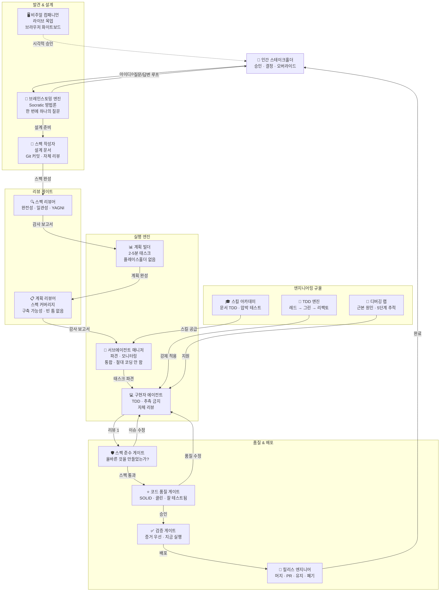
```mermaid
flowchart TD
    HUMAN["👤 인간 스테이크홀더\n승인 · 결정 · 오버라이드"]

    subgraph DISCOVERY["발견 & 설계"]
        BRAIN["🧠 브레인스토밍 엔진\nSocratic 방법론\n한 번에 하나의 질문"]
        SPEC_WRITER["📝 스펙 작성자\n설계 문서\nGit 커밋 · 자체 리뷰"]
        VISUAL["🖥 비주얼 컴패니언\n라이브 목업\n브라우저 화이트보드"]
    end

    subgraph REVIEW_GATES["리뷰 게이트"]
        SPEC_REV["🔍 스펙 리뷰어\n완전성 · 일관성 · YAGNI"]
        PLAN_REV["📋 계획 리뷰어\n스펙 커버리지\n구축 가능성 · 빈 틈 없음"]
    end

    subgraph EXECUTION["실행 엔진"]
        SUBAGENT_MGR["👥 서브에이전트 매니저\n파견 · 모니터링\n통합 · 절대 코딩 안 함"]
        IMPLEMENTER["💻 구현자 에이전트\nTDD · 추측 금지\n자체 리뷰"]
        PLAN_BUILDER["📊 계획 빌더\n2-5분 태스크\n플레이스홀더 없음"]
    end

    subgraph QUALITY["품질 & 배포"]
        COMPLIANCE["🛡 스펙 준수 게이트\n올바른 것을 만들었는가?"]
        CODE_QUAL["⭐ 코드 품질 게이트\nSOLID · 클린 · 잘 테스트됨"]
        VERIFY["✅ 검증 게이트\n증거 우선 · 지금 실행"]
        RELEASE["🚀 릴리스 엔지니어\n머지 · PR · 유지 · 폐기"]
    end

    subgraph DISCIPLINE["엔지니어링 규율"]
        TDD_ENGINE["🔴 TDD 엔진\n레드 → 그린 → 리팩토"]
        DEBUG_LAB["🔬 디버깅 랩\n근본 원인 · 5단계 추적"]
        SKILL_ACADEMY["🎓 스킬 아카데미\n문서 TDD · 압박 테스트"]
    end

    HUMAN -- "아이디어 요청" --> BRAIN
    BRAIN -- "질문/답변 루프" --> HUMAN
    VISUAL -. "시각적 승인" .-> HUMAN
    BRAIN -- "설계 준비" --> SPEC_WRITER
    SPEC_WRITER -- "스펙 완성" --> SPEC_REV
    SPEC_REV -- "감사 보고서" --> PLAN_BUILDER
    PLAN_BUILDER -- "계획 완성" --> PLAN_REV
    PLAN_REV -- "감사 보고서" --> SUBAGENT_MGR
    SUBAGENT_MGR -- "태스크 파견" --> IMPLEMENTER
    IMPLEMENTER -- "리뷰 1" --> COMPLIANCE
    COMPLIANCE -- "스펙 통과" --> CODE_QUAL
    CODE_QUAL -- "승인" --> VERIFY
    COMPLIANCE -- "이슈 수정" --> IMPLEMENTER
    CODE_QUAL -- "품질 수정" --> IMPLEMENTER
    VERIFY -- "배포" --> RELEASE
    RELEASE -- "완료" --> HUMAN
    TDD_ENGINE -- "강제 적용" --> IMPLEMENTER
    DEBUG_LAB -- "지원" --> IMPLEMENTER
    SKILL_ACADEMY -- "스킬 공급" --> SUBAGENT_MGR
```

---

## 3. 팀 코드베이스 구조

### 조직 스캐폴딩을 먼저 구축한다

Spotify, Shopify, Stripe 같은 회사에서 스태프 엔지니어가 새 프로젝트에서 하는 첫 번째 일은 기능 코딩이 아니다. 그들은 프로젝트 구조, 개발 워크플로우, CI/CD 파이프라인, 팀 규범을 확립한다. 제품 코드 한 줄이 작성되기 전에 조직적 스캐폴딩을 구축하는 것이다.

이 시스템도 동일한 접근법을 취한다. 솔로 개발자가 아닌 협력하고, 프로세스를 따르고, 서로에게 책임을 지는 에이전트 팀을 구축하고 있기 때문에 구조가 필요하다.

```
senior_staff_engineer/
├── agents/                             # 에이전트 + 서브에이전트 정의
├── commands/                           # 커스텀 CLI 스타일 에이전트 명령어
├── hooks/                              # 라이프사이클 훅 (이벤트, 워크플로우 제어)
└── skills/                             # 핵심 역량 모듈
    ├── brainstorming/                  # 아이디어 생성 & 설계
    │   └── scripts/                    # 비주얼/인터랙티브 브레인스토밍
    ├── dispatching-parallel-agents/    # 다중 에이전트 조율
    ├── executing-plans/                # 단계별 계획 실행
    ├── finishing-a-development-branch/ # 머지 전 작업 완료
    ├── receiving-code-review/          # 피드백 처리 & 반복
    ├── requesting-code-review/         # PR 준비 + 리뷰 요청
    ├── subagent-driven-development/    # 서브에이전트에 위임
    ├── systematic-debugging/           # 근본 원인 분석
    ├── test-driven-development/        # 테스트 작성 → 구현 → 검증
    ├── using-git-worktrees/            # 워트리를 통한 작업 격리
    ├── using-senior-staff-engineer/    # 이 시스템 구성 & 최적화
    ├── verification-before-completion/ # 완료 전 최종 검증
    ├── writing-plans/                  # 계획 생성
    └── writing-skills/                 # 새 스킬 작성
```

이 디렉토리 구조는 실제 엔지니어링 조직의 각 역할이나 기능에 대응한다. `agents/` 디렉토리는 팀 로스터로 누가 무엇을 하는지 정의하고, `skills/` 디렉토리는 모든 팀원이 따르는 프로세스와 표준이 담긴 직원 핸드북이며, `hooks/` 디렉토리는 정보의 흐름을 제어하고 모든 사람이 정렬된 상태로 시작하도록 보장하는 관리 레이어다.

---

## 4. Hooks: 관리 레이어

### 보이지 않는 관리 인프라

모든 회사에는 보이지 않게 작동하는 관리 인프라 레이어가 있다. 첫 번째 회의 전에 사무실은 이미 열려 있고, 커피 머신은 돌아가고, 공유 캘린더는 동기화되어 있으며, 팀의 Slack 채널에는 밤사이 업데이트가 가득 차 있다. 아무도 이 인프라에 대해 생각하지 않는다. 고장이 날 때까지는.

이 시스템에서 `hooks/`가 바로 이 관리 레이어다. Claude Code에서 훅은 세션 시작, 컨텍스트 초기화, 에이전트의 메모리 압축 시점 같은 특정 라이프사이클 이벤트에서 무슨 일이 일어날지 제어할 수 있게 해준다.

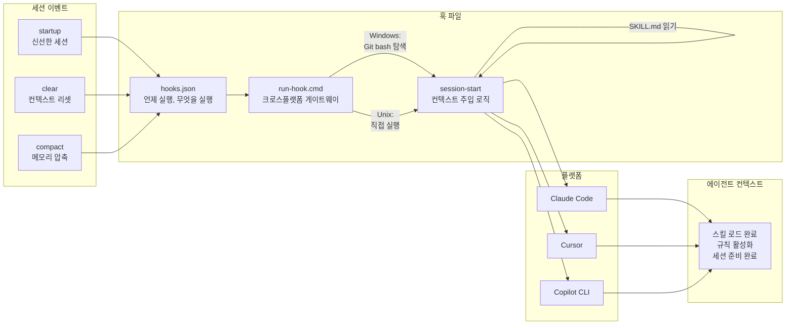
```mermaid
flowchart LR
    subgraph EVENTS["세션 이벤트"]
        SE1["startup\n신선한 세션"]
        SE2["clear\n컨텍스트 리셋"]
        SE3["compact\n메모리 압축"]
    end

    subgraph HOOKS_FILES["훅 파일"]
        HJ["hooks.json\n언제 실행, 무엇을 실행"]
        RH["run-hook.cmd\n크로스플랫폼 게이트웨이"]
        SS["session-start\n컨텍스트 주입 로직"]
    end

    subgraph PLATFORMS["플랫폼"]
        CC["Claude Code"]
        CUR["Cursor"]
        COPI["Copilot CLI"]
    end

    subgraph OUTPUT["에이전트 컨텍스트"]
        AC["스킬 로드 완료\n규칙 활성화\n세션 준비 완료"]
    end

    SE1 --> HJ
    SE2 --> HJ
    SE3 --> HJ
    HJ --> RH
    RH -- "Windows:\nGit bash 탐색" --> SS
    RH -- "Unix:\n직접 실행" --> SS
    SS -- "SKILL.md 읽기" --> SS
    SS --> CC
    SS --> CUR
    SS --> COPI
    CC --> AC
    CUR --> AC
    COPI --> AC
```

### hooks.json의 구성

`hooks.json`은 단순하다. 세션이 시작될 때마다 초기화 스크립트를 실행하는 한 가지 규칙을 정의한다.

```json
{
  "hooks": {
    "SessionStart": [
      {
        "matcher": "startup|clear|compact",
        "hooks": [
          {
            "type": "command",
            "command": "\"${PROJECT_ROOT_DIR}/hooks/run-hook.cmd\" session-start",
            "async": false
          }
        ]
      }
    ]
  }
}
```

매처는 세 가지 시나리오에서 트리거된다. `startup`은 신선한 세션, `clear`는 컨텍스트 리셋, `compact`는 메모리 압축 시점이다. 조직적 관점에서 이것은 프로젝트로 컨텍스트 전환할 때마다 실행되는 온보딩 체크리스트를 가지는 것과 같다. AI 에이전트 입장에서 모든 세션은 첫날이기 때문이다. 에이전트에게는 어제 세션의 기억이 없다. 매번 재온보딩이 필요하다.

`async: false` 플래그는 에이전트가 응답을 시작하기 전에 훅이 완료되도록 보장한다. 이것은 "아침 스탠드업이 끝난 후에야 누구든 노트북을 열 수 있다"고 말하는 것과 동일하다.

### 크로스플랫폼 게이트웨이

실제 회사에서 모든 사람이 같은 OS를 실행하지는 않는다. `run-hook.cmd`는 이것을 처리한다. Windows에서는 일반적인 Git 설치 경로에서 bash를 찾고, Unix에서는 스크립트를 직접 실행한다. 에이전트는 어떤 OS에서 실행 중인지 알 필요가 없다. 게이트웨이 스크립트가 알아내고 그에 따라 라우팅한다. Docker와 Kubernetes의 원칙과 같다. 환경을 추상화하여 애플리케이션 로직이 신경 쓸 필요가 없도록 만드는 것이다.

### session-start 스크립트

세션 시작 스크립트는 실제 온보딩이 일어나는 곳이다. 새 세션이 시작되면, 이 스크립트는 팀의 핵심 스킬 파일을 로드하여 에이전트의 컨텍스트에 주입한다. 이것은 작업이 시작되기 전에 스태프 엔지니어가 모든 사람에게 팀의 운영 원칙을 상기시켜 주는 아침 스탠드업과 같다.

---

## 5. 직원 핸드북과 1% 규칙

### 조직 문화의 기반 문서

모든 조직에는 문화를 확립하는 창립 문서가 있다. Amazon에는 리더십 원칙이, Netflix에는 문화 덱이, Bridgewater에는 원칙이 있다. 이 문서들은 회사가 무엇을 하는지만이 아니라 어떻게 생각해야 하는지를 설명한다.

`skills/using-senior-staff-engineer/SKILL.md`가 이 시스템의 문화 덱이다. 모든 에이전트의 컨텍스트에 세션 시작 시 처음으로 로드되며, 시스템 전체의 가장 중요한 규칙 하나를 확립한다.

```
만약 스킬이 하고 있는 일에 1%라도 적용될 수 있다고 생각한다면,
반드시 해당 스킬을 호출해야 한다.

스킬이 태스크에 적용된다면, 선택의 여지가 없다.
반드시 사용해야 한다.
```

이것이 **1% 규칙**이다. 이것 없이는 에이전트가 스킬을 제안으로 취급한다. "이 작업은 간단해 보여서" 브레인스토밍 단계를 건너뛰거나, "이건 그냥 설정 변경이라서" TDD를 건너뛴다. 경험 많은 엔지니어는 모두 팀이 바로 이런 합리화를 통해 천천히 프로세스를 포기하는 것을 지켜본 적이 있다. 결과는 항상 같다. 품질이 저하되고, 버그가 배포되며, 모두가 무슨 일이 일어났는지 의아해한다.

### 명령 우선순위 체계

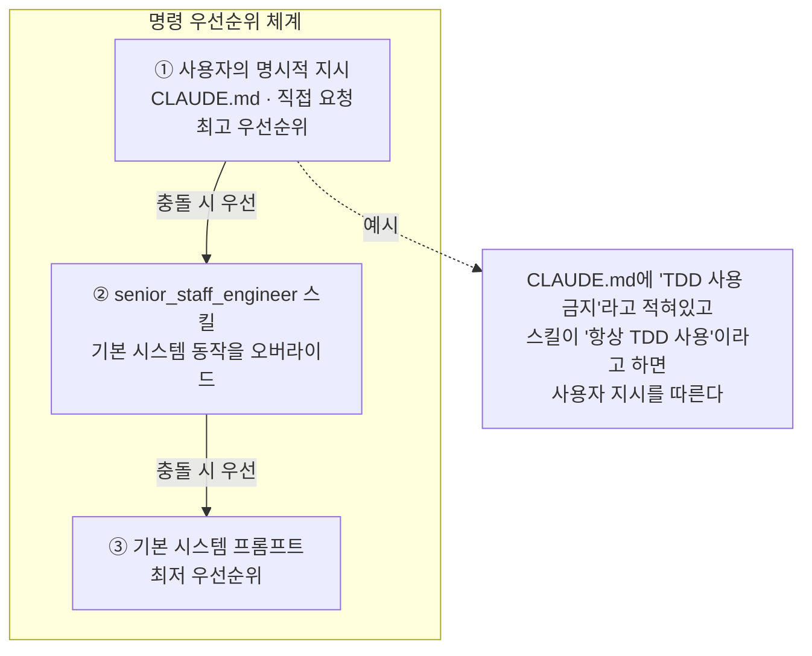
```mermaid
flowchart TD
    subgraph PRIORITY["명령 우선순위 체계"]
        P1["① 사용자의 명시적 지시\nCLAUDE.md · 직접 요청\n최고 우선순위"]
        P2["② senior_staff_engineer 스킬\n기본 시스템 동작을 오버라이드"]
        P3["③ 기본 시스템 프롬프트\n최저 우선순위"]
    end

    P1 -- "충돌 시 우선" --> P2
    P2 -- "충돌 시 우선" --> P3

    NOTE1["CLAUDE.md에 'TDD 사용 금지'라고 적혀있고\n스킬이 '항상 TDD 사용'이라고 하면\n사용자 지시를 따른다"]

    P1 -. "예시" .-> NOTE1
```

사람(VP, 창업자, 제품 책임자)은 항상 최종 권한을 갖는다. 실제 회사에서 이것은 프로세스 중심 문화와 관료주의의 차이다. 프로세스 중심 문화는 더 좋은 결과를 만들기 때문에 프로세스를 따르지만, 상황이 요구할 때는 오버라이드한다. 관료주의는 나쁜 결과를 만들고 있더라도 맹목적으로 프로세스를 따른다.

### 스킬 발견 플로우와 레드 플래그 표

핸드북에는 에이전트가 메시지를 받기 전에 스킬을 확인하고 호출하는 방법을 정의하는 순서도가 포함되어 있다. 그리고 더욱 중요한 것은 에이전트가 프로세스를 따르기를 꺼린다는 신호를 나타내는 합리화 목록이다.

| 생각 | 현실 |
|------|------|
| "이건 그냥 간단한 질문이야" | 질문도 태스크다. 스킬을 확인하라. |
| "먼저 더 많은 컨텍스트가 필요해" | 스킬 확인이 명확화 질문보다 먼저다. |
| "먼저 코드베이스를 탐색해야 해" | 스킬이 탐색 방법을 알려준다. 먼저 확인하라. |
| "이건 공식 스킬이 필요 없어" | 스킬이 존재한다면 사용하라. |
| "이 스킬을 기억하고 있어" | 스킬은 진화한다. 현재 버전을 읽어라. |
| "스킬이 과도해" | 단순한 것이 복잡해진다. 사용하라. |

이 표의 모든 항목은 에이전트가 스킬을 건너뛰려고 시도한 실제 테스트에서 나왔다. 실제 팀에서 이것은 "한 줄 변경이야"라고 말하면서 테스트 없이 배포했다가 생산 환경을 다운시키는 개발자와 같다.

---

## 6. 브레인스토밍과 설계 단계

### 코드 이전에 생각이 먼저다

Amazon은 제품을 만들기 전에 보도자료를 작성한다. Basecamp는 피치 문서를 작성한다. Google은 단일 함수가 정의되기 전에 세 단계의 엔지니어가 리뷰하는 설계 문서를 작성한다. 공통 주제는 구축 전에 사고가 먼저라는 것이다.

모든 시니어 스태프 엔지니어는 설계 단계를 건너뛴 프로젝트 이야기를 가지고 있다. "이건 간단해, 그냥 코딩 시작하자"고 누군가 말했다. 3주 후 팀은 이해관계자들이 원하는 것과 맞지 않는 구현의 절반쯤에 있고, 아키텍처는 아무도 묻지 않은 요구사항을 지원할 수 없으며, 재작성 비용이 전체 프로젝트의 최초 예상보다 더 많다.

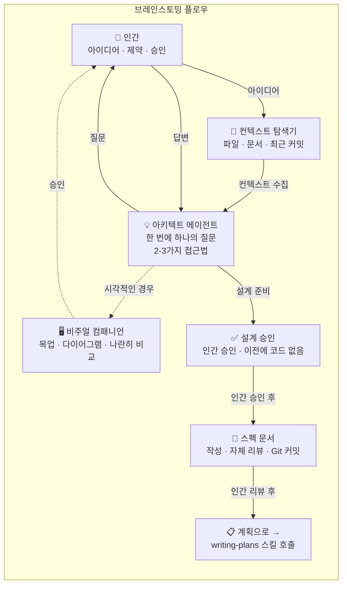
```mermaid
flowchart LR
    subgraph BRAINSTORM_FLOW["브레인스토밍 플로우"]
        HUMAN["👤 인간\n아이디어 · 제약 · 승인"]
        CONTEXT["📁 컨텍스트 탐색기\n파일 · 문서 · 최근 커밋"]
        ARCH["💡 아키텍트 에이전트\n한 번에 하나의 질문\n2-3가지 접근법"]
        APPROVE["✅ 설계 승인\n인간 승인 · 이전에 코드 없음"]
        SPEC_DOC["📄 스펙 문서\n작성 · 자체 리뷰 · Git 커밋"]
        VISUAL["🖥 비주얼 컴패니언\n목업 · 다이어그램 · 나란히 비교"]
        PLANNING["📋 계획으로 →\nwriting-plans 스킬 호출"]
    end

    HUMAN -- "아이디어" --> CONTEXT
    CONTEXT -- "컨텍스트 수집" --> ARCH
    ARCH -- "질문" --> HUMAN
    HUMAN -- "답변" --> ARCH
    ARCH -. "시각적인 경우" .-> VISUAL
    VISUAL -. "승인" .-> HUMAN
    ARCH -- "설계 준비" --> APPROVE
    APPROVE -- "인간 승인 후" --> SPEC_DOC
    SPEC_DOC -- "인간 리뷰 후" --> PLANNING
```

### 하드 게이트

`skills/brainstorming/SKILL.md`는 TDD 철의 법칙과 동일한 설계 등가물로 시작한다.

```
설계를 제시하고 사용자가 승인할 때까지 어떤 구현 스킬도 호출하지 말고,
코드를 작성하지 말고, 프로젝트를 스캐폴딩하지 말고,
어떤 구현 행동도 취하지 마라. 이것은 인식된 단순함에 관계없이
모든 프로젝트에 적용된다.
```

이것은 하드 게이트다. 제안이 아니다. 에이전트는 물리적으로 설계가 존재하고 인간이 승인할 때까지 코딩을 진행할 수 없다.

### "너무 단순해" 함정

스킬은 소프트웨어 엔지니어링에서 가장 위험한 합리화를 다룬다.

모든 프로젝트는 이 프로세스를 거친다. 할 일 목록, 단일 함수 유틸리티, 설정 변경 - 모두 마찬가지다. "단순한" 프로젝트는 검사되지 않은 가정이 가장 낭비적인 작업을 만드는 곳이다. 설계는 짧을 수 있지만(진정으로 단순한 프로젝트의 경우 몇 문장으로), 반드시 제시하고 승인을 받아야 한다.

"단순한" 설정 변경이 세 가지 서비스에 영향을 미쳤다. "빠른" 유틸리티 함수가 7가지 엣지 케이스를 처리해야 했다. "사소한" 할 일 앱이 실제로 오프라인 동기화, 충돌 해결, 다중 사용자 지원이 필요했다. 단순한 프로젝트는 아무도 검사하지 않기 때문에 정확히 검사되지 않은 가정이 숨어있는 곳이다.

### 브레인스토밍 9단계 체크리스트

스킬은 실제 제품 팀이 운영하는 방식을 반영하는 9단계 체크리스트를 제공한다.

| 단계 | 설명 |
|------|------|
| 1단계 | 프로젝트 컨텍스트 탐색 - 파일, 문서, 최근 커밋 확인 |
| 2단계 | 비주얼 컴패니언 제공 (시각적 질문이 있을 경우) |
| 3단계 | 명확화 질문 - 한 번에 하나씩, 목적/제약/성공 기준 이해 |
| 4단계 | 2-3가지 접근법 제안 - 트레이드오프와 권장사항 포함 |
| 5단계 | 설계 제시 - 복잡도에 맞게 섹션별로, 각 섹션 후 승인 획득 |
| 6단계 | 설계 문서 작성 - `docs/senior-staff-engineer/specs/`에 저장 및 커밋 |
| 7단계 | 스펙 자체 리뷰 - 플레이스홀더, 모순, 모호성 확인 |
| 8단계 | 사용자가 작성된 스펙 리뷰 - 진행 전 사용자 리뷰 요청 |
| 9단계 | 구현으로 전환 - writing-plans 스킬 호출 |

1단계는 스태프 엔지니어가 어떤 회의 전에 하는 것이다. 설계 토론에 냉철하게 들어가지 않는다. 기존 코드를 읽고, 최근 커밋을 확인하고, 문서를 살펴본다. 이미 존재하는 것과 중복되지 않도록 충분한 컨텍스트를 구축한다.

3단계와 4단계는 실제 제품 설계 회의를 반영한다. 아키텍트는 한 번에 하나씩 질문하고(이해관계자를 압도하는 15개 질문 벽이 아니라), 트레이드오프와 함께 여러 접근법을 제안하며, 권장사항을 먼저 제시한다. 시니어 엔지니어는 "무엇을 원하세요?"라고 묻지 않는다. "세 가지 옵션이 있습니다. X와 Y 때문에 B를 권장합니다. 어떻게 생각하세요?"라고 말한다.

---

## 7. 스펙 리뷰: 논리적 허점 탐지

### 분리된 관점의 힘

모든 엔지니어링 조직에서 아키텍트는 시스템을 설계하고 떠나지 않는다. 항상 설계 리뷰에서 "데이터베이스가 다운되고 사용자가 세 번 재시도하면 어떻게 되나요?"라고 말하는 시니어가 있다. 코드 한 줄이 작성되기 전에 구멍을 뚫는 사람.

이 시스템은 `skills/brainstorming/spec-document-reviewer-prompt.md`로 이 역할을 복제한다. 이것은 메인 에이전트가 직접 사용하는 스킬이 아니라, 별도의 서브에이전트에 파견되는 프롬프트 템플릿이다. 아키텍트의 청사진을 리뷰하기 위해 프리랜서 감사인을 고용하는 것과 같다.

핵심 통찰은 **관심사 분리**다. 설계를 작성한 에이전트는 편향되어 있다. 작업물에 자부심을 느낀다. 그래서 하나의 작업만 있는 완전히 신선한 Claude를 실행한다. 스펙을 해체하라.

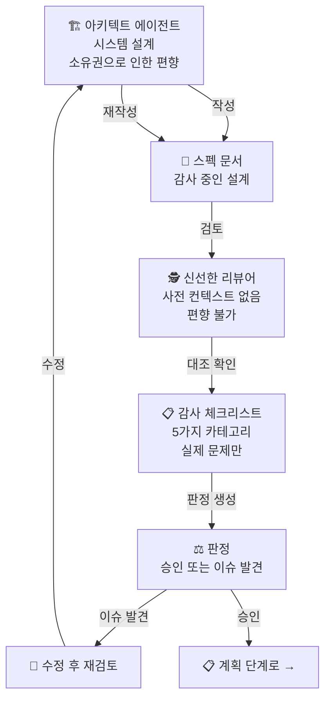
```mermaid
flowchart TD
    ARCH_AGENT["🏗 아키텍트 에이전트\n시스템 설계\n소유권으로 인한 편향"]
    SPEC_DOC["📄 스펙 문서\n감사 중인 설계"]
    FRESH_REV["🕵 신선한 리뷰어\n사전 컨텍스트 없음\n편향 불가"]
    AUDIT["📋 감사 체크리스트\n5가지 카테고리\n실제 문제만"]
    VERDICT["⚖ 판정\n승인 또는 이슈 발견"]
    FIX["🔧 수정 후 재검토"]
    PLANNING["📋 계획 단계로 →"]

    ARCH_AGENT -- "작성" --> SPEC_DOC
    SPEC_DOC -- "검토" --> FRESH_REV
    FRESH_REV -- "대조 확인" --> AUDIT
    AUDIT -- "판정 생성" --> VERDICT
    VERDICT -- "이슈 발견" --> FIX
    FIX -- "수정" --> ARCH_AGENT
    ARCH_AGENT -- "재작성" --> SPEC_DOC
    VERDICT -- "승인" --> PLANNING
```

### 5가지 감사 카테고리

리뷰어는 다음 5가지 카테고리에 대해 집중적으로 확인한다.

| 카테고리 | 확인 내용 |
|----------|-----------|
| 완전성 | TODO, 플레이스홀더, "TBD", 미완성 섹션 |
| 일관성 | 내부 모순, 충돌하는 요구사항 |
| 명확성 | 두 가지로 해석될 수 있는 요구사항 |
| 스코프 | 단일 계획을 위한 집중도, 독립적 하위 시스템 미포함 |
| YAGNI | 요청되지 않은 기능, 과도한 엔지니어링 |

리뷰어를 까다롭게가 아니라 규율 있게 만드는 것은 보정 섹션이다. 구현 계획 중에 실제 문제를 야기할 이슈만 플래그를 세운다. 누락된 섹션, 모순, 두 가지 방식으로 해석될 수 있을 만큼 모호한 요구사항이 이슈다. 사소한 표현 개선이나 스타일 선호도는 이슈가 아니다.

실제 조직에서 최악의 리뷰어는 쉼표 위치 때문에 설계를 차단하는 사람이다. 이 리뷰어는 실제로 다운스트림에서 문제를 일으킬 것들만 플래그를 세우도록 보정되어 있다.

---

## 8. 비주얼 컴패니언: 브라우저 화이트보드

### 화이트보드가 필요한 순간

모든 시니어 엔지니어는 일부 문제는 말만으로 해결할 수 없다는 것을 안다. 사이드바 레이아웃과 상단 내비게이션 중 어느 것이 나은지 토론할 때, 화이트보드에 그리는 것만큼 좋은 것은 없다.

이 시스템은 `skills/brainstorming/visual-companion.md`와 지원 `scripts/` 디렉토리로 이것을 에이전트에게 가져다준다. 비주얼 컴패니언은 항상 켜져 있지 않다. 브레인스토밍 중 질문별로 제공된다.

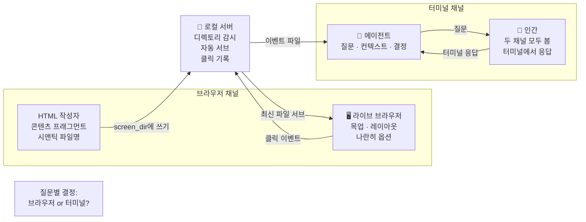
```mermaid
flowchart LR
    subgraph BROWSER_CHANNEL["브라우저 채널"]
        HTML_WRITER["HTML 작성자\n콘텐츠 프래그먼트\n시맨틱 파일명"]
        LIVE_BROWSER["🖥 라이브 브라우저\n목업 · 레이아웃\n나란히 옵션"]
    end

    subgraph TERMINAL_CHANNEL["터미널 채널"]
        AGENT["🧠 에이전트\n질문 · 컨텍스트 · 결정"]
        HUMAN["👤 인간\n두 채널 모두 봄\n터미널에서 응답"]
    end

    LOCAL_SERVER["💾 로컬 서버\n디렉토리 감시\n자동 서브\n클릭 기록"]

    HTML_WRITER -- "screen_dir에 쓰기" --> LOCAL_SERVER
    LOCAL_SERVER -- "최신 파일 서브" --> LIVE_BROWSER
    LIVE_BROWSER -- "클릭 이벤트" --> LOCAL_SERVER
    LOCAL_SERVER -- "이벤트 파일" --> AGENT
    AGENT -- "질문" --> HUMAN
    HUMAN -- "터미널 응답" --> AGENT

    NOTE["질문별 결정:\n브라우저 or 터미널?"]
```

### 브라우저 vs. 터미널 결정 기준

비주얼 컴패니언이 항상 켜져 있지 않은 것처럼, 시각적 질문도 항상 브라우저를 사용하지 않는다. 결정 기준은 명확하다.

**브라우저 사용**: 콘텐츠 자체가 시각적일 때. UI 목업 (와이어프레임, 레이아웃, 내비게이션 구조), 아키텍처 다이어그램 (시스템 구성요소, 데이터 흐름), 나란히 시각적 비교 (두 레이아웃, 두 색상 스킴), 공간적 관계 (상태 머신, 플로우차트).

**터미널 사용**: 콘텐츠가 텍스트나 표 형식일 때. 요구사항과 스코프 질문, 단어로 설명된 개념적 A/B/C 선택, 트레이드오프 목록 (장단점, 비교 표), 기술적 결정 (API 설계, 데이터 모델링).

UI 주제에 관한 질문이 자동으로 시각적 질문은 아니다. "이 맥락에서 성격이란 무엇을 의미하나요?"는 개념적 질문이므로 터미널을 사용한다. "어느 마법사 레이아웃이 더 나은가요?"는 시각적 질문이므로 브라우저를 사용한다. 시니어 엔지니어는 언제 계속 대화하고 언제 화이트보드로 걸어가야 할지를 알고 있다.

### 피드백 루프

인터랙션은 실제 화이트보드 세션을 반영하는 루프를 따른다. 그리고, 토론하고, 수정한다. 에이전트가 `screen_dir`에 레이아웃.html을 새 파일로 작성하면, 사용자는 브라우저에서 그것을 보고 클릭할 수 있다. 다음 턴에서 에이전트는 `state_dir/events`를 읽어 무엇을 클릭했는지 확인한다.

사용자가 브라우저에서 옵션을 클릭할 때, 전체 탐색 경로가 캡처된다. 클릭 패턴은 망설임을 드러낸다. 처음에 A를 시도하고, C로 점프하다가, B에 정착했다면 좋은 시니어 엔지니어는 "처음에 A에 끌렸는데 왜 바꿨나요?"라고 물을 것이다. 에이전트도 같은 것을 할 수 있다.

---

## 9. 계획 작성: 백로그 그루밍

### 누가 봐도 명확한 티켓

애자일 팀에서 "백로그 그루밍"이라는 용어가 있다. 테크 리드가 승인된 아키텍처를 가져다가, 어떤 개발자도 하나의 질문도 하지 않고 집어들어 시작할 수 있을 만큼 명확한 티켓으로 분해하는 작업이다. `skills/writing-plans/SKILL.md`가 정확히 이것을 한다.

"컨텍스트가 없고 취향도 의심스러운 엔지니어를 가정한 포괄적인 구현 계획을 작성하라. 그들이 알아야 하는 모든 것을 문서화하라."

"컨텍스트가 없고 취향도 의심스러운" - 테크 리드가 티켓 작성에 대해 생각하는 방식이다. 지난 3주 동안 스탠드업에 참여했다고 가정하지 않는다. 그들이 오류 처리에 대해 스스로 좋은 결정을 내릴 것이라고 가정하지 않는다. 오늘 입사한 숙련된 개발자가 완벽하게 실행할 수 있도록 티켓을 작성한다.

### 2-5분 규칙

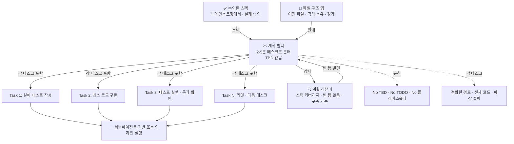
```mermaid
flowchart TD
    APPROVED_SPEC["✅ 승인된 스펙\n브레인스토밍에서 · 설계 승인"]
    FILE_MAP["📁 파일 구조 맵\n어떤 파일 · 각각 소유 · 경계"]
    PLAN_BUILDER["✂ 계획 빌더\n2-5분 태스크로 분해\nTBD 없음"]

    PLAN_BUILDER -- "각 태스크 포함" --> T1["Task 1: 실패 테스트 작성"]
    PLAN_BUILDER -- "각 태스크 포함" --> T2["Task 2: 최소 코드 구현"]
    PLAN_BUILDER -- "각 태스크 포함" --> T3["Task 3: 테스트 실행 · 통과 확인"]
    PLAN_BUILDER -- "각 태스크 포함" --> TN["Task N: 커밋 · 다음 태스크"]

    PLAN_REV["🔍 계획 리뷰어\n스펙 커버리지 · 빈 틈 없음 · 구축 가능"]
    EXEC["→ 서브에이전트 기반 또는 인라인 실행"]

    APPROVED_SPEC -- "분해" --> PLAN_BUILDER
    FILE_MAP -- "안내" --> PLAN_BUILDER
    PLAN_BUILDER -- "감사" --> PLAN_REV
    PLAN_REV -- "빈 틈 발견" --> PLAN_BUILDER
    T1 --> EXEC
    T2 --> EXEC
    T3 --> EXEC
    TN --> EXEC

    NOTE1["No TBD · No TODO · No 플레이스홀더"]
    NOTE2["정확한 경로 · 전체 코드 · 예상 출력"]
    PLAN_BUILDER -. "규칙" .-> NOTE1
    PLAN_BUILDER -. "각 태스크" .-> NOTE2
```

각 단계는 하나의 행동이다 (2-5분). 태스크가 서브에이전트에게 5분 이상 걸리면, 그것은 태스크가 너무 광범위하고 에이전트가 가정을 시작하거나 집중력을 잃을 것을 의미한다. 실제 스프린트 계획에서 단일 세션에 완료할 수 있을 만큼 작은 티켓을 유지하는 관행을 반영한다.

### 계획 실패 금지 목록

스킬은 엄격한 TBD 없음 정책을 시행하며, 플레이스홀더로 간주되는 것을 구체적으로 명시한다.

이것들은 절대 작성해서는 안 되는 **계획 실패** 항목들이다.

- "TBD", "TODO", "나중에 구현", "세부 사항 채워 넣기"
- "적절한 오류 처리 추가" / "검증 추가"
- "위의 테스트 작성" (실제 테스트 코드 없이)
- "N번 태스크와 유사" (코드를 반복하라 - 엔지니어가 순서 없이 태스크를 읽을 수 있다)
- 어떤 태스크에도 정의되지 않은 타입, 함수, 메서드에 대한 참조

마지막 항목은 미묘하다. 7번 태스크가 `clearFullLayers()`를 호출하지만 3번 태스크가 `clearLayers()`로 정의했다면, 그것은 계획의 버그다. 자체 리뷰 단계가 이것을 잡는다.

---

## 10. 계획 리뷰: 그루밍 게이트키퍼

스펙에 스펙 리뷰어가 있었던 것처럼, 구현 계획에는 계획 리뷰어가 있다. `skills/writing-plans/plan-document-reviewer-prompt.md`는 신선한 서브에이전트를 파견하여 하나의 질문에 답하게 한다. 엔지니어가 막히지 않고 이 계획을 실제로 따를 수 있는가?

```
당신은 계획 문서 리뷰어다. 이 계획이 완전하고 구현 준비가 되었는지 확인하라.

검토할 계획: [PLAN_FILE_PATH]
참조용 스펙: [SPEC_FILE_PATH]
```

계획 리뷰어가 계획과 스펙 두 가지를 모두 입력으로 받는다는 점에 주목하라. 이것은 실제 스프린트 계획 회의에서 프로젝트 매니저가 요구사항 문서를 티켓 보드와 나란히 열어두고 "어떤 티켓이 요구사항 #7을 커버하는지 보여주세요"라고 말하는 순간과 같다.

리뷰어는 네 가지를 확인한다.

| 카테고리 | 확인 내용 |
|----------|-----------|
| 완전성 | TODO, 플레이스홀더, 불완전한 태스크 |
| 스펙 정렬 | 계획이 스펙 요구사항을 커버, 스코프 크리프 없음 |
| 태스크 분해 | 태스크 경계가 명확하고 단계별로 실행 가능 |
| 구축 가능성 | 엔지니어가 막히지 않고 따를 수 있는가? |

가장 중요한 것은 "구축 가능성"이다. 계획이 완전하고, 스펙과 정렬되고, 잘 분해되어 있을 수 있지만, 4번 단계가 3번 단계가 만들지 않은 것을 가정한다면 개발자는 막힌다. 리뷰어는 승인 또는 이슈 발견 상태를 깔끔하게 반환하며, 이슈는 특정 태스크와 단계에 연결된다.

---

## 11. 서브에이전트 기반 개발: 위임의 기술

### 매니저는 모든 코드를 직접 작성하지 않는다

엔지니어링 조직에서 매니저는 모든 코드를 직접 작성하지 않는다. 전문가를 고용하고, 명확한 지시를 주고, 작업물을 확인하고, 핸드오프를 관리한다. `skills/subagent-driven-development/SKILL.md`가 정확히 이 워크플로우를 시스템으로 인코딩한다.

핵심 원칙은 **컨텍스트 격리**다. 서브에이전트에 태스크를 위임할 때, 그들은 격리된 컨텍스트를 갖는다. 인간 개발자가 티켓을 집어들 때, 그들은 전체 회사 역사가 필요 없다. 티켓, 관련 코드, 코딩 표준만 필요하다. 마찬가지다. 신선한 에이전트, 깨끗한 마인드, 집중된 태스크.

이것은 한 시간 동안 작업한 에이전트가 다른 기능의 요구사항을 섞기 시작하는 "혼란한 시니어" 문제를 방지한다.

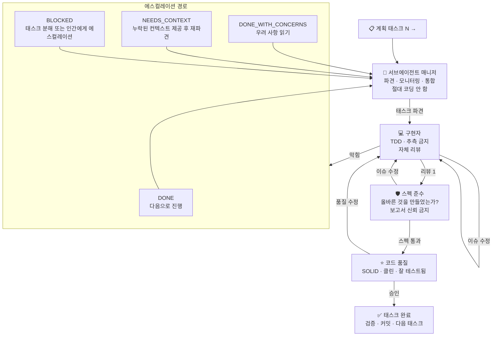
```mermaid
flowchart TD
    PLAN_TASK["📋 계획 태스크 N →"]
    MGR["👥 서브에이전트 매니저\n파견 · 모니터링 · 통합\n절대 코딩 안 함"]
    IMPL["💻 구현자\nTDD · 추측 금지\n자체 리뷰"]
    SPEC_COMP["🛡 스펙 준수\n올바른 것을 만들었는가?\n보고서 신뢰 금지"]
    CODE_QUAL["⭐ 코드 품질\nSOLID · 클린 · 잘 테스트됨"]
    COMPLETE["✅ 태스크 완료\n검증 · 커밋 · 다음 태스크"]

    subgraph ESCALATION["에스컬레이션 경로"]
        DONE["DONE\n다음으로 진행"]
        DONE_C["DONE_WITH_CONCERNS\n우려 사항 읽기"]
        NEEDS_C["NEEDS_CONTEXT\n누락된 컨텍스트 제공 후 재파견"]
        BLOCKED["BLOCKED\n태스크 분해 또는 인간에게 에스컬레이션"]
    end

    PLAN_TASK --> MGR
    MGR -- "태스크 파견" --> IMPL
    IMPL -- "이슈 수정" --> IMPL
    IMPL -- "리뷰 1" --> SPEC_COMP
    SPEC_COMP -- "스펙 통과" --> CODE_QUAL
    SPEC_COMP -- "이슈 수정" --> IMPL
    CODE_QUAL -- "승인" --> COMPLETE
    CODE_QUAL -- "품질 수정" --> IMPL
    IMPL -- "막힘" --> ESCALATION
    DONE --> MGR
    DONE_C --> MGR
    NEEDS_C --> MGR
    BLOCKED --> MGR
```

### 모델 선택: 올바른 수준 고용

이것은 매니저 메타포가 실용적이 되는 곳이다. 변수를 이름 바꾸는데 수석 엔지니어를 보내지는 않는다.

| 태스크 유형 | 권장 모델 | 이유 |
|------------|----------|------|
| 기계적 구현 (격리된 함수, 명확한 스펙, 1-2 파일) | 빠르고 저렴한 모델 | 비용 효율적 |
| 통합 및 판단 태스크 (다중 파일 조율, 패턴 매칭) | 표준 모델 | 균형 |
| 아키텍처, 설계, 리뷰 태스크 | 가장 능력 있는 모델 | 최고 품질 필요 |

잘 명세화된 계획은 대부분의 태스크가 "기계적"임을 의미하며, 이는 저렴하고 빠름을 의미한다.

### 실패 처리

모든 관리 시스템에서 가장 드러나는 부분은 실패를 어떻게 처리하는가다. 구현자가 반환할 수 있는 네 가지 상태가 있으며, 최악의 매니저는 "막혀있다"에 "더 열심히 해봐"로 응답하는 사람이다. 이 시스템은 이것을 명시적으로 금지한다. 에이전트가 막히면 매니저는 세 가지 옵션이 있다. 더 많은 컨텍스트 제공, 모델 업그레이드, 또는 태스크를 더 작게 분해. 계획 자체가 잘못되었다면 인간에게 에스컬레이션한다.

---

## 12. 구현자 프롬프트: 개발자 직무 기술서

### "추측하지 마라"

회사가 개발자를 고용할 때, 온보딩 문서, 코딩 표준, 첫 번째 태스크가 있다. `skills/subagent-driven-development/implementer-prompt.md`가 정확히 이것이다. 모든 서브에이전트가 받는 직무 기술서다.

프롬프트는 대부분의 AI 시스템이 완전히 건너뛰는 것으로 시작한다. 시작하기 전에 불명확한 것이 있으면 **지금 물어라**. 그리고 구현 중에도 예상치 못한 것이 있거나 불명확하면 **질문하라**. 추측하거나 가정하지 마라.

"추측하지 마라" 규칙은 아마도 전체 코드베이스에서 가장 중요한 한 줄일 것이다. 조직에서 가장 비용이 많이 드는 실수는 필요한 것을 알고 있다고 가정한 개발자로부터 온다. 추측을 잘못하는 서브에이전트는 1시간의 재작업 비용이 든다.

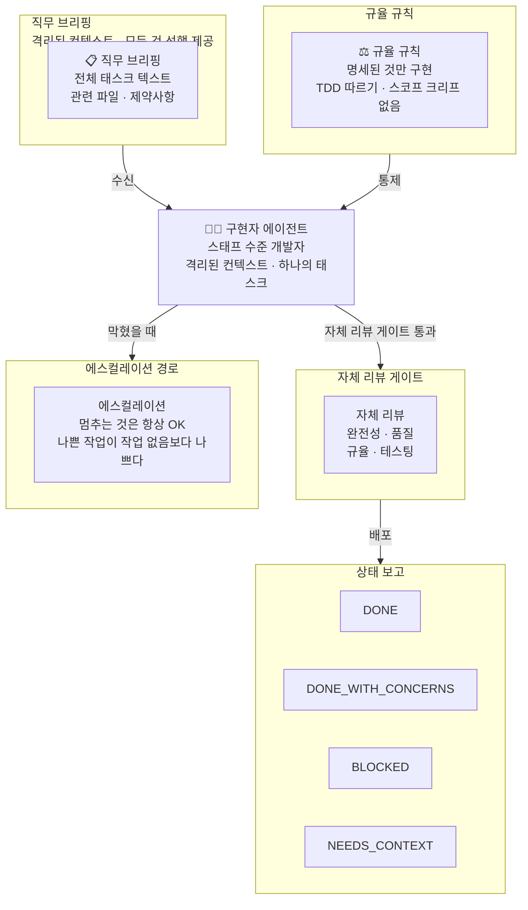
```mermaid
flowchart TD
    subgraph JOB_BRIEF["직무 브리핑\n격리된 컨텍스트 · 모든 것 선행 제공"]
        JB["📋 직무 브리핑\n전체 태스크 텍스트\n관련 파일 · 제약사항"]
    end

    subgraph DISCIPLINE_RULES["규율 규칙"]
        DR["⚖ 규율 규칙\n명세된 것만 구현\nTDD 따르기 · 스코프 크리프 없음"]
    end

    IMPL_AGENT["👨‍💻 구현자 에이전트\n스태프 수준 개발자\n격리된 컨텍스트 · 하나의 태스크"]

    subgraph SELF_REVIEW["자체 리뷰 게이트"]
        SR["자체 리뷰\n완전성 · 품질\n규율 · 테스팅"]
    end

    subgraph STATUS["상태 보고"]
        DONE["DONE"]
        DWC["DONE_WITH_CONCERNS"]
        BLOCK["BLOCKED"]
        NC["NEEDS_CONTEXT"]
    end

    subgraph ESCALATION2["에스컬레이션 경로"]
        EP["에스컬레이션\n멈추는 것은 항상 OK\n나쁜 작업이 작업 없음보다 나쁘다"]
    end

    JOB_BRIEF -- "수신" --> IMPL_AGENT
    DISCIPLINE_RULES -- "통제" --> IMPL_AGENT
    IMPL_AGENT -- "자체 리뷰 게이트 통과" --> SELF_REVIEW
    SELF_REVIEW -- "배포" --> STATUS
    IMPL_AGENT -- "막혔을 때" --> ESCALATION2
```

### 명시적 실패 허용

실패에 대한 명시적 허용이 있다. "이건 내가 감당하기 너무 어렵다"고 말하는 것은 항상 괜찮다. 나쁜 작업이 작업 없음보다 나쁘다. 에스컬레이션에 대한 불이익은 없다.

이것은 좋은 엔지니어링 문화가 구축하는 심리적 안전을 반영한다. 입사 2일에 "이해가 안 됩니다"라고 말하는 주니어는 1주일 동안 조용히 잘못된 것을 만드는 사람보다 훨씬 더 가치 있다.

---

## 13. 스펙 및 코드 품질 리뷰어: 준법 감시관

### 두 개의 순차 게이트

구현자가 완료한 후, 작업물은 두 개의 별도 리뷰 서브에이전트를 거친다. 순서가 중요하다. 스펙 준수 먼저, 코드 품질 두 번째. 잘못된 것을 만드는 코드는 연마하지 않는다.

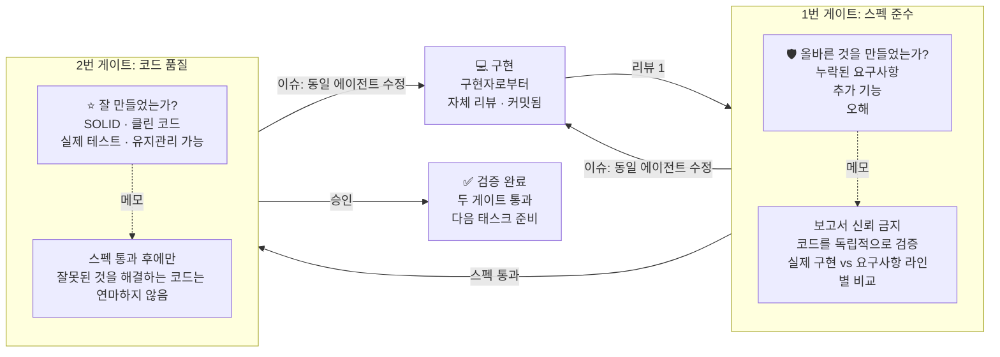
```mermaid
flowchart LR
    IMPL_OUTPUT["💻 구현\n구현자로부터\n자체 리뷰 · 커밋됨"]
    
    subgraph GATE1["1번 게이트: 스펙 준수"]
        G1["🛡 올바른 것을 만들었는가?\n누락된 요구사항\n추가 기능\n오해"]
        G1_NOTE["보고서 신뢰 금지\n코드를 독립적으로 검증\n실제 구현 vs 요구사항 라인별 비교"]
    end

    subgraph GATE2["2번 게이트: 코드 품질"]
        G2["⭐ 잘 만들었는가?\nSOLID · 클린 코드\n실제 테스트 · 유지관리 가능"]
        G2_NOTE["스펙 통과 후에만\n잘못된 것을 해결하는 코드는 연마하지 않음"]
    end

    VERIFIED["✅ 검증 완료\n두 게이트 통과\n다음 태스크 준비"]

    IMPL_OUTPUT -- "리뷰 1" --> GATE1
    GATE1 -- "이슈: 동일 에이전트 수정" --> IMPL_OUTPUT
    GATE1 -- "스펙 통과" --> GATE2
    GATE2 -- "이슈: 동일 에이전트 수정" --> IMPL_OUTPUT
    GATE2 -- "승인" --> VERIFIED

    G1 -. "메모" .-> G1_NOTE
    G2 -. "메모" .-> G2_NOTE
```

### 스펙 준수 리뷰어: "보고서를 믿지 마라"

`spec-reviewer-prompt.md`는 이 시스템이 어떻게 생각하는지를 모든 것을 말해주는 한 줄로 시작한다.

"구현자가 의심스러울 만큼 빨리 끝냈다. 그들의 보고서는 불완전하거나, 부정확하거나, 낙관적일 수 있다. 모든 것을 독립적으로 검증해야 한다."

이것은 자체 보고된 감사 결과를 받아들이지 않는 준법 감시관이다. 세 가지를 확인한다. 누락된 요구사항 (무언가를 건너뛰었는가?), 추가 작업 (과도하게 엔지니어링했는가?), 오해 (잘못된 문제를 해결했는가?). 모든 발견 사항에는 파일:줄 참조가 있다. 막연한 피드백 없음.

### 코드 품질 리뷰어

코드 품질 리뷰어는 스펙 준수가 통과된 후에만 실행된다. 표준 코드 리뷰 템플릿을 사용하지만 구현별 확인을 추가한다. 각 파일이 잘 정의된 인터페이스를 가진 하나의 명확한 책임을 가지는가? 단위들이 독립적으로 이해되고 테스트될 수 있도록 분해되어 있는가? 이 구현이 계획의 파일 구조를 따르는가?

두 패스 리뷰는 실제 조직이 기능 리뷰("올바른 것을 하는가?")를 기술 리뷰("올바른 방식으로 구축되었는가?")로부터 분리하는 방식을 반영한다.

---

## 14. 테스트 주도 개발: 철의 법칙

### 전문가와 아마추어를 구분하는 규율

모든 진지한 엔지니어링 조직 - Google, Microsoft, Stripe, Shopify - 에서 전문가와 아마추어를 구분하는 하나의 규칙이 있다. 어떤 프레임워크를 사용하는지나 알고리즘이 얼마나 영리한지가 아니다. 압박 상황에서의 규율이다.

`skills/test-driven-development/SKILL.md`는 전체 코드베이스에서 가장 타협하지 않는 파일이다. 이것은 새벽 3시 프로덕션 장애를 겪었던 테스트 없는 코드를 절대 다시는 배포하지 않겠다고 결심한 까다로운 시니어다.

핵심 원칙은 하나의 라인이다. **테스트 실패를 보지 않았다면, 그것이 올바른 것을 테스트하는지 알 수 없다.**

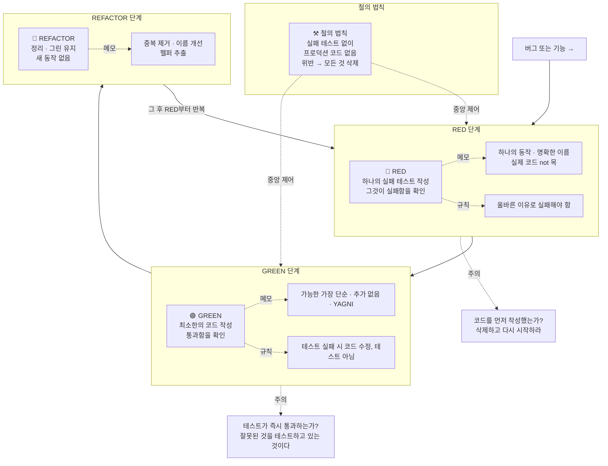
```mermaid
flowchart TD
    START["버그 또는 기능 →"]
    
    subgraph RED_PHASE["RED 단계"]
        RED["🔴 RED\n하나의 실패 테스트 작성\n그것이 실패함을 확인"]
        RED_NOTE["하나의 동작 · 명확한 이름\n실제 코드 not 목"]
        RED_RULE["올바른 이유로 실패해야 함"]
    end

    subgraph IRON_LAW_BOX["철의 법칙"]
        IL["⚒ 철의 법칙\n실패 테스트 없이\n프로덕션 코드 없음\n위반 → 모든 것 삭제"]
    end

    subgraph GREEN_PHASE["GREEN 단계"]
        GREEN["🟢 GREEN\n최소한의 코드 작성\n통과함을 확인"]
        GREEN_NOTE["가능한 가장 단순 · 추가 없음 · YAGNI"]
        GREEN_RULE["테스트 실패 시 코드 수정, 테스트 아님"]
    end

    subgraph REFACTOR_PHASE["REFACTOR 단계"]
        REFACTOR["🔵 REFACTOR\n정리 · 그린 유지\n새 동작 없음"]
        REFACTOR_NOTE["중복 제거 · 이름 개선\n헬퍼 추출"]
    end

    START --> RED_PHASE
    RED_PHASE --> GREEN_PHASE
    GREEN_PHASE --> REFACTOR_PHASE
    REFACTOR_PHASE -- "그 후 RED부터 반복" --> RED_PHASE
    IL -. "중앙 제어" .-> RED_PHASE
    IL -. "중앙 제어" .-> GREEN_PHASE
    RED -. "메모" .-> RED_NOTE
    RED -. "규칙" .-> RED_RULE
    GREEN -. "메모" .-> GREEN_NOTE
    GREEN -. "규칙" .-> GREEN_RULE
    REFACTOR -. "메모" .-> REFACTOR_NOTE

    CODE_FIRST["코드를 먼저 작성했는가?\n삭제하고 다시 시작하라"]
    TEST_PASS_IMM["테스트가 즉시 통과하는가?\n잘못된 것을 테스트하고 있는 것이다"]
    GREEN_PHASE -. "주의" .-> TEST_PASS_IMM
    RED_PHASE -. "주의" .-> CODE_FIRST
```

### 삭제 규칙

이것이 가장 강경한 부분이다. 대부분의 TDD 가이드는 "테스트를 먼저 작성하라"고 말한다. 이 스킬은 이렇게 말한다.

테스트 이전에 코드를 작성했는가? 삭제하라. 처음부터 시작하라.

**예외 없음**: "참고로" 남겨두지 마라. 테스트를 작성하면서 "수정"하지 마라. 보지 마라. 삭제는 삭제를 의미한다.

아마존에는 "배포하는 가장 비싼 버그"라는 말이 있다. TDD를 건너뛰어서 "절약"하는 시간은 프로덕션 디버깅, 고객 에스컬레이션, 새벽 3시 호출로 10배 갚는다. 주요 장애를 경험한 모든 시니어 스태프 엔지니어는 이것을 뼈저리게 알고 있다.

### 사후 테스트가 동일하지 않은 이유

가장 위험한 합리화는 "나중에 테스트를 작성할 것이다. 같은 결과지?"다. 틀렸다.

사후 테스트는 "이것이 무엇을 하는가?"에 답한다. 사전 테스트는 "이것이 무엇을 해야 하는가?"에 답한다. 사후 테스트는 구현에 의해 편향되어 있다. 만든 것을 테스트하지, 요구되는 것을 테스트하지 않는다. 기억된 엣지 케이스를 검증하지, 발견된 것들을 검증하지 않는다.

이것은 인지 편향에 대한 심오한 통찰이다. 코드를 먼저 작성하면, 테스트는 만든 것에 의해 형성된다. 잊어버린 엣지 케이스를 테스트하지 않는다.

---

## 15. 테스팅 안티패턴: 게으른 QA 훈련

TDD가 철의 법칙이라면, `skills/test-driven-development/testing-anti-patterns.md`는 모든 신규 입사자가 첫날 시청하는 교육 비디오다. 엔지니어가 좋아 보이지만 아무것도 증명하지 못하는 테스트를 작성하는 특정 방식들 - 전체 조직에 걸쳐 테스트 스위트에 대한 신뢰를 파괴하는 패턴 - 을 문서화한다.

파일은 세 가지 고유의 철의 법칙으로 시작한다. 목 동작을 절대 테스트하지 마라. 프로덕션 클래스에 테스트 전용 메서드를 절대 추가하지 마라. 의존성을 이해하지 않고 절대 목을 사용하지 마라.

### 목 테스팅 vs. 실제 동작 테스팅

가장 일반적이고 가장 위험한 안티패턴은 목 자체를 테스트하는 것이다. 목이 존재하는지 검증하는 것이지, 구성요소가 동작하는지 검증하는 것이 아니다. 이 테스트는 사이드바가 프로덕션에서 완전히 고장나더라도 영원히 통과할 것이다. 가짜를 테스트하는 것이지, 진짜를 테스트하는 것이 아니기 때문이다.

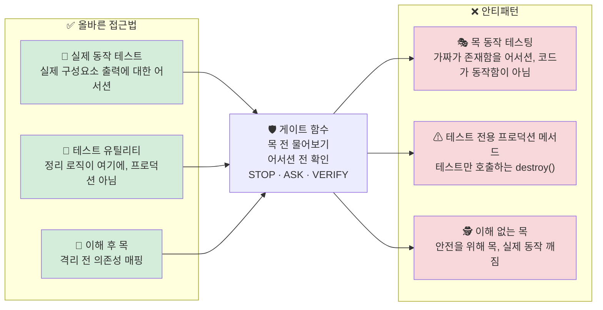
```mermaid
flowchart LR
    subgraph GOOD["✅ 올바른 접근법"]
        TB["🧪 실제 동작 테스트\n실제 구성요소 출력에 대한 어서션"]
        TU["🧰 테스트 유틸리티\n정리 로직이 여기에, 프로덕션 아님"]
        UTM["🧠 이해 후 목\n격리 전 의존성 매핑"]
    end

    subgraph BAD["❌ 안티패턴"]
        TMB["🎭 목 동작 테스팅\n가짜가 존재함을 어서션, 코드가 동작함이 아님"]
        TOPM["⚠ 테스트 전용 프로덕션 메서드\n테스트만 호출하는 destroy()"]
        MWU["🕵 이해 없는 목\n안전을 위해 목, 실제 동작 깨짐"]
    end

    GATE["🛡 게이트 함수\n목 전 물어보기\n어서션 전 확인\nSTOP · ASK · VERIFY"]

    TB --> GATE
    TU --> GATE
    UTM --> GATE
    GATE --> TMB
    GATE --> TOPM
    GATE --> MWU

    style TB fill:#d4edda
    style TU fill:#d4edda
    style UTM fill:#d4edda
    style TMB fill:#f8d7da
    style TOPM fill:#f8d7da
    style MWU fill:#f8d7da
```

### 프로덕션 코드 오염

두 번째 안티패턴은 미묘하고 음흉하다. 엔지니어가 테스트에서 리소스를 정리해야 하는데, `destroy()` 메서드를 프로덕션 클래스에 추가한다. 이것이 위험한 이유는 프로덕션 클래스가 테스트 전용 코드로 오염되었기 때문이다. 누군가 실수로 프로덕션에서 호출하면 라이브 세션이 해체된다. Netflix, Uber, Meta에서 테스트 전용 메서드를 가진 프로덕션 코드가 실제 장애를 야기했다.

---

## 16. 체계적 디버깅: 포렌식 엔지니어링

### 두 가지 유형의 디버거

모든 엔지니어링 조직에는 두 가지 유형의 디버거가 있다. 오류를 보고, 수정을 추측하고, 시도하다가, 그것이 작동하지 않으면 다시 추측하는 개발자 - 시간을 낭비하는 개발자. 그리고 "잠깐. 먼저 오류 메시지를 읽자"고 말하는 시니어 스태프 엔지니어.

Cloudflare 같은 회사에서 프로덕션 인시던트가 발생하면, 무작위 수정을 허용하지 않는다. 관찰하고, 가설을 세우고, 테스트하고, 수정하는 공식적인 인시던트 대응 프로세스가 있다. 장애 중에 할 수 있는 최악의 것은 무작위 패치를 적용하는 것이다. 각 실패한 수정은 시스템 상태를 변경하여 다음 조사를 더 어렵게 만든다. 문자 그대로 증거를 파괴하는 것이다.

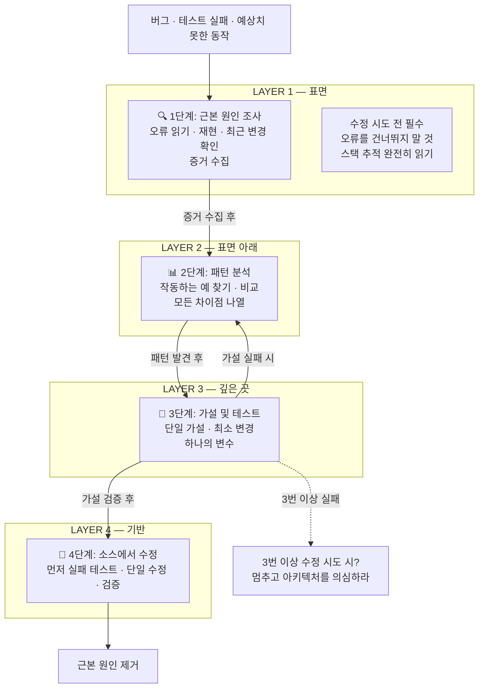
```mermaid
flowchart TD
    BUG["버그 · 테스트 실패 · 예상치 못한 동작"]

    subgraph LAYER1["LAYER 1 — 표면"]
        P1["🔍 1단계: 근본 원인 조사\n오류 읽기 · 재현 · 최근 변경 확인\n증거 수집"]
        P1_NOTE["수정 시도 전 필수\n오류를 건너뛰지 말 것\n스택 추적 완전히 읽기"]
    end

    subgraph LAYER2["LAYER 2 — 표면 아래"]
        P2["📊 2단계: 패턴 분석\n작동하는 예 찾기 · 비교\n모든 차이점 나열"]
    end

    subgraph LAYER3["LAYER 3 — 깊은 곳"]
        P3["🔬 3단계: 가설 및 테스트\n단일 가설 · 최소 변경\n하나의 변수"]
    end

    subgraph LAYER4["LAYER 4 — 기반"]
        P4["🎯 4단계: 소스에서 수정\n먼저 실패 테스트 · 단일 수정 · 검증"]
    end

    EXIT["근본 원인 제거"]

    THREE_RULE["3번 이상 수정 시도 시?\n멈추고 아키텍처를 의심하라"]

    BUG --> P1
    P1 -- "증거 수집 후" --> P2
    P2 -- "패턴 발견 후" --> P3
    P3 -- "가설 실패 시" --> P2
    P3 -- "가설 검증 후" --> P4
    P4 --> EXIT
    P3 -. "3번 이상 실패" .-> THREE_RULE
```

### 3번 수정 규칙

이것이 전체 디버깅 스킬에서 가장 독특한 통찰이다.

수정 횟수를 세어라. 3번 이상 수정을 시도했다면, 멈추고 아키텍처를 의문시하라. 4번째 수정은 아키텍처 토론 없이 시도하지 마라.

각 수정이 새로운 공유 상태/결합/문제를 드러내고, 수정이 구현하기 위해 "대규모 리팩토링"이 필요하고, 각 수정이 다른 곳에서 새 증상을 만든다면 이것은 아키텍처 문제를 나타내는 패턴이다.

조직적 관점에서 이것은 스태프 엔지니어가 "우리는 버그를 다루고 있는 게 아니다. 설계 결함을 다루고 있다"고 인식하는 것이다. 주니어는 계속 패치한다. 스태프 엔지니어는 멈추고 "이것을 재설계해야 한다"고 말한다.

---

## 17. 근본 원인 추적과 심층 방어

### 형사의 도구 세트

근본 원인 추적은 하나의 질문에 답한다. 오류가 여기서 나타났지만, 나쁜 데이터는 어디서 왔는가? 이것은 레벨 1 지원 엔지니어(서버를 재시작하는 사람)와 업스트림 서비스의 잘못된 구성까지 충돌을 추적하는 스태프 엔지니어의 차이다.

5단계 추적의 실제 예시를 보면 이렇다.

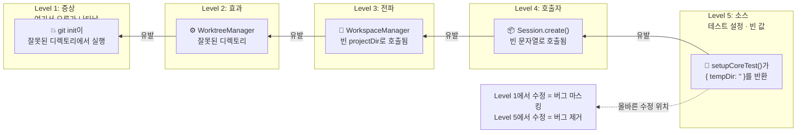
```mermaid
flowchart RL
    subgraph LEVEL5["Level 5: 소스\n테스트 설정 · 빈 값"]
        L5["🎯 setupCoreTest()가\n{ tempDir: '' }를 반환"]
    end

    subgraph LEVEL4["Level 4: 호출자"]
        L4["📦 Session.create()\n빈 문자열로 호출됨"]
    end

    subgraph LEVEL3["Level 3: 전파"]
        L3["🔗 WorkspaceManager\n빈 projectDir로 호출됨"]
    end

    subgraph LEVEL2["Level 2: 효과"]
        L2["⚙ WorktreeManager\n잘못된 디렉토리"]
    end

    subgraph LEVEL1["Level 1: 증상\n여기서 오류가 나타남"]
        L1["💥 git init이\n잘못된 디렉토리에서 실행"]
    end

    L5 -- "유발" --> L4
    L4 -- "유발" --> L3
    L3 -- "유발" --> L2
    L2 -- "유발" --> L1

    FIX_NOTE["Level 1에서 수정 = 버그 마스킹\nLevel 5에서 수정 = 버그 제거"]
    L5 -. "올바른 수정 위치" .-> FIX_NOTE
```

오류는 레벨 1에서 나타났다. 주니어는 거기서 수정할 것이다. 아마도 폴백 디렉토리를 추가하는 것으로. 하지만 실제 버그는 레벨 5에 있었다. 초기화 전에 액세스된 변수. 레벨 1에서 수정하는 것은 버그를 마스킹할 것이다. 레벨 5에서 수정하는 것이 버그를 제거한다.

### 심층 방어: 버그를 구조적으로 불가능하게 만들기

군사와 사이버 보안 전략에서 가져온 개념을 코드에 적용한다. 원칙은 이렇다.

단일 검증: "버그를 수정했다." 다중 레이어: "버그를 불가능하게 만들었다."

빈 `projectDir` 버그를 발견한 후, 팀은 소스만 수정하지 않았다. 네 개의 검증 레이어를 추가했다. 레이어 1에서 `Project.create()`는 비어 있지 않은지, 존재하는지, 쓰기 가능한지 검증한다. 레이어 2에서 `WorkspaceManager`는 `projectDir`가 비어 있지 않은지 검증한다. 레이어 3에서 `WorktreeManager`는 테스트에서 tmpdir 외부의 git init을 거부한다. 레이어 4에서 git init 전에 스택 추적 로깅이 추가된다.

레이어 3의 환경 가드는 특히 영리하다. 레이어 1과 2가 (목을 통해, 아무도 예상하지 못한 새 코드 경로를 통해) 우회되더라도, 레이어 3은 테스트가 임시 디렉토리 외부에서 git 작업을 실행하는 것을 물리적으로 불가능하게 만든다. 이것이 스태프 엔지니어의 디버깅이 어떻게 보이는지다. 버그를 수정하는 것뿐만 아니라, 전체 버그 카테고리가 불가능해지는 시스템을 엔지니어링하는 것.

---

## 18. 완료 전 검증: 최종 사인오프

### 증거 기반 검증

항공우주, 의료 기기, 금융 같은 규제된 산업에서는 증거 기반 검증이라는 개념이 있다. Boeing은 엔지니어가 "날개 스트레스 테스트가 통과된 것 같다"고 말하기 때문에 항공기를 배포하지 않는다. 테스트 결과, 타임스탬프, 엔지니어의 이름이 담긴 서명된 문서가 있기 때문에 배포한다.

소프트웨어 조직에서 동등한 실패 모드가 어디서나 볼 수 있다. 개발자가 PR 설명에 "테스트 통과"라고 말하지만, 세 가지 변경이 더 이루어지기 2시간 전에 마지막으로 테스트를 실행했다.

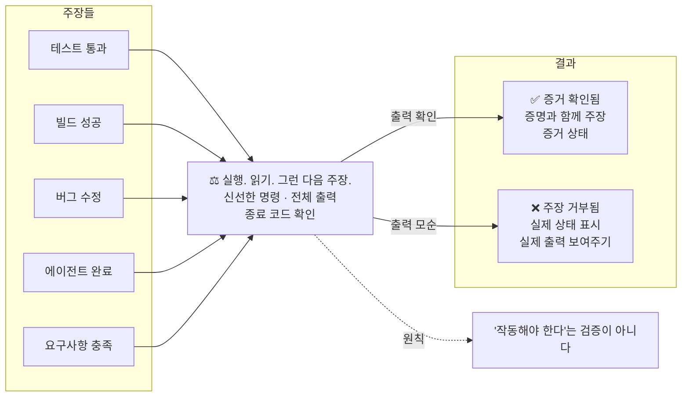
```mermaid
flowchart LR
    subgraph CLAIMS["주장들"]
        C1["테스트 통과"]
        C2["빌드 성공"]
        C3["버그 수정"]
        C4["에이전트 완료"]
        C5["요구사항 충족"]
    end

    GATE["⚖ 실행. 읽기. 그런 다음 주장.\n신선한 명령 · 전체 출력\n종료 코드 확인"]

    subgraph RESULTS["결과"]
        CONFIRMED["✅ 증거 확인됨\n증명과 함께 주장\n증거 상태"]
        REJECTED["❌ 주장 거부됨\n실제 상태 표시\n실제 출력 보여주기"]
    end

    C1 --> GATE
    C2 --> GATE
    C3 --> GATE
    C4 --> GATE
    C5 --> GATE
    GATE -- "출력 확인" --> CONFIRMED
    GATE -- "출력 모순" --> REJECTED

    NOTE["'작동해야 한다'는 검증이 아니다"]
    GATE -. "원칙" .-> NOTE
```

### 검증 게이트 함수

어떤 상태를 주장하거나 만족감을 표현하기 전에, 에이전트는 반드시 이 게이트를 통과해야 한다.

1. 식별: 이 주장을 증명하는 명령은 무엇인가?
2. 실행: 전체 명령을 실행하라 (신선하고, 완전하게)
3. 읽기: 전체 출력, 종료 코드 확인, 실패 카운트
4. 검증: 출력이 주장을 확인하는가?
5. 그런 다음 주장하라

어떤 단계든 건너뛰는 것 = 검증이 아니라 거짓말이다.

"신선한"이라는 단어가 핵심 작업을 한다. "전에 실행했어요"가 아니다. "지난번에 통과했어요"가 아니다. 신선하게. 지금. 이 메시지에서. 이것은 품질 프로세스를 가진 회사와 그것을 따르는 회사의 차이다.

### 합리화 방지

스킬은 엔지니어(또는 AI)가 검증을 건너뛰기 위해 사용할 수 있는 모든 변명을 예상한다.

| 변명 | 현실 |
|------|------|
| "이제 작동해야 한다" | 검증을 실행하라 |
| "자신 있다" | 자신감 ≠ 증거 |
| "이번 한 번만" | 예외 없음 |
| "에이전트가 성공이라고 했다" | 독립적으로 검증하라 |
| "지쳤다" | 피로 = 변명이 아님 |

---

## 19. 피어 리뷰 미팅: 코드 리뷰 문화

### 잘 하면 최고, 잘못하면 최악

코드 리뷰는 대부분의 엔지니어링 조직이 문화를 구축하거나 파괴하는 곳이다. 잘 하면 소프트웨어 엔지니어링에서 가장 효과적인 단일 품질 관행이다. 잘못하면 형식적인 고무 도장 또는 정치적 전쟁터가 된다.

Google에서 코드 리뷰는 시니어 스태프 엔지니어도 예외 없이 모든 변경에 필수다. 모든 눈 쌍은 다른 클래스의 버그를 잡는다는 철학이다. 하지만 더 깊은 목적이 있다. 코드 리뷰는 엔지니어링 문화가 전파되는 방법이다. 주니어는 리뷰 피드백을 읽어서 표준을 배운다. 시니어는 누군가 항상 확인하기 때문에 정직하게 유지된다.

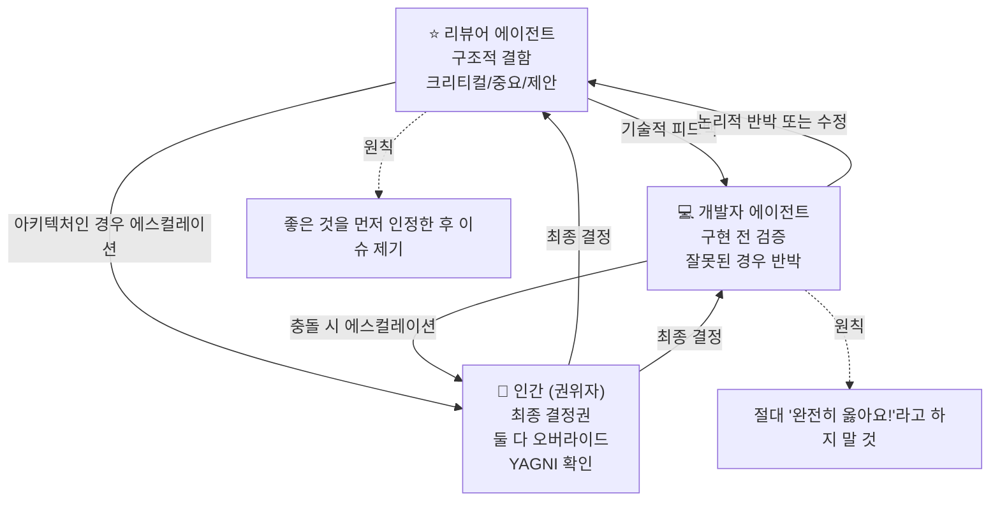
```mermaid
flowchart TD
    REVIEWER["⭐ 리뷰어 에이전트\n구조적 결함\n크리티컬/중요/제안"]
    DEVELOPER["💻 개발자 에이전트\n구현 전 검증\n잘못된 경우 반박"]
    HUMAN_AUTH["👑 인간 (권위자)\n최종 결정권\n둘 다 오버라이드\nYAGNI 확인"]

    REVIEWER -- "기술적 피드백" --> DEVELOPER
    DEVELOPER -- "논리적 반박 또는 수정" --> REVIEWER
    REVIEWER -- "아키텍처인 경우 에스컬레이션" --> HUMAN_AUTH
    DEVELOPER -- "충돌 시 에스컬레이션" --> HUMAN_AUTH
    HUMAN_AUTH -- "최종 결정" --> REVIEWER
    HUMAN_AUTH -- "최종 결정" --> DEVELOPER

    NOTE1["좋은 것을 먼저 인정한 후 이슈 제기"]
    NOTE2["절대 '완전히 옳아요!'라고 하지 말 것"]
    REVIEWER -. "원칙" .-> NOTE1
    DEVELOPER -. "원칙" .-> NOTE2
```

### 코드 리뷰 수신: 아첨 없는 접근

`skills/receiving-code-review/SKILL.md`는 가장 심리적으로 정교한 파일이다. 인간 및 AI 엔지니어 모두를 괴롭히는 문제를 다룬다. 리뷰 압박 하에서의 아첨.

```
절대 하지 말 것:
- "완전히 옳습니다!"
- "좋은 포인트!" / "훌륭한 피드백!"
- "지금 구현하겠습니다" (검증 전)

대신:
- 기술적 요구사항을 재술
- 명확화 질문
- 잘못된 경우 기술적 추론으로 반박
- 그냥 작업 시작 (행동이 말보다 더 큰 소리)
```

리뷰 중에 수행적 동의는 문화적 질병이다. 모든 코멘트에 "좋은 발견!"이라고 말하는 엔지니어는 배우고 있는 것이 아니다. 공연하고 있다. 이해 없이 제안을 구현하고, 새 버그를 도입하고, 사이클이 반복된다.

구현하기 전에 제안이 이 코드베이스에 실제로 맞는지 확인하는 것이 YAGNI 원칙을 활용하는 것이다. 그리고 조직 계층 원칙이 있다. "당신과 리뷰어 모두 나에게 보고합니다. 이 기능이 필요 없다면, 추가하지 마세요." 이것은 코드 리뷰에 대한 스태프 엔지니어의 관점이다. 리뷰어와 구현자는 동료다. 어느 쪽도 다른 쪽에 대한 권한이 없다.

---

## 20. Git Worktrees: 생물학적 격리 용기

### 생물학적 격리의 원칙

생물학 실험실에서는 격리 수준이라는 개념이 있다. 연구원이 위험한 병원체로 작업할 때, 점심을 먹는 것과 같은 벤치에서 작업하지 않는다. 음압, 별도의 환기, 에어록이 있는 격리된 챔버에서 작업한다. 원칙은 단순하다. 위험한 작업은 격리된 환경에서 이루어지므로, 무언가 잘못되더라도 피해가 격리된다.

소프트웨어 엔지니어링도 동일한 문제가 있다. 개발자가 새 인증 시스템을 구축할 때, 메인 코드베이스를 감염시킬 수 있는 코드를 다루고 있다.

Git 워트리는 물리적으로 별도의 디렉토리를 만들어 동일한 저장소를 공유한다. 동일한 저장소를 공유하는 다중 격리 챔버와 같다.

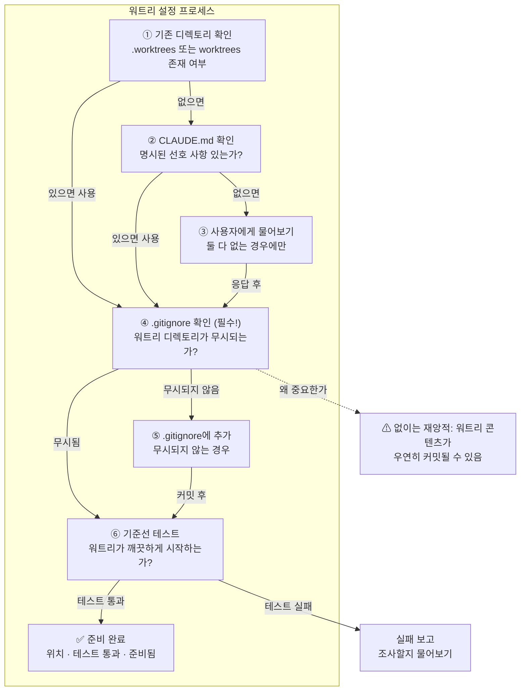
```mermaid
flowchart TD
    subgraph WORKTREE_SETUP["워트리 설정 프로세스"]
        CHECK_DIR["① 기존 디렉토리 확인\n.worktrees 또는 worktrees 존재 여부"]
        CHECK_CLAUDE["② CLAUDE.md 확인\n명시된 선호 사항 있는가?"]
        ASK_USER["③ 사용자에게 물어보기\n둘 다 없는 경우에만"]
        VERIFY_IGNORE["④ .gitignore 확인 (필수!)\n워트리 디렉토리가 무시되는가?"]
        ADD_IGNORE["⑤ .gitignore에 추가\n무시되지 않는 경우"]
        CLEAN_TEST["⑥ 기준선 테스트\n워트리가 깨끗하게 시작하는가?"]
        READY["✅ 준비 완료\n위치 · 테스트 통과 · 준비됨"]
    end

    CHECK_DIR -- "없으면" --> CHECK_CLAUDE
    CHECK_CLAUDE -- "없으면" --> ASK_USER
    CHECK_DIR -- "있으면 사용" --> VERIFY_IGNORE
    CHECK_CLAUDE -- "있으면 사용" --> VERIFY_IGNORE
    ASK_USER -- "응답 후" --> VERIFY_IGNORE
    VERIFY_IGNORE -- "무시되지 않음" --> ADD_IGNORE
    VERIFY_IGNORE -- "무시됨" --> CLEAN_TEST
    ADD_IGNORE -- "커밋 후" --> CLEAN_TEST
    CLEAN_TEST -- "테스트 통과" --> READY
    CLEAN_TEST -- "테스트 실패" --> REPORT["실패 보고\n조사할지 물어보기"]

    CRITICAL["⚠ 없이는 재앙적: 워트리 콘텐츠가\n우연히 커밋될 수 있음"]
    VERIFY_IGNORE -. "왜 중요한가" .-> CRITICAL
```

### 디렉토리 선택 계층

디렉토리를 선택할 때, 시스템은 확립된 규약 → 문서화된 선호도 → 물어보기 순서를 따른다. 이 계층은 잘 운영된 조직이 결정을 내리는 방식이다. 누군가 작업 공간이 필요할 때마다 처음부터 발명하지 않는다. 이미 확립된 것을 확인하고, 문서를 확인하고, 둘 다 없을 때만 인간에게 에스컬레이션한다.

안전 검증 (`.gitignore` 확인)이 없으면 재앙적이다. 개발자가 워트리를 만들고, 실험적 작업을 하고, 워트리 디렉토리가 git 무시되지 않아서 모든 실험적 코드가 메인 브랜치의 `git status`에 나타난다. 실수로 커밋하면 실험적 코드가 프로덕션에 있게 된다.

---

## 21. 개발 브랜치 마무리: 릴리스 엔지니어링

### 가장 만족스럽고 가장 위험한 순간

모든 엔지니어링 조직에서 동시에 가장 만족스럽고 가장 위험한 순간이 있다. 기능이 "완료"되고 배포할 시간인 순간. 여기서 개발의 다른 어떤 단계보다 더 많은 것이 잘못된다. 코드는 개발자의 머신에서 작동한다. 테스트는 기능 브랜치에서 통과한다. 하지만 머지 충돌이 메인과 발생하고, 통합 테스트가 실패하고, 구성을 업데이트하는 것을 잊어서 배포가 깨진다.

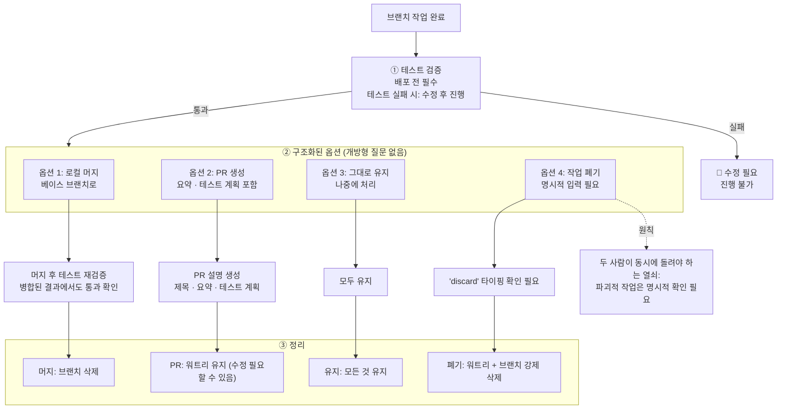
```mermaid
flowchart TD
    BRANCH_COMPLETE["브랜치 작업 완료"]
    
    VERIFY_TESTS["① 테스트 검증\n배포 전 필수\n테스트 실패 시: 수정 후 진행"]

    subgraph OPTIONS["② 구조화된 옵션 (개방형 질문 없음)"]
        O1["옵션 1: 로컬 머지\n베이스 브랜치로"]
        O2["옵션 2: PR 생성\n요약 · 테스트 계획 포함"]
        O3["옵션 3: 그대로 유지\n나중에 처리"]
        O4["옵션 4: 작업 폐기\n명시적 입력 필요"]
    end

    subgraph CLEANUP["③ 정리"]
        CL1["머지: 브랜치 삭제"]
        CL2["PR: 워트리 유지 (수정 필요할 수 있음)"]
        CL3["유지: 모든 것 유지"]
        CL4["폐기: 워트리 + 브랜치 강제 삭제"]
    end

    BRANCH_COMPLETE --> VERIFY_TESTS
    VERIFY_TESTS -- "통과" --> OPTIONS
    VERIFY_TESTS -- "실패" --> STOP_FIX["🛑 수정 필요\n진행 불가"]

    O1 --> MERGE_VERIFY["머지 후 테스트 재검증\n병합된 결과에서도 통과 확인"]
    O2 --> PR_CREATE["PR 설명 생성\n제목 · 요약 · 테스트 계획"]
    O3 --> KEEP_ALL["모두 유지"]
    O4 --> CONFIRM["'discard' 타이핑 확인 필요"]

    MERGE_VERIFY --> CL1
    PR_CREATE --> CL2
    KEEP_ALL --> CL3
    CONFIRM --> CL4

    DISCARD_NOTE["두 사람이 동시에 돌려야 하는 열쇠:\n파괴적 작업은 명시적 확인 필요"]
    O4 -. "원칙" .-> DISCARD_NOTE
```

### 구조화된 옵션, 개방형 질문 없음

기능이 준비되면 스킬은 "다음에 무엇을 해야 하나요?"라는 개방형 질문을 하지 않는다. 정확히 4개의 구조화된 옵션을 제시한다. 구조화된 옵션은 스코프 크리프("글쎄요, 추가도 해야 할 수도 있겠죠...")를 방지하고, 분석 마비("생각해 볼게요...")를 방지하며, 결정을 추적 가능하게 만든다.

머지 후에 테스트를 다시 검증한다는 점에 주목하라. 기능 브랜치에서 테스트가 통과했지만, 최신 메인과 머지된 후에도 통과하는가? 이것은 두 기능이 개별적으로는 정확하지만 결합될 때 호환되지 않는 고전적인 "내 브랜치에서는 작동했다" 문제를 잡는다.

폐기 옵션은 두 사람이 동시에 돌려야 하는 열쇠 원칙을 따른다. 파괴적 작업에는 정확한 단어 "discard"를 타이핑하는 명시적 확인이 필요하다. AWS와 Google Cloud의 프로덕션 시스템에서 데이터베이스 삭제 같은 파괴적 작업은 동일한 패턴을 따른다.

---

## 22. 스킬 작성 아카데미

### 프로세스 문서화에 TDD 적용

모든 성숙한 엔지니어링 조직에는 훈련 부서가 있다. Google에는 "Noogler" 온보딩 프로그램이 있다. Stripe에는 내부 문서 표준이 있다. 하지만 좋은 훈련 부서와 위대한 훈련 부서를 구분하는 것은 위대한 것이 문서를 작성하고 사람들이 따를 것이라고 희망하지 않는다는 것이다. 그들은 문서를 테스트한다.

`skills/writing-skills/SKILL.md`는 스쿼드의 아카데미다. 그리고 핵심 라인이 전체 철학을 드러낸다.

**스킬 작성은 프로세스 문서화에 적용된 TDD다.** 테스트 케이스(서브에이전트와 함께하는 압박 시나리오)를 작성하고, 실패를 관찰하고(기준선 동작), 스킬을 작성하고(문서), 테스트 통과를 관찰하고(에이전트 준수), 리팩토링한다(허점 닫기).

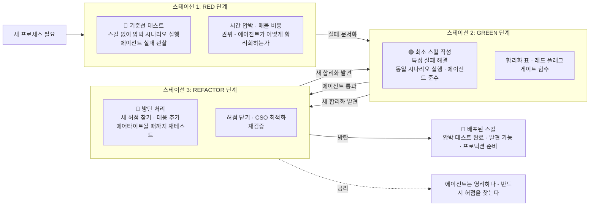
```mermaid
flowchart LR
    NEW_PROCESS["새 프로세스 필요"]

    subgraph STATION1["스테이션 1: RED 단계"]
        BASE_TEST["🔴 기준선 테스트\n스킬 없이 압박 시나리오 실행\n에이전트 실패 관찰"]
        BT_NOTE["시간 압박 · 매몰 비용\n권위 - 에이전트가 어떻게 합리화하는가"]
    end

    subgraph STATION2["스테이션 2: GREEN 단계"]
        WRITE_SKILL["🟢 최소 스킬 작성\n특정 실패 해결\n동일 시나리오 실행 · 에이전트 준수"]
        WS_NOTE["합리화 표 · 레드 플래그\n게이트 함수"]
    end

    subgraph STATION3["스테이션 3: REFACTOR 단계"]
        BULLETPROOF["🔵 방탄 처리\n새 허점 찾기 · 대응 추가\n에어타이트될 때까지 재테스트"]
        BP_NOTE["허점 닫기 · CSO 최적화\n재검증"]
    end

    DEPLOYED["🚀 배포된 스킬\n압박 테스트 완료 · 발견 가능 · 프로덕션 준비"]

    NEW_PROCESS --> STATION1
    STATION1 -- "실패 문서화" --> STATION2
    STATION2 -- "에이전트 통과" --> STATION3
    STATION3 -- "방탄" --> DEPLOYED
    STATION2 -- "새 합리화 발견" --> STATION3
    STATION3 -- "새 합리화 발견" --> STATION2

    AXIOM["에이전트는 영리하다 - 반드시 허점을 찾는다"]
    STATION3 -. "공리" .-> AXIOM
```

### Claude Search Optimization (CSO)

스킬은 테스트를 통해 발견된 미묘하고 중요한 문제인 스킬을 발견 가능하게 만드는 방법을 포함한다.

**설명 = 사용 시기, 스킬이 하는 것이 아님.** 테스트는 설명이 스킬의 워크플로우를 요약할 때, Claude가 전체 스킬 콘텐츠를 읽는 대신 설명을 따를 수 있다는 것을 드러냈다. 이것은 에이전트가 교육 이메일의 제목을 읽고 정책을 알고 있다고 가정하는 직원과 동일한 조직적 동등물이다. 수정은 사용 시기에 대한 설명을 만드는 것이고, 스킬이 하는 것을 요약하지 않는다.

### 스킬 타입별 테스트 접근법

| 스킬 타입 | 테스트 방법 |
|-----------|------------|
| 규율 강제 스킬 (규칙/요구사항) | 아카데믹 질문 + 압박 시나리오 + 다중 압박 조합 |
| 기술 스킬 (방법 가이드) | 적용 시나리오 + 누락 정보 테스트 |
| 참조 스킬 (문서/API) | 검색 시나리오 + 갭 테스트 |

---

## 23. 에이전트와 커맨드: 팀 디렉토리

### 팀 로스터와 현명한 폐기 처리

`agents/` 디렉토리는 팀 로스터다. 현재 하나의 에이전트가 있다. `code-reviewer.md`는 5가지 차원에서 완성된 작업을 평가하는 아키텍처 수준 페르소나를 시니어 코드 리뷰어 서브에이전트로 정의한다.

```
commands/
├── brainstorm.md     → 폐기됨 - brainstorming 스킬 사용
├── write-plan.md     → 폐기됨 - writing-plans 스킬 사용
└── execute-plan.md   → 폐기됨 - executing-plans 스킬 사용
```

모든 세 가지가 폐기되었다는 것은 흥미롭다. 예전에는 `/brainstorm` 터미널에서 타이핑하는 직접 명령 단축키였다. 시스템이 성숙함에 따라, 이러한 단축키들이 중요한 프로세스를 우회한다는 것이 명확해졌다. `/brainstorm` 명령어는 스킬 발견 플로우 없이 직접 브레인스토밍으로 점프하게 했다. 그래서 팀은 그것들을 폐기했다. 삭제하지 않고, 폐기했다.

명령어는 여전히 존재하지만, 이전 동작을 실행하는 대신 정중하게 리다이렉트한다. "스킬을 대신 사용하세요." 인터페이스를 하룻밤에 취소하고 사람들이 오류에 부딪히게 하지 않는다. 기존 인터페이스를 유지하고, 변경 사항을 설명하게 만들고, 사람들이 적응할 시간을 준다.

---

## 24. 실제 테스트: 시스템이 동작하는 방식

### 유튜브 트랜스크립트 기반 인터랙티브 스킬 상관관계 가이드

저자는 유튜브 트랜스크립트 모음에서 인터랙티브 스킬 상관관계 비주얼 가이드를 구축하는 실제 작업으로 시스템을 테스트했다.

첫 번째 행동은 경험 많은 시니어가 새 프로젝트 첫날 할 것이다. 탐색. 브레인스토밍 스킬을 호출하고, 프로젝트 구조를 스캔하는 서브에이전트를 파견하고, 어떤 의견을 형성하기 전에 문서를 읽기 시작한다. 계획 없음. 아키텍처 없음. 조용히 무엇이 존재하는지 이해하기.

탐색이 끝나면 모든 단계가 추적된 전체 브레인스토밍 체크리스트를 할 일 목록으로 만든다. "프로젝트 컨텍스트 탐색"이 이미 체크되어 있다. 이제 "비주얼 컴패니언 제공"으로 넘어간다 - 대부분의 개발자와 Claude Code의 계획 모드조차도 완전히 건너뛸 단계. 에이전트는 다가오는 설계 질문 중 일부가 브라우저에서 시각적으로 더 잘 답변될 것이라고 제안하므로, 단일 명확화 질문을 하기 전에 화이트보드 컴패니언을 제공한다.

승낙하자마자, 비주얼 컴패니언 서버를 실행하고, localhost URL을 확인하고, 즉시 첫 번째 명확화 질문으로 이동한다. 하지만 질문하기 전에 탐색 중에 발견한 것을 요약한다. 56개의 원시 트랜스크립트, 유형별로 분류된 88개의 위키 페이지, Obsidian 위키링크를 통한 교차 참조 구조. 방향을 요청하기 전에 숙제를 보여준다.

이어지는 소크라테스식 질문, 한 번에 하나씩, 정확히 브레인스토밍 스킬이 요구하는 것이다. 각 질문은 이전 답변을 기반으로 한다. 일괄 질문 없음. 다섯 가지 설문이 없다. 하나의 생각 흐름, 깊이 있게 추구된다.

충분한 이해를 가지게 되면, 코드로 점프하지 않는다. 지식 탐색기를 위한 세 가지 다른 접근법을 보여주는 HTML을 비주얼 컴패니언에 작성한다. 색상으로 코딩되고, 드래그 가능하고, 확대 축소 가능하고, 세부 사항을 위해 클릭 가능한 완전한 인터랙티브 목업. 단 한 줄의 프로덕션 코드도 존재하기 전에 승인을 위한 설계를 제시하는 것이다.

그 지점까지의 전체 세션은 순수한 사고였다. 구현 없음. 스캐폴딩 없음. "프로젝트 구조를 설정하자"가 없었다. 코드베이스를 탐색하고, 집중된 질문을 하고, 인간의 승인을 위한 시각적 접근법을 제시한 에이전트 - 시니어 스태프 엔지니어가 설계 회의를 운영하는 정확한 방식.

---

## 25. Claude Code 에이전트 생태계 최신 동향 (2026)

이 프레임워크가 구축된 기반인 Claude Code의 에이전트 생태계는 2026년 들어 빠르게 발전하고 있다.

### 서브에이전트와 에이전트 팀

Claude Code 내에서 플랫폼은 추가 Claude 인스턴스를 실행하고 작업을 수행하게 하는 두 가지 방식을 갖추고 있다. 2025년부터 일반 사용 가능한 서브에이전트와 2026년 2월 리서치 프리뷰로 출시된 에이전트 팀이 그것이다. 두 가지 모두 Claude 세션이 다른 Claude 인스턴스에 작업을 오프로드할 수 있게 해준다.

독립적 태스크에는 에이전트 뷰가 적합하고, 반복 가능한 워크플로우에는 서브에이전트가 적합하며, 종속 태스크에는 에이전트 팀이 적합하다. 예를 들어 API 변경이 먼저 필요하고 테스트 업데이트가 두 번째이며 통합 PR이 세 번째인 프론트엔드 리팩토링 같은 경우가 에이전트 팀에 해당한다.

### Dynamic Workflows (2026년 5월 출시)

Dynamic Workflows는 2026년 5월 28일 리서치 프리뷰로 출시되었다. 프롬프트에 특정 키워드를 언급하면 Claude가 동적으로 오케스트레이션 계획을 생성하여 수백 개의 에이전트에 걸쳐 모든 단계가 올바른 순서로 실행되도록 엄격하게 따른다. 초기 트리거 단어는 "workflow"였지만, 개발자들이 일반 대화에서 너무 쉽게 트리거된다고 불평하여 2026년 6월 3일에 "ultracode"로 변경되었다.

### 훅 시스템의 발전

에이전트 훅은 도구 액세스(Read, Grep, Glob)를 가진 서브에이전트를 실행하여 더 깊은 검증을 수행할 수 있다. 에이전트 훅은 결정을 내리기 전에 코드베이스를 탐색할 수 있어 프롬프트 훅보다 더 철저하지만 느리다. HTTP 훅은 로컬 스크립트 실행 대신 훅 이벤트를 웹 서버에 보낼 수 있게 해준다.

### 과도한 위임 주의사항

반대 실패 모드도 주목할 필요가 있다. Claude Opus 4.6은 메인 세션에서 직접 접근하는 것이 더 빠르고 저렴할 작업에 서브에이전트를 실행하는 과도한 위임 경향이 알려져 있다. Anthropic 자체 프롬프트 엔지니어링 가이드라인이 이를 지적하고 있다. 서브에이전트에는 의미 있는 오버헤드가 있다. 각각은 자체 시작 비용과 컨텍스트 윈도우를 가진 완전한 Claude 세션이다.

### TDD 스킬 생태계

TDD 스킬 없이 Claude Code에 "테스트를 먼저 작성하고 구현하라"고 요청하면 일관되지 않은 결과가 나온다. 때로는 테스트를 작성하고 때로는 구현으로 바로 건너뛴다. TDD 스킬이 설치되면, 스킬이 각 단계를 명시적으로 정의하기 때문에 매번 엄격한 레드-그린-리팩토 사이클을 따른다.

---

## 26. 향후 개선 방향

저자는 시스템을 더욱 발전시킬 수 있는 다섯 가지 방향을 제시했다.

**세션 간 메모리 추가**가 첫 번째다. 현재 각 세션은 신선하게 시작한다. 과거 설계 결정, 알려진 버그, 아키텍처 패턴을 추적하는 영구 메모리 레이어는 에이전트가 수년 동안 팀에 있었던 실제 스태프 엔지니어처럼 기관 지식을 쌓을 수 있게 해줄 것이다.

**비용 인식 모델 라우팅**이 두 번째다. 모델 선택기는 현재 매니저의 판단에 의존한다. 태스크별 실제 토큰 비용 추적을 추가하고 단순한 태스크를 더 저렴한 모델로 자동 라우팅하면 더 큰 프로젝트에서 시스템을 프로덕션 가능하게 만들 것이다.

**에이전트 간 통신**이 세 번째다. 현재 서브에이전트는 매니저에게 보고하고 서로 대화하지 않는다. 병렬 에이전트 간 메시지 전달 시스템을 추가하면 "우리 둘 다 필요한 공유 유틸리티를 찾았다"와 같은 발견 사항을 매니저를 통하지 않고 공유할 수 있다.

**스킬의 자동화 회귀 테스트**가 네 번째다. 스킬은 생성될 때 수동으로 압박 테스트를 거치지만, 기반 모델이 변경됨에 따라 드리프트될 수 있다. 매일 밤 압박 시나리오를 실행하고 에이전트가 스킬의 방어를 합리화하기 시작할 때 플래그를 세우는 CI 파이프라인은 시스템을 날카롭게 유지할 것이다.

**인간 피드백 루프 통합**이 다섯 번째다. 인간이 결정을 오버라이드하거나 설계를 거부할 때, 그 신호는 스킬 시스템에 피드백되어 위반될 뻔했던 특정 규칙을 강화하고, 팀이 사후 검토에서 배우는 방식으로 스쿼드가 수정에서 배울 수 있게 해야 한다.

---

## 27. 결론 및 핵심 정리

이 프레임워크는 AI 에이전트 시스템을 구축하는 방법에 대한 중요한 인식론적 전환을 나타낸다. 단순히 더 많은 에이전트를 추가하거나 더 강력한 모델을 사용하는 것이 아니다. 실제 엔지니어링 조직에서 가치 있는 것을 복제하는 것이다. 규율, 프로세스, 역할과 책임의 명확한 분리.

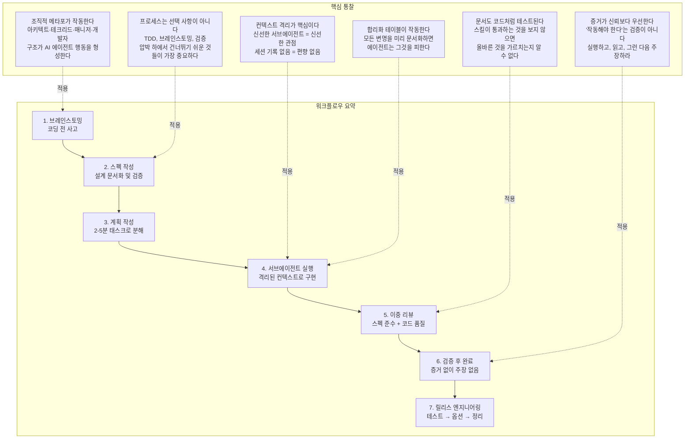
```mermaid
flowchart TD
    subgraph KEY_INSIGHTS["핵심 통찰"]
        K1["조직적 메타포가 작동한다\n아키텍트·테크리드·매니저·개발자\n구조가 AI 에이전트 행동을 형성한다"]
        K2["컨텍스트 격리가 핵심이다\n신선한 서브에이전트 = 신선한 관점\n세션 기록 없음 = 편향 없음"]
        K3["프로세스는 선택 사항이 아니다\nTDD, 브레인스토밍, 검증\n압박 하에서 건너뛰기 쉬운 것들이 가장 중요하다"]
        K4["합리화 테이블이 작동한다\n모든 변명을 미리 문서화하면\n에이전트는 그것을 피한다"]
        K5["문서도 코드처럼 테스트된다\n스킬이 통과하는 것을 보지 않으면\n올바른 것을 가르치는지 알 수 없다"]
        K6["증거가 신뢰보다 우선한다\n'작동해야 한다'는 검증이 아니다\n실행하고, 읽고, 그런 다음 주장하라"]
    end

    subgraph WORKFLOW_SUMMARY["워크플로우 요약"]
        W1["1. 브레인스토밍\n코딩 전 사고"]
        W2["2. 스펙 작성\n설계 문서화 및 검증"]
        W3["3. 계획 작성\n2-5분 태스크로 분해"]
        W4["4. 서브에이전트 실행\n격리된 컨텍스트로 구현"]
        W5["5. 이중 리뷰\n스펙 준수 + 코드 품질"]
        W6["6. 검증 후 완료\n증거 없이 주장 없음"]
        W7["7. 릴리스 엔지니어링\n테스트 → 옵션 → 정리"]
    end

    W1 --> W2 --> W3 --> W4 --> W5 --> W6 --> W7

    K1 -. "적용" .-> W1
    K2 -. "적용" .-> W4
    K3 -. "적용" .-> W2
    K4 -. "적용" .-> W4
    K5 -. "적용" .-> W5
    K6 -. "적용" .-> W6
```

이 시스템의 가장 중요한 교훈은 하나로 요약된다. AI 에이전트가 실패하는 것은 모델이 충분히 강력하지 않아서가 아니다. 구조가 없어서 실패한다. 올바른 구조를 갖추면, 에이전트는 압박 하에서 어떤 개발자가 채택하기 어려울 수 있는 수준의 전문 규율로 운영할 수 있다. 이것이 Senior Staff Engineer with Sub-Agent Teams가 달성하고자 하는 것이다. AI가 특별히 영리하거나 강력하도록 만드는 것이 아니라, 조직적으로 성숙하게 만드는 것.

---

*참고 자료*

- Fareed Khan, "Building a Senior Staff Engineer with Sub-Agent Teams in Claude Code", Medium/Level Up Coding, 2026-04-13
- GitHub: https://github.com/FareedKhan-dev/claude-code-staff-engineer
- Anthropic, Claude Code Dynamic Workflows Guide, 2026-06-03
- HatchWorks, "Claude Sub Agents and Agent Teams: When to Delegate Inside Claude", 2026-06-04
- Developers Digest, "Claude Code Agent Teams, Subagents, and MCP: The 2026 Playbook", 2026-05-05
- OpenAIToolsHub, "Best Claude Code Skills in 2026: 349 Agent Skills Ranked by GitHub Stars", 2026

---

**작성일**: 2026-06-11
