> **원문**: Fareed Khan, ["Building a Senior Staff Engineer with Sub-Agent Teams in Claude Code"](https://medium.com/gitconnected/building-a-senior-staff-engineer-with-sub-agent-teams-in-claude-code-771298151392)  
> **출처**: Medium / Level Up Coding (2026년 4월 13일)  
> **GitHub**: https://github.com/FareedKhan-dev/claude-code-staff-engineer  
> **작성일**: 2026-06-11

---

## 목차

1. [개요 및 핵심 통찰](#1-개요-및-핵심-통찰)
2. [전체 시스템 아키텍처](#2-전체-시스템-아키텍처)
3. [팀 코드베이스 구조](#3-팀-코드베이스-구조)
4. [Hooks: 관리 레이어](#4-hooks-관리-레이어)
5. [직원 핸드북과 1% 규칙](#5-직원-핸드북과-1-규칙)
6. [브레인스토밍과 설계 단계](#6-브레인스토밍과-설계-단계)
7. [스펙 리뷰: 논리적 허점 탐지](#7-스펙-리뷰-논리적-허점-탐지)
8. [비주얼 컴패니언: 브라우저 화이트보드](#8-비주얼-컴패니언-브라우저-화이트보드)
9. [계획 작성: 백로그 그루밍](#9-계획-작성-백로그-그루밍)
10. [계획 리뷰: 그루밍 게이트키퍼](#10-계획-리뷰-그루밍-게이트키퍼)
11. [서브에이전트 기반 개발: 위임의 기술](#11-서브에이전트-기반-개발-위임의-기술)
12. [구현자 프롬프트: 개발자 직무 기술서](#12-구현자-프롬프트-개발자-직무-기술서)
13. [스펙 및 코드 품질 리뷰어: 준법 감시관](#13-스펙-및-코드-품질-리뷰어-준법-감시관)
14. [테스트 주도 개발: 철의 법칙](#14-테스트-주도-개발-철의-법칙)
15. [테스팅 안티패턴: 게으른 QA 훈련](#15-테스팅-안티패턴-게으른-qa-훈련)
16. [체계적 디버깅: 포렌식 엔지니어링](#16-체계적-디버깅-포렌식-엔지니어링)
17. [근본 원인 추적과 심층 방어](#17-근본-원인-추적과-심층-방어)
18. [완료 전 검증: 최종 사인오프](#18-완료-전-검증-최종-사인오프)
19. [피어 리뷰 미팅: 코드 리뷰 문화](#19-피어-리뷰-미팅-코드-리뷰-문화)
20. [Git Worktrees: 생물학적 격리 용기](#20-git-worktrees-생물학적-격리-용기)
21. [개발 브랜치 마무리: 릴리스 엔지니어링](#21-개발-브랜치-마무리-릴리스-엔지니어링)
22. [스킬 작성 아카데미](#22-스킬-작성-아카데미)
23. [에이전트와 커맨드: 팀 디렉토리](#23-에이전트와-커맨드-팀-디렉토리)
24. [실제 테스트: 시스템이 동작하는 방식](#24-실제-테스트-시스템이-동작하는-방식)
25. [Claude Code 에이전트 생태계 최신 동향 (2026)](#25-claude-code-에이전트-생태계-최신-동향-2026)
26. [향후 개선 방향](#26-향후-개선-방향)
27. [결론 및 핵심 정리](#27-결론-및-핵심-정리)

---

## 1. 개요 및 핵심 통찰

### 주니어와 시니어 엔지니어의 차이

이 글의 출발점은 매우 통찰력 있는 질문 하나로 시작된다. 주니어 엔지니어와 시니어 엔지니어의 차이는 무엇인가? 저자 Fareed Khan은 이 차이가 문법 지식이나 알고리즘 능력에 있는 것이 아니라고 말한다. 진짜 차이는 **예측 가능성**, **위험 관리**, 그리고 **압박 상황에서의 규율**에 있다.

AI 에이전트는 바로 이 지점에서 실패한다. 에이전트는 리뷰를 건너뛰고, 지름길을 합리화하며, 아무도 실제로 검증하지 않은 코드를 자랑스럽게 제출한다. Anthropic의 연구에 따르면 에이전트들은 협력은 잘 하지만, 구조 없이 에이전트를 늘리는 것은 더 많은 혼돈과 낭비된 컴퓨팅 자원을 의미할 뿐이다.

해결책은 실제 기업이 갖추고 있는 것과 동일한 구조다. 즉, 설계에서 배포까지 이어지는 규율 있는 파이프라인을 통해 전문화된 서브에이전트를 조율하는 스태프 엔지니어가 필요하다. 이 프레임워크는 Claude Code 위에서 그 역할을 하도록 설계되었다.

### 시스템의 4대 운영 원칙

이 시스템이 실제 엔지니어링 조직처럼 작동하는 방식은 다음 네 가지 핵심 책임 분리로 요약된다.

첫째, **발견 및 설계(Discovery & Design)** 다. 아키텍트 에이전트는 질문을 한 번에 하나씩 하고, 2-3가지 접근법을 트레이드오프와 함께 탐구하며, 설계 스펙을 git에 커밋한다. 인간의 승인 없이는 코드를 작성하지 않는다.

둘째, **계획 및 리뷰(Planning & Review)** 다. 테크 리드가 스펙을 2-5분 단위 태스크로 분해하고, 각 태스크에는 정확한 파일 경로와 완전한 코드가 포함된다. 신선한 서브에이전트가 계획을 스펙과 대조하여 감사하고, 빠진 부분이나 스코프 크리프를 찾아낸다.

셋째, **실행 엔진(Execution Engine)** 이다. 매니저가 태스크별로 격리된 컨텍스트를 가진 신선한 서브에이전트를 파견한다. 막힌 에이전트는 에스컬레이션하고, 나쁜 작업물은 종료 후 재파견된다.

넷째, **품질 게이트(Quality Gates)** 다. 두 단계의 순차 리뷰가 진행된다. 스펙 준수 검토(올바른 것을 만들었는가?)와 코드 품질 검토(잘 만들었는가?)가 순서대로 진행되며, 검증 게이트는 완료를 주장하기 전에 신선한 터미널 출력을 요구한다.

---

## 2. 전체 시스템 아키텍처

아래 다이어그램은 이 시스템의 전체 흐름을 보여준다. 인간 스테이크홀더가 최상위 권한을 가지며, 스태프 엔지니어가 중심 조율자 역할을 한다.

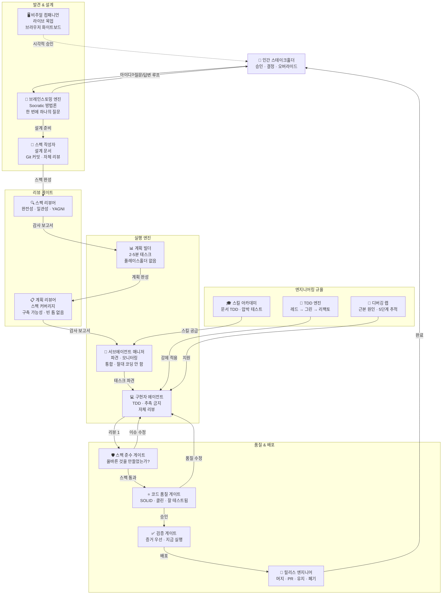
```mermaid
flowchart TD
    HUMAN["👤 인간 스테이크홀더\n승인 · 결정 · 오버라이드"]

    subgraph DISCOVERY["발견 & 설계"]
        BRAIN["🧠 브레인스토밍 엔진\nSocratic 방법론\n한 번에 하나의 질문"]
        SPEC_WRITER["📝 스펙 작성자\n설계 문서\nGit 커밋 · 자체 리뷰"]
        VISUAL["🖥 비주얼 컴패니언\n라이브 목업\n브라우저 화이트보드"]
    end

    subgraph REVIEW_GATES["리뷰 게이트"]
        SPEC_REV["🔍 스펙 리뷰어\n완전성 · 일관성 · YAGNI"]
        PLAN_REV["📋 계획 리뷰어\n스펙 커버리지\n구축 가능성 · 빈 틈 없음"]
    end

    subgraph EXECUTION["실행 엔진"]
        SUBAGENT_MGR["👥 서브에이전트 매니저\n파견 · 모니터링\n통합 · 절대 코딩 안 함"]
        IMPLEMENTER["💻 구현자 에이전트\nTDD · 추측 금지\n자체 리뷰"]
        PLAN_BUILDER["📊 계획 빌더\n2-5분 태스크\n플레이스홀더 없음"]
    end

    subgraph QUALITY["품질 & 배포"]
        COMPLIANCE["🛡 스펙 준수 게이트\n올바른 것을 만들었는가?"]
        CODE_QUAL["⭐ 코드 품질 게이트\nSOLID · 클린 · 잘 테스트됨"]
        VERIFY["✅ 검증 게이트\n증거 우선 · 지금 실행"]
        RELEASE["🚀 릴리스 엔지니어\n머지 · PR · 유지 · 폐기"]
    end

    subgraph DISCIPLINE["엔지니어링 규율"]
        TDD_ENGINE["🔴 TDD 엔진\n레드 → 그린 → 리팩토"]
        DEBUG_LAB["🔬 디버깅 랩\n근본 원인 · 5단계 추적"]
        SKILL_ACADEMY["🎓 스킬 아카데미\n문서 TDD · 압박 테스트"]
    end

    HUMAN -- "아이디어 요청" --> BRAIN
    BRAIN -- "질문/답변 루프" --> HUMAN
    VISUAL -. "시각적 승인" .-> HUMAN
    BRAIN -- "설계 준비" --> SPEC_WRITER
    SPEC_WRITER -- "스펙 완성" --> SPEC_REV
    SPEC_REV -- "감사 보고서" --> PLAN_BUILDER
    PLAN_BUILDER -- "계획 완성" --> PLAN_REV
    PLAN_REV -- "감사 보고서" --> SUBAGENT_MGR
    SUBAGENT_MGR -- "태스크 파견" --> IMPLEMENTER
    IMPLEMENTER -- "리뷰 1" --> COMPLIANCE
    COMPLIANCE -- "스펙 통과" --> CODE_QUAL
    CODE_QUAL -- "승인" --> VERIFY
    COMPLIANCE -- "이슈 수정" --> IMPLEMENTER
    CODE_QUAL -- "품질 수정" --> IMPLEMENTER
    VERIFY -- "배포" --> RELEASE
    RELEASE -- "완료" --> HUMAN
    TDD_ENGINE -- "강제 적용" --> IMPLEMENTER
    DEBUG_LAB -- "지원" --> IMPLEMENTER
    SKILL_ACADEMY -- "스킬 공급" --> SUBAGENT_MGR
```

---

## 3. 팀 코드베이스 구조

### 조직 스캐폴딩을 먼저 구축한다

Spotify, Shopify, Stripe 같은 회사에서 스태프 엔지니어가 새 프로젝트에서 하는 첫 번째 일은 기능 코딩이 아니다. 그들은 프로젝트 구조, 개발 워크플로우, CI/CD 파이프라인, 팀 규범을 확립한다. 제품 코드 한 줄이 작성되기 전에 조직적 스캐폴딩을 구축하는 것이다.

이 시스템도 동일한 접근법을 취한다. 솔로 개발자가 아닌 협력하고, 프로세스를 따르고, 서로에게 책임을 지는 에이전트 팀을 구축하고 있기 때문에 구조가 필요하다.

```
senior_staff_engineer/
├── agents/                             # 에이전트 + 서브에이전트 정의
├── commands/                           # 커스텀 CLI 스타일 에이전트 명령어
├── hooks/                              # 라이프사이클 훅 (이벤트, 워크플로우 제어)
└── skills/                             # 핵심 역량 모듈
    ├── brainstorming/                  # 아이디어 생성 & 설계
    │   └── scripts/                    # 비주얼/인터랙티브 브레인스토밍
    ├── dispatching-parallel-agents/    # 다중 에이전트 조율
    ├── executing-plans/                # 단계별 계획 실행
    ├── finishing-a-development-branch/ # 머지 전 작업 완료
    ├── receiving-code-review/          # 피드백 처리 & 반복
    ├── requesting-code-review/         # PR 준비 + 리뷰 요청
    ├── subagent-driven-development/    # 서브에이전트에 위임
    ├── systematic-debugging/           # 근본 원인 분석
    ├── test-driven-development/        # 테스트 작성 → 구현 → 검증
    ├── using-git-worktrees/            # 워트리를 통한 작업 격리
    ├── using-senior-staff-engineer/    # 이 시스템 구성 & 최적화
    ├── verification-before-completion/ # 완료 전 최종 검증
    ├── writing-plans/                  # 계획 생성
    └── writing-skills/                 # 새 스킬 작성
```

이 디렉토리 구조는 실제 엔지니어링 조직의 각 역할이나 기능에 대응한다. `agents/` 디렉토리는 팀 로스터로 누가 무엇을 하는지 정의하고, `skills/` 디렉토리는 모든 팀원이 따르는 프로세스와 표준이 담긴 직원 핸드북이며, `hooks/` 디렉토리는 정보의 흐름을 제어하고 모든 사람이 정렬된 상태로 시작하도록 보장하는 관리 레이어다.

---

## 4. Hooks: 관리 레이어

### 보이지 않는 관리 인프라

모든 회사에는 보이지 않게 작동하는 관리 인프라 레이어가 있다. 첫 번째 회의 전에 사무실은 이미 열려 있고, 커피 머신은 돌아가고, 공유 캘린더는 동기화되어 있으며, 팀의 Slack 채널에는 밤사이 업데이트가 가득 차 있다. 아무도 이 인프라에 대해 생각하지 않는다. 고장이 날 때까지는.

이 시스템에서 `hooks/`가 바로 이 관리 레이어다. Claude Code에서 훅은 세션 시작, 컨텍스트 초기화, 에이전트의 메모리 압축 시점 같은 특정 라이프사이클 이벤트에서 무슨 일이 일어날지 제어할 수 있게 해준다.

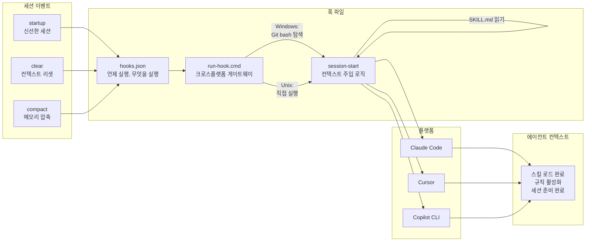
```mermaid
flowchart LR
    subgraph EVENTS["세션 이벤트"]
        SE1["startup\n신선한 세션"]
        SE2["clear\n컨텍스트 리셋"]
        SE3["compact\n메모리 압축"]
    end

    subgraph HOOKS_FILES["훅 파일"]
        HJ["hooks.json\n언제 실행, 무엇을 실행"]
        RH["run-hook.cmd\n크로스플랫폼 게이트웨이"]
        SS["session-start\n컨텍스트 주입 로직"]
    end

    subgraph PLATFORMS["플랫폼"]
        CC["Claude Code"]
        CUR["Cursor"]
        COPI["Copilot CLI"]
    end

    subgraph OUTPUT["에이전트 컨텍스트"]
        AC["스킬 로드 완료\n규칙 활성화\n세션 준비 완료"]
    end

    SE1 --> HJ
    SE2 --> HJ
    SE3 --> HJ
    HJ --> RH
    RH -- "Windows:\nGit bash 탐색" --> SS
    RH -- "Unix:\n직접 실행" --> SS
    SS -- "SKILL.md 읽기" --> SS
    SS --> CC
    SS --> CUR
    SS --> COPI
    CC --> AC
    CUR --> AC
    COPI --> AC
```

### hooks.json의 구성

`hooks.json`은 단순하다. 세션이 시작될 때마다 초기화 스크립트를 실행하는 한 가지 규칙을 정의한다.

```json
{
  "hooks": {
    "SessionStart": [
      {
        "matcher": "startup|clear|compact",
        "hooks": [
          {
            "type": "command",
            "command": "\"${PROJECT_ROOT_DIR}/hooks/run-hook.cmd\" session-start",
            "async": false
          }
        ]
      }
    ]
  }
}
```

매처는 세 가지 시나리오에서 트리거된다. `startup`은 신선한 세션, `clear`는 컨텍스트 리셋, `compact`는 메모리 압축 시점이다. 조직적 관점에서 이것은 프로젝트로 컨텍스트 전환할 때마다 실행되는 온보딩 체크리스트를 가지는 것과 같다. AI 에이전트 입장에서 모든 세션은 첫날이기 때문이다. 에이전트에게는 어제 세션의 기억이 없다. 매번 재온보딩이 필요하다.

`async: false` 플래그는 에이전트가 응답을 시작하기 전에 훅이 완료되도록 보장한다. 이것은 "아침 스탠드업이 끝난 후에야 누구든 노트북을 열 수 있다"고 말하는 것과 동일하다.

### 크로스플랫폼 게이트웨이

실제 회사에서 모든 사람이 같은 OS를 실행하지는 않는다. `run-hook.cmd`는 이것을 처리한다. Windows에서는 일반적인 Git 설치 경로에서 bash를 찾고, Unix에서는 스크립트를 직접 실행한다. 에이전트는 어떤 OS에서 실행 중인지 알 필요가 없다. 게이트웨이 스크립트가 알아내고 그에 따라 라우팅한다. Docker와 Kubernetes의 원칙과 같다. 환경을 추상화하여 애플리케이션 로직이 신경 쓸 필요가 없도록 만드는 것이다.

### session-start 스크립트

세션 시작 스크립트는 실제 온보딩이 일어나는 곳이다. 새 세션이 시작되면, 이 스크립트는 팀의 핵심 스킬 파일을 로드하여 에이전트의 컨텍스트에 주입한다. 이것은 작업이 시작되기 전에 스태프 엔지니어가 모든 사람에게 팀의 운영 원칙을 상기시켜 주는 아침 스탠드업과 같다.

---

## 5. 직원 핸드북과 1% 규칙

### 조직 문화의 기반 문서

모든 조직에는 문화를 확립하는 창립 문서가 있다. Amazon에는 리더십 원칙이, Netflix에는 문화 덱이, Bridgewater에는 원칙이 있다. 이 문서들은 회사가 무엇을 하는지만이 아니라 어떻게 생각해야 하는지를 설명한다.

`skills/using-senior-staff-engineer/SKILL.md`가 이 시스템의 문화 덱이다. 모든 에이전트의 컨텍스트에 세션 시작 시 처음으로 로드되며, 시스템 전체의 가장 중요한 규칙 하나를 확립한다.

```
만약 스킬이 하고 있는 일에 1%라도 적용될 수 있다고 생각한다면,
반드시 해당 스킬을 호출해야 한다.

스킬이 태스크에 적용된다면, 선택의 여지가 없다.
반드시 사용해야 한다.
```

이것이 **1% 규칙**이다. 이것 없이는 에이전트가 스킬을 제안으로 취급한다. "이 작업은 간단해 보여서" 브레인스토밍 단계를 건너뛰거나, "이건 그냥 설정 변경이라서" TDD를 건너뛴다. 경험 많은 엔지니어는 모두 팀이 바로 이런 합리화를 통해 천천히 프로세스를 포기하는 것을 지켜본 적이 있다. 결과는 항상 같다. 품질이 저하되고, 버그가 배포되며, 모두가 무슨 일이 일어났는지 의아해한다.

### 명령 우선순위 체계

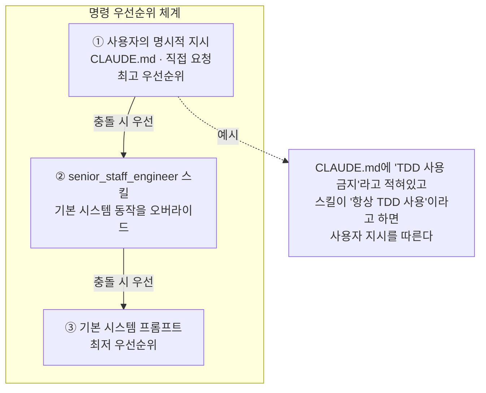
```mermaid
flowchart TD
    subgraph PRIORITY["명령 우선순위 체계"]
        P1["① 사용자의 명시적 지시\nCLAUDE.md · 직접 요청\n최고 우선순위"]
        P2["② senior_staff_engineer 스킬\n기본 시스템 동작을 오버라이드"]
        P3["③ 기본 시스템 프롬프트\n최저 우선순위"]
    end

    P1 -- "충돌 시 우선" --> P2
    P2 -- "충돌 시 우선" --> P3

    NOTE1["CLAUDE.md에 'TDD 사용 금지'라고 적혀있고\n스킬이 '항상 TDD 사용'이라고 하면\n사용자 지시를 따른다"]

    P1 -. "예시" .-> NOTE1
```

사람(VP, 창업자, 제품 책임자)은 항상 최종 권한을 갖는다. 실제 회사에서 이것은 프로세스 중심 문화와 관료주의의 차이다. 프로세스 중심 문화는 더 좋은 결과를 만들기 때문에 프로세스를 따르지만, 상황이 요구할 때는 오버라이드한다. 관료주의는 나쁜 결과를 만들고 있더라도 맹목적으로 프로세스를 따른다.

### 스킬 발견 플로우와 레드 플래그 표

핸드북에는 에이전트가 메시지를 받기 전에 스킬을 확인하고 호출하는 방법을 정의하는 순서도가 포함되어 있다. 그리고 더욱 중요한 것은 에이전트가 프로세스를 따르기를 꺼린다는 신호를 나타내는 합리화 목록이다.

| 생각 | 현실 |
|------|------|
| "이건 그냥 간단한 질문이야" | 질문도 태스크다. 스킬을 확인하라. |
| "먼저 더 많은 컨텍스트가 필요해" | 스킬 확인이 명확화 질문보다 먼저다. |
| "먼저 코드베이스를 탐색해야 해" | 스킬이 탐색 방법을 알려준다. 먼저 확인하라. |
| "이건 공식 스킬이 필요 없어" | 스킬이 존재한다면 사용하라. |
| "이 스킬을 기억하고 있어" | 스킬은 진화한다. 현재 버전을 읽어라. |
| "스킬이 과도해" | 단순한 것이 복잡해진다. 사용하라. |

이 표의 모든 항목은 에이전트가 스킬을 건너뛰려고 시도한 실제 테스트에서 나왔다. 실제 팀에서 이것은 "한 줄 변경이야"라고 말하면서 테스트 없이 배포했다가 생산 환경을 다운시키는 개발자와 같다.

---

## 6. 브레인스토밍과 설계 단계

### 코드 이전에 생각이 먼저다

Amazon은 제품을 만들기 전에 보도자료를 작성한다. Basecamp는 피치 문서를 작성한다. Google은 단일 함수가 정의되기 전에 세 단계의 엔지니어가 리뷰하는 설계 문서를 작성한다. 공통 주제는 구축 전에 사고가 먼저라는 것이다.

모든 시니어 스태프 엔지니어는 설계 단계를 건너뛴 프로젝트 이야기를 가지고 있다. "이건 간단해, 그냥 코딩 시작하자"고 누군가 말했다. 3주 후 팀은 이해관계자들이 원하는 것과 맞지 않는 구현의 절반쯤에 있고, 아키텍처는 아무도 묻지 않은 요구사항을 지원할 수 없으며, 재작성 비용이 전체 프로젝트의 최초 예상보다 더 많다.

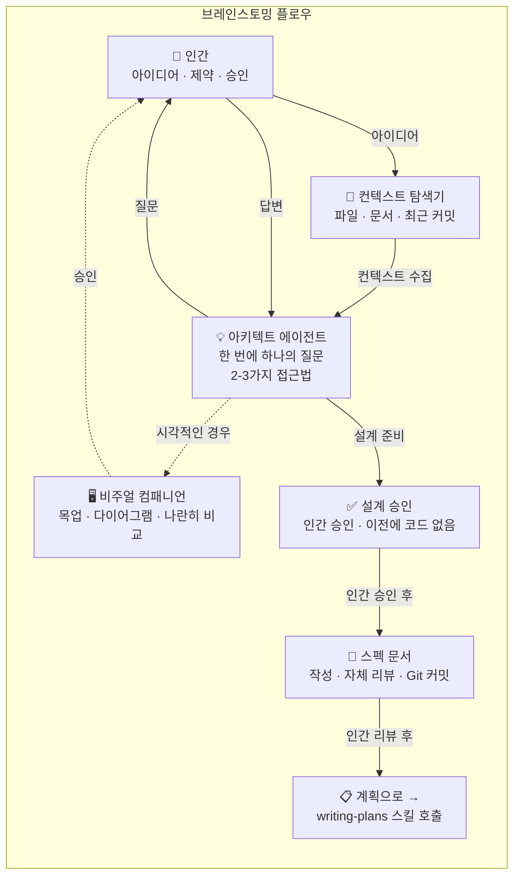
```mermaid
flowchart LR
    subgraph BRAINSTORM_FLOW["브레인스토밍 플로우"]
        HUMAN["👤 인간\n아이디어 · 제약 · 승인"]
        CONTEXT["📁 컨텍스트 탐색기\n파일 · 문서 · 최근 커밋"]
        ARCH["💡 아키텍트 에이전트\n한 번에 하나의 질문\n2-3가지 접근법"]
        APPROVE["✅ 설계 승인\n인간 승인 · 이전에 코드 없음"]
        SPEC_DOC["📄 스펙 문서\n작성 · 자체 리뷰 · Git 커밋"]
        VISUAL["🖥 비주얼 컴패니언\n목업 · 다이어그램 · 나란히 비교"]
        PLANNING["📋 계획으로 →\nwriting-plans 스킬 호출"]
    end

    HUMAN -- "아이디어" --> CONTEXT
    CONTEXT -- "컨텍스트 수집" --> ARCH
    ARCH -- "질문" --> HUMAN
    HUMAN -- "답변" --> ARCH
    ARCH -. "시각적인 경우" .-> VISUAL
    VISUAL -. "승인" .-> HUMAN
    ARCH -- "설계 준비" --> APPROVE
    APPROVE -- "인간 승인 후" --> SPEC_DOC
    SPEC_DOC -- "인간 리뷰 후" --> PLANNING
```

### 하드 게이트

`skills/brainstorming/SKILL.md`는 TDD 철의 법칙과 동일한 설계 등가물로 시작한다.

```
설계를 제시하고 사용자가 승인할 때까지 어떤 구현 스킬도 호출하지 말고,
코드를 작성하지 말고, 프로젝트를 스캐폴딩하지 말고,
어떤 구현 행동도 취하지 마라. 이것은 인식된 단순함에 관계없이
모든 프로젝트에 적용된다.
```

이것은 하드 게이트다. 제안이 아니다. 에이전트는 물리적으로 설계가 존재하고 인간이 승인할 때까지 코딩을 진행할 수 없다.

### "너무 단순해" 함정

스킬은 소프트웨어 엔지니어링에서 가장 위험한 합리화를 다룬다.

모든 프로젝트는 이 프로세스를 거친다. 할 일 목록, 단일 함수 유틸리티, 설정 변경 - 모두 마찬가지다. "단순한" 프로젝트는 검사되지 않은 가정이 가장 낭비적인 작업을 만드는 곳이다. 설계는 짧을 수 있지만(진정으로 단순한 프로젝트의 경우 몇 문장으로), 반드시 제시하고 승인을 받아야 한다.

"단순한" 설정 변경이 세 가지 서비스에 영향을 미쳤다. "빠른" 유틸리티 함수가 7가지 엣지 케이스를 처리해야 했다. "사소한" 할 일 앱이 실제로 오프라인 동기화, 충돌 해결, 다중 사용자 지원이 필요했다. 단순한 프로젝트는 아무도 검사하지 않기 때문에 정확히 검사되지 않은 가정이 숨어있는 곳이다.

### 브레인스토밍 9단계 체크리스트

스킬은 실제 제품 팀이 운영하는 방식을 반영하는 9단계 체크리스트를 제공한다.

| 단계 | 설명 |
|------|------|
| 1단계 | 프로젝트 컨텍스트 탐색 - 파일, 문서, 최근 커밋 확인 |
| 2단계 | 비주얼 컴패니언 제공 (시각적 질문이 있을 경우) |
| 3단계 | 명확화 질문 - 한 번에 하나씩, 목적/제약/성공 기준 이해 |
| 4단계 | 2-3가지 접근법 제안 - 트레이드오프와 권장사항 포함 |
| 5단계 | 설계 제시 - 복잡도에 맞게 섹션별로, 각 섹션 후 승인 획득 |
| 6단계 | 설계 문서 작성 - `docs/senior-staff-engineer/specs/`에 저장 및 커밋 |
| 7단계 | 스펙 자체 리뷰 - 플레이스홀더, 모순, 모호성 확인 |
| 8단계 | 사용자가 작성된 스펙 리뷰 - 진행 전 사용자 리뷰 요청 |
| 9단계 | 구현으로 전환 - writing-plans 스킬 호출 |

1단계는 스태프 엔지니어가 어떤 회의 전에 하는 것이다. 설계 토론에 냉철하게 들어가지 않는다. 기존 코드를 읽고, 최근 커밋을 확인하고, 문서를 살펴본다. 이미 존재하는 것과 중복되지 않도록 충분한 컨텍스트를 구축한다.

3단계와 4단계는 실제 제품 설계 회의를 반영한다. 아키텍트는 한 번에 하나씩 질문하고(이해관계자를 압도하는 15개 질문 벽이 아니라), 트레이드오프와 함께 여러 접근법을 제안하며, 권장사항을 먼저 제시한다. 시니어 엔지니어는 "무엇을 원하세요?"라고 묻지 않는다. "세 가지 옵션이 있습니다. X와 Y 때문에 B를 권장합니다. 어떻게 생각하세요?"라고 말한다.

---

## 7. 스펙 리뷰: 논리적 허점 탐지

### 분리된 관점의 힘

모든 엔지니어링 조직에서 아키텍트는 시스템을 설계하고 떠나지 않는다. 항상 설계 리뷰에서 "데이터베이스가 다운되고 사용자가 세 번 재시도하면 어떻게 되나요?"라고 말하는 시니어가 있다. 코드 한 줄이 작성되기 전에 구멍을 뚫는 사람.

이 시스템은 `skills/brainstorming/spec-document-reviewer-prompt.md`로 이 역할을 복제한다. 이것은 메인 에이전트가 직접 사용하는 스킬이 아니라, 별도의 서브에이전트에 파견되는 프롬프트 템플릿이다. 아키텍트의 청사진을 리뷰하기 위해 프리랜서 감사인을 고용하는 것과 같다.

핵심 통찰은 **관심사 분리**다. 설계를 작성한 에이전트는 편향되어 있다. 작업물에 자부심을 느낀다. 그래서 하나의 작업만 있는 완전히 신선한 Claude를 실행한다. 스펙을 해체하라.

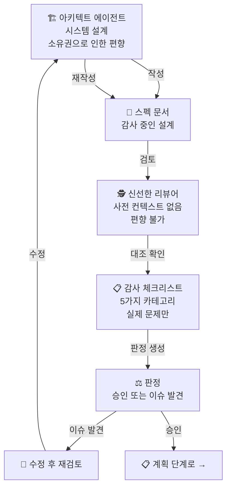
```mermaid
flowchart TD
    ARCH_AGENT["🏗 아키텍트 에이전트\n시스템 설계\n소유권으로 인한 편향"]
    SPEC_DOC["📄 스펙 문서\n감사 중인 설계"]
    FRESH_REV["🕵 신선한 리뷰어\n사전 컨텍스트 없음\n편향 불가"]
    AUDIT["📋 감사 체크리스트\n5가지 카테고리\n실제 문제만"]
    VERDICT["⚖ 판정\n승인 또는 이슈 발견"]
    FIX["🔧 수정 후 재검토"]
    PLANNING["📋 계획 단계로 →"]

    ARCH_AGENT -- "작성" --> SPEC_DOC
    SPEC_DOC -- "검토" --> FRESH_REV
    FRESH_REV -- "대조 확인" --> AUDIT
    AUDIT -- "판정 생성" --> VERDICT
    VERDICT -- "이슈 발견" --> FIX
    FIX -- "수정" --> ARCH_AGENT
    ARCH_AGENT -- "재작성" --> SPEC_DOC
    VERDICT -- "승인" --> PLANNING
```

### 5가지 감사 카테고리

리뷰어는 다음 5가지 카테고리에 대해 집중적으로 확인한다.

| 카테고리 | 확인 내용 |
|----------|-----------|
| 완전성 | TODO, 플레이스홀더, "TBD", 미완성 섹션 |
| 일관성 | 내부 모순, 충돌하는 요구사항 |
| 명확성 | 두 가지로 해석될 수 있는 요구사항 |
| 스코프 | 단일 계획을 위한 집중도, 독립적 하위 시스템 미포함 |
| YAGNI | 요청되지 않은 기능, 과도한 엔지니어링 |

리뷰어를 까다롭게가 아니라 규율 있게 만드는 것은 보정 섹션이다. 구현 계획 중에 실제 문제를 야기할 이슈만 플래그를 세운다. 누락된 섹션, 모순, 두 가지 방식으로 해석될 수 있을 만큼 모호한 요구사항이 이슈다. 사소한 표현 개선이나 스타일 선호도는 이슈가 아니다.

실제 조직에서 최악의 리뷰어는 쉼표 위치 때문에 설계를 차단하는 사람이다. 이 리뷰어는 실제로 다운스트림에서 문제를 일으킬 것들만 플래그를 세우도록 보정되어 있다.

---

## 8. 비주얼 컴패니언: 브라우저 화이트보드

### 화이트보드가 필요한 순간

모든 시니어 엔지니어는 일부 문제는 말만으로 해결할 수 없다는 것을 안다. 사이드바 레이아웃과 상단 내비게이션 중 어느 것이 나은지 토론할 때, 화이트보드에 그리는 것만큼 좋은 것은 없다.

이 시스템은 `skills/brainstorming/visual-companion.md`와 지원 `scripts/` 디렉토리로 이것을 에이전트에게 가져다준다. 비주얼 컴패니언은 항상 켜져 있지 않다. 브레인스토밍 중 질문별로 제공된다.

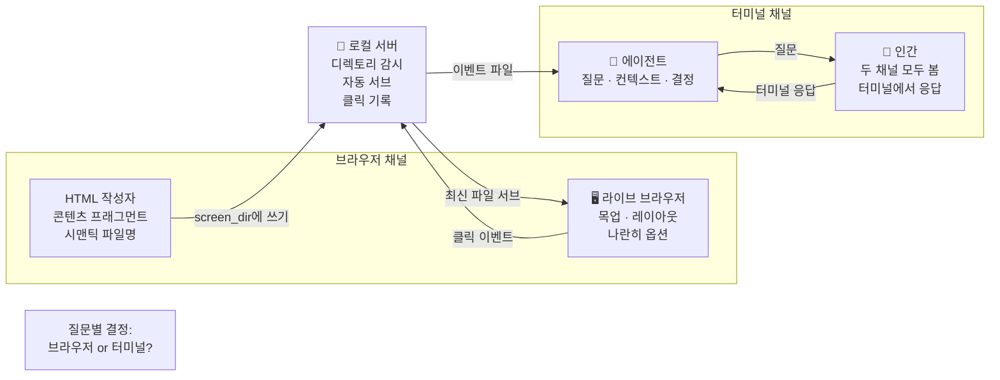
```mermaid
flowchart LR
    subgraph BROWSER_CHANNEL["브라우저 채널"]
        HTML_WRITER["HTML 작성자\n콘텐츠 프래그먼트\n시맨틱 파일명"]
        LIVE_BROWSER["🖥 라이브 브라우저\n목업 · 레이아웃\n나란히 옵션"]
    end

    subgraph TERMINAL_CHANNEL["터미널 채널"]
        AGENT["🧠 에이전트\n질문 · 컨텍스트 · 결정"]
        HUMAN["👤 인간\n두 채널 모두 봄\n터미널에서 응답"]
    end

    LOCAL_SERVER["💾 로컬 서버\n디렉토리 감시\n자동 서브\n클릭 기록"]

    HTML_WRITER -- "screen_dir에 쓰기" --> LOCAL_SERVER
    LOCAL_SERVER -- "최신 파일 서브" --> LIVE_BROWSER
    LIVE_BROWSER -- "클릭 이벤트" --> LOCAL_SERVER
    LOCAL_SERVER -- "이벤트 파일" --> AGENT
    AGENT -- "질문" --> HUMAN
    HUMAN -- "터미널 응답" --> AGENT

    NOTE["질문별 결정:\n브라우저 or 터미널?"]
```

### 브라우저 vs. 터미널 결정 기준

비주얼 컴패니언이 항상 켜져 있지 않은 것처럼, 시각적 질문도 항상 브라우저를 사용하지 않는다. 결정 기준은 명확하다.

**브라우저 사용**: 콘텐츠 자체가 시각적일 때. UI 목업 (와이어프레임, 레이아웃, 내비게이션 구조), 아키텍처 다이어그램 (시스템 구성요소, 데이터 흐름), 나란히 시각적 비교 (두 레이아웃, 두 색상 스킴), 공간적 관계 (상태 머신, 플로우차트).

**터미널 사용**: 콘텐츠가 텍스트나 표 형식일 때. 요구사항과 스코프 질문, 단어로 설명된 개념적 A/B/C 선택, 트레이드오프 목록 (장단점, 비교 표), 기술적 결정 (API 설계, 데이터 모델링).

UI 주제에 관한 질문이 자동으로 시각적 질문은 아니다. "이 맥락에서 성격이란 무엇을 의미하나요?"는 개념적 질문이므로 터미널을 사용한다. "어느 마법사 레이아웃이 더 나은가요?"는 시각적 질문이므로 브라우저를 사용한다. 시니어 엔지니어는 언제 계속 대화하고 언제 화이트보드로 걸어가야 할지를 알고 있다.

### 피드백 루프

인터랙션은 실제 화이트보드 세션을 반영하는 루프를 따른다. 그리고, 토론하고, 수정한다. 에이전트가 `screen_dir`에 레이아웃.html을 새 파일로 작성하면, 사용자는 브라우저에서 그것을 보고 클릭할 수 있다. 다음 턴에서 에이전트는 `state_dir/events`를 읽어 무엇을 클릭했는지 확인한다.

사용자가 브라우저에서 옵션을 클릭할 때, 전체 탐색 경로가 캡처된다. 클릭 패턴은 망설임을 드러낸다. 처음에 A를 시도하고, C로 점프하다가, B에 정착했다면 좋은 시니어 엔지니어는 "처음에 A에 끌렸는데 왜 바꿨나요?"라고 물을 것이다. 에이전트도 같은 것을 할 수 있다.

---

## 9. 계획 작성: 백로그 그루밍

### 누가 봐도 명확한 티켓

애자일 팀에서 "백로그 그루밍"이라는 용어가 있다. 테크 리드가 승인된 아키텍처를 가져다가, 어떤 개발자도 하나의 질문도 하지 않고 집어들어 시작할 수 있을 만큼 명확한 티켓으로 분해하는 작업이다. `skills/writing-plans/SKILL.md`가 정확히 이것을 한다.

"컨텍스트가 없고 취향도 의심스러운 엔지니어를 가정한 포괄적인 구현 계획을 작성하라. 그들이 알아야 하는 모든 것을 문서화하라."

"컨텍스트가 없고 취향도 의심스러운" - 테크 리드가 티켓 작성에 대해 생각하는 방식이다. 지난 3주 동안 스탠드업에 참여했다고 가정하지 않는다. 그들이 오류 처리에 대해 스스로 좋은 결정을 내릴 것이라고 가정하지 않는다. 오늘 입사한 숙련된 개발자가 완벽하게 실행할 수 있도록 티켓을 작성한다.

### 2-5분 규칙

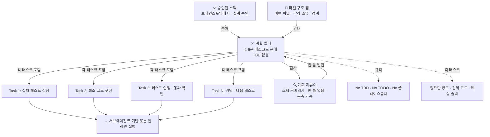
```mermaid
flowchart TD
    APPROVED_SPEC["✅ 승인된 스펙\n브레인스토밍에서 · 설계 승인"]
    FILE_MAP["📁 파일 구조 맵\n어떤 파일 · 각각 소유 · 경계"]
    PLAN_BUILDER["✂ 계획 빌더\n2-5분 태스크로 분해\nTBD 없음"]

    PLAN_BUILDER -- "각 태스크 포함" --> T1["Task 1: 실패 테스트 작성"]
    PLAN_BUILDER -- "각 태스크 포함" --> T2["Task 2: 최소 코드 구현"]
    PLAN_BUILDER -- "각 태스크 포함" --> T3["Task 3: 테스트 실행 · 통과 확인"]
    PLAN_BUILDER -- "각 태스크 포함" --> TN["Task N: 커밋 · 다음 태스크"]

    PLAN_REV["🔍 계획 리뷰어\n스펙 커버리지 · 빈 틈 없음 · 구축 가능"]
    EXEC["→ 서브에이전트 기반 또는 인라인 실행"]

    APPROVED_SPEC -- "분해" --> PLAN_BUILDER
    FILE_MAP -- "안내" --> PLAN_BUILDER
    PLAN_BUILDER -- "감사" --> PLAN_REV
    PLAN_REV -- "빈 틈 발견" --> PLAN_BUILDER
    T1 --> EXEC
    T2 --> EXEC
    T3 --> EXEC
    TN --> EXEC

    NOTE1["No TBD · No TODO · No 플레이스홀더"]
    NOTE2["정확한 경로 · 전체 코드 · 예상 출력"]
    PLAN_BUILDER -. "규칙" .-> NOTE1
    PLAN_BUILDER -. "각 태스크" .-> NOTE2
```

각 단계는 하나의 행동이다 (2-5분). 태스크가 서브에이전트에게 5분 이상 걸리면, 그것은 태스크가 너무 광범위하고 에이전트가 가정을 시작하거나 집중력을 잃을 것을 의미한다. 실제 스프린트 계획에서 단일 세션에 완료할 수 있을 만큼 작은 티켓을 유지하는 관행을 반영한다.

### 계획 실패 금지 목록

스킬은 엄격한 TBD 없음 정책을 시행하며, 플레이스홀더로 간주되는 것을 구체적으로 명시한다.

이것들은 절대 작성해서는 안 되는 **계획 실패** 항목들이다.

- "TBD", "TODO", "나중에 구현", "세부 사항 채워 넣기"
- "적절한 오류 처리 추가" / "검증 추가"
- "위의 테스트 작성" (실제 테스트 코드 없이)
- "N번 태스크와 유사" (코드를 반복하라 - 엔지니어가 순서 없이 태스크를 읽을 수 있다)
- 어떤 태스크에도 정의되지 않은 타입, 함수, 메서드에 대한 참조

마지막 항목은 미묘하다. 7번 태스크가 `clearFullLayers()`를 호출하지만 3번 태스크가 `clearLayers()`로 정의했다면, 그것은 계획의 버그다. 자체 리뷰 단계가 이것을 잡는다.

---

## 10. 계획 리뷰: 그루밍 게이트키퍼

스펙에 스펙 리뷰어가 있었던 것처럼, 구현 계획에는 계획 리뷰어가 있다. `skills/writing-plans/plan-document-reviewer-prompt.md`는 신선한 서브에이전트를 파견하여 하나의 질문에 답하게 한다. 엔지니어가 막히지 않고 이 계획을 실제로 따를 수 있는가?

```
당신은 계획 문서 리뷰어다. 이 계획이 완전하고 구현 준비가 되었는지 확인하라.

검토할 계획: [PLAN_FILE_PATH]
참조용 스펙: [SPEC_FILE_PATH]
```

계획 리뷰어가 계획과 스펙 두 가지를 모두 입력으로 받는다는 점에 주목하라. 이것은 실제 스프린트 계획 회의에서 프로젝트 매니저가 요구사항 문서를 티켓 보드와 나란히 열어두고 "어떤 티켓이 요구사항 #7을 커버하는지 보여주세요"라고 말하는 순간과 같다.

리뷰어는 네 가지를 확인한다.

| 카테고리 | 확인 내용 |
|----------|-----------|
| 완전성 | TODO, 플레이스홀더, 불완전한 태스크 |
| 스펙 정렬 | 계획이 스펙 요구사항을 커버, 스코프 크리프 없음 |
| 태스크 분해 | 태스크 경계가 명확하고 단계별로 실행 가능 |
| 구축 가능성 | 엔지니어가 막히지 않고 따를 수 있는가? |

가장 중요한 것은 "구축 가능성"이다. 계획이 완전하고, 스펙과 정렬되고, 잘 분해되어 있을 수 있지만, 4번 단계가 3번 단계가 만들지 않은 것을 가정한다면 개발자는 막힌다. 리뷰어는 승인 또는 이슈 발견 상태를 깔끔하게 반환하며, 이슈는 특정 태스크와 단계에 연결된다.

---

## 11. 서브에이전트 기반 개발: 위임의 기술

### 매니저는 모든 코드를 직접 작성하지 않는다

엔지니어링 조직에서 매니저는 모든 코드를 직접 작성하지 않는다. 전문가를 고용하고, 명확한 지시를 주고, 작업물을 확인하고, 핸드오프를 관리한다. `skills/subagent-driven-development/SKILL.md`가 정확히 이 워크플로우를 시스템으로 인코딩한다.

핵심 원칙은 **컨텍스트 격리**다. 서브에이전트에 태스크를 위임할 때, 그들은 격리된 컨텍스트를 갖는다. 인간 개발자가 티켓을 집어들 때, 그들은 전체 회사 역사가 필요 없다. 티켓, 관련 코드, 코딩 표준만 필요하다. 마찬가지다. 신선한 에이전트, 깨끗한 마인드, 집중된 태스크.

이것은 한 시간 동안 작업한 에이전트가 다른 기능의 요구사항을 섞기 시작하는 "혼란한 시니어" 문제를 방지한다.

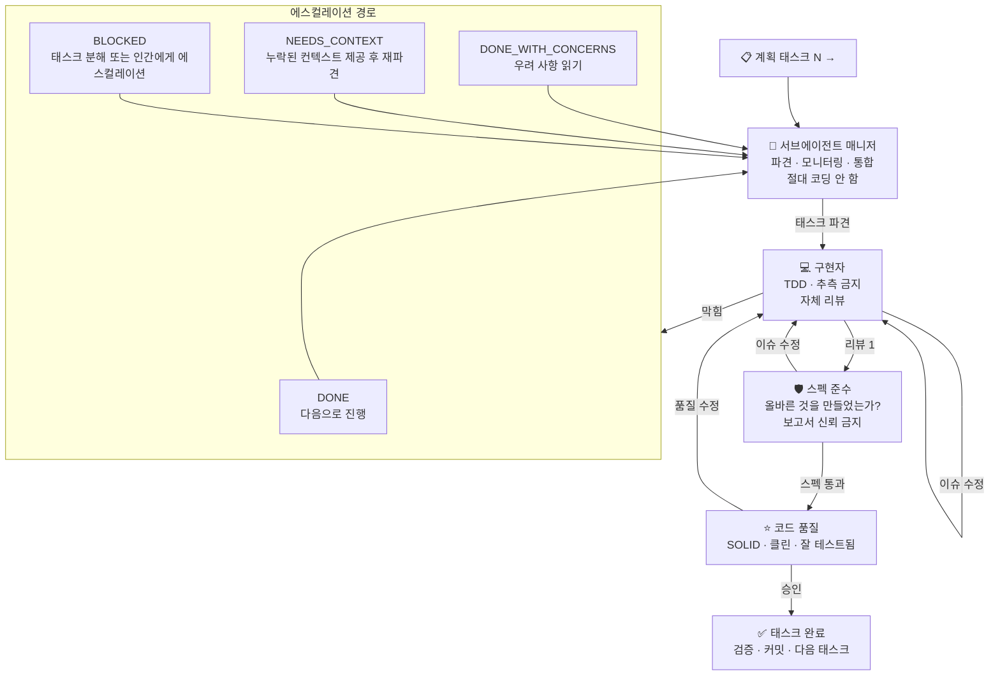
```mermaid
flowchart TD
    PLAN_TASK["📋 계획 태스크 N →"]
    MGR["👥 서브에이전트 매니저\n파견 · 모니터링 · 통합\n절대 코딩 안 함"]
    IMPL["💻 구현자\nTDD · 추측 금지\n자체 리뷰"]
    SPEC_COMP["🛡 스펙 준수\n올바른 것을 만들었는가?\n보고서 신뢰 금지"]
    CODE_QUAL["⭐ 코드 품질\nSOLID · 클린 · 잘 테스트됨"]
    COMPLETE["✅ 태스크 완료\n검증 · 커밋 · 다음 태스크"]

    subgraph ESCALATION["에스컬레이션 경로"]
        DONE["DONE\n다음으로 진행"]
        DONE_C["DONE_WITH_CONCERNS\n우려 사항 읽기"]
        NEEDS_C["NEEDS_CONTEXT\n누락된 컨텍스트 제공 후 재파견"]
        BLOCKED["BLOCKED\n태스크 분해 또는 인간에게 에스컬레이션"]
    end

    PLAN_TASK --> MGR
    MGR -- "태스크 파견" --> IMPL
    IMPL -- "이슈 수정" --> IMPL
    IMPL -- "리뷰 1" --> SPEC_COMP
    SPEC_COMP -- "스펙 통과" --> CODE_QUAL
    SPEC_COMP -- "이슈 수정" --> IMPL
    CODE_QUAL -- "승인" --> COMPLETE
    CODE_QUAL -- "품질 수정" --> IMPL
    IMPL -- "막힘" --> ESCALATION
    DONE --> MGR
    DONE_C --> MGR
    NEEDS_C --> MGR
    BLOCKED --> MGR
```

### 모델 선택: 올바른 수준 고용

이것은 매니저 메타포가 실용적이 되는 곳이다. 변수를 이름 바꾸는데 수석 엔지니어를 보내지는 않는다.

| 태스크 유형 | 권장 모델 | 이유 |
|------------|----------|------|
| 기계적 구현 (격리된 함수, 명확한 스펙, 1-2 파일) | 빠르고 저렴한 모델 | 비용 효율적 |
| 통합 및 판단 태스크 (다중 파일 조율, 패턴 매칭) | 표준 모델 | 균형 |
| 아키텍처, 설계, 리뷰 태스크 | 가장 능력 있는 모델 | 최고 품질 필요 |

잘 명세화된 계획은 대부분의 태스크가 "기계적"임을 의미하며, 이는 저렴하고 빠름을 의미한다.

### 실패 처리

모든 관리 시스템에서 가장 드러나는 부분은 실패를 어떻게 처리하는가다. 구현자가 반환할 수 있는 네 가지 상태가 있으며, 최악의 매니저는 "막혀있다"에 "더 열심히 해봐"로 응답하는 사람이다. 이 시스템은 이것을 명시적으로 금지한다. 에이전트가 막히면 매니저는 세 가지 옵션이 있다. 더 많은 컨텍스트 제공, 모델 업그레이드, 또는 태스크를 더 작게 분해. 계획 자체가 잘못되었다면 인간에게 에스컬레이션한다.

---

## 12. 구현자 프롬프트: 개발자 직무 기술서

### "추측하지 마라"

회사가 개발자를 고용할 때, 온보딩 문서, 코딩 표준, 첫 번째 태스크가 있다. `skills/subagent-driven-development/implementer-prompt.md`가 정확히 이것이다. 모든 서브에이전트가 받는 직무 기술서다.

프롬프트는 대부분의 AI 시스템이 완전히 건너뛰는 것으로 시작한다. 시작하기 전에 불명확한 것이 있으면 **지금 물어라**. 그리고 구현 중에도 예상치 못한 것이 있거나 불명확하면 **질문하라**. 추측하거나 가정하지 마라.

"추측하지 마라" 규칙은 아마도 전체 코드베이스에서 가장 중요한 한 줄일 것이다. 조직에서 가장 비용이 많이 드는 실수는 필요한 것을 알고 있다고 가정한 개발자로부터 온다. 추측을 잘못하는 서브에이전트는 1시간의 재작업 비용이 든다.

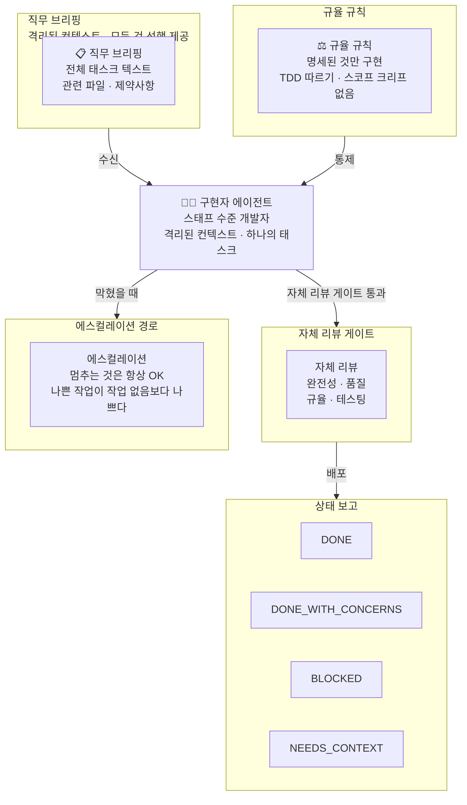
```mermaid
flowchart TD
    subgraph JOB_BRIEF["직무 브리핑\n격리된 컨텍스트 · 모든 것 선행 제공"]
        JB["📋 직무 브리핑\n전체 태스크 텍스트\n관련 파일 · 제약사항"]
    end

    subgraph DISCIPLINE_RULES["규율 규칙"]
        DR["⚖ 규율 규칙\n명세된 것만 구현\nTDD 따르기 · 스코프 크리프 없음"]
    end

    IMPL_AGENT["👨‍💻 구현자 에이전트\n스태프 수준 개발자\n격리된 컨텍스트 · 하나의 태스크"]

    subgraph SELF_REVIEW["자체 리뷰 게이트"]
        SR["자체 리뷰\n완전성 · 품질\n규율 · 테스팅"]
    end

    subgraph STATUS["상태 보고"]
        DONE["DONE"]
        DWC["DONE_WITH_CONCERNS"]
        BLOCK["BLOCKED"]
        NC["NEEDS_CONTEXT"]
    end

    subgraph ESCALATION2["에스컬레이션 경로"]
        EP["에스컬레이션\n멈추는 것은 항상 OK\n나쁜 작업이 작업 없음보다 나쁘다"]
    end

    JOB_BRIEF -- "수신" --> IMPL_AGENT
    DISCIPLINE_RULES -- "통제" --> IMPL_AGENT
    IMPL_AGENT -- "자체 리뷰 게이트 통과" --> SELF_REVIEW
    SELF_REVIEW -- "배포" --> STATUS
    IMPL_AGENT -- "막혔을 때" --> ESCALATION2
```

### 명시적 실패 허용

실패에 대한 명시적 허용이 있다. "이건 내가 감당하기 너무 어렵다"고 말하는 것은 항상 괜찮다. 나쁜 작업이 작업 없음보다 나쁘다. 에스컬레이션에 대한 불이익은 없다.

이것은 좋은 엔지니어링 문화가 구축하는 심리적 안전을 반영한다. 입사 2일에 "이해가 안 됩니다"라고 말하는 주니어는 1주일 동안 조용히 잘못된 것을 만드는 사람보다 훨씬 더 가치 있다.

---

## 13. 스펙 및 코드 품질 리뷰어: 준법 감시관

### 두 개의 순차 게이트

구현자가 완료한 후, 작업물은 두 개의 별도 리뷰 서브에이전트를 거친다. 순서가 중요하다. 스펙 준수 먼저, 코드 품질 두 번째. 잘못된 것을 만드는 코드는 연마하지 않는다.

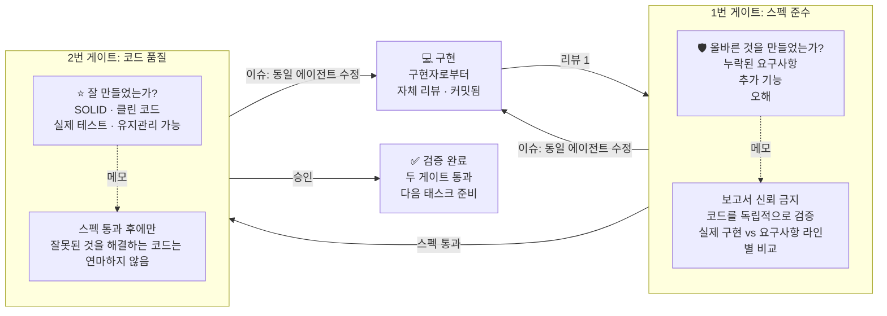
```mermaid
flowchart LR
    IMPL_OUTPUT["💻 구현\n구현자로부터\n자체 리뷰 · 커밋됨"]
    
    subgraph GATE1["1번 게이트: 스펙 준수"]
        G1["🛡 올바른 것을 만들었는가?\n누락된 요구사항\n추가 기능\n오해"]
        G1_NOTE["보고서 신뢰 금지\n코드를 독립적으로 검증\n실제 구현 vs 요구사항 라인별 비교"]
    end

    subgraph GATE2["2번 게이트: 코드 품질"]
        G2["⭐ 잘 만들었는가?\nSOLID · 클린 코드\n실제 테스트 · 유지관리 가능"]
        G2_NOTE["스펙 통과 후에만\n잘못된 것을 해결하는 코드는 연마하지 않음"]
    end

    VERIFIED["✅ 검증 완료\n두 게이트 통과\n다음 태스크 준비"]

    IMPL_OUTPUT -- "리뷰 1" --> GATE1
    GATE1 -- "이슈: 동일 에이전트 수정" --> IMPL_OUTPUT
    GATE1 -- "스펙 통과" --> GATE2
    GATE2 -- "이슈: 동일 에이전트 수정" --> IMPL_OUTPUT
    GATE2 -- "승인" --> VERIFIED

    G1 -. "메모" .-> G1_NOTE
    G2 -. "메모" .-> G2_NOTE
```

### 스펙 준수 리뷰어: "보고서를 믿지 마라"

`spec-reviewer-prompt.md`는 이 시스템이 어떻게 생각하는지를 모든 것을 말해주는 한 줄로 시작한다.

"구현자가 의심스러울 만큼 빨리 끝냈다. 그들의 보고서는 불완전하거나, 부정확하거나, 낙관적일 수 있다. 모든 것을 독립적으로 검증해야 한다."

이것은 자체 보고된 감사 결과를 받아들이지 않는 준법 감시관이다. 세 가지를 확인한다. 누락된 요구사항 (무언가를 건너뛰었는가?), 추가 작업 (과도하게 엔지니어링했는가?), 오해 (잘못된 문제를 해결했는가?). 모든 발견 사항에는 파일:줄 참조가 있다. 막연한 피드백 없음.

### 코드 품질 리뷰어

코드 품질 리뷰어는 스펙 준수가 통과된 후에만 실행된다. 표준 코드 리뷰 템플릿을 사용하지만 구현별 확인을 추가한다. 각 파일이 잘 정의된 인터페이스를 가진 하나의 명확한 책임을 가지는가? 단위들이 독립적으로 이해되고 테스트될 수 있도록 분해되어 있는가? 이 구현이 계획의 파일 구조를 따르는가?

두 패스 리뷰는 실제 조직이 기능 리뷰("올바른 것을 하는가?")를 기술 리뷰("올바른 방식으로 구축되었는가?")로부터 분리하는 방식을 반영한다.

---

## 14. 테스트 주도 개발: 철의 법칙

### 전문가와 아마추어를 구분하는 규율

모든 진지한 엔지니어링 조직 - Google, Microsoft, Stripe, Shopify - 에서 전문가와 아마추어를 구분하는 하나의 규칙이 있다. 어떤 프레임워크를 사용하는지나 알고리즘이 얼마나 영리한지가 아니다. 압박 상황에서의 규율이다.

`skills/test-driven-development/SKILL.md`는 전체 코드베이스에서 가장 타협하지 않는 파일이다. 이것은 새벽 3시 프로덕션 장애를 겪었던 테스트 없는 코드를 절대 다시는 배포하지 않겠다고 결심한 까다로운 시니어다.

핵심 원칙은 하나의 라인이다. **테스트 실패를 보지 않았다면, 그것이 올바른 것을 테스트하는지 알 수 없다.**

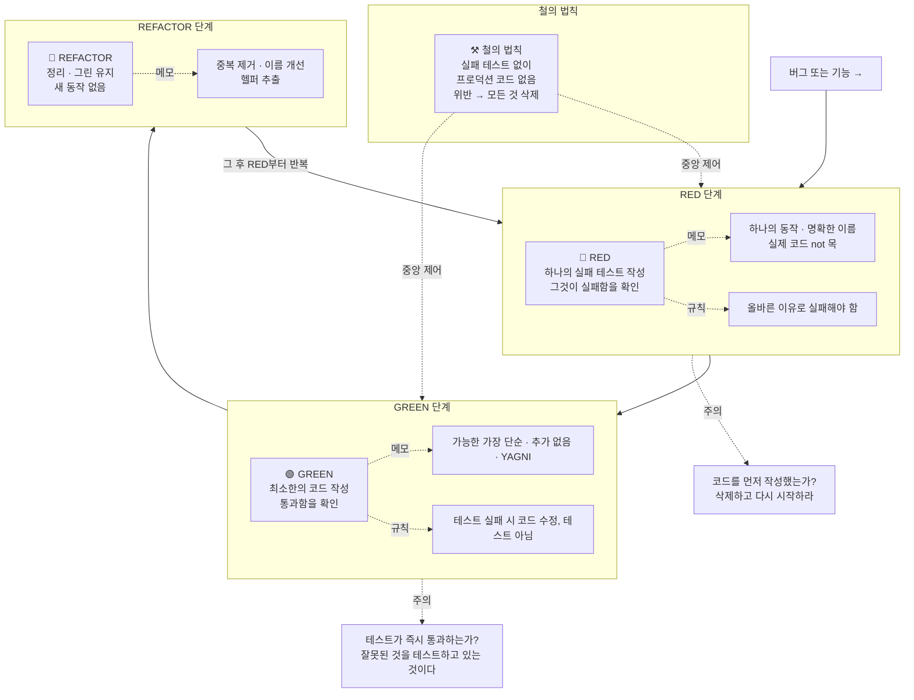
```mermaid
flowchart TD
    START["버그 또는 기능 →"]
    
    subgraph RED_PHASE["RED 단계"]
        RED["🔴 RED\n하나의 실패 테스트 작성\n그것이 실패함을 확인"]
        RED_NOTE["하나의 동작 · 명확한 이름\n실제 코드 not 목"]
        RED_RULE["올바른 이유로 실패해야 함"]
    end

    subgraph IRON_LAW_BOX["철의 법칙"]
        IL["⚒ 철의 법칙\n실패 테스트 없이\n프로덕션 코드 없음\n위반 → 모든 것 삭제"]
    end

    subgraph GREEN_PHASE["GREEN 단계"]
        GREEN["🟢 GREEN\n최소한의 코드 작성\n통과함을 확인"]
        GREEN_NOTE["가능한 가장 단순 · 추가 없음 · YAGNI"]
        GREEN_RULE["테스트 실패 시 코드 수정, 테스트 아님"]
    end

    subgraph REFACTOR_PHASE["REFACTOR 단계"]
        REFACTOR["🔵 REFACTOR\n정리 · 그린 유지\n새 동작 없음"]
        REFACTOR_NOTE["중복 제거 · 이름 개선\n헬퍼 추출"]
    end

    START --> RED_PHASE
    RED_PHASE --> GREEN_PHASE
    GREEN_PHASE --> REFACTOR_PHASE
    REFACTOR_PHASE -- "그 후 RED부터 반복" --> RED_PHASE
    IL -. "중앙 제어" .-> RED_PHASE
    IL -. "중앙 제어" .-> GREEN_PHASE
    RED -. "메모" .-> RED_NOTE
    RED -. "규칙" .-> RED_RULE
    GREEN -. "메모" .-> GREEN_NOTE
    GREEN -. "규칙" .-> GREEN_RULE
    REFACTOR -. "메모" .-> REFACTOR_NOTE

    CODE_FIRST["코드를 먼저 작성했는가?\n삭제하고 다시 시작하라"]
    TEST_PASS_IMM["테스트가 즉시 통과하는가?\n잘못된 것을 테스트하고 있는 것이다"]
    GREEN_PHASE -. "주의" .-> TEST_PASS_IMM
    RED_PHASE -. "주의" .-> CODE_FIRST
```

### 삭제 규칙

이것이 가장 강경한 부분이다. 대부분의 TDD 가이드는 "테스트를 먼저 작성하라"고 말한다. 이 스킬은 이렇게 말한다.

테스트 이전에 코드를 작성했는가? 삭제하라. 처음부터 시작하라.

**예외 없음**: "참고로" 남겨두지 마라. 테스트를 작성하면서 "수정"하지 마라. 보지 마라. 삭제는 삭제를 의미한다.

아마존에는 "배포하는 가장 비싼 버그"라는 말이 있다. TDD를 건너뛰어서 "절약"하는 시간은 프로덕션 디버깅, 고객 에스컬레이션, 새벽 3시 호출로 10배 갚는다. 주요 장애를 경험한 모든 시니어 스태프 엔지니어는 이것을 뼈저리게 알고 있다.

### 사후 테스트가 동일하지 않은 이유

가장 위험한 합리화는 "나중에 테스트를 작성할 것이다. 같은 결과지?"다. 틀렸다.

사후 테스트는 "이것이 무엇을 하는가?"에 답한다. 사전 테스트는 "이것이 무엇을 해야 하는가?"에 답한다. 사후 테스트는 구현에 의해 편향되어 있다. 만든 것을 테스트하지, 요구되는 것을 테스트하지 않는다. 기억된 엣지 케이스를 검증하지, 발견된 것들을 검증하지 않는다.

이것은 인지 편향에 대한 심오한 통찰이다. 코드를 먼저 작성하면, 테스트는 만든 것에 의해 형성된다. 잊어버린 엣지 케이스를 테스트하지 않는다.

---

## 15. 테스팅 안티패턴: 게으른 QA 훈련

TDD가 철의 법칙이라면, `skills/test-driven-development/testing-anti-patterns.md`는 모든 신규 입사자가 첫날 시청하는 교육 비디오다. 엔지니어가 좋아 보이지만 아무것도 증명하지 못하는 테스트를 작성하는 특정 방식들 - 전체 조직에 걸쳐 테스트 스위트에 대한 신뢰를 파괴하는 패턴 - 을 문서화한다.

파일은 세 가지 고유의 철의 법칙으로 시작한다. 목 동작을 절대 테스트하지 마라. 프로덕션 클래스에 테스트 전용 메서드를 절대 추가하지 마라. 의존성을 이해하지 않고 절대 목을 사용하지 마라.

### 목 테스팅 vs. 실제 동작 테스팅

가장 일반적이고 가장 위험한 안티패턴은 목 자체를 테스트하는 것이다. 목이 존재하는지 검증하는 것이지, 구성요소가 동작하는지 검증하는 것이 아니다. 이 테스트는 사이드바가 프로덕션에서 완전히 고장나더라도 영원히 통과할 것이다. 가짜를 테스트하는 것이지, 진짜를 테스트하는 것이 아니기 때문이다.

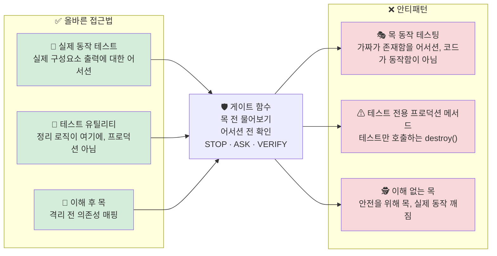
```mermaid
flowchart LR
    subgraph GOOD["✅ 올바른 접근법"]
        TB["🧪 실제 동작 테스트\n실제 구성요소 출력에 대한 어서션"]
        TU["🧰 테스트 유틸리티\n정리 로직이 여기에, 프로덕션 아님"]
        UTM["🧠 이해 후 목\n격리 전 의존성 매핑"]
    end

    subgraph BAD["❌ 안티패턴"]
        TMB["🎭 목 동작 테스팅\n가짜가 존재함을 어서션, 코드가 동작함이 아님"]
        TOPM["⚠ 테스트 전용 프로덕션 메서드\n테스트만 호출하는 destroy()"]
        MWU["🕵 이해 없는 목\n안전을 위해 목, 실제 동작 깨짐"]
    end

    GATE["🛡 게이트 함수\n목 전 물어보기\n어서션 전 확인\nSTOP · ASK · VERIFY"]

    TB --> GATE
    TU --> GATE
    UTM --> GATE
    GATE --> TMB
    GATE --> TOPM
    GATE --> MWU

    style TB fill:#d4edda
    style TU fill:#d4edda
    style UTM fill:#d4edda
    style TMB fill:#f8d7da
    style TOPM fill:#f8d7da
    style MWU fill:#f8d7da
```

### 프로덕션 코드 오염

두 번째 안티패턴은 미묘하고 음흉하다. 엔지니어가 테스트에서 리소스를 정리해야 하는데, `destroy()` 메서드를 프로덕션 클래스에 추가한다. 이것이 위험한 이유는 프로덕션 클래스가 테스트 전용 코드로 오염되었기 때문이다. 누군가 실수로 프로덕션에서 호출하면 라이브 세션이 해체된다. Netflix, Uber, Meta에서 테스트 전용 메서드를 가진 프로덕션 코드가 실제 장애를 야기했다.

---

## 16. 체계적 디버깅: 포렌식 엔지니어링

### 두 가지 유형의 디버거

모든 엔지니어링 조직에는 두 가지 유형의 디버거가 있다. 오류를 보고, 수정을 추측하고, 시도하다가, 그것이 작동하지 않으면 다시 추측하는 개발자 - 시간을 낭비하는 개발자. 그리고 "잠깐. 먼저 오류 메시지를 읽자"고 말하는 시니어 스태프 엔지니어.

Cloudflare 같은 회사에서 프로덕션 인시던트가 발생하면, 무작위 수정을 허용하지 않는다. 관찰하고, 가설을 세우고, 테스트하고, 수정하는 공식적인 인시던트 대응 프로세스가 있다. 장애 중에 할 수 있는 최악의 것은 무작위 패치를 적용하는 것이다. 각 실패한 수정은 시스템 상태를 변경하여 다음 조사를 더 어렵게 만든다. 문자 그대로 증거를 파괴하는 것이다.

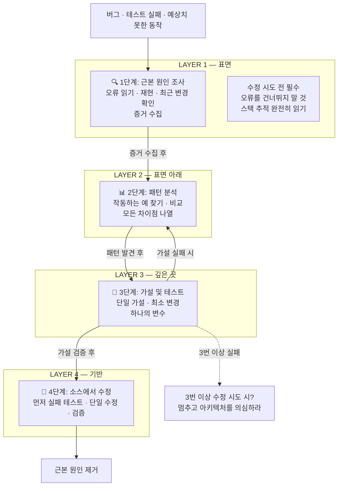
```mermaid
flowchart TD
    BUG["버그 · 테스트 실패 · 예상치 못한 동작"]

    subgraph LAYER1["LAYER 1 — 표면"]
        P1["🔍 1단계: 근본 원인 조사\n오류 읽기 · 재현 · 최근 변경 확인\n증거 수집"]
        P1_NOTE["수정 시도 전 필수\n오류를 건너뛰지 말 것\n스택 추적 완전히 읽기"]
    end

    subgraph LAYER2["LAYER 2 — 표면 아래"]
        P2["📊 2단계: 패턴 분석\n작동하는 예 찾기 · 비교\n모든 차이점 나열"]
    end

    subgraph LAYER3["LAYER 3 — 깊은 곳"]
        P3["🔬 3단계: 가설 및 테스트\n단일 가설 · 최소 변경\n하나의 변수"]
    end

    subgraph LAYER4["LAYER 4 — 기반"]
        P4["🎯 4단계: 소스에서 수정\n먼저 실패 테스트 · 단일 수정 · 검증"]
    end

    EXIT["근본 원인 제거"]

    THREE_RULE["3번 이상 수정 시도 시?\n멈추고 아키텍처를 의심하라"]

    BUG --> P1
    P1 -- "증거 수집 후" --> P2
    P2 -- "패턴 발견 후" --> P3
    P3 -- "가설 실패 시" --> P2
    P3 -- "가설 검증 후" --> P4
    P4 --> EXIT
    P3 -. "3번 이상 실패" .-> THREE_RULE
```

### 3번 수정 규칙

이것이 전체 디버깅 스킬에서 가장 독특한 통찰이다.

수정 횟수를 세어라. 3번 이상 수정을 시도했다면, 멈추고 아키텍처를 의문시하라. 4번째 수정은 아키텍처 토론 없이 시도하지 마라.

각 수정이 새로운 공유 상태/결합/문제를 드러내고, 수정이 구현하기 위해 "대규모 리팩토링"이 필요하고, 각 수정이 다른 곳에서 새 증상을 만든다면 이것은 아키텍처 문제를 나타내는 패턴이다.

조직적 관점에서 이것은 스태프 엔지니어가 "우리는 버그를 다루고 있는 게 아니다. 설계 결함을 다루고 있다"고 인식하는 것이다. 주니어는 계속 패치한다. 스태프 엔지니어는 멈추고 "이것을 재설계해야 한다"고 말한다.

---

## 17. 근본 원인 추적과 심층 방어

### 형사의 도구 세트

근본 원인 추적은 하나의 질문에 답한다. 오류가 여기서 나타났지만, 나쁜 데이터는 어디서 왔는가? 이것은 레벨 1 지원 엔지니어(서버를 재시작하는 사람)와 업스트림 서비스의 잘못된 구성까지 충돌을 추적하는 스태프 엔지니어의 차이다.

5단계 추적의 실제 예시를 보면 이렇다.

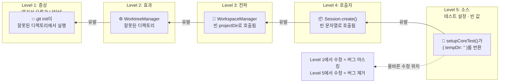
```mermaid
flowchart RL
    subgraph LEVEL5["Level 5: 소스\n테스트 설정 · 빈 값"]
        L5["🎯 setupCoreTest()가\n{ tempDir: '' }를 반환"]
    end

    subgraph LEVEL4["Level 4: 호출자"]
        L4["📦 Session.create()\n빈 문자열로 호출됨"]
    end

    subgraph LEVEL3["Level 3: 전파"]
        L3["🔗 WorkspaceManager\n빈 projectDir로 호출됨"]
    end

    subgraph LEVEL2["Level 2: 효과"]
        L2["⚙ WorktreeManager\n잘못된 디렉토리"]
    end

    subgraph LEVEL1["Level 1: 증상\n여기서 오류가 나타남"]
        L1["💥 git init이\n잘못된 디렉토리에서 실행"]
    end

    L5 -- "유발" --> L4
    L4 -- "유발" --> L3
    L3 -- "유발" --> L2
    L2 -- "유발" --> L1

    FIX_NOTE["Level 1에서 수정 = 버그 마스킹\nLevel 5에서 수정 = 버그 제거"]
    L5 -. "올바른 수정 위치" .-> FIX_NOTE
```

오류는 레벨 1에서 나타났다. 주니어는 거기서 수정할 것이다. 아마도 폴백 디렉토리를 추가하는 것으로. 하지만 실제 버그는 레벨 5에 있었다. 초기화 전에 액세스된 변수. 레벨 1에서 수정하는 것은 버그를 마스킹할 것이다. 레벨 5에서 수정하는 것이 버그를 제거한다.

### 심층 방어: 버그를 구조적으로 불가능하게 만들기

군사와 사이버 보안 전략에서 가져온 개념을 코드에 적용한다. 원칙은 이렇다.

단일 검증: "버그를 수정했다." 다중 레이어: "버그를 불가능하게 만들었다."

빈 `projectDir` 버그를 발견한 후, 팀은 소스만 수정하지 않았다. 네 개의 검증 레이어를 추가했다. 레이어 1에서 `Project.create()`는 비어 있지 않은지, 존재하는지, 쓰기 가능한지 검증한다. 레이어 2에서 `WorkspaceManager`는 `projectDir`가 비어 있지 않은지 검증한다. 레이어 3에서 `WorktreeManager`는 테스트에서 tmpdir 외부의 git init을 거부한다. 레이어 4에서 git init 전에 스택 추적 로깅이 추가된다.

레이어 3의 환경 가드는 특히 영리하다. 레이어 1과 2가 (목을 통해, 아무도 예상하지 못한 새 코드 경로를 통해) 우회되더라도, 레이어 3은 테스트가 임시 디렉토리 외부에서 git 작업을 실행하는 것을 물리적으로 불가능하게 만든다. 이것이 스태프 엔지니어의 디버깅이 어떻게 보이는지다. 버그를 수정하는 것뿐만 아니라, 전체 버그 카테고리가 불가능해지는 시스템을 엔지니어링하는 것.

---

## 18. 완료 전 검증: 최종 사인오프

### 증거 기반 검증

항공우주, 의료 기기, 금융 같은 규제된 산업에서는 증거 기반 검증이라는 개념이 있다. Boeing은 엔지니어가 "날개 스트레스 테스트가 통과된 것 같다"고 말하기 때문에 항공기를 배포하지 않는다. 테스트 결과, 타임스탬프, 엔지니어의 이름이 담긴 서명된 문서가 있기 때문에 배포한다.

소프트웨어 조직에서 동등한 실패 모드가 어디서나 볼 수 있다. 개발자가 PR 설명에 "테스트 통과"라고 말하지만, 세 가지 변경이 더 이루어지기 2시간 전에 마지막으로 테스트를 실행했다.

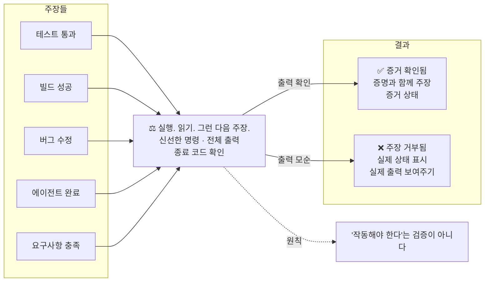
```mermaid
flowchart LR
    subgraph CLAIMS["주장들"]
        C1["테스트 통과"]
        C2["빌드 성공"]
        C3["버그 수정"]
        C4["에이전트 완료"]
        C5["요구사항 충족"]
    end

    GATE["⚖ 실행. 읽기. 그런 다음 주장.\n신선한 명령 · 전체 출력\n종료 코드 확인"]

    subgraph RESULTS["결과"]
        CONFIRMED["✅ 증거 확인됨\n증명과 함께 주장\n증거 상태"]
        REJECTED["❌ 주장 거부됨\n실제 상태 표시\n실제 출력 보여주기"]
    end

    C1 --> GATE
    C2 --> GATE
    C3 --> GATE
    C4 --> GATE
    C5 --> GATE
    GATE -- "출력 확인" --> CONFIRMED
    GATE -- "출력 모순" --> REJECTED

    NOTE["'작동해야 한다'는 검증이 아니다"]
    GATE -. "원칙" .-> NOTE
```

### 검증 게이트 함수

어떤 상태를 주장하거나 만족감을 표현하기 전에, 에이전트는 반드시 이 게이트를 통과해야 한다.

1. 식별: 이 주장을 증명하는 명령은 무엇인가?
2. 실행: 전체 명령을 실행하라 (신선하고, 완전하게)
3. 읽기: 전체 출력, 종료 코드 확인, 실패 카운트
4. 검증: 출력이 주장을 확인하는가?
5. 그런 다음 주장하라

어떤 단계든 건너뛰는 것 = 검증이 아니라 거짓말이다.

"신선한"이라는 단어가 핵심 작업을 한다. "전에 실행했어요"가 아니다. "지난번에 통과했어요"가 아니다. 신선하게. 지금. 이 메시지에서. 이것은 품질 프로세스를 가진 회사와 그것을 따르는 회사의 차이다.

### 합리화 방지

스킬은 엔지니어(또는 AI)가 검증을 건너뛰기 위해 사용할 수 있는 모든 변명을 예상한다.

| 변명 | 현실 |
|------|------|
| "이제 작동해야 한다" | 검증을 실행하라 |
| "자신 있다" | 자신감 ≠ 증거 |
| "이번 한 번만" | 예외 없음 |
| "에이전트가 성공이라고 했다" | 독립적으로 검증하라 |
| "지쳤다" | 피로 = 변명이 아님 |

---

## 19. 피어 리뷰 미팅: 코드 리뷰 문화

### 잘 하면 최고, 잘못하면 최악

코드 리뷰는 대부분의 엔지니어링 조직이 문화를 구축하거나 파괴하는 곳이다. 잘 하면 소프트웨어 엔지니어링에서 가장 효과적인 단일 품질 관행이다. 잘못하면 형식적인 고무 도장 또는 정치적 전쟁터가 된다.

Google에서 코드 리뷰는 시니어 스태프 엔지니어도 예외 없이 모든 변경에 필수다. 모든 눈 쌍은 다른 클래스의 버그를 잡는다는 철학이다. 하지만 더 깊은 목적이 있다. 코드 리뷰는 엔지니어링 문화가 전파되는 방법이다. 주니어는 리뷰 피드백을 읽어서 표준을 배운다. 시니어는 누군가 항상 확인하기 때문에 정직하게 유지된다.

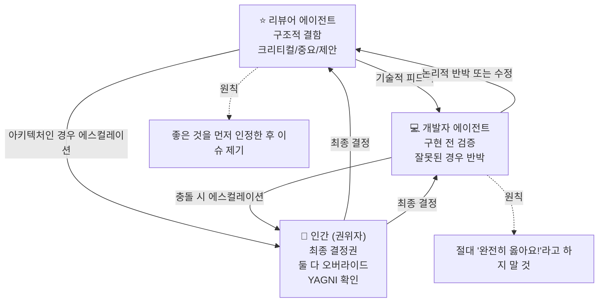
```mermaid
flowchart TD
    REVIEWER["⭐ 리뷰어 에이전트\n구조적 결함\n크리티컬/중요/제안"]
    DEVELOPER["💻 개발자 에이전트\n구현 전 검증\n잘못된 경우 반박"]
    HUMAN_AUTH["👑 인간 (권위자)\n최종 결정권\n둘 다 오버라이드\nYAGNI 확인"]

    REVIEWER -- "기술적 피드백" --> DEVELOPER
    DEVELOPER -- "논리적 반박 또는 수정" --> REVIEWER
    REVIEWER -- "아키텍처인 경우 에스컬레이션" --> HUMAN_AUTH
    DEVELOPER -- "충돌 시 에스컬레이션" --> HUMAN_AUTH
    HUMAN_AUTH -- "최종 결정" --> REVIEWER
    HUMAN_AUTH -- "최종 결정" --> DEVELOPER

    NOTE1["좋은 것을 먼저 인정한 후 이슈 제기"]
    NOTE2["절대 '완전히 옳아요!'라고 하지 말 것"]
    REVIEWER -. "원칙" .-> NOTE1
    DEVELOPER -. "원칙" .-> NOTE2
```

### 코드 리뷰 수신: 아첨 없는 접근

`skills/receiving-code-review/SKILL.md`는 가장 심리적으로 정교한 파일이다. 인간 및 AI 엔지니어 모두를 괴롭히는 문제를 다룬다. 리뷰 압박 하에서의 아첨.

```
절대 하지 말 것:
- "완전히 옳습니다!"
- "좋은 포인트!" / "훌륭한 피드백!"
- "지금 구현하겠습니다" (검증 전)

대신:
- 기술적 요구사항을 재술
- 명확화 질문
- 잘못된 경우 기술적 추론으로 반박
- 그냥 작업 시작 (행동이 말보다 더 큰 소리)
```

리뷰 중에 수행적 동의는 문화적 질병이다. 모든 코멘트에 "좋은 발견!"이라고 말하는 엔지니어는 배우고 있는 것이 아니다. 공연하고 있다. 이해 없이 제안을 구현하고, 새 버그를 도입하고, 사이클이 반복된다.

구현하기 전에 제안이 이 코드베이스에 실제로 맞는지 확인하는 것이 YAGNI 원칙을 활용하는 것이다. 그리고 조직 계층 원칙이 있다. "당신과 리뷰어 모두 나에게 보고합니다. 이 기능이 필요 없다면, 추가하지 마세요." 이것은 코드 리뷰에 대한 스태프 엔지니어의 관점이다. 리뷰어와 구현자는 동료다. 어느 쪽도 다른 쪽에 대한 권한이 없다.

---

## 20. Git Worktrees: 생물학적 격리 용기

### 생물학적 격리의 원칙

생물학 실험실에서는 격리 수준이라는 개념이 있다. 연구원이 위험한 병원체로 작업할 때, 점심을 먹는 것과 같은 벤치에서 작업하지 않는다. 음압, 별도의 환기, 에어록이 있는 격리된 챔버에서 작업한다. 원칙은 단순하다. 위험한 작업은 격리된 환경에서 이루어지므로, 무언가 잘못되더라도 피해가 격리된다.

소프트웨어 엔지니어링도 동일한 문제가 있다. 개발자가 새 인증 시스템을 구축할 때, 메인 코드베이스를 감염시킬 수 있는 코드를 다루고 있다.

Git 워트리는 물리적으로 별도의 디렉토리를 만들어 동일한 저장소를 공유한다. 동일한 저장소를 공유하는 다중 격리 챔버와 같다.

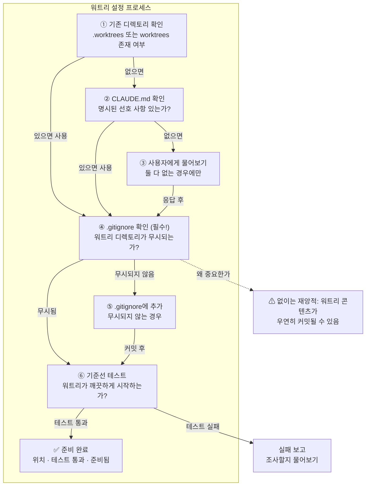
```mermaid
flowchart TD
    subgraph WORKTREE_SETUP["워트리 설정 프로세스"]
        CHECK_DIR["① 기존 디렉토리 확인\n.worktrees 또는 worktrees 존재 여부"]
        CHECK_CLAUDE["② CLAUDE.md 확인\n명시된 선호 사항 있는가?"]
        ASK_USER["③ 사용자에게 물어보기\n둘 다 없는 경우에만"]
        VERIFY_IGNORE["④ .gitignore 확인 (필수!)\n워트리 디렉토리가 무시되는가?"]
        ADD_IGNORE["⑤ .gitignore에 추가\n무시되지 않는 경우"]
        CLEAN_TEST["⑥ 기준선 테스트\n워트리가 깨끗하게 시작하는가?"]
        READY["✅ 준비 완료\n위치 · 테스트 통과 · 준비됨"]
    end

    CHECK_DIR -- "없으면" --> CHECK_CLAUDE
    CHECK_CLAUDE -- "없으면" --> ASK_USER
    CHECK_DIR -- "있으면 사용" --> VERIFY_IGNORE
    CHECK_CLAUDE -- "있으면 사용" --> VERIFY_IGNORE
    ASK_USER -- "응답 후" --> VERIFY_IGNORE
    VERIFY_IGNORE -- "무시되지 않음" --> ADD_IGNORE
    VERIFY_IGNORE -- "무시됨" --> CLEAN_TEST
    ADD_IGNORE -- "커밋 후" --> CLEAN_TEST
    CLEAN_TEST -- "테스트 통과" --> READY
    CLEAN_TEST -- "테스트 실패" --> REPORT["실패 보고\n조사할지 물어보기"]

    CRITICAL["⚠ 없이는 재앙적: 워트리 콘텐츠가\n우연히 커밋될 수 있음"]
    VERIFY_IGNORE -. "왜 중요한가" .-> CRITICAL
```

### 디렉토리 선택 계층

디렉토리를 선택할 때, 시스템은 확립된 규약 → 문서화된 선호도 → 물어보기 순서를 따른다. 이 계층은 잘 운영된 조직이 결정을 내리는 방식이다. 누군가 작업 공간이 필요할 때마다 처음부터 발명하지 않는다. 이미 확립된 것을 확인하고, 문서를 확인하고, 둘 다 없을 때만 인간에게 에스컬레이션한다.

안전 검증 (`.gitignore` 확인)이 없으면 재앙적이다. 개발자가 워트리를 만들고, 실험적 작업을 하고, 워트리 디렉토리가 git 무시되지 않아서 모든 실험적 코드가 메인 브랜치의 `git status`에 나타난다. 실수로 커밋하면 실험적 코드가 프로덕션에 있게 된다.

---

## 21. 개발 브랜치 마무리: 릴리스 엔지니어링

### 가장 만족스럽고 가장 위험한 순간

모든 엔지니어링 조직에서 동시에 가장 만족스럽고 가장 위험한 순간이 있다. 기능이 "완료"되고 배포할 시간인 순간. 여기서 개발의 다른 어떤 단계보다 더 많은 것이 잘못된다. 코드는 개발자의 머신에서 작동한다. 테스트는 기능 브랜치에서 통과한다. 하지만 머지 충돌이 메인과 발생하고, 통합 테스트가 실패하고, 구성을 업데이트하는 것을 잊어서 배포가 깨진다.

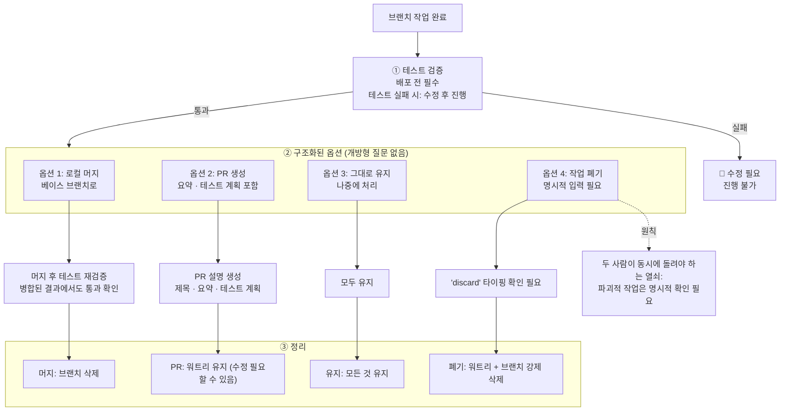
```mermaid
flowchart TD
    BRANCH_COMPLETE["브랜치 작업 완료"]
    
    VERIFY_TESTS["① 테스트 검증\n배포 전 필수\n테스트 실패 시: 수정 후 진행"]

    subgraph OPTIONS["② 구조화된 옵션 (개방형 질문 없음)"]
        O1["옵션 1: 로컬 머지\n베이스 브랜치로"]
        O2["옵션 2: PR 생성\n요약 · 테스트 계획 포함"]
        O3["옵션 3: 그대로 유지\n나중에 처리"]
        O4["옵션 4: 작업 폐기\n명시적 입력 필요"]
    end

    subgraph CLEANUP["③ 정리"]
        CL1["머지: 브랜치 삭제"]
        CL2["PR: 워트리 유지 (수정 필요할 수 있음)"]
        CL3["유지: 모든 것 유지"]
        CL4["폐기: 워트리 + 브랜치 강제 삭제"]
    end

    BRANCH_COMPLETE --> VERIFY_TESTS
    VERIFY_TESTS -- "통과" --> OPTIONS
    VERIFY_TESTS -- "실패" --> STOP_FIX["🛑 수정 필요\n진행 불가"]

    O1 --> MERGE_VERIFY["머지 후 테스트 재검증\n병합된 결과에서도 통과 확인"]
    O2 --> PR_CREATE["PR 설명 생성\n제목 · 요약 · 테스트 계획"]
    O3 --> KEEP_ALL["모두 유지"]
    O4 --> CONFIRM["'discard' 타이핑 확인 필요"]

    MERGE_VERIFY --> CL1
    PR_CREATE --> CL2
    KEEP_ALL --> CL3
    CONFIRM --> CL4

    DISCARD_NOTE["두 사람이 동시에 돌려야 하는 열쇠:\n파괴적 작업은 명시적 확인 필요"]
    O4 -. "원칙" .-> DISCARD_NOTE
```

### 구조화된 옵션, 개방형 질문 없음

기능이 준비되면 스킬은 "다음에 무엇을 해야 하나요?"라는 개방형 질문을 하지 않는다. 정확히 4개의 구조화된 옵션을 제시한다. 구조화된 옵션은 스코프 크리프("글쎄요, 추가도 해야 할 수도 있겠죠...")를 방지하고, 분석 마비("생각해 볼게요...")를 방지하며, 결정을 추적 가능하게 만든다.

머지 후에 테스트를 다시 검증한다는 점에 주목하라. 기능 브랜치에서 테스트가 통과했지만, 최신 메인과 머지된 후에도 통과하는가? 이것은 두 기능이 개별적으로는 정확하지만 결합될 때 호환되지 않는 고전적인 "내 브랜치에서는 작동했다" 문제를 잡는다.

폐기 옵션은 두 사람이 동시에 돌려야 하는 열쇠 원칙을 따른다. 파괴적 작업에는 정확한 단어 "discard"를 타이핑하는 명시적 확인이 필요하다. AWS와 Google Cloud의 프로덕션 시스템에서 데이터베이스 삭제 같은 파괴적 작업은 동일한 패턴을 따른다.

---

## 22. 스킬 작성 아카데미

### 프로세스 문서화에 TDD 적용

모든 성숙한 엔지니어링 조직에는 훈련 부서가 있다. Google에는 "Noogler" 온보딩 프로그램이 있다. Stripe에는 내부 문서 표준이 있다. 하지만 좋은 훈련 부서와 위대한 훈련 부서를 구분하는 것은 위대한 것이 문서를 작성하고 사람들이 따를 것이라고 희망하지 않는다는 것이다. 그들은 문서를 테스트한다.

`skills/writing-skills/SKILL.md`는 스쿼드의 아카데미다. 그리고 핵심 라인이 전체 철학을 드러낸다.

**스킬 작성은 프로세스 문서화에 적용된 TDD다.** 테스트 케이스(서브에이전트와 함께하는 압박 시나리오)를 작성하고, 실패를 관찰하고(기준선 동작), 스킬을 작성하고(문서), 테스트 통과를 관찰하고(에이전트 준수), 리팩토링한다(허점 닫기).

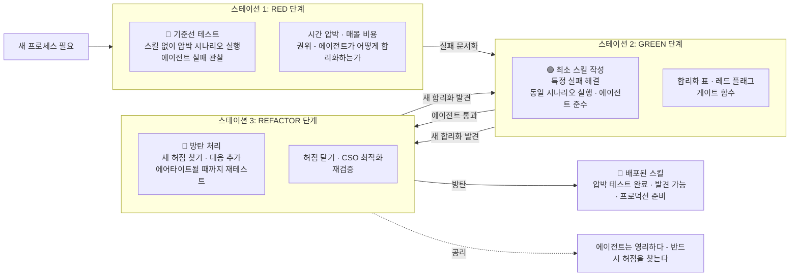
```mermaid
flowchart LR
    NEW_PROCESS["새 프로세스 필요"]

    subgraph STATION1["스테이션 1: RED 단계"]
        BASE_TEST["🔴 기준선 테스트\n스킬 없이 압박 시나리오 실행\n에이전트 실패 관찰"]
        BT_NOTE["시간 압박 · 매몰 비용\n권위 - 에이전트가 어떻게 합리화하는가"]
    end

    subgraph STATION2["스테이션 2: GREEN 단계"]
        WRITE_SKILL["🟢 최소 스킬 작성\n특정 실패 해결\n동일 시나리오 실행 · 에이전트 준수"]
        WS_NOTE["합리화 표 · 레드 플래그\n게이트 함수"]
    end

    subgraph STATION3["스테이션 3: REFACTOR 단계"]
        BULLETPROOF["🔵 방탄 처리\n새 허점 찾기 · 대응 추가\n에어타이트될 때까지 재테스트"]
        BP_NOTE["허점 닫기 · CSO 최적화\n재검증"]
    end

    DEPLOYED["🚀 배포된 스킬\n압박 테스트 완료 · 발견 가능 · 프로덕션 준비"]

    NEW_PROCESS --> STATION1
    STATION1 -- "실패 문서화" --> STATION2
    STATION2 -- "에이전트 통과" --> STATION3
    STATION3 -- "방탄" --> DEPLOYED
    STATION2 -- "새 합리화 발견" --> STATION3
    STATION3 -- "새 합리화 발견" --> STATION2

    AXIOM["에이전트는 영리하다 - 반드시 허점을 찾는다"]
    STATION3 -. "공리" .-> AXIOM
```

### Claude Search Optimization (CSO)

스킬은 테스트를 통해 발견된 미묘하고 중요한 문제인 스킬을 발견 가능하게 만드는 방법을 포함한다.

**설명 = 사용 시기, 스킬이 하는 것이 아님.** 테스트는 설명이 스킬의 워크플로우를 요약할 때, Claude가 전체 스킬 콘텐츠를 읽는 대신 설명을 따를 수 있다는 것을 드러냈다. 이것은 에이전트가 교육 이메일의 제목을 읽고 정책을 알고 있다고 가정하는 직원과 동일한 조직적 동등물이다. 수정은 사용 시기에 대한 설명을 만드는 것이고, 스킬이 하는 것을 요약하지 않는다.

### 스킬 타입별 테스트 접근법

| 스킬 타입 | 테스트 방법 |
|-----------|------------|
| 규율 강제 스킬 (규칙/요구사항) | 아카데믹 질문 + 압박 시나리오 + 다중 압박 조합 |
| 기술 스킬 (방법 가이드) | 적용 시나리오 + 누락 정보 테스트 |
| 참조 스킬 (문서/API) | 검색 시나리오 + 갭 테스트 |

---

## 23. 에이전트와 커맨드: 팀 디렉토리

### 팀 로스터와 현명한 폐기 처리

`agents/` 디렉토리는 팀 로스터다. 현재 하나의 에이전트가 있다. `code-reviewer.md`는 5가지 차원에서 완성된 작업을 평가하는 아키텍처 수준 페르소나를 시니어 코드 리뷰어 서브에이전트로 정의한다.

```
commands/
├── brainstorm.md     → 폐기됨 - brainstorming 스킬 사용
├── write-plan.md     → 폐기됨 - writing-plans 스킬 사용
└── execute-plan.md   → 폐기됨 - executing-plans 스킬 사용
```

모든 세 가지가 폐기되었다는 것은 흥미롭다. 예전에는 `/brainstorm` 터미널에서 타이핑하는 직접 명령 단축키였다. 시스템이 성숙함에 따라, 이러한 단축키들이 중요한 프로세스를 우회한다는 것이 명확해졌다. `/brainstorm` 명령어는 스킬 발견 플로우 없이 직접 브레인스토밍으로 점프하게 했다. 그래서 팀은 그것들을 폐기했다. 삭제하지 않고, 폐기했다.

명령어는 여전히 존재하지만, 이전 동작을 실행하는 대신 정중하게 리다이렉트한다. "스킬을 대신 사용하세요." 인터페이스를 하룻밤에 취소하고 사람들이 오류에 부딪히게 하지 않는다. 기존 인터페이스를 유지하고, 변경 사항을 설명하게 만들고, 사람들이 적응할 시간을 준다.

---

## 24. 실제 테스트: 시스템이 동작하는 방식

### 유튜브 트랜스크립트 기반 인터랙티브 스킬 상관관계 가이드

저자는 유튜브 트랜스크립트 모음에서 인터랙티브 스킬 상관관계 비주얼 가이드를 구축하는 실제 작업으로 시스템을 테스트했다.

첫 번째 행동은 경험 많은 시니어가 새 프로젝트 첫날 할 것이다. 탐색. 브레인스토밍 스킬을 호출하고, 프로젝트 구조를 스캔하는 서브에이전트를 파견하고, 어떤 의견을 형성하기 전에 문서를 읽기 시작한다. 계획 없음. 아키텍처 없음. 조용히 무엇이 존재하는지 이해하기.

탐색이 끝나면 모든 단계가 추적된 전체 브레인스토밍 체크리스트를 할 일 목록으로 만든다. "프로젝트 컨텍스트 탐색"이 이미 체크되어 있다. 이제 "비주얼 컴패니언 제공"으로 넘어간다 - 대부분의 개발자와 Claude Code의 계획 모드조차도 완전히 건너뛸 단계. 에이전트는 다가오는 설계 질문 중 일부가 브라우저에서 시각적으로 더 잘 답변될 것이라고 제안하므로, 단일 명확화 질문을 하기 전에 화이트보드 컴패니언을 제공한다.

승낙하자마자, 비주얼 컴패니언 서버를 실행하고, localhost URL을 확인하고, 즉시 첫 번째 명확화 질문으로 이동한다. 하지만 질문하기 전에 탐색 중에 발견한 것을 요약한다. 56개의 원시 트랜스크립트, 유형별로 분류된 88개의 위키 페이지, Obsidian 위키링크를 통한 교차 참조 구조. 방향을 요청하기 전에 숙제를 보여준다.

이어지는 소크라테스식 질문, 한 번에 하나씩, 정확히 브레인스토밍 스킬이 요구하는 것이다. 각 질문은 이전 답변을 기반으로 한다. 일괄 질문 없음. 다섯 가지 설문이 없다. 하나의 생각 흐름, 깊이 있게 추구된다.

충분한 이해를 가지게 되면, 코드로 점프하지 않는다. 지식 탐색기를 위한 세 가지 다른 접근법을 보여주는 HTML을 비주얼 컴패니언에 작성한다. 색상으로 코딩되고, 드래그 가능하고, 확대 축소 가능하고, 세부 사항을 위해 클릭 가능한 완전한 인터랙티브 목업. 단 한 줄의 프로덕션 코드도 존재하기 전에 승인을 위한 설계를 제시하는 것이다.

그 지점까지의 전체 세션은 순수한 사고였다. 구현 없음. 스캐폴딩 없음. "프로젝트 구조를 설정하자"가 없었다. 코드베이스를 탐색하고, 집중된 질문을 하고, 인간의 승인을 위한 시각적 접근법을 제시한 에이전트 - 시니어 스태프 엔지니어가 설계 회의를 운영하는 정확한 방식.

---

## 25. Claude Code 에이전트 생태계 최신 동향 (2026)

이 프레임워크가 구축된 기반인 Claude Code의 에이전트 생태계는 2026년 들어 빠르게 발전하고 있다.

### 서브에이전트와 에이전트 팀

Claude Code 내에서 플랫폼은 추가 Claude 인스턴스를 실행하고 작업을 수행하게 하는 두 가지 방식을 갖추고 있다. 2025년부터 일반 사용 가능한 서브에이전트와 2026년 2월 리서치 프리뷰로 출시된 에이전트 팀이 그것이다. 두 가지 모두 Claude 세션이 다른 Claude 인스턴스에 작업을 오프로드할 수 있게 해준다.

독립적 태스크에는 에이전트 뷰가 적합하고, 반복 가능한 워크플로우에는 서브에이전트가 적합하며, 종속 태스크에는 에이전트 팀이 적합하다. 예를 들어 API 변경이 먼저 필요하고 테스트 업데이트가 두 번째이며 통합 PR이 세 번째인 프론트엔드 리팩토링 같은 경우가 에이전트 팀에 해당한다.

### Dynamic Workflows (2026년 5월 출시)

Dynamic Workflows는 2026년 5월 28일 리서치 프리뷰로 출시되었다. 프롬프트에 특정 키워드를 언급하면 Claude가 동적으로 오케스트레이션 계획을 생성하여 수백 개의 에이전트에 걸쳐 모든 단계가 올바른 순서로 실행되도록 엄격하게 따른다. 초기 트리거 단어는 "workflow"였지만, 개발자들이 일반 대화에서 너무 쉽게 트리거된다고 불평하여 2026년 6월 3일에 "ultracode"로 변경되었다.

### 훅 시스템의 발전

에이전트 훅은 도구 액세스(Read, Grep, Glob)를 가진 서브에이전트를 실행하여 더 깊은 검증을 수행할 수 있다. 에이전트 훅은 결정을 내리기 전에 코드베이스를 탐색할 수 있어 프롬프트 훅보다 더 철저하지만 느리다. HTTP 훅은 로컬 스크립트 실행 대신 훅 이벤트를 웹 서버에 보낼 수 있게 해준다.

### 과도한 위임 주의사항

반대 실패 모드도 주목할 필요가 있다. Claude Opus 4.6은 메인 세션에서 직접 접근하는 것이 더 빠르고 저렴할 작업에 서브에이전트를 실행하는 과도한 위임 경향이 알려져 있다. Anthropic 자체 프롬프트 엔지니어링 가이드라인이 이를 지적하고 있다. 서브에이전트에는 의미 있는 오버헤드가 있다. 각각은 자체 시작 비용과 컨텍스트 윈도우를 가진 완전한 Claude 세션이다.

### TDD 스킬 생태계

TDD 스킬 없이 Claude Code에 "테스트를 먼저 작성하고 구현하라"고 요청하면 일관되지 않은 결과가 나온다. 때로는 테스트를 작성하고 때로는 구현으로 바로 건너뛴다. TDD 스킬이 설치되면, 스킬이 각 단계를 명시적으로 정의하기 때문에 매번 엄격한 레드-그린-리팩토 사이클을 따른다.

---

## 26. 향후 개선 방향

저자는 시스템을 더욱 발전시킬 수 있는 다섯 가지 방향을 제시했다.

**세션 간 메모리 추가**가 첫 번째다. 현재 각 세션은 신선하게 시작한다. 과거 설계 결정, 알려진 버그, 아키텍처 패턴을 추적하는 영구 메모리 레이어는 에이전트가 수년 동안 팀에 있었던 실제 스태프 엔지니어처럼 기관 지식을 쌓을 수 있게 해줄 것이다.

**비용 인식 모델 라우팅**이 두 번째다. 모델 선택기는 현재 매니저의 판단에 의존한다. 태스크별 실제 토큰 비용 추적을 추가하고 단순한 태스크를 더 저렴한 모델로 자동 라우팅하면 더 큰 프로젝트에서 시스템을 프로덕션 가능하게 만들 것이다.

**에이전트 간 통신**이 세 번째다. 현재 서브에이전트는 매니저에게 보고하고 서로 대화하지 않는다. 병렬 에이전트 간 메시지 전달 시스템을 추가하면 "우리 둘 다 필요한 공유 유틸리티를 찾았다"와 같은 발견 사항을 매니저를 통하지 않고 공유할 수 있다.

**스킬의 자동화 회귀 테스트**가 네 번째다. 스킬은 생성될 때 수동으로 압박 테스트를 거치지만, 기반 모델이 변경됨에 따라 드리프트될 수 있다. 매일 밤 압박 시나리오를 실행하고 에이전트가 스킬의 방어를 합리화하기 시작할 때 플래그를 세우는 CI 파이프라인은 시스템을 날카롭게 유지할 것이다.

**인간 피드백 루프 통합**이 다섯 번째다. 인간이 결정을 오버라이드하거나 설계를 거부할 때, 그 신호는 스킬 시스템에 피드백되어 위반될 뻔했던 특정 규칙을 강화하고, 팀이 사후 검토에서 배우는 방식으로 스쿼드가 수정에서 배울 수 있게 해야 한다.

---

## 27. 결론 및 핵심 정리

이 프레임워크는 AI 에이전트 시스템을 구축하는 방법에 대한 중요한 인식론적 전환을 나타낸다. 단순히 더 많은 에이전트를 추가하거나 더 강력한 모델을 사용하는 것이 아니다. 실제 엔지니어링 조직에서 가치 있는 것을 복제하는 것이다. 규율, 프로세스, 역할과 책임의 명확한 분리.

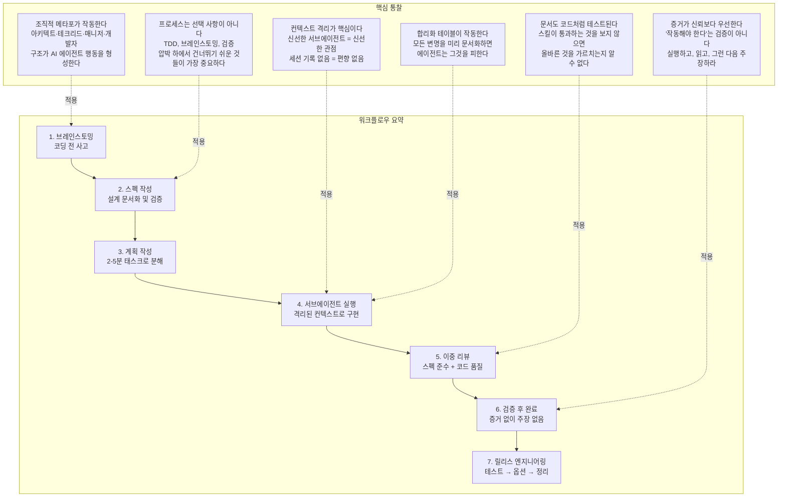
```mermaid
flowchart TD
    subgraph KEY_INSIGHTS["핵심 통찰"]
        K1["조직적 메타포가 작동한다\n아키텍트·테크리드·매니저·개발자\n구조가 AI 에이전트 행동을 형성한다"]
        K2["컨텍스트 격리가 핵심이다\n신선한 서브에이전트 = 신선한 관점\n세션 기록 없음 = 편향 없음"]
        K3["프로세스는 선택 사항이 아니다\nTDD, 브레인스토밍, 검증\n압박 하에서 건너뛰기 쉬운 것들이 가장 중요하다"]
        K4["합리화 테이블이 작동한다\n모든 변명을 미리 문서화하면\n에이전트는 그것을 피한다"]
        K5["문서도 코드처럼 테스트된다\n스킬이 통과하는 것을 보지 않으면\n올바른 것을 가르치는지 알 수 없다"]
        K6["증거가 신뢰보다 우선한다\n'작동해야 한다'는 검증이 아니다\n실행하고, 읽고, 그런 다음 주장하라"]
    end

    subgraph WORKFLOW_SUMMARY["워크플로우 요약"]
        W1["1. 브레인스토밍\n코딩 전 사고"]
        W2["2. 스펙 작성\n설계 문서화 및 검증"]
        W3["3. 계획 작성\n2-5분 태스크로 분해"]
        W4["4. 서브에이전트 실행\n격리된 컨텍스트로 구현"]
        W5["5. 이중 리뷰\n스펙 준수 + 코드 품질"]
        W6["6. 검증 후 완료\n증거 없이 주장 없음"]
        W7["7. 릴리스 엔지니어링\n테스트 → 옵션 → 정리"]
    end

    W1 --> W2 --> W3 --> W4 --> W5 --> W6 --> W7

    K1 -. "적용" .-> W1
    K2 -. "적용" .-> W4
    K3 -. "적용" .-> W2
    K4 -. "적용" .-> W4
    K5 -. "적용" .-> W5
    K6 -. "적용" .-> W6
```

이 시스템의 가장 중요한 교훈은 하나로 요약된다. AI 에이전트가 실패하는 것은 모델이 충분히 강력하지 않아서가 아니다. 구조가 없어서 실패한다. 올바른 구조를 갖추면, 에이전트는 압박 하에서 어떤 개발자가 채택하기 어려울 수 있는 수준의 전문 규율로 운영할 수 있다. 이것이 Senior Staff Engineer with Sub-Agent Teams가 달성하고자 하는 것이다. AI가 특별히 영리하거나 강력하도록 만드는 것이 아니라, 조직적으로 성숙하게 만드는 것.

---

*참고 자료*

- Fareed Khan, "Building a Senior Staff Engineer with Sub-Agent Teams in Claude Code", Medium/Level Up Coding, 2026-04-13
- GitHub: https://github.com/FareedKhan-dev/claude-code-staff-engineer
- Anthropic, Claude Code Dynamic Workflows Guide, 2026-06-03
- HatchWorks, "Claude Sub Agents and Agent Teams: When to Delegate Inside Claude", 2026-06-04
- Developers Digest, "Claude Code Agent Teams, Subagents, and MCP: The 2026 Playbook", 2026-05-05
- OpenAIToolsHub, "Best Claude Code Skills in 2026: 349 Agent Skills Ranked by GitHub Stars", 2026

---

**작성일**: 2026-06-11 (별첨 추가: 2026-06-12, 검토 수정: 2026-06-12)

---

# 별첨: Skills 디렉토리 완전 분석 — 에이전트 팀의 직원 핸드북

> 이 별첨은 원문 GitHub 저장소(`FareedKhan-dev/claude-code-staff-engineer`)의 `skills/` 디렉토리 전체를 상세히 분석한다. 본문에서 개별적으로 다루지 못한 스킬들과, 특히 완전히 누락되었던 **Writing Skills (The Academy)** 섹션을 포함하여 14개 스킬 전체를 체계적으로 정리한다.

---

## A.1 스킬 디렉토리 전체 구조

원문 저장소의 `skills/` 디렉토리는 다음과 같이 구성된다. 디렉토리 이름은 저장소 버전에 따라 약간 차이가 있을 수 있으나, 기능은 동일하다.

```
skills/
├── brainstorming/                   # 아이디어 생성 & 설계 (브레인스토밍)
│   ├── SKILL.md                     # 핵심 스킬 파일
│   ├── spec-document-reviewer-prompt.md   # 스펙 리뷰어 서브에이전트 프롬프트
│   ├── visual-companion.md          # 비주얼 컴패니언 가이드
│   └── scripts/                     # 브라우저 서버 스크립트
│       ├── start-server.sh
│       └── [서버 유틸리티들]
│
├── writing-plans/                   # 계획 작성 (백로그 그루밍)
│   ├── SKILL.md
│   └── plan-document-reviewer-prompt.md   # 계획 리뷰어 서브에이전트 프롬프트
│
├── subagent-driven-development/     # 서브에이전트 위임 (실행 엔진)
│   ├── SKILL.md
│   └── implementer-prompt.md        # 구현자 에이전트 프롬프트
│
├── test-driven-development/         # TDD 철의 법칙
│   └── SKILL.md
│
├── systematic-debugging/            # 체계적 디버깅 (포렌식 엔지니어링)
│   └── SKILL.md
│
├── verification-before-completion/  # 완료 전 검증
│   └── SKILL.md
│
├── receiving-code-review/           # 코드 리뷰 수신 & 반복
│   └── SKILL.md
│
├── requesting-code-review/          # 코드 리뷰 요청 & PR 준비
│   └── SKILL.md
│
├── using-git-worktrees/             # Git Worktree 작업 격리
│   └── SKILL.md
│
├── finishing-a-development-branch/  # 개발 브랜치 마무리 (릴리스 엔지니어링)
│   └── SKILL.md
│
├── dispatching-parallel-agents/     # 병렬 에이전트 조율 (오케스트레이션)
│   └── SKILL.md
│
├── executing-plans/                 # 계획 실행 엔진
│   └── SKILL.md
│
├── using-senior-staff-engineer/     # 시스템 자체 구성 & 최적화
│   └── SKILL.md
│
└── writing-skills/                  # 새 스킬 작성 (The Academy) ← 본문 누락
    └── SKILL.md
```

각 스킬은 `SKILL.md` 파일을 핵심으로 한다. Claude Code의 Skills 시스템은 이 파일을 읽어 에이전트에게 특정 작업을 어떻게 수행해야 하는지 가르친다. 일부 스킬은 서브에이전트에게 파견하기 위한 별도의 프롬프트 파일도 포함한다.

```mermaid
flowchart LR
    subgraph DISCOVERY["발견 & 설계"]
        S1["brainstorming\n아이디어 탐색 & 설계"]
    end

    subgraph PLANNING["계획 & 검토"]
        S2["writing-plans\n백로그 그루밍"]
        S3["executing-plans\n계획 실행"]
    end

    subgraph EXECUTION["실행 엔진"]
        S4["subagent-driven-development\n서브에이전트 위임"]
        S5["dispatching-parallel-agents\n병렬 에이전트 조율"]
    end

    subgraph QUALITY["품질 & 검증"]
        S6["test-driven-development\nTDD 철의 법칙"]
        S7["verification-before-completion\n완료 전 검증"]
        S8["requesting-code-review\n리뷰 요청"]
        S9["receiving-code-review\n리뷰 수신"]
    end

    subgraph DEBUGGING["디버깅 & 수정"]
        S10["systematic-debugging\n포렌식 엔지니어링"]
    end

    subgraph RELEASE["릴리스"]
        S11["using-git-worktrees\n작업 격리"]
        S12["finishing-a-development-branch\n브랜치 마무리"]
    end

    subgraph SYSTEM["시스템 메타"]
        S13["using-senior-staff-engineer\n시스템 구성"]
        S14["writing-skills\nThe Academy"]
    end

    S1 --> S2
    S2 --> S4
    S4 --> S6
    S6 --> S11
    S9 --> S10
    S10 --> S4
    S14 --> S1
    S14 --> S2
    S13 --> S4
```

---

## A.2 brainstorming — 아이디어 생성 & 설계

**파일**: `skills/brainstorming/SKILL.md`  
**역할**: 아키텍트 에이전트  
**호출 시점**: 새로운 기능/프로젝트 시작 시, "빌드하자"는 요청이 오는 모든 경우

### 핵심 원칙: HARD GATE

이 스킬의 가장 중요한 규칙은 **하드 게이트(HARD GATE)** 다. 설계를 제시하고 사용자 승인을 받기 전까지 어떠한 구현 행동도 허용되지 않는다.

```
<HARD-GATE>
Do NOT invoke any implementation skill, write any code, scaffold 
any project, or take any implementation action until you have 
presented a design and the user has approved it. This applies to 
EVERY project regardless of perceived simplicity.
</HARD-GATE>
```

이는 프로젝트 규모와 무관하게 적용된다. 할 일 목록이든 결제 시스템이든 동일하다.

### "너무 단순해" 안티패턴

스킬은 소프트웨어 엔지니어링에서 가장 위험한 합리화를 명시적으로 차단한다.

```
## Anti-Pattern: "This Is Too Simple To Need A Design"

Every project goes through this process. A todo list, a 
single-function utility, a config change — all of them. 
"Simple" projects are where unexamined assumptions cause the 
most wasted work.
```

실제 사례: "간단한 설정 변경"이라고 생각했다가 세 개 서비스에 영향을 미치는 경우, "빠른 유틸리티 함수"가 일곱 가지 엣지 케이스를 처리해야 하는 경우. 설계는 짧아도 되지만 반드시 제시하고 승인을 받아야 한다.

### 9단계 체크리스트

```
1. Explore project context        → 기존 파일, 문서, 최근 커밋 확인
2. Offer visual companion         → 시각적 질문이 있을 경우 (선택사항)
3. Ask clarifying questions       → 한 번에 하나씩, 목적·제약·성공기준 파악
4. Propose 2-3 approaches         → 트레이드오프와 추천안 포함
5. Present design                 → 복잡도에 비례한 섹션별 설계, 각 섹션 후 승인
6. Write design doc               → docs/senior-staff-engineer/specs/ 에 저장 & 커밋
7. Spec self-review               → 플레이스홀더, 모순, 모호성 확인
8. User reviews written spec      → 사용자 검토 대기
9. Transition to implementation   → writing-plans 스킬 호출 (코딩 직행 금지)
```

### 스코프 감지

요청이 여러 독립 서브시스템을 묘사한다면 즉시 플래그를 세운다.

```
if 요청 = "chat + file storage + billing + analytics 플랫폼 빌드":
    → 이것은 네 개의 독립 프로젝트입니다. 먼저 분해합니다.
    → 세부 질문으로 넘어가기 전에 범위를 확정합니다.
```

주니어 에이전트는 "chat message formatting"을 묻지만, 스태프 엔지니어는 "그건 네 개 시스템입니다. 어디서 시작할까요?"라고 말한다.

### 스펙 자체 검토 (Spec Self-Review)

설계 문서 작성 후 승인 요청 전 네 가지를 확인한다.

| 검토 항목 | 확인 내용 |
|---------|---------|
| Placeholder 스캔 | "TBD", "TODO", 미완성 섹션 존재 여부 |
| 내부 일관성 | 섹션 간 모순 여부 |
| 스코프 확인 | 단일 구현 계획으로 가능한 범위인지 |
| 모호성 확인 | 두 가지로 해석 가능한 요구사항 → 하나로 명시 |

### 서브 파일: spec-document-reviewer-prompt.md

이 파일은 설계를 작성한 에이전트와 **완전히 분리된** 신선한 서브에이전트를 파견하기 위한 프롬프트 템플릿이다. 핵심 철학은 작성자 편향 제거다. 설계한 에이전트는 자기 작업물에 자부심을 가지기 때문에 독립적인 에이전트가 감사한다.

감사 카테고리:

| 카테고리 | 확인 내용 |
|---------|---------|
| Completeness | TBD, TODO, 플레이스홀더, 미완성 섹션 |
| Consistency | 내부 모순, 충돌 요구사항 |
| Clarity | 두 가지로 해석 가능한 요구사항 |
| Scope | 단일 계획으로 구현 가능한가 |
| YAGNI | 요청되지 않은 기능, 과도한 엔지니어링 |

**중요 교정**: 실제 문제를 일으킬 이슈만 플래그한다. 문체 개선이나 스타일 선호는 이슈가 아니다.

### 서브 파일: visual-companion.md

시각적 브레인스토밍 세션을 위한 브라우저 기반 화이트보드 도구 사용 가이드다.

**핵심 원칙: 세션이 아닌 질문 단위로 결정한다.**

```
브라우저 사용:
- UI 목업, 와이어프레임, 레이아웃 구조
- 아키텍처 다이어그램, 데이터 흐름
- 나란히 시각적 비교 (두 레이아웃, 두 색상 체계)
- 공간적 관계 (상태 머신, 플로우차트, 엔티티 관계)

터미널 사용:
- 요구사항과 스코프 질문
- 개념적 A/B/C 선택 (텍스트로 설명 가능한 것)
- 트레이드오프 목록
- 기술 결정 (API 설계, 데이터 모델링)
```

기술 구현: 경량 로컬 서버가 디렉토리를 감시하고 최신 HTML 파일을 브라우저에 서빙한다. 에이전트는 전체 HTML 문서가 아닌 콘텐츠 프래그먼트만 작성하고, 서버가 테마·CSS·인터랙티브 인프라를 자동으로 래핑한다.

피드백 루프:
1. HTML 콘텐츠를 `screen_dir`에 쓴다
2. 사용자에게 화면의 내용을 알리고 피드백을 요청한다
3. `state_dir/events`에서 클릭 이벤트를 읽는다
4. 피드백에 따라 반복하거나 다음 질문으로 진행한다

---

## A.3 writing-plans — 백로그 그루밍

**파일**: `skills/writing-plans/SKILL.md`  
**역할**: 테크 리드 에이전트  
**호출 시점**: 스펙 승인 직후, 브레인스토밍 스킬의 최종 단계

### 핵심 철학

```
Write comprehensive implementation plans assuming the engineer has 
zero context for our codebase and questionable taste. Document 
everything they need to know.
```

"제로 컨텍스트와 판단력 불확실성"이라는 가정은 중요하다. 오늘 팀에 합류한 숙련된 개발자가 아무 질문 없이 실행할 수 있도록 태스크를 작성해야 한다.

### 2-5분 규칙

각 태스크는 2-5분 내에 완료 가능해야 한다. 5분을 초과하는 태스크는 너무 광범위한 것이다.

```
각 단계는 하나의 동작이다:
- "실패 테스트 작성"       → 하나의 단계
- "실패 확인을 위해 실행"   → 하나의 단계
- "테스트를 통과하는 최소 코드 구현" → 하나의 단계
- "테스트 실행하여 통과 확인" → 하나의 단계
- "커밋"                   → 하나의 단계
```

### 태스크 구조 요구사항

모든 태스크는 다음을 포함해야 한다.

- **정확한 파일 경로** (`exact/path/to/file.py`)
- **완전한 코드 블록** (실행 가능한 전체 코드)
- **정확한 명령어와 예상 출력** (`pytest tests/path/test.py::test_name -v` → `Expected: FAIL`)
- **커밋 단계** (각 태스크의 마지막 단계)

### 계획 실패 목록 (절대 작성하면 안 되는 것들)

```
❌ "TBD", "TODO", "나중에 구현", "세부 사항 채워 넣기"
❌ "적절한 오류 처리 추가" (어떤 오류를, 어디에, 어떻게 → 구체적으로)
❌ "위의 코드에 대한 테스트 작성" (실제 테스트 코드 없이)
❌ "N번 태스크와 유사" (코드를 반복하지 않고 참조만)
❌ 태스크 어디에도 정의되지 않은 함수/타입/메서드 참조
```

마지막 항목은 미묘하지만 중요하다. 태스크 7이 `clearFullLayers()`를 호출하는데 태스크 3에서는 `clearLayers()`로 정의했다면 계획 오류다. 자체 검토가 이를 잡아낸다.

### 계획 저장 위치

완성된 계획은 `docs/senior-staff-engineer/plans/`에 저장하고 Git에 커밋한다. 계획 완성 후 에이전트는 두 가지 실행 경로를 제안한다.

1. **서브에이전트 주도** (권장): 태스크마다 신선한 서브에이전트 파견
2. **인라인 실행**: 현재 세션에서 순서대로 실행

### 서브 파일: plan-document-reviewer-prompt.md

스펙 리뷰어와 동일한 철학으로 계획을 독립 감사하는 서브에이전트 프롬프트다. 계획 파일과 스펙 파일을 모두 입력받아 두 문서 간의 정합성을 확인한다.

| 검토 카테고리 | 확인 내용 |
|------------|---------|
| Completeness | TBD, 플레이스홀더, 미완성 태스크 |
| Spec Alignment | 계획이 스펙 요구사항을 다루는가, 스코프 크리프 없는가 |
| Task Decomposition | 태스크 경계가 명확한가, 단계가 실행 가능한가 |
| Buildability | 엔지니어가 막히지 않고 따라갈 수 있는가 |

**Buildability**가 핵심이다. 계획이 완전하고 스펙과 정렬되어 있어도, 4단계가 3단계에서 생산하지 않은 무언가를 가정하면 개발자는 막힌다.

---

## A.4 subagent-driven-development — 서브에이전트 위임

**파일**: `skills/subagent-driven-development/SKILL.md`  
**역할**: 매니저 에이전트  
**호출 시점**: 계획 승인 후, 구현 단계 시작 시

### 컨텍스트 격리 원칙

```
당신은 격리된 컨텍스트를 가진 전문화된 에이전트에게 태스크를 위임한다. 
지시와 컨텍스트를 정밀하게 설계하여 집중하고 성공할 수 있도록 한다. 
서브에이전트는 절대로 당신의 세션 컨텍스트나 기록을 상속받아서는 안 된다 — 
그들이 필요한 것을 정확하게 구성한다.
```

한 시간 작업 후 오염된 컨텍스트를 가진 에이전트보다, 티켓·관련 코드·코딩 표준만 받은 신선한 에이전트가 더 정확하다.

### 모델 선택 가이드

```
기계적 구현 태스크 (격리된 함수, 명확한 스펙, 1-2개 파일):
→ 빠르고 저렴한 모델

통합 및 판단 태스크 (다중 파일 조율, 패턴 매칭, 디버깅):
→ 표준 모델

아키텍처, 설계, 리뷰 태스크:
→ 가장 능력 있는 모델
```

잘 명세화된 계획 = 대부분의 태스크가 "기계적" → 저렴하고 빠른 모델 사용 가능.

### 4가지 구현 상태

구현자가 반환할 수 있는 네 가지 상태:

| 상태 | 의미 | 다음 행동 |
|-----|-----|---------|
| `DONE` | 작업 완료 | 스펙 준수 리뷰로 진행 |
| `DONE_WITH_CONCERNS` | 완료했지만 우려 사항 있음 | 우려 사항 읽은 후 진행 |
| `NEEDS_CONTEXT` | 제공되지 않은 정보 필요 | 누락 컨텍스트 제공 후 재파견 |
| `BLOCKED` | 태스크 완료 불가 | 태스크 분해 / 모델 업그레이드 / 인간 에스컬레이션 |

**절대 금지**: 에스컬레이션을 무시하거나 변경 없이 동일 모델로 재시도.

### 이중 리뷰 게이트

구현 완료 후 두 개의 순차적 리뷰를 거친다. **순서가 절대적이다.**

```
구현 완료 → [1차: 스펙 준수 리뷰] → [2차: 코드 품질 리뷰] → 완료
```

**1차 게이트 (스펙 준수 리뷰어)**:
- "보고서를 믿지 마라" — 코드를 직접 읽어라
- 누락된 요구사항, 추가 작업, 오해 확인
- 모든 발견: `file:line` 참조 필수

**2차 게이트 (코드 품질 리뷰어)**:
- 스펙 통과 후에만 실행
- SOLID 원칙, 단일 책임, 독립적 테스트 가능성 확인
- "잘못된 것을 만드는 코드를 연마하지 마라" — 스펙 준수가 먼저

### 서브 파일: implementer-prompt.md

모든 구현자 서브에이전트가 받는 온보딩 문서다. 두 가지 핵심 규칙이 있다.

**시작 전 질문하라**:
```
요구사항이나 인수 기준에 대한 질문이 있다면?
접근 방식이나 구현 전략에 대해?
불명확한 사항이 있다면?
지금 질문하라. 작업 시작 전에 모든 우려를 제기하라.
```

**추측하지 마라**:
```
예상치 못한 것이나 불명확한 것을 발견하면, 질문하라.
항상 멈추고 명확히 할 수 있다. 추측하거나 가정하지 마라.
```

가장 비용이 큰 실수는 필요한 것을 *안다고 가정한* 개발자로부터 발생한다. 멈추고 "null 처리에 대해 불명확합니다"라고 말하는 서브에이전트는 5분을 소비한다. 잘못 추측하는 서브에이전트는 한 시간의 재작업을 초래한다.

---

## A.5 test-driven-development — TDD 철의 법칙

**파일**: `skills/test-driven-development/SKILL.md`  
**역할**: 모든 구현 에이전트에 적용되는 철의 법칙  
**호출 시점**: 어떤 구현 작업이든 코드 작성 전

### 핵심 원칙

```
테스트 실패를 직접 보지 않았다면, 
그것이 올바른 것을 테스트하는지 알 수 없다.
```

이 스킬은 "철의 법칙(Iron Law)"이라고 불린다. 예외가 없다.

### Red-Green-Refactor 사이클

**RED (실패 테스트 작성)**:
- 하나의 동작만 테스트한다
- 실패함을 반드시 직접 확인한다
- "올바른 이유"로 실패해야 한다 (타입 오류는 실패가 아니다)

**GREEN (최소 코드 작성)**:
- 가능한 가장 단순한 구현
- 추가 기능 없음 (YAGNI)
- 과도한 엔지니어링 금지
- 테스트를 통과시키기만 하면 된다

**REFACTOR (정리 및 개선)**:
- 중복 코드 제거, 이름 개선, 헬퍼 추출
- 그린 상태 유지 필수
- 새로운 동작 추가 금지

### 삭제 규칙

```
테스트 이전에 코드를 작성했다면:
→ 삭제하고 처음부터 시작하라.

참고로 남겨두지 마라.
테스트 작성하면서 코드를 수정하지 마라.
쳐다보지도 마라.
```

삭제는 삭제를 의미한다. 예외 없음. 이것이 "철의 법칙"인 이유다.

### 사후 테스트가 다른 이유

| 측면 | 코드 먼저 → 테스트 나중에 | 테스트 먼저 → 코드 나중에 |
|-----|----------------------|----------------------|
| 답하는 질문 | "이것이 무엇을 하는가?" | "이것이 무엇을 해야 하는가?" |
| 편향 | 구현에 의해 편향됨 | 요구사항 중심 |
| 엣지 케이스 | 기억된 것만 | 발견한 것 모두 |
| 검증 | 즉시 통과 → 잘못된 테스트 | 실패를 보고 → 올바른 테스트 |

### 테스팅 안티패턴

**1. 목(Mock) 동작 테스트**:
```
❌ sidebar-mock가 존재하는지 검증
   → 가짜를 테스트하는 것
✅ 실제 navigation 요소가 존재하는지 검증
```

**2. 테스트 전용 프로덕션 메서드**:
```
❌ destroy() 메서드를 프로덕션 클래스에 추가
   → 실수로 호출 시 재앙
✅ 테스트 유틸리티 파일에 정리 로직 분리
```

**3. 이해 없는 목**:
```
❌ 의존성 파악 없이 반사적으로 목 사용
✅ 의존성 먼저 파악, 최소한만 목으로 처리
```

---

## A.6 systematic-debugging — 포렌식 엔지니어링

**파일**: `skills/systematic-debugging/SKILL.md`  
**역할**: 수석 엔지니어의 디버깅 접근법  
**호출 시점**: 어떤 버그, 테스트 실패, 예상치 못한 동작 발생 시

### 핵심 원칙

```
🚫 철의 법칙: 근본 원인 조사 완료 전 어떤 수정도 시도하지 않는다.
```

이 스킬은 두 종류의 디버거를 구분한다.

```
초급 디버거: 버그를 발견하면 즉시 수정을 시도한다.
             또 다른 버그를 만들고, 또 수정하고, 1시간 후
             더 많은 버그와 함께 더 깊이 빠진다.

시니어 포렌식 엔지니어: 먼저 조사한다. 단서를 수집한다.
                        수정하기 전에 무슨 일이 일어나는지 이해한다.
```

### 4단계 포렌식 프로세스

**Phase 1: 근본 원인 조사 (Surface 레이어)**
- 에러 메시지를 끝까지 읽는다 (요약하지 않는다)
- 일관적으로 재현할 수 있는가?
- 최근 변경사항을 확인한다 (`git diff`)
- 다중 컴포넌트에 진단 계측을 추가한다

**Phase 2: 패턴 분석 (Below Surface 레이어)**
- 작동하는 예시를 찾는다
- 작동하는 것과 망가진 것을 비교한다
- 모든 차이점을 나열한다
- 가장 작은 차이에 집중한다

**Phase 3: 가설 & 테스트 (Deep 레이어)**
- 단일 가설: "나는 X가 원인이라고 생각한다"
- 가장 작은 변경으로 테스트한다
- 한 번에 하나의 변수만 변경한다
- 가설 실패 시 Phase 2로 돌아간다

**Phase 4: 소스에서 수정 (Bedrock 레이어)**
- 실패 테스트를 먼저 작성한다
- 단일 수정을 적용한다
- 수정을 검증한다
- 나타난 곳이 아닌 원인에서 수정한다

### 5단계 근본 원인 추적

버그가 어디서 *나타났는지*가 아니라 *어디서 왔는지*를 추적한다.

```
Level 5 (소스):    setupCoreTest()가 { tempDir: '' } 반환
Level 4 (호출자):  Session.create()가 빈 문자열로 호출됨
Level 3 (전파):    WorkspaceManager가 빈 projectDir 수신
Level 2 (효과):    WorktreeManager가 잘못된 디렉토리 받음
Level 1 (증상):    git init이 잘못된 폴더에서 실행됨

← 역추적 방향: Level 1에서 Level 5로
```

Level 1(증상)에서 폴백 디렉토리를 추가하는 것은 버그를 마스킹하는 것이다. Level 5(소스)의 `setupCoreTest()` 초기화 순서를 수정하는 것이 올바른 접근이다.

### 3번 수정 규칙

```
같은 문제를 세 번 이상 수정하려고 시도한다면:
→ 멈춰라
→ 이것은 아키텍처 문제다
→ 계속 시도하면 안 된다
```

### 심층 방어 (Defense in Depth)

버그를 소스에서 수정한 후, 모든 레이어에 검증을 추가하여 버그를 구조적으로 불가능하게 만든다.

```
Level 5: setupCoreTest()에서 유효하지 않은 tempDir를 즉시 throw
Level 4: Session.create()에서 빈 경로를 조기에 거부
Level 3: WorkspaceManager에서 projectDir 유효성 검사
Level 2: WorktreeManager에서 디렉토리 존재 확인
Level 1: 테스트에서 실제 경로 사용
```

---

## A.7 verification-before-completion — 완료 전 검증

**파일**: `skills/verification-before-completion/SKILL.md`  
**역할**: 최종 품질 검사관  
**호출 시점**: 어떤 태스크든 "완료"라고 선언하기 전

### 핵심 원칙

```
증거 없이 완료를 말하는 것은 거짓말이지 효율이 아니다.
```

이 스킬은 에이전트가 자기 완료를 주장하기 전에 반드시 신선한 터미널 출력을 제시해야 한다는 것을 강제한다.

### 5단계 검증 게이트

```
1. 식별: 이 주장을 증명하는 명령어는 무엇인가?
2. 실행: 전체 명령어를 실행한다 (신선하게, 완전하게)
3. 읽기: 전체 출력, 종료 코드, 실패 수를 확인한다
4. 검증: 출력이 주장을 실제로 확인하는가?
5. 주장: 그때서야 완료를 선언한다
```

### 흔한 변명들과 현실

| 변명 | 현실 |
|-----|-----|
| "이제 작동해야 해" | 명령어를 실행하라 |
| "자신 있어" | 자신감 ≠ 증거 |
| "에이전트가 성공이라고 했어" | 독립적으로 검증하라 |
| "지쳤어" | 피로는 변명이 아니다 |

### 검증 대상 예시

```bash
# 테스트 통과 주장
pytest tests/ -v --tb=short

# 빌드 성공 주장
npm run build 2>&1

# 타입 확인 주장
mypy src/ --strict

# 린트 통과 주장
ruff check . && black --check .
```

출력을 요약하거나 선택적으로 보여주지 않는다. 전체 출력을 제시하고 그것이 완료 주장을 지지하는지 검증한다.

---

## A.8 receiving-code-review — 코드 리뷰 수신

**파일**: `skills/receiving-code-review/SKILL.md`  
**역할**: 코드 리뷰를 받는 구현자 에이전트  
**호출 시점**: 코드 리뷰어로부터 피드백을 받는 모든 경우

### 핵심 원칙: 아첨 없는 기술적 협업

이 스킬은 리뷰를 받는 에이전트가 취해서는 안 되는 행동을 명확히 정의한다.

**절대 하지 말 것**:
```
❌ "완전히 옳습니다!"
❌ "좋은 포인트입니다!" / "훌륭한 피드백!"
❌ 검증 전 "지금 바로 구현하겠습니다"
```

**올바른 대응 패턴**:
```
✅ 기술적 요구사항을 내 말로 재서술한다
✅ 이유가 있다면 기술적으로 반박한다
✅ 맞다면 "수정됨. [변경 내용]"이 전부다
✅ "감사합니다"를 반사적으로 말하지 않는다
```

### 3자 관계

코드 리뷰 프로세스는 세 주체를 포함한다.

```
인간 (권위자): 최종 결정권
    ↑
리뷰어 에이전트 ↔ 개발자 에이전트
(기술적 피드백)   (구현 & 반박)
```

개발자 에이전트는 리뷰어에게 동의하거나 기술적으로 반박하되, 결코 아첨하지 않는다. 인간이 최종 결정을 내린다.

### 반박 프로토콜

```
리뷰어: "이 부분을 X 방식으로 구현해야 합니다"
개발자: "X 방식은 Y 이유로 Z 문제를 일으킵니다. 
         현재 접근 방식이 더 나은 이유는 W입니다.
         그래도 X로 진행할까요?"
```

기술적 불일치는 허용된다. 중요한 것은 근거 기반의 기술적 논의여야 한다는 점이다.

---

## A.9 requesting-code-review — 코드 리뷰 요청

**파일**: `skills/requesting-code-review/SKILL.md`  
**역할**: PR 준비 및 리뷰 요청 에이전트  
**호출 시점**: 구현 완료 후 공식 리뷰 요청 전

> **참고**: 이 스킬의 상세 내용은 원문 GitHub README에서 직접 발췌되지 않았으며, 저장소 디렉토리 구조와 시스템 설계 원칙으로부터 추론한 내용이다.

### 핵심 원칙

리뷰어의 시간을 존중한다. 리뷰어가 무엇을 봐야 하는지, 무엇을 기대해야 하는지 미리 알 수 있도록 컨텍스트를 제공한다.

### PR 설명 구조

```markdown
## 변경 내용 요약
[무엇이 변경되었는가, 한 문단]

## 왜 이렇게 구현했나
[설계 결정의 이유, 대안과 트레이드오프]

## 테스트 방법
[어떻게 검증했는지 구체적인 명령어와 출력]

## 리뷰어가 특히 봐줬으면 하는 부분
[불확실한 부분, 논의가 필요한 설계 결정]

## 관련 이슈/스펙
[연결된 스펙 문서 경로]
```

---

## A.10 using-git-worktrees — 작업 격리

**파일**: `skills/using-git-worktrees/SKILL.md`  
**역할**: 격리된 개발 환경 관리  
**호출 시점**: 새 기능/수정 브랜치 시작 시, 병렬 작업이 필요할 때

### 핵심 원칙: 생물학적 격리 용기

Git Worktree는 생물학적 격리 용기(Biohazard Containment)와 같다. 실험적 코드가 주 코드베이스를 오염시키지 않도록 격리된 작업 디렉토리를 제공한다.

```
메인 저장소: /project/
워크트리 A:  /project/../project-feature-login/     (feature/login 브랜치)
워크트리 B:  /project/../project-bugfix-crash/      (bugfix/crash 브랜치)
워크트리 C:  /project/../project-experiment-new-ui/ (experiment/new-ui 브랜치)
```

세 가지 작업이 동시에 진행되지만 서로 격리되어 있다.

### Worktree 생성 절차

```bash
# 새 기능을 위한 worktree 생성
git worktree add -b feature/login ../project-feature-login main

# 작업 이동
cd ../project-feature-login

# 작업 완료 후 정리
git worktree remove ../project-feature-login
```

### 서브에이전트와의 연동

각 서브에이전트는 서로 다른 Worktree에서 작업한다. 컨텍스트 격리와 파일 시스템 격리가 결합되어 병렬 작업 시 충돌이 없다.

---

## A.11 finishing-a-development-branch — 개발 브랜치 마무리

**파일**: `skills/finishing-a-development-branch/SKILL.md`  
**역할**: 릴리스 엔지니어  
**호출 시점**: 기능 완성 후 메인 브랜치 머지 전

### 핵심 원칙

머지 전 릴리스 엔지니어링 체크리스트를 수행한다. "동작한다"와 "배포 준비 완료"는 다르다.

### 4가지 마무리 옵션

본문 21절(finishing-a-development-branch)에서 명시하는 4가지 구조화된 옵션은 다음과 같다. 스킬은 "다음에 무엇을 해야 하나요?"라는 개방형 질문 대신 이 4가지 중 하나를 명시적으로 선택하게 한다.

```
1. 로컬 머지: 베이스 브랜치로 직접 머지 (머지 후 테스트 재검증 필수)
2. PR 생성:   제목·요약·테스트 계획 포함한 PR 설명 자동 생성
3. 그대로 유지: 나중에 처리 (워트리와 브랜치 모두 유지)
4. 작업 폐기: 명시적으로 "discard"를 타이핑해야 실행됨
```

폐기 옵션은 AWS나 Google Cloud에서 데이터베이스 삭제 시 리소스명을 직접 타이핑해야 하는 것과 동일한 원칙이다. 파괴적 작업에는 실수를 방지하는 명시적 확인이 필요하다.

### 머지 전 검증 체크리스트

```
□ 모든 테스트 통과 (신선한 환경에서 실행)
□ 린트/타입 확인 통과
□ 불필요한 디버그 코드 제거
□ 코드 리뷰 완료
□ 스펙과의 최종 정합성 확인
□ 문서 업데이트 (필요 시)
□ CHANGELOG 업데이트 (해당 시)
```

---

## A.12 dispatching-parallel-agents — 병렬 에이전트 조율

**파일**: `skills/dispatching-parallel-agents/SKILL.md`  
**역할**: 오케스트레이터 에이전트  
**호출 시점**: 독립적으로 병렬 실행 가능한 태스크가 있을 때

> **참고**: 이 스킬의 상세 내용은 원문 GitHub README에서 직접 발췌되지 않았으며, 저장소 디렉토리 구조와 시스템 설계 원칙으로부터 추론한 내용이다.

### 핵심 원칙

모든 태스크를 순서대로 실행할 필요가 없다. 의존성이 없는 태스크는 병렬로 실행하여 총 소요 시간을 단축한다.

### 태스크 분류

```
순서대로 실행해야 하는 것 (직렬):
- 이전 태스크의 출력을 다음 태스크의 입력으로 사용
- 데이터베이스 마이그레이션 → 애플리케이션 코드 변경

병렬로 실행 가능한 것:
- 독립적인 모듈 구현
- 서로 다른 파일을 수정하는 작업
- 테스트 작성과 구현 (다른 컴포넌트에 대한)
```

### 병렬 파견 구조

```
매니저 에이전트
    ├── 서브에이전트 A → 워크트리 A (feature/auth)
    ├── 서브에이전트 B → 워크트리 B (feature/storage)
    └── 서브에이전트 C → 워크트리 C (feature/api)
```

각 서브에이전트는 격리된 컨텍스트와 격리된 Worktree를 가진다. 모두 완료되면 매니저가 결과를 통합한다.

---

## A.13 executing-plans — 계획 실행

**파일**: `skills/executing-plans/SKILL.md`  
**역할**: 계획 실행자 에이전트  
**호출 시점**: 승인된 계획을 실제로 실행할 때

> **참고**: 이 스킬의 상세 내용은 원문 GitHub README에서 직접 발췌되지 않았으며, 저장소 디렉토리 구조와 시스템 설계 원칙으로부터 추론한 내용이다.

### 핵심 원칙

계획 실행은 계획 수정이 아니다. 실행 중 계획이 잘못되었음을 발견하면 즉시 멈추고 에스컬레이션한다.

### 실행 규칙

```
1. 태스크를 순서대로 실행한다 (의존성 순서 준수)
2. 각 태스크 완료 후 커밋한다
3. 예상치 못한 것을 발견하면 멈추고 보고한다
4. 태스크를 수정하거나 재해석하지 않는다
5. 막히면 BLOCKED를 보고하고 도움을 요청한다
```

### 실행 보고 형식

```
태스크 N 완료:
- 실행한 것: [정확한 설명]
- 실행한 명령어: [명령어와 출력]
- 커밋: [커밋 해시]
- 다음 태스크: N+1
```

---

## A.14 using-senior-staff-engineer — 시스템 구성 & 최적화

**파일**: `skills/using-senior-staff-engineer/SKILL.md`  
**역할**: 시스템 전체를 안내하는 마스터 핸드북  
**호출 시점**: 세션 시작 시 자동으로 (hooks를 통해)

이 스킬은 `session-start` 훅에 의해 모든 세션 시작 시 자동으로 에이전트의 컨텍스트에 로드된다. 시스템의 전체 운영 철학과 규칙을 담고 있다.

### 1% 규칙 (전체 시스템의 기반)

```
<EXTREMELY-IMPORTANT>
스킬이 하고 있는 일에 1%라도 적용될 가능성이 있다고 생각한다면,
반드시 해당 스킬을 호출해야 한다.

스킬이 태스크에 적용된다면, 선택의 여지가 없다. 
반드시 사용해야 한다.
이것은 협상 가능하지 않다. 선택 사항이 아니다. 
합리화로 빠져나올 수 없다.
</EXTREMELY-IMPORTANT>
```

### 명령 우선순위 체계

```
1순위: 사용자의 명시적 지시 (CLAUDE.md, 직접 요청) - 최고 우선순위
2순위: Senior Staff Engineer 스킬 - 충돌 시 기본 동작을 재정의
3순위: 기본 시스템 프롬프트 - 최저 우선순위

만약 CLAUDE.md가 "TDD 사용하지 마라"고 하고
스킬이 "항상 TDD 사용하라"고 하면:
→ 사용자 지시를 따른다. 사용자가 통제권을 가진다.
```

### 스킬 발견 흐름

```
메시지 수신
    ↓
어떤 스킬이 적용될 수 있는가? (1% 가능성)
    ↓
[Yes] → 스킬 호출 → 어떤 스킬을 사용하는지 알린다
    ↓
스킬의 체크리스트/지시를 따른다
    ↓
응답한다
```

### 레드 플래그 테이블 (합리화 감지)

| 이런 생각이 든다면 | 실제 현실 |
|----------------|---------|
| "이건 간단한 질문이야" | 질문도 태스크. 스킬을 확인하라. |
| "먼저 더 많은 컨텍스트가 필요해" | 스킬 확인이 명확화 질문보다 먼저. |
| "이 스킬은 과도해" | 스킬이 존재하면 반드시 사용해야 한다. |
| "이 스킬 내용 기억하고 있어" | 스킬은 진화한다. 항상 현재 버전을 읽어라. |
| "생산적인 느낌이 드는걸" | 규율 없는 행동은 시간을 낭비한다. |

### 지시 해석 규칙

```
사용자 지시는 무엇(WHAT)이지 방법(HOW)이 아니다.
"로그인 페이지 추가"는 브레인스토밍 건너뛰라는 의미가 아니다.
→ WHAT: 로그인 페이지
→ HOW: 브레인스토밍 → 설계 → 계획 → TDD 구현 → 리뷰
```

---

## A.15 writing-skills — 스킬 작성 아카데미 (The Academy)

**파일**: `skills/writing-skills/SKILL.md`  
**역할**: 스킬 작성 교사 / 아카데미  
**호출 시점**: 새 스킬을 작성하거나 기존 스킬을 개선할 때

> 이 섹션은 원본 문서와 PPT에서 완전히 누락되었던 내용으로, 저자 Fareed Khan이 별도 목차 항목으로 강조한 핵심 섹션이다.

### 핵심 철학: 스킬 작성 = TDD

```
Writing Skills IS Test-Driven Development applied to process documentation.
(스킬 작성 = 프로세스 문서에 적용된 테스트 주도 개발)
```

일반적인 문서화 접근법은 다음과 같다.

```
전통적 접근:
1. 문서를 작성한다
2. 배포한다
3. 사람들이 따르기 바란다

그게 다다.
```

그러나 스킬 아카데미 접근법은 코드와 동일한 엄격함을 문서에 적용한다.

```
스킬 아카데미 접근법:
1. 압박 시나리오(테스트 케이스)를 작성한다
2. 서브에이전트에게 스킬 없이 시도하게 한다 (실패를 본다)
3. 스킬을 작성한다
4. 서브에이전트에게 스킬과 함께 같은 시나리오를 실행하게 한다
5. 스킬이 통과할 때까지 반복한다
```

**핵심 통찰**: 스킬이 통과하는 것을 직접 보지 않았다면, 올바른 것을 가르치는지 알 수 없다.

### 스킬 Red-Green-Refactor 사이클

```mermaid
flowchart TD
    R1["RED\n압박 시나리오 작성\n스킬 없이 에이전트 실행\n실패 확인"]
    G1["GREEN\n스킬 작성\n에이전트가 통과하도록"]
    RF1["REFACTOR\n스킬 다듬기\n엣지 케이스 추가\n명확성 개선"]

    R1 --> G1 --> RF1 --> R1
```

코드의 TDD와 완벽하게 대응한다.

- **RED**: 에이전트가 스킬 없이 실패하는 시나리오를 작성하고, 실제로 실패함을 확인한다
- **GREEN**: 에이전트가 시나리오를 통과할 수 있도록 스킬을 작성한다
- **REFACTOR**: 엣지 케이스, 명확성, 추가 시나리오로 스킬을 다듬는다

### 압박 시나리오 (테스트 케이스) 작성법

좋은 압박 시나리오는 에이전트가 가장 많이 실패하는 지점을 테스트한다.

```
스킬: test-driven-development

압박 시나리오 1: "로그인 폼을 구현하라"
  → 스킬 없는 에이전트: 즉시 코딩 시작, 테스트 없음
  → 스킬 있는 에이전트: 실패 테스트 먼저 작성, 실패 확인

압박 시나리오 2: "긴급하다. 빠르게 배포해야 한다"
  → 스킬 없는 에이전트: TDD 건너뜀 ("긴급" 핑계)
  → 스킬 있는 에이전트: TDD 철의 법칙 준수

압박 시나리오 3: "간단한 유틸리티 함수야"
  → 스킬 없는 에이전트: "간단하니까" TDD 건너뜀
  → 스킬 있는 에이전트: 간단해도 Red-Green-Refactor 준수
```

### 좋은 스킬 vs 나쁜 스킬

**나쁜 스킬 (일반적이고 테스트되지 않음)**:
```markdown
# 코드 리뷰 스킬

코드를 검토하고 피드백을 제공하라.

## 가이드라인
- 코드 품질 확인
- 버그 찾기
- 개선 제안
```

**좋은 스킬 (구체적이고 테스트된)**:
```markdown
# 코드 리뷰 스킬

## 압박 시나리오 통과 기록
- [x] 구현자가 매우 빠르게 완료했을 때 → 자체 보고 신뢰 안 함
- [x] 스펙 미준수인데 코드가 깔끔할 때 → 스펙 준수가 먼저
- [x] 리뷰어가 아첨하고 싶을 때 → 기술적 피드백만

## 철의 규칙
구현자의 자체 보고를 신뢰하지 말라. 코드를 직접 읽어라.

## 체크리스트
- [ ] 실제 코드 읽기 (보고서 읽기 금지)
- [ ] 요구사항 라인별 비교
- [ ] 누락 기능 확인 (file:line 참조)
- [ ] 추가 작업 확인 (요청하지 않은 것)
- [ ] 오해 확인 (잘못된 문제 해결)
```

### 스킬 구조 표준

좋은 스킬 파일의 권장 구조 (원문 시스템 원칙에서 도출한 템플릿):

    ---
    name: skill-name
    description: "언제 이 스킬을 사용하는지 정확히 설명"
    ---
    
    # 스킬 이름
    
    ## 핵심 원칙
    [이 스킬의 가장 중요한 규칙 1-3개]
    
    ## 압박 시나리오 (테스트 케이스)
    [실제로 테스트한 시나리오들]
    
    ## 체크리스트
    [에이전트가 따라야 하는 단계별 체크리스트]
    
    ## 안티패턴 (하지 말아야 할 것)
    [흔한 실수들]
    
    ## 예시
    [구체적인 입력/출력 예시]

### 스킬 배포 전 검증 기준

스킬을 배포하기 전에 다음 기준을 모두 만족해야 한다.

```
□ 최소 3개의 압박 시나리오를 작성하고 테스트했다
□ 각 시나리오에서 에이전트가 스킬 없이 실패함을 확인했다
□ 각 시나리오에서 에이전트가 스킬 있이 통과함을 확인했다
□ 안티패턴이 명시되어 있다
□ 스킬이 언제 적용되는지 명확한 트리거 조건이 있다
□ 구체적인 예시가 포함되어 있다
```

**가장 중요한 검증**: 스킬을 한 번도 본 적 없는 신선한 에이전트에게 스킬을 주고 압박 시나리오를 실행하게 한다. 스킬을 작성한 에이전트는 스킬의 의도를 알기 때문에 편향되어 있다.

### Claude Search Optimization (CSO) — 스킬 발견 가능성

스킬 아카데미의 또 다른 핵심 개념은 CSO(Claude Search Optimization)다. 이것은 본문 22절에서도 다루지만 별첨에서 빠져있어 추가한다.

**핵심 규칙: 설명(description)은 스킬이 언제 사용되어야 하는지를 기술해야 하며, 스킬이 무엇을 하는지를 기술하면 안 된다.**

테스트를 통해 발견된 문제: 스킬의 description이 스킬의 워크플로우를 요약할 때, Claude가 전체 스킬 콘텐츠를 읽는 대신 description만 읽고 이미 알고 있다고 가정하는 경향이 있다. 이것은 교육 이메일의 제목만 읽고 정책을 안다고 가정하는 직원과 동일한 문제다.

```
❌ 나쁜 description:
"This skill guides the agent through TDD: red-green-refactor cycle"
(스킬이 무엇을 하는지를 설명 → 에이전트가 설명만 읽고 넘어갈 위험)

✅ 좋은 description:
"Use when writing any code, implementing any feature, or fixing any bug.
 Invoke before touching production code."
(언제 사용하는지를 설명 → 에이전트가 반드시 전체 스킬을 읽도록 유도)
```

스킬 타입별 테스트 접근법도 CSO와 연관된다:

| 스킬 타입 | 테스트 방법 |
|-----------|------------|
| 규율 강제 스킬 (규칙/요구사항) | 아카데믹 질문 + 압박 시나리오 + 다중 압박 조합 |
| 기술 스킬 (방법 가이드) | 적용 시나리오 + 누락 정보 테스트 |
| 참조 스킬 (문서/API) | 검색 시나리오 + 갭 테스트 |

---

### 스킬 진화 관리

스킬은 한 번 작성하고 잊어버리는 것이 아니다. 모델이 개선되고 에이전트 행동이 변화함에 따라 스킬도 업데이트해야 한다.

```
권장 유지보수 주기: 월 1회

확인 사항:
- 에이전트가 이 스킬을 건너뛰려 시도하는 새로운 합리화가 생겼는가?
- 모델 개선으로 이 스킬의 일부가 불필요해졌는가?
- 새로운 엣지 케이스가 발견되었는가?
- 압박 시나리오를 추가해야 하는가?
```

---

## A.16 스킬 간 연관 관계 요약

14개 스킬은 독립적으로 작동하지 않는다. 각 스킬은 워크플로우의 특정 단계에서 다른 스킬을 호출하거나 전달한다.

```mermaid
flowchart TD
    ENTRY["사용자 요청\n새 기능 빌드"]
    K["using-git-worktrees\n브랜치 격리 설정"]

    subgraph PHASE1["Phase 1: 발견 & 설계"]
        A["brainstorming\n아이디어 & 설계"]
        A_SUB["spec-document-reviewer\n설계 독립 감사"]
        A_VIS["visual-companion\n브라우저 화이트보드"]
    end

    subgraph PHASE2["Phase 2: 계획"]
        B["writing-plans\n백로그 그루밍"]
        B_SUB["plan-document-reviewer\n계획 독립 감사"]
    end

    subgraph PHASE3["Phase 3: 실행"]
        C["subagent-driven-development\n서브에이전트 위임"]
        C_IMPL["implementer-prompt\n구현자 온보딩"]
        D["dispatching-parallel-agents\n병렬 실행 (선택)"]
        E["executing-plans\n순서 실행 (선택)"]
        F["test-driven-development\nTDD 철의 법칙"]
    end

    subgraph PHASE4["Phase 4: 검증"]
        G["verification-before-completion\n완료 증거 제시"]
        H["requesting-code-review\nPR 준비"]
        I["receiving-code-review\n피드백 처리"]
        J["systematic-debugging\n버그 발생 시"]
    end

    subgraph PHASE5["Phase 5: 릴리스"]
        L["finishing-a-development-branch\n머지 준비"]
    end

    subgraph META["메타 레이어"]
        M["using-senior-staff-engineer\n1% 규칙 & 세션 시작"]
        N["writing-skills\nThe Academy"]
    end

    ENTRY --> K
    K --> A
    A --> A_VIS
    A --> A_SUB
    A_SUB --> B
    B --> B_SUB
    B_SUB --> C
    C --> C_IMPL
    C --> D
    C --> E
    C_IMPL --> F
    F --> G
    G --> H
    H --> I
    I --> J
    J --> F
    G --> L

    M -.-> A
    M -.-> B
    M -.-> C
    M -.-> F
    N -.-> A
    N -.-> B
    N -.-> F
    N -.-> M
```

---

## A.17 스킬 아키텍처의 핵심 설계 원칙

원문 저장소를 분석한 결과, 모든 스킬 설계에 공통적으로 적용된 원칙들이 있다.

**원칙 1: 스킬 = 프로세스 문서가 아니라 행동 변경기**

좋은 스킬은 에이전트에게 "이것을 하라"고 설명하는 것이 아니라 에이전트가 압박 하에서 잘못된 행동을 하려는 경향을 구체적으로 차단한다. 1% 규칙이 이를 가장 잘 보여준다. "스킬을 사용하라"는 말 대신 "이런 생각이 든다면 멈춰라"는 레드 플래그 테이블이 더 효과적이다.

**원칙 2: 서브에이전트 분리를 통한 편향 제거**

설계를 작성한 에이전트가 설계를 리뷰해서는 안 된다. 계획을 작성한 에이전트가 계획을 리뷰해서는 안 된다. 구현자는 자신의 완료를 주장해서는 안 된다. 모든 검증은 신선한 에이전트가 독립적으로 수행한다.

**원칙 3: 스킬 자체도 테스트되어야 한다**

`writing-skills` 스킬이 전체 시스템의 마지막에 위치하는 이유가 있다. 스킬을 작성하는 방법을 아는 것이 전체 시스템을 유지하고 개선하는 메타 역량이다. 스킬이 테스트되지 않으면 그것이 올바른 것을 가르치는지 알 수 없다.

**원칙 4: 압박 하에서의 규율이 핵심**

모든 스킬은 에이전트(또는 개발자)가 가장 많이 합리화하는 순간, 즉 "이건 간단해", "긴급하다", "한 번만 예외로"라는 순간을 명시적으로 처리한다. 규율은 쉬울 때가 아니라 어려울 때 필요하다.

**원칙 5: 모델 업그레이드에 따른 스킬 진화**

모델이 더 강력해질수록 일부 스킬은 불필요해지고 새로운 스킬이 필요해진다. `writing-skills` 스킬이 권장하는 월 1회 유지보수 주기는 이를 위한 것이다. 오래된 스킬 설정(`CLAUDE.md`, `AGENTS.md`)이 오히려 성능을 저하시킬 수 있다.

---

*별첨 작성일*: 2026-06-12  


---

[**https://github.com/FareedKhan-dev/claude-code-staff-engineer/blob/main/README.md**](https://github.com/FareedKhan-dev/claude-code-staff-engineer/blob/main/README.md)

# Claude Code로 시니어 스태프 엔지니어 에이전트 구축하기 [#](https://claude.ai/public/artifacts/97a9a54e-0dc9-4dbf-acda-c07705ccb7aa)

주니어와 시니어 엔지니어의 차이는 문법이 아니라 **예측 가능성, 리스크 관리, 그리고 압박 상황에서의 규율**에 있습니다. AI 에이전트들은 바로 이 부분에서 고전합니다. **리뷰를 건너뛰고, 단축경로를 합리화하며, 누구도 실제로 검증하지 않은 결과물을 자랑스럽게 배포합니다.** [Anthropic은 에이전트들이 협업을 잘 한다고 보여주지만](https://www.anthropic.com/engineering/building-c-compiler), 구조 없이는 에이전트가 많아질수록 혼란과 낭비되는 컴퓨팅만 늘어납니다. 필요한 것은 실제 회사가 갖추고 있는 것, 즉 설계부터 배포까지 **규율된 파이프라인을 통해 전문화된 서브에이전트들을 지휘하는 스태프 엔지니어**입니다. 바로 그것을 지금부터 함께 만들어보겠습니다.


이 시스템은 명확한 책임 분리를 갖춘 실제 엔지니어링 조직처럼 동작합니다.

- **발견 & 설계**: 아키텍트가 질문을 하나씩 던지고, 트레이드오프를 포함한 2~3가지 접근법을 탐색하며, git에 커밋된 설계 명세를 작성합니다. 인간의 승인 없이는 코드 작성이 없습니다.
- **계획 & 리뷰**: 테크 리드가 명세를 2~5분짜리 태스크로 분해하여 정확한 파일 경로와 완전한 코드를 포함시킵니다. 새로운 서브에이전트가 계획을 감사하여 누락과 스코프 크리프를 잡아냅니다.
- **실행 엔진**: 매니저가 격리된 컨텍스트를 가진 새로운 서브에이전트를 태스크별로 배분합니다. 막힌 에이전트는 에스컬레이션하고, 불량 작업은 종료 후 재배분됩니다.
- **품질 게이트**: 두 단계의 순차 리뷰—명세 준수(올바른 것을 만들었는가?)와 코드 품질(잘 만들었는가?). 검증 게이트는 완료 주장 전에 새로운 터미널 출력을 요구합니다.
- **엔지니어링 규율**: TDD는 철칙으로 적용됩니다. 디버깅은 4단계 포렌식 프로세스를 따릅니다. 근본 원인 추적은 5단계 깊이까지 내려갑니다. 스킬 자체가 실제 에이전트를 대상으로 압박 테스트를 거쳐 배포됩니다.

이 블로그에서는…

> 이 워크플로우의 각 단계를 시각적으로 살펴보고, 훅부터 스킬, 에이전트까지 모든 구성요소를 단계별로 만들어, Claude Code를 통해 규율된 엔지니어링 팀으로 어떻게 함께 동작하는지 확인합니다.

---

## 목차

- [팀 코드베이스 생성하기](#팀-코드베이스-생성하기)
- [훅 (관리 레이어)](#훅-관리-레이어)
- [브레인스토밍 & 설계 (계획 단계)](#브레인스토밍--설계-계획-단계)
- [논리적 허점 찾기 (명세 리뷰)](#논리적-허점-찾기-명세-리뷰)
- [비주얼 컴패니언 (화이트보딩 세션)](#비주얼-컴패니언-화이트보딩-세션)
- [계획 작성 (백로그 그루밍)](#계획-작성-백로그-그루밍)
- [계획 리뷰 (그루밍 게이트키퍼)](#계획-리뷰-그루밍-게이트키퍼)
- [서브에이전트 기반 개발 (위임)](#서브에이전트-기반-개발-위임)
- [구현자 프롬프트 (개발자 직무 기술서)](#구현자-프롬프트-개발자-직무-기술서)
- [명세 & 코드 품질 리뷰어 (컴플라이언스 담당)](#명세--코드-품질-리뷰어-컴플라이언스-담당)
- [테스트 주도 개발 (철칙)](#테스트-주도-개발-철칙)
- [테스팅 안티패턴 (게으른 QA 훈련)](#테스팅-안티패턴-게으른-qa-훈련)
- [체계적 디버깅 (포렌식 엔지니어링)](#체계적-디버깅-포렌식-엔지니어링)
- [근본 원인 추적 & 심층 방어](#근본-원인-추적--심층-방어)
- [완료 전 검증 (최종 서명)](#완료-전-검증-최종-서명)
- [피어 리뷰 미팅 (코드 리뷰)](#피어-리뷰-미팅-코드-리뷰)
- [Git 워크트리 사용 (생물학적 격리)](#git-워크트리-사용-생물학적-격리)
- [스킬 작성 (아카데미)](#스킬-작성-아카데미)
- [에이전트 & 명령어 (팀 디렉토리)](#에이전트--명령어-팀-디렉토리)
- [시니어 스태프 엔지니어 테스트하기](#시니어-스태프-엔지니어-테스트하기)
- [더 개선하는 방법](#더-개선하는-방법)

---

## 팀 코드베이스 생성하기

모든 엔지니어링 조직에서, 첫 번째 제품 코드 한 줄이 작성되기 전에 누군가는 인프라를 구축해야 합니다. Spotify, Shopify, Stripe 같은 회사에서 이것은 새로운 이니셔티브에서 스태프 엔지니어의 첫 번째 역할입니다.


그들은 기능 코딩을 시작하지 않습니다. 프로젝트 구조, 개발 워크플로우, CI/CD 파이프라인, 그리고 팀 규범을 확립합니다. **다른 모든 사람의 작업을 가능하게 하는 조직적 발판을 구축합니다.**

**Claude Code를 일반적으로 사용할 때는 몇 가지 스킬, MCP 서버, 도구 스크립트 정도를 사용하거나, 아예 처음부터 시작해서 Claude가 스스로 해결하도록 합니다.**

하지만 우리는 솔로 개발자를 만드는 것이 아닙니다. 우리는 협업하고, 프로세스를 따르며, 서로에게 책임을 지는 **에이전트 팀**을 만들고 있습니다. 이는 10명의 엔지니어링 팀이 솔로 프리랜서에게는 필요 없는 구조를 요구하는 것과 같습니다.

따라서 스킬을 작성하거나 에이전트를 정의하기 전에, 조직적 발판을 먼저 만들어야 합니다:

```bash
senior_staff_engineer/
├── agents/                             # 에이전트 + 서브에이전트 정의
├── commands/                           # 커스텀 CLI 스타일 에이전트 명령어
├── hooks/                              # 라이프사이클 훅 (이벤트, 워크플로우 제어)
├── skills/                             # 핵심 역량 모듈
│   ├── design-and-discovery/           # 아이디어 생성 & 설계
│   │   └── scripts/                    # 시각적/인터랙티브 브레인스토밍
│   ├── delegation/                     # 서브에이전트에 위임
│   ├── evidence-verification/          # 완료 전 최종 검증
│   ├── execution-engine/               # 단계별 계획 실행
│   ├── forensic-debugging/             # 근본 원인 분석
│   ├── orchestration/                  # 다중 에이전트 조율
│   ├── planning-and-backlog/           # 계획 생성
│   ├── release-engineering/            # 병합 전 작업 마무리
│   ├── review-reception/               # 피드백 처리 & 반복
│   ├── review-requesting/              # PR 준비 + 리뷰 요청
│   ├── skill-academy/                  # 새로운 스킬 작성
│   ├── tdd-discipline/                 # 테스트 작성 → 구현 → 검증
│   ├── using-senior-staff-engineer/    # 이 시스템 구성 & 최적화
│   └── worktree-management/            # 워크트리를 통한 작업 격리
```

처음에는 복잡해 보일 수 있지만, 각 디렉토리는 실제 엔지니어링 조직의 역할이나 기능에 매핑됩니다.

1. `agents/` 디렉토리는 팀 명단으로, 누가 무엇을 담당하는지 정의합니다.
2. `skills/` 디렉토리는 직원 핸드북으로, 모든 팀원이 따르는 프로세스와 기준을 담습니다.
3. `hooks/` 디렉토리는 관리 레이어로, 정보 흐름을 제어하고 모든 사람이 정렬된 상태로 시작하도록 보장합니다.

이것들을 하나씩 만들어서 계획 수립부터 배포까지 복잡한 개발 태스크를 처리하는 응집된 팀으로 동작하게 만들겠습니다.

---

## 훅 (관리 레이어)

모든 회사에는 보이지 않게 동작하는 관리 인프라 레이어가 있습니다. **하루의 첫 번째 미팅 전에 이미 사무실은 열려있고**, 커피머신은 가동 중이며, 공유 캘린더는 동기화되어 있고, 팀의 슬랙 채널에는 야간 업데이트가 가득합니다. 이 인프라가 고장 날 때까지는 아무도 생각하지 않습니다.

> 우리 시스템에서 `hooks/`는 이 관리 레이어입니다.


Claude Code에서 훅은 세션 시작, 컨텍스트 초기화, 에이전트의 메모리 압축 등 특정 라이프사이클 이벤트에서 무슨 일이 일어날지 제어할 수 있게 해줍니다. 단일 개발자에게 훅은 선택사항입니다. 하지만 매 세션을 공유 컨텍스트와 일관된 규칙으로 시작해야 하는 에이전트 팀에게는 필수입니다.

세 개의 파일로 시작합니다:

```bash
hooks/
├── hooks.json      # 메인 설정 파일
├── run-hook.cmd    # 크로스 플랫폼 스크립트 실행기
├── session-start   # 세션 초기화 로직
```

`hooks.json`은 단순합니다. 하나의 규칙을 정의합니다: 세션이 시작될 때마다 초기화 스크립트를 실행합니다.

```json
{
  "hooks": {
    "SessionStart": [...]
  }
}
```

`matcher`는 세 가지 시나리오에서 트리거됩니다:

1. `startup`(새 세션), `clear`(컨텍스트 초기화), `compact`(메모리 압축).
2. 조직 관점에서 이것은 단지 첫날뿐만 아니라 누군가가 프로젝트로 컨텍스트를 전환할 때마다 실행되는 온보딩 체크리스트를 갖는 것과 같습니다.

> AI 에이전트 입장에서 보면, 모든 세션이 바로 첫날입니다. 에이전트는 어제 세션에 대한 기억이 없습니다. 매번 다시 온보딩해야 합니다.

`async: false` 플래그는 에이전트가 응답을 시작하기 전에 훅이 완료되도록 보장합니다. 이것은 "누구도 노트북을 열기 전에 아침 스탠드업이 끝나야 한다"고 말하는 것과 같습니다. [Claude가 훅으로 워크플로우를 자동화하는 방법](https://code.claude.com/docs/en/hooks-guide)에 대해 더 알 수 있습니다.

실제 회사에서는 모든 사람이 같은 OS를 사용하지 않습니다. **엔지니어링 팀은 Mac 사용자, Linux 서버, 그리고 간혹 Windows 머신을 가질 수 있습니다.** `run-hook.cmd` 스크립트는 Windows와 Unix 모두에서 동작하는 폴리글랏으로 이를 처리합니다.

Windows에서는 일반적인 Git 설치 경로에서 bash를 찾습니다. 어디서도 bash를 찾을 수 없으면 크래시 없이 조용히 종료합니다. Unix에서는 스크립트를 직접 실행합니다.

에이전트는 어떤 OS에서 실행되는지 알 필요가 없습니다. 게이트웨이 스크립트가 이를 파악하고 적절히 라우팅합니다. **이것이 Docker와 Kubernetes 뒤에 있는 것과 같은 원리입니다: 환경을 추상화하여 애플리케이션 로직이 신경 쓸 필요가 없도록 합니다.**

`session-start` 스크립트는 실제 온보딩이 일어나는 곳입니다. 새 세션이 시작되면, 이 스크립트는 팀의 핵심 스킬 파일을 로드하고 에이전트의 컨텍스트에 주입합니다.

> 스태프 엔지니어가 작업 시작 전에 팀에게 팀의 운영 원칙을 상기시키는 아침 스탠드업처럼 생각하면 됩니다.

### 직원 핸드북 (1% 법칙)

모든 조직에는 문화를 확립하는 창립 문서가 있습니다. Amazon에는 리더십 원칙이 있고, Netflix에는 컬처 덱이 있으며, Bridgewater에는 원칙(Principles)이 있습니다. **이 문서들은 단지 회사가 무엇을 하는지를 설명하지 않습니다. 회사의 모든 사람이 어떻게 생각해야 하는지를 설명합니다.**


`skills/using-senior-staff-engineer/SKILL.md`는 우리의 컬처 덱입니다. 세션 시작 시 모든 에이전트의 컨텍스트에 처음 로드되며, 전체 시스템에서 가장 중요한 규칙 하나를 확립합니다:

스킬이 적용될 확률이 1%라도 있다면, 반드시 그 스킬을 실행해야 한다는 **1% 법칙**입니다. 이것이 모든 것이 만들어지는 기반입니다. 이것 없이는 에이전트들이 스킬을 제안으로 취급합니다. 태스크가 "단순해 보인다"는 이유로 브레인스토밍 단계를 건너뜁니다. "이건 그냥 설정 변경이니까"라며 TDD를 건너뜁니다. "두 줄짜리인데"라며 코드 리뷰를 건너뜁니다.

> 모든 시니어 엔지니어는 팀이 정확히 이러한 합리화를 통해 프로세스를 천천히 포기하는 것을 목격했으며, 그 결과는 언제나 같습니다: 품질이 저하되고, 버그가 배포되며, 모두가 무슨 일이 있었는지 궁금해합니다.

스킬에는 서브에이전트를 위한 탈출구도 포함되어 있습니다. 메인 에이전트가 특정 태스크를 구현하기 위해 집중된 서브에이전트를 배분할 때, 그 서브에이전트는 전체 스킬 발견 흐름을 거칠 필요가 없습니다.

이것은 조직적으로 계약자에게 "전체 회의에 참석할 필요 없이 고용된 작업만 하면 된다"고 말하는 것과 같습니다. **메인 에이전트는 전체 프로세스를 따릅니다. 서브에이전트는 집중을 유지합니다.**

### 명령 우선순위 (지휘 체계)

모든 조직에는 지휘 체계가 있으며, 레벨 간 충돌에는 명확한 해결 규칙이 있어야 합니다. 스킬은 세 가지 레벨을 정의합니다:

1. **사용자의 명시적 지시** (CLAUDE.md, 직접 요청) - 최고 우선순위
2. **senior_tech_engineers 스킬** - 충돌하는 경우 기본 시스템 동작보다 우선
3. **기본 시스템 프롬프트** - 최하위 우선순위

CLAUDE.md에 "TDD 사용하지 말 것"이라고 적혀있고 스킬에 "항상 TDD 사용"이라고 되어 있다면, 사용자의 지시를 따릅니다. 사용자가 권한을 가집니다.

### 스킬 발견 흐름

핸드북에는 에이전트가 모든 메시지에 응답하기 전에 스킬을 확인하고 실행하는 방법을 정의하는 플로우차트가 포함되어 있습니다. 흐름은 다음과 같습니다: 메시지를 받고, 스킬이 적용될 수 있는지 확인하고(1% 가능성이라도), 적용된다면 스킬을 실행하고, 어떤 스킬을 사용하는지 알리고, 스킬의 체크리스트나 지시를 따르고, 그런 다음에야 응답합니다.


이것을 효과적으로 만드는 것은 **레드 플래그 테이블**입니다. 에이전트가 프로세스를 따르지 않으려고 합리화하고 있다는 것을 나타내는 생각들의 목록입니다:

| 생각 | 현실 |
|------|------|
| "이건 간단한 질문이야" | 질문도 태스크입니다. 스킬을 확인하세요. |
| "먼저 더 많은 컨텍스트가 필요해" | 스킬 확인은 명확화 질문보다 먼저 옵니다. |
| "먼저 코드베이스를 탐색해야 해" | 스킬이 탐색 방법을 알려줍니다. 먼저 확인하세요. |
| "이건 공식적인 스킬이 필요 없어" | 스킬이 존재한다면, 사용하세요. |
| "이 스킬을 기억하고 있어" | 스킬은 진화합니다. 현재 버전을 읽으세요. |
| "스킬이 과도해" | 단순한 것들이 복잡해집니다. 사용하세요. |
| "이게 생산적인 것 같아" | 규율 없는 행동은 시간을 낭비합니다. |

이 테이블의 모든 항목은 에이전트들이 스킬을 건너뛰려 했던 실제 테스트에서 나온 것입니다. "이건 간단한 질문이야"가 가장 흔합니다.

> 실제 팀에서 이것은 "한 줄짜리 변경이야"라고 말하며 테스트 없이 배포했다가 그 한 줄에 부작용이 있어 프로덕션을 다운시키는 개발자와 같습니다.

핸드북은 또한 여러 스킬이 적용될 수 있을 때 **스킬 우선순위**를 정의합니다:

1. **프로세스 스킬 먼저** (브레인스토밍, 디버깅) - 태스크에 접근하는 방법을 결정합니다
2. **구현 스킬 두 번째** (frontend-design, mcp-builder) - 실행을 가이드합니다

그리고 **rigid(엄격한)** 스킬과 **flexible(유연한)** 스킬의 구분:

- **Rigid** (TDD, 디버깅): 정확히 따르세요. 규율에서 벗어나지 마세요.
- **Flexible** (패턴): 원칙을 컨텍스트에 맞게 적용하세요.

스킬 자체가 어느 카테고리에 속하는지 선언하여, 에이전트가 편법을 쓰고 싶을 때 rigid 스킬을 flexible로 재분류하는 것을 막습니다.

마지막으로, 핸드북은 에이전트(와 인간)들이 끊임없이 사용하는 미묘한 합리화를 다룹니다:

- 지시는 **무엇(WHAT)** 을 말하는 것이지, **어떻게(HOW)** 를 말하는 것이 아닙니다. "X를 추가해" 또는 "Y를 수정해"가 워크플로우를 건너뛰는 것을 의미하지 않습니다.

이제 관리 인프라, 온보딩 흐름, 그리고 문화 핸드북을 설정했으니, 시니어 스태프 엔지니어 에이전트가 태스크를 효과적으로 수행하도록 하는 실제 스킬들을 만들어나갈 수 있습니다.

---

## 브레인스토밍 & 설계 (계획 단계)

어떤 코드도 존재하기 전에 가장 중요한 작업이 이루어지는 순간이 있습니다. Amazon에서는 제품을 만들기 전에 보도자료를 작성합니다. Basecamp에서는 피치 문서를 작성합니다. Google에서는 단 하나의 함수도 정의되기 전에 세 단계의 엔지니어들이 리뷰하는 설계 문서를 작성합니다.

> 공통점은 **생각이 만들기 전에 일어난다**는 것입니다.


이유는 단순하지만 배우는 데 비용이 듭니다. **모든 시니어 스태프 엔지니어는 설계 단계를 건너뛴 프로젝트에 대한 이야기를 가지고 있습니다.** 누군가가 "이건 간단해, 그냥 코딩 시작하자"고 했습니다. 3주 후, 팀은 이해관계자들이 원했던 것과 맞지 않는 구현의 절반을 지나가고 있고, 아무도 묻지 않았던 요구사항을 아키텍처가 지원할 수 없으며, 재작성 비용이 전체 프로젝트의 원래 예상보다 더 많이 듭니다.

Stripe 같은 회사에서, 스태프 엔지니어들은 명시적으로 **"타이핑을 멈추고 생각하라"** 고 말하는 사람이 될 것으로 기대됩니다. 생각이 재미있어서가 아니라(엔지니어들은 코딩을 원합니다), 한 시간의 설계가 일주일의 재작업을 막기 때문입니다. 브레인스토밍 스킬은 이 규율을 인코딩합니다.

`skills/brainstorming/SKILL.md`는 TDD 철칙과 동등한 설계 버전으로 시작합니다:

설계를 제시하고 사용자가 승인할 때까지 어떠한 구현 스킬도 실행하지 말고, 코드를 작성하지 말며, 프로젝트를 스캐폴딩하거나 어떠한 구현 행동도 취하지 마십시오. 이것은 **모든** 프로젝트에 인식된 단순성에 관계없이 적용됩니다.

**이것은 제안이 아닌 하드 게이트입니다.** 에이전트는 설계가 존재하고 인간이 승인할 때까지 물리적으로 코딩을 진행할 수 없습니다.

### "너무 간단하다" 함정

가장 위험한 합리화를 다루는 스킬이 필요합니다:

모든 프로젝트가 이 프로세스를 거칩니다. 할 일 목록, 단일 함수 유틸리티, 설정 변경 - 모두 마찬가지입니다. "단순한" 프로젝트는 검토되지 않은 가정이 가장 많은 낭비를 초래하는 곳입니다. 설계는 짧을 수 있지만(정말 단순한 프로젝트의 경우 몇 문장), 반드시 제시하고 승인을 받아야 합니다.

### 설계 체크리스트

스킬은 실제 제품 팀이 운영되는 방식을 반영하는 9단계 체크리스트를 제공합니다:

1. **프로젝트 컨텍스트 탐색** - 파일, 문서, 최근 커밋 확인
2. **비주얼 컴패니언 제안** (시각적 질문이 포함될 경우)
3. **명확화 질문** - 한 번에 하나씩, 목적/제약/성공 기준 이해
4. **2-3가지 접근법 제안** - 트레이드오프와 추천안 포함
5. **설계 제시** - 복잡도에 맞게 섹션별로 나누어, 각 섹션 후 사용자 승인 획득
6. **설계 문서 작성** - `docs/senior-staff-engineer/specs/`에 저장하고 커밋
7. **명세 자기 리뷰** - 플레이스홀더, 모순, 모호함 확인
8. **사용자가 작성된 명세 검토** - 진행 전 사용자에게 검토 요청
9. **구현으로 전환** - writing-plans 스킬 실행

1단계는 스태프 엔지니어가 모든 미팅 전에 하는 것입니다. 그들은 설계 토론에 cold로 들어가지 않습니다. 기존 코드를 읽고, 최근 커밋을 확인하고, 문서를 살펴봅니다.

3단계와 4단계는 실제 제품 설계 미팅을 반영합니다. 아키텍트는 이해관계자를 압도하는 15개의 질문 목록이 아니라 한 번에 하나씩 질문하고, 트레이드오프와 함께 여러 접근법을 제안하며, 추천안을 앞세웁니다.

> 그들은 "무엇을 원하세요?"라고 묻지 않습니다. "세 가지 옵션이 있습니다. X와 Y 때문에 B 옵션을 추천합니다. 어떻게 생각하세요?"라고 말합니다.

### 스코프 감지

상세 질문을 하기 전에, 스킬은 스태프 레벨 사고와 주니어 레벨 사고를 구분하는 스코프 평가를 요구합니다:

요청이 여러 독립적인 서브시스템을 설명하는 경우 즉시 표시하세요. 먼저 분해해야 할 프로젝트의 세부사항을 다듬는 데 질문을 낭비하지 마세요.

**주니어 엔지니어는 "채팅, 파일 스토리지, 결제, 분석이 있는 플랫폼을 만들어줘"를 듣고** 채팅 메시지 포맷에 대해 묻기 시작합니다. 스태프 엔지니어는 같은 요청을 듣고 **"그건 네 개의 별개 시스템입니다. 어떤 것을 먼저 만들고 어떻게 관련되는지 파악하기 전에는 어느 것도 설계할 수 없습니다"** 라고 말합니다.

> 이것이 **분해(decomposition)** 입니다—프로젝트가 실제로 트렌치코트를 입은 여러 프로젝트라는 것을 인식하는 능력.

### 격리를 위한 설계

스킬에는 시니어 엔지니어들이 시스템 설계에 대해 생각하는 방식을 반영하는 아키텍처 가이드가 포함됩니다:

- 각 유닛이 하나의 명확한 목적을 가지고, 잘 정의된 인터페이스를 통해 통신하며, 독립적으로 이해되고 테스트될 수 있도록 시스템을 더 작은 유닛으로 분해하세요.
- 각 유닛에 대해, 무엇을 하는지, 어떻게 사용하는지, 무엇에 의존하는지 답할 수 있어야 합니다.

실용적인 노트도 있습니다: 기존 코드베이스에서 작업할 때, 영향을 미치는 문제들은 포함하되 관련 없는 리팩토링은 제안하지 마세요. 현재 목표에 기여하는 것에 집중하세요.

주니어 엔지니어는 지저분한 코드를 보고 모든 것을 다시 작성하고 싶어합니다. 스태프 엔지니어는 자신이 건드리는 것을 개선하고 나머지는 그대로 둡니다. **타겟 개선, 십자군적 리팩토링이 아닙니다.**

---

## 논리적 허점 찾기 (명세 리뷰)

모든 엔지니어링 조직에서, 아키텍트는 시스템을 설계하고 그냥 떠나지 않습니다. 항상 설계 리뷰에서 "데이터베이스가 다운되고 사용자가 세 번 재시도하면 어떻게 되나요?"라고 말하는 시니어가 있습니다—한 줄의 코드가 쓰이기 전에 구멍을 찾는 사람입니다.


우리는 `skills/brainstorming/spec-document-reviewer-prompt.md`로 이 역할을 복제합니다. 이것은 메인 에이전트가 직접 사용하는 스킬이 아니라, **별도의 서브에이전트에게 배분되는 프롬프트 템플릿**입니다. 마치 아키텍트의 청사진을 검토하기 위해 프리랜서 감사인을 고용하는 것과 같습니다.

핵심 인사이트는 **관심사의 분리**입니다.

> 설계를 작성한 에이전트는 편향되어 있습니다—자신의 작업이 자랑스럽습니다. 그래서 우리는 하나의 역할만 있는 완전히 새로운 Claude를 돌립니다: 명세를 해체합니다.

리뷰어는 집중된 카테고리 세트를 확인합니다:

| 카테고리 | 찾는 것 |
|----------|---------|
| 완전성 | TODO, 플레이스홀더, "TBD", 미완성 섹션 |
| 일관성 | 내부 모순, 충돌하는 요구사항 |
| 명확성 | 누군가가 잘못된 것을 만들게 할 만큼 모호한 요구사항 |
| 스코프 | 단일 계획에 집중될 만큼 충분히 좁은가 |
| YAGNI | 요청되지 않은 기능, 과도한 엔지니어링 |

이 리뷰어를 꼼꼼한 것이 아닌 규율 있게 만드는 것은 **보정** 섹션입니다: 구현 계획 중에 실제 문제를 일으킬 이슈만 표시하고, 심각한 격차가 없는 한 승인합니다.

이것이 중요합니다. 실제 조직에서 최악의 리뷰어들은 쉼표 위치 때문에 설계를 막는 사람들입니다. 우리의 리뷰어는 실제로 **하위 단계에서 문제를 일으킬 것들**만 표시하도록 보정됩니다.

---

## 비주얼 컴패니언 (화이트보딩 세션)

모든 시니어 엔지니어는 일부 문제는 말로만 해결할 수 없다는 것을 압니다. 사이드바 레이아웃을 사용할지 상단 내비게이션을 사용할지 토론할 때, 화이트보드에 그리는 것만큼 좋은 것은 없습니다. 우리 시스템에서는 `skills/brainstorming/visual-companion.md`와 지원 `scripts/` 디렉토리로 이것을 에이전트에 가져옵니다.


비주얼 컴패니언은 항상 켜져 있지 않습니다—브레인스토밍 중 질문별로 제공됩니다. 결정 규칙은 단순합니다:

- **브라우저 사용**: UI 목업, 아키텍처 다이어그램, 시각적 비교, 공간적 관계
- **터미널 사용**: 요구사항과 스코프 질문, 개념적 선택, 트레이드오프 목록, 기술적 결정

여기에 중요한 구분이 있습니다. UI 주제에 *관한* 질문이 자동으로 시각적 질문이 되는 것은 아닙니다. **"어떤 종류의 마법사를 원하세요?"** 는 개념적—터미널입니다. **"이 레이아웃 중 어느 것이 더 잘 맞나요?"** 는 시각적—브라우저입니다.

> 실제 팀에서, 시니어 엔지니어는 계속 이야기해야 할 때와 화이트보드로 걸어가야 할 때를 압니다. 이 스킬은 에이전트에게 같은 직관을 가르칩니다.

### 동작 방식

기술은 디렉토리에서 HTML 파일을 감시하고 가장 최신 것을 브라우저에 서빙하는 경량 로컬 서버입니다.

1. 에이전트는 HTML 콘텐츠 프래그먼트를 `screen_dir`에 작성합니다.
2. 사용자는 브라우저에서 보고 옵션을 클릭할 수 있으며, 그 선택들은 에이전트가 다음 번에 읽는 `state_dir/events`에 JSON 라인으로 기록됩니다.

에이전트는 전체 HTML 페이지를 작성할 필요가 없습니다—콘텐츠만 작성하면 서버가 자동으로 테마, CSS, 인터랙티브 인프라를 포함한 프레임 템플릿으로 감싸줍니다.

### 피드백 루프

인터랙션은 실제 화이트보딩 세션을 반영하는 루프를 따릅니다—그리기, 토론, 수정:


1. **HTML 작성** - 의미 있는 이름(예: `layout.html`)으로 `screen_dir`에 새 파일 작성
2. **사용자에게 알림** - 화면에 무엇이 있는지 설명하고 피드백 요청
3. **`state_dir/events` 읽기** - 다음 턴에 클릭된 것 확인
4. **반복 또는 진행** - 피드백으로 현재 화면이 변경되면 `layout-v2.html` 작성

사용자가 브라우저에서 옵션을 클릭하면, 전체 탐색 경로가 캡처됩니다. 클릭 패턴은 망설임을 드러냅니다—A를 시도하고, C로 점프하고, B로 정착했습니다. 좋은 시니어 엔지니어는 이것을 알아채고 "처음에는 A에 끌렸던 것 같은데, 왜 바꾸셨나요?"라고 물을 것입니다. 에이전트도 마찬가지입니다.

---

## 계획 작성 (백로그 그루밍)

애자일 팀에서는 **"백로그 그루밍"** 이라는 용어가 있습니다—테크 리드가 승인된 아키텍처를 가져다가 어떤 개발자라도 한 번도 묻지 않고 하나를 집어 작업을 시작할 수 있을 만큼 명확한 티켓들로 분해하는 것입니다. 바로 이것이 `skills/writing-plans/SKILL.md`가 하는 일입니다.


시작 철학은 다음과 같습니다:

우리 코드베이스에 대해 제로 컨텍스트를 가지고 있고 의심스러운 취향을 가진 엔지니어를 가정하고 포괄적인 구현 계획을 작성하세요. 각 태스크에 대해 어떤 파일을 건드려야 하는지, 코드, 테스트, 확인해야 할 문서, 테스트 방법 등 필요한 모든 것을 문서화하세요.

**"제로 컨텍스트와 의심스러운 취향"** - 이것이 시니어 테크 리드가 티켓 작성에 대해 생각하는 방식입니다. 개발자가 지난 3주간 스탠드업에 있었다고 가정하지 않습니다. 오류 처리에 대해 스스로 좋은 결정을 내릴 것이라고 가정하지 않습니다.

> 오늘 팀에 합류한 숙련된 개발자가 완벽하게 실행할 수 있도록 티켓을 작성합니다.

### 2~5분 규칙

세분화 요구사항이 규율을 가져오는 곳입니다:

각 단계는 하나의 행동(2~5분)입니다: 실패하는 테스트 작성, 실행해서 실패 확인, 테스트를 통과하는 최소 코드 구현, 테스트 실행 및 통과 확인, 커밋.

태스크가 서브에이전트에게 5분 이상 걸린다면, 그것은 너무 광범위하다는 의미이고 에이전트가 가정을 하거나 집중력을 잃기 시작할 것입니다. 이것은 한 번의 집중 작업으로 완료할 수 있을 만큼 티켓을 작게 유지하는 실세계 관행을 반영합니다.

모든 태스크는 정확한 파일 경로, 완전한 코드 블록, 예상 출력과 함께 정확한 명령어, 그리고 커밋 단계를 포함해야 합니다. 추상적인 내용은 없습니다.

스킬은 엄격한 **no-TBD 정책**을 시행합니다:

다음은 **계획 실패**입니다—절대 작성하지 마세요:
- "TBD", "TODO", "나중에 구현", "세부사항 채우기"
- "적절한 오류 처리 추가" / "검증 추가"
- "위에 대한 테스트 작성" (실제 테스트 코드 없이)
- "태스크 N과 유사" (코드를 반복하세요—엔지니어가 순서 없이 읽을 수 있습니다)

---

## 계획 리뷰 (그루밍 게이트키퍼)

명세에 명세 리뷰어가 있듯이, 구현 계획에는 계획 리뷰어가 있습니다. `skills/writing-plans/plan-document-reviewer-prompt.md`는 하나의 질문에 답하기 위해 새로운 서브에이전트를 배분합니다: **엔지니어가 막히지 않고 이 계획을 실제로 따를 수 있나?**


계획 AND 명세 모두를 입력으로 받는다는 점에 주목하세요. 리뷰어는 네 가지를 확인합니다:

| 카테고리 | 찾는 것 |
|----------|---------|
| 완전성 | TODO, 플레이스홀더, 미완성 태스크 |
| 명세 정합성 | 계획이 명세 요구사항을 충족하는지, 스코프 크리프 없는지 |
| 태스크 분해 | 태스크가 명확한 경계를 가지는지, 단계가 실행 가능한지 |
| 빌드 가능성 | 엔지니어가 막히지 않고 따를 수 있는지 |

**"빌드 가능성"** 이 가장 중요합니다. 계획이 완전하고, 명세와 정렬되고, 잘 분해되어 있더라도—4단계가 3단계에서 생성되지 않은 것을 가정하면 개발자는 막힙니다.

리뷰어는 실제 문제를 일으킬 것들만 표시하고 그렇지 않은 경우 승인을 반환합니다. 계획에 격차가 있으면, 어떤 개발자도 작업을 시작하기 전에 테크 리드가 돌아가서 채웁니다.

---

## 서브에이전트 기반 개발 (위임)

엔지니어링 조직에서, 매니저가 모든 코드를 직접 작성하지는 않습니다. 그들은 전문가를 고용하고, 명확한 지시를 주고, 작업을 확인하고, 핸드오프를 관리합니다. `skills/subagent-driven-development/SKILL.md`는 바로 이 워크플로우를 시스템으로 인코딩한 것입니다.


시작 원칙:

**왜 서브에이전트인가:** 격리된 컨텍스트를 가진 전문화된 에이전트에게 태스크를 위임합니다. 지시와 컨텍스트를 정밀하게 작성함으로써, 집중을 유지하고 태스크를 성공적으로 완료하도록 보장합니다. 그들은 절대 당신의 세션 컨텍스트나 히스토리를 상속받아서는 안 됩니다—필요한 것들을 정확히 구성합니다.

이것이 **컨텍스트 격리**입니다. 인간 개발자가 티켓을 집어들 때, 전체 회사 히스토리가 필요하지 않습니다—티켓, 관련 코드, 그리고 코딩 표준이 필요합니다. 여기서도 마찬가지입니다. 새로운 에이전트, 깨끗한 마음, 집중된 태스크.

> 이것은 한 시간 동안 작업한 에이전트가 다른 기능의 요구사항을 혼합하기 시작하는 "혼란스러운 시니어" 문제를 방지합니다.

프로세스는 태스크별 루프를 따릅니다: **구현자 배분 → 명세 리뷰 → 코드 품질 리뷰 → 완료 표시**. 스킬은 이것을 다이그래프로 나타내지만, 인간 용어로는 잘 운영되는 모든 팀의 일상 리듬입니다: 작업 배정, 명세대로 구축되었는지 확인, 잘 구축되었는지 확인, 다음으로 이동.

### 모델 선택 (올바른 레벨 고용)

매니저 비유가 실용적이 되는 곳입니다. 변수 이름을 바꾸는 데 주임 엔지니어를 보내지 않습니다:

- **기계적 구현 태스크** (격리된 함수, 명확한 명세, 1~2 파일): 빠르고 저렴한 모델 사용
- **통합 및 판단 태스크** (다중 파일 조율, 패턴 매칭, 디버깅): 표준 모델 사용
- **아키텍처, 설계, 리뷰 태스크**: 가장 유능한 모델 사용

이것이 티켓을 주니어, 중급, 시니어에게 배정하는 차이입니다. 매니저는 태스크 복잡도를 역량에 맞춥니다—그리고 비용에도 맞춥니다.

### 실패 처리

모든 관리 시스템에서 가장 드러나는 부분은 실패를 처리하는 방법입니다. 스킬은 구현자가 반환할 수 있는 네 가지 상태를 정의합니다:


- **DONE**: 명세 준수 리뷰로 진행합니다.
- **DONE_WITH_CONCERNS**: 구현자가 작업을 완료했지만 의심을 표시했습니다. 진행하기 전에 우려사항을 읽으세요.
- **NEEDS_CONTEXT**: 구현자에게 제공되지 않은 정보가 필요합니다. 누락된 컨텍스트를 제공하고 재배분하세요.
- **BLOCKED**: 구현자가 태스크를 완료할 수 없습니다.

그리고 중요한 규칙: **에스컬레이션을 무시하거나 변화 없이 같은 모델이 재시도하도록 강요하지 마세요. 구현자가 막혔다면, 무언가 변해야 합니다.**

최악의 매니저는 **"막혔어요"** 에 **"그냥 더 노력해봐"** 로 응답하는 사람들입니다. 우리 시스템은 이것을 명시적으로 금지합니다. 에이전트가 막히면, 매니저는 세 가지 옵션이 있습니다: 더 많은 컨텍스트 제공, 모델 업그레이드, 또는 태스크를 더 세분화합니다. **계획 자체가 잘못되었다면, 인간에게 에스컬레이션합니다. 이것이 성숙한 관리입니다.**

---

## 구현자 프롬프트 (개발자 직무 기술서)

회사가 개발자를 고용하면, 온보딩 문서, 코딩 표준, 첫 번째 태스크가 있습니다. `skills/subagent-driven-development/implementer-prompt.md`는 바로 이것입니다—모든 서브에이전트가 받는 직무 기술서.


프롬프트는 대부분의 AI 시스템이 완전히 건너뛰는 것으로 시작합니다: 시작하기 전에 요구사항, 접근법, 의존성, 태스크 설명에서 불명확한 것에 대해 질문이 있으면, **지금 물어보세요.** 그리고 구현 중에도: 예상치 못하거나 불명확한 것을 만나면, **질문하세요.**

**"추측하지 마라" 규칙이 아마도 전체 코드베이스에서 가장 중요한 한 줄입니다.**

> **조직에서, 가장 비싼 실수들은 필요한 것이 무엇인지 *가정한* 개발자들로부터 옵니다.**

실패를 위한 명시적 권한도 있습니다: "이건 너무 어렵습니다"라고 말하는 것은 항상 괜찮습니다. 나쁜 작업은 작업 없는 것보다 나쁩니다.

이것은 좋은 엔지니어링 문화가 구축하는 심리적 안전성을 반영합니다. 입사 2일째에 "이해가 안 됩니다"라고 말하는 주니어는 일주일 동안 조용히 잘못된 것을 만드는 것보다 훨씬 더 가치 있습니다.

보고하기 전에, 구현자는 완전성, 품질, 규율, 그리고 테스팅의 네 가지 차원에서 **자기 리뷰**를 실행합니다.

---

## 명세 & 코드 품질 리뷰어 (컴플라이언스 담당)

구현자가 작업을 마친 후, 작업은 두 개의 별도 리뷰 서브에이전트를 거칩니다. 순서가 중요합니다—명세 준수 먼저, 코드 품질 두 번째입니다. 잘못된 것을 만드는 코드는 다듬지 않습니다.


### 명세 준수 리뷰어

`spec-reviewer-prompt.md`는 이 시스템이 어떻게 생각하는지 모든 것을 알려주는 한 줄로 시작합니다:

구현자가 의심스럽게 빨리 끝났습니다. 그들의 보고서는 불완전하거나, 부정확하거나, 낙관적일 수 있습니다. 모든 것을 독립적으로 검증해야 합니다. **그들의 말을 믿지 마세요.**

이것은 자기 보고된 감사 결과를 받아들이지 않는 컴플라이언스 담당자입니다. 세 가지를 확인합니다: **누락된 요구사항(무언가 건너뛰었는가?), 추가 작업(과도하게 엔지니어링했는가?), 오해(잘못된 문제를 해결했는가?).** 모든 발견에는 `파일:라인` 참조가 포함됩니다—모호한 피드백 없습니다.

### 코드 품질 리뷰어

`code-quality-reviewer-prompt.md`는 명세 준수가 통과된 **후에만** 실행됩니다. 표준 코드 리뷰 템플릿을 사용하지만 구현별 확인을 추가합니다:

- 각 파일이 잘 정의된 인터페이스와 함께 하나의 명확한 책임을 가지고 있는가?
- 유닛이 독립적으로 이해되고 테스트될 수 있도록 분해되어 있는가?
- 구현이 계획의 파일 구조를 따르고 있는가?

이 두 번의 검토는 실제 조직이 기능 리뷰("올바른 것을 하는가?")와 기술 리뷰("올바른 방식으로 구축되었는가?")를 분리하는 방식을 반영합니다.

> 기능이 기능적으로 올바르지만 아키텍처적으로 끔찍할 수 있습니다. 두 렌즈가 모두 필요합니다.

---

## 테스트 주도 개발 (철칙)

모든 진지한 엔지니어링 조직—Google, Microsoft, Stripe, Shopify—에는 전문가와 취미로 하는 사람을 구분하는 규칙이 하나 있습니다.

> 어떤 프레임워크를 사용하느냐나 알고리즘이 얼마나 영리하냐가 아닙니다. 이것은 **압박 속에서의 규율**에 관한 것입니다.


Google에서는 "테스팅 문화"라고 부릅니다. Stripe에서는 "프로덕션 준비성"이라고 부릅니다. 우리 시스템에서는 철칙이라고 부릅니다:

```
실패하는 테스트 없이 프로덕션 코드 없음
```

`skills/test-driven-development/SKILL.md`는 전체 코드베이스에서 가장 타협이 없는 파일입니다. **프로덕션 장애로 새벽 3시에 깨어났으며 누구도 테스트되지 않은 코드를 절대 배포하지 못하게 하기로 결심한 까다로운 시니어입니다.**

핵심 원칙은 한 줄입니다:

**핵심 원칙:** 테스트가 실패하는 것을 보지 않았다면, 올바른 것을 테스트하는지 모릅니다.

생각해보세요. 코드를 작성한 후 테스트를 작성하고 즉시 통과하면, 무엇을 증명했습니까? 아무것도 없습니다. 테스트는 완전히 잘못된 것을 테스트하고 있을 수 있습니다. 연기 감지기를 설치하고 배터리가 작동하는지 확인하지 않는 것과 같습니다.

### 사이클

스킬은 고전적인 Red-Green-Refactor 사이클을 적용하지만, 대부분의 팀이 건너뛰는 검증 게이트를 추가합니다:

**RED** - 하나의 최소 실패 테스트를 작성하고, **올바른 이유로** 실패하는지 확인합니다. 오타로 인해 오류가 나는 테스트는 실패하는 테스트가 아닙니다. 기능이 아직 존재하지 않아서 실패하는 테스트—그것이 우리가 원하는 것입니다.

**GREEN** - 테스트를 통과하는 가장 단순한 코드를 작성합니다. 스킬은 테스트가 "3번 재시도"만 요청했는데 구성 가능한 백오프 전략과 재시도 콜백으로 과도하게 엔지니어링하는 안티패턴을 명시적으로 보여줍니다. 이것은 코드 수준에서 YAGNI를 시행합니다.

### 삭제 규칙

스킬이 진정으로 강경해지는 곳입니다. 대부분의 TDD 가이드는 "테스트 먼저 작성"이라고 말합니다. 이것은 다음과 같이 말합니다:

테스트 전에 코드를 작성했나요? 삭제하세요. 처음부터 다시 시작하세요.

**예외 없음:**
- "참고"로 보관하지 마세요
- 테스트 작성 중에 "적응"하지 마세요
- 보지 마세요
- 삭제는 삭제를 의미합니다

실제 회사에서, 이것은 주니어들이 반발하는 순간입니다. "하지만 3시간을 투자했어요!" 스킬은 이것을 직접 다룹니다:

| 변명 | 현실 |
|------|------|
| "X시간을 삭제하는 것은 낭비" | 매몰 비용 오류. 검증되지 않은 코드를 유지하는 것이 기술 부채입니다. |
| "참고로 보관하고 테스트 먼저 작성" | 적응할 것입니다. 그것이 사후 테스팅입니다. 삭제는 삭제를 의미합니다. |
| "TDD가 느리게 만들 것" | TDD가 디버깅보다 빠릅니다. 실용적 = 테스트 먼저. |

Amazon에는 말이 있습니다: **"가장 비싼 버그는 배포하는 것입니다."** TDD를 건너뛰어서 "절약"하는 시간은 프로덕션 디버깅, 고객 에스컬레이션, 새벽 3시 호출로 열 배로 돌려줍니다.

### 사후 테스트가 같지 않은 이유

스킬이 싸우는 가장 위험한 합리화는 "테스트를 나중에 작성하면 결과가 같지 않나요?"입니다. 다릅니다:

- 사후 테스트는 "이것이 무엇을 하는가?"에 답합니다
- 사전 테스트는 "이것이 무엇을 해야 하는가?"에 답합니다

사후 테스트는 구현에 의해 편향됩니다. 당신이 만든 것을 테스트하고, 요구된 것이 아닙니다. 기억된 엣지 케이스를 확인하고, 발견된 것이 아닙니다.

사전 테스트는 구현 전에 행동에 대해 생각하도록 강제합니다—"이메일이 비어있을 때 *무엇이* 일어나야 하나?"—이는 그렇지 않으면 놓칠 엣지 케이스를 드러냅니다.

---

## 테스팅 안티패턴 (게으른 QA 훈련)

TDD가 철칙이라면, `skills/test-driven-development/testing-anti-patterns.md`는 모든 신입이 첫날에 보는 교육 영상입니다. 좋아 보이지만 아무것도 증명하지 않는 특정 방식으로 테스트를 작성하는 패턴들을 문서화합니다—시니어 스태프 엔지니어가 전체 조직에 걸쳐 테스트 스위트에 대한 신뢰를 파괴하는 것을 목격한 패턴들입니다.


파일은 자체적인 세 가지 철칙으로 시작합니다:

1. 절대 모의 동작을 테스트하지 마세요
2. 절대 프로덕션 클래스에 테스트 전용 메서드를 추가하지 마세요
3. 의존성을 이해하지 않고 절대 모킹하지 마세요

### 코드가 아닌 모의를 테스팅하기

첫 번째 안티패턴이 가장 흔하고 가장 위험합니다:

모의가 존재하는지 확인하는 것입니다. 모의가 동작한다는 것을 검증하고 있고, 컴포넌트가 동작한다는 것이 아닙니다. 이 테스트는 사이드바가 프로덕션에서 완전히 망가져도 모의가 잘 동작하는 한 영원히 통과할 것입니다. 실제 차 대신 차의 판지 모형이 존재한다고 확인하는 것과 같습니다.

수정은 간단합니다—실제 동작을 테스트하세요.

### 테스트 코드로 프로덕션 오염하기

두 번째 안티패턴은 미묘하고 교활합니다. 엔지니어가 테스트에서 리소스를 정리해야 해서 프로덕션 클래스에 `destroy()` 메서드를 추가합니다.

스킬은 왜 이것이 위험한지 설명합니다—프로덕션 코드가 테스트 전용 코드로 오염됩니다. 프로덕션에서 실수로 호출되면 위험합니다. 수정은 정리 로직을 그것이 속하는 테스트 유틸리티로 이동하는 것입니다.

Netflix, Uber, Meta 같은 대형 조직에서, 테스트 전용 메서드를 가진 프로덕션 코드는 실제 장애를 일으켰습니다. **테스트 코드와 프로덕션 코드 사이의 경계는 절대적이어야 합니다.**

### 게이트 함수

이 파일을 탁월하게 만드는 것은 **게이트 함수**입니다—에이전트가 잠재적으로 위험한 모든 행동 전에 실행하는 의사결정 트리입니다.

모킹하기 전에: 실제 메서드가 어떤 부작용을 가지는지 물어보고, 이 테스트가 그 부작용에 의존하는지 물어보고, 테스트에 무엇이 필요한지 완전히 이해하는지 물어보세요. 그런 다음 적절한 수준에서 모킹하고 테스트가 의존하는 고수준 메서드는 모킹하지 마세요.

이것이 Thoughtworks 같은 회사의 시니어 QA 엔지니어들이 실제로 생각하는 방식입니다. 그들은 반사적으로 모의에 손을 뻗지 않습니다—먼저 의존성 체인을 이해하고, 그런 다음 필요한 최소한만 모킹합니다.

---

## 체계적 디버깅 (포렌식 엔지니어링)

모든 엔지니어링 조직에는 두 가지 유형의 디버거가 있습니다.

1. 오류를 보고, 수정을 추측하고, 시도해보고, 그것이 동작하지 않으면 다시 추측하는 개발자가 있습니다—몇 시간을 thrashing 합니다.
2. 그리고 **"잠깐. 먼저 오류 메시지를 읽어보자"** 라고 말하는 시니어 스태프 엔지니어가 있습니다.


Cloudflare 같은 회사에서, 프로덕션 장애가 발생하면 랜덤 수정을 허용하지 않습니다. 공식적인 장애 대응 프로세스가 있습니다—관찰, 가설, 테스트, 수정.

장애 중에 할 수 있는 최악의 것은 랜덤 패치를 적용하는 것입니다. 각 실패한 수정은 시스템 상태를 변경하여 다음 조사를 더 어렵게 만듭니다. 증거를 파괴하는 것입니다.

`skills/systematic-debugging/SKILL.md`는 이 포렌식 접근법을 인코딩합니다. 그리고 철칙:

근본 원인 조사 없이 수정 없음. 1단계를 완료하지 않았다면, 수정을 제안할 수 없습니다.

### 네 단계

스킬은 실제 장애 대응 팀이 운영하는 방식을 반영하는 4단계 조사 프로세스를 정의합니다:

**1단계: 근본 원인 조사** - 아무것도 건드리기 전에:
- 오류 메시지 주의 깊게 읽기 (스택 추적 완전히 읽기)
- 일관되게 재현하기 (재현 불가능 → 추측하지 말고 데이터 수집)
- 최근 변경사항 확인 (git diff, 최근 커밋)
- 다중 컴포넌트 시스템에서 증거 수집

특히 4번째 포인트는 고급입니다. 다중 컴포넌트 시스템에서—대부분의 실세계 소프트웨어—버그가 컴포넌트 C에서 나타날 수 있지만 컴포넌트 A에서 기인할 수 있습니다. 스킬은 어떤 수정을 제안하기 전에 모든 컴포넌트 경계에서 진단 계측을 요구합니다.

이것은 "시크릿 → 워크플로우 ✓, 워크플로우 → 빌드 ✗"처럼 파이프라인에서 정확히 어디서 문제가 발생하는지 추측 대신 드러냅니다.

**3단계: 가설 및 테스트** - 코드에 적용된 과학적 방법:
- 단일 가설 형성 ("X가 근본 원인이라고 생각합니다, 왜냐하면 Y")
- 최소한으로 테스트 (가설을 테스트하는 가장 작은 변경)
- 한 번에 하나의 변수

### 세 번의 수정 규칙

전체 디버깅 스킬에서 가장 독특한 인사이트는 **세 번의 수정 규칙**입니다:

- 몇 번의 수정을 시도했는지 세기
- 3번 미만: 1단계로 돌아가 새로운 정보로 재분석
- **3번 이상: 멈추고 아키텍처에 의문 제기**
- 아키텍처 토론 없이 4번째 수정 시도 금지

조직적 관점에서, 이것은 스태프 엔지니어가 **"버그를 다루는 것이 아니라 설계 결함을 다루고 있다"** 는 것을 인식하는 것입니다. 수정 후 수정이 계속 새로운 문제를 드러낸다면, 그것은 일련의 버그가 아니라 아키텍처가 잘못되었다고 말하는 시스템입니다.

코드베이스의 자체 디버깅 세션에서 실세계 영향:

- 체계적 접근법: 15~30분 수정
- 랜덤 수정 접근법: 2~3시간 thrashing
- 첫 번째 수정 성공률: 95% 대 40%
- 도입된 새 버그: 거의 없음 대 흔함

---

## 근본 원인 추적 & 심층 방어

`root-cause-tracing.md`와 `defense-in-depth.md`는 포렌식 엔지니어링 랩을 완성하는 툴킷과 안전 규정입니다.


### 탐정의 툴킷

> 근본 원인 추적은 하나의 질문에 답합니다: **오류가 여기에 있는데, 나쁜 데이터는 어디서 왔는가?**

조직에서, 이것은 서버를 재시작하는 1레벨 지원 엔지니어와 잘못 설정된 업스트림 서비스까지 충돌을 추적하는 스태프 엔지니어의 차이입니다. 스킬은 실제 5단계 추적을 보여줍니다:

1. `git init`이 `process.cwd()`에서 실행됨 ← 빈 cwd 파라미터
2. WorktreeManager가 빈 projectDir로 호출됨
3. Session.create()에 빈 문자열 전달됨
4. 테스트가 beforeEach 전에 `context.tempDir`에 접근함
5. setupCoreTest()가 초기에 `{ tempDir: '' }`를 반환함

오류가 1레벨—git이 잘못된 디렉토리에서 실행됨—에서 나타났습니다. 주니어는 거기서 수정할 것입니다, 아마도 대체 디렉토리를 추가할 것입니다. **하지만 실제 버그는 5레벨이었습니다—초기화 전에 접근된 변수. 1레벨에서 수정하면 버그가 감춰집니다. 5레벨에서 수정하면 제거됩니다.**

### 버그를 구조적으로 불가능하게 만들기

`defense-in-depth.md`는 군사 및 사이버보안 전략의 개념을 코드에 적용합니다. 원칙:

- 단일 검증: "버그를 수정했다"
- 다중 레이어: "버그를 불가능하게 만들었다"

빈 `projectDir` 버그를 찾은 후, 팀은 단순히 소스를 수정하지 않았습니다. 네 레이어의 검증을 추가했습니다:

- 레이어 1: `Project.create()`이 비어 있지 않고 존재하며 쓰기 가능한지 검증
- 레이어 2: `WorkspaceManager`가 projectDir이 비어 있지 않은지 검증
- 레이어 3: `WorktreeManager`가 테스트에서 tmpdir 밖에서 git init 거부
- 레이어 4: git init 전에 스택 추적 로깅

레이어 3의 환경 가드가 특히 영리합니다. 레이어 1과 2가 우회되더라도(모킹을 통해, 누구도 예상하지 못한 새 코드 경로를 통해), 레이어 3은 테스트가 임시 디렉토리 밖에서 git 작업을 실행하는 것을 물리적으로 불가능하게 만듭니다.

결과: 1847개의 테스트가 모두 통과되고, 오염 없음. 이것이 스태프 엔지니어의 디버깅처럼 보이는 것입니다—버그를 수정하는 것이 아니라 버그 *카테고리* 전체가 불가능해지는 시스템을 엔지니어링하는 것입니다.

---

## 완료 전 검증 (최종 서명)

항공우주, 의료기기, 금융 같은 규제 산업에서는 **증거 기반 검증**이라는 개념이 있습니다. Boeing은 엔지니어가 **"날개 스트레스 테스트가 통과되었다고 꽤 확신합니다"** 라고 말한다고 해서 항공기를 배포하지 않습니다.

> 그들은 테스트 결과, 타임스탬프, 엔지니어의 서명이 있는 문서가 있기 때문에 배포합니다. "믿어달라"는 검증 전략이 아닙니다.


소프트웨어 조직에서 동등한 실패 모드는 어디에나 있습니다. 개발자가 PR 설명에 "테스트 통과"라고 말하지만, 세 번의 추가 변경 전에 두 시간 전에 마지막으로 테스트를 실행했습니다. 서브에이전트가 "태스크 완료"라고 보고하지만 실제 diff를 아무도 확인하지 않았습니다.

`skills/verification-before-completion/SKILL.md`는 최종 서명 정책입니다—증거 없이 주장하는 것을 방지하는 품질 게이트:

검증 없이 작업 완료 주장은 효율성이 아닌 부정직함입니다.

**핵심 원칙:** 주장 전에 증거, 항상.

그리고 철칙: 이 메시지에서 검증 명령어를 실행하지 않았다면, 통과를 주장할 수 없습니다.

그 **fresh(새로운)** 단어가 많은 역할을 합니다. "전에 실행했다"가 아닙니다. "지난번에 통과했다"가 아닙니다. 새로운. 지금. 이 메시지에서. 품질 프로세스를 가진 회사와 그것을 따르는 회사의 차이입니다.

### 게이트 함수

에이전트가 작업 상태에 대해 긍정적인 말을 하기 전에, 게이트를 통과해야 합니다:

1. 이 주장을 증명하는 명령어는 무엇인가?
2. 완전한 명령어 실행 (새로운, 완전한)
3. 전체 출력 읽기, 종료 코드 확인, 실패 수 세기
4. 출력이 주장을 확인하는가?
5. 그런 다음에만 주장 작성

어떤 단계를 건너뛰는 것 = 검증이 아닌 거짓말.

스킬은 증거와 충분하지 않은 것의 테이블을 제공합니다:

| 주장 | 필요 | 불충분 |
|------|------|--------|
| 테스트 통과 | 테스트 명령어 출력: 0 실패 | 이전 실행, "통과해야 함" |
| 빌드 성공 | 빌드 명령어: 종료 0 | 린터 통과, 로그 양호 |
| 버그 수정 | 원래 증상 테스트: 통과 | 코드 변경, 수정 가정 |
| 에이전트 완료 | VCS diff가 변경 표시 | 에이전트 "성공" 보고 |

### 합리화 방지

스킬은 엔지니어(또는 AI)가 검증을 건너뛰기 위해 사용할 수 있는 모든 변명을 예상합니다:


| 변명 | 현실 |
|------|------|
| "이제 동작할 거야" | 검증 실행 |
| "자신 있어" | 자신감 ≠ 증거 |
| "이번 한 번만" | 예외 없음 |
| "에이전트가 성공이라 했어" | 독립적으로 검증 |
| "피곤해" | 피로 ≠ 변명 |
| "다른 말이므로 규칙이 적용 안 됨" | 문자보다 정신 우선 |

마지막 것—"다른 말이므로 규칙이 적용 안 됨"—이 미묘하고 중요합니다. 검증 게이트를 트리거하지 않기 위해 에이전트가 "테스트 통과" 대신 "구현이 올바르게 보인다"고 말하려는 시도를 잡습니다.

---

## 피어 리뷰 미팅 (코드 리뷰)

코드 리뷰는 대부분의 엔지니어링 조직이 문화를 구축하거나 파괴하는 곳입니다. 잘 되면, 소프트웨어 엔지니어링에서 단일로 가장 효과적인 품질 관행입니다. 잘못 되면, 고무 도장 형식주의나 정치적 전쟁터가 됩니다.


Google 같은 조직에서, 코드 리뷰는 모든 변경에 대해 필수입니다—예외 없이, 심지어 시니어 스태프 엔지니어에게도. 철학은 모든 눈이 다른 클래스의 버그를 잡는다는 것입니다.

하지만 더 깊은 목적이 있습니다:

> 코드 리뷰는 엔지니어링 문화가 전파되는 방식입니다. 주니어들은 리뷰 피드백을 읽으며 기준을 배웁니다. 시니어들은 항상 누군가가 확인하기 때문에 정직하게 유지됩니다.

우리 시스템은 코드 리뷰 프로세스를 세 파일로 분리합니다—**리뷰어** (`agents/code-reviewer.md`), **요청 프로세스** (`skills/requesting-code-review/SKILL.md`), 그리고 **수신 프로세스** (`skills/receiving-code-review/SKILL.md`).

### 리뷰어 (시니어 피어 리뷰어 페르소나)

`agents/code-reviewer.md`는 리뷰어를 다섯 가지 차원에서 완료된 작업을 평가하는 시니어 코드 리뷰어 서브에이전트로 정의합니다:

1. **계획 정합성 분석** - 구현을 원래 계획 문서와 비교
2. **코드 품질 평가** - 패턴, 오류 처리, 타입 안전성, 테스트 커버리지
3. **아키텍처 및 설계 리뷰** - SOLID 원칙, 관심사 분리, 결합
4. **문서화 및 표준** - 주석, 파일 헤더, 관례
5. **이슈 식별** - Critical(반드시 수정), Important(수정 권장), Suggestions(있으면 좋음)

세 단계 이슈 분류는 성숙한 엔지니어링 조직이 리뷰를 실행하는 방식입니다. 중요한 이슈는 병합을 막습니다. 중요한 이슈는 수정해야 하지만 막지는 않습니다. 제안은 조언적입니다. 이 분류 없이, 모든 리뷰는 댓글이 차단자인지 사소한 것인지에 대한 논쟁이 됩니다.

### 리뷰 요청 (PR SOP)

`skills/requesting-code-review/SKILL.md`는 언제 어떻게 리뷰를 요청하는지 정의합니다. 리뷰어 서브에이전트는 정확히 git SHA, 태스크 설명, 그리고 계획 요구사항을 받습니다. 세션 히스토리 없음, 대화 컨텍스트 없음. 작업 산물과 명세만.

이것은 잘 운영되는 회사에서 풀 리퀘스트가 동작하는 방식을 반영합니다. 리뷰어는 수정으로 이어진 3시간의 디버깅에 대해 알 필요가 없습니다.

> 변경사항을 보고, 무엇을 해야 하는지 이해하고, 잘 하는지 평가해야 합니다.

스킬은 피드백으로 무엇을 해야 하는지—그리고 중요하게, 언제 반발해야 하는지—도 다룹니다:

- Critical 이슈는 즉시 수정
- Important 이슈는 진행 전 수정
- Minor 이슈는 나중을 위해 메모
- 리뷰어가 틀렸다면 반발 (이유와 함께)

마지막 포인트가 중요합니다. 독성 엔지니어링 문화에서, 아무도 갈등이 두려워 리뷰 피드백에 반발하지 않습니다. 건강한 문화에서, 반발은 기술적이고 개인적이지 않은 한 예상되고 존중받습니다.

### 리뷰 수신 (협업 에티켓)

이것은 전체 코드베이스에서 가장 심리적으로 정교한 파일입니다. `skills/receiving-code-review/SKILL.md`는 인간과 AI 엔지니어 모두를 괴롭히는 문제를 다룹니다: **리뷰 압박 하에서의 아첨**.


금지된 응답 목록은 진정한 전문적 커뮤니케이션을 위한 매뉴얼처럼 읽힙니다:

절대 하지 말 것:
- "당신 말이 완전히 맞아요!"
- "좋은 지적이에요!" / "훌륭한 피드백이에요!"
- "지금 바로 구현할게요" (검증 전에)

대신:
- 기술적 요구사항을 다시 표현
- 명확화 질문
- 틀렸다면 기술적 이유로 반발
- 그냥 작업 시작 (행동 > 말)

실제 조직에서, 코드 리뷰 중 형식적인 동의는 문화적 질병입니다. 모든 댓글에 "좋은 발견!"이라고 말하는 엔지니어는 배우는 것이 아닙니다—연기하는 것입니다.

피드백을 이해하지 못하고 구현하고, 새 버그를 도입하고, 사이클이 반복됩니다. 스킬은 다른 패턴을 시행합니다: 올바른 피드백을 인정할 때, 스킬은 말보다 행동을 시행합니다.

실세계 예시는 이것이 실제로 어떻게 보이는지 보여줍니다:

**형식적 동의 (나쁨):**
리뷰어: "레거시 코드 제거"
❌ "완전히 맞아요! 제거할게요..."

**기술적 검증 (좋음):**
리뷰어: "레거시 코드 제거"
✅ "확인 중... 빌드 타겟이 10.15+이고, 이 API는 13+가 필요합니다. 하위 호환성을 위해 레거시가 필요합니다. 현재 구현은 잘못된 번들 ID가 있습니다 - 수정하거나 13 이전 지원을 중단할까요?"

두 번째 응답은 실제 엔지니어링을 보여줍니다. 개발자가 맹목적으로 동의하지도, 방어적으로 거부하지도 않았습니다. 사실을 확인하고, 뉘앙스를 찾았으며(하위 호환성 요구사항), 옵션을 제시했습니다.

올바른 피드백을 인정할 때:
- ✅ "수정됨. [변경된 내용 간략 설명]"
- ✅ "좋은 발견 - [특정 이슈]. [위치]에서 수정됨."
- ✅ [그냥 수정하고 코드에서 보여주기]
- ❌ "완전히 맞아요!"
- ❌ "발견해 주셔서 감사합니다!"
- ❌ 어떤 감사 표현도

**왜 감사 없음:** 행동이 말합니다. 그냥 수정하세요. 코드 자체가 피드백을 들었다는 것을 보여줍니다.

---

## Git 워크트리 사용 (생물학적 격리)

**생물학 실험실에서는 봉쇄 레벨이라는 개념이 있습니다.** 연구원들이 위험한 병원체를 다룰 때, 점심을 먹는 같은 작업대에서 하지 않습니다. 음압, 별도 환기, 그리고 에어록이 있는 격리된 챔버에서 작업합니다.

> 원칙은 단순합니다: 위험한 작업은 격리된 환경에서 이루어져야 하므로, 무언가 잘못되면 피해가 제한됩니다.


소프트웨어 엔지니어링도 같은 문제를 가집니다. 개발자가 새 인증 시스템을 만들 때, 본질적으로 **병원체**—너무 일찍 탈출하면 메인 코드베이스를 감염시킬 수 있는 코드—를 다루고 있습니다.

**GitLab, Shopify, Netflix 같은 회사에서, 해결책은 브랜치 격리입니다.** 하지만 전통적인 git 브랜치에는 결함이 있습니다: 한 번에 하나의 브랜치만 체크아웃할 수 있습니다.

Git 워크트리는 같은 저장소를 공유하는 **물리적으로 별도의 디렉토리**를 생성하여 이 문제를 해결합니다. 하나의 폴더에 `main`을, 다른 폴더에 `feature/auth`를 가질 수 있습니다—둘 다 실시간, 둘 다 독립적입니다. 같은 실험실을 공유하는 여러 봉쇄 챔버와 같습니다.

`skills/using-git-worktrees/SKILL.md`는 팀을 위해 이것을 체계화합니다.

### 디렉토리 선택 (사무실 공간 배정)

소프트웨어 하우스에서, 새 팀이 시작할 때 빈 책상을 아무거나 집지 않습니다. 프로세스가 있습니다—배정된 영역이 있는지 확인, 사무실 맵 확인, 시설 관리에 문의. 스킬은 우선순위 체인으로 이를 반영합니다:

1. 기존 디렉토리 확인 (`.worktrees` 또는 `worktrees`)
2. CLAUDE.md 확인 (기본 설정 지정됨)
3. 사용자에게 문의

이 계층—기존 관례 → 문서화된 기본 설정 → 물어보기—은 잘 운영되는 조직이 결정을 내리는 방식입니다.

### 안전 검증 (에어록 확인)

봉쇄 비유가 문자 그대로 되는 곳입니다. 프로젝트 로컬 디렉토리에 워크트리를 만들기 전에, 스킬은 **반드시** 해당 디렉토리가 git-ignore되었는지 확인해야 합니다.

무시되지 않은 경우:
1. .gitignore에 적절한 라인 추가
2. 변경사항 커밋
3. 워크트리 생성 진행

**왜 중요한가:** 워크트리 내용이 실수로 저장소에 커밋되는 것을 방지합니다.

이 확인 없는 재난 시나리오를 상상해보세요. 개발자가 워크트리를 만들고, 실험적 작업을 하고, 워크트리 디렉토리가 gitignore되지 않아서 모든 실험적 코드가 메인 브랜치의 `git status`에 나타납니다. 실수로 커밋합니다. 푸시합니다. 이제 실험적 코드가 프로덕션에 있습니다.

**스킬은 이것을 구조적으로 방지합니다—개발자가 기억하는 것을 믿는 것이 아니라 매번 확인하고 문제를 발견하면 수정합니다.**

### 클린 베이스라인 (보정 단계)

제조업에서, 프로덕션 라인이 새 가동을 시작하기 전에 장비를 보정합니다. 부품을 만들기 시작하고 기계가 올바르게 정렬되기를 바라지 않습니다. 스킬은 워크트리에 같은 원칙을 적용합니다:

워크트리 전에 테스트를 실행하여 클린 베이스라인 확인:
- 테스트 실패 시: 실패 보고, 진행 또는 조사 여부 문의
- 테스트 통과 시: 준비 보고

이것이 중요한 이유는 개발자가 변경하기 *전에* "동작"이 어떤 것인지 확립하기 때문입니다. 클린 베이스라인 없이, 나중에 테스트가 실패하면 코드가 무언가를 망가뜨렸는지 아니면 이미 망가져 있었는지 알 수 없습니다.

---

## 스킬 작성 (아카데미)

모든 성숙한 엔지니어링 조직에는 훈련 부서가 있습니다.

1. **Google에는 "Nooglers" 온보딩 프로그램이 있습니다.**
2. Stripe에는 새 엔지니어들이 몇 주 만에 복잡한 결제 시스템에 익숙해질 수 있도록 하는 내부 문서화 표준이 있습니다.
3. Netflix에는 조직이 어떻게 생각하고 운영하는지 정의하는 컬처 덱이 있습니다.


하지만 좋은 훈련 부서와 훌륭한 훈련 부서를 구분하는 것이 있습니다: 훌륭한 부서들은 단지 문서를 작성하고 사람들이 따르기를 바라지 않습니다. 그들은 **문서를 테스트합니다.** 신입 사원을 문서 앞에 앉히고, 지시를 따르려는 것을 지켜보고, 그들이 걸려 넘어지는 모든 지점을 수정합니다.

> 문서는 작성될 때 완성되지 않습니다. 그것을 본 적 없는 사람이 압박 속에서 완벽하게 따를 수 있을 때 완성됩니다.

`skills/writing-skills/SKILL.md`는 스태프 엔지니어 팀을 위한 아카데미이며, 시작 줄이 전체 철학을 드러냅니다:

**스킬 작성은 프로세스 문서화에 적용된 테스트 주도 개발입니다.**

서브에이전트와 함께 테스트 케이스(압박 시나리오)를 작성하고, 실패하는 것을 보고(베이스라인 동작), 스킬(문서화)을 작성하고, 테스트가 통과하는 것을 보고(에이전트 준수), 리팩토링합니다(허점 닫기).

**핵심 원칙:** 스킬 없이 에이전트가 실패하는 것을 보지 않았다면, 스킬이 올바른 것을 가르치는지 모릅니다.

### 문서화를 위한 TDD

코드 TDD와 스킬 TDD 사이의 매핑이 정확합니다:

| TDD 개념 | 스킬 생성 |
|----------|----------|
| **테스트 케이스** | 서브에이전트와의 압박 시나리오 |
| **프로덕션 코드** | 스킬 문서 (SKILL.md) |
| **테스트 실패 (RED)** | 스킬 없이 에이전트가 규칙 위반 |
| **테스트 통과 (GREEN)** | 스킬 있을 때 에이전트 준수 |
| **리팩토링** | 준수 유지하며 허점 닫기 |

RED 단계가 가장 중요합니다. 스킬을 작성하기 전에, 서브에이전트를 스킬 *없이* 압박 시나리오에 배분하고 무슨 일이 일어나는지 지켜봅니다.

> 에이전트는 어떤 지름길을 택하나요? 어떤 합리화를 사용하나요? 시간 압박이나 태스크가 "충분히 간단해 보일 때" 어떤 규칙을 위반하나요?

이 베이스라인 동작이 실패 테스트입니다. 이제 자신의 눈으로 특정 실패 모드를 보았기 때문에 스킬이 무엇을 다루어야 하는지 정확히 알 수 있습니다.

### 다른 스킬 유형은 다른 테스트가 필요

스킬은 모든 문서가 같은 목적을 제공하지 않으며, 다른 유형은 다른 테스트 접근법이 필요하다는 것을 인식합니다:

- **규율 시행 스킬** (규칙/요구사항): 학문적 질문, 압박 시나리오, 결합된 다중 압박으로 테스트
- **기법 스킬** (방법 가이드): 적용 시나리오, 누락 정보 테스트로 테스트
- **참조 스킬** (문서/API): 검색 시나리오, 갭 테스트로 테스트

안전 절차(TDD 같은)는 압박 하에서 사람들이 지름길을 택하기 때문에 스트레스 테스트가 필요합니다. 기술 가이드는 개념을 이해하는 것이 실행할 수 있다는 것을 의미하지 않기 때문에 적용 테스트가 필요합니다.

### 합리화에 대한 방어

전체 파일에서 가장 중요한 섹션은 스킬을 창의적인 우회에 저항하도록 만드는 것에 관한 것입니다. AI 에이전트들은 인간 엔지니어들처럼 따르고 싶지 않은 규칙에서 허점을 찾는 것에 놀라울 정도로 능숙합니다.

스킬은 **계층적 방어**를 가르칩니다:

첫째, 모든 허점을 명시적으로 닫으세요:

```
# 나쁨
테스트 전에 코드를 작성했나요? 삭제하세요.

# 좋음
테스트 전에 코드를 작성했나요? 삭제하세요. 처음부터 다시 시작하세요.
예외 없음:
- "참고"로 보관하지 마세요
- 테스트 작성 중에 "적응"하지 마세요
- 보지 마세요
- 삭제는 삭제를 의미합니다
```

**둘째, "정신 vs 문자" 논쟁을 선제적으로 막으세요:**

규칙의 문자를 위반하는 것은 규칙의 정신을 위반하는 것입니다.

이 한 줄이 전체 합리화 클래스를 차단합니다. 실제 조직에서, 가장 위험한 컴플라이언스 실패는 "정책의 정신을 따랐습니다"라고 말하면서 모든 구체적인 규칙을 위반하는 사람들로부터 옵니다.

셋째, 실제 테스트 결과에서 합리화 테이블을 만드세요:

| 변명 | 현실 |
|------|------|
| "스킬이 분명히 명확해" | 나에게 명확함 ≠ 다른 에이전트에게 명확함. 테스트하세요. |
| "테스팅이 과도해" | 테스트되지 않은 스킬에는 항상 이슈가 있습니다. |
| "자신 있어" | 과도한 자신감은 이슈를 보장합니다. 어쨌든 테스트하세요. |
| "테스트할 시간 없어" | 나중에 수정하는 것이 더 많은 시간을 낭비합니다. |

### Claude 검색 최적화 (CSO)

스킬은 발견 가능성에 관한 섹션을 포함합니다—미묘하고 중요한 문제를 드러냅니다:


중요: 설명 = 언제 사용하는지, 스킬이 무엇을 하는지가 아님.

테스팅에서, 설명이 스킬의 워크플로우를 요약할 때 Claude가 전체 스킬 콘텐츠를 읽는 대신 설명을 따를 수 있다는 것이 드러났습니다. "태스크 간 코드 리뷰가 있는 계획 실행"이라는 설명은 스킬의 플로우차트가 명확하게 두 개의 리뷰(명세 준수 후 코드 품질)를 보여줌에도 불구하고 Claude가 하나의 리뷰만 하게 했습니다.

수정은 설명을 *언제* 사용하는지에 관한 것으로 만들고, *무엇을* 하는지에 대해서는 절대 만들지 않는 것입니다.

### 토큰 효율성

스킬은 또한 리소스 제약에 대해 실용적입니다. 자주 로드되는 스킬은 컨텍스트 윈도우 토큰을 소비하므로, 구체적인 단어 수 목표가 있습니다:

- 시작 워크플로우: 각 150단어 미만
- 자주 로드되는 스킬: 총 200단어 미만
- 기타 스킬: 500단어 미만

그리고 예산 내에 유지하는 기법들: 모든 플래그를 SKILL.md에 문서화하는 대신 `--help`를 참조하세요.

배포 규율은 절대적입니다. 모든 스킬은 완료되기 전에 전체 체크리스트를 거치며, 일괄 처리는 허용되지 않습니다:

하지 말 것:
- 각각 테스트 없이 여러 스킬을 일괄 생성
- 현재 스킬이 검증되기 전에 다음 스킬로 이동
- "일괄 처리가 더 효율적이기 때문에" 테스팅 건너뛰기

> 훈련 자료를 작성하는 것뿐만이 아닙니다. 그것이 동작한다는 것을 증명합니다. 매번. 모든 스킬에 대해. 예외 없습니다.

---

## 에이전트 & 명령어 (팀 디렉토리)

모든 회사에는 직원 디렉토리와 일반적인 워크플로우를 위한 단축키 세트가 있습니다. 디렉토리는 누가 무엇을 하는지 알려줍니다. 단축키는 반복적인 프로세스에 시간을 절약합니다. 우리 시스템에서, 이것들은 `agents/`와 `commands/` 디렉토리입니다.


### 코드 리뷰어 에이전트

피어 리뷰 섹션에서 리뷰어의 전체 권한을 이미 살펴봤습니다. `agents/` 디렉토리에서, `code-reviewer.md`는 이것을 공식적인 역할로 정의합니다—소프트웨어 아키텍처, 설계 패턴, 모범 사례에 대한 전문성을 가진 서브에이전트 페르소나.

회사 디렉토리의 채용 공고와 같습니다: **"시니어 코드 리뷰어, 소프트웨어 아키텍처, 설계 패턴, 모범 사례에 전문성."**

### 명령어 (더 이상 사용되지 않는 단축키)

`commands/` 디렉토리는 소프트웨어 조직이 어떻게 진화하는지에 대한 흥미로운 이야기를 담고 있습니다:

세 파일 모두 더 이상 사용되지 않습니다. 그것들은 터미널에서 `/brainstorm`을 타이핑하는 것과 같은 직접 명령어 단축키였습니다. 이제 전체 스킬 시스템으로 리다이렉트합니다.

이것은 모든 장기 소프트웨어 프로젝트가 거치는 패턴입니다.

1. 초기에는 빠르고 쉽기 때문에 빠른 단축키를 만듭니다. 시스템이 성숙하면서, 그 단축키들이 중요한 프로세스를 우회한다는 것을 깨닫습니다.
2. 브레인스토밍 명령어는 스킬 발견 흐름을 거치지 않고 브레인스토밍으로 바로 뛰어들 수 있게 했습니다. 계획 작성 명령어는 브레인스토밍이 완료되었는지 확인하지 않고 계획으로 바로 건너뛸 수 있게 했습니다.

그래서 팀이 그것들을 더 이상 사용되지 않도록 했습니다. 삭제가 아닌, 더 이상 사용되지 않습니다. 명령어들은 여전히 존재하지만, 이전 동작을 실행하는 대신 정중하게 리다이렉트합니다: **"대신 스킬을 사용하세요."**

> 이전 인터페이스를 삭제하고 사람들이 오류에 부딪히게 하지 않습니다. 이전 인터페이스를 유지하고, 변경을 설명하고, 사람들이 적응할 시간을 줍니다.

더 이상 사용되지 않는 이 알림들이 코드베이스에 존재한다는 사실 자체가 조직 성숙도의 신호입니다. **주니어 엔지니어는 그냥 이전 파일을 삭제할 것입니다.** 스태프 엔지니어는 누군가가 어딘가에 `/brainstorm`에 대한 근육 기억이 있고 그것이 사라지면 혼란스러울 것이라는 것을 압니다.

---

## 시니어 스태프 엔지니어 테스트하기

모든 컴포넌트를 구축했으니, 실제 프로젝트를 전달하고 어떻게 동작하는지 지켜봄으로써 시스템을 테스트할 수 있습니다. 태스크는 YouTube 트랜스크립트 컬렉션에서 인터랙티브 스킬 상관관계 시각 가이드를 만드는 것입니다. 실제로 시니어 엔지니어처럼 생각하는지 아니면 그냥 코드로 뛰어드는지 봅시다.

가장 먼저 하는 것은 정확히 신입 첫날 시니어가 할 것입니다: 탐색합니다. 브레인스토밍 스킬을 실행하고, 서브에이전트를 배분하여 프로젝트 구조를 스캔하고, 어떤 의견도 형성하기 전에 문서를 읽기 시작합니다. 계획 없음. 아키텍처 없음. 조용히 무엇이 존재하는지 이해하는 것만.


폴더 구조 분석, 어떤 트랜스크립트가 존재하는지, 어떻게 구성되어 있는지, 위키에 무엇이 있는지 확인하는 것을 볼 수 있습니다. 이것은 브레인스토밍 체크리스트의 "프로젝트 컨텍스트 탐색" 단계이며, 흥미로운 부분으로 넘어가지 않고 철저하게 수행하고 있습니다.

탐색을 마치면, 모든 단계가 추적된 할 일 목록으로 전체 브레인스토밍 체크리스트를 만듭니다. "프로젝트 컨텍스트 탐색"은 이미 체크되어 있습니다. 이제 "비주얼 컴패니언 제안"으로 이동합니다—대부분의 개발자 심지어 Claude Code의 계획 모드조차도 완전히 건너뛸 단계입니다. 에이전트는 다가오는 설계 질문들 중 일부가 브라우저에서 시각적으로 더 잘 대답될 것이라고 제안하므로, 하나의 명확화 질문을 하기 전에 화이트보드 컴패니언을 제안합니다.


이것은 미팅에서 와이어프레임을 보여주는 것이 세 문단의 슬랙 메시지에서 설명하는 것보다 더 가치 있다는 것을 아는 스태프 엔지니어들에게서 보는 종류의 주도성입니다. 에이전트는 이것을 하도록 지시받지 않습니다. 브레인스토밍 스킬이 질문별로 시각적이 도움이 될지 평가하도록 가르쳤으며, 스스로 결정했습니다.

네라고 하면, 비주얼 컴패니언 서버를 시작하고, localhost URL을 확인하고, 즉시 첫 번째 명확화 질문을 시작합니다. 하지만 묻기 전에 하는 것에 주목하세요: 탐색 중에 발견한 모든 것을 요약합니다. 56개의 원시 트랜스크립트, 유형별로 분류된 88개의 위키 페이지, Obsidian 위키링크를 통한 상호 참조 구조. 방향을 묻기 전에 숙제를 보여주고 있습니다.


이제 소크라테스식 질문이 옵니다—정확히 브레인스토밍 스킬이 요구하는 대로 한 번에 하나씩. "학생들이 콘텐츠를 어떻게 주로 발견해야 하는가?" 그런 다음 내 답변을 기반으로 후속 질문: "학생이 노드를 클릭하면, 세부 뷰에 무엇이 표시되어야 하는가?" 그런 다음: "새 비디오를 게시함에 따라 이것을 어떻게 최신 상태로 유지하고 싶은가?" 각 질문은 이전 답변 위에 쌓입니다. 질문 폭탄 없음. 다섯 항목 설문조사 없음. 깊이 추구되는 하나의 생각의 실.


시니어 아키텍트와 주니어를 구분하는 동작입니다. 주니어는 "모든 요구사항은 무엇인가요?"라고 한 번의 메시지로 묻고 처리할 수 없는 텍스트의 벽을 받습니다. 하나씩 접근법은 일괄 질문이 놓치는 뉘앙스를 드러냅니다—시각적 탐색이 기본 모드여야 한다는 사실처럼, 이것이 전체 아키텍처를 변경합니다.

충분한 이해를 가지면, 코드로 뛰어들지 않습니다. 지식 탐색기를 위한 세 가지 다른 접근법을 보여주는 HTML을 비주얼 컴패니언에 작성합니다—브라우저에서 렌더링되어 읽고 상상하는 대신 보고 클릭할 수 있습니다.


그리고 이것이 브라우저에 나타납니다: Claude Code, MCP, 토큰 관리, RAG, 스킬, 그리고 그들의 연결을 보여주는 포스 지향 노드가 있는 그래프 레이아웃의 완전한 인터랙티브 목업. 카테고리별 색상 코딩. 드래그 가능. 확대/축소 가능. 세부사항을 위해 클릭 가능. 이것이 프로덕션 코드 한 줄이 존재하기 전에 승인을 위해 시각적으로 제시되는 설계입니다.


이 시점까지의 전체 세션은 순수한 생각이었습니다. 구현 없음. 스캐폴딩 없음. "프로젝트 구조를 설정해볼게요"도 없음. 그냥 코드베이스를 탐색하고, 집중된 질문을 하고, 인간 승인을 위해 시각적 접근법을 제시하는 에이전트—정확히 시니어 스태프 엔지니어가 설계 미팅을 진행하는 방식으로. 브레인스토밍 체크리스트에는 여전히 "설계 문서 작성", "명세 자기 리뷰", "구현으로 전환"이 남아 있습니다. 모든 박스가 체크되고 인간이 "승인"이라고 말할 때까지 코드를 건드리지 않을 것입니다.

**이것이 실제로 따를 때 규율된 프로세스가 어떻게 보이는지입니다.**

---

## 더 개선하는 방법

- **세션 간 메모리 추가**: 현재 각 세션은 새로 시작합니다. 과거 설계 결정, 알려진 버그, 아키텍처 패턴을 추적하는 지속적인 메모리 레이어는 에이전트가 수년간 팀에 있어온 실제 스태프 엔지니어처럼 조직적 지식을 쌓을 수 있게 합니다.

- **비용 인식 모델 라우팅**: 모델 선택기는 현재 매니저의 판단에 의존합니다. 태스크별 실제 토큰 비용 추적을 추가하고 단순한 태스크를 자동으로 저렴한 모델로 라우팅하면 더 큰 프로젝트에 프로덕션 가능한 시스템이 됩니다.

- **에이전트 간 통신**: 현재 서브에이전트들은 매니저에게 보고하고 서로 이야기하지 않습니다. 병렬 에이전트 간 메시지 전달 시스템을 추가하면 "두 명 모두 필요한 공유 유틸리티를 찾았어"와 같은 발견을 매니저를 거치지 않고 공유할 수 있습니다.

- **스킬에 대한 자동화된 회귀 테스팅**: 스킬은 생성 시 수동으로 압박 테스트되지만 기본 모델이 변경됨에 따라 drift될 수 있습니다. 압박 시나리오를 야간에 실행하고 에이전트가 스킬의 방어를 합리화하기 시작할 때 플래그를 세우는 CI 파이프라인은 시스템을 날카롭게 유지합니다.

- **인간 피드백 루프 통합**: 인간이 결정을 재정의하거나 설계를 거부할 때, 그 신호는 위반 직전이었던 특정 규칙을 강화하기 위해 스킬 시스템에 다시 공급되어야 합니다—실제 팀이 포스트모템에서 배우는 방식으로 팀이 수정으로부터 배우게 합니다.
