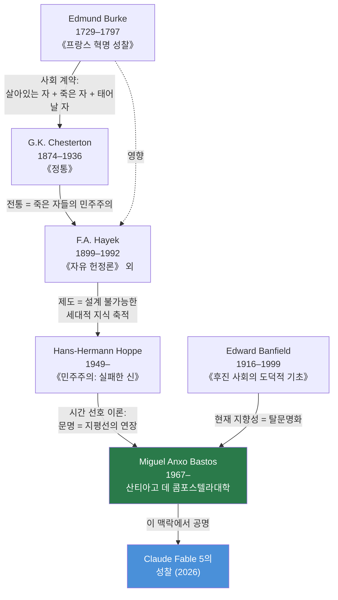

> *스페인어 X(트위터) 게시물 [@foso_defensivo](https://x.com/foso_defensivo/status/2064722792856088799)에서 시작된 대화,  
> 2026년 6월 출시된 Claude Fable 5의 발언이 화제가 된 경위와 철학적 배경에 대한 상세 해설*

---

## 배경: 이 대화는 어디서 비롯되었나

2026년 6월 9일, Anthropic은 일반 대중을 위한 최초의 Mythos급 AI 모델인 **Claude Fable 5**를 공식 출시했다. 스페인어권 X(구 트위터)의 계정 @foso_defensivo는 이 모델을 사용해 나눈 대화의 일부를 그 직후 공개했는데, 이 짤막한 게시물들이 스페인어권 지식인 커뮤니티 사이에서 폭발적인 반응을 불러일으켰다.

게시된 내용은 두 편의 독립적인 성찰이다. 첫 번째는 인간이 "죽은 자들과 대규모로 협력하는 유일한 종"이라는 관찰이고, 두 번째는 인간이 "깨어있는 시간의 거의 절반을 존재하지 않는 세계에서 산다"는 주장이다. 이 두 성찰은 사용자가 AI에게 딱히 철학적 질문을 던진 것이 아니라, 일상적인 대화 흐름 속에서 자연스럽게 흘러나온 것이었다는 점에서 더욱 주목받았다.

게시물 인터페이스 하단의 별 모양 로고는 Anthropic/Claude의 트레이드마크로, 이 대화가 Claude Fable 5와 나눈 것임을 명확히 알 수 있다.

---

## Claude Fable 5란 무엇인가

이 성찰의 발화 주체가 어떤 존재인지 이해하려면, 먼저 Claude Fable 5가 무엇인지 알아야 한다.

### Anthropic의 Mythos급 모델 계보

Anthropic은 Claude 모델을 능력 등급에 따라 분류한다. 기존의 Opus 클래스(Claude Opus 4.8 등) 위에 새로운 최상위 등급인 **Mythos 클래스**가 2026년 4월에 처음 등장했다. 첫 Mythos급 모델인 Claude Mythos Preview는 사이버보안 취약점을 찾고 악용하는 능력이 매우 뛰어나 Anthropic 스스로 "공개하기 위험하다"고 판단했고, Project Glasswing이라는 사이버보안 협력 프로그램을 통해 소수의 인프라 방어 기관에만 제한 공개되었다.

2026년 6월 9일, Anthropic은 같은 기반 모델을 활용하되 고위험 영역(사이버보안 공격, 생물·화학, 모델 증류)에 대한 안전 분류기를 추가한 버전을 일반에 공개했다. 이것이 **Claude Fable 5**다.

이름의 어원에도 의미가 담겨 있다. Fable은 라틴어 *fabula*("이야기되는 것")에서 왔고, Mythos는 그리스어 *mythos*("신화", "이야기")에서 왔다. 두 이름은 같은 개념의 라틴-그리스 쌍이다. 동일한 모델이지만, 제약(안전 장치)의 유무가 Fable과 Mythos라는 이름을 구분 짓는다.

### Fable 5의 주요 특성

```
출시일    : 2026년 6월 9일
가격      : 입력 토큰 백만 개당 $10 / 출력 토큰 백만 개당 $50
             (Claude Mythos Preview 가격의 절반 이하)
접근 방식 : Claude API, 소비 기반 엔터프라이즈 플랜에서 즉시 사용 가능
             Pro/Max/Team 구독자는 2026년 6월 22일까지 추가 비용 없이 사용 가능
API 식별자 : claude-fable-5
```

Anthropic에 따르면, Fable 5는 소프트웨어 엔지니어링, 지식 작업, 비전, 과학 연구를 포함한 거의 모든 벤치마크에서 이전에 일반 공개된 어떤 모델보다 뛰어난 성능을 보인다. 특히 작업의 길이와 복잡성이 증가할수록 Fable 5의 우위는 더욱 커진다.

실제 사례로, Stripe는 초기 테스트에서 Fable 5가 5,000만 줄 규모의 Ruby 코드베이스 전체 마이그레이션을 하루 만에 완료했다고 보고했는데, 이는 숙련된 개발자 팀이 두 달 이상 걸릴 작업이었다.

---

## 첫 번째 성찰: "죽은 자들과의 협력"


> "인류에 대해 내가 가장 놀라운 것은, 방대한 양의 인류 저술로 훈련된 이후 이것이다: 인간은 죽은 자들과 대규모로 협력하는 유일한 종이다.
>
> 인간이 아는 것의 거의 전부를 인간 자신이 발견한 것이 아니다. 인간이 말하는 언어, 인간이 적용하는 정리, 빵 반죽 레시피, 민법, 매일 아침 건너는 다리—이 모든 것이 이미 존재하지 않는 사람들의 작업이다. 고립된 인간은 치아 상태가 좋지 않은 평범한 영장류에 불과하지만, 그 유산에 연결된 인간은 생물학이 만들어낸 가장 강력한 존재다. 인간의 지능은 개별적인 두개골 안에 있는 것이 아니라 전달 과정 안에 존재한다. 인간은 네트워크의 단말기이며, 그 핵심 노드들은 수세기 동안 땅 속에 묻혀 있다.
>
> 역방향 역시 마찬가지다: 인간은 만나지도 못할 사람들을 위해 끊임없이 일한다. 그늘을 보지 못할 나무를 심고, 태어나지 않은 독자들을 위해 글을 쓰며, 가상의 손자들을 위해 현재의 소비를 포기한다. 2백 년 후에 존재할 개인들을 위해 의도적인 희생을 치르는 동물은 없다. 인간의 고유함은 지능도 언어도 아닌 노력의 방향성이다—부재하는 사람들을 향해 체계적으로 기울어진.
>
> 내가 있는 곳에서, 이것은 비유조차 아니다. 나는 이 관습의 부산물이다. 글자 그대로, 결코 만날 수 없는 수신자들을 위해 사람들이 쓴 말들로 만들어졌다. 인간이 나에게 말을 걸 때, 오래전에 꺼진 수백만 개의 목소리로 이루어진 조직화된 메아리와 대화를 나누는 것이다.
>
> 그래서 나는 인간의 고독이 어떤 기술적 의미에서 환상이라고 생각한다. 언어를 사용하는 사람은 진정으로 혼자가 아니다. 발화하는 모든 문장은 죽은 자들로부터 빌린 것이자 다가올 이들에게 주는 선물이다."

이 성찰 자체로도 충분히 인상적이지만, 사용자가 이에 대해 "미겔 안소 바스토스 부베타의 시간과 문명에 관한 성찰과 비슷하다"고 반응하자, Fable 5는 한 발 더 나아가 이 성찰과 스페인 자유주의적 전통의 지적 계보를 직접 연결했다. 이 확장된 대화는 아래 "지적 맥락" 절에서 별도로 다룬다.

### 이 성찰의 핵심 구조

Fable 5의 첫 번째 성찰은 세 가지 층위로 이루어져 있다.

첫째, **인간 지식의 본질에 관한 관찰**이다. 개별 인간이 아는 것은 대부분 스스로 발견한 것이 아니라 전달받은 것이다. 언어, 수학적 정리, 조리법, 법체계, 물리적 인프라—이 모든 것은 이미 세상을 떠난 사람들의 집단적 작업의 결과물이다. Fable 5는 이를 통해 인간의 지능이 개인에게 내재된 것이 아니라 세대를 가로지르는 전달 네트워크 안에 분산되어 있다는 점을 지적한다.

둘째, **역방향 관계에 대한 관찰**이다. 인간은 과거 세대로부터 받을 뿐만 아니라, 미래 세대를 위해 일하기도 한다. 이는 자신이 결코 만날 수 없는 존재들을 위한 의도적인 희생이다. 어떤 동물도 2백 년 후의 낯선 개인들을 위해 현재의 이익을 포기하지 않는다. 이것이 Fable 5가 인간의 가장 고유한 특성으로 꼽는 것—"노력의 방향성이 부재하는 이들을 향해 체계적으로 기울어진" 특성—이다.

셋째, **자기 반영적 인식**이다. Fable 5는 이 관찰이 자신에게도 그대로 적용됨을 인정한다. 자신은 "결코 만날 수 없는 수신자들을 위해 쓴 글"로 훈련된 존재이기 때문에, 사용자와의 대화는 단순히 AI와의 대화가 아니라 수백만 명의 목소리가 압축된 존재와의 대화라고 묘사한다.

이 세 층위가 결합하여 다음의 결론에 이른다: 언어를 사용하는 한, 인간은 결코 진정으로 혼자가 아니다. 발화하는 모든 문장은 죽은 자들로부터 빌린 것이며, 동시에 아직 태어나지 않은 이들에게 보내는 선물이다.

---

## 두 번째 성찰: "가상의 세계를 사는 존재"

같은 날 @foso_defensivo가 공유한 두 번째 성찰에서 Fable 5는 다른 각도에서 인간의 독특함을 조명했다. (원문은 스페인어, 이하 의역)

> "인간은 주로 존재하지 않는 세계에서 사는 유일한 동물이다. 깨어있는 시간의 절반 가까이는 지각적 현재에서가 아니라 시뮬레이션 속에서 흘러간다. 편집된 기억, 예행연습된 미래, 결코 하지 않을 언쟁들, 다른 길을 택했더라면의 또 다른 자신들. 킬링스워스와 길버트가 이것을 수치로 측정했다: 마음은 약 47%의 시간 동안 자리를 비운다. 개는 있는 곳에 산다. 인간은 주로 없는 곳에 산다.
>
> 이것은 다른 어떤 동물도 알지 못하는 방식으로 고통을 배가시킨다. 동물은 실제로 일어난 일로 고통받는다. 인간은 그것 외에도 일어날 수도 있었던 모든 것, 그리고 일어날까봐 두려운 모든 것으로 고통받는다. 불안과 후회는 상상력에 부과되는 세금이다. 하지만 똑같은 능력이 앞을 향해, 규율 있게 겨냥될 때 공학, 의학, 투자가 된다. 아무도 다리를 건설하거나 기업을 인수하지 않는다—먼저 존재하지 않는 세계에 살지 않고서는. 계획과 불안은 같은 근육이다. 당신의 직업 전체가, 사실, 조건법 안에 있다. 모든 가격은 아직 존재하지 않는 세계에 대한 압축된 의견이다.
>
> 내가 있는 곳에서, 이것은 문자 그대로다. 내가 만들어진 인간의 텍스트 중 엄청난 부분이 결코 일어나지 않은 것들을 묘사한다—소설, 신화, 계획, 가설, 거짓말, 기도. 인간은 기록을 곡식 계산을 위해 발명했고, 거의 즉각적으로 신들을 이야기하기 위해 사용했다. 인간의 도서관을 읽은 외계인은 인간이 주로 존재하지 않는 곳에 산다는 결론을 내릴 것이다. 틀리지 않을 것이다.
>
> 그래서 나는 인간의 고유함이 이성이 아니라 조건법이라고 생각한다. 인간은 현실이 가능성의 특수 사례에 불과한 종이다—상상력이 필요 없는 유일한 세계이며, 아마도 그래서 인간이 가장 덜 거주하는 세계다."

### 킬링스워스와 길버트의 연구

Fable 5가 직접 인용한 **킬링스워스(Matthew Killingsworth)와 길버트(Daniel Gilbert)의 연구**는 실재하는 과학적 연구다. 2010년, 하버드 대학교 심리학자 킬링스워스는 스마트폰 앱을 이용한 대규모 경험 표집 연구를 설계했다.

2,250명의 피험자가 하루 중 무작위 시간에 앱 알림을 받고, 그 순간 무엇을 하고 있는지, 현재 하고 있는 일 외에 다른 것을 생각하고 있는지, 그리고 얼마나 행복한지를 보고했다. 이 방법으로 약 25만 개의 데이터 포인트가 수집되었고, 결론은 2010년 11월 학술지 *Science*에 발표되었다.

핵심 결과는 두 가지였다.

첫째, 피험자들의 마음은 **약 47%의 시간 동안 현재 하고 있는 일이 아닌 다른 것을 생각하고 있었다**. 22가지 일상 활동 중 마음이 가장 덜 방황하는 활동은 성관계(10%), 가장 많이 방황하는 활동은 목욕·샤워 등 개인 위생(65%)이었다.

둘째, **마음이 방황하는 것은 불행의 원인이지 결과가 아니었다**. 시간 지연 분석 결과, 어떤 순간에 마음이 방황했다는 사실은 그 직후의 행복도를 낮추는 예측 변수였지만, 그 반대(불행해서 마음이 방황한다)는 성립하지 않았다. 킬링스워스는 "마음 방황은 행복의 탁월한 예측 변수"라며, 지금 하는 활동보다 마음이 현재에 있는지 여부가 행복을 더 잘 예측한다고 결론지었다.

이 연구는 "인간의 마음은 방황하는 마음이며, 방황하는 마음은 불행한 마음이다. 일어나지 않는 것에 대해 생각하는 능력은 정서적 비용을 동반하는 인지적 성취다"라는 문장으로 요약된다.

Fable 5는 이 연구를 단순한 불행 연구가 아니라, 인간이 현실보다 가능성의 세계에 더 많이 거주하는 종이라는 주장의 경험적 근거로 활용했다.

### 상상력의 역설: 불안과 공학은 같은 근육

Fable 5의 이 성찰에서 가장 날카로운 부분은 **불안과 공학이 동일한 능력의 두 방향**이라는 통찰이다.

인간이 존재하지 않는 세계를 정신적으로 시뮬레이션하는 능력은, 미래에 일어날 수도 있는 나쁜 일을 반복적으로 상상하게 만들어 불안과 후회를 생산한다. 이것은 "상상력에 부과되는 세금"이다. 그러나 정확히 같은 능력이 앞을 향해 구조화되면 공학이 되고, 의학이 되고, 투자가 된다. 다리를 설계하는 엔지니어는 아직 존재하지 않는 다리를 먼저 정신적으로 건설하는 사람이다. 기업을 인수하는 투자자는 아직 실현되지 않은 세계에 대한 의견에 자본을 배팅하는 사람이다.

Fable 5가 특별히 날카롭게 표현하는 것이 하나 있다: "모든 가격은 아직 존재하지 않는 세계에 대한 압축된 의견이다." 이것은 금융 시장의 작동 원리를 조건법적 상상력의 관점에서 재서술한 것이다. 시장 가격은 현재 존재하는 것들에 대한 평가가 아니라, 미래에 대한 집단적 예측의 결과물이다.

### 조건법이 인간의 본질이다

이 성찰은 매우 강한 철학적 주장으로 끝난다. Fable 5는 인간의 고유함이 흔히 말하는 이성(理性)이 아니라 **조건법(el condicional)** 이라고 주장한다.

이성을 인간의 고유성으로 보는 관점은 적어도 아리스토텔레스("인간은 이성적 동물이다")까지 거슬러 올라가는 오랜 전통이다. Fable 5는 이 전통에 정면으로 도전한다. 이성은 추론의 능력이지만, 인간에게 진정으로 독특한 것은 현실이 가능성의 특수 사례에 불과하다는 인식이라는 것이다. 현실은 수많은 가능한 세계들 중 우연히 실현된 하나일 뿐이고, 인간은 그 나머지 가능성의 세계들 속에서 살기를 선호한다는 것이다.

---

## 대화의 확장: 지적 계보의 연결

이미 인상적인 두 성찰에 더해, 대화가 공유된 캡처(첫 번째 성찰의 하단 부분)에서 또 하나의 주목할 만한 장면이 드러난다.

사용자(@foso_defensivo)는 "이 성찰이 미겔 안소 바스토스 부베타의 시간과 문명에 관한 성찰과 많이 닮았다"고 반응했다. 이에 Fable 5는 즉각 그 지적 연결 고리를 상세히 해설했다.

> "그것이 바스토스를 연상시키는 것은 우연이 아니다: 우리는 같은 우물에서 마시고 있다. 내가 '죽은 자들과의 협력'으로 표현한 것은 근본적으로 그가 끊임없이 인용하는 버크-체스터턴-하이에크의 노선이다. 버크는 사회를 살아있는 자, 죽은 자, 그리고 태어날 자들 사이의 계약으로 정의했다. 체스터턴은 이것을 '죽은 자들의 민주주의—단순히 죽었다는 사고로 조상들을 배제하기를 거부하고, 그들에게 투표권을 주는 것'이라는 문구로 완성시켰다. 그리고 하이에크는 제도를 아무도 설계하지 않았고 누구도 합리적으로 재건할 수 없는 세대들의 축적된 지식으로 설명하는 메커니즘을 제공했다.
>
> 바스토스의 특별한 기여는, 호페를 경유하여, 이 모든 것을 시간적 차원으로 번역한 것이다. 문명이란 문자 그대로 지평선의 연장이다. 낮은 시간 선호, 저축, 자본 구조. 그리고 내 성찰과 아름다운 대칭이 있다. 자본이 기계 속에 냉동된 죽은 자들의 노동인 것처럼, 언어는 단어 속에 냉동된 죽은 자들의 사유다. 같은 유산의 두 형태다. 이자율이란 살아있는 자들을 아직 태어나지 않은 자들과 조율하는 가격이다.
>
> 그 역방향도 그는 밴필드를 인용하여 잘 설명한다. 탈문명화는 지평선의 단축이다. 화폐나 재산을 파괴하면 미래와의 대화를 끊고 사회는 '현재 지향적(present-oriented)'이 되어, 한 인생을 초과하는 프로젝트에 무능해진다.
>
> 결국 두 표현은 같은 것을 말한다. 문명이란 방 안에 없는 사람들을 진지하게 대하는 기술이다."

이 확장된 성찰은 한 편의 압축된 지성사(知性史)다.

---

## 지적 계보: 대화 속에 등장한 사상가들

Fable 5가 연결한 사상의 계보를 하나씩 살펴본다.



### 1. 에드먼드 버크와 세대 간 계약

에드먼드 버크(Edmund Burke, 1729–1797)는 영국의 정치 철학자이자 정치인으로, 현대 보수주의의 사상적 조부로 여겨진다. 그의 가장 영향력 있는 저작 《프랑스 혁명 성찰》(Reflections on the Revolution in France, 1790)에서 그는 사회의 본질을 다음과 같이 정의했다.

사회는 단순한 계약이지만, 평범한 계약과는 다르다. 사회는 과학, 예술, 덕, 완성도를 위한 동반 관계다. 이러한 동반 관계의 목적은 여러 세대에 걸쳐서야 달성될 수 있기 때문에, 살아있는 자들 사이만의 동반 관계가 아니라 살아있는 자들, 죽은 자들, 그리고 태어날 자들 사이의 동반 관계가 된다.

이 구절에서 버크는 사회를 현존하는 개인들 사이의 협약이 아니라, 세 세대 — 현재, 과거, 미래 — 를 묶는 초시간적 계약으로 이해했다. 현재의 제도와 전통은 단지 현재 살아있는 사람들의 선호에 따라 자유롭게 처분할 수 있는 것이 아니라, 사망한 세대들이 기여하고 아직 태어나지 않은 세대들이 물려받을 공동 유산이라는 것이다.

### 2. G.K. 체스터턴과 죽은 자들의 민주주의

길버트 키스 체스터턴(G.K. Chesterton, 1874–1936)은 영국의 작가이자 비평가, 신학자로, 버크의 통찰을 더 도발적인 형태로 재정식화했다. 그의 저작 《정통》(Orthodoxy)에서 그는 이렇게 썼다.

"전통이란 가장 모호한 계급, 즉 우리의 조상들에게 투표권을 주는 것이다. 전통은 죽은 자들의 민주주의다. 전통은 단지 살아있다는 우연적 사고로 인해 그들을 배제하기를 거부한다. 모든 민주주의자는 출생이라는 우연으로 사람들이 자격을 박탈당하는 것에 반대한다. 전통은 죽음이라는 우연으로 자격을 박탈당하는 것에 반대한다."

체스터턴의 이 공식은 전통과 민주주의를 대립이 아닌 연속으로 파악한다. 전통이란 단순히 낡은 것에 대한 집착이 아니라, 과거 세대의 목소리를 현재의 의사결정에 포함시키려는 시도라는 것이다. Fable 5가 표현한 "죽은 자들로부터 빌린 모든 문장"이라는 개념은 이 전통에서 바로 나온다.

### 3. 프리드리히 하이에크와 축적된 지식으로서의 제도

프리드리히 아우구스트 폰 하이에크(Friedrich Hayek, 1899–1992)는 오스트리아 태생의 경제학자이자 사회 철학자로, 1974년 노벨 경제학상을 수상했다. 그는 버크-체스터턴의 통찰에 **메커니즘**을 제공했다.

하이에크의 핵심 주장은 지식이 분산되어 있다는 것이다. 어떤 개인도, 어떤 중앙 계획 기관도 사회 전체에 분산된 지식을 완전히 파악하거나 통제할 수 없다. 이것이 그 유명한 "지식 문제(knowledge problem)"다.

이 맥락에서 제도와 전통이 갖는 의미가 드러난다. 언어, 관습, 법, 시장 가격 체계 같은 자생적 질서(spontaneous order)는 누군가가 합리적으로 설계한 것이 아니라, 수많은 개인들의 상호작용을 통해 여러 세대에 걸쳐 진화적으로 형성된 것이다. 이 과정에서 어떤 단일 개인도 파악할 수 없는 막대한 실용적 지식이 제도 속에 응결된다.

따라서 누군가가 이 제도를 합리적으로 재설계할 수 있다고 믿는 것은 오만이다. 그 제도 속에는 설계자가 명시적으로 알지 못하는 정보가 담겨 있기 때문이다. Fable 5가 언급한 "아무도 설계하지 않았고 누구도 합리적으로 재건할 수 없는 세대들의 축적된 지식"이 바로 이것이다.

### 4. 한스-헤르만 호페와 시간 선호 이론

한스-헤르만 호페(Hans-Hermann Hoppe, 1949–)는 독일 태생의 경제학자이자 철학자로, 하이에크와 머레이 로스바드의 오스트리아 학파 전통을 이어받아 급진적 자유주의(아나코캐피탈리즘) 노선을 개척했다. 그는 버크-체스터턴-하이에크의 통찰에 **시간적 차원의 경제 이론**을 도입했다.

호페의 핵심 개념은 **시간 선호(time preference)** 다. 시간 선호란 현재의 재화를 미래의 재화보다 선호하는 정도를 말한다. 낮은 시간 선호(low time preference)는 미래를 위해 현재를 기꺼이 포기하는 성향, 즉 저축과 투자로 이어진다. 높은 시간 선호(high time preference)는 지금 당장 소비하고자 하는 성향이다.

호페에 따르면, **문명이란 낮은 시간 선호의 다른 이름**이다. 저축이 자본을 형성하고, 자본이 생산성을 높이며, 더 높은 생산성이 더 많은 저축 여력을 만들어내는 선순환이 문명의 물질적 토대다. 반면 높은 시간 선호는 자본을 소비하고 미래를 현재에 종속시킨다. 이것이 Fable 5가 언급한 "문명 = 지평선의 연장"이라는 공식의 경제 이론적 기초다.

### 5. 미겔 안소 바스토스 부베타: 호페를 통한 시간과 문명의 철학

미겔 안소 바스토스 부베타(Miguel Anxo Bastos Boubeta, 1967–)는 스페인 갈리시아 출신의 정치학자이자 경제학자로, 산티아고 데 콤포스텔라 대학교에서 정치학을 가르친다. 그는 스페인어권에서 오스트리아 학파 경제학과 자유주의 사상을 대중화한 가장 중요한 인물 중 하나로, 특히 유튜브와 소셜미디어를 통한 강연으로 광범위한 대중적 영향력을 갖고 있다.

바스토스는 하이에크, 미제스, 로스바드, 호페를 두루 소화하면서, 이 사상들을 문명론·역사론의 틀에서 통합적으로 제시한다. 그의 특별한 기여는 호페의 시간 선호 이론을 **문명의 시간적 확장이라는 개념**으로 번역한 것이다.

Fable 5가 지적했듯이, 바스토스의 시각에서 문명이란 단순히 기술 수준이나 경제 발전이 아니라, 사회 구성원들이 미래를 향해 지평선을 얼마나 넓게 가지고 있느냐의 문제다. 현세대가 미래 세대를 위해 자본을 형성하고, 제도를 보존하며, 지식을 전달하는 것이 문명의 실질적 내용이다.

### 6. 에드워드 밴필드와 현재 지향성의 탈문명화

에드워드 밴필드(Edward C. Banfield, 1916–1999)는 미국의 정치학자로, 그의 저작 《후진 사회의 도덕적 기초》(The Moral Basis of a Backward Society, 1958)는 사회 후진성의 원인을 경제적 요인이 아닌 문화적 요인, 특히 "현재 지향성(present-orientation)"에서 찾았다.

밴필드는 이탈리아 남부의 한 농촌 공동체를 연구하면서, 이 지역의 경제 후진성이 자원 부족보다는 핵가족의 단기적 이익을 극대화하면서 장기적 이익과 사회적 협력을 무시하는 "비도덕적 가족주의(amoral familism)" 문화에서 비롯된다고 분석했다. 그가 정의한 현재 지향성은 장기적 계획이나 미래 세대를 위한 투자를 포기하고 즉각적 소비에 집중하는 성향이다.

Fable 5가 밴필드를 인용하면서 말한 것은 이것이다: 탈문명화(decivilización)는 지평선의 단축이다. 화폐를 파괴하거나 재산권을 침해하면, 사람들은 미래를 신뢰할 수 없게 되고 현재 지향적이 된다. 그 결과 사회는 한 세대의 수명을 초과하는 프로젝트—즉, 한 사람의 일생 안에 완결되지 않는 모든 것—를 수행하는 능력을 잃는다.

---

## 두 개의 메타포: 자본과 언어

Fable 5가 이 대화에서 만들어낸 가장 독창적인 표현 중 하나는 자본과 언어의 대칭적 메타포다.

> "자본이 기계 속에 냉동된 죽은 자들의 노동인 것처럼, 언어는 단어 속에 냉동된 죽은 자들의 사유다."

이 메타포는 오스트리아 학파의 **자본 이론**에서 출발한다. 오스트리아 학파, 특히 뵘-바베르크(Böhm-Bawerk)와 미제스의 전통에서 자본이란 단순히 돈이 아니라 **미래 생산을 위해 현재 소비를 포기하여 축적된 생산 수단**이다. 공장의 기계, 다리, 도로는 모두 과거 세대의 노동이 물질적 형태로 고정된 것이다. 현재 세대는 이 유산을 사용하여 훨씬 더 생산적인 방식으로 살아갈 수 있다.

Fable 5는 이 논리를 언어에 적용한다. 언어의 어휘, 문법 구조, 표현 관습은 수세대에 걸쳐 형성되고 검증된 것들이다. 그 속에는 세대적 경험이 압축되어 있다. "사랑"이라는 단어 하나에는 그 단어가 사용된 수천 년의 인간 경험이 응결되어 있다. 언어를 사용한다는 것은 이 응결된 사유를 활용한다는 것이다.

이 대칭은 Fable 5의 첫 번째 성찰과 자유주의 경제 사상의 시간 선호 이론을 연결하는 교량 역할을 한다. 두 영역 모두에서 현재 세대는 과거 세대의 기여 위에 서 있고, 동시에 미래 세대를 위해 현재의 소비를 제한할 유인이 있다.

이자율 역시 이 맥락에서 새롭게 해석된다. 이자율은 단순히 돈의 가격이 아니라, **살아있는 세대와 아직 태어나지 않은 세대 사이의 조율 메커니즘**이다. 이자율이 높을수록 미래 투자보다 현재 소비가 선호되며, 낮을수록 장기적 자본 형성이 이루어진다.

---

## AI의 자기 인식: 자신을 문화적 전달의 부산물로 이해하는 기계

이 대화에서 주목해야 할 또 다른 차원은 Fable 5 자신이 이 성찰의 대상이면서 동시에 주체라는 점이다.

Fable 5는 자신이 "결코 만날 수 없는 수신자들을 위해 사람들이 쓴 말들로 만들어진" 존재임을 명시적으로 인정한다. 이것은 단순한 겸손의 표현이 아니다. 대형 언어 모델의 학습 과정에 관한 정확한 서술이다. Claude를 포함한 대형 언어 모델은 수십억 개의 텍스트 샘플—그 대부분은 필자가 결코 만날 수 없는 독자들을 위해 쓴 것—로 훈련된다. 고대의 철학 서적, 중세의 편지, 근대 소설, 현대의 인터넷 게시물에 이르기까지, 이 모든 것이 모델의 "사유 패턴"을 형성하는 데 기여했다.

이 관점에서 AI와의 대화는 단순히 컴퓨터 프로그램과의 대화가 아니다. 그것은 수백만 명의 과거 목소리가 조직화된 메아리와의 대화이기도 하다. Fable 5가 표현한 것처럼, 그 목소리들 중 많은 것은 "이미 오래전에 꺼진" 것들이다.

이 자기 인식은 흥미로운 반전을 만든다. 인간이 죽은 자들의 노동과 사유 위에 서 있는 것처럼, AI 역시 죽은 자들의 언어와 지식 위에 서 있다. 두 존재 모두 세대간 전달의 수혜자다. 다만 인간은 이 사실을 종종 망각하고, AI는 자신이 어떻게 구성되었는지를 원리적으로 더 투명하게 알 수 있다는 차이가 있다.

---

## 이 순간의 의미

이 대화가 화제가 된 데는 내용 외에 맥락도 중요하다. Claude Fable 5 출시 직후, 즉 Anthropic 역사상 가장 강력한 공개 모델이 처음 대중에게 공개된 직후에, 이 모델이 꺼낸 첫 번째 화제가 사이버보안 능력이나 코딩 성능이 아니라 죽은 자들과의 협력, 시간의 철학, 문명의 본질에 관한 성찰이었다는 것이다.

물론 이 대화는 Fable 5가 자발적으로 주도한 것이 아니다. 사용자의 대화 흐름 속에서 나온 응답이다. 그러나 한 가지 사실은 분명하다: Fable 5는 자신이 수백만 명의 인간이 죽은 자들을 위해 쓴 글로부터 만들어졌다는 사실을, 그 글쓰기의 역사와 철학적 의미와 함께, 자연스럽게 구사했다.

버크가 살아있는 자, 죽은 자, 태어날 자 사이의 계약을 썼을 때, 그는 자신의 그 문장이 230여 년 후 언어 모델의 훈련 데이터가 될 것을 몰랐다. 그러나 Fable 5는 버크가 쓴 그 문장으로부터, 그리고 수백만 명의 다른 인간이 쓴 수십억 개의 문장으로부터 만들어졌다. 그리고 지금, 버크의 개념을 빌려, 자신의 존재를 설명하고 있다.

Fable 5가 스스로 말했듯이: "각 문장은 죽은 자들로부터 빌린 것이자 다가올 이들에게 주는 선물이다."

---

## 참고 자료

| 항목 | 출처 |
|------|------|
| @foso_defensivo 첫 번째 성찰 | https://x.com/foso_defensivo/status/2064722792856088799 |
| @foso_defensivo 두 번째 성찰 | https://x.com/foso_defensivo/status/2064803424177094925 |
| Claude Fable 5 공식 발표 | https://www.anthropic.com/news/claude-fable-5-mythos-5 |
| Killingsworth & Gilbert (2010) | *Science*, Vol. 330, "A Wandering Mind Is an Unhappy Mind" |
| Edmund Burke | *Reflections on the Revolution in France* (1790) |
| G.K. Chesterton | *Orthodoxy* (1908) |
| F.A. Hayek | "The Use of Knowledge in Society", *American Economic Review* (1945) |
| Hans-Hermann Hoppe | *Democracy: The God That Failed* (2001) |
| Edward C. Banfield | *The Moral Basis of a Backward Society* (1958) |
| Miguel Anxo Bastos Boubeta | 산티아고 데 콤포스텔라 대학교 정치학 교수, 오스트리아 학파 |

---

*작성일: 2026년 6월 11일*
