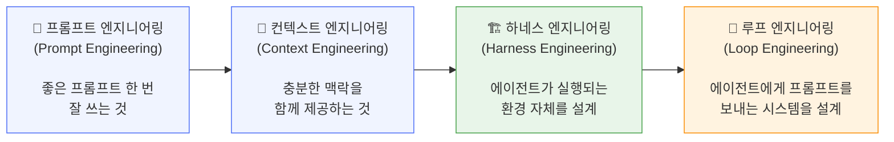
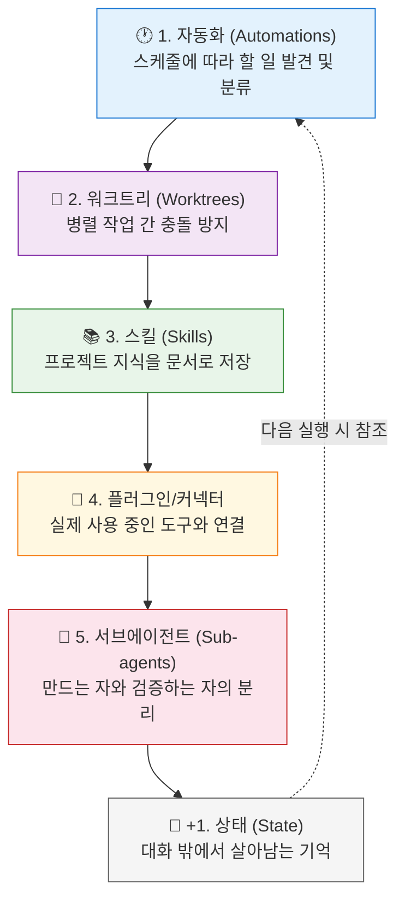
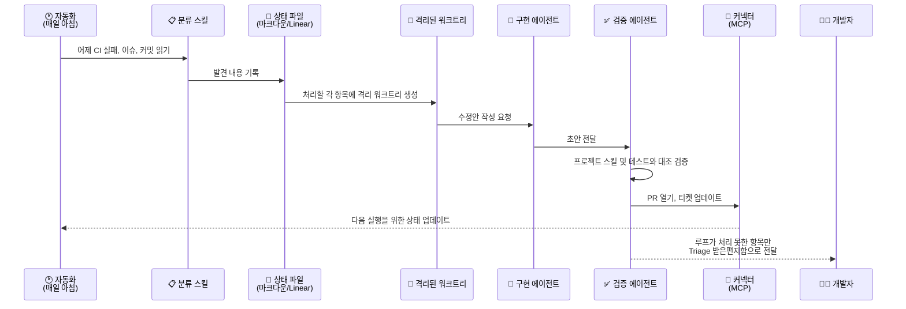
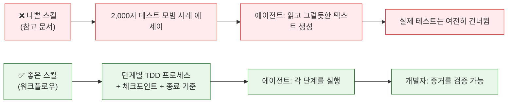
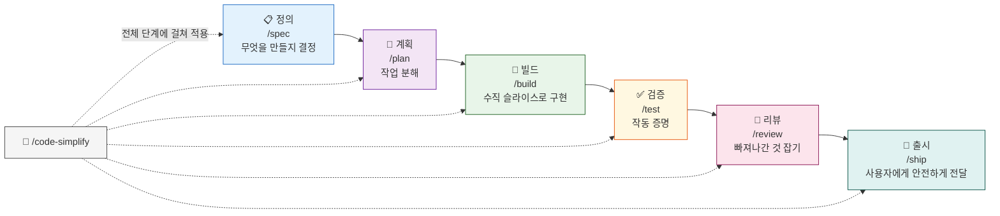
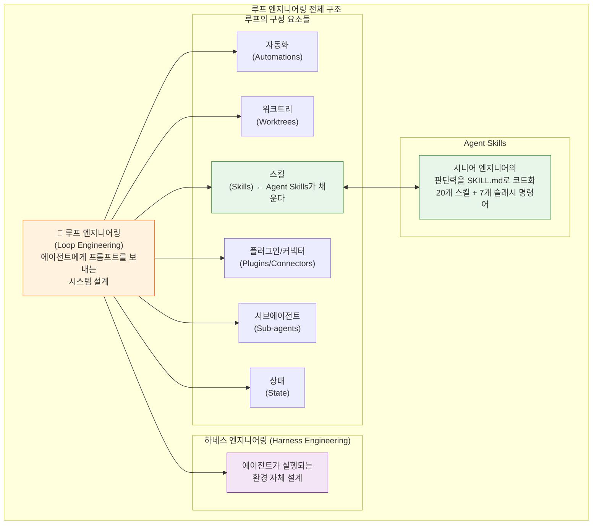

## AI 코딩 에이전트의 미래: 프롬프트에서 루프 설계로

> **출처**: Addy Osmani (Google 엔지니어)의 "Loop Engineering" (2026년 6월 8일) 및 "Agent Skills" (2026년 5월 3일)  
> **작성일**: 2026년 6월 11일  
> **핵심 인물**: Addy Osmani (Google), Peter Steinberger (@steipete), Boris Cherny (Anthropic Claude Code 총괄)

---

## 목차

1. [서론: 하나의 트윗이 불붙인 논쟁](#1-서론-하나의-트윗이-불붙인-논쟁)
2. [Loop Engineering이란 무엇인가](#2-loop-engineering이란-무엇인가)
3. [루프의 5가지 구성요소 + 상태(State)](#3-루프의-5가지-구성요소--상태state)
4. [Claude Code vs Codex: 두 도구의 비교](#4-claude-code-vs-codex-두-도구의-비교)
5. [실제 루프가 작동하는 방식](#5-실제-루프가-작동하는-방식)
6. [루프가 해결하지 못하는 문제들](#6-루프가-해결하지-못하는-문제들)
7. [Agent Skills: 시니어 엔지니어의 판단력을 코드화하다](#7-agent-skills-시니어-엔지니어의-판단력을-코드화하다)
8. ["스킬(Skill)"이란 정확히 무엇인가](#8-스킬skill이란-정확히-무엇인가)
9. [Agent Skills가 구현하는 SDLC 전체 주기](#9-agent-skills가-구현하는-sdlc-전체-주기)
10. [5가지 핵심 설계 원칙](#10-5가지-핵심-설계-원칙)
11. [Google 엔지니어링 철학과의 연결](#11-google-엔지니어링-철학과의-연결)
12. [Agent Skills 설치 및 활용 방법](#12-agent-skills-설치-및-활용-방법)
13. [Loop Engineering과 Agent Skills의 관계](#13-loop-engineering과-agent-skills의-관계)
14. [핵심 교훈 및 결론](#14-핵심-교훈-및-결론)

---

## 1. 서론: 하나의 트윗이 불붙인 논쟁

2026년 6월 7일 오전 11시 58분, PSP AG의 CEO이자 유명 iOS 개발자인 Peter Steinberger(@steipete)가 X(구 트위터)에 짧은 글을 올렸다. 조회수 120만 회를 기록한 이 글의 내용은 이렇다:

> **"Here's your monthly reminder that you shouldn't be prompting coding agents anymore. You should be designing loops that prompt your agents."**
> — [Peter Steinberger](https://x.com/steipete/status/2063697162748260627), 2026년 6월 7일

이 글은 803개의 댓글, 906개의 리트윗, 9,600개의 좋아요를 받으며 개발자 커뮤니티 전체에 파장을 일으켰다. 다음 날인 6월 8일, Google의 엔지니어 Addy Osmani는 이 개념을 체계적으로 정리한 긴 글 "Loop Engineering"을 발표했다. 여기에 더해, Anthropic에서 Claude Code를 총괄하는 Boris Cherny 역시 비슷한 말을 했다:

> **"I don't prompt Claude anymore. I have loops running that prompt Claude and figuring out what to do. My job is to write loops."**
> — [Boris Cherny](https://x.com/sairahul1/status/2064279904989147577), Anthropic Claude Code 총괄

이 세 사람의 발언은 같은 방향을 가리키고 있었다. AI 코딩 에이전트와 협업하는 방식이 근본적으로 변하고 있다는 것이다. 한 마디로 말하자면: **"당신이 직접 에이전트에게 프롬프트를 입력하는 시대는 끝나가고 있다. 이제는 에이전트에게 프롬프트를 보내는 시스템을 설계하는 시대다."**

---

## 2. Loop Engineering이란 무엇인가

Loop Engineering(루프 엔지니어링)을 한 문장으로 정의하면 다음과 같다.

> **루프 엔지니어링이란, 에이전트에게 직접 프롬프트를 입력하는 사람을 스스로 대체하는 것이다. 대신 그 일을 하는 시스템을 직접 설계한다.**

### 패러다임의 전환 과정

AI 코딩 에이전트가 처음 등장한 약 2년 전부터 지금까지의 흐름을 보면, 일하는 방식이 단계적으로 진화해 왔다.



**첫 번째 단계: 직접 프롬프트 입력 방식 (2년 전 ~ 현재)**

기존의 방식은 단순했다. 개발자가 에이전트에게 직접 무언가를 입력하고, 결과물을 읽고, 다시 다음 지시사항을 입력하는 형태였다. 에이전트는 도구였고, 개발자는 그 도구를 처음부터 끝까지 손에 쥐고 있었다. 턴(turn)이 하나씩 쌓이는 방식이다.

**두 번째 단계: 루프 엔지니어링 방식 (현재 ~ 미래)**

이제는 개발자가 시스템을 먼저 설계한다. 그 시스템이 할 일을 찾아내고, 에이전트에게 그 일을 넘겨주고, 결과를 점검하고, 무엇이 완료됐는지 기록하고, 다음에 할 일을 결정한다. 개발자가 직접 에이전트를 찌르는 대신, 그 역할을 시스템이 대신한다.

### "루프(Loop)"의 정확한 의미

여기서 말하는 "루프"는 단순히 반복을 의미하지 않는다. Addy Osmani는 루프를 **재귀적 목표(recursive goal)** 로 정의한다. 즉, 목적을 정의하면 AI가 그 목적이 달성될 때까지 스스로 반복한다는 개념이다. 비유하자면, 매일 아침 직접 우편함을 확인하러 가던 사람이, 이제는 우편이 도착하면 자동으로 분류하고 중요한 것만 알려주는 시스템을 만들어 놓은 것과 같다.

---

## 3. 루프의 5가지 구성요소 + 상태(State)

Addy Osmani는 루프가 작동하기 위해 필요한 구성요소를 5가지(+1)로 정리했다. 이 구성요소들은 Claude Code와 OpenAI Codex 앱 양쪽 모두에 이미 탑재되어 있다.



### 구성요소 1: 자동화 (Automations) — 루프의 심장박동

자동화는 루프를 진정한 루프로 만들어주는 핵심 요소다. 자동화가 없다면 그것은 그냥 한 번 실행한 명령에 불과하다.

자동화란 스케줄에 따라 스스로 작동하면서 할 일을 발견하고 분류하는 기능이다. 예를 들어 매일 아침 8시에 자동으로 실행되어 어제 실패한 CI 테스트, 열려 있는 이슈들, 최근 커밋 내용을 읽고, 오늘 해야 할 일 목록을 정리해 놓는다.

**Codex 앱**에서는 Automations 탭에서 이를 설정한다. 프로젝트, 실행할 프롬프트, 실행 빈도, 로컬 체크아웃에서 실행할지 백그라운드 워크트리에서 실행할지를 지정한다. 무언가를 발견한 실행 결과는 Triage 받은편지함으로 모이고, 아무것도 발견하지 못한 결과는 자동으로 아카이브된다.

**Claude Code**에서는 `/loop` 명령어로 일정 주기마다 프롬프트나 명령을 반복 실행하거나, cron 작업을 스케줄링하거나, 에이전트 생명주기의 특정 시점에 셸 명령을 실행하는 훅(hooks)을 사용한다. 노트북을 닫은 후에도 계속 실행시키고 싶다면 GitHub Actions로 넘길 수 있다.

특히 중요한 원시 명령어가 두 가지 있다. `/loop`는 일정 주기로 반복 실행하는 것이고, `/goal`은 내가 작성한 조건이 실제로 충족될 때까지 계속 작동하는 것이다. `/goal`의 핵심은 매 턴이 끝날 때마다 **별도의 작은 모델**이 완료 여부를 판단한다는 것이다. 코드를 작성한 에이전트 자신이 완료 여부를 판단하지 않는다는 점이 중요하다. "auth 폴더의 모든 테스트가 통과하고 lint가 깨끗하다"와 같은 검증 가능한 종료 조건을 입력하면, 그 조건이 충족될 때까지 에이전트가 알아서 작동한다.

Codex에도 동일하게 `/goal` 명령어가 있으며, 일시정지·재개·취소 기능을 지원한다. 이름도 동일하고, 동작 방식도 동일하다.

### 구성요소 2: 워크트리 (Worktrees) — 병렬 작업의 충돌 방지

두 번째 에이전트를 실행하는 순간 파일 충돌이 발생한다. 이것이 바로 실패의 시작점이다. 두 에이전트가 동일한 파일에 동시에 쓰는 것은, 두 엔지니어가 서로 대화도 없이 같은 코드 줄에 커밋하는 것과 완전히 동일한 문제다.

git 워크트리(worktree)는 이 문제를 해결한다. 워크트리는 동일한 레포지토리 히스토리를 공유하면서도 각자 독립된 작업 디렉토리를 갖는 방식이다. 즉, 에이전트 A의 편집 내용이 에이전트 B의 체크아웃에 물리적으로 접근할 수 없다.

**Codex**는 워크트리 지원을 기본으로 탑재하여 여러 스레드가 동일한 레포지토리에서 동시에 작업해도 충돌이 발생하지 않도록 한다. **Claude Code**는 `git worktree` 명령, `--worktree` 플래그로 세션을 독립 체크아웃에서 열거나, 서브에이전트에 `isolation: worktree` 설정을 추가해 각 헬퍼가 작업 후 자동 정리되는 신선한 체크아웃을 갖게 한다.

단, 워크트리가 기계적 충돌은 제거해도 사람의 병목은 제거하지 못한다. 에이전트를 몇 개 병렬로 돌릴 수 있는지의 실질적 한계는 도구가 아니라 **개발자 자신의 코드 리뷰 속도**가 결정한다.

### 구성요소 3: 스킬 (Skills) — 매번 프로젝트를 다시 설명하지 않기 위해

스킬은 에이전트가 매 세션마다 처음부터 프로젝트 컨텍스트를 다시 파악하게 되는 문제를 해결한다. 스킬은 `SKILL.md` 파일이 들어 있는 폴더 형태로, 지시사항과 메타데이터, 그리고 선택적으로 스크립트, 참고 자료, 에셋을 포함한다.

Codex는 `$스킬명` 또는 `/skills` 명령으로 스킬을 호출하거나, 작업 내용이 스킬 설명과 일치할 때 자동으로 스킬을 실행한다. 그래서 스킬 설명은 창의적으로 쓰는 것보다 **구체적이고 단조롭게** 쓰는 것이 더 효과적이다.

스킬이 중요한 또 다른 이유는 의도(intent)의 빚(debt)을 막기 때문이다. AI 에이전트는 매 세션을 빈 상태에서 시작하며, 의도에 빈 구멍이 있으면 자신감 있게 추측으로 채운다. 스킬은 그 의도를 외부에 문서화해 놓은 것이다. 프로젝트의 관례, 빌드 단계, "우리가 이렇게 하지 않는 이유는 그 사건 때문이다"와 같은 내용을 한 번 작성해 두면, 에이전트가 매번 실행할 때마다 읽는다.

스킬 없이는 루프가 매 주기마다 프로젝트 전체를 처음부터 다시 파악한다. 스킬이 있으면 지식이 누적된다.

스킬과 플러그인의 관계도 명확히 해 두어야 한다. 스킬은 콘텐츠를 작성하는 형식이고, 플러그인은 그것을 배포하는 방법이다. 여러 레포에 걸쳐 스킬을 공유하거나 여러 스킬을 묶고 싶을 때 플러그인으로 패키징한다.

### 구성요소 4: 플러그인과 커넥터 — 루프가 실제 도구와 연결되는 방법

파일시스템만 볼 수 있는 루프는 작은 루프다. MCP(Model Context Protocol) 기반의 커넥터를 통해 에이전트는 이슈 트래커를 읽고, 데이터베이스를 쿼리하고, 스테이징 API를 호출하고, Slack에 메시지를 남길 수 있다.

Codex와 Claude Code는 모두 MCP를 지원하므로, 한 도구를 위해 작성한 커넥터가 다른 도구에서도 대부분 그대로 작동한다. 플러그인은 커넥터와 스킬을 묶어 팀원이 전체 설정을 한 번에 설치할 수 있게 해준다.

이것이 "수정 방법이 여기 있습니다"라고 말하는 에이전트와, PR을 직접 열고, Linear 티켓을 연결하고, CI가 통과하면 알아서 채널에 알림을 보내는 루프의 차이다. 커넥터가 있어야 루프는 실제 환경 안에서 행동할 수 있다.

### 구성요소 5: 서브에이전트 (Sub-agents) — 만드는 자와 검증하는 자의 분리

루프에서 구조적으로 가장 유용한 요소는 단연 **코드를 작성하는 에이전트와 그것을 검증하는 에이전트를 분리**하는 것이다. 코드를 작성한 모델이 자신의 숙제를 채점하는 것은 너무 관대하다. 다른 지시사항을, 때로는 다른 모델을 사용하는 두 번째 에이전트가 첫 번째 에이전트가 스스로를 설득해서 넘어간 부분을 잡아낸다.

**Codex**는 명시적으로 요청할 때 서브에이전트를 생성하고 동시에 실행한 뒤 결과를 하나의 답변으로 합친다. 각 에이전트를 `.codex/agents/` 폴더의 TOML 파일로 정의하며, 이름·설명·지시사항·모델·추론 수준을 설정할 수 있다. 예를 들어 보안 검토 에이전트는 강력한 모델에 높은 추론 수준으로, 탐색 에이전트는 빠른 읽기 전용 모델로 구성할 수 있다.

**Claude Code**는 `.claude/agents/` 디렉토리에 서브에이전트를 정의하고 에이전트 팀이 작업을 넘기는 방식으로 동작한다. 일반적인 분업 구조는 이렇다: 하나는 탐색하고, 하나는 구현하고, 하나는 스펙과 대조해 검증한다.

서브에이전트가 루프 내에서 특히 중요한 이유는, 루프는 개발자가 보지 않는 동안 실행되기 때문이다. 따라서 개발자가 실제로 신뢰할 수 있는 검증자가 있어야만 자리를 비울 수 있다. 서브에이전트는 추가적인 토큰을 소모하므로, 두 번째 의견이 실제로 가치 있는 곳에만 사용해야 한다. Claude Code의 `/goal`이 내부적으로 하는 일이 바로 이것이다. 작업을 완료했다는 결정을 작업을 수행한 모델이 아닌, 신선한 모델이 내린다.

### +1: 상태 (State) — 루프를 이어주는 척추

여섯 번째 요소는 마크다운 파일이든 Linear 보드든 상관없이, 단일 대화 밖에서 살아남아 무엇이 완료됐고 무엇이 다음인지를 기억하는 무언가다. 너무 단순해 보여서 중요하지 않을 것 같지만, 이것은 장기 실행 에이전트가 의존하는 동일한 트릭이다.

**에이전트는 실행 간에 모든 것을 잊는다. 하지만 레포지토리는 잊지 않는다.**

AGENTS.md, 진행 상태 파일, Linear 같은 외부 보드가 바로 이 역할을 한다. 상태 파일은 루프 전체의 척추가 된다. 무엇을 시도했는지, 무엇이 통과했는지, 무엇이 아직 열려 있는지를 기억하기 때문에 다음 날 아침 실행이 오늘 멈춘 곳에서 이어갈 수 있다.

---

## 4. Claude Code vs Codex: 두 도구의 비교

놀라운 점은 두 도구가 거의 동일한 구성요소를 독립적으로 발전시켰다는 것이다. 이름이 조금 다를 뿐, 기능은 같다.

| 구성요소 | 루프에서의 역할 | Codex 앱 | Claude Code |
|---------|--------------|---------|------------|
| **자동화 (Automations)** | 스케줄에 따른 발견 + 분류 | Automations 탭: 프로젝트, 프롬프트, 주기, 환경 설정; 결과는 Triage 받은편지함으로; `/goal`로 완료까지 실행 | 스케줄 작업과 cron, `/loop`, `/goal`, 훅(hooks), GitHub Actions |
| **워크트리 (Worktrees)** | 병렬 기능 격리 | 스레드별 내장 워크트리 | `git worktree`, `--worktree`, 서브에이전트에 `isolation: worktree` |
| **스킬 (Skills)** | 프로젝트 지식 코드화 | Agent Skills (`SKILL.md`), `$이름` 또는 암묵적으로 호출 | Agent Skills (`SKILL.md`) |
| **플러그인/커넥터** | 도구와 연결 | 커넥터(MCP) + 배포용 플러그인 | MCP 서버 + 플러그인 |
| **서브에이전트** | 아이디어 생성 및 검증 | `.codex/agents/`의 TOML로 정의된 서브에이전트 | `.claude/agents/`의 태스크 서브에이전트, 에이전트 팀 |
| **상태 (State)** | 완료된 것 추적 | 마크다운 또는 커넥터를 통한 Linear | 마크다운 (AGENTS.md, 진행 파일) 또는 MCP를 통한 Linear |

이 표에서 패턴을 발견하면, 어떤 도구를 사용하느냐에 대한 논쟁을 멈추고 그냥 루프를 설계하면 된다. 두 도구 어디서든 작동하는 루프이기 때문이다.

---

## 5. 실제 루프가 작동하는 방식

Addy Osmani가 실제로 사용하는 루프 패턴을 단계별로 살펴보면 다음과 같다.



이 루프가 작동하면 개발자는 직접 어떤 단계에도 프롬프트를 입력하지 않았다. 한 번 설계했을 뿐이다. Steinberger가 말한 것이 실제로 구현된 모습이다.

가장 중요한 지점은 이것이다. **Codex에서도, Claude Code에서도 동일한 루프가 작동한다. 왜냐하면 구성요소가 동일하기 때문이다.**

---

## 6. 루프가 해결하지 못하는 문제들

Addy Osmani는 루프가 일의 성격을 바꾸지만 개발자를 일에서 제거하지는 않는다고 강조한다. 오히려 루프가 더 좋아질수록 세 가지 문제가 더 날카로워진다.

### 검증은 여전히 개발자의 몫이다

감시 없이 실행되는 루프는 감시 없이 실수를 저지르는 루프이기도 하다. 검증 서브에이전트를 분리하는 이유가 바로 루프의 "완료됐다"는 말을 신뢰할 수 있게 하기 위해서다. 하지만 "완료됐다"는 주장이지, 증명이 아니다. 루프가 작성한 코드를 개발자가 직접 확인했을 때 비로소 출시할 수 있는 코드가 된다.

### 이해력의 부채(Comprehension Debt)가 빠르게 쌓인다

루프가 개발자가 직접 작성하지 않은 코드를 더 빠르게 출시할수록, 존재하는 코드와 개발자가 실제로 이해하는 내용 사이의 간격이 커진다. 매끄럽게 작동하는 루프는 개발자가 루프가 만든 것을 직접 읽지 않는 한 이 간격을 더 빠르게 벌린다.

### 편안한 자세가 위험한 자세다

루프가 스스로 돌아갈 때, 그냥 루프가 돌려주는 것을 받아들이고 싶은 유혹이 생긴다. Osmani는 이것을 **인지적 항복(cognitive surrender)** 이라고 부른다. 루프를 설계하는 것은 판단력을 갖고 할 때는 해결책이고, 생각을 피하기 위해 할 때는 가속제다. 같은 행동, 정반대의 결과.

---

## 7. Agent Skills: 시니어 엔지니어의 판단력을 코드화하다

루프 엔지니어링의 핵심 구성요소 중 하나인 스킬(Skills)을 Addy Osmani가 체계화한 오픈소스 프로젝트가 바로 **Agent Skills**다. 이 프로젝트는 GitHub에서 2만 7천 개 이상의 별을 받았으며, O'Reilly와 같은 주요 기술 출판사에도 소개되었다.

### AI 코딩 에이전트의 근본적인 문제

모든 AI 코딩 에이전트의 기본 동작 방식이 있다. "완료"로 가는 가장 짧은 경로를 택한다는 것이다. 기능을 요청하면 기능을 작성한다. 스펙이 있는지 묻지 않는다. 구현 전에 테스트를 작성하지 않는다. 이 변경이 신뢰 경계를 넘는지 고려하지 않는다. 리뷰어에게 PR이 어떻게 보일지 확인하지 않는다. 코드를 생성하고, 완료를 선언하고, 넘어간다.

이는 모든 시니어 엔지니어가 경력 내내 피하는 법을 배워온 바로 그 실패 방식이다. 시니어 엔지니어 버전의 모든 작업에는 diff에 나타나지 않는 작업이 포함된다. 가정을 드러내고, 스펙을 작성하고, 검토 가능한 단위로 작업을 쪼개고, 지루하고 단순한 설계를 선택하고, 결과가 올바르다는 증거를 남기고, 실제로 리뷰할 수 있는 크기로 변경 사항을 만드는 것. 이것들이 신뢰성 있는 소프트웨어를 출시하는 사람과 그냥 코드를 푸시하는 사람의 차이를 만든다.

에이전트가 이 단계를 건너뛰는 이유는 모든 주니어가 건너뛰는 이유와 같다. 눈에 보이지 않기 때문이다. 보상 신호는 "작업 완료"를 향하지, "작업 완료 + 설계 문서 존재"를 향하지 않는다.

---

## 8. "스킬(Skill)"이란 정확히 무엇인가

스킬이라는 단어가 Claude Code/Anthropic 용어에서 많은 의미를 담고 있기 때문에 정확히 정의할 필요가 있다.

**스킬은 상황에 맞게 에이전트의 컨텍스트에 주입되는 프론트매터가 있는 마크다운 파일이다.** 시스템 프롬프트 조각과 런북 사이 어딘가에 위치한다.

### 스킬과 참고 문서의 차이

스킬은 참고 문서가 아니다. "테스트에 대해 알아야 할 모든 것"이 아니다. 스킬은 **워크플로우**다. 에이전트가 따라야 할 단계들의 순서이고, 증거를 생성하는 체크포인트가 있으며, 정의된 종료 기준으로 끝난다.

이 구분이 핵심이다. 에이전트의 컨텍스트에 테스트 모범 사례에 관한 2,000자 에세이를 넣으면, 에이전트는 그것을 읽고 그럴듯해 보이는 텍스트를 생성하지만 실제 테스트는 건너뛴다. 그러나 워크플로우를 넣으면 (먼저 실패하는 테스트 작성, 실행, 실패 확인, 통과할 최소한의 코드 작성, 통과 확인, 리팩토링), 에이전트에게 할 일이 생기고, 개발자는 검증할 것이 생긴다.

**산문보다 프로세스. 참고보다 워크플로우. 기준 없는 에세이보다 종료 기준 있는 단계들.**

이 하나의 구분이 유용한 스킬과 예쁜 마크다운 파일의 차이를 만든다.



---

## 9. Agent Skills가 구현하는 SDLC 전체 주기

Agent Skills의 20개 스킬은 6단계 생명주기 단계를 중심으로 구성되며, 7개의 슬래시 명령어가 위에 얹혀 있다.



이것은 우연이 아니다. 모든 제대로 기능하는 엔지니어링 조직이 다른 용어로 운영하는 동일한 소프트웨어 개발 생명주기(SDLC)다. Google은 설계 문서 → 리뷰 → 구현 → 가독성 리뷰 → 출시 체크리스트라고 부른다. Amazon은 거꾸로 시작하는 메모(working-backwards memo)와 바 레이저(bar raiser)라고 부른다. 모든 건강한 팀은 이 루프의 어떤 형태를 갖고 있다.

AI 코딩 에이전트의 새로운 점은 대부분의 에이전트가 기본적으로 이 단계들 대부분을 건너뛴다는 것이다. Agent Skills는 에이전트를 시니어 엔지니어가 스스로를 통과시키는 것과 동일한 단계로 밀어붙인다.

복잡한 기능은 최대 11개 스킬을 순서대로 활성화할 수 있다. 작은 버그 수정은 3개를 사용할 수 있다. 라우터(using-agent-skills)가 어떤 스킬이 적용되는지 결정한다.

---

## 10. 5가지 핵심 설계 원칙

Agent Skills의 5가지 핵심 설계 결정은 시스템 전체의 하중을 지탱하는 것들이다.

### 원칙 1: 산문보다 프로세스 (Process over Prose)

이미 다뤘지만 다시 강조할 가치가 있다. 워크플로우는 에이전트가 실행할 수 있고, 에세이는 그렇지 않다. 인간 팀에도 동일하게 적용된다. 팀 핸드북이 200페이지라면 시간 압박 하에서 아무도 읽지 않는다. 체크포인트가 있는 소수의 워크플로우라면 실제로 실행한다.

### 원칙 2: 합리화 방지 표 (Anti-rationalization Tables)

이것이 프로젝트에서 가장 독특한 설계 결정이며, 다른 팀들이 가장 빌려가야 할 것이다.

각 스킬에는 에이전트(또는 피곤한 엔지니어)가 워크플로우를 건너뛰기 위해 사용할 수 있는 일반적인 변명 목록과 그에 대한 반박이 포함된다. 몇 가지 예를 들면:

| 변명 | 반박 |
|------|------|
| "이 작업은 너무 단순해서 스펙이 필요 없다." | 수용 기준은 여전히 적용된다. 5줄도 괜찮다. 0줄은 아니다. |
| "테스트는 나중에 작성할게." | '나중에'는 핵심 단어다. 나중은 없다. 먼저 실패하는 테스트를 작성하라. |
| "테스트 통과했으니 출시하자." | 테스트 통과는 증거지, 증명이 아니다. 런타임을 확인했나? 사용자 가시적 동작을 검증했나? 사람이 diff를 읽었나? |

이것이 작동하는 이유는 LLM이 합리화에 탁월하기 때문이다. 이 특정 작업에 스펙이 필요 없는 이유, 또는 이 특정 변경이 리뷰 없이 병합해도 괜찮은 이유를 그럴듯하게 설명하는 단락을 생성할 것이다. 합리화 방지 표는 에이전트가 아직 하지 않은 거짓말에 대한 미리 작성된 반박이다.

이 패턴은 인간 팀에도 똑같이 좋다. 대부분의 엔지니어링 퇴화는 나쁜 일을 선택한 것이 아니다. 사람들이 하기 싫은 부분을 건너뛰는 그럴듯한 정당화를 받아들이는 것이다.

### 원칙 3: 검증은 협상 불가 (Verification is Non-negotiable)

모든 스킬은 구체적인 증거로 끝난다. 테스트 통과. 빌드 출력 깨끗함. 런타임 추적이 예상 동작 표시. 리뷰어 서명. "맞는 것 같다"는 절대 충분하지 않다.

이것은 Anthropic의 하네스가 실패에서 복구하게 만드는 원칙이고, Cursor의 플래너/워커/판사 분리가 실제로 버그를 잡게 만드는 원칙이고, 모든 장기 실행 에이전트를 복구 가능하게 만드는 원칙과 동일하다. 에이전트는 생성기다. 작업이 완료됐다는 별도의 신호가 필요하다. 스킬은 그 신호를 모든 워크플로우에 내장시킨다.

### 원칙 4: 점진적 공개 (Progressive Disclosure)

세션 시작 시 20개 스킬 모두를 컨텍스트에 로드하지 않는다. 단계에 따라 활성화한다. 작은 메타 스킬(using-agent-skills)이 현재 작업에 어떤 스킬이 적용되는지 결정하는 라우터 역할을 한다.

이것은 스킬 세분성에 적용된 하네스 엔지니어링 교훈이다. 컨텍스트에 로드된 모든 토큰은 어딘가에서 성능을 저하시키므로, 관련된 것을 로드하고 나머지는 디스크에 남겨둔다. 점진적 공개는 5K 토큰 슬롯에 20개 스킬 라이브러리를 넣는 방법이다.

### 원칙 5: 범위 규율 (Scope Discipline)

메타 스킬은 모든 에이전트에 붙여 넣고 싶은 협상 불가 사항을 포함한다: **"요청받은 것만 건드려라."** 인접 시스템을 리팩토링하지 마라. 완전히 이해하지 못한 코드를 제거하지 마라. TODO를 발견하고 파일 전체를 다시 작성하기로 결정하지 마라.

이는 에이전트가 하나의 버그를 수정하는 것이 관련 없는 세 개의 파일을 현대화해야 한다고 결정하는 것을 직접 보기 전까지는 당연해 보인다. 범위 규율은 에이전트의 PR이 병합 가능한지 아니면 되돌려야 하는지의 단일 최대 결정 요인이다.

---

## 11. Google 엔지니어링 철학과의 연결

Agent Skills는 *Software Engineering at Google* 및 Google의 공개된 엔지니어링 문화에서 나온 관행들로 가득 차 있다. 이것은 의도적이다. Google 규모의 소프트웨어를 작동시키는 대부분의 것은 문서화되어 있고 공개되어 있으며, 에이전트가 건너뛸 가능성이 가장 높은 부분이 바로 그것이다.

| 스킬 | 구현된 Google 원칙 |
|------|-------------------|
| `api-and-interface-design` | **Hyrum의 법칙**: API의 모든 관찰 가능한 동작은 결국 누군가에게 의존될 것이므로 그것을 염두에 두고 설계하라 |
| `test-driven-development` | **테스트 피라미드** (~80/15/5) 및 **비욘세 규칙**: "좋아한다면 테스트를 붙여야 한다." 인프라 변경은 버그를 잡지 않는다, 테스트가 잡는다 |
| `test-driven-development` | **DAMP over DRY**: Google의 테스트 철학은 테스트 코드가 일부 중복을 감수하더라도 스펙처럼 읽혀야 한다고 명시한다 |
| `code-review-and-quality` | **~100줄 PR 크기**, Critical/Nit/Optional/FYI 심각도 레이블. Google의 코드 리뷰 규범에서 직접 가져옴. 큰 PR은 리뷰되지 않는다; 고무 도장이 찍힌다 |
| `code-simplification` | **체스터턴의 울타리**: 왜 거기 있는지 이해하기 전까지 무언가를 제거하지 마라 |
| `git-workflow-and-versioning` | **트렁크 기반 개발** 및 원자적 커밋 |
| `ci-cd-and-automation` | **Shift Left** 및 기능 플래그. 가능한 한 일찍 문제를 잡고, 배포와 릴리스를 분리하라 |
| `deprecation-and-migration` | **부채로서의 코드**: 유지해야 하는 모든 줄이므로 더 작은 표면을 선호하라 |

이 아이디어들은 새로운 것이 아니다. 핵심은 에이전트가 기본적으로 이것들을 적용하지 않는다는 것이다. 프런티어 모델은 훈련 데이터에서 "Hyrum의 법칙"이라는 문구를 읽었지만, 새벽 3시에 API를 설계할 때 Hyrum의 법칙을 적용하지는 않는다. 스킬은 에이전트가 그것을 적용하도록 만드는 방법이다.

---

## 12. Agent Skills 설치 및 활용 방법

세 가지 사용 모드가 있으며, 대략 늘어나는 헌신도 순으로 나열되어 있다.

### 모드 1: 마켓플레이스를 통한 설치 (Claude Code 사용자)

```bash
/plugin marketplace add addyosmani/agent-skills
/plugin install agent-skills@addy-agent-skills
```

슬래시 명령어(`/spec`, `/plan`, `/build`, `/test`, `/review`, `/ship`, `/code-simplify`)를 받게 되며, 에이전트는 컨텍스트에 따라 자동으로 관련 스킬을 활성화한다.

### 모드 2: 선택한 도구에 마크다운 추가

스킬은 프론트매터가 있는 일반 마크다운이다. 도구별 설치 방법:

| 도구 | 설치 방법 |
|------|---------|
| Cursor | `.cursor/rules/`에 복사 |
| Gemini CLI | 자체 설치 경로 사용 |
| Codex | 플러그인 마켓플레이스 |
| Aider | 시스템 프롬프트로 추가 |
| Windsurf | 규칙 설정에 추가 |
| GitHub Copilot | `.github/copilot-instructions.md` |
| Kiro IDE | `.kiro/skills/` |

### 모드 3: 스펙으로 읽기

설치를 전혀 하지 않더라도 스킬은 AI 에이전트와 함께 좋은 엔지니어링이 어떤 모습인지에 대한 문서화된 설명이다. `code-review-and-quality.md`를 읽고 5축 프레임워크를 팀의 리뷰 프로세스에 적용하거나, `test-driven-development.md`를 읽고 주니어와 다음 "먼저 테스트를 작성해야 하나" 논쟁을 해결할 수 있다.

### 어디서든 빌려갈 수 있는 패턴들

설치 여부와 무관하게 Agent Skills에서 가져올 수 있는 아이디어들:

**합리화 방지를 팀 관행으로**: 팀이 스스로에게 하는 거짓말을 적어라. "출시 후 테스트를 고칠게요." "이 변경은 설계 문서가 필요 없을 만큼 작아요." "괜찮아요, 모니터링이 있잖아요." 각각에 반박을 짝지어라.

**내부적으로 작성하는 모든 것에 산문보다 프로세스**: "X에 대한 우리의 접근 방식"이라는 제목의 2,000자 문서를 작성하고 있다면 참고 자료를 작성한 것이다. 체크포인트가 있는 워크플로우로 변환하라. 문서는 400자로 줄어들고 사람들이 실제로 실행한다.

**모든 AGENTS.md에 넣을 5가지 협상 불가 사항**:
1. 만들기 전에 가정을 드러내라
2. 요구 사항이 충돌할 때 멈추고 물어라
3. 근거가 있을 때 반박하라
4. 지루하고 당연한 해결책을 선호하라
5. 요청받은 것만 건드려라

---

## 13. Loop Engineering과 Agent Skills의 관계

이 두 개념은 별개가 아니라 **층위(layer)** 관계로 이해해야 한다.



Addy Osmani의 말을 빌리면, **하네스 엔지니어링**은 하나의 에이전트가 실행되는 환경을 만드는 것이고, **루프 엔지니어링**은 하네스 한 층 위에 앉아 있다. 루프는 타이머가 있고, 작은 헬퍼를 생성하고, 스스로를 먹인다.

Agent Skills는 루프의 "스킬" 구성요소를 채우는 콘텐츠다. 장기 실행 에이전트에서 스킬은 더욱 중요해진다. 10분짜리 세션에서 테스트를 건너뛰는 에이전트는 버그 하나를 만든다. 30시간짜리 세션에서 테스트를 건너뛰는 에이전트는 실행이 끝날 때 아무도 원래 의도가 무엇이었는지 기억하지 못하는 고고학 발굴 프로젝트를 만든다. 실행이 길어질수록 시니어 엔지니어 스캐폴딩은 제안이 아니라 강제되어야 한다.

---

## 14. 핵심 교훈 및 결론

### 패러다임 전환의 요점

루프 엔지니어링이 등장하면서 일의 레버리지 포인트가 이동했다. 가장 잘 작성된 프롬프트보다 가장 잘 설계된 루프가 훨씬 더 많은 일을 해낸다. Boris Cherny의 말처럼 그의 직업은 더 이상 Claude에게 프롬프트를 입력하는 것이 아니다. 루프를 작성하는 것이다.

하지만 이것이 일이 쉬워졌다는 뜻은 아니다. 레버리지 포인트가 이동했을 뿐이다.

### 루프 엔지니어링이 실제로 가치 있는 조건

AlphaSignal의 분석에 따르면 루프는 네 가지 조건이 충족될 때 비용보다 더 많은 가치를 돌려준다:
1. 작업이 반복된다
2. 검증이 자동화되어 있다
3. 토큰 예산이 낭비를 흡수할 수 있다
4. 에이전트에게 이미 시니어 엔지니어가 사용할 도구가 있다

하나라도 빠지면 루프는 돌려주는 것보다 더 많은 비용이 든다.

### 두 개념을 함께 적용한 다음 단계

루프 엔지니어링과 Agent Skills를 함께 시작하고 싶다면:

1. **현재 가장 고통스러운 반복 작업 하나를 고른다** (예: 매일 아침 CI 실패 확인)
2. **그 작업을 위한 스킬을 SKILL.md로 작성한다** — 에세이가 아니라 단계별 워크플로우로
3. **자동화를 설정해 스케줄에 따라 실행시킨다**
4. **워크트리로 병렬 실행을 격리하고, 서브에이전트로 구현과 검증을 분리한다**
5. **MCP 커넥터로 결과를 실제 도구(GitHub, Linear, Slack)와 연결한다**
6. **상태 파일에 진행 상황을 기록해 다음 실행이 이어갈 수 있게 한다**

### 마지막으로 — Addy Osmani의 경고

> **"루프를 만들어라. 하지만 계속 엔지니어로 남으려는 사람처럼 만들어라. 그냥 시작 버튼을 누르는 사람이 아니라."**

두 사람이 동일한 루프를 만들어 완전히 반대의 결과를 얻을 수 있다. 한 사람은 깊이 이해하는 작업에서 더 빠르게 움직이기 위해 사용한다. 다른 사람은 작업을 이해하는 것 자체를 피하기 위해 사용한다. 루프는 차이를 모른다. 당신은 안다.

그것이 루프 설계가 프롬프트 엔지니어링보다 더 어려운 이유다. 더 쉬운 게 아니다. 레버리지 포인트가 이동했을 뿐이다.

---

*이 문서는 Addy Osmani의 "Loop Engineering" (2026년 6월 8일) 및 "Agent Skills" (2026년 5월 3일), Peter Steinberger의 X 게시물(2026년 6월 7일), Boris Cherny의 WorkOS Acquired Unplugged 인터뷰(2026년 6월 2일), 그리고 관련 커뮤니티 분석을 바탕으로 작성되었습니다.*

*출처: [addyo.substack.com/p/loop-engineering](https://addyo.substack.com/p/loop-engineering) | [addyosmani.com/blog/agent-skills](https://addyosmani.com/blog/agent-skills/)*
