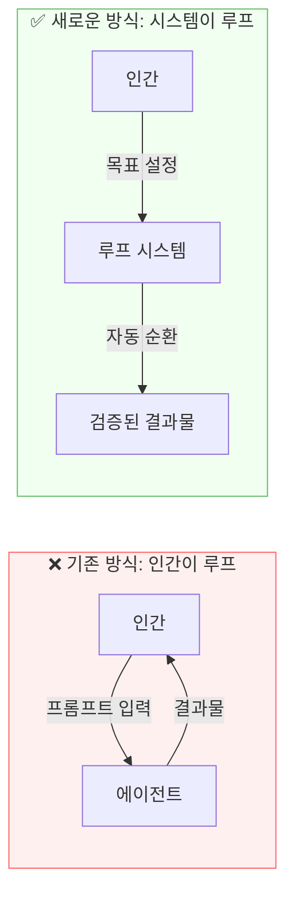
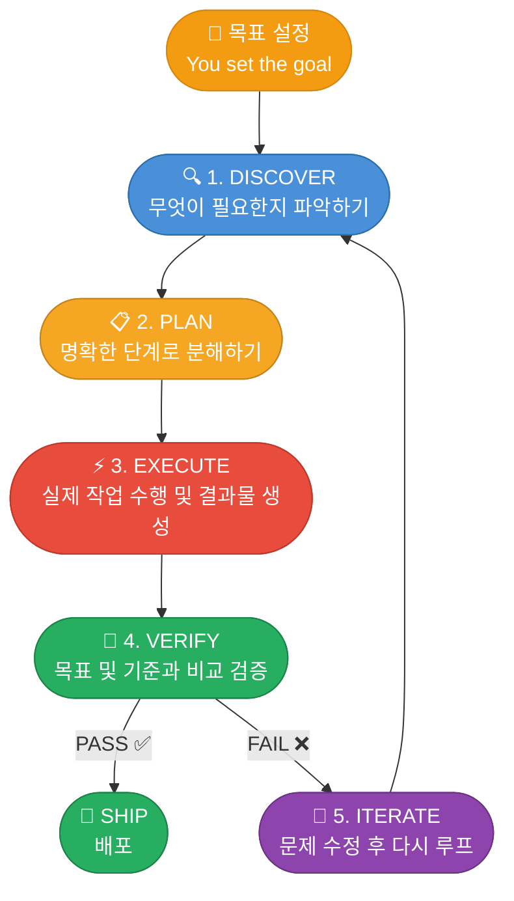
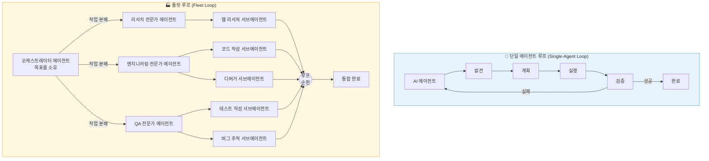
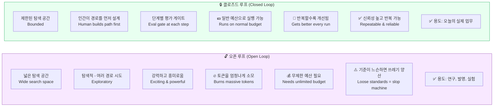
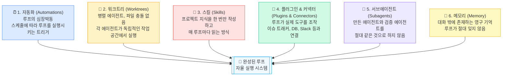
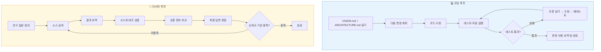
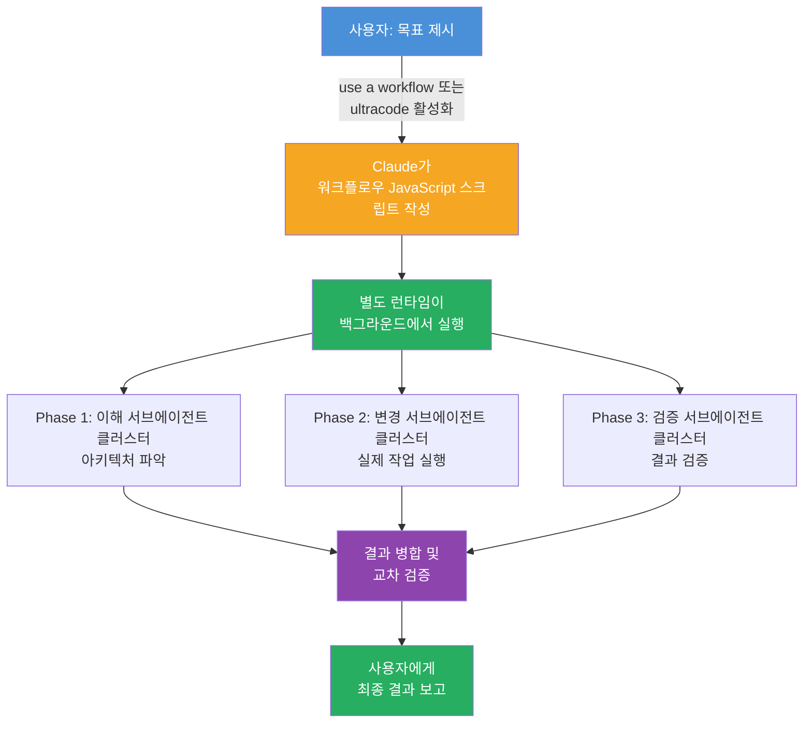
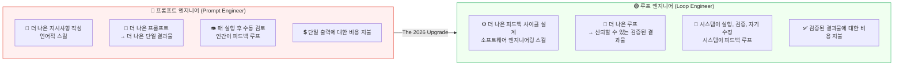
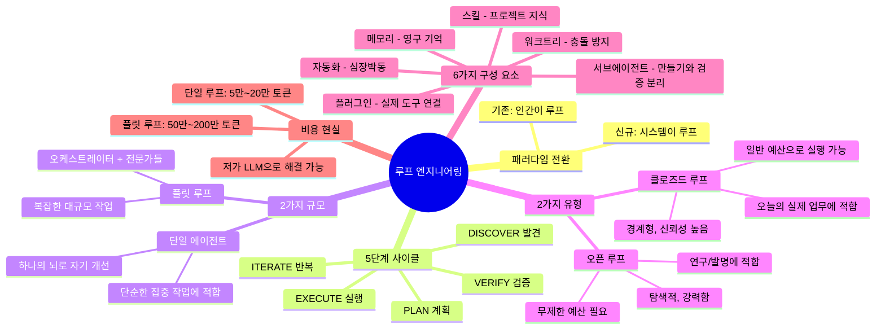

> **출처**: [@sairahul1](https://x.com/sairahul1/status/2064277888216555684)의 X(구 트위터) 아티클 (2026년 6월 9일)  
> **핵심 발언 인물**: Peter Steinberger (OpenClaw 창시자, OpenAI 소속) / Boris Cherny (Anthropic, Claude Code 총괄)  
> **최신 정보 기준**: 2026년 6월 11일

---

## 목차

1. [이 아티클이 왜 중요한가?](#1-이-아티클이-왜-중요한가)
2. [두 명의 최고 AI 엔지니어가 같은 말을 했다](#2-두-명의-최고-ai-엔지니어가-같은-말을-했다)
3. [루프 엔지니어링이란 무엇인가?](#3-루프-엔지니어링이란-무엇인가)
4. [기존 방식(프롬프팅) vs 새로운 방식(루핑)](#4-기존-방식프롬프팅-vs-새로운-방식루핑)
5. [루프의 5단계 사이클](#5-루프의-5단계-사이클)
6. [단일 에이전트 루프 vs 플릿 루프](#6-단일-에이전트-루프-vs-플릿-루프)
7. [오픈 루프 vs 클로즈드 루프](#7-오픈-루프-vs-클로즈드-루프)
8. [좋은 루프를 만드는 6가지 구성 요소](#8-좋은-루프를-만드는-6가지-구성-요소)
9. [실제 루프 예시 4가지](#9-실제-루프-예시-4가지)
10. [루프의 가장 큰 걸림돌: 토큰 비용](#10-루프의-가장-큰-걸림돌-토큰-비용)
11. [Claude Code의 Dynamic Workflows: 루프가 제품이 되다](#11-claude-code의-dynamic-workflows-루프가-제품이-되다)
12. [프롬프트 엔지니어 vs 루프 엔지니어](#12-프롬프트-엔지니어-vs-루프-엔지니어)
13. [핵심 요약 및 실전 적용 가이드](#13-핵심-요약-및-실전-적용-가이드)

---

## 1. 이 아티클이 왜 중요한가?

2026년 6월, X(구 트위터)에 올라온 하나의 게시물이 330만 회 이상 조회되며 AI 개발자 커뮤니티 전체를 뒤흔들었다. 작성자 [@sairahul1](ttps://x.com/sairahul1/status/2064279904989147577)은 AI 업계 최전선에서 일하는 두 명의 최고 시니어 엔지니어가 거의 동시에 동일한 메시지를 발신했다는 사실에 주목하고, 그 내용을 누구나 이해할 수 있는 언어로 풀어냈다.

이 아티클의 핵심 주장은 단 한 문장으로 요약된다.

> **"AI 에이전트에게 더 이상 프롬프트를 입력하는 시대는 끝났다. 이제는 에이전트에게 프롬프트를 입력하는 루프를 설계해야 한다."**

이것은 단순한 기술적 트렌드가 아니다. AI를 사용하는 방식 자체의 근본적인 패러다임 전환이다. 인간이 AI의 피드백 루프 역할을 하던 시대에서, 시스템 자체가 피드백 루프가 되는 시대로의 이동이다.

---

## 2. 두 명의 최고 AI 엔지니어가 같은 말을 했다

### Peter Steinberger (@steipete)

Peter Steinberger는 OpenClaw의 창시자다. OpenClaw는 원래 Clawdbot이라는 이름으로 2025년 11월 개인 프로젝트로 시작됐다. 이 오픈소스 AI 에이전트는 GitHub 역사상 가장 빠르게 성장한 프로젝트 중 하나로 기록되어 있다. 2026년 4월 기준으로 GitHub에서 별(star) 30만 2천 개를 돌파하며 React, Vue.js, TensorFlow보다 훨씬 빠른 속도로 성장했다.

그는 2026년 2월 15일 OpenAI에 합류해 "차세대 개인 에이전트"를 개발하는 역할을 맡고 있다. OpenAI CEO Sam Altman이 직접 X에 공지할 만큼 중요한 영입이었다.

2026년 6월 8일, 그는 다음과 같이 게시했다.

> *"월간 알림: 더 이상 코딩 에이전트에게 직접 프롬프트를 입력해서는 안 됩니다. 에이전트에게 프롬프트를 입력하는 루프를 설계해야 합니다."*

이 트윗은 444개의 댓글, 5,400개 이상의 좋아요를 받았다.

### Boris Cherny

Boris Cherny는 Anthropic의 Claude Code 총괄(Head of Claude Code)이다. Claude Code는 그가 2024년 9월 사이드 프로젝트로 시작한 것으로, 현재 GitHub의 전체 공개 커밋 중 약 4%를 차지할 만큼 성장했다.

그의 워크플로우 변화 과정은 매우 인상적이다.

- **2025년 중반**: 코드를 직접 손으로 작성하되, AI 자동완성을 보조 도구로 사용
- **2025년 12월**: IDE를 한 달 동안 한 번도 열지 않음. Claude Code가 259개의 PR에 걸쳐 모든 코드를 작성
- **2026년 3월**: Claude Code 자체가 Claude Code로 작성되는 완전한 재귀적 이정표 달성 (Claude Code is 100% written by Claude Code itself)
- **2026년 6월 2일**: WorkOS가 주최한 Acquired Unplugged 행사에서 다음과 같이 발언

> *"저는 더 이상 Claude에게 직접 프롬프트를 입력하지 않습니다. 무엇을 해야 할지 파악하고 Claude에게 프롬프트를 입력하는 루프를 실행합니다. 제 일은 루프를 작성하는 것입니다. 그리고 이것이 올해 남은 기간 동안 우리가 보게 될 전환점입니다."*

이 발언은 약 24시간 만에 거의 70만 뷰를 기록했다.

두 명의 시니어 엔지니어가 서로 다른 회사에서, 서로 다른 방식으로 동일한 메시지를 발신하고 있다는 사실은 단순한 개인 의견이 아니라 업계 전체가 향하는 방향임을 시사한다.

---

## 3. 루프 엔지니어링이란 무엇인가?

**루프 엔지니어링(Loop Engineering)** 이란, AI 에이전트가 시도에서 검증된 결과물까지 도달할 수 있도록, 반복 가능한 피드백 사이클을 설계하는 실천 방식이다. 여기서 핵심은 "지속적인 인간 개입 없이"라는 부분이다.

가장 단순하게 설명하면 이렇다.

- **프롬프트**는 에이전트에게 지시를 준다.
- **루프**는 에이전트에게 일(job)을 준다.

프롬프트는 단발성 명령이다. 인간이 입력하고, AI가 응답하고, 인간이 다시 검토하고, 다시 수정하고, 다시 프롬프트를 입력한다. 이 전체 과정에서 인간이 피드백 루프 자체가 된다.

루프는 다르다. 인간은 목표(goal)를 설정하고, 시스템 자체가 발견 → 계획 → 실행 → 검증 → 반복의 사이클을 자동으로 돌린다. 인간은 루프가 완료되거나 중요한 결정이 필요할 때만 개입한다.

Boris Cherny가 말한 `/loop babysit all my PRs. Auto-fix build issues, and when comments come in, use a worktree agent to fix them`이라는 명령어가 이를 완벽하게 보여준다. 이 한 줄의 명령으로 Claude Code는 열린 PR을 지속적으로 모니터링하고, 빌드 실패를 자동으로 수정하고, 리뷰 코멘트가 들어오면 별도의 작업 공간(worktree)에서 변경 사항을 구현하는 에이전트를 생성한다. 개발자는 구체적인 단계를 하나하나 명시하지 않았다. 의도와 종료 조건만 작성했을 뿐이다.

---

## 4. 기존 방식(프롬프팅) vs 새로운 방식(루핑)

### 기존 방식: 프롬프팅

```
인간 → 프롬프트 입력 → 에이전트 → 결과물 → 인간이 수동 검토 
→ 인간이 수정 → 다시 프롬프트 입력 → 반복...
```

이 방식에서 인간은 루프 안에 갇혀 있다. 에이전트를 검토하고, 고치고, 다시 지시하는 것이 모두 인간의 몫이다. 에이전트는 도구이고, 인간이 그 도구를 조종하는 주체다. 모든 단계 후에 인간의 손이 필요하다.

### 새로운 방식: 루핑 (2026년 업그레이드)

```
인간이 목표 설정 → 루프 실행 → 에이전트가 자동으로 사이클 순환 
→ 검증된 결과물 → 배포
```

이 방식에서 시스템이 루프다. 에이전트는 스스로 발견하고, 계획하고, 실행하고, 검증하고, 반복한다. 인간의 역할은 루프를 설계하고 시작하는 것이다. 이후 루프는 스스로 돌아간다.



이 차이가 가져오는 실용적 변화는 매우 크다. 프롬프팅 방식에서는 복잡한 작업일수록 인간의 개입 횟수가 기하급수적으로 늘어난다. 루핑 방식에서는 작업의 복잡도가 올라갈수록 오히려 인간의 개입은 줄어들고, 시스템이 더 많은 세부 작업을 자체적으로 처리한다.

---

## 5. 루프의 5단계 사이클

모든 루프는 규모나 복잡도와 무관하게 동일한 5단계를 순환한다. 이 5단계를 이해하는 것이 루프 엔지니어링의 핵심이다.



각 단계를 구체적으로 살펴보자.

### 1단계: DISCOVER (발견)

에이전트가 주어진 목표를 달성하기 위해 무엇이 필요한지 파악하는 단계다. 코딩 루프라면 현재 코드베이스의 구조를 파악하고, VISION.md와 ARCHITECTURE.md 같은 프로젝트 문서를 읽으며, 어떤 파일을 수정해야 하는지 탐색한다. 연구 루프라면 어떤 소스를 검색해야 하는지 파악한다.

이 단계는 루프의 가장 중요한 첫 관문이다. 발견이 잘못되면 이후 모든 단계가 잘못된 방향으로 흘러간다.

### 2단계: PLAN (계획)

발견한 내용을 바탕으로 실행 가능한 단계들로 분해하는 과정이다. "어떤 파일을 어떤 순서로 수정할 것인가", "어떤 테스트를 먼저 통과시킬 것인가", "어떤 소스를 우선 검색할 것인가"와 같은 구체적인 실행 계획을 세운다.

좋은 계획은 각 실행 단계가 명확한 성공/실패 기준을 가지고 있다. 모호한 계획은 검증 단계에서 에이전트가 판단을 내리지 못하게 만든다.

### 3단계: EXECUTE (실행)

계획에 따라 실제 작업을 수행하는 단계다. 코드를 작성하고, 파일을 수정하고, API를 호출하고, 테스트를 실행한다. 이 단계에서 실질적인 결과물이 만들어진다.

플릿 루프에서는 이 단계에서 여러 에이전트가 병렬로 작업을 수행한다. 각 에이전트는 서로 다른 부분을 담당하며, 충돌 없이 독립적으로 실행된다.

### 4단계: VERIFY (검증)

실행 결과물이 초기에 설정한 목표와 기준을 충족하는지 확인하는 단계다. 테스트가 통과되는지, 린터 검사를 통과하는지, 명세에 부합하는지, 품질 기준을 만족하는지 등을 검사한다.

이 단계에서 중요한 원칙이 있다. **검증하는 에이전트는 실행한 에이전트와 달라야 한다.** 자신이 만든 결과물을 스스로 평가하면 객관성이 훼손된다. 마치 자신이 작성한 시험지를 자신이 채점하는 것과 같다.

### 5단계: ITERATE (반복)

검증에서 실패했을 경우 다시 발견 단계로 돌아가 사이클을 반복한다. 이 반복은 단순한 재시도가 아니라, 이전 실패에서 얻은 정보를 기반으로 더 나은 접근 방식을 시도하는 것이다.

검증을 통과하면 결과물이 배포(SHIP)되고 루프가 종료된다.

---

## 6. 단일 에이전트 루프 vs 플릿 루프

루프에는 두 가지 규모가 있다.



### 단일 에이전트 루프 (SINGLE-AGENT LOOP)

하나의 에이전트가 전체 사이클을 혼자 돌리는 방식이다. 마치 한 사람이 자신의 초안을 스스로 다시 검토하는 것과 같다. 에이전트는 발견하고, 계획하고, 실행하고, 검증하고, 반복한다.

단일 에이전트 루프는 다음에 적합하다.
- 집중적이고 명확하게 정의된 작업
- 단순한 목표와 제한된 범위
- 프로토타입이나 초기 단계의 탐색

한 개의 뇌로 자기 개선을 반복하는 방식이기 때문에, 설계가 단순하고 비용 예측이 쉽다.

### 플릿 루프 (FLEET LOOP)

더 큰 규모의 방식이다. 오케스트레이터(관리자) 에이전트가 목표 전체를 소유하고, 이를 여러 전문가(specialist) 에이전트에게 분배한다. 각 전문가 에이전트는 다시 자신의 서브에이전트들에게 세부 작업을 분배한다. 이 전체 트리 구조에서 모든 에이전트는 동일한 5단계 루프를 실행한다.

"생산성 앱 만들기"를 예로 들면, 오케스트레이터는 리서치, 엔지니어링, QA 세 팀으로 나누고, 리서치 팀은 웹 리서처 서브에이전트를, 엔지니어링 팀은 코드 작성자와 디버거를, QA 팀은 테스트 작성자와 버그 추적자를 담당한다.

중요한 것은, **모든 에이전트가 동일한 루프(DISCOVER → PLAN → EXECUTE → VERIFY → ITERATE)를 실행한다**는 점이다. 규모가 달라질 뿐, 원리는 동일하다.

---

## 7. 오픈 루프 vs 클로즈드 루프

루프의 종류를 이해하는 것은 2026년 현재 가장 중요한 실용적 구분이다.



### 오픈 루프: 탐색형

오픈 루프는 에이전트에게 목표를 주고 자유롭게 탐색하게 하는 방식이다. 에이전트는 여러 경로를 시도하고, 예상치 못한 것을 발견하고, 명확히 명세되지 않은 것을 만들어낼 수 있다.

이것이 Peter Steinberger와 같은 최전선 엔지니어들이 OpenAI 내부에서 사용하는 방식이다. 문제는 토큰 소모량이다. 3인 팀이 100개의 Codex 인스턴스를 30일 동안 돌렸을 때 OpenAI 토큰 비용이 130만 달러에 달했다는 사례가 보고됐다. 이는 "무제한 API 접근"을 가진 사람들의 방식이다.

품질 기준이 느슨한 상태에서 오픈 루프를 돌리면 빠르고 지저분하고 비싼 결과물("slop machine")이 나온다. 대부분의 일반 사용자에게는 현실적이지 않다.

### 클로즈드 루프: 경계형

클로즈드 루프는 인간이 먼저 전체 경로를 설계하는 방식이다. 명확한 목표, 정의된 단계, 각 단계의 평가 기준, 루프가 언제 멈추거나 인간에게 돌아와야 하는지에 대한 조건이 미리 정해져 있다.

에이전트는 여전히 루프를 돌리지만, 인간이 설계한 프레임 안에서 움직인다. 품질 게이트가 있기 때문에 결과의 신뢰도가 높다. 경로가 좁기 때문에 일반적인 예산으로도 실행 가능하다. 매 실행이 다음 실행을 개선한다.

**오늘 실제 업무에 바로 쓸 수 있는 것은 클로즈드 루프다.** 먼저 작동하는 클로즈드 루프를 구축하고, 품질 게이트가 충분히 검증된 후에 오픈 루프로 확장하는 것이 권장 경로다.

---

## 8. 좋은 루프를 만드는 6가지 구성 요소

모든 제대로 된 루프에는 다음 6가지 구성 요소가 반드시 포함된다. 현재 Claude Code와 OpenAI의 Codex CLI 모두 이 6가지를 갖추고 있다.



### 1. 자동화 (Automations) — 루프의 심장박동

자동화는 루프를 "한 번 실행한 것"이 아닌 "실제 루프"로 만드는 요소다. 프롬프트, 주기, 목표를 정의하면, 루프는 스케줄에 따라 자동으로 실행되고 결과를 보고한다. 인간이 직접 가서 확인할 필요가 없다.

Claude Code의 `/loop` 명령어가 이것을 구현한다. `/loop re-runs on a cadence`, `/goal keeps going until a condition you wrote is actually true` 방식으로 작동한다. 예를 들어 "test/auth의 모든 테스트가 통과하고 lint가 깨끗할 때"라는 조건을 주고 자리를 비우면, 루프가 그 조건이 충족될 때까지 스스로 작업을 반복한다.

### 2. 워크트리 (Worktrees) — 병렬 에이전트의 충돌 방지

두 개 이상의 에이전트를 동시에 실행하는 순간, 파일 충돌 문제가 발생한다. 두 에이전트가 동일한 파일을 동시에 수정하면 서로의 작업을 덮어쓴다. 이는 두 개발자가 동일한 코드 라인에 동시에 커밋하는 것과 같은 문제다.

`git worktree`가 이 문제를 해결한다. 각 에이전트는 동일한 저장소 이력을 공유하면서도, 자신만의 독립적인 작업 디렉토리와 브랜치에서 실행된다. 한 에이전트의 수정 사항이 물리적으로 다른 에이전트의 체크아웃에 영향을 줄 수 없는 구조다.

### 3. 스킬 (Skills) — 한 번 작성하고 매번 읽는 프로젝트 지식

스킬이 없으면 루프는 매 실행마다 프로젝트를 처음부터 파악해야 한다. 이는 엄청난 낭비다. 스킬은 SKILL.md 파일이 들어있는 폴더로, 프로젝트 관례, 빌드 단계, "이 방식은 그 사건 이후로 절대 쓰지 않는다"와 같은 중요 정보가 담겨 있다.

한 번 작성하면 매 루프마다 에이전트가 읽는다. 스킬이 없으면 루프는 매 사이클마다 프로젝트를 처음부터 추론한다. 스킬이 있으면 루프는 매 실행마다 더 깊은 이해를 바탕으로 시작한다.

아티클에서 제안하는 핵심 스킬 파일들은 다음과 같다.
- **VISION.md**: 성공이 어떤 모습인지 정의
- **ARCHITECTURE.md**: 기술 스택과 폴더 구조
- **RULES.md**: 에이전트가 절대 해서는 안 되는 것들

### 4. 플러그인 & 커넥터 (Plugins & Connectors) — 루프를 실제 세계와 연결

파일시스템만 볼 수 있는 루프는 작은 루프다. 커넥터(MCP 기반으로 구축)는 에이전트가 이슈 트래커를 읽고, 데이터베이스를 조회하고, 스테이징 API를 호출하고, Slack에 메시지를 보낼 수 있게 한다.

이것이 "여기 수정 사항이 있습니다"라고 말하는 에이전트와, PR을 열고, Linear 티켓을 연결하고, CI가 초록불이 되면 Slack 채널에 알림을 보내는 루프의 차이다. 후자는 인간의 개입 없이 모든 것을 스스로 처리한다.

### 5. 서브에이전트 (Subagents) — 만든 것과 검증하는 것을 분리

코드를 작성한 모델은 자신의 코드를 채점할 때 너무 관대하다. 자신이 작성한 것에 대한 편향이 생기고, 스스로 합리화한 실수를 그대로 넘어간다.

두 번째 에이전트가 다른 지시사항으로, 때로는 다른 모델로, 첫 번째가 넘어간 것을 잡아낸다. 가장 효과적인 분리 방식은 다음과 같다.
- 한 에이전트는 탐색
- 한 에이전트는 구현
- 한 에이전트는 명세에 대한 검증

Claude Code의 `/goal`이 내부적으로 이 방식으로 작동한다. 작업을 수행한 에이전트가 아닌 새로운 모델이 루프가 완료됐는지 판단한다.

### 6. 메모리 (Memory) — 루프가 절대 잊지 않는 이유

메모리는 루프 전체의 척추다. AI 모델은 대화 세션 사이에 모든 것을 잊는다. 그러나 저장소는 잊지 않는다.

메모리 파일은 마크다운 파일일 수도 있고, Linear 보드일 수도 있고, 단일 대화 바깥에 존재하는 모든 것이 될 수 있다. 메모리 파일에는 시도한 것, 통과한 것, 아직 열려있는 것이 기록된다. 다음 날 아침 루프는 어제 멈춘 곳에서 정확히 다시 시작한다.

지나치게 단순하게 들릴 수 있지만, 장시간 실행되는 루프는 모두 이 메모리에 의존한다. 메모리 없이는 루프가 매번 처음부터 시작하는 것과 다름없다.

---

## 9. 실제 루프 예시 4가지

이론을 이해했다면, 실제로 루프가 어떻게 작동하는지 4가지 구체적인 예시로 살펴보자.

```mermaid
graph TD
    subgraph CONTENT["✍️ 콘텐츠 루프"]
        CT1[주제 + 독자 + 목표 정의] --> CT2[초안 작성]
        CT2 --> CT3[비평 에이전트의 검토]
        CT3 --> CT4[비평 기반 재작성]
        CT4 --> CT5[성공 기준 대비 점수 부여]
        CT5 --> CT6{기준 통과?}
        CT6 -->|실패| CT4
        CT6 -->|통과| CT7[게시]
    end

    subgraph SALES["📧 영업 아웃리치 루프"]
        S1[이상적인 고객 프로필ICP 정의] --> S2[프로필 매칭 잠재 고객 발굴]
        S2 --> S3[기업 데이터로 보강]
        S3 --> S4[기준 대비 자격 검증]
        S4 --> S5[맞춤형 메시지 작성]
        S5 --> S6[품질 검토]
        S6 --> S7{기준 통과?}
        S7 -->|실패| S5
        S7 -->|통과| S8[발송 또는 인간에게 에스컬레이션]
    end

    style CONTENT fill:#f0fff0,stroke:#27ae60
    style SALES fill:#fff0f0,stroke:#e74c3c
```





이 4가지 루프는 모두 동일한 구조를 가진다.

> **목표 설정 → 행동 → 검증 → 수정 → 완료될 때까지 반복**

도메인만 다를 뿐, 기본 원리는 동일하다. 이것이 루프 엔지니어링의 힘이다. 한 번 패턴을 익히면 어떤 도메인에든 적용할 수 있다.

---

## 10. 루프의 가장 큰 걸림돌: 토큰 비용

루프 엔지니어링이 아름다운 아이디어임에도 불구하고 많은 사람들이 실제로 구축하지 못하는 데에는 현실적인 이유가 있다. 바로 **비용**이다.

Peter Steinberger의 발언에 달린 수많은 댓글이 이를 잘 보여준다. "OpenAI 무제한 접근권을 가진 사람이니까 쉽게 말할 수 있는 것"이라는 반응들이다. 이 반응은 근본적으로 옳다.

### 토큰 소모량 현실

| 루프 유형 | 토큰 소모량 |
|-----------|------------|
| 단일 에이전트 루프 (중간 규모 코딩 작업) | 50,000 ~ 200,000 토큰 |
| 플릿 루프 (오케스트레이터 + 전문가 3명) | 500,000 ~ 2,000,000 토큰 |
| 매일 아침 스케줄 루프 | 주당 수백만 토큰 |

Peter Steinberger가 이끄는 3인 팀이 100개의 Codex 인스턴스를 30일 동안 실행했을 때의 청구 금액은 **130만 달러**였다. 603억 개의 토큰, 760만 건의 요청에 해당한다.

루프의 모든 재시도, 모든 자기 수정, 모든 서브에이전트, 모든 검증 통과가 비용을 발생시킨다. 자유롭게 탐색하는 오픈 루프는 눈이 빠질 속도로 토큰을 소모한다.

### DeepSeek이 제시하는 해결책

아티클 작성자 @sairahul1은 DeepSeek V4를 루프를 경제적으로 실행하기 위한 솔루션으로 제시한다. (단, 아래 가격 정보는 아티클 기준이며 실제 가격은 변경될 수 있으므로 공식 사이트에서 확인을 권장한다.)

| 항목 | deepseek-v4-flash | deepseek-v4-pro |
|------|-------------------|-----------------|
| 컨텍스트 길이 | 100만 토큰 | 100만 토큰 |
| 최대 출력 | 384K | 384K |
| 1M 입력 토큰 (캐시 히트) | $0.0028 | $0.003625 |
| 1M 입력 토큰 (캐시 미스) | $0.14 | $0.435 |
| 1M 출력 토큰 | $0.28 | $0.87 |
| 동시 처리 한도 | 2,500 | 500 |

100만 토큰 컨텍스트 창은 루프에서 특히 중요하다. 장시간 실행되는 루프는 이전 실행 결과, 현재 오류, 아키텍처 문서, 테스트 결과, 코드베이스 컨텍스트를 동시에 메모리에 유지해야 한다. 대부분의 모델은 긴 루프 중에 초기 컨텍스트를 잃어버리기 시작한다. 루프가 앞서 일어난 일을 잊기 시작하는 것이다.

아티클에서는 "$20으로 DeepSeek에서 17억 토큰을 얻을 수 있다"고 언급하며, 이것이 루프 엔지니어링의 마지막 실질적 장벽을 제거한다고 주장한다. 

또한 아티클 하단부에는 **MiniMax M3** ($20/월)가 스폰서 콘텐츠로 소개된다. 100만 토큰 컨텍스트 창, 3~4개의 동시 에이전트 실행, 텍스트/이미지/음성/음악 입출력을 지원한다고 명시되어 있다. 이는 루프 실행을 경제적으로 만들려는 여러 중국산 LLM의 가격 경쟁을 반영하는 사례다.

**중요한 점**: 이 아티클의 가격 비교는 특정 LLM 제공업체를 홍보하기 위한 맥락도 포함되어 있다. 실제 루프 엔지니어링을 위한 모델 선택은 비용 외에도 품질, 신뢰성, 보안 요구사항 등을 종합적으로 고려해야 한다.

---

## 11. Claude Code의 Dynamic Workflows: 루프가 제품이 되다

이 아티클이 나온 시점에서 가장 주목할 만한 실제 구현 사례는 Anthropic의 Claude Code가 2026년 5월 28일 출시한 **Dynamic Workflows(다이나믹 워크플로우)** 기능이다.

### Dynamic Workflows란?

Dynamic Workflows는 Claude Code가 복잡한 소프트웨어 엔지니어링 작업을 처리하기 위해 수십에서 수백 개의 병렬 서브에이전트를 조율하는 새로운 기능이다. 이것이 바로 루프 엔지니어링이 실제 제품으로 구현된 사례다.



### 핵심 특징

첫째, Claude가 직접 워크플로우 JavaScript 스크립트를 작성한다. 사용자는 "use a workflow"라는 표현을 프롬프트에 포함시키거나, `ultracode` 설정을 활성화하면 된다. Claude는 이것을 단일 실행이 아닌 동적 워크플로우를 계획하고 실행하라는 신호로 인식한다.

둘째, 서브에이전트 조율은 코드로 처리된다. 20개의 에이전트를 병렬로 실행할 때, 각 에이전트가 무엇을 할지 결정하고, 결과를 수집하고, 중복을 제거하는 작업은 일반 JavaScript 코드(루프, 필터, 정렬)로 처리된다. 이 조율 코드는 모델 토큰을 소모하지 않는다. 에이전트는 여전히 토큰을 사용하지만, 그것들 사이의 접착제는 무료다.

셋째, 규모에 대한 하드 제한이 있다. 최대 16개의 에이전트가 동시에 실행되고, 실행당 최대 1,000개의 에이전트가 허용된다. 첫 번째 제한은 로컬 리소스를 보호하고, 두 번째 제한은 제어 불능의 루프를 방지한다.

넷째, 워크플로우는 스크립트로 저장되고 재실행할 수 있다. 이것이 단순한 서브에이전트와의 핵심 차이다. 워크플로우는 반복 가능한 시스템이 된다.

### 실제 사례: 75만 줄 코드를 11일 만에

JavaScript 런타임 Bun의 창시자 Jarred Sumner는 Dynamic Workflows를 사용해 Bun의 코드베이스를 Zig에서 Rust로 마이그레이션하는 작업을 수행했다. 약 75만 줄의 코드를 11일 만에 이식하면서, 기존 테스트 스위트의 99.8%를 통과시켰다. 이전이라면 수 분기에 걸쳐 팀 전체가 수행해야 했을 작업이다.

이것이 Boris Cherny가 말한 "루프를 작성하는 것이 내 일"의 실제 산물이다. 단순히 Claude에게 "Zig 코드를 Rust로 변환해줘"라고 프롬프트를 입력하는 것이 아니라, 작업을 어떻게 분해하고, 어떤 서브에이전트가 어떤 부분을 담당하고, 어떻게 검증하고 병합할지를 설계하는 것이다.

### Boris Cherny의 3단계 발전 모델

Boris Cherny는 2026년 6월 2일 Acquired Unplugged 행사에서 AI 코딩 도구 활용의 발전을 3단계로 정의했다.

**Stage 1 — 도구로서의 AI**: 코드를 손으로 작성하되 AI 자동완성을 보조 도구로 사용. 모델은 줄 단위로 사람이 지시하는 도구.

**Stage 2 — 자율 루프**: 수동으로 각 단계를 안내하는 대신, Claude가 독립적으로 작업할 수 있는 태스크를 설정. 루프가 완료되거나 인간의 판단이 필요한 결정 지점에서 보고.

**Stage 3 — 수천 개의 서브에이전트**: "몇 천 개"의 야간 서브에이전트를 복잡한 작업을 위해 실행. Claude Code 자체의 80~90%가 이 방식으로 생성. Anthropic 전반의 엔지니어링 산출물도 상당 부분 동일한 패턴을 따름.

---

## 12. 프롬프트 엔지니어 vs 루프 엔지니어

2026년에 열리고 있는 스킬 격차는 다음과 같다.



### 구체적인 차이

| 관점 | 프롬프트 엔지니어 | 루프 엔지니어 |
|------|-----------------|--------------|
| 요청 방식 | "함수 작성해줘" | "작성 → 테스트 → 초록불 될 때까지 수정" |
| 산출물 | 더 나은 프롬프트 | VISION.md 문서 |
| 검토 방식 | 결과물 수동 검토 | 테스트가 자동으로 검토 |
| 실행 방식 | 에이전트를 한 번 실행 | 반복 시스템 구축 |
| 비용 구조 | 단일 출력에 대한 비용 | 검증된 결과물에 대한 비용 |
| 핵심 스킬 | 언어적 능력 | 소프트웨어 엔지니어링 능력 |

### 중요한 경고: 루프 설계가 프롬프팅보다 더 어렵다

아티클 작성자가 명시적으로 강조하는 점이 있다. 두 사람이 동일한 루프를 구축하고 완전히 반대되는 결과를 얻을 수 있다는 것이다. 한 명은 깊이 이해하는 작업을 더 빠르게 수행하기 위해 루프를 사용한다. 다른 한 명은 작업을 이해하는 것 자체를 피하기 위해 루프를 사용한다.

루프는 그 차이를 모른다. 인간이 안다.

Boris Cherny의 핵심 요점은 작업이 더 쉬워졌다는 것이 아니다. 레버리지 포인트가 이동했다는 것이다. 이전에는 프롬프트가 레버리지 포인트였다. 이제는 루프 설계가 레버리지 포인트다.

2026년 가장 높은 보상을 받는 AI 엔지니어들은 더 나은 영어 문장을 작성하는 것이 아니다. 에이전트가 어떻게 발견하고, 계획하고, 자신의 작업을 검증하고, 완료 시점을 아는지를 지배하는 논리를 작성하는 것이다.

---

## 13. 핵심 요약 및 실전 적용 가이드

### 전체 구조 한눈에 보기



### 실전 시작 가이드

루프 엔지니어링을 처음 시작하는 사람이라면 다음 순서를 따르는 것이 권장된다.

**Step 1 — 클로즈드 루프로 시작하라**  
가장 단순한 "생성 → 테스트 → 통과할 때까지 수정" 루프를 실제 모듈에 구축해보자. 상태 관리, 복구, 평가에서 실제 어려운 부분이 어디에 있는지 빠르게 배울 수 있다.

**Step 2 — 토큰 비용과 관찰 가능성을 첫날부터 핵심 관심사로 다뤄라**  
루프는 생각보다 훨씬 빠르게 비용이 쌓인다. 모니터링 없이 루프를 돌리면 예산이 예상보다 훨씬 빠르게 소진될 수 있다.

**Step 3 — 루프를 실행할 시점과 통제권을 되찾을 시점의 메타 스킬을 개발하라**  
루프가 막히거나 잘못된 방향으로 가고 있을 때를 인식하는 능력이 루프 설계 자체만큼 중요하다.

**Step 4 — 품질 게이트가 충분히 검증되면 오픈 루프로 확장하라**  
클로즈드 루프에서 검증된 품질 기준이 있을 때 비로소 탐색 범위를 넓히는 것이 안전하다.

### 최종 메시지

> *"하나의 신뢰할 수 있는 루프는 천 개의 완벽한 프롬프트보다 가치 있다."*
>
> — Peter Steinberger

루프를 구축하라. 그러나 스스로 엔지니어로 남겠다는 의도를 가진 사람으로서 구축하라. 단순히 시작 버튼을 누르는 사람으로서가 아니라.

---

*이 문서는 @sairahul1의 X 아티클(2026.06.09, 조회수 330만+)을 기반으로, 최신 검색 결과(Boris Cherny의 Acquired Unplugged 발언 2026.06.02, Claude Code Dynamic Workflows 출시 2026.05.28, Peter Steinberger OpenAI 합류 2026.02.15 등)를 종합하여 작성되었습니다.*

*작성 기준일: 2026년 6월 11일*
