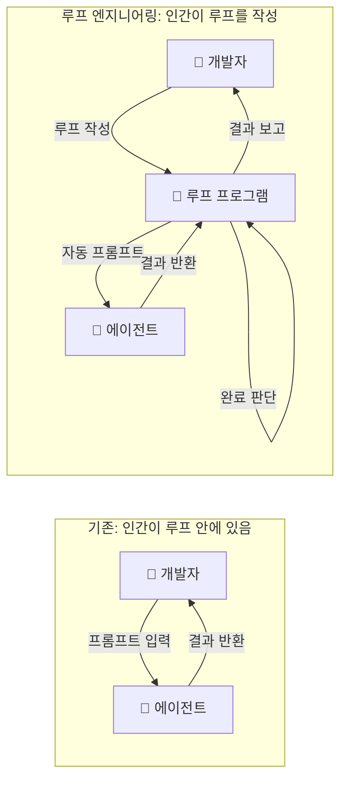
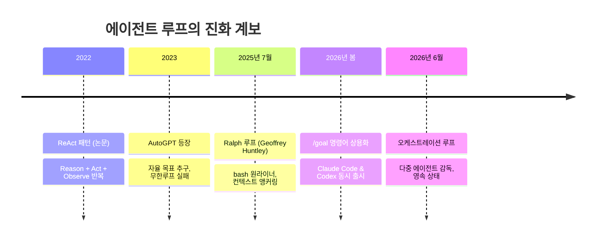
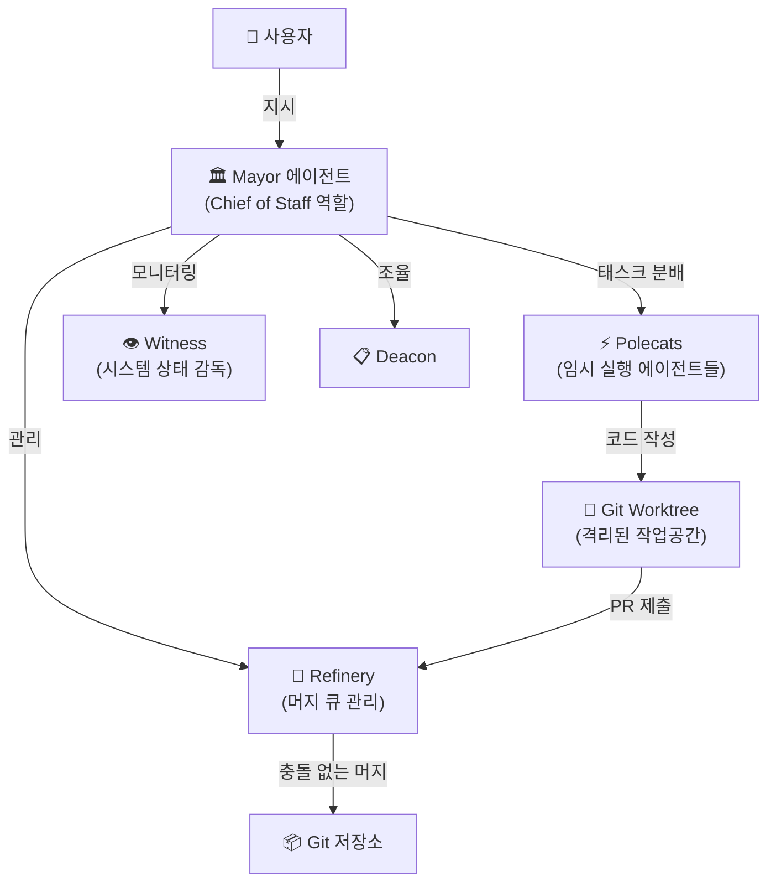
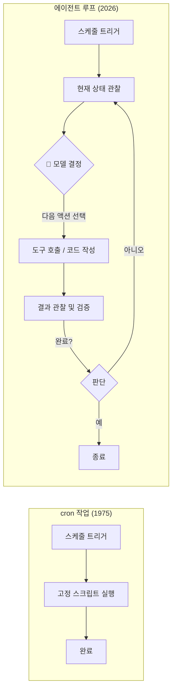
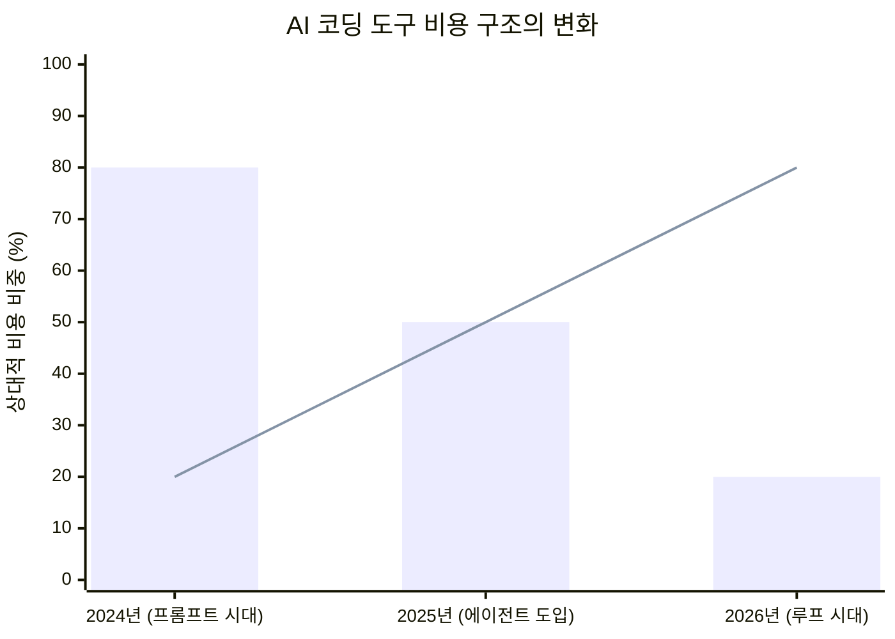
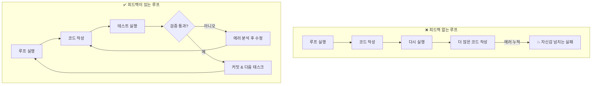
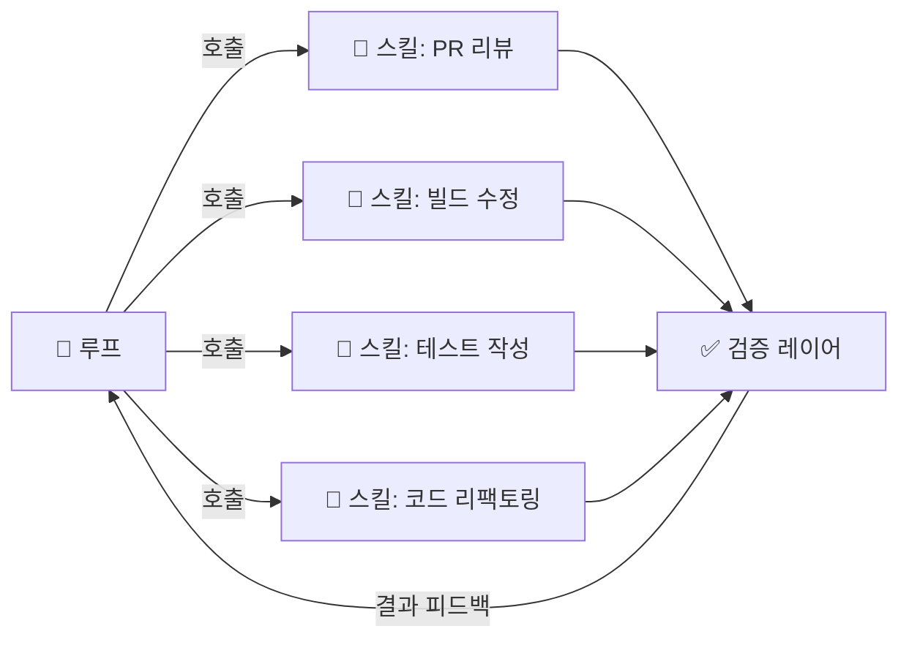
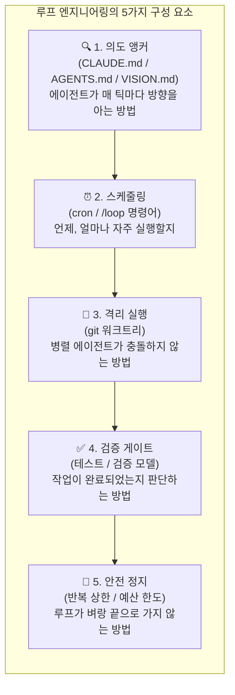
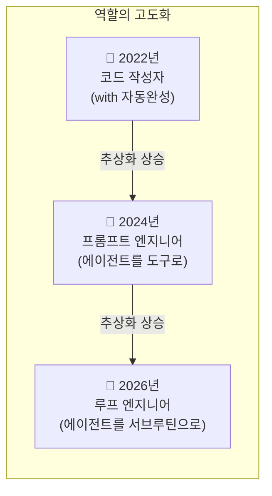

> **"당신은 더 이상 코딩 에이전트에게 프롬프트를 입력해서는 안 됩니다. 당신은 에이전트에게 프롬프트를 제공하는 루프를 설계해야 합니다."**
>
> — Peter Steinberger (@steipete), 2026년 6월 7일 (조회수 220만 돌파)

---

## 1. 하나의 트윗이 인터넷을 장악하다

2026년 6월 7일, 개발자 피터 슈타인베르거(Peter Steinberger)가 X(구 트위터)에 단 두 문장을 올렸다. "당신은 더 이상 코딩 에이전트에게 프롬프트를 입력해서는 안 됩니다. 당신은 에이전트에게 프롬프트를 제공하는 루프를 설계해야 합니다." 이 짧은 문장은 빠르게 220만 뷰를 돌파하고 AI 코딩 커뮤니티 전체를 논쟁의 소용돌이로 몰아넣었다. 최종적으로 이 게시물은 340만 뷰를 기록하며 6월 한 달을 지배한 콘텐츠가 되었다.

그런데 정작 아이러니했던 것은, 이 문장을 리트윗하고 공유한 수많은 사람들 가운데 정확히 루프가 무엇인지를 설명할 수 있는 사람이 거의 없었다는 점이다. 리플라이창은 "프롬프트 엔지니어링은 죽었다"는 선언과 "도대체 이게 실제로 어떻게 생긴 건지 아는 사람이 있냐"는 질문이 뒤섞인 아수라장이었다. 이 상황을 가장 정확하게 요약한 것은 매튜 버만(Matthew Berman)의 한마디였다.

> *"nobody knows but him and boris."*
> (그와 보리스 말고는 아무도 모른다.)
> — @MatthewBerman, 2026년 6월 7일

이 기사는 매트 반 혼(Matt Van Horn)이 `/last30days`라는 자체 리서치 루프를 통해 Reddit, X, YouTube, Hacker News, TikTok, GitHub 등 여러 플랫폼의 데이터를 분석하고 종합한 결과물이다. 그는 스스로 매일 밤 약 30개의 오픈소스 저장소에 PR(풀 리퀘스트)을 여는 루프를 돌리는 실무 사용자로서, 이 개념을 가장 엄밀하게 추적한 인물 중 하나다. 이 글에서는 그 분석 내용과 최신 검색 결과를 종합해, 루프 엔지니어링이 무엇인지, 어디서 왔는지, 어떻게 작동하는지, 그리고 실제 프로덕션 환경에서 무엇을 조심해야 하는지를 상세하게 풀어낸다.

---

## 2. 두 명의 핵심 인물: 보리스 체르니와 피터 슈타인베르거

이 담론의 중심에는 두 명의 개발자가 있다.

**보리스 체르니(Boris Cherny)** 는 Claude Code의 창시자이자 Anthropic의 Claude Code 헤드다. 그는 2024년 9월, 사이드 프로젝트로 Claude Code를 만들었다. 현재 Claude Code는 GitHub의 전체 공개 커밋 중 약 4%를 차지한다고 알려져 있다. 2026년 6월 2일, WorkOS가 주최한 비공개 초청 행사인 'Acquired Unplugged'에서 Acquired 팟캐스트의 진행자 벤 길버트(Ben Gilbert)와 데이비드 로젠탈(David Rosenthal)과 함께 인터뷰를 진행했고, 이 자리에서 루프에 관한 가장 명확한 정의를 내놨다.

> *"지금은 실제로 한 단계 더 높은 추상화 계층으로 올라갔다고 생각합니다. 저는 더 이상 Claude에게 직접 프롬프트를 입력하지 않아요. 루프가 실행되고 있고, 그 루프들이 Claude에게 프롬프트를 제공하고 무엇을 할지 결정합니다. 제 역할은 루프를 작성하는 것입니다."*
> — Boris Cherny, WorkOS Acquired Unplugged, 2026년 6월 2일

보리스의 실적은 그냥 말이 아니다. 2025년 12월 27일, 그는 지난 30일 동안 자신의 Claude Code 기여분 100%가 Claude Code 자신에 의해 작성되었다고 밝혔다. 259개의 PR이 머지(merge)되었고, 커밋은 497개, 추가된 코드는 4만 줄, 삭제된 코드는 3만 8천 줄이었다. 그는 2025년 11월에 IDE를 삭제했고 그 이후 단 한 번도 열지 않았다.

**피터 슈타인베르거(Peter Steinberger)** 는 OpenClaw의 창시자로, OpenAI에 합류한 개발자다. 그는 루프 개념의 공공 전파에 가장 큰 역할을 한 인물로, 매달 반복해서 "당신은 루프를 설계해야 한다"는 메시지를 내보내고 있다. 그는 또한 루프가 감시 없이 실행될 때 발생하는 비용 폭증의 위험성에 대해서도 가장 목소리를 높여왔다.

그리고 구글 엔지니어 **에디 오스마니(Addy Osmani)** 는 두 사람의 발언을 정리하고 "루프 엔지니어링(Loop Engineering)"이라는 공식 용어로 체계화하는 데 기여했다.

---

## 3. 루프란 정확히 무엇인가?

루프를 한 줄로 설명하면 이렇다. **루프는 당신 대신 코딩 에이전트에게 프롬프트를 보내고, 결과를 읽고, 작업이 완료되었는지 판단하고, 완료되지 않았다면 다시 프롬프트를 보내는 작은 프로그램이다.**

이 정의의 핵심은 역할의 전환에 있다. 기존의 AI 코딩 워크플로우에서 개발자는 루프 안에 있는 사람이었다. 개발자가 프롬프트를 타이핑하고, 결과를 읽고, 다음 프롬프트를 타이핑하는 과정이 반복되었다. 에이전트는 도구였고, 인간이 그것을 쥐고 있었다.

루프 엔지니어링에서 개발자는 루프 밖으로 나온다. 인간은 루프를 만드는 사람이 되고, 모델(LLM)은 루프 안에서 호출되는 서브루틴이 된다.

보리스 체르니는 이 전환을 세 단계의 사다리로 설명한다.

**1단계 — 손으로 코딩하는 개발자:** 자동완성을 보조 도구로 삼아 코드를 직접 작성한다. LLM은 방향을 제시하는 도구일 뿐이다.

**2단계 — 병렬 세션을 운영하는 개발자:** Claude Code 세션 다섯 개에서 열 개를 동시에 열고 각각에 수동으로 프롬프트를 입력한다. 이때도 여전히 인간이 프로세스 안에 있다.

**3단계 — 루프를 작성하는 개발자:** 더 이상 프롬프트를 직접 입력하지 않는다. 루프를 작성하고, 그 루프가 Claude에게 프롬프트를 제공하며, 수백 개의 에이전트가 GitHub, Slack, Twitter를 읽고 무엇을 만들지 결정한다.



---

## 4. 루프의 계보: 5단계 진화사

트위터 리플라이가 아수라장이 된 이유 중 하나는 "루프"라는 단어 하나에 최소 다섯 가지의 서로 다른 개념이 숨어 있었기 때문이다. 역사 순서대로 살펴보면 혼란이 해소된다.



### 4-1. 1단계: ReAct 패턴 (2022)

학문적 출발점은 2022년 ReAct 논문이다. 이 논문은 에이전트의 루프를 공식화했다. 모델이 **추론(Reason)** 하고, **도구를 호출(Act)** 하고, **결과를 관찰(Observe)** 하고, 완료될 때까지 반복한다. 단일 모델, 단일 루프, 그리고 지켜보는 인간. 가장 원초적이고 학문적인 형태다.

### 4-2. 2단계: AutoGPT (2023)

AutoGPT는 에이전트에게 목표를 주고 그것이 스스로 프롬프트를 생성하게 했다. 이론상 혁명적이었지만 실제로는 아무것도 하지 않으면서 무한히 돌기로 유명해졌다. 이 실패는 이후 수년간 "에이전트는 장난감"이라는 회의론의 씨앗이 되었다.

### 4-3. 3단계: Ralph 루프 (2025년 7월)

오스트레일리아 개발자 제프리 헌틀리(Geoffrey Huntley)가 2025년 7월 발표한 Ralph 루프는 단순함 자체가 혁신이었다. 핵심은 bash 원라이너 한 줄이다. Claude Code를 bash 루프 안에 감싸고, 프롬프트 파일을 파이프로 연결해 에이전트가 반복적으로 실행되게 한다.

```bash
while true; do cat PROMPT.md | claude --print && done
```

이 루프가 진짜 중요한 이유는 단순함이 아니라 **규율(discipline)** 때문이다. 매 반복마다 대화 컨텍스트가 고정된 앵커 파일 집합으로 리셋된다. 대화 이력이 계속 쌓이면서 컨텍스트 창이 가득 차고 모델이 표류하는 문제, 즉 '컨텍스트 부패(context rot)'를 방지하는 방법이다. 헌틀리는 이 패턴으로 약 297달러를 들여 Cursed라는 esoteric 프로그래밍 언어를 통째로 만들어냈다. 이름의 "Ralph Wiggum"은 심슨에 등장하는, 상황을 전혀 이해하지 못하면서도 낙관적이고 집요하게 앞으로 나아가는 캐릭터에서 따왔다.

Ralph 루프의 상태 지속성은 파일 시스템과 git 히스토리를 통해 이루어진다. 각 반복마다 새로운 컨텍스트 창을 시작하지만, 코드베이스, TODO 파일, git 로그가 이전 작업의 기억 역할을 한다.

### 4-4. 4단계: /goal 명령어 상용화 (2026년 봄)

Ralph 루프 패턴이 커뮤니티에 퍼지면서 공식 상품화가 이루어졌다. 2026년 봄, Claude Code와 OpenAI Codex가 거의 동시에 `/goal` 명령어를 출시했다. `/goal` 뒤에 완료 조건을 최대 4,000자로 입력하면 작은 검증 모델이 매 턴마다 조건 달성 여부를 확인하고, 달성되면 자동으로 종료된다. Ralph 루프를 직접 구현하지 않아도 되는 공식 버전이 생긴 것이다. 검색 트렌드 데이터에 따르면 "ralph loop" 관련 검색량은 2025년 11월 월 약 10건에서 2026년 3월 월 1만 2,000건 이상으로 급증했다.

### 4-5. 5단계: 오케스트레이션 루프 (2026년 현재)

피터 슈타인베르거와 보리스 체르니가 실제로 의미하는 것은 바로 이 단계다. 이것은 Ralph 루프의 이름만 바꾼 것이 아니라 구조적으로 새로운 네 가지 특성을 가진다.

첫째, **루프가 단일 태스크가 아닌 작업 단위(unit of work)** 가 되었다. 루프가 태스크를 처리하고 끝나는 것이 아니라, 루프 자체가 지속적인 운영 단위다.

둘째, **루프가 다른 루프를 감독**한다. 루프들이 동시에 그리고 스케줄에 따라 서로를 오케스트레이션한다.

셋째, **스케줄링이 인간의 시작 동작을 대체**했다. 인간이 "시작해"라고 말하는 대신, 루프가 인프라 시간에 따라 스스로 실행된다. cron 기반 자동 스케줄링이 여기에 사용된다.

넷째, **내구성(durability)이 명시적으로 설계**되었다. git 기반 상태 저장과 크래시 복구 기능이 탑재되어, 단말이 재시작되어도 작업이 이어진다. Ralph 루프는 터미널이 열려 있다고 가정했지만, 2026년 버전은 그렇지 않다고 가정한다.

---

## 5. Claude Code의 /loop 명령어

Claude Code는 `/loop`라는 공식 명령어를 출시했다. 이것은 최대 3일 동안 무인으로 반복 작업을 실행할 수 있는 기능이다. 보리스 체르니 자신이 제시한 표준 예시는 다음과 같다.

```
/loop babysit all my PRs. Auto-fix build issues, and when comments come in,
use a worktree agent to fix them.
```

이 한 줄이 의미하는 것을 유심히 보자. 특정 PR 하나를 고치는 것이 아니다. **모든 PR을 무기한으로 관리하고**, 코멘트가 들어오면 워크트리 격리 서브에이전트를 dispatch하는 것이다. 루프 실행 중에 반복 간격은 Claude가 관찰한 상황에 따라 동적으로 결정된다. 빌드가 마무리되는 중이라면 간격이 짧아지고, 대기 상태라면 길어진다. 프로젝트 루트에 `loop.md` 파일을 두면 기본 유지 프롬프트를 커스터마이징할 수 있다.

보리스는 자율 루프 운영을 위한 다섯 가지 팁을 공개했다.

**팁 1 — Auto 모드 사용:** Claude가 매번 승인을 요청하지 않도록 권한 자동 허용 모드를 설정한다.

**팁 2 — 동적 워크플로우 활용:** Claude가 수백, 수천 개의 에이전트를 오케스트레이션하는 동적 워크플로우를 구성한다.

**팁 3 — /goal 또는 /loop 사용:** 작업이 완료될 때까지 계속 진행하도록 Claude를 유도한다.

**팁 4 — 클라우드에서 Claude Code 실행:** 랩탑을 닫아도 루프가 계속 돌아가도록 클라우드 환경에서 실행한다.

**팁 5 — 자가 검증 방법 제공:** Claude가 자신의 작업을 엔드 투 엔드로 검증할 수 있는 방법을 반드시 만들어준다.

5번 팁이 실무자들이 가장 강조하는 지점이다. 루프는 자신의 결과를 검증하는 능력만큼만 신뢰할 수 있다.

---

## 6. 멀티 에이전트 오케스트레이션의 최전선: Steve Yegge의 Gas Town

루프 엔지니어링의 현재 최전선이 어디에 와 있는지를 가장 잘 보여주는 사례는 스티브 예기(Steve Yegge)의 Gas Town이다. 아마존, 구글, Sourcegraph에서 40년 이상 경력을 쌓은 예기는 2025년 하반기를 가스 타운 개발에 쏟아붓고 2026년 1월 오픈소스로 공개했다.

Gas Town은 20~30개의 Claude Code 인스턴스를 병렬로 조율하는 멀티 에이전트 워크스페이스 매니저다. 예기는 이를 "AI 코딩 에이전트를 위한 쿠버네티스(Kubernetes)"라고 표현하며, 이 비유는 단순한 마케팅이 아니라 구조적으로 정확하다.



Gas Town의 핵심은 **Mayor 에이전트**다. Mayor는 사용자의 요청을 받아 작업을 분해하고, Polecats라 불리는 임시 실행 에이전트들에게 배정한다. 각 에이전트는 자신만의 git 워크트리에서 독립적으로 작업하므로, 30개의 에이전트가 동시에 같은 코드베이스에 작업해도 충돌이 발생하지 않는다. 작업 상태는 git 기반으로 영속 저장되어 크래시가 발생해도 소실되지 않는다.

예기는 Gas Town을 "불이 켜진 어두운 공장(dark factory with the lights on)"으로 묘사한다. 일반적인 Claude Code가 배경에서 에이전트를 돌리면서 사용자는 최종 결과만 보는 방식이라면, Gas Town은 모든 에이전트 작업자가 투명하게 보이고 필요하면 직접 소통도 가능한 방식이다.

그러나 이 수준의 오케스트레이션은 비용이 엄청나다. 12~30개의 병렬 에이전트를 완전히 가동하면 시간당 약 100달러의 API 비용이 발생한다는 보고가 있다. 예기 자신도 Gas Town 출시 첫 주에 Claude Code 계정 세 개를 소진했다고 알려져 있다. 따라서 Gas Town은 이미 매일 여러 병렬 에이전트를 돌리는 고급 사용자를 위한 도구다. 초보자에게는 오히려 역효과가 날 수 있다고 예기 자신도 경고한다.

2026년 4월에는 Gas Town을 SDK 형태로 재설계한 Gas City가 발표되었고, 같은 달 수천 개의 Gas Town 인스턴스를 분산 네트워크로 연결하는 Wasteland 개념도 공개되었다. 이것은 단일 머신의 에이전트 공장에서, 인프라 경계를 넘는 네트워크 스웜으로의 확장을 의미한다.

---

## 7. "그냥 cron 작업 아닌가?"라는 회의론에 대한 정직한 답

이 담론에서 나온 가장 날카로운 회의론은 네 글자였다.

> *"Cronjobs have funny re-branding rn."*
> (cron 작업이 요즘 재미있는 리브랜딩을 하고 있군.)

이 말은 절반은 맞다. 스케줄링 계층은 실제로 cron이다. 보리스 체르니는 자신의 루프를 실제로 cron으로 실행한다고 밝혔다. Claude Code의 `/loop` 명령어도 내부적으로 cron을 사용한다. 1975년에 발명된 개념이다.

그러나 cron이 가지지 못했던 것은 **루프 몸체 안에 있는 결정자(decision-maker)** 다. cron 작업은 고정된 스크립트를 실행한다. 루프는 모델이 현재 상태를 보고, 다음에 무엇을 할지 결정하고, 그것을 실행하고, 결과가 작동했는지 확인하고, 계속 진행할지 결정하는 과정을 담고 있다. 이 결정은 에이전트의 것이지, 사람의 것도 아니고 하드코딩된 분기문도 아니다.



솔직한 표현은 이것이다. 루프는 새로운 마법도 아니고 단순한 cron도 아니다. **루프는 cron + 몸체 안의 결정자이며, 흥미로운 엔지니어링은 그 결정이 벼랑 끝으로 달려가지 않도록 감싸는 모든 것에 있다.**

---

## 8. 비용의 전이: 이제 루프가 가장 비싼 부분이다

담론의 흐름이 철학에서 재무 문제로 전환되는 지점이 있었다. 한 현업 엔지니어의 발언이 그 분기점을 만들었다.

> *"올해 제가 출시한 모든 AI 에이전트는 for 루프 하나, LLM 호출 하나, 그리고 JSON 파싱 주변의 try/catch 블록 하나다. 에이전트답다고 할 수 있는 유일한 것은 월말에 날아오는 Anthropic 청구서뿐이다."*
> — @rohit_jsfreaky, 2026년 6월

이것은 농담이 아니다. 가장 충격적인 실사 영수증은 우버(Uber)에서 나왔다.

Bloomberg 보도에 따르면, 우버는 Claude Code와 Cursor 같은 에이전틱 코딩 도구에 대해 직원 1인당 도구 1개당 월 **1,500달러** 상한선을 도입했다. 이 결정이 내려진 배경은 이렇다. 우버의 약 5,000명 엔지니어팀은 2025년 말 Claude Code를 도입했다. 2026년 2월이 되자 사용량이 두 배로 늘었고, 2026년 4월에는 연간 AI 예산 전액을 단 4개월 만에 소진해버렸다. 우버 CTO 프라빈 네팔리 나가(Praveen Neppalli Naga)는 "원점 재검토(back to the drawing board)"를 선언했고, COO 앤드루 맥도널드(Andrew Macdonald)는 토큰 사용량 증가가 아직 소비자 대면 기능의 증가로 연결되고 있음을 증명할 수 없다고 인정했다.

이 사례가 산업 전반에 주는 신호는 명확하다. AI 코딩 도구들은 2025년에 예산을 수립할 당시 아무도 예상하지 못한 속도로 채택되었고, 기업들의 기존 예산 책정 방식 자체가 무효화되었다. 우버의 케이스는 현재까지 가장 잘 문서화된 사례일 뿐이다.



> *위 차트에서 막대는 토큰/모델 호출 비용, 선은 루프 관리/오케스트레이션 비용의 상대적 비중을 나타냄.*

비용 구조의 전이는 이렇게 요약된다. 과거에는 좋은 모델을 쓰는 것 자체가 비쌌다. 이제는 모델이 코드를 거의 공짜로 작성해준다. 대신 **루프를 관리하는 것이 가장 비싼 부분**이 되었다. 그리고 모든 프로덕션 루프 운영자가 두려워하는 실패 모드는 멈추지 않는 루프다.

> *"가드레일 없이는 무한 루프와 예산을 수십, 수백 배 초과하는 청구 폭탄을 맞게 된다."*
> — @cv_usk, 2026년 6월

이것이 바로 2026년의 모든 진지한 루프 설계 문서가 세 가지 필수 정지 조건으로 수렴하는 이유다.

**1. 최대 반복 횟수(maximum iteration count):** 루프가 무한정 돌지 않도록 하드 한계를 설정한다.

**2. 무진행 감지(no-progress detection):** 동일한 에러 메시지, 빈 diff, 또는 동일한 실패 테스트가 N번 연속으로 나타나면 루프를 중단한다.

**3. 토큰 또는 달러 예산 상한(token/dollar budget ceiling):** 비용이 미리 설정한 임계값을 초과하면 자동으로 정지한다.

루프의 낭만적인 버전은 루프를 작성하면 수천 개의 에이전트가 밤새 회사를 만들어낸다는 것이다. 프로덕션 버전은 루프를 작성하고, 그것이 멈추도록 만드는 것이 당신 일의 대부분이라는 것이다.

---

## 9. 루프의 진짜 가치: 피드백이 마법이다

루프에 관한 과대 홍보가 자주 건너뛰는 지점이 있다. 루프 자체가 마법이 아니라는 것이다. **루프 안에 있는 피드백이 마법이다.**

검증 없이 코드를 작성하는 열린 루프는 자신감 넘치는 실수를 생산하는 기계다. 코드를 작성하고, 실행하고, 결과를 읽고, 교정하는 루프가 실제로 작동하는 것이다.

> *"당신의 코딩 에이전트는 빠르게 움직일 수 있지만, 나쁜 커밋도 빠르게 쌓인다."*
> — @DanKornas, 2026년 6월

댄 코르나스(Dan Kornas)는 이 원칙을 실제 제품으로 만들었다. `roborev`는 모든 커밋을 백그라운드에서 리뷰하고, 컨텍스트가 아직 신선할 때 그 결과를 에이전트에게 피드백하는 도구다.



검증 메커니즘의 설계는 루프의 신뢰도를 결정하는 가장 중요한 단일 요소다. 이것이 보리스 체르니의 다섯 번째 팁이 가장 중요한 이유다.

---

## 10. 루프보다 더 중요한 것: 재사용 가능한 스킬

매트 반 혼은 일주일간의 분석 끝에 자신의 결론을 이렇게 표현한다. "루프는 배관이다. 자산은 루프가 호출하는 스킬이다."

피터 슈타인베르거의 또 다른 반복되는 주장은 루프 개념과 쌍을 이루며, 어쩌면 더 지속 가능한 절반이다. **무언가를 두 번 이상 한다면 자동화된 스킬로 만들어라. 어려운 것을 했다면 나중에 그것이 공짜가 되도록 스킬로 만들어라.**

재사용 가능한 스킬 없이 루프만 있다면 그것은 그냥 낯선 사람 주위의 while-true다. 날카롭고, 테스트되고, 이름 붙여진 스킬 라이브러리를 호출하는 루프가 복리로 성장하는 시스템이다.

예컨대 보리스 체르니의 `loop.md`나 `CLAUDE.md`, `AGENTS.md` 같은 앵커 파일들이 바로 스킬의 구현체다. 매 반복마다 에이전트가 어디로 가야 하는지 알 수 있도록 의도(intent)를 문서화한 것이다.



스킬이 없는 루프는 비효율의 극치다. 루프가 호출할 때마다 맥락을 재추론하고, 같은 실수를 반복하고, 비용만 불태운다. 반면 잘 설계된 스킬 라이브러리를 가진 루프는 복리로 성장한다. 한 번 올바르게 구현한 스킬은 루프가 돌 때마다 공짜로 재사용된다.

---

## 11. 회의론자와 실무자 사이

현실적인 균형 감각을 위해 이 담론의 회의론적 시각도 기록해야 한다.

일부는 슈타인베르거의 발언이 실제 기술적 깊이보다 그의 엄청난 도달 범위(reach)에 힘입은 바가 크다고 지적했다. 토큰 효율성 문제도 제기되었다. 완전히 자율적인 루프는 컨텍스트를 낭비하고 불필요한 작업을 반복할 수 있다는 우려다.

가장 균형 잡힌 시각은 실무자 커뮤니티에서 나왔다.

> *"트위터에서 많은 사람들이 눈을 굴리고 있지만, 내 귀는 쫑긋 서 있다."*
> — r/ChatGPTCoding, 2026년 6월

실제로 루프를 구현한 사람들은 조심스럽지만 낙관적이다. 또한, 현재로서는 완전 자율 루프보다 **인간 감독이 포함된 루프(human-in-the-loop)** 가 여전히 대부분의 케이스에서 최선이라는 공감대도 형성되어 있다. 에이전트가 스스로 검증하지 못하는 영역에서는 인간의 확인 단계가 결정적이다.

Gartner는 에이전틱 AI를 과대 기대의 정점에 위치시키며, 실제로 에이전트를 배포하는 조직은 전체의 약 17%에 불과하다고 보고한다. 타임라인과 영수증 사이의 간극이 현재의 실제 상황이다.

---

## 12. 루프 엔지니어링의 5가지 구성 요소

실무적으로 올바르게 설계된 루프는 다섯 가지 핵심 구성 요소를 가진다.



이 다섯 가지 중 하나라도 빠지면 루프는 신뢰할 수 없거나, 비용을 통제할 수 없거나, 또는 잘못된 방향으로 자신감 넘치게 달려간다.

---

## 13. 루프 엔지니어링이 의미하는 엔지니어의 역할 변화

보리스 체르니와 피터 슈타인베르거가 강조하는 공통된 포인트가 하나 있다. 루프 엔지니어링은 엔지니어를 쓸모없게 만드는 것이 아니라는 것이다. 오히려 훌륭한 엔지니어가 그 어느 때보다 중요해진다.

무엇을 만들지 결정하고, 고객과 이야기하고, 팀을 조율하고, 루프가 달성해야 할 목표를 설정하는 것은 여전히 인간의 역할이다. 일자리가 사라진 것이 아니라 **고도(altitude)가 높아진 것**이다. 코드를 작성하는 것에서, 코드를 작성하는 것을 작성하는 것으로.

다르게 표현하면 이렇다. 프롬프트 엔지니어가 프롬프트 문장을 최적화하는 사람이었다면, 루프 엔지니어는 프롬프트 문장을 생성하는 시스템을 설계하는 사람이다.



---

## 14. 결론: 루프를 작성하라, 그것이 멈추도록 만들어라

"루프란 무엇인가"에 대한 대답은 프롬프트 엔지니어링이 죽었다는 핫테이크가 아니다. 답은 이것이다.

루프 안에 있는 사람이 되는 것을 멈춰라. 루프를 한 번 작성하고, 그것에 호출할 가치 있는 스킬을 채우고, 스스로를 확인할 수 있는 피드백을 주고, 멈출 수 있도록 한계를 설정하고, cron이 돌아가는 동안 다음에 무엇을 만들지 결정하러 가라.

슈타인베르거와 체르니는 같은 동물을 두 방향에서 묘사하고 있다. 진정으로 이것을 아는 사람들은 이미 루프를 만든 사람들이다. 좋은 소식은, 이 달(2026년 6월) 기준으로 그 진입점은 단 하나의 슬래시 명령어다.

---

## 부록: 핵심 용어 정리

| 용어 | 설명 |
|------|------|
| **루프(Loop)** | 코딩 에이전트에게 자동으로 프롬프트를 보내고, 결과를 평가하고, 반복하는 프로그램 |
| **Ralph 루프** | Geoffrey Huntley가 2025년 7월 고안한 bash 기반 에이전트 반복 패턴 |
| **/goal** | Claude Code와 Codex가 공식 출시한, 완료 조건 기반 자율 실행 명령어 |
| **/loop** | Claude Code의 최대 3일 무인 반복 태스크 스케줄링 명령어 |
| **Gas Town** | Steve Yegge의 20~30개 병렬 Claude Code 인스턴스 오케스트레이션 시스템 |
| **컨텍스트 부패(Context Rot)** | 대화 이력 누적으로 모델 출력 품질이 저하되는 현상 |
| **루프 엔지니어링** | Addy Osmani가 체계화한 용어로, 에이전트에게 프롬프트를 제공하는 시스템을 설계하는 방법론 |
| **스킬(Skill)** | 루프가 반복적으로 호출하는 재사용 가능한 자동화 단위 |
| **Mayor 에이전트** | Gas Town에서 전체 작업을 조율하고 Polecats에게 태스크를 배정하는 주 에이전트 |
| **워크트리(Worktree)** | git의 병렬 체크아웃으로, 여러 에이전트가 동시에 충돌 없이 작업하는 방법 |

---

## 참고 문헌

- Matt Van Horn (@mvanhorn), ["WTF Is a Loop? Peter Steinberger vs. Boris Cherny"](https://x.com/mvanhorn/status/2063865685558903149), X/Threads, 2026년 6월 8일 (3.4M 조회수)
- Boris Cherny, WorkOS Acquired Unplugged 인터뷰 (Acquired Podcast), 2026년 6월 2일
- Boris Cherny (@bcherny), Threads 게시물 (259 PR 기록), 2025년 12월 27일
- Geoffrey Huntley, "Ralph Wiggum as a software engineer", 블로그 게시물, 2025년 7월
- Addy Osmani, "Loop Engineering", addyosmani.com, 2026년 6월
- Natalie Lung, "Uber Caps Employee Spending on AI Tools Like Claude Code to Cut Costs", Bloomberg, 2026년 6월 2일
- Steve Yegge, "Welcome to Gas Town", Medium, 2026년 1월
- TechCrunch, "Uber caps employee AI spending after blowing through budget in 4 months", 2026년 6월

---

*작성 기준일: 2026년 6월 12일 | 최신 정보 검색 반영*
