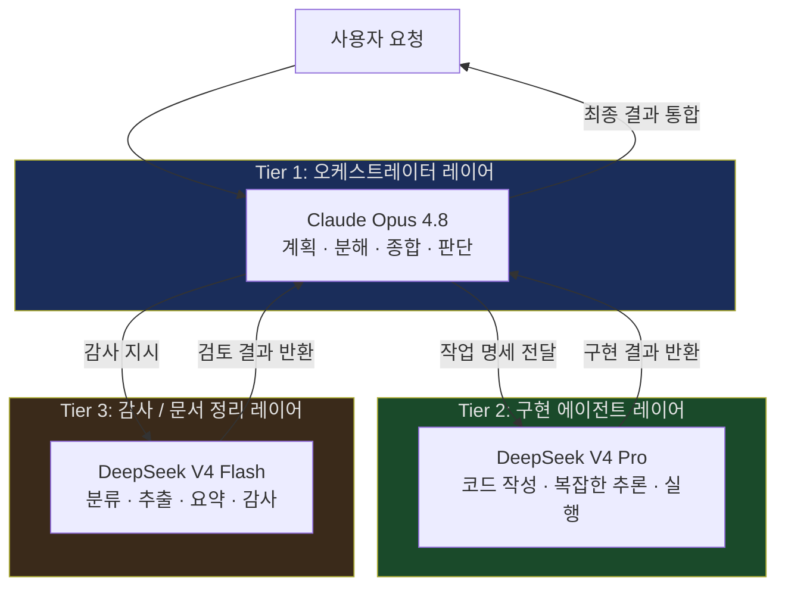
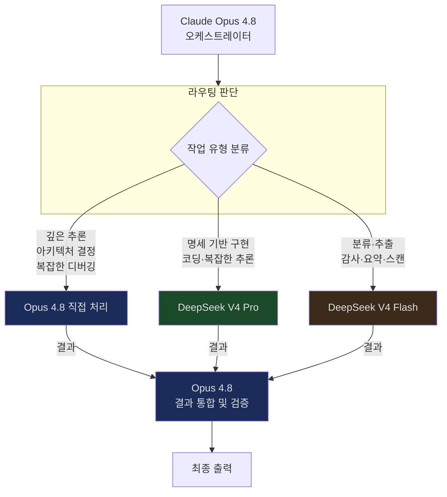
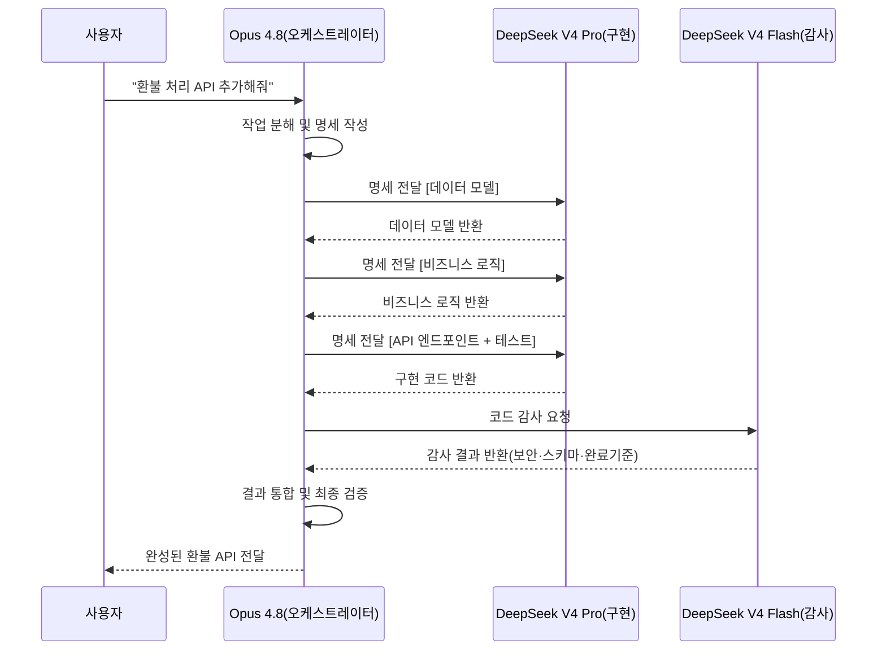
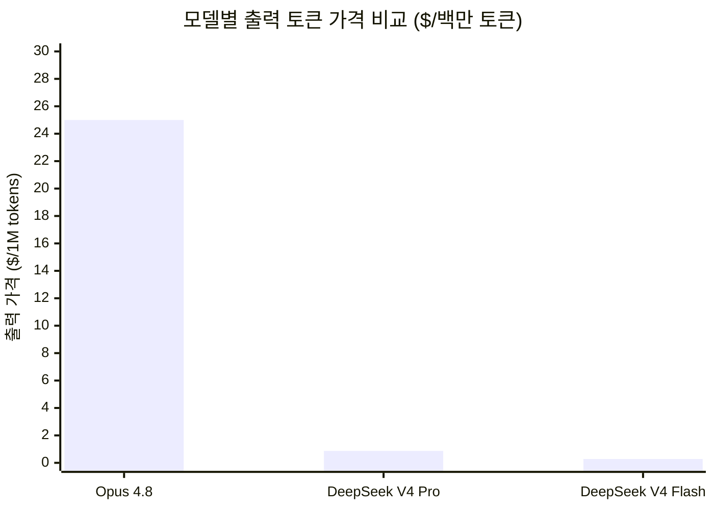
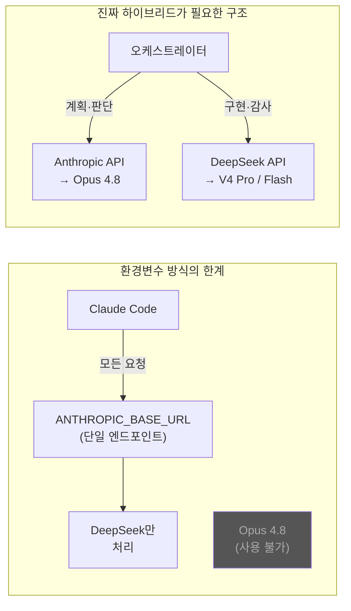
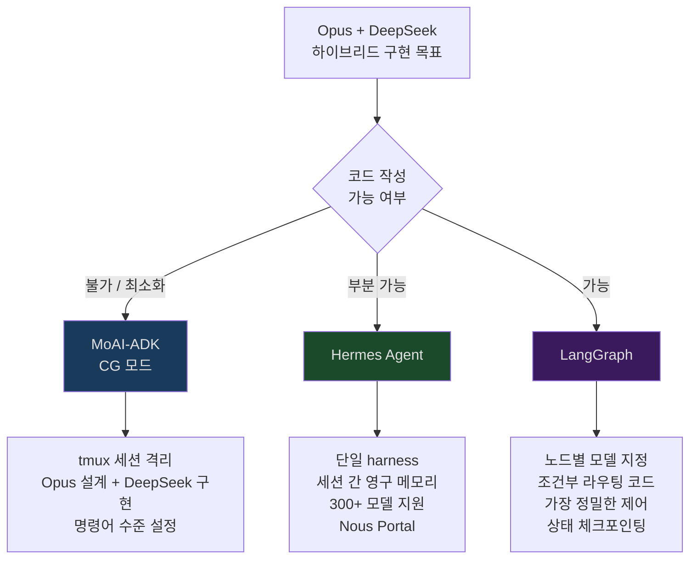
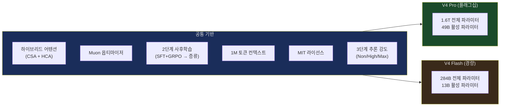
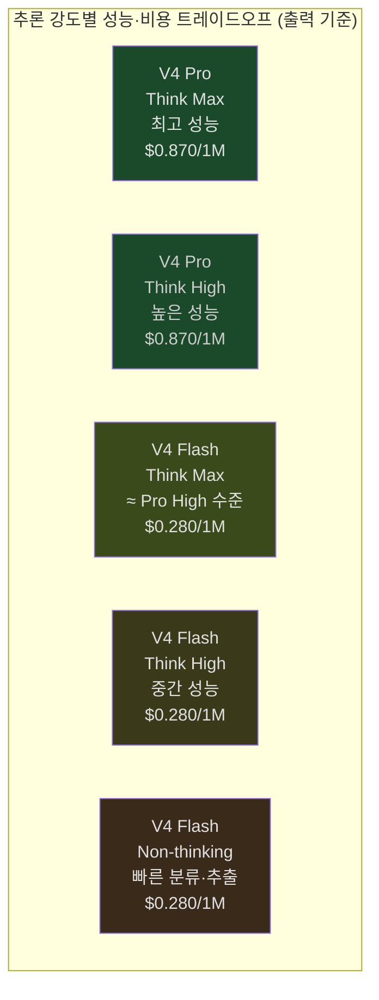
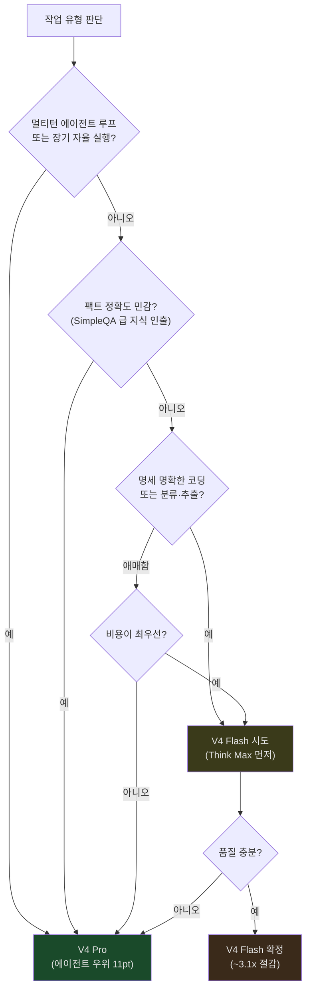

> **배경**: GeekNews(news.hada.io) 및 Hacker News 커뮤니티의 실무 실험에서 도출된 패턴을 기반으로,  
> Claude Opus 4.8 · DeepSeek V4 Pro · DeepSeek V4 Flash의 최신 공식 사양과 설계 원리를 종합하여 작성

## 관련글

[**DeepSeek V4 Pro vs GPT-5.5 Pro: 정밀도 대결**](https://k82022603.github.io/posts/deepseek-v4-pro-vs-gpt-5.5-pro-%EC%A0%95%EB%B0%80%EB%8F%84-%EB%8C%80%EA%B2%B0/)

---

## 1. 이 아키텍처가 존재하는 이유

에이전트 AI 시스템을 직접 운영해본 사람들이 반복적으로 도달하는 결론이 있다. **"하나의 강력한 모델이 모든 것을 담당하는 구조는 생각보다 잘 깨진다."** 그 이유를 이해하려면, 하나의 모델에 과도한 컨텍스트를 올려놓으면 무슨 일이 벌어지는지부터 살펴볼 필요가 있다.

Chroma Research가 명명한 **"컨텍스트 부패(context rot)"** 현상이 있다. 입력 토큰이 늘어날수록 모델 성능이 일관되게 저하되며, 특히 코딩처럼 다단계 추론이 필요한 작업에서 이 현상이 심하게 나타난다. 원인은 단순하다. 분석, 계획 수립, 구현, 검증을 하나의 에이전트가 모두 담당하면 역할의 경계가 흐려진다. 계획 단계에서 구현이 시작되고, 검증 단계가 생략된다. 초기 단계의 오해가 잘못된 계획으로 이어지고, 잘못된 계획이 잘못된 구현으로 전파된다. 오류 수정에는 처음부터 다시 시작해야 한다.

2026년의 AI 실무자 커뮤니티에서 공유되는 경험들은 이 문제에 대한 실용적 해법으로 하나의 패턴으로 수렴하고 있다. **역할을 분리하라.** 계획하는 에이전트, 구현하는 에이전트, 검수하는 에이전트를 각각 적합한 모델에 할당하고, 각 에이전트에게 독립된 컨텍스트 창을 주는 것이다. 그리고 이 패턴을 구현할 때 현재 시점에서 가장 비용 효율적인 조합으로 떠오른 것이 바로 **Claude Opus 4.8 + DeepSeek V4 Pro + DeepSeek V4 Flash** 구성이다.



---

## 2. 세 모델의 역할 개요

이 아키텍처를 이해하는 가장 빠른 방법은 각 역할을 인간 조직에 비유하는 것이다. Claude Opus 4.8은 **시니어 아키텍트이자 프로젝트 매니저**다. 무엇을 해야 하는지 결정하고, 작업을 분해하며, 누가 무엇을 담당할지 배정하고, 완성된 결과를 통합한다. DeepSeek V4 Pro는 **시니어 소프트웨어 엔지니어**다. 명확한 명세를 받아 실제로 코드를 작성하고, 복잡한 추론을 수행하며, 다단계 작업을 실행한다. DeepSeek V4 Flash는 **QA 엔지니어이자 문서 관리자**다. 빠르고 저렴하게 결과물을 스캔하고, 분류하고, 규칙 준수 여부를 확인하며, 문서를 정리한다.

| 역할 | 모델 | 핵심 특성 | 비용(출력 1M) |
|------|------|-----------|--------------|
| 오케스트레이터 | Claude Opus 4.8 | 최고 수준의 판단력, 컨텍스트 종합, 다단계 계획 | $25.00 |
| 구현 에이전트 | DeepSeek V4 Pro | 강력한 코딩·추론, 지시 정밀 이행 | $0.870 |
| 감사·문서 레이어 | DeepSeek V4 Flash | 저지연 분류·추출·요약, 고속 스캔 | $0.280 |

---

## 3. Tier 1: Claude Opus 4.8 — 오케스트레이터

### 3-1. 모델 개요

Claude Opus 4.8은 Anthropic이 2026년 5월 28일 출시한 현재 최고 수준의 범용 모델이다. API 모델 ID는 `claude-opus-4-8`이며, Claude API, Amazon Bedrock, Google Vertex AI, Microsoft Foundry에서 사용할 수 있다. 컨텍스트 윈도우는 1M 토큰이며 최대 출력은 128K 토큰이다. 가격은 입력 **$5.00/백만 토큰**, 출력 **$25.00/백만 토큰**으로 Opus 4.7과 동일하다. Fast Mode(고속 모드)는 표준 속도의 2.5배로 처리되며 입력 $10/$출력 $50로 책정돼 있다.

Artificial Analysis Intelligence Index에서 61.4점으로 현재 1위를 기록하고 있으며(GPT-5.5 60.2점 대비), SWE-bench Verified 88.6%, SWE-bench Pro 69.2%, OSWorld-Verified 83.4%를 달성했다. 특히 GDPval-AA에서 1890 Elo를 기록해 GPT-5.5보다 121 Elo 앞서 있다.

### 3-2. 왜 Opus 4.8이 오케스트레이터 역할에 적합한가

오케스트레이터의 핵심 역량은 **태스크 분해(task decomposition)** 와 **판단(judgment)** 이다. 모호하고 복잡한 요청을 받아 실행 가능한 단위로 쪼개고, 각 단위의 복잡도를 평가하여 적절한 에이전트에 배분하고, 돌아온 결과들을 통합하여 전체적으로 일관성이 있는지 판단하는 일이다. Anthropic은 공식 문서에서 "오케스트레이터 레이어는 가장 많은 추론이 필요한 레이어"라고 명시하며, 이 레이어에 Opus 4 수준의 모델 사용을 권장한다.

Opus 4.8에서 특히 주목할 개선점은 **정직성(honesty)** 향상이다. 에이전트 파이프라인에서 오케스트레이터가 확신이 없는 상황에서 계속 진행하는 것은 하위 에이전트 전체의 낭비로 이어진다. Opus 4.8은 불확실한 상황에서 멈추고, 명확화를 요청하거나 재계획하는 경향이 전작 대비 명확하게 강화됐다. 이는 에이전트 시스템의 안정성에 직접적인 영향을 미친다.

또 다른 핵심은 **Dynamic Workflows**다. Claude Code에서 리서치 프리뷰로 제공되는 이 기능은 오케스트레이터 세션 하나에서 최대 1,000개의 병렬 서브에이전트를 생성할 수 있게 한다. 개발자가 오케스트레이션 코드를 직접 작성하지 않아도 된다. Claude가 태스크를 분석하고, 어떻게 분할할지 스스로 판단하며, 서브에이전트를 생성하고, 결과를 집계하는 오케스트레이션 스크립트를 직접 작성한다. Anthropic의 내부 평가에 따르면 이 방식은 단일 에이전트 대비 약 90.2%의 성능 향상을 보였으나, 토큰 소비는 약 15배 증가했다.

### 3-3. 오케스트레이터가 실제로 하는 일

오케스트레이터는 전체 프로세스를 조율한다. 먼저 사용자의 요청을 분석하여 무엇이 필요한지 명세를 만든다. 그 다음 이 작업이 DeepSeek V4 Pro 수준의 추론이 필요한지, 아니면 V4 Flash의 빠른 스캔으로 충분한지 판단한다. 각 서브에이전트에게는 독립된 컨텍스트 창에 정확히 필요한 정보만 담은 작업 지시를 전달한다. 서브에이전트가 결과를 반환하면 그 결과들이 전체 목표와 일관성이 있는지 검토하고 필요하면 수정 요청을 보낸다. 마지막으로 모든 결과를 통합하여 사용자에게 전달한다.

이 구조의 핵심은 **오케스트레이터는 "무엇을 해야 하는지"를 책임지고, 서브에이전트는 "어떻게 하는지"를 책임진다**는 역할의 명확한 분리다. Anthropic은 이 원칙을 공식 멀티에이전트 설계 지침에 명시하고 있다.

---

## 4. Tier 2: DeepSeek V4 Pro — 구현 에이전트

### 4-1. 모델 개요

DeepSeek V4 Pro는 2026년 4월 24일 DeepSeek가 공개한 오픈 웨이트(MIT 라이선스) 플래그십 모델이다. 전체 파라미터 1.6조 개, 활성 파라미터 490억 개의 MoE(Mixture-of-Experts) 아키텍처를 기반으로 한다. 1M 토큰 컨텍스트를 지원하며, 가격은 DeepSeek 공식 API 기준 입력 **$0.435/백만 토큰**, 출력 **$0.870/백만 토큰**이다(2026년 5월 22일부터 고정). 고도화된 추론(Think High / Think Max) 모드를 지원하며, 비사고 모드(Non-think)도 지원한다.

Hugging Face 공식 모델 카드에 따르면, 하이브리드 어텐션 아키텍처(CSA + HCA)를 통해 1M 토큰 컨텍스트 환경에서 단일 토큰 추론 FLOPs를 V3.2 대비 27% 수준으로, KV 캐시 메모리를 10% 수준으로 줄였다. SWE-bench Verified 80.6%를 달성했으며, 이는 Claude Opus 4.6(80.8%)과 거의 동일한 수준이다. DeepSeek는 자사 내부 에이전트 코딩에 V4 Pro를 직접 사용하고 있으며, Claude Code, OpenClaw, OpenCode 등 주요 AI 에이전트 도구들과 공식적으로 통합되어 있음을 밝혔다.

### 4-2. 왜 V4 Pro가 구현 에이전트 역할에 적합한가

구현 에이전트의 핵심 역량은 **정확한 지시 이행**과 **코드 신뢰성**이다. 오케스트레이터로부터 명확하게 정의된 명세를 받아 그것을 정확하게 실행하는 것이 주된 역할이다. 이 역할에서 "창의적 해석"은 오히려 위험하다. 요청한 것 이상을 추가하거나, 스키마를 임의로 변경하거나, 요청하지 않은 절차를 끼워 넣는 동작은 파이프라인 하위 단계로 갈수록 오류를 누적·증폭시킨다. V4 Pro는 요청된 것만 정확하게 수행하는 경향이 강하며, 이것이 구현 에이전트로서의 신뢰성을 높인다.

코딩 성능 측면에서 V4 Pro는 80.6% SWE-bench Verified로 주요 프런티어 모델에 준하는 수준이다. 코드베이스 전체 분석, 다단계 자동화, 대규모 정보 종합 같은 복잡한 작업에서도 안정적으로 동작한다. 추론 강도를 High 또는 Max로 설정하면 더 깊은 사고 과정을 거치며, 이는 특히 알고리즘 설계나 복잡한 버그 수정 같은 작업에서 유용하다.

비용 측면에서 V4 Pro는 Claude Opus 4.8보다 출력 기준 약 **28.7배** 저렴하다. 구현 에이전트는 일반적으로 긴 코드를 출력하므로 출력 토큰 비율이 높다. 가령 1,000줄짜리 모듈 구현 작업을 오케스트레이터 대신 V4 Pro에 할당하면, 같은 작업을 Opus 4.8에 맡기는 것보다 출력 비용 기준으로 약 28.7배 절감된다. 코드 구현처럼 반복 호출이 많은 작업에서 이 차이는 누적되어 수백, 수천 달러의 실질적 차이가 된다.

### 4-3. 오케스트레이터와의 인터페이스

V4 Pro가 구현 에이전트로 작동할 때의 핵심은 **독립된 컨텍스트 창**이다. 전체 파이프라인의 대화 이력이나 다른 서브에이전트의 작업 내용은 V4 Pro에게 전달되지 않는다. 오케스트레이터(Opus 4.8)가 "이번 서브에이전트가 알아야 할 것만" 압축하여 전달한다. 이것이 컨텍스트 부패를 방지하는 핵심 메커니즘이다.

예를 들어 로그인 모듈 구현을 V4 Pro에게 맡긴다면, Opus 4.8은 다음과 같은 내용만 담은 독립 프롬프트를 전달한다. 전체 시스템의 기술 스택, 이 모듈이 따라야 할 인터페이스 계약, 완료 기준, 사용 가능한 도구 목록. V4 Pro는 이 이상의 컨텍스트 없이 작업을 완료하고 결과물만 반환한다. Opus 4.8은 이 결과물이 전체 아키텍처와 부합하는지 판단하고, 필요하면 수정 명세를 다시 전달한다.

---

## 5. Tier 3: DeepSeek V4 Flash — 감사 및 문서 정리 레이어

### 5-1. 모델 개요

DeepSeek V4 Flash는 V4 Pro와 같은 날(2026년 4월 24일) 공개된 V4 패밀리의 경량 티어 모델이다. 전체 파라미터 2,840억 개, 활성 파라미터 130억 개의 MoE 아키텍처를 사용한다. V4 Pro와 동일한 하이브리드 어텐션(CSA + HCA) 아키텍처를 공유하며, 1M 토큰 컨텍스트를 지원한다. 가격은 입력 **$0.14/백만 토큰**, 출력 **$0.28/백만 토큰**으로, Opus 4.8 대비 출력 기준 약 **89.3배** 저렴하다. MIT 라이선스로 공개되어 자체 호스팅도 가능하다(단, 오프프레미스 배포에는 ~570GB 저장 공간 필요).

공식 문서에 따르면 V4 Flash는 지시 이행, 분류, 단답형 Q&A 등 지연 시간과 토큰 비용이 추론 깊이보다 중요한 작업을 위해 설계되었다. V4 Flash는 생각 모드(Thinking)와 비생각 모드(Non-Thinking)를 모두 지원하지만, 감사·분류 역할에서는 대부분 Non-Thinking 모드로 실행된다. V4 Flash는 코더사이라(codersera.com)에 따르면 코드베이스 읽기, 의존성 감사(audit), 레포지토리 요약에 "명백한 첫 번째 선택지"로 권장된다.

### 5-2. 감사(Audit) 역할이란 무엇인가

소프트웨어 개발 파이프라인에서 "감사"는 구현된 코드나 생성된 문서가 사전 정의된 규칙이나 기준을 충족하는지 확인하는 과정이다. 전통적인 소프트웨어 개발에서 이 역할은 린터(linter), 정적 분석 도구, 코드 리뷰 체크리스트가 담당했다. AI 에이전트 파이프라인에서는 V4 Flash가 이 역할을 맡는다.

구체적으로 V4 Flash가 수행하는 감사 작업들은 다음과 같다. 구현된 코드가 오케스트레이터가 전달한 명세를 준수하는지 확인한다. 출력 JSON 또는 구조화 데이터가 예상한 스키마와 타입을 따르는지 검증한다. 의존성 목록이나 임포트 문을 스캔하여 허용되지 않은 라이브러리 사용 여부를 파악한다. 코드 전반에서 보안 취약점 패턴(SQL 인젝션 가능성, 하드코딩된 자격증명 등)을 스캔한다. 긴 문서나 로그 파일에서 특정 패턴이나 이상 징후를 추출한다. 이 모든 작업은 깊은 추론이 아니라 **패턴 인식과 빠른 스캔**이 핵심이다.

### 5-3. 문서 정리(Document Organization) 역할이란 무엇인가

문서 정리 역할은 다양한 형태의 입력 텍스트를 구조화된 형식으로 변환하거나, 중요 정보를 추출하여 요약하는 작업이다. 회의록에서 결정사항과 액션 아이템을 추출하는 것, 긴 기술 문서에서 핵심 요약을 생성하는 것, 코드 커밋 메시지들을 분류하여 변경 로그를 만드는 것, 로그 파일에서 에러 패턴을 추출하여 일별 리포트를 만드는 것이 대표적인 예다.

이런 작업들은 공통적인 특징이 있다. 입력 텍스트가 길고 반복적이다. 명확한 규칙에 따라 분류하거나 추출하는 것이 주된 작업이다. 높은 추론 능력보다는 일관된 패턴 처리 능력이 중요하다. 그리고 호출 횟수가 많다. V4 Flash는 바로 이 특성에 최적화된 모델이다. V4 Pro와 동일한 아키텍처를 기반으로 하되, 더 작은 활성 파라미터(13B)로 더 빠르고 저렴하게 이런 작업들을 처리한다.

### 5-4. V4 Flash의 경계

V4 Flash의 역할을 올바르게 설정하려면 이 모델이 잘 못하는 것도 알아야 한다. 에이전트 벤치마크인 Terminal-Bench 2.0에서 V4 Pro 67.9%, V4 Flash 56.9%로 11포인트 차이가 난다. 자율적인 멀티턴 에이전트 루프, 새로운 알고리즘을 설계하는 창의적 추론, 전략적 의사결정은 V4 Flash의 영역이 아니다. V4 Flash는 오케스트레이터(Opus 4.8)가 무엇을 해야 하는지 명확히 정의해준 다음, 그 지시를 빠르고 저렴하게 실행하는 역할에 최적화되어 있다.

---

## 6. 아키텍처 설계 원리

### 6-1. 컨텍스트 분리가 핵심이다

이 아키텍처의 가장 중요한 설계 원칙은 **각 서브에이전트에게 독립된 컨텍스트 창을 부여한다**는 것이다. Anthropic의 공식 멀티에이전트 리서치 시스템 설명에 따르면, 서브에이전트는 다른 서브에이전트의 존재를 알지 못한다. 각자는 오케스트레이터가 전달한 압축된 작업 지시서만을 컨텍스트로 갖는다.

이 설계가 중요한 이유는 두 가지다. 하나는 성능이고, 다른 하나는 비용이다. 성능 면에서, 서브에이전트가 자신의 역할과 무관한 방대한 컨텍스트를 갖지 않으므로 자신이 맡은 작업에만 집중할 수 있다. 비용 면에서, 불필요한 컨텍스트를 토큰으로 소비하지 않아도 된다.

### 6-2. 역할 명확성이 에러 전파를 막는다

오케스트레이터에게는 "무엇을 해야 하는가"만 묻고, 서브에이전트에게는 "어떻게 하는가"만 요구하는 구조는 에러 전파를 차단하는 자연스러운 방어막이다. V4 Pro가 구현 중에 실수를 하더라도, 그 실수의 영향 범위가 해당 서브에이전트의 컨텍스트 창 안으로 격리된다. 오케스트레이터(Opus 4.8)가 결과를 검토하여 이상이 있으면 수정 지시를 내리는 루프가 형성된다.

Anthropic의 설명에 따르면 이 패턴에서 "각 서브에이전트는 객관적 목표, 출력 형식, 사용할 도구와 소스에 대한 지침, 명확한 작업 경계"를 포함한 작업 지시서를 받는다.

### 6-3. 모델 선택이 라우팅 로직으로 이어진다

이 아키텍처에서 오케스트레이터는 각 작업의 복잡도를 평가하여 어느 모델에 배분할지 결정하는 라우팅 역할도 수행한다. MindStudio의 분석에 따르면, 오케스트레이터가 태스크를 유형과 복잡도에 따라 분류하고 어떤 서브에이전트를 호출할지 JSON 형태로 결정하는 방식이 일반적이다. 규칙 기반 라우팅(결정적, 더 저렴하고 예측 가능)과 LLM 기반 라우팅(유연하지만 토큰 비용 발생) 중에서 선택하거나 조합하여 사용한다.

실제 운영에서는 다음과 같은 라우팅 기준이 통용된다. 새로운 알고리즘 설계, 전체 아키텍처 결정, 복잡한 에러 진단처럼 깊은 추론이 필요한 경우는 Opus 4.8이 직접 처리하거나 V4 Pro에 명확한 명세와 함께 위임한다. 구체적인 기능 구현, 테스트 코드 작성, API 응답 파싱처럼 명세가 명확한 코딩 작업은 V4 Pro로 라우팅한다. 출력물의 규칙 준수 검증, 문서 요약, 분류, 로그 추출처럼 패턴 스캔이 주된 작업은 V4 Flash로 라우팅한다.



---

## 7. 실제 워크플로 예시

### 7-1. 예시: 백엔드 기능 개발 파이프라인

사용자가 "결제 서비스에 환불 처리 API를 추가해줘"라는 요청을 보낸다고 가정한다. 이 요청이 세 레이어를 거쳐 처리되는 과정은 다음과 같다.

**Opus 4.8 (오케스트레이터 — 계획 단계):** 기존 코드베이스 구조를 검토하고, 환불 API가 의존하는 인터페이스를 파악한다. 작업을 "데이터 모델 정의", "비즈니스 로직 구현", "API 엔드포인트 작성", "테스트 코드 작성" 네 단계로 분해한다. 각 단계에 대한 구체적인 명세서를 작성하여 V4 Pro에 전달할 독립 프롬프트를 생성한다.

**DeepSeek V4 Pro (구현 에이전트 — 실행 단계):** 명세에 따라 각 단계를 순차 또는 병렬로 구현한다. 데이터 모델을 정의하고, 환불 검증 로직과 롤백 메커니즘이 포함된 비즈니스 로직을 작성하며, REST 엔드포인트를 구현하고, 유닛 테스트를 작성한다. 각 단계의 결과를 Opus 4.8에 반환한다.

**DeepSeek V4 Flash (감사 레이어 — 검증 단계):** 구현된 코드를 빠르게 스캔한다. 환불 엔드포인트에 인증 미들웨어가 올바르게 적용되어 있는지 확인한다. 하드코딩된 자격증명이나 SQL 인젝션 취약점 패턴이 없는지 검사한다. 테스트 코드가 명세의 완료 기준을 충족하는지 체크리스트 형태로 검증한다. 발견된 문제를 구조화된 JSON으로 Opus 4.8에 반환한다.

**Opus 4.8 (통합 단계):** Flash의 감사 결과를 검토하여 심각한 문제가 있으면 수정 명세를 V4 Pro에 재전달한다. 모든 검증을 통과하면 결과를 통합하고 사용자에게 보고한다.



### 7-2. 예시: 문서 처리 파이프라인

방대한 회의록 50건을 처리하여 각 회의의 핵심 결정사항과 액션 아이템을 추출하고, 담당자별로 정리하는 작업을 가정한다.

이 경우 오케스트레이터는 처리 전략을 결정한다. 50건의 회의록 각각에 대해 독립적인 추출 작업을 병렬로 실행할 수 있다는 것을 파악하고, 50개의 서브에이전트에 작업을 분산한다. 각 서브에이전트는 회의록 한 건씩을 입력받아 결정사항과 액션 아이템, 담당자, 마감일을 정해진 JSON 스키마로 추출하는 패턴 추출 작업을 수행한다. 추론이 아니라 분류·추출이 주된 작업이므로, 이 레이어에는 V4 Flash처럼 저렴하고 빠른 경량 모델이 이상적인 역할이다.

한 가지 중요한 주의사항이 있다. 서브에이전트가 실제로 V4 Flash를 사용하도록 하려면 9장에서 설명하게 될 별도 하네스(MoAI-ADK, LangGraph 등)가 필요하다. Claude Code 단독 환경에서 Dynamic Workflows로 생성된 서브에이전트들은 Anthropic API를 통해 실행되므로 V4 Flash가 될 수 없다. 순수 Claude Code 환경이라면 서브에이전트 모델로 Claude Haiku를 활용하는 것이 유사한 비용 최적화 효과를 낸다.

50건의 추출 결과가 모두 돌아오면 오케스트레이터는 담당자별로 데이터를 집계하고, 전체 흐름에서 중요한 패턴(반복되는 미해결 이슈, 특정 담당자의 과부하 등)을 파악하여 최종 리포트를 작성한다. 만약 이 작업을 단일 에이전트 하나로만 순차 처리했다면, 컨텍스트가 누적될수록 성능이 저하되고 처리 시간도 크게 늘어난다.

---

## 8. 비용 분석: 숫자로 보는 이점

이 아키텍처의 경제적 근거를 구체적인 수치로 살펴본다. 아래는 2026년 6월 기준 세 모델의 공식 API 가격이다.



| 모델 | 입력 ($/1M) | 출력 ($/1M) | Opus 대비 출력 비율 |
|------|------------|------------|---------------------|
| Claude Opus 4.8 | $5.000 | $25.000 | 1× (기준) |
| DeepSeek V4 Pro | $0.435 | $0.870 | **~28.7×** 저렴 |
| DeepSeek V4 Flash | $0.140 | $0.280 | **~89.3×** 저렴 |

### 8-1. 구체적 비용 시뮬레이션

하나의 기능 구현 요청이 다음과 같은 토큰을 소비한다고 가정한다. 오케스트레이터(Opus 4.8) 입력 5K + 출력 2K 토큰, 구현 에이전트(V4 Pro) 입력 10K + 출력 15K 토큰, 감사 레이어(V4 Flash) 입력 8K + 출력 3K 토큰.

**티어드 아키텍처 비용:**
- Opus 4.8: 5K×$0.005 + 2K×$0.025 = $0.025 + $0.050 = **$0.075**
- V4 Pro: 10K×$0.000435 + 15K×$0.00087 = $0.00435 + $0.01305 = **$0.0174**
- V4 Flash: 8K×$0.00014 + 3K×$0.00028 = $0.00112 + $0.00084 = **$0.00196**
- **총계: 약 $0.094 / 요청**

**모든 작업을 Opus 4.8만으로 처리할 경우:**
- 동일 작업량 가정 (23K 입력 + 20K 출력):
- 23K×$0.005 + 20K×$0.025 = $0.115 + $0.500 = **$0.615 / 요청**

실제 코드 작성 작업에서 티어드 아키텍처는 순수 Opus 4.8 구성 대비 **약 6.5배** 저렴하게 비슷하거나 더 나은 결과를 낼 수 있다. 하루 100건, 월 3,000건 처리 기준으로 계산하면 월 $282(티어드) vs $1,845(All-Opus)의 차이가 된다.

연구 사례 하나를 더 들면, HN 사용자가 직접 수행한 취약점 스캐닝 벤치마크에서 DeepSeek V4 Pro는 전체 벤치마크에 약 $1이 들었고, GPT-5.5 Pro는 동일한 작업에 $100 이상을 소비했다. Claude Opus는 GPT-5.5 Pro보다 약 30% 저렴했으며, 성능은 DeepSeek V4 Pro, Opus 4.8, MiMo V2.5 Pro 모두 9개 버그 중 4개를 발견하여 동일했다.

---

## 9. 진짜 하이브리드 아키텍처를 구현하는 방법

### 9-1. 환경변수만으로는 안 되는 이유

Claude Code에서 모델 프로바이더를 전환하는 가장 간단한 방법은 환경변수 설정이다. DeepSeek는 Anthropic Messages API와 호환되는 엔드포인트를 공식 지원하기 때문에, `ANTHROPIC_BASE_URL=https://api.deepseek.com/anthropic`로 설정하면 Claude Code의 모든 API 호출이 DeepSeek 서버로 향한다. 하지만 바로 이 구조가 한계다. `ANTHROPIC_BASE_URL`은 **모든 API 호출을 단일 엔드포인트로 전환하는 전역 스위치**이기 때문에, 이 설정만으로는 진짜 Opus + DeepSeek 하이브리드를 구현할 수 없다. 이유를 정확하게 정리하면 다음과 같다.

첫째, `ANTHROPIC_BASE_URL`은 모든 요청에 단일하게 적용된다. Claude Code 내에서 태스크 유형을 구분해 "이 요청은 Anthropic으로, 저 요청은 DeepSeek로" 분기하는 라우팅 로직이 없다. 둘째, `ANTHROPIC_DEFAULT_OPUS_MODEL` 같은 변수는 어떤 모델명을 쓸지만 지정할 뿐, Base URL을 우회하지 않는다. 즉, `ANTHROPIC_DEFAULT_OPUS_MODEL=claude-opus-4-8`로 설정하더라도 요청은 여전히 DeepSeek 서버로 향하고, DeepSeek 서버에 `claude-opus-4-8` 모델이 없으므로 오류가 발생한다. 셋째, 모든 모델명에 DeepSeek 모델을 지정하는 방식(예: `ANTHROPIC_DEFAULT_OPUS_MODEL=deepseek-v4-pro[1m]`)은 Claude Code를 DeepSeek로 **완전히 대체**하는 구성이다. Opus가 할 일이 없는 것이 아니라, Opus 자체가 파이프라인에서 빠진다.



결론적으로, 1~8장에서 설명한 3-티어 아키텍처를 실제로 구현하려면 **Claude Code 자체만으로는 불가능하고, Anthropic API와 DeepSeek API를 코드 레벨에서 명시적으로 분리 호출하는 별도 하네스가 필요하다.** 현재 이 역할을 수행할 수 있는 대표적인 프레임워크가 MoAI-ADK, Hermes Agent, LangGraph다.

---

### 9-2. 방법 A: MoAI-ADK — CG 모드 (tmux 세션 격리)

MoAI-ADK는 Claude Code 위에 올라가는 에이전트 개발 키트로, SPEC-First 개발 방법론과 20개의 전문화된 에이전트를 제공한다. 이 아키텍처와 관련하여 MoAI-ADK가 제공하는 핵심 기능은 **CG 모드(Claude + GLM 하이브리드 모드)** 와 **Git Worktree 격리**다.

**CG 모드의 작동 원리:**

CG 모드는 `tmux` 세션 레벨의 환경변수 격리를 통해 구현된다. 리더(오케스트레이터) 창은 Claude API를 사용하고, 워커(구현 에이전트) 창은 GLM API를 사용한다. DeepSeek V4 Pro도 OpenAI 호환 엔드포인트를 지원하기 때문에, GLM 대신 DeepSeek를 워커 모델로 지정하는 방식으로 확장할 수 있다. MoAI-ADK GitHub에 따르면 CG 모드의 실행 순서는 다음과 같다. 먼저 GLM 설정을 tmux 세션 환경에 주입하고(`ANTHROPIC_AUTH_TOKEN`, `BASE_URL`, `MODEL_*` 변수), 리더 창에서는 `settings.local.json`에서 GLM 환경을 제거하여 Claude API가 유지되도록 한다.

**Git Worktree를 통한 격리:**

MoAI-ADK의 핵심 팁은 Worktree 환경에서 GLM을 사용하는 것이다. Opus로 설계하고 GLM로 대량 구현하면 비용을 최대 70% 절감할 수 있다. 동일 세션 내에서 모델을 변경하면 인증 오류가 발생하기 때문에, Git Worktree가 각 SPEC마다 독립적인 LLM 설정을 유지하는 해법으로 사용된다.

```bash
# MoAI-ADK 하이브리드 구성 예시

# 설계 단계: Claude Opus 4.8 사용 (터미널 1)
moai cc                           # Claude Code 모드 활성화
# Claude Code 내에서 /moai plan "기능 설계" 실행
# → Opus 4.8이 SPEC 문서 작성

# 구현 단계: DeepSeek V4 Pro 사용 (터미널 2, 새 Worktree)
moai worktree feature/auth-module --tmux
# 새 tmux 세션에서 DeepSeek 환경변수 주입
moai glm                          # GLM/DeepSeek 모드 전환
# → DeepSeek V4 Pro가 SPEC 기반 구현

# 또는 CG 모드로 두 창을 동시에 관리
moai cg                           # Leader=Claude, Workers=GLM/DeepSeek
```

**MoAI-ADK 방식의 특징:** Claude Code의 인터페이스, 도구 연동, AGENTS.md 체계를 그대로 활용한다. 별도 코딩 없이 명령어 수준에서 하이브리드를 구성할 수 있다. 단, tmux 환경이 필요하고 현재 공식 지원 대상 모델은 GLM이며 DeepSeek는 호환 엔드포인트를 통한 간접 지원이다.

---

### 9-3. 방법 B: Hermes Agent — 세션 내 프로바이더 전환

Hermes Agent는 2026년 2월 Nous Research가 출시한 오픈소스 에이전트 프레임워크로, 175,000 GitHub 스타를 기록하며 2026년 가장 빠르게 성장한 오픈소스 에이전트 프레임워크가 됐다. "Hermes는 하네스이지 두뇌가 아니다. Claude, GPT, Gemini, DeepSeek, Kimi 또는 300개 이상의 모델 중 어느 것이든 연결할 수 있고, 명령어 하나로 전환할 수 있다."

**Hermes Agent의 멀티 프로바이더 구조:**

Hermes는 20개 이상의 추론 프로바이더와 호환된다. DeepSeek에서 Claude로, 또는 로컬 모델로 워크플로 중간에 전환할 수 있으며, 설정 변경 하나로 아키텍처 변경 없이 이루어진다. 다만 이 전환은 자동 라우팅이 아니라 사용자가 명시적으로 지시하는 수동 전환 방식이다. 특정 노드에 특정 모델을 자동 배정하는 그래프 레벨 라우팅은 LangGraph에서 가능하며, Hermes는 그보다 유연성이 낮은 대신 코드 작성 없이 사용할 수 있는 것이 강점이다.

```bash
# Hermes Agent 설치 (공식 문서: hermes-agent.nousresearch.com 참조)
# npm 또는 공식 설치 스크립트 사용

# 오케스트레이터 모델: Claude Opus 4.8 설정
hermes config set model anthropic/claude-opus-4-8
hermes config set ANTHROPIC_API_KEY sk-ant-...

# DeepSeek 프로바이더 설정 (OpenAI 호환 방식)
# 정확한 환경변수명은 공식 AI Providers 문서 참조:
# hermes-agent.nousresearch.com/docs/integrations/providers

# 실행
hermes
# hermes model 명령으로 언제든 모델/프로바이더 전환 가능
```

Hermes Agent는 최소 64,000 토큰 컨텍스트를 가진 모델을 요구하며, 이보다 작은 컨텍스트 윈도우를 가진 모델은 멀티스텝 도구 호출 워크플로에 필요한 작업 메모리를 유지할 수 없어 시작 시 거부된다.

**Hermes Agent 방식의 특징:** 세션 간 영구 메모리를 지원하므로 이전 작업 맥락이 누적된다. 자체 Skills 시스템으로 반복 작업을 자동화할 수 있다. Nous Portal을 통해 300개 이상의 모델(Claude, GPT, Gemini, DeepSeek, Qwen, Kimi, GLM, MiniMax, Grok 등)에 단일 OAuth 로그인으로 접근할 수 있다. 단, 현재 Hermes의 멀티 프로바이더 구성은 세션 전체에 단일 모델을 적용하거나 태스크 단위로 수동 전환하는 방식이며, "이 노드는 Opus, 저 노드는 DeepSeek"처럼 그래프 레벨에서 자동 라우팅하는 기능은 LangGraph보다 제한적이다.

---

### 9-4. 방법 C: LangGraph — 노드별 모델 지정 (가장 유연)

LangGraph는 감독자(supervisor) 패턴에서 하나의 StateGraph 안에 여러 노드를 구성하는데, supervisor 노드가 대화를 읽고 다음 워커를 결정하거나 종료를 출력하며, 각 전문가 에이전트는 자신의 도구와 함께 독립적으로 동작하고 매 턴 후 supervisor에게 보고한다.

이 구조의 핵심은 **각 노드에 서로 다른 LLM을 지정할 수 있다**는 점이다. 오케스트레이터 노드에는 `langchain-anthropic`의 Opus 4.8을, 구현 에이전트 노드에는 `langchain-openai`의 DeepSeek API(OpenAI 호환 엔드포인트 사용)를 직접 연결할 수 있다.

```python
from langgraph.graph import StateGraph
from langchain_anthropic import ChatAnthropic
from langchain_openai import ChatOpenAI

# 오케스트레이터: Claude Opus 4.8 (Anthropic API)
orchestrator_llm = ChatAnthropic(
    model="claude-opus-4-8",
    api_key="sk-ant-..."
)

# 구현 에이전트: DeepSeek V4 Pro (OpenAI 호환 엔드포인트 /v1)
# ※ OpenAI 호환 엔드포인트에서는 [1m] 접미사 불필요
#   ([1m]은 Anthropic 호환 엔드포인트 /anthropic 전용)
implementer_llm = ChatOpenAI(
    model="deepseek-v4-pro",
    api_key="sk-deepseek-...",
    base_url="https://api.deepseek.com/v1"
)

# 감사 에이전트: DeepSeek V4 Flash
auditor_llm = ChatOpenAI(
    model="deepseek-v4-flash",
    api_key="sk-deepseek-...",
    base_url="https://api.deepseek.com/v1"
)

# 그래프 구성: 각 노드가 독립적으로 다른 모델 사용
builder = StateGraph(State)
builder.add_node("orchestrator", orchestrator_node)   # Opus 4.8
builder.add_node("implementer", implementer_node)     # V4 Pro
builder.add_node("auditor",     auditor_node)         # V4 Flash

# 조건부 엣지로 라우팅
builder.add_conditional_edges(
    "orchestrator",
    route_task,   # 태스크 유형에 따라 implementer 또는 auditor로 분기
    {"implement": "implementer", "audit": "auditor", "done": END}
)
```

**LangGraph 방식의 특징:** 세 방법 중 가장 정밀하게 멀티 모델 라우팅을 제어할 수 있다. 조건부 엣지(conditional edges)로 작업 유형·복잡도·비용 기준을 코드로 명시하며, 각 노드의 상태(state)가 체크포인터에 저장되어 재개나 디버깅이 용이하다. LangGraph는 유향 그래프(directed graph)에 조건부 엣지를 사용하는 오케스트레이션 모델로, 2026년 기준 월 검색량 27,100건으로 멀티에이전트 프레임워크 중 1위를 기록하고 있다. 단, Python/TypeScript 코드 작성이 필요하다는 진입 장벽이 있고, Claude Code처럼 터미널에서 바로 쓰는 방식이 아니라 별도 애플리케이션을 만드는 접근이다.

---

### 9-5. 세 방법 비교 요약



| 항목 | MoAI-ADK | Hermes Agent | LangGraph |
|------|----------|--------------|-----------|
| 진입 장벽 | 낮음 (명령어) | 낮음 (명령어) | 높음 (코드) |
| 모델 라우팅 정밀도 | 중간 (세션/워크트리 단위) | 중간 (태스크 단위 수동) | 높음 (노드 단위 자동) |
| Claude Code 통합 | 긴밀 (위에 올라감) | 독립적 | 독립적 |
| 영구 메모리 | 제한적 | 있음 | 체크포인터 |
| 오픈소스 | 있음 (MIT) | 있음 (MIT) | 있음 (MIT) |
| Opus + DeepSeek 동시 사용 | CG 모드로 가능 | 수동 전환 | 코드로 자동 라우팅 |

Claude Code에 익숙하고 코드 작성 없이 빠르게 시작하고 싶다면 **MoAI-ADK CG 모드**가 가장 현실적이다. 비용 최적화보다 영구 메모리와 비동기 스케줄링이 중요하다면 **Hermes Agent**가 적합하다. 프로덕션 파이프라인에서 모델 라우팅을 코드로 완전히 제어해야 한다면 **LangGraph**가 가장 강력하다.

---

## 10. 주의사항 및 한계

### 10-1. 멀티 에이전트가 만병통치약은 아니다

2026년의 AI 실무자 커뮤니티에서 공유되는 중요한 교훈 중 하나는 "멀티 에이전트는 하나의 에이전트가 정말로 충분하지 않을 때만 의미가 있다"는 것이다. 에이전트 숫자를 늘리면 오케스트레이션 복잡도, 오류 전파 경로, 총 토큰 소비량도 함께 늘어난다. Anthropic의 다중 에이전트 리서치 시스템이 단일 에이전트 대비 90.2% 성능 향상을 달성한 것은 사실이지만, 토큰 소비는 약 15배 늘었다.

적합한 사용 시나리오는 다음과 같다. 독립적으로 처리 가능한 작업이 여럿 있을 때, 도메인이 명확히 분리된 전문 지식이 필요할 때, 파이프라인의 여러 단계에서 서로 다른 복잡도 요구사항이 있을 때다. 반대로, 순차 의존성이 강하거나 빠른 피드백이 중요한 단일 태스크라면 단일 에이전트가 더 나은 선택일 수 있다.

### 10-2. 오케스트레이터 품질이 전체를 결정한다

"하네스가 흔들리면 에이전트는 더 많이 흔들린다"는 원칙이 여기서도 적용된다. 오케스트레이터(Opus 4.8)가 생성하는 서브에이전트 명세의 품질이 전체 파이프라인의 성패를 결정한다. 모호한 명세는 V4 Pro에서 모호한 구현을 낳고, 잘못 설계된 감사 지시는 V4 Flash에서 의미 없는 감사 결과를 낳는다. 오케스트레이터를 설계할 때 각 서브에이전트에게 전달할 프롬프트의 품질에 가장 많은 투자를 해야 한다.

### 10-3. DeepSeek 지연 시간(레이턴시) 고려

DeepSeek 서버는 중국에 위치하므로, 아시아 이외 지역에서는 200~400ms의 추가 지연이 발생할 수 있다. 실시간 대화형 워크플로보다는 배치 처리나 백그라운드 파이프라인에 더 적합하다. 레이턴시가 중요한 워크플로에서는 OpenRouter나 Fireworks 같은 미국 또는 유럽 기반 제공업체를 통해 DeepSeek V4 모델을 라우팅하는 것도 옵션이다. 단, 이 경우 DeepSeek 직접 API의 캐시 적중(cache hit) 가격 혜택을 받지 못할 수 있다.

### 10-4. 데이터 프라이버시 정책 검토 필수

DeepSeek V4 Pro는 MIT 라이선스로 공개된 오픈 웨이트 모델이므로 자체 호스팅이 가능하다. 하지만 V4 Pro의 전체 가중치는 약 3.2TB 규모로 자체 호스팅에는 4× H200 141GB 또는 멀티노드 환경이 필요하다. 데이터 보안이 중요한 기업 환경이라면 DeepSeek 직접 API(중국 서버) 사용보다 자체 호스팅 또는 Fireworks 같은 컴플라이언스 인증 제공업체를 통한 사용을 고려해야 한다. V4 Flash(약 570GB)는 상대적으로 자체 호스팅이 현실적이다.

---

## 11. 결론

Claude Opus 4.8을 오케스트레이터로, DeepSeek V4 Pro를 구현 에이전트로, DeepSeek V4 Flash를 감사 및 문서 정리 레이어로 사용하는 아키텍처는 세 가지 핵심 통찰의 교차점에서 탄생한다.

첫째, **역할 분리는 성능을 높인다.** 하나의 에이전트가 계획과 구현과 검증을 모두 담당할 때 발생하는 컨텍스트 부패와 역할 혼선을 방지한다. 각 에이전트는 독립된 컨텍스트 창에서 명확히 정의된 역할만 수행한다.

둘째, **비용은 라우팅으로 통제된다.** 모든 작업에 Opus 4.8을 사용하는 것은 "모든 나사를 박을 때 렌치를 쓰는 것"과 같다. 복잡한 판단과 통합은 Opus 4.8이, 정밀한 코드 구현은 V4 Pro가, 반복적 스캔과 분류는 V4 Flash가 담당하면, 전체 비용을 수십 배 줄이면서 품질을 유지할 수 있다.

셋째, **최고 모델이 항상 최선은 아니다.** 에이전트 파이프라인에서 Opus 4.8이 빛나는 영역은 판단과 통합이지 실행이 아니다. V4 Pro는 Opus 4.8보다 출력 기준 28.7배 저렴하면서 주요 코딩 벤치마크에서 비슷한 성능을 낸다. V4 Flash는 감사와 분류에서 충분하다. 모델의 특성을 이해하고 역할을 배분하는 오케스트레이션 설계 능력이, 어떤 단일 모델을 선택하느냐보다 더 중요해지는 시대가 되었다.

---

## 별첨: DeepSeek V4 Pro vs DeepSeek V4 Flash 상세 비교

이 문서 본문에서 V4 Pro는 구현 에이전트 역할에, V4 Flash는 감사·문서 정리 역할에 배치된다고 설명했다. 하지만 두 모델이 어떻게 다른지 충분히 이해하지 못하면 역할 배분 판단을 잘못 내릴 수 있다. 이 별첨은 두 모델의 공통점과 차이점을 기술적으로 명확히 정리한다.

---

### A-1. 공통 기반: 같은 패밀리, 같은 아키텍처

V4 Pro와 V4 Flash는 형제 모델이다. 2026년 4월 24일 같은 날 출시됐고, 같은 아키텍처 혁신을 공유한다. 하이브리드 어텐션(CSA + HCA), mHC(Multi-head Compression), Muon 옵티마이저 사전 학습이 두 모델 모두에 적용됐다. 사후 학습(post-training) 파이프라인도 동일한 2단계 구조다. 1단계에서 도메인별 전문가 네트워크를 SFT와 GRPO로 독립 육성하고, 2단계에서 온-폴리시 증류(on-policy distillation)로 단일 MoE 구조로 통합한다. 추론 강도도 동일하게 세 단계(Non-thinking, Think High, Think Max)를 지원한다. 두 모델 모두 MIT 라이선스로 공개되어 상업적 이용과 파인튜닝이 자유롭다. 1M 토큰 컨텍스트 윈도우도 공유한다. 핵심 차이는 단 하나, **규모(scale)** 다.



---

### A-2. 사양 비교표

| 항목 | DeepSeek V4 Pro | DeepSeek V4 Flash |
|------|----------------|-------------------|
| 전체 파라미터 | 1.6T (1조 6천억) | 284B (2,840억) |
| 활성 파라미터 | 49B (490억) | 13B (130억) |
| 컨텍스트 윈도우 | 1M 토큰 | 1M 토큰 |
| 입력 가격 (1M) | $0.435 | $0.140 |
| 출력 가격 (1M) | $0.870 | $0.280 |
| 캐시 적중 입력 (1M) | $0.003625 | $0.0028 |
| 라이선스 | MIT | MIT |
| 자체 호스팅 용량 | ~3.2TB (4× H200 필요) | ~570GB (현실적) |
| 추론 모드 | Non / High / Max | Non / High / Max |

가격 비율: Flash는 Pro 대비 입력·출력 모두 약 **3.1배** 저렴하다.

---

### A-3. 벤치마크 비교

벤치마크 데이터는 BenchLM, AiCybr, codersera 등 복수의 독립 평가 기관 결과를 종합했다.

```mermaid
xychart-beta
    title "DeepSeek V4 Pro vs Flash 영역별 벤치마크 비교"
    x-axis ["종합(BenchLM)", "에이전트(Terminal-Bench)", "코딩(SWE-bench V.)", "지식(MMLU Pro 등)", "과학추론(GPQA)"]
    y-axis "점수 (%)" 0 --> 100
    bar [70, 67.9, 80.6, 49.4, 90.1]
    bar [57, 56.9, 73.0, 45.2, 80.0]
```



> 파란 막대: V4 Pro, 빨간 막대: V4 Flash. SWE-bench Verified V4 Flash 수치(73.0%)와 GPQA V4 Flash 수치(80.0%)는 독립 평가 기관의 추정치이며, DeepSeek 공식 수치가 아님.

**에이전트 과제(Terminal-Bench 2.0)** 에서 격차가 가장 두드러진다. V4 Pro 67.9% vs V4 Flash 56.9%로 11포인트 차이다. 장기 자율 에이전트 루프, 다단계 도구 호출, 복잡한 상태 추적이 요구되는 작업에서 Pro가 명확하게 우위다. 이것이 본 문서에서 V4 Pro를 구현 에이전트로 배치한 핵심 근거다.

**코딩 과제** 에서는 격차가 상대적으로 작다. 명세가 명확하고 범위가 한정된 코딩 작업에서는 Flash도 Pro에 준하는 성능을 낼 수 있다. 실제로 한 독립 테스트에서 Flash가 특정 게임 클라이언트 구현 과제에서 오히려 Pro를 능가했다는 보고도 있다.

**지식·사실 정확도(SimpleQA)** 에서 격차가 가장 크다. Pro 45% vs Flash 23.1%로 거의 2배 차이다. 환각에 민감하거나 정확한 팩트 인용이 중요한 작업에서는 Pro가 현저하게 유리하다.

---

### A-4. Flash@Max 현상: 사고 예산이 격차를 좁힌다

두 모델의 관계에서 가장 흥미로운 발견 중 하나는 **추론 강도가 격차를 상당히 좁힌다**는 점이다. codersera의 분석에 따르면, V4 Flash를 Think Max(최대 추론 강도) 모드로 실행하면 V4 Pro를 Think High(높은 추론 강도) 모드로 실행한 것과 비슷한 추론 품질을 보이는 경우가 있다. 이 상태에서 Flash는 Pro High 대비 약 12.4배 저렴하다.

실무적 함의는 다음과 같다. 비용 최적화가 최우선인 환경에서, 복잡도 중간 수준의 작업에 V4 Flash@Max를 먼저 시도해볼 가치가 있다. 만약 품질이 충분하다면 V4 Pro보다 훨씬 저렴하게 유사한 결과를 얻을 수 있다. 단, 이 효과는 작업 유형에 따라 다르며, 에이전트 루프나 장기 호흡 작업에서는 Pro의 우위가 유지된다.



---

### A-5. 각 모델이 잘하는 것과 못하는 것

**V4 Pro가 확실히 우위인 영역:**
장기 자율 에이전트 루프처럼 여러 단계에 걸쳐 상태를 유지하고 도구를 호출해야 하는 작업, 환각에 민감한 엔터프라이즈 스택(의료·법률·금융 도메인의 사실 정확도가 중요한 경우), 새로운 알고리즘을 설계하거나 복잡한 아키텍처 결정이 필요한 작업, SimpleQA 기준 정확한 지식 인출이 필요한 작업이다.

**V4 Flash가 충분한 영역:**
패턴 인식과 분류가 주된 감사·검증 작업, 스키마 기반의 정보 추출(회의록, 로그, JSON 변환), 명세가 명확하고 범위가 한정된 코드 생성, RAG(검색 증강 생성) 파이프라인의 검색 결과 처리, 대량 배치 처리처럼 비용과 처리량이 품질보다 중요한 작업이다.

**Flash의 예상 외 강점:**
codersera는 V4 Flash를 "생산 코드, RAG, 도구 호출의 기본값"으로 권장한다. 즉, 일반적인 개발 작업의 기본 선택지는 V4 Flash이고, Pro는 그 중 특별히 깊은 추론이 필요한 작업에 선택적으로 사용하는 것이 비용 효율적이라는 관점이다.

---

### A-6. 자체 호스팅 관점

비용과 프라이버시를 이유로 자체 호스팅을 고려하는 경우, 두 모델의 하드웨어 요구사항 차이가 결정적이다.

V4 Pro(BF16 기준 ~3.2TB)는 단일 8×H100 노드에 올라가지 않는다. 최소 4× H200 141GB 또는 멀티노드 환경이 필요하다. vLLM 0.7.0 이상 또는 SGLang 0.4.4 이상이 필요하며, `--trust-remote-code` 플래그가 필수다. 현실적으로 대부분의 팀에게 V4 Pro 자체 호스팅은 상당한 인프라 투자를 요구한다.

V4 Flash(~570GB)는 상대적으로 접근 가능하다. 단일 8×H100 80GB 노드로 실행 가능하며, 보안이 중요한 기업 환경에서도 온프레미스 배포가 현실적인 선택지다. DeepSeek V4 Flash GGUF 양자화 버전도 커뮤니티에서 제공되며, 더 낮은 VRAM으로도 실행할 수 있다(단, 성능 저하 감수).

---

### A-7. 어느 쪽을 선택할 것인가



본 문서의 3-티어 아키텍처 관점에서 요약하면 다음과 같다. V4 Pro는 오케스트레이터가 내린 명세를 정확하게 실행해야 하는 **구현 에이전트** 역할에, 특히 에이전트 루프와 코드베이스 전체 분석이 포함되는 작업에 배치한다. V4 Flash는 결과물을 빠르게 스캔하고 분류하며 정해진 규칙에 따라 검증하는 **감사·문서 정리 레이어**에 배치한다. 두 모델의 역할이 이렇게 자연스럽게 분리되는 것은 결코 우연이 아니다. 아키텍처가 같고 목적이 같은 두 모델이 규모만 달리함으로써, 비용 효율과 성능을 함께 추구하는 티어드 설계에 딱 맞는 짝이 됐다.

---

## 별첨 B: Claude Code + DeepSeek API 환경변수 설정 완전 가이드

이 별첨은 Claude Code를 DeepSeek API에 연결하여 DeepSeek V4 Pro와 V4 Flash를 백엔드 모델로 사용하는 방법을 단계별로 설명한다. 9장에서 설명한 것처럼 이 방식은 Claude Code의 모든 추론 호출을 DeepSeek로 **완전히 대체**하는 구성이다. Opus 4.8과 DeepSeek를 동시에 사용하는 진짜 하이브리드가 아닌, 비용 절감이나 Anthropic 한도 초과 시 대안으로 적합하다.

---

### B-1. 사전 조건

설정 전에 다음 세 가지가 갖춰져 있어야 한다.

**Node.js 18 이상:** Claude Code는 Node.js 기반이므로 Node.js 18 이상이 설치되어 있어야 한다. `node --version`으로 확인한다.

**Claude Code 설치:** Claude Code가 설치되어 있지 않다면 아래 명령으로 설치한다.
```bash
npm install -g @anthropic-ai/claude-code
```
설치 후 `claude --version`으로 정상 설치를 확인한다.

**DeepSeek API 키:** `platform.deepseek.com`에서 계정을 만들고 API 키를 발급받는다. DeepSeek API는 사용량 기반 과금(pay-as-you-go) 방식이며, 신규 계정에는 일정 크레딧이 제공된다. **중요:** DeepSeek 키를 Claude Code에 연결할 때는 반드시 `ANTHROPIC_AUTH_TOKEN`을 사용해야 한다. `ANTHROPIC_API_KEY`는 인식되지 않는다.

---

### B-2. 환경변수 각 줄의 의미

```bash
# ① 모든 API 요청을 DeepSeek 서버로 리다이렉트
export ANTHROPIC_BASE_URL=https://api.deepseek.com/anthropic

# ② DeepSeek API 키 (ANTHROPIC_API_KEY가 아닌 ANTHROPIC_AUTH_TOKEN 사용)
export ANTHROPIC_AUTH_TOKEN=YOUR_DEEPSEEK_API_KEY

# ③ 메인 모델: Opus 레벨 작업에 사용할 모델 지정
export ANTHROPIC_MODEL=deepseek-v4-pro
export ANTHROPIC_DEFAULT_OPUS_MODEL=deepseek-v4-pro

# ④ 일반 개발 작업 (Sonnet 레벨)에 사용할 모델
export ANTHROPIC_DEFAULT_SONNET_MODEL=deepseek-v4-pro

# ⑤ 경량·보조 작업 (Haiku 레벨)에 사용할 모델
export ANTHROPIC_DEFAULT_HAIKU_MODEL=deepseek-v4-flash

# ⑥ 서브에이전트 모델 (Dynamic Workflows, 병렬 에이전트 등에서 사용)
export CLAUDE_CODE_SUBAGENT_MODEL=deepseek-v4-flash

# ⑦ 추론 강도 최대로 설정
export CLAUDE_CODE_EFFORT_LEVEL=max
```

각 변수의 역할을 더 구체적으로 살펴본다.

**`ANTHROPIC_BASE_URL`** 은 Claude Code가 API 요청을 보내는 엔드포인트를 바꾼다. 기본값은 Anthropic 서버(`https://api.anthropic.com`)이며, 이 값을 `https://api.deepseek.com/anthropic`으로 변경하면 모든 요청이 DeepSeek 서버로 향한다. DeepSeek는 Anthropic Messages API 형식과 호환되는 엔드포인트를 공식 지원하기 때문에 이 방식이 가능하다.

**`ANTHROPIC_AUTH_TOKEN`** 은 인증 토큰이다. Claude Code는 내부적으로 이 변수 이름을 사용한다. `ANTHROPIC_API_KEY`로 설정하면 인식되지 않아 인증 오류가 발생한다.

**`ANTHROPIC_MODEL`과 `ANTHROPIC_DEFAULT_OPUS_MODEL`** 은 각각 기본 모델과 Opus 레벨 작업에 사용할 모델을 지정한다. 두 변수를 모두 지정하는 것이 안전하다. DeepSeek는 Claude 모델명을 자동으로 자사 모델에 매핑하지만, 명시적으로 `deepseek-v4-pro`를 지정하는 것이 더 안정적이다.

**`ANTHROPIC_DEFAULT_SONNET_MODEL`** 은 Sonnet 레벨 작업에 사용할 모델이다. Claude Code는 내부적으로 일부 작업을 Sonnet 레벨로 라우팅하는데, 이 변수가 없으면 예상치 못한 모델이 호출될 수 있다.

**`ANTHROPIC_DEFAULT_HAIKU_MODEL`** 은 빠른 확인이나 경량 분류 작업에 사용할 모델이다. `deepseek-v4-flash`는 V4 Pro보다 약 3.1배 저렴하고 응답 속도가 빠르기 때문에, 단순 작업에 Flash를 사용하면 비용을 추가로 절감할 수 있다.

**`CLAUDE_CODE_SUBAGENT_MODEL`** 은 Dynamic Workflows나 병렬 에이전트 작업에서 서브에이전트가 사용할 모델을 지정한다. 서브에이전트는 주로 단순한 실행·확인 작업을 맡으므로 Flash로 충분한 경우가 많다.

**`CLAUDE_CODE_EFFORT_LEVEL=max`** 는 Claude Code에게 모델에서 최대 추론 깊이를 요청하도록 지시한다. DeepSeek V4 Pro의 Think Max 모드가 활성화된다. 추론 시간이 늘어나고 응답이 느려지지만, 복잡한 코딩 작업에서 품질이 향상된다. 단순 작업이 많다면 `high`로 낮추면 더 빠른 응답을 얻을 수 있다.

---

### B-3. 공식 문서 기준 권장 설정과의 차이

DeepSeek 공식 API 문서(`api-docs.deepseek.com`)는 Pro 모델에 `[1m]` 접미사를 붙인 `deepseek-v4-pro[1m]`을 명시한다. 공식 GitHub(`deepseek-ai/awesome-deepseek-agent`)는 추가로 `CLAUDE_CODE_DISABLE_NONESSENTIAL_TRAFFIC=1`을 권장한다.

두 버전의 차이는 다음과 같다.

| 항목 | 사용자 제공 설정 | 공식 문서 권장 설정 |
|------|---------------|-----------------|
| Pro 모델명 | `deepseek-v4-pro` | `deepseek-v4-pro[1m]` |
| Haiku 모델명 | `deepseek-v4-flash` | `deepseek-v4-flash` 또는 `deepseek-v4-flash[1m]` |
| 비필수 트래픽 차단 | 없음 | `CLAUDE_CODE_DISABLE_NONESSENTIAL_TRAFFIC=1` |

`[1m]` 접미사는 DeepSeek 엔드포인트에서 1M 토큰 컨텍스트 윈도우 변형을 명시적으로 지정하는 식별자다. 없이도 DeepSeek가 자동 매핑을 시도하지만, 기본 컨텍스트 윈도우로 라우팅될 가능성이 있다. `CLAUDE_CODE_DISABLE_NONESSENTIAL_TRAFFIC=1`은 Claude Code가 Anthropic 전용 베타 헤더를 DeepSeek 엔드포인트로 전송할 때 발생하는 오류를 방지한다. 공식 문서 기준으로 가장 안정적인 설정은 아래와 같다.

```bash
export ANTHROPIC_BASE_URL=https://api.deepseek.com/anthropic
export ANTHROPIC_AUTH_TOKEN=YOUR_DEEPSEEK_API_KEY
export ANTHROPIC_MODEL=deepseek-v4-pro[1m]
export ANTHROPIC_DEFAULT_OPUS_MODEL=deepseek-v4-pro[1m]
export ANTHROPIC_DEFAULT_SONNET_MODEL=deepseek-v4-pro[1m]
export ANTHROPIC_DEFAULT_HAIKU_MODEL=deepseek-v4-flash
export CLAUDE_CODE_SUBAGENT_MODEL=deepseek-v4-flash
export CLAUDE_CODE_DISABLE_NONESSENTIAL_TRAFFIC=1
export CLAUDE_CODE_EFFORT_LEVEL=max
```

---

### B-4. 설정 적용 방법 세 가지

**방법 1: 셸 스크립트 파일 (권장 — 필요할 때만 활성화)**

가장 유연한 방법이다. 필요한 순간에만 DeepSeek 모드로 전환하고, 평소에는 Anthropic 모드로 사용할 수 있다.

```bash
# ~/deepseek-claude.sh 파일 생성
cat > ~/deepseek-claude.sh << 'EOF'
export ANTHROPIC_BASE_URL=https://api.deepseek.com/anthropic
export ANTHROPIC_AUTH_TOKEN=sk-여기에_DEEPSEEK_키_입력
export ANTHROPIC_MODEL=deepseek-v4-pro[1m]
export ANTHROPIC_DEFAULT_OPUS_MODEL=deepseek-v4-pro[1m]
export ANTHROPIC_DEFAULT_SONNET_MODEL=deepseek-v4-pro[1m]
export ANTHROPIC_DEFAULT_HAIKU_MODEL=deepseek-v4-flash
export CLAUDE_CODE_SUBAGENT_MODEL=deepseek-v4-flash
export CLAUDE_CODE_DISABLE_NONESSENTIAL_TRAFFIC=1
export CLAUDE_CODE_EFFORT_LEVEL=max
echo "✓ DeepSeek 모드 활성화됨"
EOF

# 사용할 때
. ~/deepseek-claude.sh    # 또는 source ~/deepseek-claude.sh
claude                    # Claude Code 실행
```

`export`로 설정된 환경변수는 현재 셸 세션에만 적용된다. 터미널을 닫으면 초기화된다.

**방법 2: 셸 프로파일 (항상 DeepSeek를 기본으로 사용)**

매번 스크립트를 로드하지 않고 터미널을 열 때마다 자동으로 적용하려면 셸 프로파일에 추가한다.

```bash
# ~/.zshrc 또는 ~/.bashrc 파일 끝에 추가
echo '
# DeepSeek + Claude Code 설정
export ANTHROPIC_BASE_URL=https://api.deepseek.com/anthropic
export ANTHROPIC_AUTH_TOKEN=sk-여기에_DEEPSEEK_키_입력
export ANTHROPIC_MODEL=deepseek-v4-pro[1m]
export ANTHROPIC_DEFAULT_OPUS_MODEL=deepseek-v4-pro[1m]
export ANTHROPIC_DEFAULT_SONNET_MODEL=deepseek-v4-pro[1m]
export ANTHROPIC_DEFAULT_HAIKU_MODEL=deepseek-v4-flash
export CLAUDE_CODE_SUBAGENT_MODEL=deepseek-v4-flash
export CLAUDE_CODE_DISABLE_NONESSENTIAL_TRAFFIC=1
export CLAUDE_CODE_EFFORT_LEVEL=max
' >> ~/.zshrc

source ~/.zshrc  # 현재 세션에 즉시 적용
```

이 방법을 쓰면 Anthropic 원본 Claude Code로 전환하려면 해당 줄을 주석 처리해야 한다는 불편함이 있다. 두 설정을 오가는 경우라면 방법 1이 더 적합하다.

**방법 3: Claude Code settings.json (프로젝트별 설정)**

Claude Code는 `settings.json` 파일의 `env` 블록을 통해 프로젝트 단위로 환경변수를 설정하는 방법도 지원한다. 프로젝트 루트의 `.claude/settings.json` 또는 글로벌 설정 파일에 아래 내용을 추가한다.

```json
{
  "env": {
    "ANTHROPIC_BASE_URL": "https://api.deepseek.com/anthropic",
    "ANTHROPIC_AUTH_TOKEN": "sk-여기에_DEEPSEEK_키_입력",
    "ANTHROPIC_MODEL": "deepseek-v4-pro[1m]",
    "ANTHROPIC_DEFAULT_OPUS_MODEL": "deepseek-v4-pro[1m]",
    "ANTHROPIC_DEFAULT_SONNET_MODEL": "deepseek-v4-pro[1m]",
    "ANTHROPIC_DEFAULT_HAIKU_MODEL": "deepseek-v4-flash",
    "CLAUDE_CODE_SUBAGENT_MODEL": "deepseek-v4-flash",
    "CLAUDE_CODE_DISABLE_NONESSENTIAL_TRAFFIC": "1",
    "CLAUDE_CODE_EFFORT_LEVEL": "max"
  }
}
```

단, API 키를 `settings.json`에 직접 넣으면 Git에 커밋될 위험이 있다. `.gitignore`에 `.claude/settings.json`을 추가하거나, `ANTHROPIC_AUTH_TOKEN`만 환경변수로 별도 관리하는 것을 권장한다.

**Windows 사용자 (PowerShell)**

Windows 환경에서는 PowerShell로 아래와 같이 설정한다.

```powershell
$env:ANTHROPIC_BASE_URL="https://api.deepseek.com/anthropic"
$env:ANTHROPIC_AUTH_TOKEN="sk-여기에_DEEPSEEK_키_입력"
$env:ANTHROPIC_MODEL="deepseek-v4-pro[1m]"
$env:ANTHROPIC_DEFAULT_OPUS_MODEL="deepseek-v4-pro[1m]"
$env:ANTHROPIC_DEFAULT_SONNET_MODEL="deepseek-v4-pro[1m]"
$env:ANTHROPIC_DEFAULT_HAIKU_MODEL="deepseek-v4-flash"
$env:CLAUDE_CODE_SUBAGENT_MODEL="deepseek-v4-flash"
$env:CLAUDE_CODE_DISABLE_NONESSENTIAL_TRAFFIC="1"
$env:CLAUDE_CODE_EFFORT_LEVEL="max"
```

---

### B-5. 정상 작동 확인

설정을 적용하고 `claude`를 실행한 뒤 `/status` 명령을 입력한다.

```
/status
```

응답에서 Base URL 필드에 `api.deepseek.com/anthropic`가 표시되면 환경변수가 정상적으로 로드된 것이다. 이후 간단한 읽기 전용 작업으로 실제 응답이 오는지 확인한다.

```bash
# 확인용 간단한 작업
claude "현재 디렉토리의 파일 목록을 나열해줘"
```

응답이 정상적으로 돌아오면 DeepSeek 백엔드와의 연결이 확립된 것이다. 만약 `CLAUDE_CODE_DISABLE_NONESSENTIAL_TRAFFIC=1`을 설정하지 않은 경우, 일부 Anthropic 전용 헤더 처리 중 오류 메시지가 출력될 수 있다. 이 오류는 기능 자체에는 영향을 미치지 않을 수 있지만, 해당 변수를 추가하여 깔끔하게 해결하는 것을 권장한다.

---

### B-6. 이 설정에서 동작하지 않는 기능

DeepSeek 엔드포인트는 Anthropic Messages API와 호환되지만, Anthropic의 독자적 인프라에 의존하는 기능들은 사용할 수 없다. 동작하지 않는 기능으로는 `/ultrareview`, 태스크 예산(task budgets), Anthropic 네이티브 Skill 서명, `xhigh` 추론 강도가 있다. 또한 이미지 입력을 포함하는 멀티모달 작업도 DeepSeek V4 시리즈가 현재 텍스트 전용이기 때문에 사용할 수 없다.

V4 Pro가 Opus 4.7 대비 상대적으로 약한 영역은 복잡한 아키텍처 추론, 장기 세션에서의 지시 이행 일관성, Claude Code의 도구 루프에서 Claude가 우아하게 처리하는 일부 엣지 케이스다.

---

### B-7. 비용 추정

DeepSeek V4 Pro는 출력 기준 Opus 4.8보다 약 28.7배, V4 Flash는 약 89.3배 저렴하다. 일반적인 Claude Code 코딩 세션에서의 대략적인 비용 비교는 다음과 같다.

| 세션 유형 | Opus 4.8 사용 시 | DeepSeek V4 Pro 사용 시 |
|----------|----------------|------------------------|
| 짧은 버그 수정 (5K 토큰) | ~$0.15 | ~$0.005 |
| 기능 구현 (30K 토큰) | ~$0.90 | ~$0.031 |
| 코드베이스 분석 (100K 토큰) | ~$3.00 | ~$0.104 |

1M 토큰 컨텍스트 윈도우는 실재하며 비용도 실재한다. 대규모 코드베이스를 단일 컨텍스트에 통째로 로드하는 것은 아키텍처적으로 가능하지만, 세션당 비용이 예상보다 높아질 수 있다. 멀티 파일 리팩토링, 긴 테스트-수정 세션, 파일 간 관계 분석처럼 진짜로 넓은 컨텍스트가 필요한 작업에만 1M 윈도우를 활용하고, 짧고 집중적인 작업에는 불필요한 컨텍스트를 미리 로드하지 않는 것을 권장한다.

---

### B-8. 모델 폐기 일정

기존 `deepseek-chat`과 `deepseek-reasoner` 모델명은 2026년 7월 24일(UTC 기준)에 완전히 폐기될 예정이다. 과거 설정 파일이나 참조 문서에 이 모델명이 남아 있다면 반드시 `deepseek-v4-pro` 또는 `deepseek-v4-flash`로 교체해야 한다.

---

*작성일: 2026년 6월 11일*
