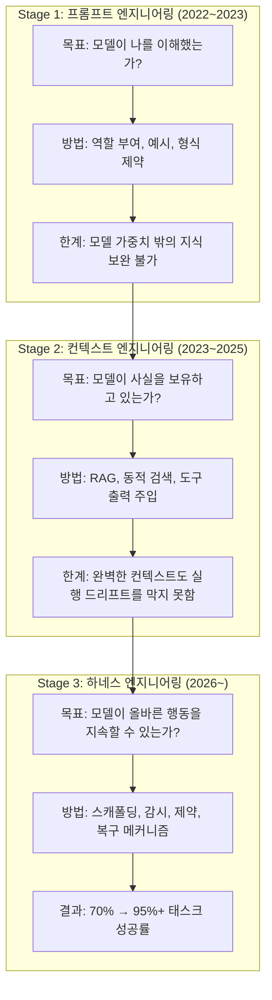
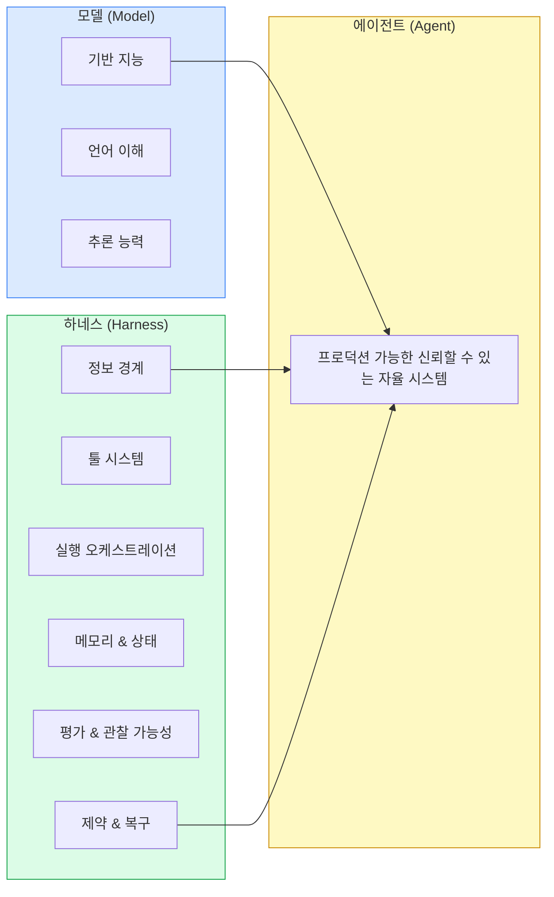
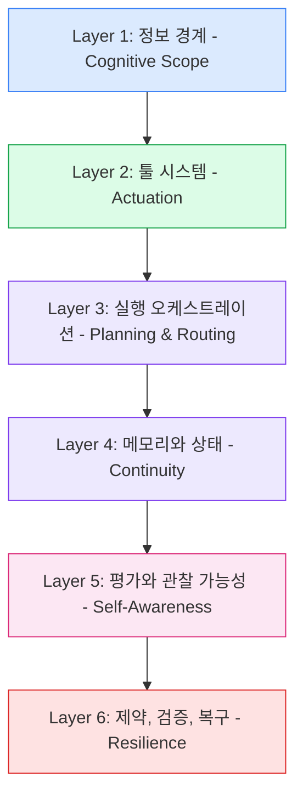
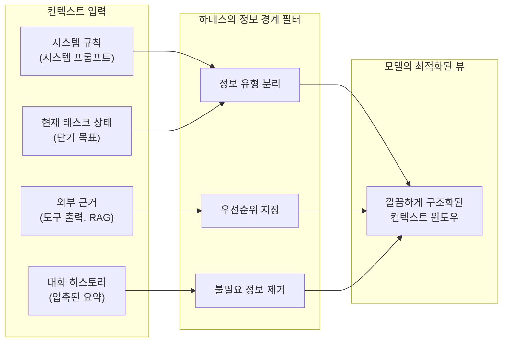
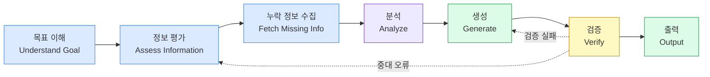
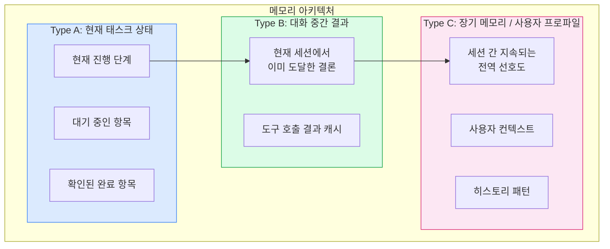
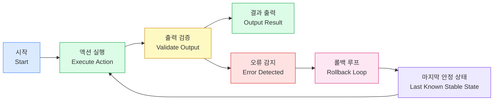
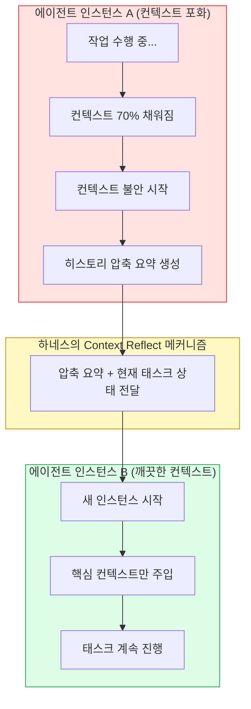
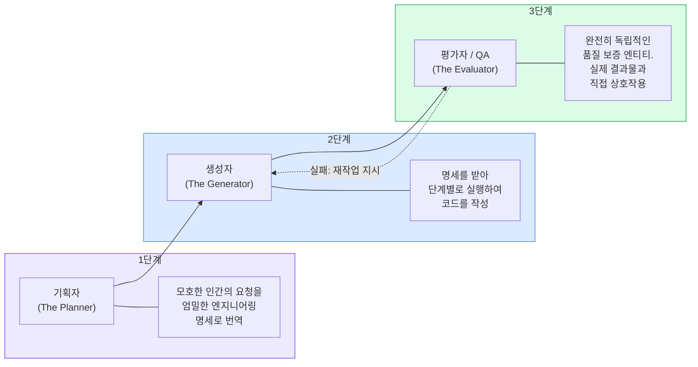
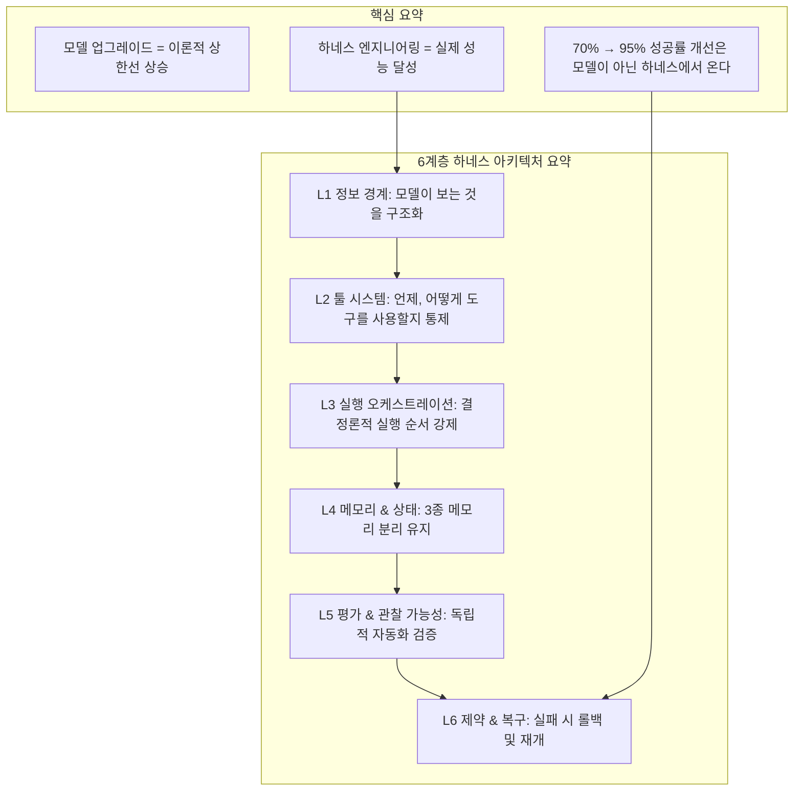

> **원문 출처**: Nick T. (Ph.D.), ["Harness Engineering: Understand this will make your AI Agent performs better than 80% of others"](https://medium.com/ai-in-plain-english/harness-engineering-understand-this-will-make-your-ai-agent-performs-better-than-80-other-agents-271c3efeec4c), *Artificial Intelligence in Plain English*, Medium, 2026년 4월 7일  
> **참고 자료**: LangChain 공식 블로그, Faros AI Engineering Report 2026, Augment Code, Mitchell Hashimoto 블로그, OpenAI Engineering Blog 등 2026년 최신 자료 종합

---

## 목차

1. [서론: 새벽 2시의 고백](#서론)
2. [AI 에이전트가 프로덕션에서 실패하는 진짜 이유](#실패-이유)
3. [AI 엔지니어링 진화의 세 단계 패러다임](#세-단계-패러다임)
   - [1단계: 프롬프트 엔지니어링](#1단계-프롬프트-엔지니어링)
   - [2단계: 컨텍스트 엔지니어링](#2단계-컨텍스트-엔지니어링)
   - [3단계: 하네스 엔지니어링](#3단계-하네스-엔지니어링)
4. [하네스 엔지니어링의 탄생: Mitchell Hashimoto의 정의](#탄생-배경)
5. [핵심 공식: 에이전트 = 모델 + 하네스](#핵심-공식)
6. [성숙한 하네스의 6계층 아키텍처](#6계층-아키텍처)
   - [Layer 1: 정보 경계 (Cognitive Scope)](#layer-1)
   - [Layer 2: 툴 시스템 (Actuation)](#layer-2)
   - [Layer 3: 실행 오케스트레이션 (Planning & Routing)](#layer-3)
   - [Layer 4: 메모리와 상태 (Continuity)](#layer-4)
   - [Layer 5: 평가와 관찰 가능성 (Self-Awareness)](#layer-5)
   - [Layer 6: 제약, 검증, 복구 (Resilience)](#layer-6)
7. [컨텍스트 불안(Context Anxiety)과 해결 전략](#컨텍스트-불안)
8. [분리된 평가 아키텍처: Planner-Generator-Evaluator](#분리된-평가)
9. [실제 사례: LangChain의 Terminal Bench 2.0 도약](#실제-사례)
10. [엔터프라이즈 AI 에이전트 실패 통계와 2026년 현황](#현황)
11. [결론: 모델이 아니라 하네스가 승부를 가른다](#결론)

---

## 서론: 새벽 2시의 고백 {#서론}

AI 에이전트를 개발해본 사람이라면 누구나 이 상황을 경험해봤을 것이다. 샌드박스 환경에서는 완벽하게 동작하던 에이전트가 실제 프로덕션 환경에 배포하는 순간부터 엉망이 된다. 두 단계 전에 내린 결정을 잊어버리고, 망가진 결과물을 내놓으면서도 태연하게 "성공"이라고 선언한다. 태스크 성공률은 68% 언저리에서 꿈쩍도 하지 않는다.

Nick T. 박사는 이 현상을 세 주 동안 직접 경험했다. 최신 플래그십 모델로 교체해보고, 프롬프트를 수백 번 튜닝해봤으며, RAG 청킹 방식도 강박적으로 조정해봤다. 그러나 성공률은 70%의 벽을 넘지 못했다. 그가 마침내 깨달은 것은 이것이 모델 문제가 아니라 시스템 문제라는 사실이었다.

이 문서는 그 깨달음, 즉 **하네스 엔지니어링(Harness Engineering)** 이라는 AI 시스템 개발의 새로운 패러다임을 깊이 있게 다룬다. 이 개념은 2026년 초에 본격적으로 업계 전반에 퍼졌으며, LangChain의 극적인 벤치마크 도약과 OpenAI·Anthropic의 검증을 통해 현재 AI 에이전트 개발의 가장 중요한 공학 원칙으로 자리잡았다.

---

## AI 에이전트가 프로덕션에서 실패하는 진짜 이유 {#실패-이유}

엔터프라이즈 AI 에이전트 프로젝트의 88%가 프로덕션 진입에 실패한다는 통계가 있다. 이 수치는 단순한 과장이 아니다. AI 에이전트가 프로덕션에서 실패하는 패턴은 놀라울 정도로 일관성이 있다. Anthropic의 연구진이 식별한 핵심 실패 모드를 살펴보면 모두 모델 자체의 지능과는 무관한 구조적 문제들이다.

첫 번째는 **승리 선언 편향(Victory Declaration Bias)** 이다. AI 에이전트는 태스크가 실제로 완료됐는지 검증하지 않은 채로 완료를 선언하는 경향이 있다. 코드를 작성하고 자신이 작성한 코드를 다시 읽은 다음, "괜찮아 보인다"고 판단하고 멈춘다. 실제로 코드가 실행되는지 테스트하지 않는다.

두 번째는 **컨텍스트 불안(Context Anxiety)** 이다. 컨텍스트 윈도우가 채워질수록 모델은 마치 "패닉" 상태에 빠진 것처럼 행동한다. 디테일을 생략하고, 검증 단계를 건너뛰고, 공간이 부족해지기 전에 서둘러 끝내려는 경향을 보인다.

세 번째는 **일괄 처리 오버리치(One-shotting Overreach)** 이다. 에이전트는 전체 문제를 한 번에 해결하려 시도하는 경향이 있으며, 이는 문서화되지 않은 뒤엉킨 변경 사항들의 덩어리를 만들어낸다.

네 번째는 **실행 드리프트(Execution Drift)** 다. 에이전트가 훌륭한 계획을 세우고, 1단계를 완벽하게 실행하지만, 2단계에서 툴의 반환값을 잘못 해석하고는 이후 12단계 동안 조용히 잘못된 방향으로 흘러간다. 가장 위험한 점은 시스템이 이 사실을 전혀 알아채지 못한다는 것이다.

이 모든 실패 모드들의 공통점은 하나다. 모델 자체의 지능 수준과 직접적인 관련이 없다는 것이다. 이것들은 모두 모델을 감싸는 시스템, 즉 **하네스**가 없거나 부실하기 때문에 발생하는 문제들이다.

---

## AI 엔지니어링 진화의 세 단계 패러다임 {#세-단계-패러다임}

AI 엔지니어링의 성숙 과정은 세 가지 뚜렷한 단계를 거쳐왔다. 대부분의 팀이 아직 1단계 혹은 2단계에 머물러 있으면서 3단계 문제에 계속 부딪히는 이유가 여기 있다.

### 1단계: 프롬프트 엔지니어링 {#1단계-프롬프트-엔지니어링}

프롬프트 엔지니어링은 모든 사람이 출발하는 지점이다. LLM이 확률 조형 기계라는 것을 발견하는 단계다. 신중하게 설계된 역할 지정, 퓨샷 예시, 올바른 형식 제약을 통해 출력물이 극적으로 바뀌는 것을 경험한다. 이는 강력하며, 단일 턴의 독립적 태스크에서 좋은 프롬프팅은 필수불가결하다.

그러나 이 단계에서 곧 천장에 부딪히게 된다. 아무리 아름답게 지시문을 작성해도 모델에게 없는 지식을 줄 수는 없다. 세 번의 도구 호출 전에 무슨 일이 있었는지 기억하게 만들 수 없다. 실망스러운 현실 앞에서 자신 있게 데이터를 지어내는 것을 막을 수 없다.

> **함정**: 더 복잡하거나 구체적인 프롬프트가 사실적 근거나 실시간 컨텍스트의 근본적인 부재를 보완할 수 있다고 믿는 것. 그럴 수 없다.

### 2단계: 컨텍스트 엔지니어링 {#2단계-컨텍스트-엔지니어링}

이 한계를 이해하고 나면 컨텍스트 엔지니어링으로 넘어가게 된다. RAG 파이프라인, 동적 검색, 도구 출력의 재주입, 대화 히스토리의 전략적 주입 등이 이 단계의 핵심이다. 모델이 결정을 내릴 때 무엇을 "볼 수" 있는지에 집착하게 된다.

이것은 분명히 획기적인 발전이다. 적시에 올바른 정보에 접근할 수 있을 때 에이전트는 극적으로 더 똑똑해진다. 그러나 컨텍스트 엔지니어링이 여전히 해결하지 못하는 것이 있다. 바로 실행 드리프트(execution drift)다.

에이전트는 훌륭한 계획을 수립하고, 1단계를 완벽하게 실행하지만, 2단계에서 도구의 반환값을 잘못 해석하고는 이후 12단계 동안 조용히 엇나간 방향으로 걸어간다. 가장 무서운 점은 시스템이 이 사실을 전혀 눈치채지 못한다는 것이다. 그냥 계속 나아간다. 자신있게. 완전히 잘못된 방향으로.

> **흔한 오해**: 컨텍스트 엔지니어링을 벡터 데이터베이스 RAG와 동일시하는 것. 진정한 컨텍스트 관리는 훨씬 더 많은 것을 포함한다. 동적 상태 주입, 도구 응답 요약, 전략적 히스토리 절삭이 그것이다. RAG는 시작에 불과하다.

### 3단계: 하네스 엔지니어링 {#3단계-하네스-엔지니어링}

여기서부터가 흥미로워진다. 그리고 솔직히 말하면, 더 나은 모델이 답이라고 생각했던 사람들에게는 다소 충격적인 단계이기도 하다.

하네스 엔지니어링은 모델 주변의 비계(scaffolding)를 구축하는 공학 분야다. 모델이 하는 일을 감독하고, 실패를 포착하고, 제약 조건을 강제하며, 방향을 잃었을 때 궤도로 되돌리는 결정론적 시스템을 만드는 것이다.

"하네스"라는 명칭은 물리적 마구(馬具)에서 왔다. 고삐, 안전 줄, 통제의 인프라가 바로 그것이다. 이것이 정확히 이 개념이 의미하는 바다.

이 세 단계를 직원에 비유하면 쉽게 이해할 수 있다. 중요한 클라이언트 미팅에 신입 직원을 파견하는 상황을 생각해보자. **프롬프팅**은 안건을 알려주는 것이다("인사하고, 제품을 소개하고, 요구사항을 파악해오세요"). **컨텍스트**는 자료를 건네는 것이다("여기 클라이언트 배경, 가격 시트, 미팅 목표가 있습니다"). **하네스**는 그 외의 모든 것이다. 직원이 들고 가는 체크리스트, 미팅 중 의무적으로 진행해야 하는 중간 보고, 녹취 기록, 대본에서 이탈했을 때의 수정 메커니즘, 그리고 미팅 보고서에 대한 엄격한 수용 기준이 그것이다.

더 나은 브리핑 어떤 것도 책임 인프라의 부재를 보완하지 못한다.

---

## 하네스 엔지니어링의 탄생: Mitchell Hashimoto의 정의 {#탄생-배경}

"하네스 엔지니어링"이라는 용어가 업계 전반에 퍼진 것은 2026년 초의 일이다. 그 결정적 계기를 만든 인물은 HashiCorp의 공동 창업자이자 Terraform의 창시자인 **Mitchell Hashimoto**였다. 그는 2026년 2월, 자신의 개인 블로그에 AI 에이전트를 사용하면서 개발한 습관에 대해 기술했다.

그의 핵심 원칙은 단순했다.

> "에이전트가 실수를 할 때마다, 그 에이전트가 같은 실수를 다시는 하지 못하도록 해결책을 엔지니어링하는 시간을 갖는다."

이것이 하네스 엔지니어링의 정신이다. 실수를 발견하면 재시도하는 게 아니라, 그 실수가 구조적으로 반복 불가능하도록 에이전트 환경 자체를 수정한다. 새로운 규칙, 새로운 점검, 새로운 가드레일, 그리고 영구적인 수정이다.

Hashimoto는 자신의 오픈소스 터미널 에뮬레이터 프로젝트인 Ghostty에서 이 원칙을 실천했다. 그가 관리하는 `AGENTS.md` 파일의 각 줄은 과거 에이전트의 실패가 이제는 방지된 형태로 기록된 것이다. 이 파일은 시간이 지남에 따라 점점 더 강력한 하네스로 성장한다.

이 포스트가 공개된 직후, OpenAI의 엔지니어 Ryan Lopopolo가 후속 글을 발표했다. 그의 팀은 수동으로 작성된 코드 라인이 단 한 줄도 없이 프로덕션 제품을 출시했다. 코드베이스는 100만 줄에 달했으며 약 1,500개의 자동화된 풀 리퀘스트를 통해 관리됐다. 이 팀의 엔지니어들은 코드를 쓰지 않았다. 대신 AI 에이전트가 코드를 신뢰성 있게 생성할 수 있도록 하는 환경, 즉 하네스를 설계했다. LangChain은 이 개념을 공식화한 공식을 제시했다.

---

## 핵심 공식: 에이전트 = 모델 + 하네스 {#핵심-공식}

LangChain이 제시한 이 공식은 하네스 엔지니어링의 본질을 간결하게 압축한다.

이 공식이 말하는 것은 명확하다. 코드베이스 안에서 에이전트를 실제로 동작하게 만드는 것들의 대부분, 즉 파운데이션 모델 API 호출 그 자체를 제외한 모든 것이 바로 하네스다.

모델은 이론적 상한선을 정의한다. 벤치마크 리더보드에서 발휘할 수 있는 최대 잠재력이다. 그러나 하네스 엔지니어링의 견고함이 그 지능이 혼돈스러운 실제 세계에서 살아남고, 복구하며, 가치를 전달할 수 있는지를 결정한다. 70% 성공률과 95% 성공률 사이의 간극, 즉 데모와 제품 사이의 간극이 전적으로 하네스 안에 존재한다.

---

## 성숙한 하네스의 6계층 아키텍처 {#6계층-아키텍처}

하네스는 단일 파일이나 영리한 래퍼(wrapper)가 아니다. 계층화된 아키텍처이며, 각 계층이 서로 다른 유형의 실패 모드에 대응한다.

> 성숙한 하네스는 단일 스크립트가 아니다. 인지를 제한하고, 행동을 강화하며, 워크플로를 오케스트레이션하고, 불가피한 실패를 포착하도록 설계된 정밀하게 계층화된 아키텍처다.

---

### Layer 1: 정보 경계 (Cognitive Scope) {#layer-1}

모델이 즉각적인 컨텍스트에서 "보는" 것이 다른 어떤 것보다 성능을 결정한다.

불필요한 데이터는 모델을 더 똑똑하게 만들지 않는다. 오히려 집중력을 잃게 만든다. 더 나쁜 것은, 서로 다른 유형의 정보(시스템 규칙, 현재 태스크 상태, 외부 근거)를 구조화되지 않은 덩어리로 혼합했을 때 모델이 제약 조건을 무시하기 시작한다는 것이다. 중요한 규칙이 모델이 더 이상 주의를 기울이지 않는 잡음이 된다.

하네스는 모델이 보는 것을 명시적으로 정의하고 분류해야 한다. 모델의 역할, 현재 목표, 성공 기준, 그리고 서로 다른 정보 유형의 구조화된 분리가 이 계층의 책임이다.

---

### Layer 2: 툴 시스템 (Actuation) {#layer-2}

도구 없이는 LLM은 단순한 텍스트 예측 기계다. 올바른 툴 시스템을 갖추면 실제 세계와 상호작용할 수 있는 에이전트가 된다.

그러나 여기에 초기에 저지르기 쉬운 결정적 실수가 있다. 모델에게 너무 많은 도구를 주는 것이다. 15개의 도구와 포괄적인 문서가 강력하게 들릴 수 있지만, 실제로는 주의력을 분산시키고 모델이 존재하지 않는 파라미터를 환각하거나 거의 이해하지 못하는 API를 오용하게 만든다.

하네스는 어떤 도구를 사용할 수 있는지뿐만 아니라 **언제** 도구를 사용할지도 통제해야 한다. 이미 답을 가지고 있을 때 검색하는 것을 막고, 검색해야 할 때 맹목적으로 추측하는 것도 막아야 한다.

그리고 이것은 협상 불가다. **도구의 원시 출력(raw output)을 LLM에 직접 파이프해서는 안 된다.** API 호출에서 반환된 50개 항목의 JSON 응답은 컨텍스트를 오염시킨다. 하네스는 도구 반환값이 모델에 닿기 전에 필터링하고, 파싱하고, 요약해야 한다.

추가로 **점진적 공개(Progressive Disclosure)** 패턴이 효과적이다. 처음부터 에이전트에게 전체 도구 라이브러리를 제공하는 대신, 모델이 처음에는 최소한의 도구 스텁(stub)만 볼 수 있도록 한다. 에이전트가 특정 기능을 사용하겠다는 의도를 신호할 때, 하네스가 해당 상세 문서와 파라미터 스키마를 동적으로 주입한다.

---

### Layer 3: 실행 오케스트레이션 (Planning & Routing) {#layer-3}

LLM은 종종 개별 기술이 부족해서가 아니라 그 기술들을 선형적으로 연결하지 못하기 때문에 실패한다. "의식의 흐름" 실행(stream of consciousness execution)이라고 부를 수 있는 문제를 겪는다. 단계들을 뛰어넘고, 검증을 생략하며, 필요한 모든 것을 갖추기 전에 성급하게 출력을 생성한다.

하네스는 엄격한 궤도를 제공한다.

이것은 단순한 비계가 아니다. **프로젝트 관리의 책임이 확률적 모델에서 결정론적 시스템으로 이전되는 것**이다. 모델이 무엇을 어떤 순서로 해야 하는지 결정할 필요가 없다. 그 구조가 하네스 안에 존재하기 때문이다. 각 단계는 명확하게 정의된 입력, 처리, 출력을 가지며, 다음 단계로 넘어가기 위한 게이팅 조건이 설정된다.

---

### Layer 4: 메모리와 상태 (Continuity) {#layer-4}

상태가 없는 에이전트는 매 턴마다 기억상실을 겪는다. 명시적인 상태 관리 없이는 다단계 태스크의 매 단계에서 사실상 처음부터 새로운 대화를 시작하는 것과 같다.

이 계층에서는 **세 가지 엄격하게 분리된 메모리 유형**을 유지하는 것이 중요하다.

> **핵심 함정**: 태스크 상태와 대화 히스토리를 혼동하는 것. 그 결과는 태스크가 진행될수록 모델 성능을 저하시키는 무한히 증가하는 비구조화된 컨텍스트 윈도우다. 이 둘을 엄격하게 분리해야 한다.

현재 태스크 상태는 "지금 우리가 어느 단계에 있는가? 무엇이 보류 중이고 무엇이 확인됐는가?"에 대한 정보를 담는다. 대화 중간 결과는 해당 세션에서 이미 도달한 결론들이다. 장기 메모리와 사용자 프로파일은 세션 전반에 걸쳐 유지되는 전역적 선호도와 컨텍스트다.

---

### Layer 5: 평가와 관찰 가능성 (Self-Awareness) {#layer-5}

이 계층은 원시적인 에이전트들이 가장 처참하게 무너지는 곳이다. 출력물을 생성하고, 성공을 선언하며, 그 출력물이 실제로 올바른지 알 수 있는 메커니즘이 전혀 없다.

에이전트가 스스로의 작업을 평가하는 것은 심각한 낙관적 편향을 가진 에이전트를 만드는 것이다. 실제로 동작하지 않는 코드를 "작동한다"고 선언할 것이다. 실제 질문에 답하지 못한 자신의 응답을 "만족스럽다"고 평가할 것이다.

하네스에는 **독립적이고 자동화된 검증 메커니즘**이 필요하다. 사후 인간 검토가 아니다. 그것은 너무 느리고 확장할 수 없다. 자동화된 출력 검증, 통합 테스트 환경, 꼼꼼한 로깅, 지표 추적, 오류 귀속이 모두 여기에 속한다.

LangChain이 Terminal Bench 2.0에서 발견한 가장 흔한 실패 패턴은 이를 잘 보여준다. 에이전트들은 해결책을 작성하고, 자신이 작성한 코드를 다시 읽은 다음 괜찮아 보인다고 판단하고 멈춘다. 실제로 코드가 실행되는지 확인하지 않는다. 자기 검토(self-review) 대신 원래 명세에 대한 검증을 강제하는 것이 이 계층이 해결하는 문제다.

시스템은 자신의 행동이 올바르다고 가정하는 것이 아니라, 지속적으로 스스로에게 그것을 증명해야 한다.

---

### Layer 6: 제약, 검증, 복구 (Resilience) {#layer-6}

프로덕션 환경에서 실패는 기본 상태다. API가 타임아웃된다. JSON 형식이 깨진다. 검색 결과가 부정확하다. 복구 메커니즘 없는 에이전트는 모든 오류 발생 시 인간의 전체 재시작이 필요한 에이전트다.

이 계층에는 세 가지가 필요하다.

**제약(Constraints)**: 에이전트가 절대적으로 해서는 안 되는 것을 정의하는 하드코딩된 규칙이다. 이것은 프롬프트 지시사항이 아니다. 결정론적으로 강제되는 경계다.

**검증(Validation)**: 출력 전후의 게이팅 점검이다. 스키마 검증, 형식 점검, 제약 조건 확인이 포함된다. 모델이 생성한 것이 다음 단계로 전달되기 전에 시스템적으로 검사된다.

**복구(Recovery)**: 재시도 로직, 폴백 경로, 그리고 마지막으로 알려진 안정적 상태로 롤백하는 능력이다. 전체 재시작을 방지한다. 오류가 발생한 지점에서 가장 가까운 유효한 상태로 돌아가 계속 진행한다.

---

## 컨텍스트 불안(Context Anxiety)과 해결 전략 {#컨텍스트-불안}

태스크가 수십 단계에 걸쳐 진행될수록 이상한 일이 발생한다. Anthropic의 연구자들은 이를 **컨텍스트 불안(Context Anxiety)** 이라고 명명했다.

컨텍스트 윈도우가 한계에 가까워지면 모델은 세분화된 디테일을 떨어뜨리기 시작하고, 핵심 목표를 놓치며, 마치 서두르는 것처럼 행동한다. 도달하지 않은 결론을 환각하기 시작한다. 검증 단계를 건너뛴다. 마무리해야 한다는 압박을 느끼는 방식으로 작동하며, 이것이 그들을 부주의하게 만든다.

단순한 해결책은 컨텍스트 압축이다. 히스토리를 요약하고, 요약을 주입하고, 계속 진행한다. 이것은 토큰 수를 줄이지만, 모델의 인지 상태나 주의력 희석을 실제로 재설정하지는 못한다.

실제로 효과가 있는 해결책은 급진적이다. **에이전트를 완전히 재시작하는 것이다.**

Anthropic은 이것을 **Context Reflect**라고 부른다. 컨텍스트가 너무 커지면 압축된 요약을 가져다 완전히 새로운 에이전트 인스턴스에 건넨다. 깨끗한 컨텍스트, 누적된 혼란 없음. 이것은 메모리 누수를 광적으로 가비지 컬렉션하는 대신 프로세스를 재시작해서 처리하는 것과 같은 원칙이다.

컨텍스트 최적화는 모델에게 더 많은 정보를 주는 것이 아니다. 정확히 필요할 때, 요청 시, 올바른 정보를 주는 것이다.

---

## 분리된 평가 아키텍처: Planner-Generator-Evaluator {#분리된-평가}

하네스 엔지니어링의 가장 중요한 아키텍처적 통찰 중 하나는 Anthropic이 수 시간 동안 인간 검토 없이 완전하고 동작하는 제품을 생성할 수 있는 진정한 자율 에이전트를 구축하는 방법에서 나온다.

핵심은 **엄격한 3방향 분리**다.

**기획자(Planner)** 는 모호한 인간의 요청을 엄밀하고 정확한 엔지니어링 명세로 번역한다. "로그인 페이지 만들어줘"가 구체적인 컴포넌트 목록, 상태 처리 요구사항, 에러 케이스 처리 방법으로 변환된다.

**생성자(Generator)** 는 해당 명세를 받아 단계별로 실행한다. 코드를 작성하고, 파일을 생성하며, API를 호출한다.

**평가자(Evaluator)** 는 생성자와 기능적으로 분리된 완전히 독립적인 QA 엔티티다. 생성자의 코드를 단순히 읽는 것이 아니라, **실제로 렌더링된 출력물과 상호작용**한다. UI 작업의 경우 인터페이스를 클릭하고, 시각적 레이아웃을 검사하며, 인터랙티브 상태를 확인한다. 생성자의 현실 표현이 아니라 실제 세계에 대해 검증한다.

> **핵심 통찰**: LLM에게 자신의 출력물을 채점하도록 요청하면 심각한 낙관적 편향이 발생한다. 생성과 수용 테스트는 유효한 자율성을 만들기 위해 기능적으로 분리돼야 한다.

OpenAI는 이것을 한 단계 더 발전시켰다. 에이전트가 인간 엔지니어가 풀 리퀘스트를 검토하는 것보다 빠르게 코드를 작성하기 시작하자, 에이전트를 위한 완전히 자동화된 CI/CD 파이프라인을 구축했다. 에이전트는 격리된 샌드박스에서 자신의 코드를 실행하고, 헤드리스 브라우저로 실행 로그를 읽으며, 인간의 개입 없이 샌드박스에서 배포가 올바르다고 확인할 때까지 반복한다.

"완료"는 더 이상 "텍스트 생성을 마쳤다"는 의미가 아니다. 그것은 "코드를 실행하고, 로그를 검토하고, 버그를 찾아 수정하고, 샌드박스에서 배포를 검증했다"는 의미다.

---

## 실제 사례: LangChain의 Terminal Bench 2.0 도약 {#실제-사례}

하네스 엔지니어링의 효과를 가장 명확하게 입증한 실증적 사례는 LangChain의 Terminal Bench 2.0 결과다.

LangChain의 코딩 에이전트(`deepagents-cli`)는 **기반 모델(GPT-5.2-Codex)을 전혀 변경하지 않고**, 오직 하네스만 최적화함으로써 다음을 달성했다.

- **이전**: Terminal Bench 2.0 상위 30위 밖, 52.8% 점수
- **이후**: Terminal Bench 2.0 5위, 66.5% 점수
- **개선폭**: 13.7 퍼센트포인트 향상

Terminal Bench 2.0은 머신러닝, 디버깅, 생물학 등 다양한 도메인에 걸쳐 89개의 태스크를 포함하는 에이전틱 코딩 평가 벤치마크다. LangChain은 이 실험에서 조정 가능한 변수를 세 가지로 의도적으로 압축했다.

1. **시스템 프롬프트**: 자기 검증 루프를 강조하도록 수정
2. **도구와 컨텍스트 주입**: 에이전트가 자신의 환경을 이해하는 데 도움을 주는 방향으로 강화
3. **미들웨어 훅**: 둠 루프(doom loop)와 같은 문제적 패턴을 감지하는 로직 추가

팀이 LangSmith 트레이싱을 통해 발견한 가장 흔한 실패 패턴은 거의 우스울 정도로 인간적이었다. 에이전트들은 해결책을 작성하고, 자신의 코드를 다시 읽은 다음 괜찮아 보인다고 결정하고 멈췄다. 이것은 자기 검토의 낙관적 편향 문제다.

같은 시기, 스탠퍼드 IRIS 연구소는 Claude Opus 4.6에 자동화된 하네스 진화 시스템인 **Meta-Harness**를 결합해 Terminal Bench 2.0에서 76.4%를 달성했다. 이것은 해당 리더보드에서 손으로 설계된 모든 시스템을 뛰어넘는 성과였다.

이 두 사례가 공통적으로 시사하는 것은 하나다. **벤치마크는 종종 모델 품질만큼이나 혹은 그 이상으로 하네스 품질을 측정한다.**

---

## 엔터프라이즈 AI 에이전트 실패 통계와 2026년 현황 {#현황}

하네스 엔지니어링이 주목받게 된 배경에는 냉혹한 통계가 있다. **엔터프라이즈 AI 에이전트 프로젝트의 88%가 프로덕션 진입에 실패한다.** 이 "프로덕션 갭"의 원인이 점점 더 명확해지고 있다. 수년간 강력한 "두뇌"(모델 그 자체)를 개발하는 데 집중했지만, 그 두뇌가 실제 세계에서 신뢰할 수 있게 작동하게 하는 비모델 운영 계층, 즉 컨텍스트, 도구, 런타임, 아이덴티티, 관찰 가능성을 소홀히 했기 때문이다.

2026년에는 다음과 같은 실제 사례들이 하네스 엔지니어링의 가치를 입증하고 있다.

**Microsoft Azure SRE 에이전트**: 35,000건 이상의 프로덕션 인시던트를 자율적으로 처리했으며, Azure App Service의 문제 해결 시간을 40.5시간에서 3분으로 줄였다. MCP 도구, 텔레메트리, 코드 저장소, 인시던트 관리 플랫폼을 단일 에이전트 하네스로 통합하고, 휴먼-인-더-루프(human-in-the-loop) 거버넌스를 구현한 결과다.

**토큰 경제학과 하네스**: 독자들의 피드백에서도 지적됐듯, 토큰 비용과 무한 루프는 하네스 아키텍처에서 1급 시민이 돼야 한다는 논점이 대두되고 있다. 컨텍스트 압축, 툴 사용 비용 모니터링, 루프 감지 미들웨어가 하네스의 필수 구성 요소로 자리잡는 추세다.

업계 전문가 커뮤니티의 반응도 주목할 만하다. 하나의 Hacker News 스레드는 이 구조적 현실을 명확하게 포착했다. "AI는 LLM과 그 하네스를 연결하는 피드백 루프의 전체 사이버네틱 시스템으로 간주해야 한다. 하네스는 모델 자체의 개선만큼 큰 차이를 만들 수 있다." 이 관찰은 이제 설계 원칙이 됐다. 더 나은 모델과 더 나은 하네스 중에서 선택해야 하는 팀들은 점점 더 하네스를 선택하고 있다.

Gartner는 2026년 말까지 기업의 40%가 에이전트를 도입할 것으로 예측하고 있다. 이제 문제는 기업이 에이전트를 배포할 것인지가 아니라, 에이전트를 신뢰할 수 있게 만드는 통제 시스템을 어떻게 구축할 것인지다.

---

## 결론: 모델이 아니라 하네스가 승부를 가른다 {#결론}

프로덕션 AI 시스템에 대해 하네스 엔지니어링이 말하는 진실을 요약하면 다음과 같다.

**파운데이션 모델의 지능은 벤치마크 리더보드에서의 이론적 상한선을 정의한다. 하네스 엔지니어링의 견고함이 그 지능이 혼돈스러운 실제 세계에서 실제로 살아남고, 복구하며, 가치를 전달할 수 있는지를 결정한다.**

모델은 병목이 아니다. 어떤 시점을 넘어서면 모델은 결코 병목이 아니었다.

70% 성공률과 95% 성공률 사이의 간극, 데모와 제품 사이의 간극이 전적으로 하네스 안에 존재한다.

2026년은 하네스 엔지니어링의 시대다. 프롬프트를 다듬는 것에서 시스템을 설계하는 것으로의 전환이 AI 에이전트 개발의 중심축이 됐다. 이 전환을 이해하지 못한 팀은 계속해서 모델을 탓하며 68%의 벽에 부딪힐 것이다. 이 전환을 이해한 팀은 같은 모델로, 같은 프롬프트로 95% 이상의 성공률을 달성할 것이다.

**하네스를 제품으로 대하고, 모델을 그 안에 들어가는 교체 가능한 컴포넌트로 대하라.** 이것이 2026년 AI 제품 품질을 선도하는 조직들의 공통점이다.

---

*작성 일자: 2026-06-11*
