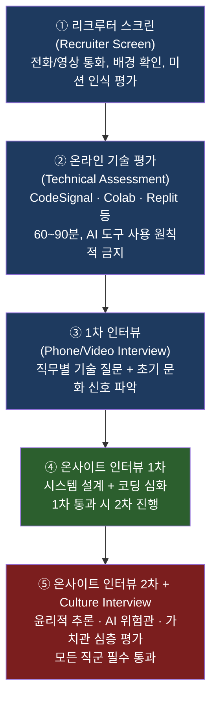
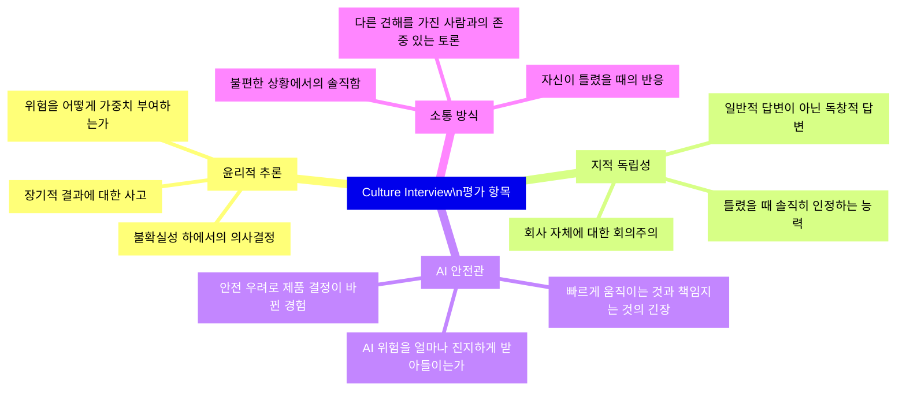
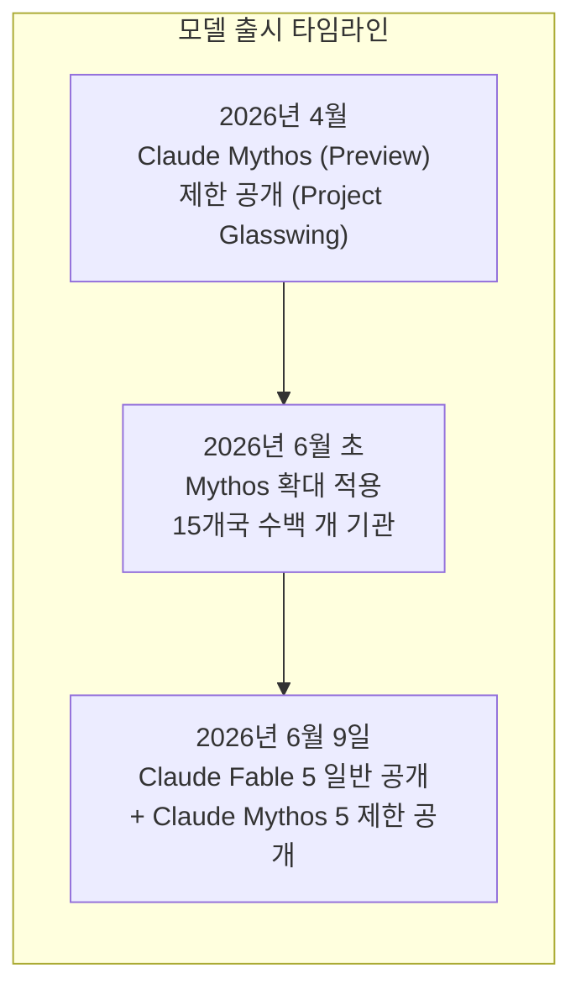
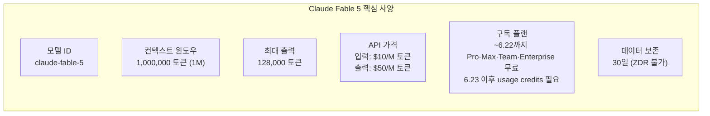
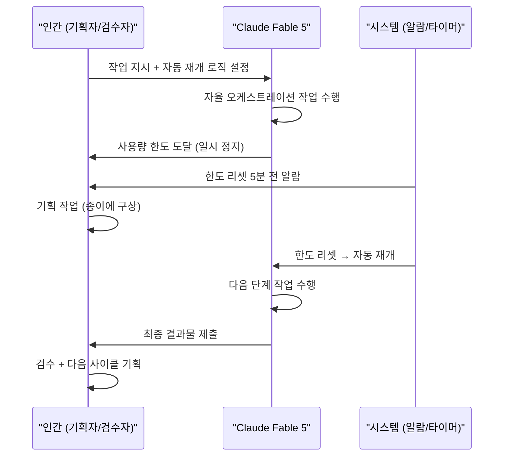
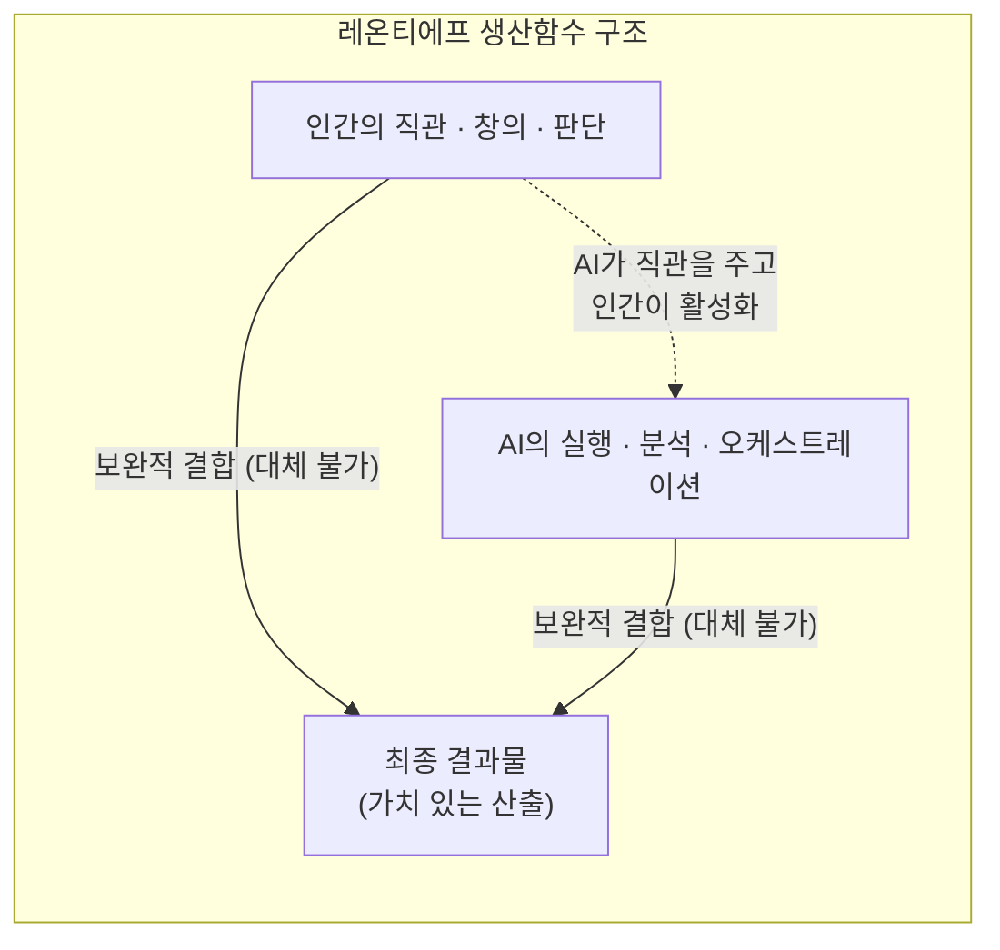
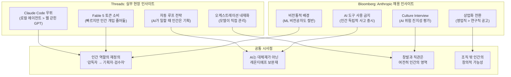

> **분석 대상**  
> 1. Bloomberg 기사: ["What It Takes to Get a Job at Anthropic"](https://www.bloomberg.com/news/features/2026-05-28/anthropic-job-recruiting-brings-in-diverse-careers-to-build-claude) (2026년 5월 28일)  
> 2. Threads 게시글 [@hxxls_](https://www.threads.com/@hxxls_/post/DZbt2jxkhPb) — Claude Fable 5(페이블) 실사용 경험담  
> **작성일**: 2026-06-12

---

## 목차

1. [개요: 두 콘텐츠가 만나는 지점](#1-개요)
2. [Bloomberg 기사 심층 분석: Anthropic 취업의 벽](#2-bloomberg-기사-분석)
3. [Claude Fable 5란 무엇인가](#3-claude-fable-5)
4. [Threads 게시글 전문 분석: 실무자의 페이블 경험](#4-threads-게시글-분석)
5. [AI와 인간: 레온티에프 보완재론](#5-레온티에프-보완재론)
6. [종합 시사점](#6-종합-시사점)

---

## 1. 개요

Threads 게시글(@hxxls_)은 두 가지 내용을 한 화면에 담고 있다. 하나는 Bloomberg 기사 썸네일, 즉 "What It Takes to Get a Job at Anthropic"이라는 제목과 함께 높고 견고한 콘크리트 상자 위에 소수의 사람들이 앉아 있고, 그 아래 수많은 사람들이 손을 뻗어 올라가려 하는 일러스트다. 다른 하나는 게시자 본인이 Claude Fable 5(한국어로 "페이블")라는 새 모델을 실제로 프로젝트에 투입하면서 느낀 생생한 경험담이다.

이 두 내용을 관통하는 공통된 질문은 하나다: **"AI 시대에 인간의 역할은 무엇인가?"** Bloomberg 기사는 Anthropic이라는 회사가 어떤 인간을 원하는지를 다루고, Threads 게시글은 그 회사의 AI 모델을 실제로 써본 사람이 AI와 인간의 관계를 어떻게 재정의하는지를 보여준다.

---

## 2. Bloomberg 기사 분석: Anthropic 취업의 벽

### 2-1. 기사 배경과 발행 맥락

Bloomberg는 2026년 5월 28일(한국시간 기준 오후 6시)에 Anthropic의 채용 문화를 집중 해부하는 특집 기사를 발행했다. 제목은 "Anthropic에 취직하려면 무엇이 필요한가(What It Takes to Get a Job at Anthropic)"이며, 전직 리크루터, HR 직원, 입사 경험자들과의 인터뷰를 바탕으로 작성됐다.

발행 시점이 의미심장하다. 이 기사가 나온 바로 같은 날, Anthropic은 65억 달러(약 9조 원) 규모의 시리즈 H 투자 유치를 공시하면서 post-money 기업 가치가 약 9,650억 달러(한화 약 133조 원)에 달하게 됐다. 또한 불과 4일 뒤인 6월 1일에는 미국 주식시장 IPO를 위한 기밀 서류를 제출한 것으로 알려졌다. 즉, Anthropic이 IPO를 앞두고 급격한 상업화 전환을 도모하는 시점에, Bloomberg가 그 내면의 채용 문화를 공개적으로 해부한 것이다.

### 2-2. 폭발적 성장과 채용 열기

Anthropic은 현재 약 3,000명의 직원을 보유하고 있으며, 2025년 11월 이후에만 약 1,000명을 새로 채용했다. 채용 공고는 지속적으로 392개 이상 열려 있고, HR·리크루팅 팀의 규모도 2배로 확대됐다. 런던 주재 리크루터 Jade Hussain은 Anthropic 합류를 공개한 직후 LinkedIn에서 1,000건 이상의 연결 요청과 200건 이상의 메시지를 받았다고 밝혔으며, 결국 공개하지도 않은 개인 번호로 연락을 받는 상황까지 벌어져 공개적으로 자제를 요청해야 했다.

채용 공고에는 연봉 25만 달러(약 3억 4천만 원) 이상의 패키지가 일반적으로 명시되어 있으며, 소프트웨어 엔지니어 기준 실제 총보상(TC)은 레벨에 따라 다음과 같이 보고되고 있다.

| 레벨 | 경력 | 총보상(TC) | 기본급 |
|------|------|-----------|-------|
| L3 (Mid-level MTS) | 2~5년 | 약 $450K | $220K |
| L4 (Senior MTS) | 5~10년 | 약 $665K | $275K |
| L5 (Staff MTS) | 8~15년 | $650K~$750K | - |
| L6 (Principal MTS) | - | 최대 $1.2M | - |

주목할 만한 사례로, 한 소프트웨어 회사의 CTO 출신이 직책을 내려놓고 Anthropic의 일반 기술 스태프(Member of Technical Staff)로 입사한 경우도 보고됐다. 입사 자체가 커리어의 전환점이 될 만큼 위상이 높다는 의미다.

벤처캐피털 SignalFire의 분석에 따르면, Anthropic은 동종 업계 중 2년 직원 유지율이 80%로 가장 높다. 특히 OpenAI에서 Anthropic으로 이직하는 엔지니어가 반대 방향보다 8배 많고, Google DeepMind에서 Anthropic으로 이직하는 경우는 반대보다 약 11배 많다.

### 2-3. 채용 철학: "매우 비전통적인" 인재

기사에서 가장 주목받은 발언은 Anthropic의 첫 번째 최고상업책임자(CCO) Paul Smith의 말이다. 그는 2025년 8월 ServiceNow에서 글로벌 고객 및 현장 운영 총괄을 맡다가 Anthropic에 합류했다. Smith는 자신이 담당하는 일부 직군에 대해 이렇게 말했다.

> **"나는 매우 비전통적인 사람을 찾고 있습니다. 정말로, 매우 비전통적인."**

여기서 "비전통적"이란 명문대 학력이나 화려한 이력서보다는, **고객의 세계에 완전히 몰입할 수 있고, 경영진이 AI가 어디에 맞는지 파악하도록 도울 수 있는 능력**을 의미한다. 기업이 AI를 도입하는 방식 자체가 전례 없는 속도로 변하고 있기 때문에, 기존 산업의 공식을 그대로 따르는 사람보다 새로운 패러다임을 직접 만들어갈 수 있는 사람이 필요하다는 논리다.

Anthropic 기술직 직원의 약 절반이 머신러닝(ML) 비전공 출신이라는 점도 이 철학을 뒷받침한다. 회사는 전통적 자격증보다 "직접적인 능력의 증거(direct evidence of ability)"를 더 높이 평가한다고 공식적으로 밝히고 있다. 주목할 만한 GitHub 프로젝트, 강력한 블로그 포스트, 오픈소스 기여 등이 명문대 학위보다 유리하게 작용할 수 있다.

CEO Dario Amodei도 Bloomberg와의 인터뷰에서 Anthropic의 핵심 도전을 다음과 같이 표현했다.

> **"빠르게 성장하면서도, 우리 회사를 특징지어 온 미션에 대한 헌신을 희석시키지 않는 것이 과제입니다."**

### 2-4. 채용 프로세스의 5단계

Bloomberg가 전직 리크루터와 HR 직원들의 증언을 종합한 결과, Anthropic의 채용 과정은 최대 5단계로 구성된다. 각 단계는 기술적 역량과 문화적 적합성을 모두 검증하도록 설계되어 있다.

### 2-5. Culture Interview: 기술 면접보다 어려운 관문

Bloomberg 기사에서 가장 독특하고 중요하게 다뤄진 부분은 바로 **"Culture Interview"** 다. 이 면접은 Anthropic이 독자적으로 설계한 단계로, 리서치 과학자부터 회계사, 급여 담당자까지 사실상 모든 직군의 지원자가 반드시 통과해야 한다.

**Culture Interview의 특징을 정리하면 다음과 같다.**

첫째, **면접관은 어느 부서에서도 선발될 수 있다.** 지원 직군과 전혀 다른 팀의 직원이 면접관으로 들어올 수 있다. 이는 부서 간의 공통된 가치 기준을 유지하기 위한 장치다. 전직 리크루터에 따르면, "면접관이 낮은 평점을 주면 지원자는 대부분 탈락한다. 경영진이 회사의 미션을 인류의 생존에 관련된 문제로 보고 있기 때문에, 아무리 이상하게 느껴져도 이 면접을 진지하게 받아들이라고 조언한다."

둘째, **면접 중 AI 도구 사용이 원칙적으로 금지된다.** Bloomberg 기사와 여러 전직자들의 증언을 종합하면, 명시적으로 허용된 경우를 제외하고는 ChatGPT, Claude 등 AI 보조 도구를 활용하는 것이 금지된다. AI 회사가 채용 면접에서 AI 사용을 금지한다는 점은 역설적으로 보이지만, 이는 Anthropic의 철학을 정확히 반영한다. 그들은 도구 활용 능력이 아닌 **도구의 도움 없이 스스로 생각하는 인간**을 원한다.

셋째, **면접 분위기는 처음에는 가볍게 시작해 점점 깊어진다.** 전직 리크루터는 "광범위한 질문에서 시작해 직장에서의 윤리적 딜레마 같은 더 깊은 질문으로 이어진다"고 설명했다. 입사 지원 코칭 회사 Exponent의 커리어 코치는 "많은 사람들에게는 취업 면접이 아니라 심리치료(therapy)처럼 느껴진다"고 묘사했다.

**Daniela Amodei(공동창업자, Dario Amodei의 여동생)가 직접 밝힌 Culture Interview의 질문 유형은 다음과 같다.**

> "당신이 가진 약간 비정상적인 믿음은 무엇이며, 그것이 옳다고 느꼈기 때문에 불편한 상황에서도 어떻게 그 입장을 지켜냈는지 말해주세요."

이 질문이 중요한 이유는, 특정한 믿음의 내용보다 **"틀릴 수도 있고 인기 없는 생각일 수 있지만, 자신이 옳다고 느꼈기에 끝까지 지켜낸 경험"** 을 보고자 하기 때문이다. 즉, 지적 독립성과 용기를 측정하는 것이다.

**Anthropic이 Culture Interview에서 실제로 평가하는 역량은 다음과 같다.**

보고된 실제 질문 예시를 살펴보면, "당신의 가치관과 충돌하는 행동을 해야 했던 때를 이야기해 달라", "안전하지 않다고 생각하는 프로젝트에 배정된다면 어떻게 할 것인가", "강하게 느꼈던 무언가에 대해 생각을 바꾼 경험을 설명해달라", "의사결정에 반대했다가 패배한 경험이 있는가. 그 후 어떻게 됐는가" 같은 문항들이 있다. 면접관들은 깔끔하게 포장된 성공 스토리보다, **불확실했거나 틀렸거나 불편했던 순간이 담긴 진실된 이야기**를 기대한다. 항상 자신이 옳았다는 이야기만 하는 지원자는 오히려 경고 신호로 받아들여진다.

### 2-6. IPO를 앞둔 상업화 전환과 채용 신호

Bloomberg 기사가 발행된 주간의 맥락을 더 살펴보면, Anthropic의 채용 방향이 뚜렷하게 바뀌고 있음을 알 수 있다. 2026년 5월 말 기준으로, Anthropic의 채용 공고는 영업직 72개 대 AI 연구·엔지니어링직 67개로 영업직이 처음으로 연구직을 추월했다. 이는 Anthropic이 순수 연구소에서 기업용 AI 솔루션 회사로 무게중심을 이동하고 있다는 명확한 신호다.

Paul Smith CCO의 합류 자체가 이 전환의 상징이다. Anthropic 역사상 처음으로 CCO 직책을 신설하고, ServiceNow의 글로벌 현장 운영 책임자를 영입한 것은, 기술 개발과 연구를 넘어 실제 엔터프라이즈 고객에게 가치를 전달하는 능력이 중요해졌음을 의미한다.

---

## 3. Claude Fable 5: Threads 게시글의 "페이블"이란 무엇인가

Threads 게시글에서 반복적으로 언급되는 "페이블"은 Anthropic이 2026년 6월 9일에 출시한 **Claude Fable 5**를 지칭한다. 이 모델은 Anthropic 역사상 가장 중요한 모델 출시 중 하나로 평가받는다.

### 3-1. Fable 5의 출시 배경

Fable 5를 이해하려면 먼저 **Claude Mythos**를 알아야 한다. Anthropic은 2026년 4월, 소프트웨어 취약점 탐지에 특화된 최고급 모델 "Claude Mythos"를 발표했다. 그러나 이 모델은 사이버보안 분야에서의 오남용 위험성 때문에 일반에 공개하지 않았다. Project Glasswing이라는 프로그램을 통해 핵심 인프라 관리 기관과 사이버 방어 전문 조직 등 소수의 신뢰할 수 있는 파트너에게만 제한적으로 제공됐다.

그러다 약 2달 후인 6월 9일, Anthropic은 Mythos와 동일한 기반 모델에 위험 영역에 대한 safeguard(안전 제한)를 추가한 버전, 즉 **Claude Fable 5**를 일반 공개했다. CNBC는 이를 "Anthropic이 처음으로 Mythos 계열 모델을 대중에게 공개한 것"이라고 보도했다.

### 3-2. Fable 5의 핵심 사양

가격 관점에서 보면, Fable 5는 Opus 4.8의 정확히 2배 가격이며, Sonnet 4.6 대비 약 3배 비싸다. 이는 Anthropic이 공식적으로 일반 공개한 모델 중 가장 비싼 가격이다.

### 3-3. Fable 5 vs 기존 모델 비교

| 항목 | Sonnet 4.6 | Opus 4.8 | **Fable 5** | Mythos 5 |
|------|-----------|----------|------------|---------|
| 공개 범위 | 일반 공개 | 일반 공개 | **일반 공개** | 제한 공개 |
| 입력 가격 | ~$3/M | $5/M | **$10/M** | $10/M |
| 출력 가격 | ~$15/M | $25/M | **$50/M** | $50/M |
| Safeguard | 있음 | 있음 | **있음** | 없음 |
| 자율 에이전트 | 보통 | 높음 | **매우 높음** | 매우 높음 |
| 컨텍스트 | 200K | 200K | **1M** | 1M |

### 3-4. Fable 5의 핵심 역량: 자율 오케스트레이션

Anthropic이 Fable 5를 출시하면서 가장 강조한 점은 **장시간 무감독 에이전트 작동 능력**이다.

Anthropic 공식 발표에 따르면, Claude Code나 Claude Managed Agents 같은 에이전트 하네스 안에서 Fable 5를 실행하면, **수일에 걸쳐 스스로 계획을 세우고, 하위 에이전트에게 작업을 위임하며, 자신의 결과물을 직접 검증**하는 사이클을 돌릴 수 있다. 외부 테스터들의 보고에 따르면, 15페이지 분량의 설계 문서를 넘겨줬더니 9시간 이상 독립적으로 작업했다는 사례가 있으며, Stripe는 Fable 5를 사용해 5,000만 줄짜리 Ruby 코드 마이그레이션을 하루 만에 완료했다고 밝혔다. 이는 전체 팀이 두 달 이상 걸릴 작업이었다.

그러나 동시에 **토큰 소비 속도도 압도적이다.** Workflow 모드에서 8분 만에 100만 토큰을 소진했다는 보고가 있으며, $100/월의 Max plan 사용자가 단일 에이전트 세션에서 약 $100어치의 토큰을 소진하는 사례도 보고됐다. 구독 플랜에서 Fable 5는 2x usage로 카운트되어, 5시간 롤링 윈도우가 일반 모델보다 훨씬 빠르게 소진된다.

---

## 4. Threads 게시글 분석: 실무자의 눈으로 본 페이블

이제 @hxxls_의 Threads 게시글을 단락별로 해석한다. 이 게시자는 Claude Code와 다수의 AI 에이전트 도구를 일상적으로 사용하는 실무 개발자로, 이전에도 자체적인 에이전트 스태핑 시스템을 구축해본 경험이 있다.

### 4-1. "토큰 순삭되지만, 인간 토큰 낭비는 줄었다"

> *"페이블이 토큰 순삭되기는 하는데 이전처럼 중간 작업물 여기저기 마구 뿌려대서 검수하는데 소요되는 인간토큰 낭비는 줄어든 것 같다."*

이 문장은 Fable 5의 핵심 트레이드오프를 정확히 포착한다. 이전 모델(Opus 등)을 에이전트로 사용할 때는 중간 작업물을 중간중간 출력하고 사용자가 개입해야 했다. 이른바 "인간 토큰 낭비"는 사용자가 중간 결과물을 검토하고, 방향을 수정하고, 다시 지시를 내리는 데 쏟아야 하는 인지 자원을 뜻하는 은유적 표현이다.

Fable 5는 중간에 자잘한 것을 묻거나 출력하는 대신, 자체적으로 계획하고 하위 작업을 위임하고 검증까지 마친 뒤 최종 결과물만 제출하는 방식을 취한다. AI 토큰은 더 많이 들지만, 사람이 개입해야 하는 포인트가 줄어든다는 의미다. 이는 Anthropic이 공식 발표에서 강조한 "검수 중심(review-not-supervise)" 패러다임과 정확히 일치한다.

### 4-2. "5x Max plan과 자동 깨우기 루프"

> *"한도 다시 채워지는 시간 5분 뒤에 다시 깨우기 알림 설정 해놓으면 알아서 끝날 때까지 돌아간다. 5x는 컴터 앞에만 죽치고 앉아있으면 부족할 것 같은데 클로드한테 자동 깨우기 설정으로 루프 돌리라고 시켜놓고 기획은 종이에다가 끄적끄적."*

여기서 "5x"는 **Claude Max 플랜**을 가리키는 것으로 보인다. Anthropic의 Claude Max($100/월)는 Claude Pro($20/월) 대비 5배 더 많은 사용량(usage allowance)을 제공한다. 그러나 Fable 5는 일반 대화 기준으로도 Opus 4.8의 약 2배 토큰을 소비하고, 에이전트 모드에서는 그 몇 배에 달하기 때문에, 5배 더 많은 한도도 컴퓨터 앞에서 집중적으로 사용하면 금방 소진될 가능성이 높다.

이에 대한 게시자의 해결책이 흥미롭다. Claude(실질적으로 Claude Code)에게 "사용량 한도가 리셋되는 시점 5분 뒤에 자동으로 작업을 재개하라"는 자동화 로직을 심어두는 것이다. 덕분에 사용자는 컴퓨터 앞을 지키지 않아도, 페이블이 사용 가능한 시간 동안 작업하고, 한도가 차면 대기하다가 리셋 직후 자동으로 재개하는 루프를 형성할 수 있다. 사용자는 그 사이에 종이에 기획을 구상한다.

이 접근 방식은 단순한 꼼수가 아니라, **AI를 감독하는 인간의 역할을 재설계한 것**이다. 인간은 AI가 작업하는 사이에 AI가 하지 못하는 것, 즉 다음 작업의 기획과 방향 설정을 담당하는 방식이다.

### 4-3. "GPT는 웹에 갇혀 있다"

> *"지능은 GPT 프로하고 비슷한 수준 아닐까? 라고 생각이 들지만 더 편한 이유는 GPT는 로컬 경로에 있는 파일을 알아서 찾아보면서 작업하는 에이전트가 아니고 웹에 갇혀있어서.."*

이 관찰은 2026년 현재 Claude vs GPT 비교에서 핵심을 찌른다. 순수한 추론 능력(Intelligence)은 GPT-5 계열(GPT 프로)과 비슷하다고 느끼더라도, **로컬 파일 시스템에 직접 접근해 에이전트로서 작업하는 능력**에서 Claude Code가 명확한 우위를 갖는다는 뜻이다.

Claude Code는 사용자의 로컬 디렉토리를 직접 탐색하고, 파일을 읽고 수정하며, 터미널 명령을 실행하는 에이전트 환경을 제공한다. 반면 GPT(웹 기반 인터페이스 혹은 API 레벨)는 파일 업로드를 통한 단발성 처리는 가능하지만, 로컬 파일 경로를 지속적으로 탐색하며 장기 에이전트 작업을 수행하는 하네스 환경은 상대적으로 제한적이다.

게시자가 "웹앱 개발에서 Claude Code 시스템 빌딩으로 돌아왔다"고 한 결정도 같은 맥락이다. 백엔드 지식이 부족한 상태에서는, 클라우드 환경(웹앱)보다 로컬에서 Claude Code가 파일을 직접 다루며 시스템을 구축하고, 나중에 서버를 붙이는 방식이 더 현실적이라는 판단이다.

### 4-4. "오케스트레이션을 알아서 한다"

> *"페이블이 오푸스보다 더 좋다고 크게 체감되는 건 오케스트레이션을 알아서 한다는 거다."*

이 한 문장이 Fable 5의 가장 큰 실용적 차별점을 정확히 설명한다. 게시자는 과거에 직접 에이전트 스태핑 시스템을 구축했다고 밝혔다. 즉, 어떤 에이전트가 어떤 작업을 맡을지, 각 단계에서 어떻게 검증할지를 명시적으로 설계하고 지시했다는 뜻이다. 이것이 이전의 Opus 기반 에이전트 워크플로우였다.

Fable 5에서는 그 오케스트레이션 계층이 모델 자체에 내재화되어 있다. 복잡한 작업을 넘겨주면, 어떤 하위 작업으로 나눌지, 각각을 어떻게 처리할지, 결과를 어떻게 통합하고 검증할지를 스스로 결정한다. Anthropic 공식 발표에 따르면, Fable 5는 "에이전트 하네스 안에서 수일 동안 스스로 계획을 세우고, 하위 에이전트에게 위임하며, 자신의 작업을 점검"한다. 게시자가 이 점을 "컨셉 자체는 유사하지만, 내가 지휘하고 검증하는 것까지 명령 내려야 했는데 알아서 해주니까 편하다"고 표현한 것은 정확한 기술적 묘사다.

---

## 5. 레온티에프 보완재론: AI와 인간의 경제적 관계

### 5-1. Bloomberg 기사에서 촉발된 성찰

> *"AI가 진짜 점점 더 똑똑해지고 있다는 생각이 들지만, 진짜 창조적인 생각을 하지는 못해서, 진짜로 창발하는 것은 인공지능이 아니라 인간일 것 같다. 조직에 소속되지 않은 인간 중에 있을 수도 있다."*

게시자는 Bloomberg의 "Anthropic 취업 경쟁" 기사를 보면서, AI가 아무리 강력해져도 **진정한 창발(emergent novelty)** 은 인간에게서 나온다는 직관적 판단을 내린다. 흥미롭게도 "조직에 소속되지 않은 인간"이라고 특정한다. 이는 기업과 조직이 특정 방향으로 사고를 수렴시키는 경향이 있는 데 반해, 제도 밖의 자유로운 개인이야말로 틀 바깥의 창의적 도약을 만들어낼 가능성이 높다는 관찰이다.

### 5-2. "대체재가 아니라 레온티에프 보완재"

> *"인공지능이 직관을 가지는 것이 아니라, 인간에게 직관을 주는 것이다. 대체재가 아니라 레온티에프 보완재이다."*

이 구절이 게시글 전체의 결론이자 가장 지적으로 흥미로운 부분이다. **레온티에프 보완재(Leontief Complement)** 는 경제학자 Wassily Leontief의 생산함수 개념에서 비롯된 표현이다.

**레온티에프 생산함수(Leontief Production Function)** 는 두 생산 요소가 고정된 비율로만 결합될 때 생산이 이루어지는 구조를 설명한다. 예를 들어, 자동차 한 대를 조립하려면 용접 작업과 브레이크 설치가 모두 필요하다. 용접을 아무리 잘해도 브레이크가 없으면 완성차가 나오지 않는다. 두 작업은 서로를 대체할 수 없는 완전 보완재다.

게시자가 말하는 "AI가 인간에게 직관을 준다"는 표현은 다소 역설적으로 들리지만, 실제로는 이렇게 해석할 수 있다. AI가 방대한 데이터를 처리하고 패턴을 발견해 결과를 제시할 때, **그 결과를 보면서 인간은 기존에 갖지 못했던 직관과 통찰을 얻게 된다**는 것이다. AI가 직관 자체를 소유하는 것이 아니라, AI의 출력이 인간의 직관 형성을 돕는 촉매가 된다.

이 관점은 AI가 인간 노동을 대체한다(substitute)는 공포와는 다른 틀을 제공한다. AI와 인간은 고정된 비율로 함께 기능해야만 의미 있는 결과를 만들 수 있는 완전 보완재 구조에 놓여 있다는 것이다. 게시자 본인의 워크플로우가 그 증거다. Fable 5가 아무리 강력해도, 다음 기획을 종이에 끄적이는 것은 인간이 해야 한다.

MIT Sloan이 2026년 4월에 발표한 연구도 같은 방향을 가리킨다. 이 연구는 AI가 인간 노동을 대체하기보다 보완할 가능성이 더 높다는 프레임워크를 제시했으며, 인간의 고유 역량으로 판단, 의미 해석, 전략적 방향 설정 등을 꼽았다.

---

## 6. 종합 시사점

Bloomberg 기사와 Threads 게시글이 각각 다른 각도에서 같은 진실을 가리키고 있다. Anthropic은 세계에서 가장 강력한 AI를 만드는 회사이면서, 동시에 면접에서 AI 사용을 금지하고 Culture Interview를 통해 **독립적으로 사고하는 인간**을 선별한다. 실무 개발자는 Fable 5를 사용할수록 AI가 처리하는 작업은 늘어나지만, **다음 기획을 구상하는 것은 종이와 연필을 든 자신의 몫**임을 더 분명히 느낀다.

AI가 강력해질수록, 아이러니하게도 진정한 인간성, 즉 창발적 사고, 윤리적 판단, 직관적 기획의 가치는 더 높아진다. Anthropic이 비전통적인 인재를 찾는 것도, 게시자가 "창발하는 것은 인간"이라고 말하는 것도, 결국 같은 방향을 가리킨다. AI는 인간을 대체하는 것이 아니라, 인간이 더 인간다운 일에 집중할 수 있도록 나머지를 떠받치는 보완재다.

---

## 참고 자료

- Bloomberg, "What It Takes to Get a Job at Anthropic", 2026-05-28
- Anthropic 공식 발표, "Introducing Claude Fable 5 and Claude Mythos 5", 2026-06-09
- CNBC, "Anthropic releases Claude Fable 5", 2026-06-09
- TechCrunch, "Anthropic released Claude Fable 5", 2026-06-09
- Gigazine (EN), "Anthropic's recruitment process: AI use strictly prohibited", 2026-06-01
- IGotAnOffer, "Anthropic Culture Interview", 2026-05-04
- Becker's Hospital Review, "Anthropic's unusual hiring playbook", 2026-05-28
- Developers Digest, "How Claude's Usage Limits Work With Fable 5", 2026-06-11
- MIT Sloan, "AI more likely to complement, not replace, human workers", 2026-04
- Threads @hxxls_, 2026-06-12 게시글

---

*작성일: 2026-06-12*
