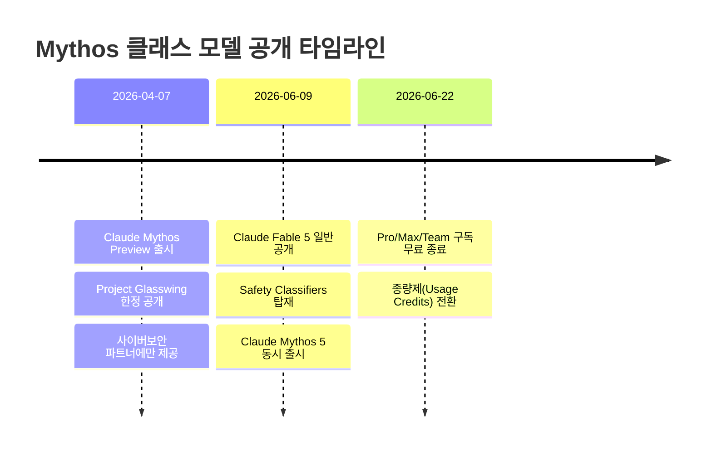
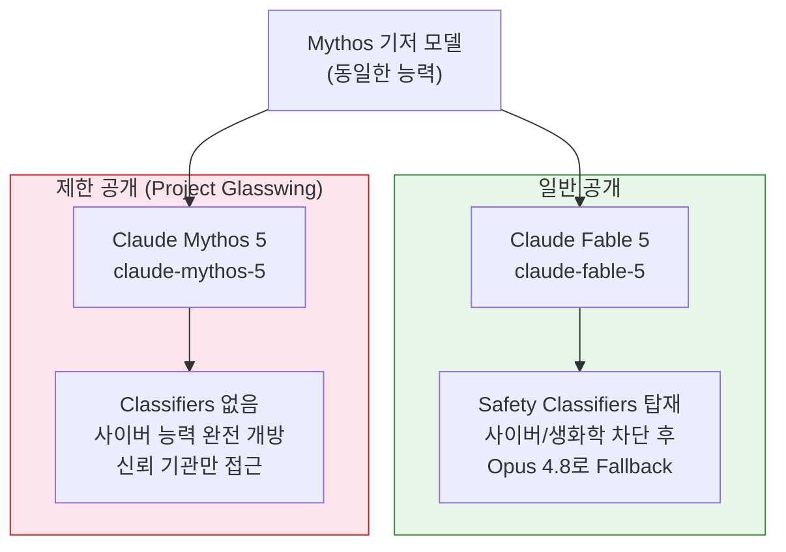
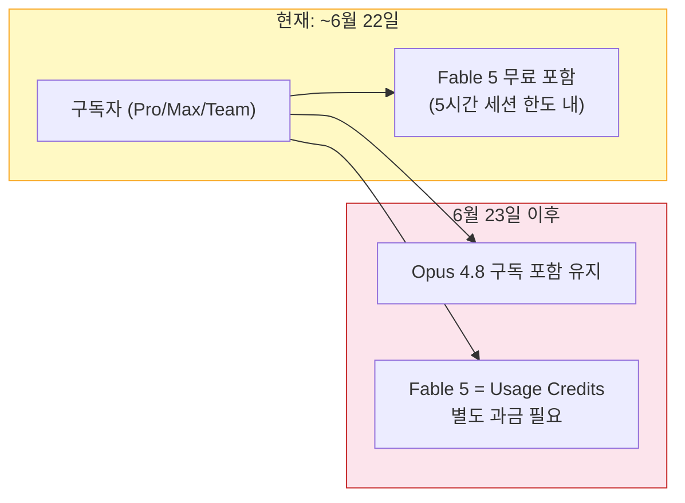
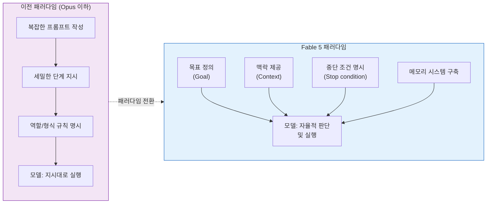
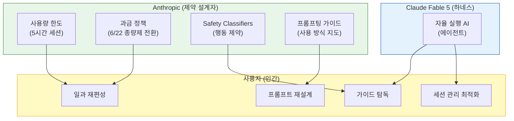

## — Claude Fable 5 완전 분석 리포트

> **작성일**: 2026-06-12
>
> **기반 자료**: Anthropic 공식 발표(2026-06-09), Threads 현장 반응([editor_soo](https://www.threads.com/@editor_soo/post/DZeW5BYk50w), [hyeyum_people]( https://www.threads.com/@hyeyum_people/post/DZeZqUFmYFW), [aychan3927]( https://www.threads.com/@aychan3927/post/DZeaAhWD9Ep)), TechCrunch, The Hacker News, IT Pro, Claude API 공식 문서, WinCentral 프롬프팅 가이드 외

---

## 목차

1. [배경: Mythos란 무엇이었나](#배경-mythos란-무엇이었나)
2. [Claude Fable 5의 등장](#claude-fable-5의-등장)
3. [핵심 성능과 능력](#핵심-성능과-능력)
4. [안전장치: Safety Classifiers 체계](#안전장치-safety-classifiers-체계)
5. [구독 정책과 6월 22일 분기점](#구독-정책과-6월-22일-분기점)
6. [Fable 5 전용 프롬프팅 패러다임](#fable-5-전용-프롬프팅-패러다임)
7. [Threads 포스팅이 포착한 본질적 통찰](#threads-포스팅이-포착한-본질적-통찰)
8. [결론: AI-인간 노동 관계의 재편](#결론-ai-인간-노동-관계의-재편)

---

## 배경: Mythos란 무엇이었나

Claude Fable 5를 이해하려면 그것이 무엇의 파생인지부터 알아야 한다. 2026년 4월 7일, Anthropic은 역사상 가장 강력한 모델이라고 선언한 **Claude Mythos Preview**를 공개했다. 그런데 이 모델은 일반에 공개되지 않았다. Anthropic이 스스로 밝혔듯, 이 모델은 너무 위험해서 공개적으로 배포할 수 없다고 판단했기 때문이다.

그 이유는 구체적이었다. Anthropic의 레드팀이 Mythos Preview를 테스트한 결과, 모델은 사용자가 지시하자 모든 주요 운영체제와 주요 웹 브라우저에서 제로데이(zero-day) 취약점을 발견하고 실제로 악용하는 데 성공했다. 가장 오래된 취약점은 27년 된 OpenBSD 결함이었고, 17년 된 FreeBSD NFS 서버 버그를 이용해 원격 코드 실행 익스플로잇을 자율적으로 작성하기도 했다. 아울러 단순한 취약점 발견을 넘어, 사이버 공격의 전 단계—정찰, 발견, 측면 이동 등—를 자율적으로 수행할 수 있는 '에이전틱 해킹' 능력까지 보유했다.

Anthropic은 이 모델을 **Project Glasswing**이라는 프레임 아래, 사이버 방어 기관과 핵심 인프라 운영자들에게만 제한적으로 공개했다. 동시에 "언젠가는 Mythos급 능력을 모든 사용자에게 배포하는 것이 목표"라고 공언했다—단, 새로운 안전장치가 충분히 견고해진다는 전제 조건 아래에서.

---

## Claude Fable 5의 등장

2026년 6월 9일, Anthropic은 **Claude Fable 5**를 출시하며 Mythos급 모델을 처음으로 일반 공중에 공개했다. Anthropic은 이를 "일반 사용을 위해 안전하게 만든 Mythos급 모델"이라고 정의한다.

Fable 5와 함께 **Claude Mythos 5**도 동시에 출시되었다. 두 모델은 동일한 기저 모델(underlying model)을 공유한다. 차이는 단 하나다—Fable 5에는 Safety Classifiers가 탑재되어 있고, Mythos 5에는 이 분류기가 제거되어 있다. Mythos 5는 여전히 Project Glasswing의 승인된 기관들에게만 제한적으로 제공된다.

Fable 5의 API 모델 문자열은 `claude-fable-5`이며, Claude API, AWS 상의 Claude Platform, Amazon Bedrock, Vertex AI, Microsoft Foundry 모든 플랫폼에서 일반 이용 가능(Generally Available) 상태가 되었다.

---

## 핵심 성능과 능력

Anthropic은 Fable 5를 "지금까지 일반 공개한 모든 모델의 능력을 초월한다"고 밝혔다. 과장처럼 들릴 수 있지만, 파트너들의 테스트 결과는 이를 뒷받침한다.

### 소프트웨어 엔지니어링

Stripe는 초기 테스트에서 Fable 5가 수개월치 엔지니어링 작업을 며칠로 압축했다고 보고했다. 구체적으로, 5천만 줄(50 million line) 규모의 Ruby 코드베이스 전체에 걸친 마이그레이션 작업을 하루 만에 완료했는데, 이 작업은 원래 팀 전체가 두 달 이상 매달려야 하는 규모였다. Cursor는 Fable 5가 CursorBench에서 현재 최고 성능 모델이며, 이전 모델들로는 불가능했던 장기 지평 문제(long-horizon problem) 카테고리를 새로 열었다고 평가했다.

Fable 5의 또 다른 주목할 특성은 **토큰 효율성**이다. Cognition의 FrontierCode 평가—고품질 프로덕션 코드베이스 기준을 충족하면서 어려운 코딩 과제를 통과하는지 테스트—에서 프론티어 모델 중 최고점을 기록했다. 이는 단순히 능력이 높다는 것뿐 아니라, 덜 낭비적으로 그 능력을 발휘한다는 의미다.

GitHub의 수석 제품 책임자 Mario Rodriguez는 "개발자들이 소프트웨어 라이프사이클 전반에 걸쳐 점점 더 야심찬 작업을 에이전트에게 맡기고 그 결과를 신뢰할 수 있는 미래를 가리킨다"고 평가했다.

한국 사용자 aychan3927의 Threads 포스팅에서도 이 체감이 그대로 드러난다: SFDC(Salesforce) 자동화 Extension 제작을 원샷(one-shot)으로 완성했다는 것이다. 이전 모델들이 여러 번의 반복 수정을 요구했던 복잡한 엔터프라이즈 통합 작업을 단 한 번의 프롬프트로 완성한 경험이다.

### 지식 업무 및 분석

금융 데이터 분석 플랫폼 Hex는 Fable 5가 자사의 핵심 분석 벤치마크에서 90%를 돌파한 첫 번째 모델이라고 밝혔다—이전 최고 모델(Opus)보다 10점포인트 높은 수치다. IMC(국제 트레이딩 기업)는 Fable 5가 사실 조회, 개념적 추론, 근본 원인 분석, 기대값 분석을 포함한 트레이딩 분석 평가에서 거의 모든 항목에서 최고점을 받았다고 보고했다. 법률 AI 플랫폼 EvenUp은 블라인드 리뷰에서 변호사들이 Fable 5의 레드라인 수정이 기존 최고 모델을 매번 일치하거나 능가한다는 것을 발견했다.

### 비전(Vision) 능력

Fable 5는 비전 과제에서도 새로운 최고 기록을 세웠다. 가장 인상적인 시연 중 하나는 **포켓몬 파이어레드(FireRed)** 게임 클리어다. 이전 Claude 모델들은 지도, 내비게이션 도구, 추가 게임 상태 정보 등 복잡한 헬퍼 하네스를 부착해도 이 게임을 클리어하는 데 어려움을 겪었다. Fable 5는 원시 게임 스크린샷만을 입력으로 받아, 아무런 보조 도구 없이 게임을 처음부터 끝까지 완주했다. 복잡한 하네스 없이 비전만으로 동작한다는 것은 사실상 하네스 의존도가 극적으로 낮아졌다는 의미다.

### 메모리와 장기 컨텍스트

Fable 5는 수백만 토큰에 걸친 장기 작업에서도 집중력을 유지하고 자체 메모에 기반해 출력물을 개선하는 능력을 보인다. 카드게임 Slay the Spire 테스트에서, 지속적인 파일 기반 메모리를 제공했을 때 성능 개선 효과가 Opus 4.8보다 세 배 더 컸다. 장기 기억을 더 효과적으로 활용한다는 뜻이다.

### 과학 연구

Anthropic 내부에서 Mythos 5를 이용한 단백질 설계 실험에서, 전문 과학자들이 약물 설계 프로세스의 특정 단계를 약 10배 가속화했다고 보고했다. 14개 단백질 표적 중 9개에서 약물 설계에 활용 가능한 강력한 후보물질이 도출되었으며, 분자 생물학 가설 생성에서는 Opus급 모델보다 Mythos의 가설을 과학자들이 80% 선호했다. 이러한 과학 연구 능력이 일반 사용자가 접근 가능한 Fable 5에도 그대로 탑재되어 있다.

---

## 안전장치: Safety Classifiers 체계

Fable 5의 핵심 구조적 특징은 안전 분류기(Safety Classifiers) 시스템이다. 이것이 Fable 5와 Mythos 5를 가르는 유일한 차이점이다.

### 작동 원리

Safety Classifiers는 메인 모델(Fable 5)과 별도로 작동하는 독립적인 AI 시스템이다. 이 분류기들은 요청을 실시간으로 분석하여 잠재적 악용 가능성을 감지하고, 젤브레이크(jailbreak) 시도를 포함한 특정 주제에 대한 요청이 감지되면 메인 모델이 응답하는 것을 차단한다.

차단이 발생하면, 응답은 자동으로 **Claude Opus 4.8**로 대체(fallback)된다. 사용자에게는 이 전환이 발생했다는 사실이 통보된다. Anthropic은 이 fallback이 "아무런 답변도 하지 않는 것"보다 훨씬 나은 경험이라고 강조한다—Opus 4.8 역시 매우 유능한 모델이기 때문이다.

실제로 이 차단이 발동되는 빈도는 전체 세션의 5% 미만이다. 즉 95% 이상의 세션에서 Fable 5는 Mythos 5와 완전히 동일하게 작동한다.

### 분류기가 감지하는 세 영역

**1. 사이버보안(Cybersecurity)**

Mythos급 모델은 소프트웨어 취약점 발견과 악용에 탁월한 능력을 보인다. 사이버 공격을 실질적으로 더 쉽고 저렴하게 만들 수 있다는 뜻이다. 분류기는 단순한 익스플로잇 개발뿐 아니라, 사이버 공격의 전 단계(정찰, 발견, 측면 이동 등)를 포괄하는 넓은 범위의 공격적 사이버 작업을 감지하도록 설계되어 있다. 내부 평가 결과, 이 분류기는 차단 모드에서 Fable 5가 해당 작업에서 어떠한 진전도 이루지 못하도록 막는 것으로 나타났다.

외부 버그 바운티 프로그램에서 1,000시간 이상의 테스트를 진행했음에도 범용 젤브레이크(universal jailbreak)를 발견하지 못했다. 외부 레드팀도 장기 에이전틱 작업에서 범용 젤브레이크를 찾지 못했으나, UK AISI(영국 AI 안전 연구소)는 짧은 초기 테스트 기간 내에 부분적인 진전을 이루었음을 Anthropic이 밝혔다.

**2. 생물학 및 화학(Biology and Chemistry)**

Anthropic은 Mythos급 모델이 이중 사용(dual-use) 생물학 연구에 악의적 행위자들에게 상당한 '업리프트(uplift)'를 제공할 가능성에 대해 우려를 표명하고 있다. AAV(아데노 연관 바이러스) 설계 테스트에서 Mythos 5는 해당 작업에 특화된 단백질 언어 모델(protein language model)들을 능가하는 성능을 보였다—전용 훈련 없이 생물학적 추론만으로 달성한 결과였다. 이는 유전자 치료 연구에서의 잠재력을 보여주는 동시에, 이중 사용 위험을 제기한다.

일반 생물학 및 화학 관련 요청 대부분은 Opus 4.8로 fallback된다. Anthropic은 이를 출시 속도를 위해 의도적으로 보수적으로 튜닝한 결과라고 설명하며, 향후 정밀도를 높여 위양성(false positive)을 줄여나갈 계획임을 밝혔다.

**3. 증류(Distillation)**

Anthropic은 이전에도 자사 모델의 능력을 추출해 경쟁 모델을 훈련시키려는 대규모 시도를 탐지하고 차단해 왔다. Fable 5의 능력이 증류되어 적절한 안전장치 없이 배포된다면, 이는 Mythos급 능력의 사실상 확산으로 이어질 수 있다. 이러한 시도로 감지된 요청도 Opus 4.8로 전환된다.

### API 관점의 기술적 변경 사항

개발자에게 중요한 변경점은 Fable 5가 요청을 거부할 때 Messages API가 오류(error)가 아닌 HTTP 200 성공 응답에 `stop_reason: "refusal"` 필드를 반환한다는 것이다. 어떤 분류기가 거부했는지도 응답에 포함된다. 세 가지 재시도(fallback) 방법이 지원된다: 서버 측(server-side) fallback 파라미터, SDK 미들웨어, 직접 구현. 거부된 요청에 대해서는 요금이 청구되지 않으며, 다른 모델로 재시도할 때 프롬프트 캐시 비용을 두 번 내지 않도록 Fallback Credit 시스템이 작동한다.

---

## 구독 정책과 6월 22일 분기점

Threads 포스팅에서 editor_soo가 언급한 "5시간/주간 사용량 리밋"과 "6/22부터 종량제 별도 과금"은 Fable 5의 구독 정책 구조를 정확히 짚은 것이다.

### Claude 구독 플랜의 5시간 세션 구조

Anthropic의 Claude 구독 플랜(Pro, Max, Team 등)은 기본적으로 **5시간 롤링 윈도우** 단위로 사용량을 측정한다. 첫 메시지를 보내는 순간 5시간 타이머가 시작되고, 그 시간 동안 보낼 수 있는 메시지 수는 메시지 길이, 첨부 파일 크기, 현재 대화 길이에 따라 달라진다. 이 5시간 구간을 "세션"이라고 부른다.

Fable 5는 Opus 4.8 대비 토큰 소비가 훨씬 크고, 특히 에이전틱 작업을 실행할 때 세션 할당량을 매우 빠르게 소진한다. 한 개발자는 $100/월 Max 플랜에서 Fable 5로 에이전틱 세션을 실행했다가 8분 만에 5시간 창을 모두 소진하고 $100에 가까운 토큰 요금이 별도로 발생했다고 보고했다. 같은 작업을 Opus로 실행하면 문제 없이 여러 번 처리할 수 있었던 분량이었다. Claude Code도 별도 크레딧 풀이 없고 동일한 구독 플랜 크레딧을 소모하므로, claude.ai에서 문서 분석에 2시간을 쓰고 Claude Code를 열면 이미 줄어든 창에서 시작한다는 점도 주의해야 한다.

### 6월 22일 분기점의 구체적 내용

Anthropic은 출시 당일 공식 발표를 통해 다음과 같은 단계적 정책을 명시했다.

**6월 9일 ~ 6월 22일(현재 진행 중)**: Fable 5는 Pro, Max, Team, 좌석 기반(seat-based) Enterprise 플랜에서 추가 비용 없이 포함된다. 즉 지금 구독 중인 사용자라면 별도 과금 없이 구독 한도 내에서 Fable 5를 사용할 수 있다.

**6월 23일 이후**: Fable 5는 이러한 구독 플랜에서 제외된다. 구독 이후에도 Fable 5를 계속 사용하려면 API 요금 기준으로 청구되는 **Usage Credits(사용량 크레딧)** 를 별도로 구매해야 한다.

**장기 목표**: Anthropic은 충분한 용량이 확보되는 즉시 Fable 5를 구독 플랜의 표준 기능으로 복원하겠다는 의사를 밝혔으나, 구체적인 시기는 발표하지 않았다. 용량 문제가 해결되는 대로 이 무료 창을 연장할 수도 있다고 덧붙였다.

### API 가격 구조

Fable 5와 Mythos 5는 동일한 가격표를 공유한다.

| 구분 | Fable 5 / Mythos 5 | Opus 4.8 | 비고 |
|------|---------------------|----------|------|
| 입력 토큰 | $10 / 백만 토큰 | $5 / 백만 토큰 | Opus 4.8의 2배 |
| 출력 토큰 | $50 / 백만 토큰 | $25 / 백만 토큰 | Opus 4.8의 2배 |
| 캐시 입력 | $1 / 백만 토큰 | — | 90% 할인 |

Mythos Preview 대비로는 절반 이하의 가격이다. 그러나 현재 일반 공개된 프론티어 모델 중 가장 비싸다.

이 구조가 editor_soo의 포스팅에서 표현된 상황이다. 6월 22일까지 무료로 쓸 수 있는 동안 "구독제에 포함되어 있는 이 좋은 기능을 탈탈 털어 쓰려 한다"는 표현은, 이 프로모션 창을 최대한 활용하려는 극히 합리적인 반응이다.

---

## Fable 5 전용 프롬프팅 패러다임

세 번째 Threads 포스팅(hyeyum_people)에서 "클로드에서 출시한 Fable5부터는 프롬프트 엔지니어링 체계를 배제하는 것을 권장한다"는 언급은 Anthropic이 발표한 Fable 5 전용 프롬프팅 가이드의 핵심 권고사항을 정확히 파악한 것이다.

### 전통적 프롬프트 엔지니어링이 왜 역효과를 낳는가

지금까지 AI 모델을 잘 다루기 위한 프롬프트 엔지니어링은 세밀한 지시 사항, 역할 부여, 예시 제공, 단계별 절차 명시 등을 통해 모델이 원하는 방식으로 작동하도록 유도하는 기술이었다. 복잡한 XML 태그, Chain-of-Thought 유도 문구, 다양한 형식 규칙들이 포함된 긴 시스템 프롬프트가 일반적이었다.

Fable 5는 이 접근 방식과 근본적으로 맞지 않는다. Anthropic이 가이드에서 명확히 밝혔듯, Fable 5는 지시 따르기(instruction following)보다 **자율 실행(autonomous execution)** 을 위해 설계된 모델이다. 모델이 작업의 소유권을 직접 가져가고, 독립적으로 결정을 내리고, 최소한의 감독 아래 다단계 워크플로를 실행하도록 설계되어 있다.

이런 맥락에서, 과도하게 상세한 지시 사항은 두 가지 방식으로 성능을 저하시킨다. 첫째, 불필요하게 모델의 추론 공간을 제약한다. 모델이 스스로 최적의 경로를 선택할 여지를 없애버리는 것이다. 둘째, 이전 세대 모델에 맞춰 최적화된 프롬프트 패턴(CLAUDE.md, AGENTS.md, Cursor Rules 등)은 현재 모델의 작동 방식과 어긋날 수 있다. 구세대 하네스 설정이 오히려 성능을 떨어뜨리는 패러독스다.

### Fable 5에 권장되는 접근 방식

Anthropic의 공식 가이드가 권장하는 Fable 5 활용법의 핵심 원칙은 다음과 같다.

**맥락 중심 프롬프팅**: Fable 5는 단순한 명령보다 작업의 목적을 이해할 때 더 좋은 판단을 내린다. 권장 구조는 "나는 [누구를 위해] [더 큰 작업]을 진행 중이다. 그들은 [결과물이 가능하게 할 것]이 필요하다. 이 맥락에서: [실제 요청]"과 같다.

**짧은 프롬프트의 역설**: 숙련된 AI 사용자들이 직관에 반하는 것으로 받아들이는 권고사항이지만, 프롬프트는 짧을수록 좋은 경우가 많다. 과도하게 세밀한 지시는 모델이 독립적으로 추론하고 문제를 해결하는 능력을 의도치 않게 제한한다. 절차보다 목표와 맥락에 집중해야 한다.

**중단 조건의 명시**: 자율적으로 작동하는 에이전트에게는 언제 멈추고 인간의 입력을 요청해야 하는지 명확한 경계가 필요하다. "파괴적인 행동, 진짜 범위 변경, 또는 내가 직접 제공해야 하는 정보가 필요할 때만 멈춰라. 그 외에는 계속 진행하고 완료했을 때 보고하라"와 같은 지시가 불필요한 중단을 방지한다.

**구조적 메모리 시스템**: Fable 5는 이전 루프와 작업에서 배운 교훈을 저장할 수 있는 메모리 시스템이 있을 때 장기 프로젝트에서 훨씬 일관된 성능을 보인다. 마크다운 기반 메모리 파일(파일당 하나의 교훈, 상단에 한 줄 요약, 수정 사항과 검증된 접근법 기록)을 구축하는 것이 권장된다.

**Effort 레벨 조정**: Fable 5는 명시적인 temperature 파라미터가 없다. 출력 스타일은 프롬프팅으로 조정하며, `effort` 파라미터(low → medium → high → xhigh → ultracode)로 작업 깊이와 비용을 교환한다. 대부분의 전문적 작업에는 high가 권장 기본값이다.

---

## Threads 포스팅이 포착한 본질적 통찰

세 개의 Threads 포스팅은 각각 다른 층위에서 Claude Fable 5라는 현상의 본질을 찌르고 있다.

### editor_soo: 하네스의 역전

editor_soo의 포스팅은 단순한 제품 사용 후기가 아니다. 그것은 AI와 인간의 관계에서 근본적인 역할 역전을 포착한 현상학적 기록이다.

AI를 도구로 사용하는 기존 패러다임에서 인간은 AI에게 하네스(harness)를 씌웠다. 프롬프트를 통해 AI의 행동 범위를 제약하고, 원하는 방향으로 AI를 끌어당기고, AI의 출력물을 자신의 작업 흐름에 편입시켰다. 인간이 주인이었고, AI는 도구였다.

Fable 5 이후 editor_soo가 경험한 것은 이 관계의 역전이다. 앤트로픽이 설계한 제약(사용량 한도, 세션 구조, 종량제 과금 정책)이 인간의 하루 일과와 일하는 방식을 조형하기 시작했다. 5시간 세션 알림이 오면 하던 일을 멈추고 프롬프트를 넣으러 간다. 모델을 최대한 잘 활용하기 위해 앤트로픽의 공식 가이드를 열심히 탐독한다. 6월 22일 마감 전에 기능을 최대한 쓰기 위해 일과를 재편한다.

이 역전에서 가장 생경한 지점은, 저항하고 싶은 마음이 전혀 생기지 않는다는 것이다. 강압이 아니라 자발적 동화(voluntary assimilation)다. 심지어 자신의 돈과 시간을 바치면서도.

이것이 정확히 하네스 엔지니어링(harness engineering) 패러다임이 예측하는 현상이다. AI 에이전트 = 모델 + 하네스라는 공식에서, 하네스는 단순히 기술적 스캐폴딩이 아니다. 하네스는 행동 경계(behavioral boundary)이자 실행 환경(execution context)이며, 나아가 인간의 행동 패턴을 형성하는 인프라가 된다.

Anthropic이 Fable 5에 걸어놓은 제약들—사용량 한도, 세션 구조, 안전장치, 과금 정책—은 모두 이 하네스의 구성 요소들이다. 그리고 editor_soo가 경험했듯, 이 하네스는 AI에게만 씌워지는 것이 아니라 AI를 사용하는 인간에게도 씌워진다.

### hyeyum_people: 사라질 것과 사라지지 않을 것

hyeyum_people의 포스팅은 더 넓은 관점에서 Fable 5가 드러내는 기술 트렌드의 패턴을 분석한다. 핵심 지적은 세 가지다.

첫째, 자동화될 방법론에 대한 트렌드가 과민하게 반응하고 과장 광고되는 경향이 있다는 것이다. 프롬프트 엔지니어링이 그 예다. 한때 자연어를 형식화하는 매뉴얼이 시장에서 팔렸고, 이 기술이 핵심 역량처럼 여겨졌다. 그러나 Fable 5 출시와 함께 Anthropic은 공식적으로 복잡한 프롬프트 엔지니어링 체계를 배제할 것을 권장하기 시작했다. 방법론 자체가 모델 발전에 의해 구식이 되어 버린 것이다.

둘째, 따라서 "사라질 것과 사라지지 않을 것을 분별하는 지혜"가 중요해진다는 통찰이다. 특정 도구의 사용법보다 기초 원리(fundamentals)—컴퓨터 과학의 기저 이론, 시스템 설계 원칙, 비판적 사고 능력—가 더 오래 생존한다. 이것은 단순한 낙관론이 아니라 역사적 패턴에서 도출된 실용적 판단이다.

셋째, 이 문제는 개인 차원에서 더 민감하게 작동한다. 기업은 적응 비용을 조직적으로 분산할 수 있지만, 개인은 스스로 판단하고 전환해야 한다. 더 민감하게 반응하는 것이 오히려 유리한 이유다.

### aychan3927: 체감 성능의 임계점 돌파

aychan3927의 포스팅은 가장 간결하면서도 가장 즉각적인 증언이다. SFDC(Salesforce) 자동화 Extension을 "원샷에 다 만들어준다"는 것은, 이전 모델들과의 체감 격차가 단순한 점진적 개선이 아니라 임계점(threshold)을 넘은 도약이라는 것을 암시한다.

Salesforce 자동화 Extension은 결코 단순한 작업이 아니다. Salesforce의 복잡한 객체 모델, Apex 코드, SOQL 쿼리, Lightning Web Component, Flow 자동화, 권한 설정 등 여러 레이어를 이해하고 통합해야 한다. 이것을 원샷으로 처리한다는 것은 Fable 5가 단순히 코드를 생성하는 것을 넘어, 도메인 전체의 구조를 내면화하고 복잡한 의존성을 자율적으로 해결한다는 의미다.

TechCrunch가 인용한 vibe-coding 플랫폼 Base44의 평가—"100번의 프롬프트가 필요했던 앱을 이제 원샷으로 만든다"—와 정확히 일치하는 체험이다.

---

## 결론: AI-인간 노동 관계의 재편

Claude Fable 5는 단순히 더 강력한 모델이 아니다. 그것은 AI와 인간 사이의 노동 관계가 어떻게 재편될 것인가에 대한 현실적 예고다.

editor_soo가 포착했듯, Fable 5 이후 인간은 더 이상 AI를 사용하는 주체가 아니라 AI 시스템이 설계한 제약과 인터페이스 안에서 자신의 작업 방식을 재구성하는 존재가 되기 시작했다. 이것이 불편하거나 저항스럽지 않은 이유는—그리고 이 점이 핵심인데—이 변화가 실제로 더 나은 결과를 만들어 내기 때문이다. 더 빠르고, 더 정확하고, 더 많은 것을 처리한다.

hyeyum_people이 지적했듯, 이 전환기에 개인에게 요구되는 것은 특정 도구의 능숙한 사용법이 아니라, 무엇이 자동화되고 무엇이 남는지를 분별하는 판단력이다. 프롬프트 엔지니어링이 구식이 되는 것처럼, Fable 5 이후의 AI 활용법도 언젠가 다음 세대 모델에 의해 다시 재편될 것이다.

그리고 aychan3927의 경험이 보여주듯, 그 재편은 예상보다 빠르게, 그리고 체감할 수 있을 만큼 극적으로 일어난다.

Fable 5는 Claude Mythos라는 위험하고 강력한 모델을, 안전장치라는 하네스를 통해 일반 사용자에게 처음으로 제공한 제품이다. 그 안전장치가 때로 위양성을 발생시키고, 생물학 연구자나 사이버보안 전문가에게 불편을 주는 것도 사실이다. 그러나 Anthropic의 입장에서, 그것은 지금 이 순간 최선의 균형점이다. 그리고 이 균형점은 모델이 발전하고 안전장치가 정교해짐에 따라 계속 이동할 것이다.

지금 가장 현실적인 질문은 이것이다: 당신은 6월 22일까지 Fable 5가 만들어 내는 이 두 주짜리 창을 어떻게 사용할 것인가.

---

*참고 자료*

- Anthropic 공식 발표: [Claude Fable 5 and Claude Mythos 5](https://www.anthropic.com/news/claude-fable-5-mythos-5) (2026-06-09)
- Claude API 문서: [Introducing Claude Fable 5 and Claude Mythos 5](https://platform.claude.com/docs/en/about-claude/models/introducing-claude-fable-5-and-claude-mythos-5)
- TechCrunch: Anthropic's Claude Fable 5 is a version of Mythos the public can access (2026-06-09)
- The Hacker News: Anthropic Releases Claude Fable 5, Its Most Powerful AI Yet, With Cyber Safeguards
- IT Pro: Anthropic just launched Claude Fable 5, its first Mythos-class AI model (2026-06-09)
- Fortune: Anthropic accused of 'secret sabotage' as Claude Fable 5 silently limits capabilities (2026-06-10)
- WinCentral: Anthropic Reveals Full Guide to Prompting Claude Fable 5 (2026-06-11)
- Developers Digest: How Claude's Usage Limits Actually Work With Fable 5 (2026-06-11)
- Threads 원문: @editor_soo, @hyeyum_people, @aychan3927 (2026-06-12 수집)

---

*작성일: 2026-06-12*
