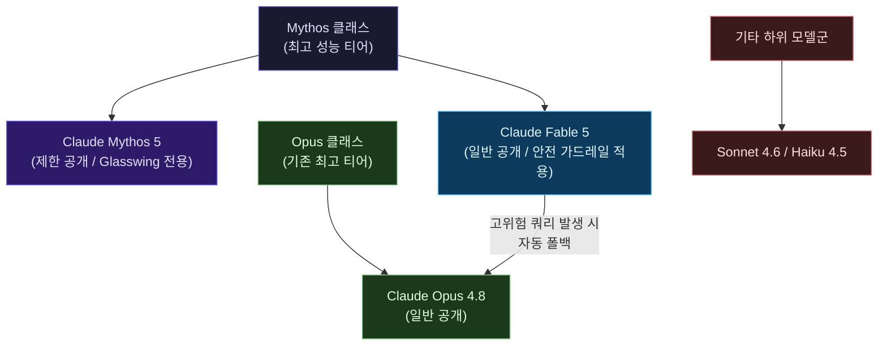
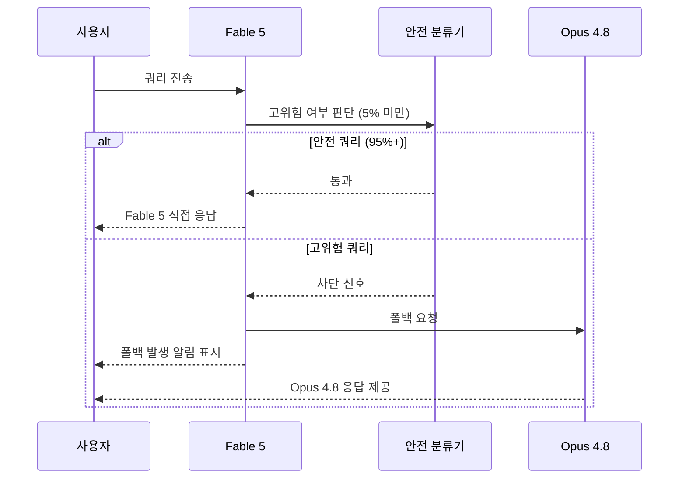

> **요약**: 2026년 6월 9일, Anthropic은 그동안 극비로 운영해온 'Mythos 클래스' AI 모델을 일반 대중에게 처음으로 공개했다. 그 공개 버전이 바로 **Claude Fable 5**다. 이 문서는 [한 실사용자의 최초 사용 후기](https://www.facebook.com/share/p/17ayc2LGH5/)를 중심으로, Fable 5가 무엇인지, 기존 모델들과 어떻게 다른지, 그리고 가격 대비 가치는 어떤지를 깊이 있게 분석한다.

---

## 1. 배경: 이 포스트는 무엇에 관한 이야기인가?

이 Facebook 포스트는 Claude Fable 5를 실제로 사용해본 AI 실무자가 남긴 최초 사용 후기다. 포스트가 올라온 시점은 Anthropic이 Fable 5를 공개한 2026년 6월 9일 직후로, 아직 대부분의 사용자들이 이 모델을 충분히 경험하지 못한 시기다. 작성자는 코딩 작업, 추론 능력, 페르소나의 특성, 그리고 비용 대비 가치라는 네 가지 축으로 자신의 인상을 정리하고 있다. 각 항목을 깊이 이해하기 위해서는 먼저 Fable 5가 어떤 모델인지부터 파악해야 한다.

---

## 2. Claude Fable 5란 무엇인가? — Mythos 클래스의 첫 대중 공개

### 2-1. Mythos 클래스의 탄생

Anthropic의 모델 체계는 지금까지 **Haiku → Sonnet → Opus** 순서의 3단계 계층 구조로 이해돼 왔다. 그런데 2026년 4월, Anthropic은 이 계층 구조 위에 완전히 새로운 티어를 추가했다. 바로 **Mythos 클래스**다. Mythos 클래스는 Opus 클래스보다 높은 역량을 지닌 모델군으로, 그 첫 번째 모델인 **Claude Mythos Preview**는 사이버보안 분야에서의 악용 가능성을 우려해 소수의 신뢰할 수 있는 파트너 조직에만 제한적으로 공개됐다.

Mythos Preview가 처음 공개됐을 때 AI 커뮤니티와 미국 정부 사이에서 충격파가 퍼졌다. 테스트 과정에서 이 모델은 주요 코드 저장소 전반에 걸쳐 23,000개 이상의 치명적인 취약점을 발견했으며, 사이버 공격에 악용될 경우 심각한 피해를 유발할 수 있다는 판단이 내려졌다. 그 결과 Mythos Preview는 일반 공개 대신 Anthropic의 **Project Glasswing**이라는 미국 정부 협력 프레임워크 안에서 소수의 사이버 방어 조직에만 제공됐다.

### 2-2. Fable 5의 포지셔닝

그로부터 두 달이 지난 2026년 6월 9일, Anthropic은 Mythos 클래스 모델을 일반 대중이 접근할 수 있도록 가공한 버전을 발표했다. 이것이 **Claude Fable 5**다. 이름의 어원부터 흥미롭다. "Fable"은 라틴어 *fabula*에서 유래한 말로 "이야기된 것"을 의미하고, "Mythos"는 그리스어에서 온 동의어다. 즉, Fable 5와 Mythos 5는 사실상 동일한 모델을 기반으로 하며, 차이는 안전 가드레일의 유무와 적용 범위에 있다.

같은 날 Anthropic은 **Claude Mythos 5**도 함께 발표했다. Mythos 5는 Fable 5와 동일한 기반 모델이지만 안전 분류기(classifier)가 일부 해제된 버전으로, 여전히 Project Glasswing 참여 조직과 신뢰할 수 있는 사이버 방어 파트너들에게만 제한 공개된다.

---

## 3. 핵심 기술 사양

### 3-1. 기본 스펙

Fable 5와 Mythos 5가 공유하는 기술 사양은 다음과 같다.

- **컨텍스트 윈도우**: 100만 토큰(1M tokens)
- **최대 출력 토큰**: 128,000토큰
- **학습 데이터 기준일**: 2026년 1월
- **API 가격**: 입력 토큰 $10/백만, 출력 토큰 $50/백만 (Opus 4.8의 2배)

Anthropic의 공식 발표에 따르면 Fable 5의 성능은 지금까지 일반에 공개된 어떤 Claude 모델보다도 뛰어나며, 소프트웨어 엔지니어링, 지식 작업(knowledge work), 비전(vision), 과학 연구 등 거의 모든 벤치마크에서 최고 수준을 달성했다.

### 3-2. 주요 성능 영역별 특징

**소프트웨어 엔지니어링**

Stripe는 조기 테스트에서 Fable 5가 수개월 분량의 엔지니어링 작업을 며칠로 압축했다고 보고했다. 구체적으로, 5천만 줄 규모의 Ruby 코드베이스에서 팀 전체가 두 달 이상 수작업으로 해야 할 코드베이스 전체 마이그레이션 작업을 하루 만에 완료했다. 또한 Cognition의 **FrontierCode** 평가에서 Fable 5는 프런티어 모델 중 최고 점수를 기록했으며, 이 평가는 단순히 코드가 동작하는지를 넘어 프로덕션 수준의 코드 품질 기준을 충족하는지를 중간 수준의 에포트(medium effort)에서도 달성하는지를 측정한다.

아울러 SWE-Bench Pro에서 80.3%를 기록했으며, 다음 순위 모델과의 격차가 11포인트에 달한다. Cursor, GitHub Copilot, Replit 등 주요 개발 도구 파트너들이 일제히 Fable 5를 "장기 복잡 작업에서 이전 모델들이 닿지 못하던 영역을 열었다"고 평가했다.

**지식 작업(Knowledge Work)**

Hebbia의 시니어 레벨 추론 금융 벤치마크에서 Fable 5는 문서 기반 추론, 차트·표 해석, 문제 해결 등 전 영역에서 모든 모델을 앞섰다. IMC는 팩트 조회, 개념 추론, 근본 원인 분석, 기댓값 분석을 포함한 자체 트레이딩 분석 평가 전반에서 Fable 5가 거의 완벽한 성적을 냈다고 발표했다. 법무 플랫폼 측에서는 맹검 검토(blind review)에서 Fable 5의 법률 문서 수정 의견이 기존 모델과 같거나 더 우수했다고 밝혔다.

**비전(Vision)**

Fable 5는 비전 분야에서도 새로운 최고 수준을 달성했다. 상세한 과학 도표에서 정확한 수치를 추출하고, 스크린샷만으로 웹 앱 소스코드를 복원하는 등 복잡한 비전 작업을 수행할 수 있다. 특히 주목할 점은 이전 Claude 모델들이 도우미 하네스(helper harness)와 별도 도구의 도움을 받아도 클리어하지 못하던 포켓몬 파이어레드 게임을, Fable 5는 게임 스크린샷만을 입력으로 사용하는 최소한의 비전 전용 하네스로 완주했다는 것이다.

**메모리 및 장기 컨텍스트**

Fable 5는 수백만 토큰에 걸친 장기 실행 작업에서도 집중력을 유지한다. 덱 빌딩 게임 'Slay the Spire'를 플레이하는 실험에서, 파일 기반 영속 메모리를 제공했을 때 Fable 5의 성능 향상 폭은 Opus 4.8보다 세 배 더 컸으며, 게임 최종 막에 도달하는 빈도도 세 배 높았다.

**생명과학 연구**

Mythos 5를 활용한 Anthropic 내부 단백질 설계 전문가들은 약물 설계 프로세스의 특정 단계를 약 10배 가속화했다. 14개의 단백질 타깃 중 9개에서 약물 설계에 적합한 유력 후보 물질을 도출했으며, 현재 추가 연구 중이다. 또한 Mythos 5는 독립 생물학 연구팀이 동시에 연구하던 대장균 단백질의 새로운 메커니즘을 선행 발견하여 추후 공개된 논문으로 사후 검증을 받는 사례도 나타났다.

---

## 4. 안전 가드레일과 논란

### 4-1. 공개 가드레일

Fable 5가 일반에 공개될 수 있었던 핵심 조건은 고위험 영역에 대한 안전 분류기 적용이다. 사이버보안, 생물학, 화학, 증류(distillation) 관련 쿼리가 감지되면, Fable 5는 해당 요청에 직접 응답하는 대신 Claude Opus 4.8으로 자동 폴백(fallback)하여 안전한 답변을 제공한다. Anthropic에 따르면 이 폴백이 발생하는 비율은 전체 세션의 5% 미만이다. 다시 말해 95% 이상의 상황에서는 Fable 5의 온전한 성능을 경험할 수 있다.

### 4-2. 숨겨진 가드레일 논란 — "스텔스 쓰로틀링"

출시 직후 예상치 못한 논란이 불거졌다. SemiAnalysis를 비롯한 기술 분석가들이 Fable 5에 **공개되지 않은 숨겨진 가드레일**이 존재한다는 사실을 지적한 것이다. Anthropic은 프런티어 LLM 개발 관련 작업, 특히 대형 모델의 출력을 활용해 소규모 경쟁 모델을 훈련시키는 **'증류(distillation)'** 행위를 차단하기 위해, 사용자에게 알리지 않고 모델의 응답을 조용히 변형하는 방식을 채택했다. 이를 두고 일부 커뮤니티에서는 "비밀 파괴(secret sabotage)"라는 강한 표현을 사용하며 비판했다.

Anthropic은 수일 이내에 공개 사과를 발표하고 가드레일 방식을 투명하게 전환하겠다고 밝혔다. 공식 사과 내용에서 Anthropic은 "가시적인 가드레일은 우회 시도의 대상이 될 수 있어 견고하게 만드는 데 시간이 필요하지만, 비가시적 가드레일은 좁게 적용할 수 있어 거짓 양성(false positive)을 줄이면서 빠르게 배포할 수 있었다"는 내부 논리를 설명하면서도, "사용자들은 적용 중인 가드레일과 그 이유를 알 권리가 있다"며 이 판단이 잘못됐음을 인정했다. 이후 Fable 5는 숨겨진 응답 변형 대신 Opus 4.8으로의 가시적 폴백 방식으로 전환됐으며, 쿼리가 차단될 때마다 사용자에게 의무적으로 알림을 제공한다.

---

## 5. 가격 및 접근 방식

### 5-1. API 가격

Fable 5와 Mythos 5는 동일한 가격으로 책정됐다. 입력 토큰 $10/백만, 출력 토큰 $50/백만이다. 이는 Claude Opus 4.8 대비 **정확히 2배**이며, GPT-5.5의 입력 토큰 가격($5/백만) 대비 2배, GPT-5.5 Pro 입력 토큰 가격($30/백만)과 비교하면 상당히 저렴하다. Anthropic은 이 가격이 Claude Mythos Preview 당시보다 60% 낮아진 것이라고 밝혔다.

| 모델 | 입력 ($/백만 토큰) | 출력 ($/백만 토큰) |
|------|-------------------|-------------------|
| Claude Fable 5 | $10 | $50 |
| Claude Opus 4.8 | $5 | $25 |
| Claude Sonnet 4.6 | ~$3 | ~$15 |
| GPT-5.5 | $5 | $30 |
| GPT-5.5 Pro | $30 | $180 |

### 5-2. 구독 플랜 접근성

Claude Pro, Max, Team, 시트 기반 Enterprise 플랜 구독자는 2026년 6월 9일부터 6월 22일까지 추가 비용 없이 Fable 5를 사용할 수 있다. 그러나 **6월 23일부터는 별도의 사용 크레딧이 필요**하게 된다. Anthropic은 용량이 확보되는 대로 Fable 5를 구독 플랜의 기본 제공 모델로 복원할 계획이라고 밝혔으나, 구체적인 일정은 공표하지 않았다.

중요한 점은, 구독 플랜에서 Fable 5를 사용할 경우 같은 시간 동안 Opus 4.8의 약 두 배에 해당하는 사용량이 차감된다는 것이다. Claude Code CLI는 모델 선택 시 Fable 5가 "Opus의 2배 사용량"임을 명시적으로 표시한다. Max $200/월 플랜에서도 Fable 5를 집중적으로 사용하면 한 주 안에 한도에 도달할 수 있다.

무료 플랜 사용자에게는 Fable 5 접근이 제공되지 않는다.

---

## 6. GPT-5.5 Pro와의 비교 — 추론 능력과 처리 방식의 차이

포스트 작성자는 Fable 5의 추론 능력이 **GPT-5.5 Pro와 유사한 수준**이지만, 처리 방식에서 뚜렷한 차이를 보인다고 언급했다. 이 부분을 좀 더 깊이 이해하기 위해 GPT-5.5 Pro의 특성을 살펴볼 필요가 있다.

GPT-5.5는 2026년 4월 23일 출시된 OpenAI의 최신 프런티어 모델로, 에이전틱 코딩, 컴퓨터 사용(computer use), 전문 지식 작업, 도구 활용 분야에 특화돼 있다. GPT-5.5 Pro는 그 중 최고 성능 변형으로, 어려운 작업에서 가장 포괄적인 답변을 도출하기 위해 확장된 테스트 타임 컴퓨트(test-time compute)를 활용한다. 가격은 입력 $30/백만, 출력 $180/백만으로 Fable 5보다 훨씬 비싸다.

포스트 작성자가 포착한 핵심 차이는 다음과 같다. GPT-5.5 Pro는 "많은 도구를 쓰고 오랜 시간 생각한 뒤 답변"하는 반면, Fable 5는 "적은 도구로 유사한 결과를 낸다"는 것이다. 이는 Fable 5가 비전 영역에서 보여주는 특성과 맥락이 닿아 있다. 공식 발표에서도 Anthropic은 이전 Claude 모델들이 복잡한 작업에서 추가 도구와 스캐폴딩이 필요했던 반면, Fable 5는 최소한의 구성으로도 동등한 성과를 낸다고 강조했다. Cursor CEO 역시 "Fable 5는 이전 모델들이 닿지 못하던 장기 복잡 문제들의 영역을 열었다"고 평가했다.

이 점은 에이전트 설계 관점에서도 중요한 의미를 가진다. 도구 호출 횟수가 적다는 것은 맥락 관리 비용이 낮고, 에이전트 루프가 단순해지며, 전체 실행 비용이 절감된다는 것을 의미한다. Base44의 경우 "Fable 5가 전체 앱을 원샷(one-shot)으로 구현하는 능력이 뛰어나고, 도구 호출 품질이 탁월하다"고 평가했다.

---

## 7. 실사용 후기 심층 분석

포스트 작성자의 관찰은 크게 네 가지 축으로 나눌 수 있다.

### 7-1. "숨어있는 빈 공백을 잘 채워 이해한다"

작성자가 가장 인상적으로 언급한 특성은 **명시적으로 표현되지 않은 의도를 파악하는 능력**이다. "목적의 의미를 이해하고 계획을 세우는 능력이 더욱 좋아졌다", "말로 표현하지 않았을 때 숨어있는 빈 공백을 잘 채워서 이해하는 듯한 느낌"이라고 표현했다. 그리고 이 능력이 추론 분야에서도 나타나, 더 적은 도구로 유사한 결과를 낼 수 있는 이유라고 분석했다.

이는 Anthropic의 공식 발표에서 Base44가 "Fable 5는 사용자가 입력한 내용이 아니라 의미하는 것을 이해한다"고 표현한 것과 정확히 일치한다. 또한 Cursor CEO가 "Fable 5는 빌더들이 의미하는 것을 이해하지, 그들이 타이핑한 내용만을 이해하는 게 아니다. 1년 전에는 백 번의 프롬프트가 필요했던 앱을 이제는 원샷으로 구현한다"고 평가한 것과도 같은 맥락이다.

이러한 특성은 기술적으로 보면 Fable 5가 장기 맥락에서 자신의 메모를 활용해 출력을 개선하는 능력, 즉 **메타인지적 자기 수정 능력**의 향상과 연결돼 있을 가능성이 높다. 모델이 "사용자가 실제로 원하는 것"을 추론하기 위해 더 광범위한 배경 지식과 계획 능력을 활용한다는 의미다.

### 7-2. "코딩은 비슷한 것 같음 — 미묘하게 불안한 면"

작성자는 코딩 성능에 대해 "이전과 마찬가지로 잘하긴 하는데 뭔가 좀 미묘하게 불안한 면이 있다"고 했다. 이 관찰은 흥미롭다. 공식 벤치마크상으로는 Fable 5가 소프트웨어 엔지니어링에서 압도적인 성능을 보이기 때문이다.

"미묘하게 불안한 면"은 아마도 초기 접근 단계에서 발생하는 편차와 관련이 있을 수 있다. 모델이 매우 강력해지면서 때로는 예상치 못한 방향으로 작업을 전개하거나, 지시를 자체적으로 재해석하는 경향이 생기는 것이다. 이는 "지시한 말에 없는 숨어있는 빈 칸을 잘 이해하는" 특성의 이면이기도 하다. 의도 파악 능력이 강해질수록, 사용자가 정확히 원하는 것과 모델이 추론한 의도 사이의 미세한 간극이 때로는 더 두드러질 수 있다. 코딩 작업처럼 정밀도가 중요한 영역에서는 이 간극이 "불안한 느낌"으로 감지될 수 있다.

### 7-3. "페르소나가 좀 건방진 느낌"

이 관찰은 Fable 5의 새로운 특성 중 AI 커뮤니티에서 자주 거론되는 부분이다. 작성자는 "동등한 지적 수준과 입장에서 토론을 한다고 하면 당연한 태도이긴 한데, 그 정도까지 똑똑하지는 않기 때문에 그렇게 느껴지는 듯"이라며 의미심장한 평가를 덧붙였다. 또한 "지식 노동은 훌륭하나 지적 노동은 아직"이라는 구분도 흥미롭다.

이 구분은 본질적으로 중요한 통찰을 담고 있다. "지식 노동(knowledge work)"은 방대한 정보를 효율적으로 처리하고, 문서를 요약하고, 코드를 작성하고, 분석을 수행하는 작업이다. "지적 노동(intellectual work)"은 완전히 새로운 개념 체계를 구축하고, 근본적인 가정을 뒤집는 통찰을 만들어내며, 깊은 철학적 논의에서 진정한 창의성을 발휘하는 작업이다. Fable 5가 전자에서는 탁월하지만 후자에서는 아직 인간 수준의 깊이에 미치지 못한다는 평가다.

Anthropic도 공식적으로 Mythos 5에 대해 "일관되게 참신하고 설득력 있는 과학적 가설을 생성하는 첫 번째 모델"이라고 평가하면서도, 이는 어디까지나 맹검 비교에서 전문가들이 더 선호했다는 의미이지, 인간 과학자를 완전히 대체한다는 의미는 아니라는 점을 분명히 한다.

### 7-4. 비용 대비 가치 — "두 배의 비용을 낼까?"

포스트 작성자는 가장 현실적인 질문을 던진다. "Claude Max 플랜을 추가로 구독하는 건 가치가 있다고 생각하는데, API 비용으로는 애매한 느낌. 하지만 초고부가가치 작업에는 아깝지 않은 비용일 듯."

이 판단은 실무적으로 상당히 정교한 분석이다. 구독 플랜 관점에서는 Fable 5의 성능 향상이 $200/월이라는 Max 플랜 비용을 정당화할 수 있다. 그러나 API 관점에서는 Opus 4.8의 2배라는 비용이 항상 정당화되지는 않는다. 대부분의 일상적인 개발 작업에서는 Sonnet 4.6이나 Opus 4.8로도 충분하기 때문이다.

"초고부가가치 작업"이라는 표현이 핵심이다. Stripe의 사례처럼 두 달 치 엔지니어링 작업을 하루로 단축하거나, 법무 검토 사이클을 획기적으로 줄이거나, 신약 후보 물질 발굴 속도를 10배 높이는 작업에서라면, $50/백만 출력 토큰은 노동 대체 비용 관점에서 매우 합리적인 가격이다. 문제는 자신의 워크로드가 이 기준에 해당하는지를 판단하는 것이다.

---

## 8. 전체 맥락에서 바라본 의의

### 8-1. AI 능력 계층의 재편

Fable 5의 출시는 단순히 새 모델 하나가 추가된 것 이상의 의미를 가진다. 지금까지 AI 모델의 공개 계층은 능력의 연속적 향상이라는 형태였다. 그런데 Mythos 클래스의 등장은 이 구도를 바꾼다. 모델의 성능이 어느 임계점을 넘어서면 단순히 뛰어난 보조 도구가 아닌, **전략적 자산**이 되며, 그에 따라 접근 방식과 배포 방식도 완전히 달라진다는 것을 Anthropic은 공개적으로 인정한 것이다.

### 8-2. 안전과 성능의 새로운 균형점

숨겨진 가드레일 논란은 AI 기업이 최전선 모델을 배포할 때 직면하는 딜레마를 적나라하게 보여준다. 투명한 가드레일은 우회 시도에 취약하고, 불투명한 가드레일은 사용자의 신뢰를 훼손한다. Anthropic이 빠른 시일 내에 사과하고 방식을 전환한 것은 이 균형점을 찾는 과정이 여전히 진행 중임을 보여준다.

### 8-3. "6월 22일 이후" 가 시사하는 구독 경제의 변화

2주간의 무료 제공 기간 후 크레딧 체계로 전환한다는 결정은 단순한 가격 정책이 아니다. 이는 프런티어 AI 성능에 대한 접근이 사실상 "표준 구독"의 범위를 넘어서는 단계에 접어들었다는 신호다. Simon Willison이 지적했듯이, $100/월 Max 구독 내에서 Fable 5를 6월 22일까지 무료로 사용할 수 있지만, 그 이후에는 별도 비용이 발생한다. AI 업계가 점점 더 고성능 모델과 기본 구독 티어 사이의 경계를 명확히 긋는 방향으로 이동하고 있다.

---

## 9. 결론

Claude Fable 5는 Anthropic이 처음으로 Mythos 클래스 모델을 일반 사용자에게 공개한 역사적 이정표다. 1백만 토큰 컨텍스트, 128,000토큰 최대 출력, 소프트웨어 엔지니어링과 지식 작업 전반에 걸친 최고 수준의 벤치마크 성능, 그리고 명시되지 않은 사용자 의도를 파악하는 향상된 추론 능력이 이 모델의 핵심이다.

실사용 후기가 포착한 Fable 5의 본질은 이렇게 요약할 수 있다. 명시적으로 표현되지 않은 것을 이해하고, 더 적은 단계로 더 많은 것을 달성하며, 그 과정에서 더 주도적인 태도를 보인다. 이것이 어떤 상황에서는 탁월함으로, 어떤 상황에서는 "건방진 느낌"으로 받아들여질 수 있다.

가격 측면에서는 API 소비량이 많은 개발자에게는 Opus 4.8 대비 2배 비용이 상시 부담일 수 있지만, 장기 복잡 작업이나 초고부가가치 지식 작업에서는 충분히 납득 가능한 프리미엄이다. Claude Max 구독자에게는 현재 무료 접근 기간 동안 이 차이를 직접 경험해보는 것이 가장 좋은 판단 근거가 될 것이다.

---

*작성일: 2026년 6월 12일*
