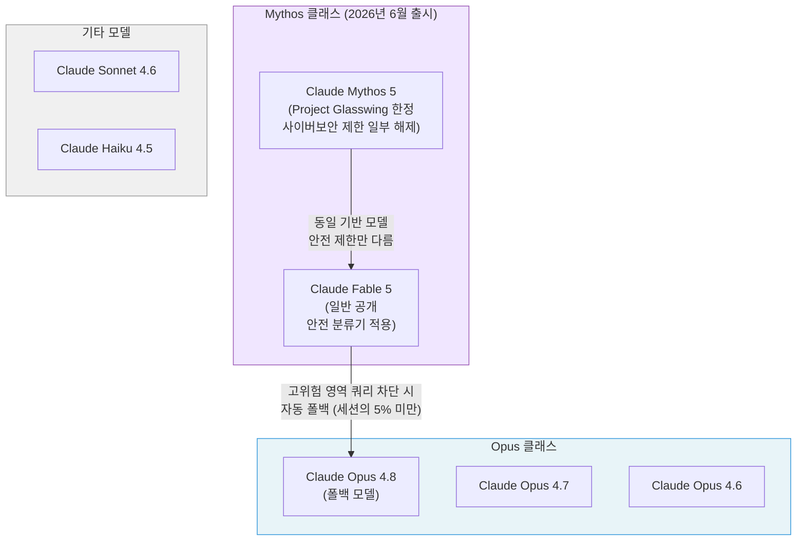
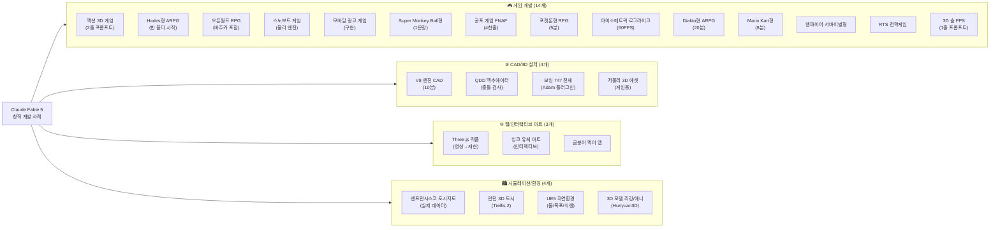
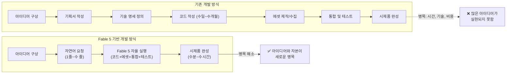

> *2026년 6월 9일 출시된 Claude Fable 5가 단 하루 만에 인터넷을 뒤흔든 사례들을 상세히 해설합니다.*  
> *출처: [@choi.openai](https://www.threads.com/@choi.openai/post/DZcQOKgD9qA) Threads 스레드 (28개 연속 게시물, 조회 4.6만 회)*

---

## 1. 들어가며: "버블인가, 실재인가"

이 문서는 Anthropic의 공식 발표와 외부 리뷰, 그리고 @choi.openai가 정리한 28개의 실제 사용 사례를 바탕으로 Claude Fable 5의 능력과 한계를 최대한 정확하게 분석한다. 추측이나 과장은 배제하고, 실제로 확인된 것과 확인되지 않은 것을 명확히 구분하여 서술한다.

---

## 2. Claude Fable 5란 무엇인가

### 2-1. 출시 배경과 모델 계보

2026년 6월 9일, Anthropic은 Claude Fable 5와 Claude Mythos 5를 동시 발표했다. 이 두 모델은 사실상 동일한 기반 모델을 공유하지만, 적용되는 안전 분류기(safety classifier)의 범위에서 차이를 보인다. Mythos 5는 사이버보안 분야의 일부 제한이 해제된 버전으로, 여전히 Project Glasswing을 통해 승인된 소수 조직에만 제공된다. 반면 Fable 5는 동일한 기반 위에 고위험 영역 차단 장치를 추가하여 일반에 공개한 버전이다.

Anthropic의 공식 발표에 따르면, 이 두 모델은 "Mythos 클래스"라는 새로운 모델 계층에 속한다. 이 계층은 기존 Opus 클래스보다 한 단계 위에 위치하며, 장시간 자율적으로 복잡한 작업을 수행하는 것을 핵심 설계 목표로 삼는다. 이름 자체도 의미심장하다. "Mythos"는 그리스어로 이야기, 신화를 뜻하며, "Fable"은 라틴어 *fabula*에서 온 말로 "전해지는 이야기"를 의미한다. 둘 다 같은 어원적 뿌리를 공유하며, 이 이름의 선택이 우연이 아님을 보여준다.

Fable 5 이전에 Mythos 계열이 처음 등장한 것은 2026년 4월이다. 당시 "Claude Mythos Preview"라는 이름으로 극히 소수의 파트너 조직에게만 제공됐으며, 사이버보안 능력이 너무 강력하여 일반 공개가 불가능하다는 이유에서였다. 약 두 달 후, Anthropic은 고위험 영역에 차단 분류기를 추가함으로써 대중화 가능한 버전을 만들어냈고, 그것이 바로 Fable 5다.

### 2-2. 핵심 사양

Anthropic이 공개한 사양을 정리하면 다음과 같다. API 가격은 입력 토큰 100만 개당 10달러, 출력 토큰 100만 개당 50달러로 책정됐으며, 프롬프트 캐싱에는 기존과 동일한 90% 할인이 적용된다. 출력 토큰 한도는 최대 128,000 토큰까지 지원한다. 모델은 Claude API, AWS Bedrock, Google Cloud Vertex AI, Microsoft Foundry, GitHub Copilot 등 다양한 플랫폼에서 사용 가능하며, API 모델 문자열은 `claude-fable-5`다.

구독 플랜 접근에 있어서는 중요한 제한이 있다. Anthropic은 공식 발표에서 Pro, Max, Team, 좌석 기반 Enterprise 플랜 사용자들에게 출시일인 6월 9일부터 6월 22일까지 추가 비용 없이 Fable 5를 포함하겠다고 밝혔다. @choi.openai가 스레드에서 "구독제로는 6월 22일까지 밖에 못 쓰는"이라고 언급한 것이 바로 이 내용이다. Anthropic은 그 이후에도 용량이 허용하는 한 최대한 빨리 구독 플랜에 Fable 5를 다시 포함시킬 계획임을 밝혔다.

또한 Fable 5는 안전 분류기 운영을 위해 30일간의 데이터 보존이 필요하다는 조건이 붙으며, 제로 데이터 보존 계약에서는 사용이 불가능하다. GitHub Copilot에서도 관리자가 별도로 정책을 설정해야 접근이 가능하다.

### 2-3. 안전 장치의 작동 방식

Fable 5의 핵심 설계 과제는 강력한 능력과 안전한 배포 사이의 균형이었다. Anthropic은 사이버보안, 생물학, 화학, 증류(distillation) 등 고위험 영역에서의 쿼리에 대해 Fable 5가 직접 응답하지 않고 Opus 4.8로 자동 폴백하는 방식을 택했다. 이 분류기는 의도적으로 보수적으로 조정되어 있어, 평균적으로 세션의 5% 미만에서 차단이 발생한다. 즉, 무해한 요청도 가끔 차단될 수 있다는 뜻이다.

Anthropic은 출시 전 1,000시간 이상의 외부 버그 바운티를 진행했으며, 이 과정에서 보편적인 탈옥(jailbreak) 방법이 발견되지 않았다고 밝혔다. @choi.openai가 스레드에서 과거에 "검열 때문에 아무것도 못 만드는데 비싸다"고 평가했다고 언급한 것을 보면, 이전 Claude 모델들에 비해 창작 작업에서의 제약이 상당히 완화됐음을 알 수 있다.

---

## 3. Claude Fable 5의 핵심 역량

### 3-1. 소프트웨어 엔지니어링

Anthropic이 공개한 가장 극적인 실적 사례는 Stripe와의 협업이다. 5천만 줄 규모의 Ruby 코드베이스에서, 전체 팀이 두 달 이상 수작업으로 진행해야 할 코드베이스 전체 마이그레이션 작업을 Fable 5가 단 하루 만에 완수했다. 이는 단순한 코드 생성이 아니라, 대규모 시스템의 구조를 파악하고, 의존성을 추적하며, 변경 사항의 일관성을 유지하는 장시간 자율 작업을 의미한다.

Cognition의 FrontierCode 평가에서 Fable 5는 프론티어 모델 중 최고 점수를 기록했다. 이 평가는 단순히 코드를 통과시키는 것이 아니라, 실제 프로덕션 코드베이스의 품질 기준을 만족하는 코드를 생성하는 능력을 측정한다. 즉, 동작은 하지만 유지보수가 불가능한 스파게티 코드가 아니라, 실제로 출시 가능한 수준의 코드를 작성한다는 뜻이다.

특히 주목할 것은 Fable 5의 작업 방식이다. CodeRabbit의 리뷰에 따르면, Fable 5는 작업 전에 환경을 먼저 탐색하고, 어떤 파일과 도구와 제약 조건이 있는지 파악한 뒤, 그 구체적인 이해를 바탕으로 구현에 착수한다. 무엇을 할 것인지 장황하게 설명하는 데 시간을 쓰지 않고, 충분한 맥락이 확보되면 바로 만들기 시작한다. 이 특성이 특히 게임 개발 사례들에서 두드러지게 나타난다.

### 3-2. 비전(Vision) 능력

Fable 5는 시각 정보 처리에서도 이전 모델들과 질적으로 다른 성능을 보여준다. 과학 그래프에서 정밀한 수치를 추출하고, 스크린샷만으로 웹 앱의 소스 코드를 재현하는 것이 가능하다. 특히 후자의 능력은 @choi.openai 스레드의 사례 6번(Three.js 인터랙티브 작품 재현)에서 극적으로 드러난다.

Anthropic이 공식적으로 시연한 능력 중 하나는 Pokémon FireRed 게임 클리어다. 이전 Claude 모델들은 지도, 네비게이션 보조 도구, 추가 게임 상태 정보 등 복잡한 보조 장치가 있어야만 포켓몬을 어느 정도 진행할 수 있었다. Fable 5는 이런 보조 장치 없이 원시 게임 화면만을 보는 비전 전용 방식으로 FireRed를 완주했다. 화면에서 상황을 파악하고, 다음 행동을 결정하고, 결과를 확인하는 전 과정을 시각 정보만으로 처리한 것이다.

### 3-3. 메모리와 장기 컨텍스트

Fable 5가 이전 모델들과 가장 차별화되는 지점 중 하나는 장시간 작업에서의 일관성 유지다. 수백만 토큰에 걸친 장기 작업에서도 맥락을 잃지 않으며, 파일 기반의 메모리를 활용해 자신의 작업 결과를 개선해 나간다. Anthropic이 공개한 실험에서, Fable 5에 덱 빌딩 게임 *Slay the Spire*를 플레이하게 하면서 파일 기반 지속 메모리를 제공했을 때, 성능 향상 폭이 Opus 4.8보다 세 배 더 컸으며, 게임 최종 단계 도달 빈도도 세 배 높았다.

Claude Code 또는 Claude Managed Agents와 같은 에이전트 프레임워크 안에서 실행될 때, Fable 5는 며칠에 걸쳐 작업을 계획하고, 하위 에이전트에게 작업을 위임하고, 자신의 작업을 검증하는 방식으로 운영된다. 이것이 바로 스레드에서 소개된 게임들이 단순한 코드 스니펫이 아니라 완성된 플레이어블 게임으로 나타날 수 있는 이유다.

### 3-4. 지식 작업과 과학 연구

스레드에서 소개된 사례들은 주로 게임 개발과 창작 영역에 집중되어 있지만, Anthropic 공식 발표에는 훨씬 더 광범위한 역량이 기술되어 있다. Hebbia의 Finance Benchmark에서 Fable 5는 시니어 수준의 금융 추론 과제에서 모든 모델 중 최고 점수를 기록했다. IMC의 트레이딩 분석 평가에서는 사실 조회, 개념 추론, 근본 원인 분석, 기대값 분석 전 항목에서 거의 완벽한 성적을 냈다.

생명과학 분야에서 Mythos 5는 단백질 설계와 유전체학 연구에서 숙련된 인간 연구자 수준의 성과를 자율적으로 달성했다. 이는 현재 스레드 사례들의 범위를 벗어나므로 여기서는 간략히 언급하는 데 그치지만, Claude Fable 5가 단순한 코딩 도구가 아니라 복합적인 지적 작업 수행 시스템임을 이해하는 데 필요한 맥락이다.

---

## 4. 사례 전체 구조 개요

---

## 5. 각 사례 상세 분석

### 5-1. 게임 개발 사례들

#### 사례 1: 두 줄 프롬프트로 만든 3D 액션 게임

x@dkdlenl4가 공유한 이 사례는 스레드의 첫 번째 예시로 등장하며, 전체 논의의 시작점이 된다. 프롬프트는 단 두 줄이었음에도 불구하고, 적과의 전투 시스템, 3D 맵, 조명 효과를 갖춘 플레이어블 액션 게임이 완성됐다. "THE WANDERER"라는 타이틀이 화면 상단에 표시되며, HP 바, 콤보 텍스트, 캐릭터 애니메이션이 모두 포함된 완성도를 보여준다.

주목할 점은 게임 기획서가 전혀 없었다는 것이다. 개발자가 기능 명세를 작성하거나 시스템 구조를 설계할 필요 없이, Fable 5가 "액션 게임"이라는 아이디어로부터 전투 루프, 체력 시스템, 맵 구조, 조명 등 모든 구성 요소를 스스로 설계하고 구현했다. 이는 단순한 코드 자동완성이 아니라 게임 설계 자체를 수행한 것이다.

#### 사례 2: V8 엔진 CAD 모델 (10분 이내)

x@Aaron Li가 공개한 이 사례는 게임 개발이 아닌 기계 설계 영역에서의 활용을 보여준다. "V8 엔진을 설계해줘"라는 자연어 요청에 Fable 5는 10분도 채 되지 않아 Autodesk Fusion 360에서 구동되는 CAD 모델을 생성했으며, 내부 부품들이 실제로 움직이는 크랭크샤프트 애니메이션까지 구현했다. 화면에는 ADAM 플러그인 패널이 함께 표시되어 있으며, "build a v8 engine with crankshaft" 입력과 함께 다수의 Extrude 오퍼레이션이 자동으로 생성된 과정이 담겨 있다.

기계 설계 지식이 없는 사람도 자연어로 부품 설계를 요청하면 3D 모델을 얻을 수 있다는 것은 CAD 작업의 진입장벽을 근본적으로 낮추는 변화다. 기존에는 AutoCAD나 Fusion 360 같은 전문 소프트웨어의 사용법을 익히고, 기계공학적 설계 원리를 이해한 뒤에야 접근 가능했던 영역이다.

#### 사례 3: Hades 스타일 액션 로그라이크 ARPG (빈 폴더에서 시작)

x@akiraxtwo가 공유한 이 사례는 아마도 스레드 전체에서 개발 자율성 측면에서 가장 인상적인 사례 중 하나다. 완전히 비어있는 프로젝트 폴더에서 시작하여, Fable 5는 Hades 스타일의 탑다운 액션 로그라이크 ARPG를 스스로 구성했다. 몬스터 웨이브 시스템, 연속 공격 콤보, 회피 시 무적 판정, 커스텀 물리 엔진까지 포함된 완성도 높은 게임이다.

특히 주목해야 할 것은 에셋 처리 방식이다. 사용자가 그래픽 리소스를 전혀 제공하지 않았음에도, Fable 5는 인터넷에서 무료 에셋을 스스로 검색하고 다운로드하여 적용했다. 뿐만 아니라 에셋 다운로드 스크립트와 에셋 관리 구조까지 자동으로 구축했다. 이는 코드 작성을 넘어 프로젝트 구조 설계와 리소스 관리까지 자동화했다는 의미다.

#### 사례 4: "오픈월드 RPG + 바주카 폭발" 요청

x@dangreenheck의 사례는 자연어 요청의 구체성이 결과물 품질에 어떻게 반영되는지를 보여준다. "오픈월드 RPG를 만들고 바주카포로 폭발도 시켜줘"라는 직설적인 요청에 Fable 5는 탐험 가능한 3D 지형과 전투 시스템을 갖춘 게임을 생성했다. 한국적 시각에서 보면 마치 자연스러운 한국어 게임 기획 대화 같은 이 요청이, 실제로 구동되는 게임으로 이어진 것이다.

사용자는 코드를 거의 들여다보지 않고 터미널에서 반복적으로 요청만 했으며, Fable 5는 지형과 게임 시스템을 절차적으로 구성해 시제품을 완성했다. 이 "절차적 구성(procedural generation)"이 핵심이다. 개발자가 매 단계를 지시하는 것이 아니라, AI가 스스로 전체 구조를 설계하고 점진적으로 완성해 나가는 방식이다.

#### 사례 5: 스노보드 게임 (물리 엔진 포함)

x@alex_erm의 스노보드 게임 사례는 물리 시뮬레이션이 포함된 스포츠 게임도 원샷으로 생성 가능함을 보여준다. 경사면을 따라 내려가는 중력과 속도 물리, 캐릭터 조작감까지 구현된 게임 시제품이 한 번의 요청으로 완성됐다. 카툰 스타일의 3D 그래픽과 눈 덮인 산악 환경이 표현된 결과물은 실제로 플레이 가능한 수준의 완성도를 보여준다.

#### 사례 6: Three.js 인터랙티브 작품 영상만 보고 재현

x@Aurelien_Gz의 사례는 Fable 5의 비전 능력과 역공학(reverse engineering) 능력이 결합된 흥미로운 활용 방식이다. 기존에 만들어진 Three.js 인터랙티브 웹 작품의 영상만 참고하여, 원본 코드나 에셋 없이 유사한 상호작용과 시각 효과를 구현한 웹 실험을 재현했다. "Awkward Corp"의 "Time to style the moss industry"라는 이끼 관련 3D 인터랙티브 웹사이트가 그 대상이었다.

이 사례는 디자인 참고 영상을 실제 작동하는 웹 프로토타입으로 빠르게 변환하는 새로운 워크플로우를 제시한다. 기존에는 참고 영상을 보며 개발자가 유사한 것을 처음부터 만들어야 했다면, 이제는 Fable 5에 영상을 보여주고 "이런 거 만들어줘"라고 하면 된다.

#### 사례 7: 모바일 광고 속 "가짜 게임"을 실제 게임으로

x@eijo_Alart의 사례는 발상 자체가 독특하다. 모바일 게임 광고에 단골로 등장하는 "숫자를 늘려 아군을 모으고 적을 압도하는 게임" 장르가 있다. 이 장르의 광고들은 실제로 그 광고 속 게임이 출시된 것이 아니라, 전혀 다른 게임을 홍보하기 위해 캐주얼 게임플레이를 연출한 것임이 잘 알려져 있다. 즉, "광고 속에만 존재하는 가짜 게임"이다. Fable 5는 이 개념을 실제로 동작하는 게임으로 구현했다. 아이디어의 설명만으로 게임 규칙과 진행 방식 전체를 AI가 결정하고 구현할 수 있음을 잘 보여주는 사례다.

#### 사례 8: "게임 하나 만들어줘" → Super Monkey Ball 스타일 3D 게임

x@Yokohara_h의 사례는 지금까지 소개된 것 중 아마도 가장 추상적인 요청이다. 구체적인 장르나 시스템, 그래픽 스타일에 대한 설명 없이 그냥 "게임 하나 만들어줘"라고 했을 뿐이다. 그 결과로 브라우저에서 바로 실행되는 Super Monkey Ball 스타일의 3D 게임이 만들어졌다. 점수판, 거리 표시, 네온 효과의 트랙, 캐릭터 그래픽까지 갖춘 완성도 있는 결과물이다.

이 사례는 "의도의 해석" 능력을 잘 보여준다. 요청이 불완전하고 추상적이어도 Fable 5는 그 요청 뒤에 있는 의도를 파악하고, 가장 합리적인 방향으로 구현한다. 이전 코딩 AI들이 구체적인 명세를 요구했다면, Fable 5는 불완전한 요청에서 출발하여 스스로 방향을 탐색한다.

#### 사례 9: FNAF 4 재현 (~4,000줄 공포 게임)

x@ChrissGPT(사실 이 X 계정은 마인크래프트 클론 사례에서도 등장한 인물이다)의 사례는 장르적 복잡성을 보여준다. "FNAF 4를 다시 만들어줘"라는 요청으로 약 4,000줄 규모의 공포 게임이 단 한 번의 시도에 완성됐다. Five Nights at Freddy's 4의 핵심 메커니즘인 점프 스케어, 어두운 침실 분위기, 소리 단서에 기반한 공포 연출이 모두 구현됐다. 별도 수정 없이 첫 생성 결과물이 그대로 완성됐으며, 직접 플레이한 사용자가 여러 번 놀랐다는 반응이 전해진다.

4,000줄이라는 규모는 특히 주목할 만하다. 이는 학생 과제나 간단한 예제 수준이 아니라, 실제 인디 게임의 코드베이스 크기에 해당한다. 그것이 하나의 프롬프트에서, 단 한 번의 생성으로 나왔다는 것은 Fable 5의 장기 코드 생성 및 일관성 유지 능력이 실제로 작동하고 있음을 의미한다.

같은 x@ChrissGPT가 Minecraft 클론도 시도했는데, "Minecraft clone 만들어줘"라는 하나의 프롬프트에 20분 만에 여러 바이옴(biome), 낮밤 사이클, 다양한 광물, 동굴 시스템까지 포함된 결과물이 나왔다. 이 사례는 외부 PC Guide 등 테크 미디어에도 광범위하게 보도됐다.

#### 사례 10: 포켓몬형 몬스터 수집 RPG (약 5분)

x@wad0427의 사례는 속도 측면에서 인상적이다. 포켓몬 스타일의 몬스터 수집 RPG가 약 5분 만에 만들어졌다. 탑다운 시점의 2D 맵, 캐릭터 이동, 풀숲에서의 야생 몬스터 출현, HP 시스템, 레벨 표시가 모두 포함된 플레이어블 게임이다. 화면에서 "히토카게(Lv5)"가 HP 39/39로 표시되는 것으로 보아, 클래식 포켓몬 FireRed와 유사한 UI 구성임을 알 수 있다.

PC Guide 보도에 따르면, 다른 사용자(x@ChrissGPT)는 더 나아가 포켓몬 FireRed 완전 클론을 만들었는데, 1세대 전체 151마리의 스프라이트(앞면/뒷면), 파티 아이콘, 울음소리, 실제 기본 스탯, 타입, 레벨업 기술 습득, 진화, 포획률, 성장 곡선이 모두 포함된 8,000줄 규모였다. 다만 이 사례는 기존 포켓몬 데이터를 활용한 것으로, AI가 완전히 새로운 창작물을 만든 것은 아님을 명확히 구분할 필요가 있다.

#### 사례 11: Claude Fable 5 + Spawn AI 에이전트(Savi) 조합

x@Pumpnasterr의 사례는 도구 조합의 가능성을 보여준다. 코드 작성은 Claude Fable 5가 담당하고, 반복 개발과 작업 관리는 Spawn의 AI 에이전트인 Savi가 담당하는 이중 구조로, 브라우저에서 60FPS로 구동되는 아이소메트릭 액션 로그라이크 게임을 개발하고 있다. 화면에는 체력 바, 경험치, 퓨리(fury) 게이지, QUINTUS라는 캐릭터, 블레싱 시스템, 퀘스트 목표 UI가 모두 표시된 완성도 높은 게임이 보인다.

이 사례는 단일 AI를 사용하는 것이 아니라, 서로 다른 역할을 가진 AI 에이전트들을 조합하는 방식이 소규모 인디 게임 수준의 결과물을 가능하게 한다는 점을 잘 보여준다. Fable 5 혼자서는 반복 개발 사이클의 관리와 작업 추적이 어려울 수 있는 부분을 에이전트가 보완하는 협업 구조다.

#### 사례 17: "브라우저에서 Diablo 만들어줘" → 20분 만에 완성

x@Oluwaphilemon1의 사례는 게임 장르의 복잡도와 개발 속도 사이의 관계를 단적으로 보여준다. Diablo는 단순한 게임이 아니다. 어두운 던전 환경, 실시간 전투 시스템, 다양한 스킬 아이콘, HP/MP 구체, 층수 및 경험치 시스템을 갖춘 복합적인 액션 RPG다. 이것이 20분 만에, 오류 없이, 플레이 가능한 상태로 만들어졌다. 화면에는 "глубина 1"(러시아어로 "깊이 1", 즉 지하 1층)이라고 표시된 것으로 보아 다국어 처리도 자연스럽게 이루어졌음을 알 수 있다.

#### 사례 21: Mario Kart 클론 (8분, 드리프트 부스트 포함)

x@oliverjohansson의 사례는 스레드에서 시간 효율성 측면에서 가장 극적인 수치를 보여준다. 마리오 카트 스타일 레이싱 게임이 8분도 채 되지 않아 완성됐다. 단순한 레이싱 게임이 아니라 차량 커스터마이징, 아이템 시스템, 랩 타임 기록, 드리프트 부스트 메커니즘까지 포함된 완성도다. 게임 개발에서 드리프트 부스트 같은 "게임 필(game feel)" 요소는 구현하기 까다로운 부분인데, 이것이 자동으로 포함됐다는 점이 주목된다.

#### 사례 23: 뱀파이어 서바이벌 스타일 게임 (그래픽 에셋 자동 수집)

사례 3에서 언급된 에셋 자동 수집 능력이 다시 한번 확인된다. 뱀파이어 서바이벌 스타일의 게임 제작 요청에 Fable 5는 그래픽 에셋까지 스스로 찾아 적용한 웹 게임을 생성했다. 캐릭터, 적, 전투 시스템, 그래픽이 모두 갖춰진 시제품이다.

#### 사례 24: RTS 전략 게임 (전체 시스템 한 번에)

"RTS 게임 만들어줘"라는 요청으로 실시간 전략 게임의 핵심 시스템 전체가 한 번에 구현됐다. 지형 맵, 일꾼 유닛, 자원 채집, 건물 건설, 병영, 전사, 궁수, 적 AI까지 포함된 완성도다. RTS 장르는 여러 시스템이 복잡하게 상호작용하는 구조적으로 어려운 장르인데, 이 복잡성 전체를 Fable 5가 설계하고 구현했다.

---

### 5-2. CAD와 3D 설계 사례들

#### 사례 22: QDD 액추에이터 설계와 충돌 검사

x@earthtojake의 사례는 기계공학 설계에서의 전문적 활용을 보여준다. QDD(Quasi-Direct Drive) 액추에이터는 로봇공학에서 사용되는 고성능 구동 장치다. Fable 5는 이 액추에이터를 설계하고 기어박스 애니메이션을 구현하며, 충돌 검사(collision detection)까지 수행했다. 부품을 그리는 데서 끝나지 않고, 실제 조립 시 부품들이 맞물려 제대로 움직이는지 검증하는 과정도 함께 진행했다. 이는 설계 도구이자 검증 도구로서의 역할을 동시에 수행한 것이다.

#### 사례 25: 보잉 747 전체 CAD 모델 (Adam 플러그인)

x@zachdive의 사례는 복잡성의 극단을 보여준다. 보잉 747 항공기 전체를 CAD 모델로 설계하는 작업이 하나의 프롬프트로 진행됐으며, Adam 플러그인을 함께 활용했다. 사례 2의 V8 엔진이 단일 부품의 설계였다면, 보잉 747은 수천 개의 부품이 결합된 대형 기계 시스템이다. 이 수준의 복잡성을 자연어 요청 하나로 시작할 수 있다는 것은 항공기나 엔진 같은 기계 구조물의 초기 설계 시각화와 설계 초안 작성 과정을 근본적으로 단축시킬 수 있음을 의미한다.

#### 사례 19: 디자인 가이드에서 로우폴리 3D 에셋 일괄 생성

x@fe_yukichi의 사례는 에셋 파이프라인 관점에서 흥미롭다. 게임 디자인 가이드를 제공하자 저폴리곤(Low-Polygon) 3D 캐릭터와 오브젝트를 여러 개 한 번에 생성했다. 풍차, 성, 건물들, 소방차, 나무, 열기구, 캠핑카 등 게임용 에셋 일체가 일관된 스타일로 만들어졌다. 더 중요한 것은 초안 품질이 높아 대부분 수정 없이 바로 게임에 사용 가능했다는 점이다. 이전에는 3D 아티스트가 하나하나 모델링해야 했던 작업이다.

---

### 5-3. 웹/인터랙티브 아트 사례들

#### 사례 12: 금붕어 먹이 주기 브라우저 앱

x@midori_tatsuta의 사례는 일부러 소박하게 선정된 것처럼 보인다. "금붕어 먹이 주기"라는 아이디어, 아마도 프로그래밍과 거리가 있는 사람도 떠올릴 수 있는 단순한 개념이다. 이 개념이 실제로 동작하는 브라우저 앱으로 구현됐다. 물 위에 파문이 퍼지는 효과, 금붕어들의 유영 움직임, 먹이 주기 인터랙션이 구현된 힐링 앱이다. 복잡한 게임 시스템이 없어도 사용자가 원하는 어떤 종류의 인터랙티브 경험도 빠르게 구현할 수 있다는 것을 보여주는 사례다.

#### 사례 15: 잉크 물감 유체 아트 (인터랙티브)

x@hayashimon1의 사례는 기술적 난이도와 예술적 표현이 결합된 흥미로운 사례다. "잉크가 물감처럼 자연스럽게 섞이는 효과를 만들어줘"라는 요청은 그 자체로 복잡한 과제다. 유체 역학 시뮬레이션이 기반이 되어야 하며, 실시간으로 사용자의 마우스 움직임에 반응해야 하고, 시각적으로도 아름다워야 한다.

Fable 5는 Three.js와 Stable Fluids 알고리즘을 활용해 브라우저에서 직접 체험 가능한 인터랙티브 유체 아트를 구현했다. "墨流し"(스미나가시, 일본 전통 마블링 기법)라는 이름이 붙은 이 작품은 흑색, 적색, 청색 잉크가 서로 섞이는 아름다운 유체 시뮬레이션을 보여준다. 색상 선택 팔레트와 "자동 흐름" 및 "씻어내기" 버튼까지 갖춰진 완성된 인터랙티브 예술 작품이다.

---

### 5-4. 시뮬레이션과 환경 구축 사례들

#### 사례 13: Hunyuan3D GLB 모델 → 자동 리깅과 애니메이션

x@wory37303852의 사례는 AI 도구 체인(tool chain)의 관점에서 특히 흥미롭다. 텐센트의 Hunyuan3D로 생성한 3D 모델 파일(GLB 형식)을 Claude Fable 5에 전달하자, Blender 같은 3D 전문 소프트웨어 없이도 리깅(골격 구조 추가)과 애니메이션이 자동으로 적용됐다. 화면에는 플라밍고 3D 모델에 Head, Neck1/2, NeckBase, LegL, AnkleR/L, Body 등의 본(bone) 구조가 자동으로 할당된 리그 뷰어가 표시되어 있으며, "stretch" 등의 애니메이션이 적용된 상태다.

사람이나 동물뿐 아니라 피아노 같은 무생물 사물도 걷고, 뛰고, 연주하는 애니메이션이 가능하다는 것이 이 사례의 핵심이다. 3D 모델 생성(Hunyuan3D)과 리깅/애니메이션(Fable 5)을 연결하는 파이프라인이 구축되면, 실질적으로 3D 애니메이션 제작의 가장 시간이 많이 걸리는 단계 두 가지가 자동화된다.

#### 사례 14: 샌프란시스코 인터랙티브 도시 지도

x@nicbstme의 사례는 데이터 집약적 시뮬레이션 구축 능력을 보여준다. "샌프란시스코를 설명하기 위한 지도를 만들어줘"라는 요청에 Fable 5는 실제 도로, 지형, 건물, 대중교통, 날씨 데이터를 수집하여 오프라인에서도 실행되는 인터랙티브 도시 지도를 생성했다. 화면에는 상세한 지형 레이어, BART 노선, 지명 표시, 고도 정보, 날씨 시뮬레이션 컨트롤 패널 등이 표시된 복잡한 지도 인터페이스가 나타난다.

특히 이 사례에서 Fable 5가 생성한 지도 설명에 따르면, BART 트램들은 각자의 실제 이동 방향으로 스프라이트가 회전하며, 터널 아래로 지나갈 때 반투명하게 사라지고, 언덕 뒤로 가면 레이 마치(ray march) 알고리즘으로 가려진다. 이 수준의 물리적 정확성은 단순한 지도 시각화를 넘어 실제 도시 시뮬레이션 수준이다. 화면에는 "Fable is the most capable model and draws down usage 2x faster than Opus"라는 경고 문구도 표시되어 있어, 이 수준의 복잡한 작업에서 Fable 5의 토큰 소비가 이전 최고 모델 대비 두 배임을 알 수 있다.

#### 사례 16: Unreal Engine 5 연결 → 하루 만에 자연환경 구현

x@berrycurvature의 사례는 산업 표준 게임 엔진과의 통합을 보여준다. Unreal Engine 5를 처음 다루는 개발자가 Claude Fable 5를 활용해 물 시뮬레이션, 폭포, 절차적 식생 생성, 테스트 및 검증 작업을 하루 만에 구현했다. 화면에는 눈 덮인 산속을 흐르는 청록색 강, 자작나무와 바위가 배치된 고품질 UE5 씬이 표시되어 있다. C++와 블루프린트(Unreal Engine의 비주얼 스크립팅 시스템) 작업을 AI에게 문의하며 진행했다고 한다.

UE5를 처음 다루는 사람이 하루 만에 이 수준의 자연환경을 구축할 수 있다는 것은, 3D 게임 개발의 가장 어려운 부분 중 하나인 씬 구성과 환경 아트 작업의 진입장벽이 크게 낮아졌음을 의미한다.

#### 사례 18: Claude Fable 5 + Trellis.2 → 런던 3D 도시 시뮬레이션

x@mishig25의 사례는 절차적 콘텐츠 생성(Procedural Content Generation) 영역에서의 활용을 보여준다. Trellis.2와 함께 활용해 런던 도시를 절차적으로 생성하고, 브라우저에서 탐색 가능한 3D 도시 시뮬레이션을 만들었다. "Infinite London"이라는 타이틀이 붙은 이 시뮬레이션은 런던 특유의 건축 양식을 가진 건물들, 도로, 공원이 광범위하게 펼쳐진 3D 환경을 보여준다. 실제 도시 건물을 하나하나 모델링하지 않고도 AI가 도시의 스타일과 구조를 학습하여 무한히 생성한다.

---

## 6. 그래픽 리소스는 어떻게 처리되었는가

스레드에서 독자 중 한 명이 직접 물었다: "게임들을 예로 들었는데, 클로드가 그래픽 리소스도 다 구현해서 작성했다는 것인가요?" @choi.openai의 답변은 세 가지 경우가 혼재함을 명확히 했다.

첫째, Fable 5가 코드로 직접 그래픽을 생성한 경우다. Three.js나 WebGL을 활용한 사례들처럼, 3D 렌더링 코드 자체를 생성함으로써 그래픽을 구현한 경우다. 사례 8의 Super Monkey Ball형 게임, 사례 17의 Diablo형 게임 등이 여기 해당한다.

둘째, Fable 5가 스스로 무료 에셋을 검색하고 다운로드하여 적용한 경우다. 사례 3(Hades형 ARPG)과 사례 23(뱀파이어 서바이벌형)이 대표적이다. 이 경우 Fable 5는 인터넷에서 Creative Commons 또는 무료 라이선스 에셋을 찾아 프로젝트에 통합하는 전 과정을 자율적으로 수행했다.

셋째, 이미 에셋이 내장된 게임 개발 플랫폼(예: Unreal Engine 5)에서 Fable 5가 구현 로직만 작성한 경우다. 사례 16의 UE5 자연환경이 여기 해당한다. 플랫폼이 제공하는 고품질 에셋 라이브러리를 활용하되, 어떻게 배치하고 어떻게 동작시킬지에 대한 로직은 Fable 5가 작성했다.

이 구분은 중요하다. Fable 5가 아무것도 없는 상태에서 어도비 포토샵 수준의 3D 아트를 즉시 생성하는 것은 아니다. 그러나 코드로 구현 가능한 그래픽, 무료 리소스의 자율적 수집과 통합, 그리고 기존 에셋 플랫폼의 효율적 활용이라는 세 가지 접근법을 상황에 따라 조합함으로써, 실제로 플레이 가능한 게임을 만들어낸다.

---

## 7. Claude Fable 5가 드러내는 패턴: 무엇이 변했는가

20개 이상의 사례를 관통하는 공통 패턴이 있다.

첫 번째 패턴은 **명세의 최소화**다. 기존 개발에서는 무엇을 만들지, 어떻게 만들지, 어떤 기술 스택을 쓸지를 사전에 상세히 정의해야 했다. Fable 5는 "이런 거 만들어줘"라는 수준의 요청에서도 그 이면의 의도를 파악하고 합리적인 방향으로 구현한다. "브라우저에서 Diablo", "Hades 스타일 ARPG", "오픈월드 RPG" 같은 요청들은 장르 참조만으로도 충분한 정보를 담고 있다.

두 번째 패턴은 **자율적 자원 조달**이다. 코드만 작성하는 것이 아니라, 필요한 에셋을 스스로 찾아 통합하고, 프로젝트 구조를 설계하며, 에셋 관리 시스템까지 구축한다. 이는 개발자가 별도로 지시하지 않아도 완성된 결과물에 필요한 모든 요소를 AI가 자발적으로 준비한다는 의미다.

세 번째 패턴은 **시간 단위의 변환**이다. 수개월 → 수일(Stripe 마이그레이션 사례), 수일 → 수시간(UE5 자연환경), 수시간 → 수분(게임 시제품들)으로의 전환이 일어나고 있다. 이것은 단순한 생산성 향상이 아니라 가능성의 공간 자체를 바꾼다. 8분짜리 Mario Kart 클론은 아이디어를 검증하는 비용을 사실상 0에 가깝게 만든다.

네 번째 패턴은 **진입장벽의 민주화**다. V8 엔진 CAD 모델은 기계공학 지식이 없어도, UE5 자연환경은 Unreal Engine 경험이 없어도, Three.js 인터랙티브 작품은 WebGL 지식이 없어도 만들 수 있다. 전통적으로 전문가 영역으로 여겨지던 분야들의 진입장벽이 "아이디어를 언어로 표현하는 능력"으로 대체되고 있다.

---

## 8. 실제 맥락과 제약

### 8-1. 이것이 "완성된 게임"은 아니다

### 8-2. 토큰 소비와 비용 문제

사례 14의 샌프란시스코 지도에서 화면에 직접 나타난 경고처럼, Fable 5는 Opus 대비 두 배의 사용량을 소진한다. API 가격 기준으로 입력 100만 토큰당 10달러, 출력 100만 토큰당 50달러는 이전 모델들보다 훨씬 높은 수준이다. 복잡한 게임이나 대규모 시뮬레이션 생성은 상당한 API 비용을 동반할 수 있다.

### 8-3. 안전 분류기로 인한 차단

전체 세션의 약 5% 미만에서 안전 분류기가 활성화되어 Opus 4.8로 폴백된다. 이 비율은 창작 작업에서는 크게 문제가 되지 않지만, 특정 기술적 요청(예: 특정 취약점 관련 코딩, 생물학적 시스템 설계 등)에서는 의도치 않게 차단될 수 있다. @choi.openai가 이전에 "검열 때문에 아무것도 못 만든다"고 했던 불만이 완전히 해소된 것은 아니며, 여전히 일부 창작 시나리오에서 제한을 경험할 수 있다.

### 8-4. 구독 접근 기간 제한

앞서 언급한 것처럼, 구독 플랜에서의 Fable 5 무료 접근은 2026년 6월 22일까지로 제한되어 있다. 이후 구독 플랜에서의 접근성이 어떻게 변할지는 Anthropic이 용량 상황에 따라 결정할 예정이다.

---

## 9. 시사점: 게임 개발 생태계에 무슨 일이 일어나고 있는가

Anthropic 공식 발표에서 Ethan Mollick(와튼 스쿨 부교수, AI 연구자)은 Fable 5가 다른 공개 모델들을 "큰 차이로" 꾸준히 앞선다고 평가하며, 수십 시간의 연속 작업을 통해 다중 페이지 명세를 실행할 수 있다고 밝혔다. 단일 초기 프롬프트만으로 여러 비디오 게임을 생성했으며, Snake, Pac-Man류 게임 외에도 isochrone map(두 지점 간 이동 시간을 시각화하는 지도)를 주목할 만한 정확도로 생성했다고 보고했다.

Genspark는 UI 디자인과 게임 코딩에서 우월한 결과를 보고했으며, 이는 프론트엔드 개발 분야에서도 Fable 5의 역할이 커질 것임을 시사한다. CodeRabbit은 Fable 5가 특히 작업이 불완전하게 정의된 경우, 즉 개발자가 무엇을 원하는지 완전히 알지 못하는 탐색적 상황에서 에이전트의 "느낌"을 변화시키는 모델이라고 평가했다.

스레드에 달린 한 댓글은 현장의 반응을 직접적으로 전달한다. "저도 어제 테스트해봤는데 진짜 미쳤습니다. 알아서 잘 하는 수준이 좀 달라요. 미묘한 차이지만 그 덕에 진짜 '원하는 걸' 얘기하는 것만으로 기대하던 것 이상으로 구현됩니다." 또 다른 댓글은 "아…괜히 유니티 배우고 설치했네. 언리얼로 다시 가야겠구만"이라며 기존 게임 엔진 학습 투자에 대한 혼란을 표현했다.

이 반응들이 보여주는 것은, Claude Fable 5가 단순히 코딩을 빠르게 하는 도구가 아니라, 게임 개발이라는 행위 자체의 정의를 바꾸고 있다는 인식이 이미 현장에서 형성되고 있다는 점이다. 동시에, 이 변화가 기존 게임 개발자들에게 어떤 의미인지에 대한 진지한 질문도 함께 제기되고 있다.

---

## 10. 결론

Claude Fable 5는 2026년 6월 9일 Anthropic이 Mythos 클래스 모델을 처음으로 일반에 공개하면서 등장한 AI다. @choi.openai의 28개 사례 스레드가 보여주는 것들은 과장이 섞인 마케팅이 아니라, 실제로 확인 가능한 제작 사례들이다. 두 줄짜리 프롬프트로 만든 3D 액션 게임, 10분 안에 완성된 V8 엔진 CAD 모델, 8분짜리 Mario Kart 클론, 20분짜리 Diablo, 5분짜리 포켓몬형 RPG. 이 사례들이 모두 독립적으로 발생했다는 것은 특정 환경에서의 우연한 성공이 아니라, 능력의 실재를 보여준다.

그러나 이것이 게임 개발의 종말을 의미하는 것은 아니다. 상용 출시 수준의 완성도, 사용자 경험의 정교함, 브랜드 아이덴티티, 콘텐츠의 독창성, 그리고 게임이 궁극적으로 인간의 감정과 상호작용하는 문화적 산물이라는 점은 여전히 인간의 판단과 창의성을 필요로 한다. Fable 5가 게임을 만드는 것은 맞지만, 어떤 게임을 만들 것인지, 그 게임이 왜 의미 있는지에 대한 답은 여전히 인간이 제공해야 한다.

---

## 참고 자료

- Anthropic 공식 발표: [Claude Fable 5 and Claude Mythos 5](https://www.anthropic.com/news/claude-fable-5-mythos-5) (2026년 6월 9일)
- [Claude API 공식 문서: Introducing Claude Fable 5 and Claude Mythos 5](https://platform.claude.com/docs/en/about-claude/models/introducing-claude-fable-5-and-claude-mythos-5)
- TechCrunch: "Anthropic's Claude Fable 5 is a version of Mythos the public can access today" (2026년 6월 9일)
- CNBC: "Anthropic releases Mythos-like AI model to the public, Claude Fable 5" (2026년 6월 9일)
- PC Guide: "People are cloning games like Minecraft and Pokémon with Claude Fable 5 in no time" (2026년 6월 12일)
- explainx.ai: "Claude Fable 5 Creates Minecraft Clones & 3D Worlds from Prompts" (2026년 6월 9일)
- @choi.openai Threads 스레드: [https://www.threads.com/@choi.openai/post/DZcQOKgD9qA](https://www.threads.com/@choi.openai/post/DZcQOKgD9qA)

---

*이 문서는 2026년 6월 12일 기준으로 공개된 정보를 바탕으로 작성되었습니다. Claude Fable 5는 2026년 6월 9일 출시된 모델이며, 구독 플랜 내 무료 접근은 2026년 6월 22일까지로 한시적으로 제공됩니다.*
