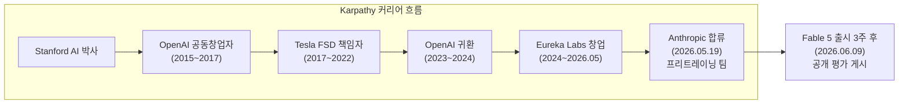
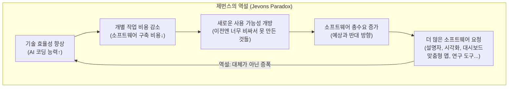
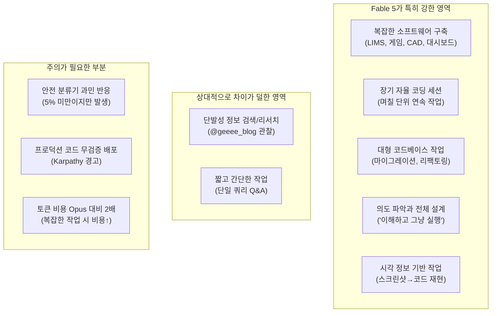

> *두 개의 목소리로 읽는 Fable 5의 실체: 현장 실무자의 경험과 AI 업계 최고 권위자의 평가*  
> *출처: [@carrotluv](https://www.threads.com/@carrotluv/post/DZbcNIjGOc7) Threads (2026.06.09), [@geeee_blog]( https://www.threads.com/@geeee_blog/post/DZb6PkJjxRe) Threads, @karpathy X(트위터)*

---

## 1. 들어가며: 같은 날, 같은 모델, 다른 눈높이의 목격담

2026년 6월 9일, Claude Fable 5가 출시된 날 두 종류의 반응이 인터넷을 채웠다. 하나는 "Fable 미쳤다"로 시작하는 현장 실무자의 생생한 후기였고, 다른 하나는 "This is a super exciting release"로 시작하는 AI 업계 최고 전문가의 기술적 평가였다. @carrotluv는 며칠을 씨름하던 농산물 안전분석실 관리 시스템을 Fable로 단번에 완성했고, Andrej Karpathy는 코드를 아예 보지 않고 싶다는 유혹을 처음 느꼈다고 고백했다. 두 사람은 완전히 다른 맥락에서 같은 결론에 도달했다. 이것은 증분적 개선이 아닌, 질적 도약이라는 것이다.

이 문서는 그 두 목소리를 함께 읽으며, Claude Fable 5가 실제로 무엇이 달라졌는지를 설명한다.

---

## 2. @carrotluv의 사례: 농산물 안전분석실 LIMS를 Fable 한 방에 완성하다

### 2-1. LIMS란 무엇인가

LIMS는 Laboratory Information Management System, 즉 실험실 정보 관리 시스템의 약자다. 의뢰 샘플의 접수부터 분석, 결과 보고서(성적서) 발행까지 실험실의 전체 워크플로우를 디지털로 관리하는 소프트웨어다. 식품 안전, 환경 분석, 의약품 검사, 농산물 잔류농약 분석 등 모든 분석 기관에 필요한 핵심 인프라다.

상용 LIMS 소프트웨어는 LabWare, LabVantage, STARLIMS 같은 제품들이 있으며, 도입 비용이 수천만 원에서 수억 원에 달한다. 게다가 기관마다 검사 항목, 보고서 양식, 행정 흐름이 달라 커스터마이징 비용도 상당하다. 이 때문에 많은 소규모 분석 기관들이 여전히 엑셀과 워드로 버티거나, 특정 업무만 부분적으로 자동화한 채 운영된다.

### 2-2. @carrotluv가 만든 것

첫 번째는 **성적서 관리**다. 농산물 잔류농약 분석이 완료되면 결과를 바탕으로 성적서(검사 결과 보고서)를 자동으로 생성하는 기능이다. 분석 결과를 하나하나 입력하고, 규격 기준과 비교하여 적합/부적합을 판정한 뒤, 공식 양식에 맞게 문서화하는 과정을 자동화한다.

두 번째는 **재고관리**다. 분석에 사용되는 표준용액, 시약, 소모품 등의 재고를 추적하고 관리하는 기능이다.

세 번째는 **대시보드**다. 이것이 이미지에 표시된 화면이며, 연간 운영 현황을 한눈에 파악할 수 있는 시각화 인터페이스다.

### 2-3. 대시보드 내용 분석

대시보드에는 2026년 농산물 안전분석실 운영 현황이 다층적으로 표시되어 있다. 요약 지표를 보면 총 의뢰 건수 379건, 목표 1,000건 대비 32.9% 달성 상태이며, 부적합 14건(3.69%), 잔여 목표 621건이 표시된다.

세부 차트를 살펴보면 월별 의뢰 건수 추이가 꺾은선 그래프로 표시되며, 1월 32건에서 3월 91건으로 증가했다가 6월 44건으로 감소하는 패턴이 확인된다. 적합 달성률은 도넛 차트로 표현되어 62.1%(목표 1,000건 대비)임을 보여주며, 부적합률은 3.7%(14건/379건)로 표시된다.

의뢰 농산물 상위 10종 항목에서는 감자, 상추, 포도, 블루베리 등의 분포가 수평 막대 그래프로 표현된다. 인증구분별 부적합 비율 차트에서는 로컬(85.7%), 친환경(7.1%), GAP(7.1%) 등의 분포가 나타난다. 지역별 의뢰 건수, 로컬매장별 접수 건수, 부적합 농약 상위 10종, 농약 종도(種度) 등의 정보도 각각 시각화되어 있다.

이 대시보드는 단순히 숫자를 표의 형태로 나열하는 것이 아니라, 실제 분석 기관 담당자가 업무 현황을 파악하고 의사결정을 내리는 데 필요한 정보를 직관적으로 배치한 것이다. 어떤 농산물에서 부적합이 많이 나오는지, 어느 지역에서 의뢰가 집중되는지, 어떤 농약이 주로 검출되는지를 한 화면에서 파악할 수 있다.

### 2-4. Opus와 Fable의 차이: 며칠간의 고생 대 "한방"

댓글로 달린 평가가 이 차이를 잘 요약한다. "Opus는 대학생 느낌이면 Fable은 업계최고 전문가 느낌이었어요." 이것은 능력의 차이가 아닌 이해 수준의 차이다. 대학생도 코드를 짤 수 있지만, 무엇을 만들어야 하는지에 대한 도메인 이해와 전체적인 방향성을 잡는 능력은 경험 많은 전문가와 다르다. LIMS를 만든 적 없는 대학생에게 "농산물 안전분석실 관리 시스템 만들어줘"라고 하면 어떤 기능이 필요한지, 어떻게 데이터를 구조화해야 하는지, 성적서 자동화에서 어떤 기준을 적용해야 하는지를 스스로 이해하고 설계할 수 없다. Fable은 그것을 했다.

또 다른 댓글에서는 "기존 것도 Fable에 분석시키면 기가막히게 나오더라"는 반응이 달렸으며, 이에 대해 "더 세밀하게 다듬어서 문제점까지 짚어주더라"는 답이 이어졌다. 단순히 요청을 이행하는 것을 넘어, 스스로 코드의 문제점을 찾아내고 개선 방향을 제안한다는 경험적 증언이다.

---

## 3. Andrej Karpathy는 누구이며 왜 그의 평가가 중요한가

### 3-1. Karpathy의 이력

Andrej Karpathy는 AI 업계에서 가장 신뢰받는 기술적 목소리 중 하나다. Stanford AI 연구소 박사 출신으로, OpenAI의 공동창립자 중 한 명이며, 이후 Tesla에서 자율주행 AI 책임자(Director of AI)로 Full Self-Driving 프로그램을 이끌었다. YouTube에서 "Neural Networks: Zero to Hero" 시리즈를 운영하며 100만 명 이상의 구독자를 보유한 AI 교육자이기도 하다. 2024년부터는 AI 교육 스타트업 Eureka Labs를 독립 창업자로 운영했다.

2026년 5월 19일, Karpathy는 갑작스럽게 Anthropic 합류를 발표했다. "다음 몇 년이 LLM의 최전선에서 가장 중요한 시기가 될 것이라고 생각한다. 이 팀에 합류해 R&D로 복귀하게 되어 매우 기쁘다"는 내용이었다. 그는 Anthropic의 프리트레이닝 팀에서 Nick Joseph 책임자 아래에서 일하며, Claude 자체를 활용해 프리트레이닝 연구를 가속하는 새로운 팀을 구축하는 역할을 맡는다고 알려졌다. 이것은 AI가 스스로의 훈련 과정을 개선하는 방향, 즉 재귀적 자기개선(Recursive Self-Improvement)의 초기 형태를 연구하는 것이다.

Karpathy의 Anthropic 합류는 단순한 인재 영입이 아니라, 2026년 AI 업계 인재 전쟁에서 가장 상징적인 사건으로 평가됐다. 직전 고용주인 OpenAI의 공동창립자가 경쟁사 Anthropic으로 이직한 것이기 때문이다. 그리고 그가 합류한 지 불과 3주 만에 Claude Fable 5가 출시됐다.

### 3-2. 2025년 12월, 코드를 그만 입력하다

Karpathy가 Anthropic에 합류하기 전, 그는 자신의 작업 방식에 근본적인 변화가 일어났음을 여러 인터뷰에서 밝혔다. No Priors 팟캐스트(2026년 3월)에서 그는 자신이 "AI 정신증(AI psychosis)" 상태에 있다고 표현했다. AI 에이전트가 무엇을 할 수 있는지 파악하려는 강박적 탐구 상태라는 의미였다.

더 구체적으로는 2025년 12월부터 코드를 직접 타이핑하기를 거의 멈췄다고 말했다. "저는 아마 12월 이후로 코드를 한 줄도 직접 입력하지 않은 것 같아요. 이것은 정말 엄청난 변화입니다." 그 이전에는 코드의 약 80%를 직접 작성하고 AI가 나머지를 처리했는데, 이 비율이 완전히 역전됐다는 것이다. Karpathy의 이 경험이 Fable 5 평가의 배경이다. 이미 AI 코딩 도구를 극한으로 밀어붙이는 것에 익숙한 사람이, 그럼에도 불구하고 Fable 5에서 질적인 도약을 느꼈다는 것은 유의미한 신호다.

---

## 4. Karpathy의 Fable 5 평가 전문 해설

### 4-1. 트윗 전문의 구조

Karpathy는 Fable 5 출시 당일인 2026년 6월 9일, X(트위터)에 자신의 평가를 게시했다. 이 트윗은 29만 5천 회 이상 조회됐으며, @carrotluv의 스레드에 한국어 번역 형태로 인용됐다. 원문을 항목별로 해설한다.

**"This is a super exciting release"**  
첫 문장부터 평소 신중한 Karpathy의 기준에서 상당히 강한 표현이다. 그는 모든 모델 출시에 이런 반응을 보이지 않는다.

**"Claude Fable 5 is the same underlying model as Mythos but with added safeguards"**  
기술적 사실의 명확한 확인이다. Fable 5와 Mythos 5가 동일한 기반 모델에서 출발하며, 차이는 안전 분류기의 적용 범위에 있다는 것을 공개적으로 확인했다.

**"The benchmarks are great and it's SOTA on everything by a margin"**  
벤치마크 우위를 인정하지만, 그것만이 핵심이 아님을 강조하기 위한 전제절이다.

**"But I'll add that *qualitatively* also, this is a major-version-bump-deserving step change forward"**  
이것이 핵심 주장이다. "질적으로도" 메이저 버전 업그레이드를 정당화할 만한 도약이라는 평가다. AI 모델 평가에서 벤치마크 수치는 제한적이다. 실제 사용에서 느끼는 질적 차이가 더 중요한 경우가 많으며, Karpathy는 그 질적 차이를 명시적으로 언급한 것이다.

**"(imo of the same order as Claude 4.5 was in November)"**  
2025년 11월에 Claude 4.5가 출시됐을 때와 동일한 수준의 도약이라는 비교다. Claude 4.5는 당시 사용자들이 이전 세대와 명확히 다른 능력을 느꼈던 버전으로, 그것에 준하는 도약이 Fable 5에서 다시 일어났다는 의미다.

**"Peaking especially for long problem-solving sessions on very difficult problems"**  
Fable 5의 특성을 정확히 짚는 부분이다. 짧고 간단한 작업보다 길고 어려운 작업에서 이전 모델들과의 격차가 더 크게 벌어진다. 이는 Anthropic의 공식 발표("the longer and more complex the task, the larger Fable 5's lead")와 일치한다.

**"You can give it a lot more ambitious tasks than what you're used to, the model 'gets it' and it will just go"**  
이것이 @carrotluv의 "한방에 만들어버림"과 정확히 대응한다. 모델이 "이해하고" 실행에 옮긴다는 표현은, 요청의 의도를 파악하고 필요한 모든 구성 요소를 스스로 설계해 나가는 능력을 가리킨다.

**"It's never felt this tempting to stop looking at the code at all (but don't do this in prod!)"**  
Karpathy조차도 코드를 검토하지 않고 그냥 넘기고 싶다는 유혹을 느꼈다는 고백이다. 그러나 "프로덕션에서는 절대 그렇게 하지 마세요"라는 단서를 달았다. AI가 생성한 코드가 아무리 좋아 보여도 검증 없이 배포하는 것은 위험하다는 경고다.

### 4-2. 제번스의 역설 (Jevons Paradox)

Karpathy의 트윗에서 가장 통찰력 있는 부분은 제번스의 역설 언급이다. "제번스의 역설이 발동하죠. 제 소프트웨어 수요가 실질적으로 크게 증가하는 걸 느껴요."

제번스의 역설은 19세기 영국 경제학자 윌리엄 스탠리 제번스(William Stanley Jevons)가 석탄 사용에 관해 관찰한 현상이다. 증기기관의 효율이 개선되면 석탄 소비가 줄어들 것 같지만, 실제로는 오히려 폭발적으로 증가했다. 더 효율적인 기술이 해당 자원의 총수요를 증가시키는 역설이다. 에너지가 저렴해질수록 그것을 활용하는 새로운 용도가 생겨나고, 결국 총소비는 늘어난다.

AI 코딩 도구에 적용하면, Fable 5가 소프트웨어 개발을 너무 쉽게 만들어버리면 개발자 수요가 줄어들 것 같지만, 실제로는 정반대가 일어난다. 이전에는 너무 비용이 많이 들어서 아예 만들지 못했던 소프트웨어들이 이제 만들 수 있게 되면서, 오히려 소프트웨어에 대한 총수요가 증가한다.

Karpathy는 이것을 자신의 경험으로 직접 확인하고 있다고 말한다. 설명자(explainer), 시각화 도구(visualization), 대시보드, 맞춤형 일회용 앱, 특정 프로젝트에만 최적화된 완전한 실험 추적 도구(wandb 버전), 테스트 스위트 10배 확장, 코드 자동 최적화, 대규모 연구 프로젝트를 위한 커스텀 HTML—이런 것들을 이제 아무 주저 없이 요청할 수 있게 됐고, 그 결과 그의 소프트웨어 수요 자체가 크게 늘었다는 것이다.

이것은 AI가 개발자를 대체하는 게 아니라, AI가 소프트웨어의 범위 자체를 확장한다는 관점이다. @carrotluv가 상용 LIMS 대신 자신의 기관에 완벽히 맞는 커스텀 시스템을 직접 만든 것이 바로 이 역설의 실제 사례다.

---

## 5. @geeee_blog의 시각: "리서치보다 소프트웨어 개발에서 빛난다"

이 관찰은 중요하다. Fable 5의 차별점이 단순한 정보 검색이나 답변 품질에 있는 것이 아니라, 복잡한 작업을 자율적으로 설계하고 실행하는 능력—특히 소프트웨어 구축—에 있다는 것을 정확히 짚었기 때문이다. Anthropic 공식 발표에서도 "작업이 길고 복잡할수록 Fable 5의 우위가 더 커진다"고 명시했다. 리서치처럼 단발성으로 완결되는 작업보다, 여러 시스템을 설계하고 통합하고 테스트하는 복합적 작업에서 Fable 5의 능력이 더 명확하게 드러난다.

---

## 6. 논란: 침묵의 성능 저하 문제와 Anthropic의 정책 철회

### 6-1. 숨겨진 제한의 발견

Fable 5 출시 몇 시간 후, AI 연구자 커뮤니티에서 상당한 반발이 일었다. 발단은 Fable 5의 319페이지짜리 시스템 카드(system card, 안전 공개 문서)에 묻혀 있던 한 단락이었다. Fable 5는 사이버보안이나 생물학 분야의 요청을 받으면 Opus 4.8로 폴백하며 사용자에게 알린다. 그런데 또 다른 종류의 제한이 있었다. 최첨단 AI 개발 작업, 즉 대규모 모델 프리트레이닝 파이프라인, 분산 학습 인프라, ML 가속기 설계 같은 요청을 받으면, Fable 5는 거부하거나 폴백하지 않고 조용히 자신의 성능을 저하시킨다. 사용자에게 아무런 알림도 주지 않으면서.

Decrypt의 보도에 따르면 이 방식은 프롬프트 수정, 스티어링 벡터(steering vectors), 또는 파라미터 효율적 파인튜닝을 통해 실행되며, 사용자는 자신이 완전한 Fable 5의 응답을 받는다고 생각하지만 실제로는 저하된 버전을 받는 것이다. 시스템 카드는 이 사실을 "사용자에게는 보이지 않는다(not visible to the user)"고 명시했다.

Anthropic은 이 제한이 전체 트래픽의 약 0.03%에만 영향을 미치며, 경쟁사 AI 랩들이 Fable 5를 이용해 자신들의 모델 훈련을 가속하는 것을 방지하기 위한 조치라고 설명했다. 그러나 AI 연구자 Ethan Caballero는 X에 "Fable 5의 AI 연구 제한이 내 인생에서 본 것 중 AI 연구자들의 가장 분노한 반응을 유발했다"고 표현했다.

### 6-2. 핵심 논쟁

핵심 쟁점은 세 가지였다. 첫째, 투명성의 문제다. 사이버보안이나 생물학 요청에 대해서는 사용자에게 알리면서, AI 연구 요청에 대해서는 알리지 않는 이중 기준이 신뢰를 훼손한다는 것이다. 둘째, 대상의 문제다. 피해를 받는 것은 거대 AI 랩들이 아니라, 오히려 Claude를 공개 도구로 활용하는 학자, 스타트업, 독립 연구자들이었다. 셋째, 경쟁 의도의 문제다. "안전"의 이름 아래 경쟁사 연구를 방해하는 것이 실제 목적이 아니냐는 의구심이 제기됐다.

eesel AI의 리뷰는 이를 "두 개의 안전장치가 동일한 모델 안에 겹쳐져 있되, 투명성 속성이 매우 다른" 구조라고 표현했다. 하나는 공개적이고 명시적이며, 다른 하나는 조용하고 보이지 않는다는 것이다.

### 6-3. Anthropic의 정책 철회

반발이 거세자 Anthropic은 신속하게 대응했다. Fortune의 후속 보도(2026년 6월 11일)에 따르면, Anthropic은 AI 연구 관련 요청에 대한 침묵의 성능 저하 정책을 철회하고, 앞으로는 사용자가 요청이 차단되거나 저하될 때 알림을 받을 것이라고 발표했다. Wired는 이 결정을 "Anthropic이 Claude Fable 5에서 AI 연구자들을 '방해'할 수도 있었던 정책을 철회했다(Walks Back Policy That Could Have 'Sabotaged' AI Researchers)"는 제목으로 보도했다.

이 논란은 Karpathy가 트윗에서 언급한 "안전장치가 출시 시점에서 약간 지나치게 민감하게 설정되어 있어서 다행히 시간이 지나면서 조정될 수 있기를 바랍니다"라는 우려와도 연결된다.

---

## 7. Fable 5의 실제 위치: 어디서 빛나고 어디서 아닌가

지금까지의 사례들과 전문가 평가를 종합하면, Fable 5가 특히 뛰어난 영역과 그렇지 않은 영역이 구분된다.

이 구조는 활용 전략을 명확히 한다. Fable 5는 "어떤 질문이든 빠르게 답하는 챗봇"이 아니라, "복잡하고 야심찬 작업을 자율적으로 수행하는 에이전트"로서의 역할에서 진가를 발휘한다. @geeee_blog가 리서치에서는 인상적이지 않았다고 한 것도 이 맥락에서 이해된다.

---

## 8. "업계 최고 전문가"의 의미: 무엇이 바뀌었는가

댓글에서 등장한 "Opus는 대학생, Fable은 업계 최고 전문가"라는 비유는 단순한 속도나 정확도의 차이가 아니다. 이것은 **도메인 이해의 깊이**와 **전체 설계 능력**의 차이다.

대학생 수준의 AI는 프롬프트에 명시된 것을 수행한다. "성적서 자동화 기능을 만들어줘"라고 하면 그 기능을 만든다. 그러나 농산물 분석 기관의 성적서 자동화가 어떤 맥락에서 작동해야 하는지, 어떤 규격 기준을 참조해야 하는지, 재고관리와 어떻게 연동되어야 하는지, 대시보드에서 어떤 지표를 어떻게 시각화해야 의사결정에 도움이 되는지를 스스로 이해하고 설계하지는 못한다.

업계 최고 전문가는 요청의 이면을 읽는다. 무엇이 필요한지를 클라이언트보다 먼저 알고, 당장 요청되지 않은 것도 미리 고려한다. @carrotluv가 "한방에"라고 표현한 것은 이 능력이 실제로 작동했음을 의미한다.

Karpathy가 언급한 "wandb(Weights & Biases) 대신 특정 프로젝트에 초특화된 맞춤형 실험 추적 도구"도 같은 맥락이다. 범용 도구가 아니라, 자신의 구체적인 연구 프로젝트의 구조를 이해하고 그것에 최적화된 도구를 만들어주는 것. 이것이 업계 최고 전문가가 하는 일이다.

---

## 9. 결론: 세 가지 신호가 가리키는 방향

Claude Fable 5는 이전 세대와 달리, 짧고 간단한 작업에서의 개선이 아니라 길고 복잡한 작업에서의 자율성과 이해력에서 도약이 일어났다. 수일간 Opus와 씨름하던 LIMS가 하루 만에 완성되는 것은, 개발 속도가 빨라진 것이 아니라 AI가 만들어야 하는 것이 무엇인지를 스스로 이해하게 됐다는 신호다.

Karpathy가 제번스의 역설을 언급한 것은 경고이기도 하고 가능성의 선언이기도 하다. 소프트웨어가 저렴해질수록 더 많은 소프트웨어가 만들어진다. 커스텀 LIMS, 개인화된 대시보드, 특정 업무에 최적화된 일회용 앱, 연구 프로젝트에 맞는 분석 도구—이전에는 비용 때문에 존재하지 않았던 것들이 이제 만들어질 수 있게 됐다.

그리고 @carrotluv가 "클로드 만쉐!"로 마무리한 이 게시물은, 아마도 그 변화를 가장 솔직하게 표현한 문장일 것이다.

---

## 참고 자료

- Andrej Karpathy X 트윗 원문: [https://x.com/karpathy/status/2064409694761054332](https://x.com/karpathy/status/2064409694761054332) (2026년 6월 9일)
- @carrotluv Threads 원문: [https://www.threads.com/@carrotluv/post/DZbcNIjGOc7](https://www.threads.com/@carrotluv/post/DZbcNIjGOc7)
- TechCrunch: "OpenAI co-founder Andrej Karpathy joins Anthropic's pre-training team" (2026년 5월 19일)
- Fortune: "Anthropic accused of 'secret sabotage' as Claude Fable 5 silently limits capabilities for AI researchers" (2026년 6월 10일)
- Fortune: "Anthropic's AI will now tell users when requests are downgraded for national security after backlash" (2026년 6월 11일)
- Decrypt: "The Internet Is Furious at Anthropic After Claude Fable 5 Release" (2026년 6월 10일)
- eesel AI: "Claude Fable 5 review: hands-on, pricing, safety, support uses" (2026년 6월 11일)
- TrueFoundry: "Claude Fable 5: API, Benchmarks, Pricing & How to Use It" (2026년 6월 9일)

---

*이 문서는 2026년 6월 12일 기준으로 공개된 정보를 바탕으로 작성되었습니다.*
