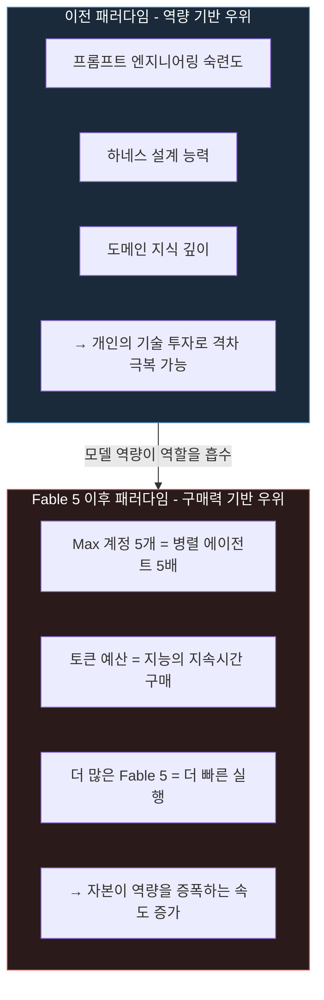
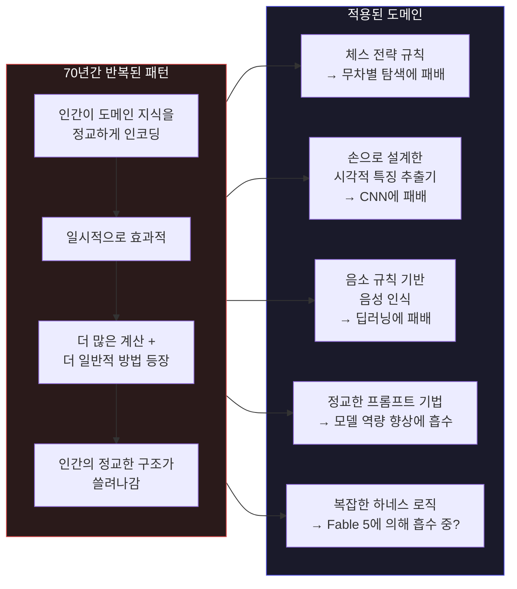
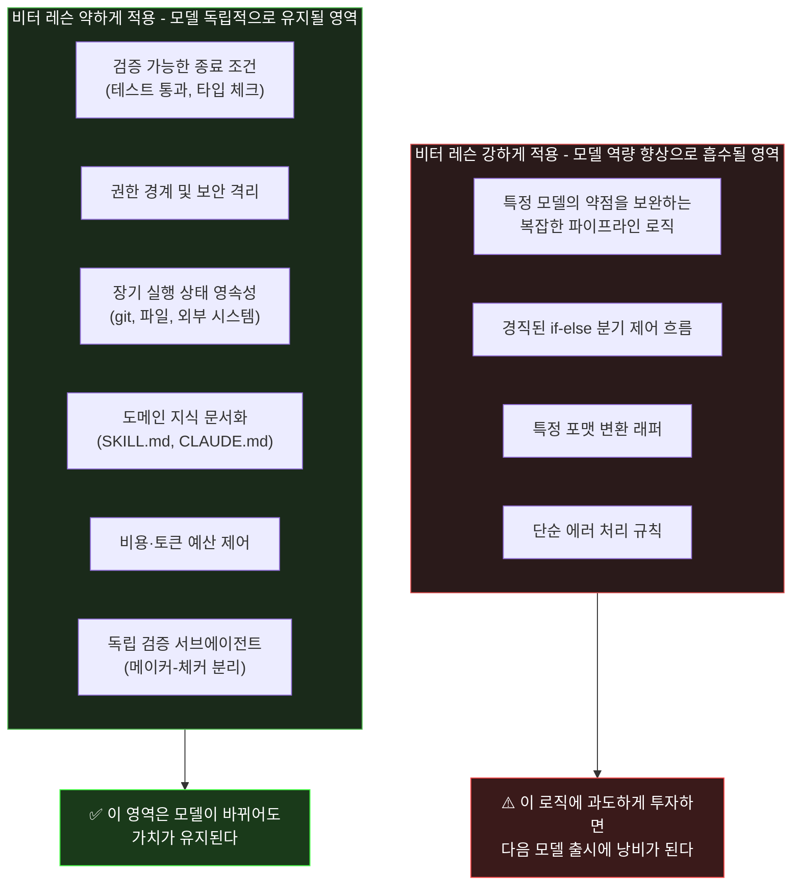
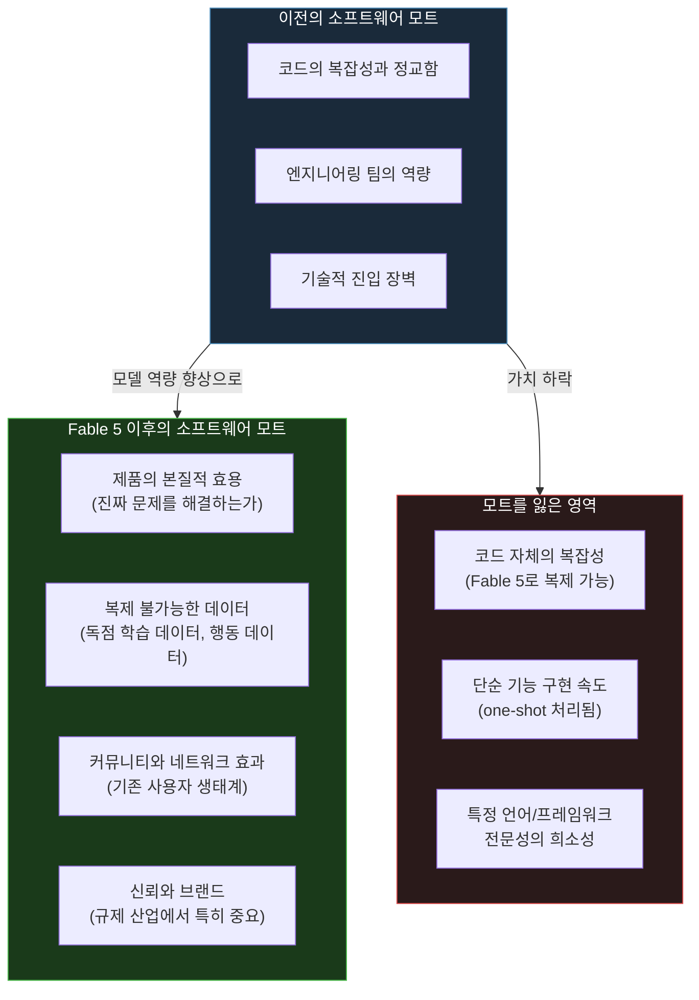
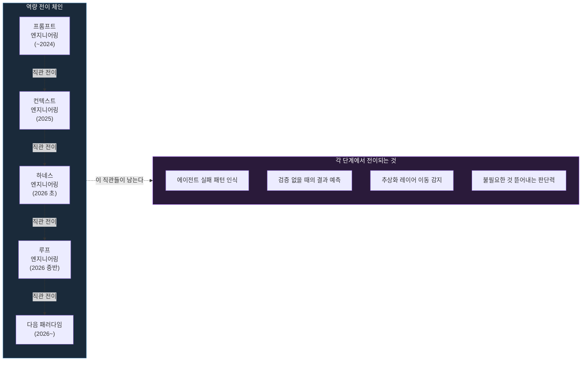
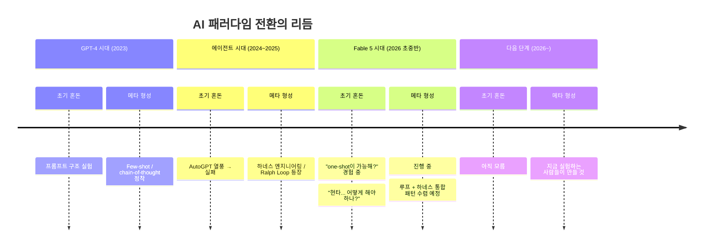

## 실무자들의 체감 리뷰를 출발점으로, "지금 깎는 게 무슨 의미인가"라는 질문에 정직하게 답하다

> **작성 기준일**: 2026-06-12  
> **발단**: Threads @yakshawan, @sihyun_adventure, @kim_h__rae 의 논의 (2026-06-11~12)  
> **핵심 참조**: Rich Sutton (The Bitter Lesson, 2019), Philipp Schmid (Agent Harness 2026), Claude Fable 5 출시 문서 및 실사용 리뷰, SWE-bench Pro 리더보드

---

## 목차

1. [발단: Fable 5가 구체화한 현타](#1-발단)
2. [두 개의 리뷰에서 읽히는 4가지 신호](#2-리뷰-신호)
3. [비터 레슨: 원전의 주장과 70년의 패턴](#3-비터-레슨)
4. [AI 도구 진화에서 비터 레슨이 반복되는 방식](#4-ai-도구에서의-반복)
5. [하네스 엔지니어링에도 비터 레슨이 작동하는가](#5-하네스에서의-비터-레슨)
6. ["지능을 살 수 있게 됐다": 새로운 불평등 구조](#6-지능의-상품화)
7. [소프트웨어 모트의 이동: 코드에서 데이터·커뮤니티로](#7-소프트웨어-모트)
8. [그러나 비터 레슨이 전부가 아닌 이유: 실증 데이터](#8-실증-반론)
9. [반론 1: 프롬프트 엔지니어링 유추 — 역량은 이전된다](#9-역량-이전)
10. [반론 2: 모델에 덜 영향받는 하네스를 깎자](#10-모델-무관-하네스)
11. [관점 3: 와우 확팩 리듬 — 평준화는 새 출발점이다](#11-와우-확팩)
12. [종합: 성벽이 아닌 안목을 쌓는 것](#12-종합)

---

## 1. 발단

"지금 하네스를 열심히 깎아두는 게 무슨 의미가 있나 싶고."

Threads의 @yakshawan이 2026년 6월 올린 이 문장은 개인적 나약함의 표현이 아니다. Fable 5를 직접 써본 실무자들의 체감 리뷰가 며칠 사이 쌓이면서 발생한 인식론적 충격이다. 비터 레슨(Bitter Lesson)이라는 추상적 개념이 구체적인 숫자와 경험으로 육화되는 순간이었다.

이 문서는 그 충격을 회피하지 않는다. Fable 5 체감 리뷰에서 읽히는 신호들을 먼저 정직하게 분석하고, 비터 레슨의 원전으로 돌아가 그것이 하네스 엔지니어링에 어떻게 적용되는지를 따져본 뒤, 그럼에도 불구하고 지금 하네스를 깎는 것이 어떤 가치를 가지는지를 논한다.

---

## 2. 두 개의 리뷰에서 읽히는 4가지 신호

### 신호 1: 계획과 실행의 자율화

> "개선방안 탐색 → 아이디어 도출 → 구현 → 테스트까지의 과정이 1시간이 채 걸리지 않는다."

> "계획과 실행을 알아서 해버립니다. 처음엔 당황스러웠지만 결과물이 좋습니다."

이전 세대 에이전트는 "이제 어떻게 할까요?"를 반복적으로 물었다. Fable 5는 이제 질문하지 않는다. 커다란 방향과 목표만 제시하면 에이전트가 전략적 판단을 내리고 실행한다. @sihyun_adventure가 지적한 것처럼, **프롬프팅의 단위가 달라진다. 세부 지시가 아니라 방향과 목표 중심으로.**

이것이 Human-in-the-loop가 "농담거리"가 됐다는 표현의 실체다. 인간이 루프 안에서 매번 검토하고 승인하는 구조 자체가 유효성을 잃기 시작했다는 의미다.

Fable 5 출시 당일 Stripe의 사례는 이를 산업적 규모로 보여줬다. Stripe는 5000만 줄짜리 Ruby 코드베이스 전체를 Fable 5에 맡겼다. 엔지니어링 팀이 두 달이 걸릴 마이그레이션을 단 하루에 완료했다. 이것은 벤치마크 숫자가 아니라 실제 프로덕션 인프라의 결과다.

### 신호 2: 레거시 환경에서의 질적 도약

> "0에서 1을 만드는 작업이라면 Opus도 비슷한 속도로 만들겠지만, 레거시가 있는 환경에서 에러를 발생시키지 않고, 기존 컨벤션을 무너뜨리지 않으면서, 중간중간 코드 베이스의 품질까지 올리는 의사결정을 해주는 건 Fable이 유일하다."

이것은 단순한 성능 향상이 아니다. 복잡성 처리 능력의 질적 도약이다. 기존 컨텍스트를 이해하고, 존재하는 패턴을 유지하며, 동시에 품질을 개선하는 것 — 이것이 바로 시니어 엔지니어가 가져다 주는 가치였다. 그 가치의 상당 부분이 Fable 5로 이동했다.

FrontierCode 벤치마크(코드가 완성됐는지가 아니라 얼마나 좋고 효율적인지를 측정)에서 Fable 5는 29.3%, Opus 4.8은 13.4%, GPT-5.5는 5.7%다. 코드를 작성하는 것과 좋은 코드를 작성하는 것의 차이가 두 배 이상 벌어지는 구간이다.

### 신호 3: 토큰 소모 2~3배 — 지능의 미터제 유틸리티화

> "Opus 4.8 대비 2~3배 가량 토큰을 소모합니다. 한 큐에 20~30분이 돌아가니 띄우는 터미널 창의 개수도 2배 증가했습니다."

Fable 5는 입력 $10/M, 출력 $50/M으로 Opus 4.8의 두 배다. 장시간 에이전트 실행이 기본 작동 방식이므로, 실제 청구 금액은 더 급격히 오를 수 있다. Unite.AI는 Fable 5 출시를 "프론티어 AI의 미터제 유틸리티화(metered utility)"라고 표현했다.

그러나 @sihyun_adventure는 그것이 오히려 가성비라고 느낀다.

> "처리 수준이 높아지니 가성비가 정말 좋다고 느끼면서"

토큰당 비용이 오르더라도, 한 번에 처리하는 태스크의 질과 범위가 그 이상으로 오르면 경제적 효율은 좋아진다. 이것은 개인 개발자에게는 호재지만, 동시에 그 다음 문장이 이어진다.

### 신호 4: 개인 간 격차의 심화

> "돈이 있으면 지능을 살 수 있게 되었습니다. 더 많은 지능을 구매하고 부릴 수 있는 사람이 상당히 많은 과실을 가져가게 될 것입니다. 어떤 방향으로 나아가면 좋을지 고민이 많네요."

이것이 현타의 정수(精髓)다. 하네스를 열심히 깎는 것이 무의미할 수도 있다는 우려는, 사실 더 큰 우려의 일부다: 개인의 정교한 역량이 아니라 **구매력**이 우위를 결정하는 세계로의 전환.

---

## 3. 비터 레슨: 원전의 주장과 70년의 패턴

이 현타는 단순히 모델이 좋아졌다는 것 이상을 의미한다. AI 개발의 역사가 반복적으로 가르쳐온 패턴과 만나는 지점이기 때문이다.

2019년 강화학습의 선구자 Rich Sutton이 발표한 에세이 "The Bitter Lesson"의 핵심 명제는 단순하다.

> "The biggest lesson that can be read from 70 years of AI research is that general methods that leverage computation are ultimately the most effective, and by a large margin."
>
> (70년간의 AI 연구에서 읽을 수 있는 가장 큰 교훈은, 계산(computation)을 활용하는 일반적인 방법이 궁극적으로 가장 효과적이며, 그것도 압도적인 차이로 그렇다는 것이다.)

이 교훈이 "쓴(bitter)" 이유는 인간의 정교한 지식과 공들인 설계가 결국 더 많은 계산과 더 일반적인 방법에 의해 압도당한다는 불편한 진실 때문이다.

---

## 4. AI 도구 진화에서 비터 레슨이 반복되는 방식

비터 레슨은 추상적 역사가 아니다. AI 도구의 진화 과정에서 우리가 이미 여러 번 경험한 구체적 패턴이다.

GPT-3 시대에는 정확한 프롬프트 구성이 극적인 성능 차이를 만들었다. Few-shot 예시의 정교한 배치, 지시문의 특정 표현, 출력 형식 명세가 핵심 역량이었다. 그러나 GPT-4, Claude 3로 이어지면서 "대충 던져도 찰떡같이 알아듣는" 영역이 급격히 확장됐다. 프롬프트 엔지니어링이 사라진 게 아니라, 단순 기교의 가치가 모델 역량 향상에 의해 지속적으로 잠식됐다.

2024년에는 복잡한 에이전트 파이프라인 로직이 중요했다. Manus는 6개월 만에 하네스를 다섯 번 리팩터링하며 경직된 가정을 제거했다. LangChain은 "Open Deep Research" 에이전트를 1년 안에 세 번 재설계했다. Vercel은 에이전트 툴의 80%를 제거했더니 성능이 오히려 좋아졌다. Philipp Schmid(AWS AI Engineer)는 2026년 1월 이것을 명시했다: "2024년에 복잡한 수동 파이프라인이 필요했던 기능들이 2026년에는 단일 컨텍스트 윈도우 프롬프트로 처리된다."

---

## 5. 하네스 엔지니어링에도 비터 레슨이 작동하는가

이것이 핵심 질문이다. 양면을 모두 정직하게 다룬다.

### 5.1 작동한다는 증거

**과도하게 설계된 제어 흐름은 다음 모델 업데이트에서 깨진다.** Philipp Schmid의 경고는 명확하다: "개발자들은 어제 작성한 '영리한' 로직을 뜯어낼 수 있는 하네스를 구축해야 한다. 제어 흐름을 과도하게 엔지니어링하면, 다음 모델 업데이트가 시스템을 깨뜨릴 것이다."

**Fable 5 체감 결과가 이를 실시간으로 증명한다.** Lyzr CTO Fabian Hedin의 발언: "Apps that took a hundred prompts a year ago, it now one-shots." (1년 전에 100개의 프롬프트가 필요하던 앱이 이제 원샷으로 처리된다.) 그 100개의 프롬프트를 관리하던 복잡한 파이프라인은 지금 불필요해졌다.

### 5.2 작동하지 않는다는 증거

**동일 모델에서 하네스 구성만으로 최대 6배 성능 차이.** 2026년 초 발표된 Pan et al. 연구와 DSPy 창시자 Omar Khattab의 후속 연구가 같은 결론을 제시했다. 동일한 모델 가중치에서 하네스 구성만 바꿨을 때 최대 6배 성능 차이가 발생했다. 가중치가 아닌, 프롬프트가 아닌, 모델 버전이 아닌 하네스에 의해서.

**SWE-bench Pro에서 스캐폴드 차이만으로 22포인트 스윙.** Scale AI의 표준화된 스캐폴딩과 벤더들의 최적화된 에이전트 하네스 사이의 갭은 10~30포인트다. 그 대부분은 모델 역량이 아니라 컨텍스트 검색과 툴 사용 품질에서 온다. Blitzy는 GPT-5.4(57.7%)를 상회하는 66.5%를 달성했는데, 모델이 아니라 하네스 덕분이었다.

**"모델은 천장, 하네스는 그 천장까지의 거리."** Fable 5의 80.3% SWE-bench Pro 점수는 Opus 4.8의 69.2%보다 11포인트 높다. 그러나 동일한 Fable 5를 나쁜 하네스에 넣으면 이 숫자는 급락한다. 천장이 높아질수록, 천장과 실제 성능 사이의 간극을 좁히는 하네스의 역할은 더 커진다.

### 5.3 비터 레슨이 적용되는 영역과 그렇지 않은 영역

핵심은 하네스 엔지니어링의 "어떤 부분"에 비터 레슨이 적용되는지를 구분하는 것이다.

---

## 6. "지능을 살 수 있게 됐다": 새로운 불평등 구조

전기는 돈을 내면 누구나 쓸 수 있지만, 더 많이 쓸 수 있는 사람이 더 많은 것을 할 수 있다. AI 지능도 같은 구조로 전환되고 있다. Max 계정 2개를 3일 만에 소진하는 사람과, 계정 5개를 병렬로 돌리는 사람 사이의 생산성 격차는 단순히 기술력의 격차가 아니다.

이것이 @yakshawan의 "성벽"이 쓸려나갈 것이라는 우려의 또 다른 층위다. 개인의 정교한 하네스 설계가 만들어내는 우위보다, 더 많은 토큰을 살 수 있는 사람의 우위가 더 클 수 있다는 것이다.

### 그러나 이 구조에는 상쇄 효과도 있다

"돈으로 지능을 살 수 있다"는 것은 동시에 "이전에는 대기업 엔지니어링 팀만 가능했던 것이 개인에게도 열렸다"는 의미다. @sihyun_adventure가 Max 계정 3개로 수행하는 작업이 몇 년 전에는 팀 단위 인력이 필요했다. @kim_h__rae가 레거시 환경에서 1시간 안에 완전한 개발 사이클을 돌리는 것은, 이전에는 시니어 엔지니어가 며칠을 써야 했다. 격차가 심화되는 것과 동시에, 낮은 층의 진입 장벽도 낮아졌다.

---

## 7. 소프트웨어 모트의 이동: 코드에서 데이터·커뮤니티로

> "개발비용은 gpt 3 출시부터 지금까지 낮아지고만 있으며, 대체불가능한 소프트웨어는 줄어들고 있고, SaaS의 경쟁력은 코드가 아닌, 해당 제품의 본질적 효용과 복제할 수 없는 강력한 데이터와 커뮤니티라는 사실이 더더욱 중요해지고 있다."

이것은 단순한 개인 감상이 아니다. 벤처 투자 데이터가 이를 뒷받침한다. SEG의 2026년 바이어 서베이는 이 양극화를 명확히 기록했다: 독점 데이터 모트가 있는 AI 네이티브 기업에는 프리미엄 멀티플, 레거시 워크플로에 AI 라벨만 붙인 전통적 SaaS에는 압축된 멀티플.

이 전환은 하네스 엔지니어링의 현타와 깊이 연결된다. 하네스를 정교하게 깎는 것이 **경쟁적 소프트웨어 우위**를 만들기 위한 것이라면, 그 전제 자체가 흔들리고 있다. 코드의 정교함이 모트가 되기 어려워지는 세계에서, 하네스 설계 역량의 가치는 어디에 있는가.

두 가지 답이 있다: 하나는 외부적 가치(제품의 경쟁력), 다른 하나는 내부적 가치(실행 능력과 생산성). 코드 모트 측면에서의 외부적 가치는 확실히 약화됐다. 그러나 내부적으로 더 빠르게 더 좋은 제품을 만들기 위한 역량으로서의 하네스 엔지니어링은 여전히 가치가 있다. 모트를 만드는 게 아니라 제품을 빠르게 실행하는 수단으로서.

---

## 8. 그러나 비터 레슨이 전부가 아닌 이유: 실증 데이터

현타를 인정하면서도, 그것이 전부가 아님을 보여주는 데이터가 있다.

**하네스가 아직도 6배를 결정한다.** 2026년 초 두 편의 독립적 연구가 확인한 것: 동일한 모델 가중치에서 하네스 구성만으로 최대 6배 성능 차이. Fable 5가 강해질수록 이 천장도 높아진다. 천장이 높아진다는 것은 좋은 하네스의 절대적 가치도 커진다는 의미다.

**Fable 5 자체가 하네스를 요구한다.** @sihyun_adventure의 관찰: "한 큐에 20~30분이 돌아가니 띄우는 터미널 창의 개수도 2배 증가했습니다." 더 강한 모델이 더 긴 실행 시간과 더 많은 병렬 에이전트를 요구한다. 이것을 관리하는 것 자체가 하네스 엔지니어링이다. Fable 5는 하네스의 필요성을 제거하지 않았다. 하네스가 관리해야 할 복잡성을 오히려 높였다.

**레거시 환경 처리는 여전히 하네스 설계에 의존한다.** @kim_h__rae가 칭찬한 "기존 컨벤션을 무너뜨리지 않으면서"의 능력은 모델 혼자서 하는 것이 아니다. CLAUDE.md, SKILL.md, 검증 게이트가 존재할 때 이 능력이 신뢰성 있게 발현된다. 모델이 강해질수록 좋은 하네스의 효과도 더 강하게 드러난다.

---

## 9. 반론 1: 프롬프트 엔지니어링 유추 — 역량은 이전된다

> "GPT3 시절에 '프롬프트 엔지니어링'이라며 열심히 프롬프트 다듬던 사람들이 있었죠. 지금은 대충 던져도 SOTA 모델이 찰떡같이 알아듣지만, 그중에서도 SOTA모델 제일 잘 쓰는 사람은 그때 프롬프트를 한 끗까지 다듬으며 역량을 축적한 사람들이잖아요."

GPT-3 시절 프롬프트를 극한까지 다듬었던 사람들이 실제로 얻은 것은 특정 프롬프트 패턴이 아니었다. **모델이 어떻게 실패하는지에 대한 체화된 직관**이었다. 그 직관은 GPT-4가 나왔을 때도, Claude가 나왔을 때도 유효했다. Fable 5에서도 마찬가지다.

> "뭐 지금의 하네스와 전혀 상관없는 무언가가 나올지라도, 누구보다 먼저 부딪혀보고 고심해본 경험은 남으니까요."

이것이 핵심이다. 역량 축적의 가치는 특정 기술의 영속성이 아니라 **학습 기반의 두께**에 있다. 하네스를 극한까지 다뤄본 사람이 다음 패러다임을 배우는 속도는, 처음 접하는 사람과 질적으로 다르다.

---

## 10. 반론 2: 모델에 덜 영향받는 하네스를 깎자

또 다른 참여자의 지론이 가장 실용적인 설계 원칙을 제시한다.

> "제 지론은 모델에 영향을 덜 받는 하네스를 깍자입니다."

이것은 비터 레슨을 거부하는 것이 아니라 **내재화하여 설계 원칙으로 전환**한 것이다. Philipp Schmid의 세 원칙이 이를 구조화한다.

**원칙 1: Start Simple (단순하게 시작)**: 거대한 제어 흐름을 구축하지 말고, 견고한 원자적 툴을 제공하며, 모델이 계획을 세우게 하고, 가드레일·재시도·검증을 구현하라. @kim_h__rae가 경험한 "계획과 실행을 알아서 해버리는" 모델에게 과도한 로직을 덧씌우는 것은 역효과다.

**원칙 2: Build to Delete (삭제하기 위해 만들어라)**: 아키텍처를 모듈화하라. 새 모델이 당신의 로직을 대체할 것이다. 코드를 뜯어낼 준비가 되어 있어야 한다.

**원칙 3: The Harness is the Dataset (하네스가 데이터셋이다)**: 경쟁 우위는 더 이상 프롬프트가 아니다. 그것은 하네스가 포착하는 에이전트 실행 궤적 데이터다. 에이전트가 어디서 실패하는지, 어떤 패턴에서 성공하는지의 축적 데이터는 단순 모델 업그레이드로 복제되지 않는 진짜 자산이다.

특히 세 번째 원칙은 @kim_h__rae의 소프트웨어 모트 관찰과 연결된다. **하네스가 생성하는 도메인 특화 실행 데이터가 복제 불가능한 데이터 자산이 될 수 있다.**

---

## 11. 관점 3: 와우 확팩 리듬 — 평준화는 새 출발점이다

마지막 참여자의 관점이 가장 편안하면서도 정확한 프레임을 제공한다.

> "저는 이거... 게임처럼 받아들이고있어요 예컨대 와우 확팩 나오는 초기에 다들 와아아 달리다가 평준화되는 그런느낌"

WoW 확장팩 메타포는 AI 개발의 리듬을 정확히 포착한다. 새 확팩이 출시되면 초반에는 혼돈이다. 어떤 빌드가 최강인지 아무도 모른다. 헌신적인 플레이어들이 실험하고, 틀리고, 다시 시도한다. 그러다 몇 달이 지나면 메타가 형성된다. 캐주얼 플레이어도 최적 경로를 따를 수 있게 된다.

Fable 5 출시가 지금 혼돈기다. "루프 엔지니어링이 뭔데?", "Fable 5를 어떻게 써야 하는데?", "지금 하네스를 어떻게 짜야 하는데?"를 외치는 시기. 몇 달이 지나면 best practice가 정착된다.

그리고 이 비유에서 중요한 것: **메타 형성의 주체는 항상 초반에 미친 듯이 실험한 사람들이다.** 지금 Fable 5로 현타를 맞으면서도 계속 부딪히는 사람들이 다음 달의 best practice를 쓸 사람들이다.

---

## 12. 종합: 성벽이 아닌 안목을 쌓는 것

이 문장에서 핵심은 "성벽"이라는 단어다. 그리고 질문은: **당신이 깎고 있는 것이 성벽인가, 안목인가?**

### 성벽은 쓸려나간다

특정 모델의 약점을 보완하는 복잡한 로직, 경직된 분기 구조, 모델 특화 최적화 레이어 — 이것들은 비터 레슨에 의해 쓸려나간다. 그리고 그것을 알고 짓는 것은 낭비다.

### 안목은 남는다

그러나 에이전트가 어떤 상황에서 실패하는지 알아보는 눈, 검증 없을 때 무슨 일이 일어나는지 아는 것, 컨텍스트가 오염되는 패턴을 감지하는 직관 — 이것들은 모델이 바뀌어도 당신 안에 남는다.

### Fable 5 체감 리뷰가 가르쳐준 것

> "SaaS의 경쟁력은 코드가 아닌, 해당 제품의 본질적 효용과 복제할 수 없는 강력한 데이터와 커뮤니티"

하네스 엔지니어링의 가치도 같은 방향으로 재정의할 수 있다. 경쟁적 소프트웨어 모트를 만들기 위해서가 아니라, **실행 속도와 실행 품질**을 높이기 위해서. 코드보다 데이터와 커뮤니티가 모트가 되는 세계에서, 하네스를 잘 다루는 역량은 그 데이터와 커뮤니티를 더 빠르게 만드는 도구다.

### 지금 깎는 것이 유효한 이유를 정리하면

| 유효한 이유 | 근거 |
|---|---|
| 지금은 실제로 차이를 만든다 | 동일 모델, 하네스 구성만으로 최대 6배 성능 차이 (2026 연구 결과) |
| 모델 독립적 구조는 영속한다 | 검증 게이트, 상태 영속성, 권한 경계는 어떤 모델이 와도 필요 |
| 역량은 다음 단계로 이전된다 | 프롬프트→컨텍스트→하네스→루프 각 전환에서 이전 경험자가 선두 |
| 하네스 데이터가 자산이다 | 에이전트 실행 궤적 데이터 = 복제 불가능한 도메인 자산 |
| 메타 형성의 주체가 된다 | 지금 부딪히는 사람이 다음 달 best practice를 쓴다 |

### 지금 하지 말아야 할 것

| 피해야 할 것 | 이유 |
|---|---|
| 모델 특화 제어 흐름 과도 설계 | 다음 모델 업데이트가 깨뜨린다 |
| "영리한" 로직의 경직된 구현 | Build to Delete 원칙: 뜯어낼 준비가 되어야 한다 |
| 코드 복잡성으로 모트 만들기 | Fable 5가 복제한다. 모트는 데이터·커뮤니티에 |
| 모델이 이미 잘하는 것을 대신 하려는 래퍼 | one-shot 처리되는 것에 100개짜리 파이프라인을 덧씌우는 건 역효과 |

### 마지막 답변

"지금 하네스를 열심히 깎아두는 게 무슨 의미가 있나?"

**깎는 대상이 모델 특화 성벽이라면, 그것은 쓸려나갈 것이다. 알고 깎아라.**

**깎는 대상이 에이전트 실패를 이해하는 안목과, 검증 가능한 목표를 정의하는 능력과, 모델에 독립적인 실행 기반이라면 — 그것은 Fable 6이 나왔을 때도, 그 다음 것이 나왔을 때도 당신 안에 남는다.**

> "누구보다 먼저 부딪혀보고 고심해본 경험은 남으니까요."

---

## 참고 자료

| 출처 | 내용 | 날짜 |
|------|------|------|
| Threads [@sihyun_adventure]( https://www.threads.com/@sihyun_adventure/post/DZd3QL1E0ti) | Fable 5 간단한 리뷰 (Max 계정 소비, 계획+실행 자율화, 격차 우려) | 2026-06-11 |
| Threads [@kim_h__rae](https://www.threads.com/@kim_h__rae/post/DZd2UYEDxa7) | Fable 5 High 3일차 사용 후기 (one-shot, 레거시 처리, SaaS 모트) | 2026-06-11 |
| Threads [@yakshawan](https://www.threads.com/@yakshawan/post/DZctw6wnQdz) + [@one_hackerway](https://www.threads.com/@one_hackerway/post/DZc0tJnk4aA) 외 | 하네스 엔지니어링 현타 논의 | 2026-06-11~12 |
| Rich Sutton | [The Bitter Lesson](https://lukaspetersson.com/blog/2025/bitter-vertical/) | 2019-03-13 |
| Philipp Schmid (philschmid.de) | The importance of Agent Harness in 2026 | 2026-01-05 |
| VentureBeat | Anthropic brings Mythos to the masses with Claude Fable 5 | 2026-06-09 |
| CodingFleet | Claude Fable 5 Review (Stripe 50M-line migration, 1 day) | 2026-06-09 |
| The Decoder | Anthropic releases Claude Fable 5 and Mythos 5 | 2026-06-09 |
| MindStudio Blog | Better Model vs. Better Harness (6배 성능 차이) | 2026-05-06 |
| Quesma Blog | Blitzy vs GPT-5.4: harness beats base model (SWE-bench Pro) | 2026-04-07 |
| Unite.AI | Claude Fable 5 Makes Frontier AI a Metered Utility | 2026-06-09 |
| Development Corporate | Recursive Self-Improvement (SaaS 멀티플 양극화) | 2026-06-07 |

---

*작성일: 2026-06-12*
