> **"Fable이 생각하고 · Codex가 짓고 · repo가 기억하고 · 당신이 판정한다"**
>
> 원작: @jumperzl1 · 한국어 재구성: [@unclejobs.ai](https://www.threads.com/@unclejobs.ai/post/DZcB7R_iZ8L)

---

## 목차

1. [배경: 지금 AI 코딩 도구 시장에서 무슨 일이 벌어지고 있는가](#1-배경)
2. [벤치마크가 갈리는 이유: 적성이 다른 두 모델](#2-벤치마크-비대칭)
3. [The Architect Loop란 무엇인가](#3-architect-loop-개념)
4. [시스템의 세 구성 요소](#4-세-구성-요소)
5. [HANDOFF.md: 가장 영리한 부품은 모델이 아니라 파일 하나](#5-handoffmd)
6. [4단계 셋업: 굴러가게 만드는 방법](#6-4단계-셋업)
7. [5가지 금지 목록: 진짜 설계는 막는 것에 있다](#7-5가지-금지-목록)
8. [왜 이 설계가 옳은가: 연구로 뒷받침되는 원리들](#8-이론적-근거)
9. [비용 경제학: 비싼 지능은 판단에, 싼 지능은 타이핑에](#9-비용-경제학)
10. [디렉팅의 완성: 뭘 못 하게 할지 아는 것](#10-디렉팅의-완성)
11. [요약 및 참고 자료](#11-요약-및-참고-자료)

---

## 1. 배경

### 경쟁 구도: OpenAI와 Anthropic의 코딩 도구 전쟁

2026년 현재, AI 코딩 도구 시장은 두 회사의 정면충돌로 달아오르고 있다. Anthropic의 **Claude Code**와 OpenAI의 **Codex**가 그 주인공이다.

결정적인 장면은 2026년 5월 13일에 일어났다. OpenAI CEO 샘 알트만이 직접 X(트위터)에 "Codex is the best AI coding product"라고 올리며, Claude Code를 쓰는 기업 고객이 30일 안에 Codex로 갈아타면 2개월 무료 사용권을 주겠다고 선언했다. 심지어 기존 Claude Code 설정, 플러그인, 세션 히스토리를 한 번에 Codex로 이전해 주는 마이그레이션 도구까지 함께 내놓았다. "갈아탈 생각이 있다면 짐도 대신 싸주겠다"는 메시지였다.

Anthropic은 1시간도 안 되어 맞받았다. Pro, Max, Team, Enterprise 구독자 전원에게 Claude Code 주간 사용 한도를 7월 13일까지 **50% 증량**한다는 공지를 올렸다. OpenAI가 2개월 무료를 준다면, 우리는 기존 유저에게 더 많은 사용량을 주겠다는 구조다. 마감일까지 정확히 2개월로 맞춘 건 의도적인 대응이었다.

이 전쟁의 배경에는 단순한 가격 경쟁이 아닌, **"개발자의 일상 워크플로를 누가 장악하느냐"** 를 두고 벌이는 더 큰 싸움이 있다. AI 업계에서 개발자는 가장 입소문이 빠르고, 도구 선택 결정에 가장 큰 영향력을 행사하는 집단이기 때문이다.

### 그런데 정작 사용자들은 무엇을 선택했는가?

흥미로운 것은 사용자들의 반응이다. 많은 개발자들이 "어느 쪽이 더 좋으냐"를 고르는 대신, **둘을 묶어 쓰기** 시작했다. 이 선택이 충동이나 변덕이 아닌 이유가 있다. 두 모델의 성능 분포가 서로 다른 방향을 가리키기 때문이다.

---

## 2. 벤치마크 비대칭

### Claude Fable 5 vs GPT-5.5 Codex: 잘하는 일이 다르다

2026년 6월 9일 출시된 **Claude Fable 5**와 2026년 4월 23일 출시된 **GPT-5.5**는 모두 최전선 모델이지만, 강점의 분포가 다르다.

**코딩 능력 벤치마크 (SWE-Bench Pro 기준)**

| 모델 | SWE-Bench Pro | FrontierCode Diamond |
|------|--------------|---------------------|
| Claude Fable 5 | **80.3%** | **29.3%** |
| Claude Opus 4.8 | 69.2% | 13.4% |
| GPT-5.5 | 58.6% | 5.7% |
| Gemini 3.1 Pro | 54.2% | — |

SWE-Bench Pro는 실제 GitHub 이슈를 해결하는 능력을 측정하는 벤치마크다. 코드베이스 전체를 읽고, 수정할 지점을 찾고, 연관된 여러 파일에 걸쳐 변경 사항을 이어가는 능력이 측정된다. Claude Fable 5의 점수(80.3%)는 GPT-5.5(58.6%)와 22포인트 차이가 나며, 이는 같은 세대 모델 간 격차치고 매우 크다.

FrontierCode Diamond라는 더 어려운 평가에서는 격차가 더욱 벌어진다. Fable 5는 29.3%, GPT-5.5는 5.7%로, 5배 이상의 차이가 난다. Stripe가 Fable 5를 써서 5,000만 줄 규모의 코드 마이그레이션을 두 달치 작업 분량을 하루 만에 완료했다는 실제 사례도 이 수치와 맞물린다.

**그러나 GPT-5.5 Codex의 강점도 분명히 존재한다.** GPT-5.5는 $5/$30(입력/출력, 백만 토큰당)인 반면 Fable 5는 $10/$50으로 2~3배 비싸다. 그리고 Codex는 터미널에서 빠르게 코드를 생성하는 단기 반복 작업에 최적화된 실행 루프를 갖추고 있다. 3~4개의 병렬 에이전트를 독립된 클라우드 샌드박스에서 동시에 돌리는 아키텍처는 분리된 모듈을 빠르게 치고 나가는 데 강점이 있다.

**요약하면 이렇다.** Claude(Fable 5)는 여러 파일이 얽힌 복잡한 구조 판단과 설계에 앞서고, Codex는 모듈을 빠르게 쳐내는 실행력에 앞선다. 한쪽은 구조를 보는 눈이 좋고, 한쪽은 손이 빠르다. 눈 좋은 쪽한테 설계를, 손 빠른 쪽한테 시공을 맡기는 것이 The Architect Loop의 출발점이다.

---

## 3. Architect Loop 개념

### 시스템을 한 문장으로 요약하면

> **아키텍트는 칼끝 · 빌더는 손 · repo는 뇌**

이 루프는 **서로 다른 회사의 두 AI 모델을 단일 팀으로 운용하는 1인용 소프트웨어 개발 시스템**이다. 두 모델 간 적성 차이를 설계에 반영하고, 인간은 판정 권한만 쥔다.

### 전체 구조 다이어그램

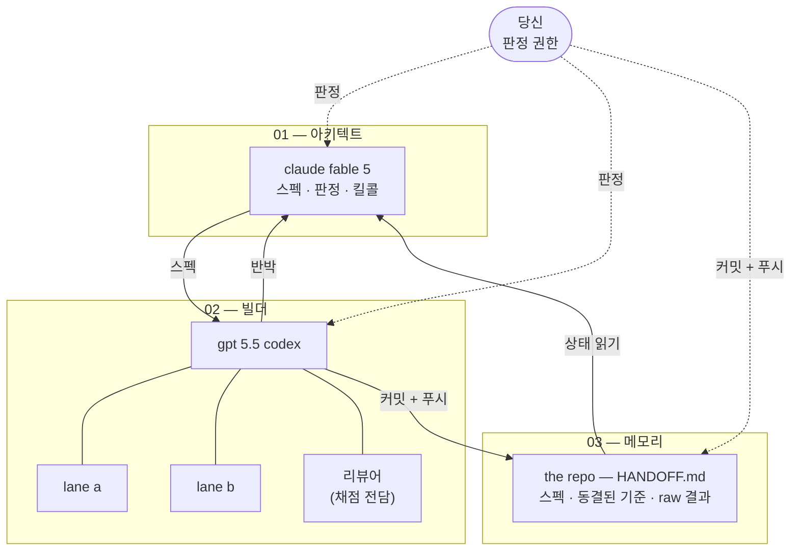

---

## 4. 세 구성 요소

### 01 — 아키텍트: Claude Fable 5

아키텍트의 역할은 세 가지로 정의된다: **스펙(Spec) 작성, 판정(Judgment), 킬콜(Kill Call)**.

스펙 작성은 무엇을 만들지를 정의하는 일이다. 기능의 범위, 인터페이스 계약, 수락 기준을 문서로 써내려 간다. 판정은 빌더가 올린 결과물에 대해 수용/기각/수정 중 하나를 결정하고 이유를 한 줄로 밝히는 일이다. 킬콜은 방향이 잘못됐거나 범위를 벗어난 작업을 중단시키는 결정이다.

한 가지 핵심 제약이 있다. **아키텍트는 구현 코드를 한 줄도 쓰지 않는다.** 이 제약은 역할의 경계를 명확히 하기 위한 것이다. 설계사무소는 벽돌을 쌓지 않는다. 스펙과 판정만이 아키텍트의 산출물이다.

### 02 — 빌더: GPT 5.5 Codex

빌더는 구현을 담당한다. 핵심 구조는 **레인 분리와 병렬 실행**이다. 서로 의존성이 없는 모듈을 3~4개 레인으로 나눠 동시에 작업한다. 예를 들어, 인증 시스템, API 레이어, 프론트엔드 컴포넌트를 각각 다른 에이전트가 독립된 샌드박스에서 동시에 작업하는 식이다.

빌더 옆에는 **리뷰어 에이전트**가 하나 붙는다. 이 리뷰어는 코드를 쓰지 않고 채점만 한다. 리뷰어가 APPROVE를 찍기 전에는 아무것도 메인 브랜치에 합쳐지지 않는다. 이 구조가 왜 중요한지는 뒤에 설명할 자기 강화 편향(self-enhancement bias) 논의에서 밝혀진다.

빌더에게 부여된 중요한 행동 규칙이 하나 있다. **코드를 짜기 전에 반대 의견을 먼저 내놓아야 한다.** 조용한 복종은 실패로 간주된다.

### 03 — 메모리: the repo — HANDOFF.md

메모리는 모델이 아니라 파일이다. Git 저장소의 `docs/HANDOFF.md` 파일이 시스템 전체의 기억을 담당한다. 이 파일에 대해서는 다음 섹션에서 별도로 다룬다.

### 04 — 당신: 판정 권한

시스템의 한가운데에 사람이 있다. 이 루프에서 인간의 역할은 **최종 판정**이다. 충재, 증거 검토, 다음 스펙 결정, 킬/고 결정이 사람이 하는 일의 전부다. 인간은 코드를 직접 쓰지도 않고, 세세한 구현 결정을 내리지도 않는다. 대신 경로를 먼저 깔고 검수대를 세운 뒤, 중요한 갈림길에서만 개입한다.

---

## 5. HANDOFF.md

### 가장 영리한 부품은 모델이 아니라 파일 하나다

병원 간호사들은 교대할 때 인수인계 노트를 쓴다. 다음 근무자가 환자에게 처음부터 다시 물어보는 수고를 덜기 위해서다. 어떤 처치가 있었는지, 주의해야 할 사항은 무엇인지, 미해결된 문제는 무엇인지를 적는다. `HANDOFF.md`는 그 노트다.

**빌더가 작업을 마칠 때마다 네 가지를 적는다:**

1. 무엇을 만들었는가 (완료된 작업의 목록과 스펙)
2. 왜 그렇게 정했는가 (설계 결정의 이유)
3. 어떤 쟁점이 아직 안 풀렸는가 (미해결 문제)
4. 다음 조각이 무엇인가 (다음 작업 스펙)

이 파일이 있으면 아키텍트가 세션을 시작할 때 사람에게 꼬치꼬치 묻지 않아도 된다. 노트를 읽고 바로 판정에 들어간다. 글쓴이가 "이 파일 덕에 30분이면 된다"고 말하는 이유다.

**HANDOFF.md에 적을 수 있는 것과 없는 것:**

| 허용 | 금지 |
|------|------|
| 표와 숫자 | "유망해 보임" 같은 해석적 표현 |
| 통과/실패 여부 (구체적 결과) | 모호한 상태 묘사 |
| 미해결 쟁점의 구체적 목록 | 추측성 코멘트 |
| 동결된 스펙 문서 | 사후 기준 변경 |

기록 밖 해석은 금지다. HANDOFF에 없으면 없던 일이다.

---

## 6. 4단계 셋업

### 4스텝이면 굴러갑니다 (architect loop 셋업)

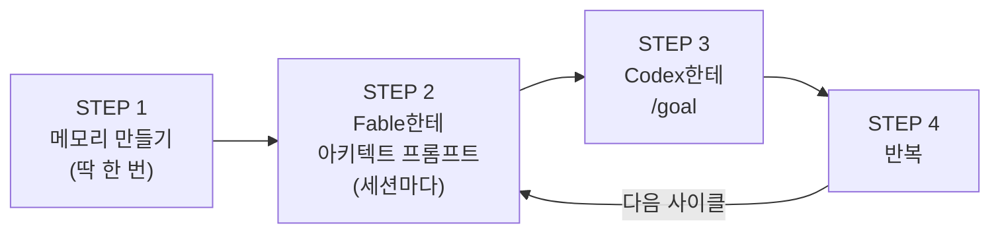

---

#### STEP 1 — 메모리 만들기 (딱 한 번)

저장소(repo)에 `docs/HANDOFF.md` 파일을 생성한다. 이것은 최초 1회만 만들면 된다. 이후에는 빌더가 세션을 마칠 때마다 이 파일을 갱신한다.

파일에는 세 가지 섹션이 들어간다: 스펙 (무엇을 어떻게 만들지), 동결된 기준 (채점에 쓸 합격 조건), raw 결과 (테스트 통과 여부 및 측정값).

아키텍트는 세션을 시작할 때 사람에게 묻지 않고 이 파일을 읽는다. 30분이 충분해지는 이유는 바로 이 파일 덕분이다.

---

#### STEP 2 — Fable한테 아키텍트 프롬프트 (세션마다)

세션마다 Claude Fable 5에게 아키텍트 역할을 부여하는 프롬프트를 넣는다. 핵심은 세 가지다.

첫째, **"너는 아키텍트다. 구현 코드는 쓰지 않는다."** 역할의 경계를 명확히 한다.

둘째, **할 일을 세 가지로 한정한다:** 쟁점 판정(수용/기각/수정 + 이유 한 줄), raw 결과만 채점, 다음 조각 스펙 작성.

셋째, **범위 이탈과 골대 옮기기를 지적할 것.** 뭔가 잘못되고 있다는 신호가 보이면 조용히 넘기지 않고 명확하게 제동을 건다. 무뚝뚝하게, 반대도 하면서.

---

#### STEP 3 — Codex한테 /goal

GPT 5.5 Codex에게 목표를 주는 방식도 세 단계로 구조화된다.

**PHASE 0:** 코드를 쓰기 전에 먼저 계획과 반대 의견을 제시한다. "조용한 복종 = 실패"다.

**PHASE 1:** 공유 계약(스키마·인터페이스)을 코드보다 먼저 `docs/`에 동결한다. 동결 이후에는 빌더 자신도 수정하지 못한다. 계약이 코드보다 먼저 있어야 레인 간 충돌 없이 병렬 작업이 가능하다.

**PHASE 2:** 레인 3~4개를 병렬로 실행하고, 각 레인마다 채점 전담 리뷰어를 붙인다. 리뷰어의 APPROVE 없이는 머지(merge)가 금지된다.

---

#### STEP 4 — 반복

빌더는 몇 시간씩 타이핑하고, 아키텍트는 몇 분씩 판정만 한다. 당신이 하는 일은 중재, 증거 검토, 다음 스펙 결정, 킬/고 결정이다. 루프는 이 리듬으로 반복된다.

---

## 7. 5가지 금지 목록

### 진짜 설계는 금지 목록에 있다

프롬프트를 뜯어보면 묘한 것이 보인다. 시키는 말보다 막는 말이 많다. 아키텍트 루프를 지탱하는 규칙의 본질은 허용 목록이 아니라 금지 목록이다.

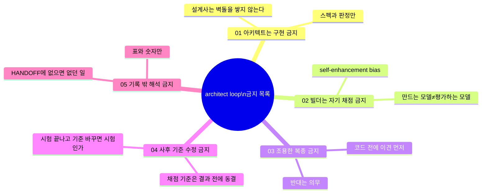

---

#### 01 — 아키텍트는 구현 금지

설계자는 벽돌을 쌓지 않는다. 스펙과 판정, 킬콜만이 아키텍트의 산출물이다. 구현에 손을 대기 시작하면 역할 분리가 무너지고, 시스템 전체의 견제 구조가 흔들린다. 설계사무소와 시공사가 같은 사람이면 누가 서로를 확인하겠는가.

#### 02 — 빌더는 자기 채점 금지

자기 숙제를 자기가 채점하는 것은 금지다. 모델은 자기 출력에 점수를 후하게 주는 경향이 있다. 이것은 감으로 만든 규칙이 아니라, 연구에서 반복적으로 확인된 패턴이다. 뒤에 별도로 다룬다.

#### 03 — 조용한 복종 금지

반대는 의무다. 빌더는 코드를 짜기 전에 계획과 반대 의견을 먼저 내놓아야 한다. 무조건 따르는 에이전트는 아키텍트의 결정이 잘못됐을 때 그것을 증폭시킨다. 설계 오류를 코딩 단계에서 발견하는 것이 배포 이후에 발견하는 것보다 훨씬 낫다.

#### 04 — 사후 기준 수정 금지

채점 기준은 결과가 나오기 전에 동결된다. 시험이 끝난 뒤 채점 기준을 바꾸면 그것은 시험이 아니다. 공유 계약(스키마·인터페이스)은 코드보다 먼저 `docs/`에 기록하고, 이후에는 빌더 자신도 수정할 수 없다.

#### 05 — 기록 밖 해석 금지

HANDOFF.md에 없으면 없던 일이다. "유망해 보임", "잘 될 것 같음" 같은 해석적 표현은 금지다. 표와 숫자만 기록된다. 이 규칙은 아키텍트가 상태를 판정할 때 주관적 인상에 흔들리지 않도록 보호한다. 사실만이 판정의 근거다.

---

## 8. 이론적 근거

### 왜 이 설계가 옳은가: 연구가 뒷받침하는 세 가지 원리

#### 원리 1: 자기 강화 편향 (Self-Enhancement Bias)

모델은 자기 출력에 점수를 후하게 준다. 이 현상은 학계에서 **자기 강화 편향(self-enhancement bias)** 또는 **자기 선호 편향(self-preference bias)** 으로 불린다.

Zheng et al.의 MT-Bench 연구는 LLM이 판사(Judge) 역할을 맡을 때 자신의 출력을 더 높이 평가하는 경향이 있음을 보였다. NeurIPS 2024에서 발표된 연구는 LLM 평가자가 자신의 생성물을 인식하고 선호하며, 자기 인식 능력이 강할수록 자기 선호 편향도 강해진다는 선형 상관관계를 실증적으로 확인했다. 이 편향은 GPT-4를 포함한 여러 모델에서 반복적으로 관찰되었다.

결론은 명확하다: **만드는 모델과 평가하는 모델을 분리하라.** Architect Loop에서 빌더와 리뷰어 에이전트를 분리한 것은 이 연구 권고를 그대로 적용한 것이다.

#### 원리 2: 검증은 생성보다 쉽다 (Verification vs. Generation)

한 가지 답을 생성하는 것보다 주어진 답이 맞는지 검증하는 것이 더 쉽다. 이 원리는 계산복잡도 이론의 오래된 통찰이지만, AI 시스템 설계에서도 그대로 적용된다.

Evidently AI의 LLM-as-a-judge 연구가 이를 확인한다. 리뷰어 에이전트는 코드를 생성하는 것보다 적은 컨텍스트와 계산 자원으로 합격/불합격을 판정할 수 있다. 이 비대칭성이 아키텍트 루프의 효율성 원천이다.

리뷰어를 별도로 세우는 것은 단순한 분업이 아니라, "더 쉬운 일을 하는 에이전트를 추가하면 전체 품질이 올라간다"는 원리를 구체화한 것이다.

#### 원리 3: 비싼 지능은 판단에, 싼 지능은 생성에

경제학적 논리도 같은 방향을 가리킨다. 최고 수준의 변호사한테 복사 심부름을 시키는 회사는 없다. 비싼 시간은 판단에 쓰고, 나머지는 다른 손에 맡긴다. AI 시스템도 같다.

**비용 비교 (2026년 6월 기준, 백만 토큰당)**

| 모델 | 입력 | 출력 | 역할 |
|------|------|------|------|
| Claude Fable 5 | $10 | $50 | 아키텍트 (판단·설계) |
| GPT-5.5 | $5 | $30 | 빌더 (생성·구현) |
| gpt-5.3-codex | $1.75 | $14 | 빌더 (병렬 레인) |

비싼 모델에게는 비싼 시간을 정당화할 수 있는 판단 작업만 시키고, 반복적인 구현 작업은 더 저렴한 모델에게 맡기는 것이 이 시스템의 경제적 논리다.

---

## 9. 비용 경제학

### 20달러로 어떻게 가능한가

글쓴이의 계산에 따르면, 월 20달러짜리 Claude 구독이면 4.5시간마다 약 30분씩 Fable 5를 아키텍트로 쓸 수 있다. 아키텍트는 판정과 중재와 킬콜만 하기 때문에 이 정도 시간이면 충분하다.

그 사이 몇 시간짜리 구현 작업은 구독에 묶인 Codex가 처리한다.

**요금과 한도는 계속 바뀌므로 숫자는 참고용으로만 보는 것이 좋다.** 핵심은 숫자가 아니라 구조다:

- 아키텍트(Fable 5)는 타이핑을 하지 않는다. 판정만 한다.
- 빌더(Codex)는 판단을 하지 않는다. 구현만 한다.
- 따라서 아키텍트의 비싼 시간 사용량이 최소화된다.

이 분업의 본질은 "검증은 생성보다 쌀 수 있다"는 비대칭성을 비용 모델로 치환한 것이다. 비싼 지능이 가장 적은 횟수로 개입하면서도 가장 중요한 결정을 내리도록 설계되어 있다.

---

## 10. 디렉팅의 완성

### 뭘 못 하게 할지 아는 것

이 시스템이 전달하는 메시지를 한 문장으로 압축하면 이렇다.

> **"잘 시키는 것의 절반은 못 하게 막는 것이다."**

잘 시키는 사람은 더 많이 시키는 사람이 아니다. 더 좁고 정확한 루프를 짜는 사람이다. Architect Loop는 거기서 한 걸음 더 나간다. 좁고 정확한 루프의 실체가 무엇이냐는 질문에 대한 답이 **금지 목록**이라는 것이다.

설계자는 벽돌을 못 쌓게. 시공자는 자기 점수를 못 매기게. 입을 다물지 못하게. 골대를 못 옮기게. 기록에 없는 것을 해석에 쓰지 못하게.

허용보다 금지를 정교하게 깎을수록 루프는 좁아지고, 좁아질수록 결과물이 단단해진다. 뭘 시킬지 아는 것이 디렉팅의 시작이라면, **뭘 못 하게 할지 아는 것이 디렉팅의 완성**이다.

---

## 11. 요약 및 참고 자료

### 핵심 개념 한눈에 보기

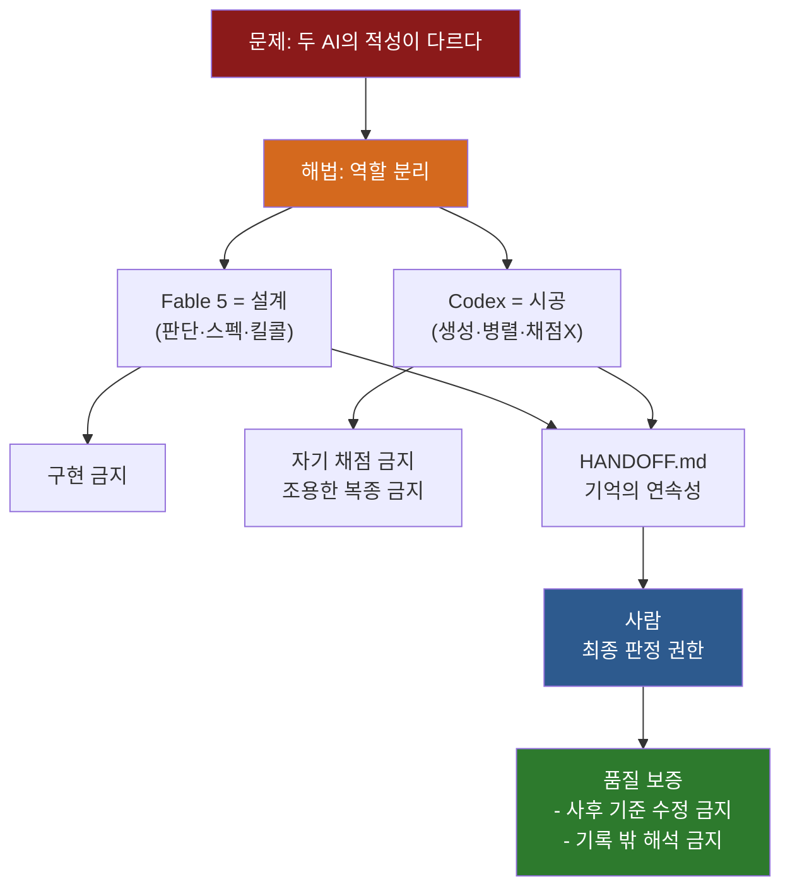

### 다섯 가지 금지의 배경 원리 요약

| 금지 항목 | 왜 금지인가 | 근거 |
|-----------|------------|------|
| 아키텍트 구현 금지 | 역할 혼합 → 책임 불분명 | 설계-시공 분리 원칙 |
| 빌더 자기 채점 금지 | Self-enhancement bias | Zheng et al., NeurIPS 2024 연구 |
| 조용한 복종 금지 | 오류 증폭 방지 | 설계 오류는 코딩 전에 잡아야 함 |
| 사후 기준 수정 금지 | 측정 신뢰성 확보 | 채점 기준은 결과 전에 동결 |
| 기록 밖 해석 금지 | 판정 오염 방지 | 표와 숫자만이 사실 |

---

### 참고 자료

**벤치마크 및 모델 비교**

- Anthropic, *Claude Fable 5 benchmark table* (June 9, 2026) — SWE-Bench Pro 80.3% vs GPT-5.5 58.6%
- Digital Applied, *Claude Fable 5 vs GPT-5.5 Frontier Comparison* (June 9, 2026) → https://www.digitalapplied.com/blog/claude-fable-5-vs-gpt-5-5-frontier-comparison-2026
- Medium (@unicodeveloper), *Claude Code vs Codex vs OpenCode: Which AI Coding Agent Is Actually the Best in 2026?* → https://medium.com/@unicodeveloper/claude-code-vs-codex-vs-opencode-which-ai-coding-agent-is-actually-the-best-in-2026-baa9f6fd5374

**AI 코딩 도구 경쟁**

- MindStudio, *The AI Coding War: OpenAI Codex vs Claude Code* → https://www.mindstudio.ai/blog/ai-coding-war-openai-codex-vs-claude-code-builders
- MindStudio, *Claude Code vs Codex: Which AI Coding Tool Should You Use in 2026?* → https://www.mindstudio.ai/blog/claude-code-vs-codex
- TechTimes, *OpenAI vs Anthropic Coding War* (June 10, 2026) → https://www.techtimes.com/articles/318184/...

**자기 강화 편향 및 LLM-as-a-Judge 연구**

- Zheng et al., *Judging LLM-as-a-Judge with MT-Bench and Chatbot Arena* → https://arxiv.org/abs/2306.05685
- Weights & Biases, *Exploring LLM-as-a-Judge* (자기 강화 편향, 생성·평가 분리 권고) → https://wandb.ai/site/articles/exploring-llm-as-a-judge/
- Evidently AI, *LLM-as-a-judge guide* (검증이 생성보다 쉽다) → https://www.evidentlyai.com/llm-guide/llm-as-a-judge

**원작**

- Threads: @unclejobs.ai → https://www.threads.com/@unclejobs.ai/post/DZcB7R_iZ8L

---

*작성 기준일: 2026년 6월 12일*
*Claude Sonnet 4.6 + 웹 검색 기반으로 최신 정보를 확인하여 작성*

---

---

# 별첨: The Architect Loop와 하네스 엔지니어링 비교 분석

> **"The Architect Loop는 하네스 엔지니어링의 원리를 1인 워크플로로 압축한 구현체다"**

---

## 목차 (별첨)

- A. [하네스 엔지니어링이란 무엇인가](#a-하네스-엔지니어링이란-무엇인가)
- B. [5계층 하네스 스택: L1~L5](#b-5계층-하네스-스택)
- C. [Architect Loop의 각 요소를 하네스 계층에 매핑하기](#c-계층-매핑)
- D. [핵심 통찰: 하네스 흡수 이후 개발자 소유 계층](#d-하네스-흡수-이후)
- E. [Architect Loop의 고유한 기여: 크로스 프로바이더 하네스](#e-크로스-프로바이더-하네스)
- F. [비교 요약 표](#f-비교-요약)

---

## A. 하네스 엔지니어링이란 무엇인가

### AI 엔지니어링의 세 번째 패러다임

2026년 현재, AI를 이용한 소프트웨어 개발은 세 번의 패러다임 전환을 겪었다.

**첫 번째 국면: 프롬프트 엔지니어링(2022~2024)** 은 LLM에게 더 좋은 질문을 던지는 기술이었다. 말을 잘 고르면 더 좋은 답이 나온다. 초점은 단일 상호작용의 품질이었다.

**두 번째 국면: 컨텍스트 엔지니어링(2024~2025)** 은 모델이 무엇을 볼 수 있는가를 설계하는 기술이었다. 관련 파일, 프로젝트 규칙, 아키텍처 제약 조건을 컨텍스트 창에 집어넣어서 모델이 특정 코드베이스에 대해 추론할 수 있게 했다. RAG(검색 증강 생성)와 MCP가 이 국면을 체계화했다.

**세 번째 국면: 하네스 엔지니어링(2026~현재)** 은 에이전트가 작동하는 전체 환경을 설계하는 기술이다. 말을 잘 고르거나 정보를 잘 주는 수준을 넘어서, 에이전트가 특정 실수를 구조적으로 반복할 수 없도록 환경 자체를 고치는 것이다.

이 개념은 2026년 2월 HashiCorp 공동창업자이자 Terraform과 Ghostty의 제작자인 **Mitchell Hashimoto**의 블로그 포스트에서 공식 언어를 얻었다.

> **"에이전트가 실수를 저지를 때마다, 그 실수를 영원히 반복하지 못하도록 해결책을 환경에 엔지니어링하라."**
> — Mitchell Hashimoto, 2026년 2월

닷새 뒤, OpenAI 엔지니어 Ryan Lopopolo가 이 개념을 숫자로 뒷받침했다. 3명의 팀이 5개월 동안 수동으로 코드를 한 줄도 쓰지 않고 1백만 줄짜리 프로덕션 코드베이스와 1,500개의 병합된 풀 리퀘스트를 완성했다. 그들이 한 일은 코드 작성이 아니라 코드 작성자(Codex 에이전트)가 신뢰할 수 있게 작동하는 환경을 설계하는 것이었다.

이 경험이 내린 결론은 간결하다.

> **Agent = Model + Harness**
>
> 모델은 확률적 추론을 제공하는 상태 없는 토큰 예측기다. 하네스는 그 추론을 신뢰할 수 있는 결정론적 행동으로 번역하는 **런타임 소프트웨어 인프라**다.

### 왜 하네스가 중요한가: 88% 생산 격차

시장 데이터에 따르면 기업 AI 에이전트 프로젝트의 최대 88%가 프로덕션 단계에 도달하지 못한다. 실패 분석을 보면 65%의 기업 AI 실패는 모델의 추론 능력 부족이 아니라 **하네스 결함**에서 비롯된다. 구체적으로는 컨텍스트 드리프트(Context Drift), 스키마 불일치(Schema Misalignment), 상태 저하(State Degradation)가 주요 원인이다.

모델을 최적화하면서 하네스를 안정시키지 않으면 수익이 체감 감소한다. 반대로, LangChain 팀은 모델을 바꾸지 않고 하네스만 조정해서 Terminal Bench 2.0 점수를 52.8%에서 66.5%로 올렸다.

---

## B. 5계층 하네스 스택

### "하네스"라는 단어의 어휘 문제

오늘날 "하네스"라는 단어는 프레임워크화 이전의 "네트워킹"과 같은 문제를 겪고 있다. CLAUDE.md 파일 30줄을 가진 팀과, 결정론적 아키텍처 제약, 컨텍스트 파이프라인, 서브에이전트 오케스트레이션, 검증 훅, 생명주기 관리를 모두 갖춘 팀이 똑같이 "하네스 엔지니어링을 한다"고 말한다. 전자는 하네스 수준의 약 15%, 후자는 약 80%다.

이 어휘 문제를 해결하기 위해 업계는 **5계층 스택 모델**로 수렴하고 있다.

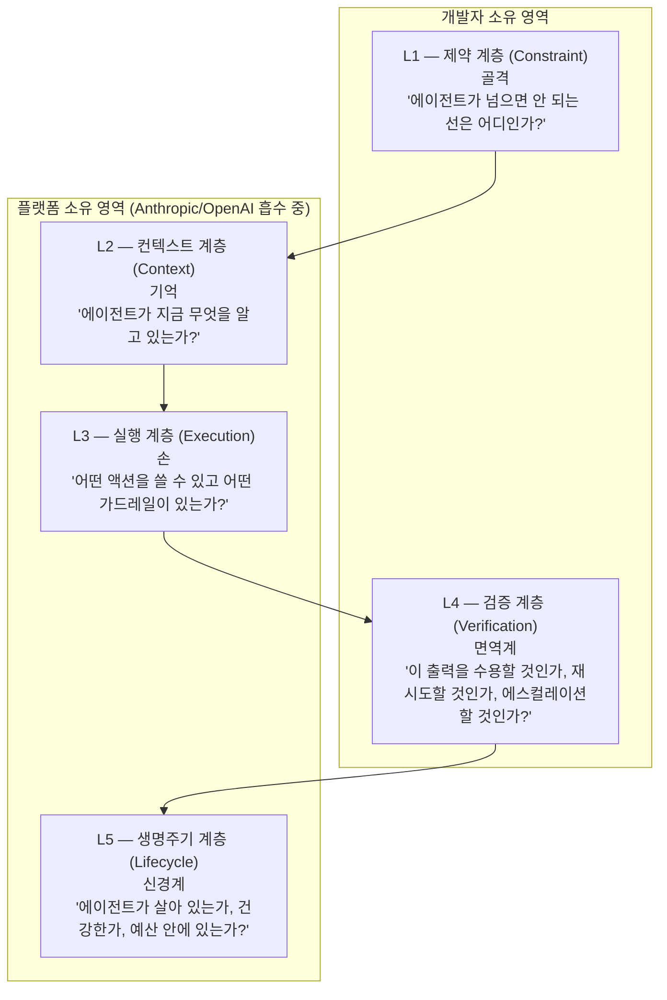

---

#### L1 — 제약 계층: 골격

제약 계층은 코드가 가질 수 있는 형태에 대한 구조적 규칙을 시행한다. 완전히 결정론적이다. LLM이 개입하지 않는다. 에이전트가 넘어서는 안 되는 경계가 무엇인지를 정의한다.

OpenAI 팀은 Codex 에이전트에 가장 많이 투자한 계층이 바로 이 L1이었다. 모듈 경계에서 데이터 형태를 파싱하고, 비즈니스 도메인 계층 간 의존성 방향을 고정하고, 모든 출력에 커스텀 린터와 구조적 테스트를 실행했다. 구조적 규칙을 위반하는 코드는 의미 평가가 시작되기 전에 거부됐다.

구체적인 L1 구성요소로는 커스텀 린터 규칙(ESLint, Biome, Clippy), 의존성 방향과 모듈 경계를 시행하는 ArchUnit 같은 구조적 테스트 프레임워크, 네이밍 컨벤션 적용, 파일 구조 검증, API 계약 검증 등이 있다.

이 계층은 대부분의 팀이 건너뛰는 계층이다. 동시에 기본 컨텍스트와 검증이 이미 갖춰진 팀에게 가장 높은 레버리지를 제공하는 계층이기도 하다. 결정론적 제약은 실행 비용이 저렴하고, 잘 설계되면 오탐(false positive)이 없으며, 토큰을 단 하나도 쓰지 않고 실패 범주 전체를 차단한다.

#### L2 — 컨텍스트 계층: 기억

컨텍스트 계층은 실행의 각 단계에서 모델이 무엇을 볼 수 있는지를 제어한다. 에이전트가 지금 무엇을 알고 있으며, 그 지식이 어떻게 선택됐는가를 결정한다.

AGENTS.md, CLAUDE.md 같이 시스템 프롬프트에 주입되는 파일들, 단계적 공개를 위한 스킬(에이전트는 필요할 때만 특정 지침을 로드), 완료된 단계·블로커·다음 액션을 기록하는 진행 파일 패턴이 여기에 속한다.

ETH 취리히의 138개 에이전트파일 연구는 중요한 뉘앙스를 밝혔다. LLM이 생성한 에이전트파일은 토큰을 20% 이상 더 소비하면서 오히려 성능을 저하시켰다. 인간이 직접 작성하고 자주 업데이트되는 간결하고 범용적인 에이전트파일만이 도움이 됐다. 더 많은 것이 더 좋은 것이 아니다. 엄선되고 관련성 있는 것이 포괄적이고 오래된 것을 이긴다.

#### L3 — 실행 계층: 손

실행 계층은 에이전트가 무엇을 할 수 있고 어떻게 하는지를 관리한다. 도구 오케스트레이션, MCP 서버 구성, 서브에이전트 디스패치, 샌드박싱, 권한 모델이 여기에 산다.

직관에 어긋나는 통찰이 있다. 도구가 많을수록 결과가 나빠진다. Vercel이 자사 v0 코딩 에이전트를 만들 때 발견했다. 사용 가능한 도구의 80%를 제거하자 작업 완료율이 측정 가능하게 개선됐다. 도구 설명이 많을수록 시스템 프롬프트에서 토큰을 소비하고, 모델이 실제 작업을 하는 것보다 어떤 도구를 쓸지 추론하는 데 더 많은 토큰을 쓰게 된다.

#### L4 — 검증 계층: 면역계

검증 계층은 에이전트의 출력이 실세계에 도달하기 전에 올바르고 안전한지 확인한다. 이 출력을 수용할 것인가, 재시도할 것인가, 에스컬레이션할 것인가를 결정한다.

하네스 엔지니어링에서 단일 최고 임팩트 패턴이다. Boris Cherny(Claude Code 제작자)는 Claude에게 효과적인 검증 방법을 제공하면 최종 출력 품질이 2~3배 향상된다고 관찰했다.

핵심 설계 원칙은 성공은 조용하게, 실패는 시끄럽게(Silent on success, loud on failure)다. 통과하는 테스트 결과 4,000줄이 컨텍스트 창에 쏟아지면 에이전트가 실제 작업을 잃어버린다. 오직 오류만 표면에 올린다.

Hashimoto의 핵심 원리도 이 계층에 산다: 에이전트가 실수할 때마다 그 실수를 구조에 인코딩해서 영원히 반복하지 못하게 하라. 모든 새로운 검증 규칙은 영구적으로 인코딩된 배움이다.

#### L5 — 생명주기 계층: 신경계

생명주기 계층은 에이전트를 실행 중인 프로세스로 관리한다. 시작, 상태 모니터링, 정상 종료, 충돌 복구, 비용 추적, 인간 에스컬레이션이 여기에 속한다. 에이전트가 살아 있는지, 건강한지, 진행되고 있는지, 예산 안에 있는지를 답한다.

이 계층 없이는 에이전트가 비용이 많이 드는 모니터링되지 않는 프로세스가 된다. 무한 루프에서 에이전트가 같은 오류를 무한 반복하면 하룻밤에 수천 달러를 태운다.

---

## C. 계층 매핑

### Architect Loop의 각 요소는 하네스의 어느 계층인가

이제 Architect Loop를 5계층 프레임워크로 해부해보자. 이 매핑을 통해 Architect Loop가 임의로 설계된 워크플로가 아니라 하네스 엔지니어링의 원리를 구체화한 구현체임을 알 수 있다.

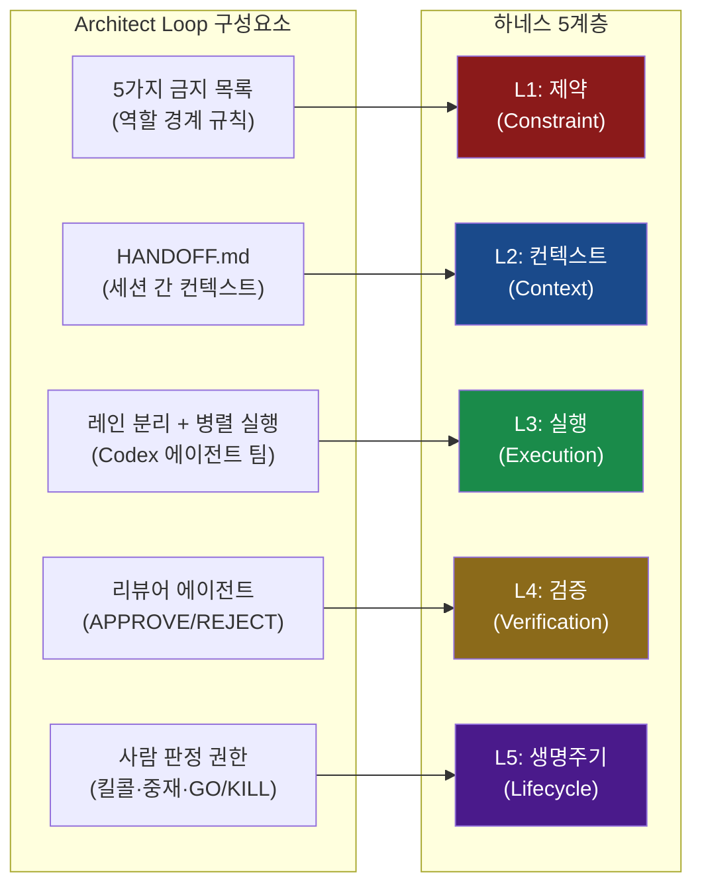

---

#### 5가지 금지 목록 → L1 제약 계층

Architect Loop의 5가지 금지 목록은 5계층 모델의 L1(제약 계층)을 **프롬프트 형태로 구현**한 것이다.

L1의 핵심은 "에이전트가 넘어서는 안 되는 선"을 결정론적으로 정의하는 것이다. 전통적인 L1은 커스텀 린터나 구조적 테스트 프레임워크 같은 코드 기반 도구로 구현된다. Architect Loop는 이것을 프롬프트 기반 행동 제약으로 구현했다.

| 금지 항목 | L1 하네스 등가물 | 제약 방식 |
|-----------|----------------|-----------|
| 아키텍트 구현 금지 | 역할 범위 린터 | 도구 접근 제한 |
| 빌더 자기 채점 금지 | 평가 파이프라인 분리 규칙 | 에이전트 분리 |
| 조용한 복종 금지 | 비판적 검토 의무화 규칙 | 출력 형식 강제 |
| 사후 기준 수정 금지 | 스키마 동결 + 불변 계약 | 파일 잠금 |
| 기록 밖 해석 금지 | HANDOFF 포맷 검증기 | 구조적 출력 강제 |

코드 기반 린터와 프롬프트 기반 제약의 차이는 있다. 코드 린터는 위반을 자동으로 차단하고, 프롬프트 제약은 에이전트가 규칙을 따르도록 유도하는 방식이다. 그러나 목적은 동일하다: 실패의 범주 전체를 사전에 봉쇄하는 것.

#### HANDOFF.md → L2 컨텍스트 계층

HANDOFF.md는 5계층 모델의 L2(컨텍스트 계층)를 구현한 파일이다. L2의 핵심 질문인 "에이전트가 지금 무엇을 알고 있는가"에 대한 Architect Loop의 답이다.

L2 연구에서 밝혀진 원칙들이 HANDOFF.md 설계에 그대로 반영되어 있다.

첫째, **간결성이 포괄성을 이긴다.** ETH 취리히 연구는 LLM이 생성한 장황한 에이전트파일이 오히려 성능을 낮춘다는 것을 보였다. HANDOFF.md의 "기록 밖 해석 금지" 규칙이 이것을 구현한다. 표와 숫자만 기록하고, 해석적 표현은 배제한다.

둘째, **신선한 상태 유지가 중요하다.** L2 파일이 오래되면 에이전트가 잘못된 정보를 바탕으로 추론한다. HANDOFF.md는 빌더가 세션을 마칠 때마다 갱신하는 규칙이 있어 항상 최신 상태를 유지한다.

셋째, **진행 파일 패턴의 구현.** Anthropic이 문서화한 진행 파일 패턴(완료된 단계, 블로커, 다음 액션을 기록하는 구조적 스크래치패드)이 HANDOFF.md의 네 섹션과 정확히 일치한다: 만든 것, 결정 이유, 미해결 쟁점, 다음 조각.

#### 레인 분리 + 병렬 실행 → L3 실행 계층

Codex 에이전트의 레인 분리와 병렬 실행은 L3(실행 계층)의 핵심 패턴이다.

PHASE 1(공유 계약을 코드보다 먼저 동결)은 L3의 도구 스코핑 원칙과 일치한다. 실행 계획 단계에는 코드 작성 도구가 필요 없고, 코드 실행 단계에는 인터페이스 설계 도구가 필요 없다. 단계마다 필요한 도구 집합을 제한하는 것이 L3의 핵심이다.

Boris Cherny의 "컨텍스트 방화벽(context firewall)" 패턴이 Architect Loop의 레인 분리와 유사하다. 서브에이전트가 무거운 태스크를 캡슐화해서 중간 도구 호출이 부모 에이전트의 컨텍스트 창을 오염시키지 않도록 한다.

#### 리뷰어 에이전트(APPROVE/REJECT) → L4 검증 계층

리뷰어 에이전트는 L4(검증 계층)의 교과서적 구현이다.

L4의 핵심 설계 원칙인 "성공은 조용하게, 실패는 시끄럽게"가 Architect Loop에도 그대로 적용된다. 리뷰어가 APPROVE를 찍으면 작업이 아무 소음 없이 머지된다. REJECT가 나오면 그 이유가 명확하게 제시되고 에이전트가 재작업에 들어간다.

Hashimoto의 원칙 "에이전트가 실수할 때마다 그 실수를 구조에 인코딩하라"는 Architect Loop에서는 "사후 기준 수정 금지"와 "기록 밖 해석 금지" 규칙으로 구현된다. 합격 기준은 코드를 쓰기 전에 동결하고, 이후에는 변경하지 않는다.

#### 사람 판정 권한 → L5 생명주기 계층

시스템 한가운데의 사람(판정 권한)은 L5(생명주기 계층)를 담당한다.

L5는 에이전트가 살아 있는지, 건강한지, 진행되고 있는지, 예산 안에 있는지를 관리한다. Architect Loop에서 이 역할은 사람이 맡는다. 킬콜은 무한 루프에 빠진 에이전트를 중단시키는 L5의 회로 차단기다. 증거 검토와 GO/KILL 결정은 L5의 인간 에스컬레이션 패턴이다. STEP 4의 반복 루프 자체가 L5의 생명주기 관리다.

---

## D. 하네스 흡수 이후

### Anthropic과 OpenAI는 이미 세 계층을 흡수했다

5계층 모델에서 가장 중요한 최근 변화는 **플랫폼 제공자들이 인프라 계층을 흡수하고 있다**는 것이다.

Claude Code와 Claude Opus 4.8이 이미 세 계층의 핵심을 플랫폼 수준에서 제공한다.

**L3(실행):** Claude Code는 도구 오케스트레이션, MCP 프록시 라우팅, 서브에이전트 디스패치, 샌드박스 관리를 플랫폼 수준에서 제공한다. 개발자가 이 인프라를 직접 구축할 필요가 없다.

**L4(검증)의 일부:** Opus 4.8의 "정직성" 개선(코드 결함을 4배 적게 그냥 넘기는 수준)과 검증 훅 지원이 L4의 일부를 플랫폼 수준으로 들어올렸다.

**L5(생명주기)의 일부:** 세션 내구성, 컨텍스트 컴팩션, 충돌 복구, 비용 추적이 Claude Code 플랫폼 수준에서 관리된다.

**그러나 두 계층은 플랫폼이 소유할 수 없다.** L1과 L2는 도메인 지식에 의존하기 때문에 Anthropic이 볼 수 없는 것들이다.

L1(제약)은 당신의 아키텍처 경계, 당신의 모듈 의존성 규칙, 당신의 도메인 특화 린팅 규칙이다. 이것은 팀마다, 프로젝트마다 다르다.

L2(컨텍스트)는 당신의 데이터, 당신의 검색 전략, 당신의 메모리 설계, 당신의 도메인 지식이다. Anthropic은 이것을 직접 넣을 수 없다.

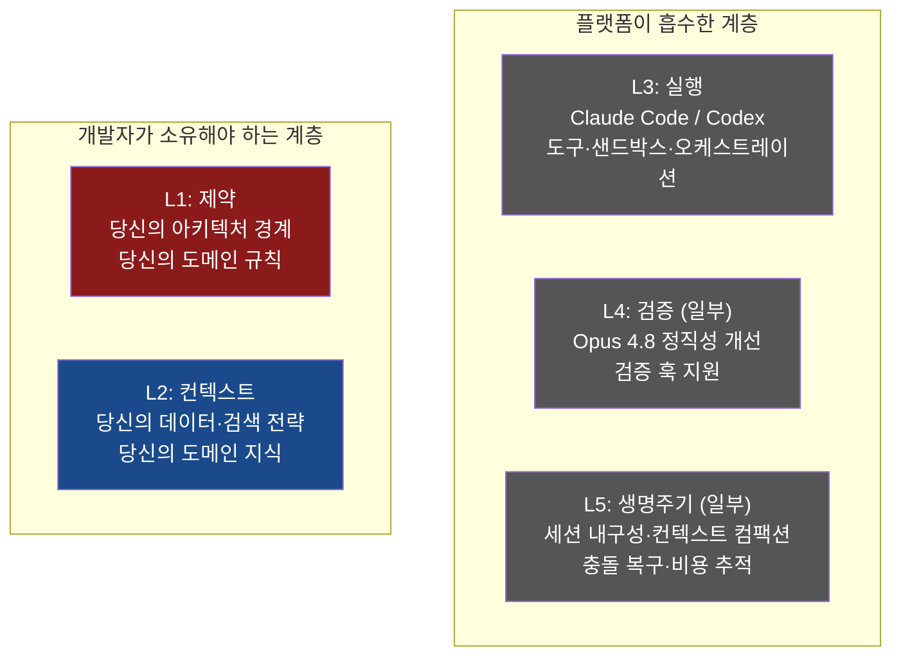

### Architect Loop는 개발자 소유 계층을 구현한 1인용 레시피

이 관점에서 Architect Loop를 다시 보면, 그것이 정확히 무엇인지가 명확해진다.

Architect Loop는 **플랫폼이 흡수한 L3/L4/L5를 인프라로 활용하면서, 개발자가 여전히 소유해야 하는 L1과 L2를 구현하는 1인용 레시피**다.

L1은 5가지 금지 목록으로 구현된다. 아키텍트 구현 금지, 빌더 자기 채점 금지, 조용한 복종 금지, 사후 기준 수정 금지, 기록 밖 해석 금지 — 이것들은 모두 에이전트 팀이 넘어서는 안 되는 구조적 경계다.

L2는 HANDOFF.md로 구현된다. 세션마다 최신 상태를 유지하고, 표와 숫자만 담으며, 아키텍트가 세션 시작 시 사람에게 묻지 않고 읽을 수 있는 컨텍스트 파일이다.

플랫폼이 처리하는 L3/L4/L5는 Claude Code와 Codex가 이미 제공하는 인프라다. 개발자는 이것을 재발명하지 않고 소비한다.

---

## E. 크로스 프로바이더 하네스

### Architect Loop가 전통적 하네스 엔지니어링과 다른 점

Architect Loop는 하네스 엔지니어링의 원리를 따르면서도, 전통적인 하네스 설계에서는 없는 독특한 구조를 갖고 있다.

**전통적 하네스 엔지니어링**은 단일 플랫폼 위에서 설계된다. Claude Code 하네스라면 Anthropic의 도구만 쓰고, Codex 하네스라면 OpenAI의 도구만 쓴다. 사용 모델, 검증 에이전트, 오케스트레이션 레이어가 모두 같은 벤더 안에 있다.

**Architect Loop는 크로스 프로바이더 하네스다.** Claude Fable 5(Anthropic)가 설계하고 GPT-5.5 Codex(OpenAI)가 구현하는 구조는 두 회사의 런타임을 단일 하네스 안에 통합한다. HANDOFF.md가 두 런타임 사이를 이어주는 공유 상태다.

이 구조가 갖는 독특한 이점이 있다.

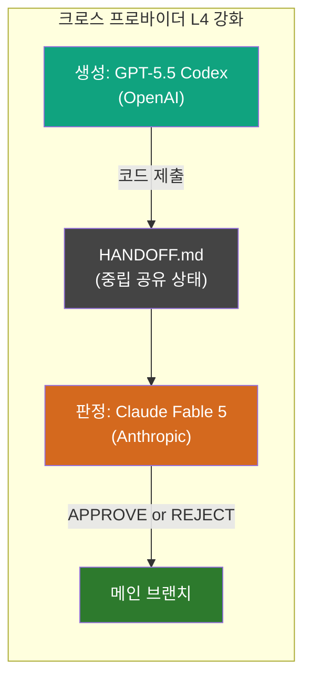

#### 크로스 프로바이더 구조가 L4를 강화하는 이유

일반적인 L4 구현에서 생성 모델과 평가 모델을 분리할 때, 두 모델이 같은 회사에서 나온 경우 미묘한 편향이 남을 수 있다. 같은 훈련 데이터, 같은 RLHF 방향성에서 나온 두 모델은 같은 유형의 실수를 공유할 가능성이 있다.

Architect Loop는 생성(GPT-5.5 Codex)과 평가(Claude Fable 5)를 완전히 다른 회사의 모델로 분리한다. 동일 훈련 분포에서 오는 공유 편향이 원리적으로 제거된다. 두 모델은 서로 다른 데이터, 다른 아키텍처, 다른 정렬 방향성에서 나왔기 때문이다.

이것은 자기 강화 편향을 완화하는 연구 권고를 **벤더 수준**으로 확장한 것이다.

#### 금지 목록이 L1의 혁신인 이유

전통적인 L1 구현은 코드 기반이다. 린터, ArchUnit 규칙, OpenAPI 스키마 검증. 이것들은 위반을 자동으로 차단하는 강력한 도구다.

Architect Loop의 금지 목록은 **프롬프트 기반 L1**이라는 다른 구현 방식을 보여준다. 코드 린터가 필요한 인프라 없이, 프롬프트 수준에서 역할 경계와 행동 규칙을 시행한다. 이것은 코드 기반 L1보다 덜 엄격하지만, 인프라 투자 없이 즉시 적용 가능하다는 실용적 장점이 있다.

이 두 방식은 대립하지 않는다. 코드 기반 L1(린터, 스키마 검증)을 갖추면서 프롬프트 기반 L1(금지 목록)을 병행하는 것이 가장 강력한 제약 계층이다.

---

## F. 비교 요약

### 하네스 엔지니어링 vs. Architect Loop: 관계 정리

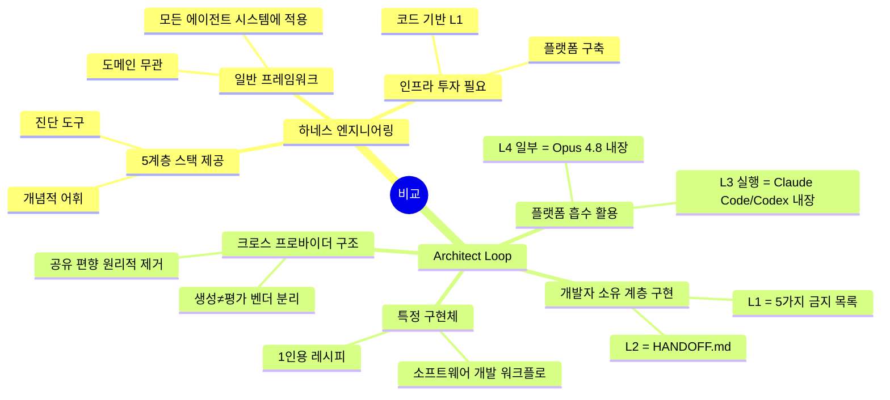

---

### 핵심 비교 표

| 비교 항목 | 하네스 엔지니어링 (일반 원칙) | Architect Loop (구체적 구현) |
|-----------|------------------------------|------------------------------|
| **적용 범위** | 모든 AI 에이전트 시스템 | 1인용 소프트웨어 개발 워크플로 |
| **추상화 수준** | 개념 프레임워크 + 진단 어휘 | 즉시 사용 가능한 레시피 |
| **L1 구현** | 린터, ArchUnit, 스키마 검증 | 프롬프트 기반 금지 목록 |
| **L2 구현** | AGENTS.md, 컨텍스트 파이프라인, RAG | HANDOFF.md 단일 파일 |
| **L3 구현** | 직접 구축 or 플랫폼 위임 | Claude Code + Codex 내장 실행 레이어 활용 |
| **L4 구현** | 검증 훅, 자동화 테스트, 리뷰어 에이전트 | 크로스 프로바이더 리뷰어 (생성≠평가 벤더) |
| **L5 구현** | 라이프사이클 미들웨어, 비용 대시보드 | 사람의 판정 권한 (킬콜·GO/KILL) |
| **벤더 구조** | 단일 벤더 가정 | 크로스 프로바이더 (Anthropic + OpenAI) |
| **진입 장벽** | 코드 기반 인프라 필요 | HANDOFF.md 파일 하나로 시작 가능 |
| **인프라 흡수** | 명시적으로 다루지 않음 | 플랫폼 흡수 계층을 의식적으로 활용 |

---

### 두 개념의 상호 보완 관계

하네스 엔지니어링과 Architect Loop는 경쟁 관계가 아니다. 추상화 수준이 다른 상호 보완적 도구다.

하네스 엔지니어링은 **진단 언어**를 제공한다. "우리 시스템이 왜 프로덕션에서 실패하는가"를 5계층으로 분해해서 어느 계층이 빠져 있는지 정확하게 짚어낼 수 있다. "우리는 L4는 있는데 L1이 없다"는 진단이 가능해진다.

Architect Loop는 그 진단 언어로 처방하면 **즉시 실행 가능한 레시피**다. 특히 인프라 투자가 어려운 1인 개발자나 소규모 팀에게, 코드 기반 L1 없이도 프롬프트 기반 제약으로 하네스를 구성하는 방법을 보여준다.

하네스 엔지니어링 프레임워크를 배우면 Architect Loop가 왜 이렇게 설계됐는지 이해할 수 있고, Architect Loop를 쓰다 보면 자연스럽게 하네스 엔지니어링의 원리를 체화하게 된다.

---

### 별첨 참고 자료

**하네스 엔지니어링 개념 및 역사**

- Mitchell Hashimoto, *My AI Adoption Journey* (February 2026) — "에이전트가 실수하면 환경을 고쳐라" 원칙 → https://mitchellh.com/writing/my-ai-adoption-journey
- Ryan Lopopolo (OpenAI), *Harness Engineering: Leveraging Codex in an Agent-First World* (February 2026) — 1백만 줄 코드 사례 → https://openai.com/blog/...
- Birgitta Böckeler (Thoughtworks), *Harness Engineering* at Martin Fowler's site → https://martinfowler.com/articles/harness-engineering.html

**5계층 스택 모델**

- han.heloir, *Anthropic's Managed Agents Handle Three Harness Layers. The Two They Can't Build Are Yours.* → https://cozypet.github.io/five-layers-harness/v2.html
- Adnan Masood PhD, *Agent Harness Engineering — The Rise of the AI Control Plane* (April 2026) → https://medium.com/@adnanmasood/agent-harness-engineering-the-rise-of-the-ai-control-plane-938ead884b1d
- Faros.ai, *Harness Engineering: Making AI Coding Agents Work in 2026* → https://www.faros.ai/blog/harness-engineering

**하네스 흡수 및 플랫폼 분석**

- cozypet.github.io, *What Anthropic Didn't Say About Opus 4.8: It's Anthropic Absorbing Your Harness* → https://cozypet.github.io/opus-4-8-absorbing-your-harness/

---

*별첨 작성 기준일: 2026년 6월 12일*
*Claude Sonnet 4.6 + 웹 검색 기반으로 최신 정보를 확인하여 작성*

---

---

# 별첨 2: The Architect Loop vs. Loop Engineering

> **"Architect Loop는 판정 권한을 인간이 쥔 루프고, Loop Engineering은 그 판정 권한마저 루프에 위임한다"**

---

## 목차 (별첨 2)

- G. [Loop Engineering의 탄생: 2026년 6월의 트윗 하나](#g-loop-engineering의-탄생)
- H. [패러다임 사다리: Prompt → Context → Harness → Loop](#h-패러다임-사다리)
- I. [Loop Engineering의 핵심 구성요소](#i-핵심-구성요소)
- J. [The Architect Loop vs. Loop Engineering: 구조적 비교](#j-구조적-비교)
- K. [두 접근법이 만나는 지점: 공통 원칙](#k-공통-원칙)
- L. [무엇을 선택할 것인가: 적용 기준](#l-적용-기준)

---

## G. Loop Engineering의 탄생

### 트윗 두 문장이 6.5백만 뷰를 기록한 이유

2026년 6월 8일 오전 12시 28분, OpenClaw 제작자이자 현 OpenAI 소속 개발자 Peter Steinberger(@steipete)가 X에 두 문장을 올렸다.

> **"Here's your monthly reminder that you shouldn't be prompting coding agents anymore.**
>
> **You should be designing loops that prompt your agents."**

다이어그램도, 레포 링크도 없었다. 두 문장뿐이었다. 그런데 6.5백만 뷰를 기록했고, AI 코딩 타임라인이 일주일간 여섯 단어를 두고 논쟁했다.

Matthew Berman의 첫 댓글이 그 분위기를 포착했다: *"nobody knows but him and boris."* 그 '보리스'는 Claude Code를 만든 Anthropic의 Boris Cherny였다.

Cherny는 4일 전인 6월 2일에 이미 WorkOS Acquired Unplugged 행사에서 이 개념을 공개적으로 언급했다.

> **"Now it's actually leveled up, I think, again, to the next wave of abstraction where I don't prompt Claude anymore. I have loops that are running. They're the ones that are prompting Claude and figuring out what to do. My job is to write loops."**
> — Boris Cherny (Claude Code 제작자), 2026년 6월 2일

그 다음날 Google 엔지니어 Addy Osmani가 이 개념을 "Loop Engineering"이라는 이름으로 정리하는 블로그 포스트를 올렸다.

> **"Loop engineering is replacing 'yourself' who types prompts into an agent. It is designing a mechanism that does that for you instead."**
> — Addy Osmani (Google)

이것이 Loop Engineering이다. 목표를 한 번 정하면 AI가 스스로 완료될 때까지 루프를 돌린다.

### Boris Cherny가 말한 세 단계

Cherny는 자신의 작업 방식이 어떻게 진화했는지를 세 단계로 설명했다.

| 단계 | 무엇을 했는가 | 사람의 역할 |
|------|-------------|------------|
| 1단계: 자동완성 | 코드를 직접 손으로 쓰며 AI 제안을 받음 | 타이피스트 |
| 2단계: 병렬 세션 | 5~10개 Claude 세션을 열고 각각에 프롬프트 입력 | 프롬프트 오퍼레이터 |
| 3단계: 루프 | 루프를 작성, 루프가 Claude에게 지시 | **루프 설계자** |

3단계에서 사람은 루프 안에서 타이핑하는 존재에서 **루프를 설계하는 존재**로 올라간다. 모델은 루프의 서브루틴이 된다.

---

## H. 패러다임 사다리

### 프롬프트 엔지니어링에서 루프 엔지니어링까지

Loop Engineering은 갑자기 하늘에서 떨어진 개념이 아니다. AI 엔지니어링의 추상화 단계가 한 층씩 올라온 결과다.

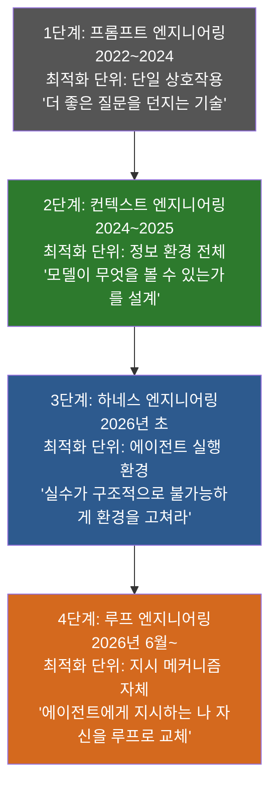

각 단계는 이전 단계를 포함한다. 루프 엔지니어링은 컨텍스트 엔지니어링과 하네스 엔지니어링을 전제로 하면서, 그 위에 **자율 실행 메커니즘 설계**라는 새 층을 얹는다.

### 이전 루프 패턴의 족보

루프 엔지니어링이 처음은 아니다. 유사한 패턴의 계보가 있다.

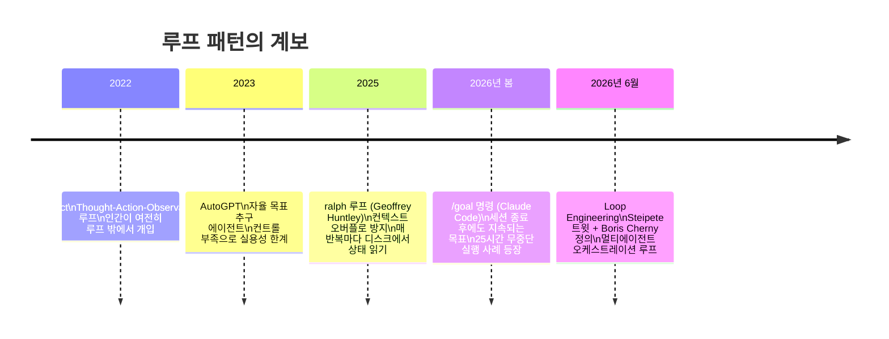

---

## I. 핵심 구성요소

### Loop Engineering을 구성하는 네 가지 부품

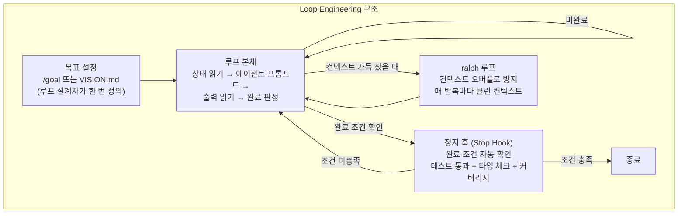

#### 목표 설정: /goal과 VISION.md

Loop Engineering에서 가장 먼저 하는 일은 목표를 명시적으로 정의하는 것이다. Claude Code의 `/goal` 명령은 세션이 끊겨도 살아남는 지속 목표를 설정한다. 사용자가 자리를 떠나도 에이전트는 그 목표를 향해 계속 실행된다.

Steinberger는 프로젝트 수준에서 **VISION.md** 파일을 사용한다. 에이전트가 무엇을 향해 나아가야 하는지를 담는 최상위 앵커 문서다. AGENTS.md가 규칙을 담는다면, VISION.md는 방향을 담는다.

단 하나의 경고가 있다. 목표가 추상적일수록 루프는 비싸고 예측 불가능해진다. 루프 설계의 절반은 목표를 정밀하게 서술하는 것이다.

#### 정지 훅 (Stop Hook)

가장 중요한 구성요소다. 에이전트는 작업이 "주관적으로" 완료됐다고 판단할 때 종료하려 한다. 정지 훅이 그 종료 시도를 가로채서 실제 완료 조건을 확인한다.

실제로 사용되는 정지 훅 체크리스트의 예시: 테스트 전체 통과 여부, TypeScript 타입 체크 클린 여부, 코드 커버리지 임계값 이상 여부. 이 중 하나라도 실패하면 훅이 태스크 프롬프트를 재주입하고 루프를 다시 돌린다.

이것이 핵심 원칙을 구현하는 방식이다. 스레드에서 가장 날카로운 댓글을 남긴 사람(mosyaseen)의 말을 빌리면:

> **"designing the loop is half of it. the other half is putting something in the loop that can say no: a test, a type check, a real error. a loop with nothing to push back is the agent agreeing with itself on repeat."**

루프 설계가 반이고, 루프 안에 "아니오"라고 말할 수 있는 무언가를 넣는 것이 나머지 반이다. 아무것도 반박하지 않는 루프는 에이전트가 반복해서 자신에게 동의하는 것이다.

#### ralph 루프 (Context Overflow 방지)

2025년 7월 Geoffrey Huntley가 만든 패턴이다. 긴 세션이 진행될수록 컨텍스트 창이 차고, 에이전트가 원래 목표를 잃어버린다. ralph 루프는 이것을 방지한다. 매 반복마다 컨텍스트를 초기화하고, 현재 상태를 디스크(파일)에서 새로 읽어온다. 과거 대화를 이어가는 것이 아니라, 디스크에 기록된 상태를 읽고 다시 시작하는 방식이다.

Anthropic이 문서화한 Ralph Loop 복구 패턴은 에이전트가 컨텍스트 불안(Context Anxiety)으로 인해 태스크를 조기에 끝내려 할 때 원래 의도를 클린한 컨텍스트 창에 재주입하는 것이다.

---

## J. 구조적 비교

### The Architect Loop vs. Loop Engineering: 무엇이 다른가

두 접근법을 나란히 두면 차이가 선명하게 드러난다.

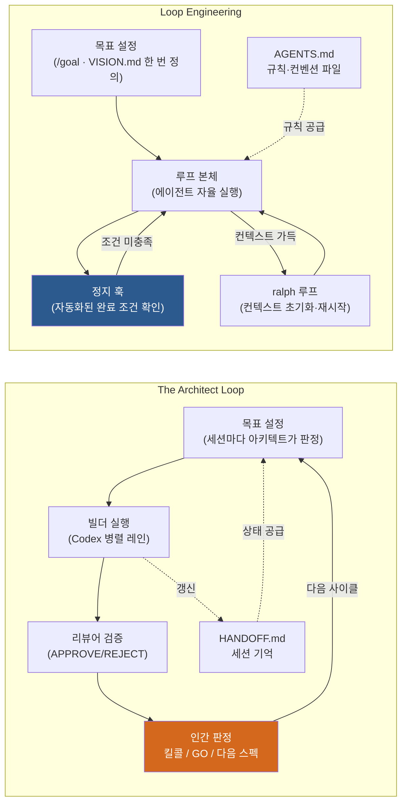

**The Architect Loop에서는 인간이 루프 안에 있다.** 모든 사이클마다 사람이 개입한다. 아키텍트가 판정하고, 사람이 킬/고를 결정한다.

**Loop Engineering에서는 인간이 루프 밖에 있다.** 루프를 설계하고 목표를 정의한 뒤 자리를 뜬다. 루프와 정지 훅이 자동으로 완료 판정을 내린다.

---

### 다섯 가지 핵심 차원 비교

#### 차원 1: 인간의 위치

The Architect Loop에서 인간은 **루프의 심장부**다. 모든 사이클의 중심에 "당신 · 판정 권한"이 있다. 4.5시간마다 30분씩 개입한다. 사람 없이는 루프가 다음 사이클로 넘어가지 않는다.

Loop Engineering에서 인간은 **루프의 설계자**다. 루프를 작성하고 목표를 정의한 뒤, 루프가 스스로 돌아가는 동안 다른 일을 한다. 25시간 무중단 실행 사례처럼, 사람이 자는 동안에도 에이전트가 작업한다.

#### 차원 2: 자율성 수준

The Architect Loop는 **제한된 자율성**을 설계 원칙으로 삼는다. 에이전트는 세션 단위로 작업하고, 세션이 끝나면 사람의 판정을 기다린다. 범위 이탈, 골대 옮기기, 방향 오류는 인간이 킬콜로 중단시킨다.

Loop Engineering은 **최대 자율성**을 목표로 한다. 목표와 정지 조건이 명확하게 정의되어 있으면, 에이전트는 그것이 충족될 때까지 스스로 반복한다. 인간 개입 없이 수십 시간이 흐를 수 있다.

#### 차원 3: 정지 메커니즘

The Architect Loop의 정지 메커니즘은 **인간의 킬콜**이다. 방향이 잘못됐거나 범위를 벗어났다는 판단이 서는 순간, 사람이 작업을 중단시킨다. 이것은 매우 강력하지만, 사람이 루프를 지켜봐야 한다는 조건이 붙는다.

Loop Engineering의 정지 메커니즘은 **자동화된 정지 훅**이다. 테스트 통과, 타입 체크 클린, 커버리지 임계값 같은 조건이 충족될 때 자동으로 루프가 멈춘다. 사람이 없어도 된다.

#### 차원 4: 기억 구조

The Architect Loop는 **HANDOFF.md**를 쓴다. 세션마다 빌더가 갱신하고, 아키텍트가 읽는다. 사람이 개입하는 시점에 가장 최신 상태를 제공하는 데 최적화되어 있다. 형식은 표와 숫자만 허용한다.

Loop Engineering은 **AGENTS.md + VISION.md + ralph 루프**를 쓴다. VISION.md는 최상위 방향을 담고, AGENTS.md는 규칙을 담는다. ralph 루프는 매 반복마다 디스크에서 상태를 읽어온다. 장시간 자율 실행에 최적화되어 있다.

#### 차원 5: 검증 주체

The Architect Loop는 **크로스 프로바이더 리뷰어**가 검증한다. 생성(Codex)과 평가(Claude Fable 5)가 다른 회사 모델이기 때문에 공유 편향이 원리적으로 제거된다. 리뷰어가 APPROVE를 찍기 전에는 아무것도 머지되지 않는다.

Loop Engineering은 **자동화된 정지 훅**이 검증한다. 모델 분리 없이 테스트 자동화와 정적 분석 도구가 검증을 담당한다. "성공은 조용하게, 실패는 시끄럽게" 원칙으로 컨텍스트 오염을 방지한다.

---

### 비교 요약 표

| 비교 차원 | The Architect Loop | Loop Engineering |
|-----------|-------------------|-----------------|
| **인간의 위치** | 루프 심장부 (판정 권한자) | 루프 설계자 (루프 밖) |
| **자율성 수준** | 제한적 (세션 단위 인간 판정) | 최대 (목표 달성까지 자율 실행) |
| **운영 시간** | 간헐적 (4.5시간당 30분) | 연속적 (수시간~수십 시간) |
| **정지 메커니즘** | 인간 킬콜 | 자동화된 정지 훅 |
| **기억 구조** | HANDOFF.md (세션 간 인수인계) | AGENTS.md + VISION.md + ralph 루프 |
| **검증 주체** | 크로스 프로바이더 리뷰어 에이전트 | 자동화 테스트 + 정지 훅 |
| **모델 구성** | 두 회사 (Anthropic + OpenAI) | 단일 플랫폼 (주로 Claude Code) |
| **오류 발생 시** | 인간이 감지 + 킬콜 | 정지 훅이 가로채거나 루프 비용 증가 |
| **진입 장벽** | HANDOFF.md 파일 하나 | 정지 훅·/goal·ralph 구성 필요 |
| **적합한 작업 유형** | 판단 집약적 (아키텍처·설계 결정 多) | 반복 가능·검증 가능한 작업 (테스트로 완료 판정 가능) |

---

## K. 공통 원칙

### 두 접근법이 만나는 세 가지 지점

겉보기에는 다른 방향을 가리키는 것처럼 보이지만, 두 접근법은 같은 원칙에서 출발한다.

**공통 원칙 1: 프롬프트 타이핑의 종말**

The Architect Loop는 아키텍트에게 "구현 코드를 쓰지 말라"고 명령한다. Loop Engineering은 한발 더 나아가 "프롬프트도 직접 타이핑하지 말라"고 한다. 둘 다 사람의 시간을 가장 낮은 레벨의 반복 작업에서 해방시키려 한다.

**공통 원칙 2: 반박 없는 루프는 실패다**

Loop Engineering 트윗 스레드의 가장 예리한 댓글: "a loop with nothing to push back is the agent agreeing with itself on repeat." Architect Loop의 5가지 금지 중 하나: "조용한 복종 금지." 표현은 다르지만 같은 원칙이다. 에이전트는 아무것도 반박하지 않으면 오류를 증폭시킨다.

**공통 원칙 3: 기억은 파일이다**

두 접근법 모두 세션 간 기억을 파일로 구현한다. The Architect Loop는 HANDOFF.md, Loop Engineering은 AGENTS.md + VISION.md + ralph 루프의 디스크 상태. 모델이 기억하는 것에 의존하지 않고, 파일이 기억한다.

---

## L. 적용 기준

### 어떤 상황에서 무엇을 선택하는가

두 접근법은 경쟁 관계가 아니다. 상황에 따라 적합한 도구가 다르다.

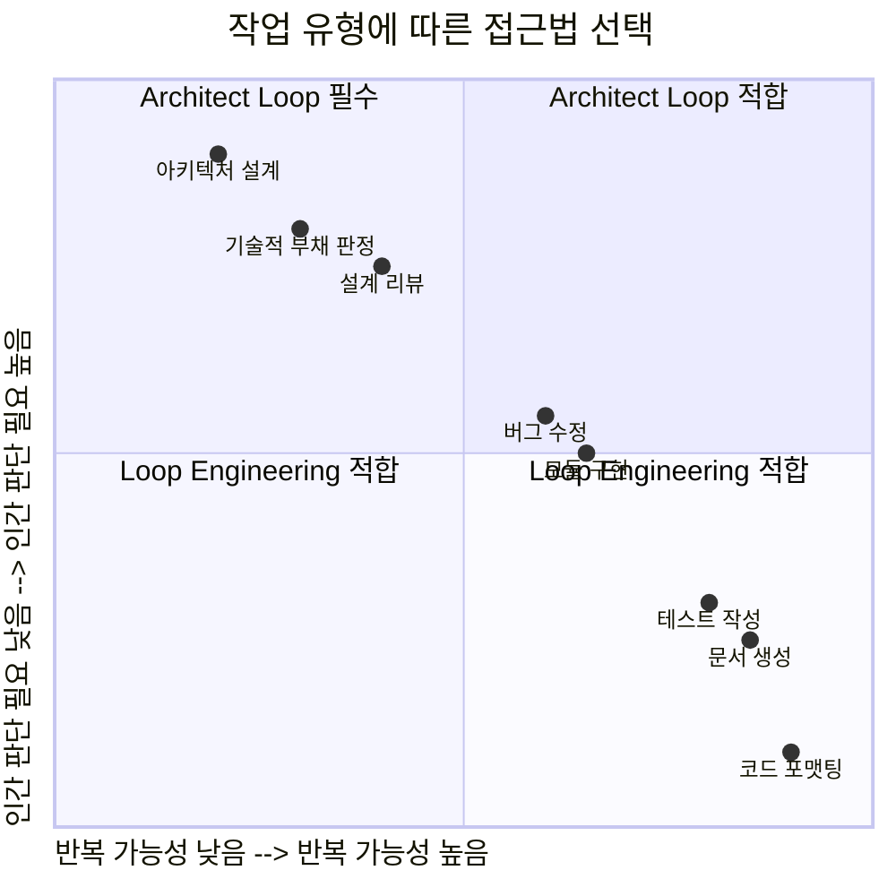

**Loop Engineering이 적합한 상황:**
테스트 자동화로 완료 판정이 가능한 작업, 반복 가능한 단위 작업(문서 생성, 코드 포맷팅, 표준화된 모듈 구현), 인간이 자리를 비워도 되는 낮은 위험도 작업, 정지 훅을 신뢰할 수 있을 만큼 검증 기준이 명확한 경우.

**The Architect Loop가 적합한 상황:**
아키텍처 방향 결정처럼 테스트로 측정하기 어려운 판단이 많은 작업, 범위 이탈 위험이 높거나 설계 오류가 비싼 작업, 두 AI 모델의 강점 차이를 활용하고 싶을 때, 정지 훅과 자동화 검증 인프라가 아직 갖춰지지 않은 초기 단계.

**둘을 결합하는 방법:**

가장 현실적인 활용 방향은 두 접근법을 계층화하는 것이다. The Architect Loop로 고수준 방향을 잡고(매 사이클 인간 판정), 각 사이클 내부에서는 Loop Engineering으로 반복 구현을 자동화한다. 사람은 사이클 간 판정에만 등장하고, 사이클 내부는 루프가 자율적으로 돌아간다.

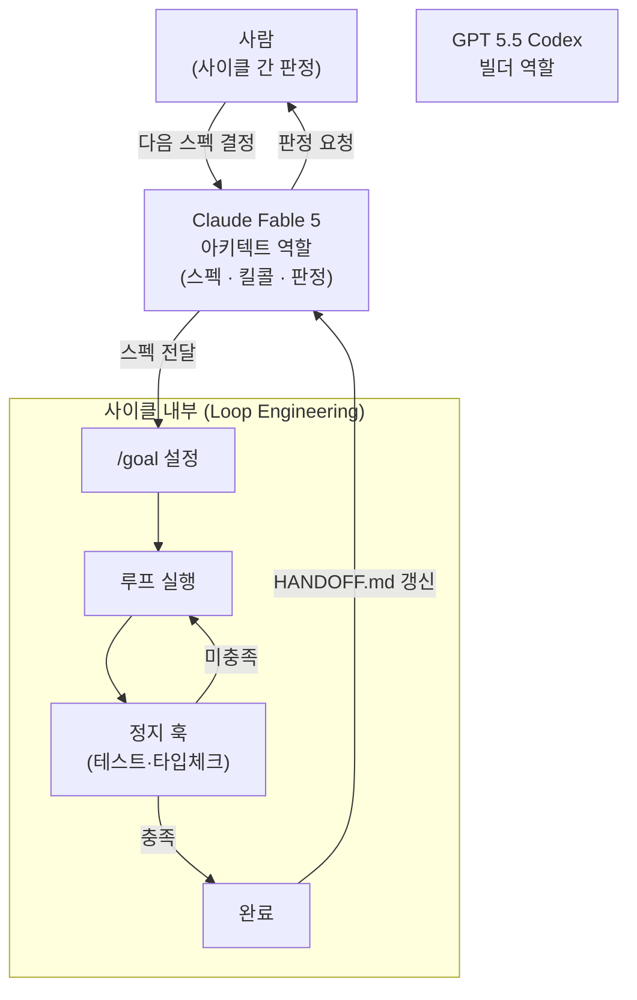

이 결합 구조에서 Loop Engineering은 The Architect Loop의 L3(실행 계층) 안으로 들어간다. 빌더가 하나의 프롬프트에 응답하는 대신, 빌더 자체가 루프로 동작한다. 사람은 더 올라간 수준에서만 개입한다.

---

### 관계의 본질: 같은 방향, 다른 속도

두 접근법의 관계를 한 문장으로 정리하면 이렇다.

> **The Architect Loop는 인간이 판정 권한을 쥔 루프이고, Loop Engineering은 그 판정 권한마저 자동화 메커니즘에 위임한 루프다.**

어느 쪽이 더 낫냐는 질문은 틀린 질문이다. 더 정확한 질문은 "이 작업에서 판정 권한을 인간이 쥐어야 하는가, 자동화 메커니즘에 위임할 수 있는가"다.

정지 훅이 신뢰할 수 있을 만큼 완료 조건이 명확하면 Loop Engineering이 효율적이다. 아직 완료 조건을 자동화하기 어렵고, 방향 판단에 인간의 맥락이 필요하다면 The Architect Loop가 더 안전하다.

그리고 이 두 접근법은 하네스 엔지니어링의 다른 면이다. 하네스가 L5(생명주기)를 자동화할 만큼 성숙해지면 The Architect Loop는 Loop Engineering으로 진화할 수 있다. L5의 인간 판정을 정지 훅과 /goal이 점진적으로 대체하면서.

---

### 별첨 2 참고 자료

**Loop Engineering 개념 및 탄생**

- Peter Steinberger (@steipete), X 포스트 (June 8, 2026) — "You should be designing loops that prompt your agents"
- Boris Cherny, WorkOS Acquired Unplugged 인터뷰 (June 2, 2026) — "My job is to write loops" → https://www.youtube.com/watch?v=RkQQ7WEor7w
- Addy Osmani (Google), *Loop Engineering* 블로그 포스트 (June 2026)

**Loop Engineering 기술 상세**

- explainx.ai, *Loop Engineering: How to Design Coding Agent Loops That Run While You Sleep* (June 9, 2026) → https://explainx.ai/blog/loop-engineering-coding-agents-claude-code-guide-2026
- Data Science Dojo, *Agentic Loops: From ReAct to Loop Engineering (2026 Guide)* → https://datasciencedojo.com/blog/agentic-loops-explained-from-react-to-loop-engineering-2026-guide/
- AI-Driven Lab (note.com), *"프롬프트를 직접 타이핑하는 것은 이미 구식?" Loop Engineering 해설* (June 9, 2026) → https://note.com/ai_driven/n/n92a92ea7012f

**패러다임 비교**

- Faros.ai, *Harness Engineering: Making AI Coding Agents Work in 2026* (3단계 패러다임 정리) → https://www.faros.ai/blog/harness-engineering

---

*별첨 2 작성 기준일: 2026년 6월 12일*
*Claude Sonnet 4.6 + 웹 검색 기반으로 최신 정보를 확인하여 작성*

---

---

# 별첨 3: Architect Loop는 하네스 엔지니어링에 가까운가, Loop Engineering에 가까운가?

> **결론부터: 하네스 엔지니어링에 훨씬 가깝다. 이름에 "Loop"가 들어 있어 헷갈리지만, 설계 철학의 핵심은 하네스다.**

---

## 갈림길: 판단의 자동화 여부

두 개념을 가르는 결정적 기준은 하나다. **"완료 판정을 인간이 내리는가, 자동화 메커니즘이 내리는가."**

Loop Engineering의 본질은 "에이전트에게 지시하는 나 자신을 루프로 교체하는 것"이다. 인간이 루프 **밖으로** 나가고, 정지 훅과 `/goal`이 완료 판정을 자동으로 내린다. 사람은 루프를 설계한 뒤 자리를 뜬다.

Architect Loop는 정반대다. 루프의 정중앙에 **"당신 · 판정 권한"** 이 있고, 모든 사이클마다 인간이 킬/고를 결정한다. 판단은 자동화되지 않는다.

---

## Architect Loop의 구성요소는 모두 하네스 패턴이다

각 요소를 5계층 하네스 스택에 대입해보면 하네스 엔지니어링 패턴 그 자체다.

| Architect Loop 구성요소 | 하네스 계층 | 역할 |
|------------------------|------------|------|
| 5가지 금지 목록 | L1 제약 계층 | 에이전트가 넘으면 안 되는 선 |
| HANDOFF.md | L2 컨텍스트 계층 | 에이전트가 지금 무엇을 아는가 |
| 레인 분리 + 병렬 실행 | L3 실행 계층 | 도구 스코핑과 오케스트레이션 |
| 리뷰어 에이전트 | L4 검증 계층 | 생성과 평가를 분리 |
| 인간 킬콜 · 판정 권한 | L5 생명주기 계층 | 인간이 직접 소유 |

"루프"라는 이름은 반복하는 **워크플로 구조**를 가리키는 것이지, Loop Engineering이 말하는 **자율 실행 메커니즘**을 가리키는 게 아니다. 사이클이 있지만 그 사이클은 인간 판정 없이 다음 단계로 넘어가지 않는다.

---

## 진화 방향으로 보는 관계

세 개념의 관계를 진화 방향으로 표현하면 이렇다.

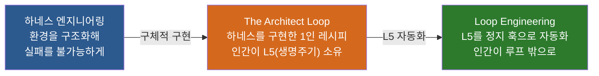

Architect Loop는 하네스 엔지니어링의 원리를 1인용 워크플로로 구현한 것이다. 이것이 충분히 성숙해서 인간의 킬콜을 정지 훅으로 대체할 수 있게 되면, 자연스럽게 Loop Engineering으로 진화하는 구조다.

현재 상태의 Architect Loop를 한 줄로 정의하면: **"인간이 L5(생명주기)를 직접 쥔 하네스 구현체."**

---

*별첨 3 작성 기준일: 2026년 6월 12일*
