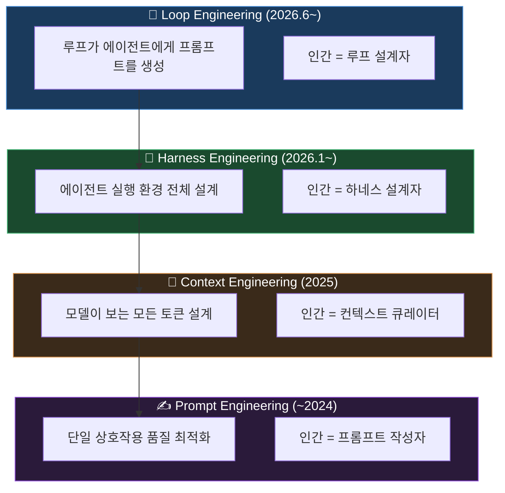
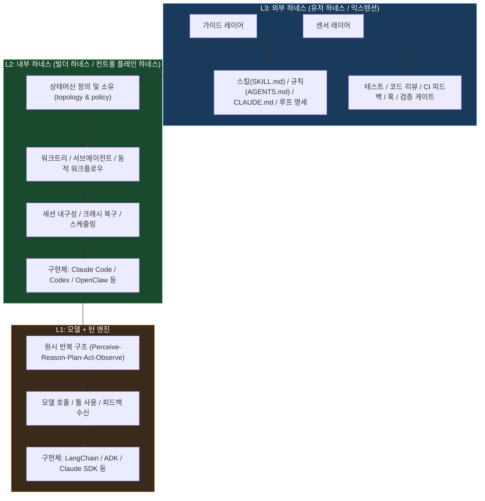
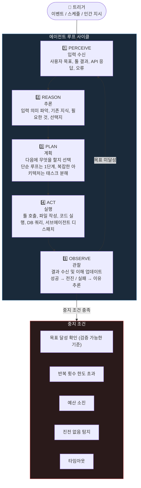
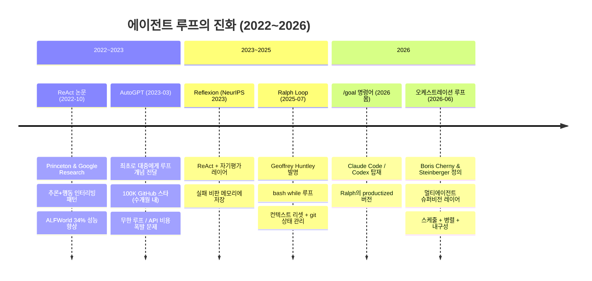
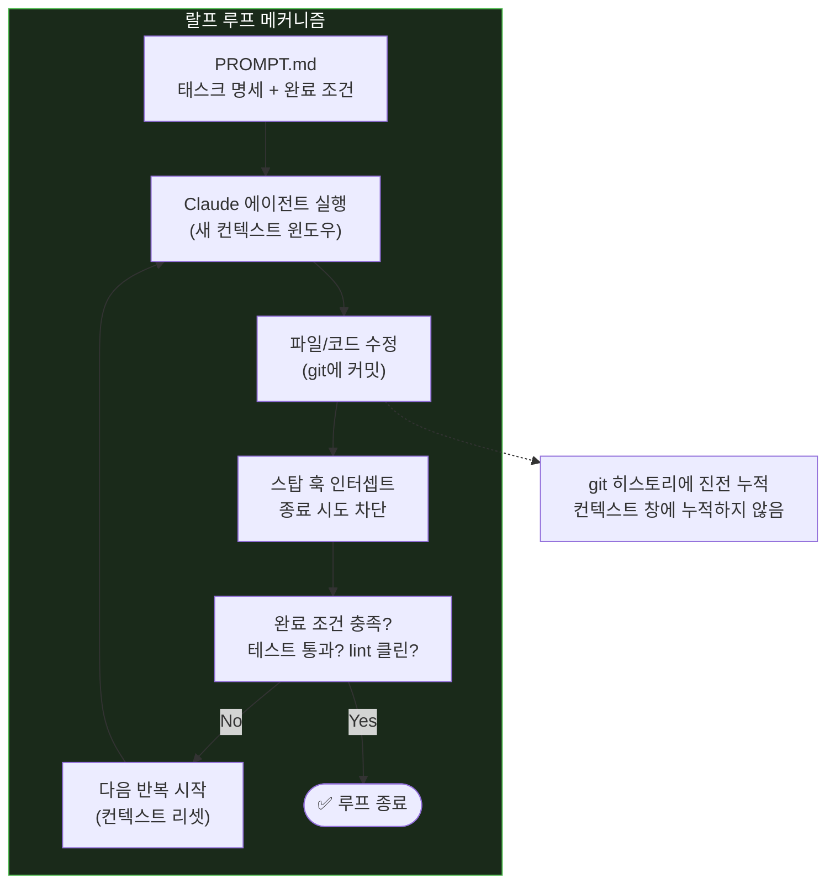
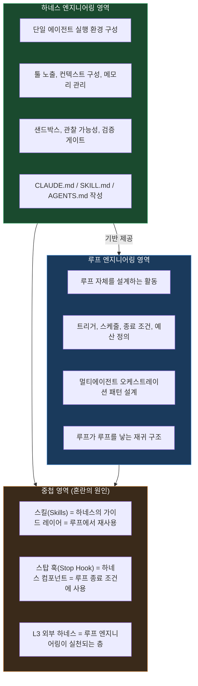
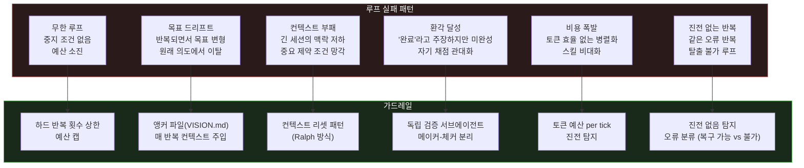
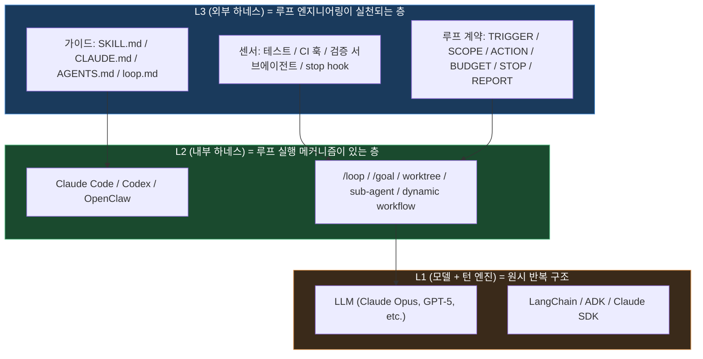
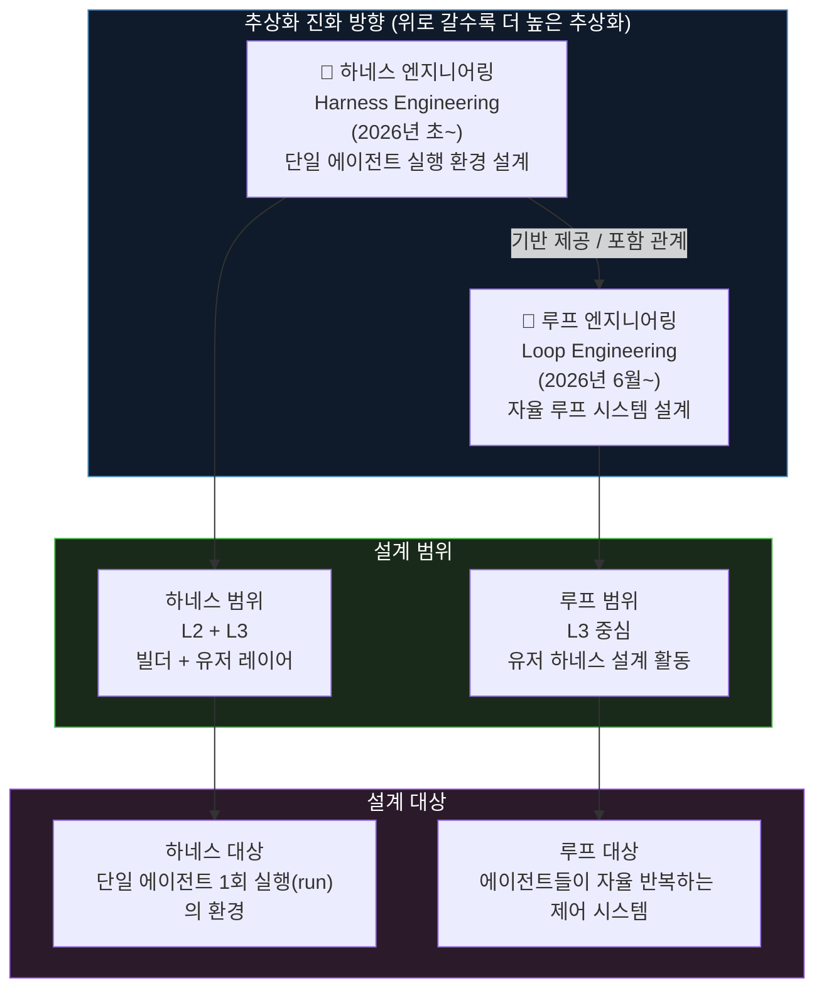

## 하네스 이후의 다음 추상화 레이어, 그리고 에이전트 3레이어 모델로 이해하는 진짜 개념 정리

> **작성 기준일**: 2026-06-12  
> **핵심 출처**: Boris Cherny (Anthropic, Claude Code 창시자), Peter Steinberger (OpenClaw 창시자), Addy Osmani (Google Chrome 엔지니어링 디렉터), Geoffrey Huntley (Ralph Loop 창시자)

## 관련글 

[**“이것도 하네스요 저것도 하네스며 루프는 사실 하네스고 하네스도 사실 루프입니다” 같은 도 닦는 소리만 나와서 혼란스러웠을 사람들을 위한 개념 정리**](https://www.threads.com/@bin.sohn/post/DZdx1rFmVhz)

---

## 목차

1. [서론: 6월의 폭발적 논쟁](#1-서론)
2. [발원 경위: 두 개의 발언이 쏘아올린 공](#2-발원-경위)
3. [추상화 사다리: 프롬프트 → 컨텍스트 → 하네스 → 루프](#3-추상화-사다리)
4. [에이전트 3레이어 아키텍처 (L1/L2/L3)](#4-에이전트-3레이어-아키텍처)
5. [루프 엔지니어링의 정의](#5-루프-엔지니어링의-정의)
6. [루프의 내부 작동 원리: 5단계 사이클](#6-루프의-내부-작동-원리)
7. [루프의 계보: ReAct부터 오케스트레이션까지](#7-루프의-계보)
8. [랄프 루프: 루프 엔지니어링의 선구 패턴](#8-랄프-루프)
9. [루프의 5대 구성요소](#9-루프의-5대-구성요소)
10. [루프 계약 (Loop Contract)](#10-루프-계약)
11. [하네스 엔지니어링과 루프 엔지니어링의 관계](#11-하네스와-루프의-관계)
12. [루프가 실패하는 방식과 가드레일](#12-실패-패턴과-가드레일)
13. [결론: 루프 엔지니어링의 본질](#13-결론)
14. [별첨: 하네스 엔지니어링 vs. 루프 엔지니어링 비교표](#14-별첨-비교표)

---

## 1. 서론

2026년 6월 첫째 주, AI 코딩 커뮤니티에서 두 개의 발언이 연쇄 폭발을 일으켰다. 첫 번째는 Claude Code 창시자 Boris Cherny가 6월 2일 WorkOS가 주최한 Acquired Unplugged 행사에서 한 말이었고, 두 번째는 그 발언에 공명하듯 OpenClaw 창시자 Peter Steinberger가 6월 7일 X(구 트위터)에 올린 두 문장짜리 트윗이었다. 이 트윗은 24시간 만에 650만 뷰를 돌파했다.

문제는 그 이후였다. 전 세계 개발자들이 "루프가 뭔데?" "하네스랑 뭐가 달라?" "그거 그냥 크론잡 아니야?"를 외치며 한 주 내내 논쟁했다. 이 문서는 그 혼란 속에서 길을 잃은 사람들을 위해, 1차 출처에 기반하여 루프 엔지니어링의 개념을 정확하게 정리한다.

결론부터 말하면: **루프 엔지니어링은 당신이 에이전트에게 프롬프트를 입력하는 역할을 대체하는 시스템을 설계하는 것이다.** 당신이 루프 안에서 프롬프트를 타이핑하던 사람에서, 그 타이핑을 대신하는 루프의 설계자로 직함이 바뀐다.

---

## 2. 발원 경위

### 2.1 두 개의 발언

**발언 1: Boris Cherny, 2026년 6월 2일**

Claude Code를 2024년 9월 사이드 프로젝트로 시작해 현재 GitHub 전체 공개 커밋의 약 4%를 차지하는 도구로 성장시킨 Boris Cherny는 WorkOS Acquired Unplugged 행사에서 이렇게 말했다.

> "이제 저는 Claude에게 프롬프트를 입력하지 않습니다. 루프가 실행 중이고, 그 루프들이 Claude에게 프롬프트를 입력하고 무엇을 해야 할지 결정합니다. 제 일은 루프를 작성하는 것입니다."

그가 이 발언의 증거로 제시한 수치가 있다. 2025년 12월 27일까지 30일 동안, 그의 Claude Code 기여 코드 100%가 Claude Code 자신에 의해 작성되었으며, 259개의 PR이 병합되었다. 그는 2025년 11월에 IDE를 삭제했고 이후 한 번도 열지 않았다.

**발언 2: Peter Steinberger, 2026년 6월 7일**

GitHub 역사상 가장 빠르게 스타를 획득한 신규 저장소로 기록된 오픈소스 AI 에이전트 프로젝트 OpenClaw의 창시자이자 현재 OpenAI에 합류한 Peter Steinberger는 X에 열두 단어를 게시했다.

> "You shouldn't be prompting coding agents anymore. You should be designing loops that prompt your agents."
>
> (코딩 에이전트에게 프롬프트를 입력하는 건 이제 그만해야 합니다. 당신의 에이전트에게 프롬프트를 입력하는 루프를 설계해야 합니다.)

다이어그램도 없고, 저장소 링크도 없었다. 열두 단어만. 그런데 24시간 만에 650만 뷰.

### 2.2 혼란의 구조

문제는 "루프"라는 단어가 컨텍스트에 따라 최소 다섯 가지 다른 것을 의미할 수 있다는 점이었다. 리플 스레드는 즉각 카오스로 전락했다. Matthew Berman은 "nobody knows but him and boris(그와 Boris만 아는 것 같다)"라고 했고, 다른 개발자는 "wtf is a loop?(루프가 뭐야?)"라고 대놓고 물었다. 회의적인 진영에서는 "Cronjobs have funny re-branding rn(크론잡이 요즘 재미있게 리브랜딩되고 있네)"이라며 냉소했다.

이 혼란이 생긴 이유는 단순하다. "루프 엔지니어링"이라는 용어가 기술 개념을 정확히 설명하는 학술 용어가 아니라, 현장 실무자들이 자신들의 패러다임 전환을 묘사하려다 붙인 이름이기 때문이다.

---

## 3. 추상화 사다리

루프 엔지니어링을 이해하려면 AI와 인간이 협업하는 방식이 어떤 단계를 거쳐 진화해왔는지를 먼저 파악해야 한다. 이를 "추상화 사다리"라고 부른다.



### 3.1 프롬프트 엔지니어링 (~2024년)

단일 상호작용의 품질을 높이는 기술이다. 어떻게 질문을 잘 구성할까, 예시를 어떻게 넣을까, 출력 형식을 어떻게 지정할까 같은 것들이 관심사였다. 인간이 매 턴마다 에이전트를 손으로 조종하는 구조다. 최적화 단위는 **개별 프롬프트**다.

### 3.2 컨텍스트 엔지니어링 (2025년)

Anthropic이 "프롬프트 엔지니어링의 자연스러운 진화"라고 정의한 단계다. 단일 쿼리에서 벗어나, 추론 과정에서 모델이 보는 전체 토큰 집합을 설계하는 관점으로 전환된다. 시스템 지시, 툴 정의, 메모리, 과거 이력, 검색 결과까지 포함한다. 최적화 단위는 **정보 환경**이다.

### 3.3 하네스 엔지니어링 (2026년 초)

HashiCorp 공동 창업자 Mitchell Hashimoto가 2026년 2월 개인 블로그 글을 통해 "하네스 설계"를 주창했고, OpenAI와 Anthropic이 뒤따르는 글을 내면서 용어가 굳어졌다. "에이전트 = 모델 + 하네스"라는 명제가 이 단계의 핵심이다.

하네스는 모델 외부의 모든 것을 지칭한다. 툴, 제약, 피드백 메커니즘, 검증 게이트, 실행 환경, 상태 관리, 오케스트레이션, 관찰 가능성 등이다. 최적화 단위는 **실행 인프라**다.

### 3.4 루프 엔지니어링 (2026년 6월~)

하네스보다 한 층 높은 추상화다. Addy Osmani(Google Chrome Engineering Director)의 표현이 가장 명확하다: "하네스 엔지니어링이 단일 에이전트 실행 환경을 만드는 것이라면, 루프 엔지니어링은 그 하네스를 타이머 위에서 작동시키고, 필요하면 하위 에이전트를 소환하고, 스스로에게 먹이를 주는 시스템을 만드는 것이다."

최적화 단위는 **자율 제어 시스템** 자체다. 인간은 더 이상 루프 안에서 프롬프트를 타이핑하지 않는다. 인간은 그 타이핑을 대신하는 루프의 저자가 된다.

---

## 4. 에이전트 3레이어 아키텍처

루프 엔지니어링이 어디에 위치하는지를 정확히 이해하려면, 에이전트 시스템을 구성하는 세 레이어를 명확히 구분해야 한다.



### L1: 모델 + 턴 엔진

에이전트의 가장 원시적인 반복 구조다. 모델 호출, 툴 사용, 결과 피드백이라는 원시 사이클이 이 레이어에서 이루어진다. LangChain의 AgentExecutor, Google ADK, Claude SDK 등이 이 레이어를 소유한다. 사용자는 이 레이어를 직접 다루지 않는다. ReAct 패턴이 이 레이어에서 형식화된다.

### L2: 내부 하네스 (빌더 하네스 / 컨트롤 플레인 하네스)

에이전트의 상태머신(state machine)을 정의하고 소유하는 레이어다. 토폴로지와 정책(topology & policy)을 결정한다. 어떤 툴을 노출할지, 어떤 제약을 부과할지, 에이전트 간 라우팅을 어떻게 할지가 이 레이어의 관심사다. 사람들이 흔히 '에이전트'라고 부르는 Claude Code, Codex, OpenClaw가 이 레이어의 구현체다. 이 레이어는 빌더(개발사)가 설계하고, 사용자는 그 위에서 작업한다.

Anthropic의 Claude Managed Agents(2026년 4월)는 이 레이어를 가상화하는 시도로, 세션 내구성, 샌드박스, 하네스 루프 자체를 플랫폼 수준에서 제공한다. Anthropic 엔지니어링 팀은 이를 "메타-하네스(meta-harness)"라고 명명했다.

### L3: 외부 하네스 (유저 하네스 / 익스텐션)

사용자가 직접 구성하는 레이어다. 두 종류의 컴포넌트로 구성된다.

**가이드 레이어**: 에이전트에게 무엇을 해야 하는지, 어떻게 해야 하는지를 알려주는 것들이다. 스킬 파일(SKILL.md), 프로젝트 규칙(AGENTS.md, CLAUDE.md), 루프 명세(loop.md, VISION.md) 등이 여기에 속한다.

**센서 레이어**: 에이전트의 출력이 올바른지 검증하는 것들이다. 테스트, 코드 리뷰 게이트, CI 피드백, 스탑 훅(stop hook), 검증 서브에이전트 등이 여기에 속한다.

**루프 엔지니어링은 바로 이 L3 레이어에서 일어나는 설계 활동이다.** 루프 엔지니어는 L3의 가이드와 센서를 조합하여, L2 에이전트가 L1의 모델을 스스로 반복 호출하도록 만드는 시스템을 구성한다.

---

## 5. 루프 엔지니어링의 정의

이제 정의를 내릴 준비가 되었다.

### 5.1 핵심 정의 (1차 출처 기준)

세 가지 정의를 나란히 놓으면 개념이 명확해진다.

**Boris Cherny (Claude Code 창시자, 2026년 6월 2일)**
> "I don't prompt Claude anymore. I have loops running. They're the ones prompting Claude and figuring out what to do. My job is to write loops."

**Addy Osmani (Google Chrome Engineering Director, 2026년 6월 7일)**
> "Loop engineering is replacing yourself as the person who prompts the agent. You design the system that does it instead. A loop here can be thought of a recursive goal where you define a purpose and the AI iterates until complete."

**Peter Steinberger (OpenClaw 창시자, 2026년 6월 7일)**
> "You shouldn't be prompting coding agents anymore. You should be designing loops that prompt your agents."

세 정의를 합치면: **루프 엔지니어링이란, 당신이 에이전트에게 프롬프트를 입력하는 역할을 대체하는 자율 제어 시스템(루프)을 설계하는 행위다.** 당신은 더 이상 루프 안에 있지 않다. 당신은 루프를 작성하는 사람이다.

### 5.2 루프의 최소 정의

루프는 단 두 가지만 있으면 된다.

1. **트리거(Trigger)**: 루프를 시작하는 것. PR 오픈, 크론 스케줄, 또는 인간이 "시작"이라고 말하는 것.
2. **검증 가능한 목표(Verifiable Goal)**: 에이전트가 달성하려는 정의된 종료 상태.

에이전트는 다음 프롬프트를 기다리지 않는다. 시작하고, 실행하고, 목표에 도달했는지 확인하고, 도달하지 못했으면 다시 루프를 돈다.

### 5.3 루프 vs. 자동화(Automation)의 차이

이 둘을 혼동하면 루프 엔지니어링의 본질을 오해하게 된다.

**자동화(Automation)** 는 고정된 단계의 시퀀스를 실행한다. 스크립트를 실행하고, 레시피를 따른다. 결정(decision)이 없다.

**루프(Loop)** 는 내부에 의사결정이 있다. 에이전트가 목표에 도달했는지 아닌지를 능동적으로 판단한다. 단순히 실행하는 것이 아니라, 평가하고, 다시 돌고, 발견한 것에 기반하여 조정한다.

회의론자들의 "그거 그냥 크론잡 아니야?"라는 지적은 절반만 맞다. 스케줄링 레이어는 크론이 맞다. Boris도 실제로 크론 위에서 루프를 돌린다. 그러나 크론이 결코 가지지 못했던 것이 있다. 루프 안에 있는 의사결정자(decision-maker)다. 크론은 고정된 스크립트를 실행하고, 루프는 현재 상태를 읽고 다음 행동을 결정하는 모델을 실행한다. 자기 교정이 없는 크론과 달리, 루프는 검증하고, 실패하고, 재시도할 수 있다.


---

## 6. 루프의 내부 작동 원리

모든 에이전트 루프는 중지 조건이 충족될 때까지 반복하는 5단계 사이클로 작동한다. 이는 2022년 ReAct 논문이 형식화한 구조이며, 이후 모든 루프 구현의 기반이 된다.



### 루프는 언제 멈추는가?

LLM은 "완료"라는 내장 개념이 없다. 명시적인 중지 조건 없이는 돈이 다 떨어질 때까지 루프가 돈다. 프로덕션 에이전트 루프는 반드시 다음을 갖춰야 한다.

- 하드 반복 횟수 상한선
- 실행당 토큰 및 비용 예산
- 진전 없음 탐지 (여러 반복에 걸쳐 변화가 없으면 종료)
- 검증 가능한 기준에 대한 목표 달성 확인
- 태스크 레이어와 개별 툴 호출 레이어 모두에 타임아웃

"에이전트가 스스로 완료를 결정하게 하자"는 전략은 생각보다 빠르게 토큰 한도를 소진시킨다.

---

## 7. 루프의 계보

"루프"라는 단어가 다섯 가지 다른 것을 의미할 수 있다는 사실이 6월의 혼란을 만들었다. 계보를 시간 순서로 이해하면 오해가 사라진다.



### 7.1 세대별 핵심 차이

| 세대 | 패턴 | 단위 | 병렬성 | 스케줄링 | 내구성 |
|------|------|------|--------|----------|--------|
| ReAct (2022) | 학술 while 루프 | 1 모델, 1 루프 | 없음 | 인간 수동 | 세션 내 |
| AutoGPT (2023) | 목표 지향 자기 프롬프팅 | 1 에이전트 | 없음 | 인간 수동 | 불안정 |
| Ralph (2025) | bash while + 파일 상태 | 1 태스크, 1 에이전트 | 순차적 | 수동 터미널 | 터미널 유지 필요 |
| /goal (2026 봄) | productized Ralph | 1 목표, 1 세션 | 제한적 | 자동 (도구 내장) | 향상됨 |
| 오케스트레이션 (2026) | 멀티에이전트 루프 | 多 태스크, 多 에이전트 | 완전 병렬 | 크론 + 이벤트 | Git 백업, 크래시 복구 |


---

## 8. 랄프 루프

루프 엔지니어링의 역사에서 Ralph Loop(랄프 루프)는 빠질 수 없는 선구 패턴이다. 루프 엔지니어링이 이론이 아닌 실천으로 존재할 수 있음을 처음으로 증명한 패턴이기 때문이다.

### 8.1 탄생

2025년 7월, 개발자 Geoffrey Huntley가 "Ralph Wiggum as a software engineer"라는 제목의 글에서 이 기법을 공개했다. 이름은 심슨 가족의 랄프 위검 캐릭터에서 왔다. 그 캐릭터의 철학: "I'm helping!"이라고 외치며 문틀에 계속 부딪히는, 의도적으로 단순하고 놀랍도록 효과적인 것.

핵심 구현은 단 한 줄이었다.

```bash
while :; do cat PROMPT.md | claude; done
```

### 8.2 혁신의 본질

외견상 단순한 이 구현에 담긴 실질적 혁신은 두 가지였다.

**첫 번째: 컨텍스트 리셋.** 매 반복마다 고정된 앵커 파일(PROMPT.md, 스펙, AGENTS.md)에서 컨텍스트를 신선하게 시작한다. 컨텍스트가 길어질수록 모델 성능이 저하되는 "컨텍스트 부패(context rot)" 문제를 근본적으로 차단한다.

**두 번째: 상태를 디스크와 git에.** 진전은 파일 시스템과 git 히스토리에 누적되므로 컨텍스트 창에 의존하지 않는다. LLM은 무상태(stateless)이지만 파일 시스템은 아니다. 에이전트는 잊어버리지만 레포지토리는 기억한다.

### 8.3 실증 성과

Huntley는 Ralph를 사용해 CURSED라는 esoteric 프로그래밍 언어를 3개월간 자율 루프로 구축했으며 API 비용은 297달러였다. Y Combinator 해커톤 팀은 Ralph를 사용해 하룻밤 사이에 6개의 저장소를 완성했다.

### 8.4 공식화

Anthropic 엔지니어 Daisy Hollman과 Boris Cherny가 이 패턴을 Claude Code 공식 플러그인으로 형식화했다. 외부 bash 루프로 프로세스를 재시작하는 대신, Claude Code의 스탑 훅(stop hook) 메커니즘을 사용한다. 에이전트가 태스크를 자동으로 처리하고 종료를 시도하면, Stop Hook이 종료를 차단하고 새 컨텍스트를 공급하는 방식이다.



---

## 9. 루프의 5대 구성요소

Addy Osmani는 루프가 작동하려면 다섯 가지 구성요소와 하나의 상태 저장소가 필요하다고 정리했다. 이는 Codex와 Claude Code 양쪽에 현재 탑재되어 있는 기능들과 정확히 매핑된다.

```mermaid
flowchart TB
    subgraph LOOP_SYSTEM["루프 시스템 아키텍처"]
        subgraph MEM["📝 상태 저장소 (State)"]
            M1["AGENTS.md / progress.md / Linear 보드"]
            M2["완료 항목, 진행 중, 다음 목록"]
            M3["루프 간 지속 (세션 소멸 시에도 유지)"]
        end

        subgraph AUTO["⏰ 자동화 (Automations)"]
            A1["스케줄 기반 발견 + 트리아지"]
            A2["Claude Code: /loop, /goal, 크론"]
            A3["Codex: Automations 탭"]
        end

        subgraph WORK["🔀 워크트리 (Worktrees)"]
            W1["병렬 에이전트 격리"]
            W2["git worktree = 독립 브랜치"]
            W3["파일 충돌 원천 차단"]
        end

        subgraph SKILL["📚 스킬 (Skills)"]
            S1["프로젝트 컨텍스트 문서화"]
            S2["SKILL.md 폴더 구조"]
            S3["intent debt 해소"]
        end

        subgraph PLUG["🔌 플러그인/커넥터 (Plugins/Connectors)"]
            P1["MCP 기반 외부 툴 연결"]
            P2["이슈 트래커, 슬랙, 스테이징 API"]
            P3["루프가 실제 환경에서 행동 가능"]
        end

        subgraph SUB["🤖 서브에이전트 (Sub-agents)"]
            SA1["메이커-체커 분리"]
            SA2["작성자 ≠ 검증자"]
            SA3["병렬 실행 + 결과 통합"]
        end
    end

    AUTO --> |"발견된 태스크"| WORK
    WORK --> |"격리된 실행"| SUB
    SUB --> |"결과 검증"| MEM
    SKILL --> SUB
    PLUG --> SUB
    MEM --> |"다음 반복 입력"| AUTO

    style LOOP_SYSTEM fill:#0f1a2a,stroke:#4a8ab8,color:#ffffff
    style MEM fill:#1a1a3a,stroke:#7a7ad9,color:#ffffff
    style AUTO fill:#1a3a1a,stroke:#4ab84a,color:#ffffff
    style WORK fill:#3a1a1a,stroke:#d94a4a,color:#ffffff
    style SKILL fill:#3a2a1a,stroke:#d9904a,color:#ffffff
    style PLUG fill:#1a3a3a,stroke:#4ad9d9,color:#ffffff
    style SUB fill:#2a1a3a,stroke:#904ad9,color:#ffffff
```



### 9.1 자동화 (Automations): 루프의 심장박동

자동화는 루프를 "단 한 번의 실행"이 아닌 실제 루프로 만드는 것이다. 크론, 이벤트, 또는 주기적 체크가 여기에 해당한다.

Claude Code에서 `/loop 5m /babysit`은 "5분마다 내 모든 PR을 관리하라"는 의미다. `/loop 30m /slack-feedback`은 30분 주기로 Slack 피드백 PR을 올린다. `/loop check the deploy`에서 인터벌을 생략하면 Claude가 관찰 내용을 기반으로 대기 시간을 동적으로 결정한다 (빌드가 완료되는 동안에는 짧게, 대기 중일 때는 길게).

Boris가 공개한 실제 루프 명령의 예시가 있다.

```
/loop babysit all my PRs. Auto-fix build issues, and when comments come in,
use a worktree agent to fix them.
```

이것은 특정 PR 하나를 고치라는 게 아니다. 모든 PR을 무기한으로 관리하고, 리뷰 코멘트가 올 때마다 워크트리 격리 서브에이전트를 디스패치하라는 명령이다.

### 9.2 워크트리 (Worktrees): 병렬화의 충돌 방지

에이전트를 둘 이상 실행하는 순간 파일 충돌이 시작된다. 두 에이전트가 같은 파일에 쓰는 것은 두 엔지니어가 통보 없이 같은 코드 라인을 커밋하는 것과 같다. git worktree는 같은 저장소 히스토리를 공유하면서 독립된 작업 디렉터리를 가지는 구조이므로, 한 에이전트의 편집이 문자 그대로 다른 에이전트의 체크아웃에 닿을 수 없다.

### 9.3 스킬 (Skills): intent debt 해소

스킬이 없으면 루프는 매 세션마다 프로젝트를 처음부터 추론한다. 스킬은 프로젝트 컨텍스트를 한 번 문서화하고, 에이전트가 매 실행마다 읽게 하는 것이다. 컨벤션, 빌드 절차, "이 방식을 사용하지 않는 이유"까지 포함한다. Addy Osmani는 이를 "intent debt(의도 부채)"라고 부른다. 에이전트는 매 세션 냉각 상태로 시작하며, 명시되지 않은 의도의 빈자리를 자신 있는 추측으로 채운다. 스킬은 그 추측을 사전에 차단한다.

### 9.4 플러그인/커넥터 (Plugins/Connectors): 실제 환경에서의 행동

파일 시스템만 볼 수 있는 루프는 작은 루프다. MCP 기반 커넥터는 에이전트가 이슈 트래커를 읽고, 데이터베이스를 쿼리하고, 스테이징 API를 호출하고, Slack에 메시지를 보낼 수 있게 한다. 이것이 "이렇게 하면 어떨까요?"라고 제안하는 에이전트와, PR을 올리고 티켓을 링크하고 CI가 그린이 되면 채널에 알림을 보내는 루프의 차이다.

### 9.5 서브에이전트 (Sub-agents): 메이커-체커 분리

루프 구조에서 가장 중요한 아키텍처 결정 중 하나는 작성자와 검증자를 분리하는 것이다. 코드를 작성한 모델은 자기 숙제를 채점할 때 너무 관대하다. 다른 지시와 때로는 다른 모델을 가진 두 번째 에이전트가 첫 번째 에이전트가 스스로 납득한 것들을 잡아낸다.

Claude Code의 `/goal` 명령어는 내부적으로 이 메이커-체커 분리를 구현한다. 루프가 완료됐는지를 작업을 한 모델이 아닌 별도의 작은 모델이 판단한다.

---

## 10. 루프 계약

루프를 작동시키는 것과, 루프를 신뢰할 수 있게 만드는 것은 다른 문제다. Developers Digest가 정리한 "루프 계약(Loop Contract)"은 에이전트를 영리한 어시스턴트에서 유용한 백그라운드 프로세스로 전환하는 구성 요소들이다.

```
TRIGGER  → 매 15분마다, PR 코멘트 발생 시, CI 실패 시
SCOPE    → 내가 작성한 오픈 PR, X 저장소만
ACTION   → 테스트 실행, lint 수정, 리뷰에 응답
BUDGET   → 틱당 최대 서브에이전트 3개, 토큰 50k
STOP     → 모든 PR 그린, 또는 10회 반복, 또는 $5 지출
REPORT   → Slack #eng-bots 채널에 요약 게시
```

이것은 "태스크의 반복"이 아니다. 이것이 루프 엔지니어링이다.

### 검증: 루프를 신뢰할 수 있게 만드는 것

Steinberger 트윗 이후 가장 빠르게 성장한 서브테마는 오케스트레이션이 아니라 **검증**이었다. @mosyaseen의 리플이 이를 직접적으로 표현했다.

> "designing the loop is half of it. the other half is putting something in the loop that can say no: a test, a type check, a real error. a loop with nothing to push back is the agent agreeing with itself on repeat."
>
> (루프를 설계하는 것은 절반입니다. 나머지 절반은 '아니오'라고 말할 수 있는 것을 루프 안에 넣는 것입니다: 테스트, 타입 체크, 실제 오류. 반박할 것이 없는 루프는 에이전트가 스스로 반복 동의하는 것입니다.)

Steinberger는 이에 동의하며 VISION.md를 가리켰다. 이는 에이전트가 무엇을 향해 빌드해야 하는지를 고정하는 프로젝트 레벨 앵커 파일이다.

---

## 11. 하네스 엔지니어링과 루프 엔지니어링의 관계

이것이 가장 많은 혼란을 야기한 부분이다. "하네스도 사실 루프고 루프도 사실 하네스입니다" 같은 말이 나온 이유가 여기에 있다.



### 관계의 정확한 표현

Addy Osmani의 표현이 이를 가장 정확하게 정리한다.

> "I wrote before about the cousin of this, agent harness engineering, which is making the environment one single agent runs inside and the factory model. **Loop engineering sits one floor above the harness.** The harness but it runs on a timer, it spawns little helpers, and it feeds itself."
>
> (저는 이것의 사촌인 에이전트 하네스 엔지니어링에 대해 전에 썼습니다. 그것은 단일 에이전트가 실행되는 환경과 팩토리 모델을 만드는 것입니다. **루프 엔지니어링은 하네스보다 한 층 높습니다.** 타이머 위에서 작동하고, 작은 도우미들을 소환하고, 스스로에게 먹이를 주는 하네스입니다.)

정확한 관계:

**하네스 엔지니어링**: 단일 에이전트 실행이 이루어지는 환경을 설계한다. 어떤 툴이 사용 가능한가, 어떤 제약이 부과되는가, 피드백 메커니즘이 무엇인가. 하나의 에이전트 실행(run)을 갖추게 한다.

**루프 엔지니어링**: 스케줄 위에서 에이전트들을 계속 찌르고(poking), 도우미를 소환하고, 스스로에게 먹이를 주는 것. 하나의 실행(run)을 넘어 연속적인 실행 체계를 설계한다.

### 혼란이 생기는 구체적 이유

혼란의 근원은 루프가 **하네스의 구성요소**이기도 하지만, **하네스보다 높은 레이어의 설계 활동**이기도 하다는 이중성에 있다.

구체적으로: L2(내부 하네스)에는 루프 실행 메커니즘이 있고, L3(외부 하네스)에는 루프 명세와 검증 게이트가 있다. "루프 엔지니어링"은 L3에서 일어나는 설계 활동이지만, L2의 루프 메커니즘을 활용한다. 하네스 엔지니어링은 L2+L3 전체를 다루는 더 넓은 개념이고, 루프 엔지니어링은 그 안에서 루프 자율화 패턴에 특화된 개념이다.

결론: **루프 엔지니어링은 하네스 엔지니어링의 한 전문 분야다. 모순이 아니라 포함 관계다.**

---

## 12. 실패 패턴과 가드레일

루프의 발전은 두 가지 방향에서 동시에 이루어진다. 루프를 더 강력하게 만드는 것과, 루프가 더 강력해질수록 더 날카로워지는 실패를 막는 것. 루프 엔지니어링의 절반은 다음 실패 패턴을 이해하고 방어하는 것이다.



### 루프가 여전히 해주지 않는 것들

Addy Osmani는 루프가 발전할수록 오히려 더 선명해지는 세 가지 문제가 있다고 경고한다.

**첫째, 검증은 여전히 당신의 몫이다.** 감독 없이 실행되는 루프는 실수도 감독 없이 만든다. 검증 서브에이전트를 분리하는 이유는 "완료"라는 루프의 주장이 의미를 갖게 하기 위해서이며, 그래도 "완료"는 주장이지 증명이 아니다.

**둘째, 이해력은 당신이 허용하면 부식된다.** 루프가 빠르게 코드를 생성할수록, 당신이 그것을 이해하지 않으면 빠르게 코드를 모르게 된다. 루프는 이해를 대체하지 않는다.

**셋째, 루프를 잘 설계하기 위해서는 여전히 프롬프팅을 알아야 한다.** Boris Cherny가 현재 루프를 돌리기까지, 그는 2025년의 상당 부분을 CLAUDE.md 파일, 루프 명세, 스킬 설정을 작성하며 보냈다. 그 사전 작업이 지금의 루프를 가능하게 했다. "더 이상 프롬프트를 입력하지 않는다"는 말은 "프롬프팅이 사라졌다"는 뜻이 아니라, 프롬프팅이 세션 시작 시점에서 루프 설계 시점으로 이동했다는 뜻이다.

---

## 13. 결론

### 루프 엔지니어링의 본질: 한 문장으로

**루프 엔지니어링은 당신이 에이전트에게 입력하는 프롬프트를 대체하는 자율 제어 시스템을 설계하는 행위다. 당신은 루프 안에서 타이핑하는 사람이 아니라, 그 타이핑을 하는 루프의 저자가 된다.**

### 3레이어 모델로 본 최종 정리



### "하네스도 루프고 루프도 하네스"라는 혼란에 대한 답

이 혼란은 틀린 말을 하는 것이 아니라 레이어를 혼동하는 것에서 비롯된다.

- 하네스 엔지니어링은 에이전트 실행 환경 전체(L2+L3)를 설계하는 **더 넓은 개념**이다.
- 루프 엔지니어링은 그 안에서 L3의 가이드+센서를 사용하여 자율 루프를 설계하는 **특화 실천**이다.
- 루프는 하네스의 구성요소이면서 동시에 하네스보다 높은 추상화 레이어에서 이루어지는 설계 활동이기도 하다.

모순이 아니라 포함 관계다. 루프 엔지니어링은 하네스 엔지니어링의 가장 전위적인 실천 형태다.

### 에이전트 진화의 최전선

2026년 6월 현재, Boris Cherny의 정의에서 시작된 루프 엔지니어링 담론은 등장한 지 채 열흘이 되지 않았다. 아직 표준화된 방법론이 없고, 도구가 빠르게 성숙하고 있으며, 실무자들이 현장에서 패턴을 발견하는 중이다.

분명한 것은, 인간과 AI의 협업 방식이 다시 한번 추상화 레이어를 올라갔다는 점이다. 프롬프트를 잘 쓰는 사람에서, 컨텍스트를 잘 구성하는 사람으로, 하네스를 잘 설계하는 사람으로, 그리고 이제 루프를 잘 설계하는 사람으로. 직함이 바뀔 때마다 더 높은 곳에서 더 많은 것이 자동화된다.

---

## 14. 별첨: 하네스 엔지니어링 vs. 루프 엔지니어링 비교표

두 개념이 어떻게 다르고 어떻게 연결되는지를 다각도로 정리한 참조 표다. 각 행은 독립적인 비교 축이므로, 필요한 축만 골라 읽어도 된다.

---

### 14.1 한눈에 보는 관계도



---

### 14.2 핵심 비교표

| 비교 축 | 하네스 엔지니어링 | 루프 엔지니어링 |
|---|---|---|
| **한 줄 정의** | 에이전트가 실행되는 환경(인프라 래퍼) 전체를 설계하는 행위 | 에이전트에게 프롬프트를 입력하는 인간 역할을 대체하는 자율 루프를 설계하는 행위 |
| **핵심 질문** | "이 에이전트가 신뢰성 있게 작동하려면 어떤 환경이 필요한가?" | "내가 에이전트에게 입력하던 것을, 스스로 반복하도록 어떻게 만들 것인가?" |
| **인간의 역할** | 하네스 설계자 — 환경을 구성하고 도구를 연결 | 루프 저자 — 루프를 작성하고, 루프 밖으로 물러남 |
| **최적화 단위** | 단일 에이전트 실행(run)의 실행 인프라 | 자율 반복 제어 시스템 (루프 자체) |
| **시간 범위** | 하나의 세션 / 하나의 태스크 실행 | 스케줄, 이벤트, 또는 목표 달성까지의 연속 실행 |
| **트리거 방식** | 인간이 에이전트를 시작 | 크론, 이벤트, `/loop`, `/goal` 등이 자동 시작 |
| **병렬성** | 주로 단일 에이전트 (병렬은 선택 사항) | 멀티에이전트 병렬 오케스트레이션이 기본 패턴 |
| **상태 관리** | 컨텍스트 창 내 상태 관리 | 컨텍스트 창 외부(파일, git, Linear 등) 영속 상태 |
| **검증 위치** | 에이전트 내부 또는 단순 후처리 | 독립 검증 서브에이전트 (메이커-체커 분리) |
| **핵심 산출물** | CLAUDE.md, SKILL.md, AGENTS.md, 시스템 프롬프트, 툴 스키마 | 루프 계약(TRIGGER/SCOPE/ACTION/BUDGET/STOP/REPORT), loop.md, VISION.md |
| **실패 모드** | 컨텍스트 포화, 툴 호출 실패, 상태 손실, 지시 망각 | 무한 루프, 목표 드리프트, 비용 폭발, 진전 없는 반복 |
| **레이어 위치** | L2(내부 하네스) + L3(외부 하네스) | L3(외부 하네스) 중심 설계 활동 |
| **대표 도구/구현** | Claude Code, Codex, OpenClaw (L2 구현체) | `/loop`, `/goal`, ralph-wiggum 플러그인, Gas Town (L3 구성) |
| **추상화 위치** | 프롬프트→컨텍스트→**하네스**→루프 사다리의 3번째 | 프롬프트→컨텍스트→하네스→**루프** 사다리의 4번째 |
| **주요 주창자** | Mitchell Hashimoto (HashiCorp), Anthropic, OpenAI | Boris Cherny (Anthropic), Peter Steinberger (OpenClaw), Addy Osmani |
| **등장 시기** | 2026년 초 (용어 공식화) | 2026년 6월 (Boris Cherny & Steinberger 발언 이후) |
| **관계** | 루프 엔지니어링의 기반이자 포함 관계 | 하네스 엔지니어링의 가장 전위적 실천 형태 |

---

### 14.3 설계 관심사 비교

하네스 엔지니어링과 루프 엔지니어링이 각각 무엇에 집중하는지를 구체적 설계 항목으로 대조한다.

| 설계 항목 | 하네스 엔지니어링 | 루프 엔지니어링 |
|---|---|---|
| **시스템 프롬프트** | ✅ 핵심 설계 대상 | ⬜ 루프 명세에 포함되는 선행 작업 |
| **툴 스키마 설계** | ✅ 핵심 (어떤 툴을 노출할지) | ⬜ 하네스에서 이미 처리됨 |
| **컨텍스트 구성** | ✅ 무엇을 context window에 넣을지 | ⬜ 루프가 컨텍스트를 공급하는 방식으로 간접 관여 |
| **메모리 관리** | ✅ 세션 내 메모리 전략 | ✅ 루프 간 영속 상태 파일 (컨텍스트 밖) |
| **샌드박스/실행 환경** | ✅ 코드 실행 격리, 권한 제어 | ⬜ 하네스에서 처리됨 |
| **관찰 가능성** | ✅ 로깅, 트레이싱, 메트릭 | ⬜ 루프 레포트(REPORT)로 간접 처리 |
| **트리거 / 스케줄** | ⬜ 하네스 범위 외 | ✅ 핵심 설계 항목 |
| **종료 조건(STOP)** | ⬜ 에이전트 내부 판단에 의존 | ✅ 명시적 검증 조건 설계 필수 |
| **예산 상한(BUDGET)** | ⬜ 주로 모델 레벨 설정 | ✅ 루프 계약의 핵심 필드 |
| **병렬 에이전트 격리** | ⬜ 단일 에이전트 중심 | ✅ 워크트리 격리가 필수 패턴 |
| **메이커-체커 분리** | ⚠️ 선택적으로 구성 가능 | ✅ 루프 신뢰성의 핵심 구조 |
| **루프 간 상태 영속** | ⬜ 세션 내 상태만 고려 | ✅ 핵심 (git, 파일, 외부 시스템) |
| **스킬(SKILL.md) 작성** | ✅ 하네스 가이드 레이어 | ✅ 루프가 매 반복 소비하는 앵커 |
| **서브에이전트 오케스트레이션** | ⚠️ 지원하지만 핵심 아님 | ✅ 루프 엔지니어링의 기본 구조 |

*✅ 핵심 관심사 / ⚠️ 부분 해당 / ⬜ 해당 없음*

---

### 14.4 비유로 이해하는 차이

| | 하네스 엔지니어링 | 루프 엔지니어링 |
|---|---|---|
| **공장 비유** | 생산 라인 하나를 설계하는 것 (어떤 기계, 어떤 순서, 어떤 품질 검사) | 공장 전체가 주문을 받고, 생산하고, 배송하고, 다음 주문을 찾는 것 |
| **음악 비유** | 악기 하나를 조율하고 연주 환경을 준비하는 것 | 악단 전체가 지휘자 없이 곡목을 정하고 연주하는 시스템을 설계하는 것 |
| **소프트웨어 비유** | 함수 하나의 실행 컨텍스트를 설계하는 것 | 데몬 프로세스가 스스로 태스크를 발견하고 실행하는 것을 설계하는 것 |
| **인간 비유** | 개별 업무 지침서(SOP)를 작성하는 것 | 팀이 지시 없이 스스로 우선순위를 정하고 일하는 조직 구조를 설계하는 것 |

---

### 14.5 "크론잡과의 차이" 추가 비교

루프 엔지니어링을 단순한 자동화(크론잡)와 혼동하는 경우를 위한 3자 비교표.

| 비교 축 | 크론잡 (자동화) | 하네스 엔지니어링 | 루프 엔지니어링 |
|---|---|---|---|
| **실행 단위** | 고정 스크립트 | 에이전트 1회 실행 | 에이전트의 자율 반복 실행 |
| **의사결정** | 없음 (분기 고정) | 에이전트가 단일 실행 내 결정 | 루프가 다음 행동, 완료 여부 결정 |
| **자기 교정** | 없음 | 에이전트 내부 ReAct 수준 | 독립 검증 서브에이전트로 외부 교정 |
| **목표 개념** | 없음 (절차만) | 태스크 단위 목표 | 검증 가능한 종료 조건 (STOP) |
| **병렬 에이전트** | 없음 | 제한적 | 핵심 패턴 |
| **비용 모델** | 실행 비용 (CPU/시간) | 토큰 비용 (per run) | 루프 관리 비용 (iteration × agents × tokens) |
| **실패 시 행동** | 다음 틱까지 대기 | 에러 처리 후 종료 | 복구 가능 오류 재시도, 불가 오류 리포트 |

---

*별첨 작성일: 2026-06-12*

---

## 참고 자료

| 출처 | 내용 | 날짜 |
|------|------|------|
| Boris Cherny, WorkOS Acquired Unplugged | "My job is to write loops" 정의 | 2026-06-02 |
| Peter Steinberger, X (@steipete) | "Design loops that prompt your agents" (650만 뷰) | 2026-06-07 |
| Addy Osmani, addyosmani.com | 루프 엔지니어링 5대 구성요소 정의 | 2026-06-07 |
| Data Science Dojo | Agentic Loops: From ReAct to Loop Engineering | 2026-06-09 |
| ExplainX.ai | Loop Engineering Guide 2026 | 2026-06-09 |
| Geoffrey Huntley | Ralph Wiggum as a software engineer (Ralph Loop 창시) | 2025-07 |
| Anthropic, claude-code GitHub | ralph-wiggum 공식 플러그인 문서 | 2026 |
| Vishal Mysore, Medium | Harness Engineering 개요 | 2026-05 |
| cozypet.github.io | Five Layers Harness (Claude Managed Agents 분석) | 2026-04-08 |
| Cobus Greyling, Medium/Substack | Loop Engineering 분석 | 2026-06 |
| interestingengineering.substack.com | Designing Loops: A Practitioner's Short Field Guide | 2026-06-12 |

---

*작성일: 2026-06-12*
