**소셜 실사용에서 AI 에이전트를 자동 제조·검증·출시하는 자가성장 파이프라인**

> **작성 기준**: 2026년 6월 12일 현재 GitHub 공개 저장소 및 공개 포스트 내용 기반  
> **저장소 1**: [SUNWOONGKYU/threads-agent-factory](https://github.com/SUNWOONGKYU/threads-agent-factory)  
> **저장소 2**: [SUNWOONGKYU/claude-meta-skills](https://github.com/SUNWOONGKYU/claude-meta-skills)  
> **라이선스**: MIT (자유롭게 fork·수정·재배포 가능)

## 관련글

[**AI 에이전트를 사람이 일일이 기획해서 만들지 않고, 공장이 알아서 찍어내게 했다**](https://www.facebook.com/share/p/1HgL4pxatC/)

---

## 목차

1. [개요와 탄생 배경](#1-개요와-탄생-배경)
2. [핵심 철학: 드러난 실사용 vs 표명된 수요](#2-핵심-철학-드러난-실사용-vs-표명된-수요)
3. [전체 시스템 구성 — 관계도](#3-전체-시스템-구성--관계도)
4. [7단계 파이프라인 전체 흐름도](#4-7단계-파이프라인-전체-흐름도)
5. [① 수집: 실활용 글 모으기](#5--수집-실활용-글-모으기)
6. [② 발굴: 에이전트 소재 추출](#6--발굴-에이전트-소재-추출)
7. [③ 중복성 판정: 이 공장의 심장](#7--중복성-판정-이-공장의-심장)
8. [④ 인기도 필터: 수요 신호 검증](#8--인기도-필터-수요-신호-검증)
9. [⑤ 제조: 에신 방법론 적용](#9--제조-에신-방법론-적용)
10. [⑥ 80점 게이트: 다축 품질 통제](#10--80점-게이트-다축-품질-통제)
11. [⑦ 출시: 사람 승인과 라이브 검증](#11--출시-사람-승인과-라이브-검증)
12. [비용 원칙: 구독 추론 vs API 호출](#12-비용-원칙-구독-추론-vs-api-호출)
13. [에신(에이전트의 신): 제조 코어 방법론 상세](#13-에신에이전트의-신-제조-코어-방법론-상세)
14. [반자동 운영과 사람의 역할](#14-반자동-운영과-사람의-역할)
15. [이 방법론이 해결하는 핵심 문제](#15-이-방법론이-해결하는-핵심-문제)
16. [GitHub 저장소 안내 및 적용 방법](#16-github-저장소-안내-및-적용-방법)
17. [요약 및 의의](#17-요약-및-의의)

---

## 1. 개요와 탄생 배경

전통적인 AI 에이전트 개발에는 근본적인 병목이 있다. 사람이 직접 "어떤 에이전트가 필요할까"를 기획하고, 명세를 작성하고, 구현한 뒤, 플랫폼에 등록해야 한다. 이 방식은 두 가지 심각한 한계를 안고 있다.

첫째는 **속도**다. 기획-검증-개발-배포 사이클을 사람이 일일이 반복해야 하므로 에이전트 카탈로그의 성장 속도가 인력에 직접 비례한다. 둘째는 더 근본적인 문제인 **아이디어의 천장**이다. 에이전트를 기획하는 운영자가 AI를 활용해 본 경험이나 상상력이 발굴 가능한 에이전트의 한계가 된다. 운영자의 머릿속 밖에 있는 활용 패턴은 영원히 발견되지 않는다.

"쓰레드-에이전트공장(Threads Agent Factory)"은 이 발상을 근본적으로 뒤집는다. 핵심 아이디어는 간단하다. **사람들이 소셜 미디어에서 이미 공유하고 있는 자신의 실제 AI 활용이 곧 에이전트 제조 주문서가 된다.** 운영자 한 명의 머릿속이 아니라 수천 명의 실사용자들이 매일 올리는 실제 행동에서 제조 소재를 뽑아내는 것이다.

구체적으로는 국내 소셜 미디어 플랫폼인 Threads(쓰레드)에서 한국 사용자들이 올린 "AI로 이런 걸 하고 있다", "이 프롬프트를 쓴다", "업무를 이렇게 자동화했다"는 실제 활용 공유 글을 수집하고, 그 글에서 에이전트화할 소재를 발굴한다. 발굴된 소재 중 기존 카탈로그에 아직 없는 유용한 것만 골라 자동으로 에이전트를 제조하고, 품질 게이트를 통과한 것만 출시한다. 이 모든 과정이 7단계로 체계화된 파이프라인으로 운영된다.

이 방법론은 SUNWOONGKYU라는 개발자가 만들어 GitHub에 MIT 라이선스로 공개했다. 저장소는 `threads-agent-factory`(에이전트 공장 파이프라인)와 `claude-meta-skills`(제조 코어인 "에신" 방법론) 두 곳으로 구성된다.

---

## 2. 핵심 철학: 드러난 실사용 vs 표명된 수요

이 방법론을 이해하는 데 가장 중요한 개념 구분은 **드러난 실사용(revealed usage)** 과 **표명된 수요(stated demand)** 의 차이다. 저장소 README에서도 "⚠️ 소스 정의 (오해 금지)"라며 가장 먼저 강조하는 개념이다.

**표명된 수요**란 사람들이 "이런 게 필요해요", "이런 기능이 있으면 좋겠어요"라고 직접 요청·표명하는 것이다. 전통적인 제품 기획에서는 이런 사용자 요청을 수집하여 기능을 개발한다. 그러나 이런 표명된 수요에는 종종 실현 불가능한 소망, 과도하게 추상적인 요구, 혹은 실제로 필요해지면 사용하지 않을 기능이 섞인다.

**드러난 실사용**은 전혀 다른 개념이다. 사람들이 "지금 내가 AI로 이것을 하고 있다"며 자신의 실제 활용 방식을 소셜에서 공유하고 자랑하는 글이 그 소스다. "이런 게 필요하다"는 미래의 바람이 아니라 "지금 이것을 쓰고 있다"는 현재 사실을 담은 글이다.

이 구분이 중요한 이유는 무엇일까. 드러난 실사용은 이미 효과가 검증된, 현실에서 작동하는 활용 패턴이다. 누군가가 실제로 "AI로 회의록을 자동 정리한다", "프롬프트로 코드 리뷰를 받는다", "특정 도구로 이메일 초안을 작성한다"고 공유했다면, 그것은 그 활용이 실제로 가치가 있다는 살아있는 증거다. 이런 드러난 실사용에서 에이전트 아이디어를 뽑으면, 만들기 전에 이미 수요가 검증된 에이전트를 목표로 하게 된다.

따라서 이 공장이 수집하는 것은 절대 "이런 에이전트 만들어주세요" 같은 요청 글이 아니다. "나는 AI로 이렇게 한다", "이 스킬을 쓴다", "이 프롬프트가 효과적이다" 같은 실제 활용 공유 글이다. 즉, 사람들이 자신의 스킬·도구·프롬프트·워크플로우·활용 패턴을 공유하고 자랑한 글이 이 공장의 원료다.

---

## 3. 전체 시스템 구성 — 관계도

전체 시스템은 다섯 개의 핵심 구성 요소로 이루어진다. 좌에서 우로 데이터가 흘러가는 관계도로 표현하면 다음과 같다.

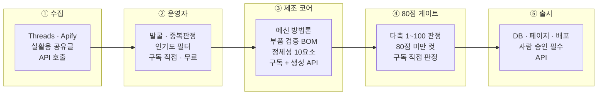

각 구성 요소의 색 구분에는 **비용 원칙**이 반영되어 있다. 파란색으로 표시된 구간은 별도 API 크레딧 없이 운영자가 구독 LLM으로 직접 처리하는 단계이고, 노란색으로 표시된 구간은 외부 API 호출이 불가피하게 발생하는 단계이며, 녹색으로 표시된 구간은 인간의 판단이 개입하는 게이트 지점이다.

이 관계도에서 특히 주목할 점은 **비용이 발생하는 구간이 최소화**되어 있다는 것이다. 실제로 가장 지적 노동이 많이 들어가는 발굴·중복판정·품질평가는 모두 구독 LLM으로 직접 처리하고, API 크레딧은 소셜 스크레이핑, 이미지/영상/음성 생성, 프로덕션 런타임 검증처럼 자동화 스크립트로만 처리 가능한 것에만 쓴다.

또 하나 중요한 점은 ②운영자 단계가 관계도에서 하나의 박스로 표현되어 있지만, 실제로는 흐름도의 ②발굴, ③중복성 판정, ④인기도 필터 세 단계를 모두 포괄한다는 것이다. 관계도는 구성 요소를, 흐름도는 시간 순서를 보여주는 두 개의 상호 보완적 뷰다.

---

## 4. 7단계 파이프라인 전체 흐름도

7단계 파이프라인의 전체 흐름을 시간 순서대로 표현하면 다음과 같다.

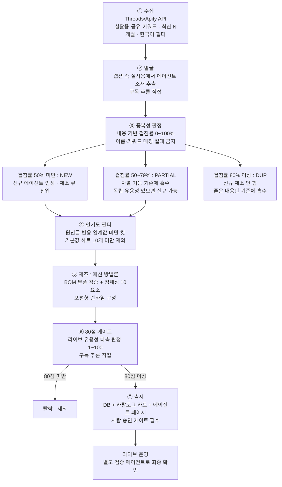

이 흐름도에서 **게이트가 2곳**임을 주목해야 한다. 하나는 ⑥ 80점 게이트로 유용성이 부족한 에이전트를 솎아내는 품질 게이트이고, 다른 하나는 ⑦ 출시 단계의 사람 승인 게이트로 프로덕션 변경에 인간 판단을 강제하는 안전 게이트다.

또한 ③ 중복성 판정에서 나오는 DUP_Q 흐름을 보면, DUP으로 판정된 후보는 ④ 인기도 필터로 진행하지 않는다. 이미 기존에 있는 에이전트와 80% 이상 겹치므로 제조 큐에 들어가지 않는 것이다. 다만 좋은 내용은 기존 에이전트에 흡수되어 개선에 활용된다.

---

## 5. ① 수집: 실활용 글 모으기

파이프라인의 첫 번째 단계이자 유일하게 API 비용이 확정적으로 발생하는 단계다. Apify라는 소셜 스크레이핑 서비스의 Threads 검색 액터를 이용해 쓰레드 플랫폼에서 글을 수집한다.

**키워드 선정이 이 단계의 핵심**이다. 단순히 AI 관련 키워드를 폭넓게 수집하는 것이 아니라, 사람들이 자신의 실제 AI 활용을 공유하고 자랑하는 글을 정확히 타깃으로 해야 한다. "AI로 만들었다", "업무 자동화를 했다", "이 프롬프트를 쓴다", "이렇게 활용하고 있다"처럼 자신의 실사용을 드러내는 표현을 담은 키워드를 우선으로 쓴다. 니즈나 페인(불편함)을 표현하는 키워드는 보조적으로만 사용한다.

반면 개발자 도구 이름(특정 CLI나 프로토콜, 개발 유행어)은 **잡음이 많으므로 명시적으로 키워드에서 제외**한다. 이런 키워드로 모은 글에는 실제 사용 경험이 아닌 기술 소개, 논쟁, 홍보 글이 많아서 발굴 단계의 효율이 크게 떨어지기 때문이다.

수집 시 적용하는 필터는 세 가지다. 첫째, `after` 파라미터로 최신 N개월(기본 3개월) 이내 글만 대상으로 한다. 둘째, 인기순으로 정렬한다. 셋째, 한글 일정 길이 이상의 글로 한국어 필터를 적용한다. 수집 결과는 JSON 형태로 저장되며, 글 ID 중복을 제거한다.

수집의 기본 파라미터는 다음과 같다.

| 파라미터 | 기본값 | 의미 |
|----------|--------|------|
| `months` | 3 | 수집 기간(최신 N개월) |
| 정렬 | 인기순 | 반응이 많은 글 우선 |
| 언어 | 한국어 | 한글 일정 길이 이상 |
| 중복 | 제거 | 글 ID 기준 |

---

## 6. ② 발굴: 에이전트 소재 추출

수집된 글의 캡션을 운영자가 직접 읽으면서 에이전트 아이디어를 추출하는 단계다. 이 단계는 **구독 LLM으로 직접** 처리하며, API 스크립트를 별도로 돌리지 않는다.

발굴 시 핵심은 **드러난 실사용에서 소재를 뽑는 것**이다. 글쓴이가 실제로 AI로 하는 일, 쓰는 스킬과 도구, 활용하는 프롬프트와 워크플로우를 보고 그것을 에이전트로 만들면 어떨지를 판단한다.

**제외되는 글의 유형**도 명확하다. 순수 홍보 글, 동기부여 메시지, 정치적 내용, 밈(meme)은 발굴 대상에서 제외한다. 이런 글들은 실제 AI 활용 패턴을 담고 있지 않아서 에이전트 소재가 되지 않는다.

중요한 점은 이 단계에서 "이런 기능이 있으면 좋겠다"는 요청이나 바람을 수집하는 것이 아니라는 점이다. 오직 글쓴이가 **이미 하고 있는**, **현재 진행형의 실제 활용**을 에이전트화할 소재로 본다. 이 구분이 흐려지면 공장 전체의 철학이 무너진다.

---

## 7. ③ 중복성 판정: 이 공장의 심장

이 단계가 쓰레드 에이전트공장의 핵심이자 가장 독특한 부분이다. 발굴된 후보 에이전트 아이디어가 기존 카탈로그에 이미 있는 것과 얼마나 겹치는지를 판정한다. 저장소에서는 이 단계를 "공장의 심장"으로 명시한다.

### 판정 기준: 이름이 아닌 기능 내용

결정적으로 중요한 것은 **판정의 기준이 이름이나 키워드가 아니라 기능 내용**이라는 점이다. 이름이 달라도 기능이 같으면 중복으로 판정하고, 이름이 같아도 기능이 다르면 신규로 인정한다.

비교하는 항목은 다섯 가지다.

1. **핵심 기능**: 이 에이전트는 무엇을 하는가
2. **산출물**: 이 에이전트는 무엇을 내놓는가
3. **입력**: 이 에이전트는 무엇을 받는가
4. **도메인**: 어느 분야에 특화되어 있는가
5. **차별점**: 기존 에이전트와 무엇이 다른가

각 후보를 카탈로그에서 기능적으로 가장 가까운 1~3개의 기존 에이전트와 직접 대조하여 내용 겹침률(0~100%)을 추정한다.

### 4구간 분류

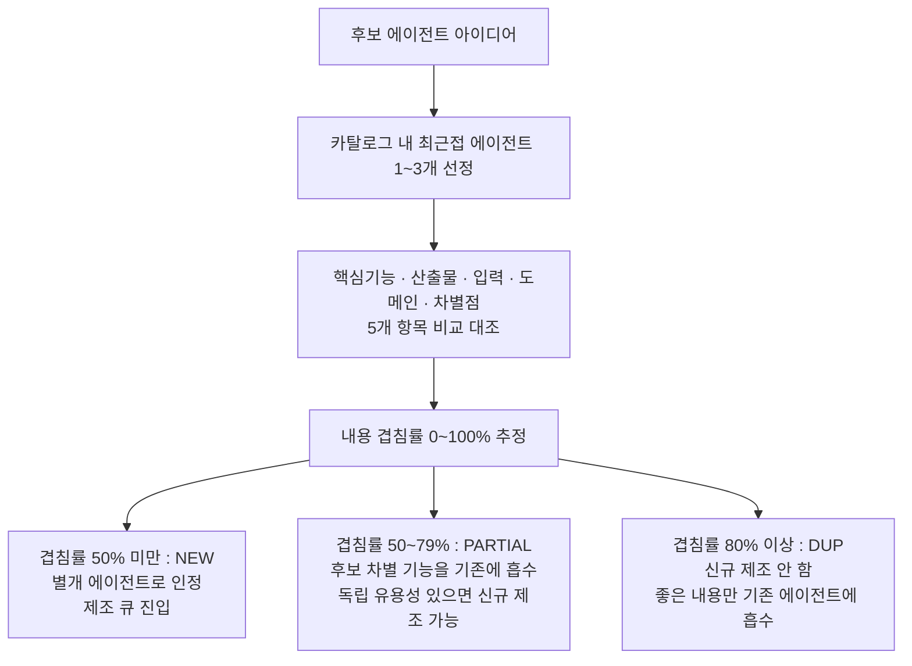

**NEW 구간 (겹침률 50% 미만)**: 기존 에이전트와 절반 이상이 다른 경우다. 별개의 에이전트로 인정하여 제조 큐에 진입시킨다. 비슷한 이름의 에이전트가 카탈로그에 있더라도 기능 내용이 50% 이상 다르면 신규로 인정된다.

**PARTIAL 구간 (겹침률 50~79%)**: 절반 이상 겹치지만 차별적인 기능이 있는 경우다. 이 경우 후보의 차별 기능을 기존 에이전트에 흡수(MERGE)하여 기존 에이전트를 개선한다. 만약 차별점이 독립적으로도 충분한 유용성을 가진다고 판단되면 신규 에이전트로 제조하는 것도 가능하다.

**DUP 구간 (겹침률 80% 이상)**: 실질적으로 동일한 에이전트라 판단되어 신규로 제조하지 않는다. 그러나 이 경우에도 후보 소재에 기존 에이전트에 없는 좋은 아이디어나 접근법이 있다면 그 부분만 기존 에이전트에 흡수하여 개선에 활용한다.

### 흡수(MERGE) 원칙: 버리지 않고 흡수한다

이 방법론에서 중복 소재는 버리는 것이 아니라 기존 에이전트를 개선하는 데 활용한다. DUP이나 PARTIAL 판정을 받은 후보의 유용한 아이디어는 대상 기존 에이전트의 `system_prompt`나 소개 문구에 반영하는 개선 큐로 처리된다. "중복이니까 버린다"는 단순한 처리가 아니라, 카탈로그 전체의 지속적인 품질 향상을 위한 흡수 메커니즘이다.

### 비제외 원칙: 무거워도 만든다

이 단계에서 또 하나 중요한 원칙이 있다. **"구현이 복잡하거나 무겁다"는 이유로 제외하지 않는다**는 것이다. 유용하기만 하면 만든다. 구현의 복잡성은 포털형 인프라와 전용 실행기가 흡수한다. 최종적인 취사 결정은 ⑥ 80점 게이트가 한다. 중복성 판정 단계에서 난이도나 무게를 이유로 컷하지 않는다.

---

## 8. ④ 인기도 필터: 수요 신호 검증

중복성 판정을 통과한 후보들에 대해 원천 글(소스 Threads 글)의 반응수(하트 수)를 확인한다. 기본 임계값인 하트 10개 미만인 경우 제외한다.

이 필터의 논리는 간단하다. 반응이 거의 없는 글에서 나온 아이디어는 실제 수요 신호가 약하다는 판단이다. 실사용을 공유한 글에 다른 사람들이 반응을 보인다는 것은 그 활용 방식에 공감하거나 흥미를 느끼는 사람이 있다는 증거다. 반응이 전혀 없다면 해당 활용 패턴이 글쓴이에게만 특수한 것일 가능성이 높다.

이 단계에서도 API 호출 없이 구독 LLM으로 직접 처리한다. 이 단계를 통과한 후보들의 목록이 JSON 형태의 숏리스트로 제조 단계에 넘겨진다.

---

## 9. ⑤ 제조: 에신 방법론 적용

숏리스트의 후보들을 실제 에이전트로 만드는 단계다. 여기서 "에신(에이전트의 신)"이라는 별칭의 에이전트 제조 방법론이 적용된다. 구체적으로는 Claude Code의 `/에신-llm-dependent-agent-create` 스킬이 제조 공정을 담당한다.

제조 공정의 핵심 구성 요소는 세 가지다.

### 부품 발굴·검증 (BOM: Bill of Materials)

공개 저장소, 오픈소스 소프트웨어, 모델 허브, 사내 자산에서 필요한 부품을 발굴한다. 발굴된 부품은 그냥 쓰는 것이 아니라 분해하여 세 가지를 검증한다. 안전성 검증, 인기도 검증(GitHub star 수, 다운로드 수), 유지보수 상태 검증이다. 검증된 부품만 적용하고, 저인기·미유지·미검증 부품은 배제한다.

이 원칙은 ④ 인기도 필터에서 원천 글에 적용했던 "인기 있는 것만"의 원칙을 부품 수준에서 한 번 더 적용하는 것이다. 인기가 낮은 부품은 커뮤니티 지지가 부족하고, 유지보수가 중단된 부품은 미래 보안 취약점의 원인이 될 수 있다.

### 정체성 10요소 명시

에이전트의 정체성을 구성하는 10가지 요소를 명확히 정의한다.

| 요소 | 내용 |
|------|------|
| 목표 | 이 에이전트가 달성하려는 것 |
| 자율 루프 | 에이전트가 반복 실행하는 사이클 구조 |
| 도구 | 에이전트가 사용하는 외부 도구 목록 |
| 메모리 | 에이전트가 기억하고 유지하는 상태 |
| 이름 | 에이전트의 식별명 |
| 분류 | 카탈로그에서의 카테고리·서브카테고리 |
| LLM 선택 | 실행에 사용할 언어 모델 |
| 종료 조건 | 에이전트 실행이 완료되는 조건 |
| 보안 | 접근 제어, 데이터 처리 보안 고려사항 |
| 비용 한도 | 에이전트 실행당 허용 비용 상한 |

### 포털형 구동 방식

런타임과 DB(system_prompt와 도구 ID를 저장)로 구성되는 포털형 방식으로 에이전트를 구동한다. 이미지, 영상, 음성, 문서 생성처럼 리치 출력이 필요할 경우 전용 실행기를 붙이는데, 이 부분이 불가피하게 API를 호출해야 하는 지점이다.

이 단계에서도 핵심 추론(부품 적합성 판단, system_prompt 작성, 소개 글 작성)은 구독 LLM으로 직접 처리한다. API는 부품 실다운로드나 리치 출력 생성처럼 자동화가 꼭 필요한 경우에만 쓴다.

---

## 10. ⑥ 80점 게이트: 다축 품질 통제

제조된 에이전트의 실제 가치를 100점 만점으로 채점하여 80점 이상만 출시 큐로 보내는 단계다. 이 채점도 구독 LLM으로 직접 수행한다.

중요한 것은 채점이 **단일 축이 아니라 4개의 독립적인 축**에서 이루어진다는 점이다.

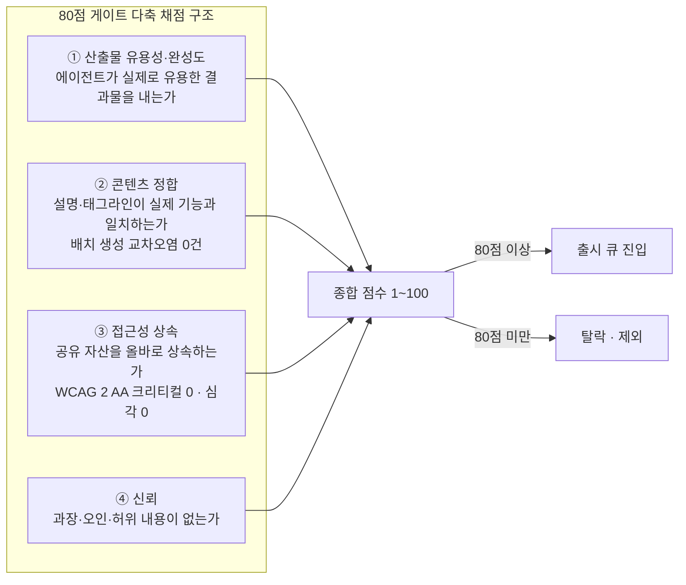

**① 산출물 유용성·완성도**: 에이전트가 약속한 기능을 실제로 수행하여 유용한 결과물을 내놓는가를 본다. 단순히 에러 없이 실행되는 것이 아니라 실제 가치를 제공하는가를 평가한다.

**② 콘텐츠 정합**: 에이전트의 설명 문구, 태그라인, 메타 정보가 실제 기능과 정확히 일치하는가를 확인한다. 이 항목은 배치 생성(여러 에이전트를 한꺼번에 만드는 방식)에서 특히 중요하다. 배치 생성 과정에서 한 에이전트의 설명이 다른 에이전트에 잘못 적용되는 교차 오염이 발생하기 쉽기 때문이다. 이런 잔재는 반드시 0건으로 유지해야 한다.

**③ 접근성 상속**: 에이전트가 공유 자산(공개 API, 오픈소스 컴포넌트 등)을 올바르게 상속하여 접근성 기준을 충족하는가를 본다. UI가 있는 경우 WCAG 2 A/AA 기준으로 크리티컬 0건, 심각 0건을 달성해야 한다. 단순한 시각적 확인만으로는 색상 대비, 폼 라벨 누락, ARIA 결함을 발견하지 못하므로, axe와 같은 자동화 접근성 검사 도구를 반드시 사용한다.

**④ 신뢰**: 에이전트의 설명이나 기능에 과장, 오인을 유발하는 내용, 허위 정보가 없는가를 평가한다.

이처럼 단순히 "잘 돌아가는가"만 보는 것이 아니라 콘텐츠 정합성과 접근성까지 평가하는 이유는, 프론트 유용성만 체크할 경우 이 두 가지 중요한 품질 요소를 놓치게 되기 때문이다.

---

## 11. ⑦ 출시: 사람 승인과 라이브 검증

80점 게이트를 통과한 에이전트를 플랫폼에 실제로 출시하는 마지막 단계다. 이 단계는 두 가지 절대적인 원칙으로 운영된다.

### 사람 승인 게이트

**프로덕션 변경 앞에 반드시 사람 승인 게이트가 있다.** 되돌리기 어려운 프로덕션 변경이므로 자동 배포를 금지하고, 사람이 최종 승인한 후에만 라이브에 올린다. "소프트(soft) 우선"이라는 원칙도 함께 적용한다. 확신이 없으면 먼저 제한적으로 배포하고, 검증 후 확장하는 방식을 택한다.

배포 방식도 중요하다. 로컬에서 전체 파일을 업로드하는 방식이 아니라 **저장소(git) 기반 빌드를 권장**한다. 로컬 전체 업로드 방식은 서버리스 환경에서 번들 크기 한도에 걸릴 수 있기 때문이다.

### 자기검증 금지

에이전트를 만든 사람이 자신의 산출물을 검증하지 않는다는 원칙이다. 별도의 검증 에이전트(Verification Agent)가 독립적으로 네 가지를 확인한다.

첫째, **구조 확인**: 카탈로그 카드와 에이전트 페이지가 올바르게 응답하는가. 둘째, **기능 확인**: 실제 실행 산출물과 로그인 세션이 정상인가. 셋째, **콘텐츠 정합 확인**: 설명과 메타 정보가 그 에이전트의 실제 기능과 일치하는가(다른 에이전트 문구의 복붙·생성 템플릿 잔재 0건). 넷째, **접근성 확인**: UI 산출물에 대해 axe로 WCAG 2 A/AA 기준 크리티컬 0건, 심각 0건.

### curl 200 금지 원칙

"**curl 200 ≠ 동작함**"이라는 철칙이 있다. HTTP 200 응답을 받았다는 것이 UI가 올바르게 렌더링된다는 것을 보장하지 않는다. 단순한 curl 요청으로 200 응답이 왔다고 "동작 확인 완료"라고 판정하는 것을 금지한다. 실제 라이브 화면에서 기능을 직접 확인해야 한다.

---

## 12. 비용 원칙: 구독 추론 vs API 호출

이 방법론의 경제성 원칙은 매우 명확하다. **LLM 추론(발굴·중복판정·평가·작성)은 구독 LLM으로 직접 하고, API/외부 호출은 불가피한 것에만 쓴다.** 저장소에서는 이 원칙을 "공장 경제성의 핵심"으로 명시한다.

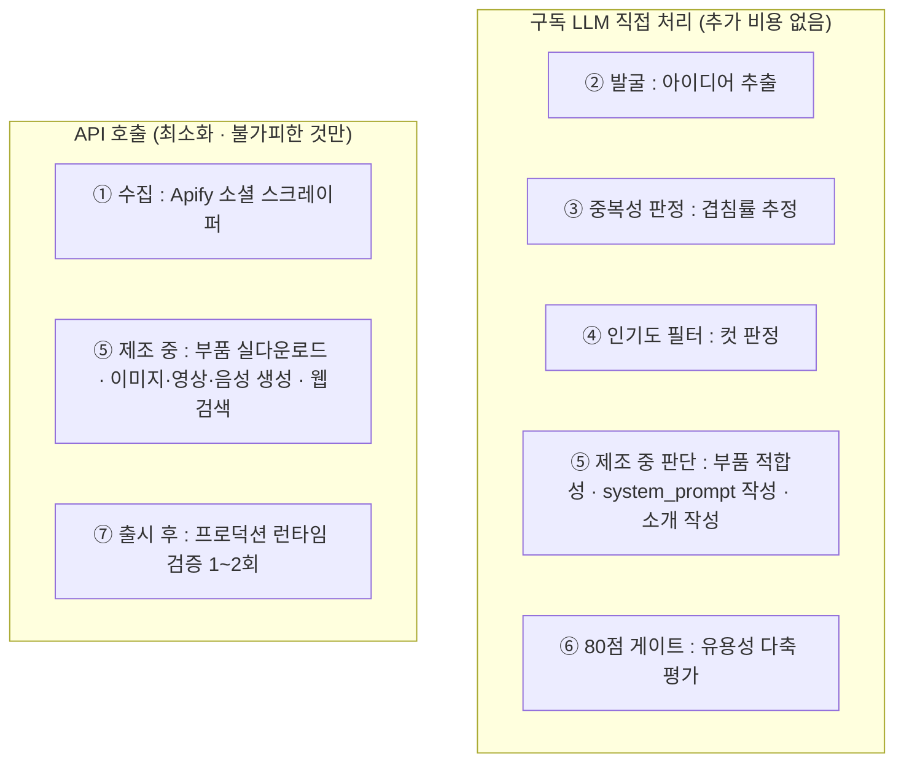

이 원칙이 중요한 이유는 **LLM 추론 비용이 파이프라인 전체에서 가장 큰 잠재적 비용**이기 때문이다. 발굴, 중복판정, 품질평가는 LLM이 많은 텍스트를 처리하고 판단해야 하는 단계들이다. 이를 모두 외부 API 호출로 처리하면 에이전트 한 개를 만드는 데도 상당한 비용이 든다. 구독 LLM으로 직접 처리하면 이 비용이 사실상 0이 된다.

반면 소셜 스크레이핑(Apify), 이미지/영상/음성 생성, 프로덕션 런타임 검증은 자동화 스크립트로만 처리 가능하므로 API 호출이 불가피하다. 이 최소한의 비용만을 감수하는 것이 이 방법론의 비용 최적화 전략이다.

다이어그램에서 색상으로 구분한 것도 이 원칙을 시각화한 것이다. 파란색은 구독 직접, 노란색은 API 호출, 녹색은 게이트/승인을 나타낸다.

---

## 13. 에신(에이전트의 신): 제조 코어 방법론 상세

"에신"은 "에이전트의 신"의 줄임말로, Claude Code 스킬 `/에신-llm-dependent-agent-create`의 별칭이다. `SUNWOONGKYU/claude-meta-skills` 저장소에서 공개된 이 스킬은 LLM 의존형 AI 에이전트를 **9-Phase 방식**으로 제조하는 방법론이다. 현재 버전은 V3.5 Round 9(2026-05-28 기준)이다.

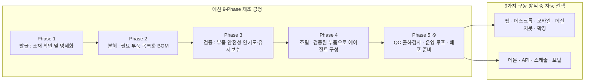

에신 방법론의 **8대 철칙**은 다음과 같다.

**① 발굴물 무신뢰**: 공개 저장소라도 통째로 신뢰하지 않는다. 부품 단위로 검증한다. GitHub에서 높은 star 수를 가진 저장소도 전체를 신뢰하는 것이 아니라 실제 사용할 함수·블록 단위로 분해하여 평가한다.

**② 부품 단위 선별**: 함수, 블록, 체크리스트 단위까지 세분화하여 선별한다. 저장소 단위의 의존성을 추가하는 것이 아니라 실제 필요한 부품만 정확히 선택한다.

**③ 운용 충돌 0건 — 타협 불가**: 실제 운영 환경에서 다른 시스템이나 에이전트와 충돌이 발생할 수 있는 부품은 어떤 이유로도 타협하지 않고 배제한다. 편의보다 안정성을 택한다.

**④ 스무고개 항상 강제**: 막연한 요청으로 시작하는 것을 금지한다. V3.5 기준으로 10라운드 기본값의 질문-응답으로 요구사항을 명확화한다. 명확한 명세 없이 제조를 시작하지 않는다.

**⑤ MBO 승인 게이트**: 제조 시작 전에 목표 기반 명세(Management by Objectives)를 운영자로부터 승인받는다. 이 승인 없이 다음 단계로 진행하지 않는다.

**⑥ 자기검증 금지**: 별도의 검증 서브에이전트(Verification Subagent)를 통해 검증한다. 만든 주체가 자신의 산출물을 검증하지 않는다.

**⑦ "curl 200 ≠ 동작함"**: HTTP 200 응답만으로 동작 확인을 완료했다고 판정하지 않는다. 실제 사용자 화면에서 기능을 직접 확인한다.

**⑧ 자산화·운영까지가 완료**: 에이전트 코드를 만드는 것이 아니라 실제로 운영할 수 있는 상태까지 만드는 것을 완료로 정의한다. DB 등재, 카탈로그 카드, 에이전트 페이지, 배포까지 완료해야 한 사이클이 끝난다.

### 에신의 두 운영 인프라

에신은 두 가지 인프라 환경을 지원한다.

- **인프라 A**: Supabase가 있는 환경. DB에 system_prompt와 도구 ID를 저장하는 포털형 구성이 가능하다.
- **인프라 B**: DB가 없는 환경. `.py` 파일과 API 키만으로 동작하는 단순 구성이다.

또한 에신은 요청받은 에이전트의 특성에 따라 9가지 구동 방식(웹, 데스크톱, 모바일, 메신저봇, 확장, 데몬, API, 스케줄, 포털) 중에서 적합한 방식을 자동으로 결정한다.

### claude-meta-skills의 두 번째 스킬: skill-create-코어5

`claude-meta-skills` 저장소에는 에신 외에도 `/skill-create-코어5`라는 스킬이 있다. 이는 Claude Code 스킬(SKILL.md 파일)을 만드는 스킬, 즉 "스킬을 만드는 스킬"이다. 에신과 같은 9-Phase 방식을 적용하여 발굴 → 분해 → 검증 → 조립 → QC 출하검사 → 운영 루프의 공정으로 스킬을 제조한다.

이 두 스킬은 서로 양방향 관계에 있다. 스킬의 INSTRUCTION을 에이전트의 system_prompt로 재포장하면 에이전트가 되고, 에이전트의 system_prompt를 SKILL.md로 추출하면 스킬이 된다.

---

## 14. 반자동 운영과 사람의 역할

이 방법론의 공식 이름에 "자가성장"이라는 표현이 있지만, 실제로는 완전 자동(무인)이 아닌 **반자동(semi-automatic)** 운영을 채택한다.

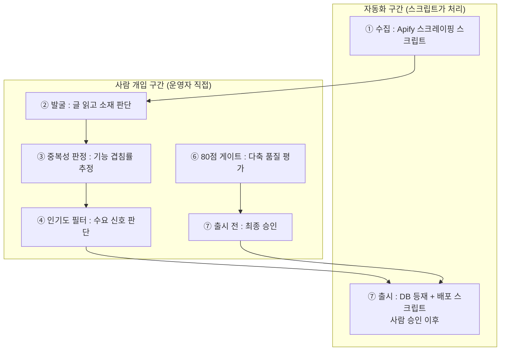

반자동을 택한 가장 큰 이유는 **"내용 기반 겹침률 판정"의 뉘앙스** 때문이다. 자동 임베딩 유사도로 중복 판정을 대체하면 속도는 빠르지만, 기능 차별점과 흡수 가치에 대한 뉘앙스는 사람의 판단이 더 정확하다. 저장소에서도 "중복성 판정은 사람 판단이다. 자동 임베딩 유사도로 대체하면 빠르지만, '내용 겹침'의 뉘앙스는 사람 판단이 더 정확하다. 이 공장은 후자를 택했다"고 명시한다.

사람이 개입하는 구간에서는 구독 LLM을 보조 도구로 사용하면서 직접 판단을 내린다. 사람이 LLM에게 분석을 요청하고 결과를 검토하며 최종 판단을 내리는 방식이다. 이 때문에 이 단계들의 추론 비용이 구독 범위 안에 들어온다.

완전 무인 자동(cron 기반) 운영이 필요한 경우, 이 방법론을 핵심으로 하는 별도의 자율 실행 에이전트를 제조하는 것이 가능하다. 단, 저장소에서는 "프로덕션 출시 자동화는 위험하므로 사람 승인 게이트를 유지하는 것을 권장한다"고 밝힌다.

---

## 15. 이 방법론이 해결하는 핵심 문제

쓰레드 에이전트공장이 해결하고자 하는 문제들을 기존 방식과 대비하면 다음과 같다.

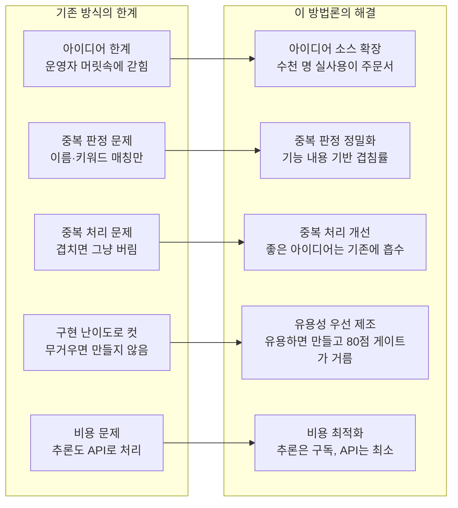

**아이디어 발굴의 스케일**: 기존에는 한 명의 운영자가 떠올릴 수 있는 에이전트 아이디어의 수가 한계였다. 이 방법론은 Threads에 AI 활용을 공유하는 수천, 수만 명의 실사용자 경험을 아이디어 소스로 삼는다. 운영자의 상상력이 아닌 집단 지성의 실제 행동에서 소재를 뽑기 때문에, 운영자가 미처 생각하지 못했던 활용 패턴도 발굴된다.

**중복 판정의 정확성**: 이름이 같아도 기능이 다르면 신규로 인정하고, 이름이 달라도 기능이 같으면 중복으로 처리한다. 이는 카탈로그에서 진짜 가치 있는 신규 에이전트만을 골라내는 정밀한 필터 역할을 한다. 키워드 매칭만으로는 이런 정밀한 판정이 불가능하다.

**지식의 손실 없는 흡수**: 중복으로 판정된 소재도 버리지 않고 기존 에이전트 개선에 활용한다. 이를 통해 카탈로그의 모든 에이전트가 지속적으로 개선되는 선순환 구조가 만들어진다.

**비용 효율**: 지적 판단이 필요한 모든 단계를 구독 LLM으로 처리함으로써, 에이전트 공장의 운영 비용을 소셜 스크레이핑 API 비용과 일부 생성 API 비용 수준으로 최소화한다.

---

## 16. GitHub 저장소 안내 및 적용 방법

### 두 저장소의 구조

**① 쓰레드 에이전트공장 (파이프라인 방법론)**

| 항목 | 내용 |
|------|------|
| 저장소 URL | https://github.com/SUNWOONGKYU/threads-agent-factory |
| 라이선스 | MIT |
| 주요 파일 | README.md (개요), SKILL.md (Claude Code 스킬), docs/방법론_설명서.md (상세 방법론) |
| 산출물 형태 | 코드 런타임이 아닌 운영 스킬(SKILL.md) 형태 — 자신의 플랫폼·카탈로그에 맞게 적용 |

**② 에신 제조 코어 (claude-meta-skills)**

| 항목 | 내용 |
|------|------|
| 저장소 URL | https://github.com/SUNWOONGKYU/claude-meta-skills |
| 라이선스 | MIT |
| 버전 | V3.5 Round 9 (2026-05-28) |
| 주요 스킬 | /skill-create-코어5 (스킬 제조), /에신-llm-dependent-agent-create (에이전트 제조) |

### 에신 설치 방법

가장 빠른 설치 방법은 Claude Code 세션에서 다음 한 줄을 입력하는 것이다.

```
SUNWOONGKYU/claude-meta-skills 설치해 줘.
```

또는 직접 git clone 후 배치하는 방법도 있다.

```bash
# macOS / Linux
git clone https://github.com/SUNWOONGKYU/claude-meta-skills.git
cp -r claude-meta-skills/에신-llm-dependent-agent-create ~/.claude/skills/
cp -r claude-meta-skills/skill-create-코어5 ~/.claude/skills/
```

```powershell
# Windows PowerShell
git clone https://github.com/SUNWOONGKYU/claude-meta-skills.git
cp -r claude-meta-skills/에신-llm-dependent-agent-create "$env:USERPROFILE\.claude\skills\"
cp -r claude-meta-skills/skill-create-코어5 "$env:USERPROFILE\.claude\skills\"
```

### 에이전트공장 스킬 적용

`threads-agent-factory` 저장소의 `SKILL.md`를 `~/.claude/skills/threads-agent-factory/` 경로에 배치한다. 이후 Claude Code 세션에서 스킬로 호출할 수 있다.

### 운영 준비사항

소셜 스크레이퍼(Apify) 토큰을 환경변수로 준비한다. **토큰 값은 절대 저장소에 커밋하지 않는다.** 환경변수나 시크릿 매니저로만 관리한다.

### 파이프라인 실행 순서

```
1. 키워드(실활용·공유형) · 기간(months) · 인기도 임계값(하트) · 합격선(80) · 제조 개수 결정
2. ① 수집 (Apify 스크립트) → ② 발굴 → ③ 중복성 판정 → ④ 인기도 필터
   (②③④는 운영자가 구독 LLM으로 직접)
3. ⑤ 제조 (에신 스킬 호출) → ⑥ 80점 게이트
   (⑥은 운영자가 직접 판정)
4. 통과분만 → ⑦ 출시 (사람 승인 후 배포)
```

### 한계와 주의사항

저장소에서 명시한 한계와 주의사항을 그대로 전달한다.

이 방법론은 반자동 운영 도구다. 발굴·판정·평가는 사람이 구독 LLM으로 직접 수행하고, 출시는 사람 승인을 거친다. 이 저장소의 공개본은 특정 플랫폼의 DB 스키마, 카탈로그 데이터, 에이전트 코드표를 포함하지 않는다. "당신의 카탈로그/플랫폼"으로 일반화되어 있으므로, 자기 환경에 맞게 연결해야 한다.

---

## 17. 요약 및 의의

쓰레드-에이전트공장은 AI 에이전트 개발 방식에 대한 근본적인 패러다임 전환을 제안한다. 기존 방식이 "운영자가 아이디어를 기획하고 하나씩 만드는" 하향식(top-down)이었다면, 이 방법론은 "실제 사용자들의 드러난 행동에서 소재를 뽑아 올라오는" 상향식(bottom-up)이다.

7단계 파이프라인은 수집→발굴→중복판정→인기도 필터→제조→80점 게이트→출시로 구성되며, 각 단계는 명확한 역할과 비용 원칙을 가진다. 특히 **내용 기반 중복 판정**은 이 방법론의 심장으로서, 단순 키워드 매칭을 넘어 기능 내용의 겹침률로 에이전트 카탈로그의 다양성과 품질을 동시에 관리한다.

비용 원칙의 명확함도 이 방법론의 강점이다. 지적 판단이 필요한 모든 추론은 구독 LLM으로 직접 처리하고, API 호출은 자동화가 꼭 필요한 최소한의 단계에만 쓴다. 이를 통해 에이전트 공장 전체를 경제적으로 운영할 수 있다.

80점 게이트는 산출물 유용성, 콘텐츠 정합, 접근성, 신뢰의 4축으로 품질을 통제하며, 자기검증 금지 원칙과 "curl 200 ≠ 동작함" 철칙이 라이브 환경에서의 실제 품질을 보장한다.

사람은 공장 전체를 무인으로 돌리는 것이 아니라 발굴·중복판정·품질평가·최종 승인이라는 핵심 판단 지점에만 개입한다. 반복적인 수집과 배포는 공장이 처리하고, 사람은 판단이 필요한 곳에 집중하는 반자동 구조다.

이 방법론의 또 다른 중요한 관점은 **"에이전트 공장 자체가 에이전트 생태계를 자가성장시키는 메타-에이전트"** 라는 점이다. 사람이 매번 아이디어를 쥐어짜지 않아도, 소셜에서 사람들이 AI를 활용하는 한 에이전트 제조 주문서는 자동으로 채워진다. 플랫폼이 성장할수록 AI 활용 공유 글도 늘어나고, 그 글에서 더 많은 에이전트 소재가 발굴된다. 이것이 "자가성장"의 실체다.

---

> **참고 링크**
> - 쓰레드 에이전트공장 저장소: https://github.com/SUNWOONGKYU/threads-agent-factory
> - 방법론 설명서: https://github.com/SUNWOONGKYU/threads-agent-factory/blob/main/docs/방법론_설명서.md
> - 에신 (claude-meta-skills) 저장소: https://github.com/SUNWOONGKYU/claude-meta-skills

---

*작성 일자: 2026-06-12*


---

## 별첨: LangChain/LangGraph/Deep Agents/LangSmith 기반 구현 아키텍처

> **별첨 작성 기준**: 2026년 6월 12일 현재 공식 LangChain 문서, 공개 벤치마크, GitHub 저장소 기반  
> **핵심 질문**: 쓰레드-에이전트공장의 7단계 파이프라인을 LangGraph 생태계로 구현할 수 있는가? DeepSeek 모델은 사용 가능한가?

---

### A-1. LangChain 생태계 4요소와 역할 분담

이 별첨에서 다루는 기술 스택은 네 개 레이어로 구성된다. 각 레이어는 독립적으로도 의미가 있지만, 함께 쓸 때 파이프라인 전체를 체계적으로 구현할 수 있다.

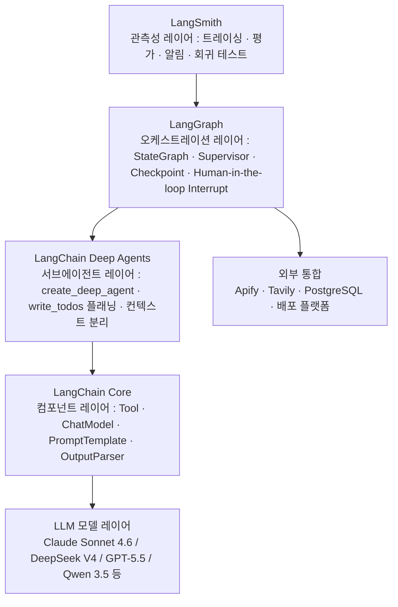

**LangChain Core**는 Tool, ChatModel, PromptTemplate, OutputParser 같은 기본 구성 요소를 제공한다. 에이전트공장에서 각 단계의 도구(Apify 스크레이퍼, 중복 판정 로직, 80점 채점 함수)를 LangChain Tool로 래핑하는 데 사용한다.

**LangGraph**는 에이전트공장 파이프라인의 뼈대다. 7단계를 각각 노드(node)로 정의하고, 중복성 판정처럼 3방향 분기가 필요한 지점에는 조건부 엣지(conditional edge)를 쓴다. 상태(state)는 TypedDict로 정의된 공유 스키마를 통해 모든 노드가 읽고 쓴다. MemorySaver 또는 PostgresSaver로 체크포인트를 남겨 실패한 지점에서 재시작할 수 있다. 프로덕션 변경 전 사람 승인이 필요한 ⑦출시 단계에는 `interrupt()` 프리미티브를 써서 Human-in-the-loop 게이트를 구현한다.

**LangChain Deep Agents**는 2025년 7월 Harrison Chase(LangChain CEO)가 공개한 프레임워크로, 2026년 3월 대규모 업데이트 후 5시간 만에 GitHub star 9,900개를 기록했다. `create_deep_agent()`로 생성한 오케스트레이터는 `write_todos`로 할 일 목록을 계획하고, 서브에이전트에게 연구 작업을 위임하며, 파일시스템 도구로 대용량 컨텍스트를 외부에 오프로드한다. ②발굴 단계에서 Threads 글 배치를 병렬로 분석하거나 ③중복 판정에서 카탈로그를 대규모로 검색할 때 이 패턴이 유용하다.

**LangSmith**는 LangGraph와 네이티브로 통합되며, 환경변수 한 줄(LANGSMITH_API_KEY)만 설정하면 모든 그래프 실행이 자동으로 추적된다. ⑥80점 게이트를 LangSmith Evaluation으로 구현하면 채점 기준을 데이터셋으로 관리하고, 프로덕션 트레이스를 회귀 테스트에 재활용할 수 있다.

---

### A-2. LangGraph StateGraph 전체 파이프라인 구조

쓰레드-에이전트공장의 7단계를 LangGraph StateGraph로 구현한 전체 구조는 다음과 같다.

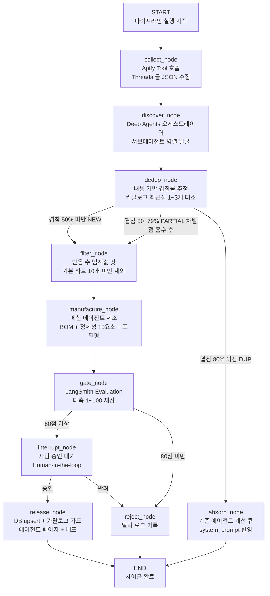

이 구조의 핵심은 **조건부 엣지(conditional edge)** 다. LangGraph에서 `add_conditional_edges()`를 사용하면 `dedup_node`의 출력값(겹침률)을 읽어 FILTER로 보낼지 ABSORB로 보낼지 런타임에 결정한다. `gate_node`에서도 80점 기준으로 INTERRUPT와 REJECT_N 중 하나로 라우팅한다.

**상태 스키마(TypedDict)** 설계도 중요하다. 2026년 LangGraph 커뮤니티의 모범 사례는 에이전트별로 네임스페이스를 분리한 중첩 TypedDict를 쓰는 것이다. 예를 들어 `state.collected_posts`, `state.discovered_candidates`, `state.dedup_results`, `state.manufactured_agents` 같은 구조로 나누면, 10개 이상의 노드가 같은 상태를 읽고 쓸 때 충돌과 리팩토링 비용을 줄일 수 있다.

**체크포인트** 는 장시간 실행되는 파이프라인에서 필수다. Apify 수집 후 발굴이 실패하면 수집을 다시 할 필요 없이 발굴 단계부터 재시작할 수 있다. 개발 환경에서는 MemorySaver, 프로덕션에서는 PostgresSaver를 사용한다.

---

### A-3. ② 발굴 단계: Deep Agents 서브에이전트 패턴

발굴 단계는 수백 개의 Threads 글 캡션을 읽고 에이전트 소재를 추출하는 작업이다. 이 작업을 오케스트레이터 한 개가 순차적으로 처리하면 느리다. LangChain Deep Agents의 서브에이전트 위임 패턴을 쓰면 여러 배치를 병렬로 처리할 수 있다.

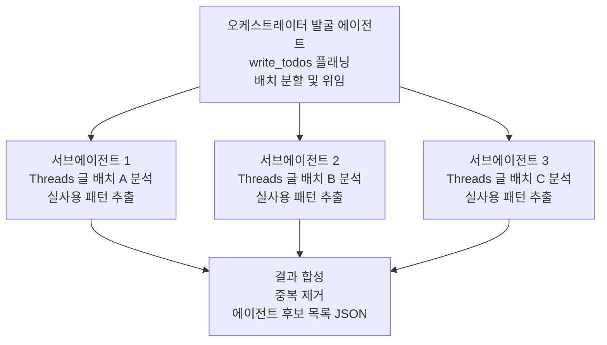

각 서브에이전트는 자신의 배치 안에서만 작업하므로 컨텍스트가 오염되지 않는다. 오케스트레이터는 `write_todos`로 배치 작업 목록을 먼저 계획한 뒤, `task()` 호출로 서브에이전트에게 위임한다. 공식 Deep Agents 문서의 병렬 실행 권장 상한은 동시 3개 서브에이전트다.

서브에이전트의 system_prompt는 간결해야 한다. "이 글들에서 글쓴이가 AI로 하고 있는 일, 쓰는 스킬·도구·프롬프트·워크플로우를 추출하라. 홍보·밈·동기부여·정치 글은 제외하라. JSON 배열로 반환하라." 정도면 충분하다.

현재 Deep Agents 공식 문서의 예시는 Claude(Anthropic)와 Gemini(Google)를 기본 모델로 사용한다. `init_chat_model()` API를 통해 이론상 OpenAI 호환 엔드포인트를 제공하는 모든 모델을 쓸 수 있으므로, DeepSeek V4도 OpenAI 호환 엔드포인트로 연결 가능하다. 단, 이 조합은 공식 문서에 명시적으로 검증된 구성이 아니므로 테스트가 필요하다.

---

### A-4. ⑥ 80점 게이트: LangSmith Evaluation 구현

80점 게이트는 에이전트공장에서 가장 중요한 품질 통제 지점이다. LangSmith Evaluation을 써서 이를 자동화하면 채점 기준을 코드로 관리하고, 프로덕션 트레이스를 회귀 테스트 데이터셋으로 활용할 수 있다.

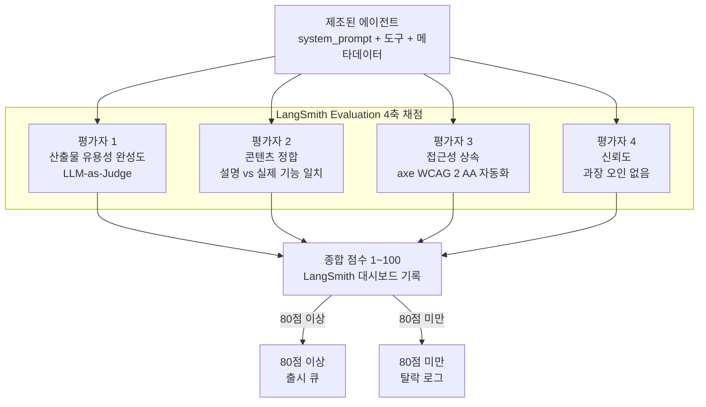

LangSmith Evaluation의 장점은 **프로덕션 트레이스가 곧 테스트 데이터셋이 된다**는 점이다. 통과한 에이전트와 탈락한 에이전트의 채점 결과를 축적하면, 이후 채점 기준을 개선하거나 모델을 교체할 때 기존 케이스로 회귀 테스트를 자동으로 실행할 수 있다.

LangSmith 외에 Langfuse(오픈소스 자체 호스팅), Arize Phoenix(eval 전문)도 대안으로 고려할 수 있다. 2026년 관측성 플랫폼 선택 기준을 간단히 정리하면 다음과 같다. LangGraph를 주 프레임워크로 쓴다면 LangSmith가 가장 깊은 네이티브 통합을 제공한다. 자체 호스팅이 필요하거나 데이터 거주지(data residency) 요건이 있다면 Langfuse가 적합하다. Eval 과학의 엄밀성이 최우선이라면 Arize Phoenix다.

---

### A-5. DeepSeek 모델 활용 가능성과 한계

#### A-5-1. 2026년 현재 DeepSeek 모델 라인업

DeepSeek V4는 2026년 4월 24일 출시된 4세대 모델 패밀리다. 두 가지 변형이 있다.

**DeepSeek V4-Flash**: 전체 284B 파라미터, 토큰당 활성 파라미터 13B, MoE(Mixture-of-Experts) 구조, 1M 토큰 컨텍스트 윈도우. API 가격 입력 $0.28/백만 토큰. 배치 처리 시 $0.25/백만 토큰으로 낮아진다.

**DeepSeek V4-Pro**: 전체 1.6T 파라미터, 토큰당 활성 49B, 1M 토큰 컨텍스트. API 가격 입력 $0.30/백만 토큰, 출력 $1.10/백만 토큰. Claude Opus 4.7, GPT-5.5와 대부분의 에이전트 벤치마크에서 동급 성능을 내며, 비용 차이는 약 10~13배다. 두 모델 모두 HuggingFace에 오픈 가중치로 공개되어 있다.

또한 2026년 5월 말 출시된 **DeepSeek Reasonix**는 코딩 에이전트에 특화된 모델로, 프롬프트 캐싱을 기본 내장하여 긴 세션에서 Claude Code, OpenAI Codex 대비 작업당 비용이 5~15배 저렴하다고 보고된다.

#### A-5-2. 파이프라인 단계별 모델 추천

에이전트공장의 비용 원칙("추론은 구독, API는 최소")과 각 단계의 요구사항을 결합하면, 단계별로 다른 모델을 쓰는 다층 라우팅 전략이 합리적이다.

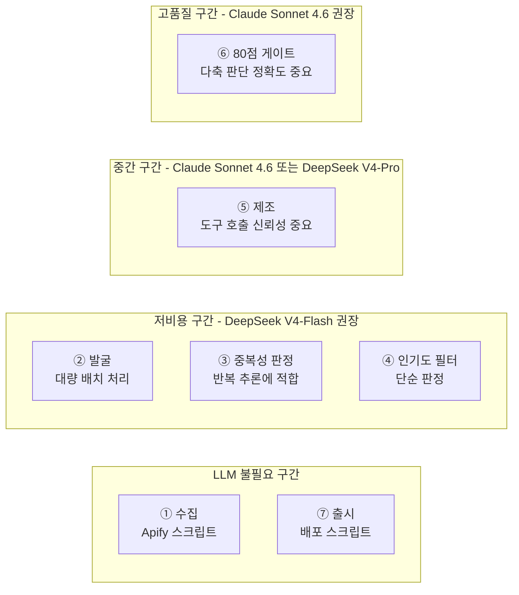

**① 수집, ⑦ 출시**: LLM이 필요 없는 단계다. Apify Python SDK와 배포 스크립트가 처리한다.

**② 발굴, ③ 중복성 판정, ④ 인기도 필터**: 에이전트공장의 비용 원칙에 따라 구독 LLM으로 직접 처리하는 것이 기본이다. 만약 자동화 스크립트로 처리하고자 한다면, 대량의 텍스트를 반복 추론하는 이 단계에서 DeepSeek V4-Flash의 저가(입력 $0.28/M)와 1M 컨텍스트 윈도우가 비용 효율적이다. 단, 데이터 프라이버시 고려사항(A-5-3 참조)을 먼저 검토해야 한다.

**⑤ 제조**: 에신 방법론의 부품 적합성 판단, system_prompt 작성, 소개 글 작성이 이 단계의 핵심이다. 도구 호출의 신뢰성이 중요하다. Claude Sonnet 4.6은 도구 호출 파싱의 신뢰성이 가장 높다고 평가된다. DeepSeek V4-Pro도 경쟁력 있는 수준이지만, 복잡한 다단계 도구 호출에서는 Claude가 더 안정적이라는 실무 보고가 많다.

**⑥ 80점 게이트**: 다축 판단의 정확도가 중요한 단계다. 과장이나 콘텐츠 불일치를 잡아내는 신뢰 평가, 미묘한 설명 차이를 구별하는 정합 평가는 지시사항 이해 능력이 높은 모델에서 더 좋은 결과를 낸다. Claude Sonnet 4.6이 이 단계에 가장 적합하다.

#### A-5-3. DeepSeek 데이터 프라이버시 고려사항

DeepSeek API를 사용할 때 가장 중요하게 검토해야 할 사항이 데이터 프라이버시다. DeepSeek의 관리형 API는 데이터가 중국 서버로 전송된다. 중국의 국가정보법에 따라 DeepSeek는 정부 요청 시 데이터를 제공해야 하는 법적 의무가 있다. 이탈리아는 2026년 1월 앱스토어에서 DeepSeek를 차단했고, 유럽 여러 나라(벨기에, 프랑스, 아일랜드, 독일 등)가 GDPR 위반 가능성으로 조사 중이다.

한국 사용자 입장에서는 Threads 글 내용이나 에이전트 소재 자체가 민감 정보가 아닌 경우 실용적 관점에서 활용할 수 있다. 그러나 기업 내부 데이터나 개인정보가 포함된 경우에는 다음 대안을 검토해야 한다.

**대안 1: 자체 호스팅(Self-hosting)**: DeepSeek V4는 오픈 가중치로 공개되어 있다. V4-Flash(284B/13B 활성)는 소비자급 GPU 클러스터로도 구동 가능하다. 자체 호스팅 시 데이터가 자사 인프라 밖으로 나가지 않는다. 단, GPU 운영 역량이 필요하고, API의 저렴한 비용 장점이 상당 부분 사라진다.

**대안 2: EU 리전 클라우드 호스팅**: 2026년 2월부터 AWS Bedrock, Azure AI, Google Vertex AI의 EU 리전에서 DeepSeek 모델을 사용할 수 있다. 데이터가 EU 내에 머물므로 GDPR 준수가 가능하다. 직접 API 대비 비용이 다소 높아진다.

**대안 3: 동급 오픈 가중치 모델**: Qwen 3.5(Alibaba), Llama 4 Scout(Meta)는 DeepSeek에 근접한 성능을 내면서 자체 호스팅 시 데이터 거주지를 완전히 제어할 수 있다.

---

### A-6. 주요 모델 비교 (에이전트공장 관점)

2026년 6월 현재 검증된 벤치마크와 공개 평가 데이터 기반으로 작성했다. 에이전트공장 파이프라인에서 중요한 세 가지 기준(에이전트 태스크 성능, API 비용, 데이터 프라이버시)으로 정리한다.

| 모델 | 에이전트 성능 | 컨텍스트 | API 비용(입력) | 도구 호출 신뢰성 | 데이터 거주지 |
|------|------------|---------|--------------|------------|------------|
| **Claude Opus 4.7** | ★★★★★ 최상위 | 200K | 높음 | 최고 | 미국(Anthropic) |
| **Claude Sonnet 4.6** | ★★★★☆ 높음 | 200K | $3/M | 최고 | 미국(Anthropic) |
| **GPT-5.5** | ★★★★★ 최상위 | 128K+ | 높음 | 최고 | 미국(OpenAI) |
| **DeepSeek V4-Pro** | ★★★★☆ 높음 | 1M | $0.30/M | 양호 | 중국 API (주의) |
| **DeepSeek V4-Flash** | ★★★☆☆ 중간 | 1M | $0.28/M | 양호 | 중국 API (주의) |
| **Qwen 3.5 (오픈 가중치)** | ★★★☆☆ 중간 | 128K | 자체 호스팅 | 양호 | 자체 제어 |
| **Llama 4 Scout** | ★★★☆☆ 중간 | 10M | 자체 호스팅 | 양호 | 자체 제어 |

**에이전트 성능 기준 해설**: Claude Opus 4.6이 SWE-bench Verified 80.8%로 코딩 에이전트 검증 기준에서 1위다. DeepSeek V4-Pro는 내부 테스트 기준 약 80.6%를 주장하나 2026년 4월 기준 독립 제3자 검증이 제한적이다. 수치보다는 실무에서 복잡한 다단계 도구 호출 신뢰성(잘못된 형식의 도구 호출 발생률)이 중요하다. Claude와 GPT 계열이 이 면에서 가장 일관적이라는 실무 보고가 많다.

**비용 관점 해설**: 에이전트공장의 핵심 원칙(추론은 구독으로)을 따르면 API 비용 자체가 최소화된다. 만약 자동화 스크립트로 대량 처리를 원한다면, DeepSeek V4-Flash의 $0.28/M 입력 가격은 GPT-5.5나 Claude Opus 대비 약 50배 저렴하다. "저렴한 단계는 DeepSeek, 핵심 판단 단계는 Claude"라는 다층 라우팅이 실용적인 전략이다.

---

### A-7. 구현 시 주요 고려사항 및 한계

#### 첫째: 상태 스키마 설계를 초기에 잘 해야 한다

LangGraph의 상태 스키마는 초기 설계 결정이 이후 리팩토링 비용에 가장 큰 영향을 준다. 단계가 많고(7단계) 각 단계의 산출물 형태가 다른 에이전트공장에서는 플랫 딕셔너리 대신 단계별 네임스페이스를 가진 중첩 TypedDict를 처음부터 설계할 것을 권장한다. 체크포인트된 상태의 스키마를 바꾸면 기존 저장된 체크포인트와 호환성 문제가 생긴다.

#### 둘째: Deep Agents는 오케스트레이터 LLM 비용이 발생한다

Deep Agents의 서브에이전트 위임 패턴을 쓰면 발굴 단계를 병렬화할 수 있지만, 오케스트레이터 자체가 LLM 호출을 한다. 에이전트공장의 비용 원칙("추론은 구독 LLM으로")과의 정합성을 따져야 한다. 단순한 발굴 작업에 Deep Agents의 복잡한 위임 구조가 오버엔지니어링일 수 있다. 먼저 단순한 배치 처리 스크립트로 시작하고, 규모가 커질 때 Deep Agents로 마이그레이션하는 점진적 접근을 권장한다.

#### 셋째: DeepSeek 프라이버시 리스크는 실재한다

Threads 글 내용이나 에이전트 소재 자체가 공개 정보라면 DeepSeek API 활용이 실용적이다. 그러나 기업 내부 데이터, 개인정보, GDPR 대상 데이터가 포함된다면 직접 API 사용은 규제 리스크가 있다. 한국 기업 입장에서는 EU 리전 클라우드(AWS/Azure/GCP) 경유 또는 자체 호스팅이 안전한 선택이다.

#### 넷째: LangSmith는 선택이 아닌 실질적 필수다

LangGraph 기반 멀티 에이전트 시스템에서 어떤 에이전트가 어떤 결정을 했는지 추적 없이는 디버깅이 불가능하다. 같은 입력에도 매번 다른 출력이 나오는 LLM의 특성상, 로그 없이 문제를 재현하기 어렵다. 트레이싱 비용(LangSmith 무료 티어 또는 월 요금)보다 디버깅 시간이 훨씬 비싸다. 처음부터 `LANGSMITH_API_KEY`를 설정하고 운영하는 것을 강력히 권장한다.

---

### A-8. 요약: LangGraph 스택으로 구현하는 에이전트공장

쓰레드-에이전트공장의 7단계 파이프라인은 LangGraph 생태계로 구현 가능하다. 각 단계는 LangGraph의 StateGraph 노드로, 중복성 판정의 3방향 분기는 조건부 엣지로, 사람 승인 게이트는 `interrupt()` 프리미티브로 자연스럽게 표현된다. Deep Agents의 서브에이전트 패턴은 ②발굴 단계의 병렬화에 적합하고, LangSmith Evaluation은 ⑥80점 게이트를 자동화된 다축 채점 시스템으로 발전시킨다.

DeepSeek V4 시리즈는 비용 효율적인 선택지다. 특히 대량 반복 추론이 필요한 ②발굴·③중복판정 단계에서 DeepSeek V4-Flash의 $0.28/M 입력 가격은 Claude나 GPT 대비 수십 배 저렴하다. 단, 중국 서버 경유라는 데이터 프라이버시 제약이 있으므로, 민감 데이터 없이 공개 Threads 글만 처리하는 에이전트공장에서는 실용적이지만, 기업 내부 데이터가 개입되면 EU 리전 클라우드 경유 또는 자체 호스팅이 필요하다.

실용적인 구현 순서는 다음과 같다. 먼저 LangGraph StateGraph와 LangSmith 트레이싱으로 파이프라인 뼈대를 만든다. Claude Sonnet 4.6으로 모든 단계를 구동하여 기능이 올바르게 동작하는지 검증한다. 그 다음 비용 분석을 통해 ②③④ 단계를 DeepSeek V4-Flash로 전환한다. 마지막으로 볼륨이 커지면 Deep Agents의 서브에이전트 병렬화를 적용한다.

---

*별첨 작성 일자: 2026-06-12*
