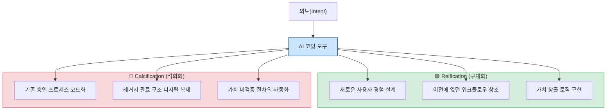
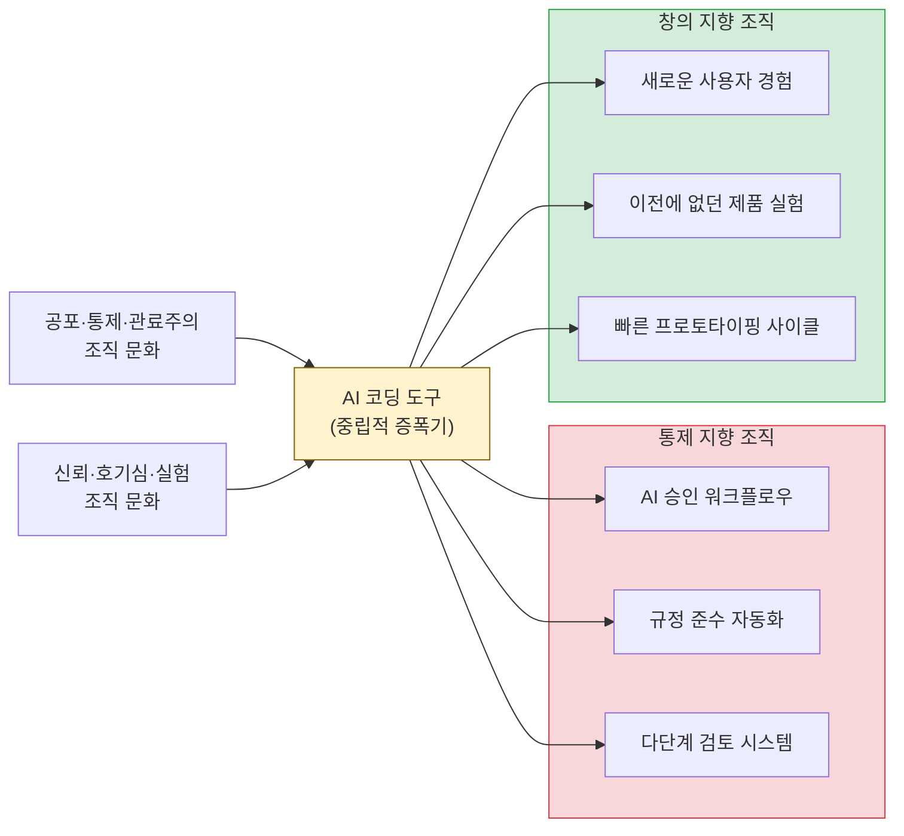
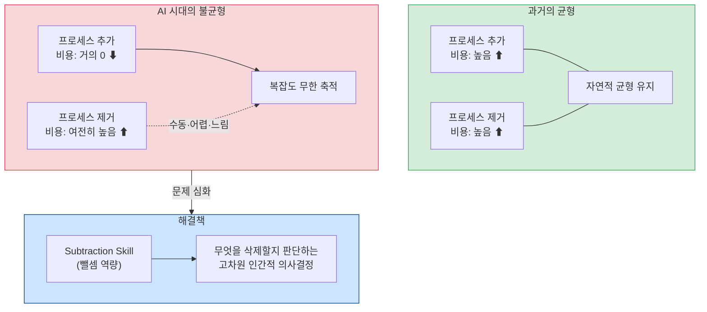
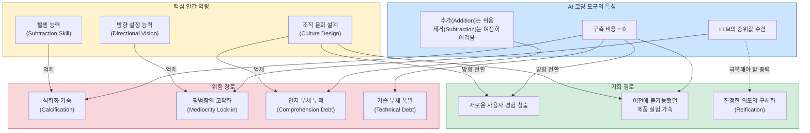
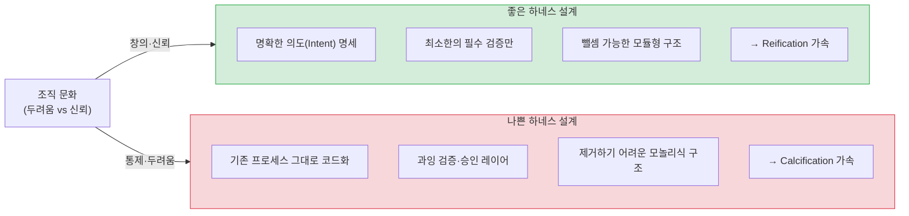
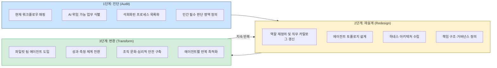
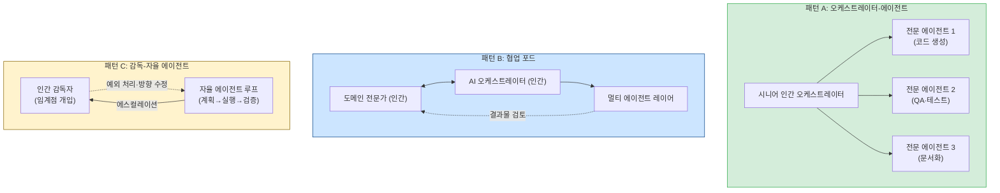
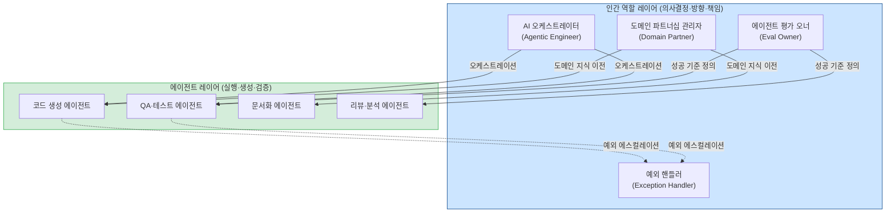
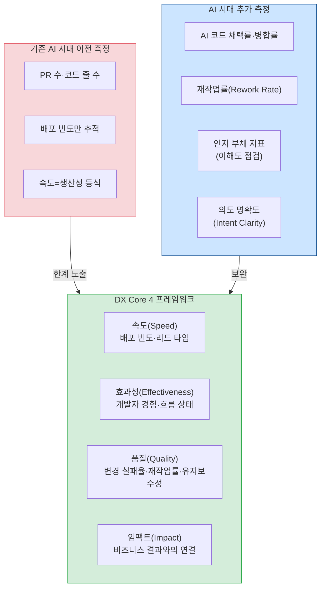

> **원문 출처**: [@ayi_ainotes X(트위터) 스레드](https://x.com/ayi_ainotes/status/2065437024018899307) 및 [@garrytan 원글](https://x.com/garrytan/status/2065416181943865611)  
> **분석 작성**: 2026-06-13

---

## 1. 이 논쟁이 시작된 배경

2026년 6월, Y Combinator(YC)의 CEO 개리 탄(Garry Tan)이 X(구 트위터)에 짧지만 날카로운 글을 올렸다. "AI 코딩 도구가 창업자들을 자유롭게 해줄 것이라고 모두들 생각한다. 그런데 사람들이 실제로 그것으로 무엇을 만드는지 보라. 규칙, 승인 절차, 프로세스, 계층 구조. 더 빠르게 조립된 같은 우리(cage)다." 이 발언은 AI 코딩 도구 분야에서 가장 열렬한 지지자 중 한 명으로 꼽히는 인물이 한 것이었기에 더욱 주목을 받았다.

개리 탄은 단순한 기술 논평가가 아니다. 그는 2026년 초 자신의 Claude Code 워크플로우 설정인 'gstack'을 오픈소스로 공개해 GitHub에서 12,000개 이상의 별을 받은 인물이다. 그는 2026년 SXSW에서 AI 코딩 보조 도구에 심취한 나머지 수면이 4시간으로 줄었고 흥분 상태를 유지하기 위해 각성제가 필요 없어졌다고 고백할 정도였다. 자신이 직접 이 도구들의 능력을 극한까지 실험하는 사람이 "AI 코딩 도구는 더 빠른 관료주의를 만들 수도 있다"고 경고한 것이다.

이 트윗에 @ayi_ainotes라는 중국어권 테크 논평가가 달린 리플라이 스레드와 다양한 답변들이 합쳐지면서, 2026년 AI 소프트웨어 개발 담론에서 가장 많이 회자되는 논쟁 중 하나가 만들어졌다.

---

## 2. 개리 탄의 원글: 핵심 주장 해부

개리 탄의 원글은 세 가지 문장으로 요약할 수 있다.

**첫 번째 관찰**: "AI 코딩 도구가 창업자들을 자유롭게 해준다고 모두들 생각한다. 하지만 사람들이 실제로 그것으로 무엇을 만드는지 보라. 규칙, 승인, 프로세스, 계층. 더 빠르게 조립된 같은 우리다."

이것은 관측(observation)이다. AI 코딩 도구를 활용해 빠르게 무언가를 만들 수 있게 되었을 때, 사람들이 실제로 구축하는 것의 상당 부분이 새로운 경험이 아니라 기존 관료적 구조를 디지털화한 버전이라는 지적이다. 검토 프로세스, 다단계 승인, 규정 준수 워크플로우 등이 AI의 힘을 빌어 더 빠르게, 더 촘촘하게 만들어지고 있다는 것이다.

**두 번째 명제**: "무엇이든 오후 한나절 만에 구현할 수 있는 도구는 당신의 관료주의도 오후 한나절에 구현할 것이다. 구축의 속도가 곧 석회화(calcification)의 속도다."

여기서 '석회화'라는 단어가 매우 중요하다. 석회화는 원래 생물학 용어로, 뼈나 조직에 칼슘이 침착되어 딱딱하게 굳는 현상을 의미한다. 개리 탄은 이 단어를 은유적으로 사용하여 조직 구조가 점점 경직되어가는 현상을 묘사한다. 과거에는 새로운 프로세스를 만드는 데 비용이 많이 들었기 때문에 자연스러운 도태 기제가 작동했다. 쓸모없는 절차는 비용 때문에 살아남지 못했다. 그런데 AI가 구축 비용을 0에 가깝게 만들면서, 이 자연선택 메커니즘이 제거되었다. 이제 석회화는 바이러스처럼 빠르게 퍼진다.

**세 번째 처방**: "이전에는 없던 새로운 경험을 만들어낼 수 있는 것을 구축하라."

이것은 단순한 방법론적 조언이 아니다. 핵심은 'new experiences that didn't happen before'라는 표현에 있다. AI를 이용해 기존 프로세스를 가속화하는 것이 아니라, AI가 없었다면 원천적으로 불가능했을 완전히 새로운 경험을 창조하는 것이 진정한 가치 창출이라는 주장이다.

---

## 3. @ayi_ainotes의 중국어 논평: "컴파일러 달린 거울"

중국어권 테크 논평가 @ayi_ainotes는 이 트위터를 공유하며 자신의 분석을 덧붙였다. 이 논평은 개리 탄의 관찰을 더 철학적이고 체계적인 틀로 발전시킨다.

### 3.1. 구축 비용의 역할에 대한 재발견

그런데 AI 코딩 도구가 등장하면서 이 구현 비용이 한 오후로 줄어들었다. 비용이라는 필터가 사라진 순간, 복잡도는 무제한으로 번식하기 시작했다. 원래라면 "이건 만들기엔 너무 번거롭다"는 이유로 사라졌을 절차들이 이제는 가뿐하게 현실화된다.

### 3.2. "AI는 이미 우리 안에 있는 것을 증폭시킬 뿐"

그는 마지막으로 다음과 같이 결론짓는다. **"우리는 AI로 낡은 프로세스를 더 빠르게 돌리는 것에 급급해서는 안 된다. AI를 이용해 낡은 프로세스 전체를 삭제하고, 이전에는 없었던 경험을 재창조해야 한다. 그렇지 않으면 효율은 이기더라도 방향은 잃게 된다."**

---

## 4. 핵심 개념 심층 해설

### 4.1. Reification(구체화)과 Calcification(석회화)의 차이

개리 탄의 원글에서 가장 철학적으로 깊은 문장은 스레드 하단에 등장한 한 댓글 형태의 보충 설명이다.

> "Software engineering is the reification of intent. Don't conflate calcification for reification."  
> **(소프트웨어 공학은 의도의 구체화다. 석회화를 구체화로 혼동하지 마라.)**

이 두 단어의 차이를 이해하는 것이 이 논쟁의 핵심이다.

**Reification(구체화)** 은 추상적인 의도나 아이디어를 실체 있는 형태로 만들어내는 행위다. 소프트웨어 공학의 정수는 "내가 이런 경험을 사용자에게 제공하고 싶다"는 의도를 코드라는 실체로 변환하는 과정이다. AI가 이 과정을 가속화한다면, 그것은 진정한 의미의 생산성 향상이다.

**Calcification(석회화)** 은 경직화, 굳어짐이다. 기존에 존재하던 규칙이나 프로세스가 아무런 반성 없이 그대로 코드로 옮겨지고, 그것이 쌓이고 굳어지는 현상이다. 이것은 의도의 구체화가 아니라, 관성의 자동화다.

AI 코딩 도구는 둘 다를 똑같이 빠르게 만들어준다. 문제는 많은 조직이 reification을 하고 있다고 착각하면서 사실은 calcification을 하고 있다는 점이다.

### 4.2. AI는 조직 문화의 증폭기

스레드의 여러 댓글 중에서 다음 문장이 이 논쟁을 가장 정확하게 요약한다.

> "If an org is built on fear, control & bureaucracy, AI can scale all 3. But AI can also scale trust, curiosity & experimentation."

이 관점은 @ayi_ainotes의 "거울" 비유와 완전히 일치한다. AI는 조직의 기존 문화를 반영하고 증폭한다. 공포(fear), 통제(control), 관료주의(bureaucracy) 위에 세워진 조직은 AI를 통해 그 세 가지 모두를 확장한다. 신뢰(trust), 호기심(curiosity), 실험(experimentation) 위에 세워진 조직은 AI를 통해 그 역량을 폭발적으로 증대한다.

---

## 5. 댓글들이 드러내는 다층적 시각들

### 5.1. "뺄셈이 새로운 희소 기술"

스레드에서 가장 통찰력 있는 반론 중 하나는 다음과 같은 관점이다.

> "Half disagree. The cage isn't built by speed, it's built by accumulation. Construction used to be expensive, which quietly forced pruning. Now adding is free and removing is still manual, so process only piles up. Subtraction is the new scarce skill."

이 댓글은 문제를 더 정확하게 진단한다. 석회화의 진짜 원인은 속도가 아니라 비대칭성(asymmetry)이다. 추가(addition)는 이제 공짜지만, 제거(subtraction)는 여전히 수동이고 어렵고 비싸다. 과거에는 프로세스를 추가하는 것 자체가 비쌌기 때문에 추가와 제거 사이에 자연스러운 균형이 있었다. 이제 그 균형이 깨졌다.

따라서 AI 시대에 진정으로 가치 있는 능력은 더 빠르게 만드는 것(addition)이 아니라 과감하게 지우는 것(subtraction)이다. 어떤 프로세스가 실제로 필요한가를 판단하고 불필요한 것을 제거하는 능력은 AI가 대체할 수 없는 고차원의 인간적 판단이다.

### 5.2. LLM의 중위값 수렴 현상

한 댓글은 LLM의 본질적 한계를 정확하게 짚는다.

> "Every LLM drifts towards median developer capabilities, and so without pushing the envelope with a clear vision, low end developers get far better, but visionaries stay frustrated."

이 주장은 LLM의 학습 방식과 깊이 연관된다. 대규모 언어 모델은 방대한 코드베이스와 기술 문서를 학습했으며, 그 학습 데이터는 '평균적 개발자'의 사고 패턴과 해결 방식으로 수렴한다. 결과적으로 LLM은 중위값 개발자의 수준을 빠르게 근접한다. 하위 수준의 개발자는 LLM의 도움으로 극적인 생산성 향상을 경험한다. 그러나 이미 그 중위값을 훨씬 상회하는 고수 개발자나 비저너리(visionary)에게는 오히려 LLM이 자신의 사고 흐름을 방해하거나 이미 알고 있는 것만 돌려주는 한계로 느껴진다.

더 나아가, 이 댓글은 다음과 같이 이어진다: "스티브 잡스였다면 이 모델들 중 어느 것도 쓰는 것을 싫어했을 것이다." 이것은 중위값으로의 수렴이 창의성과 혁신에 대해 함의하는 바를 극단적으로 표현한 것이다. 잡스의 디자인 철학은 평균적인 사용자가 원하는 것이 아니라 그들이 아직 알지 못하는 것을 만드는 것에 있었다. AI가 제안하는 '평균'이 혁신을 가로막는 중력이 될 수 있다는 경고다.

이 댓글은 투자자에 대한 신랄한 비판으로도 이어진다: "YC, SoftBank, a16z, Sequoia, 이들 모두 충분히 크게 생각하지 못했다. 무슨 일이 닥칠지 전혀 모른다." 이는 현재 AI 투자 생태계가 LLM의 평균화 효과에 안주하며 진정한 혁신적 비전을 놓치고 있다는 비판이다.

### 5.3. 하네스(Harness)의 필요성과 아이러니

스레드에서 가장 기술적으로 흥미로운 댓글은 다음과 같다.

> "Not producing anything reliable or repeatable without a good harness, which means rules, process, etc. LLMs currently incapable of self governance in this area."

그리고 이어지는 논점:

> "not really, 90% of AI produced code is not mergeable. wrote a custom harness to test it. It handles most of the path from PRD to merge with very little human involvement."

이 댓글은 개리 탄의 주장에 내재된 아이러니를 정확히 포착한다. LLM이 신뢰할 수 있고 반복 가능한 코드를 생산하려면 규칙(rules), 프로세스(process), 검증 절차가 반드시 필요하다. 즉, 하네스(harness)가 필요하다. 그런데 하네스 자체가 규칙과 프로세스의 집합이다. AI로 관료주의 없는 개발을 하고 싶다면, 역설적으로 AI를 통제하기 위한 정교한 규칙과 프로세스 체계를 구축해야 한다. 이것은 `Agent = Model + Harness` 공식이 내포하는 핵심 딜레마다.

2026년 현재 AI가 생성한 코드의 약 90%가 그대로 병합(merge) 불가능하다는 연구 결과는 이 딜레마의 현실적 심각성을 보여준다. AI는 코드를 빠르게 생성하지만, 그것이 실제 프로덕션 환경에 통합되려면 여전히 상당한 인간의 검토와 개입이 필요하다.

### 5.4. "쓸모없는 일자리가 쓸모없는 에이전트로 대체된다"

> "Bullshit jobs being replaced by bullshit agents"

이 댓글은 짧지만 강렬하다. 경제학자 데이비드 그레이버(David Graeber)가 제시한 '개소리 직업(Bullshit Jobs)' 개념을 AI 에이전트에 적용한 것이다. 그레이버는 현대 경제에서 존재 이유를 설명하기 어려운 직업들—특히 관료적 중간 관리직—이 폭발적으로 증가했다고 주장했다. 이 댓글은 AI가 단순히 생산성을 높이는 것이 아니라, 실제로는 불필요했던 인간 업무를 불필요한 AI 에이전트 업무로 대체할 뿐이라는 냉소적 시각을 담고 있다. 잡스가 없었다면 사라졌을 불필요한 프로세스를 AI가 더 빠르게, 더 저렴하게 자동화해주는 셈이다.

### 5.5. 법적·규제적 환경에서의 관료주의 옹호론

균형 잡힌 시각을 제공하는 댓글도 있다.

> "Yes and no. IF what needs building actually needs bureaucracy (needs to deal with legal systems) it is a must and so that cage is needed - you just build it so much faster."

의료, 금융, 법률, 항공 등 규제 산업에서 절차와 승인 체계는 단순한 관료주의가 아니라 안전과 법적 책임의 핵심이다. AI가 이런 분야에서 복잡한 컴플라이언스 워크플로우를 빠르게 구현해준다면, 그것은 개리 탄이 비판하는 무가치한 석회화가 아니라 필수적인 구체화(reification)일 수 있다. 문제는 이 두 가지를 구별하는 판단력이다.

---

## 6. 개리 탄이라는 인물과 이 발언의 맥락

이 논쟁을 더 입체적으로 이해하려면 개리 탄 자신의 AI 코딩 여정을 알아야 한다.

### 6.1. gstack: YC CEO의 AI 코딩 설정

2026년 3월, 개리 탄은 자신의 Claude Code 워크플로우 설정인 **gstack**을 MIT 라이선스 오픈소스로 공개했다. gstack은 Claude Code를 단순한 코드 생성기로 쓰는 대신, CEO, 엔지니어링 매니저, 디자이너, QA 엔지니어 등 서로 다른 역할을 가진 AI 에이전트들의 팀으로 재구성한다. 23개의 특화 도구로 구성되어 있으며, '지휘자 에이전트(conductor agent)'가 코드 한 줄도 작성하기 전에 전략적 검토를 강제하는 구조를 갖추고 있다.

이 gstack 공개 이후 한 CTO는 탄에게 "당신의 설정은 완전히 미쳤어요. 이건 갓 모드(God Mode)야"라고 DM을 보냈을 정도였다.

그러나 탄이 하루 37,000줄의 코드를 5개 프로젝트에 배포한다고 자랑하자, 폴란드의 시니어 소프트웨어 엔지니어가 실제 결과물을 분석해 공개적으로 반박했다. 분석에 따르면 탄의 코드베이스에는 명백한 낭비, 중복, 그리고 초급자 수준의 실수들이 발견되었다. 량(quantity)이 질(quality)을 보장하지 않는다는 교훈이었다.

### 6.2. "Cyber Psychosis"

SXSW 2026에서 탄은 빌 걸리(Bill Gurley)와의 대담 중 AI 코딩 도구에 너무 몰입한 나머지 수면이 4시간으로 줄었다고 고백했다. 그는 이전에 집중력 유지를 위해 사용하던 각성제(modafinil) 없이도 이 흥분 상태가 유지된다고 말하며 이를 "사이버 사이코시스(cyber psychosis)"라고 불렀다. 그는 자신이 아는 CEO 중 3분의 1이 같은 상태라고 언급했다.

이런 맥락에서 개리 탄의 "AI 코딩 도구가 관료주의를 빠르게 만든다"는 경고는 단순한 이론이 아니다. 그는 직접 이 도구들의 한계와 역설을 몸소 체험한 사람으로서 발언하고 있다.

---

## 7. 실제 데이터로 본 2026년 AI 코딩의 현주소

이 논쟁을 데이터로 뒷받침하는 연구 결과들이 2026년 들어 속속 발표되고 있다.

### 7.1. 생산성 역설 (Productivity Paradox)

Faros AI의 분석에 따르면 10,000명 이상의 개발자를 대상으로 한 조사에서, AI를 많이 사용하는 팀은 개발자당 PR(Pull Request)을 98% 더 많이 생성했지만 PR 검토 시간도 91% 증가했으며 실제 개발 속도에는 측정 가능한 개선이 없었다. 개인 수준의 생산성 향상이 PR 리뷰 적체, 통합 작업, 품질 문제 등의 조직적 마찰로 상쇄된 것이다.

또 다른 보고서에 따르면 2025년 AI 엔지니어링 보고서에서 AI 도입 증가와 함께 개발자당 버그가 9% 증가했던 반면, 2026년에는 그 수치가 54%로 크게 높아졌다. AI 채택이 깊어질수록 결함률과의 상관관계가 약해지는 것이 아니라 오히려 가팔라지고 있다.

### 7.2. 인지 부채 (Comprehension/Cognitive Debt)

Addy Osmani는 AI가 생성한 코드의 숨겨진 비용으로 '인지 부채(Comprehension Debt)'를 제안했다. 성과 평가 위원회는 속도 향상을 볼 수 있지만, 이해 결손(comprehension deficit)은 볼 수 없다. 조직이 산출물을 측정하는 방식이 더 이상 중요한 것을 포착하지 못한다는 것이다.

2026년 2월, 켄트 벡(Kent Beck)과 마틴 파울러(Martin Fowler)를 포함한 약 50명의 테크 리더들이 애자일 선언 25주년을 맞아 "AI가 코드를 다룬다면 엔지니어링은 어디로 가는가?"라는 핵심 질문을 탐구했다. 그들의 결론 중 하나는 "속도는 지속 가능하지 않다(Velocity without understanding is not sustainable)"는 것이었다.

### 7.3. 2025년은 속도, 2026년은 품질

2025년이 AI 속도의 해였다면 2026년은 AI 품질의 해가 될 것이라는 분석이 나오고 있다. 2025년에는 PR 처리량, diff 규모, 사이클 시간, AI 보조 변경의 원시 수치가 성과 지표였다면, 2026년에는 결함 밀도, 검토 부하, 병합 신뢰도 점수, 테스트 커버리지, 장기 유지보수성 지표가 핵심 KPI로 부상하고 있다.

---

## 8. 개념 종합: AI 코딩의 역설 지형도

이 스레드에서 논의된 개념들을 하나의 프레임으로 종합하면 다음과 같다.

---

## 9. 하네스 엔지니어링의 아이러니: 왜 프로세스가 필요한가

이 논쟁에서 간과되기 쉬운 중요한 역설이 있다. AI 코딩의 무질서한 사용을 통제하기 위한 하네스(harness)가 결국 또 다른 규칙과 프로세스 체계를 요구한다는 점이다. 이것은 단순한 아이러니가 아니라, 2026년 AI 엔지니어링의 핵심 도전 중 하나다.

AI 에이전트가 신뢰할 수 있는 출력을 지속적으로 생성하려면 다음이 필요하다:
- 맥락을 정의하는 시스템 프롬프트와 규칙
- 결과물을 검증하는 파이프라인
- 에이전트 간 조율을 위한 오케스트레이션 로직
- 실패 시 복구를 위한 폴백 메커니즘

이 구성 요소들의 합이 곧 하네스다. 그런데 하네스는 본질적으로 규칙과 프로세스의 집합이다. 즉, 관료주의 없는 AI 코딩을 원한다면, 반드시 AI를 위한 '구조화된 관료주의'를 먼저 만들어야 한다. 이것이 `Agent = Model + Harness` 공식의 핵심이다.

좋은 하네스는 불필요한 석회화를 방지하고 의미 있는 reification을 가속화하는 구조를 갖는다. 나쁜 하네스는 기존의 관료적 절차를 그대로 자동화하여 더 촘촘한 석회화를 만들어낸다. 따라서 하네스 설계 자체가 조직의 AI 활용 방향성을 결정하는 핵심 아키텍처 의사결정이다.

---

## 10. AX 전환의 시작: 경영진·의사결정자 관점의 조직 변환 로드맵

기술적 차원에서 하네스가 AI 에이전트의 행동을 구조화한다면, 조직적 차원에서는 이에 상응하는 인적·구조적 변환이 반드시 병행되어야 한다. 이것이 AI Transformation, 즉 AX(에이엑스)의 핵심 과제다. 그런데 이 논의에서 가장 먼저 짚어야 할 것은 경영진이 범하는 가장 흔한 실수다.

Deloitte의 분석은 이를 다음과 같이 표현한다: "자율적 AI 에이전트를 인간 노동자를 위해 설계된 운영 모델에 그대로 붙이는 것은, 자전거에 제트 엔진을 다는 것과 같다." 더 충격적인 것은 그 수치다. Deloitte 조사에 따르면 84%의 기업이 자동화 기대치는 높으면서도 AI에 맞게 직무를 재설계하지 않은 상태다. 도구는 도입했지만 조직은 그대로인 것이다. 이것이 바로 개리 탄이 경고한 '더 빠른 우리' 현상의 조직적 근원이다.

### 10.1. AX 전환의 핵심 전제: 도구 업그레이드가 아닌 조직 재설계

AX에 실패하는 조직의 공통점은 AI를 IT 프로젝트로 취급한다는 것이다. AI 도구를 도입하고, 기존 팀 구조에 얹고, 나머지는 알아서 되기를 기대한다. 그러나 AI는 도구(tool)가 아니라 동료(teammate)의 위상으로 운영되는 순간 전혀 다른 조직 설계 원칙을 요구한다. AI를 도구로 취급하는 조직은 기존 워크플로우를 가속화하고(calcification), AI를 동료로 취급하는 조직은 워크플로우 자체를 재설계한다(reification).

AX 전환에서 경영진이 먼저 답해야 할 세 가지 질문이 있다.

첫째, "우리는 지금 AI로 무엇을 빠르게 하고 있는가?"가 아니라 "AI 때문에 무엇을 아예 하지 않아도 되는가?"다. 이것이 뺄셈(subtraction)의 전략적 표현이다. 둘째, "어떤 업무를 AI 에이전트에게 위임할 것인가, 어떤 업무는 반드시 인간이 보유할 것인가?"다. 이 경계를 의식적으로 설계하지 않으면 경계는 임의로 결정된다. 셋째, "에이전트가 잘못된 결정을 내릴 때 누가 책임을 지는가?"다. AI 에이전트는 책임을 질 수 없다. 에이전트의 책임 소재를 명확히 하는 것은 거버넌스의 핵심이다.

### 10.2. AX 전환 로드맵: 3단계 접근

경영진 관점에서 AX 전환은 단번에 이루어지는 빅뱅 재조직이 아니다. 에이전트 하나하나를 도입하면서 조직 구조도 함께 진화시켜나가는 점진적·반복적 과정이다.

1단계 진단에서 가장 중요한 작업은 현재 조직에서 '진짜 필요한 프로세스'와 '관성으로 유지되는 프로세스'를 구분하는 것이다. 이 구분 없이 2단계로 넘어가면, AI는 기존의 모든 프로세스를 더 빠르게 실행하는 엔진이 될 뿐이다.

2단계 재설계는 역할과 책임의 재구성이다. AI 에이전트가 새로운 역할을 맡는 순간, 기존 인간의 역할은 그 에이전트를 '관리'하고 '방향을 제시'하는 상위 역할로 이동한다. 이 이동을 명시적으로 설계하지 않으면 역할 진공(role vacuum)이 발생하고, 아무도 책임지지 않는 에이전트가 조직 내에 떠돌게 된다.

3단계 변환은 파일럿에서 시작해 에이전트 단위로 확장하는 방식이 권장된다. 전체 조직을 한 번에 바꾸려는 시도는 실패 확률이 높다. 한 팀, 한 워크플로우, 한 에이전트씩 도입하고 학습하고 최적화하는 반복 사이클이 실질적 성과를 낸다.

---

## 11. 기존 팀·부서 구조와 AI 에이전트의 통합 설계

기존 조직 구조와 AI 에이전트를 어떻게 통합할 것인가는 AX에서 가장 실무적이고 즉각적인 질문이다. PwC는 2026년 AI 기업 예측 보고서에서 이 변화를 "전문가의 부상(Rise of the Generalist)"이라는 개념으로 설명한다. AI 이전의 조직은 깊은 기능별 전문화, 키 큰 조직도, 좁은 역할 정의로 구성되어 있었다. AI 이후의 조직은 더 넓고 결과 중심적인 역할로 이동한다.

소프트웨어 개발팀을 예로 들면, 과거에는 솔루션 아키텍처 수립, 사용자 스토리 작성, 테스트 케이스 생성, 트러블슈팅, 리뷰, 문서화의 각 단계마다 별도의 인력이 필요했다. 이제는 경험 있는 시니어 엔지니어 한 명이 이 모든 단계에서 AI 에이전트 팀을 오케스트레이션(orchestration)할 수 있다. 실제로 AI를 깊이 통합한 팀들은 8~12명 규모의 전통적 팀을 3~4명 규모의 고밀도 포드(pod)로 재편하면서 개발 사이클 타임을 40~70% 단축하고 있다는 분석이 나오고 있다.

### 11.1. 에이전트를 새 팀원으로 대하는 조직 설계 원칙

AI 에이전트를 조직에 통합할 때 가장 실용적인 원칙은 "에이전트를 신규 입사자처럼 대우하라"는 것이다. 신규 입사자에게 필요한 것이 무엇인지 생각해보면, 그것이 그대로 에이전트 통합 체크리스트가 된다.

각 에이전트를 조직에 배치하기 전에 반드시 답해야 할 세 가지 질문이 있다. 첫째, **누가 이 에이전트를 소유(Own)하는가?** 에이전트의 출력에 대해 궁극적으로 책임지는 인간 소유자가 있어야 한다. 둘째, **누가 '잘한다'는 것의 기준을 정의하고 검증(Eval)하는가?** 에이전트의 성공 기준을 정의하는 사람 없이 배포된 에이전트는 방치된 에이전트다. 셋째, **누가 예외 상황(Edge Case)을 처리하는가?** 모든 에이전트는 결국 자신의 능력 범위를 벗어나는 상황을 만난다. 그 순간을 처리할 인간 핸들러가 명확해야 한다.

이 세 가지를 채우지 못한 채 배포된 에이전트는 '조직도에 없는 직원'이 되고, 그것이 쌓이면 에이전트 부채(agent debt)가 된다.

### 11.2. 인간-에이전트 하이브리드 팀 구성 패턴

팀 수준에서 인간과 에이전트의 통합은 크게 세 가지 패턴으로 나타난다.

패턴 A는 현재 가장 일반적인 형태로, 경험 있는 시니어 인간이 여러 전문 에이전트를 지휘한다. 개리 탄의 gstack이 바로 이 패턴을 개인 수준에서 구현한 것이다. 패턴 B는 도메인 전문성과 AI 오케스트레이션 역량을 가진 두 인간이 협력하며 에이전트 레이어를 공동 운용한다. 패턴 C는 에이전트의 자율성이 높고 인간은 예외 상황과 임계점에서만 개입하는 구조로, 아직은 성숙한 하네스가 갖춰진 한정적 도메인에서만 실용적이다.

어떤 패턴을 선택하느냐는 도메인의 규제 수준, 오류 허용 범위, 팀의 AI 성숙도에 따라 달라진다. 중요한 것은 패턴을 의식적으로 선택하고 설계해야 한다는 것이다. 기본값은 없다.

---

## 12. 업무 재정의와 에이전트 토폴로지

AI 에이전트가 조직에 통합될 때 인간의 역할이 어떻게 변하는가는 AX에서 가장 실존적인 질문이다. 단순화된 답변—"AI가 일자리를 빼앗는다" 혹은 "AI가 새로운 일자리를 만든다"—은 둘 다 부정확하다. 더 정확한 표현은 "AI 에이전트가 실행(execution)을 맡으면서, 인간의 역할이 오케스트레이션(orchestration)으로 이동한다"는 것이다.

### 12.1. 오케스트레이션: 2026년의 새로운 관리 역량

오케스트레이션은 단일 기술이 아니라 다섯 가지 역량의 클러스터다. 이 역량들을 갖춘 관리자는 하이브리드 인간-AI 환경에서 효과적으로 리드할 수 있고, 갖추지 못한 관리자는 점점 더 큰 어려움을 겪는다.

첫째, **위임 설계(Delegation Design)** 다. 어떤 업무를 AI 에이전트에게 위임하고, 어떤 업무는 인간이 보유할 것인지를 결정하는 능력이다. 이것은 관리자가 팀원에게 업무를 배분하는 것과 비슷하지만, AI의 능력 범위, 신뢰 수준, 에러 패턴을 정확히 이해해야 하는 점에서 더 복잡하다.

둘째, **워크플로우 아키텍처(Workflow Architecture)** 다. 인간과 AI 에이전트가 어떻게 협력할 것인지를 설계하는 능력이다. 핸드오프 지점, 병목 가능 구간, 예외 처리 흐름을 미리 설계하지 않으면 시스템은 실제 운영에서 예측 불가능하게 작동한다.

셋째, **책임 유지(Accountability Maintenance)** 다. 모든 중요한 결과물에 대해 명확한 인간 책임 소재를 유지하는 능력이다. AI 에이전트는 책임을 질 수 없다. 에이전트가 생성한 결과물이라도 그것을 승인하고 배포한 인간에게 책임이 있다.

넷째, **성과 거버넌스(Performance Governance)** 다. AI 에이전트의 성과를 인간 팀원과 동일한 수준의 엄격함으로 모니터링하는 능력이다. 에이전트는 조용히 성능이 저하될 수 있다. 정기적인 평가 없이는 이를 감지하기 어렵다.

다섯째, **에스컬레이션 판단(Escalation Judgment)** 다. 자동화된 워크플로우에서 어떤 상황이 인간의 직접 개입을 요구하는 임계점인지를 판단하는 능력이다. 이 판단을 너무 보수적으로 하면 자동화의 이점이 사라지고, 너무 관대하게 하면 통제 불능의 에이전트가 된다.

### 12.2. 에이전트 토폴로지: 새로운 역할 지형도

에이전트 토폴로지란 조직 내에서 AI 에이전트들이 어떤 구조로 배치되고 서로 어떻게 연결되는지를 의미한다. 팀 토폴로지(Team Topologies)가 인간 팀들의 상호작용 패턴을 설계하는 프레임워크였다면, 에이전트 토폴로지는 인간-에이전트 복합 팀들의 상호작용 패턴을 설계하는 프레임워크다.

이 새로운 지형에서 부상하는 핵심 역할들이 있다. **AI 오케스트레이터/에이전틱 엔지니어**는 코드 한 줄을 직접 작성하는 대신 여러 AI 에이전트를 지휘·조율하며 출력을 검증하고 아키텍처 일관성을 유지하는 역할이다. **AI 인터랙션 디자이너**는 인간과 에이전트가 어떻게 협력하는지의 UX를 설계하는 역할로, 특히 에이전트의 인지 부하(cognitive load)가 사용자에게 어떻게 전달되는지를 관리한다. **에이전트 평가 오너(Eval Owner)** 는 에이전트의 성공 기준을 정의하고 지속적으로 그 기준에 맞게 에이전트가 작동하는지를 검증하는 역할이다. **도메인 파트너십 관리자**는 특정 도메인의 전문 지식을 에이전트에게 이전(transfer)하고, 에이전트가 그 지식을 올바르게 적용하는지 감독하는 역할이다.

중요한 것은 이 새로운 역할들이 기존 역할들과 평행하게 공존하는 것이 아니라, 기존 역할들이 이 방향으로 진화한다는 점이다. 기존 시니어 개발자는 에이전틱 엔지니어로, 기존 QA 엔지니어는 에이전트 평가 오너로, 기존 도메인 전문가는 도메인 파트너십 관리자로 역할이 이동한다. Mercer의 분석은 이를 "직무 아키텍처가 정적 프레임워크에서 인간-에이전트 협업의 동적 활성화 도구로 전환되어야 한다"고 표현한다.

---

## 13. KPI·성과 측정 체계의 재설계

개리 탄 스레드에서 논의된 문제들—생산성 역설, 인지 부채, 석회화—은 모두 하나의 근원적 문제와 연결된다. 측정 체계가 현실을 따라가지 못하고 있다는 것이다. 조직이 측정하는 것을 최적화한다는 것은 경영학의 기본 원리다. 잘못된 것을 측정하면 잘못된 방향으로 최적화된다. 2025년 내내 많은 조직이 PR 수, diff 규모, 코드 줄 수를 측정했다. 결과는 더 많은 PR, 더 많은 diff, 더 많은 줄의 코드였다. 그러나 실제 출시 속도, 버그율, 유지보수성은 개선되지 않거나 오히려 악화되었다.

### 13.1. DORA 지표의 진화와 한계

DORA(DevOps Research and Assessment) 지표는 소프트웨어 딜리버리 성능을 측정하는 산업 표준이었다. 배포 빈도(Deployment Frequency), 변경 리드 타임(Lead Time for Changes), 변경 실패율(Change Failure Rate), 평균 복구 시간(MTTR)의 네 가지 지표가 핵심이었다.

그런데 AI 코딩 도구의 확산은 DORA 지표에 새로운 도전을 가져왔다. AI 도구는 배포 빈도를 높이고 리드 타임을 줄일 수 있지만, 그 과정에서 코드 품질이 저하될 수 있다. 2025년 DORA 보고서는 재작업률(Rework Rate)을 다섯 번째 지표로 공식 추가했다. 재작업률은 변경 실패율이 측정하는 즉각적 장애와 달리, 계획되지 않은 재작업—즉 한 번에 제대로 만들어지지 못해 다시 손댄 배포의 비율—을 포착한다. 이것은 AI가 양산하는 '거의 맞지만 완전히 맞지 않은' 코드 문제를 측정하기 위한 직접적인 대응이다.

그러나 DORA 지표만으로는 여전히 부족하다. AI 도구들이 표면적으로 DORA 지표를 개선하면서도 아래에서는 품질이 저하되는 상황이 발생할 수 있기 때문이다. 배포 빈도는 오르고, 리드 타임은 줄어들지만, 코드 유지보수성은 악화되는 것이다.

### 13.2. DX Core 4: AI 시대의 새로운 측정 프레임워크

DORA 지표의 한계에 대응해 등장한 DX Core 4 프레임워크는 딜리버리 성능을 네 가지 차원으로 균형 있게 측정한다.

이 프레임워크에서 특히 주목해야 할 것은 **임팩트(Impact)** 차원이다. 엔지니어링 지표가 비즈니스 결과와 연결되지 않으면, 엔지니어링은 내부 효율 게임으로 전락한다. Adobe의 사례는 이를 잘 보여준다. Adobe는 2024~2026년 동안 DORA 지표(리드 타임 7일→2일), Flow 지표(WIP 제한 강화, 사이클 타임 40% 단축), 개발자 경험(빌드 도구 개선, 로컬 개발 마찰 50% 감소), 그리고 결과 지표(기능 채택률, 매출)를 복합적으로 추적했다. 결과적으로 엔지니어링 생산성이 35% 향상되고, 고객 보고 버그가 28% 감소하며, 새 기능으로 인한 연간 매출이 12% 증가했다.

### 13.3. 속도가 아닌 방향을 측정하는 원칙

2025년 DORA 보고서는 다음과 같이 명확하게 진술한다: "가장 큰 수익은 AI 도구 자체에서 오는 것이 아니라, 내부 플랫폼의 품질, 워크플로우의 명확성, 팀의 정렬(alignment)에 전략적으로 집중하는 데서 온다." 이것은 개리 탄의 경고와 정확히 대응하는 측정 철학이다.

측정 체계를 재설계할 때 적용해야 할 핵심 원칙들이 있다. 우선 **모든 KPI는 비즈니스 결과와 연결되어야 한다**. 어떤 지표가 어떤 의사결정에 활용되는지 설명할 수 없다면, 그 지표는 측정하지 말아야 한다. 다음으로 **속도와 품질을 분리해서 측정하면 안 된다**. 속도 지표 옆에 항상 품질 지표가 붙어야 한다. 빠른 배포가 빠른 버그 배포가 되지 않으려면 두 차원이 함께 보여야 한다. 또한 **인지 부채를 측정하라**. 코드 리뷰 시간, 재작업률, 새 팀원의 온보딩 시간은 코드베이스의 이해 가능성(comprehensibility)을 간접 측정하는 프록시 지표다. 마지막으로 **에이전트의 성과도 인간 팀원과 동일한 기준으로 측정해야 한다**. 에이전트가 생성한 코드의 버그율, 병합률, 재작업률을 추적하지 않으면 에이전트를 개선할 근거가 없다.

---

## 14. 결론: "효율에서 이기고 방향에서 지지 않으려면"

이 스레드 전체를 관통하는 가장 중요한 메시지는 @ayi_ainotes의 마지막 문장에 있다: "효율은 이기더라도 방향은 잃을 수 있다(赢了效率，输了方向)."

AI 코딩 도구는 두 가지 형태로 사용된다. 하나는 기존에 하던 것을 더 빠르게 하는 것이고, 다른 하나는 기존에 하지 못했던 것을 처음으로 가능하게 하는 것이다. 전자는 결국 속도의 경쟁으로 귀결되며, 경쟁자들도 같은 도구를 가지고 있기 때문에 지속 가능한 차별화가 되지 않는다. 후자만이 진정한 의미의 혁신이다.

개리 탄의 경고는 이것이다. AI라는 도구를 손에 쥔 순간, 가장 자연스럽게 하게 되는 일이 "이전에 2주 걸리던 것을 오후에 한다"는 것이다. 그러나 그 '이전에 2주 걸리던 것'이 실제로 해야 할 가치가 있는 일이었는지를 먼저 물어야 한다. 그 질문 없이 속도만 높이면, 잘못된 방향으로 더 빠르게 달리는 것이다.

AX의 관점에서 이 경고는 더 구체적인 형태를 갖는다. 기술 도입만으로는 충분하지 않다. 조직 구조를 재설계하고(Section 10·11), 인간의 역할을 오케스트레이션 중심으로 재정의하며(Section 12), 성과 측정 체계를 속도에서 방향과 품질로 전환하는 것(Section 13)이 함께 이루어질 때만 AI는 석회화의 엔진이 아닌 reification의 엔진이 된다. 그리고 이 모든 변환의 출발점은 기술이 아니라, 더 명확한 인간의 의도(intent)와 조직이 무엇을 위해 존재하는지에 대한 진지한 질문이다.

가장 강력한 AI 활용 방식은 기존 프로세스를 가속화하는 것이 아니라, 기존 프로세스를 통째로 삭제하고 완전히 다른 방식으로 문제를 재정의하는 데 있다. 이것이 진정한 reification이다. 그리고 이를 위해 필요한 것은 더 나은 AI 모델이 아니라, 더 명확한 인간의 의도(intent)와 방향 설정 능력이다.

---

## 요약 카드

| 개념 | 설명 |
|------|------|
| **Calcification (석회화)** | 기존 관료 구조를 AI로 빠르게 코드화, 경직화 심화 |
| **Reification (구체화)** | 새로운 의도를 실체 있는 경험으로 변환하는 진정한 소프트웨어 공학 |
| **컴파일러 달린 거울** | AI는 조직 문화를 반영·증폭하는 중립적 도구 |
| **Subtraction Skill (뺄셈 능력)** | AI 시대의 진짜 희소 역량: 무엇을 삭제할지 판단하는 능력 |
| **LLM 중위값 수렴** | LLM은 평균적 개발자 수준으로 수렴 → 하위 개발자 혜택, 비저너리는 좌절 |
| **Harness의 아이러니** | 신뢰할 수 있는 AI 출력을 위해선 규칙·프로세스가 필수 → 결국 또 다른 구조화 |
| **Bullshit Agents** | 쓸모없는 직업이 쓸모없는 에이전트로 대체될 위험 |
| **인지 부채 (Cognitive Debt)** | AI 생성 코드를 이해 없이 검토·병합할 때 누적되는 보이지 않는 부채 |
| **AX 3단계 로드맵** | 진단(Audit) → 재설계(Redesign) → 변환(Transform)의 반복 사이클 |
| **에이전트 통합 3문항** | 소유자(Own) · 평가 기준(Eval) · 예외 핸들러(Edge Case) 미리 정의 |
| **오케스트레이션 5역량** | 위임 설계·워크플로우 아키텍처·책임 유지·성과 거버넌스·에스컬레이션 판단 |
| **DX Core 4** | 속도(Speed)·효과성(Effectiveness)·품질(Quality)·임팩트(Impact) 복합 측정 |
| **Rework Rate** | DORA 5번째 지표: AI가 만든 '거의 맞지만 완전히 맞지 않은' 코드 문제를 포착 |

---

*작성 일자: 2026-06-13*
