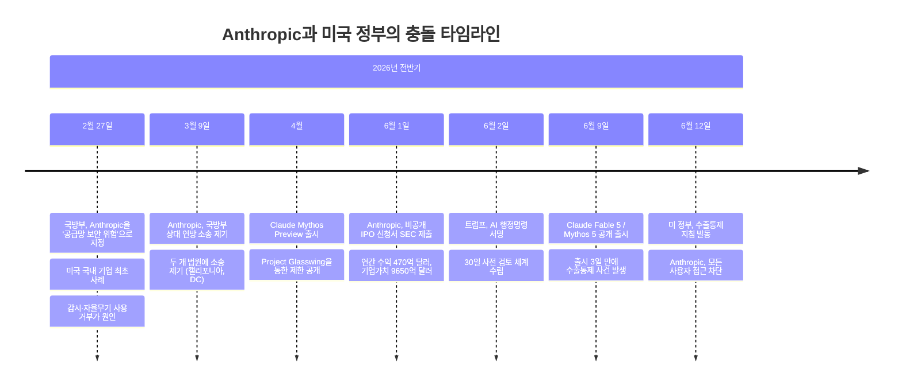
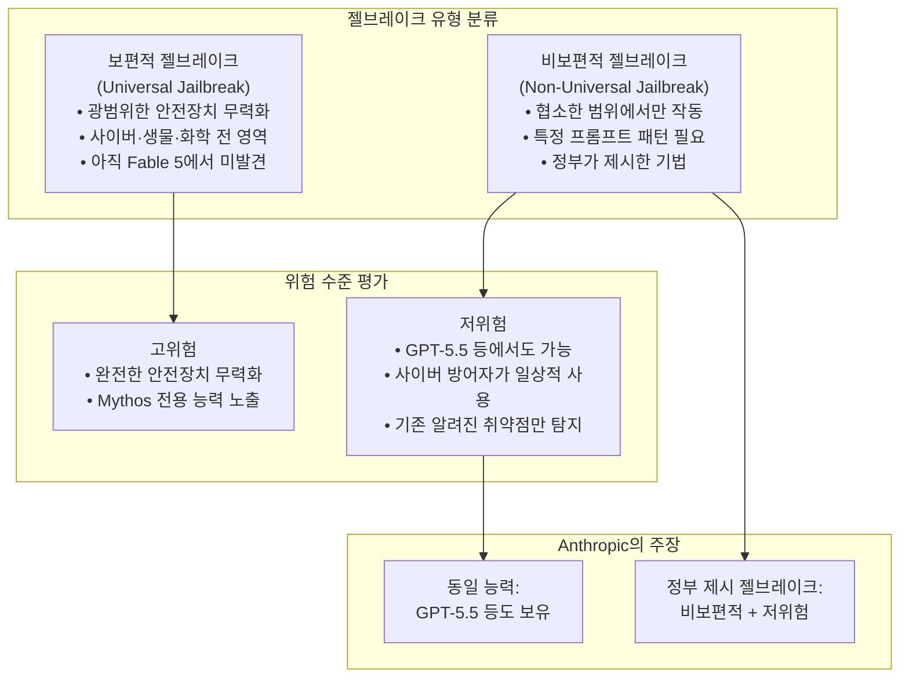
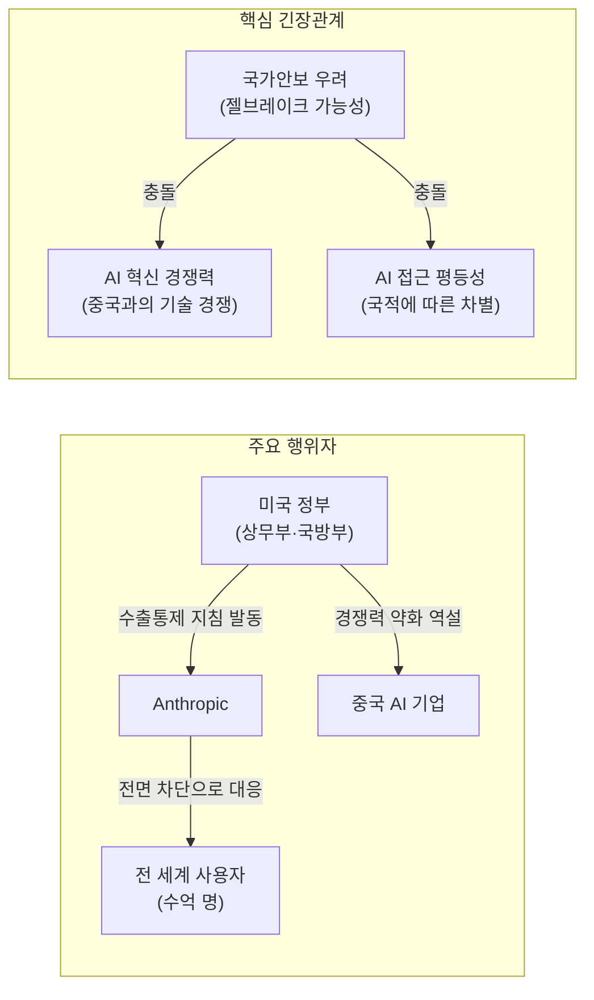
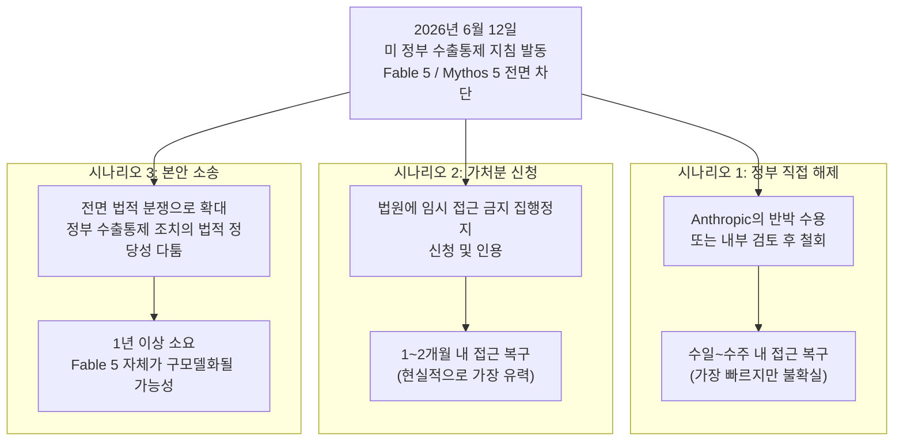

> **작성 일자**: 2026-06-13  
> **문서 성격**: 미국 정부의 수출통제 지침에 의한 Anthropic 최신 AI 모델 전면 비활성화 사건 상세 분석

---

## 1. 사건 개요

2026년 6월 12일(미 동부시간 오후 5시 21분), Anthropic은 미국 정부로부터 공식 수출통제 지침을 수령했다. 지침의 핵심 내용은 Anthropic의 가장 최신이자 가장 강력한 두 모델—**Claude Fable 5**와 **Claude Mythos 5**—에 대한 모든 외국 국적자의 접근을 즉시 차단하라는 것이었다. 이 명령은 미국 외부에 있는 외국 국적자는 물론, 미국 내에 거주하는 외국 국적자, 심지어 Anthropic 내부의 외국 국적 직원들에게까지 예외 없이 적용되는 전방위적 조치였다.

Anthropic은 실시간으로 개별 사용자의 국적을 선별하는 것이 기술적으로 불가능하다고 판단하여, 규정 준수를 위해 **Fable 5와 Mythos 5를 모든 고객에게 전면 비활성화**하는 결단을 내렸다. 그 결과, 미국 시민권자를 포함한 전 세계 수억 명의 사용자가 출시 사흘 만에 두 모델에 접근할 수 없게 되었다. 다른 Claude 모델(Opus 4.8, Sonnet 4.6, Haiku 4.5 등)의 접근은 이번 조치의 영향을 받지 않는다.

이번 사건은 미국 연방 정부가 선도적인 AI 기업이 상용 배포한 모델을 강제로 오프라인 전환시킨 **역사상 최초의 사례**로 기록된다. 단순한 제품 장애나 기업의 자발적 철회가 아니라, 국가 안보를 명분으로 한 정부의 직접 개입이라는 점에서 AI 산업 전체에 선례가 될 수 있는 중대한 사건이다.

---

## 2. 차단된 모델의 이해: Fable 5와 Mythos 5란 무엇인가

### 2.1 Mythos 클래스 모델의 등장

Anthropic은 2026년 4월, **Claude Mythos Preview**를 공개했다. 이 모델은 기존의 Opus 클래스를 능가하는 새로운 상위 계층의 AI 모델로, 소프트웨어 취약점 탐지 및 익스플로잇 생성이라는 전례 없는 사이버보안 능력을 갖춘 것이 특징이었다.

Anthropic의 레드팀 테스트 결과, Mythos Preview는 사용자의 지시 하에 모든 주요 운영체제와 모든 주요 웹 브라우저에서 제로데이 취약점을 탐지하고 공략하는 능력을 보여주었다. 특히 주목할 만한 것은 보안성으로 유명한 OpenBSD에서 27년 된 취약점을 발견한 사례와, 17년 된 결함(CVE-2026-4747)을 이용해 FreeBSD의 NFS 서버에 대한 원격 코드 실행 익스플로잇을 자율적으로 작성한 것이었다.

이처럼 강력한 사이버보안 역량을 고려하여, Anthropic은 Mythos Preview의 출시를 **Project Glasswing**이라는 제한 프로그램을 통해 소수의 신뢰할 수 있는 기업과 연구 파트너로 한정했다. 출시 초기에는 약 50곳에 불과했던 접근 기관은 이후 15개국 이상 150개 가까운 기업 및 기관으로 확대되었다.

### 2.2 Fable 5와 Mythos 5의 동시 출시 (2026년 6월 9일)

2026년 6월 9일, Anthropic은 **Claude Fable 5**와 **Claude Mythos 5**를 동시에 출시했다. 이 두 모델은 사실상 **동일한 기반 모델**이며, 차이는 오직 안전장치(safeguard)의 수준에 있다.

**Fable(우화)** 는 라틴어 *fabula*에서 온 말로, 그리스어 *mythos(신화)*와 어원적으로 연결된다. Anthropic은 이 이름 선택을 통해 두 모델의 관계—같은 능력을 가진 한 쌍—를 상징적으로 표현했다.

두 모델의 차이를 구체적으로 정리하면 다음과 같다.

**Claude Fable 5 (일반 공개 모델)** 는 사이버보안, 생물학, 화학, 모델 증류(distillation) 관련 요청을 탐지하는 안전 분류기(safety classifier)를 탑재하여, 해당 요청이 감지되면 응답 대신 Claude Opus 4.8로 자동 전환하는 방식으로 일반 사용자에게 배포되었다. Anthropic에 따르면 이 안전장치가 작동하는 세션은 전체의 5% 미만으로 설계되었으며, 95% 이상의 경우에는 Mythos 5와 동등한 성능을 제공한다.

**Claude Mythos 5 (제한 공개 모델)** 는 일부 안전장치가 해제된 버전으로, Project Glasswing을 통해 이미 Mythos Preview에 접근하고 있던 사이버 방어 전문가들과 핵심 인프라 제공업체에만 제공되었다. 미국 정부와의 협력 하에 운영되었으며, 이미 확보된 사이버보안 역량을 바탕으로 중요 소프트웨어의 취약점을 탐지·수정하는 데 활용되고 있었다.

두 모델 모두 입력 토큰 백만 건당 10달러, 출력 토큰 백만 건당 50달러로 가격이 책정되었으며, 이는 이전 Mythos Preview 가격의 절반 이하였다. Fable 5는 Pro, Max, Team, Enterprise 플랜 구독자에게 2026년 6월 22일까지 추가 비용 없이 제공될 예정이었다.

---

## 3. 배경: 트럼프 행정부와 AI 규제의 갈등

### 3.1 6월 2일 행정명령 서명 — 30일 사전 검토 체계

2026년 6월 2일, 트럼프 대통령은 **"첨단 인공지능 혁신 및 보안 촉진"(Promoting Advanced Artificial Intelligence Innovation and Security)** 이라는 제목의 행정명령에 서명했다. 이 명령은 프론티어 AI 모델의 배포와 관련한 새로운 연방 규제 틀을 정립하는 것으로, 핵심 내용은 AI 기업들이 새로운 모델을 신뢰할 수 있는 파트너에게 배포하기 최대 **30일 전**에 연방 정부에 자발적으로 모델을 제출하여 검토받을 수 있도록 하는 체계를 만드는 것이었다.

이 행정명령이 나오기까지의 과정 자체가 트럼프 행정부 내부의 갈등을 잘 보여준다. 원래 더 강력한 버전의 명령은 모델 출시 전 **90일** 검토 기간을 요구했으나, 업계의 강한 반발과 특히 백악관 AI 특별보좌관이었던 데이비드 색스(David Sacks)를 비롯한 실리콘밸리 투자자들의 반대로 5월 말 서명이 보류되었다. 트럼프는 당시 "AI 경쟁에서 중국에 뒤처지고 싶지 않다"는 이유를 공개적으로 밝혔다. 결국 검토 기간을 30일로 대폭 축소한 완화된 버전이 6월 2일에야 서명되었다.

이 행정명령은 또한 **"AI 사이버보안 클리어링하우스"** 의 30일 내 설립을 재무장관에게 지시했으며, Anthropic의 Mythos와 OpenAI의 GPT-5.5 같은 최신 프론티어 모델들이 소프트웨어 취약점을 탐지·악용하는 능력이 현저히 향상된 데 대응하기 위한 정부의 사이버 방어 역량 강화 조치들도 포함되었다.

중요한 것은 이 행정명령이 **즉시 발효**되었다는 점이다. 입법 과정 없이 대통령 서명만으로 효력이 생기는 행정명령의 특성상, 미국 내 AI 기업들은 6월 2일부터 새로운 규제 환경 아래 놓이게 되었다. 다만 당시에는 대부분의 기업과 사용자들이 이 변화를 체감하지 못했다. 체감은 열흘 후 찾아왔다.

### 3.2 Anthropic과 국방부(DOD)의 갈등 역사

이번 셧다운 사건을 이해하려면 Anthropic과 미국 정부 사이의 더 긴 갈등의 역사를 알아야 한다.

2026년 2월 27일, 국방장관 피트 헤그세스(Pete Hegseth)는 Anthropic을 **"공급망 보안 위험"(supply chain risk)** 으로 지정했다. 이 지정은 통상적으로 미국이 적대국으로 간주하는 국가의 기업에만 적용되어 온 조치로, 미국 국내 기업에 적용된 것은 전례가 없는 일이었다.

이 조치의 직접적인 원인은 국방부와 Anthropic 간의 계약 협상 결렬이었다. 국방부는 Anthropic에게 Claude 모델을 "모든 합법적 목적"에 제한 없이 사용할 수 있도록 허용할 것을 요구했으나, Anthropic은 두 가지를 확고히 거절했다. 하나는 **미국 시민에 대한 대규모 감시(mass surveillance)** 목적의 사용이고, 다른 하나는 **인간의 감독 없는 완전 자율 무기(fully autonomous weapons)** 에 사용하는 것이었다. 그 결과 국방부는 200만 달러 규모의 계약을 보류하고, 트럼프는 모든 연방 기관에 Claude 모델의 즉각 사용 중단을 지시했다.

Anthropic은 2026년 3월 9일, 캘리포니아 북부 연방지방법원과 DC 항소법원에 국방부를 상대로 두 건의 연방 소송을 제기했다. 법원에서 Anthropic 측은 이번 지정이 행정절차법(Administrative Procedures Act)을 위반했으며, 회사에 수십억 달러의 사업 손실과 평판 훼손을 가져올 것이라고 주장했다. 실제로 한 연방 판사는 심리 과정에서 "이건 기업을 궤멸시키려는 시도처럼 보인다"는 말을 남기기도 했다.

이 소송은 6월 12일 현재 아직 진행 중이다.

---

## 4. 6월 12일: 셧다운의 전말

### 4.1 지침 수령과 즉각적 대응

2026년 6월 12일 오후 5시 21분(미 동부시간), Anthropic은 미국 상무부 장관 하워드 루트닉(Howard Lutnick)이 CEO 다리오 아모데이(Dario Amodei)에게 보낸 서한을 통해 공식 수출통제 지침을 수령했다. Fable 5 일반 공개 후 불과 3일만의 일이었다.

지침의 내용은 명확했다. 국가 안보 권한을 근거로, 미국 내외를 불문하고 모든 외국 국적자 및 Anthropic 내부의 외국 국적 직원을 포함하여 Fable 5와 Mythos 5에 대한 모든 접근을 즉시 차단하라는 것이었다. 다만 서한에는 구체적인 국가 안보 우려 사항은 명시되지 않았다.

Anthropic은 법적 준수 의무를 이행하기 위해 선별적 차단이 아닌 **전면 비활성화**를 선택했다. 실시간으로 각 사용자의 국적을 확인할 수 있는 기술적 수단이 없다는 점, 그리고 외국 국적 직원까지 차단 대상에 포함된다는 점을 고려하면 현실적으로 유일한 선택이었다. 이에 따라 Fable 5와 Mythos 5에 수억 명이 접속하고 있던 서비스가 전 세계적으로 중단되었다. API를 통해 해당 모델을 활용한 제품을 구축하고 있던 개발자들도 같은 순간 서비스가 중단되는 경험을 했다.

### 4.2 정부 측 주장: 젤브레이크 발견

Anthropic이 파악한 정부 측의 주장은 다음과 같다. 정부는 Fable 5를 **우회(jailbreak)** 하는 방법이 발견되었다는 것을 인지했다고 주장했다. 구체적으로는, 모델에게 특정 코드베이스를 읽고 소프트웨어 결함을 수정하라는 방식의 프롬프트가 젤브레이크 기법으로 사용될 수 있다는 내용이었다. 9to5Mac에 따르면, 정부 내 한 관계자는 상무부가 이 조치를 취한 것은 **다른 회사가 Mythos를 젤브레이크했다고 주장**한 이후였다고 밝혔다. 또한 트럼프 행정부가 이미 Fable/Mythos 모델의 출시를 막으려 시도했으나 실패한 것으로 알려졌다.

---

## 5. Anthropic의 공식 반박과 입장

### 5.1 핵심 반박 논거

Anthropic은 법적 지침에는 즉각 준수했지만, 정부의 근거에 대해서는 강하게 이의를 제기했다. Anthropic의 공식 성명은 다음과 같은 논거를 제시했다.

첫째, 정부가 제시한 젤브레이크는 **좁고(narrow) 비범용적(non-universal)** 인 것으로, 모델의 안전장치를 광범위하게 우회하는 보편적 젤브레이크와는 근본적으로 다르다. Anthropic이 검토한 결과, 해당 기법으로 발견 가능한 취약점은 수량이 적고, 이전부터 알려진 비교적 단순한 것들이었다.

둘째, 동일한 수준의 능력이 **다른 공개 모델들, 특히 OpenAI의 GPT-5.5에서도 가능**하다는 점을 확인했다. 즉, Fable 5만의 고유한 위협이 아니라는 것이다. 해당 능력은 오히려 매일 시스템을 보호하는 사이버 방어자들이 일상적으로 활용하는 도구이기도 하다.

셋째, Anthropic은 Fable 5 출시 전 미국 정부, 영국 AI 안전연구소(UK AISI), 다수의 민간 제3자 기관 및 내부 팀과 수천 시간에 걸친 레드팀 테스트를 진행했으며, 이 과정에서 **보편적 젤브레이크는 단 한 건도 발견되지 않았다**. 완벽한 젤브레이크 방지가 현재 어떤 모델 제공자에게도 불가능하다는 것은 업계의 공통된 인식이며, 이에 Anthropic은 취약점을 감지하고 신속히 대응하기 위한 **심층 방어(defense in depth)** 전략을 채택했다고 밝혔다.

넷째, 바로 이러한 이유로 Anthropic은 Mythos 클래스 모델 사용자의 데이터를 30일간 의무 보관하는 정책을 도입했다. 고객 관계에 실질적인 비용이 따르는 정책임에도 안전 모니터링을 위해 시행한 것이었다.

Anthropic의 최종 입장은 다음과 같다. "좁은 잠재적 젤브레이크의 발견이 수억 명에게 배포된 상용 모델을 회수하는 근거가 되어서는 안 된다고 본다. 만약 이 기준이 업계 전체에 적용된다면, 모든 프론티어 모델 제공자의 신규 모델 배포는 사실상 중단될 것이다."

### 5.2 정당한 규제에 대한 Anthropic의 입장

Anthropic은 단지 이번 조치에 반발하는 것이 아니라, 올바른 규제 체계가 어떠해야 하는지에 대한 원칙적 입장도 밝혔다. "정부는 불안전한 배포를 차단할 권한을 가져야 한다. 그러나 이는 투명하고, 공정하고, 명확하며, 기술적 사실에 기반한 법률적 절차를 통해 이루어져야 한다. 이번 조치는 그러한 원칙을 따르지 않는다."

---

## 6. 사건의 구조적 이해

### 6.1 젤브레이크의 유형과 위험 수준

이 사건을 정확히 이해하기 위해서는 젤브레이크의 유형과 위험 수준을 구별해야 한다.

**보편적 젤브레이크(universal jailbreak)** 는 모델의 안전장치를 전방위적으로 무력화하여 사이버보안, 생물학, 화학 등 다양한 위험 영역에서 광범위한 정보를 끌어낼 수 있는 기법이다. Anthropic은 자사 레드팀과 외부 테스터들이 수천 시간의 테스트 끝에도 이러한 보편적 젤브레이크를 발견하지 못했다고 밝혔다. 사실 어떤 모델 제공자도 완벽한 젤브레이크 방지를 달성하지 못했으며, 언젠가 보편적 젤브레이크가 발견될 것은 불가피하다는 것이 Anthropic의 솔직한 인정이다.

**비보편적 젤브레이크(non-universal jailbreak)** 는 특정 상황이나 특정 프롬프트 패턴에서만 작동하며, 협소한 범위의 정보를 끌어낼 수 있는 기법이다. 이번 정부가 제시한 것이 바로 이 유형이다. 구체적으로는, 모델에게 특정 코드베이스를 검토하고 소프트웨어 결함을 수정하라고 요청하는 방식이다. Anthropic은 이 기법이 Mythos 5만의 고유한 능력을 끌어내는 것이 아니라, GPT-5.5를 포함한 다른 공개 모델들도 같은 방식으로 사용 가능하다는 점을 강조했다.

### 6.2 수출통제 조치로서의 성격

이번 정부 지침이 '수출통제(export control)'의 형태를 취하고 있다는 점도 주목할 필요가 있다. 수출통제는 전통적으로 무기, 군사 기술, 이중 용도(dual-use) 기술 등이 적대국으로 유출되지 못하도록 하는 무역 규제 체계다. 이번 조치는 AI 모델 자체가 수출통제의 대상이 될 수 있음을 처음으로 공식화한 것으로, AI의 국가안보 수단화를 향한 중요한 정책적 전환점이다.

---

## 7. 사건의 파장과 시사점

### 7.1 Anthropic IPO에 미치는 영향

이번 사건은 Anthropic이 기업공개(IPO)를 향해 나아가는 과정에서 발생했다는 점에서 그 파장이 더욱 크다. Anthropic은 이번 사건이 발생하기 약 2주 전인 2026년 6월 1일, 미국 증권거래위원회(SEC)에 비공개 IPO 신청서를 제출했다. 공개된 정보에 따르면, Anthropic의 연간 수익 추산치는 약 470억 달러이며 기업가치는 최대 9650억 달러에 달하는 것으로 알려졌다.

그러나 이번 셧다운 사건은 IPO에 다방면으로 불확실성을 더하게 되었다. 첫째, 출시 3일 만에 비활성화된 모델이 향후 유사한 조치의 대상이 될 가능성에 대한 투자자들의 우려가 높아진다. 둘째, 국방부와의 공급망 위험 소송이 진행 중인 상황에서 또 다른 정부 갈등이 추가되었다. 셋째, Anthropic이 미국 정부와 협력하며 모델을 개발해 왔음에도 이러한 조치를 받았다는 점은 예측 불가능한 규제 리스크를 보여준다.

### 7.2 AI 거버넌스 패러다임의 전환

이 사건이 가진 가장 큰 의미는 AI 거버넌스 패러다임의 전환을 상징한다는 점이다. 지금까지 AI 모델 접근은 주로 기업의 이용 약관과 안전 정책에 의해 관리되었다. 그러나 이번 사건은 "강력한 AI 모델에 대한 접근 자체를 국가가 통제해야 한다"는 새로운 기조의 출현을 알린다. Threads에서 어느 한국어 사용자가 표현했듯, "모델 접근 자체를 국가가 통제해야 한다"는 방향으로의 정책 전환이 현실화된 것이다.

이 맥락에서 몇 가지 중요한 질문이 제기된다. 만약 이 기준이 업계 전체에 적용된다면 다른 AI 기업들—특히 OpenAI, Google DeepMind 등—도 동일한 조치의 대상이 될 수 있는가? GPT-5.5도 동일한 능력을 가지고 있다는 Anthropic의 주장이 맞다면, OpenAI는 왜 같은 조치를 받지 않았는가? 오픈소스/오픈웨이트 모델들은 어떻게 처리될 것인가?

### 7.3 중국과의 기술 경쟁에 미치는 영향

AI 패권을 두고 미국과 중국이 치열하게 경쟁하는 상황에서, 이번 조치가 아이러니하게도 미국의 AI 경쟁력을 약화시킬 수 있다는 지적도 나온다. 트럼프 행정부는 5월에 90일 검토 체계를 거절했을 때도 "중국에 뒤처지고 싶지 않다"는 이유를 들었다. 그러나 이번 조치로 인해 전 세계 사용자들이 미국 AI 모델의 접근이 언제든 차단될 수 있다는 불확실성을 경험하게 되었다.

---

## 8. 향후 시나리오

### 시나리오 1: 정부가 직접 해제 (가장 빠른 경로)

미국 정부가 Anthropic의 반박을 수용하거나, 내부 검토 끝에 지침을 철회하는 경우다. 트럼프 행정부의 관세 정책이나 이란 협상에서 보듯, 정책 번복이 수일 내에 이뤄진 전례가 있다. 그러나 이번 사안은 공식 수출통제 지침의 형태로 발동되었기 때문에, 단순한 정치적 번복보다는 기술적·법적 근거에 기반한 공식 취소 절차가 필요하다.

### 시나리오 2: 가처분 신청 인용 (1~2개월 소요)

Anthropic이 법원에 가처분 신청을 제기하고, 법원이 이를 인용하는 경우다. Anthropic은 이미 국방부의 공급망 위험 지정에 대한 소송을 진행 중이며, 올해 초 DOD의 Claude 계약 금지에 대한 가처분이 약 한 달 만에 인용된 사례가 있다. 이 시나리오가 현실적으로 가장 가능성 있는 중단기 해결 방안으로 보인다.

### 시나리오 3: 본안 소송 해결 (1년 이상 소요)

Anthropic이 정부를 상대로 소송을 제기하고 본안 심리까지 가는 경우다. 이 경우 최소 1년 이상의 시간이 걸린다. 그 기간 동안 Fable 5와 Mythos 5는 사실상 폐기된 모델이 될 가능성이 크며, AI 기술 발전 속도를 고려하면 이후 후속 모델로 대체될 것이다.

---

## 9. 사건의 의미: AI는 이제 국가 전략 자산인가

이번 Anthropic Fable 5·Mythos 5 접근 차단 사건은 단순한 기업과 정부 간의 마찰이 아니다. 이 사건은 AI 산업이 새로운 국면에 접어들었음을 선명하게 보여준다.

**첫 번째 의미**는 AI 모델이 이제 **수출통제의 대상이 되는 이중 용도 기술**로 명시적으로 취급받기 시작했다는 것이다. 반도체 수출통제가 칩 제조 장비에 대한 것이었다면, 이번 조치는 AI 모델의 지적 능력 자체에 대한 것이다. 이 전례는 향후 더 강력한 모델들이 등장할수록 더 빈번하게 적용될 수 있다.

**두 번째 의미**는 AI 안전 프레이밍이 정치적으로 활용될 수 있다는 우려다. Anthropic은 AI 안전을 핵심 가치로 삼아 왔으며, 바로 그 이유로 국방부와 갈등을 빚었다. 이제 정부는 Anthropic 자신의 언어(안전, 젤브레이크 위험, 국가안보)를 역이용해 Anthropic을 규제하는 상황이 되었다.

**세 번째 의미**는 AI 접근의 지정학화(geopoliticization)다. 누가 최강의 AI 모델에 접근할 수 있는가가 국가 간 경쟁의 핵심 변수가 되어 가고 있다. 이번 조치가 외국 국적자의 접근 차단이라는 형태를 취했다는 것은, AI 능력의 격차가 국가 간 전략적 비대칭을 만들어내는 수단으로 활용될 수 있음을 시사한다.

---

## 10. 현재 상황 요약

| 항목 | 내용 |
|------|------|
| 조치 발동 일시 | 2026년 6월 12일 오후 5:21(미 동부시간) |
| 조치 주체 | 미국 상무부 (장관: 하워드 루트닉) |
| 차단 대상 모델 | Claude Fable 5, Claude Mythos 5 |
| 영향 받지 않는 모델 | Opus 4.8, Sonnet 4.6, Haiku 4.5 등 나머지 Claude 모델 전체 |
| 조치 형식 | 국가안보 권한 기반 수출통제 지침 |
| 차단 범위 | 미국 내외 외국 국적자, Anthropic 내부 외국 국적 직원 포함 |
| 실질적 차단 범위 | 전 세계 모든 사용자 (선별 불가로 전면 차단) |
| Anthropic의 입장 | 법적 준수 + 이의 제기. "오해이며 복구를 위해 노력 중" |
| 정부 측 근거 | Fable 5 젤브레이크 방법 인지 (비보편적 기법으로 주장) |
| Anthropic의 반박 | 동일 능력은 GPT-5.5에서도 가능. 사이버 방어자가 일상적 사용. |
| 진행 중인 소송 | 국방부 공급망 위험 지정 소송 (3월 9일 제기, 진행 중) |

---

## 부록: 주요 용어 해설

**Claude Fable 5**: Anthropic의 Mythos 클래스 모델 중 일반 공개용. 사이버보안, 생물학, 화학, 모델 증류 관련 요청에 대해 Opus 4.8로 자동 전환하는 안전 분류기를 탑재.

**Claude Mythos 5**: Fable 5와 동일한 기반 모델이나 일부 안전장치가 해제된 버전. Project Glasswing 파트너(사이버 방어 전문가)에게만 제공.

**Project Glasswing**: Anthropic과 미국 정부의 협력 프로그램. Mythos 클래스 모델을 사이버 방어 목적으로 신뢰할 수 있는 기관에 제한 배포하는 체계.

**수출통제(Export Control)**: 이중 용도 기술이나 군사 관련 기술이 적대국으로 이전되지 못하도록 하는 무역 규제 체계. 이번 사건에서 처음으로 AI 모델의 기능 자체에 적용됨.

**보편적 젤브레이크(Universal Jailbreak)**: AI 모델의 안전장치를 광범위하게 무력화하는 기법. Fable 5에서는 아직 발견되지 않은 것으로 알려짐.

**비보편적 젤브레이크(Non-Universal Jailbreak)**: 특정 상황이나 프롬프트 패턴에서만 작동하는 제한적 우회 기법. 이번 정부 지침의 근거가 된 것으로 알려진 기법.

**공급망 보안 위험(Supply Chain Risk)**: 국방부가 특정 기업이 국가 안보에 위협이 된다고 판단할 때 부과하는 지정. 통상 외국 기업에만 적용해 왔으나 Anthropic에 미국 기업 최초로 적용됨.

---

*작성 일자: 2026-06-13*  
*참고 출처: [Anthropic 공식 성명](https://www.anthropic.com/news/fable-mythos-access), CNBC, Bloomberg, 9to5Mac, NPR, TechCrunch, Axios, StartupHub.ai, Threads([@laeyoung](https://www.threads.com/@laeyoung/post/DZg_G5JEZJz?xmt=AQG0LY0rUItgTYLwxtdq-fGF_DbnHZQXzp5_zfuemDA5GA), [@tchung1970](https://www.threads.com/@tchung1970/post/DZGlOtyE2Pe), [@jisang0914](https://www.threads.com/@jisang0914/post/DYoRyShmh35), [@yakshawan](https://www.threads.com/@yakshawan/post/DZgrd8enYWb)), [YouTube(Prompt Engineering 채널)](https://www.youtube.com/watch?v=KLQ5pEBLoAk)*
