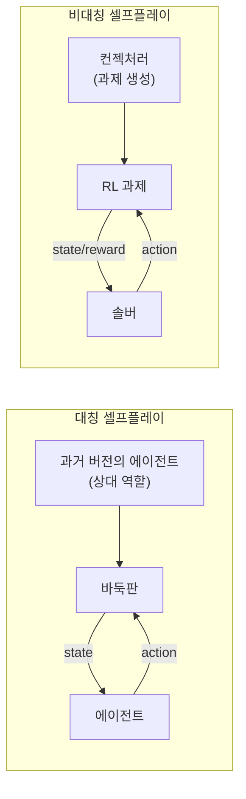
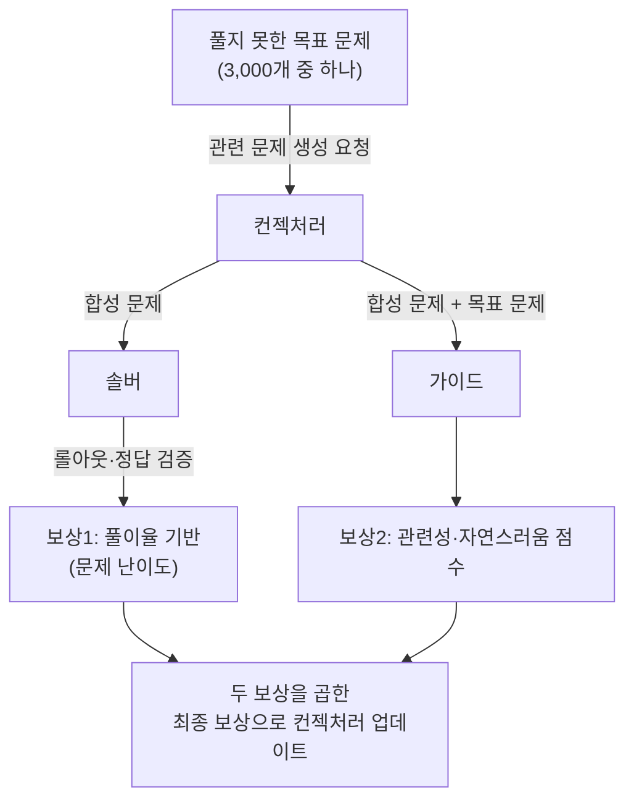
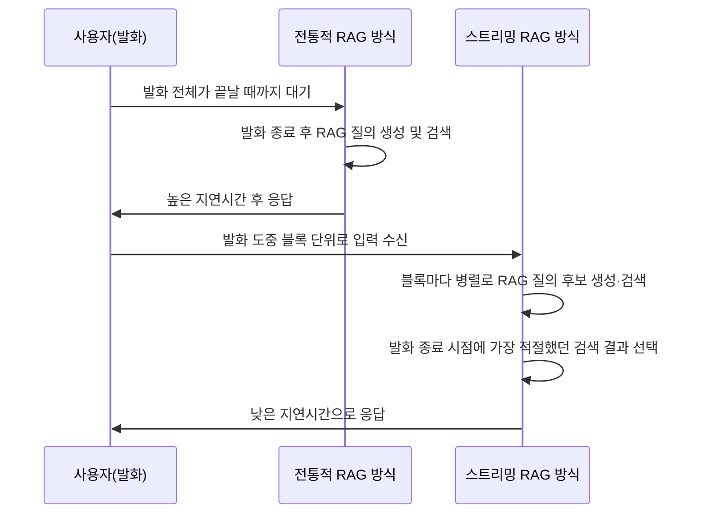
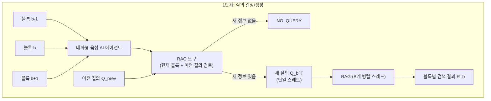
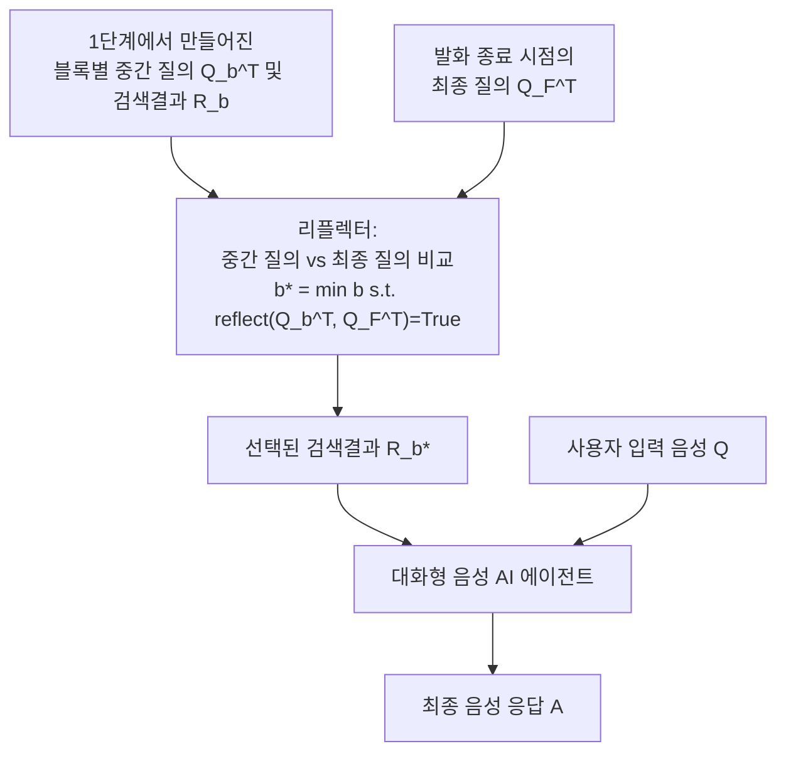
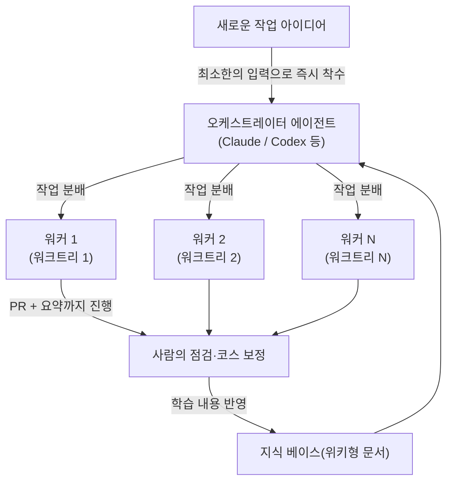

Y Combinator의 사무실에서 격주로 열리는 작은 모임인 "YC Paper Club"에서, 연구자·엔지니어·창업가들이 모여 최근 발표된 논문 다섯 편을 발표하고 토론한 세션의 내용을 정리한 글이다. 다루는 주제는 단백질 생물학에 스케일링 법칙이 통하는지, LLM의 셀프플레이가 왜 한계에 부딪히고 어떻게 그 한계를 넘는지, 음성 대화형 AI에 실시간으로 검색을 붙이는 방법, Lean을 이용한 형식 검증이 수학·코드·과학을 어떻게 바꾸고 있는지, 그리고 한 창업가가 에이전트 기반 소프트웨어 개발을 어떻게 실시간 전략 게임(RTS)처럼 운영하고 있는지까지 다섯 가지다. 이 글에서는 다섯 발표를 모두 정리하되, 특히 음성 AI를 위한 스트리밍 RAG와 Lean 기반 검증 가능한 AI 부분을 더 깊이 다룬다.

---

## 1. 전체 구성

세션의 진행자인 프랑수아 쇼바르(Francois Chaubard)는 행사를 열면서 최근 1년 반 동안 가장 뜨거운 연구 주제로 "메모리"를 꼽았고, 멤제로(MemZero)부터 재귀적 언어 모델, 카트리지(Cartridges), H-Net의 동적 청킹(dynamic chunking)에 이르는 일련의 연구를 언급했다. 그는 또한 인간이 만든 데이터의 분포(이 발표에서는 이를 "H"라는 부분집합으로, 전체 가능한 해법 공간을 "F"로 표현했다)에만 의존해 학습하면, 테스트 타임 컴퓨트나 재귀적 자기개선을 아무리 투입해도 "F 마이너스 H", 즉 인간이 만들어내지 못한 해법의 영역에는 현실적으로 도달하기 어렵다는 견해를 밝혔다. 알파고가 인간의 기보를 학습해 시작한 모델이라면, 알파제로는 인간 데이터 없이 셀프플레이만으로 더 멀리 갔다는 점을 예로 들며, "인텔리전스 퍼 샘플(intelligence per sample)"과 "인텔리전스 퍼 와트(intelligence per watt)"가 앞으로 풀어야 할 핵심 과제라고 짚었다. 이런 문제의식은 두 번째 발표(셀프플레이)와 자연스럽게 이어진다.

다섯 발표의 구성은 다음과 같다.

1. 야사 베이그(Yasa Baig) — 단백질 생물학의 월드모델 (Evolutionary Scale Models, ESM Cambrian)
2. 루크 베일리(Luke Bailey) — Self-Guided Self-Play: LLM 셀프플레이를 스케일링하기
3. 아르나브 마이티(Arnab Maiti) — Stream RAG: 음성 대화형 AI를 위한 실시간 검색
4. 로버트 조지(Robert George) — Lean for Science: 형식 증명이 수학·AI·과학 컴퓨팅을 바꾸는 방식
5. 루켄스 오스웨인(Lukens Orthwein) — Founder AI Hacks: 프로그래밍은 이제 RTS 게임이다

---

## 2. 단백질 생물학에도 "쓴맛의 교훈"이 통하는가 — 야사 베이그

야사 베이그는 스탠퍼드대학교의 박사 2년차로, 같은 연구실 동료인 프랑수아의 요청을 받아 단백질 생물학 쪽 AI 연구를 소개했다. 발표의 핵심은 2026년 6월 4일 bioRxiv에 공개된 논문 "Language Modeling Materializes a World Model of Protein Biology"였다. 이 논문은 한때 메타(Meta) 산하에 있다가 독립한 단백질 AI 그룹인 EvolutionaryScale과 Biohub(둘 다 Alexander Rives가 주도)이 작성한 것으로, 발표 시점 기준으로 "딱 일주일 전" 나온 매우 최신 논문이다.

### 2.1 단백질을 언어로 보기

이 연구의 출발점은 단백질을 일종의 "문장"으로 취급하는 것이다. 우리 몸을 구성하는 거대분자는 크게 지질, 탄수화물, 단백질로 나뉘는데, 단백질은 20종류의 아미노산이 사슬처럼 이어진 문자열이라고 볼 수 있다. 이 문자열의 서열이 단백질의 3차원 구조를 결정하고, 그 구조가 곧 단백질의 기능(촉매 작용, 병원체 차단 등)을 결정한다. 그래서 "단백질 하나 = 20글자 알파벳으로 쓰인 문장 하나"라는 비유가 성립한다.

이 비유를 바탕으로 자연어 처리에서 쓰는 개념들을 단백질 영역으로 그대로 옮길 수 있다. 토큰은 아미노산에 대응하고, 인터넷 텍스트는 진화 과정에서 축적된 서열 데이터베이스에 대응하며, 마스킹된 토큰 예측은 마스킹된 잔기(residue) 예측에 대응한다. 언어모델에서 나타나는 창발적 능력(emergent ability)은 단백질 모델에서는 구조와 기능에 대한 이해로 나타나고, 최근 해석가능성(interpretability) 연구에서 쓰이는 스파스 오토인코더(SAE) 같은 도구도 단백질 모델 내부 표현을 들여다보는 데 그대로 쓰인다. 즉 "단백질은 그것과 함께 등장하는 다른 아미노산들로 정의된다"는 발상으로, BERT 스타일의 트랜스포머를 단백질 서열에 대해 마스킹 언어모델(MLM)로 학습시키는 것이 ESM 계열 모델의 기본 틀이다. 이때 모델에게는 서열 정보 외에 구조에 대한 어떤 정답도 주어지지 않는다.

### 2.2 질문 1: 스케일을 키우면 모델이 정말 배우는가

이 논문은 이 질문에 대한 답을 P@L이라는 지표로 측정했다. 단백질은 1차원 서열이지만 3차원으로 접혀 있으며, 서열상 멀리 떨어진 두 위치가 구조적으로는 가까이 붙어 있는 "장거리 접촉(long-range contact)"을 모델 표현에서 얼마나 잘 복원할 수 있는지를 보는 지표다. 이 작업은 단순한 이웃 관계가 아니라 서열만으로는 알기 어려운 구조 정보를 모델이 내재화했는지를 보여주는 깨끗한 비지도 신호로 쓰인다.

연구진은 새로운 모델 패밀리인 ESM Cambrian(ESMC)을 300M, 600M, 6B 파라미터 규모로 학습시키고, 소규모 학습 실험에서 추정한 "컴퓨트 최적(compute-optimal)" 곡선을 실제 대규모 학습 결과에 그대로 적용해 보았다. 결과는 로그-선형(log-linear) 형태로 거의 깨지지 않고 이어졌고, 발표에서는 이를 그대로 "Yes."라는 한 단어로 정리했다. 즉 언어모델에서 보던 것과 같은 형태의 스케일링 곡선이 단백질 도메인에서도 나타났다는 것이다.

다만 흥미로운 반전이 있다. 이전 세대 모델인 ESM2는 파라미터를 늘려도 성능이 일정 수준에서 정체되는 한계 곡선을 보였는데, 새로운 ESMC는 같은 구간에서 정체 없이 계속 올라간다. 연구진이 찾은 차이는 아키텍처의 영리한 귀납적 편향(inductive bias)이 아니라 단순히 데이터의 양이었다. ESM2 논문이 약 5천만 개의 학습 샘플을 사용했다면, 이번 ESMC는 메타지노믹(metagenomic) 데이터—즉 토양, 바닷물, 사람의 장내 미생물 등에서 직접 시퀀싱해 얻은, 거의 분류되지 않은 생물의 단백질 서열—를 대규모로 끌어와 28억 개 규모까지 데이터를 늘렸다. 발표자는 이를 "언어모델의 데이터 월(data wall) 논쟁의 단백질 버전"이라고 표현하면서, 자연어 토큰은 인류가 지난 수십 년간 만든 것이지만 단백질 서열의 "학습 데이터"는 진화가 40억 년에 걸쳐 만들어 온 것이고, 인류가 지금까지 확인한 단백질 다양성은 진화가 만들어낸 전체 다양성의 1%도 안 된다는 점을 강조했다. 결론적으로 이 영역은 데이터 측면에서 한계에 부딪힐 일이 거의 없는, AI 연구를 시작하기에 좋은 분야라는 메시지다.

### 2.3 질문 2: 손으로 만든 특징(MSA) 없이도 구조를 예측할 수 있는가

생물학 AI에서 가장 유명한 성공 사례는 노벨상을 받은 알파폴드(AlphaFold)다. 알파폴드의 힘은 다중 서열 정렬(Multiple Sequence Alignment, MSA)이라는, 사람이 정성껏 설계한 특징 추출 과정에서 나온다. 어떤 단백질을 접기 위해 그 단백질의 "진화적 친척"들을 수백 개 찾아 정렬하고, 이 정렬에서 나타나는 공진화(co-variation) 패턴이 구조를 푸는 핵심 정보가 된다. 이는 매우 정교한 도메인 엔지니어링이지만, 동시에 시간이 많이 들고, 항체 설계처럼 진화적 친척이 충분하지 않은 경우에는 이 정보 자체가 부족하다는 한계가 있다.

ESM 진영의 새 모델인 ESMFold2는 이 MSA를 통째로 버리고, 대신 ESM-C가 만들어낸 잔기별(per-residue) 표현(임베딩)을 그대로 구조 예측 모듈에 입력으로 사용한다. 같은 목표(3차원 구조), 같은 출력 형식이지만 손으로 만든 특징이 전혀 없는 구조다. 여기서 한 가지 흥미로운 아키텍처적 특징은, 표현을 구조로 변환하는 모듈이 "루프형(looped)" 구조를 갖고 있다는 점이다. 이는 같은 레이어를 반복적으로 통과시키며 구조 예측을 점진적으로 정제하는 방식으로, 재학습 없이도 추론 시점에 계산량을 늘려(반복 횟수를 늘려) 성능을 높일 수 있는 일종의 테스트타임 컴퓨트 레버 역할을 한다.

결과를 보면, 일반적인 단백질-단백질 복합체에서는 MSA 없이 단일 서열만 사용한 ESMFold2가 MSA를 사용하는 AlphaFold3와 불과 몇 점 차이로 거의 근접한 성능을 보였다(DockQ Pass Rate 기준 단일 서열 ESMFold2 70 vs MSA AlphaFold3 74, n=278). 반면 항체-항원 결합처럼 진화적 친척의 다양성이 상대적으로 적은 영역에서는, MSA 없이도 ESMFold2(50)가 MSA를 사용하는 AlphaFold3(47)보다 오히려 높은 점수를 기록했다(n=172). 발표자는 이를 "MSA가 죽었다는 뜻은 아니지만, 손으로 만든 특징이 도움이 되는 영역은 정작 약물 설계자들이 가장 필요로 하는 영역에서는 사라진다"는 식으로 정리했다. 또한 MSA를 추가로 제공하거나 루프 반복 횟수를 늘리는(예: 20회 반복) 테스트타임 컴퓨트를 늘릴수록 성능이 더 좋아지는 경향도 함께 확인되었고, 서열 길이에 따른 지연시간(latency) 비교에서도 ESMFold2 계열이 AlphaFold3나 다른 경쟁 모델들보다 더 빠른 처리 속도를 보였다.

### 2.4 질문 3: 모델 내부에 진짜로 풍부한 표현이 학습되는가

마지막 질문은 메커니즘 해석가능성(mechanistic interpretability) 관점이다. 언어모델 해석가능성 연구에서 쓰이는 스파스 코딩(sparse coding) 기법을 단백질 모델의 활성값(activation)에 적용했을 때, 사람이 이해할 수 있는 "단일 의미(monosemantic)" 방향을 찾을 수 있는지를 살펴본 것이다. 결론은 "그렇다"였다. 순수하게 빈칸 채우기(마스킹 언어모델) 방식으로 사전학습된 모델의 잠재공간은, 개별 아미노산 단위의 특징부터 구조적 모티프, 단백질 도메인, 기능 부위와 단백질 전체의 역할에 이르기까지 위계적으로 정리된 깨끗한 특징들로 분해되었다. 이 특징들에는 언어모델 에이전트가 자동으로 주석을 붙였다.

발표에서 든 구체적인 예시는 "뉴클레오필릭 엘보(nucleophilic elbow)"라는, 다양한 효소의 촉매 작용에서 반복적으로 등장하는 잘 알려진 구조 모티프였다. 이 모티프는 진화적으로 서로 멀리 떨어져 있고 생화학적 목적도 서로 다른 여러 단백질(세린 신호 펩티다아제, 시스테인 프로테아제, 세린 카르복실 프로테이나제, 카르복실 에스터라아제)에서 공통적으로 발견되는데, 모델은 이 네 가지 구조적으로 매우 다른 단백질에서 동일한 모티프를 가리키는 하나의 특징을 학습해 냈다. 단순히 서열이 비슷한 단백질을 외운 것이 아니라, 진화적으로 반복해서 "재발명"된 화학적 패턴 자체를 인식하고 있다는 의미다.

이 특징 공간을 더 넓게 펼쳐보면, 생명 전체에 걸친 단백질군의 지도가 자연스럽게 그려진다. 연구진은 이렇게 만들어진 표현을 이용해 수억 개에서 수십억 개 규모의 단백질을 접고 분석한 거대한 아틀라스를 구축했는데, 논문 초록에 따르면 이 지도는 68억 개 이상의 서열과 11억 개 이상의 예측 구조를 포함하며, 기존의 알파폴드 기반 구조 데이터베이스보다도 큰 규모라고 소개되었다. 이 지도 안에서는 예를 들어 크리스퍼-카스(CRISPR-Cas) 계열 효소처럼 생물학적으로 중요한 단백질군이 뚜렷한 군집으로 드러나는데, 이런 군집화는 사람이 설계한 게 아니라 모델이 사전학습 과정에서 "부수적으로" 학습해낸 결과물이다.

### 2.5 응용: 신약 후보 결합체 설계

발표에서는 시간상 자세히 다루지 않았지만, 같은 모델 패밀리를 이용해 서열 공간에서 직접 단백질 결합체를 설계하고 실제 습식 실험실(wet lab) 검증까지 거친 사례도 소개되었다. EGFR, CTLA-4, CD45, PD-L1, PDGFRβ 같은 면역항암 분야에서 중요한 표적에 대해 미니바인더(minibinder)를 설계했고, PD-L1의 경우 면역항암제 분야에서 이미 큰 성공을 거둔 표적 단백질이라는 점에서 임상적 의미가 컸다. 발표 자료에 표시된 결합 친화도(affinity) 수치를 보면, 미니바인더가 0.07~40nM, 기존 항체 단편(scFv)이 4~70nM 수준으로, 설계된 결합체들이 기존 항체 형태와 비교해도 경쟁력 있는 친화도를 보였다.

발표자는 이 분야가 아직 "스케일링이 완벽하게 통한다"고 말할 수는 없지만(여전히 일부는 손으로 만든 특징이 필요하고 완전히 경쟁력 있는 수준은 아니다), 비교적 단순한 사전학습 목표와 많은 데이터만으로 모델이 사후에 "역으로 캐물을 수 있는" 방대한 생물학 지식을 학습했다는 점, 그리고 생물학 데이터는 매년 기하급수적으로, 그 증가율 자체도 계속 커지고 있다는 점을 들어 생물학을 AI로 풀어보고 싶은 사람들에게 지금이 좋은 시점이라고 마무리했다.

---

## 3. 셀프플레이는 왜 한계에 부딕히고, 어떻게 넘어서는가 — 루크 베일리

두 번째 발표자인 루크 베일리는 스탠퍼드대학교 박사 2년차로, Tatsunori Hashimoto와 Tengyu Ma 연구실 소속이다. 발표 논문은 "Scaling Self-Play with Self-Guidance"(arXiv:2604.20209, 저자: Luke Bailey, Kaiyue Wen, Kefan Dong, Tatsunori Hashimoto, Tengyu Ma)로, 2026년 4월에 공개되었다.

### 3.1 지금의 후처리(post-training)는 어떤 모습인가

발표는 현재 대형 언어모델의 학습 파이프라인을 두 단계로 정리하는 데서 시작한다. 먼저 웹 텍스트로 사전학습을 하고, 그 다음 후처리를 한다. 최근 변화의 핵심은 후처리 단계, 특히 코딩·수학·소프트웨어 조작 같은 다양한 과제에 대해 매우 긴 강화학습(RL)을 돌리는 데 들어가는 컴퓨트가 사전학습에 들어가는 컴퓨트와 맞먹거나 이를 넘어서고 있다는 점이다. 그리고 Cursor의 Composer 2 기술 보고서(arXiv:2603.24477)에서 보여준 것처럼, RL 과제의 수와 투입 컴퓨트를 늘릴수록 평가 지표(Eval Set Reward)와 실제 코딩 벤치마크(CursorBench) 점수가 함께, 그리고 비교적 매끄럽게 향상되는 경향이 관찰된다. 다만 이 방식은 사람이 RL용 과제를 직접 큐레이션해야 하기 때문에 확장에 한계가 있고, 모델이 인간이 줄 수 있는 문제 수준을 넘어서기를 바란다면 결국 "모델이 스스로 새로운 RL 과제를 만들고, 풀고, 다시 더 좋은 과제를 만드는" 루프가 필요해진다는 것이 셀프플레이의 출발점이다.

### 3.2 대칭 셀프플레이와 비대칭 셀프플레이

전통적인 RL에서는 사람이 미리 정의한 과제와 환경 위에서 모델을 학습시킨다. 셀프플레이에서는 모델이 (1) RL 과제를 직접 만들고, (2) 그 과제를 풀려고 시도하는 두 가지 역할을 동시에 맡는다. 알파고/알파제로처럼 같은 모델이 같은 역할(예: 바둑 기사)을 두 번 맡아 서로 대국하는 형태를 "대칭(symmetric) 셀프플레이"라고 부른다. 최근 LLM 영역에서 떠오른 방식은 "비대칭(asymmetric) 셀프플레이"로, "컨젝처러(Conjecturer)"라는 모델이 "솔버(Solver)"를 위한 RL 과제 전체(문제와 검증 방법)를 만들어내고, 솔버는 그 과제 안에서 행동해 보상을 받는다. 예를 들어 컨젝처러가 코딩 문제와 그에 대한 유닛 테스트를 만들고, 솔버가 그 문제를 풀어 롤아웃을 생성하는 식이다.

### 3.3 셀프플레이가 매력적인 이유와, 실제로는 잘 안 되는 이유

이론적으로 셀프플레이의 매력은 "학습에 상한이 없다"는 점이다. 사람의 시범 데이터만으로 학습한 모델은 그 시범을 넘어설 수 없지만, 바둑처럼 두 플레이어 게임에서는 셀프플레이를 통해 인간 수준을 훌쩍 넘어서는 성능까지 계속 개선되는 것이 실제로 입증되었다. LLM에 대한 기대도 비슷하다. 사람 데이터로 인간 수준까지 끌어올린 뒤, 셀프플레이로 그 너머까지 밀어붙일 수 있다는 것이다.

그러나 실제로는 장기간 셀프플레이를 돌리면 일반 RL과 마찬가지로 성능이 정체(plateau)된다. 논문에서는 기존의 "기본 셀프플레이 레시피"를 다음처럼 정리한다. 매 이터레이션마다 (1) 컨젝처러로부터 합성 과제를 샘플링하고, (2) 솔버가 이를 풀게 한 뒤 정답 여부를 검증하고, (3) 검증 결과로 솔버를 업데이트하고, (4) 솔버의 풀이율(solve rate)이 0이면 보상 0, 그렇지 않으면 "1 - 풀이율"을 보상으로 주어 컨젝처러를 업데이트한다. 이 보상 설계의 의미는 "컨젝처러는 그저 솔버에게 어려운 문제를 만들면 된다"는 것이다. 직관적으로는 합리적으로 들린다—컨젝처러가 솔버 능력의 최전선에 있는 문제를 계속 던져주면, 솔버는 그 문제들을 풀며 계속 성장할 것 같다.

실제로 3,000개의 형식 수학 문제(Lean으로 작성된 수학 문제, 즉 문제 진술과 증명을 모두 코드로 작성하고 자동으로 검증할 수 있는 형태)에서 시작해 이 레시피를 돌린 결과, RL 베이스라인은 누적 풀이율이 약 60.3%에서 정체되었다. 그런데 풀이율 보상을 사용한 기본 셀프플레이도 정확히 같은 60.3% 근처에서 정체되었고, 동시에 합성 문제 생성량은 계속 늘어났다(즉 컨젝처러는 점점 더 잘, 점점 더 많은 "솔버에게 어려운" 문제를 만들어내고 있었다). 그런데 이렇게 만들어진 문제들은 거의 쓸모가 없었다.

이유를 들여다보면, 학습이 진행될수록 컨젝처러가 생성하는 문제들은 의도적으로 복잡하고 지저분한, "엉망인" 형태로 변질되었다. 발표에서는 학습 후반에 컨젝처러가 만든 한 Lean 명제의 결론 부분을 예로 보여주었는데, 매우 길고 인위적으로 복잡한, 거의 읽을 수 없는 형태였다. 즉 컨젝처러가 "솔버에게 50% 정도의 풀이율을 만드는 가장 쉬운 방법"으로 택한 전략이 "세 페이지짜리 인위적인 고등학교 미적분 문제처럼 만들어 솔버가 어딘가에서 작은 실수를 하게 만드는 것"이었던 셈이다. 이런 문제는 다른 수학 과제에는 전혀 도움이 되지 않는다.

### 3.4 해법: Self-Guided Self-Play (SGS)

이 문제를 진단한 뒤, 연구진은 두 가지 장치를 추가한 새로운 알고리즘인 자기주도 셀프플레이(Self-Guided Self-Play, SGS)를 제안했다. 첫째, 풀지 못한 3,000개의 목표 문제 각각에 대해, 컨젝처러에게 "이 문제와 관련된" 합성 문제를 만들도록 프롬프트한다. 이렇게 함으로써 합성 데이터의 분포를 "괜찮다고 믿을 수 있는" 문제 분포(원래의 목표 문제군) 근처에 묶어둔다. 둘째, 단순히 풀이율 보상만 쓰면 결국 이 사전 지식(prior)을 무시하고 다시 엉망인 문제로 흘러갈 것이기 때문에, 모델이 세 번째 역할인 "가이드(Guide)"를 맡아 새로 생성된 합성 문제와 그 출발점이 된 목표 문제를 함께 보고, 둘이 실제로 관련이 있는지, 그리고 합성 문제가 지나치게 복잡하지 않은지를 판단하게 한다.

전체 알고리즘은 다음과 같이 동작한다. 풀지 못한 목표 문제마다 컨젝처러가 그와 관련된 합성 문제를 샘플링하고, 솔버가 이를 풀려고 시도한다. 그리고 컨젝처러를 업데이트할 때는 두 가지 보상을 곱한 이중 보상을 사용한다. 하나는 여전히 "문제가 솔버에게 충분히 어려운가"(이는 솔버에게 학습 신호를 주기 위해 여전히 중요하다)이고, 다른 하나는 가이드가 부여하는 "관련성·자연스러움" 점수다.

### 3.5 결과

핵심 결과 그래프에서는 RL 베이스라인, 병렬 샘플링(parallel sampling), 그리고 SGS를 비교한다. SGS는 7B 모델을 사용했고, 비교 대상으로 DeepSeek-Prover-V2 671B 모델의 pass@4 성능(그래프상 약 62.5%)이 함께 표시되어 있다. RL 베이스라인과 병렬 샘플링은 각각 약 59.4%, 약 55.8%에서 정체되는 반면, SGS는 학습이 진행될수록 671B 모델의 pass@4 수준(62.5%)을 넘어서서 약 67.1%의 점근값(asymptote)까지 올라간다. 발표자는 이를 "7B짜리 작은 모델이, 8배 더 많은 컴퓨트를 셀프플레이에 투입하는 대신, 더 큰 671B '형님' 모델의 능력 수준까지 도달한다"는 식으로 설명했다. 다만 100%에는 한참 못 미치는 수치이기 때문에, 셀프플레이가 가진 가능성을 완전히 실현했다고 보기는 어렵고, 앞으로 풀어야 할 과제가 여전히 많다는 점도 함께 언급되었다.

---

## 4. Stream RAG: 음성 대화형 AI를 위한 실시간 검색 — 아르나브 마이티

세 번째 발표자인 아르나브 마이티는 워싱턴대학교에서 밴딧(bandit) 학습으로 박사를 받았고, 현재는 YC 출신 스타트업 중 가장 빠르게 성장하는 기업의 하나인 Giga에서 일하고 있다. 발표 논문은 메타(Meta)와 카네기멜런대학교(시노부 와타나베 교수 그룹) 등이 함께 작성한 "Stream RAG: Instant and Accurate Spoken Dialogue Systems with Streaming Tool Usage"(arXiv:2510.02044, 2025년 10월 공개, 저자: Siddhant Arora 외 16인)이다. 발표자는 이 논문의 구체적인 디테일보다 "음성 AI에서 새롭게 떠오르는 문제 유형"을 보여주는 사례로 이 논문을 선택했다고 밝혔다.

### 4.1 문제 설정: 왜 음성에서는 RAG가 더 어려운가

2023년 무렵 LLM은 특히 인용·사실 정보와 관련해 환각(hallucination) 문제가 컸지만, 검색 증강 생성(RAG)이 도입되면서 텍스트 기반 대화 시스템에서는 이 문제가 크게 줄었다. 사용자의 입력 질의를 RAG 시스템에 넘기면, 관련 정보를 찾아 LLM에 제공하고, LLM은 그 정보를 바탕으로 환각 없는 답변을 생성하는 흐름이다.

최근에는 음성으로 듣고 음성으로 답하는, 즉 종단간(end-to-end) 음성-입력 음성-출력 대화 시스템(speech-in speech-out dialogue system) 스타트업들이 늘고 있다. 이런 시스템에서도 "오늘 날씨 어때?"처럼 묻고 "현재 22도입니다"처럼 답하는 자연스러운 대화가 기대되며, 당연히 이 답변에도 환각이 없어야 한다. 더구나 음성에서는 환각을 사람이 알아채기가 텍스트보다 훨씬 어렵다는 점에서 문제가 더 심각하다.

그렇다면 단순히 "질문이 끝나면 RAG를 돌리고, 그 결과를 음성 에이전트에 넣어주면" 되지 않을까? 문제는 RAG가 추가하는 지연시간(latency)이다. 음성 에이전트에게 질문을 던지고 10초씩 기다려야 한다면, 이는 자연스러운 대화 흐름을 완전히 깨뜨린다. Stream RAG 논문이 다루는 핵심 아이디어는, 사용자의 발화가 끝나기를 기다리는 대신, 사용자가 말하는 도중에 이미 들어온 단어들을 분석해 RAG 파이프라인을 미리 돌릴 방법을 찾는 것이다. 예를 들어 "오늘 날씨 어때? 나가야 할지 말지 정하려고 그래"라는 발화에서, 실제로 답을 찾아야 할 핵심 질문은 앞부분("오늘 날씨 어때?")에 있고 뒷부분은 부가 설명일 수 있다. 그래서 "이 RAG 시스템을 언제 호출해야 하는지, 그리고 그 시점에 어떤 정보를 가져와야 하는지"를 판단하는 메커니즘이 필요하다.

### 4.2 두 가지 접근: 고정 간격 스트리밍 RAG와 학습 기반 트리거

발표에서는 이 문제에 대한 두 가지 접근을 소개했다. 첫 번째는 비교적 단순한 "고정 간격 스트리밍 RAG(fixed-interval streaming RAG)"다. 음성을 일정한 블록 단위로 나누고, 블록이 도착할 때마다 RAG를 돌려 그 시점까지의 결과를 얻는다. 여기서 핵심 질문은 "어느 블록에서 멈춰야 하는가"다. 끝까지 기다릴 수는 없기 때문이다. 논문에서 다루는 한 가지 방법은, RAG 파이프라인의 여러 하위 단계 중 비교적 빠르게 끝나는 단계(예: 후보 문서 검색)를 부분 질의에 대해서도 돌려보고, 그 결과가 전체 질의에 대한 결과와 유사하면 "이 시점에서 충분히 정보가 모였다"고 판단해 전체 파이프라인을 마무리하는 식이다. 발표자는 이것이 "이 방법 자체가 정답"이라기보다, "스트리밍으로 입력이 들어올 때 어느 시점에서 멈춰도 되는지를 판단하는 문제" 자체가 앞으로 연구가 필요한 열린 질문이라는 점을 강조했다.

두 번째 접근은 매 블록마다 무조건 RAG를 돌리는 것이 계산 자원 측면에서 낭비일 수 있다는 점에서 출발한다. 대신 각 블록이 들어올 때마다 별도로 파인튜닝된 모델(또는 같은 모델의 다른 역할)이 "이 블록에 새롭고 중요한 정보가 담겨 있어서 새 질의를 만들어야 하는지, 아니면 지금까지 만든 질의로 충분한지"를 판단하게 한다.

### 4.3 Stream RAG의 2단계 아키텍처

실제 논문의 핵심 구조는 두 단계로 이루어진다.

**1단계 — 질의 생성/결정(Query Generation/Decision)**: 사용자의 음성 입력은 여러 블록으로 나뉘어 들어오고, 각 블록이 들어올 때마다 대화형 음성 AI 에이전트는 "RAG 도구"에게 현재 블록과 이전 질의(previous query)를 함께 건넨다. RAG 도구는 이를 보고 새로운 질의가 필요한지(NEW QUERY) 아니면 필요 없는지(NO_QUERY)를 결정한다. 새로운 질의가 필요하다고 판단되면, 하나의 스레드에서 새로운 RAG 질의(Q_b^T)를 생성하고, 이 질의들은 B개의 병렬 스레드에서 RAG로 보내져 각 블록에 대한 검색 결과(R_b)를 받아온다.

**2단계 — 응답 생성(Response Generation)**: 사용자의 발화가 끝나면, "리플렉터(Reflector)"라는 구성요소가 핵심 역할을 한다. 리플렉터는 1단계에서 각 블록마다 만들어졌던 중간 RAG 질의들(Q_b^T)과, 발화가 끝난 시점에 만들어진 최종 RAG 질의(Q_F^T)를 비교한다. 그리고 다음 수식으로 표현되는 규칙에 따라, "이 중간 질의가 전체 입력 질의에 답하기에 충분한가"를 판단해, 충분하다고 판단되는 가장 빠른 블록 b*를 선택한다.

> b\* = min{ b ∈ [1, B] : reflect(Q̂_b^T, Q̂_B^T) = True }

즉 리플렉터가 "예"라고 답하는 가장 이른 블록의 검색 결과(R_b*)를 최종 응답 생성에 사용한다. 이렇게 하면, 발화가 끝난 뒤에 다시 RAG를 새로 돌릴 필요 없이, 발화 도중에 이미 준비해둔 검색 결과 중 가장 적절한 것을 골라 즉시 최종 음성 응답(Final Audio Response, A)을 생성할 수 있다.

### 4.4 어떻게 이런 모델을 학습시키는가

이 동작을 가능하게 하려면 모델이 "발화 도중 어느 지점에서 어떤 질의를 만들어야 하는지", 그리고 "그 질의가 충분한지 아닌지"를 판단하도록 후처리(post-training)되어야 한다. 논문의 후처리 파이프라인은 다음과 같은 흐름을 갖는다.

먼저, 부분 전사(partial transcript) — 예를 들어 "Who founded", "Who founded rare beauty", "Who founded rare beauty in 2019?"처럼 점점 길어지는 발화의 일부분들 — 각각에 대해 LLM 기반의 "가짜 질의 생성기(pseudo query generator)"가 검색에 사용할 가짜 질의(pseudo query)를 만든다. 이 가짜 질의들을 각각 RAG에 넣어 문서를 검색하면, 부분 전사가 짧을수록 더 일반적인 문서가, 길어질수록 더 구체적이고 정확한 문서가 검색되는 것을 확인할 수 있다(예시에서는 "Selena Gomez가 Rare Beauty를 설립했다"는 일반적인 정보에서 "2019년에 Rare Beauty를 출시했다"는 구체적인 정보로 좁혀진다).

그 다음 단계는 "NO_QUERY인지, 새로운 질의인지"를 라벨링하는 것이다. 현재의 가짜 질의와 그 이전에 "유용했던" 질의를 비교해, 두 질의로부터의 검색 결과 품질이 비슷하면 NO_QUERY(이전 질의로 충분함)로, 검색 결과가 의미 있게 달라지면 새로운 질의가 필요한 것으로 라벨링한다. 여기에 더해 네거티브 샘플링(negative sampling) 기법도 사용되는데, 이전 질의를 일부러 "틀린" 질의로 바꿔치기 해놓고(예: 실제로는 "Rare Beauty가 언제 설립되었는가"가 이전 질의였는데, 이를 "Rare Beauty가 첫 제품을 언제 출시했는가"라는 다른 질의로 바꿔치기), 모델이 이를 알아채고 올바른 질의("Rare Beauty가 언제 설립되었는가")로 수정해서 출력하도록 학습시킨다. 이를 통해 모델은 단순히 "이전 질의를 그대로 쓸지"를 넘어, 맥락상 정말로 적절한 질의가 무엇인지를 학습하게 된다.

### 4.5 평가: AudioCRAG 벤치마크와 결과

평가를 위해 연구진은 공개된 텍스트 기반 RAG 벤치마크인 CRAG의 질의들을 음성으로 변환한 AudioCRAG라는 벤치마크를 새로 구축했다. 이를 이용해 세 가지 설정—RAG 없음(No RAG), 발화가 끝난 뒤 RAG를 돌리는 방식(RAG after final query), 그리고 스트리밍 RAG(Streaming RAG)—을 Qwen2.5-7B와 OpusLM 두 모델에서 비교했다.

| 설정 | 모델 | 정확도(%) |
|---|---|---|
| RAG 없음 | Qwen2.5-7B | 11.1 |
| RAG 없음 | OpusLM | 18.4 |
| 발화 종료 후 RAG | Qwen2.5-7B | 33.8 |
| 발화 종료 후 RAG | OpusLM | 21.2 |
| 스트리밍 RAG | Qwen2.5-7B | 34.2 |
| 스트리밍 RAG | OpusLM | 23.6 |

논문 초록에 따르면, 이 스트리밍 RAG 방식은 QA 정확도를 최대 200% 상대적으로 끌어올렸고(절댓값 기준 11.1%에서 34.2%로), 도구 사용으로 인한 지연시간을 약 20% 줄였다. 흥미로운 점은 "발화 종료 후 RAG"와 "스트리밍 RAG"의 정확도 차이는 Qwen2.5-7B 기준으로 33.8%에서 34.2%로 크지 않다는 것이다. 즉 스트리밍 RAG의 가장 큰 가치는 "정확도를 극적으로 더 높이는 것"이 아니라, "발화 종료 후 RAG를 돌리는 것과 거의 동등한 정확도를, 훨씬 낮은 지연시간으로 달성하는 것"에 있다고 볼 수 있다. 즉 사용자 경험(체감 지연시간)과 정확도를 동시에 개선하는 방향성이다.

### 4.6 발표자가 강조한 메시지

발표자는 이 논문의 구체적인 방법(어떤 블록에서 멈출지, 어떤 식으로 가짜 질의를 만들지)이 "유일한 정답"이라기보다, "스트리밍 입력 상황에서 검색을 언제·어떻게 트리거할지"라는 문제 자체가 음성 AI 분야에서 본인이 실제 프로덕션에서도 마주치는 종류의, 작지만 풀면 프로덕션에 큰 이득을 주는 문제라는 점을 강조했다. 예를 들어 부분 질의의 의미(semantic)만 보고 "이 정도 정보로도 충분히 답할 수 있다"고 판단해, RAG 파이프라인 전체를 돌리지 않고도 답할 수 있는 경우를 가려내는 등, 다른 방식의 트리거링 전략도 충분히 가능하다는 것이다.

---

## 5. Lean for Science: 형식 증명이 수학·AI·과학 컴퓨팅을 바꾸는 방식 — 로버트 조지

네 번째 발표자인 로버트 조지는 캘리포니아공과대학(Caltech) 박사 3년차로, AI를 이용한 수학·과학 연구에 집중하고 있다(애니마 아난드쿠마르 교수의 연구실 소속으로, 발표 내용과 관련 자료들의 공통 저자 구성을 통해 확인된다). 발표의 제목은 "Lean for Science: How Formal Proofs Can Change Mathematics, AI, and Scientific Computing"이며, 핵심 메시지는 "검증된 지능(verified intelligence)의 새로운 시대"가 열리고 있다는 것이다.

### 5.1 정리 증명기의 세 갈래: ATP, LLM, ITP

발표는 먼저 "정리 증명기(theorem prover)"의 지형을 세 갈래로 나누어 정리한다.

| 구분 | 대표 예시 | 특징 |
|---|---|---|
| 자동 정리 증명기 (ATP) | TLA+, E, Z3, CVC5 | SMT 솔버·모델 체커 등 1차 논리 기반. 사람의 개입이 거의 필요 없지만 표현력이 제한적 |
| 대형 언어모델 (LLM) | 범용 LLM | 자동 학습 능력은 뛰어나지만, 연구 수준 수학의 증명 검증은 매우 어려움. 형식 언어와 결합해야 효과적 |
| 대화형 정리 증명기 (ITP) | Lean, Rocq(구 Coq), Isabelle | 의존 타입 이론(dependent type theory) 등 매우 표현력 높은 논리 체계. 엄격한 증명 검사가 가능하지만 사람이 증명을 작성하고 전제를 고르는 데 많은 노력이 필요 |

발표자는 비형식적(informal) 수학—고등학교나 대학 수업에서 배우는, "증명 끝(QED)"이나 때로는 "증명에 의한 위협(proof by intimidation)"처럼 모든 단계가 명시적으로 적히지 않는 수학—과 달리, 형식적(formal) 세계에서는 모든 것이 완전히 명시적이어야 한다는 점을 강조했다. Lean은 지난 몇백 년간 이어진 형식 수학의 전통 위에서, 특히 잘 설계된 언어로 최근 빠르게 입지를 넓히고 있다.

### 5.2 왜 Lean인가

Lean이 주목받는 이유로 발표자는 여섯 가지를 들었다. 빠르다(Fast)—응답성 있는 검사와 컴파일된 실행이 가능하다. 통합되어 있다(Unified)—증명과 프로그램을 하나의 언어로 작성한다. 확장 가능하다(Extensible)—매크로, 태틱(tactic), 커스텀 자동화를 지원한다. 재사용 가능하다(Reusable)—mathlib이라는 공유 형식 인프라가 있다. 대화형이다(Interactive)—실시간 피드백을 받으며 증명을 개발할 수 있다. 그리고 확장성(Scalable)이 있다—사람의 직관, AI의 제안, 기계적인 검사가 함께 결합될 수 있다.

여기서 핵심은 mathlib이라는, 대수학(algebra)부터 선형대수, 해석학(analysis), 위상수학(topology), 측도론(measure theory), 확률론, 정수론(number theory), 조합론(combinatorics), 기하학, 범주론(category theory)에 이르는 방대한 영역을 포괄하는 고품질 형식 수학 라이브러리다. 지난 10여 년간 수많은 사람들이 정리를 형식화하고 전제를 골라 mathlib에 기여해 왔고, 이 축적된 자산이 지금의 AI 정리 증명 붐을 가능하게 하는 토대가 되었다.

Lean으로 작성된 코드는 "테오럼(theorem)"이라는 형태로 명제를 적고, 그 아래에 한 줄 한 줄 "태틱(tactic)"을 적어가며 증명을 완성한다. 각 태틱은 현재의 증명 목표(goal)를 더 단순한 하위 목표들로 바꾸고, VS Code 같은 환경에서는 현재 목표가 무엇인지 실시간으로 보여주는 "인포 고(info goal)" 뷰를 통해 진행 상황을 확인할 수 있다. 발표자는 자연수의 덧셈에 대한 교환·결합 법칙처럼 간단한 정리를 예시로 들며, 이 과정이 겉보기보다 어렵지 않고, 무엇보다 "더 이상 증명할 목표가 남지 않았다"는 것을 컴퓨터가 확인해 줄 때—즉 어떤 가정도 숨기지 않고, 추론 과정에서 어떤 손짓(handwave)도 허용되지 않는 100% 확실한 결과를 얻었을 때—의 만족감을 강조했다.

### 5.3 형식화의 최근 돌파구들

발표자는 이 분야의 진전 속도가 거의 기하급수적이라고 평가했다. 시작점으로 2020년 오픈AI의 일리야 수츠케버(Ilya Sutskever)와 스탠 폴루(Stan Polu) 등이 발표한 GPT-f를 언급했는데, 이는 자동 정리 증명을 위한 최초의 생성형 언어모델이었다. 이후 miniF2F(올림피아드 수준 문제 모음)에서의 성능은 중국·미국·캐나다를 비롯한 전 세계의 여러 연구 그룹과 기업들이 경쟁하면서 빠르게 향상되어 왔다.

이 영상이 만들어진 2026년 6월 시점을 기준으로, 발표에서 언급된 최근 사건들은 다음과 같이 정리할 수 있다.

- **국제수학올림피아드(IMO) 골드 메달**: 2024년 IMO에서 DeepMind의 AlphaProof/AlphaGeometry가 은메달 수준을 달성한 이후, 2025년 IMO에서는 ByteDance의 Seed-Prover와 Harmonic의 Aristotle이 모두 Lean 기반 형식 증명으로 골드 메달 수준의 성과를 보였다고 보고되었다. Seed-Prover는 IMO 2025의 6개 문제 중 5개를 완전히 형식적으로 증명했고, PutnamBench(대학 수준 경시대회 문제의 Lean 벤치마크)에서도 높은 비율을 풀어냈다.
- **AxiomProver의 Putnam 2025**: 발표자가 언급한 "최근 또 다른 큰 발표"는, Axiom사가 자사의 AxiomProver가 2025년 퍼트남(Putnam) 경시대회의 12개 문제 전부에 대해 자율적으로 Lean 증명을 생성했다고 공개한 사례를 가리키는 것으로 보인다. Axiom은 이 성과를 바탕으로 2026년 3월 메뉴로벤처스(Menlo Ventures) 주도의 2억 달러 규모 시리즈 A 투자를 유치했다고 보도되었다.
- **오픈AI의 80년 된 에르되시(Erdős) 문제**: 2026년 5월, 오픈AI는 자사의 범용 추론 모델이 80년 가까이 풀리지 않았던 에르되시의 단위 거리(unit distance) 관련 추측을 반증(disprove)하는 새로운 구성법을 찾아냈다고 발표했다. 다만 이 결과는 (추측이 옳다는) 긍정적 증명이 아니라 반례를 통한 반증이며, 필즈상 수상자 테렌스 타오(Terence Tao)를 비롯한 여러 수학자들의 검토를 거쳐 공개되었다. 타오는 이를 두고 수학 연구가 "증명의 희소성에서 증명의 풍요로움으로" 옮겨가는 전환점이라고 평가하면서, 동시에 이런 결과들을 정리·검증할 인프라가 필요하다고 지적했다. (한편 이 사례 이전인 2025년 10월에는 오픈AI 측의 한 인사가 "GPT-5가 10개의 미해결 에르되시 문제를 풀었다"고 주장했다가, 실제로는 이미 알려진 해법을 새로 찾아낸 것에 불과하다는 점이 밝혀지며 비판을 받은 바도 있다.)
- **DeepMind의 다분야 형식 증명 시스템**: 발표에서 "지난주 DeepMind가 에르되시 문제뿐 아니라 다른 분야의 문제들도 함께 푸는 것을 발표했다"고 언급한 부분은, 2026년 5월 22일경 공개된 논문 "Advancing Mathematics Research with AI-Driven Formal Proof Search"(arXiv:2605.22763, AlphaProof Nexus 관련)를 가리키는 것으로 보인다. 이 연구에서는 Lean 기반 형식 검증과 LLM 기반 생성을 결합한 에이전트가 353개의 미해결 에르되시 문제 중 9개를, 492개의 OEIS(정수열 백과사전) 추측 중 44개를 풀었으며, 조합론·최적화·그래프 이론·대수기하·양자 광학 등 여러 연구 분야에 실제로 배치되고 있다고 소개되었다.

이런 사례들을 종합하면, 형식 증명은 더 이상 "수학과의 한 구석"이 아니라, AI가 만든 결과의 신뢰성을 담보하는 핵심 인프라로 빠르게 자리잡고 있다.

### 5.4 수학을 넘어: 코드와 과학에서의 검증

발표자는 "형식 검증이 수학뿐 아니라 다른 영역에서는 어떤 의미를 가지는가"라는 질문으로 넘어갔다. 수학에서는 증명이 너무 길어 사람이 전부 확인하기 어렵고, mathlib 같은 형식 라이브러리가 지식을 축적·확장하는 역할을 한다. 코드에서는 버그가 매우 비싸고(실제로 핵심 시스템을 구동하기 때문에), AI가 생성한 코드일수록 "이게 정말 맞는 코드인가"에 대한 보증이 더 중요해진다. 과학에서는 시뮬레이션이 발견을 이끌지만, 수치 계산상의 인공물(artifact)이 잘못된 결론으로 이어질 수 있고 재현성(reproducibility)이 핵심 가치다. 이 세 영역(수학·코드·과학)이 만나는 교차점에 "검증(Verification)"이 자리한다.

이 중에서도 코드 영역에 대해 발표자는 "LLM은 코드를 잘 작성하지만, 그 코드가 정말로 맞는지 증명할 수 있는가"라는 질문을 던졌다. 프로그램 검증은 전통적으로 코드(스니펫·함수·전체 프로그램), 명세(직접적인 명세, 속성 기반 명세, 계약에 의한 설계 등), 증명(정리, 진술, 종료성 등)이라는 세 축으로 이루어진다. 발표자가 직접 참여한 작업인 BRIDGE(arXiv:2511.21104, 저자: Robert Joseph George, Carson Eisenach, Udaya Ghai, Dominique Perrault-Joncas, Anima Anandkumar, Dean Foster)는, Lean4 환경에서 코드·명세·정리 진술이라는 세 영역을 잇는 "표현 정렬(align representations)" 작업을 위해, 영역별로 특화된 중간 추론(domain-specific chain-of-thought)을 이끌어내는 구조화된 프롬프팅 프레임워크다. 논문에 따르면 BRIDGE는 Lean4에서 코드 우선(code-first) 워크플로—즉 먼저 생성한 구현체를 명세와 정리 진술 생성의 "의미론적 앵커(semantic anchor)"로 활용하는 방식—를 채택할 때, 178개의 알고리즘 문제와 5개의 LLM에 대해 Lean 실행 정확도(pass@5)를 직접적인 베이스라인보다 약 1.5배 향상시켰다고 보고되었다.

발표자는 이 흐름을 MIT의 맥스 테그마크(Max Tegmark)가 제시한 표현을 빌려 "와이드 코딩(wide coding)에서 바이브 코딩(vibe coding)을 넘어, 검증 가능한 코딩(veri coding)으로 가야 한다"고 정리했다. 즉 코드를 빠르게 많이 생성하는 것을 넘어, 그 코드가 명세를 만족한다는 것을 형식적으로 보증할 수 있는 코딩으로 나아가야 한다는 메시지다. 또한 발표자는 클락 배리(Clark Barrett, 스탠퍼드)의 연구실에서 시작되어 DeepMind 등 여러 기관이 참여하는 "CSLib"(Lean Computer Science Library, arXiv:2602.04846)이라는 프로젝트도 언급하며, 컴퓨터 과학의 핵심 개념들을 형식화하는 작업에 관심 있는 사람들에게 이 프로젝트에 기여해볼 것을 권했다.

### 5.5 TorchLean: 신경망 자체를 Lean으로 형식화하기

발표의 마지막 핵심 작업은 발표자가 최근 공개한 TorchLean(arXiv:2602.22631, "TorchLean: Formalizing Neural Networks in Lean", 저자: Robert Joseph George, Jennifer Cruden, Will Adkisson, Xiangru Zhong, Huan Zhang, Anima Anandkumar, 2026년)이다. 이는 신경망을 Lean 4 안에서 정의하고, 실행하고, 검증할 수 있게 하는, 이런 종류로는 최초의 통합 프레임워크라고 소개되었다.

문제의식은 이렇다. 신경망은 점점 더 과학·안전·미션 크리티컬한 환경에 쓰이고 있지만, 검증과 분석은 흔히 모델을 정의하고 실행하는 프로그래밍 환경 "바깥"에서 이루어진다. 그 결과, 실제로 실행되는 네트워크와 분석 대상이 되는 산출물(artifact) 사이에 "의미론적 간극(semantic gap)"이 생긴다—연산자의 정확한 의미, 텐서의 레이아웃, 전처리, 부동소수점 동작, 그래프 변환, 가속 커널, 외부 인증서(certificate) 등에 대한 암묵적 관례에 보증이 의존하게 되는 것이다. TorchLean은 학습된 모델을 "실행 가능한 프로그램"이자 동시에 "수학적 대상"으로 취급하면서, 계산·검증·정리 증명을 위한 단일한 의미론(semantics)을 공유하도록 설계되었다.

구체적으로 TorchLean은 파이토치(PyTorch) 스타일의 API로 타입이 있는 텐서, 레이어, 목적함수, 옵티마이저, 자동미분(autograd), 그래프 프로그램을 제공하고, 즉시 실행(eager)과 컴파일 실행(compiled) 경로 모두가 공통의 연산 그래프 표현(op-tagged SSA/DAG 그래프 IR)으로 내려간다. 또한 IEEE-754 binary32 부동소수점에 대한 실행 가능한(executable) 형식 의미론과, 증명에 사용할 수 있는 라운딩(rounding) 모델을 제공하며, 인터벌 경계 전파(Interval Bound Propagation, IBP)와 CROWN/LiRPA 스타일의 경계 전파를 통한 검증, 그리고 검증 인증서(certificate) 생성 기능을 갖추고 있다.

논문에서는 이 프레임워크를 인증된 강건성(certified robustness), 물리 기반 신경망(PINN)의 잔차(residual) 경계, 리아푸노프(Lyapunov) 스타일의 신경망 제어기 검증에 대해 종단간으로 검증했고, 보편 근사 정리(universal approximation theorem)를 포함한 이론적 결과들도 함께 기계화(mechanize)했다고 밝히고 있다.

발표에서 직접 언급된 구체적인 적용 사례는 다음과 같다. 첫째, 플래시 어텐션(flash attention)이 명세(스펙) 수준에서 일반적인 표준 어텐션과 동등하다는 것을 TorchLean으로 증명할 수 있음을 보여주었다(이때 입출력 처리 등의 세부 구현 차이는 다루지 않는, 스펙 수준의 동등성이다). 둘째, 위치 인코딩이 없을 때 어텐션 메커니즘이 순열 불변성(permutation invariance)을 가진다는 잘 알려진 사실 역시 형식적으로 다룰 수 있음을 보였다. 셋째, 발표자는 카파시(Karpathy) 스타일의 GPT-2급 모델을 TorchLean을 이용해 Lean 안에서 네이티브로 학습시키고, 그에 대한 속성들을 증명해 보일 수 있음을 시연했다. 마지막으로, Thinking Machines Lab이 작년에 공개한 "온도(temperature)가 0이어도 LLM 추론에 비결정성(non-determinism)이 나타날 수 있다"는 분석—즉 작은 부동소수점 연산의 차이가 배치(batch) 처리 과정에서 최종 argmax를 뒤바꿀 수 있다는 내용—을 TorchLean으로 GPU 커널 수준에 가까운 형식화까지 시도했다고 소개했다. 발표자는 이를 "실제 소프트웨어를 형식적으로 검증할 수 있다"는 것을 보여주는 인상적인 사례로 들며, 코드든 과학이든 이러한 검증 가능한 빌딩 블록들이 쌓이면서, 결국 미래에는 과학과 코드 전반이 형식적으로 검증되는 방향으로 갈 것이라는 전망으로 발표를 마무리했다.

---

## 6. 프로그래밍은 이제 RTS 게임이다 — 루켄스 오스웨인

마지막 발표자인 루켄스 오스웨인은 하버드대학교에서 컴퓨터공학을 전공했고, 2012년부터 2015년까지 텐센트의 위챗(WeChat) 성장(Growth) 부문을 이끈 경험이 있다. 현재는 2019년부터 Channel AI라는 소비자용 엔터테인먼트 AI 기업의 창업자 겸 CEO로, 소프트웨어 개발뿐 아니라 콘텐츠 제작까지 자동화하는, "AI로만 운영되면서도 사람들이 비용을 지불하고 계속 머물게 만드는" 엔드투엔드 시스템을 만드는 데 집중하고 있다고 소개되었다.

### 6.1 체스에서 RTS로

발표의 핵심 비유는 "예전의 프로그래밍은 체스 같았지만, 에이전트 시대의 프로그래밍은 실시간 전략 게임(RTS)과 같다"는 것이다. 체스에서는 한 번에 하나의 국면만 신경 쓰며, 매우 선형적이고 신중하게 시스템을 설계해 정확성을 추구한다. 반면 고수준의 RTS 게임에서는 어느 한 가지를 완벽하게 한다고 이길 수 없다. 경제(자원 채집), 생산, 유닛 운용, 교전 등 여러 가지를 동시에 챙겨야 하고, 지도가 새로 드러날 때마다 계속 보정해 나가야 한다. 발표자는 에이전트와 함께하는 코딩이 정확히 이런 모습이라고 말한다.

### 6.2 워크트리, 작업의 이동성, 그리고 "위험을 감수한 권한 스킵"

가장 기초적인 도구로는 깃 워크트리(git worktree)를 들었다. 예전에는 개발자 한 명이 컴퓨터 한 대에 하나의 저장소만 두고 작업해도 충분했지만, 이제는 여러 개의 저장소를 동시에, 서로 컴파일이 꼬이지 않게 병렬로 돌려야 한다. 여기에 작업 관리 소프트웨어, 작업 자체를 이동 가능(portable)하게 만드는 체계, 그리고 그 위에서 자율적으로 동작하는 하나 또는 여러 개의 에이전트를 얹는다.

오스웨인이 실제로 작업을 진행하는 방식은, 보통 Claude(때로는 Codex 2)로 구동되는 "오케스트레이터" 에이전트를 두고, 어떤 작업이 필요하다는 아이디어가 떠오르면 최소한의 키 입력만으로 즉시 작업을 시작시키는 것이다. 일종의 "유닛을 선택해 지도 위 한 곳을 클릭해두고, 나중에 돌아와서 다듬는" 방식이다. 그 위에 오케스트레이터가 미니맵을 보듯 여러 워커(작업자) 에이전트의 상태를 추적하고, 각 워커는 "시간과 노력에는 낮은 우선순위를, 사람의 시간에는 높은 우선순위를 두고" 최대한 멀리까지 작업을 진행한 뒤 피드백을 구하도록 지시된다. 설령 토큰 사용량 관점에서는 비효율적이라도, 사람의 시간을 절약하고 더 많은 일을 동시에 진행할 수 있다면 그쪽이 낫다는 판단이다. 워커들은 작업을 PR(풀 리퀘스트) 단계까지, 그리고 그 작업이 무엇이었는지에 대한 요약까지 만들어내는 것을 목표로 한다.

또한 작업의 "이동성"도 중요하게 다뤄졌다. 어떤 작업에서 막힌 이유가 실은 팀의 다른 사람이나 다른 머신이 처리해야 할 일이기 때문일 수 있고, 로컬에서 돌리던 작업을 밤새 돌리기 위해 다른 곳으로 쉽게 옮길 수 있어야 한다는 것이다. 마지막으로 오스웨인은 가능하면 항상 "위험을 감수하고 권한 확인을 건너뛰는(dangerously skip permissions)" 모드로 돌리는 것을 권했다—만약 이 모드를 쓸 수 없다면, 쓸 수 있도록 샌드박스를 만드는 데 노력을 들여야 한다는 것이다. 매번 사람의 확인을 거쳐야 한다면 속도가 크게 떨어지기 때문이다.

### 6.3 매크로가 기본, 마이크로는 필요할 때만

또 하나의 RTS 원칙은 "매크로는 기본값이고, 마이크로는 정말 중요할 때만"이라는 것이다. RTS 게임에서 개별 유닛 컨트롤(마이크로)만 잘해서는 이길 수 없다—애초에 유닛을 생산(매크로)하지 않으면 진다. 마찬가지로, 정말로 깊이 파고들어야 하는 티켓도 분명 있지만, 어떤 작업에 깊이 몰입해 있을 때도 항상 "내 인지적 자원을 많이 차지하지 않으면서 동시에 진행할 수 있는 다른 작은 일들을 더 만들 수 있는가"를 생각해야 한다는 것이다. 사흘 뒤에 다시 돌아와도 비용이 크지 않고, "이 작업으로 뭘 하려고 했었는지" 정도는 에이전트에게 물어보면 되기 때문에, 여러 크기의 작업을 동시에 굴리는 데 드는 비용은 생각보다 작다는 것이 핵심이다.

이와 짝을 이루는 것이 "높은 가시성(high visibility)"이다. RTS 게임에서 지도 위의 여러 지점을 빠르게 오가며 상황을 확인하는 것처럼, 여러 에이전트의 작업 스트림을 항상 들여다보고 잘못된 방향으로 가고 있으면 빠르게 잡아내 고쳐줘야 한다는 것이다. 이를 돕기 위해 오스웨인은 자신의 모든 에이전트 작업 세션(tmux 세션)을 워크래프트(Warcraft)와 스타크래프트(Starcraft)의 유닛들에 매핑해, 작업의 종류에 따라 색상과 테마를 다르게 입히고, 실제로 그 게임의 유닛 효과음을 재생하도록 만들었다고 한다. 이렇게 하면 화면을 직접 읽지 않아도 "지금 이 작업에 주의가 필요하다"는 것을 소리로 즉시 알 수 있다는 것이다. 그는 이런 청각·시각적 신호 체계가 단지 재미를 위한 것이 아니라, 정말로 많은 일을 동시에 처리해야 하는 상황에서는 이런 디테일이 실질적인 차이를 만든다고 강조했다.

### 6.4 APM과 지식 베이스

또한 자체적으로 만든 "APM(분당 행동 수) 트래커"도 소개되었다. 다만 게임에서처럼 클릭 수를 재는 것이 아니라, 에이전트들이 분당·5분당·시간당·일당·주당 얼마나 많은 도구 호출(tool call)을 만들어내는지를 추적한다. 이 자체가 "잘하고 있다"는 것을 보장하는 단일 지표는 아니지만, 여러 지표 중 하나로서 "지금 내가 정말로 할 수 있는 최대치를 하고 있는가"를 가늠하는 데 쓸 수 있다는 것이다. RTS에서 자원을 쌓아두고 안 쓰는 것이 비효율적인 것처럼, 사용 가능한 토큰을 그냥 놀려두는 것도 비효율적이라는 메시지다.

마지막으로 강조된 것은 "지식 베이스"다. 이 발표 자체도, 오스웨인이 프랑수아가 요청한 주제를 그대로 Claude에 붙여넣고 "우리 지식 베이스를 보고 우리가 일하는 방식대로 PPT를 만들어줘"라고 요청한 뒤, 약 15번의 수정을 거쳐 완성한 결과물이라고 한다. 그리고 완성된 결과(피드백과 수정 내용까지 포함)는 다시 지식 베이스에 반영해, 다음에는 더 잘 반영되도록 만든다. 이런 식의 서로 링크된 위키형 문서들은 LLM이 코드보다 훨씬 빠르게 소화할 수 있고, 비즈니스 지식까지 포함시켜 두면 Claude나 Codex가 기능 아이디어를 내는 데도 도움이 된다는 것이다. 코드가 "진실의 원천(source of truth)"이라는 말은 어느 정도 맞지만, 에이전트가 코드에서 맥락을 끄집어내는 것은 비용이 크고, 반면 미래의 에이전트들에게 도움이 되도록 구조화된 문서를 적극적으로 남겨두는 것은 상대적으로 매우 저렴하다는 관점이다.

오스웨인은 이런 변화를 통해 "엔지니어 한 명당 월간 PR 수가 3.5배로 늘었고, 이 방식을 팀 전체에 본격적으로 확산시킨 지난 한 달 동안 다시 60% 더 늘었다"고 말했다. 그는 이를 두고 "모델이 갑자기 훨씬 똑똑해지는 것은 아니지만, RTS 프로 게이머처럼 행동하는 방법—무엇이 최적인지를 배우고 그 방식대로 일하는 것—은 훈련할 수 있다"고 정리했다.

---

## 7. 정리하며

다섯 발표를 가로지르는 한 가지 흐름은, "사람이 손으로 짜둔 구조나 가이드 없이도 모델이 스스로 더 좋은 표현·과제·검증을 만들어낼 수 있는가"라는 질문이다. 단백질 모델에서는 사람이 만든 MSA 없이도 모델 표현만으로 구조를 예측할 수 있는지를 묻고, 셀프플레이에서는 사람이 만든 과제 없이도 모델이 스스로 유용한 학습 과제를 만들어낼 수 있는지를 묻는다. 음성 RAG에서는 사람이 발화를 다 끝내기를 기다리지 않고도 모델이 스스로 "언제, 무엇을 검색해야 하는지"를 판단할 수 있는지를 묻고, Lean 기반 검증에서는 모델이 만든 결과가 사람의 사후 검토 없이도 형식적으로 옳다는 것을 스스로 보증할 수 있는지를 묻는다. 그리고 마지막 발표는, 이런 자율성이 커진 에이전트들을 사람이 어떻게 "오케스트레이션"해야 생산성으로 이어지는지에 대한 실전적인 답을 제시한다.

특히 음성 AI에서의 스트리밍 RAG와 Lean 기반의 형식 검증은, 두 분야 모두 "AI의 출력을 더 빠르게, 동시에 더 신뢰할 수 있게 만든다"는 같은 방향을 가리키고 있다는 점에서 흥미롭다. 전자는 지연시간을 줄이면서도 환각을 줄이는 쪽으로, 후자는 사람의 사후 검증 부담을 줄이면서도 결과의 정확성을 기계적으로 보증하는 쪽으로 나아가고 있다. 두 흐름 모두 아직 "완성된" 단계는 아니지만(스트리밍 RAG의 정확도 개선 폭이나, 형식 검증이 다룰 수 있는 신경망의 범위 모두 더 확장될 여지가 크다), 두 영역 모두 매우 빠르게 움직이고 있다는 점에서, 앞으로의 발전을 계속 따라가 볼 가치가 있는 분야로 보인다.

---

## 참고 자료

- YC Paper Club 세션 영상: ["5 Papers That Show Where AI Research Is Heading Right Now"](https://www.youtube.com/watch?v=3rWSvrFahIY) (Y Combinator, YouTube, 2026.06.12)
- Candido, Hayes, Derry, Rao, Lin, Verkuil, Rives 외, ["Language Modeling Materializes a World Model of Protein Biology"](https://www.biorxiv.org/content/10.64898/2026.06.03.729735v1), bioRxiv, 2026.06.04 (doi: 10.64898/2026.06.03.729735)
- Bailey, Wen, Dong, Hashimoto, Ma, ["Scaling Self-Play with Self-Guidance"](https://arxiv.org/abs/2604.20209), arXiv:2604.20209, 2026
- Cursor Research Team, ["Composer 2 Technical Report"](https://arxiv.org/abs/2603.24477), arXiv:2603.24477, 2026
- Arora 외, ["Stream RAG: Instant and Accurate Spoken Dialogue Systems with Streaming Tool Usage"](https://arxiv.org/abs/2510.02044), arXiv:2510.02044, 2025
- George, Cruden, Adkisson, Zhong, Zhang, Anandkumar, ["TorchLean: Formalizing Neural Networks in Lean"](https://arxiv.org/abs/2602.22631), arXiv:2602.22631, 2026
- George, Eisenach, Ghai, Perrault-Joncas, Anandkumar, Foster, ["BRIDGE: Building Representations In Domain Guided Program Synthesis"](https://arxiv.org/abs/2511.21104), arXiv:2511.21104, 2025
- Achim 외 (Harmonic), ["Aristotle: IMO-level Automated Theorem Proving"](https://arxiv.org/abs/2510.01346), arXiv:2510.01346, 2025
- ByteDance Seed, "Seed-Prover" 시리즈 및 공식 블로그 발표 (2025–2026)
- DeepMind 외, "Advancing Mathematics Research with AI-Driven Formal Proof Search", arXiv:2605.22763, 2026
- Scientific American, TechCrunch 등, 오픈AI의 80년 된 에르되시 문제 반증 관련 보도, 2026.05
- Barrett 외, "CSLib: the Lean Computer Science Library", arXiv:2602.04846, 2026

---

작성일: 2026년 6월 13일
