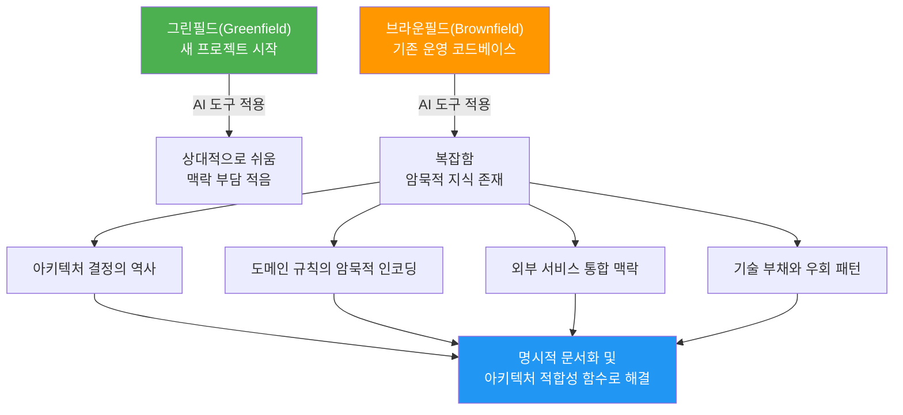
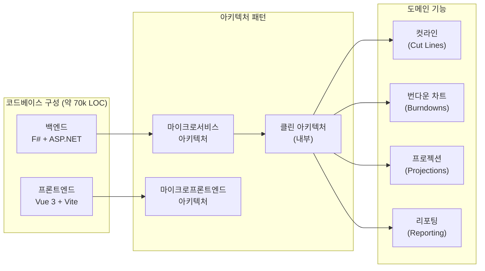
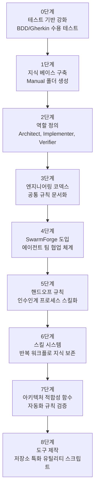
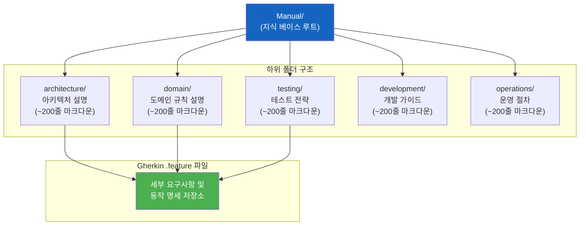
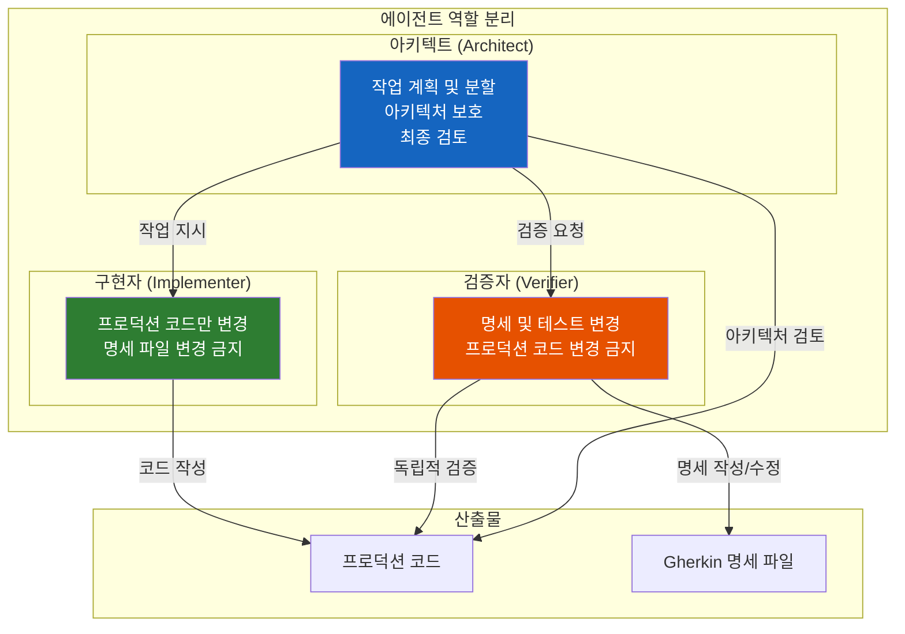
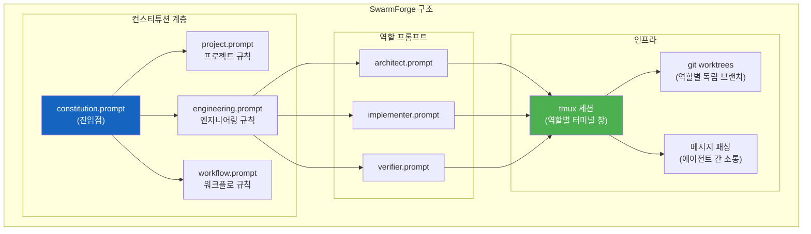
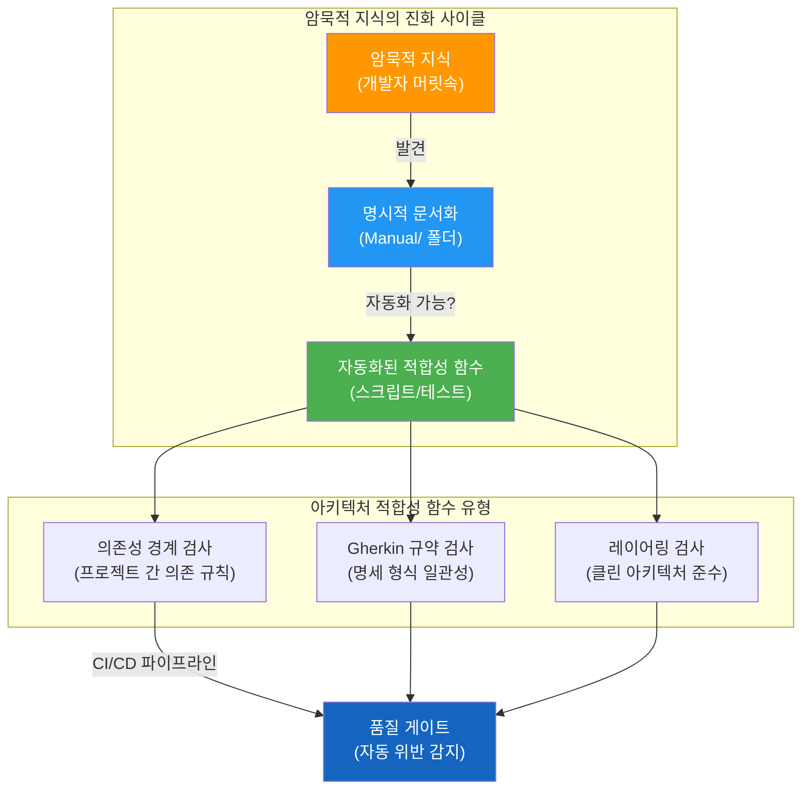
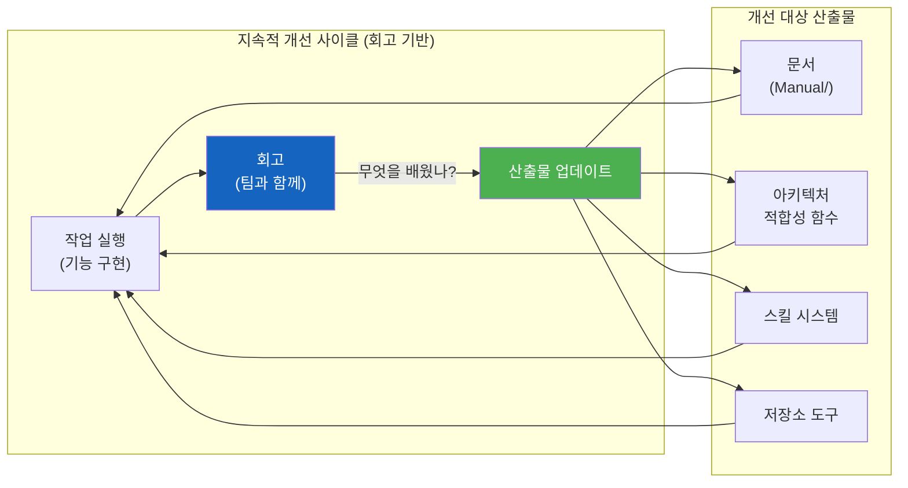
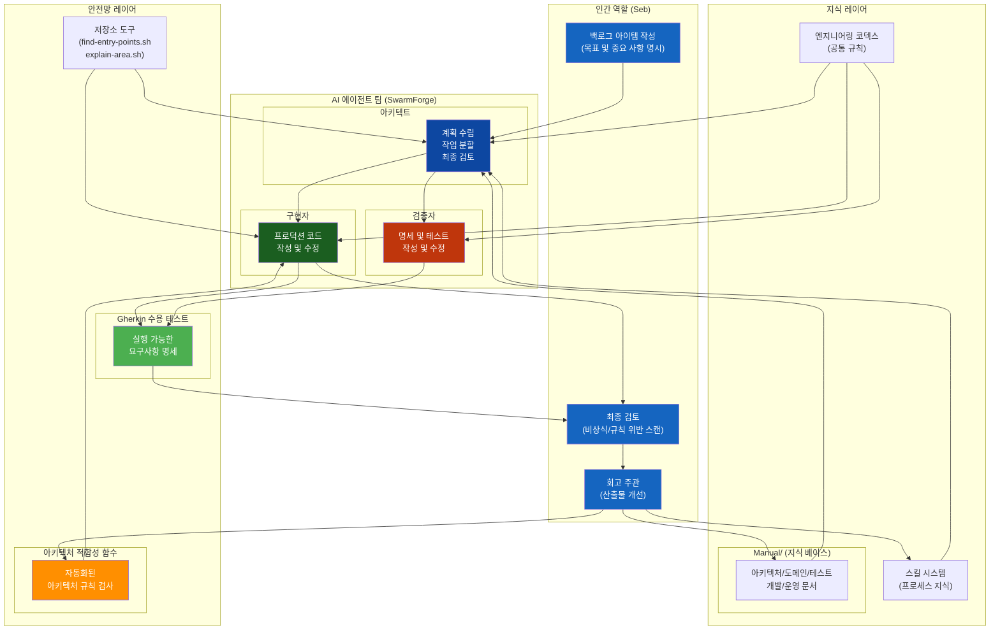

> **원문 출처:** Seb(@plainionist), X(구 Twitter) 게시글 및 아티클  
> **원문 게시일:** 2026년 6월 13일  
> **원문 URL:** https://x.com/plainionist/status/2065460998668972188  
> **작성 일자:** 2026-06-13  

---

## 개요

소프트웨어 엔지니어 Seb(@plainionist)이 자신의 실제 프로덕션 코드베이스를 AI 에이전트가 독립적으로 작업할 수 있도록 전환한 경험을 상세하게 공유했다. 이 글은 단순한 실험 보고가 아니라, 실제 비즈니스 가치가 있는 소프트웨어 프로젝트에서 수행한 체계적인 전환 과정의 기록이다. 그가 공유한 핵심 통찰은 **AI 에이전트의 독립적인 작동 능력은 AI 모델 자체의 성능보다 에이전트를 둘러싼 환경(하네스)의 품질에 의해 결정된다**는 것이다.

---

## 1. 브라운필드(Brownfield)란 무엇인가?

소프트웨어 개발에서 **그린필드(Greenfield)** 프로젝트란 기존 코드 없이 완전히 새로 시작하는 프로젝트를 의미한다. 반면 **브라운필드(Brownfield)** 프로젝트는 이미 운영 중인 기존 코드베이스 위에서 작업하는 경우를 말한다. 브라운필드 환경에는 수년에 걸쳐 축적된 아키텍처 결정, 도메인 규칙, 기술 부채, 암묵적 지식 등이 복잡하게 얽혀 있다.

AI 도구가 그린필드 프로젝트에는 효과적이라는 인식이 일반적이지만, 브라운필드 코드베이스에서는 상황이 훨씬 복잡하다. 기존 시스템에는 외부 서비스와의 통합 지점, 레거시 설계 결정의 이유, "왜 이렇게 만들었는가"에 대한 암묵적 맥락이 존재한다. AI 에이전트는 이러한 맥락 없이는 기능적으로는 올바르지만 전체 시스템을 조용히 망가뜨리는 코드를 생성할 수 있다. 브라운필드 AI 개발의 핵심 과제는 이 암묵적 지식을 에이전트가 이해할 수 있는 명시적 형태로 변환하는 것이다.

---

## 2. 대상 코드베이스 소개

Seb이 실험한 코드베이스는 장난감 프로젝트가 아니다. 이 소프트웨어는 수백만 달러 규모의 프로젝트에서 백로그 계획 및 실행 지원에 실제로 사용되는 프로덕션 제품이다. 컷라인(cut lines), 번다운 차트(burndowns), 프로젝션(projections), 리포팅(reporting) 기능을 포함한다.

기술 스택 측면에서 이 코드베이스는 약 **7만 줄(70k lines)의 코드**로 구성되어 있다. 백엔드는 **F#과 ASP.NET**으로 구축되었고, 프론트엔드는 **Vue 3과 Vite**를 사용한다. 아키텍처적으로는 **마이크로서비스 및 마이크로프론트엔드** 구조를 채택하고 있으며, 내부적으로는 **클린 아키텍처(Clean Architecture)** 를 따르고 공유 기능은 "마이크로 앱" 전반에 걸쳐 분산되어 있다. 이처럼 복잡한 아키텍처 위에서 AI 에이전트를 효과적으로 활용하는 것이 이 실험의 핵심 과제였다.

---

## 3. 전환 단계: 8가지 핵심 변화

Seb은 코드베이스를 AI-First로 전환하기 위해 순차적으로 8가지 주요 변화를 도입했다. 각 단계는 이전 단계의 기반 위에 세워졌으며, 전체 과정은 수 주에 걸쳐 점진적으로 진행되었다.

---

### 3.0 단계: 테스트 — 이미 갖추어진 안전망

Seb의 코드베이스는 AI 전환을 시작하기 전부터 이미 상당히 탄탄한 품질 기반을 가지고 있었다. 도메인 규칙은 **F# 타입 시스템**에 명시적으로 모델링되어 있었고, **BDD(Behavior-Driven Development)/Gherkin 수용 명세(acceptance specs)** 를 통해 높은 테스트 커버리지를 달성하고 있었다.

F#이라는 함수형 언어의 특성상 잘못된 상태를 컴파일 타임에 차단하는 강타입 시스템은 도메인 규칙 위반을 코드 레벨에서 근본적으로 방지한다. 여기에 더해 Gherkin 명세는 에이전트에게 세 가지 역할을 동시에 수행한다. 첫째, **안전망(safety net)** 으로서 에이전트가 변경한 코드가 기존 동작을 깨뜨리는지 즉시 확인할 수 있게 한다. 둘째, **실행 가능한 요구사항 명세(executable requirement specifications)** 로서 무엇을 구현해야 하는지 명확히 기술한다. 셋째, **진실의 원천(source of truth)** 으로서 이 명세를 통과한 구현은 올바른 것으로 간주된다.

Seb은 전통적인 유닛 테스트가 거의 없다는 점을 단점이 아니라 장점으로 언급한다. 유닛 테스트는 프로덕션 코드의 내부 구현에 강하게 결합되는 경향이 있어 리팩터링 시 테스트도 함께 수정해야 하는 부담이 생긴다. 반면 수용 테스트(acceptance tests)는 외부 동작만을 검증하기 때문에 **구현 코드와 느슨하게 결합**되어 있고, 이는 AI 에이전트가 내부 구현을 자유롭게 변경하더라도 동작의 정확성을 보장할 수 있게 한다. 또한 이 수용 테스트는 에이전트가 즉각적인 피드백을 받을 수 있을 만큼 충분히 빠르게 실행된다.

---

### 3.1 단계: 지식 베이스 구축 — 암묵적 지식의 명시화

코드베이스에서 가장 취약한 부분은 문서화였다. Seb이 혼자 작업할 때는 시스템에 대한 깊은 이해가 자신의 머릿속에 있었기 때문에 별도의 문서화가 필요 없었다. 그러나 AI 에이전트는 이러한 암묵적 지식을 활용할 수 없다. 에이전트는 오직 컨텍스트에 명시적으로 제공된 정보만을 기반으로 작동한다.

이를 해결하기 위해 Seb은 `Manual`이라는 단일 폴더를 생성하고 그 안에 하위 폴더들을 구성했다. 아키텍처(architecture), 도메인(domain), 테스트(testing), 개발(development), 운영(operations) 각각에 대한 폴더를 두고, 각 섹션을 위한 별도의 마크다운 파일을 작성했다. 각 파일의 크기는 보통 200줄 이내로 제한했다.

문서의 초점은 **개념과 배경 정보**에 맞추었다. 세부 요구사항과 동작 명세는 Gherkin `.feature` 파일에 그대로 남겨두고, 문서에서는 해당 파일을 참조하는 방식을 택했다. 이러한 접근은 중복을 피하면서도 에이전트가 필요한 맥락을 찾을 수 있도록 한다. 이 문서들은 VS Code의 GitHub Copilot과 협력하여 코드와 명세를 분석하고, 질문을 논의하며 단계적으로 구축했다.

---

### 3.2 단계: 역할 정의 — 컨텍스트 분리를 통한 팀 구성

지식 베이스가 갖춰지자 Seb은 에이전트 팀 구성에 집중했다. 그는 단순히 여러 에이전트를 두는 것이 아니라, **컨텍스트 분리(context separation)** 라는 원칙 하에 역할을 설계했다. 에이전트에게 제공되는 컨텍스트가 명확하고 집중될수록 더 좋은 결과를 낸다는 통찰에서 비롯된 접근이다.

다양한 아이디어를 시도한 끝에 Seb은 세 가지 역할로 정착했다.

**아키텍트(Architect)** 는 아키텍처 및 요구사항 공학을 담당한다. 이 프로젝트의 도메인과 아키텍처가 상당히 안정적이라는 점을 감안할 때 이 역할 분리는 매우 합리적이다. 아키텍트는 작업을 계획하고, 작업을 적절한 크기로 분할하며, 아키텍처를 보호하고, 기능 완성도와 아키텍처 준수 여부에 대한 최종 검토를 수행한다. 중요한 점은 아키텍트가 세부 분석을 위해 **서브 에이전트(sub-agents)** 를 활용한다는 것인데, 이는 아키텍트 자신의 컨텍스트를 깨끗하게 유지하기 위한 의도적인 설계이다.

**구현자(Implementer)** 는 프로덕션 코드를 변경하는 역할을 담당하며, 명세(spec) 파일은 절대 변경하지 않는다는 엄격한 규칙을 따른다.

**검증자(Verifier)** 는 명세와 테스트 자동화를 변경하는 역할을 담당하며, 반대로 프로덕션 코드는 절대 변경하지 않는다.

이처럼 명확하게 분리된 역할 구조는 에이전트들이 서로를 제어하는 상호 견제(mutual control) 메커니즘을 만들어낸다. 구현자가 무언가를 만들면 검증자가 독립적으로 검증하고, 아키텍트가 전체적인 방향성을 감독한다. Seb은 이 상호 제어가 실제로 작동하는 것을 여러 차례 직접 목격했다고 밝혔다.

---

### 3.3 단계: 엔지니어링 코덱스 — 모든 에이전트에 적용되는 공통 규칙

역할 정의가 완성되자 Seb은 Copilot 인스트럭션을 **엔지니어링 코덱스(engineering codex)** 로 발전시켰다. 코덱스는 역할과 무관하게 모든 에이전트에 공통으로 적용되는 규칙들의 집합이다.

코덱스가 다루는 내용은 매우 실용적이다. 코드 변경의 적절한 크기, 코드 공유 vs 커플링의 균형, 안전한 리팩터링 방법, 이 프로젝트에서 가독성 높은 코드를 작성하기 위한 코딩 규칙, 그리고 **정지 조건(stop conditions)** — 에이전트가 작업을 중단하고 인간에게 도움을 요청해야 하는 상황 — 등이 포함된다.

이 코덱스는 특정 역할이나 특정 작업에 국한되지 않고, 마치 팀 전체의 계약처럼 모든 에이전트가 준수해야 하는 엔지니어링 문화를 정의한다. Seb은 코덱스를 통해 에이전트의 행동에 일관성을 부여하고, 묵시적으로만 존재하던 팀 규범을 명시화할 수 있었다.

---

### 3.4 단계: SwarmForge — 에이전트 팀 협업 인프라

역할들이 정의되자 Seb은 에이전트들이 실제로 하나의 팀으로 협력하게 만들 방법이 필요했다. 이 시점에 **Uncle Bob(Robert C. Martin, 『Clean Code』의 저자)** 이 X에 SwarmForge에 대한 글을 올렸고, Seb은 이를 자신의 설정에 적용해보기로 했다.

**SwarmForge**는 Uncle Bob이 개발한 여러 AI 에이전트를 조율하기 위한 경량 도구이다. GitHub에서 오픈소스로 공개되어 있으며(`unclebob/swarm-forge`), tmux와 터미널에서 로컬로 실행된다. SwarmForge의 핵심 특징은 **계층적 컨스티튜션(Layered Constitution)** 시스템이다. `swarmforge/constitution.prompt`가 진입점 역할을 하며, `project.prompt`, `engineering.prompt`, `workflow.prompt` 등 하위 파일에 역할을 위임한다. 이를 통해 프로젝트 특화 규칙, 엔지니어링 규칙, 워크플로 규칙을 하나의 거대한 프롬프트에 몰아넣지 않고 분리하여 관리할 수 있다.

SwarmForge는 여러 에이전트가 서로 다른 **git 워크트리(git worktrees)** 에서 동시에 작업하면서도 충돌 없이 협력할 수 있도록 공유 구조를 제공한다. 역할별 프롬프트, 워크트리 할당, tmux 세션, 메시지 패싱 메커니즘이 포함되어 있어, 각 에이전트는 독립적인 터미널 창에서 실시간으로 관찰 가능한 형태로 실행된다.

---

### 3.5 단계: 핸드오프 규칙 — 에이전트 간 인수인계의 품질 게이트

팀 워크플로가 갖춰지자 실제 기능을 개발하는 데 이 팀을 투입할 준비가 되었다. 그러나 처음에는 핸드오프(handoff) 과정에서 심각한 문제들이 드러났다. 어떤 테스트를 실행해야 하는지, 무엇을 검토해야 하는지, 품질을 어떻게 보장하는지에 대한 명확한 기준이 없었기 때문이다.

Seb은 이 핸드오프 프로세스를 다듬기 위해 상당한 시간을 투자했다. 핸드오프 게이트(handoff gate)를 강화하는 과정에서 문서의 누락된 부분들이 밝혀지고, 점차 명확한 기준들이 만들어졌다. 결국 이 핸드오프 프로세스 자체를 **스킬(skill)** 로 만들었다. 핸드오프가 스킬로 정의되면, 에이전트는 항상 일관된 품질 기준으로 작업을 인수인계할 수 있게 된다.

---

### 3.6 단계: 스킬 시스템 — 프로세스 지식의 보존

처음에는 별도의 스킬 시스템이 없었다. 그러나 회귀 테스트(regression testing)와 같이 반복적으로 수행되는 워크플로 단계들이 확인되자, Seb은 에이전트 팀에게 이러한 반복 작업을 스킬로 만들어달라고 요청했다.

스킬은 에이전트가 특정 작업을 수행하는 방법을 구조화된 형태로 기술한 문서다. 스킬 시스템의 핵심 가치는 **프로세스 지식(process knowledge)의 보존**이다. 단순히 프로젝트에 관한 지식을 문서화하는 것을 넘어서, "어떻게 작업하는가"라는 방법론적 지식을 재사용 가능한 형태로 저장한다. 회고(retrospective) 수행 방법, 회귀 테스트 실행 절차, 특정 유형의 기능 구현 패턴 등이 모두 스킬로 추출되어 재활용된다. 결국 회고 프로세스 자체도 스킬이 되었다.

---

### 3.7 단계: 아키텍처 적합성 함수 — 규칙의 자동화

어느 시점에 Seb은 팀이 아키텍처 문서를 계속 업데이트하고 있다는 것을 발견했다. 이는 유용한 일이었지만 동시에 한계를 드러냈다. "무엇을 해야 하고 하지 말아야 하는지"를 설명하는 것은 도움이 되지만, **자동화된 규칙은 그것보다 훨씬 강력하다**는 통찰이었다.

#### 아키텍처 적합성 함수란?

**아키텍처 적합성 함수(Architecture Fitness Functions)** 는 Neal Ford, Rebecca Parsons, Pat Kua가 저서 『Building Evolutionary Architectures』에서 소개한 개념이다(Seb은 "Software Architecture: The Hard Parts"에서 이 용어를 처음 접했다고 언급했다). 적합성 함수는 진화적 컴퓨팅(evolutionary computing)의 유전 알고리즘에서 차용된 개념으로, 아키텍처의 특정 속성이 원하는 수준을 충족하는지 객관적으로 평가하는 메커니즘이다.

소프트웨어에서 적합성 함수는 개발자들이 중요한 아키텍처 특성을 유지하는지 확인한다. 테스트, 메트릭, 모니터링, 로깅 등 다양한 구현 방식을 사용할 수 있으며, 특정 아키텍처 차원을 보호하는 역할을 한다.

#### Seb의 구현 방식

Seb의 팀이 작성한 아키텍처 적합성 함수는 **단순한 스크립트** 형태로 구현되었다. 대부분 정규식(regex) 기반의 검사를 통해 주요 아키텍처 위반을 감지한다. 다루는 규칙의 주제는 다음과 같다.

**프로젝트 의존성 경계 검사**: 각 마이크로서비스나 마이크로 앱이 허용되지 않은 다른 모듈에 의존하고 있는지 자동으로 감지한다.

**Gherkin 파일 규약 검사**: 수용 테스트 명세가 일관된 형식과 규칙을 따르고 있는지 확인한다.

**레이어링 검사**: 클린 아키텍처의 레이어 규칙(예: 도메인 레이어가 인프라 레이어에 의존하면 안 됨)이 위반되고 있는지 감지한다.

모든 적합성 함수 검사는 자체 테스트를 가지고 있으며, 전부 AI 에이전트가 작성했다. Seb은 테스트만 검토했다고 밝혔다.

이 패턴은 하나의 중요한 원칙을 확립했다. **암묵적 지식이 명시적으로 되면, 먼저 그것을 문서화한다. 그런 다음 그것이 자동화된 검사로 만들어질 수 있는지 확인한다.**

---

### 3.8 단계: 도구 제작 — 저장소 특화 유틸리티

출력 품질이 안정화되자 Seb은 생산성에 집중했다. 일부 기능 구현이 예상보다 오래 걸리는 문제가 있었다. `fff`나 `serena` 같은 MCP 서버를 시도해봤지만 자신의 설정에서는 눈에 띄는 차이가 없었다.

ChatGPT와의 논의를 통해 Seb은 **저장소 특화 도구(repository-specific tools)** 를 직접 만드는 방향으로 나아갔다. 이렇게 탄생한 두 가지 도구는 다음과 같다.

**`find-entry-points.sh`**: 주어진 주제에 대한 코드베이스의 진입점을 더 쉽게 찾을 수 있게 해주는 스크립트이다. 에이전트가 새로운 기능 영역을 탐색할 때 어디서부터 시작해야 할지 빠르게 파악할 수 있도록 돕는다.

**`explain-area.sh`**: 주어진 파일 주변의 코드를 설명해주는 스크립트이다. 에이전트가 특정 코드 영역의 맥락을 이해할 때 활용한다.

흥미로운 점은 이 스크립트들이 처음에는 ChatGPT가 작성했지만, 이후 Seb의 에이전트 팀이 사용 관찰을 통해 스스로 개선했다는 것이다. 도구도 프로젝트와 함께 진화한다.

---

## 4. 현재 상태: Seb의 역할 변화

이 변환 과정을 거친 후 Seb은 실제로 다양한 기능들을 성공적으로 구현했다. 그의 역할 자체가 근본적으로 변화했다.

이제 Seb은 **목표와 중요 사항을 명시한 백로그 아이템 작성**에 집중하고, 이것을 팀에 넘기는 방식으로 일한다. 아키텍트 에이전트는 여전히 명확화 질문을 하기도 하지만, 팀은 기능을 전달한다. Seb은 `master` 브랜치에 병합되는 모든 것을 여전히 간략하게 검토하지만, 더 이상 모든 세부 사항을 검토하지는 않는다. 대신 비상식적인 코드나 프로젝트 규칙 위반 여부를 주로 확인한다.

Seb은 최근 흥미로운 사례를 공유했다. 에이전트 팀이 테스트에서 **리플렉션(reflection)** 을 사용했는데, 이것이 명시적으로 금지되지 않았기 때문이다. Seb에게는 너무나 당연한 금지 사항이었기 때문에 문서화할 생각조차 하지 않았던 것이다. 이는 **암묵적 지식의 전형적인 예시**이다. Seb은 즉시 아키텍트 에이전트에게 문서를 업데이트하고 이를 위한 아키텍처 적합성 함수를 추가하도록 요청했다.

Seb이 여전히 매우 신중하게 직접 검토하는 부분이 하나 있다. 바로 생성되거나 수정된 **Gherkin 명세 파일**이다. 이 명세들은 시스템의 궁극적인 품질 게이트(ultimate quality gate)이기 때문이다.

---

## 5. 회고 — 지속적인 개선 사이클

Seb은 매 주요 작업 이후 팀과 함께 **회고(retrospective)** 를 수행하는 것을 습관으로 만들었다. 회고에서 다루는 질문들은 다음과 같다.

무엇을 배웠는가? 어떤 문서를 업데이트해야 하는가? 어떤 새로운 아키텍처 적합성 규칙이 필요한가? 도구가 도움이 되었는가? 어떤 스킬을 만들거나 개선해야 하는가?

결국 이 회고 프로세스 자체도 **스킬**이 되었다. 이를 통해 문서, 규칙, 스킬, 도구, 아키텍처 적합성 함수 등 모든 산출물이 작업이 진행되면서 함께 개선된다.

이것은 스티븐 코비의 저서 『성공하는 사람들의 7가지 습관』에 등장하는 **"습관 7: 도끼 날을 갈아라(Sharpen the Saw)"** 와 정확히 일치한다. 도끼날을 갈지 않고 나무만 계속 찍는 것이 아니라, 주기적으로 도끼날을 날카롭게 유지함으로써 장기적으로 더 효율적인 작업이 가능해진다는 원칙이다. Seb의 경우, 에이전트 주변의 환경을 지속적으로 개선하는 것이 그 "도끼 날 갈기"에 해당한다.

---

## 6. 핵심 교훈 정리

Seb이 이 경험에서 도출한 핵심 교훈들은 현재 AI 에이전트 엔지니어링 커뮤니티에서 널리 공유되는 원칙들과 깊이 공명한다.

### 교훈 1: AI 모델보다 환경이 더 중요하다

코드베이스를 AI-First로 전환하는 데 성공하는 것은 AI 모델 자체의 능력보다 에이전트를 둘러싼 환경의 품질에 더 크게 좌우된다. 아무리 강력한 모델이라도 잘못된 컨텍스트, 불명확한 역할, 부재한 테스트 안전망 속에서는 제대로 작동할 수 없다.

### 교훈 2: 암묵적 지식을 명시화하라

에이전트는 오직 명시적으로 제공된 정보만을 활용한다. "당연히 알겠지"라는 가정은 통하지 않는다. 개발자의 머릿속에 있는 모든 아키텍처 결정, 도메인 규칙, 코딩 철학이 명시적인 문서나 자동화 검사로 변환되어야 한다.

### 교훈 3: BDD/Gherkin 수용 테스트는 최고의 안전망이다

수용 테스트는 에이전트의 안전망이자 실행 가능한 요구사항 명세다. 특히 구현 코드와 느슨하게 결합된 수용 테스트는 에이전트가 내부 구현을 자유롭게 변경하면서도 동작의 정확성을 보장할 수 있게 한다.

### 교훈 4: 역할 분리로 컨텍스트를 관리하라

에이전트에게 모든 것을 맡기는 것은 컨텍스트 오염을 초래한다. 명확하게 분리된 역할은 각 에이전트의 컨텍스트를 집중되고 깨끗하게 유지한다. 또한 역할 분리는 에이전트 간 상호 견제 메커니즘을 자연스럽게 만들어낸다.

### 교훈 5: 규칙은 자동화로 강제하라

문서화된 규칙은 에이전트가 무시하거나 오해할 수 있다. 아키텍처 적합성 함수를 통해 규칙을 자동화된 검사로 변환하면, 위반이 즉시 감지되고 강제될 수 있다.

### 교훈 6: 지속적인 개선이 핵심이다

AI-First 전환은 한 번의 큰 설정으로 끝나지 않는다. 회고를 통한 지속적인 문서, 규칙, 스킬, 도구의 개선이 시스템 전체를 점진적으로 더 효과적으로 만든다.

---

## 7. 전체 아키텍처 조감도

아래 다이어그램은 Seb이 구축한 AI-First 코드베이스 환경의 전체 구조를 보여준다.

---

## 8. 관련 주요 개념 심층 해설

### BDD/Gherkin이란?

**BDD(Behavior-Driven Development, 행동 주도 개발)** 는 소프트웨어의 동작을 자연어에 가까운 형식으로 기술하고, 이것을 직접 실행 가능한 테스트로 변환하는 개발 방법론이다. **Gherkin**은 BDD 명세를 작성하기 위한 특정 언어로, `Given/When/Then` 구조로 이루어진다.

- **Given**: 특정 상황이 주어졌을 때 (사전 조건)
- **When**: 어떤 행동이 수행될 때
- **Then**: 이런 결과가 발생해야 한다 (기대 결과)

이 명세는 Cucumber, SpecFlow 같은 도구를 통해 자동으로 실행되는 테스트로 변환된다. AI 에이전트 시대에 Gherkin 명세의 가치는 더욱 커지고 있는데, 자연어에 가까운 형식이 에이전트가 요구사항을 이해하기 쉽게 하면서도, 동시에 실행 가능한 검증 수단을 제공하기 때문이다.

### SwarmForge와 Uncle Bob의 기여

Uncle Bob으로 알려진 **Robert C. Martin**은 『Clean Code』, 『Clean Architecture』 등의 저서로 잘 알려진 소프트웨어 장인(software craftsman)이다. 그가 개발한 SwarmForge는 AI 에이전트 시대에 소프트웨어 공학의 원칙들을 적용하려는 시도의 일환이다. 계층적 컨스티튜션, git worktree 기반의 역할 분리, tmux를 통한 관찰 가능한 에이전트 실행 등의 특징을 통해 다수의 에이전트가 체계적으로 협력할 수 있는 경량 인프라를 제공한다.

### "Software Architecture: The Hard Parts"

Seb이 아키텍처 적합성 함수라는 용어를 처음 접한 책은 Neal Ford, Mark Richards, Pramod Sadalage, Zhamak Dehghani가 공저한 『Software Architecture: The Hard Parts』이다. 이 책은 현대 분산 아키텍처에서의 어려운 트레이드오프를 다루며, 아키텍처 적합성 함수를 포함한 다양한 실용적 도구를 소개한다. 원 개념은 Neal Ford, Rebecca Parsons, Pat Kua의 『Building Evolutionary Architectures』에서 등장했으며, 진화적 컴퓨팅에서 차용된 피트니스 함수 개념을 소프트웨어 아키텍처 거버넌스에 적용한 것이다.

---

## 9. 결론

Seb의 경험은 AI 에이전트를 활용한 소프트웨어 개발의 미래가 어떤 모습일지를 실증적으로 보여준다. 브라운필드 코드베이스에서 AI 에이전트가 독립적으로 의미 있는 작업을 수행하려면, 강력한 테스트 기반, 명시화된 지식 베이스, 명확한 역할 분리, 자동화된 아키텍처 검증이라는 네 가지 기반이 갖춰져야 한다.

단 하나의 큰 설정으로 완성되는 시스템이 아니라, **회고를 통한 지속적인 개선**이 이 환경을 점점 더 효과적으로 만들어간다. AI 에이전트가 쓸 수 있는 코드베이스는 결국 인간 개발자도 더 잘 이해하고 유지보수할 수 있는 코드베이스이기도 하다. AI-First 전환은 AI를 위한 것이기도 하지만, 동시에 소프트웨어 공학의 오래된 원칙들 — 명시성, 자동화, 역할 분리, 지속적 개선 — 로의 복귀이기도 하다.

---

*작성 일자: 2026-06-13*
