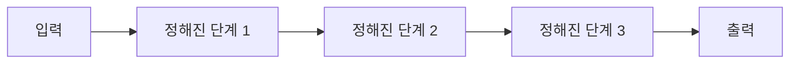
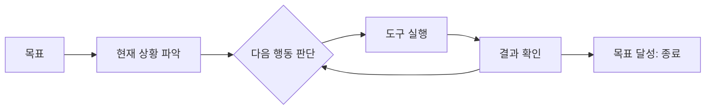
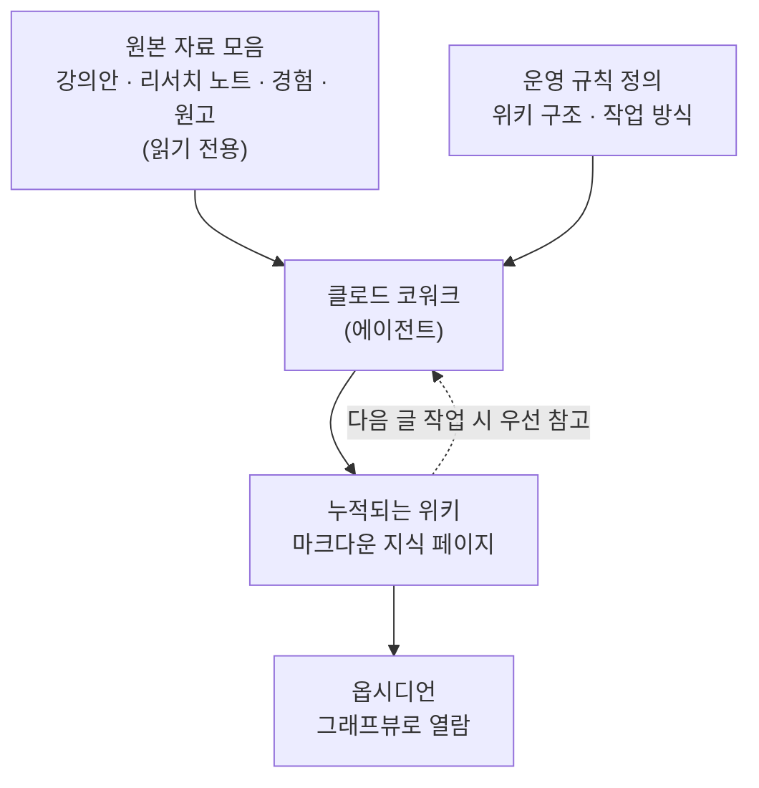

>
>[https://www.facebook.com/share/p/18S5Q37r97/](https://www.facebook.com/share/p/18S5Q37r97/)
>
>에이전트는 자동화에 있지 않다. 에이전트를 자동화로 접근하는 건 피상적인 접근이다. 자동화 워크플로우를 만드는 일은 대부분 그냥 예전부터 할 수 있었던 일이다.
>
>에이전트의 가치는 개인에게 슈퍼파워를 주는 것이다. 잡무를 처리해주는 것이 아니라 할 수 없던 일을 할 수 있도록 만들어주는 도구다.
>
>알기 쉽게 자동화와 연결해보자면, 반복적으로 하는 자동화를 하는 도구가 아니라, 1회성의 복합적인 작업을 스스로 진행하는 도구이며, 그 과정에서 어떤 것을 자동화 할 수 있을지를 발견하게 해 주는 도구다.
>
>고정된 워크플로우로 자동화를 실행하는 도구가 아니라, 같은 작업이라도 매번 그 시점과 상황에 맞는 워크플로우를 스스로 탐색하며 진행하는 도구다.
>
>즉, 워크플로우에서 자유로운 에이전트만이 진정한 에이전트라고 할 수 있다.
>

>
>[https://www.facebook.com/share/p/18myK3wMrd/](https://www.facebook.com/share/p/18myK3wMrd/)
>
>AI를 쓰는 방식은 에이전트(Agent)를 쓰기 전과 후로 나뉩니다. 기준은 하나입니다. 글과 강의와 책의 재료를 어디에서 가져오는가.
>
>에이전트를 쓰기 전에는 시간 대부분을 검색에 썼습니다. 온라인에서 자료를 찾고, 거기서 제공하는 전문 지식을 골라 담았습니다. 문제는 그 자료가 나에게 맞춘 지식이 아니라는 점이었습니다. 누구에게나 열려 있는 포괄적이고 일반적인 자료였습니다. 그 일반 자료를 기준 삼아 글을 쓰고 강의를 만들고 책을 집필했습니다.
>
>지금은 클로드 코워크(Claude Cowork)와 옵시디언(Obsidian), 그리고 LLM 위키(LLM Wiki)를 함께 씁니다. 달라진 지점은 재료의 출처입니다. 오래 강의했던 자료, 그때그때 모아둔 리서치 노트, 직접 겪은 경험, 이미 집필한 원고. 이런 원천 소스를 위키에 넣습니다. 그리고 위키에서 필요한 자료를 뽑아 씁니다. 온라인의 수많은 자료 대신, 오랜 시간 커스텀해 로컬로 쌓아둔 내 자료가 기반이 됩니다.
>
>비유하자면 냉장고입니다. 김치찌개를 끓인다고 해봅니다. 한쪽은 시판 김치, 공개된 레시피, 온라인에서 파는 일반적인 재료로 끓입니다. 다른 한쪽은 우리 집 식단에 맞춰 직접 담근 김치에, 단골 정육점에서 고른 돼지고기를 넣어 끓입니다. 같은 김치찌개라도 결과는 다릅니다. 어느 쪽이 내 입맛에 맞고 더 맛있는지는 분명합니다.
>
>에이전트를 쓰기 전과 후의 차이가 여기에 있습니다. 남이 만들어둔 일반 재료로 끓이느냐, 내가 모아둔 내 재료로 끓이느냐. 도구가 에이전트로 바뀌면서, 재료의 주인까지 나로 바뀌었습니다.
>

## 들어가며

두 편의 글은 표현 방식은 다르지만, 결국 같은 주제를 다른 층위에서 다루고 있다. 첫 번째 글은 "에이전트란 무엇인가"라는 질문에 정의 차원에서 답하고, 두 번째 글은 그 정의가 실제 작업 현장에서 어떤 식으로 결과를 바꾸는지를 구체적인 도구 조합과 비유로 보여준다. 첫 번째 글을 이론, 두 번째 글을 사례로 놓고 함께 읽으면, "에이전트가 등장하면서 무엇이 달라지는가"에 대한 하나의 완결된 그림이 만들어진다.

이 글에서는 두 글의 핵심 주장을 하나씩 풀어서 설명하고, 두 번째 글에서 언급된 Claude Cowork와 옵시디언(Obsidian), LLM 위키(LLM Wiki)가 실제로 무엇을 가리키는 도구인지를 최근 자료를 바탕으로 정리한 뒤, 두 글이 어떻게 하나의 흐름으로 연결되는지를 살펴본다.

---

## 1부. "에이전트는 자동화에 있지 않다"는 말의 의미

### 자동화와 에이전트는 출발점이 다르다

첫 번째 글의 핵심 문장은 "에이전트를 자동화로 접근하는 건 피상적인 접근"이라는 선언이다. 이 문장이 강조하려는 것은, 자동화라는 개념 자체가 가진 본질이 에이전트라는 개념의 본질과 다르다는 점이다.

자동화는 사람이 이미 할 수 있는 일을, 미리 정해진 절차에 따라 기계가 대신 반복 수행하도록 만드는 작업이다. 엑셀 매크로, 이메일 자동 발송, 정해진 시간에 보고서를 만들어 전송하는 스크립트 같은 것들이 대표적이다. 이런 일들은 사실 새로운 일이 아니다. 글에서 말하듯 "자동화 워크플로우를 만드는 일은 대부분 그냥 예전부터 할 수 있었던 일"이며, AI가 등장하기 전에도 프로그래머나 자동화 도구를 통해 충분히 가능했던 영역이다. 즉 자동화의 본질은 "반복되는 일을 더 빠르고 안정적으로" 처리하는 것에 있다.

반면 에이전트의 본질은 "할 수 없던 일을 할 수 있게" 만드는 데 있다. 글에서는 이를 "개인에게 슈퍼파워를 주는 것"이라고 표현한다. 잡무를 대신 처리해주는 비서가 아니라, 한 사람의 능력 범위 자체를 확장시켜주는 도구라는 의미다. 예를 들어 예전에는 데이터 분석가, 디자이너, 카피라이터, 법률 검토자가 각각 따로 필요했던 프로젝트를 한 사람이 끝까지 진행할 수 있게 되는 변화가 여기에 해당한다. 이때 중요한 것은 "시간을 아껴준다"가 아니라 "혼자서는 도달할 수 없던 결과에 도달하게 해준다"는 방향성이다.

### 1회성 복합 작업과 자동화의 발견

자동화와 에이전트의 차이를 더 구체적으로 들여다보면, 다루는 "작업의 성격" 자체가 다르다는 점이 드러난다.

자동화는 "같은 일을 계속" 처리하기 위한 도구다. 매주 같은 형식의 보고서, 매일 같은 시간에 보내는 알림처럼, 입력과 출력의 형태가 거의 고정되어 있는 작업에 적합하다. 반대로 에이전트는 "1회성의, 여러 단계가 섞인 복합적인 작업"을 그 자리에서 스스로 진행하는 도구다. 예를 들어 "이번 주에 모아둔 자료 열두 건을 검토해서 주제별로 나누고, 신뢰도가 낮아 보이는 자료는 따로 표시하고, 나머지는 정리된 노트로 만들어줘"라는 요청은 매번 자료의 내용과 형식이 다르기 때문에 고정된 스크립트로 처리하기 어렵다. 에이전트는 이런 요청을 받을 때마다 그 자료의 성격을 새로 판단하고, 그에 맞는 처리 순서를 그때그때 정한다.

여기서 글이 강조하는 두 번째 포인트가 등장한다. 에이전트는 단순히 이런 1회성 작업을 처리해주는 데서 멈추지 않고, "그 과정에서 어떤 것을 자동화할 수 있을지를 발견하게 해주는 도구"라는 것이다. 같은 종류의 복합 작업을 에이전트와 여러 번 반복하다 보면, "이 부분은 매번 같은 패턴으로 처리되는구나"라는 점이 드러나는 순간이 온다. 그 부분만 따로 떼어내면 비로소 안정적인 자동화 스크립트로 만들 수 있다. 즉 에이전트는 자동화를 대체하는 것이 아니라, 자동화할 가치가 있는 지점을 사람이 직접 발견하도록 도와주는 탐색 도구의 역할을 한다.

### 워크플로우에서 자유로운 에이전트

마지막으로 글은 "고정된 워크플로우로 자동화를 실행하는 도구가 아니라, 같은 작업이라도 매번 그 시점과 상황에 맞는 워크플로우를 스스로 탐색하며 진행하는 도구"라는 정의를 제시한다. 이 문장은 앞의 두 논의를 종합하는 결론에 해당한다.

예를 들어 "주간 리포트 작성"이라는 동일한 이름의 작업이라도, 이번 주에는 참고할 원본 자료가 주로 글로 된 게시물들이고 다음 주에는 표와 숫자로 된 자료들이 많다면, 사람이 보기엔 "같은 작업"이지만 실제로 처리해야 하는 순서와 방법은 완전히 달라진다. 워크플로우 기반의 자동화는 이런 변화에 취약하다. 미리 정해둔 경로를 벗어나는 입력이 들어오면 오류가 나거나, 처리되지 않은 채로 남는다. 반면 에이전트는 매번 "이번엔 어떤 자료가 들어왔는가"를 먼저 파악하고, 그에 맞는 절차를 그 자리에서 설계해 진행한다.

이 지점에서 글은 "워크플로우에서 자유로운 에이전트만이 진정한 에이전트"라고 결론을 내린다. 다시 말해, 만약 어떤 도구가 매번 똑같은 순서로만 작동한다면, 그것이 LLM을 사용하고 있다 해도 본질적으로는 자동화 워크플로우에 가깝다는 것이다. 진짜 에이전트는 절차 자체를 고정해두지 않고, 매번 상황을 인식한 뒤 그에 맞는 절차를 스스로 만들어내는 쪽에 가깝다.

### 정리: 자동화(워크플로우)와 에이전트 비교

두 개념의 차이를 표로 정리하면 다음과 같다.

| 구분 | 자동화(워크플로우) | 에이전트 |
|---|---|---|
| 작동 경로 | 미리 정해진 순서를 따라 실행 | 매번 상황을 보고 스스로 경로를 설계 |
| 핵심 가치 | 반복 작업의 효율화, 시간 절약 | 혼자서는 도달할 수 없던 결과에 도달 — "슈퍼파워" |
| 적합한 작업 | 입력과 출력 형태가 고정된 반복 작업 | 매번 형태가 달라지는 1회성 복합 작업 |
| 사람과의 관계 | 사람을 대신해 잡무를 처리 | 사람의 능력 범위를 확장 |
| 부가적 효과 | 없음(설계된 대로만 동작) | 작업 과정에서 자동화할 지점을 스스로 발견하게 해줌 |

실제로 Anthropic도 이와 비슷한 기준으로 둘을 구분한 적이 있다. Anthropic에 따르면, AI 에이전트와 AI 워크플로우를 구분하는 핵심 요소는 오케스트레이션의 유무이며, 오케스트레이션은 AI가 다양한 작업과 도구를 상황에 맞게 조율하고 관리하는 능력을 의미한다. 워크플로우는 개발자가 미리 짜둔 경로를 따라 LLM과 도구를 순차적으로 호출하는 구조이고, 에이전트는 LLM이 주도권을 가지고 다음 행동을 동적으로 선택하며 전체 과정을 스스로 통제하는 구조라는 점에서, 첫 번째 글의 주장과 같은 결을 가진다.

다음 두 그림은 이 차이를 흐름으로 단순화한 것이다.

워크플로우(자동화)는 입력이 들어오면 정해진 단계를 순서대로 거쳐 출력이 나오는 일직선 구조다.

반면 에이전트는 목표만 주어진 상태에서, 현재 상황을 살펴보고 다음 행동을 스스로 판단하며, 결과를 확인한 뒤 목표에 도달했는지 여부에 따라 같은 판단 과정을 반복하거나 종료하는 순환 구조를 가진다.

두 번째 흐름에서 B3와 B5 사이의 순환이 바로 "워크플로우에서 자유롭다"는 말의 실체다. 매번 입력이 달라지면 B3에서 선택되는 행동도 달라지고, 그 결과 전체 경로 자체가 매번 다르게 그려진다.

---

## 2부. 에이전트 이후, 콘텐츠의 재료는 어디서 오는가

### 에이전트 이전: 검색이 곧 자료였던 시절

두 번째 글은 "AI를 쓰는 방식은 에이전트를 쓰기 전과 후로 나뉜다"는 문장으로 시작한다. 그리고 그 구분 기준을 "글과 강의와 책의 재료를 어디에서 가져오는가"로 명확히 한다.

에이전트를 쓰기 전에는 작업 시간의 대부분이 검색에 쓰였다. 온라인에서 관련 자료를 찾고, 그 안에서 쓸 만한 전문 지식을 골라 담아 글이나 강의, 책의 뼈대를 만드는 방식이다. 이 방식의 한계는 명확하다. 검색을 통해 얻는 자료는 누구에게나 열려 있는 일반적이고 포괄적인 정보다. 특정한 한 사람의 경험, 맥락, 축적된 노하우가 반영되어 있지 않다. 결과적으로 그 일반 자료를 기준으로 작성된 글이나 강의는, 누가 만들어도 비슷한 결론에 도달하기 쉬운 "평균적인" 콘텐츠가 되기 쉽다.

### 에이전트 이후: Claude Cowork, 옵시디언, LLM 위키의 조합

글은 지금의 작업 방식으로 "클로드 코워크(Claude Cowork)와 옵시디언(Obsidian), 그리고 LLM 위키(LLM Wiki)"의 조합을 언급한다. 이 세 가지가 실제로 무엇을 가리키는지 차례로 살펴보면, 변화의 실체가 더 분명해진다.

**옵시디언(Obsidian)** 은 마크다운 파일을 기반으로 개인 메모를 관리하는 노트 앱이다. 모든 노트가 일반 텍스트 파일 형태로 사용자의 컴퓨터에 그대로 저장되며, 노트 사이를 `[[ ]]` 형태의 링크로 연결하면 그래프 형태로 노트 간 관계를 시각적으로 확인할 수 있다. 클라우드 서비스에 종속되지 않고 로컬 파일 그대로 보관된다는 점이 핵심이다.

**클로드 코워크(Claude Cowork)** 는 Anthropic이 데스크톱 앱 안에 추가한 에이전트형 기능이다. Cowork는 사용자의 컴퓨터에서 직접 실행되며, 사용자가 공유하기로 선택한 파일에 Claude가 접근할 수 있도록 해준다. 즉 채팅창에 "이 폴더를 정리해줘", "이 자료들을 검토해서 정리해줘" 같은 요청을 하면, Claude가 실제로 해당 폴더의 파일을 읽고, 새로운 파일을 만들거나 기존 파일을 수정하는 식으로 작업을 직접 수행한다. 다만 몇 가지 운영상의 제약이 있는데, Claude 데스크톱 앱이 계속 열려 있고 컴퓨터가 잠자기 상태로 들어가지 않아야 작업이 계속 진행되며, 앱을 닫거나 컴퓨터가 잠들면 진행 중인 작업이 멈춘다. 또한 메모리 기능은 프로젝트 단위에서만 지원되고, 일반적인 단발성 Cowork 세션에서는 이전 대화 내용이 이어지지 않는다. 최근에는 프로젝트 단위로 파일, 링크, 작업 지침, 메모리를 함께 묶어 지속적인 작업 공간으로 운영할 수 있는 기능과, 정해진 시간에 자동으로 작업을 수행하는 예약 작업 기능도 추가되었다.

**LLM 위키(LLM Wiki)** 는 가장 최근에 등장한 개념으로, 2026년 4월 OpenAI 공동창업자였던 안드레 카파시(Andrej Karpathy)가 깃허브 기스트(Gist) 형태로 공개한 작업 패턴을 가리킨다. 2026년 4월 3일, 현재 독립 연구자로 활동 중인 카파시는 자신이 이 문제를 어떻게 해결하는지를 설명하는 글을 X에 올리면서, 전체 구조를 정리한 깃허브 기스트를 함께 공개했고, 이 패턴은 벡터 데이터베이스 없이 AI 모델이 구조화된 마크다운 지식 베이스를 구성·유지·조회하는 세 개의 폴더로 이루어진 방식이다. 이 게시물 하나가 무려 1600만 회 이상의 조회수를 기록했고, 함께 공개된 기스트도 며칠 만에 수천 개의 즐겨찾기를 받으며 빠르게 퍼졌다.

이 패턴의 구조는 세 개의 층으로 이루어진다. 첫 번째는 원본 문서를 모아두는 곳으로, 읽기만 하고 수정하지 않는 raw sources, 두 번째는 AI가 생성하고 관리하는 마크다운 형태의 지식 페이지인 wiki, 세 번째는 위키의 구조와 작업 방식을 정의하는 schema다. 작동 방식은 흔히 사용되는 RAG(검색 증강 생성, Retrieval-Augmented Generation)와 대비된다. RAG는 질문이 들어올 때마다 원본 자료 전체를 다시 검색해서 답을 구성하는 방식이라 같은 자료를 매번 처음부터 다시 훑는 것에 가깝다. 반면 LLM 위키는 원본 자료를 한 번 읽을 때 그 내용을 소화해 위키 페이지로 미리 정리해두고, 다음 질문이 들어올 때는 이미 정리된 위키를 먼저 참고한다. 이 패턴을 설명하는 후속 자료들은 이 과정을 컴파일(compile)에 비유한다. 소스 코드를 매번 그대로 실행하는 대신 한 번 컴파일해 실행 파일로 만들어두면 이후에는 그 결과물을 효율적으로 재사용할 수 있는 것처럼, 흩어진 원본 자료를 한 번 "컴파일"해 위키로 만들어두면 이후의 모든 작업이 그 위키를 기반으로 더 빠르고 정확하게 진행된다는 것이다.

카파시가 이 패턴을 코드가 아니라 짧은 설명 글(아이디어 파일) 형태로만 공개한 점도 눈에 띈다. 직접 설치할 수 있는 패키지나 상세한 설정 안내 없이, "이 아이디어를 자신의 에이전트에게 전달하면 각자의 상황에 맞게 에이전트가 직접 구현해줄 것"이라는 의도로 공개되었고, 실제로 공개 직후 옵시디언 플러그인, 깃허브 저장소 형태의 구현체, 운영 경험을 반영해 패턴을 확장한 후속 버전 등 여러 갈래의 구현이 빠르게 등장했다.

두 번째 글에서 말하는 "클로드 코워크와 옵시디언, LLM 위키를 함께 쓴다"는 문장은, 이 세 가지를 하나의 작업 환경으로 엮는다는 의미다. 오랫동안 강의에 썼던 자료, 그때그때 모아둔 리서치 노트, 직접 겪은 경험, 이미 써둔 원고 같은 원천 자료들을 LLM 위키의 원본 자료 폴더에 넣어두고, 클로드 코워크가 이 자료들을 읽어 위키 페이지로 정리·누적시키며, 그 결과물을 옵시디언에서 폴더 형태로 열어 그래프뷰로 확인하는 구조다. 이렇게 만들어진 위키는 새 글이나 강의, 책을 쓸 때마다 가장 먼저 참고하는 자료가 된다.

### 재료의 출처가 바뀐다는 것의 의미

이 변화에서 핵심은 "검색에서 위키로"라는 도구의 교체가 아니라, "재료의 출처가 누구의 것인가"라는 질문의 답이 바뀌었다는 점이다. 에이전트를 쓰기 전에는 글의 재료가 온라인에 흩어진 일반 자료, 즉 누구나 접근할 수 있는 공개된 정보였다. 에이전트를 쓴 이후에는 글의 재료가 오랜 시간 동안 한 사람이 직접 모으고 경험하며 쌓아온 자료, 즉 그 사람만이 가진 정보가 된다. 도구가 검색에서 에이전트로 바뀌면서, 그 도구가 다루는 재료의 주인까지 함께 바뀌는 셈이다.

### 김치찌개 비유 풀이

글은 이 차이를 김치찌개를 끓이는 두 가지 방식으로 비유한다. 한쪽은 시판 김치와 인터넷에 공개된 레시피, 마트에서 파는 일반적인 재료로 끓인 찌개다. 누구나 같은 방식으로 만들 수 있고, 맛도 평균적인 수준에서 비슷하다. 다른 쪽은 그 집의 식단에 맞춰 직접 담근 김치에, 오랫동안 거래해온 단골 정육점에서 고른 돼지고기를 넣어 끓인 찌개다. 같은 "김치찌개"라는 이름을 달고 있어도, 들어가는 재료가 그 사람의 취향과 환경에 맞춰 오랜 시간 다듬어진 것이기 때문에 결과물이 다르다.

이 비유를 글쓰기에 그대로 옮기면, 시판 김치와 일반 레시피는 검색으로 찾은 공개 자료에 해당하고, 직접 담근 김치와 단골 정육점 고기는 LLM 위키에 누적된 자신의 강의 자료, 리서치 노트, 경험, 원고에 해당한다. 같은 주제를 다룬 글이라도, 어느 쪽 재료로 썼는지에 따라 그 글이 그 사람만 쓸 수 있는 글인지, 누구나 쓸 수 있는 글인지가 달라진다.

### LLM 위키 작업 구조

지금까지 설명한 구조를 하나의 흐름으로 정리하면 다음과 같다. 원본 자료와 운영 규칙을 클로드 코워크라는 에이전트가 함께 참고하여 위키 페이지를 만들고, 그 위키는 옵시디언에서 열람되는 동시에 다음 작업의 출발점으로 다시 참조된다.

이 구조에서 위쪽의 화살표(원본 자료와 운영 규칙이 에이전트로 들어가는 흐름)는 한 번에 끝나는 것이 아니라, 새로운 자료가 들어올 때마다 반복된다. 그리고 그 결과로 누적되는 위키는 시간이 지날수록 더 두꺼워지고, 항목 사이의 연결도 더 풍부해진다. 새로운 글을 쓸 때는 매번 검색부터 다시 시작하는 것이 아니라, 이미 누적된 위키에서 관련 항목을 먼저 확인한 뒤 부족한 부분만 추가로 보완하는 순서가 된다.

---

## 3부. 두 글을 잇는 한 줄

두 글을 나란히 놓으면, 첫 번째 글에서 말한 "워크플로우에서 자유로운 에이전트"가 실제로 어떤 모습으로 구현되는지를 두 번째 글이 보여주고 있다는 점이 드러난다.

LLM 위키를 운영하는 작업 자체가 고정된 워크플로우가 아니다. 이번 주에 들어온 자료가 스레드에 올라온 짧은 글이라면 위키의 한 항목에 짧게 추가되는 식으로 처리되고, 다음 주에 들어온 자료가 긴 논문이라면 새로운 항목을 만들고 기존 항목들과의 연결 관계까지 새로 정리하는 식으로 처리된다. 같은 "자료를 위키에 정리한다"는 작업이라도, 매번 그 자료의 성격에 맞춰 처리 순서와 결과물의 형태가 달라진다. 이것이 바로 첫 번째 글이 말한 "같은 작업이라도 매번 그 시점과 상황에 맞는 워크플로우를 스스로 탐색하며 진행"하는 모습이다.

또한 첫 번째 글이 말한 "에이전트의 가치는 슈퍼파워를 주는 것"이라는 문장도 두 번째 글에서 더 구체적인 형태로 확인된다. 한 사람이 수년간 모아온 강의 자료, 리서치 노트, 경험, 원고를 누군가에게 설명하거나 정리를 맡기려면 상당한 시간과 인력이 필요하다. 에이전트는 이 작업을 한 사람이 직접, 그것도 지속적으로 누적되는 형태로 해낼 수 있게 해준다. 이는 단순히 "검색 시간을 아껴주는 것"이 아니라, 그동안 흩어져 있어서 활용하지 못했던 자신만의 자산을 비로소 꺼내 쓸 수 있게 만들어준다는 점에서, 첫 번째 글이 말한 "할 수 없던 일을 할 수 있게 만드는" 슈퍼파워에 해당한다.

---

## 4부. 적용할 때 함께 살펴볼 점

이 두 글에서 소개하는 방식을 실제로 적용해보려는 경우, 다음과 같은 점들을 함께 고려할 필요가 있다.

먼저 LLM 위키는 설치하면 바로 동작하는 완성된 제품이 아니라, 각자의 상황에 맞게 직접 구성해야 하는 패턴이라는 점이다. 카파시가 공개한 것도 코드가 아니라 짧은 설명 글이었고, 이후 등장한 여러 구현체들도 서로 구조나 운영 방식이 조금씩 다르다. 따라서 "이 패턴대로 하면 무조건 똑같이 동작한다"기보다는, 원본 자료 폴더와 위키 폴더, 운영 규칙 파일을 어떻게 나눌지를 자신의 작업 방식에 맞춰 직접 설계해야 한다.

다음으로 클로드 코워크는 아직 연구 프리뷰(베타) 단계의 기능이라는 점이다. 데스크톱 앱이 켜져 있고 컴퓨터가 깨어 있는 상태에서만 작업이 진행되고, 메모리도 프로젝트 단위로만 유지되는 등 운영상의 제약이 있다. 이런 제약은 기능이 발전하면서 계속 바뀔 수 있으므로, 실제로 사용하기 전에는 Anthropic의 공식 안내를 통해 현재 시점의 정확한 사용 조건을 확인하는 것이 안전하다.

마지막으로, 위키가 시간이 지날수록 두꺼워진다는 것이 항상 좋은 일만은 아니라는 점도 짚을 필요가 있다. 새로운 정보가 계속 쌓이면, 예전에 정리한 내용과 새로 정리한 내용이 서로 어긋나거나, 더 이상 맞지 않는 오래된 정보가 그대로 남아 있는 경우가 생길 수 있다. 카파시의 원래 패턴을 운영 경험을 바탕으로 확장한 후속 자료들에서도, 위키가 낡지 않도록 주기적으로 점검하고 정리하는 절차를 별도로 마련해야 한다는 점이 강조된다. 즉 위키를 한 번 구성해두는 것으로 끝이 아니라, 그 위키를 계속 건강하게 유지하는 절차까지 함께 설계해야 비로소 "복리로 성장하는" 자료가 될 수 있다.

---

## 참고 자료

- Anthropic, AI 에이전트와 AI 워크플로우의 구분(오케스트레이션 기준) 관련 정리 — Synapsoft 블로그, 2025년 11월: https://www.synapsoft.co.kr/blog/35792/
- Claude Cowork 공식 안내 — Anthropic 지원 센터: https://support.claude.com/en/articles/13345190-get-started-with-claude-cowork
- 안드레 카파시(Andrej Karpathy)의 LLM Wiki 패턴 원문 기스트: https://gist.github.com/karpathy/442a6bf555914893e9891c11519de94f
- LLM Wiki 패턴 배경 설명 — Remio, 2026년 4월: https://www.remio.ai/post/andrej-karpathy-published-an-llm-wiki-pattern-16-million-views-for-a-folder-structure
- LLM Wiki를 옵시디언·클로드 코드와 연결하는 사례 — GPTers, 2026년 4월: https://www.gpters.org/marketing/post/karpathy-llm-wiki-connects-l5D5xrAZSGveoRD

---

작성일자: 2026년 6월 13일
