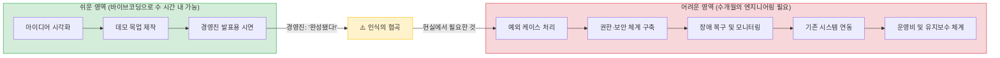
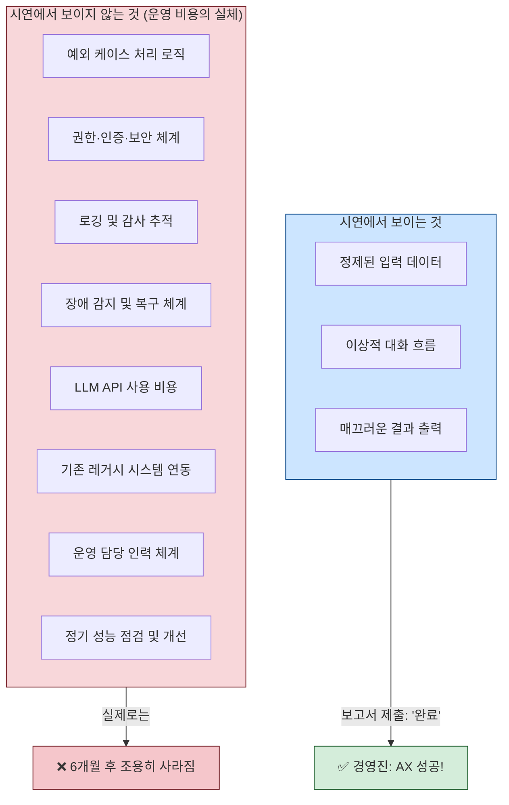
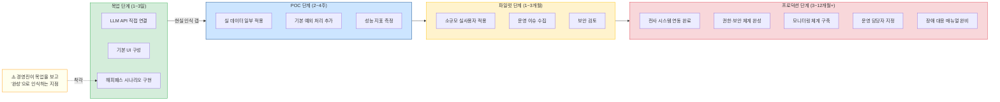
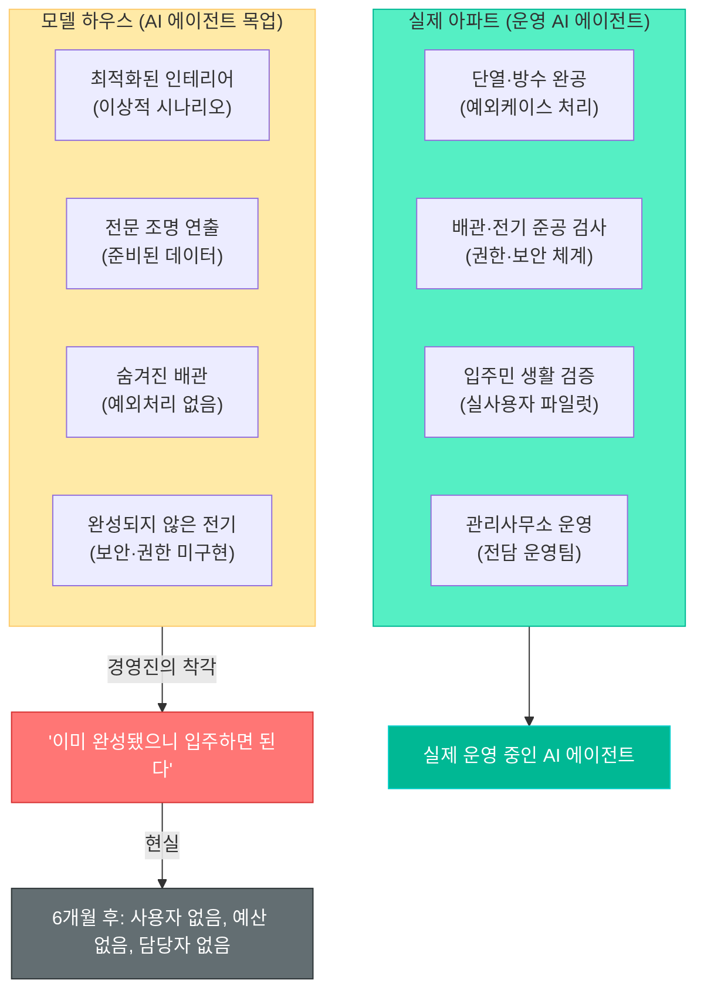
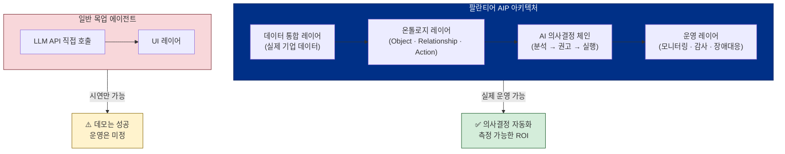
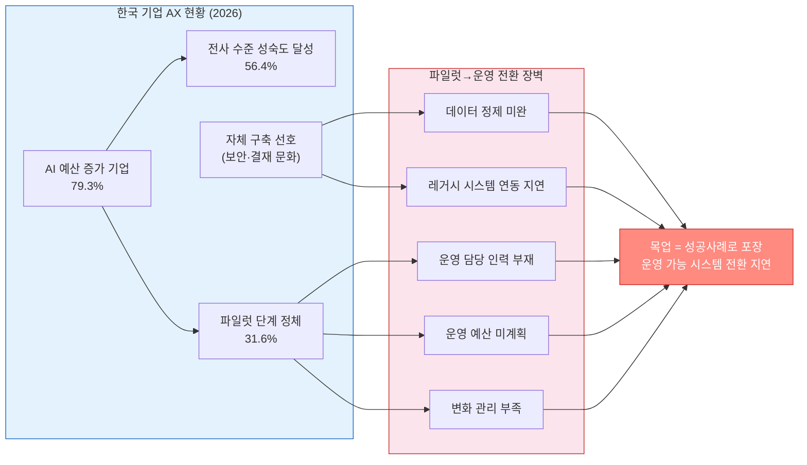
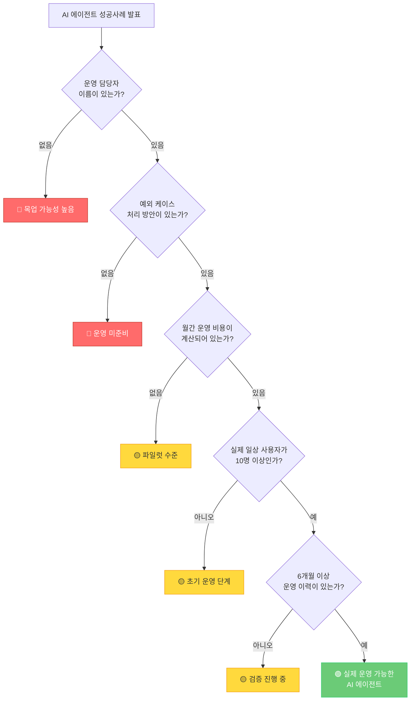

> **원문 출처**: Threads ([@kim.zoeyyy](https://www.threads.com/@kim.zoeyyy/post/DZfGWbqFJWW), @ultraneukgu, @jvisualschool, @janghyun.han) — 2026년 6월 현재 AI 전환(AX) 현장 종사자들 간의 실제 담론을 바탕으로 작성

>
>회사에서는 AX라는 연극을 하고 있다
>
>:Mock up으로 광팔기
>
>조금만 바이브코딩을 해본 사람이라면 알 수 있을거다
>
>Mock-up 만들기가 제일 쉽다는 걸
>
>그런데 회사 영감님들은 그게 완성인 줄 알고 이제 다 에이전트로 할 수 있겠다 그러네🤐
>
>사내에서 성공사례라면서 시연되는 수많은 에이전트 중 내년 이 맘때까지 사용되고 있는 것은 과연 몇 개나 될까?
>
>그냥 이참에 나도 Mock up 몇개 만들고 광팔이나 될까 진지하게 고민됨
>
>다른 회사도 이래?
>

---

## 목차

1. [왜 이 담론이 지금 터지고 있는가](#1-왜-이-담론이-지금-터지고-있는가)
2. [바이브코딩이란 무엇인가: 목업 양산 기술의 본질](#2-바이브코딩이란-무엇인가-목업-양산-기술의-본질)
3. [목업의 함정: '된다'와 '운영된다'는 다르다](#3-목업의-함정-된다와-운영된다는-다르다)
4. [데모와 프로덕션 사이의 협곡](#4-데모와-프로덕션-사이의-협곡)
5. [사내 AX 성공사례 시연의 민낯](#5-사내-ax-성공사례-시연의-민낯)
6. [아파트 모델 하우스 비유: 완성과 전시의 차이](#6-아파트-모델-하우스-비유-완성과-전시의-차이)
7. [말빨과 연구자의 구조적 불균형](#7-말빨과-연구자의-구조적-불균형)
8. [팔란티어가 AX의 기준이 되는 이유](#8-팔란티어가-ax의-기준이-되는-이유)
9. [프로덕션 뒤에서 버그와 싸우는 사람들](#9-프로덕션-뒤에서-버그와-싸우는-사람들)
10. [한국 기업 AX의 실제 현황: 데이터로 본 현실](#10-한국-기업-ax의-실제-현황-데이터로-본-현실)
11. [진짜 AX와 연극 AX를 구분하는 방법](#11-진짜-ax와-연극-ax를-구분하는-방법)
12. [결론: 연극이 아닌 운영으로 가는 길](#12-결론-연극이-아닌-운영으로-가는-길)

---

**목업(Mock-up) 프로그램이란?** 

목업(Mock-up)은 실제 제품을 제작하기 전, 디자인 평가 및 기능 검증을 위해 만드는 실물 크기의 모형이나 시제품을 의미합니다. 목업 프로그램은 이러한 시각적 샘플이나 프로토타입을 컴퓨터 화면에서 쉽게 기획, 제작 및 시연할 수 있도록 돕는 소프트웨어 툴을 뜻합니다. [[1](https://damandler.tistory.com/entry/Mock-up%EC%9D%B4%EB%9E%80-%EC%A0%95%ED%99%95%ED%95%9C-%EB%AA%A9%EC%97%85-%EB%9C%BB%EA%B3%BC-%EC%A2%85%EB%A5%98-%EC%95%8C%EA%B8%B0)] [[2](https://namu.wiki/w/%EB%AA%A9%EC%97%85)] [[3](https://m.blog.naver.com/yumera82/222295678503)] [[4](https://www.shopify.com/kr/blog/what-is-a-mockup)] [[5](https://readingsoul.tistory.com/entry/%EB%94%94%EC%9E%90%EC%9D%B8-%EC%83%81%EC%8B%9D-%EC%83%81%EC%83%81%EC%9D%B4-%ED%98%84%EC%8B%A4%EC%9D%B4-%EB%90%98%EB%8A%94-0%EB%8B%A8%EA%B3%84-%EB%AA%A9%EC%97%85Mockup%EC%9D%98-%EB%AA%A8%EB%93%A0-%EA%B2%83-%EC%9D%98%EB%AF%B8%EB%B6%80%ED%84%B0-%EC%8B%A4%EC%A0%84-%ED%88%B4-6%EC%A2%85-%EC%99%84%EB%B2%BD-%EA%B0%80%EC%9D%B4%EB%93%9C)]

IT 및 디자인 분야에서 목업 프로그램은 다음과 같이 다양하게 활용됩니다.

**1. UI/UX 및 웹·앱 디자인 (화면 기획)**

앱이나 웹사이트를 개발하기 전, 화면의 레이아웃, 버튼 배치, 사용자 흐름(Flow)을 미리 구성해보는 프로그램입니다. 기획 단계에서 실제 구현될 화면을 미리보며 수정할 수 있습니다. [[1](https://yozm.wishket.com/magazine/detail/1306/)] [[2](https://www.shopify.com/kr/blog/what-is-a-mockup)]

**주요 프로그램:** [피그마(Figma)](https://figma.com/) · [어도비 XD(Adobe XD)](https://adobe.com/) · [발사믹 와이어프레임(Balsamiq Wireframes)](https://balsamiq.com/) 등 [[1](https://yozm.wishket.com/magazine/detail/1306/)]

**2. 제품 디자인 및 3D 모델링**

제조업이나 산업 디자인에서 실제 제품의 크기, 재질, 형태를 가상으로 구현하여 시각화하는 프로그램입니다.

**주요 프로그램:** [라이노(Rhino 3D)](https://rhino3d.com/) · [솔리드웍스(SolidWorks)](https://solidworks.com/) · [키샷(KeyShot)](https://keyshot.com/) 등

**3. 마케팅 및 포트폴리오용 이미지 생성 (합성 툴)**

제작된 로고나 그래픽 디자인을 티셔츠, 스마트폰 화면, 명함 등에 자연스럽게 합성하여 실제 완성품처럼 보이게 만드는 툴입니다. 프레임에 이미지 파일만 삽입하면 현실감 있는 결과물을 얻을 수 있습니다. [[1](https://www.youtube.com/watch?v=Hj5unGXTg_I&t=10)] [[2](https://www.youtube.com/watch?v=3SDeOHFdAXo)] [[3](https://m.blog.naver.com/bolem0211/222071371769)]

**주요 프로그램:** 포토샵(Adobe Photoshop) · [캔바(Canva)](https://canva.com/) 등

---

## 1. 왜 이 담론이 지금 터지고 있는가

2025년부터 2026년에 걸쳐 국내 기업 환경에는 AX(AI Transformation, AI 전환)라는 단어가 홍수처럼 쏟아졌다. 경영진은 AI 에이전트를 도입하겠다고 선언하고, 이사회는 예산을 배정하며, 사내 발표 자리마다 "우리도 드디어 에이전트를 활용한다"는 성공사례들이 줄을 잇고 있다. 그런데 Threads라는 소셜 플랫폼에서 현장 종사자들 사이에 매우 솔직한 감상이 오가기 시작했다. 한 마디로 요약하면 이렇다: **"지금 회사에서 벌어지는 것은 AX가 아니라 AX 연극이다."**

이 담론이 지금 이 시점에 폭발적으로 공감을 얻는 이유가 있다. 바이브코딩(Vibe Coding)이라는 기술 덕분에 비전문가도 그럴듯하게 작동하는 AI 데모를 하루 이틀 만에 만들어낼 수 있는 시대가 됐기 때문이다. 겉으로 보면 완성된 제품처럼 보이지만, 실제로는 운영 환경에서 단 한 번도 검증된 적 없는 목업(Mock-up)에 불과한 것들이 회사 내부에서 "AI 에이전트 도입 완료"로 포장되어 보고되고 있다. 결정권을 가진 경영층은 그 차이를 알 수 없고, 현장 담당자들은 이 간극 앞에서 무력감을 느끼고 있다.

---

## 2. 바이브코딩이란 무엇인가: 목업 양산 기술의 본질

이 담론을 이해하려면 먼저 바이브코딩이 무엇인지를 알아야 한다.

바이브코딩(Vibe Coding)은 2025년 2월 OpenAI 공동창업자이자 전 Tesla AI 책임자였던 안드레이 카파시(Andrej Karpathy)가 만든 용어다. 개발자가 생성형 AI에게 자연어로 원하는 것을 설명하면 AI가 자동으로 코드를 생성해주는 개발 방식을 의미한다. Cursor, Claude Code, OpenAI Codex 같은 도구들이 이 방식을 실현하는 대표적인 수단이다. 이 방식은 실제로 매우 강력하다. 전문적인 소프트웨어 개발 훈련을 받지 않은 사람도 몇 시간 만에 그럴듯한 웹 인터페이스를 만들거나, AI가 사용자 질문에 대답하는 챗봇 형태의 데모를 구성할 수 있다.

문제는 바로 여기서 출발한다. 바이브코딩으로 만든 결과물은 두 가지 상황에 최적화되어 있다. 하나는 탐색(Exploration) 단계, 즉 아이디어를 빠르게 형태로 만들어 피드백을 받는 단계다. 다른 하나는 발표(Presentation) 단계, 즉 "이런 것이 가능하다"는 것을 보여주기 위한 시연이다. 이 두 가지 맥락에서는 바이브코딩이 진정한 생산성 혁신이다. 그러나 실제 운영 환경(Production)에서 반복적으로, 안정적으로, 수백 명의 사용자가 동시에 사용하는 시스템으로 전환하는 일은 전혀 다른 차원의 작업이다.

현장 종사자들이 Threads에서 "바이브코딩을 조금만 해봐도 알 수 있다, 목업 만들기가 제일 쉽다"고 말할 때, 그것은 단순한 愚痴가 아니다. 기술적으로 정확한 진단이다. 데모를 만드는 데는 하루가 걸리지만, 그것을 실제 운영 시스템으로 만드는 데는 몇 달이 걸릴 수 있다. 그리고 그 차이가 보이지 않는 것이 이 사태의 핵심이다.

---

## 3. 목업의 함정: '된다'와 '운영된다'는 다르다

Threads 담론에서 가장 날카로운 지적 중 하나는 이것이다: **"목업의 함정은 '된다'보다 '운영비가 안 보인다'는 점이다."**

이 말이 무엇을 의미하는지 풀어보자.

AI 에이전트의 시연(데모)에서는 대개 가장 이상적인 시나리오만 보여진다. 질문을 하면 AI가 정확히 대답하고, 작업을 요청하면 매끄럽게 처리된다. 이 과정에서 보이지 않는 것들이 있다. 예외 케이스(Edge Cases), 즉 "이런 경우에는 어떻게 처리해야 하는가?"라는 예외 상황들이다. 실제 업무 환경에서 AI 에이전트가 맞닥뜨리는 입력 데이터의 80%는 깔끔하게 정제되어 있지 않다. 오탈자, 불완전한 정보, 예상치 못한 형식, 복합적인 맥락이 섞여 있다.

권한(Authorization) 문제도 시연에서는 등장하지 않는다. 실제 기업 환경에서는 "이 데이터는 누가 볼 수 있는가", "이 작업을 AI가 실행해도 되는가", "승인 없이 어디까지 자율적으로 진행할 수 있는가"를 정교하게 설계해야 한다. 로그(Log) 체계도 마찬가지다. AI 에이전트가 어떤 결정을 내렸는지, 어떤 데이터를 처리했는지 추적 가능해야 하며, 이는 법적·규제적 요건이기도 하다. 장애 대응(Failure Recovery)은 더욱 복잡하다. AI 에이전트가 오작동했을 때 어떻게 감지하고, 어떻게 롤백하며, 피해를 최소화할 것인가.

운영비(Operational Cost)의 문제도 중요하다. 바이브코딩으로 만든 데모는 대개 OpenAI API, Anthropic API 등 외부 LLM 서비스를 직접 호출하는 방식으로 구성된다. 소규모 시연에서는 비용이 거의 들지 않는다. 그러나 실제 수백 명의 직원이 하루에 수천 번 사용하는 시스템이 되면 API 비용이 폭발적으로 증가한다. Zdnet 보도에 따르면, 바이브코딩 방식으로 만든 AI 앱을 실제 서비스에 연결했다가 하루 만에 수천 달러의 비용 폭탄을 맞은 사례도 있다. 시연 단계에서는 이 비용이 보이지 않는다.

Threads 댓글에서 나온 핵심 조언이 이 모든 것을 한 문장으로 압축한다: **"시연 때 '예외 케이스, 권한, 로그, 장애 대응은 누가 맡나요?'만 물어도 실제 운영 준비가 됐는지 빨리 갈립니다."** 이것은 AI 기술에 대한 지식이 없어도 물을 수 있는 질문이다. 그러나 대부분의 경영진 시연 현장에서 이 질문은 등장하지 않는다.

---

## 4. 데모와 프로덕션 사이의 협곡

소프트웨어 업계에는 오래전부터 알려진 법칙이 있다. "처음 90%의 기능을 만드는 데 전체 시간의 90%가 걸리고, 나머지 10%를 마무리하는 데 또 90%의 시간이 걸린다"는 것이다. AI 에이전트 프로젝트에서 이 법칙은 더욱 극단적으로 적용된다.

바이브코딩으로 그럴듯한 챗봇 인터페이스를 만드는 데 하루가 걸린다고 치자. 그러나 이것을 실제 기업 업무 환경에 배포하려면 다음과 같은 단계들을 거쳐야 한다.

먼저 데이터 정제 작업이 필요하다. 실제 기업 환경의 데이터는 수십 년에 걸쳐 축적된 레거시 데이터베이스, 사일로화된 부서별 시스템, 표준화되지 않은 형식들로 뒤섞여 있다. AI 에이전트가 이 데이터를 제대로 활용하려면 먼저 데이터를 정제하고 통합하는 작업이 선행되어야 한다. 이 작업만으로 수개월이 소요되는 경우가 허다하다.

다음으로 기존 시스템 연동(Integration) 작업이 있다. 기업의 ERP, CRM, HR 시스템, 결재 시스템 등과 AI 에이전트를 연결하는 일은 각 시스템의 API 규격을 파악하고, 인증 체계를 맞추며, 데이터 변환 로직을 구현해야 한다. 기업 내 IT 부서의 협조도 필요하다. 보안 검토, 네트워크 정책 변경, 방화벽 설정까지 수반된다.

규정 준수(Compliance) 요건도 있다. 국내 기업의 경우 개인정보보호법, 금융 회사라면 금융보안원 규정, 제조업이라면 산업 안전 관련 규정 등 AI 에이전트의 활용 범위와 방식에 영향을 미치는 법적 요건들이 있다. 이를 충족하는 방식으로 시스템을 설계해야 한다.

그리고 사용자 교육 및 변화 관리(Change Management)가 필요하다. AI 에이전트가 기술적으로 완성되었다 해도, 실제 사용자들이 이를 받아들이고 일상 업무에 활용하도록 만드는 것은 별개의 도전이다. 기존 업무 방식의 변화에 대한 저항, 사용법에 대한 교육, 피드백을 통한 개선 사이클이 수반된다.

마지막으로 지속적인 운영 및 유지보수(Operations & Maintenance) 체계가 필요하다. AI 에이전트는 한 번 만들면 끝나는 것이 아니다. 연결된 시스템이 업그레이드되면 에이전트도 그에 맞게 조정해야 한다. LLM 모델이 업데이트되면 프롬프트를 다시 최적화해야 한다. 새로운 예외 케이스가 발생하면 로직을 수정해야 한다. 이 모든 것을 책임지는 운영 담당자와 체계가 필요하다.

이 긴 여정의 어느 단계에서도 "안 됐다"고 판정받으면 이전 단계로 돌아가거나 프로젝트 자체가 중단될 수 있다. 업계 추정에 따르면 AI 에이전트 도입에 실패하는 기업의 60% 이상은 처음부터 너무 큰 범위를 설정하거나 성공 기준 없이 도입을 진행하는 데서 문제가 시작된다. 그러나 많은 경우 이 실패는 조용히 묻힌다. 에이전트가 살아있는지 죽었는지, 사용되고 있는지 방치되고 있는지 아무도 공식적으로 추적하지 않기 때문이다.

---

## 5. 사내 AX 성공사례 시연의 민낯

Threads 원문 글쓴이가 던진 질문이 이 문제의 핵심을 찌른다: **"사내에서 성공사례라면서 시연되는 수많은 에이전트 중 내년 이 맘때까지 사용되고 있는 것은 과연 몇 개나 될까?"**

이 질문은 수사학적이다. 답은 이미 글쓴이가 알고 있다. 대부분은 사라진다.

왜 사라지는가? 몇 가지 패턴이 반복된다.

첫째는 챔피언의 이탈이다. AI 에이전트를 열심히 만들어 시연까지 성공한 사람이 다른 부서로 이동하거나 퇴직하면, 그 시스템을 유지하고 개선할 수 있는 사람이 사라진다. 기술 문서도 없고, 운영 체계도 없었으니 후임자는 이어받을 수도 없다.

둘째는 운영 예산의 부재다. 시연 때는 API 비용이 거의 들지 않아 문제가 안 됐지만, 실제 운영 단계에서 매월 수백만 원의 API 비용이 청구되기 시작하면 담당 팀에서 예산 승인을 받을 길이 없다. 프로젝트 예산은 "개발"에 잡혀 있지 "운영"에는 잡혀 있지 않기 때문이다.

셋째는 요구사항의 증가다. 초기 데모는 한 가지 간단한 시나리오만 처리했지만, 실제 사용자들은 다양한 상황에서 사용하려 한다. 예외 케이스가 쌓이고, 요청 사항이 증가하지만 이를 처리할 개발 리소스가 없다.

넷째는 레거시 시스템과의 충돌이다. 기업의 IT 환경은 하루아침에 바뀌지 않는다. AI 에이전트가 의존하는 API나 데이터 소스가 업그레이드되거나 변경되면, 에이전트는 작동을 멈춘다. 그리고 이를 고칠 사람이 없다.

이렇게 해서 한때 "우리 회사 AX 성공사례"로 발표됐던 에이전트들이 조용히 사라지는 것이다. 그러나 이 사실이 경영진 보고서에 "실패"로 기록되는 일은 거의 없다. 그냥 더 이상 언급이 없어질 뿐이다. 그리고 다음 분기에 새로운 "AX 성공사례"가 등장하고, 같은 사이클이 반복된다.

---

## 6. 아파트 모델 하우스 비유: 완성과 전시의 차이

Threads 대화에서 등장한 비유가 절묘하다: **"목업으로 광팔기 = 아파트 모델 하우스에 곧바로 입주할 수 있다고 믿는 사람들. 완성을 해야 입주하지!"**

이 비유가 정확한 이유를 생각해보자.

아파트 모델 하우스는 실제 아파트보다 훨씬 비싼 자재로 지어진다. 바닥재, 벽지, 주방 가구, 조명, 인테리어 소품 모두 최고급으로 꾸며진다. 전문 인테리어 디자이너가 공간을 최적화하고, 자연광이 잘 들어오는 각도에 맞춰 조명을 배치한다. 심지어 계절마다 다른 꽃과 식물을 배치해 항상 아름다워 보이게 한다.

그러나 모델 하우스에는 실제 배관이 제대로 연결되어 있지 않고, 전기 공사가 완료되지 않은 경우가 많다. 외풍을 막는 단열재가 실제 시공 기준과 다를 수 있다. 입주민이 살면서 발생하는 소음, 냄새, 습기, 난방 문제 등은 전혀 검증되지 않았다. 모델 하우스는 "살 수 있는 공간"이 아니라 "구매 결정을 유도하는 전시 공간"이다.

AI 에이전트 목업이 정확히 이와 같다. 시연은 최적화된 조건에서 진행된다. 입력 데이터는 깔끔하게 준비되어 있고, 시나리오는 가장 잘 되는 경우만 선택된다. 네트워크 환경은 안정적이고, 사용자는 훈련된 시연자 한 명이다. 이 상황에서는 무엇이든 잘 돌아가 보인다.

그러나 실제 업무 환경에서는 수십 명이 동시에 접속하고, 예상치 못한 방식으로 시스템을 사용하려 하며, 네트워크가 불안정할 때도 있고, 입력 데이터는 불완전하다. 모델 하우스처럼 아름다웠던 데모는 이 현실 앞에서 무너진다.

---

## 7. 말빨과 연구자의 구조적 불균형

Threads 댓글 중 하나가 이 현상의 더 깊은 구조를 건드린다: **"원래 돈을 말빨 좋은 사람이 잘 벌어요. 뒤에서 연구하는 사람은 연구자구요."**

이것은 단순한 넋두리가 아니다. 기업 조직 내에서 AI 기술이 어떻게 가치로 전환되는가의 구조적 문제를 지적하고 있다.

대기업에서는 윗선을 만족시키는 것이 목표가 된다. 스타트업에서는 투자자를 만족시키는 것이 목표가 된다. 두 경우 모두에서 "빠르게 그럴듯한 것을 보여주는 능력"이 "실제로 작동하는 것을 만드는 능력"보다 단기적으로 더 높은 보상을 받는다. 바이브코딩은 이 비대칭을 극단적으로 심화시켰다. 이전에는 그럴듯한 데모를 만드는 데도 어느 정도의 기술력이 필요했다. 이제는 정말 누구나 하루 만에 그럴듯한 AI 에이전트처럼 보이는 것을 만들 수 있다.

그 결과, 말빨이 좋고 발표를 잘하는 사람이 목업을 만들어 경영진 앞에서 시연하고 승진하는 동안, 그 뒤에서 실제 프로덕션 시스템을 유지하고 버그를 잡는 엔지니어는 조용히 야근을 한다. 조직은 이 두 종류의 기여를 구분하지 못하거나, 구분하더라도 가시성이 높은 쪽에 더 많은 보상을 준다.

이 구조에서 장기적으로 무엇이 일어나는가? 실제 운영 역량을 가진 엔지니어들이 이런 구조를 답답하게 여기고 조직을 떠난다. 또는 그들도 "그러면 나도 목업이나 만들고 광팔아야겠다"는 결론에 이른다. Threads 원문 글쓴이의 마지막 한 마디가 이 심리를 솔직하게 드러낸다: **"그냥 이참에 나도 목업 몇 개 만들고 광팔이나 될까 진지하게 고민됨."**

---

## 8. 팔란티어가 AX의 기준이 되는 이유

Threads 댓글에서 "AX 쪽에서는 팔란티어가 되겠네요"라는 언급이 나온다. 이것이 왜 의미 있는 비유인지 설명이 필요하다.

팔란티어(Palantir Technologies)는 2003년 미국에서 피터 틸(Peter Thiel)과 알렉스 카프(Alex Karp)가 창업한 데이터 분석 소프트웨어 기업이다. 정보기관의 데이터 분석 플랫폼으로 시작해 현재는 민간 기업과 정부 모두에 AI 기반 운영 시스템을 제공하고 있다. 이 회사가 AI 업계에서 특별한 위치를 차지하는 이유는 그들이 "Operational AI(운영형 AI)"를 추구하기 때문이다.

팔란티어의 CEO 알렉스 카프는 AI를 "연구용"이나 "대화형"으로 두지 않고, "현장 업무에 즉시 연결되는 운영 인프라"로 정의한다. 이를 위해 팔란티어는 온톨로지(Ontology)라는 독특한 구조를 만들었다. 기업의 모든 데이터, 프로세스, 자산을 Object(고객, 주문 같은 현실 엔티티), Relationship(객체 간 연결 구조), Action(의사결정 및 운영 로직)으로 정밀하게 구조화하는 것이다. 이 위에 AI를 연결하면 데모 수준이 아닌 실제 의사결정과 실행이 가능한 시스템이 된다.

팔란티어가 한국 시장에서도 주목받는 이유가 있다. HD현대와 LG CNS 같은 기업들이 팔란티어를 도입하고 있다. 2026년 3월 LG CNS는 팔란티어와 전략적 파트너십을 확대하고 LG CNS 내부에 FDE(Forward Deployed Engineering) 팀을 구축해 LG 그룹 전반의 AX 과제를 추진 중이다. 또한 팔란티어와 HD현대는 2026년 1월 수백만 달러 규모의 기업 전체 계약을 체결했다는 로이터 보도도 있다.

팔란티어가 AX의 기준으로 언급되는 것은 이 회사가 "데모"가 아닌 "운영"에서 차별화하기 때문이다. 팔란티어의 접근 방식은 화려하지 않다. 오히려 매우 복잡하고, 도입하는 데 오랜 시간이 걸리며, 온톨로지 설계 단계에서부터 실제 기업 환경의 복잡성을 그대로 반영한다. 목업을 만들어 경영진 앞에서 시연하는 방식이 아니라, 실제 데이터와 실제 프로세스를 기반으로 시스템을 구축한다.

팔란티어의 방식이 모든 기업에 맞는 것은 아니다. 비용이 매우 높고, 도입 과정이 복잡하며, 전담 팀이 필요하다. 그러나 바로 이 비용과 복잡성이 "운영 가능한 AI 에이전트"의 실제 가격표다. 목업이 공짜처럼 보이는 이유는 이 모든 비용을 숨기고 있기 때문이다.

---

## 9. 프로덕션 뒤에서 버그와 싸우는 사람들

Threads 대화 말미에 짧지만 묵직한 댓글이 하나 등장한다: **"그 뒤에서 프로덕션 나가면 버그와 싸우는 누군가…"**

이 한 줄이 수많은 이야기를 담고 있다.

AI 에이전트가 경영진 앞에서 멋진 시연을 마치고 "실제 배포"를 시작하면, 그 순간부터 완전히 다른 세계가 시작된다. 목업 단계에서는 보이지 않던 문제들이 현실의 복잡성 앞에서 하나씩 터지기 시작한다. 특정 형식의 입력이 들어오면 에이전트가 응답하지 않는다. 특정 사용자 권한에서는 데이터를 조회할 수 없다. 연결된 외부 API가 일시적으로 다운되면 에이전트 전체가 멈춘다. LLM이 때로는 틀린 답을 자신 있게 내놓는다.

이 문제들을 실시간으로 감지하고, 원인을 파악하고, 수정하는 사람이 필요하다. 이들이 바로 Threads 댓글이 언급한 "버그와 싸우는 누군가"다. 이들은 시연 때 무대 위에 있지 않다. 발표 자료에 이름이 올라가지 않는다. 그러나 AI 에이전트가 실제로 작동하게 만드는 것은 이들이다.

AI 에이전트 프로젝트의 운영 체계는 다음과 같은 요소들로 구성된다. 실행 로그를 자동으로 기록하고, 이상 징후가 감지되면 담당자에게 알림을 보내는 모니터링 시스템이 필요하다. 에이전트가 처리하지 못하는 새로운 케이스가 발생했을 때 이를 분류하고 처리하는 예외 관리 체계도 필요하다. 정기적으로 에이전트의 응답 품질을 검토하고 개선하는 사이클도 필요하다. 연결된 외부 시스템이 업그레이드됐을 때 에이전트도 그에 맞게 조정하는 변경 관리 프로세스도 필요하다.

이 모든 체계를 구축하고 운영하는 데 드는 비용과 인력이 목업 단계에서는 완전히 보이지 않는다. 그래서 경영진은 "이제 다 에이전트로 할 수 있겠다"고 말하고, 현장 담당자들은 입을 다문다.

---

## 10. 한국 기업 AX의 실제 현황: 데이터로 본 현실

이 Threads 담론이 단순한 개인적 불만이 아님을 뒷받침하는 데이터들이 있다.

CIO Korea의 2026년 IT 전망 조사에 따르면 국내 기업의 79.3%가 올해 생성형 AI 예산을 늘린다고 답했지만, 전사 수준 활용 성숙도 3단계 이상에 도달한 기업은 56.4%에 그쳤다. 일부 부서에서만 쓰고 있는 기업이 31.6%였다. 다시 말해, 예산은 늘고 있는데 파일럿 단계에서 정규 운영으로 넘어가는 관문을 통과하지 못하는 기업이 많다는 의미다.

기술력의 문제가 아니다. 스탠퍼드 AI Index 2026에 따르면 한국은 인구 10만 명당 AI 특허 수에서 세계 1위를 기록했고, 주목할 만한 AI 모델 출시 수에서도 미국과 중국에 이어 3위다. 기술은 있는데 그 기술이 기업의 실행 시스템으로 전환되는 속도가 느린 것이다.

그 원인 중 하나가 바로 Build 선호 문화다. 한국 대기업들은 보안 우려와 내부 결재 구조 때문에 외부 SaaS 도입에 보수적이고, 자체 구축을 선호하는 경향이 강하다. 자체 구축은 통제력이 높은 대신 시간이 오래 걸린다. 그 시간 동안 목업들이 성공사례로 포장되고, 실제 운영 가능한 시스템을 만드는 작업은 뒤로 밀린다.

외주 의존도가 높은 기업의 경우 상황이 더 복잡하다. 기존 IT 시스템 운영을 외주에 맡긴 기업에서는 AI 에이전트 관련 운영 책임도 자연스럽게 외주로 넘어가려 하는데, 운영 주체가 내부에 없으니 피드백 루프가 작동하지 않는다. 현실을 파악하고 개선할 수 있는 주체가 조직 내에 존재하지 않는 것이다.

이 상황에서 선도적 사례가 되는 것은 소수다. 팔란티어를 도입한 LG CNS나 HD현대처럼 외부 검증된 플랫폼을 적극 활용하며 실제 운영 체계까지 구축하는 기업이 있다. 그러나 이런 사례가 소수에 머물고 있다는 것이 현실이다.

---

## 11. 진짜 AX와 연극 AX를 구분하는 방법

Threads 댓글 중 하나가 매우 실용적인 기준을 제시한다: **"AX 성공사례보다 운영 담당자 이름이 먼저 나와야 믿게 됩니다."**

이 기준은 기술적 판단 능력이 없는 경영진도 적용할 수 있는 강력한 필터다. AI 에이전트가 실제로 운영 가능한 시스템인지 아닌지를 구분하는 몇 가지 질문들을 정리해보면 다음과 같다.

첫째, 운영 담당자가 누구인가? 개발자가 아니라 이 시스템의 일상적 운영을 책임지는 담당자가 지정되어 있는가? 담당자 이름이 즉시 나오지 않는다면 운영 준비가 되어 있지 않다는 신호다.

둘째, 예외 케이스 처리는 어떻게 되는가? "가장 흔히 발생하는 예외 상황은 무엇이고, 그 경우 에이전트가 어떻게 처리하는가?"를 물어보자. 답이 없거나 "테스트 중"이라면 목업 수준이다.

셋째, 운영 비용은 얼마인가? 매월 예상되는 LLM API 비용, 인프라 비용, 유지보수 비용이 계산되어 있는가? 이 숫자가 없다면 운영을 진지하게 고려하지 않은 것이다.

넷째, 장애 대응 프로세스는 무엇인가? 에이전트가 오작동했을 때 어떻게 감지하고, 누구에게 알리며, 얼마나 빨리 복구하는가? 이 질문에 대한 답이 없다면 실제 운영 준비가 되어 있지 않다.

다섯째, 실제 사용자 수는 얼마인가? 시연에 참여한 경영진이 아니라, 일상 업무에서 이 에이전트를 매일 사용하는 직원이 몇 명인가? 이 숫자가 없거나 한 자릿수라면 실제 운영 수준이 아니다.

여섯째, 6개월 전과 비교해 무엇이 개선되었는가? 진짜 운영 중인 시스템은 사용자 피드백을 통해 지속적으로 개선된다. 개선 이력이 없다면 실제로 사용되고 있지 않다는 의미다.

---

## 12. 결론: 연극이 아닌 운영으로 가는 길

이 Threads 담론이 드러내는 것은 기술의 문제가 아니다. 조직의 인식과 인센티브 구조의 문제다.

바이브코딩이라는 강력한 도구가 등장하면서 "그럴듯한 것을 빠르게 만드는 능력"과 "실제로 작동하는 것을 지속적으로 운영하는 능력" 사이의 격차가 극단적으로 벌어졌다. 이 격차를 이용해 경영진과 투자자들에게 잘 포장된 데모를 보여주고 보상을 받는 사람들이 생기는 한편, 실제 운영 환경에서의 복잡성과 씨름하는 엔지니어들은 가시성을 얻지 못하고 있다.

기업이 진정한 AX를 달성하려면 몇 가지 구조적 변화가 필요하다.

무엇보다 먼저, **운영 책임을 개발 기획 단계부터 명시해야 한다**. "이 에이전트를 누가 운영할 것인가, 예산은 어디서 나오는가, 장애 시 대응은 어떻게 할 것인가"를 시연 전에 결정하지 않으면, 어떤 에이전트도 6개월 이상 살아남기 어렵다.

다음으로, **데모의 성공과 운영의 성공을 다른 기준으로 측정해야 한다**. 경영층 시연에서 박수를 받은 에이전트가 아니라, 6개월 후에도 실제 사용자가 사용하고 있는 에이전트를 성공사례로 인정하는 문화가 필요하다.

그리고, **숨겨진 운영 비용을 처음부터 예산에 포함해야 한다**. API 비용, 모니터링 도구 비용, 운영 담당 인력 비용, 정기 개선 비용이 개발 예산과 함께 계획되어야 한다. 이것이 없으면 모든 AI 에이전트는 반짝 빛나다가 조용히 사라진다.

마지막으로, **연구자와 운영 엔지니어에게 적절한 보상과 가시성을 주어야 한다**. 무대 위에서 시연하는 사람만큼, 무대 뒤에서 시스템을 유지하는 사람에 대한 인정이 필요하다. 그래야만 "나도 목업이나 만들고 광팔아야겠다"는 결론에 도달하는 엔지니어들을 붙잡을 수 있다.

Threads 담론에서 제기된 "내년 이 맘때까지 사용되고 있는 에이전트가 몇 개나 될까?"라는 질문은 모든 기업이 지금 당장 자신에게 던져야 하는 질문이다. 그리고 그 답이 "손에 꼽힌다"라면, 그 기업의 AX는 아직 연극 단계에 머물고 있다는 것을 의미한다.

연극을 멈추고 진짜 운영을 시작하는 것. 그것이 2026년 AI 전환의 본질이다.

---

## 부록: 원문 Threads 담론 요약

| 참여자 | 핵심 발언 |
|---|---|
| @kim.zoeyyy | "회사에서는 AX라는 연극을 하고 있다. 목업 만들기가 제일 쉬운데 경영진은 그게 완성인 줄 안다." |
| @ultraneukgu | "목업의 함정은 '운영비가 안 보인다'는 점. 예외 케이스, 권한, 로그, 장애 대응 담당자 이름이 먼저 나와야 믿는다." |
| @jvisualschool | "목업으로 광팔기 = 모델 하우스에 곧바로 입주할 수 있다고 믿는 것. 완성해야 입주하지!" |
| @janghyun.han | "돈은 말빨 좋은 사람이 벌고, 연구자는 성과물이 실제 사용되는 데서 보람을 느낀다. AX에서는 팔란티어가 그 기준이 될 것." |
| (익명 댓글) | "그 뒤에서 프로덕션 나가면 버그와 싸우는 누군가…" |

---

*작성일: 2026-06-13*
