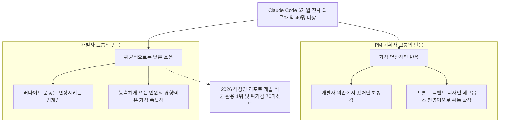
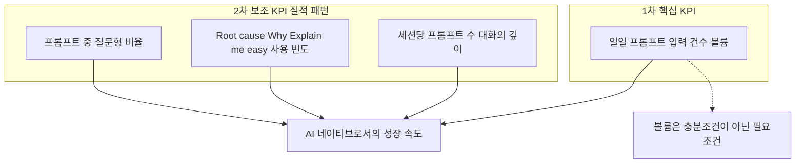
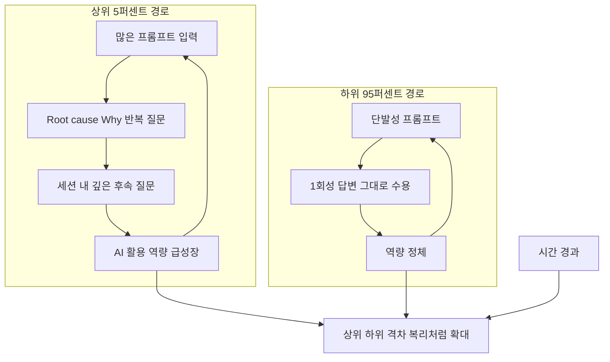

## 1. 이 글이 다루는 내용

이 문서는 Potential Inc의 창업자이자 대표인 Lukas Shin이 LinkedIn(및 Facebook)에 공유한 게시물 한 건을 깊이 분석한 것이다. 게시물의 제목은 "직원 전체 다 Claude Code 계정 주고 6개월간 강제로 쓰게 하고 알게 된 결과(약 40명, 6개월)"로, #ai #agent #ax #career라는 해시태그와 함께 공개되었으며, 작성 시점 기준으로 "5시간 전" 게시되어 이미 100명 이상의 공감과 여러 건의 댓글 및 재공유를 받은 상태였다. Lukas는 본문에서 이 실험이 자신이 오래전부터 해보고 싶었던 것이었지만 과거에는 여러 제약 때문에 할 수 없었고, 지금은 1인 기업 체제이기 때문에 더더욱 직접 해보기 어려운 종류의 실험이라고 밝히면서도, 자신이 여러 기업을 컨설팅·코칭하면서 현장에서 체감해온 패턴과 이번 실험 결과가 크게 다르지 않다고 덧붙였다.

이 문서는 크게 세 갈래로 구성된다. 먼저 게시물 본문에 담긴 핵심 주장들을 항목별로 풀어서 설명하고, 이어서 게시물에 달린 댓글과 답글에서 제기된 다른 시각들을 정리하며, 마지막으로 이 모든 내용을 최근 한국의 AI 활용 관련 데이터 및 발언들과 비교하여 이 사례가 산업 전반의 흐름 속에서 어디에 위치하는지를 가늠해본다. 다만 이 사례는 어디까지나 한 소규모 스타트업의 6개월짜리 관찰 기록이며, Lukas 본인도 일반화에는 무리가 있다고 명시하고 있다는 점을 전제로 읽어주기를 권한다.

## 2. 실험의 주체 — Potential Inc와 Lukas Shin은 누구인가

Potential Inc는 서울 마포구에 기반을 둔 소프트웨어·앱 개발 에이전시로, "세계에서 가장 빠른 개발팀이 되는 것"을 표방하며 서비스 기획·디자인·개발 전 과정을 단축하는 데 집중한다고 스스로를 소개하고 있다. 기업 정보 플랫폼인 The Org에는 직원 규모가 1~10명으로 등록되어 있으나 이는 "미인증(unverified)" 페이지로 표시되어 있어, 이번 게시물에서 언급된 "약 40명"이라는 인원은 핵심 정규 인력 외에 협업하는 프리랜서·외주 인력·확장된 팀 구성원까지 포함한 수치일 가능성이 있다. 정확한 조직 구조까지는 외부에서 확인하기 어렵지만, 적어도 Lukas가 상당히 넓은 범위의 인력을 대상으로 이번 실험을 진행했다는 점은 분명해 보인다.

이번 게시물이 특히 신뢰감 있게 읽히는 이유 중 하나는, 이것이 Lukas의 일회성 주장이 아니라는 점이다. 그는 이전에도 "2개월간 6만 달러를 투자해 팀과 함께 Claude Code 군단을 만들면서 배운 것들"이라는 제목으로 자신의 실패와 성공 경험을 공개적으로 공유한 바 있으며, 동시에 "AI 네이티브 시니어 Django 개발자"를 채용한다는 공고에서 자격 요건으로 "Claude Code 애호가일 것", "한 줄도 직접 코딩하지 않을 것", 그리고 "하루 최소 150회 이상의 프롬프트 입력"을 명시하면서 "높은 볼륨이 실력을 만든다고 믿는다"는 자신의 철학을 분명히 밝혀왔다. 즉 이번 게시물에서 등장하는 "프롬프트 입력 건수가 핵심 KPI"라는 주장은 갑자기 나온 것이 아니라, 그가 채용과 조직 운영 전반에서 일관되게 적용해온 운영 철학의 연장선에 있는 것이다.

## 3. 직군별 반응의 양극화 — PM의 해방감과 개발자의 경계심

게시물에서 가장 먼저 제시된 발견은, 이 도구에 가장 열광한 직군이 PM(프로덕트 매니저)이었다는 점이다. Lukas는 그 이유를 "더 이상 개발자에게 의존하지 않아도 되는 일종의 해방감"에서 찾았다. 실제로 그는 한 팀원(Jayden Jeong)을 사례로 들면서, 이 인물이 Claude Code를 통해 프론트엔드·백엔드·디자인·데브옵스에 이르는 전 영역을 종횡무진하게 되었다고 설명했다. 기획자가 더 이상 "이거 구현 가능한가요?"를 누군가에게 묻지 않고, 직접 프로토타입을 만들어 보면서 가능성을 확인할 수 있게 된 변화가 PM 직군에게는 가장 직접적이고 즉각적인 체감 변화였던 셈이다.

반면 개발자 직군에서는 상대적으로 호응이 낮았고, Lukas는 이를 "러다이트 운동"에 비유했다. 19세기 영국에서 기계화가 자신들의 일자리를 위협한다고 느낀 직물 노동자들이 기계를 파괴했던 사건을 빌려온 이 표현은, 일부 개발자들이 Claude Code를 자신의 전문성과 고용 안정성에 대한 위협으로 인식했을 가능성을 시사한다. 다만 Lukas는 동시에 중요한 단서를 덧붙였는데, Claude Code를 능숙하게 활용하는 개발자의 경우에는 그 영향력이 "가장 폭발적"이었다는 것이다. 즉 개발자 그룹은 평균적으로는 냉담했지만, 그 안에서의 분산(variance)은 다른 어떤 그룹보다도 컸다는 의미로 읽을 수 있다.

이러한 패턴은 최근 한국에서 발표된 조사 결과와도 맞아떨어진다. 나우앤서베이가 전국 직장인 1,000명을 대상으로 실시해 발표한 "AI 시대 대한민국 직장인 리포트 2026"에 따르면, 직장인의 74.3%가 주 1회 이상 업무에 AI를 활용하고 있고 "거의 매일 사용한다"는 응답도 30.4%에 달해 역대 최대 규모를 기록했다. 그런데 직군별로 보면 IT·개발 직군이 AI 활용도가 가장 높은 동시에, 같은 조사에서 개발자의 약 70%가 AI로 인한 "대체 위기감"을 느낀다고 응답했다. 다시 말해 "AI를 가장 많이 쓰는 집단이 동시에 AI로 인해 가장 위협을 느끼는 집단"이라는 역설적 구도가 통계적으로도 확인되고 있으며, 이는 Lukas가 묘사한 개발자 그룹의 양가적 반응(낮은 평균 호응 + 높은 분산)과 본질적으로 같은 현상을 가리키고 있다고 볼 수 있다.

또한 이런 경계심이 단순한 심리적 불안만은 아닐 수 있다는 시각도 있다. 개발자 Evan Moon은 2026년 4월에 발표한 글에서 "AI를 많이 쓸수록 AI를 잘 쓰기 어려워진다"는 역설을 제기했다. 그의 주장에 따르면, 에이전트 오케스트레이션이나 하네스 엔지니어링 같은 방법론은 도구가 발전하면 결국 누구나 따라잡게 되는 시대적 흐름일 뿐이며, 진짜 차별점은 AI의 출력물이 좋은지 나쁜지를 판단하고 잘못된 방향을 교정해내는 능력인데, 아이러니하게도 이 판단 능력은 AI에 의존할수록 오히려 약화된다는 것이다. 이런 관점에서 보면 일부 개발자들의 경계심은 단순한 직업 정체성에 대한 위협 인식을 넘어, "도구에 끌려가다 보면 핵심 역량이 퇴화할 수 있다"는 합리적인 우려와도 맞물려 있을 가능성이 있다.

## 4. "AI 네이티브"의 1차 척도 — 프롬프트 입력 건수라는 볼륨의 논리

게시물에서 두 번째로 강조된 것은 "AI 네이티브로서의 성장과 가장 밀접했던 KPI는 하루에 입력한 프롬프트 건수였다"는 주장이다. Lukas는 이를 웨이트 트레이닝에 비유했는데, 핑크 덤벨을 들고 특정 근육의 자극을 정밀하게 노리는 방식도 결국에는 중요하지만, "일단 많이 드는" 무게파가 초기에는 승리하는 경우가 많다는 것이다. 즉 처음부터 "얼마나 잘 쓰는가"를 따지기보다는, 일단 절대적인 사용 볼륨을 늘리는 것이 우선이라는 운영 원칙이다.

이 주장은 앞서 언급한 그의 채용 공고와 정확히 맞물린다. "AI 네이티브 시니어 Django 개발자"를 구하는 공고에서 그는 "하루 최소 150건의 프롬프트"를 자격 요건으로 명시했고, 그 이유로 "높은 볼륨이 실력을 만든다고 믿는다"고 적었다. 결국 이번 게시물의 1차 KPI 주장은 그가 실제 인사 정책에서도 동일하게 적용하고 있는 기준이며, 6개월간의 관찰을 통해 그 기준이 실제로 "AI 네이티브로의 성장"과 상관관계를 보였다는 일종의 사후 검증 보고로 읽을 수 있다.

## 5. 볼륨을 넘어선 2차 척도들 — 질문의 질, 어휘 패턴, 세션의 깊이

다만 Lukas는 프롬프트 건수만으로 모든 것이 설명되지는 않는다는 점도 분명히 했다. 그는 영향력이 컸던 보조 지표로 세 가지를 제시했다. 첫째는 전체 프롬프트 중에서 "질문" 형태가 차지하는 비율이다. 둘째는 "Root cause", "explain me easy", "why"와 같은 특정 단어나 문장의 사용 빈도다. 셋째는 "세션 비율", 즉 하나의 세션 안에서 얼마나 많은 프롬프트가 이어지는가 — 다시 말해 한 번 던진 질문에서 끝내지 않고 얼마나 깊게 후속 질문으로 파고드는가 하는 지표다.

이 세 가지 보조 지표를 종합하면, 결국 핵심은 "단순히 답을 받는 것"이 아니라 "근본 원인을 이해하고, 쉬운 설명을 요구하고, 왜 그런지를 계속 캐묻는" 태도라는 것을 알 수 있다. 이는 최근 한국의 개발자 채용 트렌드를 분석한 코드트리의 글에서 강조한 "AI 리터러시"의 정의와도 통한다. 해당 글은 2026년 취업 준비생에게 필요한 역량으로 "AI에게 '어떻게'를 맡기기 전에 '무엇을, 왜' 풀어야 하는지 정의하는 문제 발견력"과 "단순 구현보다 '왜 이 방식이 효율적인가'를 설명할 수 있는 사고력"을 꼽았는데, 이는 정확히 Lukas가 말한 "Root cause"와 "why" 패턴이 가리키는 것과 동일한 역량이다. 결국 프롬프트의 양(1차 KPI)은 그 자체로는 목적이 아니라, 이러한 깊은 탐구의 자연스러운 부산물이자 결과로 나타나는 지표라고 해석할 수 있다.

## 6. 상위 5% 대 하위 95% — 복리처럼 벌어지는 격차

게시물에서 가장 무겁게 다가오는 발견은, 상위 5%와 하위 95% 사용자 간의 수준 차이가 매우 크고, 이 격차가 시간이 흐를수록 "복리처럼" 커지는 경향을 보였다는 점이다. 단순히 "잘하는 사람과 못하는 사람이 있다"는 차원이 아니라, 격차 자체가 가속적으로 확대되는 구조라는 진단이다.

흥미로운 점은, 이와 거의 같은 시기에 한국의 대표적인 재계 인사인 최태원 SK그룹 회장이 매우 유사한 메시지를 공개적으로 던졌다는 사실이다. 2026년 5월 28일 방영된 KBS 1TV 다큐멘터리 '인재전쟁2: 최태원의 대답'에서 최 회장은, 인간이 질문하면 답을 내놓는 '리즈닝(Reasoning) AI' 시대를 지나 스스로 판단하고 행동하는 '에이전틱(Agentic) AI' 시대가 본격화되면, "AI를 적극적으로 활용하는 사람과 그렇지 않은 사람의 능력 차이는 지금보다 훨씬 더 커질 수 있다"고 밝혔다. 그는 이 양극화가 개인 차원에 머물지 않고 "기업과 국가 역시 AI를 얼마나 빨리, 잘 활용하느냐에 따라 양극화가 심화될 수 있다"고 덧붙였는데, 이는 한 스타트업의 40명 규모 실험에서 관찰된 "상위 5% 대 하위 95%의 복리 격차"가 개인-기업-국가 단위로 그대로 확장될 수 있다는 거시적 경고와도 맞닿아 있다.

이 격차의 실재성은 Anthropic이 자체적으로 발표하는 데이터에서도 부분적으로 뒷받침된다. 2026년 1월 16일 공개된 4번째 'Anthropic Economic Index' 보고서에 따르면, 한국의 'Anthropic AI 활용 지수(AUI)'는 3.12로 집계되어 세계적으로도 매우 높은 수준의 활용도를 보이는 국가로 분류되었다. 그런데 같은 보고서는 업무 난이도에 따라 생산성 향상 폭이 다르게 나타난다는 점도 함께 보여주었다. 고등학교 수준의 지식이 요구되는 업무에서는 Claude 활용 시 평균 9배의 속도 향상이 나타난 반면, 대학 수준 이상의 전문 지식이 필요한 업무에서는 평균 12배의 속도 향상이 나타났다. 단순히 "AI를 쓴다/안 쓴다"가 아니라 "어떤 수준의 작업에, 얼마나 깊이 있게 AI를 투입하는가"에 따라 생산성 배수 자체가 달라진다는 이 결과는, Lukas가 말한 "1차 KPI(볼륨)와 2차 KPI(질적 깊이)의 결합이 곧 격차를 만든다"는 구조와 정확히 같은 방향을 가리킨다.

## 7. AI 시대에 새롭게 주목받는 인재상 — "얕고 넓은" 사람들의 부상

게시물의 마지막 핵심 주장은, 예전에는 저평가되던 "얕고 넓게 알기", 멀티태스킹, ADHD적 성향, 그리고 신규 툴에 대한 강한 호기심("매니아" 기질)이 AI 시대에 오히려 두각을 보이고 있다는 것이다. 이는 단순한 인상론처럼 들릴 수 있지만, 앞서 언급한 최태원 회장의 같은 강연 내용을 살펴보면 상당히 구체적인 뒷받침을 발견할 수 있다.

최 회장은 AI 시대에는 한 분야만 깊이 아는 스페셜리스트보다, 인간과 AI가 공존하는 새로운 시스템과 사회를 설계할 수 있는 '제너럴리스트형 인재'의 중요성이 커질 것이라고 강조하면서, 개인이 갖춰야 할 핵심 경쟁력으로 생각 근육·적응 근육·공감 근육·바디 스킬이라는 '4가지 근육'을 제시했다. 그는 또한 "AI가 업무의 상당 부분을 대신하게 되면서 여러 역할과 일을 동시에 수행하는 '멀티잡(Multi-job)'이 가능해지고, 기존의 '9 to 6' 중심 근무 방식과 정형화된 직업 개념 역시 점차 변화할 수 있다"고 전망했다.

이 두 발언을 나란히 놓고 보면, 한 가지 해석이 가능해진다. 에이전틱 AI 시대의 인간은 점점 더 "하나의 작업을 끝까지 직접 수행하는 실행자"보다 "여러 개의 AI 작업 흐름을 동시에 띄워놓고 조율하는 오케스트레이터"에 가까운 역할을 맡게 될 가능성이 크다. 이런 오케스트레이터 역할에서는, 한 가지 일에 깊이 몰입해 오래 지속하는 능력보다, 여러 맥락을 빠르게 전환하고 폭넓은 영역에서 패턴을 인식하며 새로운 도구에 거리낌 없이 뛰어드는 성향이 오히려 더 큰 자산이 될 수 있다. 전통적인 단일 업무 집중형 환경에서는 "주의가 분산된다"거나 "한 우물을 파지 못한다"고 평가받았을 특성들이, 멀티잡·멀티에이전트 환경에서는 정반대의 의미를 갖게 되는 셈이다. 다만 이 부분은 게시물과 최 회장의 발언이라는 두 가지 사실을 토대로 한 해석이며, 이 해석 자체가 검증된 결론은 아니라는 점은 분명히 해두고 싶다.

## 8. 토론으로 이어진 현장의 다른 목소리들

이 게시물이 특히 가치 있는 이유는, 본문만큼이나 이어진 댓글과 답글에서 드러난 '반례'와 '균형 잡힌 시각'에 있다. 먼저 한 참여자는 자신이 속한 환경은 게시물의 내용과 정반대라고 전했다. 그가 관찰한 바에 따르면, 그의 주변에서는 오히려 개발자들이 "토큰을 더 쓰게 해달라"고 요구하는 상황이었고, PM과 기획자들은 프로토타이핑까지는 직접 해보지만 복잡한 부분에서 막히면 다시 개발자에게 작업을 요청하는 패턴을 보였다는 것이다. 이는 본문에서 묘사된 "PM이 개발자 의존에서 해방되었다"는 구도와는 정반대의 그림이다.

이에 대해 Lukas는 "조직의 성격이라든가 여러 요소들이 영향을 미칠 것"이라고 답하며, 자신도 일반화는 경계해야 한다고 본다는 점을 다시 강조했다. 그는 이런 종류의 사례 공유가 더 많아져서 서로 자극이 되고 도움이 되었으면 좋겠다는 바람도 덧붙였다. 이어서 고영혁이라는 참여자는 한 단계 더 들어간 시각을 제시했는데, 그는 이러한 차이가 조직의 성격에서도 영향을 받지만, 더 근본적으로는 개인의 사고 역량 수준에 따라 달라진다고 보았다. 즉 "어떤 회사냐"보다 "어떤 사람이냐"가 더 결정적인 변수일 수 있다는 관점이다.

가장 풍부한 정보를 담고 있는 댓글은 정은권(Jung Eun Kwun)이 남긴 것이다. 그는 현재 AI 친화적인 조직에서 일하고 있으며 Claude Max를 회사로부터 제공받아 사용하고 있다고 밝혔다. 초기에는 충격의 연속이었지만 이제는 익숙해졌고, 그럼에도 생산성 차이는 여전히 커서 "이제 그것이 없는 삶을 상상할 수조차 없다"고 표현했다. 그러나 그는 동시에 매우 중요한 단서를 덧붙였는데, 여전히 많은 경우 사람이 직접 손을 대서 완성도를 높이는 것이 Claude에게 개선을 요청하는 것보다 더 빠르고 정확하다는 것이다. 그리고 바로 이 지점 때문에, 해당 도메인이나 기술에 대한 숙련도에 따라 산출물의 완성도가 크게 갈리는 현상이 나타난다고 보았다.

정은권은 이를 구체적인 사례로 설명했다. 신입 직원들이 Claude만으로 만든 결과물을 가져왔을 때는 "고민하지 않은 흔적"이 많이 남아 있었던 반면, 최근에는 한 기술 PL(프로젝트 리드)이 수만 줄 규모의 코드 트랜스파일링 작업을 단 하루에 끝내고 매우 만족스러워하는 사례도 있었다고 전했다. 그는 자신이 속한 조직이 내부적으로 프롬프트나 산출물을 공유하는 문화가 활발한 편이며, 이 덕분에 조직 전체의 호응도와 만족도가 비교적 빠르게 높아진 것 같다고 덧붙였다. 이에 대한 답글에서는, 사람이 직접 손을 대어 품질을 높이는 그 과정 자체를 AI 에이전트가 최대한 빠르고 잘 학습하도록 만들고, 그렇게 절약된 인간의 역량을 더 고난도이고 더 상위 수준의 일에 투입하는 방식으로 점진적으로 나아가면 조직 전체가 더 발전할 것이라는 응원의 메시지가 이어졌다.

이 댓글 스레드 전체를 종합하면, 본문의 단정적인 주장들("PM은 해방되고 개발자는 저항한다", "상위 5%와 하위 95%의 격차가 복리로 커진다")이 어떤 조직에서는 정확히 들어맞고, 어떤 조직에서는 정반대로 나타나며, 또 어떤 조직에서는 "조직 문화"와 "개인 역량"이라는 두 변수가 동시에 작동하면서 훨씬 더 복잡한 그림을 만들어낸다는 점이 드러난다. 특히 정은권의 사례는 "AI 도구의 도입 자체"가 격차를 없애는 것이 아니라, 오히려 "기존에 가지고 있던 도메인 숙련도의 격차를 그대로, 혹은 더 크게 드러내는 증폭기" 역할을 할 수 있다는 점을 보여준다는 점에서 특히 주목할 만하다.

## 9. 더 큰 그림 — 한국의 AI 활용 현황과 이 사례의 접점

이 6개월짜리 사례를 한국 전체의 데이터 위에 올려놓으면 몇 가지 흥미로운 정합성이 보인다. 앞서 언급했듯 2026년 1월 발표된 Anthropic Economic Index 4차 보고서는 한국의 AUI를 3.12로 집계하며 한국을 Claude 활용도가 세계적으로도 매우 높은 국가로 분류했다. 같은 보고서는 1인당 GDP가 1% 증가할 때 1인당 Claude 사용량이 평균 0.7% 증가하는 상관관계도 함께 제시했는데, 이는 경제적으로 활발한 환경일수록 AI 활용도 함께 높아진다는 거시적 패턴을 보여준다. 한국처럼 활용 지수가 높은 나라에서, 한 스타트업이 "전사 의무화"라는 다소 극단적인 실험을 통해 그 활용도를 더욱 끌어올리려 시도한 것은, 이러한 거시적 흐름의 축소판이라고도 볼 수 있다.

또 하나 짚어볼 만한 자료는, Anthropic 소속 엔지니어들이 실제로 Claude Code를 사용하면서 겪은 변화를 다룬 글이다. 이바닥늬우스가 2025년 12월에 번역해 소개한 이 글에서, Anthropic의 엔지니어들은 동료에게 묻던 질문들이 이제는 먼저 Claude를 향하게 되었고, 그 결과 멘토링이나 협업의 기회가 줄어들었다고 보고했다. 한 엔지니어는 "사람들과 일하는 것을 좋아하는데 그들을 덜 필요로 하게 되어 슬프다"고 말했고, "주니어들이 예전만큼 질문하러 오지 않는다"는 관찰도 있었다. 동시에 다른 엔지니어들은 더 넓은 시야에서 높은 수준의 사고를 할 수 있게 된 것을 반기기도 했고, 코딩이라는 행위 자체보다 그 결과물을 즐기고 있었다는 점을 깨달았다는 고백도 있었다.

이 두 가지 자료를 Lukas의 게시물과 함께 놓고 보면, 흥미로운 점이 드러난다. Potential Inc에서 관찰된 "PM의 해방감과 개발자의 경계심", "상위와 하위의 격차 확대", "사내 질문 패턴의 변화"와 같은 현상들은 한국의 작은 스타트업 한 곳에서만 나타나는 특수한 현상이 아니라, Claude Code라는 도구 자체를 만든 회사인 Anthropic 내부에서도, 그리고 한국 전체의 직장인 설문에서도 유사한 형태로 보고되고 있는 패턴이라는 것이다. 다시 말해 이 게시물의 가치는 "새로운 사실을 발견했다"는 데에 있는 것이 아니라, 이미 여러 곳에서 산발적으로 보고되던 패턴을 한 조직 안에서 6개월간 추적해 구체적인 KPI 형태로 정리해 보여주었다는 점에 있다고 평가할 수 있다.

## 10. 종합 정리 — 이 사례에서 무엇을 가져갈 것인가

종합하면, 이번 게시물은 약 40명 규모의 한 소프트웨어 에이전시가 6개월간 Claude Code를 전사적으로 의무화한 뒤 얻은 관찰 기록이다. 핵심 주장은 크게 네 가지로 정리된다. 첫째, PM·기획자 직군이 가장 열광적으로 반응했고 그 배경에는 개발자 의존으로부터의 해방감이 있었던 반면, 개발자 직군의 평균적 반응은 차가웠지만 그 안에서 능숙한 인원의 영향력은 가장 컸다. 둘째, AI 네이티브로의 성장과 가장 밀접한 1차 KPI는 일일 프롬프트 입력 건수라는 '볼륨' 지표였다. 셋째, 이 볼륨을 뒷받침하는 2차 KPI로 질문형 프롬프트의 비율, "Root cause·why·explain me easy" 같은 표현의 사용 빈도, 그리고 세션당 프롬프트 수로 측정되는 대화의 깊이가 있었다. 넷째, 상위 5%와 하위 95% 사용자 간의 격차는 매우 크고, 시간이 지날수록 복리처럼 커지는 경향을 보였으며, 이 과정에서 과거에는 저평가되던 멀티태스킹·제너럴리스트 성향이 새롭게 빛을 보고 있다.

이러한 주장들은 같은 시기 한국에서 나온 여러 독립적인 자료들과 방향성 면에서 상당 부분 공명한다. 최태원 SK그룹 회장의 '제너럴리스트형 인재'와 '복리적 양극화' 발언, Anthropic Economic Index의 한국 활용 지수 및 난이도별 생산성 배수 데이터, 그리고 한국 직장인을 대상으로 한 'AI 시대 대한민국 직장인 리포트 2026'의 "활용도 1위이자 위기감 1위"라는 개발 직군의 역설적 위치까지, 여러 갈래의 자료가 비슷한 그림을 가리키고 있다.

그러나 동시에 이 게시물의 댓글창 자체가 보여주듯, 단 하나의 사례에서 나온 KPI나 패턴을 곧바로 일반적인 법칙으로 받아들이는 것은 위험하다. 어떤 조직에서는 정반대의 현상(개발자가 토큰을 더 원하고, PM은 복잡한 일을 다시 개발자에게 넘기는)이 관찰되었고, 또 다른 조직에서는 "조직 문화"보다 "개인의 사고 역량"이 더 결정적인 변수로 지적되기도 했다. 그리고 Claude Max를 적극 활용하는 AI 친화적 조직에서도, AI 도구의 도입이 곧바로 모든 격차를 해소해주는 것은 아니며, 오히려 기존의 도메인 숙련도 격차를 그대로 드러내고 증폭시키는 경우가 많다는 현장의 목소리도 함께 존재한다.

마지막으로, Lukas 본인이 직접 남긴 메타적인 평가를 짚어볼 필요가 있다. 그는 "사용 토큰량으로 줄을 세우는 것은 확실히 무리수가 따른다"고 인정하면서도, "얼마나 유의미한 질문을 던지고, 단발성으로 끝내지 않고 계속 파고들면서 완성도를 높여 나가는가는 필연적으로 토큰량의 증가를 동반한다"고 정리했다. 즉 그가 말하는 것은 "토큰량이 많으면 잘하는 것이다"라는 충분조건이 아니라, "잘하려면 토큰량이 늘어나는 것은 피할 수 없다"는 필요조건이다. 이 미묘하지만 중요한 구분은, 조직이 AI 활용도를 KPI로 삼을 때 흔히 빠지기 쉬운 함정(단순히 사용량만 늘리면 된다는 오해)을 피하면서도, 동시에 "결국 깊이 파고드는 사람들은 자연스럽게 더 많이 쓰게 된다"는 관찰적 사실을 동시에 인정하는 균형 잡힌 시각이라고 볼 수 있다.

## 참고자료

- Lukas Shin, LinkedIn 게시물(직원 전체 Claude Code 6개월 강제 도입 결과), Facebook 공유 링크: https://www.facebook.com/share/p/191nnULg9u/
- Lukas Shin / Potential Inc, LinkedIn 프로필 및 "Claude Code Army" 관련 게시물(60K 투자, AI 네이티브 Django 개발자 채용 공고 등): https://kr.linkedin.com/in/lukas-shin-98689a285
- Potential Inc 조직 정보, The Org: https://theorg.com/org/potential-1/org-chart/lukas-dongsub-shin
- "앤트로픽 보고서 '클로드 활용도 세계 최고 수준은 한국'", MS투데이, 2026.01.16: https://www.mstoday.co.kr/news/articleView.html?idxno=100289
- "최태원 'AI 시대, 4가지 근육 갖춘 제너럴리스트 필요'", 헤럴드경제, 2026.05.: https://biz.heraldcorp.com/article/10758679
- "최태원 회장 'AI 시대, 스페셜리스트보다 제너럴리스트 인재 필요'", 아주경제, 2026.05.29: https://www.ajunews.com/view/20260529092739640
- "[뉴스그래픽] AI 많이 쓸수록 더 불안… 개발자 70% '대체 위기감'", 산업종합저널, 2026.06.: https://industryjournal.co.kr/news/246198
- Evan Moon, "AI 코딩 시대, 더이상 성장하지 않는 개발자들", 2026.04.18: https://evan-moon.github.io/2026/04/18/developers-who-stopped-growing-in-ai-era/
- "앤트로픽(Anthropic) 엔지니어가 Claude Code를 쓰는 법(번역)", 이바닥늬우스, 2025.12.06: https://ebadak.news/2025/12/06/how-ai-is-transforming-work/
- "2025년 개발자 채용 트렌드와 2026년 전망", 코드트리 블로그, 2025.11.09: https://www.codetree.ai/blog/2025%EB%85%84-%EA%B0%9C%EB%B0%9C%EC%9E%90-%EC%B1%84%EC%9A%A9-%ED%8A%B8%EB%A0%8C%EB%93%9C%EC%99%80-2026%EB%85%84-%EC%A0%84%EB%A7%9D-ai-%EC%8B%9C%EB%8C%80-%EC%B7%A8%EC%97%85-%EC%A4%80%EB%B9%84/
