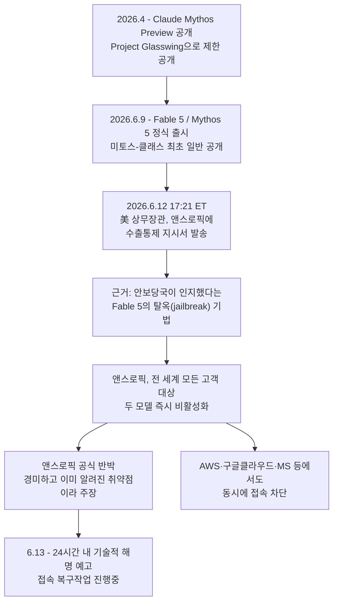
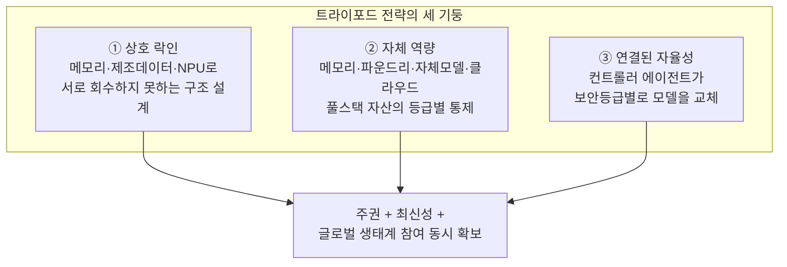
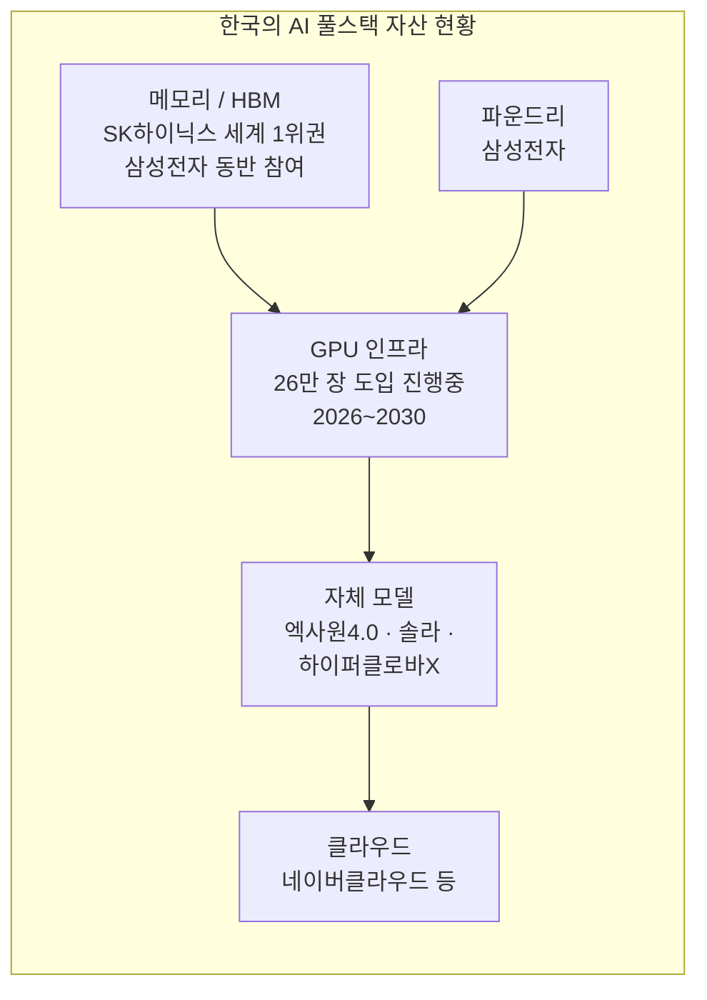
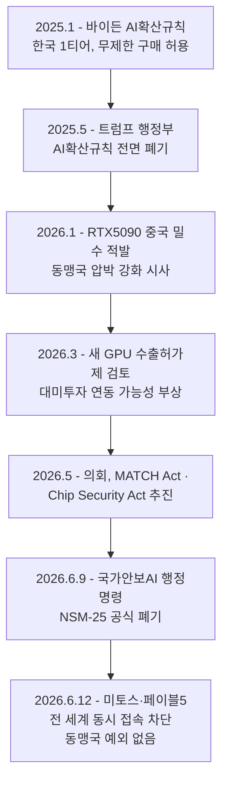

## 관련글

[**https://www.facebook.com/share/p/195F5qT9ve/**](https://www.facebook.com/share/p/195F5qT9ve/)

☑️미토스 중단 사태가 증명한 것, 그리고 소버린AI를 둘러싼 오해☑️

6월 12일, 앤스로픽이 자사의 프론티어 모델 Fable 5와 Mythos 5의 서비스를 즉시 중단했습니다. 엔스로픽의 결정이 아니라, 미국 정부가 국가안보 권한을 근거로 수출 통제와 접근 차단 행정명령을 내렸고, 앤스로픽은 그 명령을 따랐습니다. 어제 작업을 하다가, 오늘 이어서 하려고 했는데, 당황스럽습니다.

미 정부는 두 모델을 무력화할 수 있는 특정 탈옥 기법을 인지했다고 주장했고, 앤스로픽은 강하게 반박했습니다. 다른 프론티어 모델도 똑같이 가진 경미한 결함일 뿐이며, 완벽한 탈옥 방지는 애초에 불가능하고, 자사는 다중 방어 체계로 안보 위해를 차단해 왔다는 것입니다. 이 정도 좁은 취약점을 이유로 상용 모델을 회수한다면 업계의 신규 배포가 전면 중단될 것이라 경고하며, 절차적 문제를 제기하고 24시간 안에 기술적 해명을 내놓겠다고 했습니다.

그런데 말입니다. 중요한건, 기술적 문제가 아닙니다. 

탈옥 기법이 실재했는지, 결함이 정말 경미했는지는 부차적인 문제입니다. 본질적으로 심각한 문제는 딱 하나입니다. 

**** 미국 정부의 행정명령 한 장에 심지어 동맹국에게 조차도 상용 프론티어 모델이 하룻밤 사이에 꺼졌다는 사실입니다.  중국과 같은 사회주의 국가도 아니고, 미국에서 말입니다. ********

제가 <AI 국부론> 에서 계속 강조해온 AI의 국가전략자산화가 실체적으로 다가오고 있는 것입니다. 결국, 이 사태로 오늘도 보면 많은 분들이 <소버린 AI> 의 중요성을 다시금 강조하게 되고 있습니다. 

그런데, 꼭 소버린 AI를 말하기 시작하면 어김없이 열을 올리는 사람들이 있습니다. 어제인가 코리아스타트업포럼에서도 자체 모델, 자강력을 얘기하는 박영선 전 장관에게 모 스타트업 대표가 "개인과 기업이 국가를 자유롭게 선택할 수 있는 시대에 과연 소버린이라는 개념이 존재할 수 있느냐” 와 같은 얘기를 하더군요. 그들의 레퍼토리는 대체로 정해져 있습니다.

소버린 AI라는 게 결국 한컴 한글 같은 것 아니냐, 국산화를 고집하다 갈라파고스가 되고 만다는 냉소입니다. AI는 분기마다 판이 뒤집히는데 그 속도를 따라가려면 빅테크의 기술에 올라타는 수밖에 없다는 주장이 다른 하나입니다.

절반은 맞는 말이지만, 결정적인 대목에서 틀렸습니다. 우선 분명히 해두겠습니다. 지금 소버린 AI를 말하는 사람 가운데 누구도 폐쇄를 주장한 적이 없습니다. 견제와 균형, 연결성, 적절한 오케스트레이션을 얘기하는 겁니다. 자유롭게 선택을 하면? 여러번 반복하지만, 경상수지 흑자도 토큰의 폭증으로 한순간에 적자로 전환할 수 있는 시대입니다. 그러면 환율도 오르고, 사용료는 폭증하며, 대안은 없어 조정작용도 일어나지 않고, 적자는 더 심화됩니다. 

개인과 기업이 국적과 거점을 자유롭게 선택하는 디지털 글로벌 시대에도 소버린의 가치는 변함없이 유효하다고 봅니다. 국가는 인류 역사상 가장 오래된 사회계약의 산물로서 구성원과 국가가 서로의 권리와 의무로 결합된 유기체죠죠, 그래서, 헌법에 명시된 국방과 납세의 의무가 있는 겁니다.  

기업이 거점을 옮기더라도 결국 또 다른 국가의 소버린 체계 안으로 진입하는 것일 뿐이기에, 국가가 공동체의 생존을 위해 무역 전략, 국내 산업 보호, 자강(自强) 전략을 펼치는 것은 시대를 막론한 국가의 당연한 권리이자 책무입니다. 미국의 요즘 전략은? 보호무역주의 + 팍스아메리카나 입니다. 

최근의 글로벌 시장은 기술 패권 경쟁과 공급망 무기화로 인해 안보와 경제가 하나로 묶인 지정학적 현실을 마주하고 있습니다. 기업이 아무리 뛰어난 경쟁력을 갖추었더라도 국가라는 거시적 외교, 안보적 울타리 없이는 안정적인 경영 활동과 자산 보호가 불가능하다고 봅니다. 

자본주의 사회에서 기업이 사적 이익을 추구하는 것은 당연한 권리이지만, 자신이 딛고 선 국가적 기반과 공동체의 전략적 고민마저 무시한 채 이익만을 쫓는 맹목적인 태도는 본질을 망각한 리스크라고 봅니다. 

AI는 이제 단순히 기술이 아니라, 거시경제적 문제고, 국가전략자산의 문제기 때문입니다. 

제가 얘기하는 <연결된 자율성>이라는 개념의 대전제부터가 세상과 단절된 갈라파고스 AI를 거부한다는 데서 출발합니다. 빅테크 모델에 올라타라는 말도 옳습니다. 문제는 그다음입니다. 올라타되 운전대까지 넘기라고 말한 사람은 아무도 없습니다.
핵심은 협상력입니다. 자기 기술을 가지고 남의 기술을 쓰는 것과, 가진 것 하나 없이 남의 기술을 빌려 쓰는 것은 전략의 차원도, 협상력의 차원도 전혀 다릅니다. 자체 메모리와 모델과 인프라를 쥔 나라가 빅테크의 API를 쓰는 것은 선택입니다. 가진 것 없이 쓰는 나라에게 그것은 종속입니다. 똑같은 모델을 쓰면서도 한쪽은 단가를 협상하고, 다른 한쪽은 통보를 받습니다.
6월 12일이 바로 그 차이를 증명했습니다. 빌려 쓰기만 하던 쪽은 스위치가 눌리는 순간 끝입니다. 대안도 회복력도 협상 카드도 남지 않습니다. 위험한 것은 폐쇄성이 아니라, 빌린 것밖에 없는 상태입니다. 소버린 AI는 문을 닫자는 전략이 아니라, 협상 테이블에 앉을 자격부터 갖추자는 전략입니다.

그래서 락인을 단순한 비용 문제로만 보면 본질을 놓칩니다. 미국은 GPU 공급망을 통제하고 동맹국에만 기술을 선별해 제공하는 방식으로 오래전부터 AI를 안보 자산으로 다뤄 왔습니다.  동맹국에는 마치 최고의 대우로 공급할 것처럼 얘기했었죠. 26만장 GPU? 그때도 마냥 좋아만 보였죠. 

이번 미 연방정부의 행정명령은 심각함을 내포하고 있습니다. 특정 벤더의 폐쇄 모델 위에 행정과 국방, 사법과 의료를 올리는 순간, 그 모델을 켜고 끄는 스위치는 우리 손이 아니라 워싱턴에 놓입니다. 락인은 회계장부에 적히는 부채가 아니라 안보의 문제인 것입니다.

그렇다면 답은 무엇일까요. 폐쇄가 아니라 투트랙, 쓰리트랙입니다. 우리 AI, 데이터, 기술, 인지 주권도 확보하고, 좋은 빅테크 모델도 써야죠. 적재적소에 말입니다. 그러면서, 이번 미토스 중단과 같은 사태가 왔을때, 곧바로 페일오버가 되어야겠죠.  
이런 사례도 있습니다. 화상회의 기업 줌의 Z-Scorer가 이 방식을 이미 증명했습니다. 내부의 자체 모델을 쓰면서 보안 게이트웨이를 통제하고 외부의 프론티어 API는 필요할 때만 조달하는 연합 AI 전략으로, 줌은 인류 최후의 시험이라 불리는 고난도 벤치마크에서 빅테크의 자체 모델들을 제치고 종합 1위를 차지했습니다. 결국 관건은 소유가 아니라, 누구를 언제 어떻게 쓰고 검증할지를 결정하는 지휘권이자 통제권입니다.

이 모든 갈래는 결국 하나의 전략으로 수렴합니다. 미토스 사태가 드러낸 외산 폐쇄 모델 의존의 취약성은 어느 하나의 묘책이 아니라 세가지 전략이 함께 받치는 트라이포드 전략으로 가야합니다. 

첫 번째는 상호 락인입니다. 메모리와 제조 데이터, 그리고 NPU를 무기로, 일방적으로 빌려 쓰기만 하는 관계가 아니라 우리의 기억 시스템과 실측 데이터 없이는 상대의 시스템도 돌아가지 않는 구조를 짜는 것입니다. 엔비디아의 GPU를 쓰더라도 그 밑단의 기억만큼은 한국의 아키텍처를 따르게 만드는 것, 회수당하지 않는 유일한 길은 상대 역시 우리를 회수하지 못하도록 묶어두는 것입니다. 그리고 HBM에서 HBF까지 AI가속기에 중요해진다면, 우리는 이를 활용하여 차세대 GPU 에서는 단순한 공급자가 아닌 설계자로 참여할 수 있어야 합니다. 

두 번째는자체 역량입니다. 한국은 메모리와 파운드리, 엑사원이나 솔라프로, 하이퍼클로바 같은 자체 소버린 모델, 그리고 클라우드까지 모두 보유한, 세계적으로도 드문 풀스택 국가입니다. 이 자산을 등급으로 나누어, 안보 수위가 높은 구역에는 가중치와 토크나이저까지 통째로 통제하는 최고 등급의 소버린 모델을 의무화하고, 시스템을 멈출 수 있는 소프트웨어 킬 스위치를 우리 손에 둡니다. 빌린 두뇌가 회수되더라도 돌아갈 자기 두뇌가 있어야 하기 때문입니다.

세 번째는 연결된 자율성입니다. 외부의 최고 모델은 끝까지 끌어다 쓰되, 최종 지휘권은 컨트롤러 에이전트가 쥡니다. 단일 벤더에 국가 행정 전체를 맡기는 대신, 범정부 차원의 멀티 모델 체계와 적재적소의 거버넌스로 보안 등급에 맞춰 모델을 갈아 끼웁니다. 오케스트레이션을 쥔 쪽에게는 특정 모델 하나의 중단이 재난이 아니라 그저 교체 작업일 뿐입니다.
이 세가지는 따로 떼어 생각할 수 없습니다. 상호 락인이 없는 자체 모델은 고립된 갈라파고스가 되고, 자체 역량이 없는 연결은 종속으로 미끄러지며, 연결이 없는 락인은 고비용의 폐쇄로 굳어 버립니다. 세가지가 동시에 서야, 주권과 최신성, 글로벌 생태계 참여가 같이 돌아갑니다. 

그러니까. 소버린AI 얘기할때, 무슨 쌍팔년도 냉소적으로 한컴 워드 얘기는 이제 안했으면 합니다. 그런 논의 다 지나왔습니다. 어떻게 적재적소에 필요한 모델을 활용하고, 연결하고, 어떻게 역량을 키우고, 어떻게 최신 혁신도 산업과 공공에 활용할지 치열하게 고민들을 하고 있습니다. 

위험한 것은 폐쇄성이 아니라 빌린 것밖에 없는 상태이며, 외부의 두뇌는 빌리기도 하되 운전대만큼은 손에 쥐는 것이야말로 갈라파고스의 정반대입니다. 새삼스러운 주장은 아닙니다. 『AI 국부론』에서 줄곧 해온 이야기입니다.

*p.s.: 

그래서, 다들 <AI 국부론> 을 꼭 보셔야 합니다^^

교보문고 : [https://product.kyobobook.co.kr/detail/S000219391555](https://l.facebook.com/l.php?u=https%3A%2F%2Fproduct.kyobobook.co.kr%2Fdetail%2FS000219391555%3Futm_id%3D97758_v0_s00_e0_tv2_a1demoo509ce0u%26fbclid%3DIwZXh0bgNhZW0CMTAAYnJpZBExY0VCYmNZcHNSVnpPdEt4THNydGMGYXBwX2lkEDIyMjAzOTE3ODgyMDA4OTIAAR6_6SG8j2nV73xmjCjUvEcr93d4JyQw0I-LEUoEPhX7Kkj3qD2-CNtUjF1IAw_aem_Ki4XvGzc3Rzsh5qSrQmcGw&h=AUBnnJL5duyOkE5yLssgQQwO3rsao48HKOXEc5QfLYULsqMxNEyN-CoWTyIIKAAe2ZTEY4cm9u_jIJGDrQGYBzOalhz7g4EZffyxw0toqGVUHpr9pZmP49fpZdznF7cBm1mpDq1MyTJd_g&__tn__=-UK-R&c[0]=AUDxO6MyjJa5PGhxezjbfzHaBJ4xvihw1_ZTP-JKvm7KPPUBIKy1WF4w3J4IndzEOqkg5tzF1p54xBIOn2Ea7HSYYH2II_yLsEEMxmRy2Fty4RAqUejCheo105AWBQSpzciNSdeO8lHTMBzL_trf9eDQ5wLSAMK8EVcoXBtfmfJ-XQTpwhhn_6k6rw)

---

## 들어가며

공유된 글은 2026년 6월 13일경, 'AI 국부론'의 저자 이승현이 자신의 페이스북에 올린 글로 보입니다. 글의 출발점은 바로 전날인 6월 12일에 실제로 벌어진 사건입니다. 앤스로픽의 최신 프론티어 모델인 '페이블 5'와 '미토스 5'가 미국 상무부의 수출통제 지시에 따라 전 세계 모든 이용자에게 동시에 차단된 사건입니다. 저자는 이 사건을 자신이 책에서 줄곧 주장해온 '소버린 AI'와 '연결된 자율성'이라는 개념을 현실에서 입증하는 사례로 제시하면서, 한국이 빅테크 모델에 무비판적으로 의존하는 것이 왜 위험한지, 그리고 대안으로서 '트라이포드 전략'이 무엇인지를 설명하고 있습니다.

이 문서는 다음의 순서로 구성됩니다. 먼저 6월 12일에 실제로 무슨 일이 일어났는지를 외신과 앤스로픽의 공식 발표를 토대로 정리하고, 이어서 저자가 이 사건을 통해 펼치는 논리 구조를 설명합니다. 그 다음 'AI 국부론'이라는 책이 어떤 책인지를 확인된 정보로 소개하고, 마지막으로 질문하신 다섯 가지 — 한국에서의 실현 가능성, 비용, 한중 인재 격차, 미국의 GPU 통제 가능성, 그리고 'AI 국부론'의 내용 — 에 대해 최신 검색 결과를 바탕으로 답합니다.

먼저 결론부터 말하자면, 이 글에서 묘사된 6월 12일의 사건은 **실제로 일어난 일이며, 글의 핵심 사실관계는 외신 보도와 거의 정확히 일치합니다.** 다만 몇 가지 표현에서는 실제 사실과 미묘한 차이가 있는데, 이는 본문에서 짚어드리겠습니다.

---

## 1부. 6월 12일, 무슨 일이 있었나 — 미토스 5·페이블 5 전 세계 접속 차단의 전말

### 1-1. '미토스-클래스'란 무엇인가

이번 사건을 이해하려면 먼저 '미토스 5'와 '페이블 5'가 어떤 모델인지 알아야 합니다. 앤스로픽은 2026년 4월, '프로젝트 글래스윙(Project Glasswing)'이라는 이름으로 소수의 신뢰받는 기관에만 '클로드 미토스 프리뷰'를 시범 공개했습니다. 이 모델은 오푸스(Opus) 등급보다 한 단계 위에 있는 '미토스-클래스'의 첫 번째 모델이었습니다.

그리고 6월 9일, 앤스로픽은 이 미토스-클래스를 일반 사용자에게 처음으로 공개합니다. 이때 두 가지 형태로 출시되었는데, 하나는 '페이블 5(Fable 5)'로, 사이버보안 등 위험도가 높은 영역의 답변을 막는 안전 분류기(safety classifier)가 포함되어 일반에게 광범위하게 제공되는 모델이었습니다. 다른 하나는 '미토스 5(Mythos 5)'로, 페이블 5와 능력은 동일하지만 이런 안전장치가 빠진 채로 '프로젝트 글래스윙'을 통해 별도로 검증받은 일부 기관에만 제한적으로 제공되는 모델이었습니다. 가격은 두 모델 모두 입력 토큰 100만 개당 10달러, 출력 토큰 100만 개당 50달러로, 직전 모델인 '미토스 프리뷰'의 절반 이하 수준이지만 기존 오푸스 모델보다는 훨씬 높은 가격이었습니다.

앤스로픽은 출시 당시부터 "이 정도로 강력한 모델을 내놓는 데는 위험이 따른다"고 스스로 언급하며, 사이버보안·생물학·화학·보건 등 민감한 주제에 대해서는 페이블 5가 답변을 거부하거나 구형 모델인 오푸스 4.8로 자동 전환되는 이중 안전장치를 마련해두었다고 밝혔습니다.

### 1-2. 6월 12일 저녁, 무슨 일이 벌어졌나

문제는 출시 사흘 만에 터졌습니다. 6월 12일 금요일 미국 동부시간 오후 5시 21분, 앤스로픽은 미국 상무부로부터 한 통의 공문을 받았습니다. 발신자는 하워드 러트닉 상무장관이었고, 수신자는 앤스로픽 CEO 다리오 아모데이였습니다. 내용은 국가안보 권한에 근거한 '수출통제 지시(export control directive)'로, 페이블 5와 미토스 5에 대한 모든 '외국인(foreign national)'의 접근을 — 미국 국내에 있든 국외에 있든, 심지어 앤스로픽에 고용된 외국 국적 직원이라 할지라도 — 즉시 차단하라는 것이었습니다.

여기서 핵심적인 문제가 발생합니다. 앤스로픽의 시스템 구조상 '외국인만 골라서' 접근을 차단하는 것은 기술적으로 불가능했습니다. 따라서 이 지시를 준수하기 위한 유일한 방법은 미국인이든 외국인이든 가리지 않고 페이블 5와 미토스 5에 대한 접근을 **전 세계 모든 사용자에게서 동시에 차단**하는 것이었습니다. 실제로 앤스로픽은 공식 성명에서 "이 지시의 net effect(실질적 효과)는 우리가 모든 고객에 대해 페이블 5와 미토스 5를 갑자기 비활성화해야 한다는 것"이라고 밝혔습니다. 다만 오푸스 4.8을 포함한 다른 모든 클로드 모델은 이번 조치의 영향을 받지 않고 정상적으로 작동한다는 점도 함께 명시했습니다.

이 조치는 아마존 웹서비스(AWS)의 베드락(Bedrock), 구글 클라우드의 버텍스AI, 마이크로소프트 파운드리 등 페이블 5가 제공되던 모든 클라우드 플랫폼에서 동시에 이루어졌습니다. AWS는 자사 블로그에 "미 정부의 수출통제 지시를 준수하기 위해 앤스로픽이 AWS에 페이블 5와 미토스 5에 대한 모든 사용자의 접근 권한 회수를 요청했다"는 공지를 띄웠고, 클로드 웹사이트에는 "페이블 5는 일시적으로 사용할 수 없습니다(Fable 5 is temporarily unavailable)"라는 안내가 표시되었습니다.

다음 다이어그램은 이번 사태의 전체 흐름을 시간순으로 정리한 것입니다.

### 1-3. 근거는 무엇이었나 — '탈옥' 논란의 실체

미 정부는 이 조치의 근거로 "국가안보상의 우려"를 들었지만, 구체적인 내용은 문서로 제공하지 않았습니다. 앤스로픽이 파악한 바로는, 정부가 페이블 5를 우회하는 이른바 '탈옥(jailbreaking)' 방법을 인지했다는 것이 그 배경이었습니다. 보다 구체적으로는, 다른 한 AI 기업이 미토스를 탈옥시킬 수 있었다고 주장하면서 정부에 이를 알렸고, 이로 인해 정부 내에서 국가안보 우려가 불거졌다는 것이 액시오스(Axios) 등의 보도 내용입니다.

이에 대해 앤스로픽은 강하게 반박했습니다. 공식 성명에서 앤스로픽은 "우리는 이 특정 기법이 사용되어 이전에 이미 알려져 있던 소수의 경미한 취약점을 찾아내는 시연을 검토했다"며, "이 취약점들은 모두 상대적으로 단순하며, 다른 공개된 모델들도 별다른 우회 기법 없이 동일한 취약점을 발견할 수 있다는 것을 확인했다"고 밝혔습니다. 즉, 페이블 5만의 고유한 결함이 아니라 업계 전반에 존재하는 수준의 결함이라는 주장입니다.

앤스로픽은 자사의 '심층 방어(defense in depth)' 전략이 페이블의 위험을 이미 업계에 배포된 기존 모델들과 비슷한 수준으로 낮춰준다고 주장하며, 정부가 단 한 건의 '구체적인 유해 결과로 이어진 탈옥' 사례조차 제시하지 않았다고 강조했습니다. 더 나아가 "이런 좁은 범위의 잠재적 취약점을 이유로 이미 수억 명에게 배포된 상용 모델을 회수하는 것이 기준이 된다면, 이는 사실상 모든 프론티어 모델 제공사의 신규 모델 배포를 전면 중단시키는 결과를 낳을 것"이라고 경고했습니다.

다만 앤스로픽은 동시에 "우리는 정부가 통계적이고, 공정하고, 명확하며, 기술적 사실에 근거한 절차를 통해 안전하지 않은 배포를 차단할 권한을 가져야 한다고 공개적으로 밝혀왔다"며, 이번 조치가 그러한 원칙에 부합하지 않는다는 점을 절차적 문제로 짚었습니다. 그러면서 "이것은 오해에서 비롯된 것으로 보이며, 가능한 한 빨리 접속을 복구하기 위해 노력하고 있다"고 덧붙였습니다.

### 1-4. 더 넓은 맥락 — AI 행정명령과의 연결

이번 사건은 별개의 일화가 아니라, 더 큰 정책적 흐름 속에 있습니다. 트럼프 행정부는 이번 사건 직전 AI 관련 행정명령을 통해, 사이버 능력이 뛰어난 새로운 모델을 일반에 공개하기 최대 30일 전에 정부 산하 'AI 표준혁신센터(CAISI)'에 자발적으로 공유하도록 요청하는 체계를 마련했습니다. 앤스로픽은 실제로 CAISI와 사전배포 테스트 파트너십을 맺고 있었습니다.

또한 6월 9일을 전후해 트럼프 대통령은 '국가안보 AI' 관련 행정명령에 서명했는데, 이는 바이든 행정부 시절의 규제 중심 정책 문서였던 'NSM-25'를 공식 폐기하고, 군과 정보기관의 AI 도입을 가속화하며, 민간 주도의 초대형 데이터센터 프로젝트인 '스타게이트'를 비롯한 역사상 최대 규모의 AI 인프라 구축을 예고하는 내용을 담고 있습니다. 즉, 한편으로는 AI 산업의 성장을 강하게 밀어주면서, 다른 한편으로는 국가안보를 이유로 한 통제 권한을 행정부가 폭넓게 행사할 수 있음을 동시에 보여준 한 주였던 셈입니다.

엑시오스는 이번 조치의 배경에 대해, 백악관 AI 수석고문인 데이비드 색스가 '최대 기업에 대한 규제 포획'을 피하기 위해 행정명령을 자발적·비강제적 형태로 설계했음에도, 동시에 상무부가 수출통제라는 별도의 법적 권한을 활용해 매우 강력한 조치를 취할 수 있음이 드러났다고 분석했습니다. 백악관 관계자는 "트럼프는 산업을 해치고 싶지 않으며 혁신이 계속되기를 바란다"고 말했지만, 실제로 벌어진 일은 정반대의 메시지로 시장에 받아들여졌습니다.

### 1-5. 지금(6월 14일 기준) 상황은

이 글을 작성하는 시점에서 확인할 수 있는 가장 최근 보도들을 종합하면, 페이블 5와 미토스 5에 대한 접속 차단은 여전히 유지되고 있고, 앤스로픽은 "가능한 한 빨리 복구하겠다"는 입장을 반복하고 있습니다. 앤스로픽은 24시간 내에 보다 구체적인 기술적 해명을 내놓겠다고 예고한 상태이며, 이는 매우 빠르게 진행 중인 사안이므로 이후 상황은 추가로 바뀔 수 있다는 점을 염두에 두시기 바랍니다.

### 1-6. 한국에 어떤 의미인가

여기서 한국 독자에게 중요한 지점은 이렇습니다. 상무부의 지시는 형식적으로는 '외국인(foreign national)'을 대상으로 한 것이지만, 그 결과는 미국 국적자를 포함한 전 세계 모든 사용자에 대한 동시 차단이었습니다. 즉, 한국이 미국의 가장 가까운 동맹국 중 하나라는 사실은 이번 조치에서 어떤 예외나 유예도 만들어내지 못했습니다. 한국의 기업이나 연구자가 페이블 5나 미토스 5를 사용 중이었다면, 사전 통보 없이, 협상의 여지 없이, 하룻밤 사이에 접속이 끊긴 것입니다.

NBC뉴스는 이번 사태를 "주요 AI 기업이 연방정부의 개입으로 공개 배포된 모델을 오프라인으로 전환한 최초의 사례로 보인다"고 평가했습니다. 즉, 이번 사건이 갖는 의미는 '탈옥 취약점이 실제로 심각했는가'라는 기술적 질문을 넘어, '미국 정부가 행정적 권한 하나로 전 세계에 배포된 상용 AI 모델의 스위치를 즉시 내릴 수 있다는 것이 실증되었다'는 사실 자체에 있습니다. 공유하신 글의 저자가 강조하는 지점도 정확히 이 부분이며, 이 점에서는 글의 핵심 주장이 사실관계와 부합합니다.

---

## 2부. 글쓴이가 말하는 것 — 소버린 AI에 대한 오해와 '트라이포드 전략'

### 2-1. "갈라파고스"라는 비판에 대한 반론

저자는 소버린 AI 논의가 나올 때마다 반복되는 두 가지 냉소를 소개합니다. 하나는 "소버린 AI라는 게 결국 한컴 한글 같은 것 아니냐"는 비판이고, 다른 하나는 "AI는 분기마다 판이 뒤집히는데 그 속도를 따라가려면 빅테크 기술에 올라타는 수밖에 없다"는 주장입니다. 여기서 '한컴 한글'은 한국 토종 워드프로세서가 국제 표준(마이크로소프트 오피스)과 분리된 독자 생태계를 고집하다 결과적으로 국내에만 머무는 '갈라파고스'가 되었다는, 한국 IT 정책 논쟁에서 자주 인용되는 비유입니다.

저자의 반론은 명확합니다. "지금 소버린 AI를 말하는 사람 가운데 누구도 폐쇄를 주장한 적이 없다"는 것입니다. 그가 말하는 것은 견제와 균형, 연결성, 적절한 오케스트레이션이며, "빅테크 모델에 올라타라는 말도 옳다. 문제는 그 다음이다. 올라타되 운전대까지 넘기라고 말한 사람은 아무도 없다"는 비유로 정리합니다.

### 2-2. 협상력의 차이 — 6월 12일이 증명한 것

저자가 가장 강조하는 개념은 '협상력'입니다. 그는 "자기 기술을 가지고 남의 기술을 쓰는 것과, 가진 것 하나 없이 남의 기술을 빌려 쓰는 것은 전략의 차원도, 협상력의 차원도 전혀 다르다"고 말합니다. 똑같은 모델을 쓰더라도, 자체 메모리·모델·인프라를 가진 나라는 빅테크의 API를 '선택'해서 쓰는 것이고, 가진 것이 없는 나라는 그것을 '통보받는' 입장이라는 것입니다.

그리고 6월 12일이 바로 이 차이를 실증했다는 것이 저자의 핵심 논지입니다. 실제로 이번 사건에서 페이블 5와 미토스 5에 의존하던 모든 사용자는, 그 모델이 자국에서 만든 것이든 미국에서 만든 것이든 관계없이, 대안도 회복 경로도 협상 카드도 없이 그저 접속이 끊기는 것을 지켜볼 수밖에 없었습니다. 이것이 저자가 말하는 "위험한 것은 폐쇄성이 아니라, 빌린 것밖에 없는 상태"라는 문장의 근거입니다.

### 2-3. 락인은 회계 문제가 아니라 안보 문제다

저자는 또한 락인(lock-in)을 단순히 '비용' 또는 '전환 비용'의 문제로 보면 본질을 놓친다고 주장합니다. 그의 표현을 빌리면, "특정 벤더의 폐쇄 모델 위에 행정과 국방, 사법과 의료를 올리는 순간, 그 모델을 켜고 끄는 스위치는 우리 손이 아니라 워싱턴에 놓인다"는 것입니다.

이 대목에서 저자는 2025년 10월 31일 APEC 정상회의 당시 한국이 엔비디아로부터 약속받은 'GPU 26만 장'을 언급하며, "그때도 마냥 좋아만 보였죠"라고 회고합니다. 실제로 이 발언은 의미가 있습니다. 검색을 통해 확인한 바에 따르면, 'AI 국부론'의 저자인 이승현은 이 26만 장 GPU 발표 당시에도 이미 "한국이 (피지컬 AI를 위한) 소프트웨어·시뮬레이터·모델 학습 전 과정을 엔비디아 생태계에 의존한다면, 장기적으로 우리의 신경계를 스스로 설계하기 어려워질 수 있다"고 경고한 바 있습니다. 즉, 이 페이스북 글은 약 7개월 전 자신이 했던 우려가 6월 12일 사건을 통해 현실화되었다고 주장하는 구조를 갖고 있는 것입니다.

### 2-4. 줌의 사례 — '연합 AI' 전략의 실증

저자는 락인의 대안으로 화상회의 기업 줌(Zoom)의 'Z-스코어러(Z-Scorer)' 사례를 듭니다. 이 사례를 검색으로 확인한 결과는 다음과 같습니다.

2025년 12월, 줌은 자체적으로 개발한 소형 언어모델과 외부의 오픈소스·상용 모델들을 결합하는 '연합 AI(federated AI)' 접근법을 발표했습니다. 줌은 이 접근법에서 'Z-스코어러'라는 자체 시스템을 통해 여러 모델의 출력을 선택하거나 개선하는 방식을 사용했고, '탐색-검증-연합(explore-verify-federate)' 워크플로를 통해 'Humanity's Last Exam(인류 최후의 시험)'이라는 매우 어려운 벤치마크에서 48.1%라는 점수를 기록했습니다. 이는 당시 직전 최고 기록이었던 구글 제미나이 3 프로의 45.8%를 앞서는 결과였습니다.

다만 이 발표는 발표 직후부터 논란이 있었습니다. 벤처비트는 "화상회의 기업이 어떻게 갑자기 구글, 오픈AI, 앤스로픽을 제치고 머신 인텔리전스의 최전선을 측정하는 벤치마크에서 1위에 올랐는가"라는 의문을 제기했고, 일부 평론가들은 줌의 결과가 기존 모델들의 능력을 '조합'한 것일 뿐 독자적인 돌파구는 아니라는 비판을 제기했습니다.

한 가지 덧붙이자면, 이후 상황은 더 진행되었습니다. 가장 최근의 벤치마크 자료에 따르면, 이번에 새로 출시된 클로드 페이블 5가 'Humanity's Last Exam'에서 53.3%를 기록하며 줌의 기록을 다시 앞섰습니다. 따라서 줌의 '1위'는 2025년 12월 시점의 사실이며, 현재는 더 높은 점수를 기록한 모델들이 등장한 상태입니다. 다만 저자가 강조하려는 것은 특정 시점의 순위 자체보다는, **외부의 강력한 모델을 무조건 통째로 도입하는 대신, 자체 모델과 외부 모델을 오케스트레이션하는 '연합형 전략'으로도 최상위권 성능을 낼 수 있다는 전략적 사례**이며, 이 점에서 줌의 사례는 여전히 유효한 참고 사례라고 볼 수 있습니다.

### 2-5. 트라이포드 전략 — 세 개의 기둥

이 모든 논의는 저자가 제시하는 '트라이포드(tripod) 전략', 즉 세 가지 축이 동시에 받쳐야 하는 전략으로 수렴합니다.

첫 번째 기둥은 **상호 락인**입니다. 메모리(HBM), 제조 데이터, NPU를 활용해, 한국이 일방적으로 빌려 쓰기만 하는 관계가 아니라 상대방의 시스템도 한국의 기억 시스템과 실측 데이터 없이는 제대로 작동하지 않는 구조를 만드는 것입니다. 엔비디아의 GPU를 쓰더라도 그 하단의 메모리 아키텍처는 한국의 설계를 따르게 만들고, 차세대 가속기(HBM에서 HBF로 이어지는)의 개발 과정에 단순 공급자가 아닌 공동 설계자로 참여하는 것이 핵심입니다.

두 번째 기둥은 **자체 역량**입니다. 저자는 한국이 메모리와 파운드리, 엑사원·솔라프로·하이퍼클로바X 같은 자체 모델, 그리고 클라우드까지 모두 갖춘 '풀스택 국가'라는 점을 강조합니다. 이 자산들을 등급으로 나누어, 보안 수위가 높은 영역(국방·행정·의료 등)에는 가중치와 토크나이저까지 완전히 통제할 수 있는 최고 등급의 소버린 모델을 의무화하고, 시스템을 멈출 수 있는 '소프트웨어 킬 스위치'를 한국이 직접 보유해야 한다는 것입니다.

세 번째 기둥은 **연결된 자율성**입니다. 외부의 최고 모델은 계속 적극적으로 활용하되, 최종 지휘권은 '컨트롤러 에이전트'가 갖도록 하는 것입니다. 단일 벤더에 정부 전체 시스템을 맡기는 대신, 범정부 차원의 멀티 모델 체계를 구축해 보안 등급에 맞춰 모델을 교체할 수 있게 하면, 특정 모델 하나의 서비스 중단은 더 이상 재난이 아니라 단순한 '교체 작업'이 된다는 논리입니다.

저자는 이 세 가지가 서로 떼어놓을 수 없다고 강조합니다. 상호 락인 없는 자체 모델은 고립된 갈라파고스가 되고, 자체 역량 없는 연결은 종속으로 흐르며, 연결 없는 락인은 고비용의 폐쇄가 되어버린다는 것입니다. 다음 다이어그램은 이 구조를 정리한 것입니다.

---

## 3부. 'AI 국부론'이란 어떤 책인가

검색을 통해 확인한 결과, 'AI 국부론'은 2026년 3월경 골든래빗 출판사에서 출간된 책으로, 저자는 이승현입니다. 그는 디지털플랫폼정부위원회에서 인공지능플랫폼혁신국장을 지낸 정책 설계자로, 현재는 생성형 AI 스타트업 포티투마루의 부사장, 가천대학교 스타트업칼리지 겸임교수, 그리고 법무법인 린의 공공 AX(AI 전환) 부문 고문을 맡고 있습니다. 업스테이지 김성훈 대표는 이 책을 두고 "거대 담론만 논하는 정책가가 아니라 치열한 현장 감각이 고스란히 녹아 있는 실전 지침서"라고 평했습니다.

책의 핵심 메시지는 합계출산율 0.7명대라는 '국가소멸 위기' 속에서, 한국이 단순히 AI를 업무에 도입하는 수준을 넘어 국가 운영체제(OS) 자체를 AI 기반으로 재설계해야 한다는 것입니다. 저자는 특히 한국이 '전자정부 세계 1위'라는 평가에 안주해 있는 사이, 정작 중요한 데이터는 해외 빅테크에 흡수되어 '디지털 식민지'로 전락할 위험이 있다고 경고합니다.

이 책에서 제시하는 가장 독창적인 개념은 '국민총지능생산(GIP, Gross Intelligence Production)'입니다. 이는 기존의 국내총생산(GDP)을 넘어, 국가가 보유한 '지능 자산'의 총량을 새로운 국부의 척도로 삼아야 한다는 제안입니다. 그리고 이러한 지능주권을 갖춘 'AI 네이티브 국가'가 되어, 미국·중국에 이은 'AI 3대 강국(G3)'으로 도약하기 위한 구체적 로드맵을 제시하는 것이 책의 골자입니다.

이번에 공유된 페이스북 글은 결국 이 책이 출간 이후 약 3개월이 지난 시점에서, 저자가 자신의 핵심 이론적 틀('연결된 자율성', '트라이포드 전략')을 실시간으로 벌어진 사건(미토스·페이블5 차단)에 적용해 보여주는 일종의 '사례 검증'에 해당합니다. 글 마지막에 책을 직접 소개하는 것도 이러한 맥락에서 자연스럽게 이해할 수 있습니다.

---

## 4부. 한국에서 실현 가능한 이야기일까

질문하신 첫 번째 사항, "한국에서 실현 가능한 이야기일까"에 대해서는 한국이 현재 보유한 자산을 객관적으로 살펴보는 것에서 시작하는 것이 좋겠습니다.

저자가 "세계적으로도 드문 풀스택 국가"라고 표현한 것은 상당 부분 사실에 근거하고 있습니다. 메모리 분야에서 SK하이닉스는 2026년 현재 HBM(고대역폭메모리) 글로벌 시장에서 약 60~63%의 점유율을 유지하며 핵심 공급망으로 자리잡고 있고, 삼성전자 역시 주요 HBM 공급사입니다. 두 회사의 반도체 설비투자 합계는 약 70조 원에 달합니다. 파운드리 분야에서는 삼성전자가 최첨단 공정 경쟁에 참여하고 있습니다.

자체 모델 분야의 성과도 실재합니다. LG AI연구원이 2025년 7월 공개한 '엑사원 4.0'은 320억 개 매개변수의 하이브리드(추론형+비추론형) 모델로, 글로벌 오픈소스 플랫폼 허깅페이스에 공개된 후 2주 만에 50만 다운로드를 돌파했고, 아티피셜 애널리시스의 글로벌 AI 지능 지수 순위에서 11위를 기록해 한국 모델 최초로 톱10 진입에 근접했습니다. 특히 흥미로운 점은, 엑사원 4.0이 딥시크-R1(6,710억 매개변수)의 4.8%, 큐원3-235B의 13.6%에 불과한 크기로 이 모델들에 근접한 성능을 냈다는 것입니다. 이는 '효율성 중심' 접근으로도 글로벌 경쟁력을 가질 수 있음을 보여준 사례로 평가받습니다. 업스테이지의 '솔라' 시리즈와 네이버의 '하이퍼클로바X' 역시 한국의 자체 모델 생태계를 구성하는 주요 축입니다.

GPU 인프라 측면에서는, 2025년 10월 31일 경주 APEC 정상회의에서 엔비디아가 향후 5년간(2026~2030년) 한국에 26만 장의 '블랙웰' GPU를 공급하기로 한 발표가 있었습니다. 이 중 정부·삼성전자·SK그룹·현대차그룹에 각 5만 장, 네이버클라우드에 6만 장이 배정되며, 전체 규모는 최대 14조 원에 이릅니다. 정부 몫의 5만 장은 엔비디아의 NeMo·Nemotron 데이터셋을 활용해 자체 추론 모델을 개발·증류하는 '독자 AI 파운데이션 모델 프로젝트'에 투입될 예정이며, LG AI연구원·네이버클라우드·NC AI·SK텔레콤·업스테이지가 이 프로젝트에 협력합니다.

다음 다이어그램은 한국이 현재 보유한 AI 풀스택 자산을 정리한 것입니다.

다만 실현 가능성을 따질 때 짚어야 할 격차도 분명합니다. 첫째, GPU 인프라는 아직 '확보 약속' 단계에서 실제 가동까지 시간이 걸립니다. 정부가 별도로 추진하는 '국가AI컴퓨팅센터'는 총사업비 2조 5천억 원 이상 규모로 삼성SDS 컨소시엄이 사업자로 선정되었고, 2026년 4월 특수목적법인 설립, 7월 착공, 2028년 개소, 2030년까지 GPU 5만 장 확보라는 일정이 잡혀 있습니다. 즉 본격적인 자체 컴퓨팅 역량 가동까지는 아직 2년 이상의 시간이 더 필요합니다.

둘째, 한국 AI 투자의 구조적 편중 문제가 정책 보고서를 통해 지적되고 있습니다. 한 국회 자료는 한국의 AI 투자가 주로 AI 가치사슬의 1·2계층(반도체·하드웨어 인프라)에 집중되어 있고, 가장 높은 수익과 시장 지배력을 만드는 3·4계층(기반모델·응용서비스)에 대한 투자는 상대적으로 미흡하다고 진단했습니다. 트라이포드 전략의 '자체 역량' 축이 실제로 작동하려면, 하드웨어뿐 아니라 모델·서비스 계층에도 충분한 투자가 이어져야 한다는 의미입니다.

종합하면, "한국에서 실현 가능한 이야기인가"라는 질문에 대해서는, 적어도 **다른 대부분의 국가들과 비교했을 때 한국은 이런 전략을 논할 수 있는 기초 자산(메모리·파운드리·자체모델·클라우드)을 실제로 갖춘, 상당히 드문 위치에 있다**고 답할 수 있습니다. 다만 이 자산들이 '트라이포드'라는 통합된 전략으로 실제 작동하기까지는, GPU 인프라의 실제 가동 시점, 모델·서비스 계층에 대한 투자 재배분, 그리고 다음 부분에서 다룰 인재 문제라는 세 가지 실행 리스크가 남아 있습니다.

---

## 5부. 어느 정도 비용이 들게 될까

비용 문제는 두 가지 층위로 나누어 볼 수 있습니다. 하나는 한국 정부가 현재 투입하고 있는 예산 규모이고, 다른 하나는 이 규모가 국제적으로 어떤 위치에 있는가입니다.

2026년도 한국 정부의 AI 관련 예산은 약 9조 9천억~10조 1천억 원으로, 2025년의 3조 3천억 원 대비 약 3배 증가한 규모입니다. 이재명 대통령 직속 국가인공지능전략위원회는 41개 부처에 흩어져 있던 741개의 AI 관련 사업을 통합해 이 예산을 공개했으며, 2026년을 'AI 3대 강국(G3) 도약의 원년'으로 선포했습니다. 부문별로 보면 기술개발(R&D)에 2조 9천억 원, 인프라·연구기반 조성에 2조 5천억 원, 산업·공공 전반의 AX(AI 전환)에 2조 4천억 원, 인재양성에 1조 4천억 원, 생태계 조성에 6천억 원이 배정되어 있습니다.

여기에 더해 앞서 언급한 26만 장 GPU 도입에 최대 14조 원, 국가AI컴퓨팅센터 구축에 2조 5천억 원 이상이 별도로 투입됩니다. 또한 'GPT나 제미나이 등 글로벌 AI 모델의 95% 이상 성능'을 목표로 하는 '국가대표 AI' 프로젝트에는 2027년까지 5천 3백억 원 규모의 예산이 GPU 지원, 데이터 확보, 인력 채용 등에 배정되어 있으며, 6개월마다 중간평가를 거쳐 경쟁하는 팀들 중 2026년까지 2개 팀이 탈락하고 2027년에 최종 2개 팀이 선발되는 구조로 운영됩니다.

이 숫자들을 국제적으로 비교해보면 규모의 차이가 분명하게 드러납니다. 같은 시기 미국은 민관협력 프로젝트인 '스타게이트'를 통해 5천억 달러(약 700조 원) 규모의 AI 인프라 구축을 추진하고 있고, 중국은 '빅펀드 3기'(3,440억 위안, 약 65조 원)와 '국가 AI 산업투자펀드'(600억 위안, 약 11조 원)를 통해 반도체 자립과 기반모델 개발을 국가 주도로 밀고 있습니다. EU도 2천억 유로(약 300조 원) 규모의 'AI 대륙 행동계획'을 가동하고 있습니다.

단순 비교하면, 한국의 연간 정부 AI 예산(약 10조 원)은 미국 스타게이트 단일 프로젝트의 약 1.4% 수준이며, 중국의 반도체 자립 전용 펀드 한 개보다도 작은 규모입니다. 이 점은 매우 중요한 시사점을 줍니다. **저자가 말하는 '트라이포드 전략'은 애초에 미국이나 중국과 투입 자본의 절대 규모로 경쟁하자는 전략이 아닙니다.** 그보다는, 한국이 보유한 특정 자산(메모리 공급망에서의 위치, 풀스택 보유라는 희소성)을 활용해 '협상력'과 '교체 가능성'이라는 전략적 위치를 확보하자는 것이 핵심입니다. 즉, 비용의 규모 자체가 전략의 성패를 좌우하는 유일한 변수는 아니며, 오히려 한정된 자원을 메모리·모델·오케스트레이션이라는 레버리지 지점에 얼마나 효율적으로 배분하느냐가 더 중요한 질문이 됩니다. 다만 그렇다고 해서 비용이 적게 든다는 의미는 아닙니다. 위에서 본 것처럼 한국이 이미 투입하고 있거나 투입을 약속한 금액만 단순 합산해도 연간 10조 원대 예산에 더해 26만 장 GPU(14조 원), 국가AI컴퓨팅센터(2.5조 원+) 등 수십조 원 단위의 자금이 이미 움직이고 있는 사안입니다.

---

## 6부. 중국은 뛰어난 인재가 있어 가능했다지만, 한국은?

이 질문에 대해서는 다소 냉정하게 답할 필요가 있습니다. 검색을 통해 확인한 한국개발연구원(KDI)의 분석에 따르면, 중국은 최근 10여 년간 AI 연구자 규모가 연평균 30%씩 증가했고, 같은 기간 AI 논문과 특허 점유율 모두에서 세계 1위를 기록했습니다. 더 나아가, 세계 상위 100대 AI 전문가 중 절반 이상이 중국계인 것으로 분석되었습니다.

반면 한국의 상황은, 같은 보고서의 표현을 그대로 빌리면 "양적 부족과 질적 격차가 동시에 심화되는 이중 위기"입니다. 한국은 세계 상위 100대 AI 연구자 중 단 1명만을 포함하고 있으며, 인구 1만 명당 AI 전문가의 순유출 규모는 0.36명으로 OECD 국가 중 상위권, 즉 인재 유출이 가장 심각한 국가군에 속합니다.

이 데이터를 솔직하게 해석하면, **트라이포드 전략의 세 기둥 중 '인재'라는 변수는 한국이 가장 취약한 지점**이라고 볼 수 있습니다. 메모리·파운드리는 이미 수십 년간 쌓아온 산업 자산이고, 엑사원 4.0과 같은 사례는 효율적인 소규모 정예 팀이 단기간에 글로벌 상위권 모델을 만들어낼 수 있음을 보여주었지만, 이런 성과를 지속적으로 재현하고 확장하기 위한 '인재 파이프라인'은 중국이 10년 넘게 쌓아온 것과 비교할 때 그 깊이가 다릅니다.

한국 정부도 이 문제를 인식하고 있습니다. 2026년 예산에서 인재양성에 1조 4천억 원이 배정된 것이 그 증거이며, 과학기술정보통신부는 'AI 스텝업(Step-up) 전주기 인재양성' 체계를 통해 학사 → AI대학원 → AI스타펠로우십 → 최고급 신진연구자로 이어지는 단계별 육성 경로를 마련하고 있습니다.

다만 인재 문제는 예산을 투입한다고 단기간에 해결되는 영역이 아니라는 점에서, 사용자께서 짚으신 "중국은 인재가 있었다"는 전제는 상당 부분 타당합니다. 한국의 현실적인 대안은 중국과 같은 '양적 규모의 경쟁'이 아니라, 엑사원 4.0이 보여준 것처럼 **소수의 정예 조직이 효율적인 아키텍처로 특정 영역에서 글로벌 상위권을 차지하는 '선택과 집중' 모델**, 그리고 해외 우수 인재 유치 정책을 함께 가동하는 쪽에 있다고 볼 수 있습니다. 이는 트라이포드 전략이 성공하기 위한 가장 까다로운 전제조건이기도 합니다.

---

## 7부. 미국이 GPU를 통제한다면?

이 질문은 사실 이번 글 전체의 핵심과 직결되어 있으며, 검색 결과를 종합하면 이것은 더 이상 '가정'의 영역이 아니라 **이미 진행 중인 정책 흐름**이라고 답할 수 있습니다.

시간순으로 정리하면 이렇습니다. 2025년 1월, 임기 말의 바이든 행정부는 'AI 확산규칙(AI Diffusion Rule)'을 발표했습니다. 이 규칙은 전 세계 국가를 3단계로 나누어 AI 반도체 수출을 통제하는 것으로, 한국은 미국·일본·영국 등과 함께 '1단계(티어1)' — 즉 최첨단 GPU를 거의 제한 없이 수입할 수 있는 18개 동맹국 — 에 포함되었습니다.

그러나 이 규칙은 오래가지 못했습니다. 2025년 5월, 트럼프 행정부는 이 'AI 확산규칙'을 전면 폐기했습니다. 폐기 이유로는 2단계 국가들이 중국산 칩을 사용하며 오히려 중국 AI 산업에 도움을 줄 수 있다는 논리가 제시되었습니다. 이로써 한국이 가졌던 '1단계 동맹국'이라는 공식적인 지위는 더 이상 자동으로 적용되지 않게 되었습니다.

이후 2026년 1월에는 엔비디아의 최신 AI칩인 RTX 5090이 수출통제를 우회해 중국으로 대량 유입된 사실이 확인되면서, 트럼프 행정부는 CFIUS(외국인투자심의위원회) 권한을 강화하고 제3국을 통한 기술 유출을 막기 위해 동맹국에 대한 압박 수위를 높일 것이라는 전망이 나왔습니다.

그리고 2026년 3월, 한층 더 중요한 움직임이 포착되었습니다. 트럼프 행정부가 엔비디아·AMD의 첨단 AI칩에 대한 새로운 수출 '허가제'를 검토하고 있다는 보도가 나왔는데, 여기서 핵심은 대규모 수출의 경우 동맹국이 '미국 AI 산업에 상응하는 투자'를 하는 것이 조건이 될 수 있다는 점입니다. 액시오스는 이를 두고 "트럼프 대통령이 AI반도체 수출을 다른 나라와의 양자 협상에서 협상 카드이자 지렛대로 보고 있다는 뜻"이라고 평가했습니다. 즉, 반도체 수출 허가가 관세를 대신할 새로운 통상 압박 카드로 부상하고 있다는 것입니다.

2026년 5월에는 미국 의회가 'MATCH Act'와 'Chip Security Act'라는 두 법안을 통해, 행정부의 재량에만 의존하지 않고 동맹국들과 AI 하드웨어 수출 기준을 공동으로 조율하며 밀수 경로를 차단하는 법제화를 추진하고 있다는 보도도 있었습니다.

그리고 마침내 2026년 6월 9일, 트럼프 대통령은 '국가안보 AI' 행정명령에 서명하며 바이든 시절의 NSM-25를 공식 폐기했고, 불과 사흘 뒤인 6월 12일에는 — 이 글이 다루는 — 페이블 5와 미토스 5에 대한 전 세계 동시 차단이 실제로 발생했습니다.

다음 다이어그램은 이 일련의 흐름을 정리한 것입니다.

이 흐름을 종합해 "미국이 GPU를 통제한다면 어떻게 되는가"라는 질문에 답하면 다음과 같습니다. 첫째, 한국이 누렸던 '동맹국 1단계'라는 공식적 특혜 지위는 이미 폐기되었고, 새로운 체계는 아직 확정되지 않았습니다. 둘째, 새로운 체계의 방향성은 '무조건적 허용'이 아니라 '투자와 연동된 조건부 허용'에 가까워지고 있습니다. 즉, 한국이 약속받은 26만 장의 GPU 역시, 향후 미국이 추가적인 대미 투자나 안보 기준 준수를 조건으로 내걸 가능성을 완전히 배제할 수 없는 환경에 놓여 있습니다. 셋째, 그리고 가장 중요한 것은 — 6월 12일의 사건이 보여준 것처럼 — **모델(소프트웨어) 차원에서는 이미 '동맹국 예외 없는 즉각적 접속 차단'이라는 메커니즘이 실제로 작동했다**는 사실입니다. 저자가 우려하는 'GPU나 모델의 스위치가 워싱턴에 있다'는 시나리오는 더 이상 가상의 이야기가 아니라, 적어도 소프트웨어 차원에서는 이미 한 차례 실행된 사례가 되었습니다.

다만 한 가지는 분명히 구분해야 합니다. 6월 12일 조치는 '이미 배포된 모델에 대한 접근 차단'이었고, 이것이 '이미 한국 데이터센터에 설치되어 가동 중인 GPU 하드웨어 자체를 원격으로 정지시키는 것'과 동일한 일인지는 별개의 문제입니다. 다만 2026년 5월 의회에서 논의된 'Chip Security Act'와 같은 법안들은 첨단 AI칩에 위치 추적이나 보안 관련 기능을 의무화하는 방향을 포함하고 있는 것으로 보이며, 이러한 논의들이 향후 어떤 형태로 구체화될지는 계속 지켜봐야 할 사안입니다. 따라서 "하드웨어까지 원격으로 통제될 수 있다"는 부분은 현재로서는 정책 논의 단계에 있는 '우려'이자 '가능성'으로 보는 것이 정확하며, 6월 12일처럼 이미 실행된 '사실'과는 구분할 필요가 있습니다.

---

## 마무리 — 종합 정리

전체적으로 볼 때, 이 페이스북 글은 다음과 같이 평가할 수 있습니다.

첫째, 글이 묘사하는 6월 12일의 사건은 실제로 일어난 일이며, 핵심적인 사실관계 — 미 상무부의 수출통제 지시, 외국인 접근 차단이라는 형식이 결과적으로 전 세계 동시 차단으로 이어진 점, 앤스로픽의 강한 반박, 탈옥 논란 — 는 외신 보도와 정확히 일치합니다. 다만 이를 '행정명령'으로 표현한 부분은, 엄밀히는 상무부의 '수출통제 지시(공문)'에 해당하며, 같은 주에 별도로 발표된 '국가안보 AI 행정명령'과는 법적으로 구분되는 문서입니다. 그러나 일반적인 맥락에서 '미 정부의 행정적 권한 행사'라는 의미로는 큰 무리가 없는 표현입니다.

둘째, 줌의 Z-스코어러 사례 역시 실제 있었던 일이며, 2025년 12월 기준으로는 사실이었던 '종합 1위' 기록입니다. 다만 이후 클로드 페이블 5가 이 기록을 다시 넘어섰다는 점은 추가로 알아두시면 좋겠습니다.

셋째, 'AI 국부론'은 실제 출간된 책으로, 저자 이승현의 정책 경력과 책의 핵심 개념(국민총지능생산, AI G3, 디지털 식민지 경고)도 모두 확인되었습니다. 이 페이스북 글은 그 책의 핵심 주장을 6월 12일 사건에 적용한 '현장 검증' 성격의 글로 이해할 수 있습니다.

넷째, 질문하신 다섯 가지에 대해서는, 한국이 메모리·파운드리·자체모델·클라우드라는 풀스택 자산을 실제로 보유한 드문 국가라는 점에서 '트라이포드 전략' 자체는 추상적 구호에 그치지 않을 현실적 토대를 갖고 있습니다. 그러나 연간 약 10조 원 규모의 예산은 미국·중국의 투자 규모와 비교하면 절대적으로 작으며, 이 전략의 성공은 자본 규모의 경쟁이 아니라 '레버리지 지점의 선점'에 달려 있습니다. 가장 큰 약점은 인재 파이프라인으로, 중국이 10년에 걸쳐 쌓은 인재 생태계와 한국 사이의 격차는 KDI 데이터로도 분명하게 드러납니다. 그리고 마지막으로, '미국이 GPU나 모델 접근을 통제한다면'이라는 질문은 더 이상 가설이 아니라, 바로 이 글이 다루고 있는 사건 자체가 그 답이 되어버린 상황입니다.

다만 이 모든 분석은 어디까지나 하나의 '관점'에서 출발한 글에 대한 사실 검증과 데이터 보강이라는 점도 함께 밝혀둡니다. 실제로 한국 내에서도 소버린 AI를 둘러싼 논쟁은 진행 중이며, 글에서 언급된 코리아스타트업포럼에서의 반론처럼 "글로벌 시대에 소버린이라는 개념이 여전히 유효한가"라는 질문 자체도 정답이 정해진 것은 아닙니다. 이 문서가 그러한 논쟁의 양쪽 입장을 판단하는 데 필요한 사실적 토대를 제공하는 데 도움이 되기를 바랍니다.

---

## 참고 자료

- CNN Business, "Anthropic suspends all access to Mythos model after US government bans foreign nationals use" (2026.6.13)
- Bloomberg, "Anthropic Says US Orders Halt to Foreign Access for Fable 5, Mythos 5 AI Models" (2026.6.13)
- NBC News, "Anthropic suspends new AI models after government directive" (2026.6.13)
- Axios, "Scoop: Trump admin blocks foreign access to Anthropic's most powerful AI" (2026.6.12)
- TIME, "Anthropic Pulls Its Most Powerful AI Models After U.S. Bars Foreign Access" (2026.6.13)
- Anthropic 공식 성명, "Statement on the US government directive to suspend access to Fable 5 and Mythos 5"
- Anthropic / Claude API Docs, "Introducing Claude Fable 5 and Claude Mythos 5"
- AWS Blog, "Anthropic Claude Fable 5 on AWS: Mythos-class capabilities with built-in safeguards now available"
- 디지털타임스, "AI G3 도약 위한 레버리지 전략 담은 'AI 국부론' 출간" (2026.3.8)
- 청년개발자신문, "AI 시대 국가 경쟁력 해법 제시…'AI 국부론' 출간" (2026.3.27)
- 헤럴드경제, "배경훈-젠슨 황 면담, GPU 26만장·AI 팩토리 연내 도입 '박차'" (2026.6.8)
- 전자신문, "[APEC 2025] 韓·엔비디아 AI 동맹...GPU 26만장 확보" (2025.10.31)
- 보안뉴스, "과기정통부, '소버린 AI' 개발에 엔비디아 GPU 5만개 확보" (2025.10.31)
- 국회예산정책처, "AI 3대 강국 도약을 위한 예산 현황과 향후 과제" (2026.1.22)
- ZDNet Korea, "대한민국 AI 3강 간다…정부, 10조 프로젝트 공개" (2026.3.4)
- 국회도서관 국가전략정보서비스, "글로벌 AI 투자 전략과 우리나라의 정책 과제" (2026.4.21)
- LG AI연구원, "국내 첫 하이브리드 AI '엑사원 4.0' 공개" (2025.7)
- AI타임스, "LG, 하이브리드 AI '엑사원 4.0' 공개...글로벌 프론티어 성능 도달" (2025.7.15)
- KDI 경제교육·정보센터, "AI 패권 시대 인재전략: 중국의 AI 산업생태계 구축과 정책적 시사점"
- Zoom Blog, "Zoom AI sets new state-of-the-art benchmark on Humanity's Last Exam" (2025.12.10)
- VentureBeat, "Zoom says it aced AI's hardest exam. Critics say it copied off its neighbors." (2025.12.17)
- Artificial Analysis, "Humanity's Last Exam Benchmark Leaderboard"
- 서울경제, "美, 동맹국에도 AI 반도체 빗장…관세 대신할 새 통상압박 카드로" (2026.3.6)
- 블로터, "美, 엔비디아·AMD 칩 수출허가제 검토…AI 인프라 통제 강화하나" (2026.3.5)
- 전국인력신문, "미국 의회, 대중국 AI 반도체 수출 통제 강화 법안 추진" (2026.5.10)
- BusinessKorea, "[단독] 美 트럼프, '국가안보 AI' 전격 서명" (2026.6.9)
- VOA Korea / 경향신문, "미국, '20개 동맹국' 외 AI 반도체 수출통제" (2025.1.13)

---

**작성일자: 2026-06-14**
