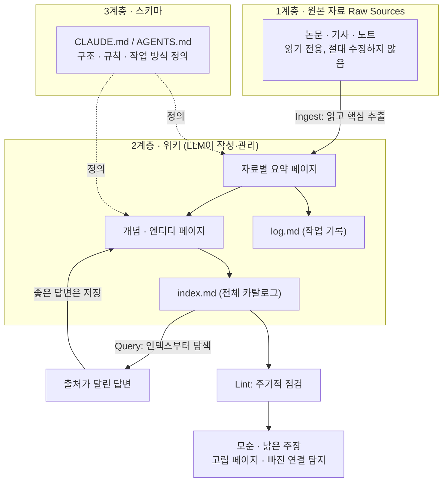
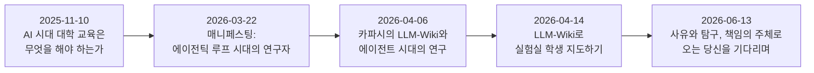
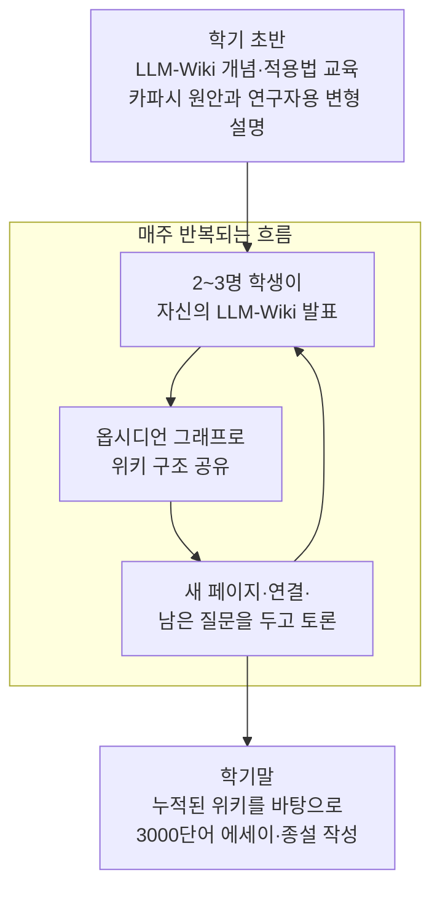
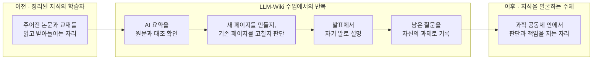

### — "사유와 탐구, 책임의 주체로 오는 당신을 기다리며" 상세 해설

- **원문 출처**: An Lab (고려대학교 생명시스템·바이오메디컬과학부, "AI for Nature")
- **원문 주소**: https://joonanlab.github.io/notes/llm-wiki-graduate-scientific-agency
- **작성일**: 2026-06-13
- **태그**: LLM-Wiki, education, graduate-school, scientific-training, AI

---

## 1. 들어가며 — 이 글은 무엇에 관한 글인가

이 문서가 다루는 원문은 고려대학교 생명시스템·바이오메디컬과학부 소속 연구실인 An Lab이 운영하는 블로그 "Notes"에 2026년 6월 13일 올라온 에세이다. An Lab은 자기소개에서 "AI for Nature"를 표방하며, 비암호화 유전체에 대한 딥러닝, 가상 세포(virtual cell) 모델, 한국인 자폐 코호트의 유전 구조 연구, 멀티오믹스 통합 분석이라는 네 가지 축으로 연구를 진행하는 곳이다. 즉 이 글을 쓴 사람은 AI와 유전체학을 동시에 다루는 실험실의 책임교수이며, 동시에 이번 학기 대학원 강의를 담당한 강의자이기도 하다.

글의 핵심 사건은 단순하다. 이 교수가 앤드리 카파시(Andrej Karpathy)가 제안한 "LLM-Wiki"라는 개인 지식관리 패턴을 대학원 수업에 끌어와, 학생들이 한 학기 동안 논문을 읽고 정리하는 방식 자체를 재설계했다는 것이다. 그런데 이 글이 진짜로 말하고 싶은 것은 도구 사용법이 아니다. 글은 "AI가 요약을 더 빨리, 더 많이 만들어주는 시대에 대학원생은 무엇을 배워야 하는가"라는 질문으로 끝까지 이어진다. 그리고 그 답으로 제시되는 것이 제목에 들어 있는 표현, 즉 학생이 "사유와 탐구, 책임의 주체"가 되는 일이다.

이 해설에서는 먼저 카파시의 LLM-Wiki가 정확히 어떤 패턴인지(원본 gist를 직접 확인한 내용을 바탕으로) 설명하고, 이어서 An Lab이 이 아이디어를 받아들여 변형해 온 과정을 시간순으로 짚는다. 그다음 6월 13일 글이 묘사하는 수업의 구체적인 운영 방식과, 그 안에 담긴 과학교육론을 차례로 풀어본다. 마지막으로는 2026년 6월 현재 LLM-Wiki라는 패턴이 더 넓은 생태계에서 어떤 위치에 있는지를 확인한 결과를 토대로, 이 사례가 그 흐름 속에서 어떤 의미를 갖는지를 정리한다.

---

## 2. 출발점 — 카파시의 LLM-Wiki란 정확히 무엇인가

먼저 배경이 되는 개념을 정확히 알아야 글의 나머지 부분이 이해된다. "LLM-Wiki"는 OpenAI 공동창업자이자 테슬라 AI 디렉터를 지낸 앤드리 카파시가 2026년 4월 4일, 깃허브 Gist에 "llm-wiki.md"라는 제목으로 올린 짧은 아이디어 문서에서 시작되었다. 카파시 본인이 문서 안에 직접 적어둔 표현을 빌리면, 이 문서는 "아이디어 파일(idea file)"이며, 코드나 제품이 아니라 "자신의 LLM 에이전트(클로드 코드, OpenAI Codex 등)에 그대로 붙여넣어 함께 구체화해 나가도록 설계된 패턴"이다. 이 글은 공개된 지 며칠 만에 개발자 커뮤니티에서 폭발적인 반응을 얻었고, 2026년 6월 현재 해당 gist 페이지에는 "5,000개 이상의 스타"와 "5,000개 이상의 포크"가 표시되어 있다(깃허브는 5,000을 넘으면 정확한 숫자 대신 "5,000+"로 표시한다). 4월 중순에 작성된 한 매체의 글은 공개 직후 며칠 사이 조회수 1,700만 회, 포크 4,282개를 기록했다고 소개하기도 했다.

카파시가 제시한 핵심 문제의식은 이렇다. 우리가 흔히 사용하는 "RAG(Retrieval-Augmented Generation, 검색 증강 생성)" 방식 — 즉 문서를 잔뜩 업로드해두고 질문할 때마다 관련된 조각을 찾아와 답을 만들어내는 방식 — 은 매번 "처음부터 다시" 지식을 재구성한다는 한계가 있다. 다섯 개의 문서를 종합해야 답할 수 있는 질문을 어제도 던지고 오늘도 던지면, 시스템은 어제의 작업 결과를 기억하지 못하고 또 처음부터 조각들을 찾아 모은다. 아무것도 "쌓이지" 않는다는 것이다.

LLM-Wiki는 이 구조를 뒤집는다. 새로운 자료가 들어올 때마다 LLM이 그 자료를 단순히 색인해두는 것이 아니라, 내용을 읽고 핵심을 추출해서 기존에 쌓아온 위키 — 마크다운 파일들로 이루어진 구조화된 지식 묶음 — 안에 직접 반영한다. 관련된 개념 페이지를 갱신하고, 새로운 자료가 기존 주장과 충돌하면 그 사실을 표시하고, 종합적인 설명을 점점 더 정교하게 다듬어간다. 카파시는 이 관계를 한 문장으로 압축했는데, "옵시디언(Obsidian)이 IDE이고, LLM이 프로그래머이며, 위키가 코드베이스다"라는 표현이다. 사람은 거의 위키를 직접 쓰지 않는다. 대신 사람은 어떤 자료를 넣을지 고르고, 어떤 질문을 던질지 정하고, LLM이 만들어낸 결과를 읽으며 방향을 잡아준다.

이 패턴은 세 개의 층으로 구성된다. 첫 번째는 "원본 자료(raw sources)" 층으로, 사용자가 직접 고른 논문, 기사, 노트 등이 들어가며 이 층은 절대 수정되지 않는다 — 언제든 처음부터 다시 위키를 재구성할 수 있도록 보장하는 "진실의 원천(source of truth)"이다. 두 번째는 "위키(wiki)" 층으로, LLM이 전적으로 소유하고 작성하는 마크다운 파일들의 모음이다. 여기에는 자료별 요약 페이지, 개념·인물·방법론 등을 다루는 엔티티 페이지, 그리고 전체를 조망하는 종합(synthesis) 페이지가 포함된다. 세 번째는 "스키마(schema)" 층으로, 보통 클로드 코드를 쓴다면 `CLAUDE.md`, Codex를 쓴다면 `AGENTS.md`라는 파일에 위키의 구조 규칙과 작업 방식을 적어둔다. 이 스키마 파일이 있기 때문에 LLM은 매번 새로 지시를 받는 일반 챗봇이 아니라, "이 위키를 어떻게 관리해야 하는지 아는 담당자"로 행동하게 된다.

실제 작업은 크게 세 가지로 나뉜다. "인제스트(Ingest)"는 새 자료를 넣고 LLM에게 처리하라고 지시하는 작업으로, 카파시는 한 건의 자료가 보통 10~15개의 위키 페이지를 갱신하게 된다고 적었다. "쿼리(Query)"는 위키를 향해 질문을 던지는 작업으로, LLM은 먼저 `index.md`(전체 페이지의 카탈로그)를 읽어 관련 페이지를 찾고, 그 페이지들을 바탕으로 출처가 달린 답을 만든다. 여기서 중요한 디테일은, 좋은 답변이 만들어지면 그것을 다시 위키의 새 페이지로 "저장"할 수 있다는 점이다 — 즉 질문하고 답을 얻는 과정 자체도 지식 축적에 기여한다. 마지막으로 "린트(Lint)"는 주기적으로 위키 전체의 건강 상태를 점검하는 작업으로, 페이지 간 모순, 새로운 자료에 의해 낡아버린 주장, 어디에도 연결되지 않은 고립 페이지, 언급은 되지만 자기 페이지가 없는 개념, 빠진 상호참조 등을 찾아낸다.

`index.md`와 `log.md`라는 두 개의 특수 파일도 핵심적인 역할을 한다. `index.md`는 위키 전체의 목차 같은 파일로, 각 페이지에 대한 한 줄 요약을 분류별로 정리해두며, 카파시는 이 방식이 수백 개 페이지, 약 100건의 자료 규모까지는 별도의 임베딩 기반 검색 인프라 없이도 잘 작동한다고 적었다. `log.md`는 "언제 무엇을 했는지"를 시간순으로 append-only 방식(추가만 하고 지우지 않는 방식)으로 기록하는 파일이다. 위키 규모가 더 커지면 카파시는 `qmd`라는, BM25 키워드 검색과 벡터 검색, LLM 재순위화를 결합한 로컬 검색 도구를 함께 쓰라고 권장했다.

이 개념을 한눈에 정리하면 다음과 같다.

카파시는 이 문서의 마지막에서 이 아이디어가 1945년 버니바 부시(Vannevar Bush)가 제안한 "메멕스(Memex)" — 개인이 큐레이션한 자료들 사이에 연상적 경로(associative trail)를 만드는 지식 저장 장치 — 와 정신적으로 닿아 있다고 적었다. 부시가 풀지 못한 문제, 즉 "누가 그 연결을 유지보수하는가"라는 문제를 LLM이 해결해준다는 것이다. 다만 카파시는 이 문서가 "의도적으로 추상적"이며 구체적인 구현은 각자의 영역과 LLM에 맞게 함께 만들어가야 한다는 점도 분명히 했다.

---

## 3. 이 아이디어가 대학원 수업에 도착하기까지 — An Lab의 선행 글들

6월 13일 글은 갑자기 등장한 것이 아니다. An Lab의 노트 페이지를 확인해보면, 이 교수는 지난 7개월 동안 "AI 시대의 연구자"라는 주제를 꾸준히 다뤄왔고, LLM-Wiki를 만난 뒤에는 그 적용 범위를 단계적으로 넓혀왔다는 흐름이 뚜렷하게 보인다.

가장 앞선 글은 2025년 11월 10일에 올라온 ["AI 시대 대학 교육은 무엇을 해야 하는가"](https://joonanlab.github.io/notes/ai-era-university-education)라는 에세이로, AI를 활용한 수업 운영과 학생이 자신만의 서사를 만들도록 돕는 교육에 대한 성찰을 담고 있다. 이 글은 6월 13일 글에서 다시 등장하는 질문 — AI 시대에 대학이 가르쳐야 할 것은 무엇인가 — 을 이미 던지고 있었다.

이후 2026년 3월 22일에는 ["매니페스팅: 에이전틱 루프 시대의 연구자"](https://joonanlab.github.io/notes/karpathy-manifesting-agentic-loops)라는 글이 올라온다. 이 글은 카파시의 한 강연을 다루는데, 강연의 핵심은 "코딩"이라는 단어가 더 이상 카파시 본인이 하는 일을 설명하지 못한다는 것이었다. 카파시는 하루 16시간을 "에이전트들에게 자신의 의지를 표현하는 일"에 쓴다고 말했고, 이를 "매니페스팅(manifesting)"이라 불렀다. 이는 신비주의적인 "끌어당김의 법칙"이 아니라, 목표를 정의하고 제약을 설정하고 맥락을 심어두고 여러 에이전트를 병렬로 돌리고 그 결과를 평가하며 방향을 다시 조정하는, 즉 의도를 구조화해 결과가 현실에서 만들어지도록 설계하는 작업을 가리키는 표현이었다. An Lab 교수는 이 강연을 들으며 생물학 연구에는 이런 "루프"에 들어가지 못하는 질문들이 많다는 점, 그리고 에이전트 시대에는 확증편향조차 자동화·병렬화될 수 있다는 점을 지적했다. 이 글에서 이미 "어떤 질문이 루프 안으로 들어가고, 어떤 질문이 바깥에 남는가"라는 구도가 만들어진다.

2026년 4월 6일에는 ["카파시의 LLM-Wiki와 에이전트 시대의 연구"](https://joonanlab.github.io/notes/karpathy-llm-wiki)라는 글이 올라왔다. 이 글은 카파시의 LLM-Wiki gist가 공개된 바로 그 주말에 작성된 것으로, 글쓴이는 마침 다음 날 있을 대학원 강의에서 "학생들이 논문을 어떻게 읽고 정리해야 하는가"를 다루려고 RAG 파이프라인을 직접 만들어보던 중이었다고 적었다. 이 글의 핵심 주장은 "정보를 잘 찾아주는 시스템"과 "지식을 쌓아가는 시스템"은 다르다는 것이다. RAG는 관련 자료를 잘 찾아오지만, 연구자에게 정말 필요한 것은 단순 검색이 아니라 자료들 사이의 관계를 이해하고 맥락을 구축하고 자신의 기준으로 중요도를 정리하는 일이라고 보았다. 특히 박사학위를 마친 연구자는 수년에 걸쳐 형성된 자신만의 지식 구조 — 어떤 논문이 중요한지, 어떤 결과가 어떤 맥락에서 의미를 갖는지에 대한 감각 — 를 갖고 있는데, RAG로 새 자료를 묶으면 그 결과가 기존 지식 구조와 자연스럽게 연결되지 않고 별도의 층으로 존재하게 되는 경우가 많다는 것이다. LLM-Wiki는 자료를 찾는 일이 아니라 자료를 "읽고 정리하고 연결하는" 과정 자체를 LLM에 위임함으로써 이 문제를 다르게 푼다.

이 4월 6일 글에는 또 하나의 중요한 연결이 있다. 글쓴이는 같은 글에서 카파시의 "오토리서치(autoresearch)" 프로젝트와 매니페스팅 강연을 다시 언급하며, 소프트웨어 영역에서는 이미 "기능별·연구별·계획별로 여러 에이전트에게 작업을 위임하고, 인간은 그 사이를 오가며 방향을 정하고 품질을 점검하는" 구조가 현실이 되었다고 짚는다. 그러나 생물학 연구는 사정이 다르다. 측정은 느리고 비싸며, 판단 기준은 모호하고, 샘플 준비에는 암묵지가 많이 필요하고, 실패는 구조화된 데이터로 남지 않는 경우가 많다. 그래서 소프트웨어에서 통하는 "에이전트 루프"가 생물학에서는 쉽게 닫히지 않는다. 글쓴이는 앞으로 중요한 것은 "좋은 아이디어"의 질 자체보다, 그 아이디어를 반복 가능한 실험-판단 루프로 번역할 수 있는 능력이라고 결론짓는다. 이 관점은 6월 13일 글에서 "학생이 스스로 질문을 세우고 그 질문을 과학 공동체 안에서 검토 가능한 형태로 다듬는 책임"이라는 표현으로 다시 나타난다.

2026년 4월 14일에는 ["LLM-Wiki로 실험실 학생 지도하기"](https://joonanlab.github.io/notes/llm-wiki-lab-mentoring)라는, 훨씬 더 실용적인 글이 올라온다. 여기서 글쓴이는 자신의 LLM-Wiki를 활용해 단일세포 파운데이션 모델 관련 강의자료와 교재를 만든 과정, 학생들과의 과거 대화와 이메일을 모아 학생들이 자주 막히는 지점을 정리해 교재로 재구성한 과정, 그리고 클로드 코드에 Gmail을 MCP(모델이 외부 도구·서비스에 접속하는 연결 방식)로 연결해 학생들의 질문을 위키와 함께 읽고 답변을 다시 Notion에 기록하는 과정을 설명한다. 이 글에서 글쓴이는 LLM-Wiki의 가장 큰 약점으로 "편향(bias)"을 꼽는데, 위키가 사용자가 선택한 문헌과 질문을 기반으로 만들어지기 때문에 특정 방향으로만 지식이 축적된다는 것이다. 글쓴이는 자신이 비암호화 변이를 연구할 때 TAD(3차원 염색질 구조) 기반 접근보다 자신이 발표해온 범주적(categorical) 접근을 선호하는 경향이 있고, 이 때문에 위키도 TAD 관련 지식을 깊게 캐내지 못한다는 점을 솔직하게 인정한다. 그리고 이 편향을 "없애는 것"이 아니라 "알고 함께 다루는 것"이 목표라고 적는다. 이 4월 14일 글의 마지막 부분에서는 이미 학부 강의에서도 LLM-Wiki를 활용하고 있으며, 슬랙으로 24시간 들어오는 학생 질문을 위키에 기반해 답변하고 그 질문 자체가 다시 위키에 누적되어 강의 맥락에 점점 더 정밀하게 맞춰진다고 적었다.

이 네 편의 글을 시간순으로 놓으면, 6월 13일 글이 어디서 왔는지가 분명해진다. "AI 시대 교육에 대한 일반적 고민(2025년 11월)" → "에이전트 시대 연구자의 위치 변화에 대한 통찰(2026년 3월)" → "RAG 대신 지식을 쌓는 시스템이라는 구체적 대안의 발견(2026년 4월 6일)" → "실험실 단위에서의 실제 적용과 한계 인식(2026년 4월 14일)" → "정규 대학원 수업으로의 확장과 교육철학적 정리(2026년 6월 13일)"라는 흐름이다.

---

## 4. 수업은 어떻게 설계되었나 — 학기의 구조

이제 본문, 즉 6월 13일 글이 묘사하는 수업 자체로 들어가보자. 글쓴이는 이번 학기 대학원 수업에서 카파시의 LLM-Wiki를 사용했다고 밝히며, 이는 학기가 시작된 뒤 빠르게 적용을 시도한 결과라고 설명한다. 글쓴이 본인도 같은 학기 동안 LLM-Wiki와 함께 공부와 연구를 진행하고 있었고, 그 경험이 좋았기 때문에 수업에 옮겨보고 싶었다는 동기가 먼저 제시된다.

기본 골격은 카파시의 제안 — LLM으로 얻은 요약과 생각을 마크다운 파일로 남기고, 그것을 다시 읽고 연결하며 개인 지식 저장소로 키워가는 것 — 을 그대로 가져왔다. 그러나 글쓴이는 이를 "연구자들의 논문 읽기와 프로젝트 정리에 맞게" 조금씩 바꾸어 썼다고 적는다. 구체적으로 무엇이 바뀌었는지 본문에서 일일이 나열하지는 않지만, 글의 흐름과 4월 14일 글의 내용을 함께 보면 핵심은 "원본 카파시 패턴이 가정하는 '나의 관심사 전반에 대한 위키'를, '내가 읽은 논문과 그로부터 생긴 연구 질문을 중심으로 한 위키'로 좁혔다"는 점에 있다고 볼 수 있다. 즉 원본 자료 층에는 학생이 읽은 논문이 들어가고, 위키 층에는 논문별 요약 페이지와 개념 페이지, 그리고 그 논문들이 남긴 질문이 쌓인다.

수업이 처음 시작될 때 글쓴이는 LLM-Wiki의 개념과 사용법을 직접 가르쳤다. 여기에는 카파시의 원래 아이디어에서 무엇을 가져왔는지, 연구자용으로 쓰면서 무엇을 바꾸었는지, 그리고 무엇보다 "논문을 읽은 기록을 마크다운으로 남기는 일이 왜 필요한가"라는 동기 설명이 포함되었다. 이 동기 설명 자체가 흥미로운데, 글쓴이는 연구실에서 논문을 많이 읽지만 그 기록이 나중에 다시 쓰일 수 있는 형태로 남지 않는 경우가 많다는 현실적인 문제를 짚는다. 어떤 논문은 PDF 폴더에만 남고, 어떤 질문은 회의 중에 잠깐 나왔다가 사라지고, 어떤 요약은 대화창 안에서 닫힌다는 것이다. 이 수업의 목표는 거창하지 않다고 글쓴이는 적는다. "읽은 논문이 사라지지 않게 하고, 떠오른 질문이 다음 주에도 다시 열릴 수 있게 하는 일"이 전부였다는 것이다.

개념 설명 이후에는 매주 두세 명의 학생이 돌아가며 자신의 LLM-Wiki를 어떻게 구성하고 사용하는지 발표하는 방식으로 수업이 운영되었다. 발표에서는 운영 구조를 어떻게 만들었는지, 논문 요약을 어떻게 이해했는지, 개념 페이지를 어떻게 나누었는지, 읽은 논문에서 어떤 질문을 남겼는지가 다뤄졌다. 발표가 끝나면 다른 학생들과 그 방식에 대한 토론이 이어졌는데, 어떤 정리는 나중에 글로 이어질 수 있는지, 어떤 구조는 지나치게 복잡한지, 어떤 연결은 더 확인이 필요한지를 함께 살펴보았다. 그리고 학기말에는 이렇게 한 학기 동안 조사하고 정리해온 논문들을 바탕으로, 한 가지 주제를 정해 약 3,000단어 분량의 에세이 혹은 종설논문을 쓰는 것이 최종 목표로 제시되었다.

이 구조에서 가장 눈에 띄는 점은, 매주의 발표가 "논문을 요약해서 들려주는 시간"이 아니라 "자신의 위키가 어떻게 자라고 있는지를 보여주는 시간"으로 설계되었다는 것이다. 이 차이는 다음 절에서 다루는 "그래프"의 역할과 직접 연결된다.

---

## 5. 그래프가 보여주는 것, 그래프가 보여주지 않는 것

매 수업마다 학생들은 자신의 LLM-Wiki를 옵시디언의 그래프 뷰로 열어 보여주었다. 옵시디언의 그래프 뷰는 위키 안의 페이지들을 점으로, 페이지 사이의 링크를 선으로 표시해 전체 구조를 한눈에 보여주는 기능이다. 화면에는 서로 연결된 페이지들도 있고, 다른 페이지와 전혀 연결되지 않은 채 따로 떨어져 있는 페이지(흔히 "고립 페이지"라 부른다)도 있었다.

여기서 글쓴이가 분명히 하는 점이 있다. 수업에서 보고 싶었던 것은 "그래프의 모양 자체"가 아니었다는 것이다. 그래프가 촘촘하게 연결되어 있다고 해서 잘한 것도 아니고, 페이지가 많다고 좋은 것도 아니다. 중요한 것은 그 그래프를 보면서 학생이 어떤 설명을 하는가였다. 글쓴이는 수업에서 실제로 던졌을 법한 질문들을 몇 가지 예시로 든다. 왜 이 논문은 기존 개념과 연결되지 않았는가. 같은 단어를 쓰는 두 논문이 정말로 같은 질문을 다루고 있는가, 아니면 표면적으로만 비슷해 보이는가. 이 논문을 읽고 났을 때 완전히 새로운 페이지를 만드는 것이 나은가, 아니면 기존 페이지를 고치는 것이 나은가.

이 대목에서 글쓴이는 핵심적인 문장을 남긴다. "그래프는 답을 주지 않았다. 다만 학생이 판단해야 할 자리를 드러내주었다." 다시 말해 그래프는 결론이 아니라 질문의 지도다. 고립된 페이지가 있다는 사실 자체는 좋거나 나쁜 것이 아니라, "왜 이게 아직 연결되지 않았을까"를 물어야 하는 자리를 가리키는 신호일 뿐이다. 두 페이지가 비슷한 위치에 있다는 사실도 "이 둘이 정말 같은 이야기를 하고 있나"를 검토해야 하는 자리를 가리킨다.

이런 맥락에서 글쓴이는 수업에서 "읽었습니다"라는 말만으로는 충분하지 않았다고 적는다. 학생은 그 논문 때문에 어떤 페이지를 새로 만들었는지, 어떤 개념 설명을 고쳤는지, 어떤 질문이 남았는지를 구체적으로 말해야 했다. 즉 논문을 읽는다는 행위는 "내가 무엇을 알게 되었나"로 끝나지 않고, "그 앎이 내 위키 안의 어느 문장을 바꾸었는가"까지 확인하는 일로 이어져야 한다는 것이다. 읽기와 쓰기(위키 갱신)가 분리되지 않는 구조를 수업이 요구한 셈이다.

---

## 6. AI 요약과 학생의 책임 — 빨라진 정리, 늘어난 판단

**LLM-Wiki는 본질적으로 AI가 논문을 읽고 요약·정리해주는 시스템이다. 그렇다면 자연스럽게 "AI가 요약해준 것을 제출하면 되는 것 아닌가"라는 질문이 떠오를 수 있다. 글쓴이는 이 질문에 대해 매우 분명한 입장을 적어둔다. AI 요약은 제출할 답안이 아니었다는 것이다.**

수업에서는 AI가 만든 요약을 받은 뒤, 그것이 원문과 실제로 맞는지를 다시 확인하도록 했다. 글쓴이는 이 확인 작업이 왜 필요한지를 두 가지 종류의 문장을 구분함으로써 설명한다. 어떤 문장은 원문에 충실한 요약이고, 어떤 문장은 모델이 "조금 앞서간 해석"에 가깝다. 즉 AI 요약 안에는 원문이 실제로 말한 내용과, 모델이 맥락상 그럴듯하게 추론해 덧붙인 내용이 섞여 있을 수 있고, 이 둘을 구분하는 일은 여전히 학생의 몫이라는 것이다. 비슷한 논리로, 어떤 개념은 논문을 이해하는 데 핵심적이지만 어떤 개념은 배경 설명으로 잠깐 지나가는 것일 수 있는데, 이 중요도 판단 역시 AI가 대신해줄 수 없다.

여기서 글쓴이는 이번 글 전체를 관통하는 또 하나의 핵심 문장을 남긴다. "요약이 빨라졌다고 해서 읽기의 책임이 사라지는 것은 아니다. 오히려 요약이 많아질수록 학생이 판단해야 할 일이 늘어난다." 이는 직관과는 다소 반대되는 주장처럼 보일 수 있다. 보통은 "AI가 요약해주니 일이 줄었다"고 생각하기 쉽지만, 글쓴이의 관점에서는 정리된 자료의 양이 늘어날수록 "이 중 어디까지 믿을 수 있고, 어디부터는 다시 봐야 하는가"를 결정해야 하는 지점이 그만큼 늘어난다는 것이다. 그리고 이를 한 문장으로 정리한다. "자료가 많다는 것과 이해가 깊다는 것은 같은 말이 아니다."

수업 중에는 또 다른 우려도 제기되었다고 글쓴이는 적는다. 학생의 머리가 "컴퓨터 안에만 남는" 상황에 대한 걱정이다. 위키를 아주 잘 만들어놓았는데, 막상 누군가 질문을 던지면 그 학생이 자기 말로 설명하지 못할 수도 있다는 것이다. 글쓴이는 이 우려를 "중요한 말"이라고 받아들인다. LLM-Wiki는 기억을 도울 수 있지만, 이해를 대신해주지는 않는다는 것이 글쓴이의 결론이다.

이 결론에서 흥미로운 처방이 이어진다. 정리하는 데 드는 시간이 줄어든 만큼, 그 줄어든 시간을 "더 많이 설명해보는" 데 써야 한다는 것이다. 사람 앞에서 자기가 읽은 논문을 말해보고, 질문을 받고, 그 과정에서 모르는 부분이 드러나는 경험을 거쳐야 한다. 그리고 글쓴이는 위키의 역할을 이렇게 규정한다. "위키는 대화를 피하기 위한 장치가 아니라, 더 나은 대화를 준비하는 책상이어야 한다." 이 문장은 이 글 전체의 제목이 왜 "당신을 기다리며"인지를 설명해주는 단서이기도 하다 — 위키라는 책상은 차려져 있지만, 그 책상에 앉아 말하고 질문받고 고쳐나가는 일은 결국 학생이라는 "사람"이 와야 한다는 것이다.

---

## 7. 학생들이 오래 머무는 자리 — 남의 질문이 나의 질문이 되는 순간

글쓴이는 한 학기 동안 수업을 진행하면서, 학생들이 어떤 주제에 "오래 머무는지"를 관찰하게 되었다고 적는다. 모든 논문이 똑같이 다뤄지지는 않았다. 어떤 논문은 요약만 하고 지나갔고, 어떤 논문은 발표가 끝난 뒤에도 질문이 남았다. 어떤 학생은 논문에 실린 그림 하나를 오래 붙잡고 설명했고, 어떤 학생은 논문의 한계(limitation) 부분을 읽다가 다음에 읽을 논문을 찾아냈으며, 어떤 학생은 같은 주제를 다루는 여러 논문이 서로 다른 데이터와 방법을 쓰고 있다는 사실 자체에 관심을 보였다.

글쓴이가 정말 보고 싶었던 것은 바로 이 순간들이라고 말한다. "남의 논문에 있던 질문이 학생의 노트 안으로 옮겨와, 다음에 더 읽고 더 확인해야 할 물음으로 바뀌는 순간"이다. 이 순간부터 그 주제는 더 이상 "남의 지식"이 아니라 "학생이 이어서 다뤄야 할 질문"이 된다.

이 관찰은 곧바로 더 큰 주장으로 이어진다. 글쓴이는 대부분의 과학 교육에서 학생이 처음에는 "이미 정리된 지식을 배우는 사람"으로 출발한다고 본다. 그러나 어느 순간에는 "아직 정리되지 않은 지식을 찾아내는 사람"으로 옮겨가야 한다. 그리고 이 이동이 일어나기 위한 전제조건은 단 하나, "자기 질문이 생겨야 한다"는 것이다. LLM-Wiki 수업에서 학생들이 페이지를 만들고, 연결을 고치고, 질문을 다시 적은 모든 행위는 바로 이 이동과 관련되어 있다고 글쓴이는 정리한다.

---

## 8. 더 깊은 층위 — 과학자의 작업과 패러다임의 이동

여기서 글은 한 단계 더 깊은 사유로 들어간다. 글쓴이는 "패러다임의 전환"이라는 말이 흔히 거창한 선언처럼 들리지만, 실제 현장에서는 작은 불일치 앞에서 오래 머무는 일에서 시작되는 경우가 많다고 말한다. 표의 한 칸, 그림의 한 점, 반복 실험에서 자꾸 어긋나는 값 — 이런 작은 틈이 기존 설명의 빈틈을 드러내고, 과학자의 일은 그 틈을 오래 들여다보는 데서 시작된다는 것이다.

현실의 과학자들이 하는 일은 훨씬 더 작고 오래 걸린다고 글쓴이는 덧붙인다. 실험을 하고, 데이터를 쌓고, 기존 설명이 잘 맞는 곳과 그렇지 않은 곳을 나눈다. 어떤 결과는 이미 알려진 설명 안에 매끄럽게 들어가고, 어떤 결과는 설명이 조금 부족한 자리를 만든다. 과학자는 그 작은 틈을 보고 다시 실험하고, 다시 분석하고, 다시 설명을 고친다. 지식의 경계는 이런 식으로 조금씩 밀린다.

이 관점에서 보면, 대학과 대학원에서 공부하고 배운다는 것은 이 과정을 멀리서 구경하는 데서 끝나지 않는다. 학생은 어느 순간 그 경계 앞에 직접 서야 한다. 이 논문은 무엇을 밝혔고 무엇을 아직 남겨두었는가, 이 데이터는 어디까지 말하게 해주고 어디서부터는 조심해야 하는가, 이 질문을 이어서 다루려면 어떤 논문을 더 읽어야 하는가 — 이런 질문을 자기 손으로 붙잡기 시작할 때, 학생은 "피동적인 학습자"에서 벗어나 과학 지식을 발굴하고 정리하고 판단하는 일에 자기 몫을 갖게 된다.

LLM-Wiki 수업의 구조 — 그래프를 보며 판단의 자리를 찾고, AI 요약을 원문과 대조하고, 남의 논문 속 질문을 자신의 질문으로 옮겨오는 — 는 결국 이 "경계 앞에 서는 경험"을 작은 단위로 반복시키기 위한 장치였다고 이해할 수 있다.

---

## 9. 대학원 교육이 가르쳐야 하는 것 — 능력과 책임

이 사유를 바탕으로 글쓴이는 대학원 수업에서 가르쳐야 할 것이 "논문 읽는 요령"만이 아니라고 못박는다. 학생은 연구 질문을 스스로 이해하고 선택하는 법을 배워야 하고, 어떤 방법론이 왜 그 질문에 맞는지 설명할 수 있어야 하며, 데이터의 한계를 말할 수 있어야 하고, 해석의 강도와 약점을 구분할 수 있어야 하며, 자신이 틀렸을 때 고칠 수 있어야 한다.

글쓴이는 이 능력들이 한 번의 과제로 생기지 않는다는 점을 분명히 한다. 논문을 읽고, 요약하고, 다시 원문을 확인하고, 다른 논문과 연결하고, 자기 말로 설명하는 일이 반복되어야 한다는 것이다. 그리고 이 반복 속에서 학생은 "과학 공동체 안의 일원"이 된다. 글쓴이는 이 표현이 단순히 "이름을 올리는 문제"가 아니라고 강조한다. 그것은 자신이 고른 논문, 자신이 만든 연결, 자신이 쓴 문장, 자신이 내린 판단을 다른 연구자들이 검토할 수 있도록 내놓는다는 뜻이다.

그렇다면 "책임"이란 무엇인가. 글쓴이는 이 단어를 거대한 개념으로 부풀리지 않는다. 오히려 매우 구체적이고 작은 행동들로 정의한다. 증거 앞에서 너무 많이 말하지 않는 일, 모르는 것을 빈칸으로 남겨두는 일, 남의 결론을 가져올 때 근거를 다시 확인하는 일이 그것이다. 그리고 이를 종합해, 자기 질문을 세우되 그 질문이 과학 공동체 안에서 검토될 수 있는 형태가 되도록 다듬는 책임이라고 정리한다.

---

## 10. 학부 교육으로의 확장 가능성 — 다음 학기의 작은 실험

글쓴이는 이 접근을 학부 수업에서도 적용해볼 수 있을지 자문한다. 다음 학기에는 이를 조금 더 작은 단위로 시험해보고 싶다는 계획이 제시된다. 다만 이는 아직 실행된 것이 아니라 "해보고 싶다"는 단계의 구상임을 분명히 해둘 필요가 있다.

이 구상의 출발점은 학부생이 겪는 특정한 어려움에 대한 관찰이다. 학부생은 전공 지식을 배우지만, 그 지식이 어떤 질문과 연결되는지 모를 때가 많다는 것이다. 글쓴이는 몇 가지 예를 든다. 통계학을 배운 학생이 유전체 데이터 분석에 관심을 가질 수 있고, 생물학을 배운 학생이 질병 예측 모델링에 끌릴 수 있으며, AI를 배운 학생이 실제 연구 데이터 앞에서 어떤 질문을 던져야 할지 막막해할 수 있다. (이 예시들은 An Lab이 실제로 다루는 연구 영역 — 유전체 데이터 분석, 질병 예측, AI — 과 자연스럽게 맞닿아 있다.)

글쓴이는 이런 상황에서 "더 많은 과목을 듣는 것"만으로는 부족할 때가 있다고 본다. 대신 필요한 것은 학생이 읽은 자료를 자기 질문과 연결해보는 연습이다. 한 편의 논문을 읽고 그 논문이 답한 질문과 남긴 질문을 나누어 적는 일부터 시작할 수 있고, 하나의 개념 페이지를 만든 뒤 다음 논문을 읽고 그 페이지를 고쳐보는 식으로 진행할 수도 있다. 중요한 것은 처음부터 3,000단어 분량의 글을 요구할 필요가 없다는 점이다. 한 페이지를 만들고, 한 질문을 남기고, 한 연결을 설명하는 것만으로도 충분히 시작할 수 있다고 글쓴이는 적는다.

이 부분에서 글쓴이는 대학 교육의 역할을 재정의한다. 대학 교육은 전공 지식을 전달하는 자리이지만, 동시에 학생이 작은 단위로 자기 판단을 연습하는 자리이기도 하다는 것이다. 학생이 교수의 설명이나 교재의 문장을 그대로 받아쓰는 데서 멈추지 않고, 왜 그런지, 어디까지 맞는지, 다음에는 무엇을 더 읽어야 하는지를 묻게 만들어야 한다는 것이 이 절의 결론이다.

---

## 11. AI가 들어온 뒤, 대학의 질문이 바뀌다

글의 마지막 부분은 더 넓은 시야로 확장된다. 글쓴이는 AI가 들어온 뒤 대학의 역할이 더 어려워졌다고 진단한다. 학생들은 앞으로 AI 없이 공부하거나 연구하지 않을 가능성이 크다. 논문을 찾고, 요약하고, 코드를 쓰고, 발표 자료를 만들고, 글의 초안을 다듬는 모든 과정에 이미 AI가 들어와 있다.

이런 상황에서 글쓴이는 대학이 "AI를 허용할지 금지할지"라는 문제에만 머물 수 없다고 주장한다. 정작 가르쳐야 할 것은 두 가지다. 첫째, 학생이 AI와 함께 만든 결과를 어떻게 검토할지. 둘째, 그 결과 중 어디까지를 자기 이름으로 말할 수 있는지. 빠른 답을 얻는 능력은 분명히 필요하지만, 빠른 답이 곧 자기 판단과 같은 말은 아니라는 것이 핵심이다.

이를 구체적인 행동으로 풀면 세 가지가 된다. 학생은 AI가 만든 요약을 원문과 대조해야 하고, 논문 사이의 연결을 스스로 정해야 하며, 어떤 질문이 남았는지를 자기 말로 적어야 한다. 글쓴이는 이번 수업에서 기대한 변화가 바로 여기에 있었다고 밝힌다. 학생이 "남이 준 과제를 처리하는 태도"에서 "이 질문은 내가 끝까지 붙잡아보겠다는 태도"로 옮겨가는 것, 과학 지식을 소비하는 사람에서 발굴하는 사람으로 옮겨가는 것, 그리고 과학 공동체 안에서 자기 몫을 가지고 그 몫에 따르는 판단의 책임을 배우는 것이다.

글은 LLM-Wiki에 대한 다소 절제된 평가로 마무리된다. "LLM-Wiki는 그 일을 대신해주지 않는다. 다만 학생이 읽고, 묻고, 고치고, 다시 설명하는 과정을 남겨준다." 그리고 마지막 문장은 이렇다. "도구는 점점 더 빨라질 것이다. 그래서 빠른 도구 곁에는 느리게 확인하는 사람이 필요하다. 무엇을 남길지, 무엇을 지울지, 무엇은 아직 말하지 않을지 판단하는 사람 말이다."

---

## 12. 2026년 6월 현재, LLM-Wiki 생태계 속에서 이 사례의 위치

마지막으로, 이 사례를 더 넓은 맥락 속에 놓아보자. 카파시의 LLM-Wiki gist는 2026년 4월 4일 공개된 이후 매우 활발한 후속 논의를 만들어냈고, 이 글을 작성하는 현재(2026년 6월) 시점에도 그 gist의 댓글창에는 새로운 구현체와 비판, 확장 아이디어가 계속 올라오고 있다. 확인할 수 있는 대표적인 흐름은 다음과 같다.

먼저 가장 많이 보이는 것은 카파시의 패턴을 그대로 또는 약간 변형해 옵시디언 플러그인이나 로컬 실행 도구로 만든 사례들이다. 예를 들어 "Synto"는 옵시디언 위에서 동작하는 로컬 LLM-Wiki 구현체로, 가벼운 모델로 개념을 추출하고 더 큰 모델로 문서를 작성하는 두 단계 구조를 취하고 있다. "qmd"는 카파시 본인이 검색 도구로 추천한 로컬 마크다운 검색 엔진이다. 이런 도구들은 대체로 "개인이 자신의 자료를 넣으면 위키가 알아서 자라난다"는, 카파시 원안의 "퍼스널 세컨드 브레인" 성격에 충실한 방향이다.

두 번째 흐름은 이 패턴을 연구 자동화 쪽으로 확장하는 시도들이다. gist 댓글 중에는 "AutoSci"라는, 위키를 연구 메모리로 삼아 아이디어 도출부터 실험 설계, 논문 작성까지를 에이전트가 수행하도록 만든 오픈소스 프로젝트가 소개되어 있고, 해당 댓글에서는 이 시스템으로 논문 여러 편을 작성했다고 주장한다(이는 An Lab 글과는 직접 관련이 없는, 별도의 커뮤니티 프로젝트로서 참고 맥락일 뿐이라는 점을 밝혀둔다). 이 방향은 "사람의 판단을 줄이고 에이전트가 더 많은 단계를 자율적으로 수행하게 만드는" 쪽에 가깝다.

세 번째 흐름은 패턴 자체의 한계에 대한 비판과 보완이다. 6월 초 댓글들 중에는, 카파시의 기본 설계가 "모순(contradiction)은 결함이며 정리해서 해소해야 한다"는 전제를 깔고 있는데, 인문학이나 비평처럼 서로 다른 해석이 공존하는 영역에서는 모순 자체가 정보이며 따라서 "타입이 있는 관계(예: contradicts, extends, supersedes)"를 위키 페이지에 명시해 보존해야 한다는 제안이 있었다. 또 다른 댓글들은 자율적으로 자료를 흡수하는 위키가 "프롬프트 인젝션"의 통로가 될 수 있다는 보안 측면의 우려를 제기하며, 출처를 신뢰할 수 없는 입력으로 명확히 구분하고 별도의 검토 모델이 기록을 점검하도록 하는 구조를 제안하기도 했다.

이 세 가지 흐름과 비교했을 때, An Lab의 6월 13일 글은 상당히 독특한 위치에 있다. 이 글은 "개인의 세컨드 브레인을 더 잘 만드는 법"도 아니고, "에이전트가 연구를 더 많이 대신하게 하는 법"도 아니다. 오히려 이 글이 다루는 핵심 긴장은 "AI가 정리를 더 잘하고 더 많이 할수록, 그 정리를 받아들이는 사람(학생)의 판단력은 어떻게 보장할 것인가"라는 문제다. 즉 같은 도구(LLM-Wiki)를 두고, 한쪽에서는 "사람의 개입을 줄이는 방향"으로, An Lab에서는 "사람의 판단이 발휘되는 자리를 의도적으로 설계하고 늘리는 방향"으로 쓰고 있는 셈이다. 카파시 본인이 원안 gist 마지막에 "이 문서가 의도적으로 추상적이며, 구체적인 형태는 각자의 영역에 맞게 함께 만들어가야 한다"고 적어둔 것을 떠올리면, An Lab의 시도는 그 "각자의 영역" 중에서도 "정규 대학원 교육과정"이라는, gist의 댓글창에서는 비교적 드물게 다뤄지는 영역에 이 패턴을 적용한 사례라고 볼 수 있다.

다만 이 점은 분명히 해두어야 한다. An Lab의 글은 한 연구실, 한 과목에서 한 학기 동안 시도해본 경험을 담은 에세이이며, 그 효과를 정량적으로 검증한 연구 결과를 제시하는 글은 아니다. 학부로의 확장 역시 아직 "다음 학기에 해보고 싶다"는 계획 단계다. 따라서 이 글이 보여주는 것은 "이렇게 하면 모든 학생이 더 나은 연구자가 된다"는 입증된 결론이 아니라, 한 교육자가 새로운 도구를 만났을 때 그 도구를 학생의 주체성을 키우는 방향으로 의식적으로 설계해본 하나의 구체적인 사례이자 그 과정에서의 성찰이라고 이해하는 것이 정확하다.

---

## 13. 마무리

정리하면, 이 글은 2026년 4월 초 공개되어 빠르게 확산된 카파시의 LLM-Wiki 패턴 — RAG처럼 매번 자료를 다시 뒤지는 대신, LLM이 원본 자료를 읽고 마크다운 위키를 지속적으로 갱신하게 하는 "원본/위키/스키마"의 3계층 구조 — 을 고려대학교의 한 대학원 수업에 적용한 경험을 다룬다. 이 적용은 글쓴이가 같은 봄 학기 동안 자신의 연구와 실험실 운영에 LLM-Wiki를 먼저 써본 경험(2026년 4월의 두 차례 글)에서 자연스럽게 이어진 것이었다.

수업에서는 학생들이 매주 자신의 위키를 옵시디언 그래프로 공유하고, 그 그래프의 모양이 아니라 그 모양에 대해 학생이 어떤 판단을 내렸는지를 중심으로 토론했다. AI 요약은 제출물이 아니라 검증의 대상이었고, "요약이 빨라질수록 학생이 판단해야 할 일은 늘어난다"는 인식이 수업 전반을 관통했다. 그 모든 과정의 목표는 학생을 "정리된 지식을 배우는 사람"에서 "아직 정리되지 않은 지식을 찾아내고, 그에 대해 책임 있게 말하는 사람"으로 옮기는 것이었다. 글쓴이는 이를 학부 교육으로도 작은 단위로 확장해보고자 하며, 더 큰 틀에서는 AI 시대 대학의 질문이 "AI를 쓸 것인가"에서 "AI와 함께 만든 것을 어떻게 검토하고, 어디까지 자기 이름으로 말할 것인가"로 옮겨가야 한다고 본다. LLM-Wiki라는 도구는 그 과정을 대신해주는 것이 아니라, 학생이 읽고 묻고 고치고 다시 설명하는 흔적을 남겨주는 책상의 역할을 한다는 것이 이 글의 결론이다.

---

### 참고한 원문 자료

- An Lab, "사유와 탐구, 책임의 주체로 오는 당신을 기다리며" (2026-06-13): https://joonanlab.github.io/notes/llm-wiki-graduate-scientific-agency
- An Lab, "Using LLM-Wiki to Mentor Lab Students" (2026-04-14): https://joonanlab.github.io/notes/llm-wiki-lab-mentoring-en
- An Lab, "Karpathy's LLM-Wiki and Research in the Age of Agents" (2026-04-06): https://joonanlab.github.io/notes/karpathy-llm-wiki-en
- An Lab, "Manifesting: The Researcher in the Age of Agentic Loops" (2026-03-22), "What Should University Education Do in the Age of AI?" (2025-11-10) — https://joonanlab.github.io/notes
- An Lab, Research 페이지: https://joonanlab.github.io/research
- Andrej Karpathy, "llm-wiki" (gist, 2026-04-04 작성): https://gist.github.com/karpathy/442a6bf555914893e9891c11519de94f
