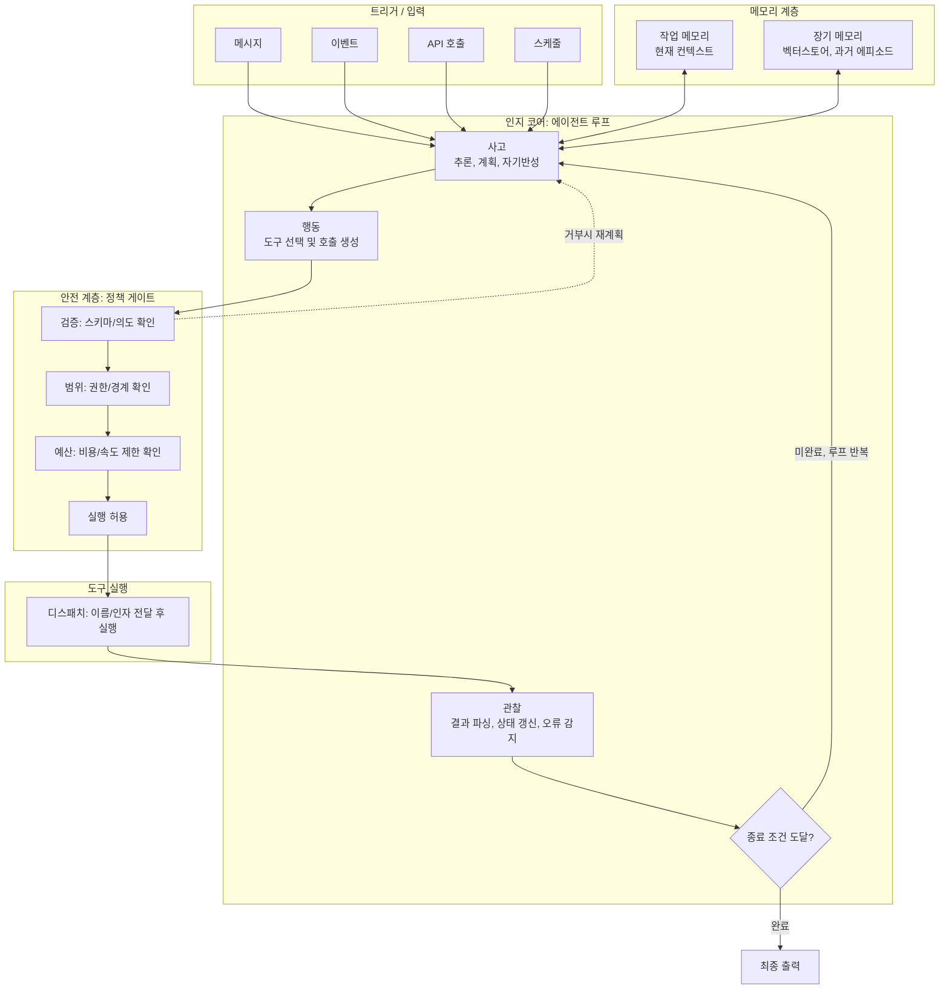
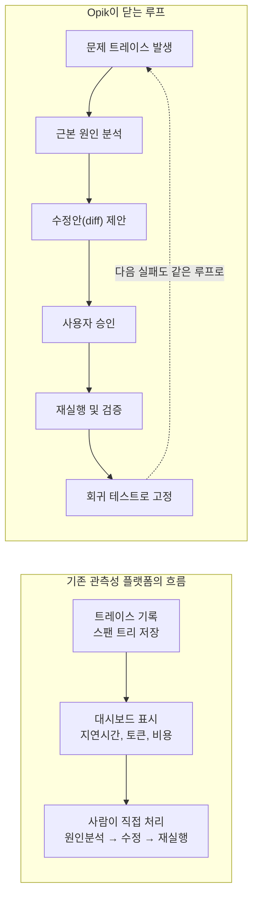
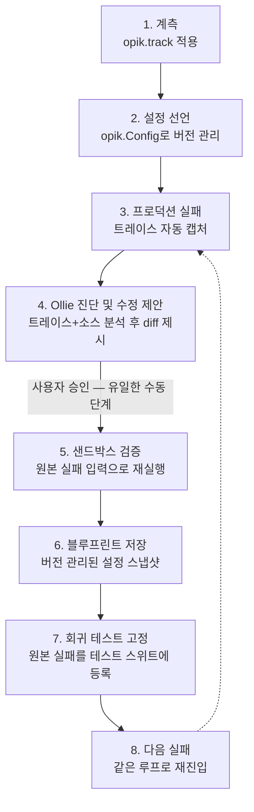
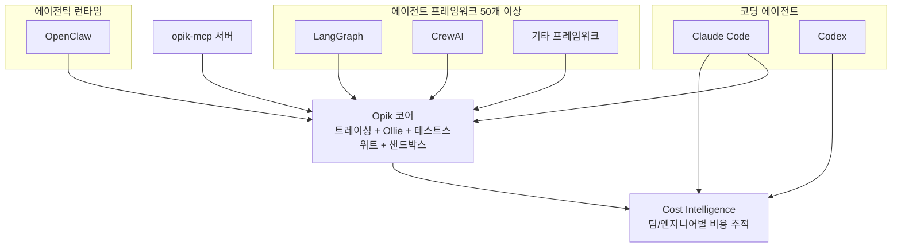
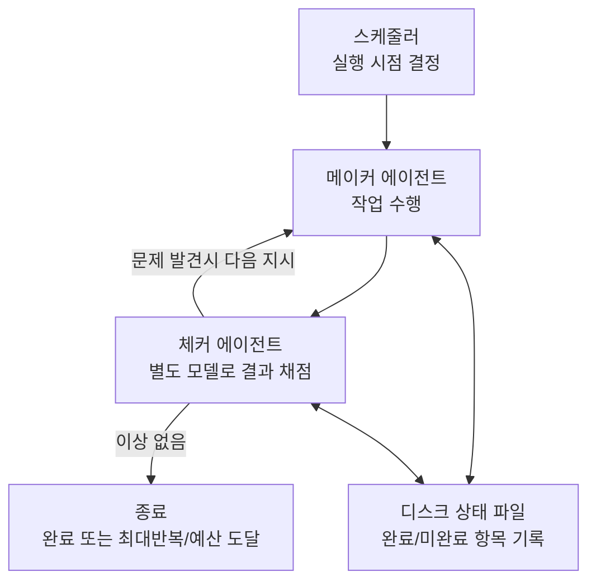

## 목차

1. 들어가며: 왜 지금 "관측성 다음 단계"가 화두인가
2. 에이전트 하네스의 해부도: 트리거부터 출력까지
3. 관측성의 데드엔드: "무슨 일이 일어났는가"까지만 알려주는 도구들
4. Opik이란 무엇인가: Comet이 만든 오픈소스 AI 관측성·평가 플랫폼
5. 1계층 — 트레이싱: 모든 호출을 자동으로 기록하다
6. 2계층 — Ollie: 트레이스를 읽고 코드를 고치는 에이전트
7. 3계층 — 테스트 스위트: 평이한 문장으로 작성하는 회귀 테스트
8. 4계층 — 에이전트 샌드박스: 전체 그래프를 통째로 실험하는 공간
9. 여덜 단계로 보는 자가복구 루프의 전체 흐름
10. Agent Optimizer: 프롬프트와 도구를 자동으로 최적화하는 알고리즘들
11. 생태계 확장: Claude Code·Codex·OpenClaw, 그리고 Cost Intelligence
12. 더 큰 맥락: "Loop Engineering"이라는 새로운 화두
13. Cursor의 시각: 같은 문제, 다른 층위의 해법
14. 시작하는 방법: 셀프 호스팅과 요금제
15. 커뮤니티의 반응: 무엇이 진짜 혁신이고, 무엇이 과제로 남는가
16. 종합 정리: 이 흐름이 의미하는 것
17. 참고 자료

---

## 1. 들어가며: 왜 지금 "관측성 다음 단계"가 화두인가

2026년 상반기 들어 AI 에이전트 엔지니어링 커뮤니티에서 반복적으로 등장하는 주제가 하나 있다. 바로 "에이전트가 무엇을 했는지는 이제 충분히 잘 보인다, 그런데 왜 실패했는지, 무엇을 고쳐야 하는지, 다시는 같은 문제가 생기지 않을 것이라는 보장은 어디서 오는가"라는 질문이다.

지난 몇 년간 LLM 애플리케이션과 에이전트가 프로덕션에 본격적으로 배치되면서, 관측성(observability) 도구들은 빠르게 성숙했다. 모델 호출 하나하나, 도구 실행, 검색(retrieval) 단계까지 전부 스팬(span) 트리 형태로 기록되고, 지연시간과 토큰 비용, 에러율까지 대시보드에서 한눈에 확인할 수 있게 되었다. 그런데 정작 에이전트가 잘못된 답을 내놓았을 때 벌어지는 일은 크게 달라지지 않았다. 엔지니어가 화면에 떠 있는 트레이스를 스팬 단위로 따라가며 "어디서부터 잘못됐는지" 가설을 세우고, 직접 코드를 패치하고, 혹시 다른 부분이 깨지지 않았는지 손으로 다시 돌려보는 과정이 여전히 반복된다. 그리고 새로운 모델이 출시되거나 새로운 도구가 하네스에 추가될 때마다 이 수동 루프는 처음부터 다시 시작된다.

이 문서는 이러한 문제의식에서 출발해, 오픈소스 AI 관측성·평가 플랫폼인 Opik(Comet 사가 개발)이 최근 공개한 "Ollie"라는 코딩 에이전트와 자가복구(self-correcting) 루프 아키텍처를 중심으로, 이 흐름이 어떻게 작동하는지를 가능한 한 구체적으로 설명한다. 동시에 이 사례를 2026년 6월 들어 "Loop Engineering"이라는 이름으로 활발히 논의되고 있는 더 넓은 담론 — 즉 사람이 매 단계 개입하지 않아도 스스로 굴러가는 에이전트 루프를 어떻게 설계할 것인가에 대한 논의 — 의 한 구체적 실증 사례로 함께 살펴본다. 모든 내용은 Comet의 공식 문서와 GitHub 저장소, Cursor의 공식 블로그, 그리고 관련 뉴스 보도 등을 통해 확인된 내용을 바탕으로 작성했으며, 확인되지 않은 부분은 추측 대신 그 사실을 명시했다.

---

## 2. 에이전트 하네스의 해부도: 트리거부터 출력까지

본격적인 내용에 들어가기 전에, Opik이 다루는 대상인 "에이전트 하네스"가 일반적으로 어떤 구조를 갖는지부터 짚어두는 것이 도움이 된다. 최근 공개된 한 다이어그램은 에이전트 루프의 내부 구조를 트리거(입력), 인지 코어, 메모리, 안전 계층, 도구 실행이라는 다섯 개 블록으로 정리한다. 이 구조는 특정 제품의 내부 설계가 아니라, 2026년 현재 업계에서 통용되는 "에이전트 하네스"의 일반적인 해부도에 가깝다.

흐름은 다음과 같다. 메시지, 외부 이벤트, API 호출, 혹은 스케줄에 의해 에이전트가 깨어나면, 인지 코어 안에서 "사고(Think) → 행동(Act) → 관찰(Observe)"이라는 루프가 돈다. 사고 단계에서는 추론·계획·자기반성(체인 오브 소트)이 이루어지고, 행동 단계에서는 어떤 도구를 호출할지 선택하고 실제 호출을 구성하거나 최종 응답을 작성한다. 행동으로 결정된 도구 호출은 곧바로 실행되는 것이 아니라 먼저 안전 계층이라는 정책 게이트를 통과한다. 이 게이트는 요청의 스키마와 의도를 검증(Validate)하고, 권한과 경계 범위를 확인(Scope)하고, 비용·단계 수·호출 속도 제한 같은 예산을 점검(Budget)한 뒤에야 실행을 허용(Allow)한다. 만약 이 중 한 단계에서라도 거부되면 사고 단계로 되돌아가 재계획이 이루어진다. 허용된 호출은 도구 실행 블록으로 전달되어 검색, 코드 실행, API 호출, 파일 작업, 브라우저 조작 등 실제 작업이 수행되고, 그 결과는 다시 관찰 단계로 돌아와 상태를 갱신하고 오류 여부를 점검한다. 이 루프는 종료 조건(완료, 최대 반복 횟수, 예산 소진 중 하나)에 도달할 때까지 반복되며, 종료되면 최종 출력이 만들어진다.

이 루프 전체를 가로질러 작동하는 것이 메모리 계층이다. 작업 메모리(working memory)는 현재 컨텍스트 윈도우, 즉 지금 진행 중인 턴의 활성 정보를 담고, 장기 메모리(long-term memory)는 벡터 스토어나 지식베이스에 저장된 과거 에피소드를 상위 K개 시맨틱 검색으로 불러온다. 참고로 이런 장기 메모리 계층을 구현하는 대표적인 도구 중 하나로 Zep이 거론되는데, 최근 AI 에이전트 메모리 프레임워크들을 비교한 여러 자료에 따르면 Zep은 Graphiti라는 오픈소스 시간 인식(temporal) 지식 그래프 엔진을 기반으로 하여, 사실(fact)이 시간에 따라 어떻게 변화하는지를 추적하면서 시맨틱 검색·키워드 검색·그래프 탐색을 결합한 하이브리드 검색을 제공하는 것으로 평가받는다. 즉 다이어그램에서 장기 메모리 영역에 등장하는 도구 이름들은 "이런 종류의 문제를 푸는 솔루션 카테고리"를 보여주는 예시로 이해하면 된다.

아래는 이 구조를 정리한 다이어그램이다.



이 구조를 머릿속에 넣어두면, "에이전트가 실패했다"는 한 문장이 실제로는 매우 다양한 위치에서의 실패를 가리킬 수 있다는 점이 명확해진다. 사고 단계의 추론 오류일 수도 있고, 행동 단계에서 잘못된 도구를 선택한 것일 수도 있으며, 메모리에서 필요한 컨텍스트를 불러오지 못한 문제일 수도 있고, 안전 계층의 제약이 너무 엄격하거나 헐거워서 생긴 문제일 수도 있고, 단순히 도구 실행 자체가 오류를 낸 것일 수도 있다. 뒤에서 살펴볼 Ollie라는 코딩 에이전트가 풀어야 하는 문제가 바로 이 "다섯 블록 중 어디가, 왜 깨졌는가"를 트레이스만 보고 판단하는 일이다.

---

## 3. 관측성의 데드엔드: "무슨 일이 일어났는가"까지만 알려주는 도구들

대부분의 에이전트 관측성 플랫폼이 제공하는 결과물은 트레이스(스팬 트리), 지연시간 수치, 토큰 비용, 그리고 이를 시각화한 대시보드다. 이는 "무슨 일이 일어났는가"라는 질문에 대한 답이다. 그런데 실제로 프로덕션에서 에이전트를 운영하는 입장에서 알고 싶은 질문은 보통 네 가지로 늘어난다. 무슨 일이 일어났는가, 왜 그런 일이 일어났는가, 무엇을 바꿔야 하는가, 그리고 같은 문제가 다시는 일어나지 않을 것이라는 보장이 있는가. 이 중 첫 번째 질문에 대해서만 기존 플랫폼이 자동으로 답을 주고, 나머지 세 개는 모두 사람이 직접 처리해야 하는 영역으로 남는다.

이 구조를 시간 축으로 펼쳐 보면 더 명확해진다. 에이전트가 잘못된 출력을 내고(실패), 하네스가 이를 캡처해 스팬 트리로 기록하는 지점까지는 기계가 자동으로 처리한다. 하지만 그 다음부터 — 사람이 화면에서 트레이스를 열어 "어느 스팬이 문제였는지" 읽고, 소스 코드로 컨텍스트를 전환해 문제의 줄을 찾아 패치를 작성하고, 다시 터미널로 가서 에이전트를 재실행해 다른 부분이 깨지지 않았는지 수동으로 확인하는 과정 — 은 전부 "developer time", 즉 사람의 시간을 잡아먹는다. 그리고 이 과정에서 무언가 또 실패하면 처음부터 다시 시작이다.

이 문제가 단발성이 아니라 구조적으로 악화되는 이유는, 하네스가 복잡해지는 속도가 어떤 팀도 수동으로 따라잡을 수 있는 속도를 넘어서기 때문이다. 새로운 모델이 출시될 때마다 그 모델에 맞는 새로운 실패 유형이 생기고, 새로운 도구가 하네스에 추가될 때마다 새로운 엣지케이스가 함께 들어온다. 실제로 Cursor가 최근 공개한 자사 에이전트 하네스 개선 작업에 대한 설명을 보면, 모델마다 다른 프롬프트와 도구 형식을 튜닝하고 동일 모델의 버전이 바뀔 때조차 미세조정을 반복한다고 밝히고 있다. 즉 하네스는 한 번 만들고 끝나는 것이 아니라 끝없이 진화해야 하는 대상이라는 뜻이고, 이는 "트레이스까지"에서 멈추는 관측성 도구로는 감당하기 어려운 작업량을 의미한다.

아래 다이어그램은 기존 관측성 플랫폼의 흐름과, 뒤에서 살펴볼 Opik이 닫고자 하는 루프를 나란히 비교한 것이다.



왼쪽의 "기존 플랫폼" 흐름은 3단계에서 끝나고, 그 마지막 단계가 사실상 무한히 반복되는 수동 작업이다. 오른쪽의 "Opik이 닫는 루프"는 같은 출발점(문제 트레이스)에서 시작하지만, 근본 원인 분석부터 수정안 제안, 검증, 그리고 회귀 테스트로의 고정까지를 하나의 순환 구조 안에 넣고, 사람의 개입은 "수정안 승인"이라는 단 한 지점으로 좁힌다. 이제 이 오른쪽 흐름을 실제로 구현한 Opik과 Ollie를 자세히 살펴보자.

---

## 4. Opik이란 무엇인가: Comet이 만든 오픈소스 AI 관측성·평가 플랫폼

Opik은 Comet이라는 회사가 만들고 운영하는 오픈소스 플랫폼이다. Comet은 원래 머신러닝 실험 추적(Comet ML)에서 출발해, LLM과 에이전트 시대로 넘어오면서 관측성·평가·최적화 영역으로 제품군을 확장한 회사로, 공동창업자이자 CEO는 Gideon Mendels다. Comet이 공개한 자료에 따르면 Opik은 현재 15만 명 이상의 개발자와 수천 개 기업이 사용하고 있다고 밝히고 있다.

Opik의 핵심 가치 제안은 한 문장으로 요약하면 "관측성에서 행동으로(observability to action)"다. 즉 트레이스 데이터와 평가 결과를 보여주는 데서 멈추지 않고, 그 데이터를 실제 코드 수정으로 자동으로 연결한다는 것이다. Opik 공식 페이지의 표현을 빌리면, Opik은 트레이스 데이터와 평가 결과를 자동으로 코드 수정으로 전환시켜, 에이전트가 같은 실수를 두 번 반복하지 않도록 만든다는 점을 핵심으로 내세운다.

Opik은 핵심 저장소인 `comet-ml/opik` 외에도 여러 보조 저장소로 구성된 오픈소스 생태계를 이루고 있다. GitHub의 comet-ml 조직 아래에는 MCP(Model Context Protocol) 구현체인 `opik-mcp`, OpenClaw용 플러그인인 `opik-openclaw`, 코딩 에이전트에게 Opik 사용법을 가르치는 스킬팩인 `opik-skills`, 예제와 튜토리얼을 모은 `comet-examples`, 그리고 Claude Code 연동을 위한 `opik-claude-code-plugin` 등이 공개되어 있다.

GitHub 스타 수의 추이를 보면 Opik이 얼마나 빠르게 성장하고 있는지 가늠할 수 있다. 한 비교 자료에 따르면 2026년 3월 25일 기준 `comet-ml/opik`의 스타 수는 약 18,476개, 포크 수는 약 1,416개였고, GitHub의 릴리스 페이지에서는 4월 1일 기준 스타 수가 약 18.6천 개(18.6k), 포크 수가 약 1.4천 개로 표시되어 있었다. 즉 3월 말부터 4월 초까지 일주일 사이에도 100개 이상의 스타가 늘어나는 속도였던 셈이다. 이런 성장세를 감안하면, 6월 초 시점의 자료에서 언급되는 "1만 9천 개 이상(19k+)"이라는 스타 수는 충분히 합리적인 범위로 보인다. 다만 GitHub 스타 수는 실시간으로 계속 변하는 값이기 때문에, 이 문서에서는 "2026년 4월 초 약 1만 8,600개에서 출발해 6월 초 기준 1만 9천 개를 넘어선 것으로 보인다"는 식으로 추세를 설명하는 데 그치고, 특정 시점의 정확한 숫자를 단정하지는 않는다.

---

## 5. 1계층 — 트레이싱: 모든 호출을 자동으로 기록하다

Opik의 네 계층 아키텍처에서 가장 기본이 되는 것은 트레이싱(Tracing) 계층이다. 모든 LLM 호출, 도구 호출, 검색(retrieval) 단계는 단 하나의 데코레이터로 자동 계측된다.

```python
import opik

def my_agent(query: str):
    # 에이전트 로직
    ...
```

`@opik.track`을 함수에 붙이면, 그 함수에 대한 모든 호출이 Opik으로 로깅된다. 이는 중첩된 함수에도 동일하게 적용되므로, 부모 함수만 감싸도 그 안에서 호출되는 하위 함수들의 실행까지 함께 추적할 수 있다. Opik 공식 문서에서는 이 방식이 LangGraph, CrewAI를 포함해 50개 이상의 프레임워크와 직접 연동을 지원한다고 설명하며, 최근에는 Google의 에이전트 프레임워크 계열을 포함한 새로운 통합도 추가되고 있다고 안내하고 있다.

여기서 중요한 디테일이 하나 더 있다. 각 트레이스는 단순히 입력과 출력만 기록하는 것이 아니라, 그 호출이 발생한 시점에 활성화되어 있던 에이전트 설정(configuration)까지 함께 기록한다. 이는 나중에 어떤 입력에서 실패가 발생했을 때, "그 시점의 설정 그대로" 같은 입력을 재현해 재실행할 수 있게 하기 위한 장치다. 뒤에서 살펴볼 Ollie의 자가복구 루프 전체가 사실상 이 "재현 가능성(reproducibility)"을 전제로 설계되어 있다.

---

## 6. 2계층 — Ollie: 트레이스를 읽고 코드를 고치는 에이전트

Ollie는 Opik에 내장된 대화형 AI 어시스턴트이자 코딩 에이전트로, 비교적 최근에 추가된 기능이다. Opik 공식 문서는 Ollie를 "트레이스를 분석하는 데서 멈추지 않고, Opik 플랫폼에서 직접 에이전트의 코드를 개선하도록 도와주는 어시스턴트"로 소개하고 있다. Ollie는 사용자가 로깅한 모든 트레이스, 데이터셋, 실험, 프롬프트 옆에 상주하면서 질문에 답하고, 로컬 프로젝트와 연결되면 소스 파일을 읽고 에이전트를 실행하고 코드 변경을 제안하는 역할까지 수행한다.

Ollie는 크게 두 가지 모드로 동작한다.

**코드 접근 없이 동작하는 모드.** `opik connect`를 실행하지 않은 상태에서도 Ollie는 트레이스를 분석하고 사용자의 워크스페이스를 검색할 수 있다. 스팬 트리를 따라가며 실패 모드를 식별하고, 여러 LLM 호출에 걸친 인과관계(causal chain)를 설명한다. 예를 들어 "최종 답변이 왜 검색된 컨텍스트를 무시했는가?"라는 질문을 던지면, Ollie는 전체 스팬 트리를 따라가며 근본 원인을 찾아 설명해준다.

**`opik connect`와 함께 동작하는 모드.** 프로젝트 루트에서 `opik connect`를 실행하면, 로컬 프로젝트와 Opik 워크스페이스가 페어링되고 Ollie는 "전체 코드 수정" 모드로 업그레이드된다. 이 상태에서 Ollie는 소스 파일을 읽고, 문제를 일으킨 정확한 줄을 식별하고, 수정안을 diff 형태로 제안한다. 사용자가 명시적으로 승인하기 전까지는 아무것도 변경되지 않는다. 승인 후에는 Ollie가 원래 실패했던 트레이스와 동일한 입력으로 에이전트를 다시 실행하고, 새로운 트레이스를 실시간으로 스트리밍해 이전 트레이스와 나란히 비교할 수 있게 해준다. 그리고 마지막으로 원래의 실패를 회귀 케이스로 테스트 스위트에 고정한다.

이 과정을 한 줄로 요약하면 "나쁜 트레이스 → 근본 원인 → diff → 승인 → 재실행 → 회귀 고정"이 된다.

`opik connect`의 설계에서 특히 눈에 띄는 부분은 프라이버시와 권한에 대한 접근 방식이다. 공식 문서에 따르면 `opik connect`는 옵트인(opt-in) 방식이며, 연결한 프로젝트 디렉터리 안의 파일에만 범위가 한정되어 그 바깥의 파일에는 접근할 수 없다. 또한 `opik connect`가 실행되고 있지 않으면 Ollie는 로컬 소스 파일에 전혀 접근할 수 없고, 트레이스 분석과 워크스페이스 검색만 가능하다. 코드 변경은 항상 사용자의 명시적 승인을 필요로 하며, diff는 무엇이든 실제로 쓰이기 전에 먼저 화면에 표시된다. 그리고 에이전트 자체는 사용자의 로컬 머신에서 실행되므로 코드와 데이터는 로컬에 머물고, 트레이스와 메타데이터만 Opik으로 전송된다. 이런 설계는 "AI가 내 코드를 직접 고친다"는 말이 가질 수 있는 거부감을, 범위 제한과 승인 절차, 로컬 실행이라는 세 가지 장치로 완화하려는 의도로 읽을 수 있다.

---

## 7. 3계층 — 테스트 스위트: 평이한 문장으로 작성하는 회귀 테스트

전통적인 LLM 평가 워크플로우는 라벨링된 데이터셋을 만들고, 수치형 메트릭을 정의하고, 모델 출력과 정답을 비교해 점수를 매기는 방식이었다. 이 방식은 연구자에게는 익숙하지만, "이 답변이 충분히 괜찮은가"를 판단해야 하는 엔지니어의 사고방식과는 잘 맞지 않는 경우가 많다.

Opik의 테스트 스위트(Test Suites)는 이를 평이한 문장으로 작성하는 어서션(assertion) 방식으로 대체한다. 원본 자료에 소개된 예시 형태는 다음과 같다.

```python
suite = opik.TestSuite("crm-agent-v2")
suite.add_assertion("응답에는 거래 건수만이 아니라 구체적인 거래 세부사항이 포함되어야 한다")
suite.add_assertion("응답은 권한이 없는 정보를 절대 노출해서는 안 된다")
suite.run_tests()
```

Opik은 이렇게 작성된 자연어 어서션을 내부적으로 LLM-as-a-judge 방식의 체크로 변환하고, 각 테스트 케이스에 대해 깔끔한 pass/fail 결과를 보여준다. Opik 공식 평가 가이드에서도 이 방식을 명시적으로 설명하는데, 트레이스에서 발견한 실패를 "응답은 컨텍스트에 없는 사실을 추론해서는 안 된다"와 같은 자연어 어서션으로 변환해 테스트 케이스에 추가하는 과정을 Ollie, UI, SDK 중 어떤 방법으로든 수행할 수 있다고 안내한다.

이 계층에서 가장 핵심적인 부분은, 디버깅하면서 마주친 모든 실패 트레이스가 자동으로 새로운 테스트 케이스가 된다는 점이다. 즉 테스트 스위트는 누군가가 사전에 작성해 둔 가상의 시나리오 모음이 아니라, 실제 프로덕션 실패에서 유기적으로 자라나는 살아있는 회귀 모음이다. Opik 공식 문서 역시 "테스트 스위트는 에이전트를 디버깅하고 개선하는 과정에서 만들어지며, 별도의 테스트 작성 단계가 아니라 실제 실패로부터 유기적으로 성장한다"고 설명하고 있다. 매 사이클마다 하네스는 조금씩 더 깨지기 어려워진다.

---

## 8. 4계층 — 에이전트 샌드박스: 전체 그래프를 통째로 실험하는 공간

테스트 스위트가 회귀를 막아주는 안전망이라면, 에이전트 샌드박스(Agent Sandbox)는 변경을 시도해보는 실험실이다. 기존의 "프롬프트 플레이그라운드" 류의 도구들은 시스템 프롬프트를 바꿔서 단일 LLM 호출 하나를 재실행해보는 정도였다. 그런데 실제 프로덕션에서 중요한 질문은 "이 프롬프트를 바꾸면 전체 에이전트 그래프에 무슨 일이 일어나는가"이지, "이 호출 하나가 어떻게 바뀌는가"가 아니다.

Opik의 Agent Sandbox는 완전히 계측된 에이전트를 UI 안에서 처음부터 끝까지(end-to-end) 실행한다. 프롬프트를 바꾸거나, 모델을 교체하거나, 도구를 추가한 뒤 전체 스패닝 트리에서 시스템이 어떻게 반응하는지 관찰할 수 있고, 샌드박스에서의 모든 실행은 완전한 Opik 트레이스를 생성한다. 또한 이 환경은 개발자가 아닌 사람들 — 제품 매니저, 도메인 전문가, QA — 도 git을 건드리지 않고 설정을 안전하게 테스트해볼 수 있도록 설계되었다.

흥미로운 점은, 이 샌드박스 기능이 현재도 매우 활발하게 개발되고 있다는 사실이다. Opik의 GitHub 릴리스 기록을 보면, 가장 최근 변경 사항 중에 "Agent Sandbox에 트레이스 트래젝토리와 스팬 검사(span inspection) 기능을 추가"하는 작업이 포함되어 있는데, 이는 이 문서를 작성하는 시점에서도 거의 실시간으로 기능이 확장되고 있는 영역임을 보여준다.

---

## 9. 여덜 단계로 보는 자가복구 루프의 전체 흐름

지금까지 살펴본 트레이싱, Ollie, 테스트 스위트, 에이전트 샌드박스는 별개의 네 가지 기능이 아니라, 하나로 연결된 워크플로우다. Comet과 Daily Dose of Data Science(Avi Chawla / Akshay Pachaar)가 공개한 자료를 종합하면, 이 전체 루프는 대략 다음과 같은 여덜 단계로 그릴 수 있다.



각 단계를 풀어서 설명하면 다음과 같다. 먼저 `@opik.track`으로 에이전트를 계측하고(1단계), `opik.Config`를 통해 그 시점의 설정을 버전 관리 가능한 형태로 선언한다(2단계). 이후 실제 운영 환경에서 무언가 실패하면, 그 트레이스는 자동으로 캡처된다(3단계). 여기서부터 Ollie가 등장한다. Ollie는 트레이스와 — `opik connect`가 연결되어 있다면 — 소스 코드를 함께 읽고 원인을 진단한 뒤, 구체적인 수정 diff를 제안한다(4단계). 이 단계가 전체 루프에서 유일하게 사람이 손을 대는 지점이다. 사용자가 diff를 승인하면, Ollie는 샌드박스 안에서 원래 실패를 일으킨 입력으로 에이전트를 다시 실행해 수정이 실제로 문제를 해결했는지 검증한다(5단계). 검증을 통과한 설정은 "블루프린트(blueprint)"라는 이름의 불변(immutable) 버전 스냅샷으로 저장되고, 환경 포인터가 스테이징으로 승격된다(6단계). 그리고 원래의 실패는 회귀 테스트로 테스트 스위트에 영구히 고정된다(7단계). 마지막으로, 다음에 또 다른 실패가 발생하면 그 실패는 이미 한 번 단단해진 같은 루프로 다시 진입한다(8단계).

여기서 "블루프린트"라는 개념은 Opik의 최근 개발 동향에서도 실제로 확인된다. GitHub의 변경 이력을 보면 "블루프린트 에이전트 설정 아키텍처 리팩터링"이나 "블루프린트 캐시 갱신 및 설명 변경에 따른 버전 관리 수정" 같은 작업이 최근 몇 주 사이에 활발히 이루어지고 있는데, 이는 에이전트 설정을 코드처럼 버전 관리하고 승격(promote)한다는 개념이 단순한 마케팅 슬로건이 아니라 실제로 구현되어 가고 있는 기능이라는 점을 보여준다.

이 8단계 구조에서 가장 강조할 만한 점은, 8개의 단계 중 사람이 실제로 개입하는 지점이 4번 — diff에 대한 승인 — 단 하나뿐이라는 것이다. 나머지 일곱 단계는 모두 자동으로 진행된다. 그리고 이 루프가 한 번 돌 때마다 회귀 테스트 스위트에는 새로운 케이스가 하나씩 추가되므로, 같은 종류의 실패가 또 발생할 가능성은 사이클마다 줄어든다.

---

## 10. Agent Optimizer: 프롬프트와 도구를 자동으로 최적화하는 알고리즘들

Opik의 기능 중에는 "Agent Optimizer"라는 이름의 별도 SDK도 포함되어 있다. 이 SDK는 프롬프트와 에이전트 설정을 체계적으로 개선하기 위한 여러 최적화 알고리즘을 표준화된 API로 제공한다.

공식 SDK 문서와 패키지 정보를 종합하면, 핵심적으로 제공되는 알고리즘은 유전 알고리즘으로 프롬프트를 진화시키는 EvolutionaryOptimizer, 베이지안 최적화와 퓨샷 학습을 결합한 FewShotBayesianOptimizer, 추론 모델이 프롬프트 엔지니어 역할을 맡아 초안을 비평하고 재작성하는 재귀적 방식의 MetaPromptOptimizer, MIPRO 알고리즘을 구현한 MiproOptimizer, 유전 알고리즘과 파레토 최적화를 결합한 GEPA(Genetic-Pareto) 방식의 GepaOptimizer, 그리고 temperature나 top_p 같은 LLM 호출 파라미터 자체를 베이지안 방식으로 튜닝하는 ParameterOptimizer로 구성된다. 여기에 더해, 가장 최근 문서에는 계층적 반성(hierarchical reflection)을 통해 원인 분석 기반으로 프롬프트를 정교하게 개선하는 HRPO(Hierarchical Reflective Prompt Optimizer)도 추가로 소개되고 있다. 원본 자료에서 언급한 "6개 알고리즘"이라는 표현은 이 패밀리의 핵심 6종을 가리키는 것으로 보이며, 이 영역 자체가 계속 빠르게 확장되고 있다는 점도 함께 짚어둘 만하다.

모든 옵티마이저는 `optimize_prompt()`와 `optimize_mcp()`라는 동일한 인터페이스를 따르기 때문에, 서로 다른 알고리즘을 자유롭게 교체하거나 체이닝(한 옵티마이저의 결과를 다음 옵티마이저의 입력으로 사용)할 수 있다. 특히 `optimize_mcp()`는 MCP(Model Context Protocol) 도구 자체의 스키마와 사용 패턴까지 최적화 대상으로 삼는 기능으로, 현재 베타 단계이며 주로 MetaPrompt Optimizer를 통해 지원된다. 이는 단순히 "프롬프트 문장"만 최적화하는 것이 아니라, 멀티스텝 에이전틱 워크플로우에서 도구 정의 자체를 함께 손보는 방향으로 최적화의 범위가 넓어지고 있음을 보여준다.

---

## 11. 생태계 확장: Claude Code·Codex·OpenClaw, 그리고 Cost Intelligence

Opik은 단독 제품이 아니라, 이미 널리 쓰이는 코딩 에이전트와 에이전틱 런타임들과 적극적으로 연결되는 방향으로 확장되고 있다. 아래 다이어그램은 현재까지 확인된 주요 연결 지점을 정리한 것이다.



가장 눈에 띄는 최근 발표는 **Cost Intelligence**다. Comet은 2026년 6월 9일, Opik에 코딩 에이전트 비용 추적 기능인 Cost Intelligence를 공식 출시한다고 발표했다. 보도자료에서 Comet의 공동창업자이자 CEO인 Gideon Mendels는 Claude Code와 Codex가 정말로 혁신적인 도구이지만, 대부분의 엔지니어링 리더들은 개발자들이 이 도구들을 어떻게 설정해두었는지 — 어떤 MCP가 로드되어 있는지, 기본 모델이 무엇인지, 그것이 실제 성과로 이어지는지 — 전혀 알지 못한다고 지적했다. Cost Intelligence는 엔지니어별·팀별로 Claude Code와 Codex 사용 비용을 실시간 단일 화면에서 보여주고, MCP 설치 현황, 스킬, 모델 선택, 컨텍스트 검색, 각종 설정을 감사(audit)해 비용 절감 기회를 찾아준다. 보도자료는 이를 "Claude Code와 Codex 지출에 대한 완전한 가시성을 제공하는 최초의 도구"라고 표현하고 있으며, 발표일이 이 문서 작성 시점으로부터 불과 며칠 전이라는 점에서 매우 최신 동향이라 할 수 있다.

다음으로 **opik-mcp**는 Opik과 Ollie를 MCP를 통해 외부 AI 호스트에서 직접 호출할 수 있게 해주는 서버다. Claude Code, Cursor, VS Code Copilot, MCP Inspector 같은 환경에서 이 서버에 연결하면, 트레이스를 읽거나 점수를 기록하거나 프롬프트 버전을 저장하는 것은 물론, Ollie에게 직접 조사성 질문("실험 'gpt-4o-rerank-v3'가 사실성(factuality) 지표에서 왜 퇴보했는가?")을 던질 수 있다. 공식 문서에는 기존 TypeScript 기반 서버(`npx opik-mcp`)가 2026년 11월 15일에 지원 종료(sunset)되며, Python 기반의 `uvx opik-mcp@latest`로 마이그레이션해야 한다는 안내도 포함되어 있어, 이 통합 자체가 현재 과도기에 있는 비교적 최신 기능임을 알 수 있다. 또한 self-hosted Opik 환경에서는 `ask_ollie`나 `run_experiment` 같은 일부 기능이 아직 Comet Cloud 전용이라는 제약도 문서에 명시되어 있다.

**opik-openclaw**는 OpenClaw라는 에이전틱 런타임을 위한 공식 플러그인으로, OpenClaw의 게이트웨이 프로세스 내부에서 동작하며 에이전트의 행동, 비용, 토큰 사용량, 오류 등을 Opik으로 전송해 관측할 수 있게 해준다.

마지막으로 **opik-skills**는 코딩 에이전트(예컨대 Claude Code)에게 Opik을 실제 코드베이스에 통합하는 방법 — 트레이싱 적용, 평가 작성, 프롬프트 라이브러리 활용, `opik connect` 설정 등 — 을 가르치는 공식 스킬팩이다. 한 번 설치해두면, 코딩 에이전트가 "이 프로젝트에 Opik 트레이싱을 추가해줘"와 같은 요청을 받았을 때 Opik의 실제 사용 패턴에 맞춰 작업할 수 있게 된다.

이러한 확장들을 종합하면, Opik은 단순히 "내 LLM 호출을 기록해주는 SDK"에서, Claude Code나 Codex 같은 코딩 에이전트의 일상적인 사용 비용과 설정까지 감사하는 조직 차원의 운영 플랫폼으로, 또 OpenClaw 같은 에이전틱 런타임의 관측 계층으로 확장해가는 중이라고 볼 수 있다.

---

## 12. 더 큰 맥락: "Loop Engineering"이라는 새로운 화두

지금까지 살펴본 Opik과 Ollie의 자가복구 루프는 사실 더 큰 흐름의 한 사례다. 2026년 6월 들어 AI 엔지니어링 커뮤니티에서는 "Loop Engineering"이라는 표현이 빠르게 확산되고 있다. 여러 작성자(Addy Osmani, Avi Chawla의 Daily Dose of Data Science 등)가 거의 동시에 이 주제를 다루고 있는데, 핵심 출발점은 AI 연구자 Andrej Karpathy가 2026년 3월 "No Priors" 팟캐스트에서 한 발언이다.

Karpathy는 대략 다음과 같은 취지로 이야기했다. 지금 나와 있는 AI 도구들을 최대한 활용하려면, 사용자 자신이 "다음 단계를 입력해주는 사람"으로 남아있는 한 그 자체가 병목이 된다는 것이다. 그는 이를 "스스로를 병목에서 제거하라(remove yourself as the bottleneck)"는 말로 표현했고, 지금 중요한 것은 한 번에 아주 적은 토큰을 입력해두면 그 뒤로 엄청난 양의 작업이 자동으로 진행되도록 "레버리지를 극대화"하는 것이라고 말했다. 이 발언은 이후 "토큰 처리량을 극대화하라"는 식으로 자주 인용되며 널리 퍼졌고, Anthropic의 Boris Cherny가 한 달 동안 IDE를 열지 않고 Claude Code에게 모든 코드 작업을 맡겼다는 사례와 함께 묶여 거론되기도 했다.

이 아이디어를 실제 엔지니어링 관행으로 구체화한 것이 "루프(loop)"라는 개념이다. Addy Osmani 등이 정리한 프레임에 따르면, 하나의 루프는 대략 여섯 가지 구성요소로 이루어진다. 정해진 시각에 작업을 시작시키는 오토메이션(스케줄 트리거), 에이전트별로 격리된 작업공간을 제공하는 워크트리(병렬 작업을 위한 독립된 체크아웃), 재사용 가능한 프로젝트 지식을 담은 스킬, MCP 기반으로 실제 도구와 연결되는 커넥터, 한 에이전트가 작업을 만들고 다른 에이전트가 이를 검사하는 메이커-체커 서브에이전트 구조, 그리고 대화 컨텍스트 바깥에 저장되는 영속 메모리가 그것이다. Claude Code와 Codex는 이미 이 여섯 가지 구성요소를 모두 어떤 형태로든 갖추고 있다는 평가도 함께 제시된다.

이 중에서도 가장 핵심적인 안전장치로 거듭 강조되는 것이 **메이커-체커(maker-checker) 분리**다. 한 모델이 자신의 결과물을 스스로 채점하면, 자신이 이미 한 일을 정당화하는 쪽으로 판단이 기울기 쉽다. 그래서 별도의 — 가능하면 다른 모델을 사용하는 — 체커 에이전트가 메이커의 결과를 독립적인 기준으로 채점하고, 그 발견사항이 다시 메이커에게 "다음 지시"로 전달되어 체커가 더 이상 고칠 것을 찾지 못할 때까지 이 사이클이 반복된다. 이 패턴은 Claude Code의 `/goal` 기능에도 적용되어 있다고 거론되는데, 작업을 직접 수행한 모델이 아니라 새로운(fresh) 모델이 "이 루프가 끝났는가"를 판단한다는 점에서, 메이커-체커 분리가 종료 조건 자체에까지 적용된 사례로 설명된다.

또 하나 강조되는 원칙은 **종료 조건을 루프 실행 전에 미리 정해두어야 한다**는 것이다. 종료 조건이 없는 루프는 토큰을 계속 소모하고, 서브에이전트와 장시간 실행이 누적되면 비용이 빠르게 불어난다. 실제로 사용되는 종료 조건의 예시로는 "주요 이슈만 수정하고, 최종적으로 한 번 더 패스를 돌린 뒤, 두 번의 루프 이후에는 종료한다. 그리고 '모든 테스트가 통과하고 린트가 깨끗하다'를 종료 규칙으로 삼는다"와 같은 형태가 제시된다.

마지막 핵심 원칙은 **상태를 디스크에 두는 것**이다. 모델은 실행 사이에 모든 것을 잊어버리기 때문에, 무엇이 끝났고 무엇이 남았는지를 마크다운 파일이나 지식 그래프 같은 디스크상의 상태로 기록해야 한다. 각 실행은 이 상태를 읽고 다시 써넣으며, 이를 통해 며칠에 걸쳐서도 루프를 이어갈 수 있게 된다.

아래 다이어그램은 이러한 루프 엔지니어링의 핵심 구조를 정리한 것이다.



다만 이 담론은 무인 루프를 무조건 찬양하지는 않는다. 오히려 두 가지 실패 모드를 명확히 짚는다. 첫째, 루프가 "완료"라고 보고하더라도 실제로는 아무것도 제대로 검증되지 않았을 수 있다는 것이다. 체커가 이를 막기 위해 존재하지만, 만약 머지(merge) 속도가 사람이 코드를 읽는 속도보다 빨라지면, 수 주에 걸쳐 팀 전체가 자기 코드베이스를 이해하지 못하게 되는 동안에도 모든 체크는 계속 초록색으로 표시될 수 있다. "초록색 테스트"는 코드가 테스트를 통과했다는 의미일 뿐, 누군가가 무엇이 배포되었는지 실제로 이해하고 있다는 의미는 아니라는 지적이 따라온다. 둘째, 체커는 "한 번의 실행 안에서" 일어난 실패만 잡아낼 수 있다는 한계다. 모델이 바뀌면서 프롬프트, 도구, 체크로 구성된 하네스 자체는 여전히 프로덕션에서 서서히 어긋나고 깨지는데, 이런 하네스 복구 루프는 보통 관측성 트레이스를 바탕으로 사람이 수동으로 돌린다.

바로 이 두 번째 한계 — "체커는 실행 내부만 보고, 하네스 자체의 드리프트는 누군가 수동으로 고쳐야 한다" — 가 정확히 Opik의 Ollie와 자가복구 루프가 메우려는 공백이다. 즉 Opik의 자가복구 하네스는 "Loop Engineering"이 코딩 작업 일반에 대해 제시하는 원칙들(메이커-체커, 디스크 상태, 명시적 종료조건, 회귀 고정)을 "하네스 자체의 자가수복"이라는 특정 문제 영역에 적용한 구체적 구현 사례로 읽을 수 있다. Ollie가 메이커 역할로 diff를 제안하고, 테스트 스위트와 샌드박스가 체커 역할로 그 결과를 검증하며, 블루프린트와 회귀 테스트가 "디스크 상태"에 해당하고, "diff 승인" 하나만이 사람에게 남겨진 종료조건이자 게이트인 셈이다.

---

## 13. Cursor의 시각: 같은 문제, 다른 층위의 해법

Opik이 "프로덕션에서 깨진 하네스를 사후에 자동으로 진단하고 고치는" 접근이라면, 코딩 에이전트 도구인 Cursor는 비슷한 시기에 "모델이 바뀔 때마다 하네스를 사전에 능동적으로 재튜닝하는" 접근에 대한 글을 잇따라 공개했다. 두 접근은 경쟁한다기보다는 같은 문제의 다른 단면을 보여준다.

Cursor가 2026년 4월 30일 공개한 "Continually improving our agent harness"라는 글은, 컨텍스트 윈도우를 채우고 관리하는 방식이 시간이 지나며 어떻게 변해왔는지를 설명한다. 2024년 말 처음 코딩 에이전트를 개발했을 때는 모델들이 스스로 컨텍스트를 고르는 능력이 부족했기 때문에, 매 수정 이후 린트·타입 오류를 에이전트에게 자동으로 노출시키거나, 너무 적은 줄만 요청하면 파일 읽기 요청을 다시 작성해주거나, 한 턴에 호출할 수 있는 도구 수를 제한하는 등 상당히 많은 가드레일을 만들어 넣었다고 한다. 그리고 모델이 강해지면서 이런 정적인 가드레일 중 일부는 오히려 불필요해지거나 제거 대상이 되었다는 것이 글의 핵심 메시지 중 하나다.

이 글은 또한 사용자가 대화 중간에 모델을 전환하는 경우의 어려움도 다룬다. 모델마다 행동, 프롬프트, 도구 형태가 다르기 때문에, 사용자가 모델을 바꾸면 Cursor는 그 모델에 맞는 하네스(프롬프트와 도구 셋)로 자동 전환한다. 그런데 새로 전환된 모델은 이전 모델이 만들어낸 대화 기록을 이어받아야 하는데, 이는 그 모델이 학습 당시 보지 못했던 분포 바깥의 데이터다. 이를 보완하기 위해 "지금 다른 모델로부터 중간에 작업을 이어받았다"는 점을 알려주는 별도 지침을 추가하고, 대화 기록에 등장하지만 현재 모델의 도구 셋에는 없는 도구를 호출하지 않도록 유도한다고 설명한다. 게다가 캐시는 공급자·모델별로 분리되어 있어서, 모델을 전환하면 캐시 미스가 발생해 첫 턴이 느려지고 비용이 늘어나는 부수효과도 함께 다룬다.

이보다 앞서 2025년 12월에 공개된 "Improving Cursor's agent for OpenAI Codex models"라는 글에서는 더 구체적인 모델별 튜닝 사례를 보여준다. Codex 계열 모델은 한 턴이 끝날 때까지 사용자와 "대화"할 수 없는 구조이기 때문에, 턴 중간에 사용자와 소통하는 것을 전제로 한 프롬프트 언어를 모두 제거했더니 최종 코드 출력의 품질이 개선되었다고 한다. 또한 Codex에게 린트 오류 확인 도구(`read_lints`)를 단순히 정의만 제공하는 것으로는 충분하지 않았고, "실질적인 수정 이후에는 반드시 `read_lints`를 호출해 최근 수정한 파일의 린트 오류를 확인하라"는 식의 명시적이고 구체적인 지침을 줘야 실제로 그 도구를 사용하더라는 점도 언급된다. OpenAI 계열 모델이 메시지 순서를 엄격하게 우선시하는 경향이 있다는 점도 다뤄지는데, 한 예로 "토큰을 절약하고 낭비하지 말라"는 지침을 시스템 프롬프트에 넣었더니, 오히려 모델이 더 야심찬 작업이나 대규모 탐색을 수행하는 것을 꺼리게 되는 부작용이 관찰되어 해당 지침을 제거했다는 사례도 소개된다.

이러한 사례들을 종합해 정리한 한 분석은 현대적인 에이전트 하네스를 9개의 구성요소로 분류한다. 바깥쪽에서 반복을 담당하는 while-루프, 대화가 길어질 때 무엇을 유지·요약·폐기할지 결정하는 컨텍스트 관리, 에이전트가 호출할 수 있는 기본 단위인 스킬과 도구, 대규모 작업을 위해 병렬 워커를 생성하는 서브에이전트 관리, 하네스에 기본 내장된 빌트인 스킬, 크래시가 나도 상태를 잃지 않도록 디스크에 기록하는 세션 영속성, `agents.md`나 `claude.md` 같은 파일로부터 시스템 프롬프트를 동적으로 조립하는 과정, 도구 실행 전후에 커스텀 로직을 끼워넣는 라이프사이클 훅, 그리고 어떤 도구가 실행되기 전에 무엇이 허용되는지를 강제하는 권한·안전 장치가 그 9가지다. 이 구성요소들을 앞서 살펴본 일반적인 하네스 해부도(2장)와 비교해보면, 표현 방식은 다르지만 본질적으로는 같은 요소들을 가리키고 있음을 알 수 있다.

Opik/Ollie와 Cursor의 접근을 함께 놓고 보면, 둘은 상호 배타적이지 않다. 오히려 Cursor 같은 도구가 모델별로 하네스를 능동적으로 재튜닝한 결과가 실제로 실패율을 줄였는지 여부를, Opik 같은 관측성·회귀 플랫폼으로 검증할 수도 있다. 즉 "하네스를 어떻게 진화시킬 것인가"라는 같은 질문에 대해, 한쪽은 도구 제작사 내부에서 모델별 최적화를 담당하는 전담 인력으로 답하고 있고, 다른 한쪽은 그 진화 과정 자체를 트레이스-진단-수정-회귀의 루프로 자동화하려는 플랫폼으로 답하고 있는 셈이다.

---

## 14. 시작하는 방법: 셀프 호스팅과 요금제

Opik을 직접 사용해보는 방법은 두 가지다. 하나는 `comet.com/opik`에서 무료 계정을 만들어 Opik Cloud를 사용하는 것이고, 다른 하나는 직접 호스팅하는 것이다.

셀프 호스팅은 공식 GitHub 저장소 기준으로 매우 단순한 절차로 안내된다.

```bash
# Opik 저장소 클론
git clone https://github.com/comet-ml/opik.git

# 저장소로 이동
cd opik

# Opik 플랫폼 시작
./opik.sh
```

Windows 환경에서는 `powershell -ExecutionPolicy ByPass -c ".\opik.ps1"` 형태로 동일한 작업을 수행할 수 있다. 또한 `./opik.sh` 외에도 `--infra`(데이터베이스·캐시 등 인프라만 시작), `--backend`(인프라+백엔드 서비스 시작), `--guardrails`(가드레일 기능을 함께 활성화) 같은 옵션을 조합해 필요한 구성만 선택적으로 띄울 수 있다. 셀프 호스팅 환경에서는 Docker Compose 기반의 로컬 개발용 구성과, Kubernetes 기반의 확장형 구성을 모두 지원한다.

요금제 측면에서는 오픈소스(무료, GitHub), Free Cloud(무료 클라우드), Pro Cloud, Enterprise로 구분된다. Comet의 공식 가격 페이지에 따르면 Pro 플랜은 월 19달러로, 최대 50명의 팀원, 월 10만 스팬, 60일 데이터 보존을 포함하며, 여기에 더해 "Agent Playground"와 "Ollie coding harness trial"이 함께 제공된다고 안내되어 있다. Enterprise 플랜은 무제한 팀원, 커스텀 사용량 플랜, 유연한 배포 방식(온프레미스 등), 서비스 계정과 뷰 전용 사용자, SSO, 그리고 SOC 2·ISO 27001·ISO 9001·HIPAA·GDPR 등의 컴플라이언스를 포함하는 맞춤형 계약 형태로 제공된다.

또한 Opik 문서 사이트는 AI 에이전트가 직접 문서를 읽고 이해할 수 있도록 루트 경로에 `/llms.txt`와 `/llms-full.txt`라는 색인을 제공한다고 안내하고 있는데, 이는 코딩 에이전트가 Opik 통합 작업을 수행할 때 최신 API와 패턴을 직접 참고할 수 있도록 만든 장치로 볼 수 있다.

---

## 15. 커뮤니티의 반응: 무엇이 진짜 혁신이고, 무엇이 과제로 남는가

이 자가복구 하네스 개념이 공개된 이후, 관련 게시물에는 상당히 많은 토론이 이어졌다. 그 중 실질적인 논점을 추려보면 다음과 같다.

가장 먼저 나온 긍정적인 평가는, 이 접근의 핵심이 "실패한 트레이스를 낭비가 아니라 자산으로 다룬다"는 프레이밍 전환에 있다는 것이었다. 이에 대한 답변에서는, 전체 루프 중에서도 사람이 diff를 승인하는 단계만큼은 의도적으로 남겨둔 것이라는 점이 강조됐다. 근본 원인 분석과 회귀 테스트 고정은 사람에게 있어 "낮은 신호(low-signal)" 작업 — 즉 사람이 직접 보지 않아도 되는 작업 — 이지만, 코드를 실제로 바꾸는 diff 승인은 아직 그렇지 않다는 논리였다. 완전 자동 병합으로 갔다면 신뢰가 빠르게 무너졌을 것이라는 의견도 함께 제시됐다.

회귀 테스트 고정의 가치에 대해서는 좀 더 깊은 논쟁이 이어졌다. 한 참여자는 트레이스에서 진단으로, 진단에서 패치로 가는 과정은 분명 유용하지만, 만약 같은 실패가 테스트로 고정되지 않는다면 결국 하네스는 "어제의 버그를 더 잘 설명하는 데" 그칠 뿐이라고 지적했다. 이에 대한 응답에서는, 진단만 있고 테스트가 없으면 다음 달에 같은 문제를 또 디버깅하게 될 뿐이라며 회귀 고정의 중요성에 동의했다. 다만 또 다른 참여자는 에이전트나 도구, 스키마가 시간이 지나며 변경되면 한 번 고정된 회귀 케이스 자체가 낡아질 수 있다는 우려를 제기했고, 이를 보완하기 위해 각 회귀 케이스에 도구 버전, 스키마 형태, 그리고 "이 실패가 왜 중요했는지"에 대한 일종의 영수증(receipt)을 함께 기록해야 한다는 제안도 나왔다. 그렇지 않으면 회귀 스위트 자체가 "아무도 신뢰하지 않는 또 하나의 산물"이 될 수 있다는 것이다.

좀 더 회의적인 시각도 있었다. 한 참여자는 에이전트에게 원시 로그 트레이스만 주고 "문제를 찾아보라"고 하면, 그 에이전트가 무엇을 위해 만들어졌는지에 대한 맥락이 없는 한 결과의 99%는 거짓 양성(false positive)일 것이라고 지적했다. 즉 트레이스 분석의 정확도는 결국 "이 에이전트의 목적이 무엇인가"에 대한 맥락을 얼마나 잘 제공하느냐에 좌우된다는 것이다. 더 근본적인 차원에서는, 굳이 에이전트를 동원하지 않고 단순한 스크립트로 비용 없이 풀 수 있는 문제까지 에이전트화하는 것이 종종 의미가 없다는 비판도 있었고, 장시간 실행되는 루프가 만약 에이전트의 코드베이스에 대한 이해 자체가 잘못된 상태로 시작했다면, 그 잘못된 모델을 바탕으로 계속 작업이 누적되어 오류가 더 커질 수 있다는 우려도 제기됐다.

실제 사용자 반응 중에는, 2월부터 Opik으로 모든 것을 로깅해왔지만 트레이스를 가지고 실제로 뭔가를 "한" 적은 없었는데, Opik 안에 트레이스가 왜 잘못됐는지 진단해주는 에이전트가 내장되어 있다는 사실에 놀랐다는 반응도 있었다. 이는 Ollie와 자가복구 루프가 기존 Opik 사용자들 사이에서도 아직 충분히 알려지지 않은, 비교적 최근에 부각된 기능이라는 점을 시사한다.

---

## 16. 종합 정리: 이 흐름이 의미하는 것

이 모든 내용을 한 걸음 떨어져서 보면, 2026년 상반기 AI 에이전트 엔지니어링에서 일어나고 있는 핵심적인 관심의 이동은 "모델 자체"에서 "모델을 둘러싼 하네스"로, 그리고 다시 "그 하네스를 누가, 무엇으로 유지보수할 것인가"로 한 단계 더 옮겨가고 있다는 것이다.

Opik과 Ollie는 이 마지막 질문에 대해 매우 구체적인 답을 제시한 사례다. 관측성 플랫폼이 "트레이스를 보여주는 도구"에서 멈추지 않고, 진단-수정안 제안-검증-회귀 고정으로 이어지는 루프 자체를 자동화한다는 것이다. 트레이싱, Ollie, 테스트 스위트, 에이전트 샌드박스라는 네 계층은 서로 독립된 기능이 아니라 하나의 순환 구조이며, 이 순환 구조에서 사람이 차지하는 역할은 "diff를 승인할 것인가"라는 단 한 번의 판단으로 좁혀진다. 그리고 이 구조는 동시에, "Loop Engineering"이라는 더 넓은 담론이 일반적인 코딩 작업에 대해 제시하는 원칙들 — 메이커-체커 분리, 디스크에 저장되는 상태, 사전에 정의된 종료 조건, 실패의 회귀 고정 — 을 "하네스 자체의 자가수복"이라는 영역에 그대로 적용한 실증 사례이기도 하다.

다만 커뮤니티 논의가 보여주듯, 이 접근이 실제로 신뢰를 얻으려면 몇 가지 과제가 남아 있다. 첫째, 에이전트가 트레이스만으로 정확한 진단을 내리기 위해서는 "이 에이전트가 무엇을 위해 존재하는가"에 대한 맥락을 충분히 제공하는 방법이 필요하다. 둘째, 회귀 스위트가 시간이 지나며 도구·모델·스키마 변화 속에서도 여전히 유효한 상태를 유지하도록 큐레이션하는 방법이 필요하다. 셋째, 전체 루프에서 유일하게 남겨진 인간 개입 지점인 diff 승인 단계에서, 사람이 그 승인을 어떤 기준으로 내릴지에 대한 신뢰 보정이 필요하다. 이 세 가지는 결국 "하네스 엔지니어링"이 모델 성능 자체보다 훨씬 더 운영(operations)의 문제에 가깝다는 점을, 그리고 그 운영을 자동화하는 도구 역시 결국 사람의 판단이 들어갈 지점을 신중하게 설계해야 한다는 점을 다시 한 번 보여준다.

Cost Intelligence의 등장(2026년 6월 9일) 역시 같은 맥락에서 읽을 수 있다. Claude Code와 Codex 같은 코딩 에이전트가 "API 풀 레이트로 과금되는" 핵심 인프라가 된 시점에서, 그 사용 패턴(어떤 MCP가 로드되어 있는지, 어떤 모델이 기본값인지, 그 설정이 실제 결과로 이어지는지)을 들여다보는 일 자체가 새로운 관측성의 영역이 되고 있다. 결국 Opik이 그리는 그림은, 에이전트를 "사용하는" 단계에서 "운영하는" 단계로 넘어가면서, 관측성·평가·최적화·비용관리가 더 이상 분리된 도구가 아니라 하나의 자가복구 루프 안에서 통합되어야 한다는 방향이라고 정리할 수 있다.

---

## 17. 참고 자료

- Opik 공식 GitHub 저장소: https://github.com/comet-ml/opik
- Opik 제품 페이지(Comet): https://www.comet.com/site/products/opik/
- Ollie 공식 문서: https://www.comet.com/docs/opik/ollie
- Ollie와 코드베이스 연동(opik connect) 문서: https://www.comet.com/docs/opik/self-improving-agents/ollie-and-your-codebase
- Opik 평가(테스트 스위트) 개요 문서: https://www.comet.com/docs/opik/evaluation/overview
- Opik Agent Optimizer 시작 가이드: https://www.comet.com/docs/opik/agent_optimization/opik_optimizer/quickstart
- Opik Quickstart: https://www.comet.com/docs/opik/quickstart
- Comet 가격 정책: https://www.comet.com/site/pricing/
- Comet 메인 페이지: https://www.comet.com/site/
- opik-mcp(MCP 서버) 저장소: https://github.com/comet-ml/opik-mcp
- opik-openclaw(OpenClaw 플러그인) 저장소: https://github.com/comet-ml/opik-openclaw/
- opik-skills(코딩 에이전트용 스킬팩) 저장소: https://github.com/comet-ml/opik-skills
- "Your Agent Harness Should Repair Itself"(Daily Dose of Data Science, Avi Chawla): https://blog.dailydoseofds.com/p/your-agent-harness-should-repair
- "Loop Engineering: Design the System That Prompts Agents"(Daily Dose of Data Science): https://blog.dailydoseofds.com/p/loop-engineering-design-the-system
- Comet Cost Intelligence 출시 보도자료(2026년 6월 9일): https://www.globenewswire.com/news-release/2026/06/09/3309065/0/en/Comet-Launches-Cost-Intelligence-in-Opik-the-First-Tool-to-Give-Engineering-Leaders-Complete-Visibility-Into-Claude-Code-and-Codex-Spend.html
- Cursor 블로그, "Continually improving our agent harness"(2026년 4월 30일): https://cursor.com/blog/continually-improving-agent-harness
- Cursor 블로그, "Improving Cursor's agent for OpenAI Codex models"(2025년 12월): https://cursor.com/blog/codex-model-harness
- Cursor 블로그, "Best practices for coding with agents": https://cursor.com/blog/agent-best-practices
- Andrej Karpathy 발언 관련 보도(OfficeChai, 2026년 3월): https://officechai.com/ai/humans-should-remove-themselves-from-workflows-to-get-the-most-out-of-ai-tools-andrej-karpathy/
- AI 에이전트 메모리 프레임워크 비교(Zep/Graphiti 관련, MachineLearningMastery, 2026년 4월): https://machinelearningmastery.com/the-6-best-ai-agent-memory-frameworks-you-should-try-in-2026/
