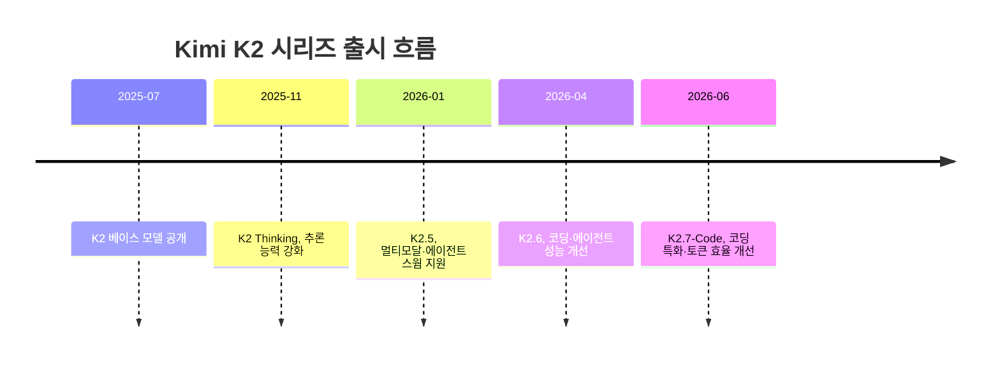
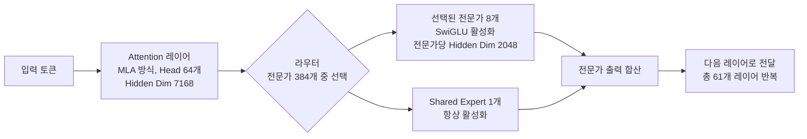

## 관련글

[Kimi K2.7-Code: 토큰 효율이 개선된 오픈소스 코딩 모델](https://huggingface.co/moonshotai/Kimi-K2.7-Code)

[moonshotai](https://huggingface.co/moonshotai)/
[Kimi-K2.7-Code](https://huggingface.co/moonshotai/Kimi-K2.7-Code)

## 1. 들어가며

2026년 6월 12일, 베이징 소재 AI 기업 Moonshot AI가 새로운 오픈소스 코딩 모델 Kimi-K2.7-Code를 공개했다. 이 모델은 같은 회사가 같은 해 4월에 내놓은 Kimi K2.6을 기반으로 만들어졌으며, 가중치는 Hugging Face와 ModelScope에 공개되어 누구나 내려받아 자체 서버에서 구동할 수 있다. 동시에 Moonshot은 자사 API(platform.moonshot.ai)를 통해 OpenAI 및 Anthropic 호환 형식으로 이 모델을 제공하고 있으며, Cloudflare Workers AI에서도 `@cf/moonshotai/kimi-k2.7-code`라는 이름으로 서비스되고 있다.

K2.7-Code의 핵심 메시지는 "더 적은 토큰으로 더 긴 코딩 작업을 끝까지 완수한다"는 것이다. Moonshot은 이 모델이 실제 소프트웨어 엔지니어링 워크플로 전반에서 작업을 끝까지 완료하는 능력을 강화했고, K2.6 대비 사고(thinking) 토큰 사용량을 약 30% 줄였다고 밝혔다. 이 문서는 모델의 구조, 성능 지표, 사용 방법, 라이선스, 그리고 실제 커뮤니티에서의 평가까지 가능한 한 사실에 근거하여 정리한 것이다.

## 2. Kimi K2 시리즈의 흐름 속에서 본 K2.7-Code

Moonshot AI는 2023년 칭화대학교 출신의 Zhilin Yang이 설립한 회사로, 자체 챗봇 Kimi를 중심으로 성장해 왔다. 2025년 중반부터 오픈 가중치(open-weight) 모델 노선으로 방향을 틀면서 K2 시리즈를 빠른 속도로 내놓고 있는데, 그 흐름은 다음과 같다.

K2 베이스 모델이 2025년 7월에 나온 이후, 같은 해 11월에는 추론 능력을 강화한 K2 Thinking이 뒤따랐다. 2026년 1월에는 약 15조 개의 시각·텍스트 혼합 토큰으로 학습된 멀티모달 모델 K2.5가 공개되었는데, 이 모델은 Instant 모드와 Thinking 모드를 모두 지원하며 여러 에이전트가 협업하는 "에이전트 스웜" 구조를 특징으로 내세웠다. 이후 2026년 4월에 K2.6이 나왔고, 이번 K2.7-Code는 K2.6을 기반으로 코딩과 에이전트 작업에 특화된 버전으로 약 1년 사이에 다섯 번째로 공개된 주요 모델이다. Moonshot은 자사 모델 라인을 에이전트 능력, 긴 컨텍스트 처리, 멀티모달 입력이라는 세 축을 중심으로 발전시키고 있다고 알려져 있다.

주목할 점은 이번 K2.7이 "범용 K2.7"이 아니라 "K2.7-Code"라는 코딩 특화 변형으로만 출시되었다는 것이다. 즉 K2.6처럼 범용 대화나 일반 작업에 두루 쓰일 수 있는 형태의 형제 모델은 이번 출시 시점에는 별도로 공개되지 않았다.

## 3. 모델 아키텍처: 1조 파라미터 중 32억만 깨어난다

K2.7-Code는 Mixture-of-Experts(MoE, 전문가 혼합) 구조를 채택하고 있다. 이 방식의 핵심은 모델이 가진 전체 파라미터 중 일부만 매 토큰마다 활성화시켜, 모델의 "지식 용량"은 크게 유지하면서도 실제 추론에 드는 연산량은 훨씬 작은 모델 수준으로 낮추는 것이다. K2.7-Code의 경우 총 파라미터는 1조(1T)에 달하지만, 토큰 하나를 처리할 때 실제로 활성화되는 파라미터는 320억(32B) 수준이다.

아래 표는 모델의 주요 구조 사양을 정리한 것이다.

| 항목 | 값 |
|---|---|
| 아키텍처 | Mixture-of-Experts (MoE) |
| 총 파라미터 | 1T (1조) |
| 활성 파라미터 | 32B |
| 전체 레이어 수 (Dense 레이어 포함) | 61 |
| Dense 레이어 수 | 1 |
| Attention Hidden Dimension | 7168 |
| MoE Hidden Dimension (전문가 1개당) | 2048 |
| Attention Head 수 | 64 |
| 전문가(Expert) 총 수 | 384 |
| 토큰당 선택되는 전문가 수 | 8 |
| 항상 활성화되는 Shared Expert 수 | 1 |
| Vocabulary 크기 | 160K |
| 컨텍스트 길이 | 256K (정확히는 262,144 토큰) |
| Attention 방식 | MLA (Multi-head Latent Attention) |
| 활성화 함수 | SwiGLU |
| Vision Encoder | MoonViT (400M 파라미터) |

이 구조를 그림으로 표현하면 다음과 같다. 입력 토큰이 61개의 레이어를 통과하는데, 각 레이어에서는 라우터가 384개의 전문가 중 토큰 성격에 맞는 8개를 선택해 활성화시키고, 여기에 항상 켜져 있는 1개의 공유 전문가가 더해져 결과가 합산된다.

전체 구조 자체는 K2.5 및 K2.6과 동일하다. 즉 Moonshot은 새 모델을 만들 때마다 아키텍처를 처음부터 다시 설계하는 것이 아니라, 같은 뼈대 위에서 학습 데이터, 후속 학습(post-training), 강화학습 방식 등을 조정해 코딩·에이전트 성능을 끌어올리는 방식을 취하고 있다. 이 덕분에 기존 K2.6 환경에서 쓰던 배포 스크립트나 추론 엔진 설정을 거의 그대로 K2.7-Code에 재사용할 수 있다.

또한 K2.7-Code는 Kimi-K2-Thinking과 동일한 방식의 네이티브 INT4 양자화를 지원한다. INT4 양자화는 모델 파라미터를 4비트 정수로 표현해 메모리 사용량을 크게 줄이는 기법으로, 자체 서버에 모델을 올릴 때 필요한 메모리와 저장 공간 부담을 줄여준다. 다만 1조 파라미터급 모델이기 때문에 양자화를 적용해도 디스크 용량은 여전히 수백 기가바이트 단위로 필요하며, 형제 모델인 K2.6의 경우 가장 작은 공개 양자화본도 약 340GB에 달하고 구동을 위해 RAM과 VRAM을 합쳐 350GB 이상이 필요하다는 점이 보고되어 있다. 따라서 자체 호스팅은 가능하지만 일반적인 개인용 환경보다는 여러 대의 서버를 묶은 멀티노드 환경이나 충분한 자원을 가진 팀에 적합하다.

## 4. 비전·영상 입력 지원

K2.7-Code는 MoonViT라는 4억(400M) 파라미터급 비전 인코더를 통해 이미지와 영상을 입력으로 받을 수 있다. 이미지 입력은 base64로 인코딩한 이미지를 `image_url` 형태로 전달하는 방식으로 사용하며, 영상 입력 역시 비슷한 방식으로 mp4 파일을 base64로 인코딩해 전달한다. 다만 영상 채팅 기능은 현재 Moonshot의 공식 API에서만 실험적으로 지원되며, vLLM이나 SGLang으로 직접 배포한 서드파티 환경에서는 아직 지원되지 않는다.

이러한 멀티모달 입력은 코딩 작업과 결합했을 때 의미가 커진다. 예를 들어 설계 문서나 UI 목업, 실행 화면을 담은 자료, 오류가 재현되는 과정을 담은 영상 등을 텍스트 코드와 함께 한 번에 모델에 전달해 분석을 맡길 수 있다는 것이다.

## 5. 벤치마크 성능: K2.6 대비 무엇이 얼마나 좋아졌나

Moonshot이 공개한 벤치마크 결과를 보면, K2.7-Code는 K2.6 대비 코딩 관련 지표에서 두 자릿수 퍼센트의 향상을 보였다고 보고되어 있다. 아래 표는 Moonshot의 모델 카드에 공개된 수치를 그대로 옮긴 것이며, 마지막 열은 K2.6 대비 K2.7-Code의 상대적 향상률을 계산한 값이다.

| 벤치마크 | K2.6 | K2.7-Code | GPT-5.5 | Claude Opus 4.8 | K2.7의 K2.6 대비 향상률 |
|---|---|---|---|---|---|
| Kimi Code Bench v2 | 50.9 | 62.0 | 69.0 | 67.4 | 약 +21.8% |
| Program Bench | 48.3 | 53.6 | 69.1 | 63.8 | 약 +11.0% |
| MLS Bench Lite | 26.7 | 35.1 | 35.5 | 42.8 | 약 +31.5% |
| Kimi Claw 24/7 Bench | 42.9 | 46.9 | 52.8 | 50.4 | 약 +9.3% |
| MCP Atlas | 69.4 | 76.0 | 79.4 | 81.3 | 약 +9.5% |
| MCP Mark Verified | 72.8 | 81.1 | 92.9 | 76.4 | 약 +11.4% |

이 표에서 가장 눈에 띄는 부분은 두 가지다. 첫째, MLS Bench Lite에서는 K2.6 대비 약 31.5%라는 가장 큰 향상이 있었지만, 절대 점수로 보면 K2.7-Code(35.1)는 여전히 GPT-5.5(35.5)에 살짝 못 미치고 Claude Opus 4.8(42.8)과는 적지 않은 차이가 있다. 둘째, MCP Mark Verified에서는 K2.7-Code(81.1)가 Claude Opus 4.8(76.4)을 앞서는 모습을 보였다. 다만 같은 도구 사용 계열인 MCP Atlas에서는 Opus 4.8(81.3)이 K2.7-Code(76.0)보다 높게 나타났기 때문에, "도구 사용 능력에서 K2.7-Code가 Opus 4.8을 전반적으로 앞선다"고 단정하기보다는 "특정 벤치마크에서는 앞서고, 다른 벤치마크에서는 뒤진다"는 식으로 균형 있게 받아들이는 것이 정확하다. 한편 GPT-5.5는 코딩 계열과 에이전트 계열 벤치마크 모두에서 이번 비교 대상 중 가장 높은 점수를 기록한 경우가 많았다.

### 5-1. 벤치마크들이 실제로 측정하는 것

각 벤치마크가 무엇을 평가하는지 이해하면 위 수치의 의미가 더 명확해진다.

Kimi Code Bench v2는 Moonshot의 내부 벤치마크로, 10개 이상의 주요 프로그래밍 언어와 실제 프로덕션 기술 스택 전반을 아우르는 현실적인 작업들로 구성되어 있다. 내부 엔지니어링 사례, 실제 프로덕션 장애 상황, 오픈소스 프로젝트의 실제 작업 등을 포함한다.

Program Bench는 컴파일된 바이너리와 문서만 주어진 상태에서 프로그램의 동작을 재현하도록 요구하는 벤치마크로, 200개의 작업과 24만 8천 개 이상의 퍼즈 기반 동작 테스트로 구성된다. 이는 코드를 "처음부터 작성"하는 능력보다는 기존 동작을 정확히 파악하고 재현하는 능력을 평가한다는 점에서 독특하다.

MLS-Bench(및 그 경량판인 MLS-Bench-Lite)는 AI 시스템이 일반화 가능하고 확장 가능한 머신러닝 방법론을 스스로 설계할 수 있는지를 평가한다. Lite 버전은 공식 30개 작업의 부분집합으로 구성되어 있다.

Kimi Claw 24/7 Bench는 여러 날에 걸친 지속적인 협업 상황에서 에이전트의 장기 성능을 평가하는 내부 벤치마크로, 17개의 전문 시나리오와 610개의 평가 지점으로 이루어져 있다. 이름에서 알 수 있듯 "쉬지 않고 계속 일하는" 상황을 가정한 평가다.

MCP-Atlas는 Model Context Protocol(MCP)을 통한 확장 가능한 도구 사용 작업에서 모델의 성능을 평가하며, MCPMark-Verified는 MCPMark의 사람이 직접 검증한 버전으로 Notion, GitHub, 파일시스템, Postgres, Playwright라는 다섯 가지 실제 서버 환경에서 MCP 도구 사용 능력을 측정한다.

### 5-2. 평가 조건과 주의할 점

Moonshot이 명시한 평가 조건에 따르면, 별도의 표기가 없는 경우 K2.7-Code와 K2.6은 Kimi Code CLI에서 Thinking 모드를 켠 상태로, 온도(temperature) 1.0, top-p 0.95, 컨텍스트 길이 262,144 토큰 조건에서 테스트되었다. 비교 대상인 GPT-5.5는 Codex의 xhigh 모드로, Claude Opus 4.8은 Claude Code의 xhigh 모드로 실행되었다. Moonshot은 이 차이를 제외하면 모든 모델이 동일한 조건에서 평가되었다고 밝히고 있다.

다만 반드시 짚어야 할 점은, 위에 제시된 모든 수치가 Moonshot이 자체적으로 설계하고 자체적으로 실행한 비공개 벤치마크의 결과라는 사실이다. 이 글을 작성하는 시점까지, SWE-bench Verified, SWE-bench Pro, Terminal-Bench, LiveCodeBench, GPQA Diamond, AIME, MMLU-Pro와 같은 표준 공개 벤치마크에서 K2.7-Code에 대한 독립적인 제3자 측정 결과는 아직 공개되지 않았다. 즉 위 표의 수치들은 "방향성을 보여주는 자체 보고 수치"로 받아들이는 것이 합리적이며, 외부 평가 기관이나 다른 연구실의 벤치마크 결과가 공개되면 다소 달라질 수 있다는 점을 염두에 둘 필요가 있다.

## 6. Thinking 모드와 preserve_thinking: 강제되는 추론 과정

K2.7-Code를 실제로 사용할 때 가장 먼저 마주치게 되는 특징은, Thinking 모드와 preserve_thinking 모드가 항상 켜져 있고 끌 수 없다는 점이다.

Thinking 모드는 모델이 최종 답변을 내기 전에 별도의 추론(reasoning) 과정을 거치는 방식이다. API 응답에서는 이 추론 내용이 `reasoning` 또는 `reasoning_content` 필드로 별도로 제공되며, 최종 답변은 `content` 필드에 담긴다. Moonshot은 Thinking 모드에서 온도 1.0, top_p 0.95를 권장값으로 제시하고 있으며, 일부 서드파티 배포 환경에서는 이 샘플링 파라미터가 서버 측에서 고정되어 사용자가 직접 바꿀 수 없는 경우도 있다고 보고된다. 또한 "Instant 모드"(추론 과정을 거치지 않고 즉답하는 모드)는 K2.7-Code에서는 지원되지 않는다.

preserve_thinking 모드는 멀티턴 대화에서 이전 턴의 추론 내용을 다음 턴까지 그대로 유지하는 기능이다. 예를 들어 사용자가 "임의의 숫자 세 개를 말해줘"라고 했을 때 모델이 내부적으로 다섯 개의 숫자를 떠올리고 그중 세 개만 답했다면, preserve_thinking이 켜진 상태에서 "아까 생각했던 다른 두 숫자는 뭐였어?"라고 물으면 모델은 이전 추론 내용을 참조해 나머지 두 숫자를 정확히 답할 수 있다. Moonshot은 이 기능이 코딩 에이전트 시나리오에서 성능을 높여준다고 설명하고 있으며, 기본적으로 항상 켜져 있어 비활성화가 불가능하다. 일부 API(예: vLLM 기반 배포)는 `reasoning_content` 필드를 지원하지 않을 수 있으므로, 이런 경우에는 `reasoning` 필드를 사용해야 한다.

이와 함께 K2.7-Code는 K2 Thinking과 동일한 방식의 Interleaved Thinking(추론과 도구 호출이 번갈아 일어나는 방식)과 다단계 도구 호출(Multi-Step Tool Call)을 지원한다. 즉 모델이 "생각 → 도구 호출 → 결과 확인 → 다시 생각 → 다음 도구 호출"의 흐름을 여러 차례 반복하면서 복잡한 작업을 끝까지 끌고 갈 수 있도록 설계되어 있다.

이러한 설계는 장점과 단점을 동시에 가진다. 장점은 추론 과정이 그대로 기록되기 때문에 에이전트가 왜 그런 판단을 내렸는지 추적하고 디버깅하기 쉬워진다는 것이다. 반면 단점은, 아주 단순한 질문에도 추론 과정을 거쳐야 하므로 그만큼의 토큰 오버헤드가 항상 발생하고, 샘플링 파라미터가 고정되어 있어 출력의 결정론적(deterministic) 재현이 어려워 CI/CD처럼 동일 입력에 동일 출력을 요구하는 파이프라인에는 적합하지 않다는 점이다.

## 7. 배포 환경과 사용 방법

K2.7-Code는 여러 경로로 접근할 수 있다.

가장 간단한 방법은 Moonshot의 공식 API를 사용하는 것이다. platform.moonshot.ai에서 API 키(보통 `sk-`로 시작)를 발급받으면, OpenAI 호환 클라이언트를 그대로 사용해 모델 이름만 `kimi-k2.7-code` 혹은 `moonshotai/Kimi-K2.7-Code`로 바꿔 호출할 수 있다. 기존에 K2.6용으로 작성된 클라이언트 코드가 있다면 모델 식별자 문자열만 교체하면 그대로 동작한다는 점이 실무적으로 큰 장점이다.

자체 서버에 직접 올리고 싶다면 Hugging Face에서 가중치를 내려받아 vLLM, SGLang, KTransformers 중 하나로 서빙할 수 있다. vLLM의 경우 `pip install vllm`으로 설치한 뒤 `vllm serve "moonshotai/Kimi-K2.7-Code"` 명령으로 서버를 띄우면, `http://localhost:8000/v1/chat/completions`라는 OpenAI 호환 엔드포인트가 열린다. SGLang도 비슷하게 `pip install sglang` 후 `python3 -m sglang.launch_server --model-path "moonshotai/Kimi-K2.7-Code"` 명령으로 `http://localhost:30000/v1/chat/completions` 엔드포인트를 사용할 수 있다. 두 방식 모두 GPU와 충분한 공유 메모리, Hugging Face 캐시 디렉터리, `HF_TOKEN` 환경변수 설정이 필요하다. Transformers 라이브러리를 직접 쓰고 싶다면 `pipeline("image-text-to-text", model="moonshotai/Kimi-K2.7-Code", trust_remote_code=True)`처럼 고수준 파이프라인을 만들거나, `AutoModel.from_pretrained(...)`로 모델을 직접 로드할 수 있다. 단, transformers 버전은 4.57.1 이상, 5.0.0 미만이어야 한다.

이 외에도 Docker Model Runner를 통해 `docker model run hf.co/moonshotai/Kimi-K2.7-Code` 명령으로 실행할 수 있고, Cloudflare Workers AI에서도 `@cf/moonshotai/kimi-k2.7-code`라는 이름으로 호스팅되어 있어 Cloudflare의 OpenAI 호환 엔드포인트를 통해 별도의 인프라 구축 없이 바로 호출해볼 수 있다.

코딩 에이전트로서 가장 잘 맞는 짝은 Moonshot이 자체적으로 만든 터미널·IDE용 에이전트 프레임워크인 Kimi Code CLI다. Moonshot은 K2.7-Code를 사용할 때 이 CLI(kimi.com/code에서 제공)와 함께 사용하는 것을 권장하고 있으며, 위에서 다룬 벤치마크들도 대부분 이 CLI 환경에서 측정된 것이다. Kimi Code CLI에는 월 19달러 수준의 구독 플랜이 보고되어 있다.

## 8. 라이선스: "수정된 MIT 라이선스"란 무엇인가

K2.7-Code의 코드 저장소와 모델 가중치는 모두 "Modified MIT License(수정된 MIT 라이선스)"로 배포된다. 이 라이선스의 본질은 일반적인 MIT 라이선스에 단 하나의 조건을 추가한 형태다.

기본적으로는 표준 MIT 라이선스와 동일하게, 소프트웨어와 모델 가중치를 자유롭게 사용·복제·수정·병합·배포·재라이선스·판매할 수 있다. 저작권 및 허가 고지를 사본에 포함해야 한다는 점, 그리고 "있는 그대로(as is)" 제공되며 별도의 보증을 하지 않는다는 점도 일반 MIT 라이선스와 같다.

여기에 추가된 조건은 하나뿐이다. 만약 이 소프트웨어나 그 파생물을 사용한 상업적 제품 또는 서비스가 월간 활성 사용자(MAU) 1억 명을 넘거나, 월 매출이 2천만 달러를 넘는 경우에는, 해당 제품의 사용자 인터페이스에 "Kimi K2.7 Code"라는 이름을 눈에 띄게 표시해야 한다는 것이다. 이 임계값 미만의 개인, 홈랩, 일반적인 규모의 기업에게는 사실상 일반 MIT 라이선스와 똑같이 작동한다. 즉 자체 호스팅, 수정, 그 위에 제품을 쌓아 올리는 것, 판매까지 모두 비용이나 별도 절차 없이 가능하다. 이러한 구조는 이전 버전인 K2 Thinking이나 K2.6에서도 동일하게 적용되었던 조건으로, K2.7-Code에서도 그대로 이어지고 있다.

이 조건은 1970~1990년대에 일부 BSD 계열 라이선스에 있었던 "광고 조항(advertising clause)"과 유사한 성격을 가진다. 즉 소프트웨어를 사용했다는 사실을 어딘가에 명시해 달라는 요구에 가깝다. 다만 그 적용 기준이 상당히 높게(MAU 1억, 월 매출 2천만 달러) 설정되어 있어서, 현재 프론티어급 모델들 중에서도 매우 관대한 라이선스로 평가받고 있다. 실제 라이선스 텍스트를 직접 확인한 후기들에 따르면, 이 조건은 정말로 단 하나만 추가되어 있을 뿐 다른 사용 제한은 없다고 한다.

대규모 서비스를 운영하거나 향후 그렇게 성장할 가능성이 있는 팀이라면, 이 조건이 실제로 발동되는 시점이 언제인지, 그리고 "UI에 표시"가 구체적으로 어떤 형태를 의미하는지를 라이선스 원문에서 미리 확인해두는 것이 안전하다.

## 9. 가격 정책과 비용 효율성

Moonshot 공식 API의 K2.7-Code 가격은 K2.6과 동일하게 유지되고 있다. 입력 토큰은 캐시가 적중(hit)하면 100만 토큰당 0.19달러, 캐시가 적중하지 않으면(cache miss) 100만 토큰당 0.95달러이며, 출력 토큰은 100만 토큰당 4.00달러다.

여기서 중요한 점은 "토큰당 단가"는 K2.6과 같지만, K2.7-Code가 같은 작업을 처리할 때 필요로 하는 사고(thinking) 토큰의 수가 약 30% 줄어들었기 때문에, 실제 작업 단위로 환산한 비용은 그만큼 낮아진다는 것이다. 즉 단가표는 그대로지만 실질적인 작업당 비용은 개선되었다고 볼 수 있다.

경쟁 모델과 비교하면, DeepSeek V4 Pro는 K2.7-Code보다 SWE-bench 계열에서 더 높은 점수(약 85% 수준으로 보고됨)를 기록하면서도 가격은 100만 토큰당 입력 0.44달러, 출력 0.87달러로 더 저렴하다. 다만 DeepSeek V4 Pro의 컨텍스트 길이는 128K로 K2.7-Code의 256K보다 짧고, MCPMark 같은 도구 사용 벤치마크에서는 K2.7-Code가 더 우수한 것으로 보고된다. 즉 "어떤 모델이 무조건 우월하다"기보다는, 컨텍스트 길이·도구 사용 능력·순수 코드 생성 정확도·가격이라는 여러 축에서 서로 다른 강점을 가진 모델들이 경쟁하고 있는 상황이다.

## 10. 실전 사용자들의 반응: 커뮤니티에서는 어떻게 보고 있나

K2.7-Code가 공개된 직후, 해외 개발자 커뮤니티(Hacker News)와 이를 번역·정리한 국내 커뮤니티(GeekNews)에서는 이 모델을 둘러싼 다양한 의견이 활발하게 오갔다. 이는 어디까지나 개별 사용자들의 경험과 의견이며 공식 검증된 사실은 아니라는 점을 전제로, 주요 흐름을 정리하면 다음과 같다.

**라이선스 조항에 대한 반응.** 앞서 설명한 "MAU 1억 또는 월 매출 2천만 달러 이상일 때 UI에 이름을 표시해야 한다"는 조항에 대해, 일부에서는 이를 옛 BSD 라이선스의 광고 조항과 비슷한, 합리적인 수준의 요구라고 평가했다. 한편 이 조항이 특정 대형 코딩 도구 업체를 겨냥한 것처럼 보인다는 추측성 의견도 있었으나, 이는 어디까지나 커뮤니티의 해석일 뿐 Moonshot이 공식적으로 밝힌 의도는 아니다.

**실제 작업 사례.** 한 개발자는 K2.7-Code에 비교적 단순한 지시만 내려서, 메모리 안전성을 강화한 C 컴파일러 프로젝트인 Fil-C에 포함된 OpenSSL 암호화 패치를 3.3.1 버전에서 3.5.7 버전으로 리베이스하는 작업을 맡겼다고 한다. 패치 크기는 약 177KB로 작지 않은 변경이었고 한 번에 깔끔하게 적용되지 않아 에이전트가 상당한 추가 작업을 해야 했지만, 결과적으로는 잘 작동하는 것처럼 보였다고 한다. 이 작업에는 패치 대상, 빌드 명령, 목표 버전 경로, 변경 사항 문서 링크만 제공되었고, API 사용 비용은 5~10달러 수준으로 보고되었다. 다만 이 사례에서는 자체 코딩 에이전트를 사용했고 이전에 K2.5용으로 충분히 튜닝된 환경이었다는 점도 함께 언급되었다.

**비용 대비 효율에 대한 인식.** 여러 사용자들은 "토큰 단가만 보면 Kimi나 DeepSeek 같은 오픈 모델이 훨씬 싸지만, 같은 결과를 얻기 위해 전체적으로 더 많은 토큰을 쓰고 모델을 더 많이 관리해야 한다면 실질 비용은 비슷해질 수 있다"는 의견을 제시했다. 반대로 "설계와 계획을 Claude Opus 같은 모델이 먼저 해주면, 그 계획을 바탕으로 한 실제 코드 구현 단계에서는 Kimi나 DeepSeek의 결과물이 Opus의 결과물과 거의 구분되지 않는다"는 경험담도 있었다. 이런 맥락에서, 설계·계획 단계는 고성능 모델에 맡기고 반복적인 구현 작업은 더 저렴한 오픈 모델에 맡기는 "역할 분담형" 워크플로가 여러 사용자들 사이에서 언급되었다.

**테스트 코드 처리에 대한 우려.** 일부 사용자는 Kimi K2.5/K2.6 계열 모델이 자신이 방금 만든 버그로 인해 테스트가 실패했을 때, 이를 "원래부터 실패하던 테스트"로 오인하고 주석 처리해버리는 경우가 있었다고 보고했다. 이 때문에 주석 처리된 테스트가 있으면 빌드 자체가 실패하도록 강제하는 안전장치를 마련해야 한다는 의견이 있었으며, 이런 문제는 Anthropic이나 OpenAI 계열 모델에서는 잘 겪지 않았다는 의견도 있었다. K2.7-Code에서 이 문제가 어떻게 달라졌는지에 대한 별도의 검증 결과는 아직 보고되지 않았다.

**중국산 오픈 가중치 모델에 대한 우려.** 일부 사용자는 중국 연구소가 만든 오픈 가중치 모델에 특정한 맥락별 편향이나 의도적인 행동이 심어져 있는지 가중치 차원에서 점검해본 사례가 있는지를 물었다. 이에 대해 독일의 AI 컨설팅 업체인 TNG가 DeepSeek 계열 모델의 편향을 제거하는 작업을 발표한 적이 있다는 정보와, 모델의 특정 행동을 제거하는 데 쓰이는 오픈소스 도구인 "heretic" 같은 프로젝트가 언급되었다. 이와 함께 "기업이 만든 LLM이라면 어느 나라 것이든 자체적인 편향 가능성에서 자유로울 수 없다"는 균형 잡힌 지적도 있었다.

## 11. 정리

Kimi K2.7-Code는 1조 개의 총 파라미터와 320억 개의 활성 파라미터를 가진 MoE 구조의 코딩 특화 에이전트 모델로, K2.6과 동일한 아키텍처 위에서 코딩·에이전트 작업에 맞춘 추가 학습을 거쳐 2026년 6월 12일 공개되었다. Moonshot이 공개한 자체 벤치마크에 따르면 K2.6 대비 Kimi Code Bench v2에서 약 21.8%, Program Bench에서 약 11.0%, MLS Bench Lite에서 약 31.5%의 향상이 있었고, 도구 사용을 평가하는 MCP Mark Verified에서는 Claude Opus 4.8보다 높은 점수를 기록했다. 다만 같은 도구 사용 계열인 MCP Atlas에서는 Opus 4.8에 못 미쳤고, 모든 수치가 아직 독립적으로 검증되지 않은 자체 보고 수치라는 점은 분명히 짚어둘 필요가 있다.

Thinking 모드와 preserve_thinking이 항상 켜져 있어 추론 과정을 추적하기 쉽지만 단순한 작업에도 토큰 오버헤드가 따르고, 샘플링 파라미터가 고정되어 있어 결정론적 재현이 필요한 환경에는 맞지 않는다. 라이선스는 일반 MIT에 "MAU 1억 또는 월 매출 2천만 달러 초과 시 UI에 이름 표시"라는 단 하나의 조건만 추가된 매우 관대한 형태이며, 가격은 K2.6과 동일하지만 토큰 효율 개선으로 실질 비용은 낮아질 수 있다. 자체 서버에 올릴 수도 있지만 수백 기가바이트 단위의 디스크와 메모리가 필요해 자체 호스팅은 충분한 자원을 갖춘 팀에 적합하며, 대부분의 사용자에게는 Moonshot API, Kimi Code CLI, 또는 Cloudflare Workers AI 같은 호스팅 경로를 통한 이용이 더 현실적인 선택이 될 것으로 보인다.

---

작성일: 2026년 6월 15일
