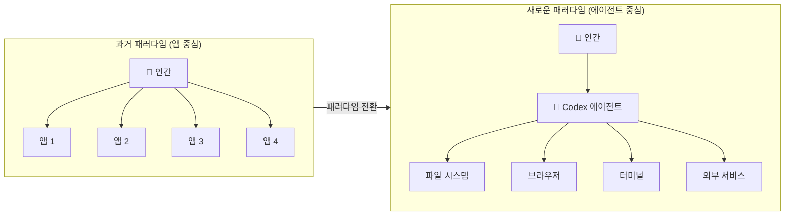
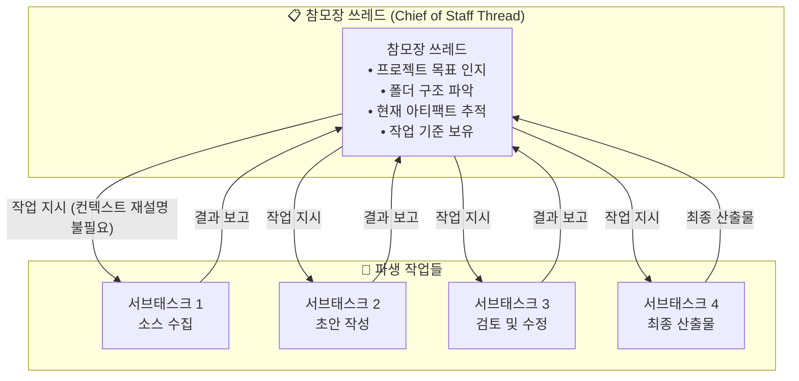
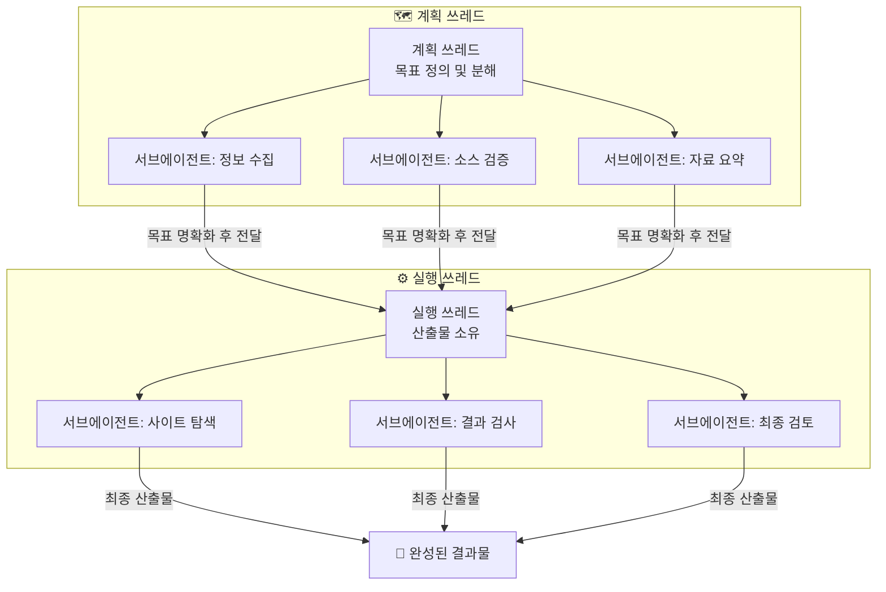
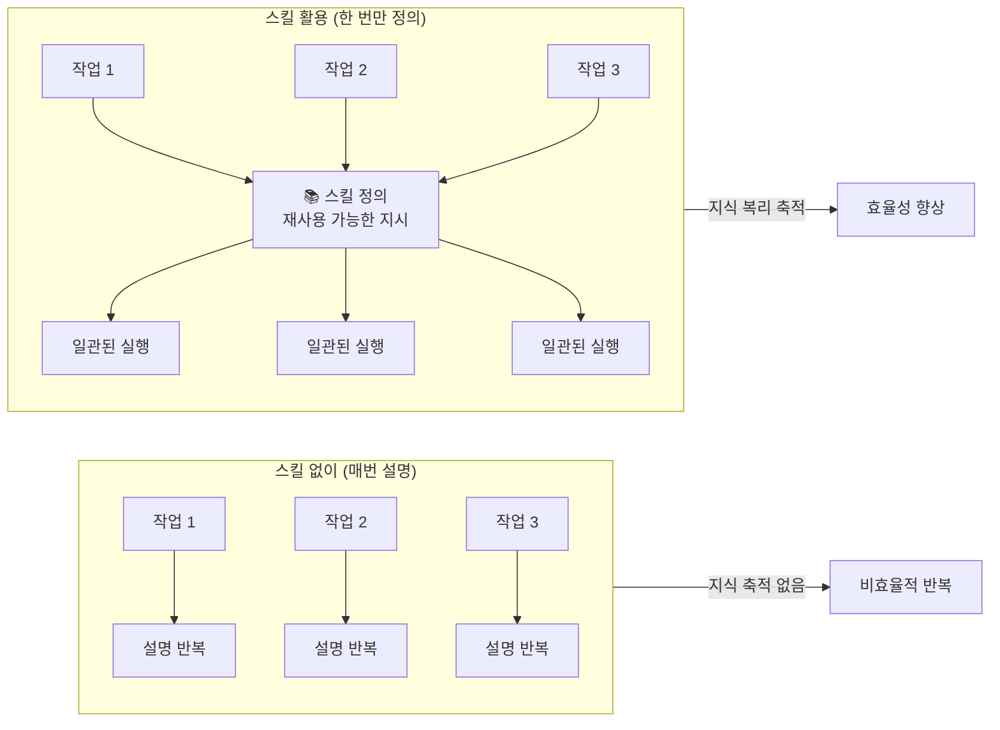
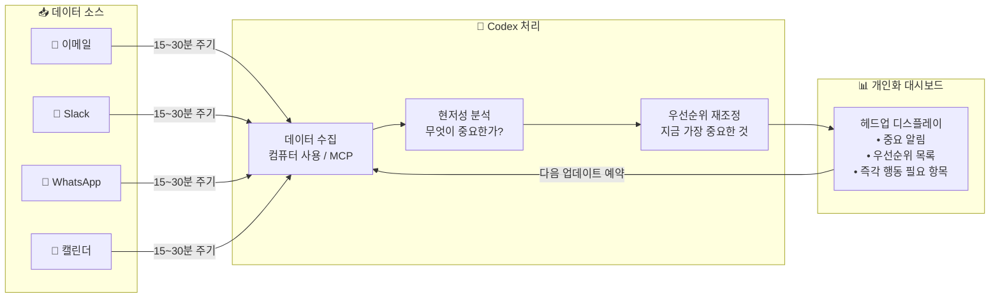
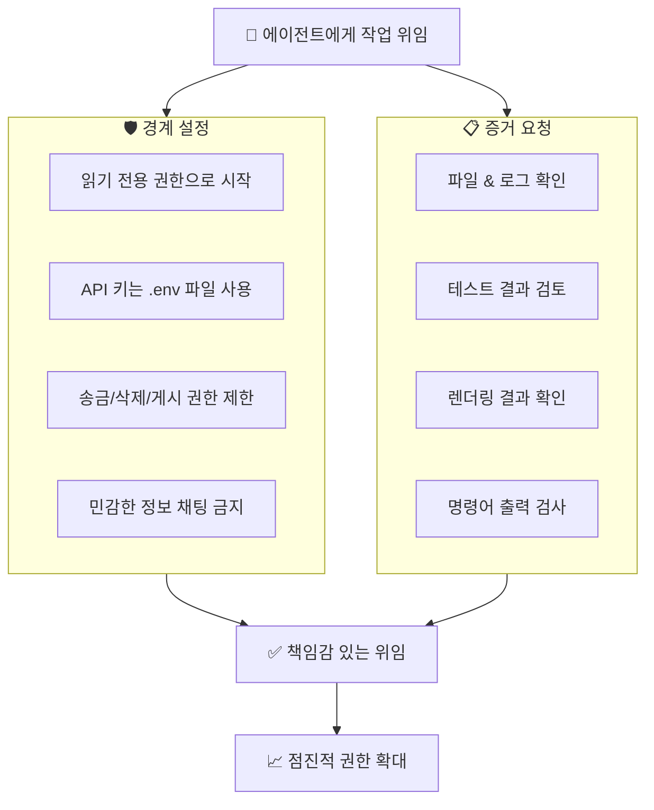
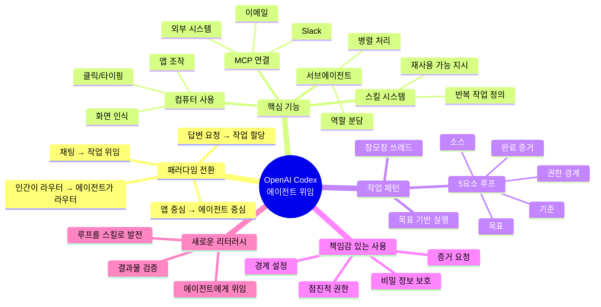

> **원본 영상**: ["Codex: Your First Personal AI Agent Delegation Loop"](https://www.youtube.com/watch?v=xqGCbEDbny8) — Nate B. Jones (AI News & Strategy Daily)  
> **게시일**: 2026년 6월 12일  
> **채널**: [@NateBJones](https://www.youtube.com/@NateBJones)  
> **영상 길이**: 약 19분 30초

---

## 들어가며: 이 영상이 말하는 것

이 영상은 "OpenAI Codex가 코딩 도구를 넘어서 지식 노동자 모두를 위한 컴퓨터 운영 방식 자체를 바꾸고 있다"는 주장을 중심으로 전개된다. 발표자 Nate B. Jones는 미국 시애틀 기반의 AI 전략 전문가이자 유튜버로, 자신의 실제 업무 경험을 바탕으로 Codex가 왜 단순한 채팅 AI와 근본적으로 다른지를 설명한다.

영상은 개발자 전용 도구처럼 보이는 Codex의 이름이 주는 오해를 정면으로 반박하면서 시작된다. Nate는 "Codex라는 이름은 나쁜 작명이다. 솔직히 말하면 개발자 도구처럼 들린다. 하지만 그건 개발자만을 위한 도구가 아니다"라고 말하며, 글 쓰는 사람, 연구자, 문서 작업자, 소규모 사업자, 프로젝트 매니저 등 컴퓨터 위에서 작업하는 모든 사람에게 해당되는 도구임을 강조한다.

이 문서는 영상의 전체 내용을 챕터별로 상세히 풀어내고, 주요 개념들을 충분히 이해할 수 있도록 보충 설명을 덧붙인다.

---

## 배경 지식: OpenAI Codex란 무엇인가

이 영상에서 말하는 "Codex"는 2021~2023년에 사용되던 구형 OpenAI Codex 언어 모델(GitHub Copilot의 기반이 되었던 모델)과는 전혀 다른 도구다. 현재의 Codex는 2025년 5월 16일 연구 미리보기(Research Preview)로 출시된 **클라우드 기반 소프트웨어 엔지니어링 에이전트**이며, 2026년 2월에는 macOS용 데스크탑 앱, 2026년 3월 4일에는 Windows 버전까지 출시되었다.

Codex는 처음에는 GPT-4 계열 모델에서 시작하여 이후 codex-1(o3 기반), GPT-5.3-Codex, GPT-5.4 Codex 등 지속적으로 새로운 모델이 탑재되었다. Nate의 영상이 공개된 2026년 6월 시점에서 그는 GPT-5.5 기반 Codex 모델을 사용하고 있다고 언급한다. 이 기간 동안 Codex의 주간 활성 사용자 수는 2026년 3월 200만 명, 4월 8일 300만 명을 넘어서며 빠르게 성장하고 있다.

Codex는 ChatGPT 구독 플랜에 통합되어 제공되며, 현재 기준으로 Plus($20/월), Pro 5x($100/월), Pro 20x($200/월) 등의 구독 등급이 존재한다. Nate는 영상에서 "Codex Max 계정"을 언급하는데, 이는 최고 사용량 등급의 플랜을 의미한다.

---

## 챕터 1: Codex는 컴퓨터를 다르게 느끼게 만든다

영상의 첫 문장은 강렬하다. "나는 지금 마치 어린아이가 새 PlayStation을 받았을 때처럼 Codex에 완전히 빠져 있다. 사람들을 붙잡고 '아니, 이게 방금 뭘 했는지 봐야 해'라고 말하고 싶다."

Nate가 흥분하는 이유는 Codex가 단순히 더 나은 AI 답변을 주기 때문이 아니다. 그에 따르면 Codex는 컴퓨터를 **다르게 느끼게** 만든다. 그는 이렇게 설명한다. Codex는 자신의 파일에 접근하고, 브라우저를 조작하고, 폴더를 열고, 초안과 스크린샷을 읽고, 평소에는 자신이 손으로 하나씩 연결해야 했던 모든 시스템들을 관통해 움직인다. 그렇게 되니 자신의 토큰 사용 대시보드가 폭발적으로 늘어났는데, 더 많이 채팅을 해서가 아니라 Codex에게 더 큰 작업을 넘기고 있기 때문이라는 것이다.

그가 강조하는 핵심적인 변화는 바로 이것이다.

> "Codex 이전에는 나의 AI 사용이 여전히 채팅처럼 보였다. '이것을 초안으로 써줘, 요약해줘, 정리해줘, 생각 정리에 도움을 줘.' 유용했지만 여전히 기본적으로는 내가 도움을 요청하는 것이었다. Codex와 함께라면 나는 다른 무언가를 하기 시작했다. 나는 컴퓨터에 **일을 맡기기** 시작했다."

여기서 그가 말하는 "일을 맡기는" 것의 예시는 다음과 같다. 트랜스크립트를 찾아와, 폴더를 읽어, 버전을 비교해, Word 파일을 렌더링해, 제대로 열리는지 확인해, 브라우저를 열어서 사이트를 사용해, 내가 실제로 검토할 만한 무언가가 생길 때까지 계속 작업해. 이런 식의 지시가 가능하다는 것이다.

### Codex라는 이름이 주는 오해

Nate는 명시적으로 경고한다. "이 도구를 사용하지 않고 있다면, 그 이유가 'Codex라는 단어가 코드처럼 들려서'라면, 바로 그것이 당신이 이 영상을 끝까지 봐야 하는 이유다. 이름은 나쁘다."

개발자들이 이 도구를 먼저 발견한 이유는 코딩 환경이 테스트, 파일, 차이(diff), 로그 등 구조적이고 명확한 작업 환경을 갖추고 있어서 Codex가 쉽게 참여할 수 있었기 때문이다. 하지만 Codex가 가르치는 작업 습관은 코드보다 훨씬 더 넓은 범위에 적용된다. 글을 쓰는 사람, 연구하는 사람, 문서나 엑셀 스프레드시트를 만드는 사람, 소규모 사업을 운영하는 사람, 프로젝트를 조직하는 사람, 사이드 프로젝트를 만드는 사람, 콘텐츠를 관리하는 사람, 혹은 하루 종일 앱을 전환하거나 수십 개의 Chrome 탭을 여는 사람 모두에게 해당된다.

---

## 챕터 2: 토큰 대시보드 — 작업의 영수증

Nate는 2026년 5월 20일 하루 동안 자신의 로컬 Codex 로그에서 5억 1000만 토큰이 사용된 것을 확인했다고 말한다. 그는 이것이 이상한 일처럼 들릴 수 있다는 것을 인정하면서도, 이것이 청구 사고 이야기가 아님을 분명히 한다. 그는 Codex Max 계정을 사용하고 있으며, 이 수치에 대해 추가 비용이 발생하지 않았다.

그가 말하려는 핵심은 이것이다. **토큰 수 자체가 목표가 아니라, 토큰 수가 컴퓨터 사용 방식의 변화를 증명한다는 것이다.**

> "내 파일, 내 브라우저 세션, 내 문서, 내 코드, 터미널 출력 — 이 모든 것이 Codex를 통해 처리되고 있다. 앱으로 직접 가면 번거롭다는 느낌이 든다. 수치는 중요하지 않다. 수치가 의미하는 건 컴퓨터 자체가 바뀌고 있다는 것이다."

그는 1년에 걸친 자신의 토큰 소비를 돌아보면서, 가장 큰 행동적 전환이 최근 한 달 사이에 일어났음을 확인했다고 말한다. 특히 컴퓨터 사용(Computer Use) 기능과 GPT-5.5 모델이 Codex에 탑재되면서 한꺼번에 방대한 작업 흐름이 열렸다는 것이다.

그는 이 시점에서 중요한 비유를 제시한다.

> "우리는 수십 년 동안 비트와 바이트로 컴퓨팅해왔다. 이제 우리는 토큰으로 이동하고 있다. 이것은 컴퓨팅 역사에서 가장 큰 전환이다."

요약하자면, 토큰 대시보드는 화려한 숫자를 자랑하기 위한 것이 아니라, 작업 단위가 얼마나 크게 달라졌는지를 보여주는 **영수증**이다. 에이전트에게 더 많은 일을 맡길수록, 컴퓨터 활동이 토큰 활동으로 전환되는 비율이 높아진다.

---

## 챕터 3: 작업 단위가 커진다

Nate는 이전에 AI를 사용하는 방식과 지금의 방식을 명확하게 대비시킨다.

이전에는 AI에게 **답**을 구했다. 이제는 AI에게 **작업을 맡긴다**. 그 차이는 명령어의 성격에 있다.

- 소스 파일을 찾아와라
- 트랜스크립트를 읽어라
- 아티팩트를 만들어라
- 문서를 렌더링해라
- 패키지를 확인해라
- 브라우저를 열어서 검사해라
- 목표가 완료될 때까지 계속 작업해라

이런 명령들이 가능해지면서 "내가 기계에 맡기고 싶은 작업의 규모 자체가 달라졌다"는 것이다. 그는 이것을 "10배 더 똑똑해진 게 아니라, 기계에 넘기려는 작업의 크기가 달라진 것"이라고 표현한다.

그는 컴퓨팅 역사를 짧게 회고한다. DOS 시대에는 코드를 써야 했고, 응용 프로그램(앱)의 등장은 혁명이었다. 문서가 앱이 되었고, 인간은 앱과 앱 사이를 이동했다. 전체 컴퓨팅 경험은 **인간 중심**으로 구축되어 있었다.

그런데 지금은 인간이 앱들 사이를 직접 오가는 대신, 에이전트에게 그 이동을 위임하기 시작했다. 컴퓨터가 에이전트에게도 속하는 느낌이 생겨났다는 것이다. 실제로 Nate는 자신의 컴퓨터가 때때로 시간당 1억 개의 토큰을 처리하느라 다른 작업을 하기 어려울 만큼 점유된다고 말한다. 그러나 그는 이것을 불편이 아니라 이점으로 본다. 에이전트가 10가지 일을 동시에 처리하는 동안 자신은 산책을 다녀올 수 있기 때문이다.

---

## 챕터 4: 새로운 컴퓨팅 패러다임

Nate는 이 전환을 "40년 만의 최초 컴퓨팅 패러다임 변화"라고 부른다. 그는 이것을 다음과 같이 정리한다.

> "우리는 인간이 컴퓨팅 패러다임의 중심에 있던 세계에서, 인간이 컴퓨팅 패러다임 위에 앉아 자신을 위해 컴퓨팅을 실행하는 에이전트에게 위임하는 세계로 이동하고 있다."

그는 Codex가 그 미래로 가는 입구라고 말하면서도, Codex가 유일한 답이 아님을 명시한다. Anthropic(Claude Code, Claude Cowork)도 같은 방향으로 이미 진행 중이라는 점을 인정한다.

Codex를 기술적으로 설명하자면, 그는 "상태 기계(state machine)"라는 개념을 사용한다. 쉽게 말하면, 자신이 무엇을 하고 있는지 기억하면서 루프 속에서 작동하는 에이전트가 컴퓨터 전체를 운용할 수 있다는 것이다. 파일, 소스 노트, 템플릿, 응용 프로그램 자체가 모두 Codex의 아래에 위치하게 되며, Codex는 에이전트를 통해 이것들 모두를 구동할 수 있다.

토큰은 에이전트가 당신을 위해 컴퓨팅하는 비용이다. 더 많은 작업이 에이전트를 통해 처리될수록, 컴퓨터 활동이 토큰 활동으로 전환되는 비율이 높아진다. 이것이 Nate가 하루에 3억에서 5억 개의 토큰을 소비하게 된 이유다.

---

## 챕터 5: 참모장(Chief of Staff) 쓰레드

이 부분은 Nate가 Codex 활용 방식에서 가장 중요한 개념적 전환으로 꼽는 것이다.

대부분의 사람들은 AI를 무수히 많은 개별 대화의 더미처럼 사용한다. 초안 하나에 채팅 하나, 버그 하나에 채팅 하나, 메모 하나에 채팅 하나, 무작위 질문에 채팅 하나. 이렇게 되면 **인간이 라우터가 된다**. 인간이 모든 것이 어디에 있는지 기억해야 하고, 무엇이 중요한지 기억해야 하고, 다음 행동이 무엇인지 기억해야 하고, 어떤 버전이 현재 버전인지 기억해야 하고, 작업이 어떤 기준을 충족해야 하는지 기억해야 한다. 이것은 인간의 뇌가 지치기 때문에 잘 확장되지 않는다.

더 나은 패턴은 **하나의 쓰레드가 작업을 계속 주시하게 하는 것**이다. 그 쓰레드는 목표를 알고, 폴더를 알고, 현재 아티팩트를 알고, 기준을 안다. 그러면 매번 전체 프로젝트를 다시 설명하지 않고도 더 작은 작업들을 파생시킬 수 있다.

이것이 바로 "참모장 쓰레드(Chief of Staff Thread)"의 개념이다. 이것은 마법 같은 메모리가 아니다. 여전히 소스를 제공해야 하고, 수정해야 하고, 결과를 확인해야 한다. 하지만 이런 방식으로 Codex를 사용하기 시작하면, 챗봇처럼 느껴지지 않고 작업의 본부(home base)처럼 느껴지기 시작한다.

---

## 챕터 6: 쓰레드, 목표, 서브에이전트

Nate는 Codex 활용의 다음 단계로 **목표(Goal)와 쓰레드의 관계**를 설명한다. 이것은 사용해보기 전까지는 작은 것처럼 보이지만, 실제 프로젝트에서 사용하면 완전히 다른 이야기가 된다.

일반 챗봇에 도움을 요청하면, 그 챗봇은 그럴듯한 답처럼 보이는 것을 생성했을 때 멈추는 경우가 많다. 그러나 Codex는 실제 목표를 부여받았을 때 훨씬 더 유용해진다. "이것을 도와줘"가 아니라 "이 소스들을 읽고, 이 아티팩트를 만들고, 이 기준에 따라 확인하고, 첫 번째 그럴듯한 초안에서 멈추지 마. 계속 진행해" — 이런 식의 명령이 관계를 바꾼다. 이제 답변을 요청하는 것이 아니라 **작업을 할당하는 것**이다.

### 쓰레드와 서브에이전트의 관계

쓰레드는 혼자서 모든 단계를 처리하는 단일 에이전트가 아니다. Codex는 더 작은 작업들을 위해 **서브에이전트(Subagent)**를 사용할 수 있다.

유용한 패턴은 이렇다. 하나의 쓰레드가 목표를 계획하고, 그 계획 쓰레드는 서브에이전트를 활용해 정보 수집, 소스 확인, 탐색, 지저분한 자료 읽기 등을 처리한다. 목표가 더 명확해지면 그 목표를 실행을 위한 별도 쓰레드에 전달할 수 있다. 실행 쓰레드는 산출물을 소유하면서도 내부적으로 서브에이전트를 계속 활용할 수 있다.

- 한 서브에이전트는 사이트를 탐색할 수 있다
- 다른 서브에이전트는 소스를 확인할 수 있다
- 또 다른 서브에이전트는 결과물을 검사할 수 있다
- 또 다른 서브에이전트는 지저분한 폴더를 요약할 수 있다

쓰레드는 작업 전체를 소유하고, 서브에이전트는 작업의 한정된 부분만 처리한다. 이 개념을 이해하면, 쓰레드 모드는 여러 채팅들의 묶음이 아니라 **계획, 실행, 결과 확인을 분리하는 방법**으로 보이기 시작한다.

OpenAI 공식 문서에 따르면, 서브에이전트는 각자 다른 역할을 가진 특화된 Codex 인스턴스로 병렬로 실행되어 결과를 하나의 응답으로 수집할 수 있다. `agents.max_depth`(기본값 1)를 통해 서브에이전트의 중첩 깊이를 제어할 수 있으며, `agents.max_threads`로 동시에 열 수 있는 쓰레드 수를 제한한다.

---

## 챕터 7: 컴퓨터 사용(Computer Use), 플러그인, 스킬

Nate는 Codex를 강력하게 만드는 것은 단 하나의 마법 같은 프롬프트가 아니라 **모델 주변의 셋업**이라고 강조한다.

### 컴퓨터 사용(Computer Use)

컴퓨터 사용은 문자 그대로의 기능이다. Codex는 화면을 볼 수 있고, 클릭할 수 있고, 타이핑할 수 있고, 앱을 사용할 수 있다. macOS에서는 화면 녹화(Screen Recording)와 접근성(Accessibility) 권한을 부여하면 Codex가 앱들을 보고 조작할 수 있다. OpenAI 공식 문서에 따르면, 앱별로 승인 여부를 제어할 수 있어 어떤 앱을 Codex가 사용할 수 있는지 명시적으로 지정할 수 있다.

중요한 점은, 이 기능이 시각적으로 앱을 조작해야 할 때를 위한 것이며, 전용 플러그인이나 MCP 서버가 있는 경우에는 컴퓨터 사용보다 그 구조화된 통합을 선호하는 것이 더 효율적이다.

### 플러그인과 MCP 연결

도구(Tools)는 Codex가 실제 시스템을 호출할 수 있게 해주고, 플러그인과 커넥터는 이미 작업이 존재하는 곳에 도달할 수 있게 해준다. Nate는 Slack이 MCP(Model Context Protocol) 서버 스킬을 갖추고 있음을 언급한다. MCP는 Codex가 외부 시스템(Linear, GitHub, Slack, 문서 서버, 디자인 도구 등)에 연결할 수 있는 프로토콜이다.

OpenAI 공식 커스터마이제이션 문서에 따르면, "스킬(Skills)과 MCP를 함께 사용하는 것이 모든 것이 통합되는 지점"이다. 스킬은 반복 가능한 워크플로우를 정의하고, MCP는 그것들을 외부 도구와 시스템에 연결한다.

### 스킬(Skills): 반복 가능한 지시 사항

스킬은 매번 같은 과정을 설명하는 대신, 재사용 가능한 방식으로 작업하는 방법을 Codex에게 가르칠 수 있게 해준다. Nate는 이 부분의 중요성을 강하게 표현한다.

> "만약 내가 Codex를 한 번 수정하면, 그건 그냥 내가 나눈 채팅이다. 만약 그 수정을 스킬로, 체크리스트로, 재사용 가능한 지시 사항으로 바꾸면, 작업이 복리로 쌓이기 시작한다."

이것이 코딩이라는 레이블이 정말로 오해를 일으키는 지점이다. 개발자들이 이것을 먼저 이해하는 이유는 그들이 이미 도구, 파일, 테스트, 워크플로우가 있는 세계에서 살고 있기 때문이다. 그 동일한 작업 패턴이 이제 문서, 보고서, 연구, 인보이스, 대시보드, 미팅 준비, 가족 물류, 고객 지원에도 적용된다.

---

## 챕터 8: 업무용 헤드업 대시보드

이 챕터는 Nate가 "Codex만이 오늘 할 수 있는 것"의 대표 예시로 제시하는 구체적인 워크플로우다.

그는 이런 상황을 상상해보라고 말한다. 당신이 Slack, 이메일, WhatsApp, 기타 도구들 — 즉 업무에 사용하는 모든 소스들 — 을 실시간으로 모니터링하고, 무엇이 중요한지를 분석하고, 당신의 하루 우선순위를 자동으로 정리해주는 대시보드를 원한다고 하자. 이런 것을 만들려면 보통 시드 라운드 자금을 받은 스타트업이 만든 SaaS를 구독해야 했다. 하지만 Codex로는 지금 당장 **당신만을 위한 대시보드**를 직접 만들 수 있다.

### 헤드업 대시보드 구축 방법

Nate가 제안하는 순서는 다음과 같다.

**첫 번째 단계**: Codex에게 자신이 업무에 사용하는 모든 소스들을 알린다. 이메일, Slack, WhatsApp 메시지 등 무엇이든 업무에 사용하는 것 전부다. "이것들이 모두 내 소스다"라고 말한다.

**두 번째 단계**: 무엇이 중요한지를 정의한다. 자신의 직무에서 실제로 바늘을 움직이는 것이 무엇인지에 대해 Codex와 솔직한 대화를 나눈다. 어떤 소스를 어떤 시점에 참조하는지, 어떤 정보가 현저하게(salient) 중요한지를 논의한다.

**세 번째 단계**: "내가 컴퓨터 사용이나 MCP 서버를 통해 끌어올 수 있는 소스들에 기반해, 실시간 업데이트 가능한 대시보드를 설계해줘. 오직 나만을 위한 개인 헤드업 디스플레이로."

이렇게 만들어진 대시보드는 매 15분 또는 30분마다 자동으로 업데이트되도록 설정할 수 있다. Codex는 모든 데이터 소스를 확인하고, 무엇이 정말 중요한지 현저성 분석(saliency analysis)을 수행하고, "이것이 내가 중요하다고 생각하는 것, 이것이 우선순위를 다시 조정한 이유, 이것이 지금 업무에 가장 중요하다고 강조하고 싶은 것"을 돌려준다.

Nate는 이것이 몇 달 전에는 불가능했던 일임을 강조한다. 모델 자체가 아무리 훌륭했어도 컴퓨터 사용 기능이 없었고, 이를 지원하는 컴퓨팅 가용성도 없었기 때문이다.

---

## 챕터 9: 첫 번째 유용한 Codex 루프

Nate는 처음 Codex를 사용하는 사람들에게 가장 중요한 조언을 한다. **자신의 삶 전체를 자동화하려고 시작하지 말라.** 대신 **귀찮으면서도 가치 있는 루프 하나를 골라라.** 그 예시로 그가 드는 것들은 다음과 같다.

- 이 트랜스크립트를 브리프로 변환해라
- 이 소스 폴더를 정리해라
- 내 인바운드 이메일 구독을 추적하는 간단한 대시보드를 만들어라
- 캘린더, 이메일, Slack에서 내 하루를 준비해라
- 이 문서의 세 가지 버전을 초안으로 작성하고 차이를 설명해라
- 이 패키지를 확인하고 누락된 것을 알려라

### Codex 루프를 설정하는 5가지 요소

Nate는 이것을 "멋진 프롬프트나 핵이 아니다. 당신은 그냥 루프를 설정하는 것이다"라고 말하며 다음의 5가지 요소를 제시한다.

1. **목표(Goal)**: 실제 완료 상태를 정의하는 목표를 부여한다.
2. **소스(Sources)**: 작업할 실제 파일이나 데이터를 제공한다.
3. **기준(Standard)**: 좋은 결과가 어떤 모습인지 정의한다.
4. **권한 경계(Permission Boundary)**: 에이전트가 할 수 있는 것과 없는 것을 정의한다.
5. **완료 증거(Proof of Done)**: 작업이 완료되었음을 어떻게 확인할지 정의한다.

이 5가지가 갖춰진 명령은 단순 채팅이 아닌 **진짜 작업 할당**이다. 실제 소스가 있고, 결과를 확인하는 방법이 있다.

### 루프가 반복되면 스킬로 만든다

이미 Codex를 사용하고 있다면, 이것이 다음으로 나아가야 할 단계다. 반복하는 루프들을 찾아라. 같은 수정을 반복하고 있다면, 같은 설정 메모를 쓰고 있다면, 같은 종류의 검토를 요청하고 있다면, 같은 종류의 결과물을 확인하고 있다면 — 그것을 스킬로 만들어야 하는지 물어봐라. 상시 워크플로우, 자동화, Codex의 메모리로 만들어야 하는지 물어봐라.

그 순간부터 Codex는 단발성 도움이 아니라, 당신이 원하는 작업을 자동화된 루프를 통해 함께 발전시켜 나가는 존재가 된다.

---

## 챕터 10: 경계, 증거, 책임감 있는 위임

Nate는 Codex에 대한 흥분을 이야기하면서 동시에 중요한 경고를 함께 제시한다. "에이전트들이 규칙 없이 내 삶을 돌아다니기를 원하지 않는다. 나는 그 반대를 원한다. 도구가 강력해질수록 경계가 더 중요해진다."

### 지켜야 할 규칙들

그가 구체적으로 언급하는 규칙들은 다음과 같다.

**비밀번호와 API 키를 채팅에 붙여넣지 말라.** `.env` 파일을 사용하는 방법을 배워라. 어렵지 않으며 비밀 정보가 프롬프트에 노출되는 것을 막을 수 있다.

**읽기 권한이 유용하다고 해서 쓰기 권한을 주지 말라.** 보내기, 게시하기, 삭제하기, 혹은 돈을 쓰는 행위는 워크플로우를 충분히 이해하지 않는 한 허용하지 말라.

**중요한 것을 만들면 증거를 보여달라고 요청해라.** Codex는 파일, 로그, 테스트, 렌더링 결과, 명령어 출력을 보여준다. 에이전트로부터 증거를 받는 습관을 만들어라.

### 왜 Codex가 특별히 흥미로운가

Nate는 Codex가 강력할 뿐만 아니라 **작업을 검사하기가 매우 쉽다**는 점에서 흥미롭다고 말한다. 이것이 과장과 희망적 사고가 아닌 실질적인 도구로 만드는 이유다. 이 도구는 더 많은 작업을 책임감 있게 위임할 수 있게 해준다. 그리고 기술은 그 과정에서 지저분해지지 않도록 학습하는 것이다.

---

## 챕터 11: 새로운 컴퓨터 리터러시

영상의 마지막 챕터에서 Nate는 이 모든 것을 하나의 큰 그림으로 묶는다.

> "Codex는 새로운 종류의 컴퓨터 리터러시를 연습할 수 있게 해주는 최초의 도구 중 하나다. 미래의 컴퓨터 리터러시는 타이핑도, 프롬프팅도 아닌, 컴퓨터를 실제로 사용할 수 있는 에이전트에게 작업을 넘기고, 돌아온 것을 확인하는 방법을 배우는 것이다."

이것이 그가 토큰 대시보드를 만든 이유이고, 이 도구를 그토록 많이 사용하는 이유이며, 빠른 반응 대신 깊이 있는 탐구를 하고 싶었던 이유다.

그는 이 영상이 OpenAI 대 Anthropic의 플랫폼 싸움에서 편을 들자는 것이 아님을 다시 한번 명확히 한다. 그의 메시지는 단순히 "Codex가 연습시켜주는 것에 주목하고, 유용한지 확인하라"는 것이다.

지식 노동을 하는 사람, 글을 쓰는 사람, 연구하는 사람, 프로젝트를 관리하는 사람, 문서를 만드는 사람, 지원 업무를 하는 사람, 삶을 계획하는 사람, 또는 하루 종일 앱들 사이를 이동하는 사람 — 이 도구는 그들 모두에게 의미가 있다.

---

## 영상 댓글 분석: 커뮤니티 반응

영상에 달린 173개의 댓글은 Codex를 둘러싼 커뮤니티의 다양한 시각을 보여준다.

**긍정적 반응**: 많은 시청자들이 Nate의 경험이 자신의 경험과 일치한다고 말한다. "100% 동의한다. Nate가 말하는 모든 것이 옳다. 이것이 우리가 향하는 방향이다. Codex는 Apple Mac의 첫 GUI 같다. 다른 것들이 따라잡거나 앞서갈 것이다"라는 댓글이 있다. 또한 직접 Codex로 제품을 만들고 있다는 개발자들의 구체적인 경험 공유도 눈에 띈다.

**비교 논쟁**: "Claude Cowork와 어떻게 다른가?"라는 질문이 반복해서 등장한다. 영상 발표 시점 기준으로 Anthropic의 Claude Code와 Claude Cowork, 그리고 Google의 Antigravity와 비교하는 댓글들이 많다. 일부 댓글에서는 "이미 Claude Code로 이것을 다 하고 있다"는 반응도 있었다.

**비판적 반응**: 토큰 소비량이 과도하게 느껴진다는 의견, 실제 화면이 아닌 추상적 설명에 그쳤다는 비판, 그리고 "실제로 무엇을 배포하고 있는가?"라는 회의적 목소리도 있었다.

**실용적 질문**: 비용에 대한 질문이 가장 많았다. 하루 10억 토큰에 가까운 사용량이 실제로 어떤 비용을 의미하는지, API 구독인지 ChatGPT 구독인지에 대한 궁금증이 이어졌다. 현재 Codex Max 플랜($200/월)은 Plus 대비 20배의 Codex 사용량을 제공하며, 월정액 내에서 무제한에 가까운 작업량을 처리할 수 있다.

---

## 핵심 개념 요약

Nate B. Jones가 이 영상에서 제시하는 핵심 개념들을 정리하면 다음과 같다.

---

## 결론: 무엇이 바뀌고 있는가

Nate B. Jones의 이 영상은 단순한 도구 리뷰가 아니다. 이것은 컴퓨팅의 근본적 변화에 대한 주장이다.

수십 년 동안 인간은 앱들 사이를 직접 이동하며 작업을 연결했다. 인간이 라우터였다. 그 모든 컨텍스트를 기억하고, 연결하고, 실행하는 것이 인간의 몫이었다. 그리고 그 과정에서 인간의 인지 자원이 소모되었다.

에이전트의 등장은 이 구조를 바꾼다. 인간이 작업을 정의하고 위임하면, 에이전트가 실행한다. 인간은 작업의 결과를 검토하고 다음 방향을 결정한다. 계획과 실행이 분리되고, 인간의 역할이 실행자에서 감독자로 이동한다.

이것이 바로 Nate가 "40년 만의 컴퓨팅 패러다임 변화"라고 부르는 것이다. 그리고 그는 Codex를 그 변화의 첫 번째 실용적 입구로 보고 있다. OpenAI의 Codex든, Anthropic의 Claude Code나 Claude Cowork든, Google의 Antigravity든 — 이 방향 자체가 중요하다.

새로운 컴퓨터 리터러시는 이미 시작되었다. 타이핑이 아니고, 더 나은 프롬프팅이 아니고, **에이전트에게 진짜 작업을 맡기고 돌아온 것을 책임감 있게 검증하는 능력**이다.

---

*이 문서는 Nate B. Jones의 YouTube 영상 "Codex: Your First Personal AI Agent Delegation Loop" (2026년 6월 12일)의 전체 트랜스크립트와 댓글, 그리고 OpenAI 공식 문서, Wikipedia, VentureBeat 등 공개된 최신 자료를 바탕으로 작성되었습니다.*
