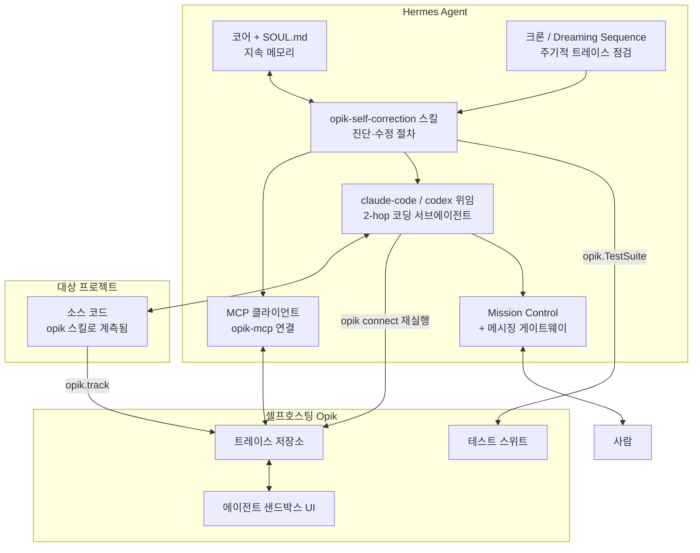
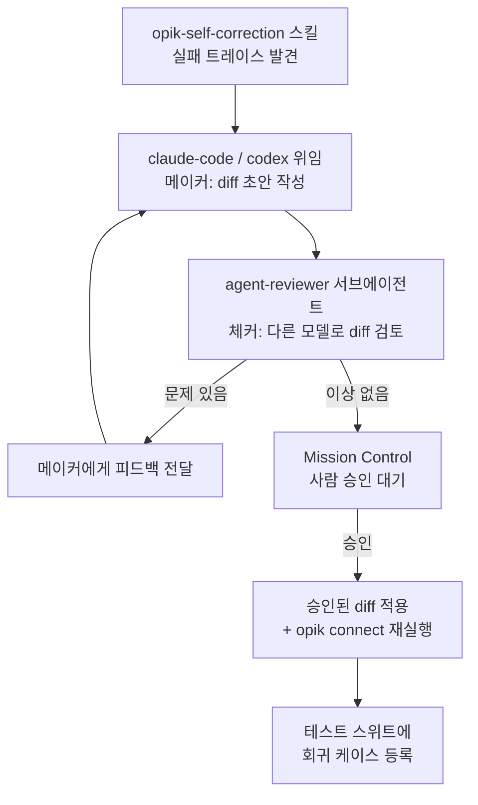

[**하네스가 스스로를 고치는 시대 — Opik의 Ollie 자가복구 루프와 2026년 'Loop Engineering' 패러다임**](https://k82022603.github.io/posts/%ED%95%98%EB%84%A4%EC%8A%A4%EA%B0%80-%EC%8A%A4%EC%8A%A4%EB%A1%9C%EB%A5%BC-%EA%B3%A0%EC%B9%98%EB%8A%94-%EC%8B%9C%EB%8C%80-opik%EC%9D%98-ollie-%EC%9E%90%EA%B0%80%EB%B3%B5%EA%B5%AC-%EB%A3%A8%ED%94%84%EC%99%80-2026%EB%85%84-loop-engineering-%ED%8C%A8%EB%9F%AC%EB%8B%A4%EC%9E%84/)

## 목차

1. 질문을 정확히 하기: "구현"이 의미하는 두 가지, 그리고 진짜로 풀어야 할 문제
2. 결론 먼저: 가능하다 — 단, "Opik을 복제"하는 것이 아니라 "Ollie의 자리에 Hermes를 앉히는" 구조
3. 왜 이 매핑이 자연스러운가: 두 시스템을 나란히 놓고 보기
4. 계층별 실현 방법
   - 4.1 트레이싱 계층: Opik의 공식 스킬을 Hermes의 절차 지식으로
   - 4.2 진단과 수정 제안: opik-mcp + 2-hop 코딩 위임
   - 4.3 검증: opik connect와 Hermes의 다섯 가지 샌드박스
   - 4.4 회귀 고정: Opik Python SDK 직접 호출
5. 제안 아키텍처: 전체 그림
6. 사람에게 가기 전에 한 번 더 걸러내기: Hermes식 메이커-체커
7. 여덜 단계 루프, Hermes 버전으로 다시 그리기
8. 단계별 구축 로드맵
9. Hermes가 가진 추가적인 강점
10. 한계와 주의할 점
11. 결론: 무엇을 만들고, 무엇을 만들지 않아도 되는가
12. 참고 자료

---

## 1. 질문을 정확히 하기: "구현"이 의미하는 두 가지, 그리고 진짜로 풀어야 할 문제

"Opik의 Ollie 자가복구 루프를 포함해서, Comet이 만든 오픈소스 AI 관측성·평가 플랫폼을 Hermes Agent로 구현하고 싶다"는 질문은, 읽는 방식에 따라 전혀 다른 두 가지 작업을 가리킬 수 있다.

첫 번째 읽기는 "Opik이라는 플랫폼 자체를 처음부터 다시 만들어, 그 결과물을 Hermes Agent가 동작하도록 한다"는 것이다. 그런데 앞서 살펴본 것처럼 Opik의 코어 — 트레이싱 인프라, 테스트 스위트 엔진, 에이전트 샌드박스, Agent Optimizer — 는 이미 오픈소스로 공개되어 있고, `git clone` 후 `./opik.sh` 세 줄로 셀프호스팅이 가능하다. 즉 이 부분은 "구현"이 아니라 "설치"의 문제이며, Hermes Agent가 이 작업을 대신 수행해 줄 수는 있어도(셸 명령을 실행하고 Docker Compose를 띄우는 일은 Hermes의 다섯 가지 샌드박스 실행 백엔드 중 어느 것으로도 충분히 가능하다), 이를 "Hermes로 Opik을 구현했다"고 부르는 것은 의미가 크지 않다. 이미 존재하는 오픈소스를 설치한 것일 뿐이기 때문이다.

두 번째 읽기, 그리고 이 문서가 다루는 진짜 질문은 이것이다. **Opik의 네 계층 중에서 정작 "오픈소스로 공개되지 않은", 혹은 셀프호스팅 환경에서는 클라우드 전용으로 제한되는 부분 — 즉 Ollie라는 진단·수정 에이전트의 역할 — 을 Hermes Agent가 대신 수행할 수 있는가?** 이전 문서에서 확인했듯, opik-mcp 공식 문서는 셀프호스팅 환경에서 `ask_ollie`나 `run_experiment` 같은 기능이 Comet Cloud 전용이라고 명시하고 있다. 즉 Opik을 셀프호스팅하는 사람은 트레이스 저장소, 테스트 스위트, 샌드박스라는 "데이터와 실행 환경"은 모두 손에 쥐지만, 그 데이터를 보고 "왜 실패했는지, 어떻게 고칠지"를 판단해주는 "두뇌"는 기본적으로 비어 있는 셈이다.

이 빈자리에 Hermes Agent를 앉힐 수 있는가 — 이것이 이 문서가 검토하는 질문이다. 그리고 결론을 먼저 말하면, 가능하다. 다만 그 방식은 "Opik을 통째로 복제"하는 것이 아니라, "셀프호스팅 Opik을 데이터 플레인으로 두고, Hermes Agent를 그 위에서 동작하는 운영 에이전트(operating agent)로 배치"하는 통합(integration) 작업에 가깝다.

---

## 2. 결론 먼저: 가능하다 — 단, "Opik을 복제"하는 것이 아니라 "Ollie의 자리에 Hermes를 앉히는" 구조

이 결론이 단순한 희망적 추측이 아니라는 점을 보여주는 세 가지 사실이 있다.

첫째, Opik은 자사의 트레이싱 규약을 "opik 스킬"이라는 형태로 공개하고 있으며, Comet 공식 블로그와 문서는 이 스킬이 "Claude Code, Codex, Cursor, OpenCode, 그리고 스킬을 지원하는 그 외의 모든 에이전트"와 호환된다고 명시한다. 이 스킬은 트레이스의 입력 지점, 안정적인 스팬 경계와 타입, 그리고 결정론적 재현을 위한 설정·기능 플래그·모델 버전의 캡처 같은 "트레이스를 신뢰할 수 있게 만드는 규약"을 인코딩하고 있다. Hermes Agent 역시 `SKILL.md`라는 마크다운 기반 스킬 형식을 사용하며 `hermes skills install` 명령으로 외부 스킬을 설치할 수 있는, "스킬을 지원하는 에이전트"다. 즉 Opik이 공개적으로 표방하는 호환 대상에 Hermes가 형식적으로 부합한다.

둘째, Opik의 스킬 패키지에는 "agent-ops 스킬"과 "agent-reviewer 서브에이전트"가 포함되어 있다. agent-ops 스킬은 "관측성 → 평가 → 최적화"라는 생애주기를 인코딩하고, agent-reviewer는 멱등성·재시도 안전성·격리·보안·도구 설계·메모리/리소스 제한·관측성 정확성을 체크리스트로 검토하는 독립적인 감사자(auditor) 역할을 한다. 이 "독립적인 체커"라는 개념은, 이전 문서에서 다룬 Loop Engineering의 메이커-체커 분리 패턴과 정확히 같은 모양이며, Hermes의 `delegate_task`와 Kanban 멀티에이전트 시스템이 이미 이 패턴을 위한 인프라를 갖추고 있다.

셋째, Hermes는 v0.2.0부터 내장 MCP 클라이언트를 갖고 있고, `config.yaml`의 `mcp_servers` 항목에 stdio 또는 HTTP 기반의 임의의 MCP 서버를 등록할 수 있다. opik-mcp는 `uvx opik-mcp@latest` 형태의 stdio 서버로 실행 가능하므로, 이를 Hermes의 `mcp_servers`에 등록하기만 하면 Hermes는 자신이 로깅한 적도 없는 Opik 워크스페이스의 트레이스, 데이터셋, 프롬프트, 점수에 직접 접근할 수 있는 도구를 갖게 된다.

이 세 가지를 합치면, "Hermes Agent를 Ollie의 역할로 배치한다"는 것은 새로운 플랫폼을 만드는 일이 아니라, (1) 셀프호스팅 Opik에 opik-mcp로 연결하고, (2) Opik이 이미 공개한 스킬들을 Hermes의 절차 지식으로 들여오고, (3) Hermes가 이미 갖춘 2-hop 코딩 위임·멀티에이전트·스케줄링·메시징 기능으로 그 절차를 실제로 수행하게 만드는, 통합 작업의 영역에 속한다.

---

## 3. 왜 이 매핑이 자연스러운가: 두 시스템을 나란히 놓고 보기

두 시스템의 설계 철학을 나란히 놓아보면, 이 매핑이 왜 어색하지 않은지가 더 분명해진다.

Opik의 자가복구 루프는 "트레이스 → 진단 → diff 제안 → 사람 승인 → 재실행 → 회귀 고정"이라는 한 번의 순환을 자동화하는 데 집중한다. 이 루프는 Comet의 클라우드 위에서 Ollie라는 단일 에이전트가 트레이스를 읽고, 코드를 읽고, diff를 쓰고, 재실행을 트리거하는 형태로 구현되어 있다.

Hermes Agent는 애초에 "하나의 작업을 한 번 잘 처리하는 에이전트"가 아니라, "경험에서 절차를 추출해 스킬로 저장하고, 세션을 넘어 지속되는 메모리를 쌓고, 크론/Dreaming Sequence로 스스로를 깨워 반복 작업을 수행하며, 필요하면 Claude Code나 Codex 같은 전문 코딩 에이전트에게 2-hop으로 위임하는" 구조로 설계되었다. 이는 Opik의 자가복구 루프가 요구하는 것 — 주기적으로 트레이스를 점검하고(크론), 절차를 기억하고(스킬), 코드 수정은 전문 에이전트에게 맡기고(2-hop 위임), 그 결과를 사람에게 보고하는(메시징 게이트웨이/Mission Control) — 과 거의 일대일로 대응한다.

다시 말해, Opik의 자가복구 루프는 "한 번의 순환"을 설계했고, Hermes Agent는 "그 순환을 반복적으로, 기억을 쌓으며 수행하는 운영자"를 설계했다. 전자가 후자의 한 가지 작업으로 들어가는 그림이다.

---

## 4. 계층별 실현 방법

### 4.1 트레이싱 계층: Opik의 공식 스킬을 Hermes의 절차 지식으로

자가복구 루프가 작동하려면 먼저 대상 프로젝트(Hermes가 관찰하고 고칠 대상이 되는 에이전트 코드)가 Opik으로 트레이싱되고 있어야 한다. 이 작업 자체를 Hermes에게 시킬 수 있다.

Opik 공식 문서는 "코딩 에이전트에 opik 스킬을 설치하면, 그 에이전트가 직접 코드를 읽고 적절한 Opik 통합을 선택해 트레이싱을 추가해준다"고 안내한다. Hermes의 `hermes skills install` 명령으로 이 스킬(혹은 opik-skills 저장소에 포함된 agent-ops, opik 스킬)을 설치하거나, 스킬 파일을 직접 `~/.hermes/skills/`(또는 프로젝트별 스킬 디렉터리)에 배치하면, Hermes는 "이 프로젝트에 Opik 트레이싱을 추가해줘"라는 요청을 받았을 때 `@opik.track` 데코레이터를 적절한 위치에 삽입하고, 트레이스가 그 시점의 설정(config)까지 함께 기록하도록 — 즉 나중에 Ollie(또는 Ollie 역할을 하는 Hermes)가 같은 입력으로 재현 실행을 할 수 있도록 — 계측해줄 수 있다.

여기서 한 가지는 명확히 짚어둘 필요가 있다. Opik의 opik 스킬이 "Claude Code, Codex, Cursor, OpenCode, 그리고 스킬을 지원하는 모든 에이전트"와 호환된다고 공식적으로 명시하고 있고 Hermes가 형식적으로 그 범주에 들어가는 것은 사실이지만, Nous Research나 Comet이 "Hermes에서 이 스킬이 동작함을 직접 확인했다"는 발표를 한 것은 아니다. 따라서 실제로는 스킬 파일을 Hermes에 가져온 뒤, 한두 번의 시범 실행으로 Hermes가 그 절차를 의도대로 따르는지 확인하는 짧은 검증 단계가 필요하다고 보는 것이 정확하다.

대상 프로젝트가 Hermes 자신의 코드(즉 Hermes의 실행 루프 자체)인 경우는 조금 다르다. Hermes의 핵심 루프를 직접 수정해 `@opik.track`을 끼워넣는 것은 권장되지 않는데, Hermes는 플러그인 시스템을 통해 같은 효과를 더 안전하게 얻을 수 있기 때문이다. `~/.hermes/plugins/`에 Python 파일을 배치하면 `pre_llm_call`, `post_llm_call`, `post_tool_call`, `on_session_start`, `on_session_end` 같은 훅이 에이전트 루프와 CLI/게이트웨이 양쪽에서 발동한다. 이 훅들 안에서 Opik Python SDK를 호출해 각 LLM 호출과 도구 호출을 Opik의 스팬으로 기록하는 약 100~150줄 분량의 플러그인을 작성하면, 이는 사실상 `opik-openclaw`(OpenClaw용 공식 플러그인)와 같은 역할을 하는 "opik-hermes" 플러그인이 된다. 다만 이런 플러그인은 현재 공식적으로 존재하지 않으며, 직접 작성해야 한다는 점은 분명히 해둘 필요가 있다.

### 4.2 진단과 수정 제안: opik-mcp + 2-hop 코딩 위임

이 부분이 "Ollie의 역할을 대신한다"는 말의 핵심이다.

먼저 opik-mcp를 Hermes의 `config.yaml`에 등록한다. opik-mcp 공식 문서가 안내하는 대로 `uvx opik-mcp@latest`를 stdio 명령으로 지정하고, Comet Cloud 또는 셀프호스팅 Opik의 API 엔드포인트와 워크스페이스 정보를 환경변수로 넘겨주면 된다. Hermes의 MCP 설정 참조 문서가 보여주는 커스텀 서버 등록 형식(`command`, `args`, `env`를 갖는 stdio 항목, 혹은 `url`/`headers`를 갖는 HTTP 항목)은 opik-mcp를 등록하는 데 그대로 사용할 수 있는 형태다. 등록 후에는 `tools: include` 옵션으로 필요한 도구(트레이스 읽기, 데이터셋/실험 조회, 점수 기록 등)만 선택적으로 노출해 컨텍스트 낭비를 줄일 수 있다.

이제 Hermes에는 Opik 워크스페이스를 들여다볼 수 있는 도구가 생겼다. 다음으로 필요한 것은 "무엇을 할 것인가"에 대한 절차 — 즉 Ollie의 진단·수정 루프를 인코딩한 커스텀 스킬이다. 이 스킬(가령 `opik-self-correction/SKILL.md`)은 대략 다음과 같은 절차를 기술한다. opik-mcp를 통해 에러가 표시되었거나 피드백 점수가 낮은 트레이스를 조회하고, 해당 트레이스의 스팬 트리를 읽어 어느 단계(이전 문서에서 다룬 사고-행동-관찰 중 어디, 혹은 메모리·안전계층·도구실행 중 어디)에서 문제가 생겼는지 가설을 세운다. 그 다음, 연결된 프로젝트 디렉터리 안에서 `claude-code` 스킬 또는 `codex` 스킬로 2-hop 위임을 수행해, 문제가 된 정확한 코드 위치를 찾고 수정 diff를 작성하도록 지시한다. 이는 Ollie가 `opik connect` 상태에서 소스 파일을 읽고 diff를 제안하는 것과 동일한 그림이며, Hermes 입장에서는 이미 `autonomous-ai-agents` 카테고리에 기본 탑재된 `claude-code`/`codex` 위임 스킬을 그대로 재사용하는 것이다.

여기서 Ollie와의 한 가지 차이가 도움이 되는 방향으로 작동한다. Ollie는 (공개된 설명에 따르면) 트레이스와 — `opik connect` 상태라면 — 소스 코드만을 컨텍스트로 갖고 진단을 시작한다. 반면 Hermes는 SOUL.md와 4계층 메모리 시스템을 통해 "이 프로젝트가 무엇을 위한 것인지, 과거에 어떤 결정을 내렸는지, 어떤 패턴이 반복되는지"에 대한 누적된 맥락을 이미 갖고 있을 가능성이 높다. 이전 문서에서 다룬 커뮤니티의 비판 — "에이전트에게 원시 트레이스만 주면 99%가 거짓 양성이 된다"는 우려 — 은 정확히 "맥락 부족"을 지적한 것이었는데, Hermes의 지속 메모리는 그 공백을 메우는 방향으로 작동할 수 있다.

### 4.3 검증: opik connect와 Hermes의 다섯 가지 샌드박스

진단과 diff 제안까지는 코딩 위임 스킬이 처리했다. 다음은 "이 diff가 실제로 원래 실패를 고쳤는가"를 검증하는 단계다.

Opik 공식 문서에 따르면 `opik connect`는 로컬 머신에서 실행되며, 연결된 프로젝트 디렉터리 안의 파일에 대해서만 동작하고, 코드와 데이터는 로컬에 남고 트레이스와 메타데이터만 Opik으로 전송된다. Hermes Agent 공식 문서는 Hermes가 Local, Docker, SSH, Singularity, Modal이라는 다섯 가지 실행 백엔드를 지원한다고 설명한다. 이 둘을 합치면, Hermes는 다섯 가지 실행 백엔드 중 하나(가장 단순하게는 Local 또는 Docker) 안에서 `opik connect`를 실행한 상태로 대상 에이전트를 원래 실패를 유발했던 입력과 동일한 입력으로 재실행할 수 있다. 새 트레이스는 `opik connect`를 통해 실시간으로 Opik에 스트리밍되며, 사람이 Opik의 대시보드를 열면 수정 전후의 트레이스를 나란히 비교할 수 있다.

이 단계에서 Opik 자체의 Agent Sandbox(브라우저 기반으로 전체 에이전트 그래프를 UI 안에서 실행하는 기능)를 Hermes가 굳이 대체하거나 자동으로 조작할 필요는 없다. Opik의 Agent Sandbox는 셀프호스팅된 채로 그대로 남아 있고, 사람이 — 혹은 Hermes가 Mission Control을 통해 알림을 보낸 뒤 — 그 화면에서 직접 결과를 살펴볼 수 있다. Hermes의 역할은 "재실행을 트리거하고 결과를 1차로 해석해 보고하는 것"이며, 최종 확인을 위한 그래픽 인터페이스는 Opik이 이미 제공하는 것을 그대로 쓰는 편이 합리적이다.

다섯 가지 샌드박스 중 Singularity나 Modal 같은 백엔드는, GPU 자원이 필요한 에이전트(예를 들어 NVIDIA의 CUDA-X·NeMo·TensorRT-LLM 계열 스킬을 사용하는 에이전트)를 재현 실행해야 할 때 특히 유용할 수 있다. 이는 Ollie의 공개된 설명에는 명시되어 있지 않은, Hermes 쪽의 추가적인 선택지다.

### 4.4 회귀 고정: Opik Python SDK 직접 호출

검증까지 통과했다면 마지막 단계는 회귀 테스트로 고정하는 것이다. Opik의 테스트 스위트는 `opik.TestSuite(...)`, `add_assertion(...)`, `run_tests()`라는 Python API로 자연어 어서션을 추가하는 형태로 동작한다. Hermes는 Python 기반 에이전트이고, 코딩 위임 스킬을 통해 대상 프로젝트의 가상환경 안에서 임의의 Python 코드를 실행할 수 있으므로, "방금 고친 실패를 설명하는 자연어 어서션을 작성해 테스트 스위트에 추가하라"는 지시를 받으면 opik 패키지를 직접 호출해 이 작업을 수행할 수 있다. opik-mcp를 통한 점수 기록(`score.create` 등)과 별도로, 이 부분은 SDK를 직접 호출하는 경로가 더 직접적이다.

이 회귀 고정과 동시에, Hermes의 GitHub 자동 백업 크론 스킬을 사용해 수정된 코드를 별도 브랜치나 태그로 커밋하면, Opik의 "블루프린트(불변 버전 스냅샷)" 개념과 유사한 효과를 깃 저장소 차원에서 얻을 수 있다. 그리고 Hermes의 닫힌 학습 루프는 — 5회 이상의 도구 호출을 거친 복잡한 작업 뒤에 자동으로 SKILL.md를 생성하는 메커니즘을 갖고 있으므로 — 이 회귀 고정 작업 자체가 "이런 유형의 트레이스 실패는 이렇게 진단하고 고친다"는 새로운 스킬로 자동 추출될 가능성도 있다. 이는 Opik의 테스트 스위트가 제공하는 "회귀 테스트 자산"에 더해, Hermes 쪽에 "진단 절차 자산"이 함께 쌓이는 효과로, Ollie 단독 구성에는 없는 추가적인 누적이다.

---

## 5. 제안 아키텍처: 전체 그림

지금까지의 매핑을 하나의 다이어그램으로 정리하면 다음과 같다.

이 그림에서 핵심은 화살표의 방향성이다. 셀프호스팅 Opik(트레이스 저장소, 테스트 스위트, 샌드박스 UI)은 "데이터와 실행 환경"을 제공하는 수동적인 플랫폼으로 남아 있고, Hermes Agent 쪽의 크론이 능동적으로 이 플랫폼을 주기적으로 들여다보며, 코딩 위임을 통해 대상 프로젝트를 고치고, 그 결과를 다시 Opik에 기록하고, 사람에게는 Mission Control이나 메시징 채널을 통해 보고한다. Opik의 Agent Sandbox UI는 사람이 최종 확인을 하고 싶을 때 열어보는 창구로 남는다.

---

## 6. 사람에게 가기 전에 한 번 더 걸러내기: Hermes식 메이커-체커

이전 문서에서 정리한 커뮤니티 논의 중에는 "diff 승인이라는 유일한 인간 개입 지점에서, 사람이 무엇을 기준으로 승인할지에 대한 신뢰 보정이 필요하다"는 지적이 있었다. 같은 논의에서는 매일 자동으로 여러 건의 수정 제안이 쌓이면 결국 사람이 모든 diff를 꼼꼼히 보지 못하게 되는 "승인 피로(approval fatigue)" 문제도 자연스럽게 따라온다.

Hermes의 `delegate_task`와 Kanban 멀티에이전트 시스템, 그리고 Opik이 공개한 agent-reviewer 서브에이전트(멱등성, 격리, 보안, 도구 설계, 관측성 정확성을 체크리스트로 검토하는 독립 감사자)를 결합하면, 사람에게 diff가 도달하기 전에 한 단계의 자동 검토를 추가할 수 있다.

여기서 메이커(`claude-code`/`codex` 위임)와 체커(agent-reviewer)가 서로 다른 모델을 쓰도록 Pantheon/OpenRouter 라우팅을 설정하면, 이전 문서에서 다룬 "메이커-체커는 가능하면 다른 모델을 써야 한다"는 원칙도 자연스럽게 충족된다. 사람에게는 체커를 통과한, 즉 한 차례 자동 검토를 거친 diff만 도달하므로, 매일 쌓이는 제안의 수와 질 양쪽 모두에서 부담이 줄어든다. 다만 이 체커 단계가 추가될수록 토큰 비용과 지연이 함께 늘어난다는 점은 트레이드오프로 남는다.

---

## 7. 여덜 단계 루프, Hermes 버전으로 다시 그리기

이전 문서에서 정리한 Opik의 여덜 단계 자가복구 루프를, 위에서 설명한 매핑에 따라 Hermes 구성요소로 다시 적어보면 다음과 같다.

| 단계 | Opik/Ollie 원본 | Hermes Agent 버전 |
|---|---|---|
| 1. 계측 | `@opik.track` 적용 | Opik 공식 스킬을 설치한 Hermes가 대상 프로젝트에 `@opik.track` 삽입 |
| 2. 설정 선언 | `opik.Config`로 버전 관리 | 동일 — 계측 작업의 일부로 함께 수행 |
| 3. 프로덕션 실패 | 트레이스 자동 캡처 | 동일 — Opik이 자동 캡처, Hermes는 관여하지 않음 |
| 4. 진단·수정 제안 | Ollie가 트레이스+소스 분석 후 diff 제시 | 크론으로 깨어난 `opik-self-correction` 스킬이 opik-mcp로 트레이스를 읽고, `claude-code`/`codex` 위임(메이커)이 diff 작성, agent-reviewer(체커)가 1차 검토 |
| 5. 샌드박스 검증 | 원본 실패 입력으로 재실행 | Hermes의 Local/Docker 등 샌드박스에서 `opik connect` 활성 상태로 동일 입력 재실행, 새 트레이스 Opik에 스트리밍 |
| 6. 블루프린트 저장 | 버전 관리된 설정 스냅샷 | GitHub 자동 백업 크론 스킬로 별도 브랜치/태그 커밋 |
| 7. 회귀 테스트 고정 | 원본 실패를 테스트 스위트에 등록 | Hermes가 `opik.TestSuite`/`add_assertion`을 직접 호출해 등록 |
| 8. 다음 실패 | 같은 루프로 재진입 | 다음 크론 주기에 같은 스킬이 다시 실행 |

이 표에서 가장 중요한 행은 4번과 5번이다. 4번에서는 "단일 Ollie 에이전트"가 "메이커+체커라는 두 개의 위임된 서브에이전트"로 나뉘고, 5번에서는 "Opik 전용 재실행 메커니즘"이 "Hermes의 범용 샌드박스 백엔드 + opik connect"로 대체된다. 1·2·3·7번은 본질적으로 Opik 쪽 기능을 그대로 사용하거나(1·2·3), Hermes가 SDK를 통해 Opik의 기능을 호출하는 것(7)이라서 변경의 폭이 작다. 6·8번은 Hermes가 가진 부가 기능(GitHub 백업, 크론)을 자연스럽게 덧붙인 것이다.

---

## 8. 단계별 구축 로드맵

실제로 이 구성을 만든다면, 작업은 대략 다음과 같은 순서로 진행하는 것이 합리적이다.

가장 먼저, Opik을 셀프호스팅한다. `git clone https://github.com/comet-ml/opik.git` 후 `./opik.sh`로 로컬 또는 내부망에 띄운다. 이 단계는 Hermes와 무관하게, Opik 단독으로도 의미 있는 결과물(트레이싱, 테스트 스위트, 샌드박스)을 즉시 제공한다.

두 번째로, opik-mcp를 Hermes의 `config.yaml`에 `mcp_servers` 항목으로 등록한다. stdio 명령으로 `uvx opik-mcp@latest`를 지정하고, 셀프호스팅 Opik의 엔드포인트와 워크스페이스 정보를 환경변수로 전달한다. `tools: include`로 트레이스 읽기·점수 기록 등 필요한 도구만 선택해 컨텍스트 비용을 관리한다. 이 시점에서 Hermes에게 "Opik 워크스페이스에 있는 최근 에러 트레이스를 보여줘"라고 물어보는 것만으로도 연결이 제대로 되었는지 확인할 수 있다.

세 번째로, 대상 프로젝트(자가복구 루프가 돌아갈 코드베이스)에 Opik의 트레이싱 규약을 적용한다. opik-skills 저장소의 스킬을 Hermes의 스킬 디렉터리에 가져오거나, 같은 절차를 직접 SKILL.md로 옮겨 적은 뒤, Hermes에게 "이 프로젝트에 Opik 트레이싱을 추가해줘"라고 요청한다. 이 단계가 끝나면 대상 프로젝트는 정상적으로 Opik에 트레이스를 보내는 상태가 된다.

네 번째로, 핵심이 되는 `opik-self-correction` 스킬을 작성한다. 이 스킬은 "opik-mcp로 에러/저점수 트레이스를 조회 → 스팬 트리 분석 → `claude-code`/`codex`에 2-hop 위임으로 diff 작성 → agent-reviewer 서브에이전트로 1차 검토 → Mission Control로 사람에게 보고 → 승인 시 샌드박스에서 `opik connect` 재실행 → `opik.TestSuite`로 회귀 어서션 등록 → GitHub 백업"이라는 절차를 SKILL.md의 "When to Use / Quick Reference / Procedure / Pitfalls / Verification" 형식에 맞춰 기술한다. 처음에는 사람이 직접 "지금 Opik 트레이스 점검해줘"라고 호출해보면서 절차가 의도대로 동작하는지 다듬는 것이 좋다.

다섯 번째로, 절차가 안정되면 크론(Dreaming Sequence 패턴)으로 등록해 주기적으로(예: 매일 아침) 자동 실행되게 한다. 이때 한 번에 처리할 트레이스 수에 상한을 두는 것이 — 이전 문서에서 다룬 Loop Engineering의 "종료 조건을 미리 정의하라"는 원칙과 같은 이유로 — 중요하다.

마지막으로, 선택적인 단계로서 Hermes 자신의 실행을 Opik으로 추적하고 싶다면 `~/.hermes/plugins/`에 `pre_llm_call`/`post_llm_call` 훅을 사용하는 플러그인을 작성해 Opik SDK로 스팬을 기록하게 한다. 이 단계는 "Hermes가 Hermes 자신의 하네스를 자가복구 루프의 대상으로도 포함시키는" 한 단계 더 나아간 구성이며, 앞의 다섯 단계가 먼저 안정적으로 동작한 뒤에 시도하는 것이 안전하다.

---

## 9. Hermes가 가진 추가적인 강점

지금까지의 매핑 과정에서 자연스럽게 드러난, Ollie 단독 구성에는 없는 Hermes 쪽의 추가적인 이점들을 정리하면 다음과 같다.

지속 메모리와 SOUL.md는 트레이스 진단에 필요한 "이 에이전트가 무엇을 위한 것인가"라는 맥락을 자동으로 제공한다. 이는 이전 문서에서 다룬 "맥락 없는 트레이스 분석은 거짓 양성이 된다"는 비판에 대한 직접적인 보완이 된다.

Pantheon/OpenRouter를 통한 멀티모델 라우팅은 루프의 각 단계 — 트레이스 1차 스캔, diff 작성(메이커), diff 검토(체커) — 에 서로 다른 비용/성능의 모델을 배정할 수 있게 해준다. 매일 자동으로 도는 루프에서는 이 비용 최적화가 누적되어 의미 있는 차이를 만든다.

메시징 게이트웨이(Telegram, Discord, Slack 등)는 diff 승인 요청을 Opik의 웹 UI에 한정하지 않고 사람이 실제로 자주 확인하는 채널로 보낼 수 있게 한다. 이는 "유일한 인간 개입 지점"의 응답 속도를 높이는 실질적인 효과가 있다.

닫힌 학습 루프와 자동 스킬 생성은, 같은 유형의 실패를 반복해서 처리할수록 Hermes 쪽에 "이런 트레이스 패턴은 이렇게 진단한다"는 절차 지식이 누적되도록 한다. 이는 Opik의 테스트 스위트가 "다시는 같은 입력에서 실패하지 않는다"를 보장하는 것과는 별개로, "비슷하지만 새로운 실패도 더 빠르게 진단할 수 있게 된다"는 효과를 더한다.

다섯 가지 실행 백엔드(Local, Docker, SSH, Singularity, Modal)는 검증 재실행이 일어나는 환경의 폭을 넓혀, GPU 의존적이거나 격리가 필요한 대상 프로젝트에도 같은 루프를 적용할 수 있게 한다.

---

## 10. 한계와 주의할 점

동시에, 솔직하게 짚어야 할 한계들도 있다.

첫째, "opik-hermes" 플러그인이나 "Hermes용 opik-self-correction 스킬"은 현재 공식적으로 존재하지 않는다. `opik-openclaw`처럼 미리 만들어진 통합이 아니라, 이 문서에서 제안한 구성은 MCP 등록 한 줄, 스킬 파일 작성, 크론 등록이라는 비교적 가벼운 작업이지만 어디까지나 직접 만들어야 하는 커스텀 통합이다.

둘째, opik 스킬이 "스킬을 지원하는 모든 에이전트"와 호환된다는 Comet의 설명과 Hermes의 SKILL.md 형식 사이의 호환성은 형식적으로는 부합하지만, 실제 동작이 양쪽에서 직접 확인된 것은 아니다. 시범 실행을 통한 검증이 필요하다.

셋째, opik-mcp의 `ask_ollie`나 `run_experiment`처럼 더 풍부한 쓰기/추론 기능은 셀프호스팅 환경에서 Comet Cloud 전용으로 제한되어 있다. 이는 거꾸로 말하면 Hermes가 그 자리를 메우는 것이 자연스럽다는 뜻이지만, 동시에 Hermes 쪽의 진단·수정 절차가 그만큼 더 많은 "생각"을 직접 떠안아야 한다는 의미이기도 하다.

넷째, Hermes의 v0.16은 "더 가벼운 스킬 구성과 환경 관련성 게이트"를 도입했는데, 이는 Nous Research가 스킬 비대화(이전 문서에서 다룬 100개 이상의 번들 스킬 논란)를 의식하고 있다는 신호다. `opik-self-correction`처럼 무겁고 다단계인 커스텀 스킬을 추가할 때는, 이 스킬이 관련 없는 작업에서도 컨텍스트를 차지하지 않도록 트리거 조건을 분명히 적어두는 것이 컨텍스트 윈도우 경제성 측면에서 중요하다.

다섯째, 크론으로 매일 도는 루프가 한 번에 여러 건의 수정을 만들어내면, 6장에서 제안한 체커 단계를 거쳤다 해도 사람이 확인해야 할 항목이 누적될 수 있다. 처리 건수의 상한, 그리고 "이 정도 위험도 이하의 수정만 자동 적용 후보로 올린다"는 식의 우선순위 기준을 함께 설계하는 것이 필요하다.

여섯째, 메이커와 체커에 서로 다른 모델을 쓰고, 여기에 진단 단계까지 더해지면, 한 번의 루프가 소비하는 토큰과 비용은 Ollie 단독 구성보다 늘어날 수 있다. 다만 이전 문서에서 다룬 Cost Intelligence처럼 Opik 쪽에서도 비용을 들여다볼 수 있고, Hermes 쪽에서도 Pantheon/OpenRouter로 단계별 비용을 조절할 수 있으므로, 이는 관리 가능한 트레이드오프에 가깝다.

---

## 11. 결론: 무엇을 만들고, 무엇을 만들지 않아도 되는가

전체를 정리하면, "Opik의 Ollie 자가복구 루프를 포함한 오픈소스 AI 관측성·평가 플랫폼을 Hermes Agent로 구현하는 것"은 가능하며, 그 본질은 새로운 플랫폼을 만드는 것이 아니라 통합 작업이다.

만들지 않아도 되는 것: 트레이싱 인프라, 트레이스 저장소, 테스트 스위트 실행 엔진, 에이전트 샌드박스 UI, Agent Optimizer — 이들은 셀프호스팅 Opik을 설치하는 것으로 그대로 얻는다.

만들어야 하는 것: opik-mcp를 Hermes의 MCP 클라이언트에 연결하는 설정 한 줄, 대상 프로젝트에 Opik 트레이싱 규약을 적용하기 위한 (이미 Opik이 공개한) 스킬의 도입, 그리고 진단-위임-검토-검증-회귀고정의 절차를 기술하는 `opik-self-correction` 커스텀 스킬. 여기에 선택적으로, Hermes 자신을 추적하고 싶다면 훅 기반의 작은 플러그인.

이 구성에서 Hermes Agent는 Comet의 Ollie를 "복제"하는 것이 아니라, 셀프호스팅 환경에서 비어 있는 Ollie의 자리를 — 지속 메모리, 멀티모델 라우팅, 2-hop 코딩 위임, 메이커-체커, 크론, 메시징이라는 이미 갖춰진 도구들을 조합해 — 메우는 운영 에이전트로 동작한다. 이는 이전 문서의 마지막에서 정리한 "하네스 엔지니어링은 모델 성능보다 운영의 문제에 가깝다"는 결론과도 정확히 맞아떨어진다. Opik이 자가복구 루프의 "모양"을 제시했다면, Hermes Agent는 그 모양을 반복적으로, 기억을 쌓으며 운영할 수 있는 "운영체제"에 해당한다.

---

## 12. 참고 자료

- Opik 공식 GitHub 저장소: https://github.com/comet-ml/opik
- Opik Tracing 시작 가이드(스킬 호환성 설명): https://www.comet.com/docs/opik/tracing/getting-started
- Opik Claude Code Plugin 블로그(agent-ops/opik 스킬, agent-reviewer 서브에이전트): https://www.comet.com/site/blog/opik-claude-code-plugin/
- Ollie 공식 문서: https://www.comet.com/docs/opik/ollie
- Ollie와 코드베이스 연동(opik connect): https://www.comet.com/docs/opik/self-improving-agents/ollie-and-your-codebase
- opik-mcp 저장소(셀프호스팅 제약 포함): https://github.com/comet-ml/opik-mcp
- opik-openclaw 저장소(참고용 플러그인 사례): https://github.com/comet-ml/opik-openclaw/
- Hermes Agent MCP 공식 문서: https://hermes-agent.nousresearch.com/docs/user-guide/features/mcp
- Hermes Agent MCP 설정 레퍼런스: https://hermes-agent.nousresearch.com/docs/reference/mcp-config-reference
- Hermes Agent 공식 문서 메인: https://hermes-agent.nousresearch.com/docs/
- Hermes Agent v0.16 정리(어드민 패널, 데스크톱 앱, 스킬 경량화): https://blakecrosley.com/guides/hermes
- Hermes Agent 커스텀 스킬 가이드: https://lushbinary.com/blog/hermes-agent-custom-skills-development-guide/
- Hermes Agent 스킬 가이드(SKILL.md 형식, 자동 생성): https://www.remoteopenclaw.com/blog/hermes-agent-skills-guide
- Hermes Agent 커스텀 플러그인 작성 가이드(훅 시스템): https://hermes-tutorials.dev/blog/building-hermes-plugin/
- Hermes Agent MCP 통합 가이드(클라이언트/서버 모드): https://lushbinary.com/blog/hermes-agent-mcp-integration-complete-guide/
- Hermes Agent 문서 저장소(플러그인 훅, 프로필 시스템): https://github.com/mudrii/hermes-agent-docs
