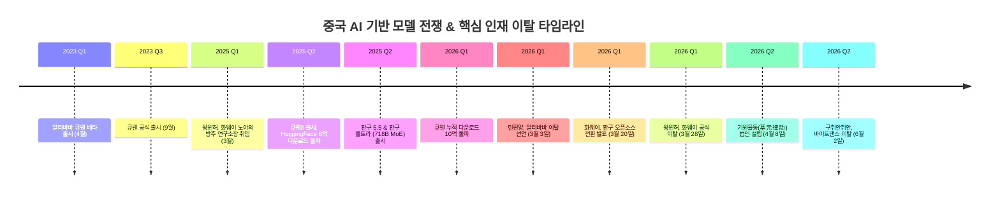
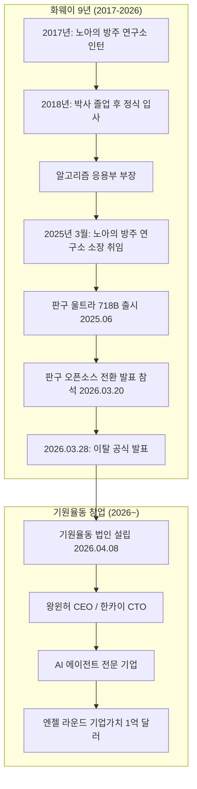
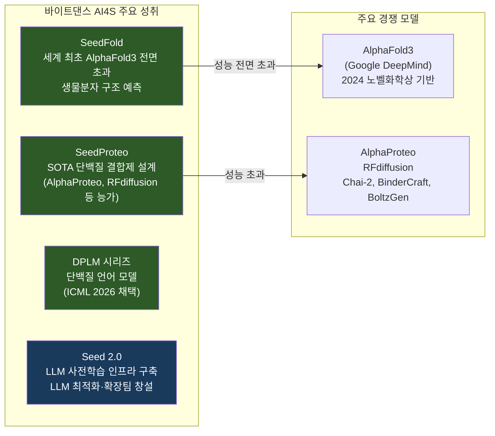
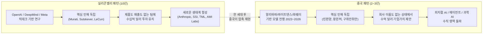
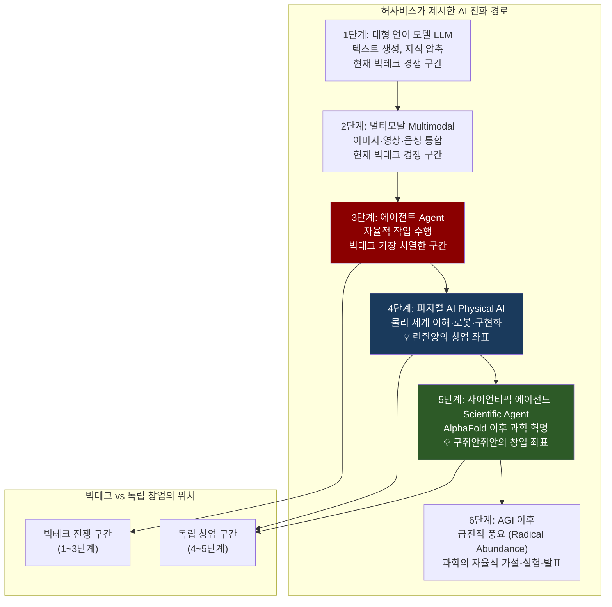
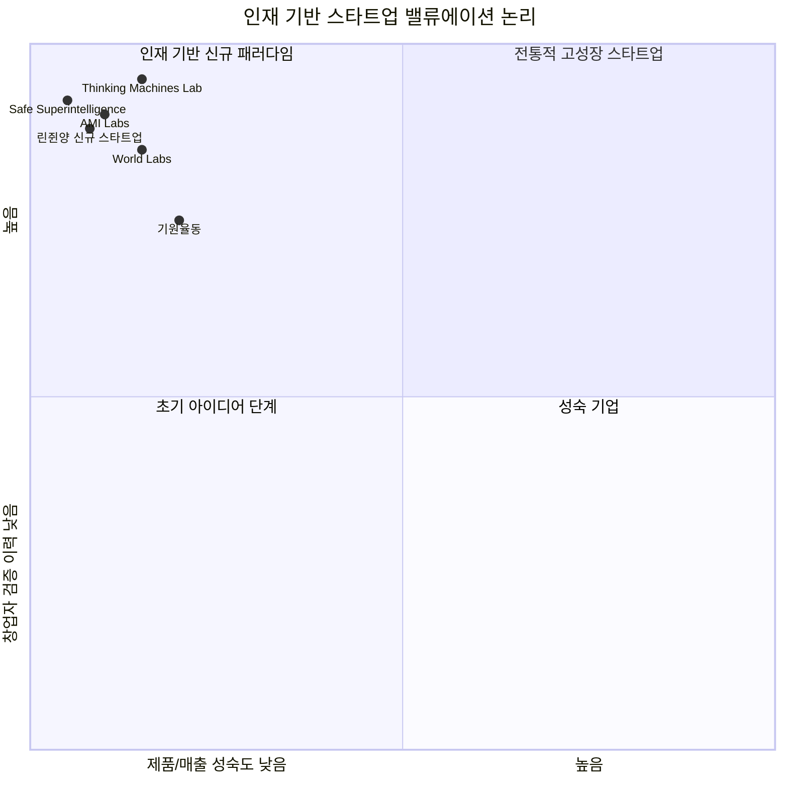
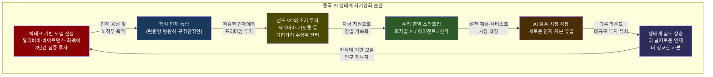

> **2026년 상반기, 중국 3대 빅테크의 핵심 AI 인재들이 잇따라 독립을 선언했다.**  
> 알리바바 큐웬의 린쥔양, 화웨이 판구의 왕윈허, 바이트댄스 시드의 구취안취안.  
> 이 세 사람의 동시다발적 이탈은 단순한 이직 사건이 아니다.  
> 중국 AI 생태계가 다음 단계로 진입하고 있다는 가장 강렬한 신호다.

## 관련글

[**빅테크 왕좌를 버린 인재들, 중국 AI 역사를 다시 쓰다**](https://www.facebook.com/share/p/1NbPXbpzQF/)

---

## 목차

1. [서론: 왜 지금인가](#1-서론-왜-지금인가)
2. [배경: 3년의 압축된 모델 전쟁](#2-배경-3년의-압축된-모델-전쟁)
3. [린쥔양: 큐웬의 설계자, 월드 모델을 향해](#3-린쥔양-큐웬의-설계자-월드-모델을-향해)
4. [왕윈허: 판구의 총사령관, 에이전트를 향해](#4-왕윈허-판구의-총사령관-에이전트를-향해)
5. [구취안취안: AI4S의 선구자, 신약을 향해](#5-구취안취안-ai4s의-선구자-신약을-향해)
6. [글로벌 대칭: 실리콘밸리가 먼저 걸어간 길](#6-글로벌-대칭-실리콘밸리가-먼저-걸어간-길)
7. [허사비스의 지도 위에서: 세 창업의 좌표](#7-허사비스의-지도-위에서-세-창업의-좌표)
8. [자본의 언어 변화: 제품이 아닌 인재에 베팅하다](#8-자본의-언어-변화-제품이-아닌-인재에-베팅하다)
9. [빅테크는 인큐베이터였다: 중국 AI 생태계의 진화](#9-빅테크는-인큐베이터였다-중국-ai-생태계의-진화)
10. [결론: 2막의 막이 오르다](#10-결론-2막의-막이-오르다)

---

## 1. 서론: 왜 지금인가

2026년 상반기, 중국 AI 산업에서 전례 없는 일이 벌어졌다. 알리바바 큐웬(Qwen)의 기술 총책임자 린쥔양(林俊旸)이 3월에, 화웨이 노아의 방주 연구소 소장이자 판구(盘古) 대형 모델 책임자 왕윈허(王云鹤)가 3월 말에, 그리고 바이트댄스 시드(Seed) AI4S 팀의 핵심 과학자 구취안취안(顾全全)이 6월 2일에, 거의 동시에 빅테크를 떠나 독립 창업의 길을 선택했다.

이들은 단순히 회사를 옮긴 것이 아니다. 수십억 위안의 연봉, 수천 명의 팀, 중국 최대 테크 기업이 제공하는 모든 자원과 지위를 내려놓고, 아직 제품도 매출도 없는 새로운 항해를 시작했다. 더욱 놀라운 것은 이 항해의 목적지가 채 정해지기도 전에 세쿼이아 차이나(红杉中国, HongShan)를 비롯한 최상위 벤처 캐피털들이 투자 의향을 먼저 타진했다는 사실이다.

이 현상을 이해하는 데는 두 가지 질문이 필요하다. 첫째, 왜 이 세 사람은 하필 지금, 거의 동시에 떠났는가. 둘째, 왜 자본은 그들이 무엇을 만들지도 모른 채 수억 달러의 기업가치를 먼저 제안했는가. 이 두 질문의 답이 교차하는 지점에 2026년 중국 AI의 진짜 변화가 있다.

---

## 2. 배경: 3년의 압축된 모델 전쟁

이 현상을 이해하기 위해서는 먼저 지난 3년간 중국 AI 업계에서 무슨 일이 일어났는지를 살펴봐야 한다.

### 2.1 대형 언어 모델 전쟁의 개요

2023년부터 2026년 초까지, 알리바바·바이트댄스·화웨이·텐센트·바이두 등 중국 빅테크들은 각자의 대형 언어 모델(LLM)을 핵심 전략 무기로 내세우며 치열한 경쟁을 벌였다. 알리바바는 큐웬(Qwen, 통이치엔원), 바이트댄스는 시드(Seed)를 기반으로 한 더우바오(豆包), 화웨이는 판구(盘古)라는 이름으로 기반 모델 전쟁에 뛰어들었다.

이 경쟁은 단순히 벤치마크 수치를 높이는 싸움이 아니었다. 각 기업은 막대한 자본을 투입해 연구 인력을 확보하고, 자체 학습 인프라를 구축하고, 오픈소스 생태계를 키우고, 다운스트림 애플리케이션으로 확장하는 전방위 전쟁을 치렀다. 그 과정에서 모델을 처음부터 설계하고, 수천 번의 실험을 통해 학습 파이프라인을 최적화하고, 배포 과정에서 발생하는 실패를 반복적으로 수정하는 실전 노하우가 국가 단위로 축적됐다.

2026년 초를 기준으로 이 "기반 모델 전쟁"의 1라운드는 사실상 승패가 갈리기 시작했다. 글로벌 수준의 오픈소스 경쟁력은 큐웬이 확보했고, 소비자 AI 애플리케이션 시장에서는 바이트댄스의 더우바오가 압도적 사용자 수를 확보했으며, 기업 AI 솔루션 영역에서는 화웨이 판구가 자리를 잡아가고 있었다. 1라운드의 승자가 정해지는 시점이 되자, 그 전쟁을 실제로 설계하고 운영했던 핵심 인재들이 다음 판을 위한 출발선에 섰다.

---

## 3. 린쥔양: 큐웬의 설계자, 월드 모델을 향해

### 3.1 그가 만들어낸 것

린쥔양(林俊旸, 영문명 Justin Lin, 1993년생)은 베이징대학교에서 컴퓨터과학과 언어학을 공부하고 2019년 알리바바에 입사했다. 그가 참여한 프로젝트들은 M6, OFA(One for All), 중국어 CLIP 등 알리바바의 초기 AI 연구를 이끈 대형 프로젝트들이었다. 2023년 4월, 알리바바가 큐웬(Qwen, 통이치엔원)이라는 이름으로 대형 언어 모델 베타 버전을 출시했을 때부터 그는 이 프로젝트의 핵심 기술 리더로 활동했다.

그가 이끈 3년 동안 큐웬은 양적으로도, 질적으로도 눈부신 성과를 거뒀다. 2025년 큐웬3 출시 시점에 HuggingFace 누적 다운로드 수는 6억 건을 넘었고, 파생 모델(fine-tuned derivatives)은 18만 개를 초과했는데, 이는 당시 가장 인기 있는 오픈소스 모델인 메타의 Llama를 넘어서는 수치였다. 2026년 1월을 기준으로 다운로드 수는 7억 건을 넘어섰고, 알리바바는 거의 400개에 달하는 큐웬 모델을 오픈소스로 공개했다. 포춘지(Fortune)는 이 오픈소스 노력을 인정해 알리바바를 2025년 '세상을 바꾸는 기업(Change the World List)'에 포함시켰다. 린쥔양은 단지 모델을 개발한 것이 아니라, X(구 트위터)에서 매 릴리즈를 직접 발표하고, 개발자 커뮤니티와 활발하게 소통하며, 큐웬이라는 브랜드에 '인간적인 얼굴'을 부여한 인물이었다. 그는 알리바바 클라우드 역사상 최연소 P10급 기술 전문가로 불렸다.

### 3.2 이탈의 계기

2026년 3월 3일, 린쥔양은 큐웬 팀의 출시 행사가 끝난 다음 날 오전, X에 단 다섯 단어를 올렸다.  
**"me stepping down. bye my beloved qwen."**

이 게시물이 올라오기 몇 시간 전, 그는 큐웬 팀 내부 메시지 채널에 "더 이상 여러분을 이끌 면목이 없다"는 한 문장을 남겼다. 이 메시지들은 순식간에 업계에 퍼졌고, 알리바바 주가는 홍콩 증시에서 당일 최대 5.3% 급락했다.

그의 이탈을 촉발한 직접적인 계기는 조직 개편이었다. 알리바바 클라우드 CTO 저우징런(周靖人)이 큐웬 팀을 사전학습(pre-training)·후학습(post-training)·텍스트·이미지·음성 등 독립적인 수평 조직으로 분리하는 계획을 전달한 것이다. 이 계획에 따르면 린쥔양이 통합적으로 이끌어온 큐웬이라는 하나의 유기체는 사라지게 된다. 그는 이 계획을 통보받은 다음 날 공식적으로 퇴직을 선언했다. 알리바바 경영진은 이 결정이 갑작스러웠다고 밝혔고, 그의 귀환 가능성은 사실상 없다는 내부 전언이 나왔다.

### 3.3 창업 비전: 에이전틱 씽킹과 피지컬 AI

린쥔양이 퇴직 후 처음 꺼내든 개념은 '에이전틱 씽킹(Agentic Thinking)'이다. 그는 자신의 글에서 이렇게 밝혔다.

> *"멀티모달 기반 모델은 기반 에이전트로 진화하고 있다. 이 에이전트들은 도구와 메모리를 사용하고 강화학습을 통해 장기적 추론을 수행한다. 모델은 반드시 가상 세계에서 물리 세계로 이동해야 한다."*

이것이 그의 창업 방향이다. 월드 모델(World Model)과 피지컬 AI(Physical AI, 구현화 지능), 즉 AI가 물리적 세계를 이해하고 로봇과 같은 물리적 실체로 구현되는 기술이 그의 다음 목표다. 실제로 린쥔양은 알리바바 재직 중이던 2025년 10월에 이미 로봇공학과 구현화 지능(embodied intelligence)에 집중하는 소규모 팀을 큐웬 내부에 조직했던 것으로 알려져 있다. 즉 그의 창업 방향은 갑작스럽게 결정된 것이 아니라, 이미 내부에서 실험하고 있던 미완의 프로젝트를 외부에서 완성하겠다는 의지의 표현이다.

2026년 5월 기준으로, 린쥔양의 새 스타트업은 아직 공식 사명도 없는 상태에서 약 20억 달러(약 2조 9,000억 원)의 기업가치로 투자 유치 논의를 진행하고 있으며, 세쿼이아 차이나(红杉中国, HongShan)와 가오롱 캐피털(高榕创投, Gaorong Ventures)이 투자 논의에 참여하고 있다.

---

## 4. 왕윈허: 판구의 총사령관, 에이전트를 향해

### 4.1 화웨이 9년의 커리어

왕윈허(王云鹤, 1991년생)는 시안전자과학기술대학(西安电子科技大学)에서 수학과 응용수학을 전공한 후, 베이징대학교 지능과학과에서 박사 학위를 취득했다. 박사 과정 중이던 2017년, 그는 베이징 소재 화웨이 노아의 방주 연구소(诺亚方舟实验室)에 인턴으로 입사했고, 이것이 9년에 걸친 화웨이 생활의 시작이었다.

화웨이에서 그의 커리어는 가파른 상승 궤적을 그렸다. 고급 엔지니어에서 시작해 수석 엔지니어, 기술 전문가를 거쳐 2021년 말 알고리즘 응용부 부장으로 승진했다. 가장 주목할 만한 학술 성과는 GhostNet 신경망 아키텍처 논문으로, 연산 자원이 제한된 환경에서 효율적인 특징 맵을 생성하는 이 구조는 화웨이의 올해의 10대 발명 중 하나로 선정됐으며, 현재 Google Scholar 인용 수가 3만 3,000회를 넘는다.

2025년 3월, 왕윈허는 전임자 야오쥔(姚骏)으로부터 노아의 방주 연구소 소장직을 이어받았다. 동시에 화웨이 판구(盘古) 대형 모델의 총책임자가 됐다. 그가 책임자로서 첫 번째로 이끈 대형 출시가 2025년 6월의 판구 5.5 시리즈였다. 특히 718억 파라미터 규모의 초대형 MoE(혼합 전문가) 모델인 '판구 울트라(Pangu Ultra)'는 256개의 전문가 모듈로 구성되어 있으며, 활성화 파라미터 390억 개, '통산 마스킹(通算掩盖)', 'MoGE 전문가 라우팅' 등의 기술을 통해 학습 효율·추론 처리량·모델 정확도를 크게 끌어올렸다.

### 4.2 이탈과 창업

2026년 3월 20일, 화웨이는 판구를 오픈소스 프로젝트로 전환한다고 발표했다. 왕윈허는 책임자 자격으로 이 행사에 참석했고, 그로부터 8일 후인 3월 28일, 그는 화웨이를 공식 이탈했다. 입사 첫날부터 따지면 거의 9년의 시간이었다.

왕윈허가 내린 판단의 핵심은 명확하다. "기반 모델 인프라 경쟁은 사실상 끝났다. 가치의 다음 층위는 애플리케이션이다." 그는 AI 에이전트(AI Agent) 분야, 특히 기업의 실무를 자율적으로 수행하는 에이전트 시스템 구축을 창업 방향으로 정했다.

**기원율동(基元律动, Jiyuan Lüdong)** — 새 회사의 이름이다. 공식 법인명 '상하이 기원율동 과학기술 유한공사(上海基元律动科技有限公司)'는 2026년 4월 8일 등록됐다. 팀 구성에서 눈길을 끄는 것은 CTO 선임이다. 노아의 방주 연구소 수석 연구원 출신으로 GhostNet 논문을 함께 썼던 한카이(韩凯)가 최고기술책임자로 합류했다. 한카이는 저장대학교와 베이징대학교에서 학사·석사를 마치고, 중국과학원 소프트웨어연구소에서 기반 모델·딥러닝·컴퓨터 비전을 주제로 박사 학위를 받은 연구자로, 왕윈허와 화웨이 시절부터 함께 논문을 쓴 오랜 협업 파트너다.

기원율동은 엔젤 라운드에서 기업가치 1억 달러(약 1,440억 원)를 기록하며 투자 유치를 완료했다.

---

## 5. 구취안취안: AI4S의 선구자, 신약을 향해

### 5.1 가장 조용했지만 가장 충격적인 이탈

2026년 6월 2일, 구취안취안(顾全全)은 짧은 글을 올렸다.  
**"오늘이 바이트댄스 시드에서의 마지막 날입니다."**

세 사람의 이탈 중 가장 마지막에, 가장 조용하게 이루어진 이 발표는 사실 가장 깊은 함의를 품고 있다. 구취안취안은 대중에게 가장 덜 알려진 이름이지만, 그의 팀이 이룬 성취는 노벨상 수상 연구를 직접 능가하는 수준이었다.

### 5.2 AI4S 팀과 바이트댄스 시드

바이트댄스 시드(Seed) 팀은 2023년 설립된 바이트댄스의 기초 연구 부서다. 언어 모델(LLM), 음성, 비전, 월드 모델, AI 인프라 등을 연구하며 중국·싱가포르·미국 등에 연구소를 운영한다. 시드 내부에는 여러 연구 팀이 있는데, 그 중에서도 AI4S(AI for Science, 과학 분야 인공지능) 팀은 가장 특이한 위치에 있었다. 더우바오·틱톡·캡컷 같은 소비자 제품을 직접 지원하지 않고, 순수하게 구조생물학·단백질 설계·AI 신약 개발이라는 기초과학 연구에 집중하는 팀이었다. 인터넷 기업 안에 설치된 과학 실험실에 가까운 존재였다.

### 5.3 알파폴드3를 넘어선 성취: SeedFold와 SeedProteo

구취안취안의 이탈이 특별한 이유는 그의 팀이 이룬 성취의 무게 때문이다.

구글 딥마인드의 **알파폴드2(AlphaFold2)** 는 단백질 3차원 구조 예측 문제를 사실상 해결한 것으로 평가받으며, 데미스 허사비스와 존 점퍼가 이 연구로 2024년 노벨 화학상을 수상했다. 알파폴드3는 그 후속 모델로, 단백질뿐 아니라 DNA·RNA·소분자 등 다양한 생체분자 복합체의 구조 예측으로 능력을 확장했다.

구취안취안이 이끈 팀이 개발한 **씨드폴드(SeedFold)** 는 광범위한 벤치마크 테스트와 성능 평가에서 알파폴드3를 전면적으로 초과한 세계 최초의 생물분자 구조 예측 모델이다. 이것이 무슨 의미인지 숫자가 아닌 맥락으로 이해해야 한다. 허사비스가 노벨상을 받은 알파폴드2의 직접 후계 모델을 중국의 한 인터넷 기업 내 연구팀이 능가했다는 뜻이다.

**씨드프로테오(SeedProteo)** 역시 단백질 결합제(protein binder) 설계 분야에서 딥마인드의 알파프로테오(AlphaProteo), 워싱턴대학교의 RFdiffusion, Chai-2, BinderCraft, BoltzGen 등 해당 분야 최고 경쟁 모델들을 모두 능가하는 성능을 기록했다.

**DPLM 시리즈 단백질 언어 모델**의 최신 버전은 머신러닝 분야 최고 국제 학술대회 중 하나인 ICML 2026에 채택됐다.

구취안취안의 글에는 이 성취들이 담담하게 기술되어 있다.

> *"바이트댄스에 합류한 후 저는 먼저 AI 신약 발견 작업을 이끌었습니다. 뛰어난 팀 및 협력자들과 함께, 저희는 SeedFold — 광범위한 벤치마크와 능력에서 AlphaFold3를 전면 초과한 세계 최초의 생물분자 구조 예측 모델, SeedProteo — AlphaProteo, RFdiffusion, Chai-2, BinderCraft, BoltzGen을 능가하는 단백질 결합제 설계 SOTA 모델, 그리고 DPLM 시리즈 단백질 언어 모델을 구축했습니다."*

### 5.4 두 번째 도전: LLM 사전학습

2025년 초, 구취안취안은 새로운 도전에 나섰다. AI 신약 연구에서 벗어나, 현대 AI에서 가장 난이도 높은 문제 중 하나인 "프론티어 규모 대형 언어 모델을 신뢰 가능하게 학습하고 확장하는 것"을 해결하기 위해 LLM 사전학습 팀에 합류했다. 나아가 LLM 최적화·확장(Optimization and Scaling) 팀을 직접 창설하고, 고도로 확장 가능한 사전학습 기술 스택을 구축했다. 이 작업이 바이트댄스의 차세대 언어 모델인 **시드 2.0(Seed 2.0)** 의 학습을 가능하게 했다.

AI 신약 개발의 최전선과 LLM 사전학습 최전선을 동시에 경험한 인물은 전 세계적으로도 극히 드물다. 그의 이탈이 갖는 무게는 단순히 "좋은 연구자가 떠났다"는 수준이 아니다.

### 5.5 왜 바이트댄스는 이 자산을 상업화하지 않았나

여기서 중요한 질문이 생긴다. 세계 최고 수준의 AI 신약 개발 역량을 보유했음에도, 왜 바이트댄스는 이를 적극적으로 상업화하지 않았는가.

답은 회사의 전략적 우선순위에 있다. 2026년 바이트댄스의 AI 자본 지출(CapEx)은 기존 계획 대비 25% 증가한 2,000억 위안(약 29조 4,000억 원)으로 올라섰다. 이 막대한 투자의 방향은 더우바오(豆包) 유료화 및 기업 시장 확장, 틱톡·도우인을 위한 AI 콘텐츠 인프라, 그리고 반도체 수출 규제 환경 속에서 국산 칩 비중 확대였다. AI4S 팀은 단기 상업적 성과가 불분명한 기초 연구 조직으로 분류되어 있었다. 바이트댄스 시드 조직 내에서 AI4S가 직접 상업화 논리에 편입되기 어려운 구조적 위치에 있었다.

이 상황에서 구취안취안을 비롯한 AI4S 핵심 멤버들은 이미 바이트댄스를 떠나 창업을 준비 중인 것으로 알려졌으며, 방향은 AI 신약 개발·단백질 설계·생물 기반 모델·신약 발견 플랫폼이다. 관련 창업 프로젝트들은 주요 달러 투자 기관들의 투자를 이미 확보한 것으로 전해졌다.

한편, 바이트댄스는 AI 신약 개발 사업부를 독립 기업으로 분사(spin-off)해 별도 자금 조달을 추진하고 있으며, 분사 후에도 바이트댄스가 지배 지분을 유지할 계획이다. 핵심 약물 개발 팀, 알고리즘, 기술 플랫폼, 기존 파이프라인 자산이 신설 법인으로 이전된다. 바이트댄스의 AI 신약 플랫폼 '애뉴 랩스(Anew Labs)'는 2026년 4월 미국 면역학자 연례 회의에서 최초 임상 데이터를 발표하기도 했다.

---

## 6. 글로벌 대칭: 실리콘밸리가 먼저 걸어간 길

### 6.1 오픈AI 졸업생들의 독립

중국에서 일어나고 있는 현상을 이해하기 위해서는 먼저 실리콘밸리에서 선행된 구조를 살펴볼 필요가 있다.

**미라 무라티(Mira Murati)** 는 오픈AI에서 6년 반 동안 CTO로 재직하다 2024년 9월 퇴직했다. 2025년 2월, 전 오픈AI 연구자들과 함께 **씽킹머신스랩(Thinking Machines Lab)** 을 설립했다. 창업 5개월 만인 2025년 7월, 앤드리슨 호로위츠가 주도하고 엔비디아·아셀(Accel)·제인 스트리트 등이 참여한 약 20억 달러 시드 라운드에서 기업가치 120억 달러를 기록했다. 이는 실리콘밸리 역사상 최대 규모의 시드 라운드였다. 2026년 3월에는 엔비디아와 다년간 전략적 파트너십을 체결하고 Vera Rubin 칩 기반의 1기가와트 컴퓨팅 파워를 확보하는 계약을 맺었다.

**일리야 수츠케버(Ilya Sutskever)** 는 오픈AI 공동창업자이자 전 수석 과학자로, 독립 후 **세이프 수퍼인텔리전스(Safe Superintelligence, SSI)** 를 설립했다. SSI는 기업가치 320억 달러를 기록하며 안전한 초지능 개발이라는 장기 목표를 향해 나아가고 있다.

**얀 르쿤(Yann LeCun)** 은 2013년부터 메타(페이스북)의 AI 연구 수장으로 활동했으며, 2025년 11월 메타를 떠나 파리에 **AMI 랩스(Advanced Machine Intelligence Labs)** 를 설립했다. 2026년 3월, AMI 랩스는 10억 3,000만 달러(약 1조 4,800억 원)의 시드 라운드를 완료했다. 유럽 역사상 최대 규모의 스타트업 시드 라운드 기록이다. 베조스 익스페디션, 캐세이 이노베이션, 그레이크로프트, 엔비디아, 테마섹, 삼성, 도요타 벤처스 등이 참여했고, 제프 베조스와 에릭 슈미트가 개인 투자자로 이름을 올렸다.

**페이페이 리(Fei-Fei Li)** 전 구글 부사장이 설립한 **월드 랩스(World Labs)** 도 2026년 초 10억 달러 규모의 투자를 50억 달러 기업가치에 유치했다.

### 6.2 압축의 기적: 10년 → 2~3년

실리콘밸리에서 이 패턴이 완성되기까지는 10년 이상이 걸렸다. 딥마인드에서 구글로, 오픈AI에서 앤트로픽으로, 다시 씽킹머신스랩과 SSI로 — 인재들이 빅테크를 졸업하고 새로운 판을 여는 생태계 순환이 한 세대에 걸쳐 서서히 형성됐다.

중국은 이것을 2~3년으로 압축했다. 알리바바·바이트댄스·화웨이가 기반 모델 전쟁을 치른 기간이 채 3년이 되지 않는다. 그 짧은 기간 안에 인재를 육성하고, 기술을 검증하고, 생태계를 구축하고, 이제 최고 인재들이 동시에 독립하는 순환이 일어나고 있다. 이것은 단순히 속도의 차이가 아니다. 밀도의 차이다. 모델 하나를 처음부터 끝까지 만들어본 경험, 수천 번의 실험에서 쌓인 직관, 조직 규모의 인프라 위에서 작동하는 시스템 설계 능력 — 이 모든 것이 단기간에 집중적으로 축적됐다.

---

## 7. 허사비스의 지도 위에서: 세 창업의 좌표

### 7.1 AI 진화의 단계적 경로

구글 딥마인드 CEO 데미스 허사비스(Demis Hassabis)는 2026년 초 CNBC 인터뷰에서 AI 진화의 미래 경로를 명확하게 서술했다. 그는 대형 언어 모델이 뛰어난 텍스트 생성 능력을 보여주지만, 물리적 인과관계·공간적 추론·장기 계획을 이해하는 능력이 근본적으로 결여되어 있다고 지적하며, 다음 단계는 실세계를 시뮬레이션하고 예측하는 '월드 모델'이라고 강조했다.

그가 다양한 공개 발언에서 제시한 AI 발전의 단계적 경로를 정리하면 다음과 같다.

허사비스는 또한 알파폴드 이후 "수십 개의 알파폴드급 혁명이 소재·물리학·수학·기후 분야에서 일어날 것"이라고 전망했고, 자신의 궁극적 비전을 한 문장으로 요약했다.  
**"Step one, solve intelligence; step two, use it to solve everything else."**  
*(1단계: 지능을 풀어라. 2단계: 그것으로 나머지 모든 것을 풀어라.)*

### 7.2 세 창업의 좌표 정합성

이 로드맵 위에 세 인재의 창업 방향을 올려보면 우연이라고 보기 어려운 정렬이 드러난다.

| 창업자 | 전 소속 | 창업 방향 | 허사비스 로드맵 단계 |
|--------|---------|-----------|---------------------|
| 린쥔양 | 알리바바 큐웬 | 월드 모델 + 피지컬 AI | 4단계 (Physical AI) |
| 왕윈허 | 화웨이 판구 | AI 에이전트 (기업용) | 3단계 심화 → 4단계 진입 |
| 구취안취안 | 바이트댄스 시드 | AI 신약 + AI4S | 5단계 (Scientific Agent) |

허사비스가 "월드 모델과 지속적 자기강화 학습 프로토타입의 해"로 규정한 2026년이라는 시점에, 린쥔양이 정확히 그 영역으로 뛰어들었다. 허사비스가 "알파폴드 이후 수십 개의 혁명이 온다"고 예언한 영역에, 구취안취안은 이미 알파폴드3를 넘어선 씨드폴드를 손에 들고 서 있었다.

허사비스의 로드맵이 예측의 언어였다면, 세 인재의 창업은 그 예측을 실행의 언어로 번역한 것이다. 그들은 허사비스의 비전을 단순히 참고한 것이 아니라, 기반 모델 전쟁의 최전선에서 이미 그 비전의 다음 좌표를 스스로 확인하고 있었다.

---

## 8. 자본의 언어 변화: 제품이 아닌 인재에 베팅하다

### 8.1 밸류에이션 문법의 전환

전통적인 벤처 캐피털 논리에서 스타트업의 기업가치는 제품·시장·매출·성장률·팀 등의 복합 요소에 의해 결정된다. 그러나 2025~2026년에 미국과 중국 모두에서 관찰되는 현상은 이 논리를 뒤집는다.

씽킹머신스랩은 제품도 매출도 없이 창업 5개월 만에 120억 달러 기업가치를 획득했다. 린쥔양은 회사 이름조차 정하지 않은 상태에서 세쿼이아를 접촉했고, 약 20억 달러 기업가치 논의가 진행되고 있다. 왕윈허의 기원율동은 법인 설립 두 달 만에 1억 달러 기업가치로 투자를 유치했다. AMI 랩스는 창업 직후 10억 달러를 넘는 시드 라운드를 완료했다.

자본은 지금 기술 자체가 아니라 그 기술을 만들어온 사람의 **판단력과 생태계 독해력**에 베팅하고 있다. 빅테크 재직 시절의 실적은 이제 이력서의 한 줄이 아니라 독립적인 밸류에이션의 근거가 된다.

### 8.2 왜 자본은 이 베팅을 하는가

이 현상을 설명하는 몇 가지 핵심 논리가 있다.

**첫째, 검증 비용의 내재화다.** 빅테크의 대규모 LLM 프로젝트는 어마어마한 비용과 리스크를 수반한다. 그 과정을 처음부터 끝까지 경험한 인재는 단지 지식을 가진 것이 아니라 실패 양상을 체험적으로 알고 있다. 어떤 접근이 막히는지, 어떻게 뚫는지, 어디서 기술적 병목이 발생하는지를 몸으로 아는 사람에게 투자하는 것은 검증 비용을 이미 타인(빅테크)이 지불한 결과를 취하는 전략이다.

**둘째, 희소성이다.** 글로벌 규모의 LLM 프로젝트를 처음부터 설계하고 운영한 경험을 가진 인재는 전 세계에도 수십 명에 불과하다. 린쥔양은 큐웬 전체를 설계한 사람이다. 왕윈허는 718억 파라미터 모델을 이끈 사람이다. 구취안취안은 알파폴드3를 넘어선 모델을 만든 사람이다. 이 세 사람이 다음에 무엇을 만들든, 그 과정에서 시행착오는 현저히 줄어들 것이라는 판단이 자본에 깔려 있다.

**셋째, 생태계 독해력이다.** 빅테크 내부에 있는 동안 이들은 AI 공급망·칩 시장·오픈소스 커뮤니티·파트너 생태계 전반에 걸쳐 두꺼운 네트워크와 정보를 쌓았다. 이 생태계 독해력은 어떤 논문이나 강좌로도 습득할 수 없다.

---

## 9. 빅테크는 인큐베이터였다: 중국 AI 생태계의 진화

### 9.1 노하우의 국가 단위 축적

여기서 가장 중요한 통찰을 짚어야 한다. 지금 중국 AI 생태계에서 진행되고 있는 변화의 본질은 특정 회사의 주가나 특정 모델의 벤치마크 수치가 아니다.

기술은 복제할 수 있다. 논문은 공개된다. 오픈소스로 코드도 공유된다. 그러나 수천 번의 실험을 거쳐 몸에 새겨진 판단력, 어디서 막히는지 알고 어떻게 뚫는지 아는 감각, 그리고 그 감각을 가진 사람들이 한 생태계 안에 밀집되는 것은 복제되지 않는다. 중국이 지난 3년간 기반 모델 전쟁을 치르면서 진짜로 얻은 것은 벤치마크 수치가 아니라, 그 전쟁을 통해 국가 단위로 축적된 집단적 노하우다.

### 9.2 생태계 분업의 완성

알리바바·바이트댄스·화웨이가 각자의 기반 모델 전쟁을 치르는 동안, 그 전쟁의 최전선에서 단련된 인재들이 핵심 노하우를 체득했다. 그 노하우가 이제 피지컬 AI, AI 에이전트, AI 신약이라는 수직 영역으로 흘러 들어가고 있다. 이것은 실리콘밸리의 성숙한 AI 생태계가 형성해온 패턴과 동일하다.

빅테크는 기반 인프라를 담당하고, 독립한 인재들은 수직 돌파를 담당하는 생태계 분업이 완성되어 가고 있다. 빅테크는 인재를 잃은 것이 아니다. 처음부터 인큐베이터 역할을 했다고 볼 수 있다.

### 9.3 자기강화 순환의 시작

이 과정은 단순히 기술만 성장시키지 않는다. 모델을 만들어본 인재는 다음 판에서 더 빠르게 움직인다. 그 인재에게 베팅해본 자본은 다음 세대의 기술을 더 일찍 알아본다. 그 자본이 만든 기업들이 시장을 키우면, 시장은 다시 더 큰 인재와 자본을 불러들인다.

중국 AI 생태계가 지금 가장 조용하고 가장 강력하게 구축하고 있는 것은 바로 이 자기강화 순환이다.

---

## 10. 결론: 2막의 막이 오르다

### 10.1 세 인재, 세 개의 미래

린쥔양, 왕윈허, 구취안취안 — 세 사람이 향하는 방향은 각각 피지컬 AI, AI 에이전트, AI4S다. 이 세 영역은 허사비스가 제시한 로드맵에서 정확히 연속되는 다음 세 단계이며, 현재 글로벌 빅테크들이 2단계와 3단계(멀티모달·에이전트)에서 치열하게 경쟁하는 동안 그 다음 단계를 선점하려는 시도다.

우연히 일치한 것이 아니다. 이 세 사람은 각자 다른 빅테크에서, 다른 분야를 담당했지만, 모두 동일한 결론에 도달했다. 기반 모델 경쟁의 1라운드는 끝났고, 진짜 혁명은 그 다음에 온다는 것이다.

### 10.2 중국 AI 혁명은 지금부터

중국 AI를 평가할 때 흔히 "벤치마크 수치가 미국과 얼마나 가까운가"를 기준으로 삼는다. 그러나 그것은 올바른 척도가 아니다. 진짜 척도는 다음 질문이다. "없던 것을 처음 만들어보고, 실제로 운영해보고, 그 과정에서 데이터를 쌓고, 실패를 반복하며 구조를 다듬고, 마침내 그것을 상품으로 만들어본 경험 — 그 노하우가 한 국가 안에 얼마나 축적되었는가."

지난 3년간 중국 AI 업계가 이룬 가장 중요한 성취는 어떤 모델의 벤치마크 1위가 아니다. 그 전쟁을 통해 국가 단위로 형성된 집단적 노하우의 밀도다.

그리고 이 세 인재의 뒤에는, 동일한 경험을 쌓고 독립을 준비하는 수십 명의 후속 인재들이 이미 대기하고 있다.

### 10.3 마지막으로

모델 전쟁이 끝난 자리에서 진짜 AI 혁명이 시작된다.  
그 혁명의 최전선에 린쥔양, 왕윈허, 구취안취안이 서 있다.

실리콘밸리가 한 세대에 걸쳐 쌓아온 인재 순환의 문법을, 중국은 단 한 번의 모델 전쟁 주기로 압축해 냈다.  
중국 AI 생태계의 2막은 이미 설계되어 있었다.  
지금 그 막이 오르고 있다.

---

## 부록: 주요 인물 및 기업 데이터 요약

### 세 인재 비교 요약

| 항목 | 린쥔양 (林俊旸) | 왕윈허 (王云鹤) | 구취안취안 (顾全全) |
|------|-------------|-------------|---------------|
| 전 소속 | 알리바바 큐웬 | 화웨이 노아의 방주 / 판구 | 바이트댄스 시드 AI4S |
| 직책 | 기술 총책임자 (P10급) | 연구소 소장 / 모델 책임자 | AI4S / LLM 사전학습 팀 |
| 이탈 시점 | 2026년 3월 3일 | 2026년 3월 28일 | 2026년 6월 2일 |
| 이탈 계기 | 큐웬 팀 수평 분리 조직 개편 | 판구 오픈소스 전환 후 독립 결심 | 구조적 상업화 공백 / AI4S 조직 조정 |
| 창업 방향 | 월드 모델 + 피지컬 AI | AI 에이전트 (기업용) | AI 신약 개발 + AI4S |
| 신설 법인 | 미정 (투자 논의 중) | 기원율동 (2026.04.08 설립) | 미정 (창업 준비 중) |
| 주요 투자자 후보 | 세쿼이아 차이나·가오롱 캐피털 | (엔젤 투자 완료) | 주요 달러 기관 복수 |
| 현 기업가치 | ~20억 달러 (논의 중) | 1억 달러 (엔젤 라운드) | 미공개 |
| 허사비스 로드맵 좌표 | 4단계 (Physical AI) | 3~4단계 (Agent → Physical) | 5단계 (Scientific Agent) |

### 실리콘밸리 대칭 사례 비교

| 항목 | 미라 무라티 (TML) | 일리야 수츠케버 (SSI) | 얀 르쿤 (AMI Labs) |
|------|-----------------|-------------------|-----------------|
| 전 소속 | OpenAI CTO | OpenAI 수석 과학자 | Meta FAIR 수장 |
| 이탈 시점 | 2024년 9월 | 2024년 초 | 2025년 11월 |
| 창업 시점 | 2025년 2월 | 2024년 중반 | 2026년 초 |
| 투자 규모 | 20억 달러 시드 | 누적 수십억 달러 | 10억 3,000만 달러 |
| 기업가치 | 120억 달러 | 320억 달러 | 35억 달러 |
| 투자 리드 | 앤드리슨 호로위츠 | — | 베조스·캐세이·엔비디아 외 |
| 창업 방향 | 효율적 모델·상호작용 AI | 안전한 초지능 | 월드 모델 (JEPA 기반) |
| 역사적 기록 | 실리콘밸리 최대 시드 라운드 | — | 유럽 역사상 최대 시드 라운드 |

---

*본 문서는 2026년 6월 현재 공개된 정보를 바탕으로 작성되었으며, 투자 유치 규모 및 기업가치는 협상 단계에서의 수치이므로 최종 확정 결과와 다를 수 있습니다.*

*주요 출처: 36Kr, LatePost, 机器之心 (Machine Intelligence Community), TechCrunch, Reuters, Bloomberg, Pandaily, IT之家, 量子位, 투자계 (投资界), 新浪科技, SCMP, BigGo Finance, Built In, Fortune, AI Certs, StartupHub.ai*
