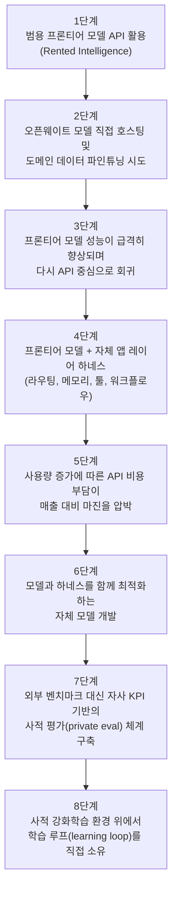
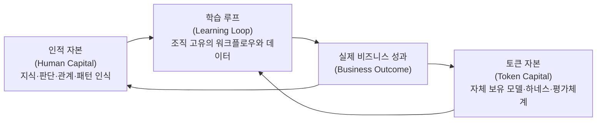

## 관련글

[**8시간전에 Microsoft CEO 사티아 나델라가 X에 올린 글 때문에 실리콘밸리가 꽤 술렁이는 중**](https://www.threads.com/@seung_ju1/post/DZldfWuk2pn)

## 들어가며: 무슨 일이 있었나

2026년 6월 14일 밤(현지 시각), 마이크로소프트 CEO 사티아 나델라가 X(구 트위터)에 **["A frontier without an ecosystem is not stable"](https://x.com/satyanadella/article/2066182223213293753)(생태계 없는 프론티어는 안정적이지 않다)** 라는 제목의 장문 글을 올렸다. 이 글은 짧은 시간에 2,800만 회 이상의 조회수를 기록하며 실리콘밸리 전반에서 큰 화제가 되었다. 일론 머스크는 이 글에 "interesting"(흥미롭다)이라는 짧은 댓글을 남겼고, Replit CEO 암자드 마사드를 비롯해 여러 AI 스타트업 경영진들이 이 글에 대한 의견을 내놓았다. AI 인프라 기업 Prime Intellect 계정으로 추정되는 반응에서는 "AI는 개방적이고 주권적이어야 하며, 모든 기업이 자기 자신의 자기개선 에이전트(self-improving agent)를 만들고 그 루프를 직접 소유해야 한다"는 취지의 호응이 나왔다. 반면 일부 사용자들은 이 글이 결국 마이크로소프트의 사업적 이해관계—즉 기업들이 자체 AI 인프라를 구축하려 할수록 애저(Azure)와 같은 클라우드 인프라 수요가 커진다는 점—와 맞닿아 있다는 비판적인 시선도 보였다.

이 글이 단순한 한 줄 의견이 아니라 실리콘밸리에서 큰 반향을 일으킨 이유는, 지금 AI 애플리케이션 기업들이 실제로 고민하고 있는 구조적 문제—API 비용 부담, 모델 의존성, 그리고 "결국 무엇을 우리 회사의 자산으로 쌓아야 하는가"라는 질문—를 정확히 짚어냈기 때문이다. 아래에서는 나델라가 제시한 핵심 개념을 먼저 풀어보고, 그것이 왜 지금 시점에 의미를 갖는지를 최근 1년간 AI 애플리케이션 생태계에서 실제로 벌어진 변화들과 함께 차근차근 살펴본다.

## 나델라가 던진 핵심 개념: Human Capital과 Token Capital

나델라가 글에서 제시한 출발점은 이렇다. 지금의 AI 전환은 과거의 어떤 플랫폼 전환과도 다르다는 것이다. 과거에는 디지털 시스템이 사람의 역량(human capital)을 보조하는 도구에 머물렀지만, 지금은 처음으로 사람과 디지털 시스템 사이에 진짜 "인지적 루프(cognitive loop)"가 형성될 수 있는 시점에 도달했다고 그는 말한다. 이는 단순히 어떤 도구나 시스템을 쓰느냐의 문제를 넘어서는 변화라는 것이 그의 핵심 주장이다.

이어서 나델라는 모든 기업이 앞으로 두 가지 종류의 자본을 함께 쌓아야 한다고 주장한다. 첫 번째는 인적 자본(human capital)으로, 직원들이 가진 지식, 판단력, 인간관계, 창의성, 그리고 무엇이 중요한 패턴인지를 알아보는 직관 같은 것들을 포함한다. 두 번째는 그가 새롭게 명명한 토큰 자본(token capital)으로, 회사가 직접 만들고 소유하는 AI 시스템과 모델, 그리고 그 위에 쌓인 역량 전체를 가리킨다. 외부 API를 통해 "빌려 쓰는" 지능이 아니라, 회사가 실제로 보유하고 통제할 수 있는 AI 자산이라는 점이 핵심이다.

여기서 나델라가 가장 강조하는 지점은, 토큰 자본이 커진다고 해서 인적 자본의 가치가 줄어드는 것이 아니라는 점이다. 오히려 그 반대다. AI가 더 똑똑해질수록, 어떤 목표를 세울지, 여러 영역에 걸친 점들을 어떻게 연결할지, 어떤 관계를 구축할지, 그리고 무수히 많은 패턴 중 어떤 것이 진짜 중요한지를 판단하는 사람의 역할은 더 커진다는 것이다. 사람의 방향 제시가 없다면, 컴퓨팅 자원은 그저 "제자리를 빙빙 도는" 상태에 머물 뿐이라는 표현으로 그는 이 점을 압축했다.

나델라가 던진 또 하나의 중요한 메시지는, 지금 기업들이 정말 집중해야 할 질문은 "어떤 모델이 제일 좋은가"가 아니라는 점이다. 진짜 기회는 여러 모델 위에 "학습 루프(learning loop)"를 구축해서, 그 루프 안에서 인적 자본과 토큰 자본이 함께 복리로 쌓여가도록 만드는 데 있다는 것이다. 어떤 업무나 직무 자체는 AI에게 위임할 수 있지만, 그 과정에서 쌓이는 "학습" 자체는 위임할 수 없다는 것이 그의 표현이었다. 결국 한 기업의 미래는 사람과 AI에 걸쳐 이 학습을 얼마나 잘 복리로 쌓아갈 수 있느냐에 달려 있다는 뜻이다.

마지막으로 나델라는 산업 전체에 대한 비전을 제시한다. 그는 마이크로소프트의 우선순위가 단순히 "최고의 프론티어 모델"을 만드는 것이 아니라, "프론티어 생태계"를 구축하는 것이어야 한다고 말한다. 그래야 가치가 일부 소수 기업에만 집중되지 않고 모든 기업, 모든 산업, 모든 국가에 폭넓게 흘러갈 수 있다는 것이다. 그가 제시한 이상적인 그림은, 모든 조직이 자신의 조직 고유 지식을 인코딩한 학습 루프를 직접 소유하고, 그 루프 안에서 인적 자본과 토큰 자본을 함께 복리로 쌓아가는 모습이다. 그리고 그는 한 가지 기준을 제시한다. 만약 한 기업이 기반 모델(base model)을 다른 것으로 교체하더라도 그동안 쌓아온 노하우와 역량을 잃지 않는다면, 그 기업은 진정한 의미에서 "주권(sovereignty)"을 가진 것이고, 그렇지 못하다면 그 기업의 지능은 사실상 모델 제공사의 것이라는 논리다.

## 왜 지금, 왜 이렇게 큰 반응이 나왔나

이 글이 단순한 거대 기업 CEO의 의견 표명을 넘어 실리콘밸리 전반의 신경을 건드린 데에는 시기적 배경이 있다. 최근 들어 아마존, 메타, 오라클 등 여러 빅테크 기업들이 AI를 통한 효율화를 이유로 대규모 인력 감축을 단행했고, 이런 흐름은 계속될 것으로 예상되는 상황이었다. 이런 분위기 속에서 "AI가 발전할수록 사람의 역할이 줄어드는 것이 아니라 오히려 더 중요해진다"는 나델라의 메시지는, 노동시장의 불안감과 AI 산업의 구조 변화에 대한 논의가 동시에 진행되는 시점에서 양쪽 모두를 건드리는 발언이 되었다.

또한 AI 애플리케이션 레이어에서 활동하는 경영진들의 입장에서 보면, 이 글은 지금 자신들이 실제로 겪고 있는 세 가지 압박을 거의 그대로 언어화한 것이었다. 첫째는 "빌려 쓰는 지능(rented intelligence)"에서 "소유한 지능(owned intelligence)"으로 가는 흐름이고, 둘째는 프론티어 모델의 API 비용이 애플리케이션 레이어 기업들의 매출 마진을 갉아먹는 문제, 셋째는 외부의 범용 벤치마크가 아니라 자기 회사의 실제 KPI에 맞춘 사적 평가 체계(private eval)와 강화학습 환경이 점점 더 중요해지는 문제다. 이 세 가지 흐름이 지난 1년 사이 실제로 어떻게 전개되어 왔는지를 살펴보면, 나델라의 글이 왜 그렇게 정확하게 시점을 짚었다는 평가를 받았는지 이해할 수 있다.

## 흐름으로 보는 변화: "빌려 쓰는 지능"에서 "소유하는 지능"으로

지난 몇 년간 AI 애플리케이션 기업들이 거쳐온 단계를 순서대로 정리하면 다음과 같은 흐름으로 볼 수 있다.

초창기에는 많은 사람들이 범용 대형언어모델(LLM)이 거의 모든 것을 흡수할 것이라고 예상했다. OpenAI, 구글, 그리고 앤트로픽 같은 회사가 만든 모델을 API로 가져다 쓰고, 그 위에 사용자 경험(UX)이나 업무 흐름(workflow)만 잘 얹으면 된다는 인식이 강했다. 즉 모델은 "빌리고", 제품은 그 위에 짓는다는 구조였다.

그러나 오픈웨이트 모델들의 성능이 빠르게 좋아지면서 분위기가 한 차례 바뀌었다. 일부 기업들이 직접 모델을 호스팅하고, 자기 도메인 데이터로 파인튜닝을 하고, 특정 업무 흐름에 맞춘 작은 모델을 만들기 시작한 것이다. 이것이 "빌려 쓰는 지능"에서 "소유하는 지능"으로 가는 첫 번째 시도였다고 볼 수 있다.

하지만 이 흐름은 오래가지 않았다. 프론티어 모델들의 추론, 도구 호출, 코딩, 에이전트 능력이 너무 빠르게 향상되면서, 굳이 자체 모델을 직접 운영할 필요가 없어 보이는 시기가 다시 찾아왔다. 그 시점에서 가장 현실적인 구조로 자리 잡은 것이 바로 "프론티어 모델 + 앱 레이어 하네스"라는 형태였다. 모델 자체는 OpenAI, 앤트로픽, 구글 등이 제공하고, 그 위에 라우팅, 메모리, 도구 연동, 멀티에이전트 오케스트레이션, 권한 관리, 평가 체계, 워크플로우 같은 요소들을 앱 회사가 직접 구축해서 제품을 완성하는 방식이다. 코딩 에이전트나 법률 AI 같은 영역에서 이런 구조를 가진 기업들이 빠르게 성장했다.

## 다시 떠오른 비용 문제: 프론티어 API에 대한 의존이 마진을 압박하다

문제는 사용량이 커질수록 다시 불거졌다. 프론티어 모델 제공사들이 더 이상 무한정 비용을 보조해주지 않게 되면, 사용량이 큰 앱 레이어 기업들은 매출이 늘어날수록 모델 API 비용도 함께 늘어나는 구조에 갇히게 된다. 결과적으로 매출 규모는 커지더라도 매출에서 비용을 뺀 매출이익률(gross margin)은 오히려 압박을 받는 상황이 벌어진다. 이는 AI 애플리케이션 회사들에게 상당히 치명적인 구조적 문제로 작용한다.

이 문제를 가장 잘 보여주는 사례가 코딩 에이전트 도구인 커서(Cursor)다. 커서를 만드는 Anysphere는 수익의 상당 부분이 앤트로픽이나 OpenAI 같은 모델 제공사에 API 비용으로 빠져나가는 구조를 겪었고, 이를 해결하기 위해 자체 모델인 Composer를 개발하기 시작했다. 특히 Composer 2 버전부터 흥미로운 점은, 단순히 "코딩을 잘하는 모델"을 만든 것이 아니라 커서라는 특정 하네스 안에서 잘 작동하도록 모델과 하네스를 함께 최적화했다는 점이다.

## Cursor Composer 2: 모델과 하네스를 함께 학습시킨다는 것

Composer 2는 2026년 3월 19일 출시되었으며, 커서 3의 자동(Auto) 모드 기본 모델로 채택되었다. 이 모델은 Kimi K2.5를 기반으로 한 추가 사전학습(continued pretraining)을 먼저 거친 뒤, 대규모 강화학습을 통해 코딩 성능을 끌어올리는 두 단계 학습 과정을 거쳤다.

이 모델 학습 과정에서 가장 핵심적인 설계 철학은, 실제 사용자가 겪는 문제와 학습 환경 사이의 차이를 최소화하기 위해, 모델을 훈련할 때도 실제 배포 환경과 동일한 커서 하네스—같은 도구, 같은 구조—를 사용했다는 점이다. 즉 평가 단계에서도 운영 중인 백엔드와 클라이언트의 특정 버전을 그대로 고정해 사용함으로써, 학습 중 모델의 행동이 실제 사용자가 마주하는 것과 정확히 일치하도록 만들었다. 이는 모델 따로, 하네스 따로 개발하던 기존 방식과는 분명히 다른 접근이다.

성능 측면에서 Composer 2는 커서가 자체적으로 만든 벤치마크인 CursorBench에서 61.3점을 기록했는데, 이는 이전 버전인 Composer 1.5보다 약 37% 향상된 수치다. 공개 벤치마크에서는 SWE-bench Multilingual에서 73.7점, Terminal-Bench에서 61.7점을 기록하며 최상위권 모델들과 견줄 만한 수준을 보였다. 가격 측면에서는 입력 토큰 100만 개당 0.50달러, 출력 토큰 100만 개당 2.50달러로 책정되어, 프론티어 모델 대비 현저히 낮은 비용 구조를 갖췄다.

이후 출시된 후속 버전인 Composer 2.5는 기본 설정(default settings) 기준의 CursorBench v3.1에서 클로드 Opus 4.7과 GPT-5.5를 모두 앞서는 결과를 보였다고 알려졌으며, 작업당 비용도 1달러 미만으로 클로드의 6~11달러, GPT-5.5의 2~4달러에 비해 훨씬 낮았다. 다만 이 수치는 커서 자체의 하네스와 벤치마크에서 나온 결과이며, CursorBench는 커서가 직접 설계하고 Composer 학습에 최적화된 사적 벤치마크라는 점은 짚어둘 필요가 있다. 실제로 CursorBench와 SWE-bench Verified 같은 외부 벤치마크는 모델 순위를 다르게 매기는 경우가 있는데, 이는 CursorBench가 인라인 코드 제안의 정확도나 변경사항 적용 비율처럼 IDE 환경에 특화된 행동을 더 중요하게 평가하기 때문이다. 따라서 Composer 2를 "커서라는 환경 안에서는 가장 잘 작동하도록 훈련된 모델"로 보는 것이 더 정확한 해석이라는 평가가 많다.

아래 표는 공개된 정보를 바탕으로 Composer 2 관련 수치를 정리한 것이다.

| 항목 | Composer 2 | 비교 대상 |
|---|---|---|
| 기반 모델 | Kimi K2.5 (추가 사전학습 + 대규모 RL) | - |
| CursorBench | 61.3 (Composer 1.5 대비 약 37% 향상) | Opus 4.7, GPT-5.5는 기본 설정 기준 Composer 2.5에 뒤짐 |
| SWE-bench Multilingual | 73.7 | 최상위권 모델과 유사한 수준 |
| Terminal-Bench | 61.7 | - |
| 가격 (입력/출력, 100만 토큰당) | $0.50 / $2.50 | Opus 작업당 $6~11, GPT-5.5 작업당 $2~4 (Composer 2.5 기준) |
| 제공 형태 | 커서 IDE, 커서 CLI, 커서 웹 전용 (외부 API 없음) | 범용 API로 제공되는 프론티어 모델과 차이 |

이 표에서 알 수 있듯, Composer 2/2.5의 의미는 단순한 "가성비 좋은 코딩 모델"이 아니라, 모델과 그 모델이 실제로 동작하는 환경(하네스)을 한 묶음으로 설계하고 학습시킨 결과물이라는 데 있다. 이는 나델라가 말한 "토큰 자본"의 구체적인 사례로 볼 수 있다—커서는 외부에서 빌려 쓰는 모델이 아니라, 자기 제품 안에서만 작동하지만 자기 제품 안에서는 가장 효율적으로 작동하는 자산을 직접 보유하게 된 것이다.

## 사적 평가(Private Eval)의 시대: Mercor와 "이제는 평가가 곧 제품 요구사항이다"

나델라가 언급한 "사적 강화학습 환경(private reinforcement learning environments)"이라는 개념은, 최근 빠르게 성장하고 있는 AI 평가(eval) 산업의 흐름과도 정확히 맞물려 있다.

이 흐름을 가장 잘 보여주는 기업이 Mercor다. 2023년 1월, 세 명의 대학생이 설립한 이 회사는 처음에는 일반적인 AI 인재 매칭 플랫폼으로 시작했지만, 빠르게 방향을 전환해 전문가 기반의 AI 모델 평가(eval) 서비스로 자리를 잡았다. 현재 Mercor는 약 100억 달러의 기업가치를 인정받고 있으며, OpenAI, 앤트로픽을 비롯해 매그니피센트 세븐으로 불리는 빅테크 기업 중 여섯 곳과 계약을 맺고 있다. 이 회사는 3만 명이 넘는 전문가 네트워크를 운영하며, 이들은 평균 시간당 95달러를 받고 모델의 성능을 테스트하고 평가하는 작업을 수행한다.

Mercor의 공동창업자이자 CEO인 브렌든 푸디는 "지금은 AI 평가의 시대"라는 표현으로 이 흐름을 요약한 바 있다. 그가 강조하는 핵심은, 만약 모델 자체가 "제품"이라면, 그 모델을 평가하는 기준(eval)은 곧 전통적인 제품 개발에서의 제품 요구사항 문서(PRD)와 같은 역할을 한다는 것이다. 따라서 좋은 평가 체계를 만드는 작업은 시간당 30달러 수준의 일반 인력이 할 수 있는 일이 아니라, 시간당 200달러를 받는 빅테크 출신 엔지니어나 시간당 500달러를 받는 인수합병 전문 변호사 같은 고급 도메인 전문가가 필요한 작업으로 바뀌었다.

이 흐름을 나델라의 프레임으로 다시 읽으면, 이렇게 만들어진 "사적 평가 체계"와 그 평가를 통과하기 위해 반복적으로 다듬어지는 모델의 행동 패턴 자체가, 한 기업이 외부에 공개하지 않고 직접 소유하는 새로운 형태의 지적재산(IP)이 된다는 뜻이다. 외부의 범용 벤치마크 점수가 아니라, 자기 회사의 실제 워크플로우 흔적(trace)을 기반으로 모델이 반복 학습하고, 그 결과가 실제 비즈니스 성과로 이어지는 구조—이것이 바로 나델라가 말한 "학습 루프"의 실체에 가깝다.

## 종합: 이 흐름들이 가리키는 하나의 방향

지금까지 살펴본 흐름들을 다시 하나의 그림으로 정리하면, 인적 자본과 토큰 자본이 서로를 강화하며 순환하는 구조로 표현할 수 있다.

이 그림이 의미하는 바는, 인적 자본과 토큰 자본이 따로 떨어져 존재하는 두 개의 자산이 아니라, 학습 루프라는 하나의 시스템을 통해 서로를 키워주는 관계라는 점이다. 사람의 판단이 모델과 평가체계, 워크플로우 데이터에 반영되고, 그렇게 만들어진 토큰 자본이 다시 실제 업무 성과를 더 좋게 만들고, 그 성과가 다시 사람의 학습과 판단을 더 정교하게 만든다. 이 순환이 끊기지 않고 계속 돌아갈 수 있는 구조를 갖춘 기업이, 나델라가 말하는 "학습 루프를 소유한 기업"이다.

지금까지 정리한 흐름을 시간 순서로 보면 이렇다. 처음에는 프론티어 모델의 API를 빠르게 가져다 쓰면서 제품을 시작한다. 그다음에는 그 위에 라우팅, 메모리, 도구 연동 같은 앱 레이어 하네스를 구축해서 실제 제품으로 완성한다. 사용량이 커지면 API 비용 부담 때문에 오픈웨이트 모델을 직접 운영하는 단계로 넘어간다. 그리고 마지막에는 자기 회사만의 평가 체계, 강화학습 환경, 워크플로우 데이터를 기반으로 "소유한 지능"을 쌓아간다. 커서의 Composer 2/2.5는 이 흐름에서 세 번째와 네 번째 단계를 가장 빠르게, 그리고 가장 적극적으로 밀어붙인 사례라고 볼 수 있다.

나델라의 글이 큰 반향을 얻은 이유는, 이런 여러 갈래의 흐름을 "기업의 미래는 무엇으로 구성되는가"라는 하나의 언어로 정리했기 때문이다. 그가 그린 그림에서, AI 시대의 승자는 단순히 가장 좋은 모델을 고르는 회사가 아니라, 사람의 판단과 AI 시스템이 함께 학습해 나가는 루프 자체를 소유한 회사일 가능성이 크다. 다만 이 메시지가 마이크로소프트의 클라우드·AI 인프라 사업과도 이해관계가 맞아떨어진다는 점에서, 이를 순수한 산업 통찰로만 볼 것인지 혹은 자사 사업에 유리한 내러티브로 볼 것인지에 대해서는 의견이 엇갈리고 있다는 점도 함께 짚어둘 만하다.

## 참고 자료

- Stocktwits, "Microsoft CEO Satya Nadella Pitches New AI Framework With 'Human Capital And Token Capital' As Stock Still Trails Mag7 Peers" (2026-06-15)
- Digit, "Satya Nadella reveals the one thing companies must do to survive the AI era"
- BeInCrypto, "Microsoft CEO Nadella Says Every Firm Must Build Token Capital"
- Grafa, "Microsoft CEO says firms need AI token capital"
- KuCoin News, "Microsoft CEO Proposes Human and Token Capital in the AI Era"
- Cursor, "Introducing Composer 2" 및 Composer 2 Technical Report (arXiv:2603.24477)
- Cursor Docs, "Composer 2"
- BuildFastWithAI, "Cursor Composer 2.5: Benchmarks, Pricing & Full Review"
- Big Think, "Inside the meteoric rise of Mercor"
- 원문 게시물: https://x.com/satyanadella/status/2066182223213293753

---

**작성일: 2026년 6월 15일**
