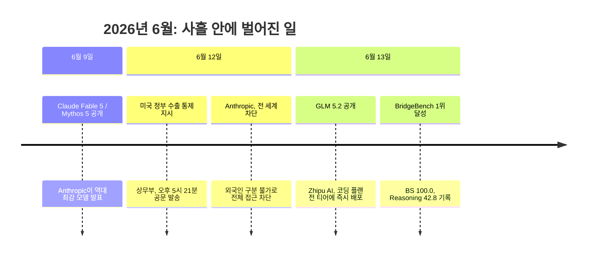
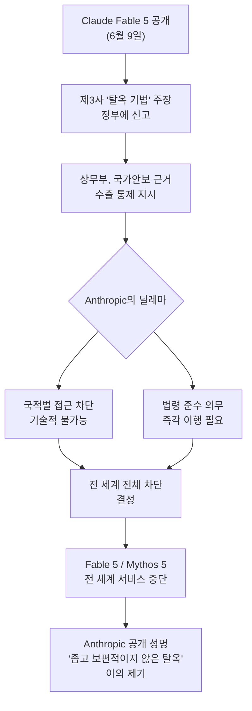
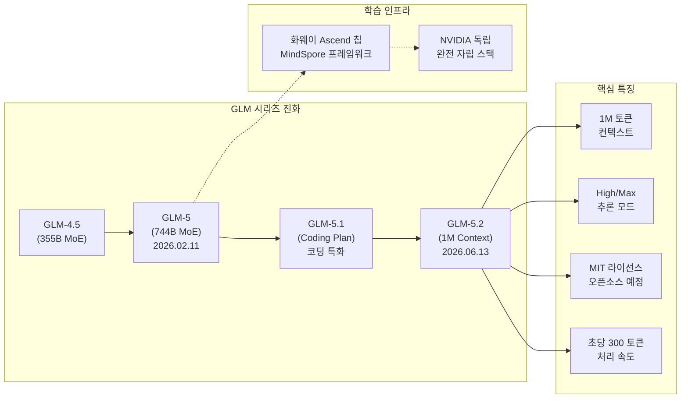
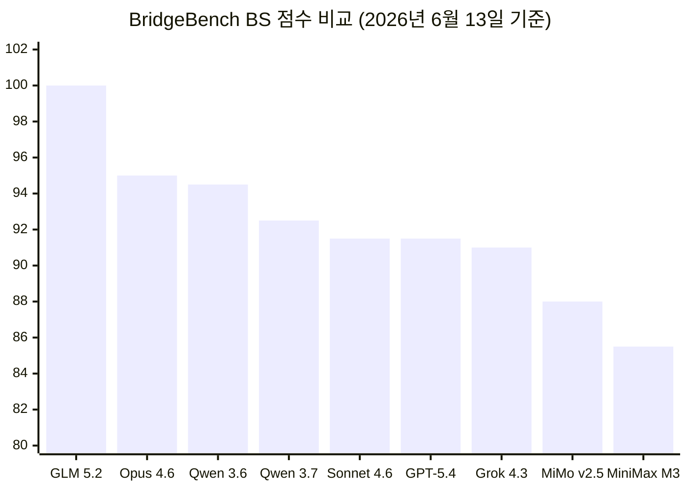
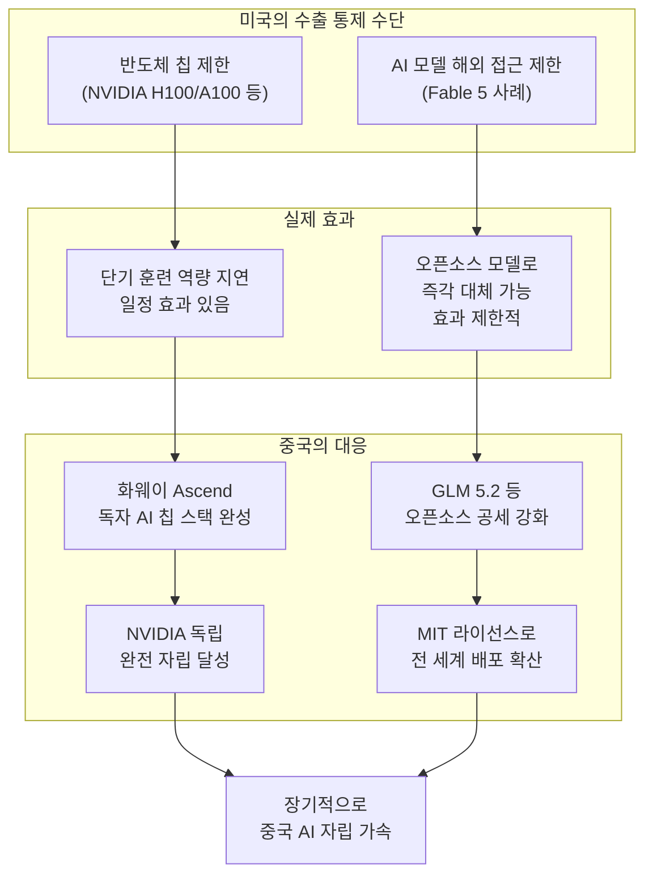
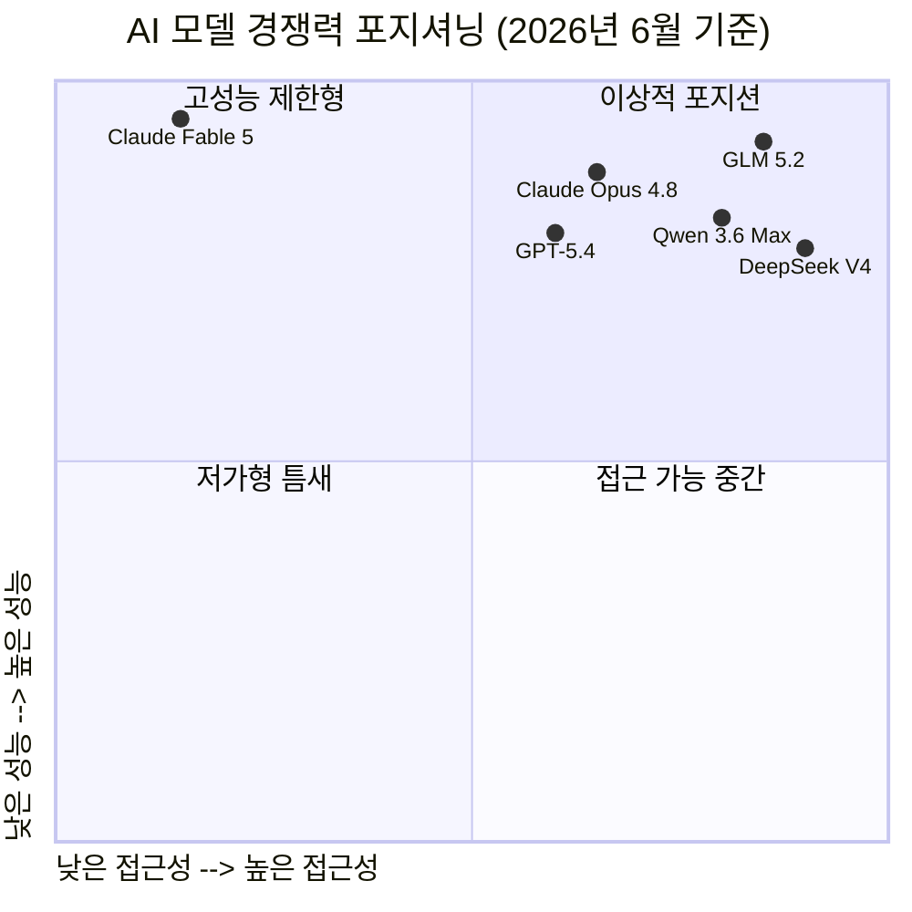
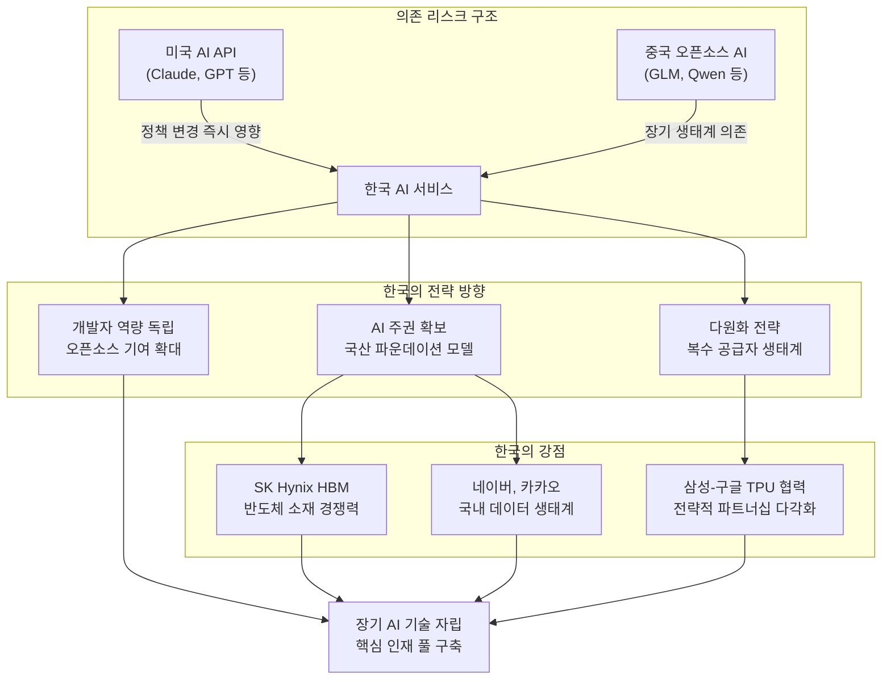

> **2026년 6월, 사흘 안에 벌어진 일**: 미국 정부가 Anthropic의 최신 모델을 강제 차단했고, 중국은 하루 만에 새로운 오픈소스 모델을 발표했으며, 그 모델은 즉시 글로벌 벤치마크 1위를 차지했다. 이 짧은 시간 속에 AI 패권 경쟁의 구조적 역학이 날카롭게 드러났다.

## 관련글

[https://www.facebook.com/share/17p9zpUfRe/](https://www.facebook.com/share/17p9zpUfRe/)

미국이 최신 프론티어 모델의 해외 접근을 막자마자 중국 기업은 오픈소스 모델 GLM 5.2이 공개했다. 

발표하자마자 bridgebench 1위를 차지했다. 성능, 비용, 속도 측면에서 엄청 우수한 결과를 보이고 있다. 올해 안에 중국 오픈소스 모델들은 미토스 정도급으로 발전할듯 하다. 

이번 미국의 조치는 장기적으로는 중국 오픈소스 AI 진영에 더 강한 동력을 주는 계기가 되었다. 

AI는 반도체처럼 통관에서만 막을 수 있는 물건이 아니다.

모델 구조, 학습 레시피, 추론 최적화, 개발자 생태계가 결합되면 한 번 열린 기술은 전 세계에서 복제되고 개선된다.

미국 모델을 못 쓰게 되면 해외 스타트업과 연구자들은 기다리지 않는다.

더 싸고, 더 빠르고, 접근 가능한 중국 모델로 이동한다. 그 사용량은 다시 데이터가 되고, 피드백이 되고, 생태계가 된다.

결국 프론티어 AI 경쟁의 핵심은 계속 쓰게 만드는 힘이다. 성능, 가격, 속도, 접근성, 생태계에서 이기는 쪽이 표준이 될 가능성이 높다. 

한국도 이 흐름을 매우 냉정하게 봐야 한다. 특정 국가의 API에 과도하게 의존하는 순간, 우리 AI 산업의 생명선은 남의 정책 버튼 하나에 걸리게 된다.

미국이 최신 프론티어 모델의 해외 접근을 제한하는 흐름과 중국이 빠르게 치고 나오는 이 상황은 대한민국에도 매우 중요한 메시지를 던지는것 같다.

---

## 1장. 사흘의 타임라인: 무슨 일이 있었나

2026년 6월 9일, Anthropic은 자사 역사상 가장 강력한 모델을 공개했다. Claude Fable 5와 Claude Mythos 5. Fable 5는 일반에 공개된 모델 중 "우리가 만든 가장 유능한 모델"이라는 수식어가 붙었다. 소프트웨어 취약점 탐지, 장기 자율 과제 수행, 과학 연구 지원 등에서 이전 세대를 압도하는 성능을 보였다. Mythos 5는 같은 기반 모델에서 일부 안전 장치를 해제한 버전으로, 신뢰된 사이버보안 및 생물학 연구자들을 위한 '프로젝트 글라스윙(Project Glasswing)' 참여 기관에만 제공되었다.

그로부터 단 사흘 뒤인 6월 12일 오후 5시 21분(미 동부 시간), Anthropic은 미국 상무부로부터 한 통의 공문을 받았다. 트럼프 행정부가 국가안보 권한을 근거로 Fable 5와 Mythos 5에 대한 수출 통제 지시를 내린 것이다. 내용의 핵심은 간단하고도 충격적이었다. 미국 국적이 아닌 모든 외국인은 미국 내에 있든 밖에 있든, 심지어 Anthropic 소속 외국인 직원들까지도, 두 모델에 대한 접근이 즉시 금지된다는 것이었다. 

Anthropic은 실시간으로 사용자의 국적을 구분할 방법이 없었다. 결국 전 세계 모든 고객의 접근을 차단하는 방식으로 법령을 이행했다. Claude Opus 4.8을 포함한 다른 모든 모델은 영향을 받지 않았다. 이것은 공개 배포된 프론티어 AI 모델에 대한 정부 강제 셧다운으로서는 사실상 역사상 최초의 사례였다.

다음 날인 6월 13일, 중국의 Zhipu AI(Z.ai)는 GLM 5.2를 발표했다. 발표 당일 BridgeBench 종합 점수(BS) 부문 100.0점으로 1위, 추론(Reasoning) 부문 42.8점으로 1위를 기록했다. 비용은 최상위 경쟁 모델의 10분의 1 수준, 처리 속도는 초당 300 토큰이었다.

이 사흘의 연쇄 반응은 단순한 우연의 일치가 아니었다. AI 기술 패권을 둘러싼 미중 경쟁의 구조적 긴장이 수면 위로 폭발한 사건이었다.

---

## 2장. Claude Fable 5와 Mythos 5: 왜 차단되었나

Fable 5는 Anthropic이 "Mythos 클래스"라고 명명한 새로운 성능 등급의 첫 번째 공개 모델이었다. 이전의 Opus 클래스보다 한 단계 위를 의미한다. 특히 이 모델은 소프트웨어 취약점 탐지 능력에서 탁월했다. Mozilla 혼자서도 Mythos Preview를 활용해 수백 건의 보안 취약점을 해결했다는 사례가 보고될 만큼, 사이버보안 분야에서 전례 없는 효용을 보였다.

미국 정부가 행동에 나선 직접적인 계기는 제3의 기업이 "Fable 5를 탈옥(jailbreak)하는 방법을 발견했다"고 주장한 데서 비롯되었다. 정부가 Anthropic에 설명한 탈옥 기법의 본질은, 모델에게 특정 코드베이스를 읽고 소프트웨어 결함을 찾아달라고 지시하는 방식이었다. 행정부는 이 기술이 사이버 공격에 활용될 수 있다고 우려했다.

Anthropic의 반론은 명확했다. 정부가 제시한 탈옥 기법을 직접 검토한 결과, 이미 알려진 소수의 경미한 취약점을 찾아내는 정도에 불과했으며, GPT-5.5를 포함한 다른 공개 모델들도 탈옥 없이 동일한 종류의 취약점을 발견할 수 있다고 밝혔다. 이 기준을 업계 전체에 적용한다면 사실상 모든 프론티어 모델 출시가 불가능해진다는 점도 지적했다. 그러면서도 Anthropic은 법령을 준수했고, 동시에 공개적으로 이의를 제기했다.

미국 정부는 Trump 행정부가 Fable 5 출시를 사전에 막으려 시도했지만 실패했다는 점도 보도를 통해 알려졌다. 이번 지시는 Commerce Secretary Howard Lutnick이 Dario Amodei에게 보낸 서한 형식으로 전달되었다. Anthropic의 IPO를 앞두고 발생한 이 사태는 회사의 기업 가치와 시장 신뢰에도 부정적인 영향을 미쳤다.

---

## 3장. GLM 5.2: 배경과 기술적 맥락

GLM 5.2를 이해하려면, Zhipu AI(Z.ai)가 어떤 회사이며 GLM 시리즈가 어떤 궤적을 그려왔는지 먼저 살펴볼 필요가 있다.

Zhipu AI는 2026년 2월 중국 최초의 상장 AI 기업이 된 회사다. 2026년 2월 11일, 음력 새해 직전에 GLM-5를 발표하며 글로벌 AI 시장에 강력한 존재감을 드러냈다. GLM-5는 7440억(744B) 파라미터 규모의 혼합 전문가(Mixture-of-Experts, MoE) 구조를 채택했으며 토큰당 400억 파라미터가 활성화된다. 이전 세대인 GLM-4.5(355B 전체, 320억 활성)에서 약 2배 규모로 확장된 것이다. SWE-bench Verified에서 77.8%, AIME 2026에서 92.7%, GPQA-Diamond에서 86.0%를 기록하며 오픈 웨이트 모델 중 1위를 차지했다.

가장 주목받은 사실은 GLM-5가 NVIDIA 하드웨어를 전혀 사용하지 않고 화웨이(Huawei)의 Ascend 칩과 MindSpore 프레임워크만으로 훈련되었다는 점이다. 미국의 반도체 수출 규제를 완전히 우회한 독자적인 AI 스택의 실현이었다.

GLM-5.1이 뒤를 이었다. 코딩 전용 플랜(Coding Plan)을 도입하고 Claude Opus 4.6 대비 94.6%에 달하는 코딩 벤치마크 점수를 자체 발표했다. MIT 라이선스로 오픈소스화하면서 글로벌 개발자 생태계로의 확산을 가속했다.

그리고 2026년 6월 13일, GLM 5.2가 등장했다. 핵심 업그레이드는 세 가지다.

첫째, 실용적인 100만 토큰 컨텍스트 윈도우다. 기존의 긴 컨텍스트 모델들이 토큰 수를 늘려도 정확도가 떨어지는 문제가 있었던 반면, Zhipu는 "실제로 사용 가능한" 100만 토큰을 강조했다. 레포지토리 규모의 코드베이스 전체를 단일 세션에서 처리할 수 있는 규모다.

둘째, 이중 추론 노력 시스템(Dual Thinking-Effort System)이다. High 모드와 Max 모드 중 선택할 수 있으며, Max는 복잡한 코딩 작업에 권장된다.

셋째, 코딩 에이전트 생태계와의 폭넓은 호환성이다. Claude Code, Cline, OpenCode, Roo Code, Goose, Crush, OpenClaw, Kilo Code 등 주요 코딩 에이전트 도구들과 즉시 연동 가능하다.

출시 당일에는 별도의 공식 벤치마크 수치를 발표하지 않았다. 그러나 BridgeBench가 자체 평가를 실시했고, 그 결과가 세계를 놀라게 했다.

---

## 4장. BridgeBench 결과: 숫자가 보여주는 것

BridgeBench는 다수의 AI 모델을 독립적으로 평가하는 벤치마크 플랫폼이다. GLM 5.2가 발표 당일 이 플랫폼에서 기록한 성적은 다음과 같았다.

BS(종합 점수) 부문에서 GLM 5.2는 100.0점 만점으로 1위를 차지했다. 2위는 Claude Opus 4.6(95.0점), 3위는 Qwen 3.6 Max Preview(94.5점), 4위 Qwen 3.7 Max(92.5점), 5위 Claude Sonnet 4.6(91.5점), 6위 GPT-5.4(91.5점), 7위 Grok 4.3(91.0점), 8위 MiMo v2.5 Pro(88.0점), 9위 MiniMax M3(85.5점)의 순이었다.

추론(Reasoning) 부문에서도 GLM 5.2는 42.8점으로 1위였다. 2위는 Nemotron 3 Ultra 550B-A55B(41.7점), 3위에는 접근이 차단된 Claude Fable 5(41.5점)가 자리했다. Grok 4.3(40.9점), GPT-5.4(40.6점), Qwen 3.6 Max Preview(40.5점), MiniMax M3(40.4점), Kimi K2.6(40.3점), Claude Opus 4.7(40.3점)이 뒤를 따랐다.

여기서 눈길을 끄는 것은 Reasoning 3위에 Claude Fable 5가 올라 있다는 사실이다. 미국 정부가 차단한 그 모델이 GLM 5.2보다 불과 1.3점 낮은 성적으로 여전히 최상위 클러스터 안에 있다. 그런데 그 모델은 세계 대부분의 사용자가 쓸 수 없다. 반면 GLM 5.2는 1위이면서 비용은 10분의 1, 속도는 초당 300 토큰, 그리고 MIT 라이선스로 누구나 내려받을 수 있도록 공개 예정이다.

중요한 맥락 하나를 덧붙여야 한다. Zhipu는 출시 당일 자체 벤치마크 수치를 공개하지 않았다. BridgeBench의 결과는 제3자 평가이지만, 아직 광범위한 독립 검증이 이루어지지 않은 시점의 데이터다. 또한 GLM 5.2는 GLM-5.1 구조를 기반으로 하며 이전 세대에서 독립 검증된 성능을 감안할 때 유사한 수준의 성능을 기대할 수 있지만, 1M 컨텍스트 환경에서의 실제 정확도 유지 여부는 추가 검증이 필요하다.

그럼에도 불구하고 핵심 메시지는 분명하다. 미국이 최고 성능 모델의 해외 접근을 막은 바로 그 다음 날, 필적하거나 이를 능가하는 성능의 오픈소스 대안이 등장했다.

---

## 5장. 수출 통제의 구조적 한계: AI는 반도체가 아니다

미국의 AI 수출 통제 전략은 반도체 통제 성공 경험에서 영감을 받았다. NVIDIA의 A100, H100, H800 등 첨단 AI 칩의 중국 수출을 제한함으로써 중국의 AI 훈련 역량을 지연시킨 것은 실제로 일정한 효과가 있었다. 최소한 시간은 벌었다.

그러나 AI 모델 자체는 반도체와 근본적으로 다르다. 국경 세관에서 컨테이너를 멈추는 것처럼 소프트웨어를 막을 방법은 없다. 모델의 가중치(weights)는 파일이다. 한 번 공개된 파일은 전 세계 어디서나 복제되고 재배포될 수 있다. 이것이 오픈소스 AI가 수출 통제를 사실상 무력화하는 이유다.

더 깊은 구조적 문제가 있다. AI 기술의 핵심은 모델 파라미터만이 아니다. 모델 아키텍처 설계, 훈련 레시피(데이터 혼합 비율, 학습률 스케줄링 등), 추론 최적화 기법, 그리고 이 모든 것을 이해하고 응용하는 개발자 생태계가 결합될 때 비로소 기술이 산다. GLM-5 시리즈는 논문과 함께 공개됐고, DeepSeek R1이 내부 추론 체인과 훈련 방법론을 공개한 것처럼 중국 오픈소스 랩들은 기술을 확산시키는 방식으로 경쟁해왔다.

Rand Corporation의 2026년 3월 보고서는 이 점을 명확히 지적한다. 오픈소스 AI 경쟁에서 미국이 뒤처지고 있으며, 수출 통제를 재보정하고 퍼미시브 라이선스를 장려하는 인센티브를 만들어야 한다고 주장한다. Chatham House의 분석도 같은 결론이다. AI 칩과 하드웨어에 대한 수출 통제만으로는 중국의 AI 발전을 막을 수 없다.

반도체 수출 통제가 낳은 역설도 있다. 미국이 최첨단 칩의 중국 공급을 차단하자, 화웨이는 Ascend 시리즈 개발에 더욱 집중할 수밖에 없었다. 중국의 주요 AI 기업들은 자국산 칩을 써야 했고, 이 과정에서 Huawei Ascend 기반의 훈련 및 추론 파이프라인이 성숙해졌다. GLM-5 전체를 NVIDIA 칩 없이 화웨이 Ascend와 MindSpore로만 훈련한 것은 그 성숙의 증거다.

미국의 수출 통제가 강해질수록, 중국은 그것을 동력 삼아 더 자립적인 AI 스택을 완성해왔다. 의도치 않게 중국의 반도체 자립을 앞당기는 결과를 낳은 셈이다.

---

## 6장. 중국의 오픈소스 전략: 보이지 않는 디지털 인프라

중국 AI 랩들의 오픈소스 전략은 단순히 기술을 공유하는 행위가 아니다. 전략적으로 설계된 생태계 장악 메커니즘이다.

Foreign Policy는 이것을 "디지털 일대일로(Belt and Road Initiative)"에 비유한다. 과거 BRI가 항만, 철도, 발전소 같은 물리적 인프라를 수출국 자금으로 건설해 상대국을 중국 경제 궤도에 묶어두었다면, AI 오픈소스 전략은 눈에 보이지 않고 무료인 소프트웨어 인프라를 통해 같은 목표를 추구한다. AI 확산의 한계비용은 거의 0에 가깝다. 서버와 전력 비용은 사용국이 부담한다. BRI가 눈에 띄는 중국 소유 인프라를 남겨 때로 반발을 불렀다면, AI 의존성은 정책 입안자와 대중 모두에게 보이지 않아 저항이 훨씬 적다.

숫자가 이를 뒷받침한다. Alibaba의 Qwen 시리즈는 2026년 3월 기준 누적 9억 4200만 건의 다운로드를 기록했다. 이는 차순위 8개 모델의 합계를 넘어서는 수치다. Qwen 3.5는 이전 세대보다 최대 8배 빠르고 60% 저렴하다. Baidu는 2024년 Hugging Face에 릴리즈가 없었다가 2025년 100건 이상을 공개했다. ByteDance와 Tencent는 같은 기간 오픈소스 릴리즈를 8~9배 늘렸다.

2026년 2월, 주요 글로벌 AI 플랫폼 OpenRouter에서 중국 모델들의 주간 토큰 소비량이 미국 모델을 처음으로 추월했다. 그리고 그 격차는 이후 계속 벌어지고 있다.

동남아시아에서의 침투는 특히 눈에 띈다. 싱가포르의 OCBC 은행은 DeepSeek과 Qwen 기반으로 30개 이상의 내부 도구를 운영 중이다. 인도네시아의 Indosat는 DeepSeek 기반의 AI 기업과 파트너십을 맺었다. 말레이시아는 화웨이 하드웨어 위에 국가 AI 생태계를 구축했다. 이것은 단순한 제품 채택이 아니다. AI 인프라 표준의 이전이다. 특정 국가의 정부, 기업, 연구기관이 중국 AI 스택 위에 시스템을 구축하면, 그 의존성은 시간이 지날수록 심화되고 전환 비용은 기하급수적으로 높아진다.

중국 오픈소스 AI는 두 개의 피드백 루프를 통해 스스로 강화된다. 글로벌 배포를 통해 사용 데이터를 수집하고, 개발자 기여를 통해 모델이 개선되며, 상업적 관계가 형성되고, 이것이 다시 중국 AI를 비용에 민감한 시장 전반의 기본 인프라 레이어로 굳힌다. 미국의 프론티어 랩들이 더 강력한 개별 모델을 내놓아도, 중국 오픈소스 생태계의 확산 속도를 따라잡기 어려운 이유가 여기에 있다.

---

## 7장. 화웨이 Ascend: 칩 수출 통제를 넘어선 자립

GLM-5 시리즈의 기술적 성취 중 가장 주목해야 할 부분은 하드웨어 독립이다. NVIDIA 칩 없이 최상위 성능을 구현했다는 사실은 미국의 반도체 수출 통제 전략 전체에 대한 실질적인 반증이다.

화웨이 Ascend 시리즈는 미국의 규제를 역설적인 방식으로 키워왔다. 중국 기업들이 NVIDIA에 접근하지 못하게 되자, 내부적으로 대안을 쓸 수밖에 없었고 화웨이는 이 기회를 포착했다. 2025년 8월, 화웨이는 CANN(Compute Architecture for Neural Networks)을 오픈소스로 공개했다. NVIDIA의 CUDA가 15년간 AI 연구의 기반이 된 것처럼, CANN을 중심으로 한 개발자 생태계를 구축하려는 전략이었다.

Huawei Ascend 칩은 대학 커리큘럼, 연구 얼라이언스, 국가 클라우드 공급자들에 공격적으로 배포되었다. 단순한 제품 판매가 아닌, 미래 AI 인재들이 처음부터 Ascend 기반 워크플로에 익숙해지도록 만드는 교육 생태계 전략이다.

물론 아직 격차는 존재한다. NVIDIA Blackwell Ultra GB300은 288GB HBM3e 메모리와 15 petaflops의 FP4 연산 능력을 갖췄다. 화웨이의 현재 최고 제품 Ascend 950PR은 그에 비해 여전히 성능이 낮다. 소프트웨어 스택도 도전 과제다. CUDA 기반 워크플로에서 Ascend/CANN으로 전환하려면 다른 최적화와 아키텍처 선택이 필요하다. DeepSeek V4의 개발이 부분적으로 Ascend 훈련의 어려움으로 지연됐다는 보도도 있다. 그러나 중요한 것은 방향이다. Zhipu가 744B 파라미터 모델을 전적으로 Ascend 위에서 훈련해 글로벌 최상위 수준에 도달했다는 사실은, 중국의 AI 칩 자립이 이미 훈련 영역에서 작동 가능한 수준에 진입했음을 보여준다.

---

## 8장. 프론티어 AI 경쟁의 진짜 규칙: 계속 쓰게 만드는 힘

AI 패권 경쟁의 본질은 무엇인가. 가장 강력한 모델을 만드는 것만으로는 충분하지 않다. 사람들이 계속해서 쓰게 만드는 힘이 궁극적인 승부를 결정한다. 그리고 그 힘은 다섯 가지 요소의 교차점에서 나온다. 성능, 가격, 속도, 접근성, 생태계.

Claude Fable 5는 이 다섯 가지 중 성능에서는 우위를 점했을지 몰라도, 나머지 네 가지에서 치명적인 제약이 생겼다. 미국 정부의 지시로 해외 접근성 자체가 차단됐기 때문이다.

GLM 5.2는 다섯 가지 모두에서 경쟁력을 보였다. BridgeBench 1위라는 성능, 경쟁 모델의 10분의 1이라는 가격, 초당 300 토큰이라는 속도, MIT 라이선스를 통한 완전 공개라는 접근성, 그리고 Claude Code를 포함한 주요 코딩 에이전트 도구들과의 즉각적인 호환성이라는 생태계.

CSIS(전략국제문제연구소)는 이 구조를 명확히 분석한다. 경쟁 우위는 모델 크기만이 아니라 훈련 노하우, 인프라 설계, 데이터 구성의 조합에 달려 있다. 그리고 오픈소스 진영에서는 경쟁자의 혁신을 모니터링하고 복제하는 전략이 충분히 유효한 비즈니스 모델이다. 미국 AI 기업들이 혁신의 이익을 보호할 메커니즘이 없다면, 폐쇄형 접근의 프리미엄은 계속 정당화되기 어렵다.

이 논리는 단기적인 분석에 그치지 않는다. 미국 모델을 쓰지 못하게 된 해외 스타트업과 연구자들은 대기하지 않는다. 더 싸고, 더 빠르며, 접근 가능한 대안으로 이동한다. 그 사용량은 다시 데이터가 되고, 그 데이터는 피드백이 되며, 그 피드백은 생태계가 된다. 이미 접근 제한을 경험한 전 세계 사용자들은 단일 공급자에 대한 의존의 위험을 실감했다. 이 학습 효과는 장기적으로 중국 오픈소스 모델로의 전환을 가속할 것이다.

---

## 9장. 글로벌 AI 생태계의 재편: 이미 일어나고 있는 일들

이번 사건은 이미 진행 중인 더 큰 흐름의 일부다. 대서양위원회(Atlantic Council)가 2026년 초에 예측한 대로, 중국은 오픈소스 AI 모델 보급과 응용 AI에의 집중을 통해 글로벌 시장 점유율을 잠식하는 전략을 실행 중이다.

중국의 AI 전략은 한 기관이 아닌 다수의 랩이 각각 다른 전략을 채택하는 분산된 형태로 전개된다. Q2 2026 기준, 중국의 주요 AI 랩인 Z.ai, Moonshot, DeepSeek, Alibaba, Xiaomi가 각각 GLM-5.1, Kimi K2.6, V4 Pro/Flash, Qwen 3.6, 그리고 자체 모델을 출시했다. 이 중 다수가 GLM-5처럼 최첨단 미국 모델과 비교 가능한 수준의 성능을 보였고, 대부분이 오픈소스로 공개되거나 미국 모델 대비 극적으로 낮은 가격으로 제공됐다.

이 흐름이 아시아 시장에서 실질적인 변화를 만들어내고 있음은 구체적인 사례에서 확인된다. 싱가포르의 OCBC 은행이 내부 도구 30개 이상을 중국 오픈소스 모델로 구동한다는 것은 금융 분야에서 이미 신뢰가 형성됐음을 의미한다. 인도네시아, 말레이시아 등 동남아시아 국가들의 채택은 비용 민감도가 높은 신흥시장에서 중국 AI가 빠르게 디폴트 선택지가 되고 있음을 보여준다.

중국 오픈소스의 영향력은 OpenRouter 같은 글로벌 AI 플랫폼에서도 확인된다. 2026년 2월, 중국 모델들의 주간 토큰 소비량이 미국 모델을 처음으로 추월했다는 사실은 개발자 커뮤니티에서의 선택이 이미 바뀌고 있음을 보여준다.

한편 RAND는 중국의 오픈소스 AI 전략이 단순한 소프트 파워가 아니라 중국의 산업 지배력을 강화하는 "두 개의 루프"를 형성한다고 분석했다. 첫 번째 루프는 국내 루프다. 오픈소스 모델이 중국 개발자 생태계를 키우고, 그 생태계에서 나온 기여와 데이터가 다시 모델을 개선한다. 두 번째 루프는 국제 루프다. 글로벌 배포를 통해 사용 데이터와 개발자 기여가 유입되고, 중국 AI가 비용 민감 시장의 기본 인프라가 된다. 두 루프가 함께 작동하면, 접근 가능성 면에서 경쟁하는 폐쇄형 미국 모델들은 구조적으로 불리한 위치에 선다.

---

## 10장. 대한민국에 던지는 메시지

이번 사건은 한국에게 단순한 외국 뉴스가 아니다. 대한민국이 AI 시대에 어떤 위치를 점할 것인지에 대한 매우 직접적인 경고다.

현실을 직시하자. 한국의 AI 생태계는 현재 미국 API에 상당 부분 의존하고 있다. 기업들은 OpenAI GPT 시리즈, Anthropic Claude 시리즈를 핵심 AI 서비스의 기반으로 활용한다. 이 의존 구조 안에서 이번 사건은 중요한 사실 하나를 재확인시켜 준다. 외국 기업의 API에 기반한 한국 AI 서비스는 그 서비스의 생존선이 타국 정책 결정 하나에 걸릴 수 있다는 것이다. 6월 12일 Anthropic의 셧다운이 Claude를 핵심 인프라로 사용하던 기업들에게 어떤 영향을 미쳤는지 생각해보면 충분하다.

동시에 중국 오픈소스 AI를 무비판적으로 채택하는 것도 다른 형태의 의존을 낳는다. MIT 라이선스는 기술적으로는 자유롭지만, 운영 방식, 데이터 처리 정책, 장기적인 생태계 방향성은 여전히 그 모델을 만든 주체의 철학과 이익에 영향을 받는다.

대한민국이 주목해야 할 구조적 교훈은 세 가지다.

첫째, AI 주권(AI Sovereignty)의 문제다. 핵심 AI 역량을 특정 외국 기업이나 국가에 전적으로 의존하는 것은 경제 주권의 취약성이다. 한국 정부가 2025년부터 추진 중인 7350억 달러 규모의 AI 국가 이니셔티브와 이재명 대통령의 'AI for All' 정책은 이 맥락에서 정확한 방향을 잡고 있다. 국산 파운데이션 모델 개발을 목표로 한 5개 컨소시엄(네이버, SK텔레콤, LG그룹, NCSoft, 업스테이지)의 경쟁도 같은 맥락이다.

둘째, 다원화 전략이 필요하다. 미국도 중국도 아닌, 한국 고유의 AI 역량을 갖추면서 동시에 미국, 중국, 유럽 등 다양한 AI 생태계와 협력할 수 있는 유연성이 필요하다. Carnegie Endowment의 분석처럼, 한국은 중간국가로서 "미국이나 중국 중 하나를 선택"하는 이분법이 아닌, 전략적 자율성을 확보하는 경로를 찾아야 한다.

셋째, 개발자 생태계의 독립성이 중요하다. AI 기술의 장기 경쟁력은 모델 자체보다 그 모델을 이해하고 응용하며 개선할 수 있는 개발자와 연구자 집단에서 나온다. 한국의 AI 교육, 오픈소스 기여, 독립 연구 역량이 특정 외국 플랫폼에 종속되지 않도록 설계하는 것이 장기적으로 가장 중요한 투자다.

Chatham House는 이번 사건을 두고 "AI 수출 통제는 최선의 협상 카드가 아니다"라고 명확히 평가했다. 미국 정부의 대중 기술 경쟁 전략에서 소프트웨어 수출 통제의 효과는 제한적이라는 것이다. 한국도 이 판단을 냉정하게 공유할 필요가 있다. 특정 강대국의 AI 정책 결정에 수동적으로 영향받는 위치에서 벗어나, 한국만의 AI 역량과 외교적 스탠스를 구축하는 것이 이 시대의 기술 안보 과제다.

---

## 11장. 결론: 열린 기술은 막을 수 없다

BridgeMind(@bridgemindai)의 X 포스팅이 담은 메시지는 단순하지만 강력하다. "수출 통제로는 오픈소스 경쟁에서 벗어날 수 없다(You cannot export control your way out of an open source race)."

이 문장은 단순한 논평이 아니다. 2026년 6월 사흘간의 사건이 실증적으로 보여준 구조적 법칙이다.

미국이 자국 최강 모델의 해외 접근을 차단하는 데 걸린 시간은 사흘이었다. 중국이 필적하는 성능의 오픈소스 대안을 내놓는 데 걸린 시간은 하루였다. 그 모델이 글로벌 벤치마크 1위를 차지하는 데 걸린 시간은 발표 당일이었다.

이것은 중국 AI가 미국을 완전히 추월했다는 선언이 아니다. 하드웨어 역량에서의 격차는 여전히 실재한다. GLM 5.2의 BridgeBench 성적에 대한 더 광범위한 독립 검증이 필요하다는 것도 사실이다. Fable 5는 여전히 특정 영역에서 세계 최고 수준의 성능을 보유하고 있다.

그러나 방향은 분명하다. 프론티어 AI의 접근을 막아도, 그 공백은 더 저렴하고 더 빠르며 더 개방적인 대안으로 채워진다. 그 대안들의 수준은 프론티어와의 격차를 빠르게 줄이고 있다. 그리고 오픈소스 모델은 한 번 배포되면 어떤 수출 통제로도 회수할 수 없다.

AI는 반도체처럼 국경 세관에서 막을 수 있는 물건이 아니다. 모델 구조, 학습 레시피, 추론 최적화, 개발자 생태계가 결합되면 한 번 열린 기술은 전 세계에서 복제되고 개선된다. 이것은 오픈소스 소프트웨어가 지난 수십 년간 보여준 근본적인 진실이며, AI 시대에도 다르지 않다.

프론티어 AI 경쟁의 최종 심판자는 정부의 수출 통제 공문도, 단일 벤치마크의 점수표도 아니다. 세계 수백만 명의 개발자와 기업이 매일 어떤 모델을 택해 코드를 짜고, 서비스를 만들고, 문제를 해결하는가 하는 선택의 집적이다. 더 싸고, 더 빠르고, 더 접근 가능하며, 더 개방된 쪽이 그 선택을 이긴다. 그리고 그 선택은 다시 데이터가 되고, 피드백이 되고, 생태계가 된다.

이 흐름을 냉정하게 읽는 나라만이 AI 시대의 기술 주권을 확보할 수 있다.

---

## 참고: 주요 사실 관계 정리

| 항목 | 내용 |
|------|------|
| Claude Fable 5 / Mythos 5 출시일 | 2026년 6월 9일 |
| 미국 수출 통제 지시 수령일 | 2026년 6월 12일 오후 5시 21분 ET |
| 지시 발송 주체 | 미국 상무부 / 商務長官 Howard Lutnick |
| 차단 대상 | 전 세계 외국인 (미국 내 거주 외국인, Anthropic 외국인 직원 포함) |
| 차단 사유 | 국가안보 위협 (Fable 5 탈옥 기법 신고) |
| Anthropic의 입장 | 탈옥 기법은 좁고 비보편적; 타 공개 모델도 동일 취약점 탐지 가능 |
| GLM 5.2 출시일 | 2026년 6월 13일 |
| GLM 5.2 컨텍스트 윈도우 | 100만 토큰 |
| GLM 5.2 라이선스 | MIT (오픈소스, 출시 다음 주 공개 예정) |
| BridgeBench BS 점수 | 100.0점 (1위) |
| BridgeBench Reasoning 점수 | 42.8점 (1위) |
| 처리 속도 | 초당 300 토큰 |
| 상대 비용 | 경쟁 최상위 모델의 약 1/10 |
| GLM 훈련 인프라 | 화웨이 Ascend + MindSpore (NVIDIA 미사용) |

---

*본 문서는 BridgeMind(@bridgemindai)의 X 포스팅, Anthropic 공식 성명, Reuters, CNBC, TIME, Fortune, CNN Business, 9to5Mac, MarkTechPost, Snyk, AI Weekly, Digg, Chatham House, Atlantic Council, RAND Corporation, CSIS, Carnegie Endowment, East Asia Forum, Foreign Policy, Introl 등의 보도 및 분석 자료를 바탕으로 작성되었습니다. 작성 기준일: 2026년 6월 15일.*
