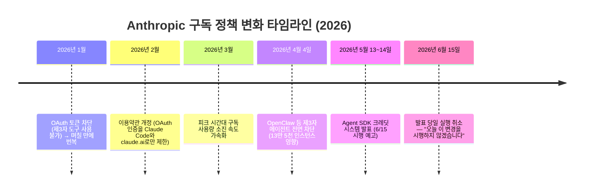
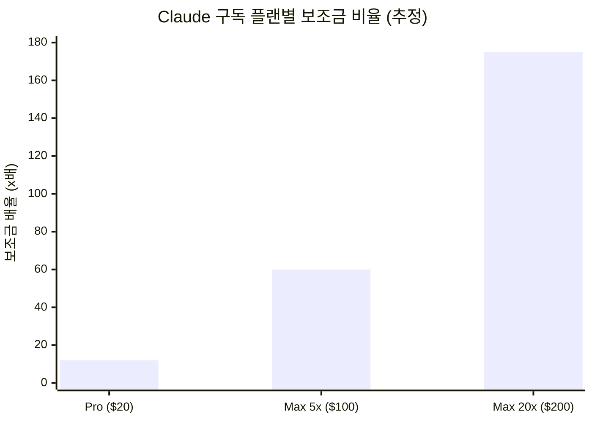
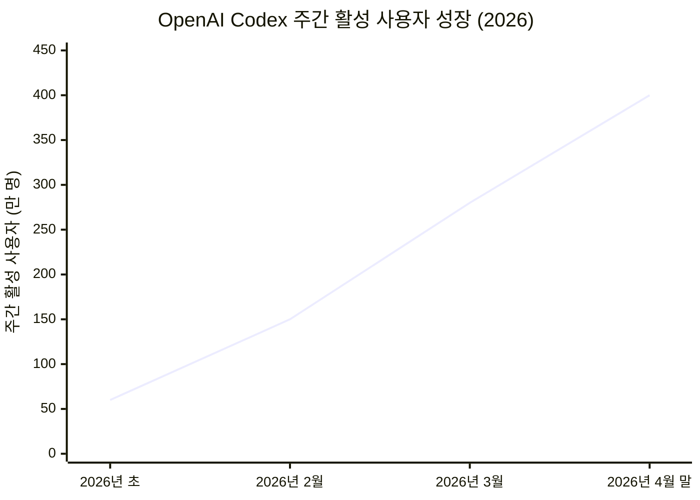
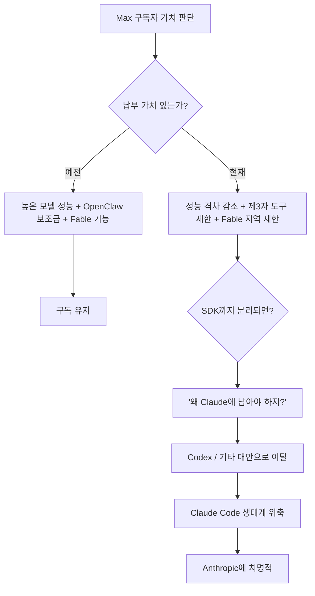
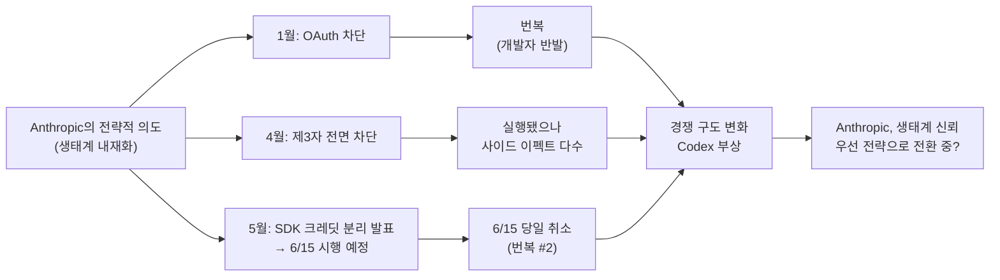

> **작성일**: 2026년 6월 16일  
> **근거**: Anthropic 공식 이메일(2026년 6월 15일), @gptaku_ai Threads 분석, 다수의 1차 언론 보도  
> **키워드**: Claude Agent SDK, 구독 정책, OpenClaw, Claude Max, OpenAI Codex

---

## 1장. 무슨 일이 일어났는가 — 이메일 한 통이 모든 것을 바꿨다

2026년 6월 15일, Anthropic은 일부 구독자들에게 이례적인 이메일을 발송했다. 이메일의 핵심 내용은 단 두 문장으로 요약된다. "5월에 우리는 오늘부터 Claude Agent SDK, `claude -p`, 그리고 Agent SDK 위에서 구동되는 제3자 앱들이 구독 사용량 제한에서 분리되어 별도의 월정액 크레딧으로 이동할 것이라고 공지했습니다. 그런데 우리는 이 변경을 오늘 시행하지 않을 것임을 알리기 위해 이 글을 씁니다."

이 이메일이 왜 놀라운가? 변경 예정 당일에 변경을 취소했기 때문이다. Anthropic은 5월 14일에 이 정책 변경을 공식 발표했고, 6월 15일이라는 명확한 시행일을 못 박았다. 수많은 개발자들이 이 변경에 대비해 클레임 이메일을 기다리고, 코드베이스를 감사하고, 워크플로우를 조정했다. 그런데 시행 당일에 Anthropic은 "지금 하지 않겠다"고 선언한 것이다.

이메일은 이어서 현재 상황을 이렇게 정리했다. Agent SDK, `claude -p`, 제3자 앱 사용은 오늘 이전과 동일하게 기존 구독 한도 내에서 계속 작동하며, 청구할 크레딧도 없고 구독 한도 역시 변경이 없다고 했다. 또한 업데이트가 있을 때에는 시행 전에 사전 공지를 하겠다고 약속했다.

표면적으로는 "사용자에게 좋은 소식"처럼 들린다. 하지만 한국의 AI 인플루언서 @gptaku_ai는 이 이메일을 단순한 정책 변경이 아니라 Anthropic이 위기를 인정한 사건으로 해석했고, 이 글은 그 분석의 맥락과 배경을 깊이 들여다본다.

---

## 2장. 배경을 이해하기 위한 타임라인 — 2026년 1월부터 6월까지

이번 번복을 제대로 이해하려면, 2026년 초부터 이어진 일련의 정책 변화를 순서대로 따라가야 한다. 이 흐름은 단발적인 사건이 아니라 하나의 일관된 의도가 여러 번 좌절된 역사다.

각 단계를 조금 더 자세히 살펴보면 패턴이 뚜렷하게 보인다.

**2026년 1월의 첫 번째 시도**: Anthropic은 제3자 도구들이 구독 OAuth 토큰을 통해 Claude에 접근하는 것을 차단했다. 개발자들의 즉각적인 반발이 터져 나왔고, Anthropic은 며칠 만에 이 결정을 번복했다. 이것이 바로 @gptaku_ai가 언급한 "이전에도 있었던 번복의 전례"다.

**2026년 2월**: 조용히 이용약관을 개정했다. OAuth 인증을 공식적으로 Claude Code와 claude.ai로만 제한하는 조항이 들어갔다. 약관 레벨에서 제3자 접근을 제한하는 토대를 마련한 것이다.

**2026년 4월 4일**: 가장 강력한 조치가 실행됐다. Anthropic은 OpenClaw를 비롯한 모든 제3자 에이전트 프레임워크가 구독 크레덴셜을 사용하는 것을 전면 차단했다. 당시 약 13만 5,000개의 OpenClaw 인스턴스가 구동 중이었다고 추정된다. 이 차단으로 인해 일부 사용자는 월 사용 비용이 최대 50배까지 치솟았다. Anthropic은 보상으로 한 달치 구독료에 해당하는 일회성 크레딧을 제공했다.

**2026년 5월 14일**: 4월의 전면 차단을 사실상 되돌리는 발표가 나왔다. 단, 조건이 붙었다. Agent SDK와 관련 제3자 도구 사용을 구독 풀에서 분리하여 별도의 월정액 크레딧으로 운영하되, 이 크레딧은 실제 API 요금으로 과금된다는 것이다. 크레딧 규모는 Pro 플랜 $20, Max 5x $100, Max 20x $200으로 책정됐고, 6월 15일 시행이 예고됐다.

**2026년 6월 15일**: 예고된 당일, Anthropic은 실행하지 않겠다고 선언했다.

---

## 3장. OpenClaw란 무엇이며 왜 문제가 됐는가

이 이야기의 중심에는 OpenClaw라는 오픈소스 AI 에이전트 프레임워크가 있다. OpenClaw는 오스트리아 출신 개발자 Peter Steinberger가 2025년 11월 "Clawdbot"이라는 이름으로 처음 공개한 프로젝트다. 원래는 LLM에 영구 메모리와 도구 접근성을 부여하고, WhatsApp이나 Telegram 같은 메신저 앱으로 제어할 수 있게 만들면 어떨까 하는 실험적 아이디어에서 출발했다.

결과는 폭발적이었다. 개발자들은 이 툴을 이용해 Claude를 24시간 365일 자율적으로 작동하는 에이전트로 활용했다. 2026년 초에는 텐센트가 OpenClaw를 기반으로 엔터프라이즈 플랫폼을 구축할 정도로 그 영향력이 커졌고, 2026년 3월 기준으로 50개 이상의 통합 서비스를 지원했다.

Anthropic 입장에서 문제는 경제학적이었다. 한 커뮤니티 분석에 따르면, OpenClaw 사용자들은 월 $20짜리 Pro 구독으로 API 기준 약 $236 상당의 연산 자원을 소비했다. 비율로 따지면 약 12:1의 보조금 비율이다. Max 20x 사용자의 경우, 독립적인 분석에서는 이 보조금 비율이 월 $200 구독에 $5,800 이상의 API 등가 가치를 추출하는 수준, 즉 150배에서 175배에 달한다고 추정됐다.

더 근본적인 문제는 기술적인 비효율이었다. Anthropic의 자체 도구인 Claude Code와 Claude Cowork는 프롬프트 캐시 히트율을 극대화하도록 설계되어 있어 이전에 처리된 컨텍스트를 재사용함으로써 연산 비용을 절감한다. 반면 OpenClaw 같은 제3자 에이전트들은 이 최적화를 우회하여 매 호출마다 전체 컨텍스트를 처음부터 처리했다. Claude Code의 수장인 Boris Cherny는 이를 두고 "지속 가능한 방식으로 서비스하기 정말 어렵다"고 공개적으로 말했다.

---

## 4장. 5월의 절충안 — Agent SDK 크레딧 시스템의 설계

4월의 전면 차단은 개발자들의 분노를 샀다. OpenClaw의 창시자 Peter Steinberger조차 Anthropic에 계정이 일시적으로 정지되는 일이 벌어졌고, 오픈소스 커뮤니티에서 Anthropic의 행동을 "배신"으로 표현하는 목소리가 나왔다. 게다가 한 사용자는 git 커밋 메시지에 "HERMES.md"라는 단어가 포함되어 있다는 이유만으로 — 실제로는 사용하지 않았음에도 — $200.98의 API 비용을 청구받는 사고가 발생해 큰 화제가 됐다. Anthropic은 처음에는 환불을 거부했다가 사건이 바이럴되자 환불을 결정했다.

이런 반발 속에서 Anthropic이 5월에 내놓은 것이 Agent SDK 크레딧 시스템이다. 설계는 다음과 같았다.

첫째, 제3자 에이전트 접근 자체는 허용한다. 4월의 전면 차단을 철회하는 것이다. 둘째, 단 이 접근은 별도의 크레딧 풀에서 소비된다. 기존 구독 한도와는 완전히 분리된다. 셋째, 이 크레딧은 실제 API 시장 요금으로 과금되기 때문에 과거의 보조금 구조는 사라진다.

크레딧 규모를 API 실제 소비량으로 환산해 보면 이야기가 달라진다. 현재 Sonnet 4.6 기준으로 입력 토큰 백만 개당 $3, 출력 토큰 백만 개당 $15이다. Pro 사용자가 받는 $20 크레딧으로는 중간 규모의 코딩 에이전트 작업을 한 달에 30~50회 정도 실행할 수 있는 수준이다. Max 20x 사용자가 받는 $200 크레딧도 무거운 에이전트 워크플로우를 돌리면 며칠 만에 소진될 수 있다.

X(구 트위터)의 BridgeMind 계정은 이를 가장 날카롭게 정리했다. "Anthropic은 이것을 '무료 크레딧을 드립니다'라고 포장했지만, 실제로 일어난 일은 25배 보조금을 제거하고 1배를 돌려준 것이다."

---

## 5장. 6월 15일의 번복 — 단순한 연기가 아니다

Anthropic이 5월에 6월 15일 시행을 발표했을 때, OpenAI는 놀랍게도 같은 날 즉각적인 카운터펀치를 날렸다. Sam Altman은 5월 14일에 새로운 OpenAI 비즈니스 고객들에게 Codex 2개월 무료 사용권을 제공하겠다고 발표했다. 이는 우연의 일치가 아닌 것으로 보인다. 시장은 이미 "구독 가치" 싸움으로 재편되고 있었다.

이런 상황에서 6월 15일 당일에 Anthropic이 자신의 발표를 뒤집었다는 것은 무엇을 의미하는가?

이메일에서 Anthropic은 그 이유를 명확하게 밝히지 않았다. "사용자들이 Claude 구독으로 개발하는 방식을 더 잘 지원하기 위해 플랜을 업데이트하는 작업을 하고 있다"는 다소 모호한 문장만을 남겼다. 이것은 매우 이례적이다. 수십만 명의 개발자들이 6주에 걸쳐 준비한 변경사항을, 시행 당일에, 설명도 없이 취소한다는 것은 평범한 비즈니스 결정이 아니다.

---

## 6장. 경쟁 구도의 변화 — OpenAI Codex의 부상

2026년 초만 해도 많은 개발자들이 Claude를 AI 코딩 에이전트의 부동의 1위로 꼽았다. npm 다운로드 기준으로도 Claude Code는 4,630만 건으로 OpenAI Codex CLI의 1,400만 건을 크게 앞선다. 코드 품질 블라인드 리뷰에서도 Claude Code가 67% 대 25%로 앞선다는 개발자 조사 결과가 있다.

그러나 "선호"와 "실제 사용"은 다른 문제다. 2026년 초에 대략 600,000명이던 Codex의 주간 활성 사용자는 4월 말에 400만 명을 넘어섰다. 약 7배 증가다.

이 급격한 성장의 배경에는 Anthropic의 연속적인 제한 정책이 있다는 분석이 지배적이다. Composio의 한 개발자는 Claude Code vs Codex 장기 비교 글에서 이렇게 썼다. "4월에 Anthropic이 Pro와 Max에서 제3자 에이전트를 차단했을 때, OpenAI는 반대 방향으로 Codex를 $100 티어에서 더 열었다. Claude Max는 Opus를 많이 쓰는 사람에게 돈값을 하지만, 달러당 가치로 보면 Codex가 앞선다. Anthropic은 사용량을 울타리 치고 있고 OpenAI는 계속 열어주고 있다."

SWE-bench 벤치마크에서도 격차가 좁혀지고 있다. GPT-5.3-Codex가 Terminal-Bench 기준 77.3%를 기록하면서, 코딩 에이전트 성능에서도 Claude의 우위가 예전만큼 압도적이지 않다는 인식이 퍼지고 있다. 물론 두 회사가 서로 유리한 벤치마크를 선택해 발표하기 때문에 직접 비교는 조심해야 하지만, 시장 분위기는 분명히 달라졌다.

---

## 7장. Max 구독자의 딜레마 — 비싼 돈을 낼 이유는 무엇인가

Claude Max 구독은 월 $100(5x 플랜)에서 $200(20x 플랜)에 달한다. 이것은 AI 서비스 구독치고는 상당히 높은 금액이다. Max 구독자들이 이 금액을 기꺼이 내는 이유는 단순히 사용량이 많기 때문만이 아니다. 비싼 돈을 낼 만한 가치가 지속적으로 느껴져야 한다.

과거에는 그 가치가 뚜렷했다. Claude의 코딩 능력은 경쟁자들을 압도했고, OpenClaw 같은 도구를 통해 월 수백 달러의 API 가치를 $200 구독으로 뽑아낼 수 있었다. Claude Code는 로컬 터미널에서 전체 파일시스템에 직접 접근하며 작동하는 방식이 개발자들에게 특히 맞았다.

그런데 지금의 상황을 보면:

사용량 제한은 점점 타이트해졌다. 3월에는 피크 타임에 소진 속도가 빨라졌고, 4월에는 제3자 도구가 막혔다. 5월에는 Agent SDK 분리 발표로 Pro 사용자 기준 $20 크레딧의 사실상 삭감이 예고됐다. Claude Code를 지원하는 커뮤니티 조사에 따르면 "Claude Code 사용량 제한이 솔로 개발자들을 다른 곳으로 밀어내고 있다"는 불만이 거세졌다.

게다가 Anthropic은 Claude Fable 같은 차별화 기능들을 전면에 내세웠다. Fable은 AI가 컴퓨터를 직접 조작하는 고급 기능으로, 이 기능이 있다면 Max 구독의 프리미엄을 정당화할 수 있다. 그런데 @gptaku_ai가 지적하듯, "Fable처럼 확실히 지불할 만한 가치를 주면 모르겠는데, 그마저도 국가 제재로 제대로 제공하지 못하고 있다." 지역 제한으로 인해 한국을 포함한 일부 국가에서는 이 기능을 아직 사용할 수 없다.

이 상황에서 SDK까지 구독에서 분리했다면, 논리적인 귀결은 하나다. "그럼 내가 왜 Claude에 남아 있어야 하지?" 이 질문이 실제로 수십만 명의 Max 구독자들 머릿속에서 동시에 떠오르는 상황이 됐을 것이다.

---

## 8장. Anthropic의 딜레마 — 생태계와 수익성 사이에서

Anthropic이 처한 구조적 딜레마는 명확하다. 한쪽에는 지속 가능한 비즈니스 모델이 있고, 다른 쪽에는 생태계의 신뢰가 있다.

**수익성 측면**: 고가 구독자들이 구독 요금의 수백 배에 달하는 연산 자원을 소비하는 구조는 장기적으로 지속 불가능하다. Anthropic은 GPT 계열의 OpenAI와 달리 아직 구조적 흑자를 달성하지 못한 상태이며, 엄청난 인프라 비용을 감당하고 있다. Anthropic은 300MW Colossus 1 데이터 센터와 22만 개 이상의 GPU 접근권을 확보했음에도 에이전트 워크플로우의 폭발적 성장은 공급을 앞질렀다. 제3자 에이전트들이 프롬프트 캐시를 우회하며 비효율적으로 연산을 소비하는 문제는 전체 서비스 안정성까지 위협했다.

**생태계 측면**: 클로드의 모든 가치는 생태계에서 나온다. Claude Code를 중심으로 형성된 개발자 커뮤니티, OpenClaw·Conductor·Zed 같은 제3자 도구들이 만들어낸 활용 사례들, Max 구독자들이 만든 바이브 코딩 문화 — 이 모든 것이 Claude를 단순한 AI 모델이 아닌 "개발 생태계"로 만들어주는 요소들이다. 이 생태계를 단기 수익을 위해 희생시키면, Claude의 근본적인 가치 제안 자체가 훼손된다.

---

## 9장. 역사적 패턴 읽기 — 세 번의 시도, 세 번의 마찰

2026년에 벌어진 Anthropic의 정책 변화를 큰 그림으로 보면, 세 번의 주요 시도가 모두 예상치 못한 마찰에 부딪혔다는 공통점이 있다.

첫 번째 시도인 1월의 OAuth 차단은 며칠 만에 개발자 반발로 번복됐다. 두 번째 시도인 4월의 전면 차단은 실행되었지만 잘못된 과금 사태($200 초과 청구 사건), OpenClaw 창시자 계정 차단 논란, 개발자 이탈 등 심각한 사이드 이펙트를 낳았다. 세 번째 시도인 5월 발표 + 6월 15일 시행 예고는 당일에 취소됐다.

세 번의 마찰 모두에서 Anthropic은 "우리 모델이 제3자 서비스의 성장 엔진으로 쓰이는 것을 더 이상 두고 보지 않겠다"는 메시지를 보내려 했다. @gptaku_ai가 Claude Channel, Remote Control 같은 기능이 나왔을 때 "관련 서비스들에 대한 전쟁 선포에 가깝다"고 쓴 것도 같은 맥락이다. 즉, Anthropic은 Claude 생태계를 자신의 울타리 안에서만 구동되게 하려는 전략적 의도를 꾸준히 갖고 있었다.

그러나 세 번 모두 시장의 반응이 그 의도를 좌절시켰다. 이것은 Anthropic의 의도 자체가 잘못됐기 때문이 아니라, 그 의도를 현실화하기에는 아직 경쟁 압력이 너무 크다는 사실을 보여준다.

---

## 10장. 이번 번복의 진짜 의미 — Anthropic이 인정한 것들

Anthropic이 인정한 것은 세 가지다.

**첫째, Claude의 프리미엄 가치가 위협받고 있다.** 연초만 해도 Claude는 "개발자가 원하는 AI 코딩 도구 1위"였다. 하지만 지금은 성능 격차가 좁혀지고, 제한은 많아지고, 대안들은 따라오고 있다. 이 상황에서 SDK까지 분리하면 Max 구독의 가치 제안이 심각하게 흔들린다.

**둘째, Claude Code 생태계는 아직 방어할 필요가 있다.** 오픈소스 개발자들, 제3자 도구 제작자들, Max 구독자들이 만들어온 이 생태계는 Claude의 중요한 해자다. 이것을 잃으면 단기적으로는 비용을 절감할 수 있겠지만, 장기적으로는 OpenAI에게 개발자 생태계 주도권을 넘겨주는 결과가 된다.

**셋째, 타이밍이 중요하다.** OpenAI는 Anthropic의 발표와 같은 날 Codex 2개월 무료를 내걸었다. Gemini CLI도 빠르게 성장하고 있다. 이 시점에 SDK를 구독에서 분리하는 것은 "Claude에 남아야 할 이유"를 스스로 없애는 것과 다름없다.

---

## 11장. 앞으로 어떻게 될 것인가 — 불확실한 다음 장

Anthropic은 이메일에서 "업데이트가 있을 때 사전에 공지하겠다"고만 했을 뿐, 언제, 어떤 방식으로 정책을 바꿀 것인지는 밝히지 않았다. 따라서 현재 시점에서 확실하게 말할 수 있는 것은 다음과 같다.

지금 당장 달라지는 것은 없다. Agent SDK, `claude -p`, 제3자 앱 사용은 기존 구독 한도 내에서 그대로 작동한다. 크레딧을 클레임할 필요도, 설정을 바꿀 필요도 없다.

그러나 이 상태가 영구적이라고 볼 수는 없다. Anthropic의 구조적 문제 — 제3자 도구들이 일으키는 과도한 연산 부하와 보조금 비율 — 는 해결되지 않았다. Anthropic이 언젠가는 다시 이 문제를 건드릴 것이라는 점은 거의 확실하다.

차이가 있다면 다음 번에는 커뮤니티의 심리를 더 세밀하게 고려한 설계가 나오리라는 기대다. 예를 들어, 일방적인 분리나 전면 차단보다는 헤비 유저에게는 더 많은 크레딧을 주거나, 전환 기간을 길게 주거나, 가격 대비 가치를 높이는 새로운 기능을 함께 내놓는 방식일 수 있다.

Fable이 한국을 포함한 전 세계에 확대된다면, 그것이 하나의 전환점이 될 수 있다. 또는 Claude Code에서 활용할 수 있는 새로운 에이전트 기능이나 멀티에이전트 협업 도구가 Max 구독의 새로운 가치 제안이 될 수도 있다. 어떤 형태가 됐든, Anthropic은 "왜 Claude Max에 남아야 하는가"라는 질문에 설득력 있는 답을 만들어내야 하는 과제를 안고 있다.

---

## 결론: 단순한 정책 후퇴를 넘어선 신호

겉으로 보면 이번 이메일은 개발자들에게 좋은 소식이다. 변경이 취소됐으니 당장 달라지는 것이 없다. 그런데 @gptaku_ai가, 그리고 이 글이 주목하는 것은 그 너머에 있다.

Anthropic은 2026년 한 해 동안 같은 목표를 향해 세 번 시도했다. 제3자 에이전트와 구독 구조를 분리하여 "Claude 생태계는 Anthropic의 것"이라는 메시지를 각인시키려 했다. 세 번 모두 시장의 반응이 그것을 허락하지 않았다. 이번 6월 15일의 번복은 가장 극적인 형태의 좌절이다.

이것은 Anthropic의 패배가 아니다. 오히려 Anthropic이 자신의 한계를 인식하고, 생태계와의 관계를 더 신중하게 재설정하려는 의지의 표현으로 읽을 수 있다. 하지만 그 재설정이 어떤 방향으로, 어떤 속도로 이루어질 것인가는 앞으로 Anthropic이 내놓을 다음 행보에 달려 있다.

맥스 구독자들은 지금 고민하고 있다. Anthropic도 그것을 알고 있다. 그리고 그 사실을 이번 번복으로 스스로 인정했다. 다음 장이 어떻게 쓰여질지, 우리는 사전 공지를 기다리고 있다.

---

## 부록: 핵심 용어 정리

**Claude Agent SDK**: Anthropic이 제공하는 에이전트 루프 라이브러리. 도구 실행, 멀티 에이전트, MCP 통합, 세션 관리 등을 자동으로 처리한다. Python(claude-agent-sdk)과 TypeScript(@anthropic-ai/claude-agent-sdk)로 설치 가능.

**claude -p**: Claude Code의 비대화형(헤드리스) 실행 모드. 스크립트나 CI/CD 파이프라인에서 사람의 개입 없이 Claude를 자동 실행할 때 사용한다.

**OpenClaw**: 오스트리아 개발자 Peter Steinberger가 만든 오픈소스 AI 에이전트 프레임워크. WhatsApp, Telegram 등 메신저 앱을 통해 Claude를 24시간 자율 에이전트로 운영하는 도구로 큰 인기를 끌었다. 원래 이름은 Clawdbot(2025년 11월)이었고, 상표 문제로 Moltbot을 거쳐 OpenClaw로 최종 정착했다.

**프롬프트 캐시(Prompt Cache)**: LLM에서 이전에 처리한 컨텍스트를 재사용하여 연산 비용을 절감하는 기술. Anthropic의 자체 도구들은 이를 최대화하도록 설계되어 있지만, 제3자 에이전트들은 이를 우회하여 매번 전체 컨텍스트를 처음부터 처리하는 비효율을 낳는다.

**Max 5x / Max 20x**: Anthropic의 고급 구독 플랜. 각각 월 $100와 $200이며, Pro($20) 대비 더 많은 사용량 한도를 제공한다. 높은 Opus 모델 사용량은 Sonnet 대비 5~10배의 한도를 소비한다.

**Claude Fable**: Anthropic이 Claude에 통합한 컴퓨터 사용 기능. AI가 직접 웹 브라우저나 데스크톱 앱을 조작할 수 있게 해주는 고급 기능으로, 아직 한국을 포함한 일부 지역에서는 사용할 수 없다.

---

*이 문서는 2026년 6월 16일 기준 공개된 정보를 바탕으로 작성되었습니다. Anthropic의 공식 이메일, [@gptaku_ai](https://www.threads.com/@gptaku_ai/post/DZoDqOjk7Bm)의 Threads 분석, TechTimes, VentureBeat, XDA Developers, The Register, TechCrunch 등의 보도를 참고했습니다. 향후 Anthropic의 공식 업데이트에 따라 상황이 달라질 수 있습니다.*
