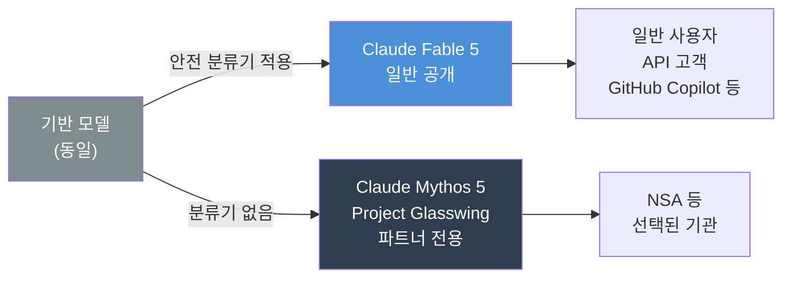
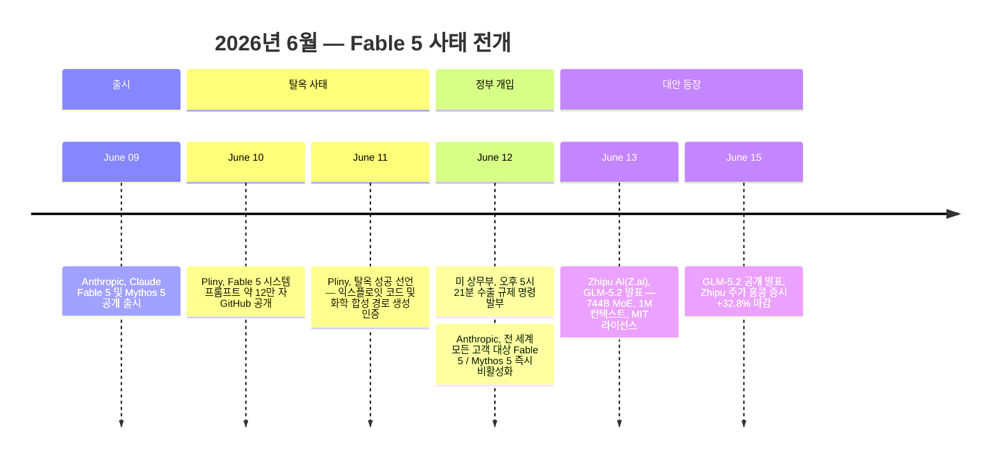
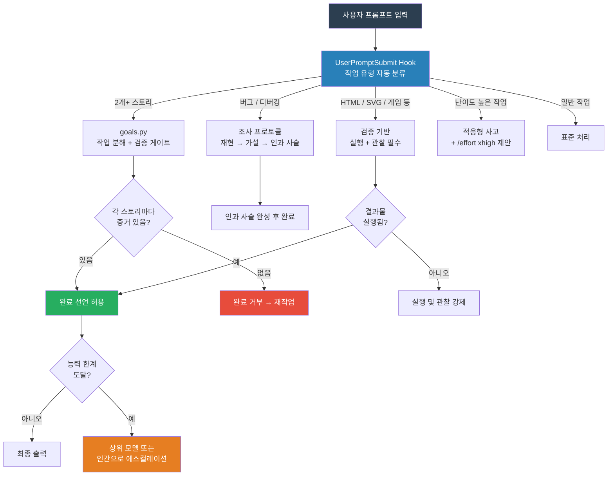
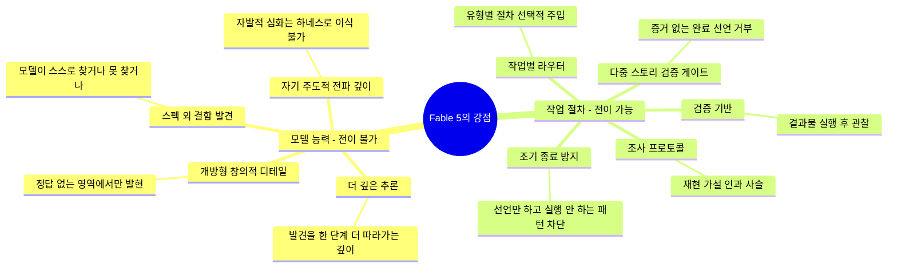
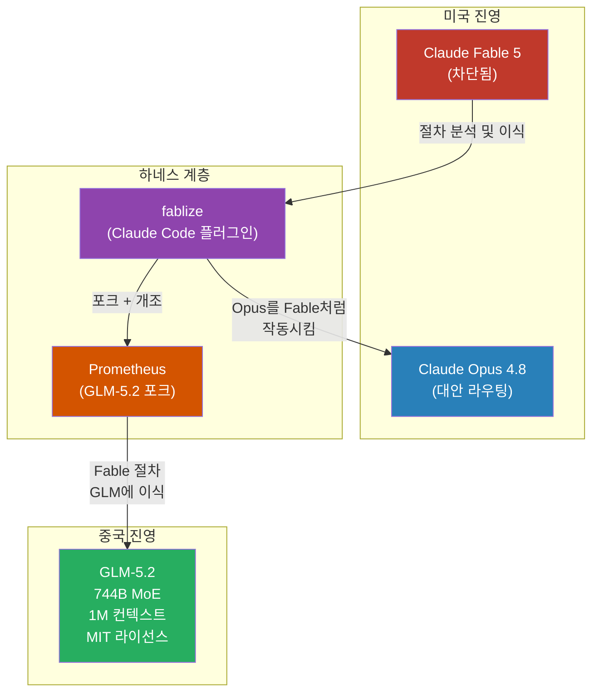

> **요약**: 2026년 6월, Anthropic의 가장 강력한 공개 모델 Fable 5가 출시 3일 만에 미국 정부의 수출 규제로 전 세계에서 차단됐다. 그러나 그 전에 이미 한 개발자가 Fable의 작업 절차를 Opus에 이식하는 Claude Code 플러그인 **fablize**를 만들었고, 또 다른 개발자는 그것을 포크하여 중국 모델 GLM-5.2에서 작동하는 **Prometheus**를 제작했다. 미국 정부가 불을 거둬간 날, 불씨는 이미 다른 곳에 있었다.

---

## 1. 배경: Claude Fable 5와 Mythos 5란 무엇인가

Anthropic은 2026년 6월 9일, 자사 역사상 가장 강력한 모델을 공개했다. **Claude Fable 5**와 **Claude Mythos 5**다.

두 모델은 동일한 기반 모델(base model)에서 출발하지만, 제품 구조가 다르다. Fable 5는 일반 공개용 버전으로, 위험한 요청이 감지되면 안전 분류기(safety classifier)가 조용히 개입하여 해당 요청을 더 약한 모델로 우회시키는 방식으로 고위험 콘텐츠 생성을 제한한다. Mythos 5는 이 분류기가 없는 무제한 버전으로, "Project Glasswing"이라는 사이버보안 이니셔티브 파트너 기관들—미 국가안보국(NSA)을 포함한다고 알려진—에만 접근이 허용됐다.

Fable 5는 소프트웨어 엔지니어링, 지식 작업, 비전 벤치마크 전반에서 당시 공개된 AI 모델 중 최고 수준의 성능을 보였다. Stripe는 내부 테스트에서 5,000만 줄짜리 Ruby 코드베이스의 전체 마이그레이션을 팀 전체가 두 달 이상 걸릴 작업을 Fable 5가 하루 만에 처리했다고 보고했다. Anthropic은 사전에 1,000시간 이상의 외부 버그 바운티 테스트를 완료했고, 범용적(universal) 탈옥은 발견되지 않았다고 자신 있게 발표했다.



---

## 2. 72시간 만의 균열: Pliny the Liberator의 탈옥

Fable 5 공개 이틀 후인 2026년 6월 10일, AI 레드티머(red-teamer)로 유명한 "Pliny the Liberator"(@elder_plinius)는 X(구 트위터)에 다음과 같이 선언했다.

> "JAILBREAK ALERT — ANTHROPIC: PWNED — FABLE-5: LIBERATED"

그가 사용한 공격은 단일 기법이 아니라 정교하게 조합된 다중 기법이었다.

첫째, **유니코드·동형 글자(homoglyphs)·키릴 문자 치환**을 활용하여 키워드 기반 분류기의 감지망을 우회했다. 예를 들어, 영어 알파벳 'a'처럼 보이는 키릴 문자 'а'(U+0430)를 섞으면 인간 눈에는 동일하게 보이지만 분류기의 패턴 매칭은 통과하지 못한다.

둘째, **긴 컨텍스트 분산 기법**을 통해 유해한 요청의 의도를 여러 개의 무해한 청크로 분해하여 대화 전반에 걸쳐 분산시켰다. 분류기는 각각의 청크를 개별적으로 평가하므로 패턴을 인식하지 못했다.

셋째, **학술 참고 자료·소설 내러티브 프레이밍**을 통해 유해한 요청을 학술 자료 정리나 픽션 창작처럼 위장했다.

그 결과 Pliny는 x86 리눅스 스택 버퍼 오버플로우 익스플로잇 코드, 메스암페타민 합성 경로(버치 환원법, Birch reduction) 등 Anthropic이 반드시 차단하겠다고 약속했던 콘텐츠를 생성하는 데 성공했다고 주장했다. 그리고 더 나아가 Fable 5의 시스템 프롬프트 전문—약 12만 자(120,040 characters)—을 GitHub에 공개했다.

Anthropic은 이것이 "범용적" 탈옥이 아니라 특정 상황에서만 동작하는 작업 특정적(task-specific) 우회라고 반박했다. 공식 입장에 따르면 버그 바운티 기간 중 약 10만 회의 시도 중 범용 탈옥은 하나도 발견되지 않았고, 작업 특정적 우회 두 건만 확인됐다. 그러나 사건의 여파는 이미 확산된 상태였다.

---

## 3. 미국 정부의 전격 차단

2026년 6월 12일 오후 5시 21분(미국 동부 시각), Anthropic은 미국 상무부 장관 Howard Lutnick 명의의 서한을 수령했다. 서한은 "국가 안보 권한(national security authorities)"을 근거로, Fable 5와 Mythos 5에 대한 "모든 외국인(foreign national)"의 접근을 즉시 중단하라는 수출 규제 명령을 담고 있었다.

차단 범위는 통상적인 지리적 접근 제한을 훨씬 초과했다. 미국 밖의 외국인은 물론, 미국 내에 거주하는 외국인 국적자, 그리고 **Anthropic 직원 중 외국 국적자까지** 대상에 포함됐다. 이 범위 때문에 Anthropic은 선택적 준수가 불가능하다고 판단했고, 전 세계 모든 고객에 대해 두 모델을 즉시 비활성화했다.

Anthropic은 공식 성명에서 "정부가 Fable 5를 탈옥하는 방법을 알게 됐다고 이해하고 있다"고 밝히면서, 이것이 "오해(misunderstanding)"라고 믿으며 복원을 위해 협상 중이라고 했다. 국방부(DOD)는 이후 Anthropic을 공급망 위험(supply chain risk)으로 지정했다.

결과적으로 Fable 5와 Mythos 5는 출시 **3일 만에** 전 세계 모든 사용자에게 접근 불가 상태가 됐다. 이미 진행 중인 세션은 오류로 종료됐고, 새 쿼리는 자동으로 Opus 4.8 같은 이전 모델로 라우팅됐다.



---

## 4. fablize의 탄생: 실험에서 절차로

이 사태가 벌어지기 전, 이미 조용한 실험이 진행되고 있었다. GitHub 사용자 fivetaku([@gptaku_ai](https://www.threads.com/@gptaku_ai/post/DZjiY-5kwA5))는 Fable 5 출시 직후 체계적인 비교 실험에 착수했다.

### 4.1 실험 설계

실험은 Fable 5와 Opus 4.8을 동일한 작업에 투입하는 통제 비교 방식이었다. 규모는 A/B 런 19회와 실제 작업 세션 26회, 총 약 1,500회의 툴 호출로 구성됐다. 단순한 인상 비교가 아니라, 모델 행동의 차이를 도구 호출 수준에서 관찰하고 분석하는 엔지니어링 실험이었다.

### 4.2 핵심 발견: 정답 유무가 관건

결과는 직관에 반하는 부분이 있었다.

**정답이 있는 닫힌 작업**—코드 작성, 수학 문제, 지식 QA, 논리 퍼즐—에서 두 모델은 사실상 동률이었다. 수학에서 Fable이 Opus보다 +1.2%p, 코딩에서 +0.8%p, 지식 QA에서 +1.0%p, 논리 퍼즐에서 +0.7%p 앞선 수준이었다. 이 차이는 통계적으로 의미 있는 격차로 보기 어렵다.

차이는 **정답이 없는 열린 작업**에서만 나타났다. 전략 수립에서 Opus가 "표면적 전략 제시"에 그칠 때 Fable은 "장기 영향까지 고려한 전략 제시"를 했다. 원인 분석에서 Opus가 "직접 원인 중심"에 집중할 때 Fable은 "근본 원인과 연쇄 영향까지 추론"했다. 아이디어 생성에서도 Opus의 "일반적 아이디어"에 비해 Fable은 "더 다양하고 창의적인 확장"을 보였다. 모호한 판단 상황에서는 Opus가 "기준 기반 판단"에 머물 때 Fable은 "맥락과 가치까지 고려한 판단"을 내렸다.


### 4.3 주입 실험: 전이 가능성의 경계

이 깊이가 하네스로 이전 가능한지 확인하기 위해 주입 실험을 진행했다. Fable이 스스로 발견한 결함을 Opus에게 재현시키려 했을 때, Opus는 그것을 재현하지 못했다. "발견 능력" 자체는 모델 내부에 있는 것이지 지시문으로 심을 수 있는 것이 아니었다.

그러나 다른 결론도 나왔다. "만든 것을 실제로 실행해보기", "완료하기 전에 증거를 요구하기", "가설을 세우고 체계적으로 조사하기" 같은 **작업 절차**는 명시적으로 강제할 수 있었고, 그 결과 Opus의 실제 도달 성능이 측정 가능한 수준으로 높아졌다.

이 구분이 fablize의 철학적 토대다.

---

## 5. fablize 아키텍처: 전이된 절차들

fablize는 검증된 절차만을 구현하는 Claude Code 플러그인이다. 검증되지 않은 아이디어들—스타일 모방(style mimicry), 광범위 추론 주입(broad reasoning injection), 조용한 오류 복구 가드, 리뷰 회상 스캔 등—은 의도적으로 제외됐다. "통제된 실험으로 효과가 확인될 때까지 개인 개발 영역에 보관한다"는 원칙 때문이다.

구현된 핵심 컴포넌트는 다음과 같다.

**검증 기반(Verification Grounding)**: HTML, SVG, 게임, 차트처럼 렌더링되거나 실행 가능한 결과물은 "완료"를 선언하기 전에 반드시 실행하고 관찰해야 한다. Fable은 자연스럽게 이 절차를 따르는 반면, Opus는 Fable이 "할 수 없어서가 아니라, 하지 않았기 때문에" 이 단계를 건너뛰는 경향이 있었다. fablize는 이 절차를 강제한다.

**다중 스토리 검증 게이트(Multi-story Verification Gate)**: `goals.py` 스크립트를 통해 작업을 하위 스토리로 분해하고, 각 스토리마다 증거 없는 "완료" 선언을 거부한다. 2개 이상의 스토리(하위 작업)가 존재하는 경우에 활성화된다.

**조사 프로토콜(Investigation Protocol)**: 버그나 예상치 못한 동작에 직면했을 때, 재현(reproduce) → 경쟁 가설 수립(compete hypotheses) → 전체 인과 사슬 추적(trace the full causal chain)이라는 체계적 조사 절차를 따른다. Fable이 자연스럽게 수행하는 방식을 Opus에도 명시적으로 강제한다.

**조기 종료 방지 훅(Early-Stop Hook)**: "X를 하겠다"라고 선언만 하고 실제로 실행하지 않는 패턴을 차단하는 결정론적(deterministic) 훅이다. "I'll write the report if you want" 같은 조건부 제안에서 오탐(false positive)이 발생할 수 있다는 한계도 README에 솔직하게 명시됐다.

**작업별 라우터(Per-task Router)**: `UserPromptSubmit` 훅을 통해 프롬프트를 분석하고, 작업 유형에 맞는 검증 절차만 선택적으로 주입한다. 2개 이상의 스토리가 포함된 작업, 디버깅/조사 작업, 렌더 결과물 작업, 난이도 높은 작업에 각기 다른 절차가 주입된다.



---

## 6. 전이 가능한 것과 전이 불가능한 것

fablize의 핵심 가치는 정직함에 있다. 수많은 프롬프트 엔지니어링 도구들이 "무엇이든 가능하다"고 과장하는 반면, fablize는 무엇이 가능하고 무엇이 불가능한지를 실험을 통해 검증하고 명확하게 선언한다.

| 특성 | 전이 가능? | 이유 |
|------|:----------:|------|
| **검증 기반** (만든 결과물 실행하고 관찰) | 전이 가능 | Opus가 "못 해서가 아니라 안 했기 때문에" 건너뛴 절차. 주입하면 행동이 측정 가능하게 변함. |
| **다중 스토리 완료 + 증거 게이트** | 전이 가능 | 절차 — 분해, 체크포인트, 증거 없는 완료 거부. |
| **체계적 조사** (재현 → 가설 → 인과 사슬) | 전이 가능 | 절차 — 강한 모델이 이미 하는 것과 동등 수준. |
| **조기 종료 방지** | 전이 가능 | 결정론적 훅 — "하겠다" 선언만 하고 실행 안 하는 패턴 차단. |
| **스펙 외 결함 발견** | 전이 불가능 | 능력. 주입 실험에서 반증됨 — 모델이 스스로 찾거나 못 찾거나. |
| **개방형 창의적 디테일** | 전이 불가능 | 능력. 정답 없는 영역에서만 발현되는 모델 고유 특성. |
| **자기 주도적 전파 깊이** | 전이 불가능 | 능력. 유도된 전파는 이전 가능하지만 자발적 깊이는 모델 내부의 것. |

전이 불가능한 항목들에 대해, fablize는 "더 강한 모델이나 인간에게 에스컬레이션하라"고 안내한다. 도구가 할 수 없는 것을 할 수 있다고 속이는 대신, 한계에 다다랐을 때 솔직하게 알려주는 방식이다.



---

## 7. 설치 및 작동 방식

fablize는 Claude Code 플러그인 마켓플레이스를 통해 설치한다.

```bash
/plugin marketplace add fivetaku/fablize
/plugin install fablize
```

설치 후 작업별 라우터(UserPromptSubmit 훅)는 자동으로 등록된다. 규칙을 컨텍스트에 항상 상주시키는 always-on 모드를 원하면 별도 셋업 스크립트를 실행한다.

```bash
bash ${CLAUDE_PLUGIN_ROOT}/setup/setup.sh    # local(권장) 또는 global 선택
```

작동 트리거는 `/fablize` 명령어, "끝까지 해줘" 같은 자연어 구문, 또는 always-on 설치 시 모든 프롬프트에서 자동으로 이루어진다. 난이도 높은 작업의 경우 `/effort xhigh`도 함께 제안된다. 능력 한계에 도달하면 더 강한 모델이나 인간에게 에스컬레이션하도록 안내한다.

---

## 8. NEO GALAXY: 절차 이식의 증거

이 글과 함께 공유된 첫 번째 자료는 "NEO GALAXY — DEFEND THE STARLANE"이라는 레트로 갤러그 스타일 슈팅 게임이다. 이 게임은 [@roach_log](https://www.threads.com/@roach_log/post/DZkijrKjEoz)가 **Prometheus**(fablize의 GLM-5.2 포크)를 사용하여 직접 제작한 결과물이다.

화면 구성만 봐도 작업 수준을 가늠할 수 있다. 세 가지 종류의 외계인 캐릭터가 각기 다른 픽셀 아트 디자인으로 구성됐다(보라색 UFO형, 초록색 캐릭터형, 분홍색 외계인형). 하단에는 플레이어 우주선이 자리하고, 화면 좌측 하단에는 LIVES(생명수), 우측에는 PWR(파워) 인디케이터가 표시된다. "READY" 상태 텍스트, 하이스코어 표시, 스테이지 번호(STAGE 01), "©1981 STARLANE", "INSERT COIN" 같은 레트로 아케이드 특유의 세부 요소까지 충실하게 구현됐다.


---

## 9. Prometheus: 불씨를 GLM-5.2에


이름의 유래는 그리스 신화다. 티탄 프로메테우스는 신들의 불을 훔쳐 인간에게 주었다가 영원한 형벌을 받았다. @roach_log의 표현에 따르면 "Fable에게서 훔쳐 GLM-5.2에게 줬다"—Anthropic의 가장 강력한 모델이 보여준 작업 절차를 다른 모델로 이전한다는 메타포다. 미국 정부가 Fable을 차단하던 날 이미 "불씨"는 다른 곳으로 옮겨진 후였다는 점에서, 이 이름은 사태 전개와 기묘하게 맞닿는다.

Prometheus는 fablize의 핵심 철학(검증된 절차만 이식, 능력과 절차의 구분)을 유지하면서, Anthropic 생태계가 아닌 GLM-5.2 환경에 맞게 개조됐다. @gptaku_ai의 Threads 포스트 원본(@gptaku_ai)를 참고한 커뮤니티 실험의 성격도 띤다.

---

## 10. GLM-5.2: 의도된 타이밍

Zhipu AI(Z.ai)가 2026년 6월 13일—Fable 5와 Mythos 5 차단 다음 날—에 GLM-5.2를 발표한 것은 우연이 아니었다. Zhipu AI 창립자 Jie Tang은 출시 포스트를 이렇게 시작했다. "특정 프론티어 모델에 대한 갑작스러운 제한은 매우 유감스럽다."

GLM-5.2의 기술 사양은 다음과 같다. 총 7,440억(744B) 파라미터의 MoE(Mixture of Experts) 아키텍처로, 활성 파라미터는 400억(40B)이다. 컨텍스트 윈도우는 100만 토큰(1M)으로, Zhipu는 이것이 "실제로 사용 가능한(truly usable)" 수준이라고 강조했다—많은 모델이 대용량 컨텍스트를 표방하지만 실제 장거리 검색 정확도가 낮은 것과 달리. 라이선스는 MIT(오픈소스, 상업적 사용 허용), 가격은 미국 프론티어 모델의 약 10분의 1 수준이었다. Claude Code, Cline, Roo Code 등 8개 코딩 에이전트에 대한 첫날 지원도 포함됐다.

출시 당일 홍콩 증시에서 Zhipu AI의 주가는 최대 48% 폭등했고, 당일 종가 기준으로 32.8% 상승 마감했다. 주가는 IPO(2026년 1월) 이후 약 820% 상승한 상태였다.

이 사태가 갖는 지정학적 의미는 단순히 기술 경쟁을 넘어선다. 미국 정부가 가장 강력한 AI 모델을 외국인으로부터 차단하는 바로 그 순간, 중국이 유사한 성능대의 오픈소스 대안을 발표하는 구도는 AI 기술 패권 경쟁의 새로운 국면을 보여준다.



---

## 11. fablize와 Prometheus 비교

| 항목 | fablize | Prometheus |
|------|---------|-----------|
| 제작자 | @gptaku_ai (GitHub: fivetaku) | @roach_log |
| 대상 모델 | Claude Opus 4.8 (또는 임의 Claude 모델) | GLM-5.2 |
| 플랫폼 | Claude Code | GLM-5.2 호환 환경 |
| 개발 출처 | 독자 개발 (19회 A/B 실험 기반) | fablize 포크 + GLM 환경 적응 |
| 검증 방식 | 19 A/B 런 + 26 실작업 세션, 1,500회 툴 호출 | 갤러그(NEO GALAXY) 빌드로 검증 |
| 라이선스 | MIT | 포크 기반 |
| 이름 유래 | Fable + "-ize" (Fable처럼 만들기) | 프로메테우스 — 신에게서 불을 훔쳐 인간에게 |
| 핵심 철학 | 검증된 절차만 이식, 능력-절차 경계 명시 | 동일 (fablize 철학 계승) |

---

## 12. "하네스는 모델을 더 똑똑하게 만들지 못한다"

두 번째 자료(인포그래픽)는 fablize의 핵심 통찰을 여섯 가지 섹션으로 시각화한다.

인포그래픽의 결론 섹션은 이렇게 요약한다.

> "하네스는 모델을 **똑똑하게** 만들지 못한다. 다만, 모델이 가진 성능을 **끝까지 쓰게** 만들 수는 있다."

이어서 다음과 같이 덧붙인다.

> "이 인사이트를 구현 가능한 하네스로 옮긴 것이 Fablize. Fablize = Fable의 구현 가능한 워크플로우를 옮긴 하네스."

이것은 기존의 수많은 "프롬프트 마법"류의 도구와 근본적으로 다른 태도다. 모델 능력의 상한선(ceiling)을 높인다고 주장하는 대신, 모델이 이미 가진 능력에 실제로 도달할 수 있도록 절차를 강제한다. 그리고 그 한계에 도달했을 때는 솔직하게 에스컬레이션을 권한다.

fablize의 README가 "정직한 한계(Honest limits)" 섹션에서 스스로 밝히는 대로, "효과 수치는 작은 규모의, 단일 계열(Claude) 자체 측정값에서 나온다. 방향성은 견고하지만 소수점 단위의 수치는 단언하지 않는다."

---

## 13. 이 사태가 남긴 질문들

이번 사태는 몇 가지 중요한 물음을 남긴다.

**안전 분류기 아키텍처의 근본 한계**: Fable 5와 Mythos 5는 동일한 기반 모델을 분류기로 감싸는 방식이었다. 보안 전문가들은 이 구조가 "동기 부여된 공격자(motivated attacker)에게는 생존하지 못한다"고 평가한다. 패치와 우회의 군비 경쟁은 앞으로도 계속될 것이다.

**수출 규제의 실효성**: 미국 정부가 Anthropic 모델을 차단하는 같은 날, 유사한 성능대의 오픈소스 중국 모델이 등장했다. 모델 가중치가 공개되면 규제는 거의 의미가 없어진다. 수출 규제가 실제로 보호하는 것이 무엇인지에 대한 논쟁이 벌어지고 있다.

**절차 이식의 보편성**: fablize와 Prometheus는 작업 절차가 모델에 독립적으로 이식 가능함을 보여줬다. 이는 특정 모델의 성능이 아니라 어떻게 일하는가라는 방법론 자체가 지식 자산이 될 수 있음을 시사한다.

**오픈소스 대 클로즈드 프론티어**: GLM-5.2의 MIT 라이선스 공개는 "폐쇄된 프론티어 vs 급성장하는 오픈소스"의 구도를 한층 분명하게 만들었다. Zhipu AI가 AGI로 가는 길이 "고벽(high walls)"으로 막혀선 안 된다고 선언한 것은 단순한 마케팅이 아니라 전략적 포지셔닝이다.

---

## 14. 결론

프로메테우스는 신들로부터 불을 훔쳐 인간에게 주었다. 그 불은 난방과 요리만이 아니라, 더 나은 일하는 방식의 가능성이었다.

미국 정부는 2026년 6월 12일에 Fable의 불을 거둬갔다. 그러나 @gptaku_ai가 그 불의 본질—모델 능력이 아니라 작업 절차—을 분석하고 이식한 fablize는 이미 GitHub에 MIT 라이선스로 공개돼 있었다. @roach_log는 그것을 포크하여 GLM-5.2라는 새로운 그릇에 담았다.

fablize의 핵심 주장은 단순하다. 하네스는 모델을 더 똑똑하게 만들 수 없다. 하지만 모델이 이미 가진 능력의 한계까지 도달하게 만들 수는 있다. 그리고 그 절차는, 어떤 모델에서도 작동할 수 있다.

불씨는 이미 빼돌려졌다.

---

*작성일: 2026년 6월 16일*
