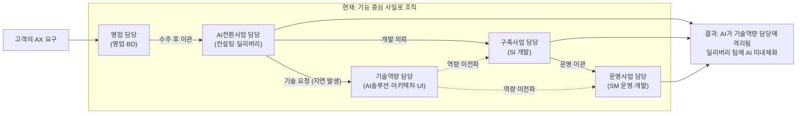
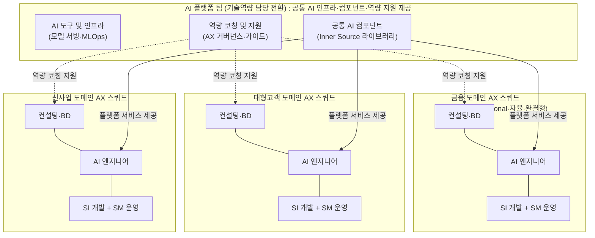
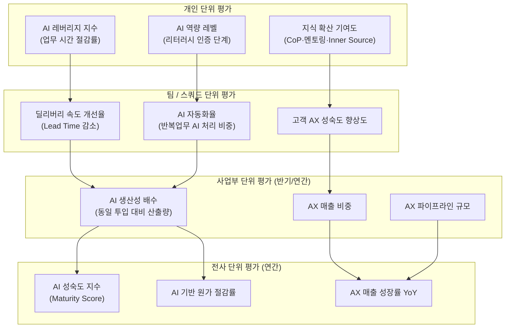
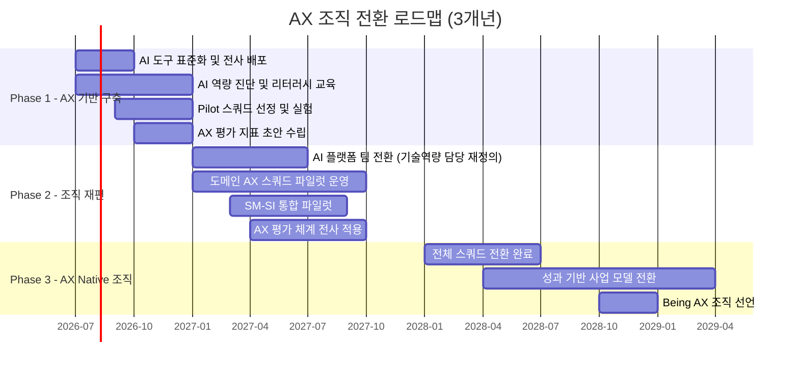

> 콘웨이의 법칙, 역콘웨이 전략, 바이브코딩, 10X/100X 개발자 개념을 통해  
> AI 사업본부의 AX 전환 방향과 새로운 평가 체계를 탐색한다.

---

## 목차

1. [AX(AI Transformation)란 무엇인가](#1-axai-transformation란-무엇인가)
2. [현재 조직 구조 분석: 콘웨이의 법칙으로 보다](#2-현재-조직-구조-분석-콘웨이의-법칙으로-보다)
3. [역콘웨이 전략과 새로운 조직 설계](#3-역콘웨이-전략과-새로운-조직-설계)
4. [바이브코딩과 10X/100X 개발자](#4-바이브코딩과-10x100x-개발자)
5. [AX 시대의 평가 체계](#5-ax-시대의-평가-체계)
6. [AX 전환 실행 로드맵](#6-ax-전환-실행-로드맵)

---

## 1. AX(AI Transformation)란 무엇인가

### 1.1 DX를 넘어선 AX의 본질

지난 10년간 기업들은 DX(Digital Transformation), 즉 디지털 전환이라는 거대한 물결을 헤쳐왔다. 클라우드로 이전하고, 모바일 앱을 구축하며, 데이터 웨어하우스를 쌓았다. 그러나 이제 또 다른 전환이 시작되었다. 바로 AX(AI Transformation), AI를 중심으로 기업의 존재 방식 자체를 근본적으로 재편하는 것이다.

AX는 단순히 AI 도구를 도입하거나, 기존 업무에 AI를 덧붙이는 것이 아니다. 맥킨지가 2025년 보고서 *Superagency in the Workplace*에서 분석한 것처럼, AI가 전 세계적으로 최대 4.4조 달러의 생산성 잠재력을 가지고 있지만, 실제로 업무 전반에 AI를 완전히 통합해 '지능형 조직'으로 운영하는 기업은 아직 1% 미만에 불과하다. 이것이 의미하는 바는 명확하다. 대부분의 기업이 AI를 단순한 자동화 도구로 활용하는 "DOING AX"에 머물러 있지, AI 중심으로 조직과 프로세스와 사업 모델을 근본적으로 재설계하는 "BEING AX"로 진입하지 못했다는 것이다.

AI 혁신 프로젝트가 기대에 미치지 못하는 이유는, 인간 중심의 조직과 프로세스를 유지한 채 AI를 자동화 도구로만 제한했기 때문이다. AX가 성공하기 위해서는 AI Workforce를 중심으로 조직, 문화, 시스템, 프로세스를 전면적으로 재설계해야 하며, 기업 전체가 AI에 의해 운영되는 구조로 나아가야 한다.

DX와 AX의 가장 근본적인 차이는 "무엇을 바꾸는가"에 있다. DX가 기술 인프라와 채널을 디지털로 전환하는 것이었다면, AX는 일하는 방식, 의사결정 구조, 인력의 역할, 그리고 비즈니스 모델 자체를 AI 중심으로 재정의한다. 아래 비교는 그 차이를 구체적으로 보여준다.

| 구분 | DX (2015–2023) | AX (2024년 이후) |
|------|---------------|-----------------|
| 핵심 전환 | 클라우드 이전, 모바일화 | AI 네이티브 아키텍처 |
| 자동화 방식 | RPA, 워크플로 자동화 | Agentic AI 자동화 |
| 데이터 활용 | 대시보드·리포팅 | 예측·생성형 AI 분석 |
| 인력 변화 | 디지털 리터러시 강화 | AI 오케스트레이터로 전환 |
| 조직 변화 | IT 팀 강화 | 전사 AI 내재화 |
| 평가 기준 | 디지털 전환율 | AI 생산성 배수, AX 성숙도 |

### 1.2 SM/SI 맥락에서 AX가 의미하는 것

SM(System Management, IT 운영·유지보수)과 SI(System Integration, 시스템 구축·통합)를 주력으로 하는 IT 대기업에게 AX는 특별한 이중적 의미를 가진다. 첫째는 내부 딜리버리의 AX이고, 둘째는 고객에게 AX를 제공하는 사업 자체다. 이 두 가지는 동전의 양면처럼 연결되어 있다. 스스로 AX를 실천하지 않는 기업이 고객의 AX를 이끌 수는 없다.

**SM에서의 AX: AIOps로의 전환**

전통적인 SM은 사람이 모니터링하고, 사람이 장애를 감지하며, 사람이 티켓을 처리하는 구조였다. AX 시대의 SM은 AIOps(AI for IT Operations) 패러다임으로 전환된다. AIOps는 개별적인 수동 IT 운영 도구를 하나의 지능형 자동화 IT 운영 플랫폼으로 통합하여 IT 운영팀이 엔드투엔드 가시성과 컨텍스트를 바탕으로 성능 저하나 장애에 신속하고 선제적으로 대응할 수 있도록 한다.

이것이 SM 조직에 의미하는 바는 크다. 한 명의 운영자가 과거에 관리할 수 있었던 시스템의 수가 AI의 도입으로 수배에서 수십 배로 확대된다. 장애 감지는 사람이 화면을 응시하는 방식에서 AI가 패턴을 인식하고 이상을 탐지하는 방식으로 진화한다. 근본 원인 분석도 AI가 수십 개의 상관관계를 동시에 분석하여 사람보다 빠르게 원인을 좁혀준다. AIOps는 AI 기술을 활용하여 IT 서비스 관리 및 운영을 자동화하고 효율화하는 것으로, 현대 IT 인프라의 급격한 복잡도 증가—온프레미스, 클라우드, 멀티클라우드, 쿠버네티스, 마이크로서비스—에 대응하기 위한 핵심 전략이다.

**SI에서의 AX: AI 네이티브 딜리버리**

SI 사업에서 AX는 더욱 근본적인 변화를 요구한다. 요구사항을 사람이 분석하고, 사람이 설계하며, 사람이 코드를 작성하고, 사람이 테스트하는 전통적인 폭포수 방식은 이미 AI에 의해 빠르게 대체되고 있다. 기존의 소프트웨어 개발 방식도 전환되고 있다. 프로젝트 단계별 업무를 사람이 아닌 에이전틱 AI가 수행하고, 구성원은 이를 설계하고 조율하는 방식으로 변화하며, 이를 통해 프로젝트를 더욱 빠르고 효율적으로 수행할 수 있는 기반이 마련되고 있다.

SI 엔지니어의 역할은 "코더"에서 "AI 오케스트레이터"로 변화한다. 도메인 전문성(특정 산업의 비즈니스를 깊이 이해하는 능력), AI 활용력(프롬프트 작성·AI 에이전트 설계·AI 파이프라인 구축), 고객 소통력(AI의 한계를 설명하고 비즈니스 문제를 AI 솔루션으로 번역하는 능력)이 핵심 역량이 된다.

### 1.3 DOING AX에서 BEING AX로: 성숙도의 스펙트럼

AX의 성숙도는 크게 세 단계로 구분할 수 있다. 가장 낮은 단계는 AI 도구를 개별 업무에 적용해보는 **AI 실험 단계**이고, 중간 단계는 특정 프로세스와 업무 체계 전반을 AI로 자동화하는 **DOING AX 단계**이며, 가장 높은 단계는 조직 구조·사업 모델·문화까지 AI를 중심으로 근본 재편된 **BEING AX 단계**다. 이는 KPMG가 제시한 '도입(Enable)–내재화(Embed)–고도화(Evolve)' 프레임워크와도 맥락을 같이한다. 도입 단계가 AI 실험 단계에, 내재화 단계가 DOING AX에, 고도화 단계가 BEING AX에 각각 대응된다.

2026년 트렌드 코리아의 핵심 키워드 중 하나인 'AX 조직'은 AI 도입을 통해 부서 간 경계를 허물고 직급을 압축하며, 유연하고 자율적인 조직 모델로 진화하는 현상을 의미한다. 같은 업계의 경쟁사가 AI를 도입하여 생산성을 10배 이상 높인다면, 그렇지 않은 기업은 원가 경쟁력에서 밀려날 수밖에 없다.

SM/SI IT 대기업이 목표로 삼아야 할 것은 단순히 AI 도구를 사용하는 것이 아니다. AI를 비즈니스의 핵심 운영 인프라로 내재화하여, 고객보다 먼저 AX를 실천하고, 그 경험과 방법론을 고객에게 전수하는 AX의 롤 모델이 되는 것이다.

---

## 2. 현재 조직 구조 분석: 콘웨이의 법칙으로 보다

### 2.1 콘웨이의 법칙과 3계층 구조의 딜레마

1968년 멜빈 콘웨이(Melvin E. Conway)가 발표한 논문에서 비롯된 콘웨이의 법칙은 반세기가 지난 지금도 유효하다. "시스템을 설계하는 조직은, 그 조직의 의사소통 구조를 본뜬 시스템을 만들어내게 되어 있다." 팀이나 조직의 사회적 구조 및 의사소통 경로가 그들이 만드는 애플리케이션, 제품에 반영된다는 것이다.

이 법칙의 핵심은 조직 구조가 바뀌지 않으면 소프트웨어 아키텍처도 절대 바뀌지 않는다는 것이다. 마찬가지로, 조직 구조가 바뀌지 않으면 AI가 딜리버리 현장에 내재화되지 않는다.

질문에서 제시된 조직 구조를 자세히 살펴보면, 이 조직은 기능 기반의 수직 사일로(Functional Silo) 구조로 설계되어 있다. 기술을 담당하는 기술역량, 영업을 담당하는 영업, AI전환을 담당하는 AI전환사업, 전통적 SI를 담당하는 구축사업, 그리고 SM과 IT 운영을 담당하는 운영사업이 각각 분리된 사일로를 형성한다. 이것이 마치 UI팀·백엔드팀·데이터베이스팀으로 분리된 3계층 아키텍처와 정확히 동일한 구조다.

기술 관점에서는 응집력이 높다. 같은 기술을 가진 사람끼리 모여 있으므로 전문성이 집중된다. 하지만 **비즈니스 기능 관점에서는 응집력이 극도로 낮다.** 고객 하나의 AX 프로젝트를 수행하려면 기술역량 담당, 영업 담당, AI전환사업 담당, 구축사업 담당이 모두 관여해야 한다. 변경은 여러 팀에 분산되어 있고, 팀 간 인수인계는 불가피하며, 소통 비용은 기하급수적으로 증가한다.

### 2.2 현재 조직의 구조적 문제 진단

아래 다이어그램은 현재 조직 구조에서 고객의 AX 요구가 어떻게 처리되는지, 그리고 그 과정에서 AI 역량이 어떻게 격리되는지를 보여준다.

**기술역량 담당의 역설: AI가 특정 팀에 갇히다**

기술역량 담당은 AI엔지니어링팀, AI개발팀, 아키텍처팀, UI/UX팀으로 구성되어 있다. 이 구조는 AI 기술 역량을 집중한다는 점에서는 효율적으로 보인다. 하지만 콘웨이의 법칙 관점에서 보면 치명적인 문제를 내포하고 있다. AI 역량이 특정 팀에만 존재하기 때문에, 딜리버리 현장(구축사업 담당, 운영사업 담당)에서 AI를 활용하려면 반드시 기술역량 담당을 거쳐야 한다. 이 과정에서 요청-검토-지원이라는 긴 여정이 발생하고, 긴박한 프로젝트 일정 속에서 AI 활용을 포기하게 되는 일이 반복된다. 결국 기술역량 담당의 AI 역량은 고립된 섬이 된다.

**영업-딜리버리 분리: 인수인계 비용의 구조화**

영업 담당이 수주를 담당하고, AI전환사업 담당이 컨설팅과 딜리버리를 담당하며, 구축사업 담당이 실제 개발을 담당하는 구조는, 고객의 니즈가 여러 팀을 거치며 번역되고 왜곡될 가능성을 내포한다. 영업이 약속한 것을 컨설팅이 재해석하고, 컨설팅이 설계한 것을 개발이 구현하는 과정에서 고객의 본래 의도는 멀어진다. AX처럼 모호하고 빠르게 변화하는 영역일수록 이 왜곡은 더 크다.

**AI전환사업 담당과 구축사업 담당의 단절: 지식의 증발**

AI컨설팅팀이 고객의 비즈니스를 분석하고 AI 적용 전략을 수립해도, 실제 개발은 구축사업 담당의 개발팀이 담당한다. 컨설팅 과정에서 쌓인 도메인 지식, 비즈니스 맥락, AI 설계 의도는 팀 경계에서 증발한다. 수개월에 걸친 컨설팅의 인사이트가 기술 명세서 몇 장으로 압축되어 다른 팀으로 전달되는 구조다.

**SM과 SI의 분리: DevOps 불가능 구조**

같은 고객사에 대해 SM(IT운영1팀, IT운영2팀)과 SI(운영개발팀, 구축개발팀)가 서로 다른 사업 담당에 속해 있다. 운영에서 발견되는 문제점, 반복되는 인시던트 패턴, 사용자의 실제 사용 행태가 개발에 피드백되지 않는다. DevOps의 핵심 원리인 "운영에서 개발로의 피드백 루프"가 조직 구조상 원천 차단된 것이다. AIOps도 마찬가지다. AIOps를 구현하려면 운영팀이 AI 역량을 내재화해야 하는데, AI 역량은 기술역량 담당에, 운영은 운영사업 담당에 따로 있다.

### 2.3 이 구조가 만들어내는 소프트웨어·서비스 패턴

콘웨이의 법칙에 따르면, 이 조직 구조가 만들어낼 서비스와 딜리버리 방식은 조직 구조를 그대로 반영한다. AI는 별도 모듈로 나중에 붙여지는 방식으로 개발되고, 컨설팅-개발-운영의 경계는 시스템 아키텍처의 경계가 되며, SM과 SI는 서로 다른 기술 스택과 파이프라인을 가진다. 결국 고객 입장에서 AX를 경험하는 것은 파편화된 서비스들의 조합이지, 통합된 AI 경험이 아니다.

---

## 3. 역콘웨이 전략과 새로운 조직 설계

### 3.1 역콘웨이 전략(Reverse Conway Maneuver)의 원리

역 콘웨이 전략이란 조직이 바라는 소프트웨어 아키텍처를 구성하려면 그 팀과 조직 구조를 바꿔야 한다는 것이다. 즉, 만들고 싶은 이상적인 딜리버리 방식이 있다면, 조직을 먼저 그 방식대로 구조화하라는 것이다. AX 딜리버리를 위해 원하는 구조는 무엇인가? AI가 딜리버리의 모든 단계에 내재화되고, 컨설팅-개발-운영이 단절 없이 연결되며, 고객 도메인을 깊이 이해하는 팀이 처음부터 끝까지 책임지는 구조다. 그렇다면 조직도 그렇게 만들어야 한다.

### 3.2 Team Topologies 관점: 4가지 팀 유형

*Team Topologies* (2nd Edition, 2025)의 저자 Matthew Skelton은 AI 시대에도 가장 효과적인 조직 패턴은 명확하다고 주장한다. 빠른 가치 전달을 위해 조직하고 팀에 권한을 부여하는 패턴은, GenAI 등장 전에도 효과적이었고 GenAI와 함께할 때도 마찬가지다. 가치 흐름이 조직 설계의 주요 원칙이 되어야 한다.

Team Topologies 프레임워크는 4가지 팀 유형을 정의한다. 첫째는 **스트림 정렬 팀(Stream-aligned Team)** 으로, 특정 비즈니스 도메인의 가치 흐름에 정렬된 팀이다. 둘째는 **플랫폼 팀(Platform Team)** 으로, 스트림 정렬 팀이 자율적으로 일할 수 있도록 내부 서비스를 제공하는 팀이다. 셋째는 **인에이블링 팀(Enabling Team)** 으로, 다른 팀의 역량을 키우는 것을 목적으로 하는 팀이다. 넷째는 **복잡 서브시스템 팀(Complicated Subsystem Team)** 으로, 특정 기술적 복잡성을 전담하는 팀이다.

Team Topologies의 핵심 원리—팀을 독립적으로 실행 가능한 서비스 중심으로 조직하고, 인지 부하를 핵심 설계 원칙으로 삼으며, "자판기" 인터페이스를 통해 역량을 제공하는 것—는 AI 에이전트 공간에도 완벽하게 적용된다.

### 3.3 기술역량 담당에서 AI 플랫폼 팀으로의 전환

현재의 기술역량 담당은 "AI 역량 공급자"의 역할을 하고 있다. 그러나 이 모델의 본질적 한계는, 기술역량 담당이 병목(Bottleneck)이 된다는 것이다. 모든 AI 요청이 기술역량 담당을 거쳐야 하면 해당 조직은 언제나 일감이 넘친다. 딜리버리 팀은 기다리고, 고객은 지연을 경험한다.

AX 시대의 기술역량 담당은 역할을 근본적으로 재정의해야 한다. AI 역량을 직접 공급하는 것이 아니라, 다른 팀이 AI를 자급자족할 수 있도록 **플랫폼과 인프라와 공통 컴포넌트를 제공**하는 것이 목표가 되어야 한다. 이는 Team Topologies의 플랫폼 팀과 인에이블링 팀의 역할에 해당한다.

AI엔지니어링팀은 AI 에이전트 프레임워크, 공통 RAG 파이프라인, 모델 서빙 인프라 등 AI 플랫폼 서비스를 개발하고 운영하는 것으로 역할을 전환한다. AI개발팀은 재사용 가능한 AI 컴포넌트 라이브러리를 구축하고, Inner Source 방식으로 모든 딜리버리 팀이 활용할 수 있도록 공개한다. 아키텍처팀은 AI Native 아키텍처 패턴을 정의하고, 각 스쿼드가 이 패턴을 따를 수 있도록 가이드한다. UI/UX팀은 AI 인터페이스 디자인 시스템을 구축하여 각 스쿼드가 일관된 AI 경험을 제공할 수 있게 지원한다.

이 전환의 핵심은 기술역량 담당이 "중앙집중식 AI 공장"에서 "AI 역량 내재화 지원자"로 변모하는 것이다. AX 전담 조직이 현업 전체를 끌고 갈 수는 없다. 각 조직에 스며든 'Keyman'이 과제 발굴·실험·확산을 끌어야 하며, 전담 조직은 플랫폼·기술·거버넌스를 지원하는 구조로 전환되어야 한다.

### 3.4 도메인 중심 AX 스쿼드 설계

역콘웨이 전략의 핵심은 비즈니스 도메인을 중심으로 팀을 재편하는 것이다. 현재의 기능 기반 조직 대신, 금융 도메인, 대형고객 도메인, 신사업 도메인과 같이 비즈니스 영역을 중심으로 Cross-Functional 팀(스쿼드)을 구성한다.

각 AX 스쿼드에는 다음의 역할이 통합된다. 컨설팅과 비즈니스 개발(BD) 역할을 가진 구성원이 고객의 비즈니스 문제를 진단하고 AI 적용 전략을 수립한다. AI 엔지니어는 AI 플랫폼 팀이 제공하는 공통 컴포넌트를 활용하여 해당 도메인에 특화된 AI 솔루션을 개발한다. SI 개발자와 SM 운영 전문가는 같은 팀에 속해 개발과 운영의 경계를 허물고 DevOps-AX를 실천한다. 영업과 BD 역할은 컨설팅 역할과 통합되어, 수주에서 딜리버리까지 동일한 팀이 책임진다.

이 구조에서 각 스쿼드는 자신이 담당하는 고객 도메인에 대해 처음부터 끝까지 책임진다. 컨설팅에서 얻은 도메인 지식은 개발로 자연스럽게 흐르고, 운영에서 발견되는 패턴은 즉각 개발에 반영된다. AI는 스쿼드 내부에서 자연스럽게 활용되며, AI 플랫폼 팀(기술역량 담당에서 전환)은 각 스쿼드가 필요한 AI 인프라를 제공하는 역할에 집중한다.

**도메인별 스쿼드의 구체적 역할 분화**

금융 도메인 AX 스쿼드는 금융 규제와 컴플라이언스 이해를 기반으로 AI 신용 평가, 리스크 분석, 사기 탐지, 고객 상담 자동화 등 금융 특화 AI 솔루션을 구축하고 운영한다. 금융 시스템의 SM도 동일 스쿼드가 담당하여 운영 데이터를 AI 모델 개선에 직접 활용한다.

대형고객 도메인 AX 스쿼드는 대형 기업고객의 다양한 ERP, SCM, HR 시스템에 AI를 접목하는 역할을 담당한다. 대형 기업고객의 통합 IT 운영과 새로운 AI 기능 개발을 동일 팀이 담당함으로써, 운영 중 발견되는 비효율을 즉시 AI 자동화로 전환하는 사이클을 구현한다.

신사업 도메인 AX 스쿼드는 특정 수직 도메인에 집중하지 않고 전략적 대형 신사업을 담당한다. AI 에이전트 기반의 차세대 엔터프라이즈 솔루션, 신규 산업 진출, 대형 공공 AI 프로젝트 등이 이 스쿼드의 영역이다.

**영업 담당의 역할 재정의**

기존 영업 담당은 영업 전문 조직으로서의 역할을 유지하되, 각 도메인 스쿼드와 훨씬 더 긴밀하게 연결된다. 영업 담당자는 특정 도메인 스쿼드의 BD(Business Development) 역할을 겸하거나, 스쿼드 내 BD 전담 구성원과 함께 고객을 담당한다. 수주 후 다른 팀에 이관하는 것이 아니라, 수주를 담당한 사람이 해당 스쿼드의 일원으로서 딜리버리까지 책임진다는 원칙이 중요하다.

### 3.5 SM과 SI의 통합: DevOps-AX 원칙

현재 조직에서 SM을 담당하는 운영사업 담당과 SI를 담당하는 구축사업 담당은 서로 다른 조직에 있다. 이를 동일 스쿼드로 통합하는 것은 단순한 조직 변경이 아니라, AX의 가장 강력한 원동력을 만드는 일이다.

운영에서 수집되는 데이터는 AI 모델의 최고 학습 자료다. 실제 사용자들이 어떤 기능을 어떻게 사용하고, 어디서 오류가 발생하며, 어떤 쿼리를 반복적으로 요청하는지가 모두 AI 개선의 재료가 된다. SM과 SI가 같은 팀이라면 이 데이터가 즉각적으로 AI 모델 개선과 신기능 개발로 이어진다. SM과 SI가 분리되어 있다면 이 피드백 루프는 회의와 문서 작성과 요청 절차로 희석된다.

AIOps의 관점에서도 이 통합은 필수적이다. 운영팀이 AI를 도입하여 장애를 예측하고 자동으로 대응하려면, 그 AI 시스템을 개발하고 유지보수하는 역량이 같은 팀 안에 있어야 한다. 데이터팀 + IT + 현업 + 기획이 하나의 스쿼드로 묶여서 운영되어야 한다. "IT만" AX를 하면 100% 실패한다.

---

## 4. 바이브코딩과 10X/100X 개발자

### 4.1 바이브코딩이 SI 딜리버리를 바꾸는 방식

바이브코딩(Vibe Coding)은 OpenAI의 공동 창립자 Andrej Karpathy가 제시한 개념으로, 개발자가 기능의 아이디어와 방향만 AI에게 전달하면 AI가 실제 코드를 구현하는 방식을 뜻한다. 바이브 코딩은 어느 날 갑자기 혜성처럼 등장한 개념이 아니다. 생성형 AI가 일상과 업무 전반을 바꾸고 있는 흐름 속에서 자연스럽게 나타났으며, 이 단어는 Karpathy가 처음 언급한 지 불과 한 달 만에 메리엄-웹스터 사전에 '속어 및 트렌드' 명사로 등재됐다.

SM/SI IT 대기업의 딜리버리 현장에서 바이브코딩은 어떤 의미를 가지는가? 전통적인 SI 프로젝트는 요구사항 정의 → 설계 → 개발 → 테스트 → 배포의 긴 사이클을 가진다. 각 단계는 서로 다른 전문가가 담당하고, 단계 간 인수인계에서 정보가 손실된다. 바이브코딩이 내재화된 스쿼드에서는 이 과정이 근본적으로 달라진다. 컨설턴트가 고객과 비즈니스 요구사항을 정의하면서 동시에 AI를 통해 프로토타입을 생성한다. 프로토타입이 곧 대화의 도구가 되고, 고객의 피드백이 즉각 코드 개선으로 이어진다.

바이브 코딩은 개발자가 원하는 결과만 말로 전하고 세부 구현은 AI에게 맡기는 방식으로, 2025년 하반기부터 현장 도입이 본격화됐다. 스택 오버플로의 2025년 설문에서 응답자의 84%가 개발에 AI 도구를 쓰거나 쓸 계획이라고 답해 2024년 76%에서 크게 늘었다.

그러나 바이브코딩의 잠재력과 함께 현실적 한계도 직시해야 한다. METR의 2025년 RCT 연구에서는 오픈소스 프로젝트에서 AI 도구를 사용한 숙련 개발자가 실험 결과로는 오히려 19% 느려졌는데, 본인들은 20% 빨라졌다고 느꼈다. 체감과 실제 사이의 이 괴리는 상당히 충격적인 결과다. 또한 AI 코딩 도구를 사용하는 개발자 대부분은 주당 수 시간의 코드 작성 시간을 절약했다고 답했으나, 전체 업무 시간이 줄었다고 응답한 비율은 높지 않았다. 코드 작성에서 절약한 시간이 늘어난 변경 사항 관리, 코드 리뷰, 팀 간 조율에 다시 투입됐기 때문이다.

이는 바이브코딩의 생산성 이득이 개인 단위를 넘어 조직 단위로 실현되기 위해서는 **AI가 생성하는 코드를 검증하고 통합하는 프로세스와 조직 역량**이 함께 강화되어야 함을 의미한다. 조직이 바뀌지 않으면 AI가 생성하는 코드의 속도를 조직이 소화하지 못한다.

### 4.2 10X 개발자의 조직적 의미

10X 개발자란 한 사람이 10명의 효율을 내는 핵심 인재를 의미한다. 전통적으로 이는 뛰어난 개인의 기술적 역량에 의존하는 개념이었다. AI 시대의 10X 개발자는 다르다. AI 도구를 극도로 효율적으로 활용하여 설계·개발·테스트·배포를 훨씬 빠르게 수행하는 사람이다.

10X 개발자가 조직 구조에 미치는 영향은 두 가지 방향으로 나타난다. 하나는 **팀 규모의 적정화**다. 과거에 10명이 필요했던 작업을 3명이 할 수 있다면, 팀의 최적 규모가 달라진다. 또 하나는 **역할의 통합**이다. 10X 개발자는 기획-설계-개발-QA를 혼자 처리할 수 있으므로, 이전에는 기능별로 나뉘어 있던 역할들이 한 사람 안에서 통합된다. 이것이 AX 스쿼드의 구성에도 영향을 미친다. 스쿼드는 더 작아지지만, 각 구성원의 역량과 책임 범위는 더 넓어진다.

### 4.3 100X 개발자와 SM의 미래

100X 개발자 개념은 AI 에이전트 군단을 이끄는 1인 엔터프라이즈의 가능성을 탐구한다. 현실적으로 엔터프라이즈 SI 영역에서 100X가 즉각 실현되기는 어렵다. 고객 커뮤니케이션, 복잡한 비즈니스 요구사항 이해, 조직 정치, 리스크 관리 등은 여전히 인간이 담당해야 하는 영역이기 때문이다.

그러나 SM 영역에서는 100X에 가까운 변화가 현실화되고 있다. AIOps가 성숙하면 한 명의 운영 엔지니어가 AI 에이전트를 통해 수백 개의 시스템을 동시에 모니터링하고, AI가 대부분의 장애를 자동으로 탐지·진단·해결하는 구조가 된다. 이는 SM 사업의 인력 구조에 근본적인 변화를 가져온다. 같은 서비스 수준을 유지하는 데 필요한 인원이 대폭 감소할 수 있다.

이 변화를 위협으로만 볼 것인가, 기회로 볼 것인가는 조직이 어떻게 준비하느냐에 달려 있다. 운영에서 해방된 인력을 AI 개선과 새로운 AX 사업 개발로 전환하는 것이 AX 조직의 전략적 과제다.

### 4.4 AI 네이티브 시대의 새로운 역할 정의

AX 시대에는 기존의 직군 구분이 재정의된다. 개발자는 코드 작성자(Coder)에서 AI 오케스트레이터(AI Orchestrator)로 진화한다. 이들은 AI 에이전트를 설계하고, AI가 생성한 코드의 품질을 검증하며, AI를 활용한 아키텍처를 설계하는 데 집중한다. 컨설턴트는 비즈니스 분석가에서 AI 솔루션 아키텍트로 확장된다. 고객의 비즈니스 문제를 AI 솔루션으로 변환하는 역량, 즉 "비즈니스 문제를 AI 프롬프트로 번역하는 능력"이 핵심이 된다. 운영 엔지니어는 시스템 관리자에서 AIOps 엔지니어로 전환된다. AI 모델을 활용하여 운영 자동화를 설계하고, AI의 예측 결과를 판단하며, AI가 처리하지 못하는 고위험 의사결정을 담당한다.

이 모든 역할 변화의 공통점은, AI가 반복적·대량 처리 업무를 담당하고 사람은 고위험 판단과 창의적 설계에 집중한다는 원칙이다. 예를 들어 보안 업무에서는 AI가 이상 탐지와 위협 분류를 수행하고, 사람은 실제 침해 여부 판단과 정책 승인이라는 고위험 의사결정을 담당한다. AX 시대의 리더는 인간의 역량과 AI 자원이 입체적으로 시너지를 내는 '인간-AI 협업 체계'를 설계하고, 그 균형을 지속적으로 조율하는 역할을 맡는다.

---

## 5. AX 시대의 평가 체계

### 5.1 기존 평가 체계의 구조적 한계

현재 SM/SI 기업의 평가 체계는 매출, 영업이익, MMD(Man-Month-Day, 인월일), 프로젝트 수주 건수를 중심으로 설계되어 있다. 이 체계는 AI 시대에 세 가지 근본적인 모순을 야기한다.

첫째, AI로 생산성이 향상되면 평가가 하락하는 역설이다. 10명이 해야 할 일을 AI를 활용하여 5명이 해낸다면, MMD 기반 평가에서는 이 팀이 더 적은 일을 한 것처럼 보인다. AI 도입이 오히려 불이익을 주는 구조다. 둘째, 단기 성과 중심의 평가가 AI 투자를 저해한다. AI 역량 구축, 데이터 플랫폼 정비, 팀 리스킬링은 단기간에 매출로 연결되지 않는다. 분기별 성과로 평가받는 팀 리더는 AI 투자보다 단기 프로젝트 수주를 선택한다. 셋째, 팀 단위 개인 평가가 AI 협업을 저해한다. AI 역량을 보유한 소수가 다수를 돕는 구조에서, 돕는 사람의 개인 성과는 올라가지 않는다. 협력과 지식 공유는 현재의 평가 체계에서 보상받지 못한다.

2025년 DORA 보고서는 소프트웨어 개발 전문가들을 대상으로 한 대규모 설문에서 "AI는 승리하는 조직의 강점과 고전하는 조직의 약점을 동시에 증폭시킨다"고 결론지었다. AI 채택이 처리량(배포 빈도, 리드 타임)을 향상시키지만 안정성 문제(변경 실패율, 재작업)도 증가시킨다. 이는 평가 체계가 산출량만 측정해서는 안 되고, 품질과 안정성을 함께 측정해야 함을 의미한다.

### 5.2 개인 단위 평가 체계

AX 시대의 개인 평가는 "얼마나 많이 했는가"에서 "AI를 얼마나 잘 활용했는가", 그리고 "팀의 AI 역량을 얼마나 향상시켰는가"로 무게중심을 이동해야 한다.

**AI 레버리지 지수**는 AI 도입 전후의 업무 처리 시간을 비교하여 측정한다. 예를 들어, 특정 유형의 코드 리뷰를 AI 지원 없이 수행하면 2시간이 걸리고 AI 지원 시 30분이 걸린다면 AI 레버리지 지수는 4배다. 단, 단순히 빠름이 아니라 품질이 유지되거나 향상된 경우에만 긍정 평가한다.

**AI 역량 레벨**은 개인이 활용하는 AI 도구의 수준과 범위를 측정한다. 단순한 ChatGPT 사용부터, AI 에이전트 설계, AI 파이프라인 구축, 멀티 에이전트 오케스트레이션까지 단계별 인증 체계를 운영한다. 이는 기존의 기술 자격증 체계와 유사하지만, AI 특화 역량을 측정한다는 점에서 다르다.

**AI 지식 확산 기여도**는 개인이 팀과 조직의 AI 역량을 높이는 데 기여한 활동을 평가한다. CoP(Community of Practice) 참여, 내부 AI 교육 진행, AI 활용 사례 문서화, Inner Source 기여 등이 포함된다. 이 지표는 AI 역량이 특정 개인에게만 집중되지 않도록 확산을 촉진하는 인센티브 역할을 한다.

### 5.3 팀/스쿼드 단위 평가 체계

스쿼드는 고객 도메인에 대해 처음부터 끝까지 책임지는 단위이므로, 평가도 처음부터 끝까지의 가치 흐름을 기준으로 이루어져야 한다.

**딜리버리 속도 개선율**은 AI 도입 전후를 비교하여 동일한 기능 구현에 걸리는 리드 타임(Lead Time)의 감소율을 측정한다. 이는 DORA 지표의 핵심인 리드 타임(Lead Time for Changes)을 AI 시대에 맞게 적용한 것이다. 구글의 2025 DORA 보고서에 따르면 소프트웨어 개발 전문가들의 AI 사용률이 90%에 달하며, 개발자부터 제품 관리자까지 이 전문가들은 AI를 핵심 업무 흐름에 통합하여 하루 평균 2시간씩 AI와 함께 업무를 수행하고 있다.

**AI 자동화율**은 스쿼드가 처리하는 전체 업무 중 AI가 자동으로 처리하는 비중이다. 도메인 AX 스쿼드의 SM 업무 측면에서는 자동 해결되는 인시던트 비율, 예측 기반으로 예방된 장애 건수, MTTR(Mean Time to Recovery) 감소율이 핵심 측정 지표다. SI 개발 업무 측면에서는 AI가 생성한 코드의 비중, 자동화된 테스트 커버리지, AI 기반으로 단축된 배포 시간이 측정 대상이다.

**고객 AX 성숙도 향상도**는 스쿼드가 담당하는 고객사의 AI 도입 수준이 얼마나 향상되었는지를 측정한다. 단순히 AI 솔루션을 납품하는 것이 아니라, 고객 조직이 AI를 자체적으로 활용할 수 있는 역량을 갖추도록 지원했는가를 평가한다. 이 지표는 고객 만족도와 재계약률, AX 솔루션의 실제 활용률 등을 통해 간접 측정한다.

### 5.4 사업부 단위 평가 체계

사업부 수준에서는 AX 전환의 비즈니스 가치를 측정한다. 이 단위의 평가는 매 분기가 아닌 최소 반기, 이상적으로는 연간 단위로 이루어져야 한다. AI 투자의 효과는 단기간에 나타나지 않기 때문이다.

**AX 매출 비중**은 전체 매출 중 AI가 핵심 구성요소로 포함된 프로젝트의 매출 비중이다. AI를 단순히 사용하는 프로젝트가 아니라, AI가 해당 솔루션의 핵심 가치를 만드는 프로젝트를 기준으로 한다. 이 지표는 사업부가 AX를 사업 모델의 중심으로 전환하고 있는지를 보여준다.

**AI 생산성 배수**는 동일한 규모의 인력과 예산으로 AI 도입 전후에 얼마나 더 많은 산출물을 만들어내는지를 측정한다. 이는 기존의 MMD 기반 평가를 대체하는 지표로, 인력이 줄어도 산출물이 유지되거나 늘어나는 경우를 긍정적으로 평가한다.

**AX 파이프라인 규모**는 현재 진행 중이거나 수주 가능성이 있는 AX 관련 사업 기회의 규모다. 이 지표는 사업부의 AX 시장 침투력을 측정하며, 현재의 매출뿐 아니라 미래의 성장 가능성을 반영한다.

### 5.5 전사 단위 평가 체계

전사 단위에서는 조직 전체의 AX 전환 속도와 깊이를 측정한다.

**AI 성숙도 지수(AI Maturity Score)** 는 KPMG, Gartner 등 글로벌 컨설팅 기관의 AI 성숙도 모델을 기반으로, 조직 전체의 AI 내재화 수준을 측정한다. 앞서 1장에서 설명한 AI 실험·DOING AX·BEING AX의 세 단계가 곧 이 지수의 측정 척도가 된다. KPMG는 이를 '도입(Enable)–내재화(Embed)–고도화(Evolve)' 3단계로 구체화하며, 조직과 기능과 기반 전반의 균형 잡힌 혁신을 목표로 하는 실행 모델을 제안했다. 이 프레임워크를 활용하여 각 사업부, 각 스쿼드의 성숙도를 측정하고, 전사 평균을 AI 성숙도 지수로 관리한다.

**AI 기반 원가 절감률**은 AI 도입으로 인해 절감된 운영 비용과 개발 비용의 비율이다. AIOps를 통한 장애 대응 비용 절감, 바이브코딩을 통한 개발 생산성 향상, AI 기반 테스트 자동화를 통한 QA 비용 절감이 모두 포함된다.

**AX 매출 성장률(YoY)** 은 AI가 핵심인 매출이 전년 대비 얼마나 성장했는지를 측정한다. 이 지표는 AX가 단순한 내부 효율화를 넘어 실질적인 비즈니스 성장으로 이어지고 있는지를 보여준다.

### 5.6 평가 체계 구조도

### 5.7 평가 시 주의해야 할 원칙

**단기 지표와 장기 역량의 균형**: 분기별 매출 성과만으로 스쿼드를 평가하면 AI 역량 투자가 위축된다. AI 역량 구축 활동(교육, 실험, 실패를 통한 학습)을 평가에 반영하되, 단기 성과와의 가중치 배분을 신중하게 설계해야 한다.

**결과 지표와 활동 지표의 구분**: AI 레버리지 지수나 AX 매출 비중은 결과 지표다. AI 도구 도입 수, 교육 이수율, CoP 활동 횟수는 활동 지표다. 활동 지표만으로 평가하면 외형적 활동만 늘고 실질적 성과는 따르지 않는다. 두 가지를 함께 보되, 결과 지표에 더 높은 가중치를 부여한다.

**실험과 실패를 용납하는 평가 환경**: AI 도입에는 필연적으로 실패가 따른다. 실험적 프로젝트에서의 실패를 부정적으로 평가하면 구성원은 안전한 기존 방식만 선택한다. Discovery → Prototype → Pilot → Scaling의 각 단계별 성과 기준을 달리 적용하고, Prototype 단계의 실패는 학습으로 평가하는 문화를 만들어야 한다.

---

## 6. AX 전환 실행 로드맵

AX 전환은 하루아침에 이루어지지 않는다. 조직 구조 변경, 역량 강화, 평가 체계 전환, 문화 변화가 동시에 필요하다. 이를 세 단계로 나누어 단계적으로 접근하는 것이 현실적이다.

### 6.1 Phase 1 – AX 기반 구축 (0–6개월)

첫 번째 단계는 AX 전환을 위한 기반을 다지는 시기다. 이 단계에서는 조직 구조를 즉각 바꾸려 하기보다, 현재 구조 안에서 AI 역량을 빠르게 확산시키는 데 집중한다.

AI 도구 표준화는 조직 전체가 동일한 도구를 사용하도록 표준을 정의하고 라이선스를 확보하는 것이다. 개발자는 AI 코딩 도구, 컨설턴트는 AI 분석 도구, 운영팀은 AIOps 도구를 공통으로 활용할 수 있도록 환경을 구성한다. AI 역량 진단은 전 구성원의 현재 AI 활용 수준을 측정하고, 역할별 목표 역량 수준을 정의하는 것이다. 이를 바탕으로 맞춤형 교육 프로그램을 설계한다.

Pilot 스쿼드 선정은 이 단계의 가장 중요한 활동이다. 특정 고객 도메인(예: 금융 또는 대형고객 영역)에서 실험적으로 Cross-Functional AX 스쿼드를 구성하고, 6개월간 파일럿을 운영한다. 이 파일럿의 성과가 Phase 2의 전사 전환 근거가 된다.

### 6.2 Phase 2 – 조직 재편 (6–18개월)

두 번째 단계는 역콘웨이 전략을 실행하는 시기다. Phase 1의 파일럿 결과를 근거로 경영진의 지지를 확보하고, 전사 조직 재편을 단행한다.

AI 플랫폼 팀으로의 기술역량 담당 전환은 이 단계의 핵심이다. 기술역량 담당의 역할을 "AI 역량 공급자"에서 "AI 플랫폼 제공자 및 역량 코칭 지원자"로 재정의한다. 각 팀의 역할과 책임(R&R)을 새롭게 정의하고, 필요한 경우 인력을 재배치한다.

도메인 AX 스쿼드의 파일럿 운영은 Phase 1의 경험을 바탕으로 2~3개의 도메인 스쿼드를 공식 출범시키는 것이다. 기존의 영업 담당, AI전환사업 담당, 구축사업 담당의 인력이 도메인별로 재편된다. 이 과정에서 인력의 저항이 발생할 수 있으므로, 새로운 역할에 대한 충분한 설명과 교육이 병행되어야 한다.

SM-SI 통합 파일럿은 같은 고객사의 SM과 SI를 동일 스쿼드가 담당하는 실험이다. 초기에는 소규모로 시작하여 통합 효과를 측정한 후 확대한다.

### 6.3 Phase 3 – AX Native 조직 (18–36개월)

세 번째 단계는 AX가 특별한 활동이 아니라 일상적인 업무 방식이 되는 단계다. 국내 한 IT 서비스 기업은 "Being AX 컴퍼니"로의 본격 성과 창출을 실행하겠다고 선언하며, AI 기술·상품·서비스 전반이 하나의 밸류체인으로 연결하여 지속 성장을 실현하겠다는 목표를 제시했다.

이 단계에서는 모든 딜리버리 스쿼드가 AI를 내재화한 상태로 운영된다. AI 생산성 배수가 사업 모델에 반영되어, 동일한 가격에 더 많은 가치를 제공하거나, AI 자동화로 절감된 비용을 수익 개선으로 전환한다. 평가 체계는 완전히 AX 중심으로 전환되어, 매출 외에 AI 성숙도, AI 생산성 배수, AX 역량 지수가 핵심 KPI로 관리된다.

---

## 맺음말: 조직 변화 없이 AX는 없다

콘웨이의 법칙은 소프트웨어 아키텍처에 관한 이야기이지만, 동시에 조직 변화에 관한 가장 심오한 통찰이기도 하다. 조직이 바뀌지 않으면 시스템이 바뀌지 않는다. 마찬가지로, 조직이 바뀌지 않으면 AX는 실현되지 않는다.

기술역량 담당에 AI를 집중시키고, 영업과 딜리버리를 분리하며, SM과 SI를 별도 조직으로 운영하는 현재 구조에서는, AI가 아무리 발전해도 딜리버리 현장에 내재화되지 못한다. 역콘웨이 전략을 통해 비즈니스 도메인 중심의 자율 스쿼드를 구성하고, 기술역량 담당을 AI 플랫폼 팀으로 전환하며, SM과 SI를 통합할 때, 조직의 소통 구조가 AI 네이티브 딜리버리를 자연스럽게 만들어낸다.

바이브코딩과 10X/100X 개발자는 미래의 이야기가 아니다. 이미 시작된 현재의 변화다. 이 변화를 두려워하는 조직과 이 변화를 자신의 경쟁력으로 만드는 조직 사이의 격차는 급속도로 벌어질 것이다. 기술의 민주화와 AI 활용 장벽의 붕괴로 인해 소규모 AI 기업들이 기존 대기업을 위협하는 새로운 경쟁 구도로 시장에 진입하고 있으며, 이에 맞서기 위해서는 내부 조직의 재정비와 AI 중심의 전략적 방향 전환이 필요하다.

AX는 기술 투자가 아니라 조직 투자다. 도구가 아니라 사람과 구조와 문화를 바꾸는 일이다. 그리고 그 시작은 지금, 이 조직이 어떻게 소통하고 있는지를 직시하는 것으로부터 시작된다.

---

*작성일: 2026-06-16*
