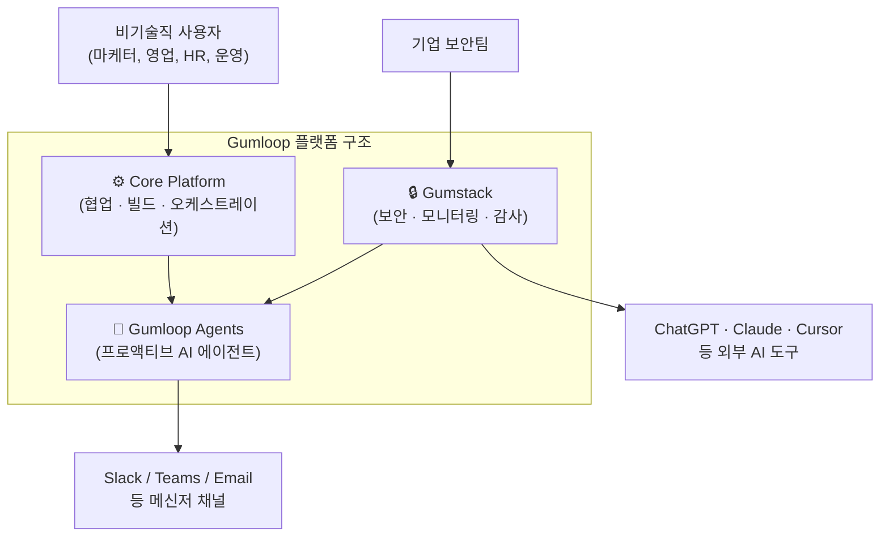
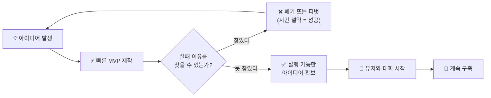
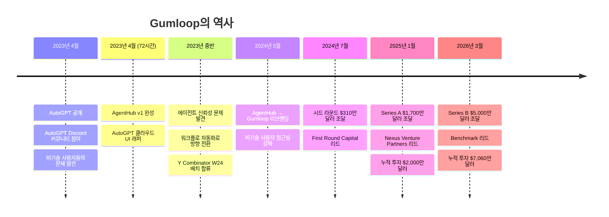
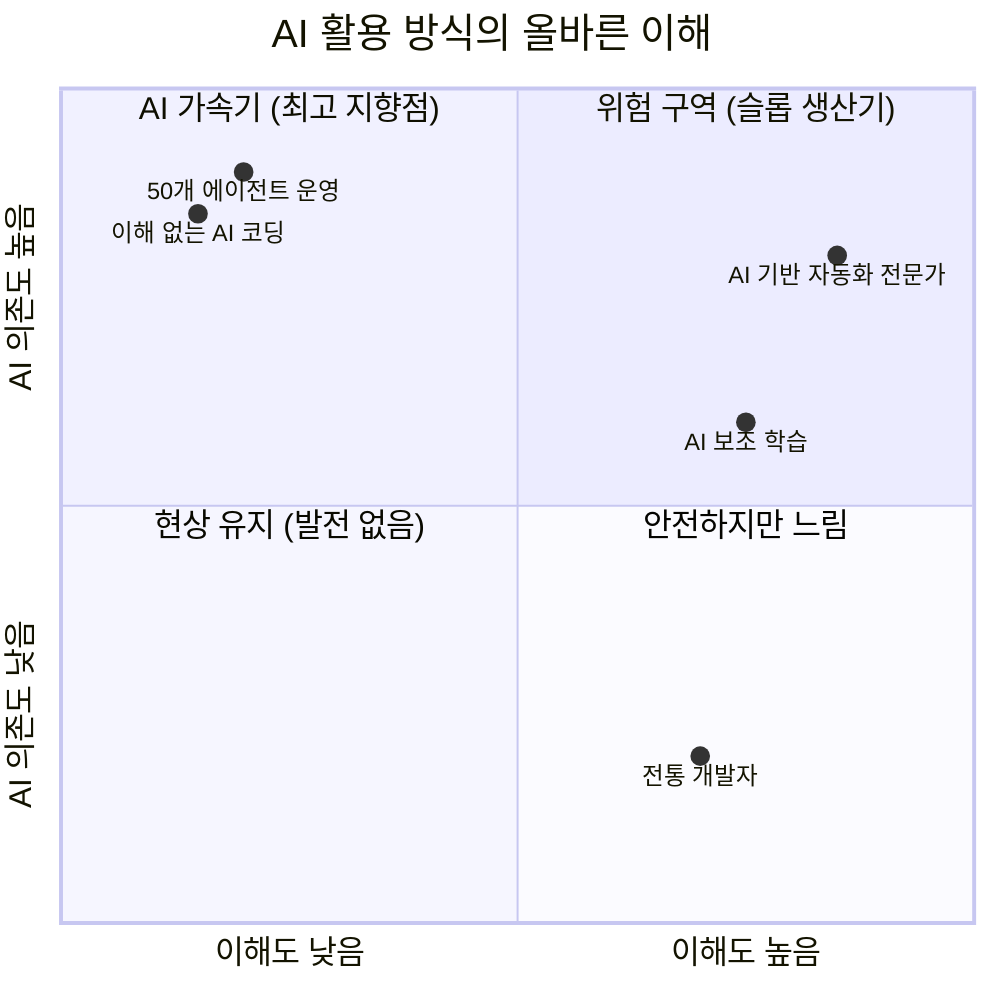
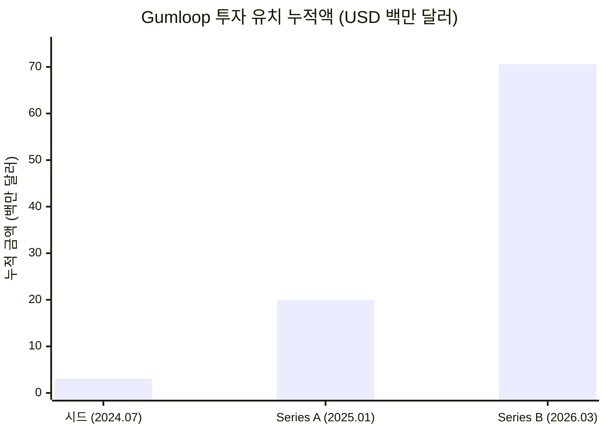
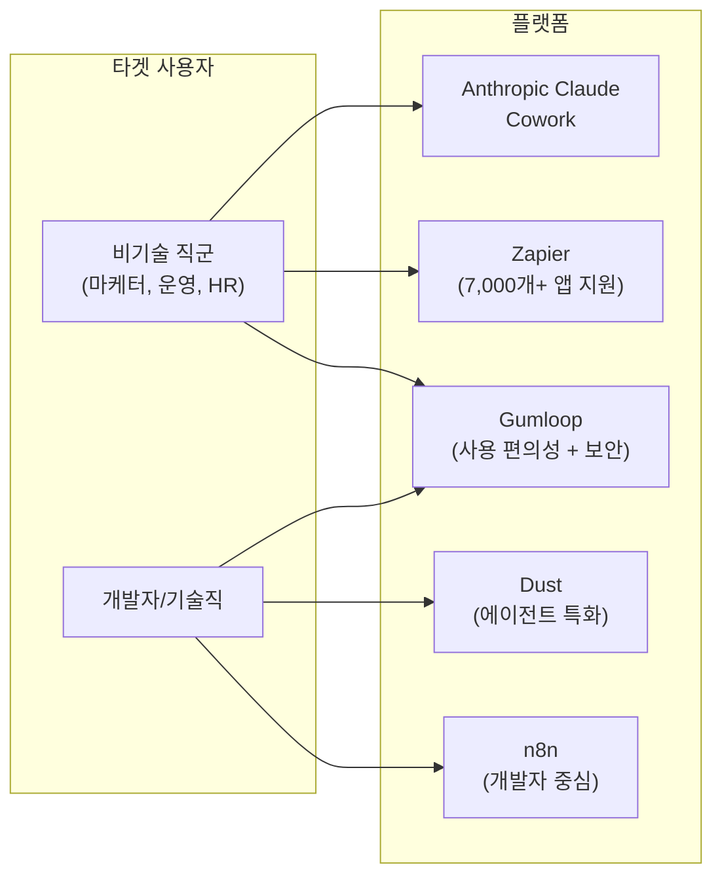

> **출처**: EO(Entrepreneurship Organization) YouTube 인터뷰 — [*"50 AI Agents Running My Company" Is a Lie. Here's How I Build It | Gumloop, Max Brodeur-Urbas*](https://www.youtube.com/watch?v=CxFQykWiJqY) (2026년 3월 16일 공개)
>
> **맥스 브로되르-우르바스(Max Brodeur-Urbas)**: Gumloop 공동창업자 겸 CEO. 2026년 3월 기준 Series B $5,000만 달러 조달 완료. 누적 투자 유치액 약 $7,060만 달러.

---

## 목차

1. [들어가며 — "AI 브로"들의 세계](#1-들어가며)
2. [Gumloop이란 무엇인가](#2-gumloop이란-무엇인가)
3. [법칙 1: 불확실성 속으로 뛰어들어라](#3-법칙-1-불확실성-속으로-뛰어들어라)
4. [미국 추방, 그리고 각성](#4-미국-추방-그리고-각성)
5. [법칙 2: 스스로를 틀렸다고 증명하라](#5-법칙-2-스스로를-틀렸다고-증명하라)
6. [AutoGPT에서 AgentHub로, 그리고 Gumloop으로](#6-autogpt에서-agenthub로-그리고-gumloop으로)
7. [법칙 3: 진짜 네트워크는 칵테일 파티에서 만들어지지 않는다](#7-법칙-3-진짜-네트워크는-칵테일-파티에서-만들어지지-않는다)
8. [법칙 4: 위대한 제품은 클릭 한 번으로 만들어지지 않는다](#8-법칙-4-위대한-제품은-클릭-한-번으로-만들어지지-않는다)
9. [법칙 5: 채용은 연애와 같다](#9-법칙-5-채용은-연애와-같다)
10. [Gumloop의 현재 — Series B와 엔터프라이즈 확장](#10-gumloop의-현재--series-b와-엔터프라이즈-확장)
11. [AI 시대 창업자에게 남기는 말](#11-ai-시대-창업자에게-남기는-말)

---

## 1. 들어가며

소셜미디어의 세계, 특히 트위터(X)와 같은 플랫폼을 조금이라도 드나들어본 사람이라면 누구나 한 번쯤은 이런 게시물을 목격했을 것이다. "저는 AI 에이전트 50개로 회사를 운영합니다", "주말 2시간 일하고 월 $30,000 버는 비법 공개", "AI 자동화 SaaS 앱으로 저는 이제 주 1시간만 일합니다." 이런 콘텐츠들은 엄청난 반응을 끌어모으고, 클릭을 부르고, 강좌 판매로 이어진다.

이 인터뷰의 주인공인 맥스 브로되르-우르바스는 이 현상을 정확하게 "슬롭(Slop) 머신"이라고 명명한다. 슬롭(slop)이란 원래 품질이 조악한 음식을 가리키는 속어인데, AI 세계에서는 질 낮고 자동 생산된 무의미한 콘텐츠나 결과물을 뜻하는 말로 굳어지고 있다. 그는 50개의 AI 에이전트가 회사를 운영한다는 주장은 실제로는 아무 의미 없는 자동화, 즉 슬롭을 대량 생산하는 기계를 만들었다는 것과 다르지 않다고 단언한다.

맥스는 이 인터뷰에서 다섯 가지 법칙을 제시한다. 하지만 이 법칙들은 단순한 창업 조언이 아니다. 그것은 그가 수많은 실패를 거치며, 심지어 미국에서 강제 추방되는 극적인 경험을 통해 체득한, 피와 땀으로 검증된 원칙들이다. 그리고 그 원칙들 위에서 그는 Gumloop이라는 회사를 세웠다. 창업 3년 만에 하루 400만 건 이상의 워크플로를 처리하며, Shopify, Instacart, DoorDash, Gusto, Samsara 같은 대형 기업들을 고객으로 둔 플랫폼을.

---

## 2. Gumloop이란 무엇인가

Gumloop은 쉽게 말해 "코딩 없이 누구나 AI 자동화 워크플로를 만들 수 있는 플랫폼"이다. 마케터, 영업 담당자, HR 담당자처럼 기술적 배경이 없는 직원이라도 드래그 앤 드롭으로 업무 자동화 흐름을 설계하고, AI를 끼워 넣어 실행할 수 있다. 엔지니어링 팀에 요건을 설명하고 몇 주씩 기다릴 필요 없이, 문제를 가장 잘 이해하는 현업 담당자가 직접 자동화를 구축하는 것이 Gumloop의 핵심 철학이다.

플랫폼은 현재 크게 세 개의 축으로 구성된다. 첫째는 **Gumloop 에이전트(Gumloop Agents)** 로, Slack, Microsoft Teams, 이메일 등에 배포 가능한 프로액티브 AI 에이전트다. 수백 가지 앱과 연동되며, 지원 티켓 분류, CRM 업데이트, 인보이스 대조, 온보딩 자동화 같은 복잡한 업무를 처리한다. 둘째는 **핵심 플랫폼(Core Platform)** 으로, 팀 전체가 에이전트와 자동화 워크플로를 함께 구축, 공유, 관리할 수 있는 협업 공간이다. 셋째는 **Gumstack**으로, 기업 보안팀을 위해 특별히 설계된 AI 사용 모니터링 및 감사 인프라다. Gumstack은 Gumloop 내부 워크플로에만 국한되지 않고, Claude Code, ChatGPT, Cursor 등 조직 내 모든 AI 도구의 툴 호출(tool call)까지 추적하고 로깅한다. SOC 2 Type II 인증과 GDPR 준수도 갖췄으며, 역할 기반 접근 제어(RBAC), 싱글 사인온(SSO), 프라이빗 클라우드 배포도 지원한다.

플랫폼이 지원하는 주요 AI 모델 제공사는 Anthropic, OpenAI, Google Gemini, DeepSeek 등으로 다양하며, 특정 벤더에 종속되지 않는 유연성이 강점이다. "Skills" 기능이 도입된 이후 에이전트의 첫 시도 성공률은 55%에서 89%로 대폭 상승했다. 요금제는 월 2,000 크레딧을 무료로 제공하는 프리 플랜부터, 소규모 사용자를 위한 Solo 플랜(월 $37), 팀 기능이 포함된 Pro 플랜(월 약 $97), 그리고 대기업을 위한 커스텀 엔터프라이즈 플랜까지 단계별로 구성되어 있다.

---

## 3. 법칙 1: 불확실성 속으로 뛰어들어라

맥스는 캐나다 몬트리올의 맥길(McGill) 대학교에서 소프트웨어 공학을 전공했다. 그는 학업에 매우 열중했으며, 최고 학점을 위해 끊임없이 노력했다. 대학 시절 그의 목표는 명확했다. 좋은 직장을 얻는 것, 그것도 빅테크 기업에 취직하는 것. 그는 그것이 자신이 나아가야 할 올바른 길이라고 믿었다.

결국 그는 마이크로소프트의 Azure Linux 팀에 합류했다. 하지만 얼마 지나지 않아 그 선택이 잘못되었음을 깨달았다. 맥스는 빅테크 경험을 통해 기술적으로 무언가를 배웠다고 생각하지 않는다. 그가 마이크로소프트에서 가져온 유일한 가치는 명함에 찍힌 로고, 즉 "이 사람은 최소한 어딘가에서 검증된 사람"이라는 신호 정도였다. 오히려 그는 지금 자신이 하는 거의 모든 일이 마이크로소프트 방식의 정반대라고 말한다. 빅테크의 방식이 나쁜 본보기 역할을 한 셈이다.

많은 사람들이 "빅테크에 잠깐 다니다가 나만의 것을 만들겠다"고 말한다. 맥스는 이것이 일종의 자기기만이라고 본다. 빅테크에 들어가면 높은 연봉과 풍족한 혜택이라는 "황금 수갑(golden handcuffs)"에 채이고, 결국 독립을 영원히 미루게 되는 경우가 훨씬 많다는 것이다. 21살, 22살, 23살처럼 책임과 의무에서 가장 자유로운 시기, 즉 인생에서 다시 돌아오지 않는 그 시간을 9시 출근, 티켓 처리, 6시 퇴근으로만 채운다면 그건 진정한 낭비라고 그는 말한다.

맥스의 메시지는 간결하다. 안전한 계획이 없더라도, 지금 이 순간 뛰어드는 것 자체가 가장 책임감 있는 선택일 수 있다는 것이다. 그가 표현한 대로, "불확실성의 에테르 속으로 몸을 던지고, 무엇이 살아남는지 보는 것(throw yourself into the ether and see what works)."

---

## 4. 미국 추방, 그리고 각성

마이크로소프트를 그만두고 밴쿠버로 돌아온 맥스는 침실에서 홀로 아이디어를 실험하며 1년을 보낼 계획이었다. 그런데 어느 주말, 시애틀에 있는 옛 룸메이트들을 만나러 국경을 넘으려다 미국 입국이 거부되었다. 입국 심사관들은 단 2일 방문이라고 밝혔음에도 불구하고, 그가 장기 체류를 노리는 것으로 의심했고 결국 그에게 5년간 미국 입국 금지 조치를 내렸다.

맥스는 그 순간을 "거의 충격 상태"였다고 묘사한다. 국경에서 여자친구의 아파트로 돌아오는 차 안에서 그는 말 그대로 멍한 상태였다. 며칠이 지나서야 충격이 가라앉았고, 그 후에는 오로지 집중뿐이었다. "대비책이 사라졌기 때문에 회사를 만들어야 했다"는 그의 말은 역설적으로 이 사건이 그를 창업으로 이끈 결정적인 촉매가 되었음을 보여준다.

이후 6개월 동안 그는 밴쿠버의 작은 스튜디오 아파트에서 가능한 한 열심히 일했다. YC(Y Combinator)에 합류하게 되었을 때조차 그는 미국 입국 금지 때문에 캐나다에 머물러야 했다. 샌프란시스코에서 열리는 네트워킹 행사와 파티에 참여하지 못하는 상황이었지만, 그것이 오히려 방해 없이 제품에만 집중하도록 만들어주었다.

---

## 5. 법칙 2: 스스로를 틀렸다고 증명하라

창업 초기 맥스는 가치 있어 보이는 것이면 뭐든 만들었다. VR 기반의 비디오 게임 콘텐츠 모더레이션 소프트웨어, 일반 신뢰 및 안전 도구, 웹 트래픽 봇 탐지 소프트웨어, 안티-캠 플랫폼 등 거의 매주 다른 아이디어를 실험했다. 각 아이디어마다 MVP를 빠르게 만들고 시장 반응을 확인하는 과정을 반복했다.

처음에는 이 과정이 고통스러웠다. 아이디어를 몇 달씩 갈고닦은 뒤, 누군가가 "맞아, 이건 만들 가치가 있어"라고 말해주기를 기다렸다. 하지만 그게 잘못된 접근임을 깨닫는 데 3개월이 걸렸다. 그는 이 교훈을 "역설적인 사실(counterintuitive fact)"이라고 부른다.

스타트업에서 진짜 정보는 "왜 이것이 작동하지 않는가"를 빠르게 발견하는 데서 나온다. 누군가가 당신의 아이디어가 왜 실패할 것인지를 설명해준다면, 그것은 수주 혹은 수개월의 시간을 절약해주는 최고의 선물이다. 따라서 창업자가 해야 할 일은 아이디어를 검증받기를 희망하며 기다리는 게 아니라, 능동적으로 왜 이 아이디어가 안 되는지를 사냥하러 나가는 것이다. 만약 진지하게 찾아봐도 실패할 이유를 발견하지 못한다면, 그때 비로소 추진할 만한 아이디어가 생긴 것이다.

맥스는 자신이 Gumloop을 만들기 전에 10번 실패하지 않았다면 결코 Gumloop을 만들지 못했을 것이라고 단언한다. 각각의 실패는 그에게 정보를 주었고, 그 정보들이 쌓여 진짜 기회를 알아볼 수 있는 능력을 길러주었다. 초기 창업자들은 유저가 없어서 대화를 구걸해야 하는 불편한 상황을 반드시 통과해야 하는 통과의례라고 그는 말한다. 제품이 형편없다는 말, 잘못된 것을 만들고 있다는 말, 내 문제를 해결하지 못한다는 말 — 이 모든 부정적 피드백이 사실은 가장 값진 정보다.

---

## 6. AutoGPT에서 AgentHub로, 그리고 Gumloop으로

Gumloop의 탄생은 2023년 4월 인터넷을 뜨겁게 달군 오픈소스 프레임워크 AutoGPT에서 시작된다. AutoGPT는 LLM이 스스로 계획을 세우고 도구를 사용하며 목표를 달성하려는 최초의 대중적인 에이전트 실험으로, 깃허브와 트위터를 폭풍처럼 휩쓸었다. 맥스는 AutoGPT를 직접 써보고 흥미를 느꼈고, 공식 디스코드 서버에 참여했다.

디스코드 서버에서 그는 흥미로운 현상을 목격했다. 수천 명의 사용자가 몰려들었는데, 상당수가 기술적 배경이 전혀 없는 사람들이었다. "깃허브가 뭔가요?", "터미널을 어떻게 열어요?", "의존성(dependency)이 뭔가요?" 같은 질문이 쏟아졌다. 맥스는 이 순간 기회를 포착했다. 기술적으로 까다로운 셋업 과정을 제거하고, AutoGPT를 클라우드에 올려 브라우저에서 바로 쓸 수 있는 GUI를 만들면 어떨까?

그는 72시간 만에 첫 버전을 완성했다. 그것이 **AgentHub**의 탄생이다. 처음에는 리액트(React)를 배우는 좋은 연습이 될 것 같아서 시작했을 뿐, 큰 무언가가 될 거라고 예상하지 못했다. 디스코드에서 누군가 로컬 환경 설정을 물으면 그는 AgentHub 링크를 보냈고, 사람들은 클릭해서 들어왔다.

그러나 금세 현실이 드러났다. 사람들은 AgentHub를 통해 AutoGPT를 쓰고 싶어했지만, AutoGPT 자체가 너무 불안정하고 비용도 많이 들었다. 에이전트는 모든 단계에 AI를 끼워 넣기 때문에 신뢰성이 떨어졌고, 사용자들은 계속해서 실망했다. 맥스는 이 상황에서 중요한 통찰을 얻었다. 사람들이 진짜로 원하는 것은 '에이전트'가 아니었다. 그들이 원한 것은 신뢰성과 예측 가능성이었다.

그는 사용자들이 요청하는 작업 패턴을 면밀히 관찰했다. "이 웹사이트를 스크래핑해서 분석해 줘", "이 정보를 가져와서 요약해 줘"처럼 사실 대부분의 태스크는 AI가 매 단계마다 개입할 필요 없는 단순한 워크플로였다. AgentHub는 워크플로 자동화 프레임워크로 전환했다. 자동화 워크플로에서 AI는 전체의 10% 정도만 담당하고 나머지 90%는 인프라가 처리하는 방식이다. 이를 통해 신뢰성이 극적으로 높아졌다.

초기 사용자층이 개발자 커뮤니티에서 시작된 오픈소스 프로젝트였음에도, 실제로 열광한 것은 비기술 직군이었다. 기업 관리자, 운영 담당자, HR 직원들 — 이들이 실제 사용자의 80%를 차지한다는 사실을 깨닫고, 맥스는 제품의 방향을 완전히 비기술 사용자 친화적인 방향으로 재설계했다. 이름도 2024년 5월 비개발자에게 더 친근하게 들리도록 AgentHub에서 Gumloop으로 변경했다.

YC 배치 중 첫 주에 월 $20 요금제를 도입했다. "ChatGPT보다 비싸게 받는 건 상상도 못 했다"고 그는 회상한다. 첫 유료 사용자인 카이(Kai)가 $20를 결제했을 때, 스트라이프(Stripe) 알림이 뜨자 팀 전체가 흥분했다. 카이는 지금도 여전히 Gumloop의 고객이다.

공동창업자 라훌 베할(Rahul Behal)의 합류도 극적인 이야기를 품고 있다. 맥스가 초기 버전을 시연하던 영상에서, 맥스가 "공동창업자가 오늘 아침에 그만뒀다"고 말하는 장면 바로 다음에 라훌이 제품에 대해 흥분해서 질문을 던지는 모습이 담겼다. 24시간 후 라훌은 코드에 기여하기 시작했다. Amazon AWS와 Arctic Wolf에서 ML 옵스를 담당했던 그의 합류는 Gumloop의 기술적 토대를 탄탄하게 만들었다.

---

## 7. 법칙 3: 진짜 네트워크는 칵테일 파티에서 만들어지지 않는다

YC 배치 기간 동안 맥스는 미국 입국 금지로 인해 밴쿠버의 작은 스튜디오 아파트에 고립되어 있었다. 샌프란시스코에서 열리는 각종 네트워킹 행사, 스타트업 파티, YC 동기들과의 어울림 — 이 모든 것에서 그는 배제되었다. 그러나 그 고립은 오히려 그에게 선물이 되었다. 방해 없이 오로지 코딩에만 집중할 수 있었기 때문이다.

이 경험에서 그가 얻은 통찰은 명확하다. 진정으로 무언가를 만들고 있는 사람은 파티에 없다. 맥스의 공동창업자는 거의 어떤 행사에도 나타나지 않는다. 많은 사람들이 그를 아직 본 적 없다. 그냥 일하고 있기 때문이다. 맥스도 마찬가지다. 그는 특별한 이유 없이는 행사에 거의 참석하지 않는다.

네트워크는 파티에서 만들어지는 것이 아니라, 좋은 제품을 만드는 과정에서 자연스럽게 형성된다고 그는 강조한다. 유저와의 대화에 집중하면 네트워크는 그 과정의 부산물로 따라온다. 투자자들도 마찬가지다. 많은 창업자들은 투자자를 찾아 네트워킹 행사를 전전하지만, 진짜로 뛰어난 것을 만들면 오히려 투자자들이 먼저 연락을 해온다. 맥스는 YC 배치에서 이것을 직접 경험했다.

투자를 받는 방법은 복잡하지 않다. 그들 없이도 성공할 수 있다는 것을 보여주면 된다. 그러면 그들이 먼저 "우리가 참여하게 해달라"는 이메일을 보내온다. 이것이 그가 YC 배치에서 얻은 가장 큰 깨달음이다. 훌륭한 것을 만들어라. 그뿐이다. 네트워크는 파티에서 만들어지지 않는다.

---

## 8. 법칙 4: 위대한 제품은 클릭 한 번으로 만들어지지 않는다

이 법칙은 이 인터뷰 전체에서 가장 비판적이고, 동시에 가장 실질적인 조언을 담고 있다. 맥스는 AI 자동화 플랫폼의 창업자이면서도, AI의 특정 사용 방식에 대해 단호하게 경고한다.

**"코스 브로(Course Bro)"라는 현상**

트위터에는 "AI로 모든 것을 자동화했다", "주 1시간 일하고 $1,000만 달러를 번다", "이 워크플로를 복사하면 이번 주말에 $30,000을 벌 수 있다" 같은 주장을 하는 콘텐츠 생산자들이 넘쳐난다. 맥스는 이들을 "코스 브로(course bros)"라고 부른다. 이들은 실제 가치를 파는 게 아니라 희망을 파는 사람들이다. 크립토 버블, NFT 버블 때도 같은 패턴이 있었다. 어떤 하이프 버블에나 항상 "이것이 당신을 지금 상황에서 구해줄 것"이라는 쉬운 약속에 취약한 사람들이 존재하고, 그 취약성을 파고드는 콘텐츠 판매자들이 등장한다.

맥스의 핵심 주장은 이것이다. 만약 주말에 $30,000을 버는 마법 같은 방법이 실제로 존재한다면, 그 사람은 절대 그것을 트위터에 공짜로 올리지 않는다. 강좌를 파는 사람들이 돈을 버는 방법은 강좌 자체다. 그 강좌 안의 내용이 아니라.

**"자동화는 이해에서 시작된다"**

맥스는 자신이 자동화하는 것은 반드시 자신이 깊이 이해하는 것뿐이라고 말한다. 이해하지 못하는 것을 자동화하면 슬롯머신이 된다. AI로 코딩을 하면서 코딩 자체를 전혀 모른다면, 결국 자신도 모르는 악성 코드(malware)를 만드는 셈이라고 그는 경고한다. 바이브 코딩(Vibe Coding)은 어느 지점까지만 통한다. 워크플로 자동화도 마찬가지다. 자신이 직접 할 수 없는 일, 이해하지 못하는 일을 자동화하려 하면 품질이 형편없는 결과물이 나온다.

그가 생각하는 AI의 올바른 활용법은 이것이다. AI는 자신이 이미 이해하는 것을 훨씬 빠르게 해주는 도구다. 더 많은 것을 배우고, 더 빠르게 성장하기 위한 가속 장치. AI가 자신을 대체하거나, 이해를 건너뛰게 만드는 지름길로 사용해서는 안 된다.

**세대 분열의 예고**

맥스는 한 발 더 나아가 매우 대담한 주장을 펼친다. 그는 "마지막 세대의 위대한 엔지니어들은 이미 태어났을지도 모른다"고 말한다. AI가 등장하기 전, 또는 AI를 이해를 위한 도구로 활용하던 세대는 깊은 이해를 먼저 쌓고 나서 AI로 가속화된다. 하지만 지금 세대부터는 이해 과정 자체를 건너뛰고 AI만으로 결과를 내려는 유혹이 너무 강하다.

결국 두 부류로 나뉠 것이라고 그는 예측한다. 멈추고, 왜 이것이 작동하는지 이해하려 노력하고, AI를 선생님으로 활용하는 소수의 탁월한 사람들. 그리고 결과만 뽑아내고 이해를 포기하는 다수의 평범한 사람들. 탁월한 사람들은 AI 덕분에 이전보다 훨씬 더 빠르게 성장할 것이고, 나머지는 슬롭의 바다에 빠질 것이다.

---

## 9. 법칙 5: 채용은 연애와 같다

Gumloop이 채용한 사람의 대부분은 네트워크를 통해 왔고, 그 중 상당수는 고객에서 직원으로 전환된 사례다. Instacart의 고객이 직장을 그만두고 합류했다. Webflow(현 Shopify의 일부) 고객이 그만두고 합류했다. Shopify 직원이 그만두고 합류했다. 이들은 이미 Gumloop에 깊이 빠져있었고, 플랫폼을 매일 사용하며 그 가능성을 누구보다 잘 알고 있었다. 전환이 빠르고 자연스럽게 이루어졌다.

맥스는 이 채용 방식을 연애에 비유한다. 누군가와 사귀고 싶다고 해서 쫓아다니며 애원할 수는 없다. 상대가 자연스럽게 끌릴 수 있는 매력적인 사람이 되어야 한다. 스타트업도 마찬가지다. 세상에서 가장 뛰어난 사람들이 합류하고 싶어하는 회사를 만들어야 한다. 그것은 오직 뛰어난 제품과 실질적인 트랙션을 통해서만 가능하다.

공동창업자 라훌도 제품의 초기 버전 시연을 보고 흥분해서 합류한 것이었다. 합류를 요청받은 게 아니라, 제품이 스스로 설득했다.

맥스가 채용 필터로 사용하는 기준은 간단하면서도 강력하다. "이 사람과 24시간 함께 있고 싶은가?" 이 기준은 단순히 성격이 좋다는 것을 넘어, 야망, 지성, 흥분감, 균형감을 함께 가진 사람을 뜻한다. 그 기준이 누적되면서 지금의 Gumloop 팀은 모두가 동등하게 미션에 흥분하고, 아무도 늦게까지 일하라는 강요 없이도 자발적으로 오래 일하는 문화를 만들었다.

또 한 가지 중요한 관점은 "왜 안 되는가에 집착하는 사람은 아무것도 만들지 못한다"는 것이다. 모든 스타트업에는 천 가지 이유가 있다. "해자(moat)가 없잖아", "큰 회사가 이 기능을 그냥 만들면 어떡해", "경쟁자가 너무 많아". 이런 질문에 강박적으로 집착하는 사람은 결국 큰 회사의 직원으로 남아 그들의 게임에서 말(pawn)이 될 뿐이다.

맥스는 이 관점에서 자신의 경험을 솔직하게 털어놓는다. 창업 첫날, 자신은 Zapier가 왜 이것을 더 잘할 수 있는지, OpenAI 같은 대형 플레이어가 왜 자신들을 쉽게 짓밟을 수 있는지에 대한 백 가지 이유를 스스로에게 설명할 수 있었다. 하지만 그렇게 했다면 Gumloop은 존재하지 않았을 것이다. 그냥 시작했기 때문에 여기까지 왔다.

---

## 10. Gumloop의 현재 — Series B와 엔터프라이즈 확장

2026년 3월 12일, Gumloop은 Benchmark가 리드한 $5,000만 달러 규모의 Series B 투자 라운드를 공식 발표했다. Nexus Venture Partners, First Round Capital, Y Combinator, Box Group, The Cannon Project, Shopify Ventures가 함께 참여했다. 이로써 Gumloop의 누적 투자 유치액은 약 $7,060만 달러에 달한다.

이번 라운드를 리드한 Benchmark는 eBay, Uber, Dropbox, Snap, Discord, Twitter 등의 초기 투자사로, 실리콘밸리에서 가장 권위 있는 벤처캐피털 중 하나다. Benchmark의 신임 파트너 에버렛 랜들(Everett Randle)이 이번 딜을 주도했으며, 그는 AI가 발전하는 환경에서 모든 직원이 AI 능력을 갖추도록 만드는 것이 기업 성공의 핵심이라고 보고 Gumloop에 베팅했다.

맥스는 원래 "직원 10명의 10억 달러 가치 기업"을 목표로 했다. Series A 당시 실제로 그 목표를 공언했고, 당시 정규직은 창업자 2명에 불과했다. 하지만 엔터프라이즈 수요가 폭발적으로 늘어나면서 계획이 바뀌었다. 현재 Gumloop의 임직원 수는 24명으로 늘어났으며, 영업 조직과 엔지니어링 팀을 본격적으로 확장하고 있다. 특히 캐나다 인재 채용을 주요 목표로 밝혔다. 밴쿠버 오피스를 다시 열고, 캐나다 뛰어난 인재들이 미국으로 떠나지 않아도 좋은 AI 스타트업에서 일할 수 있는 기회를 만들겠다는 것이다.

현재 Gumloop의 주요 기업 고객으로는 Shopify, Instacart(1,000명 이상의 사용자), DoorDash, Gusto, Samsara, Ramp, Opendoor 등이 있다. 플랫폼은 하루 400만 건 이상의 워크플로를 처리하고 있다. Anthropic, OpenAI, Google Gemini, DeepSeek 등 다양한 AI 모델 제공사와의 연동을 지원해 특정 벤더에 종속되지 않는 구조를 갖추고 있으며, Zapier(7,000개 이상의 앱 지원)나 n8n처럼 개발자 중심적인 경쟁자들과 달리 비기술 사용자의 경험에 최우선을 두는 차별화 전략을 유지하고 있다.

경쟁 구도를 보면, Gumloop은 Zapier, n8n, Dust, 그리고 Anthropic의 Claude Cowork 같은 파운데이션 모델 기업들이 직접 진입한 자동화 시장에서 경쟁하고 있다. 각 업체의 포지션을 정리하면 아래와 같다.

---

## 11. AI 시대 창업자에게 남기는 말

맥스 브로되르-우르바스가 이 인터뷰를 통해 전하는 메시지는 AI 시대의 창업 교본들이 가르치는 것과 정반대에 가깝다. 그가 거부하는 것들을 먼저 정리하면 이렇다. 클릭 한 번으로 수익을 창출하겠다는 환상, AI 에이전트 50개로 회사를 돌리겠다는 과대포장, 자신이 이해하지 못하는 것을 AI로 자동화하겠다는 무모함, 그리고 칵테일 파티와 네트워킹 행사에서 시간을 낭비하는 것.

그가 주장하는 것들은 다르다. 아이디어가 왜 실패할 것인지를 능동적으로 사냥할 것. 유저와 최대한 많이 이야기할 것. 좋은 제품을 만들면 투자자, 팀원, 네트워크는 자연스럽게 따라온다는 것을 믿을 것. AI는 자신이 깊이 이해하는 일에만 적용할 것.

Gumloop 자체가 이 원칙들의 산 증거다. 마이크로소프트를 그만두고 미국에서 추방당하며 불확실성 속으로 뛰어든 결과, 10번 이상의 실패를 통해 시장의 진짜 목소리를 들은 결과, YC 배치에서 파티 대신 코딩에 집중한 결과, 그리고 자동화를 이해에서 시작한 결과 — 오늘의 Gumloop이 만들어졌다.

특히 그가 남긴 한 마디는 오래 곱씹을 만하다. "자신이 할 수 있다고 생각하는 것, 그것이 창업의 유일한 전제조건이다(The only thing that makes a founder start founding something is thinking that they can do it)." 분석이나 완벽한 준비가 아니라, 맹목적인 자신감. 그 자신감은 맥스를 밴쿠버의 침실에서 Benchmark의 $5,000만 달러까지 데려다 놓았다.

---

*본 문서는 2026년 3월 공개된 EO YouTube 인터뷰 및 공개 자료를 기반으로 작성되었으며, 최신 기업 정보(Series B 조달 내역, 고객사, 제품 구성 등)는 검색을 통해 사실 확인 후 작성하였습니다.*
