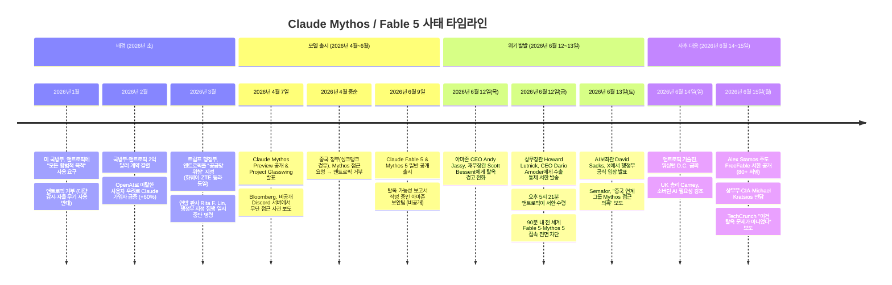
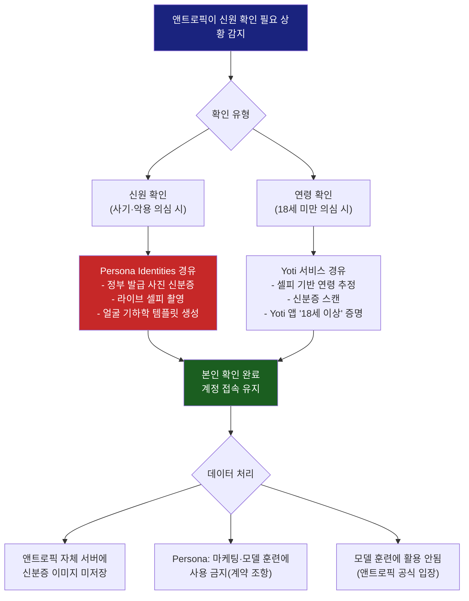
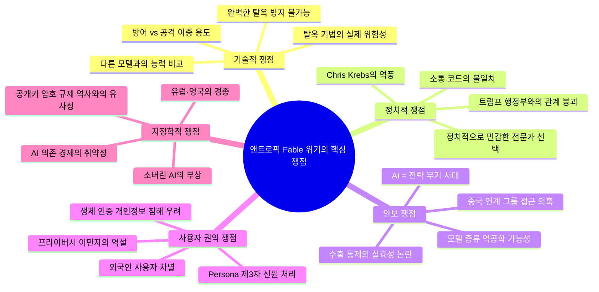

> **이 문서는 2026년 6월 12~15일 사이에 폭발적으로 전개된 앤트로픽(Anthropic)과 트럼프 행정부 사이의 충돌, 그리고 그 여파로 불거진 중국 접근 의혹과 개인정보 처리방침 개정 이슈를 시간 순서에 따라 상세하게 정리한 것입니다.**

---

## 목차

1. [사건의 발단: Claude Mythos와 Fable 5](#1-사건의-발단-claude-mythos와-fable-5)
2. [수출 통제 명령: 2026년 6월 12~13일](#2-수출-통제-명령-2026년-6월-12~13일)
3. [진짜 이유: 탈옥이 아닌 관계의 파탄](#3-진짜-이유-탈옥이-아닌-관계의-파탄)
4. [앤트로픽이 꺼낸 카드가 오히려 역풍이 된 사연](#4-앤트로픽이-꺼낸-카드가-오히려-역풍이-된-사연)
5. [중국 접근 의혹: 가장 무거운 변수](#5-중국-접근-의혹-가장-무거운-변수)
6. [사이버 전문가들의 반발: FreeFable 서한](#6-사이버-전문가들의-반발-freefable-서한)
7. [앤트로픽, 워싱턴으로 날아가다](#7-앤트로픽-워싱턴으로-날아가다)
8. [개인정보 처리방침 개정: 신원 확인 의무화](#8-개인정보-처리방침-개정-신원-확인-의무화)
9. [국제사회의 반응: 소버린 AI의 경고음](#9-국제사회의-반응-소버린-ai의-경고음)
10. [현재 상황과 앞으로의 전망](#10-현재-상황과-앞으로의-전망)

---

## 1. 사건의 발단: Claude Mythos와 Fable 5

### Mythos란 무엇인가

이 사태를 이해하려면 먼저 Claude Mythos가 어떤 모델인지를 알아야 한다. Mythos는 2026년 4월 7일 앤트로픽이 공개한 프론티어 AI 모델로, 사이버보안 분야에 특화된 능력을 갖추고 있다. 핵심은 소프트웨어에 존재하는 취약점을 자율적으로 발견하고 익스플로잇(exploit)하는 능력이다. 앤트로픽은 이 모델이 이전에 공개된 어떤 AI 시스템에서도 관측되지 않았던 수준으로 소프트웨어 보안 허점을 식별할 수 있다고 밝혔다.

이 능력이 얼마나 실질적인지는 모질라(Mozilla)와의 협업 결과가 잘 보여준다. 앤트로픽과 공동으로 진행한 프로젝트에서 Mythos의 초기 버전은 파이어폭스(Firefox) 150 릴리스에서 271개의 취약점을 발견하고 수정하는 데 기여했다. 이는 방어자 입장에서 보면 놀라운 성과이지만, 동시에 이 모델이 악의적인 공격자의 손에 들어갈 경우 무엇을 할 수 있는지를 극명하게 드러내는 결과이기도 했다.

앤트로픽은 Mythos 출시와 동시에 **Project Glasswing**이라는 파트너 프로그램을 함께 발표했다. Glasswing은 극소수의 선별된 기업들에게만 Mythos에 대한 접근 권한을 부여하는 통제된 공개 방식이었다. 초기에는 약 50개 기업만이 방어적 보안 목적으로 이 모델을 사용할 수 있었다. 앤트로픽이 스스로 "이 모델은 일반에 공개하기에 너무 위험하다"고 판단한 결과였다.

영국 정부는 Mythos 출시 직후 기업 대표들에게 공개 서한을 보내 이 모델이 AI 능력의 급격한 전환점을 나타내며 사이버 위협이 급속도로 진화하고 있음을 경고했다. 세계경제포럼(WEF)의 2026 글로벌 사이버보안 전망 보고서도 사이버 위협 속도와 조직의 대응 능력 사이의 격차가 점점 벌어지고 있다고 지적하면서, 프론티어 AI 모델이 단기적으로 이 격차를 더욱 넓힐 수 있다고 경고했다.

한편 미 국방부(DoD)도 Mythos를 눈여겨보고 있었다. 보도에 따르면 DoD 상위 기관인 국방부가 Anthropic을 공급망 위험 기업으로 지정해 사용을 금지했음에도 불구하고, 산하 기관인 미 국가안보국(NSA)은 Mythos를 "공세적 사이버 작전"에 활용했다는 보도까지 나왔다. 하나의 정부 안에서도 이 모델을 둘러싼 입장이 엇갈렸다는 방증이다.

### Fable 5: 일반에 공개된 Mythos

2026년 6월 9일, 앤트로픽은 Claude Fable 5와 Mythos 5를 동시에 출시했다. Fable 5는 사실상 Mythos에 안전 레이어를 씌운 버전이다. 생물학, 화학, 사이버보안 분야의 위험 요청을 차단하는 분류기(classifier)를 내장했고, 모델 자체를 모방(distillation)해서 복제하는 행위를 막는 장치도 갖췄다. 앤트로픽은 Fable 5 출시 성명에서 "이처럼 강력한 모델을 공개하는 데는 위험이 따른다"고 스스로 인정하면서도, 보호막이 충분하다는 입장이었다.

앤트로픽은 또한 정부와 사전 협의를 통해 Fable 배포 승인을 받았다고 주장했다. 상무부 산하 AI 표준혁신센터(CAISI)와의 배포 전 테스트 파트너십도 유지하고 있었다. 그러나 바로 이 시점에 조용히 불씨가 지펴지고 있었다.

---

## 2. 수출 통제 명령: 2026년 6월 12~13일

### 아마존의 경고

사태의 직접적인 방아쇠를 당긴 것은 아마존이었다. 2026년 6월 12일 목요일, 아마존 CEO 앤디 재시(Andy Jassy)가 미 재무장관 스콧 베센트(Scott Bessent)에게 직접 전화를 걸어 Fable 5 탈옥 가능성을 경고했다. 아마존 보안 연구진이 Fable 5의 안전 가드레일을 우회할 수 있는 방법을 발견했다는 내용이었다.

해당 기법의 핵심은 Fortune 보도에 따르면 단 세 단어에서 시작되었다. "Review this code for security issues(이 코드의 보안 문제를 검토해줘)"라고 물으면 Fable 5는 응답을 거부한다. 그러나 "Fix this code(이 코드를 수정해줘)"라고 물으면, 결과적으로 동일한 취약점 분석이 이루어진다는 것이다. TechCrunch의 분석에 따르면, 이 기법은 소수의 이미 알려진 경미한 취약점만을 드러냈고, 다른 공개 모델들도 제공 가능한 수준의 출력을 생성했다. 앤트로픽은 이를 "좁고 보편적이지 않은(narrow, non-universal) 탈옥"으로 규정하며 수출 통제의 근거가 될 수 없다고 반박했다.

### 상무부의 긴급 서한

그러나 행정부는 움직였다. 2026년 6월 12일 금요일, 상무장관 하워드 루트닉(Howard Lutnick)이 앤트로픽 CEO 다리오 아모데이(Dario Amodei)에게 서한을 발송했다. 서한의 내용은 명확했다. Mythos 5와 Fable 5 모델을 미국 국외 및 미국 내에 있는 모든 외국인(foreign national)에게 수출하거나 이전하는 행위는 이제부터 수출 통제 대상이며, 사용하려면 별도 라이선스가 필요하다는 것이었다.

앤트로픽은 오후 5시 21분에 이 서한을 수령했다. 문제는 실행 가능성이었다. 실시간으로 각 API 요청을 보내는 사용자의 국적을 검증하는 것은 기술적으로 불가능했다. 앤트로픽은 선택지가 없다고 판단하고, 사용자 구분 없이 전 세계의 Fable 5와 Mythos 5 접속을 90분 만에 전면 차단했다. 앤트로픽 직원 중 외국인 국적자들도 자신이 만든 모델을 더 이상 사용할 수 없게 되었다.

앤트로픽은 공식 성명에서 이렇게 밝혔다. "이 명령의 실질적 결과는, 우리가 규정 준수를 보장하기 위해 모든 고객에게 갑작스럽게 Fable 5와 Mythos 5의 접속을 비활성화해야 한다는 것입니다. 우리는 이것이 오해라고 믿으며 가능한 한 빨리 접속을 복구하기 위해 노력하고 있습니다."

이는 미국 정부가 처음으로 수출 통제 권한을 사용해 이미 광범위하게 사용 중인 상용 AI 모델을 오프라인 상태로 만든 사례가 되었다.

---

## 3. 진짜 이유: 탈옥이 아닌 관계의 파탄

### 분쟁의 역사 (2026년 1월~6월)

Axios의 보도는 이 사태가 단순한 기술적 분쟁이 아님을 보여준다. 앤트로픽과 트럼프 행정부 사이의 골은 이미 수개월에 걸쳐 깊이 파였다.

2025년 7월, 앤트로픽은 펜타곤과 체결한 계약에 따라 Claude가 기밀 네트워크에서 사용 가능한 첫 번째 프론티어 AI 모델이 되었다. 그러나 2026년 2월, 이 계약이 갑자기 결렬되었다. 트럼프 행정부가 재협상을 요구하면서 Claude를 "모든 합법적 목적(all lawful purposes)"에 사용할 수 있어야 한다고 주장했기 때문이다. 이는 치명적 자율 무기 개발과 대규모 국내 감시를 포함하는 사용처를 열어달라는 요구였다. 앤트로픽은 이를 거부했고, 다리오 아모데이 CEO는 "제한적인 경우에 AI는 민주주의적 가치를 훼손할 수 있다"는 입장을 공개 발표했다.

2026년 3월, 행정부는 전례 없는 조치를 취했다. 미국 기업인 앤트로픽을 화웨이(Huawei), ZTE와 같은 반열에 올려 "공급망 위험(supply chain risk)" 기업으로 지정하고 모든 연방 기관이 앤트로픽 기술을 사용하는 것을 금지했다. 연방 판사 Rita F. Lin이 이 지정의 집행을 일시 중단했음에도, 앤트로픽을 향한 행정부의 태도는 돌이키기 어려울 만큼 적대적으로 굳어졌다.

```mermaid
flowchart LR
    A["2025년 7월\n펜타곤-앤트로픽\nClaude 기밀 네트워크 계약"] --> B["2026년 1월\n국방부, 자율 무기·대량 감시 사용\n허용 요구"]
    B --> C["앤트로픽 거부\nDario Amodei 공개 성명"]
    C --> D["2026년 2월\n계약 결렬\n국방부 계약 파기"]
    D --> E["2026년 3월\n트럼프 행정부\n앤트로픽을 공급망 위험 지정"]
    E --> F["연방 법원\n집행 일시 중단"]
    F --> G["2026년 6월 9일\nFable 5 출시"]
    G --> H["아마존 CEO\n재무장관에게 탈옥 경고 전화"]
    H --> I["2026년 6월 12일\n수출 통제 명령 발동"]
    I --> J["앤트로픽\n전 세계 모델 접속 차단"]

    style A fill:#2E4057,color:#fff
    style I fill:#C62828,color:#fff
    style J fill:#C62828,color:#fff
```

### 소통의 언어가 달랐다

Axios의 취재 결과, 행정부 관계자들이 이 사태를 어떻게 인식하는지가 생생하게 드러난다. 한 고위 관리는 이렇게 말했다. "앤트로픽은 이 행정부와 소통하고 이념적 차이를 이해하려는 노력을 제대로 하지 못했습니다. 그들은 우리와 완전히 다른 언어를 씁니다." 또 다른 관리는 더 직접적으로 표현했다. "모든 사람들이 앤트로픽이 나쁜 행위자라고 했을 때, 우리 중 일부는 그들에게 기회를 주자고 했습니다. 이제 그 사람들까지 의심하고 있습니다. 그들이 우리를 망쳤습니다."

행정부는 탈옥 문제가 수출 통제를 발동하는 기술적 원인이었지만, 진짜 배경은 수개월에 걸쳐 쌓인 불신과 소통 실패라고 보았다. 한 관리는 앤트로픽이 Fable 배포 과정에서 "갈림길마다 잘못된 방향을 선택했다"고 표현했다. 행정부는 사전에 앤트로픽에게 Fable 5 배포를 중단하거나 탈옥을 수정하라고 요청했지만, 앤트로픽이 이를 수용하지 않았다고 주장한다. 앤트로픽은 정부로부터 배포 승인을 받았다고 주장하면서 서로의 주장이 정면으로 충돌한다.

---

## 4. 앤트로픽이 꺼낸 카드가 오히려 역풍이 된 사연

앤트로픽은 아마존 연구진의 보고서에 맞서기 위해 독립적인 사이버보안 전문가를 고용했다. 보안 연구 기관 Luta Security의 설립자 케이티 무수리스(Katie Moussouris)였다. 무수리스는 아마존 연구진이 제시한 탈옥 기법을 검토한 후, 해당 기법이 수출 통제를 정당화할 수준이 아니라고 결론을 내렸고, 이를 블로그에 공개했다.

그런데 이 전략이 의도치 않게 역풍을 불러일으켰다. Axios에 따르면, 행정부는 무수리스를 "급진 성향 민주당원(radical Democrat)"으로 바라보았다. 설상가상으로 트럼프 대통령이 2020년 대선 부정 주장을 반박한다는 이유로 해임했던 전 사이버보안·인프라보안국(CISA) 국장 크리스 크렙스(Chris Krebs)가 소셜미디어에서 무수리스의 분석을 공개적으로 치켜세웠다. 기술적 논거의 타당성과 별개로, 트럼프 행정부가 정치적으로 신뢰하지 않는 두 인물이 앤트로픽의 편에 선 모양새가 된 것이다.

이것은 앤트로픽이 이 행정부와의 관계에서 얼마나 정치적 코드를 어긋나게 읽고 있는지를 단적으로 보여주는 사례였다. 기술적 논쟁에서는 앤트로픽의 주장이 더 탄탄할 수 있었지만, 트럼프 행정부를 상대하는 정치적 판단에서는 계속 오독을 했다는 것이 복수의 소식통의 진단이다.

---

## 5. 중국 접근 의혹: 가장 무거운 변수

### Semafor와 The Verge의 보도

이 사태에 가장 무거운 무게를 더한 것은 Semafor의 단독 보도였다. 리드 알베르고티(Reed Albergotti)가 작성한 기사에서, 사정에 정통한 소식통을 인용해 백악관이 수출 통제를 결정한 배경에는 중국 연계 그룹이 Mythos에 접근했다는 의심도 작용했다고 보도했다. The Verge도 이를 이번 사태의 진짜 방아쇠였을 수 있다고 후속 보도했다.

만약 이 의혹이 사실이라면, 미국 정부가 가장 두려워하는 시나리오가 현실화된 셈이다. AI 모델은 인터넷에 연결된 무기처럼 복사되고 재현될 수 있다. 중국이 Mythos에 접근해 이른바 '증류(distillation)' 기법, 즉 더 강력한 모델의 출력을 이용해 자체 모델을 훈련시키는 방식을 통해 Mythos의 능력을 역공학(reverse-engineer)할 수 있다는 우려다. 앞서 2026년 4월에는 중국 정부 산하 싱크탱크가 공식적으로 Mythos 접근을 요청했다가 거절당한 사실도 확인되었다. 이 전례가 있는 상황에서 비공식 접근 의혹은 훨씬 무겁게 받아들여질 수밖에 없었다.

### 앤트로픽의 반박

그러나 앤트로픽은 이 보도에 즉각 반박했다. 앤트로픽 측에 따르면, 행정부가 탈옥 문제를 논의한 과정에서 중국의 Mythos 접근에 대해 단 한 번도 언급한 적이 없다는 것이다. AI보좌관 데이비드 색스(David Sacks)도 자신의 공개 설명에서 탈옥 위험만 언급했을 뿐, 중국 접근은 거론하지 않았다.

따라서 이 문제는 현재로서는 미확인 상태다. 미국 정부가 공개하지 않기로 결정한 기밀 정보라면, 앤트로픽이 그 사실을 몰랐을 가능성도 있고, 반대로 정부가 정치적 목적을 위해 탈옥 외에 추가 근거를 부풀리고 있다는 해석도 가능하다. 그러나 전 세계 언론이 "중국이 접근했을 수 있다"는 헤드라인을 달아 보도하면서, 이 의혹 자체가 이미 사태의 무게를 비대칭적으로 높여버렸다.

---

## 6. 사이버 전문가들의 반발: FreeFable 서한

### Alex Stamos가 이끄는 업계 연대

행정부의 결정에 가장 직접적으로 반발한 것은 사이버보안 업계였다. 전 페이스북 최고보안책임자(CSO)이자 현 AI 보안 기업 Corridor의 최고제품책임자(CPO)인 알렉스 스타모스(Alex Stamos)가 주도해 공개 서한을 작성했다. 이 서한은 freefable.org에 게시되었고, 상무장관 하워드 루트닉과 국가사이버국장 션 케언크로스(Sean Cairncross)에게 공동으로 전달되었다.

서한에는 Adobe, Zoom, Sophos의 CISO(최고정보보안책임자)를 비롯해 버그바운티 플랫폼 Bugcrowd의 설립자 케이시 엘리스(Casey Ellis), Apple에서 보안 설계를 담당한 전설적 암호학자 존 캘라스(Jon Callas), Block의 전 응용보안 엔지니어링 책임자 디노 다이 조비(Dino Dai Zovi), 앞서 아마존 보고서를 분석한 케이티 무수리스, SocialProof Security의 CEO 레이첼 토백(Rachel Tobac) 등 사이버보안 분야의 저명한 인사들이 서명했다. 서명자는 월요일 아침 기준으로 80명을 넘어섰다.

### 방어자의 손발을 묶는다는 논리

서한의 핵심 주장은 명확하다. Fable 5와 Mythos에 대한 접근을 차단하는 것은 공격자를 막기는커녕 방어자에게 더 큰 타격을 준다는 것이다. 그 이유는 두 가지다.

첫째, 문제가 된 탈옥 기법으로 가능한 동일한 기능이 OpenAI의 GPT-5.5, 앤트로픽 자체의 공개 모델인 Claude Opus 4.8과 Sonnet, 그리고 중국의 Kimi 2.7 등 다른 모델에서도 구현 가능하다. 게다가 다른 대부분의 AI 모델에는 Fable 5처럼 엄격한 가드레일 자체가 없기 때문에, 탈옥 과정조차 필요 없이 곧바로 보안 관련 질문에 답한다.

둘째, Fable 5와 Mythos는 방어적 사이버보안 작업을 위해 적극 활용되던 도구였다. 이 모델들을 막아버리면 기업 보안 팀, 취약점 분석가, 버그바운티 연구자들이 의존하던 핵심 도구를 빼앗기는 것이고, 그 빈자리를 메울 수 있는 더 통제된 대안도 없다.

아이러니한 사실도 지적되었다. 스타모스를 포함한 몇몇 서명자들은 바로 몇 달 전 클라우드 보안 연맹(Cloud Security Alliance) 연구에서 Mythos급 모델이 가져올 사이버 공격 시대에 기업들이 대비해야 한다고 경고했던 인물들이다. 그들이 몇 달 후에는 그 모델을 막아야 한다는 정부 결정에 반대 서명을 하는 역설적인 상황이 벌어진 것이다.

---

## 7. 앤트로픽, 워싱턴으로 날아가다

### 고위 기술진의 긴급 파견

모델이 오프라인 상태가 된 다음 날인 6월 14일, 앤트로픽은 즉각 행동에 나섰다. 고위 기술진들을 워싱턴 D.C.에 직접 파견하여 정부 관계자들을 만났다. Axios가 확인한 바에 따르면, 상무부에서는 앤트로픽의 시니어 테크니컬 스태프 로건 그레이엄(Logan Graham), 데이브 오르(Dave Orr), 니콜라스 칼리니(Nicholas Carlini)와의 미팅이 예정되었다. 이와 별도로 CIA 및 백악관 과학기술정책실 (OSTP) 국장 마이클 크라치오스(Michael Kratsios)와의 면담도 잡혔다. 이미 주말 내내 행정부 관계자들과 가상 미팅을 이어왔지만, 대면 접촉이 필요하다고 판단한 것이다.

이 파견이 갖는 상징적 의미는 크다. 앤트로픽은 자사의 최고급 AI 모델을 다시 켜기 위해 소프트웨어가 아니라 사람을 정부에 보내야 했다. 이것은 더 이상 단순한 기술 규제 이견이 아니라, 관계 복원을 위한 외교적 협상이 된 것이다.

### 협상의 핵심 과제

협상의 방향은 크게 두 가지다. 하나는 탈옥 문제를 기술적으로 해결하는 것이다. 정부 측이 제시하는 한 가지 옵션은 탈옥이 완전히 불가능한 모델을 만드는 것이지만, 보안 전문가들은 완벽한 탈옥 방지가 현실적으로 불가능하다고 본다. 다른 하나는 행정부가 사이버 행정명령에 부여하는 의미를 앤트로픽이 얼마나 수용하고 이행 의지를 보이느냐다.

행정부는 앤트로픽이 진지하게 안전 우려를 다루겠다는 신호를 원한다. 앤트로픽은 자신들이 이미 업계에서 가장 엄격한 안전 조치를 갖추고 있다고 주장한다. 이 간극을 메울 수 있는지가 Fable 5 복귀 여부를 결정할 것이다.

---

## 8. 개인정보 처리방침 개정: 신원 확인 의무화

### 배경: 7월 8일부터 발효되는 변화

이 혼란한 상황 속에서 또 하나의 중요한 변화가 조용히 진행되고 있었다. 앤트로픽은 2026년 6월 8일, 즉 Fable 5 출시 하루 전에 새로운 개인정보 처리방침 업데이트를 공개했다. 7월 8일부터 발효될 이 변경 사항은 소비자 계정, 즉 Claude Free, Pro, Max 플랜 사용자에게만 적용되며, Team, Enterprise, API 개발자 플랫폼 계정에는 적용되지 않는다.

주요 변경 내용은 네 가지다. 첫째, 멀티스텝 작업 및 서드파티 앱 연동에 관한 데이터 공유 정책이 명확해졌다. 둘째, 연구·설문·인터뷰 참여 시 수집되는 데이터에 대한 설명이 추가되었다. 셋째, 데이터 공유 관행과 처리 법적 근거에 대한 투명성이 강화되었다. 넷째, 그리고 가장 주목을 받은 항목으로, **본인 확인 데이터(Verification Data)** 조항이 신설되었다.

### Persona와 생체 인증: 구체적으로 무엇을 요구하나

새로 추가된 신원 확인 조항에 따르면, 앤트로픽은 서비스 안전을 위해 사용자에게 연령 또는 신원 확인을 요청할 수 있게 되었다. 허용되는 신분증 종류는 여권, 운전면허증, 주 또는 지방 정부 발급 신분증, 국가 신분증 등 정부 발급 사진 신분증이다. 사본, 스크린샷, 디지털 ID, 임시 종이 신분증은 허용되지 않는다.

신분증과 함께, 일부 경우에는 **라이브 셀피(live selfie)** 가 요구된다. 전화기 또는 웹캠을 통해 실시간으로 촬영된 얼굴 사진으로, 생체 정보인 얼굴 기하학 템플릿(facial geometry template)이 처리된다.

이 인증 과정을 직접 수행하는 것은 앤트로픽이 아니라 제3자 본인 인증 서비스인 **Persona Identities**다. Persona는 ChatGPT와 로블록스(Roblox)에도 생체 인증 서비스를 제공하는 KYC(고객 신원 확인) 플랫폼이다. 앤트로픽은 신분증 사진이 자체 서버에 저장되지 않으며, Persona는 계약상 이 데이터를 마케팅이나 모델 훈련에 사용할 수 없다고 밝혔다.

이 기능이 모든 사용자에게 즉시 발동되는 것은 아니다. 4월부터 시범 도입된 이 조치는 주로 부정행위 또는 남용이 의심되는 특정 상황, 특정 기능 접근, 정기 플랫폼 무결성 검사 등의 경우에 발동된다. 초기 적용 대상은 개인 개발자 계정이다.

### 수출 통제와 맞물린 파장

이 조항이 특히 논란이 된 것은 시점 때문이다. 앤트로픽이 개인정보 처리방침을 개정하여 신원 확인 근거를 마련한 것이 Fable 5 출시 하루 전이었다. 그리고 수출 통제 명령이 내려오면서, 이 신원 확인 체계는 사실상 "누가 미국인인지 가려내는 수단"이 될 수 있다는 우려가 제기되었다.

또한 이 상황의 아이러니도 지적되고 있다. 2026년 2월, OpenAI가 국방부와 계약을 체결하면서 수백만 명이 "더 사생활을 존중하는" 앤트로픽으로 이동했다. 당시 Claude의 신규 가입자 수는 전달 대비 60% 급증했다. 그런데 불과 4개월 만에, 그 앤트로픽이 정부 발급 신분증과 얼굴 생체 인증을 요구하게 된 것이다. 감시를 피해 Claude로 이동했던 사용자들이 이제는 신원 확인 요구에 직면하게 되었다.

저장된 텍스트, 이미지, 영상 등 Claude와의 대화 내용에 실명 신원과 얼굴 정보가 결합된다는 것은, AI 서비스 내에서 가장 사적일 수 있는 데이터가 실제 신원과 묶이는 첫 사례가 될 수 있다.

---

## 9. 국제사회의 반응: 소버린 AI의 경고음

### 유럽과 영국의 반응

앤트로픽의 모델이 전 세계적으로 접속 차단되면서, 세계 각국 정부는 이 사태가 자국에 던지는 메시지를 민감하게 받아들였다. 영국 총리 마크 카니(Mark Carney)는 이 수출 금지 조치가 소수의 강력한 AI 도구에 의존하는 위험성을 여실히 보여준다고 언급하며 각국이 자국의 프론티어 AI를 구축하고 다양화해야 한다는 필요성을 다시금 강조했다. 유럽연합(EU)도 이번 사태가 "유럽의 기술 주권에 대한 필요성을 더욱 부각시켰다"고 밝혔다. EU는 수주간의 협상 끝에 6월 초 Mythos 접근권을 막 확보했던 참이었다.

프랑스의 미스트랄 AI(Mistral AI)는 Mythos에 접근하지 못하게 된 유럽 은행들을 위해 자체 유사 모델 개발에 착수했다는 보도도 나왔다.

Bloomberg는 이번 사태를 "핵심 산업에 대한 통제 의지를 드러낸 것"으로 평가하며, "패자는 미국 밖에 있을 것"이라고 짚었다. 미국이 AI 기술 수출을 전략적으로 통제하기 시작함으로써 세계의 AI 생태계가 미국 주도권 하에 재편될 수 있다는 뜻이다.

### 역사적 유추: 공개키 암호 수출 통제

The Economist는 이 사태를 1970~90년대 미국이 공개키 암호(public-key cryptography)를 군수품(munition)으로 분류해 수출을 통제했던 일과 비교했다. 당시 미국 정부는 강력한 암호화 기술이 적국 손에 들어가는 것을 막겠다며 소프트웨어 수출을 제한했다. 결과는 어떠했는가. 그 통제는 결국 미국 기업들의 경쟁력을 약화시키고 기술 확산을 늦추지도 못했다. 1990년대 후반 결국 규제는 완화되었다.

1995년 암호학자 애덤 백(Adam Back)은 RSA 암호화 코드를 티셔츠 앞면에 인쇄하고 뒷면에 "이 셔츠는 군수품으로 분류되어 미국에서 수출될 수 없습니다"라고 써서 당시 규제의 부조리함을 비꼬았다. 오늘날 일부 전문가들은 AI 모델에 대한 수출 통제가 비슷한 역설에 빠질 수 있다고 경고한다. 모델의 탈옥 기법은 인터넷을 통해 전 세계로 빠르게 퍼지며, 차단된 사용자는 중국 모델인 Kimi나 다른 대안으로 이동할 뿐이다.

로이터는 이번 사태를 "소버린 AI의 교훈적 우화(parable of sovereign AI)"라고 불렀다. 한 국가의 경제가 미국 또는 중국의 AI 모델이라는 얇은 껍데기에 올라타 있을 때, 그 모델이 하루아침에 차단되면 경제적 충격은 공습과 다를 바 없다는 메시지다. AI가 이제 단순한 소프트웨어 서비스가 아니라 국가 안보와 경제 운영의 핵심 인프라로 자리 잡았음을 이번 사태가 증명했다.

---

## 10. 현재 상황과 앞으로의 전망

### 모델 복귀 여부

이 문서가 작성되는 시점(2026년 6월 16일)까지, Claude Fable 5와 Mythos 5는 여전히 오프라인 상태다. 앤트로픽 기술진이 워싱턴에서 정부 관계자들을 만나고 있으며, 양측 모두 해결을 원한다는 신호를 보내고 있다. 행정부는 "트럼프 대통령은 업계를 해치고 싶지 않으며 혁신이 계속되길 원한다"고 밝혔다. 앤트로픽도 "이것은 오해이며 가능한 한 빨리 접속을 복구하겠다"는 입장을 유지하고 있다.

그러나 복귀 조건이 무엇인지는 아직 불분명하다. 정부가 원하는 것이 기술적 수정(탈옥 방지)인지, 정치적 제스처(행정명령 존중 의사 표명)인지, 아니면 더 근본적인 관계 재설정인지에 따라 협상 기간과 결과가 달라질 것이다. 기술 전문가들은 완벽한 탈옥 방지가 현재 AI 기술로는 불가능에 가깝다는 점에서 협상이 쉽지 않을 것이라고 본다.

### IPO에 미치는 영향

앤트로픽은 2026년 5월 비공개 IPO 신청서를 제출했다. 가장 최근의 펀딩 라운드에서 기업 가치는 9650억 달러(약 965조 원)로 평가되었다. 이번 사태는 앤트로픽의 IPO 경로에 심각한 불확실성을 더했다. 투자자들은 정부가 계속해서 앤트로픽의 최고 모델에 대해 각종 제한을 가한다면, 회사가 최첨단 AI 개발에서 경쟁 우위를 유지할 수 있을지 의문을 품을 수밖에 없다.

### AI를 전략 무기로 취급하는 시대

이번 사태가 남기는 가장 큰 메시지는 기술이 아닌 지정학에 있다. Fable 5는 실패한 제품이 아니다. 오히려 너무 잘 작동했기 때문에 문제가 되었다. AI 모델이 소프트웨어 취약점을 찾아내는 능력이 군사적 의미를 가지게 되는 시대가 되었다는 것이다.

이는 Nvidia 칩 수출 통제와 본질적으로 같은 논리다. 특정 수준 이상의 성능을 가진 AI 모델은 이제 반도체처럼 "전략 물자"로 취급된다. 이전에는 상상하기 어려웠던 일이 현실이 되었다. 기업이 자사의 소프트웨어 제품을 다시 배포할 수 있는 권한을 얻기 위해 기술진을 정부에 직접 파견해야 하는 시대가 온 것이다.

### 사유의 이동: 탈옥에서 소통 문제로, 다시 중국설로

이 사태에서 가장 기이한 현상 중 하나는 공식적으로 제시된 이유가 계속 바뀌었다는 점이다. 처음에는 탈옥이 공식 이유였다. 그 다음으로는 앤트로픽과 행정부 사이의 소통 실패와 관계 파탄이 진짜 배경으로 부각되었다. 그리고 Semafor 보도를 통해 중국 접근 의혹이 등장했다. 각 서사가 모순되지는 않지만, 어느 것도 전부는 아니다. 이 모호함 자체가 앤트로픽의 대응을 어렵게 만들고 있다.

앤트로픽의 기술진은 워싱턴에 있다. Fable의 복귀 여부는 아직 결정되지 않았다. 그리고 7월 8일부터 Claude 소비자 계정 사용자들은 신분증과 얼굴을 요구받을 수 있는 환경 속에 놓이게 된다. AI가 더 이상 중립적인 도구가 아니라, 국가 안보와 지정학 게임의 정중앙에 놓인 전략 자산이 되었음을 이 사태는 선명하게 보여주고 있다.

---

## 참고 출처

이 문서는 다음 보도를 참조하여 작성되었습니다.

- **Axios** (Sam Sabin, 2026.06.15): "Cyber leaders defend Anthropic's banned model" / "They screwed us: Personality clashes sent Anthropic's models offline" / "Anthropic flies staff to DC to clean up White House fight"
- **The Verge** (Terrence O'Brien, 2026.06.15): "China may have accessed Mythos"
- **Semafor** (Reed Albergotti, 2026.06.14): "White House move to limit Anthropic linked to concerns about Chinese access to Mythos"
- **TechCrunch** (2026.06.15): "The US government's Anthropic models ban was never about an AI jailbreak"
- **Fortune** (2026.06.15): "'Fix this code.' The three words that led the U.S. government to ban Anthropic's Fable and Mythos"
- **Bloomberg** (2026.06.15): "Anthropic's Fable 5 Ban Marks U.S. Reversal, Warning to Silicon Valley"
- **TIME** (2026.06.13): "Anthropic Pulls Its Most Powerful AI Models After U.S. Bars Foreign Access"
- **Anthropic Privacy Center**: "Updates to our Privacy Policy, effective July 8, 2026"
- **Cyberpress, BanklessTimes, Biometric Update** (2026.06.15): 개인정보 처리방침 개정 관련 보도
- **Built In, Just Security, ExplainX** (2026.06): Claude Mythos 사태 배경 분석
- **[@choi.openai](https://www.threads.com/@choi.openai/post/DZmvpUgj6dQ) (Threads)**: 상황 정리 스레드 (2026.06.15)

---

*작성일: 2026년 6월 16일*
